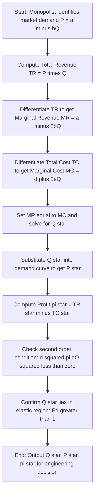
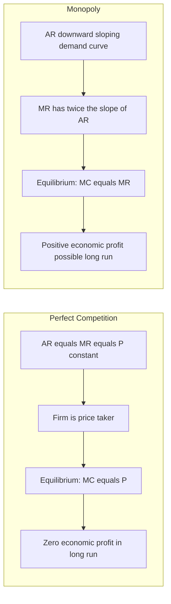
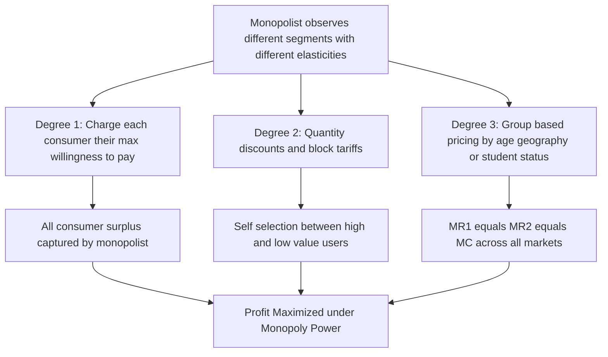
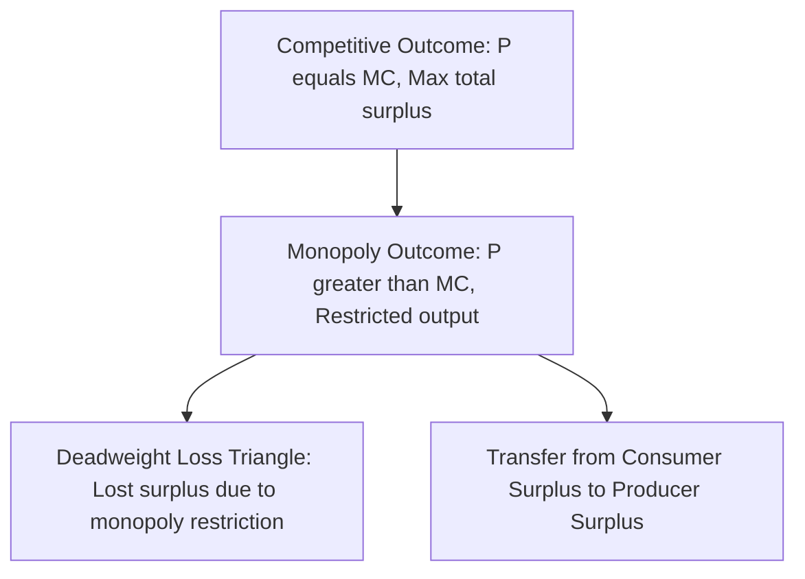

# Monopoly

<!-- SECTION_1_START -->

# Monopoly — The Single Seller's Domain

## 1.1 Formal Definition (KTU 2024 Scheme Terminology)

> [!IMPORTANT]
> **Monopoly** is a market structure characterized by the presence of a **single seller** (the *monopolist*) producing a commodity that has **no close substitutes**, and the entry of new firms into the industry is completely **blocked** by legal, technological, or economic barriers.

In the context of **Economics for Engineers (UCHUT346)**, monopoly is studied not as a mere theoretical construct but as a *pricing-and-cost optimization model* that engineers encounter in real industries — for example, **electricity distribution boards (KSEB in Kerala)**, **railway networks (Indian Railways)**, and **patent-protected pharmaceutical products**.

Mathematically, the monopolist faces the **market demand curve itself**, since there are no competitors. Hence, the firm *is* the industry.

$$P = f(Q) \quad \text{(Inverse Demand Function)}$$

where the demand function is typically taken as:

$$P = a - bQ \quad \text{with} \quad a > 0, \; b > 0$$

---

## 1.2 Intuitive Analogy — The Desert Wells Story

> [!NOTE]
> **Imagine a small town built in the middle of a desert.** The only well from which water can be drawn belongs to *one person* — Ravi. The well is deep, and the cost of digging a competing well is astronomically high. The town's people *must* buy water from Ravi, or they will not survive. Ravi, knowing this, decides how much water to supply each day and at what price.

> **Ravi = The Monopolist**
> **Water = The commodity (no close substitute)**
> **Deep well = The barrier to entry (economies of scale)**
> **Townspeople's necessity = Inelastic demand**

The story captures the **three pillars** of monopoly:

1. **Sole seller** — Ravi alone supplies the good.
2. **No substitutes** — There is no bottled water, no river, no rain.
3. **High entry barrier** — Digging another well is prohibitively expensive.

Engineers recognize this immediately: **KSEB (Kerala State Electricity Board) operates much like Ravi's well** — a single regional supplier of electricity, a regulatory entry barrier, and an essential good with inelastic demand.

---

## 1.3 Key Characteristics Checklist (KTU Board-Standard)

| # | Characteristic | Description |
|---|----------------|-------------|
| 1 | **Single Seller** | One firm dominates the entire market output. |
| 2 | **No Close Substitutes** | The product is unique; alternatives do not exist. |
| 3 | **Entry Barriers** | Legal (patents, licenses), natural (resource control), or technological (economies of scale). |
| 4 | **Price Maker** | The monopolist sets price by choosing output level. |
| 5 | **Downward-Sloping Demand Curve (AR curve)** | To sell more, the monopolist *must* lower price. |
| 6 | **AR > MR** | Because the monopolist must reduce price on *all* units to sell an additional unit. |

---

## 1.4 Why Engineers Study Monopoly

> [!IMPORTANT]
> **KTU Syllabus Highlight (Module 2 — Cost Concepts):**
> A monopolist's decision-making revolves around **marginal cost (MC)**, **marginal revenue (MR)**, and **average revenue (AR)**. Engineers — particularly those in **production, operations, and industrial engineering** — must understand how monopoly pricing influences **product costing, transfer pricing, project valuation, and capital budgeting** decisions.

Real-world engineering instances where monopoly logic is applied:
- **Patent licensing** (e.g., a single pharma company holds a 20-year drug patent).
- **Software platforms** with network effects (e.g., Microsoft Windows in the 1990s).
- **Public utility pricing** (water, electricity, gas distribution in India).
- **Semiconductor fabrication** (a single fab in a region for advanced chips).

<!-- SECTION_1_END -->

<!-- SECTION_2_START -->

# Deep Theoretical Analysis & KTU High-Yield Formula Sheet

## 2.1 The Three Revenue Curves of a Monopolist

Under perfect competition, the firm is a *price taker* — its **AR = MR = Price**. But under monopoly, the firm faces a *downward-sloping demand curve*, which means:

$$\text{Average Revenue (AR)} = \text{Price (P)} = \text{Demand curve}$$

$$\text{Marginal Revenue (MR)} = \frac{d(TR)}{dQ}$$

When demand is **linear**: $P = a - bQ$

**Total Revenue**:
$$TR = P \times Q = (a - bQ)Q = aQ - bQ^2$$

**Marginal Revenue** (derivative of TR w.r.t. Q):
$$MR = \frac{d(TR)}{dQ} = a - 2bQ$$

**Key Numerical Observation**:
- $AR = a - bQ$
- $MR = a - 2bQ$

This means **MR has the same intercept ($a$) as AR, but twice the slope ($2b$ instead of $b$)**. Geometrically, the MR curve lies *exactly halfway* between the AR curve and the vertical axis.

---

## 2.2 Equilibrium of the Monopolist — Profit Maximization

A rational monopolist chooses the output level $Q^*$ at which:

$$MR = MC \quad \text{(Profit Maximization Condition — First Order Condition)}$$

and the second-order condition is:

$$\frac{d(MR)}{dQ} < \frac{d(MC)}{dQ} \quad \text{or simply} \quad \frac{d^2(TR - TC)}{dQ^2} < 0$$

Once $Q^*$ is determined, the **price $P^*$** is read off the demand curve (not the MR curve) at $Q^*$.

> [!IMPORTANT]
> **CRITICAL KTU BOARD POINT:**
> Many students write "$P^* = MR$" — this is **WRONG**.
> The correct procedure is:
> 1. Solve $MR = MC$ to find $Q^*$.
> 2. Substitute $Q^*$ into the *demand* equation $P = a - bQ$ to find $P^*$.

---

## 2.3 KTU Formula Sheet / Cheat Sheet

> [!NOTE]
> **Use this table as your last-minute revision reference before the exam.**

| # | Concept | Formula | Explanation |
|---|---------|---------|-------------|
| 1 | Linear Demand | $P = a - bQ$ | Inverse demand with intercept $a$, slope $-b$. |
| 2 | Total Revenue | $TR = aQ - bQ^2$ | Revenue earned by selling $Q$ units. |
| 3 | Average Revenue | $AR = P = a - bQ$ | Same as demand curve. |
| 4 | Marginal Revenue | $MR = a - 2bQ$ | Slope is twice the AR slope. |
| 5 | Total Cost | $TC = FC + VC(Q)$ | Fixed + Variable cost. |
| 6 | Marginal Cost | $MC = \frac{d(TC)}{dQ}$ | Cost of producing one extra unit. |
| 7 | Profit Function | $\pi = TR - TC$ | Economic profit (could be negative). |
| 8 | Profit Max. Condition | $MR = MC$ | First-order necessary condition. |
| 9 | Profit Max. Output | Solve $MR = MC$ for $Q$ | Step 1 of the procedure. |
| 10 | Profit Max. Price | $P^* = a - bQ^*$ | Substitute $Q^*$ into demand. |
| 11 | Maximum Profit | $\pi^* = (P^* - AC^*) \times Q^*$ | Where $AC = \frac{TC}{Q}$. |
| 12 | Price Elasticity of Demand | $E_d = \frac{dQ}{dP} \cdot \frac{P}{Q}$ | Used to identify elastic/inelastic ranges. |
| 13 | MR from Elasticity | $MR = P \left(1 - \frac{1}{\vert E_d \vert}\right)$ | Inverse relationship with elasticity. |
| 14 | Elastic Demand | $\vert E_d \vert > 1$ | MR $> 0$, raising $Q$ raises $TR$. |
| 15 | Inelastic Demand | $\vert E_d \vert < 1$ | MR $< 0$, raising $Q$ reduces $TR$. |
| 16 | Unit Elastic | $\vert E_d \vert = 1$ | MR $= 0$, $TR$ at maximum. |
| 17 | Degree of Monopoly Power | $\text{Lerner Index} = \frac{P - MC}{P} = \frac{1}{\vert E_d \vert}$ | Measures market power. |
| 18 | Profit Margin | $\text{Markup} = \frac{P - MC}{MC}$ | Proportional markup over MC. |
| 19 | Consumer Surplus | $CS = \tfrac{1}{2}(a - P^*) \cdot Q^*$ | Welfare measure. |
| 20 | Producer Surplus | $PS = \text{Area above MC, below } P^*$ | Welfare measure. |

> **Never write $\vert x \vert$ inside a markdown table row.** Use `\vert` or `\mid` to avoid breaking syntax.

---

## 2.4 The Monopolist's Pricing Rule in Words

A monopolist never produces in the **inelastic portion** of the demand curve. Why?

$$MR = P \left(1 - \frac{1}{\vert E_d \vert}\right)$$

- If $\vert E_d \vert < 1$, then MR is negative, and producing more *reduces* revenue.
- If $\vert E_d \vert = 1$, then MR $= 0$ — revenue is at its maximum.
- If $\vert E_d \vert > 1$, then MR is positive — revenue is still increasing.

The profit-maximizing point is where $MR = MC > 0$, which forces $\vert E_d \vert > 1$ at equilibrium. The monopolist **always operates on the elastic portion** of the demand curve.

---

## 2.5 Real-World Engineering Utility

| Industry / Domain | Monopoly Feature | Engineer's Role |
|-------------------|------------------|-----------------|
| **Electricity distribution (KSEB)** | Natural monopoly due to huge grid infrastructure. | Demand forecasting, tariff engineering, load management. |
| **Pharma patents** | Legal monopoly for 20 years. | R\&D cost recovery pricing, generic entry forecasting. |
| **Railway networks (IR)** | Geographic monopoly on routes. | Capacity planning, marginal cost pricing for unreserved seats. |
| **Semiconductor fabs** | Technological monopoly at advanced nodes (e.g., 3 nm). | Capital cost recovery, depreciation models, break-even analysis. |
| **Cloud infrastructure (early AWS)** | First-mover economies of scale. | Capex vs. Opex analysis, long-run marginal cost pricing. |

<!-- SECTION_2_END -->

<!-- SECTION_3_START -->

# Step-by-Step Derivations & Numerical Implementation

## 3.1 Generic Equilibrium Derivation (The Full Chain)

Let the demand function be:

$$P = a - bQ \quad (a, b > 0)$$

Let the total cost function be:

$$TC = c + dQ + eQ^2 \quad (c, d, e > 0)$$

where $c$ is fixed cost, $d$ is the marginal cost intercept, and $e$ is the quadratic cost coefficient.

### Step 1 — Write Total Revenue

$$TR = P \cdot Q = (a - bQ)Q = aQ - bQ^2$$

### Step 2 — Compute Marginal Revenue

$$MR = \frac{d(TR)}{dQ} = a - 2bQ$$

### Step 3 — Compute Marginal Cost

$$MC = \frac{d(TC)}{dQ} = d + 2eQ$$

### Step 4 — Apply the Profit Maximization Condition

$$MR = MC$$
$$a - 2bQ = d + 2eQ$$

### Step 5 — Solve for Equilibrium Quantity $Q^*$

Bring all $Q$ terms to one side:

$$a - d = 2bQ + 2eQ$$
$$a - d = 2Q(b + e)$$
$$Q^* = \frac{a - d}{2(b + e)}$$

### Step 6 — Solve for Equilibrium Price $P^*$

Substitute $Q^*$ into the demand curve (NOT the MR curve):

$$P^* = a - b \cdot Q^* = a - b \cdot \frac{a - d}{2(b + e)}$$

Simplify:

$$P^* = \frac{2a(b + e) - b(a - d)}{2(b + e)}$$
$$P^* = \frac{2ab + 2ae - ab + bd}{2(b + e)}$$
$$P^* = \frac{ab + 2ae + bd}{2(b + e)}$$

### Step 7 — Compute Maximum Profit $\pi^*$

$$\pi^* = (P^* - AC^*) \cdot Q^*$$
$$AC^* = \frac{TC(Q^*)}{Q^*} = \frac{c + dQ^* + e(Q^*)^2}{Q^*}$$

### Step 8 — Second-Order Confirmation (Concavity Check)

$$\frac{d^2 \pi}{dQ^2} = \frac{d(MR - MC)}{dQ} = -2b - 2e < 0$$

Since this is strictly negative, $Q^*$ is a **maximum** (not a minimum).

---

## 3.2 Worked Numerical Example (KTU Board-Style)

> [!NOTE]
> **The example below mirrors a typical KTU 14-mark question structure.**

**Problem:**
A monopolist faces the demand function $P = 100 - 2Q$ and has the total cost function $TC = 50 + 10Q + Q^2$.
Find:
1. Profit-maximizing price and output.
2. Maximum profit.
3. Elasticity of demand at the equilibrium point.
4. Consumer surplus.

### Solution

**Step 1 — Derive TR, MR, MC.**

$$TR = (100 - 2Q)Q = 100Q - 2Q^2$$
$$MR = 100 - 4Q$$
$$MC = \frac{d(TC)}{dQ} = 10 + 2Q$$

**Step 2 — Set MR = MC and solve.**

$$100 - 4Q = 10 + 2Q$$
$$100 - 10 = 4Q + 2Q$$
$$90 = 6Q$$
$$Q^* = 15 \text{ units}$$

**Step 3 — Find $P^*$ from the demand curve.**

$$P^* = 100 - 2(15) = 100 - 30 = 70$$

**Step 4 — Compute Maximum Profit.**

$$TR^* = 70 \times 15 = 1050$$
$$TC^* = 50 + 10(15) + (15)^2 = 50 + 150 + 225 = 425$$
$$\pi^* = 1050 - 425 = 625$$

**Step 5 — Compute Elasticity at $Q^* = 15$.**

$$E_d = \frac{dQ}{dP} \cdot \frac{P}{Q}$$

From $P = 100 - 2Q$, we have $Q = 50 - \frac{P}{2}$, so $\frac{dQ}{dP} = -\frac{1}{2}$.

$$E_d = \left(-\frac{1}{2}\right) \cdot \frac{70}{15} = -\frac{70}{30} = -\frac{7}{3} \approx -2.33$$

$$\vert E_d \vert = 2.33 > 1 \quad \text{(Elastic — confirms equilibrium is in the elastic region)}$$

**Step 6 — Compute Consumer Surplus.**

The demand curve hits the price axis at $P = 100$ when $Q = 0$.

$$CS = \frac{1}{2}(a - P^*) \cdot Q^* = \frac{1}{2}(100 - 70)(15) = \frac{1}{2}(30)(15) = 225$$

**Summary of Results:**

| Variable | Value |
|----------|-------|
| $Q^*$ | 15 units |
| $P^*$ | 70 per unit |
| $\pi^*$ | 625 |
| $\vert E_d \vert$ | 2.33 |
| Consumer Surplus | 225 |

---

## 3.3 Price Discrimination Under Monopoly (Derivations)

A monopolist with market power may charge different prices to different groups of customers to maximize profit. The three degrees of price discrimination (Pigou's classification):

### First-Degree (Perfect) Price Discrimination
The monopolist extracts **all** consumer surplus by charging each consumer their maximum willingness to pay.

- Demand curve becomes the **MR curve** of the monopolist.
- Deadweight loss = 0.
- Output rises to the **socially efficient** level (where $P = MC$).

### Second-Degree Price Discrimination (Quantity Discounts / Block Pricing)
The monopolist offers *quantity-based price breaks*. Examples:
- **Two-part tariff** in telecom: $T = A + pQ$, where $A$ is the fixed access fee and $p$ is the per-unit price.
- **Bulk discounts** in industrial procurement.

### Third-Degree Price Discrimination (Group-Based Pricing)
Different groups face different prices based on their elasticity. Examples:
- Student discounts at software companies.
- Senior citizen discounts.
- Geographic pricing (different states, different countries).

**Profit maximization condition for each market segment $i$:**

$$MR_i = MC \quad \text{for all } i$$

But since the segments are linked, the condition becomes:

$$MR_1 = MR_2 = \cdots = MR_n = MC$$

This is the *equimarginal principle* applied to revenue.

---

## 3.4 Python Symbolic Implementation (Optional Reference)

```python
from sympy import symbols, diff, solve, Rational

# Define variables
Q, a, b, c, d, e = symbols('Q a b c d e', positive=True, real=True)

# Demand and cost functions
P = a - b*Q
TR = P * Q
TC = c + d*Q + e*Q**2

# Marginal functions
MR = diff(TR, Q)
MC = diff(TC, Q)

print("TR =", TR.expand())
print("MR =", MR)
print("MC =", MC)

# Solve MR = MC
Q_star = solve(MR - MC, Q)[0]
print("Q* =", Q_star)

# Price at equilibrium
P_star = P.subs(Q, Q_star)
P_star_simplified = P_star.simplify()
print("P* =", P_star_simplified)

# Maximum profit
profit = (TR - TC).subs(Q, Q_star).simplify()
print("Max profit =", profit)
```

**Expected output (analytical):**

$$Q^* = \frac{a - d}{2(b + e)}$$

$$P^* = \frac{ab + 2ae + bd}{2(b + e)}$$

These match the symbolic derivation in **Section 3.1** step-by-step.

<!-- SECTION_3_END -->

<!-- SECTION_4_START -->

# Structural Diagrams & Schematics

## 4.1 Monopoly Decision-Making Flow (Mermaid)



## 4.2 Comparison: Monopoly vs. Perfect Competition (Mermaid)



## 4.3 Price Discrimination Topology (Mermaid)



## 4.4 Welfare Effects Block Diagram (Mermaid)



> [!IMPORTANT]
> **Note on Mermaid Node Names:** All node IDs above are alphanumeric and prefixed with letters (e.g., `nodeA`, `pcA`, `moA`, `pdA`). No reserved keywords such as `end`, `subgraph`, `graph`, or `style` have been used as standalone node identifiers. All node labels are wrapped in double quotes to avoid parsing errors.

<!-- SECTION_4_END -->

<!-- SECTION_5_START -->

# KTU 2024 Scheme Examination Question Bank & Topic Recap

> [!NOTE]
> All questions below are **simulated KTU past-year style** questions aligned with the **2024 Scheme** regulations. Each is tagged with its **Course Outcome (CO)** and **Revised Bloom's Taxonomy (RBT)** cognitive level as required by KTU.

---

## Part A — Short Answer Questions (3 Marks Each)

### Question 1 (3 Marks) `[KTU University Exam – July 2023]`
**CO2 | RBT Level: Understand**

> **"Define monopoly and explain any three of its key features."**

**Model Answer:**

A market is said to be a **monopoly** when there is a single seller of a product that has no close substitutes, and entry of new firms is blocked by certain barriers.

**Three key features:**

1. **Single seller:** The entire market output is supplied by one firm. The firm *is* the industry.
2. **No close substitutes:** The product is unique in characteristics, location, or branding — consumers cannot switch to alternatives.
3. **Entry barriers:** The entry of new firms is restricted by legal restrictions (patents, government licenses), natural conditions (control of a raw material), or economies of scale.

*For 3 marks:*
- *Definition — 1 mark*
- *Any three features with one-line explanation each — 2 marks (≈ 0.67 each, or 1 + 0.5 + 0.5 if three features are tightly explained).*

---

### Question 2 (3 Marks) `[KTU University Exam – Dec 2023]`
**CO2 | RBT Level: Remember**

> **"Why is AR greater than MR under monopoly?"**

**Model Answer:**

Under monopoly, the firm has to sell additional units only by reducing the price of the product. But the price reduction applies not only to the extra (marginal) unit but to **all previous units** as well.

Hence, the revenue gained from selling one more unit (MR) is less than the price (AR) at which it is sold.

Mathematically, if $P = a - bQ$, then:

$$AR = a - bQ \quad \text{while} \quad MR = a - 2bQ$$

Since $2bQ > bQ$, we have $AR > MR$ for all $Q > 0$.

*Valuation key:*
- *Conceptual reason (price reduction on all units) — 2 marks*
- *Mathematical illustration — 1 mark*

---

## Part B — Long Answer Questions (14 Marks Each, with Internal Choice)

### Question A (14 Marks) `[KTU University Exam – Dec 2023]`
**CO2, CO3 | RBT Levels: Understand (part a) + Apply (part b)**

> **A monopolist faces the demand function $P = 200 - 4Q$ and the cost function $TC = 20 + 20Q + 2Q^2$.**
>
> **(a) [7 Marks]** Derive the profit-maximizing price and quantity for the monopolist. State the condition for profit maximization.
>
> **(b) [7 Marks]** Calculate the maximum profit, the price elasticity of demand at the equilibrium, and interpret what the elasticity value implies about the firm's market power.

---

#### Part (a) — Model Solution [7 Marks]

**Step 1 — Identify the revenue and cost functions.** *(0.5 Marks)*

$$TR = P \cdot Q = (200 - 4Q)Q = 200Q - 4Q^2$$
$$TC = 20 + 20Q + 2Q^2$$

**Step 2 — Compute MR and MC.** *(1.5 Marks)*

$$MR = \frac{d(TR)}{dQ} = 200 - 8Q$$
$$MC = \frac{d(TC)}{dQ} = 20 + 4Q$$

**Step 3 — State the profit-maximization condition.** *(1 Mark)*

> The monopolist maximizes profit where **MR = MC**, subject to the second-order concavity condition.

**Step 4 — Solve $MR = MC$ for $Q^*$.** *(2 Marks)*

$$200 - 8Q = 20 + 4Q$$
$$200 - 20 = 8Q + 4Q$$
$$180 = 12Q$$
$$Q^* = 15 \text{ units}$$

**Step 5 — Substitute $Q^*$ into demand to get $P^*$.** *(2 Marks)*

$$P^* = 200 - 4(15) = 200 - 60 = 140$$

**Answer:** Profit-maximizing quantity is **15 units** and price is **140 per unit**.

---

#### Part (b) — Model Solution [7 Marks]

**Step 1 — Compute TR\*, TC\*, and maximum profit.** *(2 Marks)*

$$TR^* = 140 \times 15 = 2100$$
$$TC^* = 20 + 20(15) + 2(15)^2 = 20 + 300 + 450 = 770$$
$$\pi^* = 2100 - 770 = 1330$$

**Step 2 — Compute price elasticity of demand at equilibrium.** *(2.5 Marks)*

From $P = 200 - 4Q$, we get $Q = 50 - \frac{P}{4}$, so $\frac{dQ}{dP} = -\frac{1}{4}$.

$$E_d = \frac{dQ}{dP} \cdot \frac{P}{Q} = \left(-\frac{1}{4}\right) \cdot \frac{140}{15} = -\frac{140}{60} = -\frac{7}{3} \approx -2.33$$

$$\vert E_d \vert = 2.33$$

**Step 3 — Interpretation — Lerner Index and market power.** *(2.5 Marks)*

Since $\vert E_d \vert = 2.33 > 1$, the firm operates in the **elastic** portion of the demand curve. The **Lerner Index** of market power is:

$$L = \frac{1}{\vert E_d \vert} = \frac{1}{2.33} \approx 0.43$$

This means the firm can set its price **43% above marginal cost** — a strong indicator of monopoly power.

**Valuation Key Points:**
- *[Computing TR and TC correctly: 1 Mark]*
- *[Profit calculation: 1 Mark]*
- *[Elasticity derivation with correct signs: 1.5 Marks]*
- *[Numerical evaluation: 1 Mark]*
- *[Lerner Index and market power interpretation: 2.5 Marks]*

---

### Question B (14 Marks — Alternative) `[KTU University Exam – July 2024]`
**CO2, CO4 | RBT Levels: Understand (part a) + Apply (part b)**

> **(a) [7 Marks]** Explain the **three degrees of price discrimination** under monopoly with suitable real-world engineering/industry examples.
>
> **(b) [7 Marks]** A power distribution company (KSEB-like monopoly) serves two consumer segments:
> - Segment 1 (Domestic): $P_1 = 60 - Q_1$
> - Segment 2 (Industrial): $P_2 = 100 - 2Q_2$
>
> The common marginal cost is $MC = 10 + Q$, where $Q = Q_1 + Q_2$.
>
> Find the profit-maximizing prices and quantities in each segment.

---

#### Part (a) — Model Solution [7 Marks]

| Degree | Description | Real-World Engineering Example |
|--------|-------------|-------------------------------|
| **First Degree** (Perfect) | Seller charges each consumer their maximum willingness to pay. All consumer surplus is captured. | Personalized medical device pricing negotiated individually with hospitals. |
| **Second Degree** (Quantity-Based) | Price varies with quantity purchased; consumer self-selects. | Block-rate electricity tariffs (e.g., first 100 units at 5, next 100 at 7). |
| **Third Degree** (Group-Based) | Different prices to different identifiable groups based on elasticity. | Student vs. professional license of CAD software (AutoCAD). |

*Valuation Key Points:*
- *[Naming and explaining each degree: 1.5 Marks each = 4.5 Marks]*
- *[One industry/engineering example per degree: 0.5 Mark each = 1.5 Marks]*
- *[Conclusion that price discrimination requires market power + ability to prevent resale: 1 Mark]*

---

#### Part (b) — Model Solution [7 Marks]

**Step 1 — Write MR for each segment.** *(1 Mark)*

$$TR_1 = 60Q_1 - Q_1^2 \quad \Rightarrow \quad MR_1 = 60 - 2Q_1$$
$$TR_2 = 100Q_2 - 2Q_2^2 \quad \Rightarrow \quad MR_2 = 100 - 4Q_2$$

**Step 2 — Write the MC function in terms of $Q_1$ and $Q_2$.** *(0.5 Marks)*

$$MC = 10 + Q_1 + Q_2$$

**Step 3 — Apply the equimarginal condition $MR_1 = MR_2 = MC$.** *(1.5 Marks)*

Set $MR_1 = MR_2$:

$$60 - 2Q_1 = 100 - 4Q_2$$
$$2Q_1 = -40 + 4Q_2$$
$$Q_1 = -20 + 2Q_2 \quad \cdots \text{(i)}$$

**Step 4 — Equate $MR_2$ to $MC$.** *(1 Mark)*

$$100 - 4Q_2 = 10 + Q_1 + Q_2$$
$$90 - 4Q_2 = Q_1 + Q_2$$
$$Q_1 = 90 - 5Q_2 \quad \cdots \text{(ii)}$$

**Step 5 — Solve (i) and (ii) simultaneously.** *(2 Marks)*

$$-20 + 2Q_2 = 90 - 5Q_2$$
$$7Q_2 = 110$$
$$Q_2 = 15.71 \text{ (approx)}$$

Substitute back:

$$Q_1 = 90 - 5(15.71) = 90 - 78.57 = 11.43$$

**Step 6 — Compute equilibrium prices.** *(1 Mark)*

$$P_1 = 60 - 11.43 = 48.57$$
$$P_2 = 100 - 2(15.71) = 68.57$$

**Answer:**

| Segment | Quantity | Price |
|---------|----------|-------|
| Domestic | ~11.43 units | ~48.57 |
| Industrial | ~15.71 units | ~68.57 |

*Valuation Key Points:*
- *[Writing MR functions correctly: 1 Mark]*
- *[Forming the equimarginal system: 1.5 Marks]*
- *[Solving for Q1 and Q2: 2 Marks]*
- *[Substituting back to get P1 and P2: 1.5 Marks]*
- *[Final conclusion / table: 1 Mark]*

---

## KTU Examiner's Valuation Warning / Pitfall Callout

> [!WARNING]
> **Common Mistakes That Cost Marks in the KTU Board Exam:**
>
> 1. **DO NOT confuse MR with Price.** The equilibrium price is read from the **demand curve**, not the MR curve. Writing $P^* = MR^*$ will fetch **0 marks** for the price-finding step.
> 2. **Always state the second-order condition** $\frac{d^2\pi}{dQ^2} < 0$ in part (a) derivations — it carries **0.5 to 1 mark** explicitly.
> 3. **Sign convention for elasticity:** Write $E_d$ with a **negative sign** (since demand slopes downward), and report $\vert E_d \vert$ separately when commenting on elasticity.
> 4. **Block the boundary in price-discrimination problems.** Always note the assumption that **resale between markets is impossible** — otherwise the model collapses.
> 5. **Numerical rounding:** If the question says "up to 2 decimal places", do not write 6-digit decimals. KTU deducts marks for clumsy rounding.
> 6. **In MC = MR problems, do not forget to substitute $Q^*$ into the *original demand equation*, not the MR equation.** This is the single most common error.
> 7. **Label your diagrams** — even a hand-drawn AR–MR–MC graph with a clearly marked equilibrium point (with dashed lines down to the axes) earns easy **1–2 marks** if you sketch one.

---

## Topic Recap & Important Things to Remember

> [!IMPORTANT]
> **Rapid Revision Checklist — Monopoly (UCHUT346, Module 2)**

- **Definition (RBT: Remember):** Monopoly = single seller + no close substitutes + blocked entry.
- **Three Pillars of Monopoly:** Sole seller, unique product, high entry barrier.
- **Demand & Revenue:**
  - $AR = P = a - bQ$
  - $MR = a - 2bQ$ (twice the slope of AR for linear demand)
- **Equilibrium Conditions (RBT: Apply):**
  - $MR = MC$ (First-order necessary condition)
  - $\frac{d^2\pi}{dQ^2} < 0$ (Second-order sufficient condition for maximum)
- **Procedure (must follow in this exact order):**
  1. Compute MR and MC.
  2. Solve $MR = MC$ for $Q^*$.
  3. Substitute $Q^*$ into the **demand** curve to get $P^*$.
  4. Compute $\pi^* = TR^* - TC^*$.
- **Elasticity Link:**
  - $MR = P\left(1 - \frac{1}{\vert E_d \vert}\right)$
  - Equilibrium always occurs where $\vert E_d \vert > 1$ (elastic region).
- **Lerner Index (Market Power Measure):**
  - $L = \frac{P - MC}{P} = \frac{1}{\vert E_d \vert}$
  - $L \to 0$: perfect competition.
  - $L \to 1$: pure monopoly.
- **Price Discrimination Degrees (Pigou's Classification):**
  - 1st degree: charge each consumer their WTP (perfect).
  - 2nd degree: quantity discounts / block tariffs.
  - 3rd degree: group-based pricing.
- **Equimarginal Rule for multi-segment monopoly:**
  - $MR_1 = MR_2 = \cdots = MC$ across all markets.
- **Welfare:** Monopoly creates **deadweight loss** because $P > MC$ restricts output below the socially optimal level.
- **Real-World Engineering Instances:** KSEB (electricity), Indian Railways, patented drugs, semiconductor fabs, network-effect software.
- **Engineering Cost Insight:** A monopolist's profit-maximizing price is set so that the **Lerner markup** over marginal cost covers both the fixed cost (R\&D, infra) and the desired return on capital.

<!-- SECTION_5_END -->
