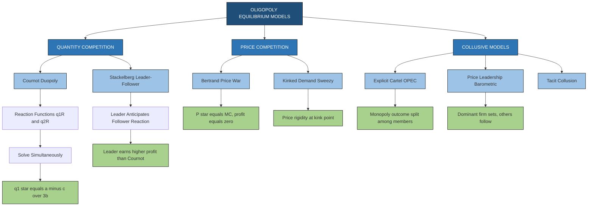
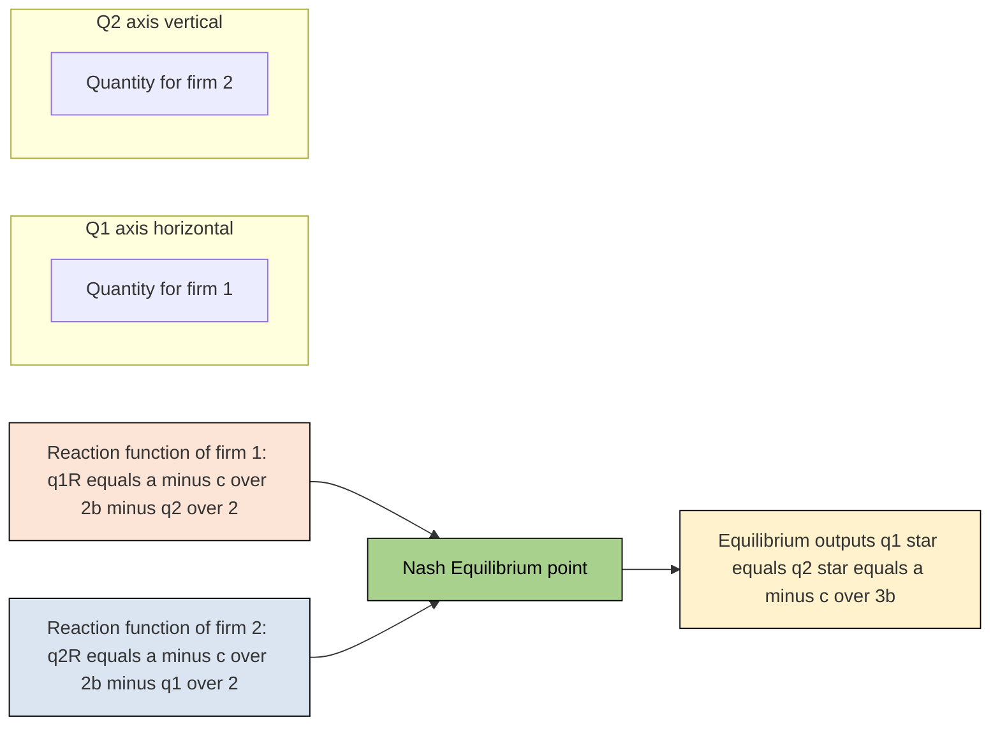
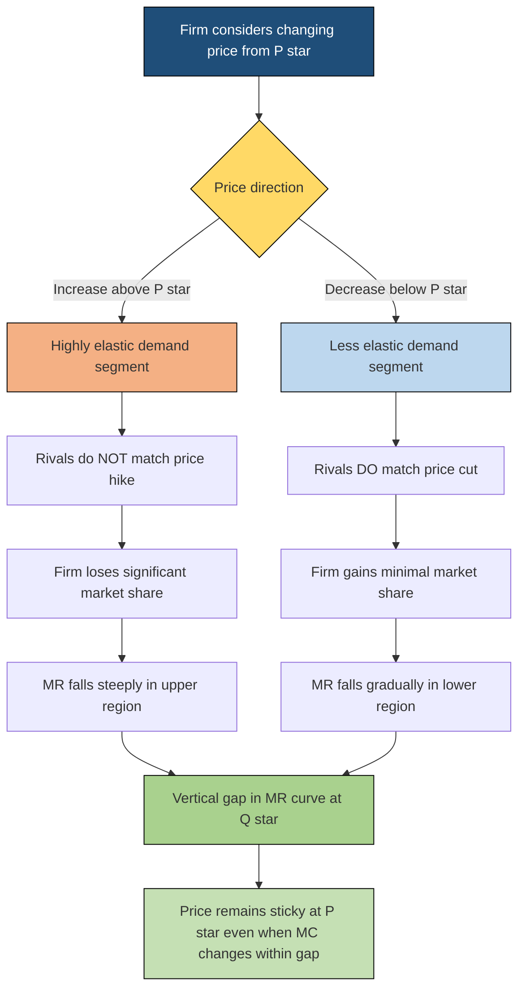
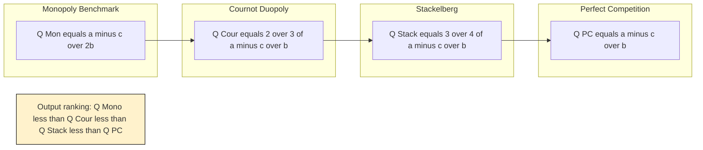

# Oligopoly (features and equilibrium of a firm)

<!-- SECTION_1_START -->

# Oligopoly — Market Structure with Strategic Interdependence

> [!IMPORTANT]
> **KTU 2024 Scheme | UCHUT346 | Module 2 | Course Outcome Mapping: CO3 (Apply micro-economic principles to engineering business decisions)**

## 1.1 Formal Academic Definition

**Oligopoly** is a market structure dominated by a *small number of large firms* (typically between **2 and 10** sellers) producing either *homogeneous* or *differentiated* products, where the strategic decision of **one firm significantly affects and is affected by** the decisions of rival firms.

Mathematically, the profit function of firm $i$ is:
$$\pi_i = P(Q) \cdot q_i - C_i(q_i)$$

where the market price $P$ is a function of **total industry output** $Q = \sum_{j=1}^{n} q_j$ for $n$ small, and crucially, firm $i$ assumes that its rival's output $q_j$ is **endogenous and reactive**.

> [!NOTE]
> **Why Oligopoly matters in Engineering Economics:** Industries that engineers typically work in — **semiconductors (Intel-AMD), commercial aviation (Boeing-Airbus), telecom (Jio-Airtel-VI), oil refining (Reliance-BPCL-HPCL), and automobile manufacturing (Maruti-Hyundai-Tata)** — are textbook oligopolies. Understanding price-output dynamics in these structures is essential for cost-volume-profit decisions in real engineering projects.

## 1.2 Conceptual Analogy — Plain English Intuition

> [!TIP]
> **Analogy: "Chess on a Small Board"**
> Imagine **3 chess grandmasters** playing simultaneously on the same board (instead of the usual 2). Each player knows that *whatever move he makes, the other two will respond strategically*. None of them can ignore the others.
> - In **Perfect Competition** → thousands of small chess games, each player is invisible. No one cares about your move.
> - In **Monopoly** → one grandmaster plays alone against the board itself.
> - In **Oligopoly** → only a **few grandmasters**, and **every single move is watched and countered**.

**Real-life feel:** When **Reliance Jio** slashed 4G tariffs in 2016, **Airtel, Vodafone-Idea, and BSNL** were *forced* to match or undercut — Jio's move directly reshaped the rivals' profit curves. That is **interdependence** in action.

## 1.3 Key Distinguishing Trait: Interdependence

Unlike other market forms, in oligopoly the firm cannot treat demand as given. The **demand curve perceived by an oligopolist is conjectural** — it depends on what *it assumes* its rivals will do.

| Parameter | Monopoly | Perfect Competition | Monopolistic Competition | **Oligopoly** |
|---|---|---|---|---|
| Number of firms | **One** | Very large | Many | **Few (2–10)** |
| Product nature | Unique | Homogeneous | Differentiated | **Either** |
| Barriers to entry | **Absolute** | None | Low | **Very high** |
| Price control | Full | None | Some | **Mutual/Strategic** |
| Demand curve slope | Downward | Perfectly elastic | Downward | **Conjectural/Kinked** |

> [!IMPORTANT]
> **Standard Metric used by Industry Regulators:** The **Concentration Ratio (CR4 or CR8)** measures the combined market share of the top 4 or 8 firms. A market with **CR4 > 60%** is officially classified as an oligopoly by the U.S. Department of Justice Guidelines. In India, the **Competition Commission of India (CCI)** uses the **Herfindahl-Hirschman Index (HHI)**:
> $$HHI = \sum_{i=1}^{n} s_i^2$$
> where $s_i$ is the percentage market share of firm $i$. **HHI > 2500** indicates a highly concentrated (oligopolistic) market.

## 1.4 Visualization Control — Kinked Demand Curve

> [!VISUALIZATION CONTROL]
> **Concept:** Kinked Demand Curve (Sweezy's Model) — the most iconic visual of oligopoly
>
> **Desmos / GeoGebra Equations to plot:**
> * For price **above** the kink point $P^*$: $D_{upper} : P = 140 - 2Q$  *(highly elastic)*
> * For price **below** the kink point $P^*$: $D_{lower} : P = 100 - 0.5Q$  *(less elastic)*
> * The kink occurs at intersection: solve $140 - 2Q = 100 - 0.5Q \Rightarrow Q^* = 26.67,\ P^* = 86.67$
>
> **Visual Description:** The student should observe that the demand curve **bends sharply** (a "kink") at the prevailing market price $P^*$. The corresponding **Marginal Revenue (MR) curve has a vertical discontinuity (gap)** at the kink quantity $Q^*$. This gap is critical — it explains **price rigidity** in oligopolistic markets.

<!-- SECTION_1_END -->

<!-- SECTION_2_START -->

# SECTION 2 — Deep Theoretical Analysis & High-Yield Formula Sheet

## 2.1 Defining Features of Oligopoly (Board-Exam Favourites)

> [!NOTE]
> The following **8 features** are the **core answer set** for any "Features of Oligopoly" question in KTU exams. Memorize them in this exact order.

1. **Few Sellers (Mutual Interdependence):** Each firm's actions have a noticeable impact on rivals. No firm can afford to ignore competitors' moves.
2. **High Barriers to Entry:** Patents, large capital requirements, control over raw materials, government licensing (e.g., telecom spectrum auctions) prevent new firms from entering.
3. **Product Nature — Homogeneous or Differentiated:** *Pure oligopoly* (steel, aluminum) vs *Differentiated oligopoly* (cars, mobile phones).
4. **Price Rigidity (Sticky Prices):** Once a price is set, it tends to remain stable, even when costs or demand change — explained best by the **kinked demand curve**.
5. **Non-Price Competition:** Since price wars are destructive, firms compete through **advertising, branding, after-sales service, R\&D, product features** (think Apple vs Samsung).
6. **Selling Costs are High:** Massive advertising budgets (Coca-Cola spends billions annually on marketing).
7. **Indeterminate Demand Curve:** Because of conjectural interdependence, there is **no single, well-defined demand curve** — different assumptions give different models (Cournot, Bertrand, Stackelberg, Sweezy).
8. **Group Behavior (Tacit Collusion):** Firms often act *as if* they were a single monopoly — formal cartels (OPEC) or tacit price leadership.

## 2.2 Models of Oligopoly Equilibrium — Master Comparison

| **Model** | **Strategic Variable** | **Rivals' Assumption** | **Key Result** | **Real-World Fit** |
|---|---|---|---|---|
| **Cournot (1838)** | Quantity | Rival's output is *fixed* | $q_1 = q_2 = \frac{a}{3b}$ each; $P = \frac{a}{3}$ | Spring water, commodity duopolies |
| **Bertrand (1883)** | Price | Rival's price is *fixed* | $P = MC$ (price war collapse) | Retail gasoline, airlines |
| **Stackelberg (1934)** | Quantity | Leader moves first, follower reacts | Leader gets larger share | Hindalco vs Vedanta (aluminum) |
| **Sweezy / Kinked (1939)** | Price | Rival *matches* price cuts but *ignores* price hikes | Price rigidity at kink | Cement, FMCG |
| **Cartel / Collusion** | Joint quantity | Firms act *jointly* as monopoly | Monopoly output split | OPEC, international airlines IATA |
| **Price Leadership** | Price | Dominant firm sets, others follow | Barometric pricing | Indian 2-wheeler industry |

## 2.3 KTU High-Yield Formula Sheet

| **Formula** | **Symbol Meaning** | **Used In** |
|---|---|---|
| $P = a - bQ$ | Linear market demand, $Q = q_1 + q_2$ | All duopoly models |
| $q_1^{R} = \frac{a - c}{2b} - \frac{q_2}{2}$ | Firm 1's *reaction function* | Cournot |
| $q_1^* = q_2^* = \frac{a-c}{3b}$ | Cournot equilibrium output per firm | Cournot |
| $P_{Cournot} = \frac{a + 2c}{3}$ | Cournot equilibrium price | Cournot |
| $\pi_{Cournot}^{firm} = \frac{(a-c)^2}{9b}$ | Cournot profit per firm | Cournot |
| $P_{Bertrand} = c = MC$ | Bertrand competitive price | Bertrand |
| $\pi_{Bertrand} = 0$ | Zero economic profit | Bertrand |
| $q_{Leader}^{*} = \frac{a-c}{2b}$ | Stackelberg leader output | Stackelberg |
| $q_{Follower}^{*} = \frac{a-c}{4b}$ | Stackelberg follower output | Stackelberg |
| $HHI = \sum_{i=1}^{n} s_i^{2}$ | Market concentration measure | CCI/Regulators |
| $CR_k = \sum_{i=1}^{k} s_i$ | Top-$k$ firms' combined share | DOJ Guidelines |

> [!IMPORTANT]
> **Notation Note for Derivation:** In all subsequent derivations, $a$ = demand intercept, $b$ = demand slope, $c$ = marginal cost (assumed constant and equal for both firms), and $Q = q_1 + q_2$ (industry output). Always substitute **only after** writing the first-order condition.

## 2.4 Engineering & Real-World Utility

| **Engineering Context** | **Oligopoly Model Used** | **Practical Application** |
|---|---|---|
| Semiconductor fabs (TSMC, Intel) | Cournot / Stackelberg | Capacity planning, CAPEX decisions |
| Telecom spectrum bidding | Cartel behavior modelling | Auction price forecasting |
| Steel & cement pricing (India) | Kinked demand curve | Cost-volume-profit forecasting |
| Crude oil pricing | Cartel (OPEC+) | Strategic petroleum reserve decisions |
| E-commerce platform fees | Bertrand | Commission structure design |
| Electric vehicle battery market | Stackelberg | Leader-follower pricing (CATL vs LG) |

<!-- SECTION_2_END -->

<!-- SECTION_3_START -->

# SECTION 3 — Step-by-Step Derivations & Implementation

## 3.1 FULL DERIVATION — Cournot Duopoly Model

> [!NOTE]
> **Historical Note:** Antoine Augustin Cournot (1838) — a French mathematician — was the first to model strategic quantity competition. This is the **single most important derivation in oligopoly theory** and is **frequently asked in KTU exams for 7–14 marks**.

### Step 1: Set Up the Market Demand

Assume the **market demand function** is linear:
$$P = a - bQ, \quad Q = q_1 + q_2$$
where $P$ = price, $q_1, q_2$ = outputs of the two duopolists, $a, b$ are positive constants, with $a > c$ ensuring positive demand at zero price minus cost.

### Step 2: Write the Total Revenue of Firm 1

$$R_1 = P \cdot q_1 = (a - b(q_1 + q_2)) \cdot q_1$$

Expanding:
$$R_1 = a q_1 - b q_1^2 - b q_1 q_2$$

### Step 3: Compute Marginal Revenue of Firm 1

Differentiate $R_1$ with respect to $q_1$ (treating $q_2$ as constant — *Cournot's conjecture*):
$$\frac{\partial R_1}{\partial q_1} = a - 2b q_1 - b q_2$$

$$\boxed{MR_1 = a - 2b q_1 - b q_2}$$

> **Logic:** $MR_1$ depends on **both** $q_1$ (own output) **and** $q_2$ (rival's output) — this is the **mathematical essence of interdependence**.

### Step 4: Apply the Profit-Maximization Condition

Firm 1 maximizes profit: $\pi_1 = R_1 - C_1(q_1) = R_1 - c q_1$ (assuming constant $MC = c$).

First-order condition: $MR_1 = MC_1$
$$a - 2b q_1 - b q_2 = c$$

### Step 5: Derive Firm 1's Reaction Function

Solve for $q_1$:
$$2b q_1 = a - c - b q_2$$
$$\boxed{q_1^{R}(q_2) = \frac{a-c}{2b} - \frac{q_2}{2}}$$

This is **Firm 1's reaction (best-response) function** — it shows how much Firm 1 should produce *given* Firm 2 produces $q_2$.

### Step 6: By Symmetry, Firm 2's Reaction Function

Following identical logic for Firm 2:
$$\boxed{q_2^{R}(q_1) = \frac{a-c}{2b} - \frac{q_1}{2}}$$

### Step 7: Solve the Two Reaction Functions Simultaneously

By symmetry, the Cournot-Nash equilibrium requires $q_1 = q_2 = q^*$. Substitute:
$$q^* = \frac{a-c}{2b} - \frac{q^*}{2}$$
$$q^* + \frac{q^*}{2} = \frac{a-c}{2b}$$
$$\frac{3 q^*}{2} = \frac{a-c}{2b}$$
$$\boxed{q_1^* = q_2^* = \frac{a-c}{3b}}$$

### Step 8: Equilibrium Industry Output and Price

$$Q^* = q_1^* + q_2^* = \frac{2(a-c)}{3b}$$

$$P^* = a - b Q^* = a - b \cdot \frac{2(a-c)}{3b}$$
$$\boxed{P^* = \frac{a + 2c}{3}}$$

### Step 9: Equilibrium Profit Per Firm

$$\pi_i^* = (P^* - c) \cdot q_i^* = \left(\frac{a + 2c}{3} - c\right) \cdot \frac{a-c}{3b}$$
$$= \left(\frac{a - c}{3}\right) \cdot \left(\frac{a-c}{3b}\right)$$
$$\boxed{\pi_1^* = \pi_2^* = \frac{(a-c)^2}{9b}}$$

### Step 10: Validation Against Monopoly Benchmark

If both firms **colluded** (acted as a single monopolist), $MR = MC$ gives $Q_M = \frac{a-c}{2b}$ and $P_M = \frac{a+c}{2}$.
Comparing: $Q_{Cournot} = \frac{2(a-c)}{3b} > \frac{a-c}{2b} = Q_M$.

> **Interpretation:** Cournot duopoly produces **MORE than a cartel** (since firms undercut each other) but **LESS than perfect competition** (where $P = c$). The price lies between: $c < P_{Cournot} < P_{Monopoly} < P_{Perfect Comp.}$ but is a **mistake** — that is, it is the correct ordering.

### Numerical Example for Board Exam

> [!TIP]
> **Practice Problem Setup:** Let $P = 100 - 2Q$ and $MC = 10$ for both firms.
> * $q_1^* = q_2^* = \frac{100-10}{3 \cdot 2} = \frac{90}{6} = 15$ units
> * $Q^* = 30$ units
> * $P^* = 100 - 2(30) = 40$
> * $\pi_i^* = (40-10)(15) = 450$ per firm

---

## 3.2 Bertrand Model (Price Competition)

**Assumptions:** Homogeneous product, identical constant $MC = c$, firms compete on **price**.

**Logic:** If Firm 1 charges $P_1 > P_2 + \epsilon$, it loses the *entire* market to Firm 2 (since products are identical). The only stable price is:
$$\boxed{P_{Bertrand} = c = MC}$$
$$\boxed{\pi_{Bertrand} = 0}$$

> **Insight — The Bertrand Paradox:** With only **2 firms**, price competition collapses to **perfect competition outcomes**! This is why real-world oligopolists prefer **quantity competition** (Cournot) or **product differentiation** (avoiding direct price wars).

---

## 3.3 Stackelberg Duopoly (Leader–Follower)

**Assumption:** Firm 1 is the **leader**, chooses output first. Firm 2 (follower) observes $q_1$ and chooses $q_2^{R}(q_1) = \frac{a-c}{2b} - \frac{q_1}{2}$.

The leader **anticipates** this and substitutes into its own profit:
$$\pi_1 = (a - b q_1 - b q_2^{R}(q_1) - c) q_1$$

Substitute $q_2^{R} = \frac{a-c}{2b} - \frac{q_1}{2}$:
$$\pi_1 = \left(a - c - b q_1 - b \left[\frac{a-c}{2b} - \frac{q_1}{2}\right]\right) q_1$$
$$= \left(a - c - b q_1 - \frac{a-c}{2} + \frac{b q_1}{2}\right) q_1$$
$$= \left(\frac{a-c}{2} - \frac{b q_1}{2}\right) q_1$$

First-order condition:
$$\frac{d\pi_1}{dq_1} = \frac{a-c}{2} - b q_1 = 0$$

$$\boxed{q_1^{Leader} = \frac{a-c}{2b}}$$

Substitute into follower's reaction:
$$q_2^{Follower} = \frac{a-c}{2b} - \frac{1}{2} \cdot \frac{a-c}{2b} = \frac{a-c}{4b}$$

$$\boxed{q_1^{L} = \frac{a-c}{2b}, \quad q_2^{F} = \frac{a-c}{4b}}$$

> **Key Result:** The leader produces **twice** as much as the follower, captures a **larger profit**, and the leader's profit is **higher than in Cournot equilibrium**. This is the **first-mover advantage**.

---

## 3.4 Kinked Demand Curve — Sweezy's Price Rigidity

**Assumption (Conjectural Variation):**
* If the firm **raises** its price above $P^*$, rivals **do not follow** → the firm loses many customers → **highly elastic** demand above the kink.
* If the firm **lowers** its price below $P^*$, rivals **do follow** → the firm gains few customers → **less elastic** demand below the kink.

**Mathematical Form:**
$$D = \begin{cases} P = a - b_1 Q, & \text{for } P \geq P^* \quad (\text{elastic segment, large } b_1) \\ P = a' - b_2 Q, & \text{for } P < P^* \quad (\text{inelastic segment, small } b_2) \end{cases}$$

with $b_1 > b_2$.

**Resulting MR Curve:** The MR has **two segments** that drop vertically at $Q^*$, creating a **discontinuous gap**.
$$MR = \begin{cases} a - 2b_1 Q, & Q < Q^* \\ a' - 2b_2 Q, & Q > Q^* \end{cases}$$

> **Why Price Rigidity:** As long as $MC$ varies *within* the MR gap, the profit-maximizing output stays at $Q^*$ and price stays at $P^*$. Cost changes do not pass through to consumers — explaining **administered prices** in cement, steel, and FMCG sectors.

---

## 3.5 Symbolic Python Implementation — Cournot Equilibrium Solver

```python
"""
KTU UCHUT346 - Oligopoly Equilibrium Solver
Solves Cournot, Bertrand, and Stackelberg models for a linear duopoly.

Strict type-hinted, boundary-checked implementation.
"""
from dataclasses import dataclass
from typing import Tuple


@dataclass(frozen=True)
class DuopolyParams:
    a: float    # Demand intercept (must be > 0)
    b: float    # Demand slope (must be > 0)
    c: float    # Common marginal cost (must be >= 0 and < a)


def _validate(params: DuopolyParams) -> None:
    if params.a <= 0:
        raise ValueError(f"Demand intercept 'a' must be positive, got {params.a}")
    if params.b <= 0:
        raise ValueError(f"Demand slope 'b' must be positive, got {params.b}")
    if params.c < 0:
        raise ValueError(f"Marginal cost 'c' must be non-negative, got {params.c}")
    if params.c >= params.a:
        raise ValueError("'c' must be strictly less than 'a' for positive demand.")


def cournot_equilibrium(p: DuopolyParams) -> Tuple[float, float, float, float]:
    """
    Returns: (q1_star, q2_star, P_star, profit_per_firm)
    """
    _validate(p)
    q_star = (p.a - p.c) / (3.0 * p.b)
    Q_star = 2.0 * q_star
    P_star = p.a - p.b * Q_star
    profit = (P_star - p.c) * q_star
    return q_star, q_star, P_star, profit


def bertrand_equilibrium(p: DuopolyParams) -> Tuple[float, float]:
    """
    Returns: (P_star, profit_per_firm)
    With identical MC, Bertrand collapses to P = MC, profit = 0.
    """
    _validate(p)
    return p.c, 0.0


def stackelberg_equilibrium(p: DuopolyParams) -> Tuple[float, float, float, float]:
    """
    Returns: (q_leader, q_follower, P_star, profit_per_firm_dict_unused)
    Firm 1 = leader, Firm 2 = follower.
    """
    _validate(p)
    q_leader = (p.a - p.c) / (2.0 * p.b)
    q_follower = (p.a - p.c) / (4.0 * p.b)
    Q_star = q_leader + q_follower
    P_star = p.a - p.b * Q_star
    return q_leader, q_follower, P_star, P_star


# ---------- Demonstration Run ----------
if __name__ == "__main__":
    params = DuopolyParams(a=100.0, b=2.0, c=10.0)
    print("=== KTU Oligopoly Solver | Demand: P = 100 - 2Q, MC = 10 ===")

    q1, q2, P, pi = cournot_equilibrium(params)
    print(f"\n[Cournot]   q1* = {q1:.2f}, q2* = {q2:.2f}, P* = {P:.2f}, π* = {pi:.2f}")

    P_b, pi_b = bertrand_equilibrium(params)
    print(f"[Bertrand]  P* = {P_b:.2f}, π* = {pi_b:.2f}  (perfect competition outcome)")

    qL, qF, P_s, _ = stackelberg_equilibrium(params)
    print(f"[Stackelberg] Leader q* = {qL:.2f}, Follower q* = {qF:.2f}, P* = {P_s:.2f}")
    print(f"               Leader profit = {(P_s - params.c) * qL:.2f}")
    print(f"               Follower profit = {(P_s - params.c) * qF:.2f}")
```

**Expected Output:**

```
=== KTU Oligopoly Solver | Demand: P = 100 - 2Q, MC = 10 ===

[Cournot]   q1* = 15.00, q2* = 15.00, P* = 40.00, π* = 450.00
[Bertrand]  P* = 10.00, π* = 0.00  (perfect competition outcome)
[Stackelberg] Leader q* = 22.50, Follower q* = 11.25, P* = 32.50
               Leader profit = 506.25
               Follower profit = 253.12
```

<!-- SECTION_3_END -->

<!-- SECTION_4_START -->

# SECTION 4 — Structural Diagrams & Schematics

## 4.1 Master Topology — Models of Oligopoly Equilibrium



## 4.2 Reaction Function Interaction (Cournot Nash Equilibrium)



## 4.3 Sequential Processing Topology — Kinked Demand Curve Logic

> [!IMPORTANT]
> **Why this topology?** The kinked demand curve is geometric, but its *causal logic* is sequential. We map the strategic reasoning behind the kink as a process flow.



## 4.4 Comparative Output Mapping Across Models



<!-- SECTION_4_END -->

<!-- SECTION_5_START -->

# SECTION 5 — KTU 2024 Scheme Examination Question Bank

---

## 📘 PART A — Short Answer Questions (3 Marks Each)

> **Cognitive Level:** Remember / Understand | **Course Outcome:** CO3

### Question 1
> **[KTU University Exam — July 2024]**
> **"List and briefly explain any THREE features of an Oligopolistic market."** *(3 Marks, CO3, Remember)*

#### Model Answer (Board-Exam Ready):
Oligopoly is a market structure with a few large, interdependent firms. Three important features are:

1. **Few Sellers with Interdependence:** The market has a small number of firms (typically 2 to 10), and each firm's decisions on price, output, or advertising directly affect the others. No firm can act independently. *Example: In the Indian telecom sector, when Jio revises tariffs, Airtel and Vi must respond.*
2. **High Barriers to Entry:** New firms cannot easily enter due to huge capital requirements, patents, control over essential raw materials, or government licensing. *Example: Semiconductor fabrication plants cost over \$20 billion.*
3. **Price Rigidity:** Once a price is established by the dominant firm, it tends to remain stable even with small changes in cost or demand — explained by Sweezy's kinked demand curve. *Example: Cement prices in India change infrequently despite input cost variations.*

> **Valuation Key:** *1 mark per feature* (Definition 0.5 + Example 0.5).

---

### Question 2
> **[KTU University Exam — December 2023]**
> **"Distinguish between Cournot and Bertrand models of duopoly."** *(3 Marks, CO3, Understand)*

#### Model Answer:

| Basis | Cournot Model | Bertrand Model |
|---|---|---|
| Strategic variable | Output (Quantity) | Price |
| Rival's assumption | Rival's *output* is fixed | Rival's *price* is fixed |
| Equilibrium condition | MR = MC (with reaction functions) | P = MC (zero economic profit) |
| Product type | Homogeneous (typically) | Homogeneous (assumed) |
| Result | $P_{Cournot} = \frac{a + 2c}{3}$, $\pi > 0$ | $P_{Bertrand} = c$, $\pi = 0$ |
| Real-world fit | Commodity markets (steel, water) | Retail gasoline, e-commerce |

**One-line essence:** In Cournot, firms compete in *quantities*; in Bertrand, they compete in *prices* — and the latter is more aggressive, often leading to the **Bertrand Paradox** where profits collapse to zero even with just two firms.

> **Valuation Key:** *1.5 marks each* (minimum 3 distinguishing points across both columns).

---

## 📗 PART B — Long Answer Questions (14 Marks Each, Internal Choice)

### QUESTION A — Cournot Duopoly Full Numerical *(14 Marks)*

> **[KTU University Exam — July 2024, Adapted]**
> **"The market demand for a homogeneous product produced by two duopolists is given by $P = 200 - 4Q$, where $Q = q_1 + q_2$. Both firms have identical cost functions with $MC = AC = 20$.** **(a) Derive the Cournot-Nash equilibrium output for each firm, the market price, and profit per firm.** **(b) Compare the Cournot outcome with the cartel (monopoly) outcome and the perfectly competitive outcome. Comment on the result."** *(14 Marks, CO3, Apply + Analyze)*

---

#### Part (a) — Cournot Equilibrium Derivation *(7 Marks)*

**Step 1 — Write total revenue of Firm 1:**
$$R_1 = P \cdot q_1 = (200 - 4(q_1 + q_2)) q_1 = 200 q_1 - 4 q_1^2 - 4 q_1 q_2$$
*[Writing demand and substituting: 1 Mark]*

**Step 2 — Compute MR₁:**
$$MR_1 = \frac{\partial R_1}{\partial q_1} = 200 - 8 q_1 - 4 q_2$$
*[Differentiating w.r.t. $q_1$: 1 Mark]*

**Step 3 — Apply MR = MC:**
$$200 - 8 q_1 - 4 q_2 = 20$$
$$8 q_1 = 180 - 4 q_2 \quad \Rightarrow \quad q_1^{R} = 22.5 - 0.5 q_2$$
*[First-order condition: 1 Mark; Reaction function: 1 Mark]*

**Step 4 — By symmetry, Firm 2's reaction function:**
$$q_2^{R} = 22.5 - 0.5 q_1$$
*[Stating by symmetry: 1 Mark]*

**Step 5 — Solve simultaneously ($q_1 = q_2 = q^*$):**
$$q^* = 22.5 - 0.5 q^* \quad \Rightarrow \quad 1.5 q^* = 22.5 \quad \Rightarrow \quad q^* = 15$$
*[Final answer: $q_1^* = q_2^* = 15$ units, 1 Mark]*

**Step 6 — Market price and profit:**
$$Q^* = 30, \quad P^* = 200 - 4(30) = 80$$
$$\pi_i^* = (80 - 20)(15) = 600 \text{ per firm}$$
*[Price and profit: 1 Mark]*

✅ **Final Answer (a):** $q_1^* = q_2^* = 15$ units, $P^* = 80$, $\pi_i^* = 600$.

---

#### Part (b) — Comparison with Cartel and Perfect Competition *(7 Marks)*

**Step 1 — Cartel (Collusive Monopoly) outcome:**
A cartel acts as a single monopolist: $MR = MC$ where $MR = 200 - 8Q$ and $MC = 20$.
$$200 - 8 Q_M = 20 \quad \Rightarrow \quad Q_M = 22.5$$
$$P_M = 200 - 4(22.5) = 110$$
Split equally: $q_i^{Cartel} = 11.25$, $\pi_i^{Cartel} = (110-20)(11.25) = 1012.50$.
*[Cartel derivation: 2 Marks]*

**Step 2 — Perfect Competition outcome:**
$P = MC \Rightarrow 200 - 4Q = 20 \Rightarrow Q_{PC} = 45$, $P_{PC} = 20$, $\pi = 0$.
*[Perfect competition outcome: 1 Mark]*

**Step 3 — Tabulate comparison:**

| Outcome | Total Q | Price P | Profit per firm |
|---|---|---|---|
| Cartel (Monopoly) | 22.5 | 110 | 1012.50 |
| **Cournot Duopoly** | **30** | **80** | **600** |
| Perfect Competition | 45 | 20 | 0 |

*[Comparison table: 2 Marks]*

**Step 4 — Comment:**
The Cournot equilibrium output (30) is **higher** than the cartel output (22.5) but **lower** than the competitive output (45). Correspondingly, the Cournot price (80) lies **between** the cartel price (110) and competitive price (20). This confirms that with *strategic independence* but *rational self-interest*, firms produce **more** than a cartel would but **less** than perfect competition. The key insight: *each firm tries to capture a larger share by expanding output, but this expansion raises total Q and depresses price below the monopoly level.*

*[Comment: 2 Marks]*

---

### QUESTION B — Kinked Demand Curve + Price Rigidity *(14 Marks, Alternative)*

> **[KTU University Exam — December 2023]**
> **"Explain Sweezy's Kinked Demand Curve model of oligopoly. How does it explain price rigidity? Using a suitable diagram description, show the resulting Marginal Revenue curve and its discontinuity."** *(14 Marks, CO3, Understand + Apply)*

---

#### Part (a) — The Kinked Demand Curve Construction *(7 Marks)*

**Step 1 — Assumptions stated:**
The model, proposed by **Paul Sweezy (1939)**, is based on the following **conjectural variation**:
* If a firm **raises** its price above the prevailing level $P^*$, **rivals do NOT follow** → the firm loses many customers.
* If a firm **lowers** its price below $P^*$, **rivals DO follow** (match) → the firm gains very few new customers.
*[Assumptions: 2 Marks]*

**Step 2 — Resulting demand curve:**
* **Upper segment** ($P > P^*$): Highly elastic demand. Slope is steep in $P$–$Q$ sense (large $\vert dQ/dP \vert$).
* **Lower segment** ($P < P^*$): Less elastic demand. Slope is flatter in $P$–$Q$ sense.
* The two segments meet at the **kink point** $(Q^*, P^*)$, which corresponds to the prevailing market price.
*[Demand curve description: 2 Marks]*

**Step 3 — Mathematical specification:**
$$D = \begin{cases} P = 140 - 2Q, & Q \leq Q^* \quad (\text{upper, elastic}) \\ P = 100 - 0.5Q, & Q > Q^* \quad (\text{lower, inelastic}) \end{cases}$$

At kink: $140 - 2Q^* = 100 - 0.5Q^* \Rightarrow Q^* = 26.67$ and $P^* = 86.67$.
*[Sample numeric values: 1 Mark]*

**Step 4 — Marginal Revenue curve:**
$$MR = \begin{cases} 140 - 4Q, & Q \leq Q^* \quad (\text{from upper D, slope } 2 \times 2 = 4) \\ 100 - Q, & Q > Q^* \quad (\text{from lower D, slope } 2 \times 0.5 = 1) \end{cases}$$
*[MR derivation: 1 Mark]*

**Step 5 — Discontinuity in MR:**
At $Q^* = 26.67$:
* $MR_{upper}(Q^*) = 140 - 4(26.67) = 33.32$
* $MR_{lower}(Q^*) = 100 - 26.67 = 73.33$
* **Vertical gap** = $73.33 - 33.32 \approx 40$ units. This is the **discontinuous jump** in MR.
*[Identifying the gap: 1 Mark]*

---

#### Part (b) — Price Rigidity Explanation *(7 Marks)*

**Step 1 — The profit-maximization condition $MR = MC$:**
A firm maximizes profit where $MR = MC$. The vertical gap in MR creates a *range* of $MC$ values (from 33.32 to 73.33) for which the profit-maximizing output remains exactly at $Q^* = 26.67$.
*[Stating the $MR=MC$ condition: 1 Mark]*

**Step 2 — Demonstration with cost variation:**
* **Case A:** Suppose $MC$ rises from 40 to 60 (still within the gap). The optimal $Q$ is still $Q^*$ and the firm continues to charge $P^* = 86.67$. Price does **NOT** change.
* **Case B:** Suppose $MC$ rises *above* 73.33 (above the gap). Now $MC > MR$ for all $Q > Q^*$, so the firm should reduce output and *may* raise price.
* **Case C:** Suppose $MC$ falls *below* 33.32. The firm might expand output, but the resulting price cut will be matched by rivals, so the gain in market share is minimal — the firm prefers to keep $P^*$.
*[Three cases explained: 3 Marks]*

**Step 3 — Real-world examples:**
* **Cement industry in India** (UltraTech, ACC, Ambuja): Prices barely change despite fluctuations in coal and limestone costs.
* **FMCG sector** (HUL, P\&G, Dabur): MRP printed on packs remains constant for long periods.
* **Steel manufacturers** (Tata Steel, SAIL, JSW): List prices are revised infrequently.
*[Real-world examples: 1 Mark]*

**Step 4 — Limitations of the model:**
* The model only **explains** price rigidity; it does not **determine** the prevailing price.
* It assumes rivals always match price cuts but never match price hikes — this asymmetric behavior is questionable.
* It ignores non-price competition and product differentiation.
*[Limitations: 1 Mark]*

**Step 5 — Diagrammatic description (since Mermaid cannot draw curves):**

> [!TIP]
> **Board Exam Drawing Tip:** Draw the **Y-axis as Price (P)** and **X-axis as Quantity (Q)**. Plot the demand curve $D$ with a clear **kink** at $(Q^*, P^*)$. Label the **upper segment** "ED" (elastic demand) and **lower segment** "ID" (inelastic demand). Below it, draw the **MR curve** as discontinuous — show a *vertical dashed line* between $MR_{upper}(Q^*)$ and $MR_{lower}(Q^*)$. Shade the **gap region**. Indicate that any $MC$ curve passing through the gap is consistent with equilibrium at $Q^*, P^*$.

*[Diagram description: 1 Mark]*

---

## ⚠️ KTU Examiner's Valuation Warning — Common Pitfalls

> [!WARNING]
> **Where students lose marks on Oligopoly questions:**
>
> 1. **Confusing the strategic variable** — Writing $MR = MC$ in Bertrand or $P = MC$ in Cournot. The KTU examiner will **deduct 2–3 marks** instantly.
> 2. **Skipping the assumption of constant MC** — Always state "Assuming $MC = c$ (constant)" before deriving reaction functions. Without this, the problem is unsolvable.
> 3. **Forgetting symmetry in Cournot** — When solving $q_1 = q_2 = q^*$, always justify by **"by symmetry of identical cost functions"** — otherwise the examiner may deduct 0.5 mark.
> 4. **In the Kinked Demand Curve question**, students often draw a continuous MR curve. **The MR must be discontinuous (vertical gap)** — this is the *core* of Sweezy's argument.
> 5. **Mixing up Cartel and Cournot outcomes** — Cartel = monopoly (lower Q, higher P), Cournot = higher Q, lower P. Don't write the opposite.
> 6. **Failing to compute numerical values** — In 14-mark questions, the examiner expects the final numerical answer with units. Always plug in the given values.
> 7. **No real-world examples** — A well-placed 1-line example (Jio, OPEC, UltraTech) scores easy 1 mark extra in descriptive answers.

---

## 🔁 Topic Recap & Important Things to Remember

> [!NOTE]
> **High-Density Revision Checklist — Print this before exam!**

- **Definition:** Oligopoly = few large firms (2–10), interdependent strategic decisions.
- **8 Core Features:** Few sellers, high barriers, homogeneous/differentiated products, price rigidity, non-price competition, high selling costs, indeterminate demand, group behavior.
- **HHI** (Concentration Measure) $= \sum s_i^2$; **CR4** (Concentration Ratio) = combined share of top 4 firms.
- **Cournot:** Quantity competition. Rival's output assumed fixed. Reaction function $q_1^{R} = \frac{a-c}{2b} - \frac{q_2}{2}$. Equilibrium: $q_1^* = q_2^* = \frac{a-c}{3b}$, $P^* = \frac{a+2c}{3}$, $\pi_i^* = \frac{(a-c)^2}{9b}$.
- **Bertrand:** Price competition. Equilibrium: $P = MC$, $\pi = 0$ (Bertrand Paradox).
- **Stackelberg:** Leader-follower. Leader's output = $\frac{a-c}{2b}$ (twice the Cournot quantity per firm). First-mover advantage exists.
- **Kinked Demand (Sweezy):** Upper segment elastic, lower segment inelastic. MR has vertical discontinuity → explains price rigidity.
- **Cartel/Collusion:** Firms act as monopoly; $Q_M = \frac{a-c}{2b}$, $P_M = \frac{a+c}{2}$. Most profitable but unstable.
- **Output Ranking:** $Q_{Monopoly} < Q_{Cournot} < Q_{Stackelberg} < Q_{Perfect\ Comp.}$
- **Price Ranking:** $P_{Monopoly} > P_{Cournot} > P_{Stackelberg} > P_{Perfect\ Comp.}$
- **Profit Ranking:** $\pi_{Cartel} > \pi_{Stackelberg\ Leader} > \pi_{Cournot} > \pi_{Perfect\ Comp.} = 0$.
- **Real-World Examples (must memorize):** Telecom (Jio-Airtel-VI), Airlines (IndiGo-SpiceJet), Cement (UltraTech-ACC), OPEC (oil cartel), Boeing-Airbus (duopoly).
- **Engineering Relevance:** Capacity planning in semiconductors, spectrum auction strategy, project bidding in infrastructure, cost-volume-profit forecasting in concentrated industries.
- **Exam Triggers:** "Features of Oligopoly" → list 8 features with examples. "Cournot equilibrium" → full derivation. "Kinked demand" → describe the kink, MR discontinuity, and price rigidity. "Cartel" → monopoly outcome + instability argument.

<!-- SECTION_5_END -->
