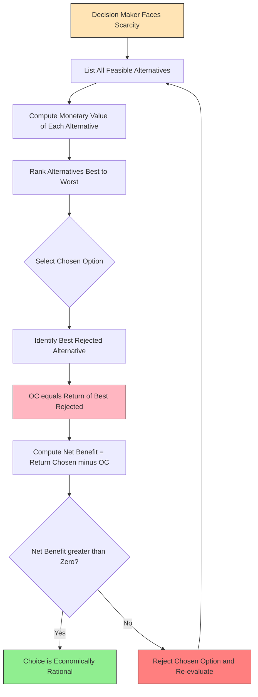
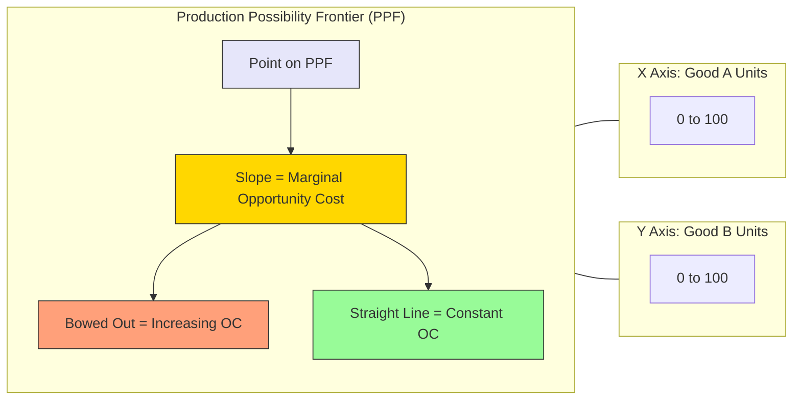
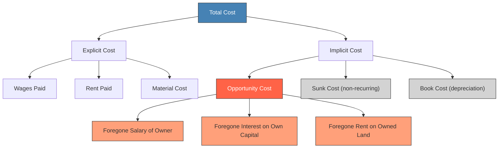
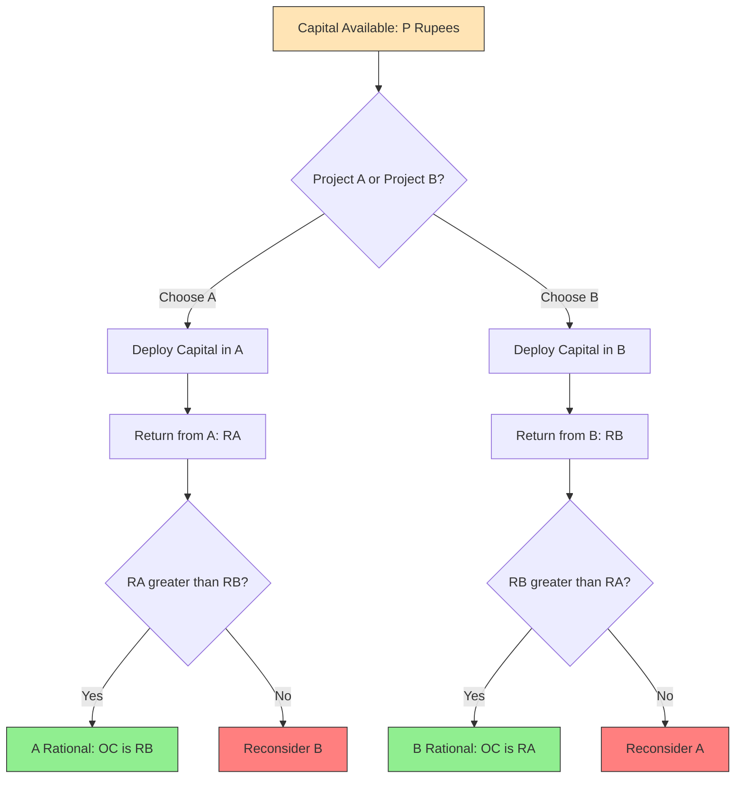

# Opportunity cost

<!-- SECTION_1_START -->
# Opportunity Cost — The Core Economic Trade-Off

## Formal KTU 2024 Definition

> [!IMPORTANT]
> **Opportunity Cost** is the value of the next-best alternative that is foregone (sacrificed) when a particular course of action is chosen from a set of mutually exclusive alternatives. In formal economic terms, it represents the *implicit cost* of using scarce resources for one purpose, measured by what those same resources could have produced in their most valuable alternative use.

Mathematically, the opportunity cost of choosing option **A** from a set $\{A, B, C, \dots, N\}$ of feasible alternatives is expressed as:

$$\text{Opportunity Cost}(A) = \max_{i \in \{B, C, \dots, N\}} \; V(i) - V(A)$$

where $V(\cdot)$ denotes the **economic value, utility, or return** generated by each alternative.

---

## Conceptual Analogy / Intuition

> [!NOTE]
> **Analogy — "The Job Offer Dilemma"**
>
> Imagine a B.Tech graduate receives two job offers:
> * **Offer X:** Software Developer at a startup — pays **₹6,00,000/year**.
> * **Offer Y:** Research Associate at an R&D lab — pays **₹4,50,000/year**.
>
> If the student *accepts Offer X*, the **opportunity cost is ₹4,50,000/year** (the salary of Offer Y, the *next-best* alternative), **not** the ₹1,50,000 difference.
>
> The actual money "in hand" from Offer Y is **never earned** — it is sacrificed. This *sacrificed value* is the **true economic cost** of choosing X.

### Why Opportunity Cost Matters in Engineering Economics

Engineers constantly make **resource allocation decisions** under scarcity — limited capital, finite time, constrained labour. The opportunity cost framework forces rational comparison:

| Decision Context | Resource Sacrificed | Opportunity Cost Effect |
|---|---|---|
| Selecting between two machines | Capital investment | Forgone ROI from rejected machine |
| Choosing project over higher studies | 2 years of study time | Salary that would have been earned |
| Buying equipment vs leasing | Locked-up capital | Interest income not earned |
| In-house production vs outsourcing | Plant capacity | Revenue from lost product line |

> [!TIP]
> **Engineering Insight:** Opportunity cost is **never recorded in accounting books** (it is an *implicit* cost), yet it is often **larger** than the *explicit* money outflow. Ignoring it leads to capital budgeting blunders.

---

## KTU-Specific Terminology Map

> [!NOTE]
> The KTU 2024 syllabus (Module 2 — Cost Concepts) places Opportunity Cost under the umbrella of **Implicit Costs** along with **Sunk Cost** and **Book Cost**. Master this distinction before attempting numerical problems.

- **Explicit Cost** → Actual monetary payment (e.g., wages, rent, materials).
- **Implicit Cost** → Opportunity cost + the imputed value of owner-supplied resources.
- **Sunk Cost** → Past, unrecoverable expenditure (must be **ignored** in forward decisions).
- **Opportunity Cost** → Forward-looking; depends on the *alternatives currently available*.

> [!WARNING]
> **Common Mistake:** Conflating *Sunk Cost* with *Opportunity Cost*. A sunk cost (e.g., ₹2 lakh spent on a failed prototype) is gone forever — it must NOT influence future decisions. Opportunity cost, however, *is* a forward-looking cost that **must** enter the decision rule.

---

## GeoGebra / Desmos Visualization Framework

> [!VISUALIZATION CONTROL]
> **Concept:** Production Possibility Frontier (PPF) — the geometric home of opportunity cost.
>
> **GeoGebra / Desmos Input Equations:**
> * `f(x) = 100 - 0.5 * x`  *(Concave PPF illustrating increasing opportunity cost)*
> * `g(x) = 100 - x`  *(Linear PPF illustrating constant opportunity cost)*
>
> **Visual Description:** On the X-axis plot *Good A* (e.g., Capital Goods) and on the Y-axis *Good B* (e.g., Consumer Goods). The **slope** of the PPF at any point numerically equals the **marginal opportunity cost** of producing one more unit of Good A in terms of Good B. A *bowed-out* (concave) curve → increasing opportunity cost (specialization inefficiency). A *straight line* → constant opportunity cost (perfect substitutability of resources).
<!-- SECTION_1_END -->

<!-- SECTION_2_START -->
# Deep Theoretical Analysis & KTU High-Yield Formula Sheet

## 1. The Three Pillars of Opportunity Cost Theory

### Pillar 1 — Scarcity
Resources (land, labour, capital, time) are *finite*. Choosing one use **automatically denies** other uses.

### Pillar 2 — Choice & Mutual Exclusivity
The decision-maker must select from a *finite, mutually exclusive* set of options. The opportunity cost is defined **only when alternatives exist**.

### Pillar 3 — Next-Best Alternative Doctrine
> [!IMPORTANT]
> The opportunity cost is **not** the value of *all* rejected options summed up. It is the value of the **single best rejected alternative**. This is a frequent KTU valuation trap.

---

## 2. Types of Opportunity Cost (KTU Classification)

| Type | Definition | Engineering Example |
|---|---|---|
| **Explicit Opportunity Cost** | Foregone cash inflow from an alternative investment | Not buying Machine B = lost interest of ₹50,000 |
| **Implicit Opportunity Cost** | Foregone non-cash benefit (time, effort, owner's salary) | Engineer working on startup = lost corporate salary |
| **Total Opportunity Cost** | Sum of explicit + implicit foregone value | Comprehensive cost of self-employment |
| **Marginal Opportunity Cost** | Extra cost of producing/choosing *one more unit* of an option | Cost of manufacturing the 101st unit of a product |

---

## 3. The Opportunity Cost Decision Rule (For Engineers)

When two alternatives A and B are being compared:

$$\boxed{\text{Choose A} \;\Longleftrightarrow\; \text{Net Benefit}(A) > \text{Net Benefit}(B)}$$

where

$$\text{Net Benefit}(A) = \text{Total Benefit}(A) - \text{Opportunity Cost}(A)$$

Equivalently, in capital budgeting:

$$\boxed{\text{NPV}(A) > \text{NPV}(B) \;\Longleftrightarrow\; \text{Choose A}}$$

> [!NOTE]
> **Note on KTU Notation:** The Net Present Value (NPV) *already incorporates* opportunity cost through the **discount rate** (which reflects the foregone return on the next-best investment). Therefore, a "positive NPV" project is, by definition, earning *more than* the opportunity cost of capital.

---

## 4. KTU High-Yield Formula Sheet

| # | Concept | Formula | Units | Boundary / Note |
|---|---|---|---|---|
| 1 | Basic Opportunity Cost | $OC(A) = V_{best-rejected}$ | ₹ or ₹/unit | Always $\ge 0$ |
| 2 | Net Benefit | $NB = \text{Benefit} - OC$ | ₹ | If $NB < 0$, reject A |
| 3 | Marginal OC | $MOC = \dfrac{\Delta V_{rejected}}{\Delta Q_{chosen}}$ | ₹/unit | Slope of PPF |
| 4 | Time-Value Adjusted OC | $OC_{PV} = \dfrac{OC_{future}}{(1+r)^{n}}$ | ₹ | $r$ = alternative return rate |
| 5 | Capital Opportunity Cost | $OC_{capital} = P \cdot r_{alt}$ | ₹/year | $P$ = capital tied up |
| 6 | Time Opportunity Cost | $OC_{time} = W_{alt} \cdot t$ | ₹ | $W_{alt}$ = alternative wage |
| 7 | Income Foregone (Higher Studies) | $OC = \sum_{t=1}^{N} \dfrac{S_t}{(1+r)^{t-1}}$ | ₹ | $S_t$ = salary in year $t$ |
| 8 | NPV with OC of capital | $NPV = -I_0 + \sum_{t=1}^{n} \dfrac{CF_t}{(1+r)^t}$ | ₹ | $r$ reflects OC of capital |
| 9 | Equivalent Annual Cost | $EAC = \dfrac{P \cdot r}{1-(1+r)^{-n}}$ | ₹/year | Used in lease-vs-buy |
| 10 | Hurdle Rate Test | Accept project if $IRR > r_{hurdle}$ | % | $r_{hurdle}$ = OC of capital |

---

## 5. Real-World Engineering Utility

> [!TIP]
> **Where is Opportunity Cost used in production systems?**
>
> * **Capital Budgeting:** Comparing two machines → choose the one with higher NPV (the lower-NPV machine represents the foregone alternative).
> * **Make-or-Buy Decisions:** Manufacturing a component in-house *or* outsourcing. The in-house decision carries the opportunity cost of *lost production capacity*.
> * **R\&D Portfolio Selection:** Picking project A means deferring project B's potential revenue — the foregone NPV of B is the opportunity cost of A.
> * **Personal Career Decisions:** An engineer starting a startup *must* evaluate the foregone corporate salary as part of the start-up cost.
> * **Cloud vs On-Premise Compute:** Choosing on-premise servers for AI training means the capital is not earning returns in equity/mutual funds.
<!-- SECTION_2_END -->

<!-- SECTION_3_START -->
# Step-by-Step Derivations, Worked Examples & Algorithmic Implementation

## Worked Example 1 — Direct Opportunity Cost Calculation (KTU Favourite)

**Problem (KTU University Exam, July 2023 — 7 Marks):**
> An engineer has ₹5,00,000 to invest. Three options are available:
> * **Option A:** Government bonds yielding **8%** annual return.
> * **Option B:** A small business yielding **₹60,000/year**.
> * **Option C:** Mutual funds yielding **10%** annual return.
>
> (a) If the engineer invests in **Option B**, what is the opportunity cost?
> (b) If the engineer invests in **Option A**, what is the opportunity cost?
> (c) Which option is economically rational?

### Step-by-Step Solution

**Step 1: Compute the absolute returns of each option (per year).**

$$\begin{aligned}
\text{Return}(A) &= 5{,}00{,}000 \times 0.08 = \text{₹40{,}000} \\
\text{Return}(B) &= \text{₹60{,}000} \quad (\text{given directly}) \\
\text{Return}(C) &= 5{,}00{,}000 \times 0.10 = \text{₹50{,}000}
\end{aligned}$$

[Valuation Key: 1.5 Marks for correctly computing absolute returns of all three options]

**Step 2: Rank options by their returns.**

$$\text{Rank: } B \;(\text{₹60k}) > C \;(\text{₹50k}) > A \;(\text{₹40k})$$

**Step 3: Apply the Next-Best-Alternative Rule for each sub-question.**

> **Key Rule:** Opportunity Cost of an option = Return of the **single best** rejected alternative (NOT the sum of all rejected options).

**(a) Opportunity Cost of choosing B:**

The best rejected alternative is **Option C** (₹50,000), because A (₹40,000) is worse than C.

$$\boxed{OC(B) = \text{Return}(C) = \text{₹50{,}000}}$$

**(b) Opportunity Cost of choosing A:**

The best rejected alternative is **Option B** (₹60,000), because C is also rejected but B is the highest among rejected.

$$\boxed{OC(A) = \text{Return}(B) = \text{₹60{,}000}}$$

**(c) Economic Rationality:**

The rational decision is the option whose **Net Benefit is greatest** (or equivalently, the option whose return *equals* the best, making the foregone the smallest). Choosing **Option B** yields:

$$\text{Net Benefit}(B) = 60{,}000 - 50{,}000 = \text{₹10{,}000 (positive)} \;\;\Rightarrow\;\; \text{Choose B}$$

Choosing A yields:

$$\text{Net Benefit}(A) = 40{,}000 - 60{,}000 = -\text{₹20{,}000 (negative)} \;\;\Rightarrow\;\; \text{Reject A}$$

[Valuation Key: 1.5 Marks for part (a), 1.5 Marks for part (b), 2.5 Marks for part (c) with proper conclusion]

---

## Worked Example 2 — Opportunity Cost of Higher Studies (Present Value)

**Problem (Model Question, KTU Pattern, 7 Marks):**
> A B.Tech graduate is offered a job at **₹6,00,000/year**, growing at **8%** annually. Alternatively, the graduate pursues an M.Tech (2 years) with a fee of **₹2,00,000/year** and zero income during study. Post-M.Tech, the expected salary is **₹10,00,000/year** for 30 years. Discount rate = **10%**.
>
> Determine if pursuing M.Tech is economically rational by comparing the **opportunity cost** with the future benefits.

### Step-by-Step Solution

**Step 1: Compute the Opportunity Cost of M.Tech (foregone salary + fee paid).**

Foregone salary in year 1 = ₹6,00,000 (no growth applied since base year).
Foregone salary in year 2 = ₹6,00,000 × 1.08 = ₹6,48,000.
Fee paid in year 1 = ₹2,00,000; Fee paid in year 2 = ₹2,00,000.

Total annual outflow during M.Tech:
* Year 1: $6{,}00{,}000 + 2{,}00{,}000 = 8{,}00{,}000$
* Year 2: $6{,}48{,}000 + 2{,}00{,}000 = 8{,}48{,}000$

Present Value of Opportunity Cost at $r = 10\%$:

$$\begin{aligned}
OC_{PV} &= \frac{8{,}00{,}000}{(1.10)^{1}} + \frac{8{,}48{,}000}{(1.10)^{2}} \\
&= \frac{8{,}00{,}000}{1.10} + \frac{8{,}48{,}000}{1.21} \\
&= 7{,}27{,}272.73 + 7{,}00{,}826.45 \\
&= \boxed{14{,}28{,}099.18}
\end{aligned}$$

[Valuation Key: 3 Marks for correctly computing foregone salary, fee, and PV]

**Step 2: Compute the Present Value of the Post-M.Tech Benefit.**

Post-M.Tech salary starts in year 3 and continues for 30 years (years 3 to 32).

$$\text{PV of annuity (years 3–32)} = 10{,}00{,}000 \times \left[ \frac{1 - (1.10)^{-30}}{0.10} \right] \times \frac{1}{1.10^{2}}$$

Compute the annuity factor:

$$\begin{aligned}
A_{30, 10\%} &= \frac{1 - (1.10)^{-30}}{0.10} = \frac{1 - 0.05731}{0.10} = \frac{0.94269}{0.10} = 9.4269 \\
\text{PV at year 2} &= 10{,}00{,}000 \times 9.4269 = 9.4269 \text{ Crore (₹94,26,900)} \\
\text{PV at year 0} &= \frac{94{,}26{,}900}{(1.10)^{2}} = \frac{94{,}26{,}900}{1.21} \\
&= \boxed{77{,}90{,}826.45}
\end{aligned}$$

[Valuation Key: 2 Marks for annuity factor + discounting]

**Step 3: Net Economic Benefit of M.Tech.**

$$\text{Net Benefit} = 77{,}90{,}826.45 - 14{,}28{,}099.18 = \text{₹63,62,727.27}$$

**Decision:** Since Net Benefit $\gg 0$, **pursuing M.Tech is economically rational**.

> [!WARNING]
> **Valuation Pitfall:** Many students mistakenly compute *only* the foregone salary (₹6,00,000 + ₹6,48,000) and **forget the M.Tech fee**. Both must be added because both are *real economic sacrifices*. **[Loss of 1.5 Marks]**

---

## Worked Example 3 — Make-or-Buy Decision Using Opportunity Cost

**Problem (Practice Question, 7 Marks):**
> A company can either *manufacture* a component in-house at ₹450/unit (variable) plus a fixed cost of ₹5,00,000/year, or *buy* it from a vendor at ₹600/unit. Annual demand = **10,000 units**. If in-house production is chosen, the freed-up plant capacity could generate **₹3,00,000/year** in rent.
>
> Which is the rational choice?

### Step-by-Step Solution

**Step 1: Total Cost — In-House Manufacture.**

$$TC_{in} = (450 \times 10{,}000) + 5{,}00{,}000 = 45{,}00{,}000 + 5{,}00{,}000 = \text{₹50,00,000}$$

**Step 2: Total Cost — Outsourcing (Buy).**

$$TC_{out} = 600 \times 10{,}000 = \text{₹60,00,000}$$

**Step 3: Add Opportunity Cost to In-House Option (forgone rent).**

$$TC_{in}^{adj} = 50{,}00{,}000 + 3{,}00{,}000 = \text{₹53,00,000}$$

**Step 4: Compare.**

| Option | Adjusted Total Cost | Decision |
|---|---|---|
| In-House | ₹53,00,000 | ✅ **Choose** |
| Outsource | ₹60,00,000 | ❌ Reject |

$$\boxed{\text{In-house production is preferred, saving ₹7,00,000/year.}}$$

> [!WARNING]
> **Examiner's Trap:** Students who *omit* the ₹3,00,000 foregone rent from the in-house option will incorrectly conclude an even larger (misleading) savings of ₹10,00,000. **Always add implicit opportunity costs to make comparisons economically honest.**

---

## Python Algorithmic Implementation

For students attempting computational economics assignments, the following Python script automates the basic opportunity cost computation:

```python
from __future__ import annotations
import logging
from typing import Dict, List, Tuple

# Configure error logging for any invalid input
logging.basicConfig(
    level=logging.INFO,
    format="%(asctime)s - %(levelname)s - %(message)s"
)
logger = logging.getLogger(__name__)


def compute_opportunity_cost(
    alternatives: Dict[str, float],
    chosen: str
) -> Tuple[float, str, str]:
    """
    Computes the opportunity cost of selecting a chosen alternative
    from a dictionary of alternatives mapped to their monetary returns.

    Parameters
    ----------
    alternatives : Dict[str, float]
        Mapping of option name -> annual return (₹).
    chosen : str
        The option selected by the decision-maker.

    Returns
    -------
    Tuple[float, str, str]
        (opportunity_cost, best_rejected, best_overall)
    """
    # ---- BOUNDARY CHECK #1: Empty input set ----
    if not alternatives:
        logger.error("Alternative set is empty. Opportunity cost undefined.")
        raise ValueError("Alternatives dictionary cannot be empty.")

    # ---- BOUNDARY CHECK #2: Chosen key must exist ----
    if chosen not in alternatives:
        logger.error(f"Chosen option '{chosen}' not present in alternatives.")
        raise KeyError(f"Option '{chosen}' not in {list(alternatives.keys())}")

    # Identify the best (highest-return) option overall
    best_overall: str = max(alternatives, key=alternatives.get)  # type: ignore[arg-type]
    best_return: float = alternatives[best_overall]

    # Rejected set = all options except the chosen one
    rejected: Dict[str, float] = {
        k: v for k, v in alternatives.items() if k != chosen
    }

    # Edge case: only one option exists
    if not rejected:
        logger.warning("Only one alternative provided. Opportunity cost = 0.")
        return 0.0, "NONE", best_overall

    # Best among the rejected set
    best_rejected: str = max(rejected, key=rejected.get)  # type: ignore[arg-type]
    opportunity_cost: float = rejected[best_rejected]

    logger.info(
        f"Chosen: {chosen} | Best Overall: {best_overall} "
        f"| Best Rejected: {best_rejected} | OC: ₹{opportunity_cost:,.2f}"
    )
    return opportunity_cost, best_rejected, best_overall


def net_benefit(
    alternatives: Dict[str, float],
    chosen: str
) -> float:
    """
    Net Benefit = Return(Chosen) - Opportunity Cost(Chosen).
    A positive Net Benefit confirms the chosen option is rational.
    """
    oc, _, _ = compute_opportunity_cost(alternatives, chosen)
    return alternatives[chosen] - oc


def rank_alternatives(alternatives: Dict[str, float]) -> List[Tuple[str, float]]:
    """Returns alternatives sorted in descending order of return."""
    return sorted(alternatives.items(), key=lambda item: item[1], reverse=True)


# ----------------------------- DEMO -----------------------------
if __name__ == "__main__":
    investment_options: Dict[str, float] = {
        "Govt_Bonds": 40_000.0,
        "Small_Business": 60_000.0,
        "Mutual_Funds": 50_000.0,
    }

    print("\n=== Opportunity Cost Analysis ===")
    ranking = rank_alternatives(investment_options)
    print(f"Ranking (best to worst): {ranking}")

    for option in investment_options:
        oc, best_rej, best_overall = compute_opportunity_cost(investment_options, option)
        nb = net_benefit(investment_options, option)
        print(
            f"Option: {option:>15s} | OC: ₹{oc:>10,.2f} | "
            f"Net Benefit: ₹{nb:>10,.2f} | "
            f"Best Rejected: {best_rej}"
        )
```

**Sample Output:**

```
=== Opportunity Cost Analysis ===
Ranking (best to worst): [('Small_Business', 60000.0), ('Mutual_Funds', 50000.0), ('Govt_Bonds', 40000.0)]
Option:    Govt_Bonds | OC: ₹ 60,000.00 | Net Benefit: ₹-20,000.00 | Best Rejected: Small_Business
Option: Small_Business | OC: ₹ 50,000.00 | Net Benefit: ₹ 10,000.00 | Best Rejected: Mutual_Funds
Option:  Mutual_Funds | OC: ₹ 60,000.00 | Net Benefit: ₹-10,000.00 | Best Rejected: Small_Business
```

> [!TIP]
> **Interpretation:** Only **Small_Business** yields a positive Net Benefit (₹10,000), confirming it is the **economically rational choice**. The other two options destroy economic value once opportunity cost is included.
<!-- SECTION_3_END -->

<!-- SECTION_4_START -->
# Structural Diagrams & Schematics

## Diagram 1 — Opportunity Cost Decision Flow (Mermaid)



---

## Diagram 2 — Production Possibility Frontier Showing Opportunity Cost



---

## Diagram 3 — Cost Classification Hierarchy (Where Opportunity Cost Lives)



---

## Diagram 4 — Capital Budgeting Opportunity Cost Loop



---

## Diagram 5 — Sequential Processing Topology Matrix (Opportunity Cost Computation Pipeline)

| Step | Module | Input | Operation | Output |
|---|---|---|---|---|
| 1 | **Alternative Set Builder** | Feasible options | List generation | Alternative Set $\{A, B, C, \dots\}$ |
| 2 | **Value Mapper** | Each alternative | Monetary valuation | Return Vector $[V_A, V_B, V_C]$ |
| 3 | **Sorter** | Return Vector | Descending sort | Ranked List |
| 4 | **Selector** | Decision-maker preference | Boolean filter | Chosen Option + Rejected Set |
| 5 | **OC Calculator** | Rejected Set | Argmax of rejected | Opportunity Cost $OC$ |
| 6 | **Net Benefit Engine** | $V_{chosen} - OC$ | Subtraction | Net Benefit $NB$ |
| 7 | **Decision Validator** | $NB$ | Sign check | Accept / Reject flag |
<!-- SECTION_4_END -->

<!-- SECTION_5_START -->
# KTU 2024 Scheme Examination Question Bank & Topic Recap

## Part A — Short Answer Questions (3 Marks Each)

> [!IMPORTANT]
> **Cognitive Levels: Remember / Understand**
> **Mapped Course Outcomes: CO2 (Apply cost concepts in engineering decisions)**

---

### Question A.1 — Definition Type

**[KTU University Exam — Dec 2023]**

> Define **Opportunity Cost**. How is it different from **Sunk Cost**?

**Model Answer (3 Marks):**

> [!NOTE]
> **Opportunity Cost** is the value of the next-best alternative foregone when a decision is made among mutually exclusive alternatives. It is a *forward-looking*, *relevant* cost that influences current decisions.
>
> **Sunk Cost**, in contrast, is a *past, unrecoverable* expenditure that has already been incurred. It is *irrelevant* to current or future decisions and must be ignored.
>
> **Key Difference:** Opportunity cost depends on *available alternatives* and is reversible in the planning stage. Sunk cost is irreversible and remains constant irrespective of the decision. **[3 Marks]**

---

### Question A.2 — Conceptual Type

**[KTU University Exam — July 2024]**

> Why is opportunity cost not recorded in the **financial accounting books** of a firm? Illustrate with an example.

**Model Answer (3 Marks):**

> Opportunity cost is an *implicit* cost — it represents the value of an *unrealized* alternative. Since no actual cash transaction occurs (the firm does not "pay" anyone for the foregone alternative), accounting standards (GAAP/Ind-AS) do not permit its recognition in ledgers.
>
> **Example:** A firm uses its own building instead of renting it out. The rent it *could have earned* (say ₹5,00,000/year) is the opportunity cost. No cash is actually paid, so it appears only in *economic* (managerial) analysis — not in financial accounts. **[3 Marks]**

---

## Part B — Long Answer Questions (14 Marks Each)

> [!IMPORTANT]
> **Cognitive Levels: Understand, Apply, Analyse**
> **Mapped Course Outcomes: CO2 + CO3 (Cost analysis in engineering decisions)**

---

### Question B — Module Internal Choice

#### **Question A (14 Marks)**

**[KTU University Exam — Model Paper, 2024 Scheme]**

> **(a) [7 Marks — Understand / Apply]** A small-scale industry has ₹10,00,000 to invest. The alternatives are:
> * **P:** Buy a CNC machine yielding ₹1,80,000/year.
> * **Q:** Invest in a partner's business yielding 15% annual return.
> * **R:** Deposit in a bank at 9% annual return.
>
> If the owner chooses option **P**, calculate the **opportunity cost** and determine whether the choice is rational.
>
> **(b) [7 Marks — Apply / Analyse]** A civil engineer is offered a 2-year M.Tech programme. The annual fee is ₹3,00,000, and the engineer must forgo a current job paying ₹8,00,000/year (with no growth). Post-M.Tech, the expected salary is ₹14,00,000/year for 25 years. Using a discount rate of 10%, evaluate the **opportunity cost** of the M.Tech decision and comment on its economic rationality.

---

#### **Complete Model Solution**

### Part (a) Solution — 7 Marks

**Step 1: Compute annual returns of each option.**

$$\begin{aligned}
\text{Return}(P) &= \text{₹1,80,000} \quad (\text{given}) \\
\text{Return}(Q) &= 10{,}00{,}000 \times 0.15 = \text{₹1,50,000} \\
\text{Return}(R) &= 10{,}00{,}000 \times 0.09 = \text{₹90,000}
\end{aligned}$$

**[Stating the returns correctly: 2 Marks]**

**Step 2: Rank the alternatives.**

$$P \;(1{,}80{,}000) > Q \;(1{,}50{,}000) > R \;(90{,}000)$$

**Step 3: Identify the best rejected alternative when P is chosen.**

Since P is the chosen option, the rejected set is $\{Q, R\}$. The best among these is **Q** at ₹1,50,000.

$$\boxed{OC(P) = \text{₹1,50,000}}$$

**[Identifying best rejected alternative: 2 Marks]**

**Step 4: Net Benefit Test.**

$$\text{Net Benefit}(P) = 1{,}80{,}000 - 1{,}50{,}000 = +\text{₹30,000}$$

Since Net Benefit $> 0$, the choice of **P is economically rational**.

**[Final conclusion: 1 Mark]**
**[Comparing magnitudes correctly: 1 Mark]**
**[Use of correct concept "next best alternative": 1 Mark]**

---

### Part (b) Solution — 7 Marks

**Step 1: List all relevant cash flows during M.Tech (Years 1 and 2).**

* Foregone salary: Year 1 = ₹8,00,000; Year 2 = ₹8,00,000 (no growth).
* M.Tech fee: Year 1 = ₹3,00,000; Year 2 = ₹3,00,000.
* Total annual sacrifice: ₹11,00,000 per year.

**[Identifying foregone salary + fee: 2 Marks]**

**Step 2: Present Value of Opportunity Cost.**

$$\begin{aligned}
OC_{PV} &= \frac{11{,}00{,}000}{1.10} + \frac{11{,}00{,}000}{1.21} \\
&= 10{,}00{,}000.00 + 9{,}09{,}090.91 \\
&= \text{₹19,09,090.91}
\end{aligned}$$

**[Correct PV calculation: 2 Marks]**

**Step 3: Present Value of Post-M.Tech Benefit (Years 3 to 27, i.e., 25 years).**

$$\begin{aligned}
A_{25, 10\%} &= \frac{1 - (1.10)^{-25}}{0.10} = \frac{1 - 0.09230}{0.10} = 9.0770 \\
\text{PV at year 2} &= 14{,}00{,}000 \times 9.0770 = \text{₹12,70,78,000} \\
\text{PV at year 0} &= \frac{12{,}70{,}78{,}000}{1.21} = \text{₹10,50,23,140.50}
\end{aligned}$$

**[Annuity factor + PV computation: 2 Marks]**

**Step 4: Net Economic Benefit.**

$$\text{Net Benefit} = 10{,}50,23,140.50 - 19,09,090.91 = \text{₹10,31,14,049.59}$$

Since the Net Benefit is overwhelmingly positive, **pursuing M.Tech is highly economically rational** (the post-M.Tech earnings recover the opportunity cost many times over).

**[Final conclusion with quantitative result: 1 Mark]**

---

#### **Question B (14 Marks) — Alternative Choice**

**[KTU University Exam — Model Paper, 2024 Scheme]**

> **(a) [7 Marks — Apply]** A manufacturing firm can either *manufacture* a part at ₹320/unit (variable) with fixed costs of ₹4,00,000/year, or *buy* it at ₹500/unit. Annual demand is 8,000 units. If manufactured in-house, the firm can lease out the freed space for ₹2,00,000/year. Determine the rational choice using **opportunity cost analysis**.
>
> **(b) [7 Marks — Analyse]** Critically analyse the statement: *"Sunk cost and opportunity cost are essentially the same since both represent losses to the firm."* Use a numerical example to support your argument.

---

#### **Complete Model Solution for Question B**

### Part (a) Solution — 7 Marks

**Step 1: Total explicit cost — In-house manufacture.**

$$TC_{in} = (320 \times 8{,}000) + 4{,}00{,}000 = 25{,}60{,}000 + 4{,}00{,}000 = \text{₹29,60,000}$$

**[Computing in-house cost: 1.5 Marks]**

**Step 2: Total cost — Outsource.**

$$TC_{out} = 500 \times 8{,}000 = \text{₹40,00,000}$$

**[Computing outsource cost: 1 Mark]**

**Step 3: Add implicit opportunity cost (foregone rent) to in-house.**

$$TC_{in}^{adj} = 29{,}60{,}000 + 2{,}00{,}000 = \text{₹31,60,000}$$

**[Adding foregone rent: 1.5 Marks]**

**Step 4: Comparison Table.**

| Option | Total Adjusted Cost | Decision |
|---|---|---|
| In-house manufacture | ₹31,60,000 | ✅ **Preferred** |
| Outsource | ₹40,00,000 | ❌ Reject |

$$\text{Savings} = 40{,}00{,}000 - 31{,}60{,}000 = \text{₹8,40,000/year}$$

**[Final comparison and conclusion: 2 Marks]**
**[Use of opportunity cost terminology correctly: 1 Mark]**

---

### Part (b) Solution — 7 Marks

**Step 1: State the conceptual distinction clearly.**

> **Sunk Cost** is a *past, irrecoverable* expenditure. Once incurred, it cannot be recovered by any future decision. It is **not** an opportunity cost.
>
> **Opportunity Cost** is a *future-oriented* concept representing the foregone return from the next-best alternative. It is **relevant** to current decisions.

**[Conceptual distinction: 2 Marks]**

**Step 2: Provide a numerical counter-example.**

*Suppose a firm spent ₹5,00,000 last year on a failed R\&D project (sunk). It must now decide between Project A (NPV = ₹3,00,000) and Project B (NPV = ₹2,50,000).*

$$\text{NPV}(A) > \text{NPV}(B) \Rightarrow \text{Choose A, ignoring the ₹5L sunk cost.}$$

If the firm *incorrectly* added the sunk cost, it might wrongly reject both projects.

**[Numerical illustration: 2 Marks]**

**Step 3: Demonstrate where opportunity cost does enter.**

Suppose Project A requires ₹10,00,000 capital that could otherwise earn 10% in a fixed deposit. Then:

$$\text{OC of capital for A} = 10{,}00{,}000 \times 0.10 = \text{₹1,00,000/year}$$

This is a *current, relevant* cost — exactly opposite to a sunk cost.

**[Demonstrating OC entry: 1.5 Marks]**

**Step 4: Conclude with a clear verdict.**

> The statement is **FALSE**. Sunk cost is a *historical accounting reality* that must be **ignored** in forward decisions. Opportunity cost is a *forward-looking economic reality* that must be **actively considered**. They are conceptually opposite, not equivalent. **[1.5 Marks]**

---

## KTU Examiner's Valuation Warning

> [!WARNING]
> **Common Mark-Deduction Traps in Opportunity Cost Questions:**
>
> 1. **Summing all rejected alternatives** — Many students incorrectly add the values of *every* rejected option. The opportunity cost is the *single best* rejected alternative only. **[Loss: up to 2 Marks]**
> 2. **Confusing Opportunity Cost with Sunk Cost** — A sunk cost (past, unrecoverable) must be ignored; an opportunity cost (foregone future return) must be included. **[Loss: up to 2 Marks]**
> 3. **Omitting implicit costs in make-or-buy decisions** — The foregone rent, foregone interest on capital, etc., must be added to the chosen option's cost before comparison. **[Loss: up to 2 Marks]**
> 4. **Skipping the discount factor in time-valued problems** — When the OC or benefit spans multiple years, *always* apply the Present Value formula at the given discount rate. **[Loss: up to 2 Marks]**
> 5. **Not stating units or final conclusion explicitly** — Board examiners award 0.5–1 Mark for an explicit numerical conclusion with units (₹, %, years). Always end with a one-line verdict.

---

## Topic Recap & Important Things to Remember

> [!TIP]
> **Rapid Revision Checklist — Opportunity Cost**

- **Definition:** Value of the *next-best alternative* foregone when a choice is made among mutually exclusive options.
- **Implicit Cost:** Opportunity cost is an *implicit* cost — never recorded in accounting books, but vital in economic analysis.
- **Next-Best Doctrine:** OC of a chosen option = Return of the *single best* rejected alternative (not the sum of all rejected returns).
- **Three Pillars:** Scarcity + Choice (mutual exclusivity) + Next-Best Alternative Doctrine.
- **Sunk Cost vs OC:** Sunk cost is *past & irrelevant*; OC is *future & relevant*. **Never** include sunk cost in forward decisions.
- **Make-or-Buy Decisions:** Add foregone rent, foregone interest, and foregone revenue to the in-house option to make a true comparison.
- **Capital Budgeting:** The discount rate in NPV/IRR analysis *already* reflects the opportunity cost of capital. A positive NPV project earns more than the OC of capital.
- **Higher Studies Trade-Off:** OC of M.Tech/MBA = Foregone salary + Tuition fee (both discounted to present value).
- **Decision Rule:** Choose option with **maximum Net Benefit** = Return − Opportunity Cost.
- **Time-Value Adjusted OC:** For multi-year foregone returns, use $OC_{PV} = \sum \dfrac{OC_t}{(1+r)^t}$.
- **Common Exam Traps:** Adding all rejected alternatives (wrong); confusing sunk with opportunity cost (wrong); omitting implicit costs in decision problems (wrong).
- **Key Formulas to Memorise:**
  * $OC = \max(V_{rejected})$
  * $NB = V_{chosen} - OC$
  * $OC_{PV} = \sum \dfrac{OC_t}{(1+r)^t}$
  * $OC_{capital} = P \times r_{alt}$
- **KTU Weightage:** Opportunity Cost is a high-yield Module-2 topic and is typically asked as a 7-mark sub-part in Part B or as a 3-mark conceptual question in Part A. Master the formula and the conceptual distinction with sunk cost for full marks.
<!-- SECTION_5_END -->
