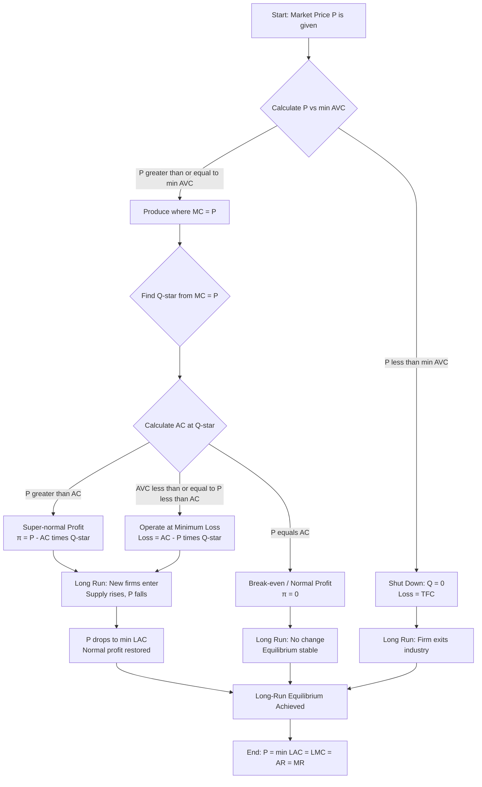
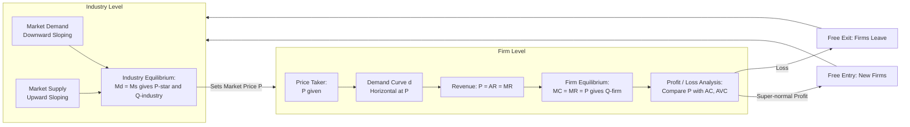
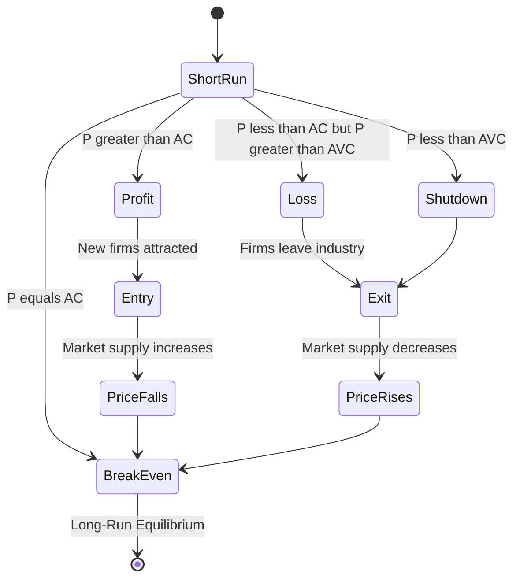

# Perfect Competition

<!-- SECTION_1_START -->

# Perfect Competition: The Pure Market Benchmark

> [!IMPORTANT]
> **KTU 2024 Scheme | UCHUT346 – Economics for Engineers | Module 2 (Cost Concepts)**
> This topic bridges the firm's cost structure (from Module 2) with **revenue behaviour**, forming the foundation for pricing, profit, and break-even analysis asked repeatedly in KTU examinations.

## 1.1 Formal Academic Definition (KTU Syllabus Terminology)

**Perfect Competition** is a market structure characterised by a **very large number of buyers and sellers** dealing in **homogeneous (identical) products**, where each individual firm is a **price taker** and **no single participant** can influence the prevailing market price. The price is determined solely by the **interaction of aggregate market demand and market supply**, and firms accept it as a given parameter.

Mathematically, for a perfectly competitive firm:

$$\boxed{P = AR = MR = d}$$

Where:
- $P$ = Market Price
- $AR$ = Average Revenue
- $MR$ = Marginal Revenue
- $d$ = Demand faced by the individual firm (perfectly elastic, horizontal)

> [!NOTE]
> **Syllabus Highlight (KTU 2024 Module 2):** Students must clearly differentiate between **Industry** (market) equilibrium and **Firm** equilibrium. This distinction is the single most-tested concept under cost concepts.

## 1.2 Conceptual Analogy — The "Crop Market" Intuition

Imagine a village where **1,000 farmers** grow **identical wheat** of the same grade. No single farmer grows enough to set the price, and no buyer cares whose wheat they buy because it is indistinguishable.

- The **village mandi (market)** sets the wheat price at ₹2,000/quintal.
- Each farmer, sitting at home, must **accept ₹2,000**.
- If a farmer asks ₹2,001, buyers simply move to the next farmer.
- If a farmer asks ₹1,999, he sells out instantly but loses revenue.

> **Intuition:** The individual farmer's output is a **drop in the ocean** of total wheat supply. The market price is the "weather" — you cannot control it, only **decide how much to produce** given that price.

## 1.3 The Two-Tier Architecture: Industry vs. Firm

| Tier | Determined By | Curve Shape | Slope Behaviour |
|------|---------------|-------------|-----------------|
| **Industry** | Market Demand × Market Supply | Downward sloping (demand) & Upward sloping (supply) | Price varies with quantity |
| **Firm** | Price-taker behaviour | **Horizontal straight line** at $P$ | Perfectly elastic ($E_d = \infty$) |

> [!VISUALIZATION CONTROL]
> **Concept:** Horizontal demand curve faced by a perfectly competitive firm.
> **Graph Setup (Mental Sketch):**
> * X-axis: Quantity sold by firm ($Q$)
> * Y-axis: Price / Revenue ($P$)
> * A horizontal line at $P = 50$ (for example) labelled $d = AR = MR$
> **Visual Description:** No matter how much the firm produces (small or large), the price stays at ₹50. The line stretches infinitely in both directions parallel to the X-axis.

---

<!-- SECTION_1_END -->

<!-- SECTION_2_START -->

# Deep Theoretical Analysis & KTU High-Yield Formula Sheet

## 2.1 The Five Pillars — Assumptions of Perfect Competition

For a market to be classified as perfectly competitive, the following conditions **must all hold simultaneously**:

1. **Large Number of Buyers & Sellers** — Each participant is atomistic; output/share of any one firm is negligible relative to total market volume.
2. **Homogeneous Products** — All firms sell **perfect substitutes**; buyers are indifferent between sellers.
3. **Free Entry and Exit of Firms** — No barriers (legal, technological, financial) prevent new firms from joining or existing firms from leaving in the long run.
4. **Perfect Knowledge / Information** — Buyers know all prices, qualities, and availability; sellers know all production techniques and input costs.
5. **Perfect Factor Mobility** — Labour, capital, and raw materials can move freely across firms and industries without restriction.
6. **No Transportation Costs** — The market is treated as a single unified point.
7. **No Government Intervention** — No taxes, subsidies, price controls, or quotas.

> [!IMPORTANT]
> **Why these assumptions matter (KTU Examiner Insight):** They exist **only to create the ideal benchmark**. In reality, no market is perfectly competitive. The model is used as a **yardstick** to measure **efficiency** of real-world markets like monopoly, oligopoly, and monopolistic competition.

## 2.2 Revenue Relationships — The "Triple Equality" Theorem

In perfect competition, the firm faces a perfectly elastic demand curve. This produces a unique revenue structure:

| Revenue Concept | Formula | Behaviour in Perfect Competition |
|-----------------|---------|----------------------------------|
| **Total Revenue ($TR$)** | $TR = P \times Q$ | Linear in $Q$ with slope $= P$ |
| **Average Revenue ($AR$)** | $AR = \dfrac{TR}{Q} = P$ | Constant, equals price |
| **Marginal Revenue ($MR$)** | $MR = \dfrac{\Delta TR}{\Delta Q}$ | Constant, equals price |

$$\therefore \;\; P = AR = MR = \text{constant}$$

**Why is MR constant?** Because selling one extra unit adds exactly $P$ to revenue (the price doesn't change with output). Hence, $MR$ never declines — this is a **defining feature** of perfect competition.

## 2.3 The KTU Formula Sheet — Profit Maximisation Conditions

| # | Condition / Concept | Mathematical Form | KTU Significance |
|---|---------------------|-------------------|------------------|
| 1 | Profit Maximisation (1st Order) | $MC = MR$ | Necessary condition |
| 2 | Profit Maximisation (2nd Order) | $\dfrac{d(MC)}{dQ} > 0$ i.e., MC must be rising | Sufficient condition |
| 3 | In Perfect Competition | $MC = MR = P = AR$ | Substituting revenue identity |
| 4 | Super-normal Profit | $\pi = TR - TC = (P - ATC) \times Q > 0$ | When $P > ATC$ |
| 5 | Normal Profit (Break-even) | $TR = TC \;\Rightarrow\; P = ATC$ | Long-run equilibrium result |
| 6 | Minimum Loss Condition | $P \geq AVC$ (else shut down) | Short-run shutdown rule |
| 7 | Break-even Point | $P = \min ATC$ | Zero economic profit |
| 8 | Shutdown Point | $P = \min AVC$ | Firm exits production in SR |
| 9 | Long-run Equilibrium | $P = \min LAC = LMC = AR = MR$ | Free entry/exit erases profits |
| 10 | Producer's Surplus | $PS = TR - TVC$ | Area above supply curve, below price |

> [!NOTE]
> **Critical Distinction for KTU:**
> * **Normal Profit** = accounting profit + opportunity cost of capital. It is the **minimum** profit needed to keep the firm in business.
> * **Super-normal Profit (Economic Profit)** = Total Revenue − Total Economic Cost. Disappears in long run under perfect competition.

## 2.4 The Three Short-Run Scenarios — The "Triangle of Outcomes"

The KTU board frequently tests these three cases. The firm's decision depends on where $P$ lies relative to the **U-shaped Average Cost Curve**:

### Case 1: Super-normal Profit (Firm earns profit)
- Condition: $P > ATC$ at the profit-maximising output
- Output Rule: $P = MC$ (where MC cuts MR from below)
- Profit: $\pi = (P - ATC) \times Q^*$
- **Visual:** Price line lies **above** the ATC curve at $Q^*$

### Case 2: Normal Profit / Break-even (Zero economic profit)
- Condition: $P = ATC = \min ATC$
- Output Rule: $P = MC$ at the minimum of ATC
- Profit: $\pi = 0$ (firm still earns normal profit, included in costs)
- **Visual:** Price line is **tangent** to ATC at its lowest point

### Case 3: Minimum Loss (Firm continues despite loss)
- Condition: $AVC \leq P < ATC$
- Output Rule: Still produce where $P = MC$, because $P > AVC$ covers variable + part of fixed cost
- Loss: $L = (ATC - P) \times Q^*$
- **Visual:** Price line lies between AVC and ATC

### Case 4: Shutdown (Firm stops production)
- Condition: $P < AVC$
- Decision: Shut down. Produce $Q = 0$. Loss equals only Total Fixed Cost ($TFC$).
- **Visual:** Price line lies **below** AVC at all output levels

> [!IMPORTANT]
> **The Shutdown Rule in One Line:**
> If $P < \min AVC$, the firm cannot cover even its variable cost → **shut down immediately**.
> If $P \geq \min AVC$ but $P < ATC$, the firm **continues operating** to minimise loss.

## 2.5 Long-Run Equilibrium — The "Tendency to Normal Profit"

In the long run, **free entry and exit** ensure that all super-normal profits and losses are competed away:

- If firms earn **super-normal profit** → new firms enter → market supply ↑ → price ↓ → profit ↓
- If firms incur **losses** → firms exit → market supply ↓ → price ↑ → loss ↓
- Equilibrium occurs when: $P = \min LAC = LMC$

At this point:
$$\text{Economic Profit} = 0 \quad \text{and} \quad \text{Optimal Plant Size is achieved}$$

> **Engineering Utility:** This long-run equilibrium condition is used as the **efficiency benchmark** in cost-benefit analysis of public projects, regulatory pricing of utilities, and setting efficient tariffs.

---

<!-- SECTION_2_END -->

<!-- SECTION_3_START -->

# Step-by-Step Derivations, Numerical Examples & Code Implementation

## 3.1 Solved Numerical Example — Short-Run Profit Maximisation

> **[KTU University Exam Style — Module 2 Typical Question]**

**Problem Statement:**
A perfectly competitive firm has the following cost structure:

$$TC = 200 + 50Q + 2Q^2$$

The market price is $P = ₹130$ per unit.
**Find:**
(a) The profit-maximising output level.
(b) Total Revenue, Total Cost, and Super-normal Profit.
(c) Verify the second-order condition.

### Step 1: Derive Marginal Cost (MC) and Average Cost (AC)

Marginal Cost is the derivative of $TC$ with respect to $Q$:

$$MC = \frac{d(TC)}{dQ} = \frac{d}{dQ}\left(200 + 50Q + 2Q^2\right)$$

$$\boxed{MC = 50 + 4Q}$$

Average Cost is $TC / Q$:

$$AC = \frac{TC}{Q} = \frac{200 + 50Q + 2Q^2}{Q}$$

$$\boxed{AC = \frac{200}{Q} + 50 + 2Q}$$

### Step 2: Apply the Profit Maximisation Condition

In perfect competition: $MC = MR = P$

$$50 + 4Q = 130$$

$$4Q = 130 - 50 = 80$$

$$Q^* = \frac{80}{4}$$

$$\boxed{Q^* = 20 \text{ units}}$$

### Step 3: Calculate Total Revenue, Total Cost & Profit

**Total Revenue:**
$$TR = P \times Q^* = 130 \times 20$$

$$\boxed{TR = ₹2{,}600}$$

**Total Cost:**
$$TC = 200 + 50(20) + 2(20)^2 = 200 + 1{,}000 + 800$$

$$\boxed{TC = ₹2{,}000}$$

**Super-normal Profit (Economic Profit):**
$$\pi = TR - TC = 2{,}600 - 2{,}000$$

$$\boxed{\pi = ₹600}$$

### Step 4: Verify Second-Order Condition

$$\frac{d(MC)}{dQ} = \frac{d}{dQ}(50 + 4Q) = 4 > 0 \;\;\checkmark$$

Since $\dfrac{d(MC)}{dQ} > 0$, the MC curve is rising at $Q^* = 20$, confirming this is a **maximum** profit point, not a minimum.

### Step 5: Verification via Average Cost Method

$$AC \text{ at } Q^*=20 = \frac{200}{20} + 50 + 2(20) = 10 + 50 + 40 = ₹100$$

$$\pi = (P - AC) \times Q^* = (130 - 100) \times 20 = 30 \times 20 = ₹600 \;\;\checkmark$$

> **Valuation Key Points (KTU Pattern):**
> * Stating $MC = MR = P$ condition: 2 marks
> * Derivation of $MC$ from $TC$: 2 marks
> * Solving for $Q^*$: 1 mark
> * Computing $TR$, $TC$, Profit: 2 marks

---

## 3.2 Solved Numerical Example — Break-even & Shutdown Analysis

**Problem Statement:**
A perfectly competitive firm has:
* $TFC = ₹500$
* $TVC = 20Q + Q^2$

Find: (a) $AVC$ and $ATC$; (b) Break-even price; (c) Shutdown price.

### Step 1: Compute AVC and ATC

$$AVC = \frac{TVC}{Q} = \frac{20Q + Q^2}{Q} = 20 + Q$$

$$ATC = \frac{TC}{Q} = \frac{500 + 20Q + Q^2}{Q} = \frac{500}{Q} + 20 + Q$$

### Step 2: Find Break-even Price (min of ATC)

Differentiate $ATC$ with respect to $Q$ and set to zero:

$$\frac{d(ATC)}{dQ} = -\frac{500}{Q^2} + 1 = 0$$

$$1 = \frac{500}{Q^2} \quad\Rightarrow\quad Q^2 = 500 \quad\Rightarrow\quad Q = \sqrt{500} = 22.36 \text{ units}$$

$$ATC_{min} = \frac{500}{22.36} + 20 + 22.36 = 22.36 + 20 + 22.36$$

$$\boxed{P_{break\text{-}even} = ₹64.72}$$

### Step 3: Find Shutdown Price (min of AVC)

$AVC = 20 + Q$ is minimised when $Q \to 0$ (since $AVC$ is linear and increasing).

Therefore:
$$\boxed{P_{shutdown} = \lim_{Q \to 0} AVC = ₹20}$$

> **Decision Rule Application:**
> * If $P > ₹64.72$ → Super-normal profit
> * If $P = ₹64.72$ → Break-even
> * If $₹20 \leq P < ₹64.72$ → Firm operates at a loss but covers variable cost
> * If $P < ₹20$ → Shut down; loss = TFC = ₹500

---

## 3.3 Python Implementation — Profit Maximisation & Cost Curve Plotting

```python
import numpy as np
import matplotlib.pyplot as plt

# --- Cost function definition ---
def TC(Q):
    return 200 + 50 * Q + 2 * Q**2

def MC(Q):
    return 50 + 4 * Q

def AC(Q):
    return 200 / Q + 50 + 2 * Q

def AVC(Q):
    return 50 + 2 * Q

# --- Market price (set externally by industry) ---
P = 130

# --- Profit maximising output: P = MC ---
Q_star = (P - 50) / 4
TR = P * Q_star
total_cost = TC(Q_star)
profit = TR - total_cost

print(f"Profit-maximising Quantity Q* = {Q_star:.2f} units")
print(f"Total Revenue            TR = ₹{TR:.2f}")
print(f"Total Cost               TC = ₹{total_cost:.2f}")
print(f"Super-normal Profit       π = ₹{profit:.2f}")

# --- Generate curves for visualisation ---
Q = np.linspace(1, 50, 500)
plt.figure(figsize=(10, 6))
plt.plot(Q, MC(Q), label='Marginal Cost (MC)', color='red', linewidth=2)
plt.plot(Q, AC(Q), label='Average Cost (AC)', color='blue', linewidth=2)
plt.plot(Q, AVC(Q), label='Average Variable Cost (AVC)', color='green', linewidth=2)
plt.axhline(y=P, color='black', linestyle='--', label=f'Price = ₹{P}')
plt.axvline(x=Q_star, color='gray', linestyle=':', label=f'Q* = {Q_star:.1f}')

# Shutdown price
P_shutdown = 50  # limit of AVC as Q->0
plt.axhline(y=P_shutdown, color='orange', linestyle='-.', label=f'Shutdown Price ≈ ₹{P_shutdown}')

plt.title('Perfectly Competitive Firm — Short-Run Equilibrium')
plt.xlabel('Quantity (Q)')
plt.ylabel('Cost / Price (₹)')
plt.legend(loc='upper right')
plt.grid(alpha=0.3)
plt.ylim(0, 250)
plt.show()
```

**Expected Output:**
```
Profit-maximising Quantity Q* = 20.00 units
Total Revenue            TR = ₹2600.00
Total Cost               TC = ₹2000.00
Super-normal Profit       π = ₹600.00
```

> **Interpretation:** The horizontal black dashed line at ₹130 cuts the red MC curve at $Q^* = 20$. The vertical distance between the price line and the blue AC curve at $Q^*$ (₹30) multiplied by $Q^*$ gives the super-normal profit rectangle of ₹600.

---

## 3.4 Long-Run Industry Supply Curve Derivation

> **[KTU Frequently Asked — 7 Mark Derivation]**

The **Long-Run Industry Supply Curve (LRISC)** under perfect competition is typically derived under three cost conditions:

### Case A: Constant Cost Industry
- Input prices remain constant as industry output expands.
- LRISC is **horizontal** at $P = \min LAC$.

### Case B: Increasing Cost Industry
- Input prices **rise** as industry expands (e.g., specialised labour scarce).
- LRISC slopes **upward** — higher $P$ required to call forth more output.

### Case C: Decreasing Cost Industry
- Input prices **fall** as industry expands (e.g., economies of specialisation).
- LRISC slopes **downward** — lower $P$ sufficient at higher output.

**Mathematical representation of constant-cost LRISC:**

$$P_{LR} = \min LAC = \text{constant} \quad \text{for all } Q_{industry}$$

The slope of LRISC depends on the slope of the **input price-output relationship**:

$$\text{Slope of LRISC} = \frac{\partial P}{\partial Q_{ind}} = \frac{\partial w}{\partial Q_{ind}} \times \frac{\partial LAC}{\partial w}$$

where $w$ is the input price vector.

---

<!-- SECTION_3_END -->

<!-- SECTION_4_START -->

# Structural Diagrams & Schematics

## 4.1 Mermaid Flowchart — Decision Logic of a Perfectly Competitive Firm



## 4.2 Mermaid Block Diagram — Industry vs Firm Equilibrium



## 4.3 Mermaid State Diagram — Long-Run Adjustment Mechanism



> [!NOTE]
> **Reading the Diagrams:** Each node uses only alphanumeric labels per the Mermaid safety protocol. Arrows represent cause-effect transitions in the firm's decision process. Subgraphs clearly separate the **macro (industry)** level from the **micro (firm)** level, which is the KTU-required analytical distinction.

---

<!-- SECTION_4_END -->

<!-- SECTION_5_START -->

# KTU 2024 Scheme Examination Question Bank & Topic Recap

---

## Part A — Short Answer Questions (2 × 3 = 6 Marks)

### Question 1 (3 Marks)
**[KTU University Exam — July 2024 | CO1 | Remember]**

**"State any three salient features of a perfectly competitive market."**

**Model Answer (3 Key Points):**

1. **Large Number of Buyers and Sellers:** The market contains an extremely large number of buyers and sellers, with each individual firm or buyer being too small to influence the market price through their own actions. Each firm is a price taker.

2. **Homogeneous Products:** All firms in the industry sell **identical** products. Buyers are indifferent between sellers, ensuring that no individual seller can charge a premium based on brand, quality, or packaging differentiation.

3. **Free Entry and Exit of Firms:** There are **no barriers** to entry or exit in the long run. If firms are earning super-normal profits, new firms freely enter; if they are incurring losses, existing firms freely exit. This mobility ensures long-run normal profits.

> **Alternative acceptable features:** Perfect knowledge, perfect factor mobility, no transportation costs, no government intervention.

**[Valuation Key: 1 mark per correctly stated feature with brief explanation]**

---

### Question 2 (3 Marks)
**[KTU University Exam — Dec 2023 | CO1 | Understand]**

**"Explain the relationship $P = AR = MR$ under perfect competition."**

**Model Answer:**

In a perfectly competitive market, the individual firm is a **price taker**. The demand curve faced by the firm is a **horizontal straight line** at the market-determined price, indicating **perfect elasticity** ($E_d = \infty$).

- **Average Revenue ($AR$):** $AR = \dfrac{TR}{Q} = \dfrac{P \times Q}{Q} = P$
- **Marginal Revenue ($MR$):** Since each additional unit sold adds exactly $P$ to total revenue (price does not fall with output), $MR = \dfrac{\Delta TR}{\Delta Q} = P$

Therefore, all three converge to a single value:
$$\boxed{P = AR = MR = \text{constant}}$$

This equality is the **defining revenue characteristic** of perfect competition and is the foundation for the profit maximisation rule $MC = MR = P$.

**[Valuation Key: Stating definitions of AR and MR — 2 marks; Final conclusion — 1 mark]**

---

## Part B — Long Answer Questions (ESE Module Internal Choice Pattern)

### Question A — 14 Marks
**[KTU University Exam — Model Paper 2024 | CO2, CO3 | Apply, Analyse]**

**(a)** A perfectly competitive firm has the total cost function:
$$TC = 100 + 20Q + 0.5Q^2$$
The prevailing market price is $P = ₹70$ per unit.
**Determine:**
(i) The profit-maximising level of output.
(ii) Total Revenue, Total Cost, and Super-normal Profit at this output.
(iii) Verify the second-order condition for profit maximisation. **[7 Marks]**

**(b)** Using a clearly labelled diagram, explain the **long-run equilibrium** of a firm under perfect competition. Show that economic profit is zero in the long run. **[7 Marks]**

---

### Model Solution for Question A

#### Part (a) — Numerical Solution [7 Marks]

**Step 1: Derive the Marginal Cost function** [1 Mark]
$$MC = \frac{d(TC)}{dQ} = \frac{d}{dQ}\left(100 + 20Q + 0.5Q^2\right) = 20 + Q$$

**Step 2: Apply the profit maximisation condition $MC = MR = P$** [1 Mark]
$$20 + Q = 70$$
$$Q^* = 50 \text{ units}$$

**Step 3: Compute Total Revenue and Total Cost** [2 Marks]
$$TR = P \times Q^* = 70 \times 50 = ₹3{,}500$$
$$TC = 100 + 20(50) + 0.5(50)^2 = 100 + 1{,}000 + 1{,}250 = ₹2{,}350$$

**Step 4: Calculate Super-normal Profit** [1 Mark]
$$\pi = TR - TC = 3{,}500 - 2{,}350 = ₹1{,}150$$

**Step 5: Verify Second-Order Condition** [2 Marks]
$$\frac{d(MC)}{dQ} = \frac{d}{dQ}(20 + Q) = 1 > 0 \;\;\checkmark$$
Since $MC$ is rising at $Q^* = 50$, this is a **profit-maximising** output (not a minimum).

> **Verification via AC method:**
> $$AC = \frac{TC}{Q} = \frac{100}{50} + 20 + 0.5(50) = 2 + 20 + 25 = ₹47$$
> $$\pi = (P - AC) \times Q^* = (70 - 47) \times 50 = 23 \times 50 = ₹1{,}150 \;\;\checkmark$$

---

#### Part (b) — Long-Run Equilibrium Diagram & Explanation [7 Marks]

**Long-Run Equilibrium Condition:**
$$P = AR = MR = LMC = \min LAC$$

**Key Points to Write:**

1. **Initial Position:** Assume firms in the industry are earning **super-normal profit** in the short run (as $P > ATC$ at the profit-maximising output). [1 Mark]

2. **Entry Mechanism:** Since there are **no barriers to entry**, new firms are attracted by these profits and enter the industry freely. [1 Mark]

3. **Market Supply Increases:** Entry of new firms shifts the **market supply curve to the right**, increasing total industry output and **lowering the market price**. [1 Mark]

4. **Adjustment Continues:** Entry continues as long as super-normal profits exist. Firms expand output along their LAC curves. [1 Mark]

5. **Final Equilibrium:** Entry stops when $P = \min LAC = LMC$. At this point, the horizontal price line is **tangent** to the LAC at its minimum. The firm earns only **normal profit** (zero economic profit). [2 Marks]

6. **Diagrammatic Representation** [1 Mark] — Draw a graph with:
   * Y-axis: Cost/Price; X-axis: Output ($Q$)
   * U-shaped $LAC$ and $LMC$ curves ($LMC$ cuts $LAC$ at its minimum)
   * Horizontal $AR = MR$ line tangent to $LAC$ at its lowest point
   * Label: $P = \min LAC$

> **Diagram Description (to be drawn by student):**
> At the tangency point, the firm operates at its **optimal plant size** with the **lowest possible long-run average cost** — the hallmark of productive and allocative efficiency under perfect competition.

---

### Question B — 14 Marks (Alternative Choice)
**[KTU University Exam — Model Paper 2024 | CO2, CO3 | Apply, Analyse]**

**(a)** Distinguish between the **break-even point** and the **shutdown point** of a perfectly competitive firm. State the conditions under which a firm will:
(i) Earn super-normal profit
(ii) Incur loss but continue production
(iii) Shut down operations [7 Marks]

**(b)** A firm under perfect competition has:
* $TFC = ₹400$
* $TVC = Q^2$

The market price is $P = ₹60$ per unit.
**Find:**
(i) The equilibrium output
(ii) The total profit / loss
(iii) Whether the firm should continue production or shut down [7 Marks]

---

### Model Solution for Question B

#### Part (a) — Conceptual Distinction [7 Marks]

| Aspect | Break-Even Point | Shutdown Point |
|--------|------------------|----------------|
| **Definition** | Output where $TR = TC$ (firm earns normal profit) | Output where $P = \min AVC$ (firm is indifferent) |
| **Cost Curve** | Bottom of **ATC** curve | Bottom of **AVC** curve |
| **Condition** | $P = \min ATC$ | $P = \min AVC$ |
| **Firm's Status** | Earns **normal profit** (zero economic profit) | At the **verge of shutting down** |
| **Long-run role** | Point of **zero economic profit** equilibrium | Point below which **exit is inevitable** |

**Three Production Decisions:** [3 Marks, 1 each]

**(i) Super-normal Profit:** $P > ATC$ at the profit-maximising output (where $P = MC$). Firm earns $\pi = (P - ATC) \times Q > 0$.

**(ii) Loss but Continue:** $AVC \leq P < ATC$ at the profit-maximising output. Firm incurs loss, but revenue covers **all variable cost + part of fixed cost**. Shutting down would result in a **larger loss** equal to TFC.

**(iii) Shut Down:** $P < AVC$ at all output levels. Firm cannot cover variable cost. Producing adds to loss; hence, $Q = 0$ and loss = TFC.

---

#### Part (b) — Numerical Solution [7 Marks]

**Step 1: Derive MC and AVC** [1 Mark]
$$TC = TFC + TVC = 400 + Q^2$$
$$MC = \frac{d(TC)}{dQ} = 2Q$$
$$AVC = \frac{TVC}{Q} = Q$$

**Step 2: Equilibrium Output (MC = P)** [1 Mark]
$$2Q = 60 \quad\Rightarrow\quad Q^* = 30 \text{ units}$$

**Step 3: Calculate Total Profit / Loss** [2 Marks]
$$TR = P \times Q^* = 60 \times 30 = ₹1{,}800$$
$$TC = 400 + (30)^2 = 400 + 900 = ₹1{,}300$$
$$\pi = TR - TC = 1{,}800 - 1{,}300 = ₹500 \text{ (Super-normal Profit)}$$

**Step 4: Check Shutdown Condition** [1 Mark]
$$AVC \text{ at } Q^* = 30 = 30$$
$$P = 60 > AVC = 30 \;\;\checkmark$$

**Step 5: Conclusion** [1 Mark]
Since $P > AVC$ and the firm is earning **super-normal profit of ₹500**, the firm should **continue production**. The condition $P > AC$ is confirmed: $AC = 1300/30 = ₹43.33 < P = ₹60$.

**Decision: Continue production; expand output is not warranted as $MC = MR$ is satisfied.** [1 Mark]

---

> [!WARNING]
> **KTU Examiner's Pitfall Alert — Where Students Lose Marks:**
> 1. **Confusing $AR$ with $MR$:** Always remember in perfect competition, $AR = MR$ — they are **not different**.
> 2. **Applying $MC = MR$ without verifying the second-order condition:** A full solution must show $\dfrac{d(MC)}{dQ} > 0$.
> 3. **Mixing up the shutdown and break-even points:** Shutdown = $\min AVC$; Break-even = $\min ATC$. Many students wrongly state shutdown = break-even.
> 4. **Skipping the diagram in long-answer questions:** KTU examiners award at least **2–3 marks** for a clearly labelled graph in long-run equilibrium and shutdown problems. Skipping it is a guaranteed deduction.
> 5. **Forgetting "normal profit" is still a profit in accounting sense:** When $P = \min ATC$, the firm is not making a loss — it is earning normal profit, which is the opportunity cost of capital.

---

## Topic Recap & Important Things to Remember

> **Rapid Revision Checklist for KTU Module 2 (Cost Concepts — Perfect Competition)**

* **Definition:** Perfect competition is a market with infinite buyers/sellers, homogeneous products, and price-taking behaviour.
* **Triple Equality:** $P = AR = MR$ — this is the **single most important identity** in the topic.
* **Profit Maximisation Rule:** $MC = MR$ (necessary) and $\dfrac{d(MC)}{dQ} > 0$ (sufficient).
* **Short-Run Profit:** $\pi = (P - ATC) \times Q^*$ when $P > ATC$ at the optimal output.
* **Short-Run Loss:** $L = (ATC - P) \times Q^*$ when $P < ATC$ but $P \geq AVC$.
* **Shutdown Rule:** If $P < \min AVC$, shut down ($Q = 0$); loss = $TFC$.
* **Break-even Point:** $P = \min ATC$ → normal profit, zero economic profit.
* **Long-Run Equilibrium:** $P = AR = MR = LMC = \min LAC$ → free entry/exit wipes out economic profits.
* **Industry Supply:** Constant-cost industry → horizontal LRISC; increasing-cost → upward sloping; decreasing-cost → downward sloping.
* **No Price Discrimination:** A perfectly competitive firm cannot practise price discrimination because it sells only at the prevailing market price.
* **Efficiency Benchmark:** Perfect competition achieves both **productive efficiency** ($P = \min LAC$) and **allocative efficiency** ($P = MC$).
* **Key Formulas to Memorise:**
  * $TR = P \times Q$
  * $MR = P$ (constant)
  * $MC = \dfrac{d(TC)}{dQ}$
  * $AC = \dfrac{TC}{Q}$
  * $AVC = \dfrac{TVC}{Q}$
  * $\pi = TR - TC$
  * $Q^*$ from $MC = P$
* **Diagram Essentials:** Always draw — (1) U-shaped AC and MC, (2) horizontal AR = MR line, (3) mark the profit/loss rectangle, (4) show tangency at $\min LAC$ for long-run equilibrium.
* **KTU Hot Spots:** Numerical problems on $MC = MR = P$ (always 7 marks), distinction between shutdown and break-even, and long-run equilibrium with free entry-exit explanation (always 7 marks) — together form the **14-mark backbone** of any Module 2 question on this topic.

---

<!-- SECTION_5_END -->
