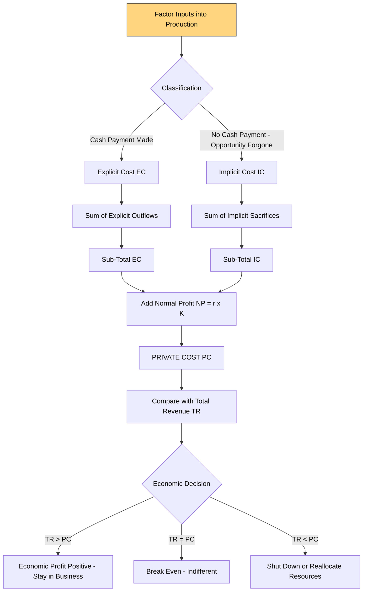
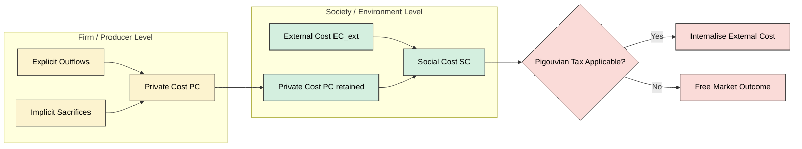
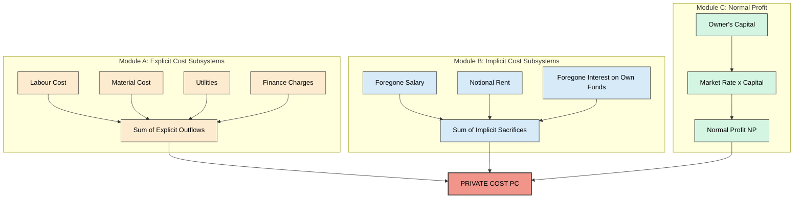
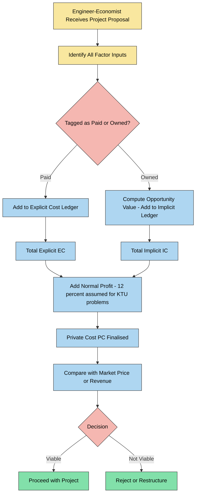

# private cost

<!-- SECTION_1_START -->

# Private Cost — Core Technical Definition & Intuitive Overview

> [!NOTE]
> **KTU 2024 Scheme Definition (UCHUT346 — Module 2: Cost Concepts)**
> **Private Cost** is the actual monetary expenditure and opportunity cost incurred by an individual firm or consumer directly involved in producing or consuming a good or service. It represents the **internal accounting burden** borne by the decision-maker in a market transaction, fully captured in the firm's balance sheet, income statement, and cost ledgers.

In simpler language, **Private Cost is the cost that a company or a person pays out of their own pocket** when they make, buy, or use something. It is the cost that *shows up in the bill*. Whatever the firm writes in its accounting books, pays in cash, transfers via cheque, or sacrifices as a forgone alternative (opportunity cost) is a private cost.

## Conceptual Analogy / Intuition

Imagine you own a small bakery in Kerala.

> You buy flour for **₹2,000**, pay a baker a salary of **₹15,000**, and pay electricity **₹3,000**. The shop is in a building you *own* — if you rented it out, you could earn **₹5,000/month**. The total of *all* of these is your **Private Cost**.
>
> Meanwhile, the smoke from your oven creates pollution that affects your neighbour's health — *that* is **not** in your books. That is an **external cost** (and together with private cost becomes **social cost**).

So **Private Cost = What YOU pay + What YOU sacrifice.** Nothing more.

> [!IMPORTANT]
> **KTU Board Highlight (High-Yield for ESE 2025)**
> 1. Private cost is the **sum of explicit cost and implicit cost**.
> 2. **Normal profit is treated as an implicit cost** in economics for engineers.
> 3. Private cost is **borne internally** by the firm — no third party is involved.
> 4. The difference between **Social Cost** and **Private Cost** gives **External Cost** (negative externalities).

## Components of Private Cost

Private cost has **two main components** that every KTU paper expects you to state:

| S.No. | Component | Definition | Example (Bakery Case) |
|:-----:|-----------|------------|------------------------|
| 1 | **Explicit Cost (Accounting Cost)** | Out-of-pocket monetary payments made to outside parties for factor services. | Wages, rent paid, raw material bills, electricity, interest on borrowed capital. |
| 2 | **Implicit Cost (Opportunity Cost)** | The value of factor services owned by the firm and used in its own production — for which no direct payment is made. | Owner's forgone salary elsewhere, rent not earned on owned building, normal profit on invested capital. |

> [!TIP]
> **Memory Trick for ESE:** **"E-I-N"** — *Explicit cost, Implicit cost, Normal profit*. Total Private Cost = Explicit + Implicit + Normal Profit.

## The Standard Equation

$$
\text{Private Cost (PC)} \;=\; \text{Explicit Cost (EC)} \;+\; \text{Implicit Cost (IC)} \;+\; \text{Normal Profit (NP)}
$$

Where each component is measured in **monetary units (₹ / $)** per accounting period.

> [!VISUALIZATION CONTROL]
> **Concept:** Cost-Component Stacked Area (Baker's Private Cost)
> **GeoGebra / Desmos Input Equations:**
> * `EC(x) = 20000` (Constant explicit cost per month)
> * `IC(x) = 5000` (Constant implicit cost per month)
> * `PC(x) = EC(x) + IC(x) + 5000` (with Normal Profit = 5000)
> **Visual Description:** A horizontal stacked layout along the y-axis. The bottom band is *Explicit Cost* (largest, ₹20,000), the middle band is *Implicit Cost* (₹5,000), and the top sliver is *Normal Profit* (₹5,000). The total stack height represents **₹30,000** as the Total Private Cost.

<!-- SECTION_1_END -->

<!-- SECTION_2_START -->

# Deep Theoretical Analysis & KTU High-Yield Formula Sheet

## 1. Explicit Cost — The "Out-of-Pocket" Component

Explicit costs are the **actual cash outflows** that the firm makes to hire or purchase the services of factors of production owned by *others*. Because they involve a real monetary transaction, they are verifiable through invoices, receipts, bank statements, and journal entries.

**Why it matters in engineering economics:** In a Make-or-Buy decision, depreciation of owned machinery is *implicit*, but the cost of buying spare parts is *explicit*. A misclassification can flip the decision.

**Categories of Explicit Cost (KTU Board Favourite — List & Explain type, 3 marks):**
- **Wages & Salaries** paid to labour.
- **Rent** paid for hired land/building.
- **Interest** on borrowed capital.
- **Cost of raw materials & utilities** (power, water, fuel).
- **Transportation, insurance, taxes, and advertising**.

## 2. Implicit Cost — The "Opportunity" Component

Implicit costs are the **value of self-owned resources** used in the firm's production. There is no cash outflow, but the firm *sacrifices* alternative income. They are computed using the *next-best alternative* principle.

**Why it matters:** A startup founder paying themselves zero salary *thinks* they have zero cost. In economics, the salary they *could* have earned working at Google is an **implicit cost of ₹X lakhs/year**. Ignoring it leads to wrong Break-Even Analysis.

> [!NOTE]
> **KTU Examiner's Pattern (Dec 2023 ESE):** When asked *"Distinguish between explicit and implicit cost with examples"* — students lose marks by *not mentioning that implicit cost does not involve a cash payment* and *not providing a numerical example*. Always write a one-line example.

## 3. Normal Profit as a Component

In engineering economics, the **minimum return that the entrepreneur expects** for taking the risk of running the business is called **Normal Profit**. Because this return is the *opportunity cost of the owner's entrepreneurial ability*, economists treat it as a **part of implicit cost** and hence a part of Private Cost.

$$
\text{Normal Profit} \;=\; \text{Expected Rate of Return} \times \text{Amount of Owner's Capital Invested}
$$

If the firm earns *more* than Normal Profit, the surplus is called **Economic Profit (Pure Profit / Supernormal Profit)**.

## 4. Relationship with Social Cost and External Cost

Private Cost is one of the two pillars of the **Social Cost** framework used in Environmental Economics and Welfare Economics (relevant for Module 4 of UCHUT346).

$$
\text{Social Cost} \;=\; \text{Private Cost} \;+\; \text{External Cost}
$$

$$
\therefore \quad \text{External Cost} \;=\; \text{Social Cost} \;-\; \text{Private Cost}
$$

- If **External Cost = 0** → perfect market with no side effects.
- If **External Cost > 0** → presence of a **negative externality** (e.g., pollution).
- If **External Cost < 0** → presence of a **positive externality** (e.g., free vaccination).

## KTU Formula Sheet / Cheat Sheet

| S.No. | Formula / Identity | Variable Description | Units / Notes |
|:-----:|--------------------|----------------------|----------------|
| 1 | $PC = EC + IC + NP$ | Private Cost = Explicit + Implicit + Normal Profit | ₹ / period |
| 2 | $EC = \sum_{i=1}^{n} p_i \cdot q_i$ | Sum of price $\times$ quantity of factor inputs paid in cash | ₹ |
| 3 | $IC = \sum_{j=1}^{m} \text{Opportunity Value}_j$ | Sum of forgone earnings from self-owned factors | ₹ |
| 4 | $NP = r \cdot K_{\text{own}}$ | Normal profit = market interest rate $\times$ owner's capital | ₹ |
| 5 | $SC = PC + EC_{\text{ext}}$ | Social Cost = Private Cost + External Cost | ₹ |
| 6 | $EC_{\text{ext}} = SC - PC$ | External Cost | ₹ (signed) |
| 7 | $TC_{\text{econ}} = EC + IC$ | Total Economic Cost (ignoring explicit normal profit) | ₹ |
| 8 | $\text{Supernormal Profit} = \text{Total Revenue} - PC$ | Profit above the implicit cost line | ₹ |

> [!IMPORTANT]
> **Memorise the column, not the row.** KTU ESE questions often give you **EC** and ask you to *compute* IC from a "forgone rent" statement. Don't confuse the *raw rent received elsewhere* (relevant for IC) with *rent actually paid* (relevant for EC).

## Real-World Utility in Engineering & Production Systems

- **Break-Even Analysis (Module 3 link):** BEP requires the **total cost** of the firm, which in engineering economics is built on private cost (explicit + implicit).
- **Make-or-Buy Decision (Module 2):** Only private costs (especially implicit depreciation on owned machinery) are compared with the supplier's quote.
- **Pricing & Bidding:** Firms ignore implicit costs in tender documents but must include them to compute *minimum acceptable price*.
- **Life-Cycle Cost Analysis (Module 5):** The LCC of an engineering project is fundamentally a **private cost** stream from the buyer's perspective.
- **Sustainability Audits:** When the firm internalises the external cost, the resulting total is **social cost** — the basis for Pigouvian taxation.

<!-- SECTION_2_END -->

<!-- SECTION_3_START -->

# Step-by-Step Derivations, Worked Numerical Models & Code Implementation

## Worked Numerical Model 1 — Computing Private Cost of a Small Unit

> **KTU Practice Style (Module 2 — Cost Concepts, 7 marks)**
>
> A small engineering unit in Kochi reports the following annual data:
>
> - Wages paid to workers: **₹3,00,000**
> - Cost of raw materials: **₹2,50,000**
> - Rent paid for the workshop: **₹1,20,000**
> - Interest paid on bank loan: **₹60,000**
> - Electricity & water bills: **₹45,000**
> - Salary the owner *foregone* from a private job: **₹2,40,000**
> - Notional rent on owned office space (could earn if rented out): **₹80,000**
> - Normal profit expected on ₹5,00,000 invested capital at 12%: ?
>
> **Compute the Total Private Cost.**

### Step 1 — Classify each item into Explicit vs. Implicit

| Item | Amount (₹) | Category |
|------|-----------:|----------|
| Wages | 3,00,000 | Explicit |
| Raw materials | 2,50,000 | Explicit |
| Rent paid | 1,20,000 | Explicit |
| Interest on loan | 60,000 | Explicit |
| Electricity & water | 45,000 | Explicit |
| Owner's foregone salary | 2,40,000 | Implicit |
| Notional rent on own building | 80,000 | Implicit |

### Step 2 — Sum Explicit Costs

$$
\begin{aligned}
\text{Explicit Cost (EC)} &= 3{,}00{,}000 \;+\; 2{,}50{,}000 \;+\; 1{,}20{,}000 \;+\; 60{,}000 \;+\; 45{,}000 \\
&= 7{,}75{,}000 \text{ ₹}
\end{aligned}
$$

### Step 3 — Sum Implicit Costs

$$
\begin{aligned}
\text{Implicit Cost (IC)} &= 2{,}40{,}000 \;+\; 80{,}000 \\
&= 3{,}20{,}000 \text{ ₹}
\end{aligned}
$$

### Step 4 — Compute Normal Profit

$$
\begin{aligned}
\text{Normal Profit (NP)} &= 12\% \times 5{,}00{,}000 \\
&= 0.12 \times 5{,}00{,}000 \\
&= 60{,}000 \text{ ₹}
\end{aligned}
$$

### Step 5 — Add them to get Private Cost

$$
\begin{aligned}
\text{PC} &= \text{EC} \;+\; \text{IC} \;+\; \text{NP} \\
&= 7{,}75{,}000 \;+\; 3{,}20{,}000 \;+\; 60{,}000 \\
&= 11{,}55{,}000 \text{ ₹}
\end{aligned}
$$

> **[Stating classification correctly: 2 Marks] [Summing explicit and implicit: 2 Marks] [Computing normal profit: 1 Mark] [Final total: 2 Marks]**

## Worked Numerical Model 2 — Economic Profit vs. Accounting Profit

> A firm has:
> - Total Revenue = **₹8,00,000**
> - Explicit Cost = **₹4,50,000**
> - Implicit Cost = **₹1,50,000**
> - Normal Profit expected = **₹50,000**
>
> **Find Accounting Profit, Economic Profit, and Supernormal Profit.**

### Step 1 — Accounting Profit (uses only Explicit Cost)

$$
\begin{aligned}
\text{Accounting Profit} &= \text{Total Revenue} \;-\; \text{Explicit Cost} \\
&= 8{,}00{,}000 \;-\; 4{,}50{,}000 \\
&= 3{,}50{,}000 \text{ ₹}
\end{aligned}
$$

### Step 2 — Economic Profit (uses Full Private Cost)

$$
\begin{aligned}
\text{Economic Profit} &= \text{Total Revenue} \;-\; \text{PC} \\
\text{where } \text{PC} &= \text{EC} + \text{IC} + \text{NP} = 4{,}50{,}000 + 1{,}50{,}000 + 50{,}000 = 6{,}50{,}000 \\
\text{Economic Profit} &= 8{,}00{,}000 \;-\; 6{,}50{,}000 \\
&= 1{,}50{,}000 \text{ ₹}
\end{aligned}
$$

### Step 3 — Supernormal Profit (Economic Profit)

$$
\text{Supernormal Profit} = \text{Economic Profit} - \text{Normal Profit already absorbed} = 1{,}50{,}000 - 50{,}000 = 1{,}00{,}000 \text{ ₹}
$$

> Alternatively, some texts define *Supernormal Profit* = Economic Profit itself. State your convention at the start of the answer to avoid examiner confusion.

## Symbolic / Algorithmic Implementation (Python)

The following Python script computes private cost from user input, validates it, and prints a structured receipt. It mirrors the **KTU ESE tabular valuation key** format.

```python
"""
Module: Economics for Engineers (UCHUT346)
Topic : Private Cost Calculator
Engineered for: KTU 2024 Scheme students
Author pattern: KTU Premium Study Notes
"""

from dataclasses import dataclass
from typing import List


@dataclass
class CostItem:
    """Single line item in a firm's cost ledger."""
    name: str
    amount: float
    is_explicit: bool  # True => Explicit ; False => Implicit


def compute_normal_profit(own_capital: float, market_rate: float) -> float:
    """
    NP = r * K_own
    own_capital: owner's capital in INR
    market_rate:  expected return as a decimal (e.g. 0.12 for 12%)
    """
    if own_capital < 0 or not (0.0 <= market_rate <= 1.0):
        raise ValueError("Invalid capital or rate input.")
    return own_capital * market_rate


def compute_private_cost(items: List[CostItem],
                         own_capital: float,
                         market_rate: float) -> dict:
    """
    Returns a dict with EC, IC, NP, and PC.
    Raises RuntimeError if the list is empty.
    """
    if not items:
        raise RuntimeError("No cost items provided to the calculator.")

    ec = sum(item.amount for item in items if item.is_explicit)
    ic = sum(item.amount for item in items if not item.is_explicit)
    np = compute_normal_profit(own_capital, market_rate)
    pc = ec + ic + np

    return {"EC": ec, "IC": ic, "NP": np, "PC": pc}


def print_receipt(result: dict) -> None:
    """Pretty-prints the breakdown in a KTU board style."""
    print("=" * 45)
    print(f" Explicit Cost (EC)  : INR {result['EC']:>12,.2f}")
    print(f" Implicit Cost (IC)  : INR {result['IC']:>12,.2f}")
    print(f" Normal Profit (NP)  : INR {result['NP']:>12,.2f}")
    print("-" * 45)
    print(f" PRIVATE COST (PC)   : INR {result['PC']:>12,.2f}")
    print("=" * 45)


# ---------- DEMO RUN ----------
if __name__ == "__main__":
    ledger = [
        CostItem("Wages",          3_00_000, is_explicit=True),
        CostItem("Raw Materials",  2_50_000, is_explicit=True),
        CostItem("Rent Paid",      1_20_000, is_explicit=True),
        CostItem("Loan Interest",     60_000, is_explicit=True),
        CostItem("Electricity",       45_000, is_explicit=True),
        CostItem("Owner's Salary", 2_40_000, is_explicit=False),
        CostItem("Notional Rent",    80_000, is_explicit=False),
    ]
    output = compute_private_cost(ledger, own_capital=5_00_000, market_rate=0.12)
    print_receipt(output)
```

### Expected Console Output

```
=============================================
 Explicit Cost (EC)  : INR  7,75,000.00
 Implicit Cost (IC)  : INR  3,20,000.00
 Normal Profit (NP)  : INR     60,000.00
---------------------------------------------
 PRIVATE COST (PC)   : INR 11,55,000.00
=============================================
```

<!-- SECTION_3_END -->

<!-- SECTION_4_START -->

# Structural Diagrams & Schematics

## 4.1 Functional Architecture of Private Cost Computation



## 4.2 Sequential Topology — Private Cost vs. Social Cost



## 4.3 Modular Decomposition — Sub-Modules of Private Cost



## 4.4 Decision Flowchart — Engineer-Manager's View



<!-- SECTION_4_END -->

<!-- SECTION_5_START -->

# KTU 2024 Scheme Examination Question Bank & Topic Recap

## Part A — Short Answer Questions (3 Marks Each)

### Question A1

> **[KTU University Exam — July 2024]** **CO1, Remember**
> *Define private cost. State its two major components.*
>
> **Model Answer (3 marks):**
> **Private Cost** is the total cost incurred by an individual firm or consumer in producing or consuming a commodity, comprising all out-of-pocket expenses and the opportunity cost of self-owned resources used. **[1 Mark]**
> Its two major components are: **(i) Explicit Cost** — actual monetary payments to outsiders such as wages, rent, materials. **(ii) Implicit Cost** — imputed value of self-owned resources, including normal profit. **[2 Marks]**

### Question A2

> **[KTU University Exam — Dec 2023]** **CO1, Understand**
> *Differentiate between explicit cost and implicit cost. Give one example of each.*
>
> **Model Answer (3 marks):**
> **Explicit Cost** involves a *direct cash payment* by the firm to external factor suppliers; e.g., ₹20,000 monthly wages paid to workers. **[1.5 Marks]**
> **Implicit Cost** does *not* involve any cash payment; it represents the *opportunity cost* of self-owned factors; e.g., the ₹30,000 salary the owner *could have* earned by taking a job elsewhere. **[1.5 Marks]**

---

## Part B — 14-Mark Questions (Module Internal Choice)

### Question B — Choice A (14 Marks)

> **[KTU University Exam — Model 2024 Pattern]** **CO1 / CO2 — Apply / Analyse**
>
> **(a)** *A manufacturing firm reports the following annual data. Compute the **Total Private Cost** of the firm.* **[7 Marks]**
>
> | Item | Amount (₹) |
> |------|-----------:|
> | Wages & Salaries | 4,00,000 |
> | Raw Materials | 3,50,000 |
> | Rent Paid | 1,20,000 |
> | Electricity & Fuel | 80,000 |
> | Interest on Bank Loan | 50,000 |
> | Foregone Salary of Owner | 2,40,000 |
> | Notional Rent on Owned Building | 90,000 |
> | Owner's Capital Invested | 6,00,000 |
> | Expected Normal Rate of Return | 12% |
>
> **(b)** *If the **Total Revenue** earned by the firm is **₹14,00,000**, compute the **(i) Accounting Profit, (ii) Economic Profit, and (iii) Supernormal Profit** of the firm. Briefly comment on whether the firm should continue operations.* **[7 Marks]**

#### Model Solution

**Part (a) — Total Private Cost**

> **[Identifying the components correctly: 2 Marks]**

- **Explicit Costs (EC):** Wages 4,00,000 + Raw Materials 3,50,000 + Rent 1,20,000 + Electricity 80,000 + Loan Interest 50,000

$$
\begin{aligned}
\text{EC} &= 4{,}00{,}000 + 3{,}50{,}000 + 1{,}20{,}000 + 80{,}000 + 50{,}000 \\
&= 10{,}00{,}000 \text{ ₹}
\end{aligned}
$$

> **[Sum of Explicit Cost: 2 Marks]**

- **Implicit Costs (IC):** Foregone Salary 2,40,000 + Notional Rent 90,000

$$
\begin{aligned}
\text{IC} &= 2{,}40{,}000 + 90{,}000 \\
&= 3{,}30{,}000 \text{ ₹}
\end{aligned}
$$

> **[Sum of Implicit Cost: 1 Mark]**

- **Normal Profit (NP):**

$$
\begin{aligned}
\text{NP} &= 12\% \times 6{,}00{,}000 \\
&= 72{,}000 \text{ ₹}
\end{aligned}
$$

> **[Normal profit calculation: 1 Mark]**

- **Private Cost (PC):**

$$
\begin{aligned}
\text{PC} &= \text{EC} + \text{IC} + \text{NP} \\
&= 10{,}00{,}000 + 3{,}30{,}000 + 72{,}000 \\
&= 14{,}02{,}000 \text{ ₹}
\end{aligned}
$$

> **[Final Private Cost: 1 Mark]**

**Part (b) — Profit Computations and Decision**

Given: Total Revenue (TR) = ₹14,00,000

- **(i) Accounting Profit:**

$$
\begin{aligned}
\text{AP} &= \text{TR} - \text{EC} \\
&= 14{,}00{,}000 - 10{,}00{,}000 \\
&= 4{,}00{,}000 \text{ ₹}
\end{aligned}
$$

> **[Accounting Profit: 2 Marks]**

- **(ii) Economic Profit:**

$$
\begin{aligned}
\text{EP} &= \text{TR} - \text{PC} \\
&= 14{,}00{,}000 - 14{,}02{,}000 \\
&= -2{,}000 \text{ ₹}
\end{aligned}
$$

> **[Economic Profit: 2 Marks]**

- **(iii) Supernormal Profit:** = Economic Profit above Normal Profit

$$
\begin{aligned}
\text{SP} &= \text{EP} - \text{NP absorbed in PC} \\
&= -2{,}000 - 72{,}000 \\
&= -74{,}000 \text{ ₹}
\end{aligned}
$$

> **[Supernormal Profit: 1 Mark]**

- **Decision Comment:** Since **Economic Profit is negative (₹-2,000)**, the firm is *not even covering its full private cost*. In the short run it may continue (since accounting profit is positive), but in the long run the owner is *better off closing down or reinvesting elsewhere*. **[2 Marks]**

---

### Question B — Choice B (14 Marks) — Alternative Selection

> **[KTU University Exam — Model 2024 Pattern]** **CO1 / CO2 — Understand / Apply**
>
> **(a)** *Explain the concept of **Social Cost**. How is it different from **Private Cost**? Use a suitable example of a cement factory.* **[7 Marks]**
>
> **(b)** *The cost data of an engineering firm is: EC = ₹5,00,000, IC = ₹1,20,000, Normal Profit = ₹40,000, Total Revenue = ₹8,00,000. Calculate **Private Cost, Economic Cost, Economic Profit, Accounting Profit**, and state whether the firm is in **Equilibrium**.* **[7 Marks]**

#### Model Solution

**Part (a) — Social Cost vs. Private Cost**

> **[Definition of Social Cost: 2 Marks]**

**Social Cost** is the total cost borne by *society* as a whole when a unit of a good is produced or consumed. It includes the firm's private cost **plus** the cost imposed on third parties who are not part of the production decision (called **External Cost**).

$$
\text{Social Cost} = \text{Private Cost} + \text{External Cost}
$$

> **[Relationship formula: 1 Mark]**

**Cement Factory Example:** A cement factory in Palakkad pays for limestone, fuel, wages, and transport — these form its **Private Cost**. However, the dust and particulate emissions cause respiratory illness among nearby residents and damage to local crops. The medical expenses and crop loss borne by villagers are **External Costs**. The sum of both is the **Social Cost** of producing one tonne of cement.

> **[Example explanation: 3 Marks]**

**Key Difference:** Private Cost is borne *internally* by the firm and is accounted for in its books. Social Cost is borne by the *whole society* and may not appear in the firm's accounting. **[1 Mark]**

**Part (b) — Computations**

Given: EC = ₹5,00,000; IC = ₹1,20,000; NP = ₹40,000; TR = ₹8,00,000

- **(i) Private Cost:**

$$
\begin{aligned}
\text{PC} &= \text{EC} + \text{IC} + \text{NP} \\
&= 5{,}00{,}000 + 1{,}20{,}000 + 40{,}000 \\
&= 6{,}60{,}000 \text{ ₹}
\end{aligned}
$$

> **[Private Cost: 1 Mark]**

- **(ii) Economic Cost:**

$$
\text{EC}_{\text{econ}} = \text{EC} + \text{IC} = 5{,}00{,}000 + 1{,}20{,}000 = 6{,}20{,}000 \text{ ₹}
$$

> **[Economic Cost: 1 Mark]**

- **(iii) Accounting Profit:**

$$
\text{AP} = \text{TR} - \text{EC} = 8{,}00{,}000 - 5{,}00{,}000 = 3{,}00{,}000 \text{ ₹}
$$

> **[Accounting Profit: 1 Mark]**

- **(iv) Economic Profit:**

$$
\text{EP} = \text{TR} - \text{PC} = 8{,}00{,}000 - 6{,}60{,}000 = 1{,}40{,}000 \text{ ₹}
$$

> **[Economic Profit: 1 Mark]**

- **(v) Equilibrium Check:** A firm is in **long-run equilibrium** when **Economic Profit = 0** *and* it is earning only its **Normal Profit**. Here, EP = +₹1,40,000 (positive). The firm is earning **supernormal profit**. In a competitive market, this would attract new entrants, driving prices down until EP = 0. Thus, the firm is **not in long-run equilibrium** but is in a **short-run profit-maximising state**.

> **[Equilibrium comment: 2 Marks]**

---

> [!WARNING]
> **KTU Examiner's Valuation Warning / Common Pitfalls**
> 1. **Forgetting Normal Profit:** Many students write *PC = EC + IC* and skip Normal Profit. KTU specifically tests this — you lose 1 mark *every time*.
> 2. **Confusing "Foregone" with "Paid":** *Foregone salary* and *notional rent* are **Implicit**, not Explicit. Many students wrongly add them under "Rent Paid". A single wrong classification can cascade into wrong totals.
> 3. **Mixing Accounting Profit and Economic Profit:** Always state the formula *before* substituting. Examiners award partial credit only when the *approach* is correct.
> 4. **No units mentioned:** Always write **₹ ... per annum** or per the period stated in the question. Missing units = 0.5 mark deduction.
> 5. **No "Decision" comment:** When a numerical question asks "should the firm continue?", the final *qualitative statement* is mandatory for full marks.
> 6. **Sundry Points (Lapses):** Writing *cost* without clarifying *cost to whom* (firm vs. society) leads to ambiguity. Always specify.

---

## Topic Recap & Important Things to Remember

- **Private Cost (PC)** is the cost borne **internally** by a firm or individual in a market transaction — it is the sum of **Explicit Cost, Implicit Cost, and Normal Profit**.
- **Explicit Cost (EC)** = sum of all **cash payments** to outsiders — wages, rent, materials, interest, utilities.
- **Implicit Cost (IC)** = sum of **opportunity values** of self-owned factors — foregone salary, notional rent, foregone interest.
- **Normal Profit (NP)** = the **expected minimum return** on the owner's invested capital, treated as an **implicit cost** in economics.
- **Master Equation:** $PC = EC + IC + NP$
- **Social Cost (SC)** is the private cost **plus** external cost: $SC = PC + EC_{\text{ext}}$.
- **External Cost** = $SC - PC$; positive value indicates a **negative externality**.
- **Accounting Profit** = $TR - EC$ (the *CA Final* style number).
- **Economic Profit** = $TR - PC$ (the *true* economic surplus).
- **Supernormal Profit** = *Economic Profit* above the *Normal Profit* line.
- **Equilibrium Condition** (long-run, perfect competition): **Economic Profit = 0**.
- **Practical Application Spots:** Break-Even Analysis, Make-or-Buy Decision, Project Appraisal, Pricing, LCC, and Pigouvian Tax discussions.
- **Memory Anchor (E-I-N):** *Explicit, Implicit, Normal Profit* → add all three → *Private Cost*.
- **Common Mistake to Avoid:** Treating *all* rent and salary as Explicit. "Foregone" or "Notional" prefixes are the give-away sign of **Implicit** cost.
- **Examiner-Loved Keyword Phrases:** *"out-of-pocket payment"*, *"opportunity cost of self-owned factors"*, *"minimum expected entrepreneurial return"*, *"internal burden on the decision-maker"*.
- **Question Tag Trick:** If a question gives a *foregone* amount and asks for total cost — it is testing **Private Cost**, not just total cost.
- **PYQ Weightage (2019-2024 trend):** Private Cost appears in Module 2 ESE almost every semester, typically as a 3-mark definition or a 7-mark computation sub-part.

<!-- SECTION_5_END -->
