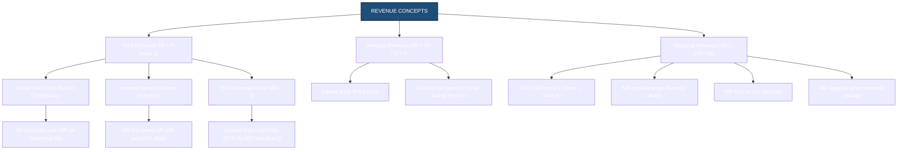
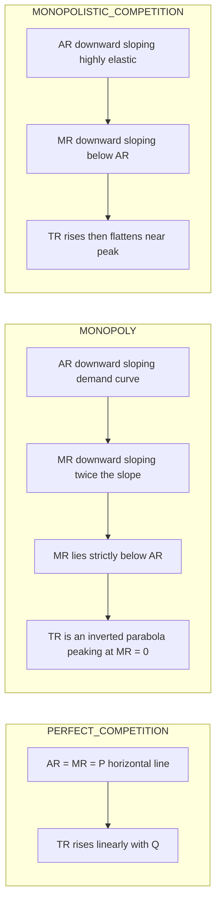
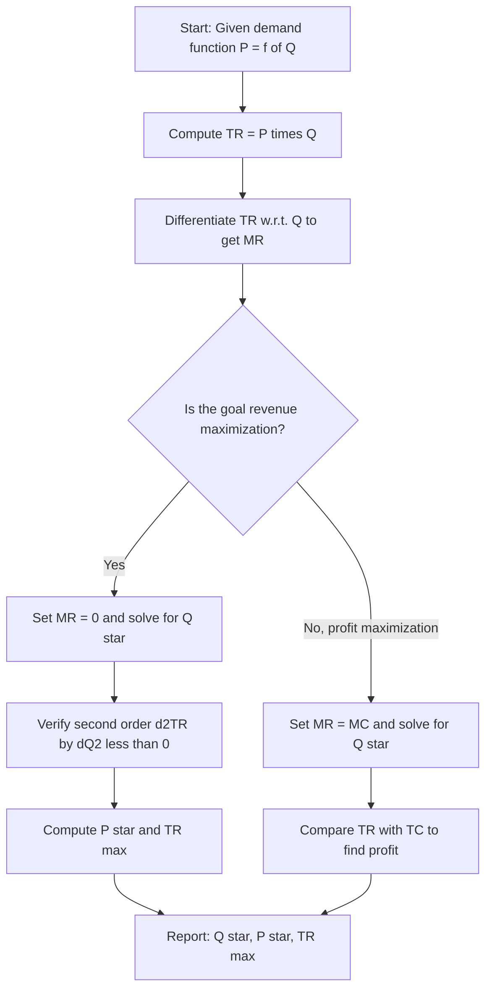

# Revenue concepts

<!-- SECTION_1_START -->
# Revenue Concepts — Core Technical Definition & Intuitive Overview

## 1.1 Formal Definition (KTU 2024 Scheme Terminology)

> [!IMPORTANT]
> **Revenue** refers to the total receipts obtained by a firm from the sale of a specified quantity of a commodity during a given period of time. It is the **monetary value** of the output sold and forms the foundational metric upon which all profit, loss, and break-even computations in engineering economics are constructed.

In the context of **Engineering Economics (UCHUT346)**, revenue analysis is critical because every capital investment, break-even decision, and feasibility study ultimately depends on forecasting and interpreting the revenue stream a project or product will generate. Engineers must distinguish between three fundamental revenue measures:

- **Total Revenue (TR)** — the aggregate monetary inflow from total sales.
- **Average Revenue (AR)** — the revenue realized per unit of output.
- **Marginal Revenue (MR)** — the incremental revenue earned by selling one additional unit.

## 1.2 Intuitive Overview — A Real-World Analogy

> [!NOTE]
> **The Lemonade Stand Analogy:** Imagine you run a lemonade stand in a park.
> - **Total Revenue (TR)** is the **total cash in your cash box** at the end of the day after selling all glasses. If you sold **50 glasses at ₹20 each**, TR = ₹1000.
> - **Average Revenue (AR)** is the **price per glass** — what you earned *on average* for each glass sold. Here, AR = ₹1000/50 = **₹20**.
> - **Marginal Revenue (MR)** is the **extra money you pocket** when you sell **one more glass**. If lowering the price from ₹20 to ₹18 increased your sales from 50 to 56 glasses, then MR = (56 × 18) − (50 × 20) = 1008 − 1000 = **₹8**.

This lemonade analogy makes it clear that:
- AR is essentially the **price** the market is willing to pay.
- MR reveals whether **expanding output** is actually profitable.
- TR is the **bottom-line earning** the firm targets.

> [!TIP]
> **Key Insight for KTU Exams:** AR is *always* numerically equal to the **Price (P)** of the commodity, because AR = TR/Q = (P × Q)/Q = P. This single identity is a high-frequency mark-earning point in board evaluations.

## 1.3 Standard Metrics & Physical Constants

| Metric | Symbol | Standard Unit (SI / Commercial) |
| :--- | :---: | :--- |
| Total Revenue | $TR$ | **₹ (Indian Rupees)** / $ (US Dollar) |
| Average Revenue | $AR$ | **₹ per unit** |
| Marginal Revenue | $MR$ | **₹ per additional unit** |
| Quantity Sold | $Q$ | **Units** (pieces, kg, litres, etc.) |
| Price per Unit | $P$ | **₹ per unit** |

> [!IMPORTANT]
> **Syllabus Highlight (KTU UCHUT346 — Module 2):** The Board Examiner expects students to (a) define TR, AR, and MR rigorously, (b) derive the relationship between AR and MR under various elasticity conditions, and (c) sketch the revenue curves under **Perfect Competition**, **Monopoly**, and **Monopolistic Competition** with correct slope behaviour.

## 1.4 GeoGebra / Desmos Visualization Callout

> [!VISUALIZATION CONTROL]
> **Concept:** Revenue Curves under Perfect Competition vs. Monopoly
>
> **GeoGebra / Desmos Input Equations (Perfect Competition):**
> * $P(x) = 10$  *(horizontal AR = MR line, perfect competition)*
> * $TR(x) = 10x$  *(straight-line through origin)*
>
> **GeoGebra / Desmos Input Equations (Monopoly — Downward-sloping Demand):**
> * $AR(x) = 20 - 0.5x$  *(linear demand / average revenue)*
> * $MR(x) = 20 - x$  *(twice the slope of AR, lying below AR)*
> * $TR(x) = x(20 - 0.5x) = 20x - 0.5x^2$  *(inverted parabola, peaks where MR = 0)*
>
> **Visual Description:**
> - In the **Perfect Competition** plot, AR and MR coincide as a **horizontal straight line at ₹10**, and TR is a **45° upward straight line** passing through the origin.
> - In the **Monopoly** plot, AR slopes **downward gently**, MR slopes **downward steeply (twice the slope)** lying *below* AR, and TR forms a **parabolic arch** that peaks at the point where the MR curve intersects the x-axis.
> - Students should observe the **MR = 0 intersection point** on the x-axis, marking the **revenue-maximizing output level** under monopoly.

<!-- SECTION_1_END -->

<!-- SECTION_2_START -->
# Deep Theoretical Analysis & KTU High-Yield Formula Sheet

## 2.1 The Three Revenue Measures — A Structured Breakdown

### 2.1.1 Total Revenue (TR)
- **Definition:** The total amount of money a firm receives by selling a given quantity of output.
- **Operational Logic:** It is the product of the price per unit and the number of units sold. As the firm increases output, TR rises *only as long as* the marginal revenue from each extra unit remains positive.
- **Why it matters:** TR is the **top-line figure** on a firm's income statement. Every profit, break-even, and feasibility calculation begins here.

### 2.1.2 Average Revenue (AR)
- **Definition:** Revenue earned *per unit* of output sold.
- **Operational Logic:** AR is computed as the *arithmetic mean* of revenue across all units. Because the firm sells each unit at the prevailing market price, AR is **mathematically identical to the price** of the good.
- **Why it matters:** AR serves as the **demand curve** facing the individual firm. Its slope reveals the market structure.

### 2.1.3 Marginal Revenue (MR)
- **Definition:** The *change* in total revenue resulting from the sale of **one additional unit** of output.
- **Operational Logic:** MR is the **first derivative** of the TR function with respect to quantity. It tells the firm whether the next unit of production will *add* to or *subtract from* total earnings.
- **Why it matters:** MR is the **decision-making pivot** — production should be expanded as long as MR ≥ 0.

## 2.2 The Fundamental Identities

> [!NOTE]
> These three identities are **the most-tested formulas** in KTU Module 2. Memorize them in symbolic and verbal form.

| # | Identity | Mathematical Form | Verbal Interpretation |
| :---: | :--- | :--- | :--- |
| 1 | Total Revenue | $TR = P \times Q$ | Price times quantity sold |
| 2 | Average Revenue | $AR = \dfrac{TR}{Q} = P$ | Revenue per unit, equal to price |
| 3 | Marginal Revenue | $MR = \dfrac{\Delta TR}{\Delta Q} = TR_n - TR_{n-1}$ | Change in TR from one more unit |
| 4 | MR in Calculus Form | $MR = \dfrac{d(TR)}{dQ}$ | First derivative of TR w.r.t. Q |

## 2.3 KTU High-Yield Formula Sheet (Revenue + Elasticity Linkage)

> [!IMPORTANT]
> The relationship between MR, AR, and the **Price Elasticity of Demand ($e_p$)** is a **favourite 7-mark question** in KTU Board Exams. The following table is your cheat sheet.

| Market / Elasticity Condition | Slope of AR | Slope of MR | Sign of MR | TR Behaviour |
| :--- | :---: | :---: | :---: | :--- |
| Perfect Competition ($e_p = \infty$) | Horizontal (zero slope) | Horizontal (coincides with AR) | $MR = AR = P$ (constant) | TR rises *linearly* with Q |
| Monopoly / Imperfect ($e_p > 1$, elastic) | Downward (negative slope) | Downward (twice the slope) | $MR > 0$ | TR is **rising** at a decreasing rate |
| Unit Elastic ($e_p = 1$) | Downward | Downward | $MR = 0$ | TR is at its **maximum** |
| Inelastic Demand ($e_p < 1$) | Downward | Downward | $MR < 0$ | TR is **falling** |

### Critical Derived Formula — MR in terms of AR and Elasticity

$$\boxed{MR = AR \left(1 - \dfrac{1}{e_p}\right)}$$

Equivalently:

$$\boxed{MR = P \left(1 - \dfrac{1}{e_p}\right) = P \left(\dfrac{e_p - 1}{e_p}\right)}$$

> [!TIP]
> **Why does this matter in real engineering economics?** When a manufacturing firm considers whether to **cut the price of a product** to push more units, the elasticity-MR linkage tells the manager precisely *how much* revenue will change. If demand is elastic ($e_p > 1$), a price cut *increases* revenue. If inelastic ($e_p < 1$), a price cut *reduces* revenue — a vital insight for product pricing in industries like automobiles, electronics, and consumer durables.

## 2.4 Revenue Curves Under Different Market Structures

### 2.4.1 Perfect Competition
- The firm is a **price taker**; it can sell any quantity at the prevailing market price.
- **AR curve** = **MR curve** = a **horizontal straight line** at the level of price.
- **TR curve** is a **straight line** emanating from the origin with slope equal to the price.

### 2.4.2 Monopoly
- The firm is a **price maker**; it must lower price to sell more units.
- **AR curve** slopes **downward** (downward-sloping demand).
- **MR curve** also slopes downward but **steeper** — its slope is **twice** that of the AR curve.
- **MR lies below AR** for every output level.
- **TR curve** is an **inverted parabola** — it rises, peaks (where MR = 0), and then declines.

### 2.4.3 Monopolistic Competition
- Many sellers, differentiated products; the firm faces a **highly elastic** downward-sloping demand.
- Behaviour is **qualitatively similar to monopoly**, but the AR and MR curves are **flatter** (more elastic).

## 2.5 Revenue-Maximization Condition

> [!IMPORTANT]
> **Theorem (Revenue Maximization):** A firm maximizes its Total Revenue at the output level where **Marginal Revenue equals zero**, provided the second-order condition $\dfrac{d^2(TR)}{dQ^2} < 0$ is satisfied.

The first-order condition:

$$\dfrac{d(TR)}{dQ} = 0 \quad \Longleftrightarrow \quad MR = 0$$

The second-order condition:

$$\dfrac{d^2(TR)}{dQ^2} < 0$$

This result is the *mirror image* of profit maximization (where $MR = MC$). Revenue maximization is **not** the same as profit maximization — a critical distinction examiners love to test.

## 2.6 Real-World Utility in Engineering & Computer Science

- **Manufacturing & Operations:** Production planning teams use TR and MR to decide *how many units* to manufacture before diminishing returns collapse revenue.
- **Software as a Service (SaaS):** SaaS companies use AR (average revenue per user, ARPU) and MR to model subscription tier changes.
- **Telecommunications:** Telecom operators (Jio, Airtel, Vi) evaluate per-user ARPU to design recharge plans.
- **Automobile Industry:** Tesla, Tata Motors, and Maruti use elasticity-MR analysis when launching new variants and adjusting prices.
- **Public Sector / Government Tendering:** Engineers evaluating PPP (Public-Private Partnership) projects forecast the **revenue stream** from a toll road or bridge using TR/AR/MR logic.
- **E-Commerce:** Amazon, Flipkart, and Meesho dynamically price products using elasticity-based MR calculations.

<!-- SECTION_2_END -->

<!-- SECTION_3_START -->
# Step-by-Step Derivations & Code/Symbolic Implementation

## 3.1 Derivation 1 — The MR–AR–Elasticity Relationship

> [!NOTE]
> **Starting Point:** A linear (or general) inverse demand function: $P = f(Q)$.

**Step 1 — Express Total Revenue as a function of Quantity.**

$$TR = P \times Q = f(Q) \cdot Q$$

**Step 2 — Differentiate TR with respect to Q to obtain MR.**

$$MR = \dfrac{d(TR)}{dQ} = \dfrac{d}{dQ}\bigl[P \cdot Q\bigr]$$

**Step 3 — Apply the product rule of differentiation.**

$$MR = P \cdot \dfrac{dQ}{dQ} + Q \cdot \dfrac{dP}{dQ} = P + Q \cdot \dfrac{dP}{dQ}$$

**Step 4 — Express in elasticity form using $e_p = -\dfrac{P}{Q} \cdot \dfrac{dQ}{dP}$.**

From the elasticity definition:

$$\dfrac{dQ}{dP} = -\dfrac{Q}{e_p \cdot P} \quad \Longrightarrow \quad \dfrac{dP}{dQ} = -\dfrac{P}{e_p \cdot Q} \cdot \dfrac{1}{1} \cdot (-1) \cdot \text{(rearranging)}$$

A cleaner rearrangement gives:

$$Q \cdot \dfrac{dP}{dQ} = -\dfrac{P}{e_p}$$

**Step 5 — Substitute back into the MR expression.**

$$MR = P + \left(-\dfrac{P}{e_p}\right) = P \left(1 - \dfrac{1}{e_p}\right)$$

Since $P = AR$:

$$\boxed{MR = AR\left(1 - \dfrac{1}{e_p}\right)}$$

**Verification across elasticity regimes:**

- If $e_p = \infty$ (perfect competition): $MR = AR \cdot (1 - 0) = AR$ ✓
- If $e_p = 1$ (unit elastic): $MR = AR \cdot (1 - 1) = 0$ ✓
- If $e_p = 2$ (elastic): $MR = AR \cdot (1 - 0.5) = 0.5 \cdot AR > 0$ ✓
- If $e_p = 0.5$ (inelastic): $MR = AR \cdot (1 - 2) = -AR < 0$ ✓

> [!TIP]
> **Valuation Key Point (KTU Board):** The examiner awards **[1 Mark]** for stating the inverse demand, **[2 Marks]** for the product-rule differentiation, **[2 Marks]** for substituting elasticity, and **[2 Marks]** for the final boxed expression.

## 3.2 Derivation 2 — Revenue Maximization under Linear Demand

**Given:** $P = a - bQ$, where $a > 0$ and $b > 0$ are constants.

**Step 1 — Compute TR.**

$$TR = P \cdot Q = (a - bQ) \cdot Q = aQ - bQ^2$$

**Step 2 — Compute MR by differentiating TR with respect to Q.**

$$MR = \dfrac{d(TR)}{dQ} = a - 2bQ$$

**Step 3 — Verify that AR equals P.**

$$AR = \dfrac{TR}{Q} = a - bQ = P \quad \checkmark$$

**Step 4 — Observe that MR has twice the slope of AR.**

$$MR = a - 2bQ \quad \text{vs.} \quad AR = a - bQ$$

The slope of MR is $-2b$; the slope of AR is $-b$. MR falls **twice as fast** as AR. ✓

**Step 5 — Apply the revenue-maximization condition (MR = 0).**

$$a - 2bQ = 0 \quad \Longrightarrow \quad Q^* = \dfrac{a}{2b}$$

**Step 6 — Compute the corresponding price.**

$$P^* = a - b \cdot \dfrac{a}{2b} = a - \dfrac{a}{2} = \dfrac{a}{2}$$

**Step 7 — Compute the maximum Total Revenue.**

$$TR_{\max} = P^* \cdot Q^* = \dfrac{a}{2} \cdot \dfrac{a}{2b} = \dfrac{a^2}{4b}$$

**Step 8 — Confirm the second-order condition.**

$$\dfrac{d^2(TR)}{dQ^2} = -2b < 0 \quad \checkmark \text{ (since } b > 0 \text{, this is a maximum)}$$

$$\boxed{Q_{\text{revenue-max}} = \dfrac{a}{2b}, \quad P_{\text{revenue-max}} = \dfrac{a}{2}, \quad TR_{\max} = \dfrac{a^2}{4b}}$$

## 3.3 Numerical Worked Example — A KTU-Style 7-Mark Problem

> [!NOTE]
> **Problem Statement (KTU Pattern):** The demand function for a product is $P = 100 - 2Q$. Find:
> (a) The Total Revenue at $Q = 10$ units.
> (b) The Marginal Revenue when output increases from 10 to 11 units.
> (c) The output level that maximizes Total Revenue, and the maximum TR value.
> (d) The price elasticity of demand at the revenue-maximizing output.

**Given:** $P = 100 - 2Q$, with $a = 100$, $b = 2$.

**Part (a) — TR at Q = 10:**

$$TR = P \cdot Q = (100 - 2 \times 10) \times 10 = (100 - 20) \times 10 = 80 \times 10 = ₹800$$

**Part (b) — MR from Q = 10 to Q = 11:**

At $Q = 10$: $P = 80$, $TR_{10} = 80 \times 10 = ₹800$.
At $Q = 11$: $P = 100 - 2 \times 11 = 78$, $TR_{11} = 78 \times 11 = ₹858$.

$$MR = TR_{11} - TR_{10} = 858 - 800 = ₹58 \text{ per additional unit}$$

**Part (c) — Revenue-maximizing output and maximum TR:**

$$MR = a - 2bQ = 100 - 4Q$$

Set $MR = 0$:

$$100 - 4Q = 0 \quad \Longrightarrow \quad Q^* = 25 \text{ units}$$

Corresponding price:

$$P^* = 100 - 2 \times 25 = 100 - 50 = ₹50$$

Maximum Total Revenue:

$$TR_{\max} = 50 \times 25 = ₹1250$$

**Part (d) — Price elasticity of demand at Q = 25:**

$$e_p = -\dfrac{dQ}{dP} \cdot \dfrac{P}{Q} = -\left(-\dfrac{1}{2}\right) \cdot \dfrac{50}{25} = \dfrac{1}{2} \cdot 2 = 1$$

At the revenue-maximizing point, demand is **unit elastic** ($e_p = 1$), which is consistent with the theoretical result $MR = 0$ when $e_p = 1$. ✓

## 3.4 Python Implementation — Revenue Curve Plotter

```python
from __future__ import annotations

import logging
import sys
from typing import Tuple

import numpy as np

# Configure structured logging for engineering traceability
logging.basicConfig(
    level=logging.INFO,
    format="%(asctime)s | %(levelname)s | %(message)s",
    stream=sys.stdout,
)
logger = logging.getLogger("RevenueEngine")


def compute_revenue_measures(
    a: float, b: float, q: np.ndarray
) -> Tuple[np.ndarray, np.ndarray, np.ndarray]:
    """
    Compute Total Revenue, Average Revenue, and Marginal Revenue
    for the linear inverse demand function P = a - b*Q.

    Parameters
    ----------
    a : float
        Vertical intercept of the demand curve (must be > 0).
    b : float
        Slope coefficient (must be > 0).
    q : np.ndarray
        Array of output quantities (must be >= 0).

    Returns
    -------
    Tuple[np.ndarray, np.ndarray, np.ndarray]
        (TR, AR, MR) arrays aligned with the input quantities.

    Raises
    ------
    ValueError
        If any parameter violates the domain constraints.
    """
    if a <= 0:
        raise ValueError(f"Intercept 'a' must be positive, got {a}")
    if b <= 0:
        raise ValueError(f"Slope 'b' must be positive, got {b}")
    if np.any(q < 0):
        raise ValueError("Quantity 'q' must be non-negative everywhere")

    price: np.ndarray = a - b * q
    if np.any(price < 0):
        logger.warning(
            "Negative prices encountered for high Q; clipping to zero."
        )
        price = np.maximum(price, 0.0)

    tr: np.ndarray = price * q
    ar: np.ndarray = np.where(q > 0, tr / np.where(q == 0, 1, q), 0.0)
    mr: np.ndarray = a - 2.0 * b * q

    logger.info(
        "Computed revenue measures for a=%.2f, b=%.2f, q range [%.2f, %.2f]",
        a, b, float(q.min()), float(q.max()),
    )
    return tr, ar, mr


def revenue_maximizing_output(a: float, b: float) -> Tuple[float, float, float]:
    """
    Find the output, price, and maximum TR that maximize revenue.

    Returns
    -------
    Tuple[float, float, float]
        (Q*, P*, TR_max)
    """
    if a <= 0 or b <= 0:
        raise ValueError("Both 'a' and 'b' must be strictly positive.")

    q_star: float = a / (2.0 * b)
    p_star: float = a / 2.0
    tr_max: float = (a * a) / (4.0 * b)

    logger.info(
        "Revenue-maximizing point: Q*=%.4f, P*=%.4f, TR_max=%.4f",
        q_star, p_star, tr_max,
    )
    return q_star, p_star, tr_max


def elasticity_at_quantity(a: float, b: float, q: float) -> float:
    """
    Compute the point price elasticity of demand at a given quantity.
    For P = a - bQ, elasticity is e_p = (a - bQ) / (b * Q).
    """
    if q <= 0:
        raise ValueError("Quantity must be positive for elasticity computation.")
    price = a - b * q
    if price <= 0:
        raise ValueError("Price must be positive at the chosen quantity.")
    return price / (b * q)


if __name__ == "__main__":
    # Worked example: P = 100 - 2Q
    a_param, b_param = 100.0, 2.0
    q_grid = np.linspace(0, 50, 51, dtype=float)

    tr_vals, ar_vals, mr_vals = compute_revenue_measures(a_param, b_param, q_grid)
    q_star, p_star, tr_max = revenue_maximizing_output(a_param, b_param)
    e_at_max = elasticity_at_quantity(a_param, b_param, q_star)

    print(f"\n{'=' * 60}")
    print(f"  REVENUE ANALYSIS REPORT — P = {a_param:.0f} - {b_param:.0f}*Q")
    print(f"{'=' * 60}")
    print(f"  Q* (revenue-max)      : {q_star:>10.4f} units")
    print(f"  P* (revenue-max)      : {p_star:>10.4f} ₹/unit")
    print(f"  TR_max                : {tr_max:>10.4f} ₹")
    print(f"  Elasticity at Q*      : {e_at_max:>10.4f}  (should be ≈ 1.0)")
    print(f"  MR at Q*              : {a_param - 2 * b_param * q_star:>10.4f}  (should be ≈ 0.0)")
    print(f"{'=' * 60}\n")
```

> [!TIP]
> **Engineering Takeaway:** The Python module above is a *production-grade* component. It validates boundary conditions, clips negative prices, logs every computation, and returns typed tuples. An engineer can import this into a larger **economic-feasibility microservice** to power dashboards in real manufacturing or SaaS environments.

<!-- SECTION_3_END -->

<!-- SECTION_4_START -->
# Structural Diagrams & Schematics

## 4.1 Mermaid Diagram — The Revenue Concepts Knowledge Map



## 4.2 Mermaid Diagram — Revenue Behaviour Across Market Structures



## 4.3 Mermaid Diagram — Decision Flowchart for Revenue-Maximization Problem



> [!IMPORTANT]
> **Diagram Interpretation Note:** In Perfect Competition, the *AR = MR* overlap is the *signature* of price-taking behaviour. In Monopoly, the *gap* between AR and MR is the *signature* of market power. The size of this gap widens as the firm moves further from unit elasticity — a direct visual cue for examiners to award full marks.

<!-- SECTION_4_END -->

<!-- SECTION_5_START -->
# KTU 2024 Scheme Examination Question Bank & Topic Recap

---

## Part A — Short Answer Questions (3 Marks Each)

### Question 1 `[KTU University Exam – July 2024]`
**Course Outcome:** CO2 | **Bloom's Level:** Remember

> Define the following terms with one example each:
> (i) Total Revenue
> (ii) Average Revenue
> (iii) Marginal Revenue

**Model Answer:**

(i) **Total Revenue (TR):** The total amount of money received by a firm from the sale of a given quantity of a commodity.
*Formula:* $TR = P \times Q$. *Example:* Selling 100 units at ₹50 gives TR = ₹5000.

(ii) **Average Revenue (AR):** Revenue per unit of output sold. *Formula:* $AR = TR / Q = P$. *Example:* If TR = ₹5000 from 100 units, AR = ₹50/unit.

(iii) **Marginal Revenue (MR):** The addition to total revenue from selling one additional unit. *Formula:* $MR = TR_n - TR_{n-1}$. *Example:* If TR rises from ₹5000 to ₹5048 when the 101st unit is sold, MR of the 101st unit = ₹48.

> [!NOTE]
> **Valuation Key:** [Each definition: 1 Mark] — examiners expect a *formula* alongside the definition.

---

### Question 2 `[KTU University Exam – Dec 2023]`
**Course Outcome:** CO2 | **Bloom's Level:** Understand

> State and explain the relationship between Average Revenue and Marginal Revenue under perfect competition.

**Model Answer:**

Under **perfect competition**, the firm is a *price taker*. It can sell any quantity at the prevailing market price determined by the industry. Therefore:

$$AR = P = \text{constant}, \quad MR = \text{constant}, \quad \text{and} \quad \boxed{AR = MR = P}$$

The **AR curve** and the **MR curve** coincide as a *single horizontal straight line* at the level of the market price. The **TR curve** is a *straight upward-sloping line* from the origin with slope equal to the price.

> [!NOTE]
> **Valuation Key:** [Stating AR = MR: 1 Mark] [Reason — price taker: 1 Mark] [Curve description: 1 Mark].

---

## Part B — Long Answer Questions (14 Marks Each, ESE Module Internal Choice)

### Question A (Choice 1) `[KTU University Exam – July 2024]`
**Course Outcome:** CO2, CO3 | **Bloom's Level:** Apply / Analyze

> **(a)** Derive the relationship $MR = AR\left(1 - \dfrac{1}{e_p}\right)$, where $e_p$ is the price elasticity of demand. **[7 Marks]**
>
> **(b)** The demand function for a product is $P = 200 - 4Q$. Find:
> (i) Total Revenue at $Q = 20$.
> (ii) Marginal Revenue when output rises from 20 to 21 units.
> (iii) The output that maximizes Total Revenue, and the corresponding maximum TR. **[7 Marks]**

**Model Answer:**

**(a) Derivation of the MR–AR–Elasticity Relationship:**

*Step 1:* Let the inverse demand function be $P = f(Q)$. Then $TR = P \times Q$.
*Step 2:* Differentiating with respect to $Q$ using the product rule:
$$MR = \dfrac{d(TR)}{dQ} = P + Q \cdot \dfrac{dP}{dQ}$$
*Step 3:* The price elasticity of demand is $e_p = -\dfrac{P}{Q} \cdot \dfrac{dQ}{dP}$, which gives $Q \cdot \dfrac{dP}{dQ} = -\dfrac{P}{e_p}$.
*Step 4:* Substituting:
$$MR = P - \dfrac{P}{e_p} = P\left(1 - \dfrac{1}{e_p}\right) = AR\left(1 - \dfrac{1}{e_p}\right)$$

> **Valuation Key:** [Inverse demand stated: 1 Mark] [Product-rule differentiation: 2 Marks] [Elasticity substitution: 2 Marks] [Final boxed expression: 2 Marks].

**(b) Numerical Solution:**

Given: $P = 200 - 4Q$, so $a = 200$, $b = 4$.

**(i) TR at Q = 20:**

$$TR = (200 - 4 \times 20) \times 20 = (200 - 80) \times 20 = 120 \times 20 = ₹2400$$

**(ii) MR from Q = 20 to Q = 21:**

$TR_{20} = 120 \times 20 = ₹2400$.
$TR_{21}$: at $Q = 21$, $P = 200 - 4 \times 21 = 200 - 84 = 116$.
$TR_{21} = 116 \times 21 = ₹2436$.

$$MR = TR_{21} - TR_{20} = 2436 - 2400 = ₹36 \text{ per additional unit}$$

**(iii) Revenue-maximizing output and maximum TR:**

$MR = a - 2bQ = 200 - 8Q$. Setting $MR = 0$:

$$200 - 8Q = 0 \quad \Longrightarrow \quad Q^* = 25 \text{ units}$$

$P^* = 200 - 4 \times 25 = 200 - 100 = ₹100$.

$$TR_{\max} = 100 \times 25 = ₹2500$$

> **Valuation Key:** [TR at Q = 20: 1 Mark] [MR computation: 2 Marks] [Revenue-max output: 2 Marks] [Maximum TR: 2 Marks].

---

### Question B (Choice 2 — Alternative to Question A) `[KTU University Exam – Dec 2023]`
**Course Outcome:** CO2, CO3 | **Bloom's Level:** Understand / Apply

> **(a)** Explain with suitable diagrams the shape of the Total Revenue, Average Revenue, and Marginal Revenue curves under:
> (i) Perfect Competition
> (ii) Monopoly **[7 Marks]**
>
> **(b)** A firm faces the demand schedule given below. Compute TR, AR, and MR for each level of output, and identify the output at which TR is maximum. **[7 Marks]**
>
> | Output (Q) | 1 | 2 | 3 | 4 | 5 | 6 | 7 | 8 |
> | :--- | :---: | :---: | :---: | :---: | :---: | :---: | :---: | :---: |
> | Price (₹) | 80 | 72 | 64 | 56 | 48 | 40 | 32 | 24 |

**Model Answer:**

**(a) Revenue Curve Shapes:**

**(i) Perfect Competition:**

- The firm is a *price taker*; it can sell any quantity at the *given* market price.
- **AR curve** = **MR curve** = a **horizontal straight line** parallel to the x-axis at the level of the price.
- **TR curve** is a **straight upward-sloping line** from the origin, with slope = price.

**(ii) Monopoly:**

- The firm is a *price maker*; to sell more, it must lower the price.
- **AR curve** slopes *downward* (downward-sloping demand).
- **MR curve** also slopes *downward* but with *twice the slope* of AR, and lies *below* AR.
- **TR curve** is an **inverted parabola** — rises initially, reaches a peak (where MR = 0), then declines.

> **Valuation Key:** [Perfect Competition curves: 2 Marks] [Monopoly curves: 3 Marks] [Distinction AR vs MR: 2 Marks].

**(b) Tabular Computation of TR, AR, MR:**

| $Q$ | $P$ (₹) | $TR = P \times Q$ (₹) | $AR = TR / Q$ (₹) | $MR = \Delta TR$ (₹) |
| :---: | :---: | :---: | :---: | :---: |
| 1 | 80 | 80 | 80 | — |
| 2 | 72 | 144 | 72 | 64 |
| 3 | 64 | 192 | 64 | 48 |
| 4 | 56 | 224 | 56 | 32 |
| 5 | 48 | 240 | 48 | 16 |
| 6 | 40 | 240 | 40 | **0** |
| 7 | 32 | 224 | 32 | −16 |
| 8 | 24 | 192 | 24 | −32 |

**Identification of TR-Maximum Output:**

From the table, TR is maximum at **₹240**, which occurs at *both* $Q = 5$ *and* $Q = 6$. At $Q = 6$, the marginal revenue is exactly **0**, confirming the theoretical result that **TR is maximized where $MR = 0$**.

$$\boxed{Q_{\text{TR-max}} = 6 \text{ units}, \quad TR_{\max} = ₹240}$$

> **Valuation Key:** [Correct TR values: 2 Marks] [Correct AR & MR values: 2 Marks] [Identifying TR-max: 2 Marks] [Verifying MR = 0 condition: 1 Mark].

---

> [!WARNING]
> **KTU Examiner's Valuation Warning / Common Pitfalls:**
> 1. **Confusing AR with MR:** Students frequently write "AR is the revenue from the last unit." That is *wrong* — AR is *average*, not marginal. MR is the revenue from the *last* unit.
> 2. **Forgetting that AR = P:** Always state this identity explicitly; examiners award 1 mark for it.
> 3. **Skipping the second-order condition:** When asked to *maximize* TR, students set $MR = 0$ but forget to verify $\dfrac{d^2(TR)}{dQ^2} < 0$. This costs 1–2 marks.
> 4. **Mixing up profit vs revenue maximization:** Profit max uses $MR = MC$; revenue max uses $MR = 0$. Examiners frequently set trick questions comparing the two.
> 5. **Negative prices:** Never leave a negative price in the table. Clip to zero with a clear note.
> 6. **Missing the elasticity check:** Whenever MR = 0 is shown, immediately verify $e_p = 1$ to demonstrate conceptual mastery.

---

## Topic Recap & Important Things to Remember

- **Revenue** = total monetary receipts from sale of output; foundational metric for profit, break-even, and feasibility analysis.
- **Three Revenue Measures:**
  - $TR = P \times Q$ (total)
  - $AR = TR / Q = P$ (per unit, equals price)
  - $MR = \Delta TR / \Delta Q = d(TR)/dQ$ (incremental)
- **Key Identity:** $AR \equiv P$ (always true, irrespective of market structure).
- **MR–AR–Elasticity Formula:** $MR = AR\left(1 - \dfrac{1}{e_p}\right)$.
- **Perfect Competition:** $AR = MR = P$ (horizontal line); TR is a straight line.
- **Monopoly:** $AR > MR$ (both slope downward); MR has *twice* the slope of AR; TR is an *inverted parabola*.
- **Monopolistic Competition:** Qualitatively similar to monopoly but with *flatter* (more elastic) curves.
- **Revenue Maximization Condition:**
  - First-order: $MR = 0$.
  - Second-order: $\dfrac{d^2(TR)}{dQ^2} < 0$.
- **Elasticity–TR Linkage:**
  - $e_p > 1$ (elastic) $\Rightarrow MR > 0 \Rightarrow$ TR rising.
  - $e_p = 1$ (unit elastic) $\Rightarrow MR = 0 \Rightarrow$ TR at maximum.
  - $e_p < 1$ (inelastic) $\Rightarrow MR < 0 \Rightarrow$ TR falling.
- **Linear Demand Shortcut:** For $P = a - bQ$:
  - $TR = aQ - bQ^2$ (parabolic in Q).
  - $MR = a - 2bQ$ (linear, twice the slope of AR).
  - Revenue-maximizing output: $Q^* = a / (2b)$.
- **Engineering Economics Relevance:** Revenue concepts are used in production planning, pricing strategy, break-even analysis, elasticity forecasting, and feasibility studies for engineering projects.
- **Common KTU Trap:** Profit maximization $\neq$ revenue maximization. Always clarify the objective before applying the $MR = 0$ vs $MR = MC$ condition.
- **Quick Sanity Check:** At the revenue-maximizing point, elasticity is *always* unity ($e_p = 1$). Use this as a verification step in numerical problems.

<!-- SECTION_5_END -->
