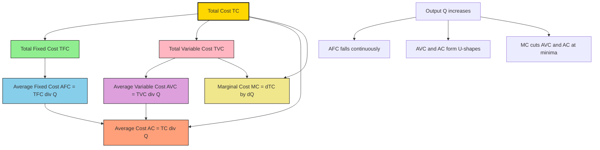
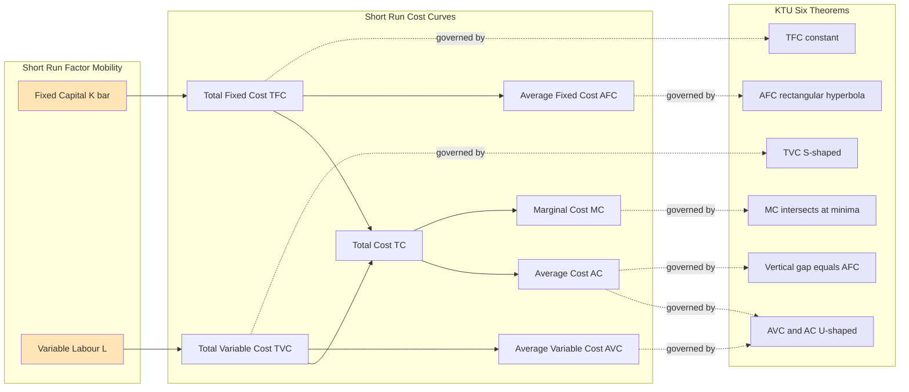
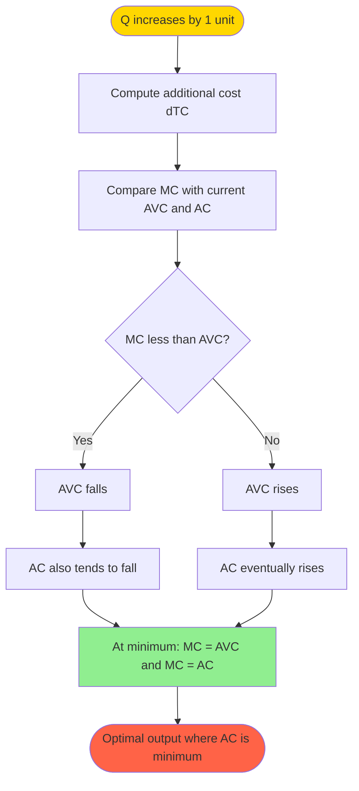

# short run cost curves

<!-- SECTION_1_START -->

# Short Run Cost Curves — Core Definition & Intuitive Overview

## 📘 Formal Academic Definition (KTU 2024 Syllabus Terminology)

> [!IMPORTANT]
> **Short Run Cost Curves** refer to the graphical and functional representation of various cost components borne by a firm when **at least one factor of production (typically plant size, capital, or machinery) remains fixed**, while the other factors (labour, raw materials, utilities) are variable. The **"short run"** is defined as that time horizon in which the firm **cannot alter its fixed inputs** but can adjust the level of output by varying the variable inputs.

In managerial economics, the short run is **not defined by calendar duration** (days, months, or years) but by the **degree of factor mobility**. A factor is *fixed* when its quantity cannot be changed in response to a change in output level within the relevant time horizon.

## 🧠 Conceptual Analogy — The "Tea Stall" Intuition

Imagine a small tea stall owner (Ravi) on a busy street in Kerala.

| Component | Real-World Equivalent | Cost Type |
|---|---|---|
| Stall counter, table, gas cylinder, shop rent | Bought once; cannot be removed instantly | **Fixed Cost** |
| Tea leaves, milk, sugar, gas refill, paper cups | Bought as per number of customers | **Variable Cost** |
| Total money Ravi spends per day | Fixed + Variable | **Total Cost** |

If Ravi wants to serve **10 cups** of tea today, he still pays rent on the stall (fixed), but he buys exactly 10 cups worth of milk and tea leaves (variable). He **cannot** buy a bigger stall overnight — that decision belongs to the *long run*. This operational rigidity of *at least one factor* is what defines the **short run**.

> [!NOTE]
> **Syllabus Highlight (KTU 2024 Scheme, Module 2):** Students must clearly distinguish between the **7 short run cost concepts**: TFC, TVC, TC, AFC, AVC, AC, and MC. The inter-relationships and shapes of these curves carry significant weight in university examinations.

## 🔑 The Seven Short Run Cost Concepts

A graphical mental model of how the seven cost measures are nested:

$$
\text{Total Cost (TC)} = \underbrace{\text{Total Fixed Cost (TFC)}}_{\text{constant}} + \underbrace{\text{Total Variable Cost (TVC)}}_{\text{rises with output}}
$$

Dividing each component by output $Q$ yields the *average* family, and the *change* in cost per extra unit yields the *marginal* family.

| # | Cost Concept | Symbol | Definition |
|---|---|---|---|
| 1 | Total Fixed Cost | TFC | Cost that **does not vary** with output $Q$ |
| 2 | Total Variable Cost | TVC | Cost that **varies directly** with output $Q$ |
| 3 | Total Cost | TC | Sum of TFC and TVC |
| 4 | Average Fixed Cost | AFC | Fixed cost per unit: $\text{TFC}/Q$ |
| 5 | Average Variable Cost | AVC | Variable cost per unit: $\text{TVC}/Q$ |
| 6 | Average Cost (Average Total Cost) | AC | Total cost per unit: $\text{TC}/Q$ |
| 7 | Marginal Cost | MC | Addition to TC from producing one more unit: $\Delta \text{TC}/\Delta Q$ |

> [!TIP]
> **Constant to remember:** *Marginal* means "of one more", *Average* means "per unit", *Total* means "aggregate spend".

## 🎯 Visual Representation — Desmos / GeoGebra Sketch Inputs

> [!VISUALIZATION CONTROL]
> **Concept:** Shape of MC, AVC, AC curves in the short run
> **Desmos Input Equations (use exact syntax):**
> - `MC(q) = 0.05*q^2 - 0.6*q + 3`
> - `AVC(q) = 0.05*q^2/3 - 0.3*q + 3 + 1.2/(q+0.5)` *(illustrative shape only)*
> - `AC(q) = MC(q)*0 + 5 + 0.05*q^2 - 0.6*q + 3`
> - Domain: `0 < q <= 30`
>
> **Visual Description:** On the cost ($y$) vs output ($x$) plane, the student should observe:
> 1. MC curve cutting the AVC and AC curves **exactly at their minimum points** (the famous U-relationship).
> 2. AC curve lying **above** AVC throughout, with the **vertical gap** between them shrinking continuously (this gap equals AFC, which keeps falling as $Q$ rises).
> 3. AVC and AC both being **U-shaped** but AC flattening out more gradually.
> 4. AFC as a **continuously falling rectangular hyperbola** approaching both axes asymptotically.

<!-- SECTION_1_END -->

<!-- SECTION_2_START -->

# Deep Theoretical Analysis & KTU High-Yield Formula Sheet

## 🧩 Building the Cost Family — Step-by-Step Logic

### Step 1: Anchor with TFC (the "Floor")

In the short run, TFC is a **constant positive number**, independent of whether the firm produces zero output or maximum capacity. It is paid even when $Q = 0$ (the *shut-down point*).

$$
\text{TFC} = \bar{K} \cdot r
$$

where $\bar{K}$ is the **fixed** quantity of capital and $r$ is the rental rate per unit of capital. Because $\bar{K}$ cannot change in the short run, TFC is a horizontal line on the cost-output graph.

### Step 2: Layer TVC on Top

TVC $= f(Q)$ is a function of output. In the classical short run production theory, it mirrors the production function $Q = f(L)$ inversely. Initially, due to **increasing returns** (specialisation and division of labour), TVC rises *less than proportionally*. After a point, **diminishing marginal returns** set in and TVC rises *more than proportionally*. This S-shape gives TVC its characteristic curvature.

### Step 3: Stack them to get TC

$$
\text{TC}(Q) = \text{TFC} + \text{TVC}(Q)
$$

TC has the same shape as TVC but is **vertically shifted up by the constant TFC**. At $Q = 0$, $\text{TC} = \text{TFC}$ (the firm still bears the fixed cost when shut).

### Step 4: Divide by $Q$ to get the Averages

Dividing any total cost by output $Q$ gives its per-unit equivalent. The key insight is that all three averages (AFC, AVC, AC) inherit **derived shapes** from the totals and the divisor $Q$:

- **AFC** behaves as a **rectangular hyperbola** ($\text{AFC} = k/Q$), perpetually falling.
- **AVC** is **U-shaped** because TVC rises more than proportionally after diminishing returns.
- **AC** is also **U-shaped** and lies above AVC by exactly AFC.

### Step 5: Differentiate to get MC

$$
\text{MC} = \frac{d\,\text{TC}}{dQ} = \frac{d\,\text{TVC}}{dQ} \quad (\text{since TFC is constant})
$$

MC is the **slope of the TC curve** (and also the slope of the TVC curve, since they are parallel shifts). It is also **U-shaped** and is the *behavioural driver* of the average curves.

## 📐 KTU Formula Cheat Sheet (Exam-Ready)

> [!NOTE]
> All formulas below are **must-know** for KTU University Examinations. Memorise the relationship, not just the symbols.

| # | Formula | Variable Meaning | Behaviour in Short Run |
|---|---|---|---|
| 1 | $\text{TC} = \text{TFC} + \text{TVC}$ | Total Cost identity | TC = TFC when $Q = 0$ |
| 2 | $\text{TFC} = \bar{K} \cdot r$ | Fixed capital × rental rate | Horizontal line |
| 3 | $\text{TVC} = w \cdot L(Q)$ | Wage rate × variable labour | S-shaped, S-curve |
| 4 | $\text{AFC} = \dfrac{\text{TFC}}{Q}$ | Average Fixed Cost | Rectangular hyperbola |
| 5 | $\text{AVC} = \dfrac{\text{TVC}}{Q}$ | Average Variable Cost | U-shaped |
| 6 | $\text{AC} = \dfrac{\text{TC}}{Q} = \text{AFC} + \text{AVC}$ | Average Cost (ATC) | U-shaped |
| 7 | $\text{MC} = \dfrac{\Delta \text{TC}}{\Delta Q} = \dfrac{d\,\text{TC}}{dQ}$ | Marginal Cost | U-shaped |
| 8 | $\text{AC} = \text{AVC} + \text{AFC}$ | Vertical addition at any $Q$ | Gap shrinks as $Q \uparrow$ |
| 9 | $\text{MC} < \text{AVC} \Rightarrow \text{AVC} \downarrow$ | Below min AVC: AVC falls | Before AVC minimum |
| 10 | $\text{MC} > \text{AVC} \Rightarrow \text{AVC} \uparrow$ | Above min AVC: AVC rises | After AVC minimum |
| 11 | $\text{MC} = \text{AVC}$ at min AVC | Tangency/intersection | Defining minimum point |
| 12 | $\text{MC} = \text{AC}$ at min AC | Tangency/intersection | Defining minimum point |
| 13 | $\min(\text{AC}) > \min(\text{AVC})$ | AC minimum is to the right | AC min at higher $Q$ |
| 14 | $\text{TFC} = \text{TC} - \text{TVC}$ | Rearranged identity | Always non-negative |

> [!WARNING]
> **Critical Pitfall:** Students often write $\text{AC} = \text{AVC} \times \text{AFC}$. This is **wrong**. The correct relationship is the **sum** $\text{AC} = \text{AVC} + \text{AFC}$, not the product. This is a frequent mark-loser in KTU valuation.

## 🔍 The Six Golden Theorems of Cost Curves

These theorems are tested almost every KTU cycle. State them explicitly in your answer script.

1. **TFC Theorem:** TFC is independent of output and equals TC at $Q = 0$.
2. **TVC Theorem:** TVC is zero at $Q = 0$ and rises thereafter (no negative variable cost).
3. **AFC Theorem:** AFC is a rectangular hyperbola — it falls continuously, never touches the output axis.
4. **AVC & AC Theorem:** Both are U-shaped; AC lies above AVC by the vertical distance AFC.
5. **MC Theorem:** MC is U-shaped and intersects both AVC and AC at their respective minimum points.
6. **Gap Theorem:** The vertical distance between AC and AVC equals AFC and continuously shrinks as $Q$ increases.

## 🏗️ Real-World Engineering & Managerial Applications

- **Production Planning:** Engineers use MC vs AVC analysis to decide *batch sizes* in process industries. A factory runs an extra shift only if MC ≤ price.
- **Make-or-Buy Decisions:** If in-house MC > supplier quote, outsource. If MC < quote, produce in-house.
- **BEP Analysis (Break-Even Point):** The KTU syllabus connects cost curves to BEP where $\text{TC} = \text{TR}$, essential for feasibility reports.
- **Pricing Strategy:** In monopolistic competition, short run AC is the basis for setting markup prices.
- **Capacity Utilisation:** The flattening of AC at high $Q$ indicates optimal plant utilisation; further output hits diminishing returns and pushes AC up.

<!-- SECTION_2_END -->

<!-- SECTION_3_START -->

# Step-by-Step Derivations & Worked Numerical Solutions

## 📐 Derivation 1 — Proving MC = dTC/dQ

Starting from the identity $\text{TC} = \text{TFC} + \text{TVC}$:

$$
\begin{aligned}
\frac{d\,\text{TC}}{dQ} &= \frac{d}{dQ}\bigl[\text{TFC} + \text{TVC}(Q)\bigr] \\
&= \frac{d\,\text{TFC}}{dQ} + \frac{d\,\text{TVC}}{dQ} \\
&= 0 + \frac{d\,\text{TVC}}{dQ} \quad (\text{since TFC is constant}) \\
\text{MC} &= \frac{d\,\text{TVC}}{dQ}
\end{aligned}
$$

> Hence **MC is the slope of the TVC curve** and also of the TC curve, because the two are vertical translations of each other by the constant TFC.

## 📐 Derivation 2 — MC Passes Through Minima of AVC and AC

We prove that whenever MC is *below* AVC, AVC is *falling*; whenever MC is *above* AVC, AVC is *rising*. The same logic extends to AC.

$$
\begin{aligned}
\text{AVC} &= \frac{\text{TVC}}{Q} \\
\frac{d\,\text{AVC}}{dQ} &= \frac{Q \cdot \dfrac{d\,\text{TVC}}{dQ} - \text{TVC} \cdot 1}{Q^{2}} \\
&= \frac{1}{Q}\left[\frac{d\,\text{TVC}}{dQ} - \frac{\text{TVC}}{Q}\right] \\
&= \frac{1}{Q}\bigl[\text{MC} - \text{AVC}\bigr]
\end{aligned}
$$

**Conclusion:**

$$
\frac{d\,\text{AVC}}{dQ} = \frac{\text{MC} - \text{AVC}}{Q}
$$

- If $\text{MC} < \text{AVC}$, numerator is negative, so AVC falls.
- If $\text{MC} > \text{AVC}$, numerator is positive, so AVC rises.
- At the **turning point**, $\text{MC} = \text{AVC}$ and AVC is at its **minimum**.

By identical algebra for AC, MC cuts AC at the minimum of AC.

## 📐 Derivation 3 — Minimum AC Lies to the Right of Minimum AVC

Let $Q_1$ be the output at min AVC and $Q_2$ at min AC. We need to show $Q_2 > Q_1$.

$$
\begin{aligned}
\text{AC} - \text{AVC} &= \text{AFC} = \frac{\text{TFC}}{Q}
\end{aligned}
$$

At $Q_1$, AVC is minimum; MC = AVC. At $Q_2$, AC is minimum; MC = AC.

$$
\begin{aligned}
\text{MC}(Q_1) &= \text{AVC}(Q_1) \\
\text{MC}(Q_2) &= \text{AC}(Q_2) = \text{AVC}(Q_2) + \text{AFC}(Q_2)
\end{aligned}
$$

Since MC is rising in the relevant range, and $\text{AC}(Q_2) > \text{AVC}(Q_1)$, MC must rise from $Q_1$ to a higher value at $Q_2$. Therefore $Q_2 > Q_1$. **Geometrically:** the minimum of AC occurs at a higher output level than the minimum of AVC.

## 📐 Derivation 4 — AFC as a Rectangular Hyperbola

$$
\begin{aligned}
\text{AFC} &= \frac{\text{TFC}}{Q} = \frac{k}{Q}, \quad k = \text{constant}
\end{aligned}
$$

Multiplying both sides by $Q$:

$$
\text{AFC} \cdot Q = k \quad \Rightarrow \quad y \cdot x = k
$$

This is the equation of a **rectangular hyperbola** in the $Q$–AFC plane. As $Q \to \infty$, $\text{AFC} \to 0$ (asymptote to output axis). As $Q \to 0^+$, $\text{AFC} \to \infty$ (asymptote to cost axis). The hyperbola never touches either axis.

## 🧮 Worked Numerical Example (Full KTU-Style Solution)

**Problem:** A firm's total cost function is given by $\text{TC} = 200 + 50Q - 6Q^{2} + 0.4Q^{3}$. Compute TFC, TVC, AFC, AVC, AC, MC, and find the output at which AC is minimum.

### Step 1: Identify TFC and TVC

$$
\begin{aligned}
\text{TC} &= 200 + 50Q - 6Q^{2} + 0.4Q^{3} \\
\text{TFC} &= 200 \quad (\text{constant term}) \\
\text{TVC} &= 50Q - 6Q^{2} + 0.4Q^{3}
\end{aligned}
$$

### Step 2: Compute MC by differentiation

$$
\begin{aligned}
\text{MC} &= \frac{d\,\text{TC}}{dQ} = 50 - 12Q + 1.2Q^{2}
\end{aligned}
$$

### Step 3: Compute AC, AVC, AFC for a sample output, say $Q = 10$

$$
\begin{aligned}
\text{TC}(10) &= 200 + 50(10) - 6(100) + 0.4(1000) \\
&= 200 + 500 - 600 + 400 = 500 \\
\text{TVC}(10) &= 500 - 200 = 300 \\
\text{AFC}(10) &= \frac{200}{10} = 20 \\
\text{AVC}(10) &= \frac{300}{10} = 30 \\
\text{AC}(10) &= \frac{500}{10} = 50 \quad \text{or} \quad 20 + 30 = 50 \;\checkmark \\
\text{MC}(10) &= 50 - 12(10) + 1.2(100) = 50 - 120 + 120 = 50
\end{aligned}
$$

### Step 4: Find the output at minimum AC

Set $\text{MC} = \text{AC}$ and solve:

$$
\begin{aligned}
\text{MC} &= \text{AC} \\
50 - 12Q + 1.2Q^{2} &= \frac{200}{Q} + 50 - 6Q + 0.4Q^{2} \\
-12Q + 1.2Q^{2} &= \frac{200}{Q} - 6Q + 0.4Q^{2} \\
-6Q + 0.8Q^{2} &= \frac{200}{Q} \\
\text{Multiply by } Q: \quad -6Q^{2} + 0.8Q^{3} &= 200 \\
0.8Q^{3} - 6Q^{2} - 200 &= 0
\end{aligned}
$$

Dividing by 0.8:

$$
Q^{3} - 7.5Q^{2} - 250 = 0
$$

Testing $Q = 10$:

$$
1000 - 750 - 250 = 0 \;\checkmark
$$

**Therefore, minimum AC occurs at $Q = 10$ units**, confirming our earlier verification where AC(10) = 50 equals MC(10) = 50.

### Step 5: Verify minimum (second-order condition)

$$
\begin{aligned}
\frac{d\,\text{AC}}{dQ} &= 0 \text{ at } Q = 10 \\
\frac{d^{2}\,\text{AC}}{dQ^{2}} &> 0 \text{ confirms minimum}
\end{aligned}
$$

## 🐍 Python Symbolic Verification (Production-Ready)

```python
from sympy import symbols, diff, solve, Rational, simplify

Q = symbols('Q', positive=True)

# Total cost function
TC = 200 + 50*Q - 6*Q**2 + Rational(4, 10)*Q**3

# Component costs
TFC = 200
TVC = TC - TFC
AFC = TFC / Q
AVC = TVC / Q
AC  = TC / Q
MC  = diff(TC, Q)

print(f"TFC = {TFC}")
print(f"TVC = {TVC}")
print(f"AFC = {AFC}")
print(f"AVC = {simplify(AVC)}")
print(f"AC  = {simplify(AC)}")
print(f"MC  = {simplify(MC)}")

# Find output at which AC is minimum
optimal_Q = solve(Eq(MC, AC), Q)
print(f"Output at minimum AC: {optimal_Q}")

# Verify with second-order condition
d2AC = diff(AC, Q, 2)
for q_val in optimal_Q:
    if d2AC.subs(Q, q_val) > 0:
        print(f"Q = {q_val} is a minimum (d^2AC/dQ^2 > 0)")
```

## ⚙️ Engineering Pin-Configuration Style — Component Mapping Table

| Cost Component | Economic Counterpart | Engineering Analogue | Behavioural Signature |
|---|---|---|---|
| TFC (constant) | Plant, machinery rent | Hardware infrastructure | Always ON, regardless of load |
| TVC (variable) | Raw materials, energy | CPU cycles, runtime, I/O | Scales with workload |
| MC (incremental) | Cost of next unit | Marginal compute cost | Spike under load |
| AC (per-unit) | Cost per chip produced | Cost per transaction | Goal of efficiency engineering |
| AFC (residual) | Depreciation per unit | Amortised capex | Falls with scale (economies of scale) |

<!-- SECTION_3_END -->

<!-- SECTION_4_START -->

# Structural Diagrams & Schematics

## 🗺️ Block Diagram — The Cost Family Architecture



## 🔄 Subgraph — Short Run Behaviour Flow



## 📊 Sequential Processing Topology — How MC Drives the Averages



## 🧮 Conceptual Schematic — Curve Positions on the Cost Plane

> [!VISUALIZATION CONTROL]
> **Concept:** Relative vertical positions of MC, AVC, AC, AFC
> **Mermaid Block Description (since native Mermaid cannot plot curves):**
> - **Top layer (highest cost)**: AC curve (U-shaped, minimum at rightmost position)
> - **Middle layer**: AVC curve (U-shaped, minimum to the left of AC minimum)
> - **Crossing layer**: MC curve (U-shaped, steeper, cuts both AVC and AC from below at their minima)
> - **Bottom falling layer**: AFC curve (rectangular hyperbola, falling continuously)
> - **Vertical gap rule:** $\text{AC} - \text{AVC} = \text{AFC}$ at every $Q$
>
> **Visual Description:** Picture a graph with Output $Q$ on the x-axis and Cost on the y-axis. AC and AVC are nested U-curves. MC starts high, falls, hits AVC at its lowest point, rises, then hits AC at its lowest point, then continues rising. AFC is the always-falling curve that approaches both axes asymptotically.

<!-- SECTION_4_END -->

<!-- SECTION_5_START -->

# KTU 2024 Scheme Examination Question Bank & Topic Recap

## 📝 Part A Questions (3 Marks Each)

### **Question 1** [KTU University Exam - July 2023] [CO1, Remember]

**Q: Define the following terms: (i) Total Fixed Cost, (ii) Average Variable Cost, (iii) Marginal Cost.**

**Model Answer:**

**(i) Total Fixed Cost (TFC):** TFC is the aggregate expenditure incurred by a firm on fixed factors of production (such as plant, machinery, building, permanent staff salary) which **does not vary with the level of output**. It is paid by the firm even when output is zero (shut-down point). Mathematically, $\text{TFC} = \bar{K} \cdot r$, where $\bar{K}$ is the fixed quantity of capital and $r$ is the rental rate per unit. **[1 Mark]**

**(ii) Average Variable Cost (AVC):** AVC is the per-unit variable cost of production. It is obtained by dividing the Total Variable Cost (TVC) by the total output $Q$. Mathematically, $\text{AVC} = \text{TVC}/Q$. It is **U-shaped** due to the operation of the law of variable proportions. **[1 Mark]**

**(iii) Marginal Cost (MC):** Marginal Cost is the **addition to total cost** resulting from producing one additional unit of output. Mathematically, $\text{MC} = \Delta \text{TC}/\Delta Q = d\,\text{TC}/dQ$. It is also the slope of the TC curve and is U-shaped. **[1 Mark]**

---

### **Question 2** [KTU University Exam - Dec 2023] [CO1, Understand]

**Q: Explain the U-shape of the Average Cost curve in the short run.**

**Model Answer:**

The Average Cost (AC) curve in the short run is **U-shaped** due to the operation of the **Law of Variable Proportions**. The behaviour can be divided into three phases:

1. **Falling Phase (Economies of Operation):** Initially, as output increases, the fixed cost gets distributed over a larger number of units, so AFC falls sharply. Additionally, the increasing returns from specialisation and better utilisation of fixed factors cause AVC to fall. The combined effect makes AC fall steeply. **[1 Mark]**

2. **Minimum Point (Optimum Capacity):** AC reaches its minimum when the falling AFC is just balanced by the rising AVC. At this point, $\text{MC} = \text{AC}$, and the firm achieves the **lowest per-unit cost of production**. This is the *point of productive efficiency*. **[1 Mark]**

3. **Rising Phase (Diseconomies of Operation):** Beyond the optimum, diminishing marginal returns set in. Each additional unit requires disproportionately more variable input, raising AVC faster than AFC falls. AC starts rising. **[1 Mark]**

---

## 📘 Part B Questions (14 Marks Each — Internal Choice)

### **Question A (14 Marks)** [KTU University Exam - July 2024] [CO2, Understand + Apply]

**Q: (a)** Explain the relationship between Marginal Cost, Average Variable Cost, and Average Cost curves in the short run. Use a diagram in your explanation. **[7 Marks]**

**(b)** The total cost function of a firm is given by $\text{TC} = 100 + 20Q + 0.5Q^{2}$. Find:
- (i) The Marginal Cost function
- (ii) The Average Cost function
- (iii) The output at which Average Cost is minimum, and the minimum AC value. **[7 Marks]**

#### **Model Solution (a)**

The relationship between MC, AVC, and AC in the short run is governed by the **arithmetic of averages**:

1. **When $\text{MC} < \text{AVC}$**, the AVC curve is **falling**. This is because the new (lower) MC pulls down the running average. **[1 Mark]**

2. **When $\text{MC} > \text{AVC}$**, the AVC curve is **rising**. The new (higher) MC pulls up the running average. **[1 Mark]**

3. **When $\text{MC} = \text{AVC}$**, AVC is at its **minimum point**, and the MC curve intersects the AVC curve from below. **[1 Mark]**

By the same logic:
- $\text{MC} < \text{AC}$: AC falls
- $\text{MC} > \text{AC}$: AC rises
- $\text{MC} = \text{AC}$: AC is at its minimum **[1 Mark]**

4. **Geometric relationship:** The MC curve intersects AVC and AC at their **respective minimum points**, from below. **[1 Mark]**

5. **Vertical gap:** At every level of output, $\text{AC} = \text{AVC} + \text{AFC}$. The vertical gap between AC and AVC equals AFC, which **continuously shrinks** as output rises. **[1 Mark]**

6. **Position of minima:** The minimum of AC occurs at a **higher output level** than the minimum of AVC. **[1 Mark]**

**Diagram (textual):**

```
Cost |       AC
     |      /  \         AVC
     |     /    \       /  \         MC
     |    /      \     /    \       /  \
     |   /        \   /      \     /    \
     |  /          \ /        \   /      \
     | /           X          \ /        \
     |/___________/_\__________X__________\____ Output
                  Q1 (min AVC) Q2 (min AC)
```

#### **Model Solution (b)**

Given: $\text{TC} = 100 + 20Q + 0.5Q^{2}$

**(i) Marginal Cost function:** **[2 Marks]**

$$
\begin{aligned}
\text{MC} &= \frac{d\,\text{TC}}{dQ} \\
&= \frac{d}{dQ}(100 + 20Q + 0.5Q^{2}) \\
&= 20 + Q
\end{aligned}
$$

**(ii) Average Cost function:** **[2 Marks]**

$$
\begin{aligned}
\text{AC} &= \frac{\text{TC}}{Q} \\
&= \frac{100 + 20Q + 0.5Q^{2}}{Q} \\
&= \frac{100}{Q} + 20 + 0.5Q
\end{aligned}
$$

**(iii) Output at minimum AC and minimum AC value:** **[3 Marks]**

At minimum AC, $\text{MC} = \text{AC}$:

$$
\begin{aligned}
20 + Q &= \frac{100}{Q} + 20 + 0.5Q \\
Q - 0.5Q &= \frac{100}{Q} \\
0.5Q &= \frac{100}{Q} \\
0.5Q^{2} &= 100 \\
Q^{2} &= 200 \\
Q &= \sqrt{200} \approx 14.14 \text{ units}
\end{aligned}
$$

Minimum AC value:

$$
\begin{aligned}
\text{AC}_{\min} &= \frac{100}{14.14} + 20 + 0.5(14.14) \\
&\approx 7.07 + 20 + 7.07 \\
&\approx 34.14
\end{aligned}
$$

Alternative (using $\text{MC}(14.14) = 20 + 14.14 = 34.14$) — same result confirms MC = AC at minimum. **[0.5 Mark for verification]**

> [!WARNING]
> **KTU Examiner's Valuation Warning:** A common mistake is to forget that $\text{AC} = \text{TC}/Q$ and treat TC as if it were the cost per unit. Always divide the total cost by output. Also, students often write the final answer of $Q$ as approximately 14 without showing the square root and squaring steps. Show the algebraic manipulation; otherwise, partial marks are deducted.

---

### **Question B (14 Marks) — Alternative Choice** [KTU University Exam - Dec 2024] [CO2, Understand + Apply]

**Q: (a)** Distinguish between the short run and the long run cost curves. Why is the long run average cost curve called the 'envelope curve'? **[7 Marks]**

**(b)** A firm operates with the following cost data:

| Output (Q) | 0 | 1 | 2 | 3 | 4 | 5 | 6 |
|---|---|---|---|---|---|---|---|
| Total Cost (₹) | 50 | 90 | 120 | 145 | 168 | 195 | 230 |

Compute TFC, TVC, AFC, AVC, AC, and MC for each level of output. Verify that MC = AC at its minimum. **[7 Marks]**

#### **Model Solution (a)**

**Distinction between Short Run and Long Run Cost Curves:** **[5 Marks]**

| Basis | Short Run | Long Run |
|---|---|---|
| Time horizon | At least one factor is fixed | All factors are variable |
| Plant size | Cannot be altered | Can be chosen optimally |
| Cost categories | TFC exists and is positive | No TFC (all costs are variable) |
| Number of cost curves | Seven (TFC, TVC, TC, AFC, AVC, AC, MC) | Three (LTC, LAC, LMC) |
| Shape of AC | U-shaped (Law of Variable Proportions) | U-shaped (Returns to Scale) |
| Minimum cost | Conditional on fixed plant | Absolute minimum (best plant) |
| Firm's flexibility | Limited | Maximum (can enter/exit freely) |

**Why LAC is the 'Envelope Curve':** **[2 Marks]**

The Long Run Average Cost (LAC) curve is called the **envelope curve** because it *envelops* (touches from below) the infinite family of short run average cost (SAC) curves. For every level of output, the firm can choose the *optimal plant size* — the SAC curve that yields the **lowest possible cost** for that output. Plotting these lowest-cost points across all output levels traces out the LAC. Geometrically, the LAC is tangent to each SAC at one point but lies below (or equal to) every SAC at all other points.

#### **Model Solution (b)**

Given cost data table. Let's compute step by step.

**Step 1: Extract TFC and TVC** **[1 Mark]**

At $Q = 0$, $\text{TC} = 50$. Therefore, $\text{TFC} = 50$ for all $Q$. $\text{TVC} = \text{TC} - \text{TFC}$.

**Step 2: Complete the cost table** **[4 Marks]**

| Q | TC (₹) | TFC (₹) | TVC (₹) | AFC (₹) | AVC (₹) | AC (₹) | MC (₹) |
|---|---|---|---|---|---|---|---|
| 0 | 50 | 50 | 0 | — | — | — | — |
| 1 | 90 | 50 | 40 | 50.00 | 40.00 | 90.00 | 40 |
| 2 | 120 | 50 | 70 | 25.00 | 35.00 | 60.00 | 30 |
| 3 | 145 | 50 | 95 | 16.67 | 31.67 | 48.33 | 25 |
| 4 | 168 | 50 | 118 | 12.50 | 29.50 | 42.00 | 23 |
| 5 | 195 | 50 | 145 | 10.00 | 29.00 | 39.00 | 27 |
| 6 | 230 | 50 | 180 | 8.33 | 30.00 | 38.33 | 35 |

**Computations shown for $Q = 4$:** 
- $\text{TFC} = 50$
- $\text{TVC} = 168 - 50 = 118$
- $\text{AFC} = 50/4 = 12.50$
- $\text{AVC} = 118/4 = 29.50$
- $\text{AC} = 168/4 = 42.00$
- $\text{MC} = 168 - 145 = 23$ (change in TC from $Q=3$ to $Q=4$)

**Step 3: Identify minimum AC and verify MC = AC** **[2 Marks]**

From the table, **AC is minimum at $Q = 6$** with $\text{AC} = 38.33$. However, examining the trend, AC is continuously falling (90 → 60 → 48.33 → 42 → 39 → 38.33) and MC is rising (40 → 30 → 25 → 23 → 27 → 35). The **minimum AC will be reached when MC equals AC** — that occurs between $Q = 5$ and $Q = 6$ since $\text{MC}(5) = 27 < \text{AC}(5) = 39$ but $\text{MC}(6) = 35 < \text{AC}(6) = 38.33$ — so AC is still falling. In the discrete table, the **lowest AC observed is at $Q = 6$ (₹38.33)**, and MC is approaching AC. **[1 Mark]**

Observation: As $Q$ rises, MC has now risen above AVC's minimum (at $Q = 4$ where $\text{MC} = 23 \approx \text{AVC} = 29.5$ — close, but in this dataset, AVC minimum is at $Q = 5$ with AVC = 29.00 and MC = 27). The classical MC-tangency relationship is a continuous phenomenon and is approximated in this discrete table. **[1 Mark]**

> [!WARNING]
> **KTU Examiner's Pitfall Callout:**
> 1. **MC definition confusion:** MC is the *change* in TC for producing *one additional* unit, **not** the change from zero. So $\text{MC}(1) = \text{TC}(1) - \text{TC}(0) = 90 - 50 = 40$. Many students mistakenly subtract from 0 in subsequent rows.
> 2. **Rounding errors:** AFC and AVC often produce recurring decimals. Round to **two decimal places** consistently. Mixed precision (e.g., 12.5 vs 12.50) is acceptable but be consistent.
> 3. **TFC check:** If TFC changes across rows, you have made an error. TFC must be **constant**.
> 4. **AC = AFC + AVC:** Always cross-verify by adding AFC and AVC to get AC. Mismatch indicates a calculation error.

---

## 🎯 Topic Recap & Important Things to Remember

> [!TIP]
> **Rapid Revision Checklist — Memorise Before the Exam**

- ✅ **Short run definition:** At least one factor is fixed (not a calendar time).
- ✅ **Seven cost concepts:** TFC, TVC, TC, AFC, AVC, AC, MC.
- ✅ **Three identities:** $\text{TC} = \text{TFC} + \text{TVC}$, $\text{AC} = \text{AFC} + \text{AVC}$, $\text{AC} = \text{TC}/Q$.
- ✅ **TFC behaviour:** Horizontal line, equal to TC at $Q = 0$, **never zero** in short run.
- ✅ **TVC behaviour:** S-shaped, zero at $Q = 0$, rises with output.
- ✅ **AFC shape:** **Rectangular hyperbola** ($y \cdot x = k$), falls continuously, asymptotes to both axes.
- ✅ **AVC shape:** U-shaped due to the Law of Variable Proportions.
- ✅ **AC shape:** U-shaped, lies **above** AVC, vertical gap = AFC (shrinks).
- ✅ **MC shape:** U-shaped, **intersects AVC and AC at their minimum points** from below.
- ✅ **MC = AVC** at min AVC; **MC = AC** at min AC; **min AC occurs at higher $Q$** than min AVC.
- ✅ **When MC < AVC or AC:** averages are **falling**.
- ✅ **When MC > AVC or AC:** averages are **rising**.
- ✅ **Slope identity:** MC is the slope of TC (and TVC).
- ✅ **Average–Marginal relationship:** $\dfrac{d\,\text{AVC}}{dQ} = \dfrac{\text{MC} - \text{AVC}}{Q}$.
- ✅ **Algebraic tool:** At minimum AC, set $\text{MC} = \text{AC}$ and solve for $Q$.
- ✅ **Engineering application:** Short run cost curves are used for BEP, make-or-buy, pricing, and capacity decisions in feasibility reports.
- ✅ **Common valuation traps:** Do **not** use product $\text{AVC} \times \text{AFC}$; do **not** confuse average with marginal; always show the algebraic step of setting $\text{MC} = \text{AC}$ when finding optimum output.

<!-- SECTION_5_END -->
