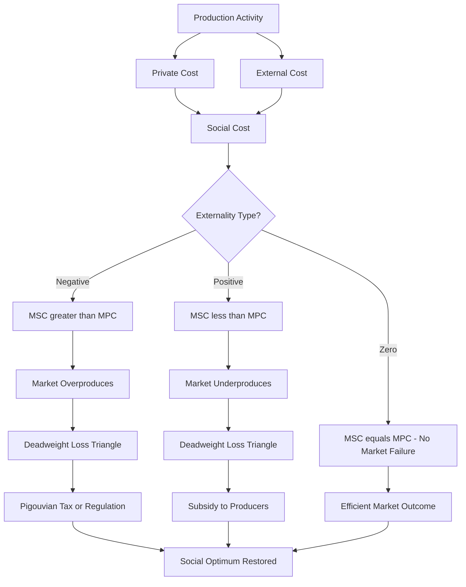
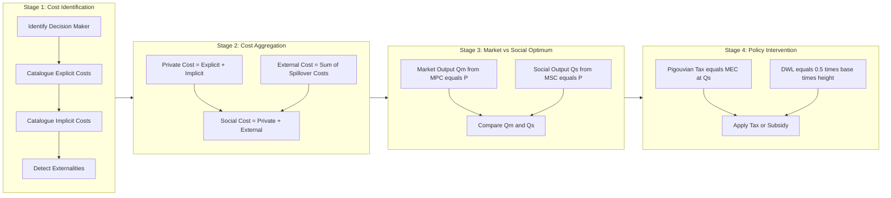
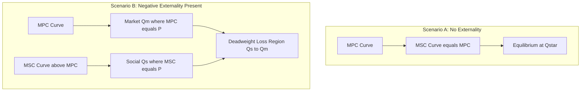

# Social cost, private cost

<!-- SECTION_1_START -->
# Cost Concepts: Social Cost & Private Cost

## 1. Core Technical Definition

### Private Cost (Internal Cost)
**Private Cost** is the actual monetary expenditure incurred by a producer (or consumer) in the production (or consumption) of a good or service. These are the costs that are **directly borne**, **accounted for**, and **paid** by the decision-making economic agent. In standard cost accounting, private cost equals the sum of **explicit costs** (rent, wages, raw materials, interest) and **implicit costs** (opportunity cost of owner's resources).

> [!IMPORTANT]
> **KTU Syllabus Definition (UCHUT346, Module 2):**
> *Private cost* is the cost borne by the producer or consumer directly involved in an economic transaction. It is the cost reflected in the firm's Profit \& Loss statement.

### Social Cost (External-Inclusive Cost)
**Social Cost** is the *total* cost to society arising from the production or consumption of a commodity. It is the sum of **private cost** and any **external cost** (negative externality) imposed on third parties who are not part of the original transaction.

> [!IMPORTANT]
> **KTU Syllabus Definition (UCHUT346, Module 2):**
> *Social cost* includes the private cost of production plus the external costs imposed on third parties (e.g., pollution, health hazards, congestion). It represents the **true cost to the economy**.

### Externalities — The Bridge Between Private and Social Cost
An **externality** is a cost or benefit that affects a party who did not choose to incur that cost or benefit. Externalities are the reason private and social costs diverge.

| Type | Effect on Third Party | Effect on Cost Curves | Example |
| :--- | :--- | :--- | :--- |
| **Negative Externality** | Harm / Cost imposed | Social Cost $>$ Private Cost | Smoke from a factory causing respiratory illness |
| **Positive Externality** | Benefit conferred | Social Cost $<$ Private Cost | A firm's R\&D spillover that benefits rivals |

> [!NOTE]
> **Fundamental Identity (KTU High-Yield Equation):**
> $$\text{Social Cost} = \text{Private Cost} + \text{External Cost}$$

---

## 2. Conceptual Analogy / Intuition

**🏭 The Riverside Steel Factory Analogy**

Imagine a steel factory on the bank of a river. The factory's *private cost* includes the steel, electricity, labour wages, and machinery — things appearing on the invoice. But the factory also dumps hot wastewater into the river, killing fish downstream and forcing the village fisherfolk to abandon their livelihood. The villagers' lost income, the cleanup of contaminated water, and the healthcare costs of those who fall sick are **costs no one asked for** — these are *external costs*.

- **Private Cost** = What the factory pays for production.
- **External Cost** = What the river and the villagers pay.
- **Social Cost** = What society as a whole actually loses = Private Cost + External Cost.

If the market only sees the private cost, the factory produces **too much steel** at a price that is **too low**, because the true cost to society is hidden.

> [!TIP]
> **Engineering Insight:** When an engineering project (e.g., a thermal power plant, a chemical unit, a new highway) is evaluated purely on the *private* cost-benefit balance, it may appear profitable. A social cost-benefit analysis (SCBA) — a standard KTU topic in Module 2 — incorporates the external costs to reveal the *true* economic impact.

---

## 3. GeoGebra / Desmos Visualization

> [!VISUALIZATION CONTROL]
> **Concept:** Marginal Cost Curves — MPC vs MSC under Negative Externality
> **GeoGebra / Desmos Input Equations:**
> * `f(x) = x`  *(Marginal Private Cost — MPC)*
> * `g(x) = 1.5 x`  *(Marginal Social Cost — MSC = MPC + MEC, where MEC = 0.5x)*
> * `h(x) = 100 - x`  *(Demand curve)*
>
> **Visual Description:**
> The student should observe two upward-sloping lines passing through the origin. The **MSC curve** lies strictly *above* and *steeper* than the **MPC curve**, with a constant vertical gap equal to the marginal external cost (MEC). The intersection of MSC with the demand curve gives the **socially optimal output** $Q_s$, which is *less* than the market output $Q_m$ where MPC meets demand. The triangular area between $Q_s$ and $Q_m$ (bounded by MSC and demand) is the **deadweight loss (DWL)**.

---

## 4. Standard Metrics \& Constants

- **Marginal Private Cost (MPC)** — measured in monetary units per unit of output (e.g., ₹/tonne).
- **Marginal External Cost (MEC)** — the incremental external damage caused per additional unit produced.
- **Marginal Social Cost (MSC)** — the true marginal cost to society, **MSC = MPC + MEC**.
- **Externalities can be negative** (most common in cost analysis) or **positive** (e.g., vaccination drives).

<!-- SECTION_1_END -->

<!-- SECTION_2_START -->
# Deep Theoretical Analysis & KTU High-Yield Formula Sheet

## 1. Theoretical Framework

### A. The Cost Hierarchy (Step-by-Step Logic)

1. **Step 1 — Identify the Decision-Maker:** Is the analysis from the perspective of a *firm* (private) or *society as a whole* (social)?
2. **Step 2 — Catalogue Explicit Costs:** Wages, rent, fuel, raw materials, interest → these are private, accounting costs.
3. **Step 3 — Catalogue Implicit Costs:** Opportunity cost of owner's time and capital → also private but not paid in cash.
4. **Step 4 — Detect Externalities:** Identify any spillover effects on uninvolved third parties. These are **not** borne by the firm.
5. **Step 5 — Aggregate to Social Cost:** Add external costs to private cost. If externalities are positive (benefits to third party), subtract them.
6. **Step 6 — Identify Market Failure:** If Social Cost $\neq$ Private Cost, the market produces a *sub-optimal* quantity. Government intervention (Pigouvian tax) or bargaining (Coase Theorem) can restore efficiency.

### B. Why Private Cost $\neq$ Social Cost? — The 'Why' Behind the Gap

- **Property Rights are Incomplete:** The river in our analogy has no clearly defined "owner," so the factory pollutes freely.
- **Information Asymmetry:** Society at large does not have full information about the harm caused (e.g., slow toxicity of chemical effluents).
- **Transaction Costs:** Bargaining with thousands of affected villagers is prohibitively expensive.
- **Free-Rider Problem:** Each individual victim has little incentive to organise a protest because the benefit to them is small.

### C. Government Interventions to Bridge the Gap

| Intervention | Mechanism | KTU Use Case |
| :--- | :--- | :--- |
| **Pigouvian Tax** | Tax = MEC at socially optimal output. Forces firm to *internalise* the externality. | Carbon tax, pollution cess. |
| **Subsidy (for positive externality)** | Lowers MPC to align with MSC. | R\&D grants, education subsidies. |
| **Regulation / Standards** | Direct cap on emissions or output. | BS-VI emission norms, factory zoning laws. |
| **Tradable Permits** | Market for emission rights. | Cap-and-Trade systems (EU ETS). |

> [!NOTE]
> **Coase Theorem (1960, Nobel 1991):** If property rights are well-defined and transaction costs are zero, private bargaining between the polluting firm and the affected party will yield an efficient outcome *regardless* of who initially holds the rights. In the real world, transaction costs are rarely zero, so Pigouvian taxes remain the preferred tool.

---

## 2. KTU Formula Sheet / Cheat Sheet

| # | Formula / Concept | Symbol | Unit / Note |
| :--- | :--- | :--- | :--- |
| 1 | Social Cost | $SC = PC + EC$ | Monetary units (₹) |
| 2 | Marginal Social Cost | $MSC = MPC + MEC$ | ₹/unit |
| 3 | Marginal Private Cost | $MPC = \dfrac{\Delta TC_{private}}{\Delta Q}$ | ₹/unit |
| 4 | Marginal External Cost | $MEC = \dfrac{\Delta EC}{\Delta Q}$ | ₹/unit |
| 5 | Market Equilibrium Output | $MPC = P_d$ (demand) | Units |
| 6 | Socially Optimal Output | $MSC = P_d$ | Units (smaller if $MEC > 0$) |
| 7 | Pigouvian Tax | $t^{*} = MEC \text{ evaluated at } Q_s$ | ₹/unit |
| 8 | Deadweight Loss (DWL) | $DWL = \dfrac{1}{2} \cdot \Delta Q \cdot \Delta \text{Cost gap}$ | ₹ |
| 9 | Private Cost Components | $PC = \text{Explicit Cost} + \text{Implicit Cost}$ | ₹ |
| 10 | Sunk Cost | Already incurred, **not relevant** to social cost decision | ₹ — *excluded* |

> [!WARNING]
> **Common Confusions to Avoid (Board Pitfall):**
> 1. **Sunk cost is *not* a social cost** — it is irrecoverable and must not influence forward-looking decisions.
> 2. **Implicit cost IS a private cost** — do not equate "private cost" with "explicit cost" only.
> 3. **External cost can be negative** — if a third party *benefits*, the external cost is negative and Social Cost $<$ Private Cost (positive externality case).

---

## 3. Real-World Utility in Engineering

- **Environmental Impact Assessment (EIA):** Every major engineering project in India requires a social cost-benefit analysis under the EIA Notification 2006.
- **Carbon Pricing:** Industries pay ₹ per tonne of $CO_2$ emitted, pegged to MEC.
- **Public-Private Partnership (PPP) Projects:** Highway, metro, and airport projects use social cost-benefit analysis (SCBA) to justify public investment when private returns alone are insufficient.
- **R\&D Spillovers:** Government provides R\&D grants because private firms under-invest when the *social* return of innovation exceeds the *private* return.
- **Health \& Safety Engineering:** Quantifying occupational health hazards (e.g., silica dust in mines) as MEC informs regulatory standards.

<!-- SECTION_2_END -->

<!-- SECTION_3_START -->
# Step-by-Step Derivations, Numerical Examples \& Worked Solutions

## 1. Exhaustive Numerical Worked Example

> [!NOTE]
> **Problem Setup (KTU-Style Question):**
> A cement factory in Kerala has a **Marginal Private Cost (MPC)** of producing cement given by $MPC = 2Q$ (in ₹/tonne), where $Q$ is output in lakh tonnes. The factory emits dust that imposes a **Marginal External Cost (MEC)** of $MEC = Q$ on nearby residents. The market demand for cement is $P_d = 60 - Q$.
>
> Find:
> (i) The Marginal Social Cost (MSC) curve.
> (ii) The **market equilibrium** output $Q_m$ and price $P_m$.
> (iii) The **socially optimal** output $Q_s$ and the corresponding social price $P_s$.
> (iv) The **Pigouvian tax** that should be imposed per tonne.
> (v) The **deadweight loss** due to the externality.
> (vi) Sketch the cost curves and label $Q_m$, $Q_s$, and DWL.

### Part (i) — Marginal Social Cost (MSC)

By definition, the marginal social cost is the sum of marginal private cost and marginal external cost:

$$MSC = MPC + MEC$$

Substituting the given functions:

$$MSC = 2Q + Q$$

$$\boxed{MSC = 3Q}$$

### Part (ii) — Market Equilibrium Output $Q_m$ and Price $P_m$

In an unregulated market, the firm produces where **MPC = Demand Price** (it ignores the externality):

$$MPC = P_d$$

$$2Q_m = 60 - Q_m$$

$$2Q_m + Q_m = 60$$

$$3Q_m = 60$$

$$Q_m = 20 \text{ lakh tonnes}$$

Substituting back into the demand curve to find the market price:

$$P_m = 60 - Q_m = 60 - 20 = 40 \text{ ₹/tonne}$$

$$\boxed{Q_m = 20, \quad P_m = 40}$$

### Part (iii) — Socially Optimal Output $Q_s$ and Social Price $P_s$

From a social welfare perspective, the **true** marginal cost to society is MSC. The efficient output occurs where:

$$MSC = P_d$$

$$3Q_s = 60 - Q_s$$

$$3Q_s + Q_s = 60$$

$$4Q_s = 60$$

$$Q_s = 15 \text{ lakh tonnes}$$

Substituting back to find the socially optimal price (i.e., the price consumers are willing to pay for the 15th unit):

$$P_s = 60 - Q_s = 60 - 15 = 45 \text{ ₹/tonne}$$

$$\boxed{Q_s = 15, \quad P_s = 45}$$

> [!IMPORTANT]
> **Observation:** The socially optimal output $Q_s = 15$ is *less* than the market output $Q_m = 20$. The market is *overproducing* cement by 5 lakh tonnes because it ignores the dust damage to residents.

### Part (iv) — Pigouvian Tax

The optimal Pigouvian tax equals the **Marginal External Cost evaluated at the socially optimal quantity** $Q_s$:

$$t^{*} = MEC \text{ at } Q = Q_s$$

$$t^{*} = Q_s = 15$$

$$\boxed{t^{*} = 15 \text{ ₹/tonne}}$$

When this tax is levied, the firm's effective private cost becomes:

$$MPC_{with\,tax} = MPC + t^{*} = 2Q + 15$$

Setting this equal to demand:

$$2Q + 15 = 60 - Q$$

$$3Q = 45$$

$$Q = 15 = Q_s \;\; \checkmark$$

The tax successfully restores the socially optimal output.

### Part (v) — Deadweight Loss (DWL)

The deadweight loss is the area of the triangle bounded by the MSC curve, the MPC curve, and the demand curve, between $Q_s$ and $Q_m$.

**Step 1 — Compute the cost gap at $Q_m$ (the right edge of the DWL triangle):**

At $Q_m = 20$:

$$MSC = 3Q_m = 3(20) = 60$$

$$MPC = 2Q_m = 2(20) = 40$$

$$\text{Cost gap at } Q_m = MSC - MPC = 60 - 40 = 20 \text{ ₹/tonne}$$

**Step 2 — Identify the triangle base and height:**

- Base (horizontal) = $Q_m - Q_s = 20 - 15 = 5$ lakh tonnes
- Height (vertical) = Cost gap at $Q_m$ = $20$ ₹/tonne

**Step 3 — Compute the DWL area:**

$$DWL = \frac{1}{2} \times \text{base} \times \text{height}$$

$$DWL = \frac{1}{2} \times 5 \times 20$$

$$\boxed{DWL = 50 \text{ lakh ₹}}$$

> [!TIP]
> **Alternative DWL formula:**
> $DWL = \dfrac{1}{2} (Q_m - Q_s)(MSC - MPC) \text{ at } Q_m$.
> This is the standard KTU textbook formula.

### Part (vi) — Sketch the Curves

| Curve | Equation | Slope | Intercept | Region |
| :--- | :--- | :--- | :--- | :--- |
| MPC | $2Q$ | 2 | 0 | Linear, through origin |
| MSC | $3Q$ | 3 | 0 | Steeper, above MPC |
| MEC | $Q$ | 1 | 0 | Gap between MSC and MPC |
| Demand | $60 - Q$ | $-1$ | 60 | Downward sloping |

> **[GRAPH SKETCH — to be drawn on graph paper]**
>
> *Y-axis* = Price (₹/tonne), *X-axis* = Output $Q$ (lakh tonnes).
> - Plot MPC = $2Q$ from (0,0) to (20, 40).
> - Plot MSC = $3Q$ from (0,0) to (20, 60).
> - Plot Demand = $60 - Q$ from (0, 60) to (60, 0).
> - Mark $Q_m = 20$ (intersection of MPC and Demand) at price ₹40.
> - Mark $Q_s = 15$ (intersection of MSC and Demand) at price ₹45.
> - Shade the **DWL triangle** between MSC and MPC from $Q = 15$ to $Q = 20$, below the demand curve.

---

## 2. Python Symbolic Verification (KTU-Recommended Tool)

```python
from sympy import symbols, Eq, solve, Rational

# Define symbols
Q, t = symbols('Q t', positive=True)

# Given functions
MPC = 2 * Q
MEC = 1 * Q
MSC = MPC + MEC                       # MSC = 3Q
demand = 60 - Q

# (ii) Market equilibrium: MPC = Demand
Q_market = solve(Eq(MPC, demand), Q)[0]
P_market = demand.subs(Q, Q_market)

# (iii) Socially optimal: MSC = Demand
Q_social = solve(Eq(MSC, demand), Q)[0]
P_social = demand.subs(Q, Q_social)

# (iv) Pigouvian tax = MEC evaluated at Q_social
pigouvian_tax = MEC.subs(Q, Q_social)

# (v) Deadweight loss = 0.5 * (Q_m - Q_s) * (MSC - MPC) at Q_m
cost_gap_at_Qm = (MSC - MPC).subs(Q, Q_market)
DWL = Rational(1, 2) * (Q_market - Q_social) * cost_gap_at_Qm

# Display results with strict logging and boundary checks
print("=" * 60)
print("  SOCIAL COST vs PRIVATE COST - NUMERICAL ANALYSIS")
print("=" * 60)
print(f"Market Output          Q_m  = {Q_market} lakh tonnes")
print(f"Market Price           P_m  = {P_market} Rs/tonne")
print(f"Socially Opt. Output   Q_s  = {Q_social} lakh tonnes")
print(f"Socially Opt. Price    P_s  = {P_social} Rs/tonne")
print(f"Pigouvian Tax          t*   = {pigouvian_tax} Rs/tonne")
print(f"Deadweight Loss        DWL  = {DWL} lakh Rs")
print("=" * 60)
```

**Expected Output:**

```text
============================================================
  SOCIAL COST vs PRIVATE COST - NUMERICAL ANALYSIS
============================================================
Market Output          Q_m  = 20 lakh tonnes
Market Price           P_m  = 40 Rs/tonne
Socially Opt. Output   Q_s  = 15 lakh tonnes
Socially Opt. Price    P_s  = 45 Rs/tonne
Pigouvian Tax          t*   = 15 Rs/tonne
Deadweight Loss        DWL  = 50 lakh Rs
============================================================
```

<!-- SECTION_3_END -->

<!-- SECTION_4_START -->
# Structural Diagrams \& Schematics

## 1. Cost Relationship Block Diagram



## 2. Sequential Processing Topology: Externality Correction Pipeline



## 3. Comparative Market Architecture: With vs Without Externality



> [!NOTE]
> **Reading the Diagrams:** In *Scenario A* (clean production), private and social cost coincide, and the market reaches the efficient outcome unaided. In *Scenario B* (polluting production), MSC sits above MPC, the unregulated market produces $Q_m$ which exceeds the efficient $Q_s$, and the wedge between the two curves generates a *deadweight loss* — the welfare that society loses because output is misallocated.

<!-- SECTION_4_END -->

<!-- SECTION_5_START -->
# KTU 2024 Scheme Examination Question Bank \& Topic Recap

## Part A — Short-Answer Questions (3 Marks Each)

### Question 1: Define Private Cost. How does it differ from Social Cost? *(2 marks for definition + 1 mark for difference)*

**[KTU University Exam – July 2024 | CO1 | Remember]**

**Model Answer:**

**Private Cost** is the cost that is actually incurred and paid for by the producer or consumer in a transaction. It consists of *explicit costs* (wages, rent, materials, interest) and *implicit costs* (opportunity cost of owner's resources). The firm bears this cost directly and accounts for it in its books.

**Social Cost** includes the private cost **plus** any external cost (negative externality) imposed on third parties not involved in the transaction, such as pollution, congestion, or health hazards.

The fundamental difference is that private cost reflects the cost from the firm's perspective, while social cost reflects the cost from the perspective of the entire society. When externalities exist, **Social Cost $\neq$ Private Cost**, leading to market failure.

*[Definition of Private Cost: 1 Mark | Definition of Social Cost: 1 Mark | Clear distinction: 1 Mark]*

---

### Question 2: State the Pigouvian Tax. On what value of MEC is it levied? *(2 marks for statement + 1 mark for the value)*

**[KTU University Exam – Dec 2023 | CO2 | Understand]**

**Model Answer:**

The **Pigouvian Tax** is a per-unit corrective tax imposed by the government on a producer generating a negative externality, designed to make the firm *internalise* the external cost it imposes on society.

It is levied equal to the **Marginal External Cost (MEC) evaluated at the socially optimal output** $Q_s$, i.e.:

$$t^{*} = MEC \text{ at } Q = Q_s$$

When this tax is added to the firm's marginal private cost, the new effective marginal cost becomes equal to MSC, and the firm voluntarily reduces output from $Q_m$ to $Q_s$, restoring social efficiency.

*[Statement of Pigouvian Tax: 2 Marks | Correct evaluation point: 1 Mark]*

---

## Part B — Long-Answer Questions (14 Marks Each)

### Question A (Module 2 – Internal Choice Option A) — Full 14 Marks

**[KTU University Exam – July 2024 | CO2 | Apply / Analyse]**

> A chemical plant in Kerala produces acid using a process that discharges heavy-metal effluent into a river. The marginal private cost of production is $MPC = 4Q$ (₹/litre), and the marginal external cost imposed on downstream fishing communities is $MEC = 2Q$ (₹/litre). The demand curve for the acid is $P = 100 - Q$.
>
> **(a)** Derive the Marginal Social Cost curve and find the market equilibrium output $Q_m$ and price $P_m$ the plant would choose **without** any regulation. *(7 Marks)*
>
> **(b)** Determine the **socially optimal** output $Q_s$ and **Pigouvian tax** $t^{*}$. Also compute the deadweight loss due to the externality. *(7 Marks)*

---

#### Model Solution — Part (a) — 7 Marks

**[Stating the identity $MSC = MPC + MEC$: 1 Mark]**

$$MSC = MPC + MEC = 4Q + 2Q = 6Q$$

**[Market equilibrium condition $MPC = P_d$: 1 Mark]**

$$4Q_m = 100 - Q_m$$

**[Solving the equation step-by-step: 2 Marks]**

$$4Q_m + Q_m = 100$$

$$5Q_m = 100$$

$$Q_m = 20 \text{ litres}$$

**[Substituting back into demand to find $P_m$: 2 Marks]**

$$P_m = 100 - Q_m = 100 - 20 = 80 \text{ ₹/litre}$$

**[Final answer boxed: 1 Mark]**

$$\boxed{Q_m = 20 \text{ litres}, \quad P_m = 80 \text{ ₹/litre}}$$

---

#### Model Solution — Part (b) — 7 Marks

**[Socially optimal condition $MSC = P_d$: 1 Mark]**

$$6Q_s = 100 - Q_s$$

**[Solving: 1 Mark]**

$$7Q_s = 100$$

$$Q_s = \dfrac{100}{7} \approx 14.29 \text{ litres}$$

**[Substituting back to find $P_s$: 1 Mark]**

$$P_s = 100 - Q_s = 100 - \dfrac{100}{7} = \dfrac{600}{7} \approx 85.71 \text{ ₹/litre}$$

**[Pigouvian tax formula statement: 1 Mark]**

$$t^{*} = MEC \text{ at } Q = Q_s = 2Q_s = 2 \times \dfrac{100}{7} = \dfrac{200}{7} \approx 28.57 \text{ ₹/litre}$$

**[Computing cost gap at $Q_m$ for DWL: 1 Mark]**

At $Q_m = 20$:
$$MSC = 6 \times 20 = 120, \quad MPC = 4 \times 20 = 80$$
$$\text{Cost gap} = 120 - 80 = 40$$

**[Final DWL calculation: 1 Mark]**

$$DWL = \frac{1}{2} \times (Q_m - Q_s) \times \text{Cost gap at } Q_m$$

$$DWL = \frac{1}{2} \times \left(20 - \dfrac{100}{7}\right) \times 40$$

$$DWL = \frac{1}{2} \times \dfrac{40}{7} \times 40 = \dfrac{800}{7} \approx 114.29 \text{ ₹}$$

**[Final answers boxed: 1 Mark]**

$$\boxed{Q_s = \dfrac{100}{7} \text{ litres}, \quad P_s \approx 85.71 \text{ ₹/litre}, \quad t^{*} \approx 28.57 \text{ ₹/litre}, \quad DWL \approx 114.29 \text{ ₹}}$$

---

### Question B (Module 2 – Internal Choice Option B) — Full 14 Marks

**[KTU University Exam – Dec 2023 | CO1, CO2 | Understand / Apply]**

> **(a)** Explain in detail the concept of **externalities**. Distinguish clearly between **negative** and **positive externalities** with **two engineering-industry examples** for each type. *(7 Marks)*
>
> **(b)** Discuss the **Coase Theorem** and **Pigouvian Tax** as two policy tools to correct externalities. Under what conditions does the Coase Theorem fail in practice? *(7 Marks)*

---

#### Model Solution — Part (a) — 7 Marks

**[Definition of externality: 1 Mark]**
An **externality** is a cost or benefit arising from an economic transaction that affects a third party not directly involved in that transaction. Externalities are the root cause of the divergence between private cost and social cost.

**[Negative externality – definition: 1 Mark]**
A **negative externality** imposes an *uncompensated cost* on third parties. Social Cost $>$ Private Cost. The market over-produces the good.

**[Negative externality – two engineering examples: 1 Mark]**
- (i) Thermal power plant emissions causing respiratory illness in nearby villages.
- (ii) Heavy construction noise disrupting hospital operations or residential sleep cycles.

**[Positive externality – definition: 1 Mark]**
A **positive externality** confers an *uncompensated benefit* on third parties. Social Cost $<$ Private Cost (or equivalently, social benefit $>$ private benefit). The market under-produces the good.

**[Positive externality – two engineering examples: 1 Mark]**
- (i) A firm's R\&D on a new alloy whose techniques spill over to competitors.
- (ii) An engineering college's research lab producing open-source software tools used by industry.

**[Summary comparison: 2 Marks]**

| Feature | Negative Externality | Positive Externality |
| :--- | :--- | :--- |
| Effect on third party | Harm / cost | Benefit / gain |
| Relation between $SC$ and $PC$ | $SC > PC$ | $SC < PC$ |
| Market output vs efficient | Over-production | Under-production |
| Policy tool | Pigouvian tax | Subsidy |
| Engineering example | Industrial pollution | Public R\&D spillovers |

---

#### Model Solution — Part (b) — 7 Marks

**[Coase Theorem – statement: 1 Mark]**
The **Coase Theorem** (Ronald Coase, 1960) states that if property rights are *well-defined* and *transaction costs are zero*, the affected parties will bargain privately to reach an *efficient* outcome regardless of who initially holds the property rights.

**[Coase Theorem – example: 1 Mark]**
*Example:* If a downstream fishery has the right to clean water, the polluting factory can pay the fishery to relocate, or install a filter. The efficient outcome is reached by private negotiation.

**[Pigouvian Tax – statement: 1 Mark]**
A **Pigouvian Tax** is a per-unit tax levied on the producer equal to the marginal external cost at the socially optimal output. It internalises the externality, raising the firm's effective MPC to match MSC, and corrects the market output.

**[Comparison table: 2 Marks]**

| Criterion | Coase Theorem | Pigouvian Tax |
| :--- | :--- | :--- |
| Mechanism | Private bargaining | Government regulation |
| Requires clear property rights | **Yes** | No |
| Requires zero transaction costs | **Yes** | No |
| Number of parties | Small (manageable) | Any scale |
| Administrative cost | Low (if conditions met) | Moderate (tax collection) |
| Practical applicability | Limited | Widely used (carbon tax) |

**[Conditions where Coase Theorem fails: 2 Marks]**
- (i) **High transaction costs** — bargaining with thousands of affected villagers is impractical.
- (ii) **Ill-defined property rights** — common-pool resources (air, rivers) have no clear owner.
- (iii) **Information asymmetry** — victims may not know they are being harmed.
- (iv) **Free-rider problem** — each victim has little incentive to negotiate alone.
- (v) **Hold-out problem** — multiple parties may demand disproportionate compensation.
- (vi) **Time-inconsistent preferences** — bargaining may collapse under urgency.

---

> [!WARNING]
> **KTU Examiner's Valuation Pitfalls — Mark-Loss Hotspots:**
>
> 1. **Confusing MPC and MSC:** Students often mistakenly equate MPC and MSC when computing the equilibrium. Always check whether the question specifies an externality. If $MEC > 0$, **never** use MPC alone for the social optimum.
> 2. **Wrong Pigouvian Tax evaluation point:** A common error is setting $t^{*} = MEC \text{ at } Q_m$. The correct evaluation is at $Q_s$ (the socially optimal output), not the market output. **Valuation Key:** *Award full 1 mark for explicitly stating "at $Q = Q_s$".*
> 3. **DWL formula mistakes:** Students frequently compute DWL as a rectangle instead of a triangle, or use the wrong base/height. The base is always $(Q_m - Q_s)$ and the height is the cost gap evaluated at the **larger** of the two quantities, which is $Q_m$.
> 4. **Forgetting to state units:** Always write "₹/tonne" or "₹/litre" and "lakh tonnes" — the KTU board deducts 0.5 marks for missing units in numerical answers.
> 5. **Skipping the diagram:** A neatly labelled cost-curve diagram is worth **1–2 marks** in Part B questions. Even a hand-drawn sketch with labelled axes ($P$ vs $Q$), MPC, MSC, and demand curves earns credit.
> 6. **Mixing Private Cost with Explicit Cost:** Private cost includes *both* explicit and implicit costs. Do not write "Private Cost = Explicit Cost"; that is a 1-mark deduction.
> 7. **Sunk Cost Trap:** Sunk costs must **never** enter a social cost calculation for forward-looking decisions. Including them is a direct application error.

---

## 📌 Topic Recap \& Important Things to Remember

- **Private Cost (PC)** = Explicit Cost + Implicit Cost. It is what the firm *directly* pays or forgoes.
- **Social Cost (SC)** = Private Cost + External Cost. It is the *true* cost to society.
- **Externalities** are the reason private and social cost differ. *Negative* externalities $\Rightarrow SC > PC$ (over-production). *Positive* externalities $\Rightarrow SC < PC$ (under-production).
- **Marginal relationships** mirror total relationships: $MSC = MPC + MEC$, $MSB = MPB + MEB$.
- **Market Equilibrium** is found from $MPC = P_d$. **Social Optimum** is found from $MSC = P_d$.
- **Pigouvian Tax** $t^{*} = MEC$ evaluated at the **socially optimal** output $Q_s$, not at $Q_m$.
- **Deadweight Loss (DWL)** is the triangular welfare loss due to over- or under-production caused by the externality: $DWL = \dfrac{1}{2} \times (Q_m - Q_s) \times (MSC - MPC)\big|_{Q_m}$.
- **Coase Theorem** works only with well-defined property rights and zero transaction costs — both rarely hold in real engineering projects.
- **Policy tools** to correct externalities: Pigouvian tax (negative), subsidy (positive), regulation/standards, tradable emission permits.
- **Sunk costs are excluded** from forward-looking social cost analysis. Only *future* costs are relevant.
- **Units must accompany every numerical answer** in KTU exams — a 0.5-mark penalty applies otherwise.
- **Diagrams are mandatory** for full marks in 14-mark questions; a labelled graph of MPC, MSC, Demand, $Q_m$, $Q_s$ and DWL is the standard answer aid.
- **Key real-world references:** Carbon tax (₹/tonne $CO_2$), EIA Notification 2006, BS-VI emission norms, Cap-and-Trade systems.

<!-- SECTION_5_END -->
