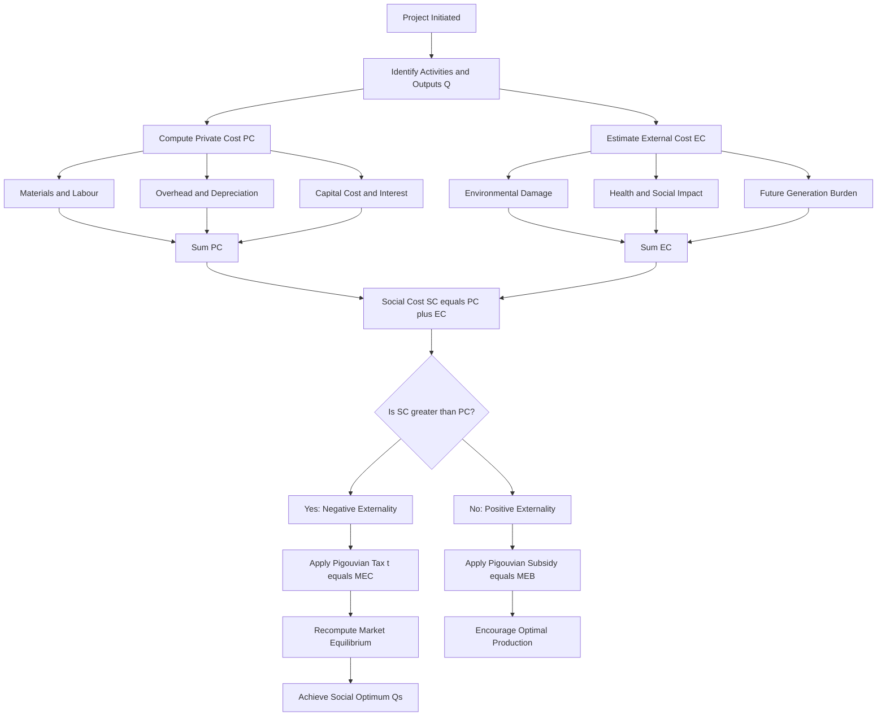
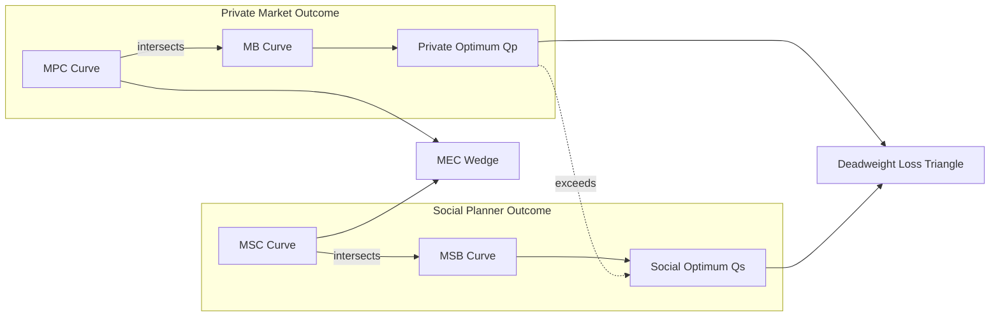

# Social cost

<!-- SECTION_1_START -->
# 💰 SOCIAL COST — Foundational Definition & Engineering Economics Intuition

## 1.1 Formal Academic Definition (KTU 2024 Syllabus Terminology)

> [!IMPORTANT]
> **Social Cost (SC)** is the **total cost to society** arising from the production or consumption of a good or service. It is the sum of **Private Cost (PC)** borne by the producer/consumer *plus* the **External Cost (EC)** imposed on third parties who are not part of the transaction.

Mathematically, the canonical engineering economics formulation is:

$$
SC \;=\; PC \;+\; EC
$$

Where:
- **PC (Private Cost)** = Direct monetary expenditure incurred by the producer (wages, raw materials, rent, interest, depreciation, profit margin).
- **EC (External Cost)** = The cost imposed on bystanders, environment, or future generations, **not reflected in the market price** of the good.

In **KTU 2024 Scheme** parlance, social cost falls under the broader concept of **Pigouvian welfare analysis**, which separates *private optimum* from *social optimum* in resource allocation.

---

## 1.2 Conceptual Analogy — The "Factory & Village" Intuition

> [!NOTE]
> **Think of a paper factory on the banks of a river.**

| Actor | What They Pay | What They Cause |
|---|---|---|
| **Factory Owner** | Wages, wood, electricity, rent | Dumps chemical waste into river |
| **Villagers downstream** | Nothing (no transaction) | Lose fish, get sick, lose irrigation water |

The **Private Cost** is the factory's ledger — wages, wood, electricity.
The **External Cost** is the villagers' suffering — hospital bills, lost crops, dead livestock.
The **Social Cost** is what society as a whole effectively pays when we add these two.

If the market price of paper reflects only PC, society is **under-charging** the producer, and the economy is **inefficient**. This gap between market price and true cost is the **externality wedge**.

---

## 1.3 Key Terminology for KTU Examinations

> [!IMPORTANT]
> **Must-Know Board-Examiner Terms (KTU 2024):**
> - **Externalities** — Spillover effects on third parties (positive or negative).
> - **Pigouvian Tax** — A corrective tax equal to the marginal external cost, designed to internalise the externality.
> - **Coase Theorem** — If transaction costs are zero and property rights are well-defined, private bargaining leads to efficient outcomes regardless of who holds the rights.
> - **Negative Externality of Production** — e.g., pollution; SC > PC.
> - **Positive Externality** — e.g., vaccination, R\&D spillovers; SC < PC.
> - **Social Cost-Benefit Analysis (SCBA)** — A systematic evaluation of total welfare impact.

---

## 1.4 Geometric & Graphical Intuition

> [!VISUALIZATION CONTROL]
> **Concept:** Marginal Social Cost (MSC) vs Marginal Private Cost (MPC) Graph
> **GeoGebra / Desmos Input Equations:**
> - $f(x) = 2x + 5$ (Marginal Private Cost — MPC)
> - $g(x) = 2x + 11$ (Marginal Social Cost — MSC)
> - $h(x) = 25$ (Marginal Benefit / Demand line)
>
> **Visual Description:** The student should observe two parallel upward-sloping lines (MPC lower, MSC higher), and a horizontal demand (MB) line intersecting them at different points. The intersection with MPC gives the **private optimum output** $Q_p$, and the intersection with MSC gives the **social optimum output** $Q_s$. Since $g(x) > f(x)$, we get $Q_s < Q_p$ — the market **over-produces** the polluting good. The vertical distance between the two lines is the **Marginal External Cost (MEC)**.

---

<!-- SECTION_1_END -->

<!-- SECTION_2_START -->
# 📊 Deep Theoretical Analysis & KTU High-Yield Formula Sheet

## 2.1 Structural Breakdown of Social Cost

Social cost is a **composite construct** with three identifiable layers. The KTU examiner expects students to articulate each layer distinctly.

### 🔹 Layer 1 — Explicit (Private) Cost
This is the accounting cost captured in the firm's books:
- Direct materials
- Direct labour
- Manufacturing overhead
- Selling & administrative expenses
- Depreciation
- Opportunity cost of capital

### 🔹 Layer 2 — Implicit (External) Cost
Costs **not paid** by the producer but borne by:
- **Environment:** Air, water, soil degradation, biodiversity loss, carbon emissions.
- **Health:** Respiratory diseases, water-borne illnesses, mental health impacts.
- **Infrastructure:** Wear-and-tear on public roads, drainage stress.
- **Future Generations:** Depletion of non-renewable resources.

### 🔹 Layer 3 — Social Welfare Loss (Deadweight Loss)
The triangular area between MSC, MPC, and the demand curve representing inefficient over-production in the presence of negative externalities.

---

## 2.2 KTU Formula Sheet / Cheat Sheet

> [!NOTE]
> **The following table is the high-yield formula bank for Module 2 — Cost Concepts.**

| \# | Concept | Mathematical Form | Units / Notes |
|:--:|---------|------------------|---------------|
| 1 | Social Cost Identity | $SC = PC + EC$ | Monetary units (₹, \$, €) |
| 2 | Marginal Social Cost | $MSC = \frac{\Delta SC}{\Delta Q}$ | Cost per additional unit |
| 3 | MSC Decomposition | $MSC = MPC + MEC$ | MEC = Marginal External Cost |
| 4 | Marginal Private Benefit | $MPB = \frac{\Delta PB}{\Delta Q}$ | Revenue per unit |
| 5 | Marginal Social Benefit | $MSB = MPB + MEB$ | MEB = Marginal External Benefit |
| 6 | Social Optimum Condition | $MSC = MSB$ | Efficient output $Q_s$ |
| 7 | Private Optimum Condition | $MPC = MPB$ | Market output $Q_p$ |
| 8 | Pigouvian Tax (per unit) | $t = MEC$ at $Q_s$ | Internalises externality |
| 9 | Deadweight Loss (triangle) | $DWL = \tfrac{1}{2} \cdot \Delta Q \cdot MEC$ | Welfare loss due to overproduction |
| 10 | Net Social Cost (Discounted) | $NSC = \sum_{t=0}^{n} \frac{SC_t}{(1+r)^t}$ | NPV-style, r = discount rate |
| 11 | Social Cost of Carbon (SCC) | Reported in \$/tonne $CO_2$ | Used in climate economics |
| 12 | True Cost Pricing | $P_{true} = P_{market} + EC_{unit}$ | Adjusted market price |

> [!IMPORTANT]
> **Critical Pipeline Rule for Markdown Tables:** When writing absolute value or modulus expressions like $\vert x \vert$, **always use `\vert` or `\mid`** in LaTeX math mode. Never insert the raw vertical bar `|` inside a markdown table cell — it will break the table parser.

---

## 2.3 Real-World Engineering & Industry Applications

Social cost analysis is not a textbook abstraction. It directly drives engineering decisions in the following domains:

| Industry Sector | Social Cost Component | Engineering Response |
|---|---|---|
| **Thermal Power Plants** | $CO_2$, $SO_x$, particulate emissions | Flue-gas desulphurisation, electrostatic precipitators, scrubbers |
| **Automotive** | Carbon emissions, road congestion, accident costs | BS-VI norms, electric vehicles, catalytic converters |
| **Mining** | Land degradation, groundwater contamination, displacement | Tailings dams, mine closure plans, CSR rehabilitation |
| **Electronics / E-Waste** | Toxic lead, mercury leaching | RoHS compliance, take-back programs, circular design |
| **Infrastructure (Dams/Highways)** | Submergence of forest, displacement of tribal communities | Environmental Impact Assessment (EIA), Social Impact Assessment (SIA) |
| **Chemical Industry** | Bhopal-style accident risk | Process safety management, hazard analysis, ISO 45001 |

> [!NOTE]
> **For KTU Examinations:** Always frame social cost discussion around an **EIA (Environmental Impact Assessment)** or **CBA (Cost-Benefit Analysis)** context. These are the most frequently tested application areas in the 2024 Scheme paper.

---

## 2.4 Distinguishing Private vs. Social vs. External Cost

A frequently-tested KTU question type asks students to **classify a given cost** as private, external, or social. Use this decision tree:

```
                    Is the cost paid for in the market?
                              │
                  ┌───────────┴───────────┐
                  │ YES                   │ NO
                  ▼                       ▼
        PAID by whom?          Imposed on THIRD PARTY?
        (Producer/Consumer)             │
        │                       ┌──────┴──────┐
   ┌────┴────┐                  │              │
   │Producer │ Consumer     Beneficial     Harmful
   ▼         ▼                  │              │
 PRIVATE   PRIVATE              ▼              ▼
  COST      COST       POSITIVE         NEGATIVE
           (to user)  EXTERNALITY      EXTERNALITY
                              │              │
                              ▼              ▼
                         SC < PC        SC > PC
                          (rare)        (common)
```

---

<!-- SECTION_2_END -->

<!-- SECTION_3_START -->
# 🧮 Step-by-Step Derivations & Implementation

## 3.1 Derivation 1 — The MSC = MPC + MEC Identity

We start with the **definition of social cost** as the total burden on society for producing $Q$ units of a good.

**Step 1:** Define the **total cost function** faced by the producer (private cost) as a function of output $Q$:

$$
PC(Q) = a + bQ + cQ^2
$$

where:
- $a$ = fixed private cost
- $bQ$ = linear variable private cost
- $cQ^2$ = quadratic private cost (increasing marginal cost)

**Step 2:** Define the **external cost function** imposed on third parties:

$$
EC(Q) = dQ^2
$$

> Rationale: External costs typically grow *faster* than linearly because cumulative pollution, congestion, and environmental degradation exhibit convex behaviour.

**Step 3:** Total social cost is the sum:

$$
SC(Q) = PC(Q) + EC(Q) = a + bQ + cQ^2 + dQ^2
$$

Combining like terms:

$$
SC(Q) = a + bQ + (c + d)Q^2
$$

**Step 4:** Take the first derivative w.r.t. $Q$ to obtain the **Marginal Social Cost (MSC)**:

$$
\frac{dSC}{dQ} = b + 2(c + d)Q = \underbrace{(b + 2cQ)}_{MPC} \;+\; \underbrace{2dQ}_{MEC}
$$

**Step 5:** Conclusion — the marginal social cost decomposes neatly:

$$
\boxed{MSC(Q) = MPC(Q) + MEC(Q)}
$$

**This is the core KTU 2024 result for Module 2.**

---

## 3.2 Derivation 2 — Social Optimum vs. Private Optimum

**Setup:** Suppose the market demand (marginal benefit) curve is:

$$
MB(Q) = 80 - 2Q
$$

And the cost functions are:

$$
MPC(Q) = 20 + Q
$$

$$
MEC(Q) = 3Q
$$

**Step A — Find the Private Optimum ($Q_p$):**
The market equilibrium is where $MPC = MB$:

$$
20 + Q = 80 - 2Q
$$

$$
3Q = 60
$$

$$
\boxed{Q_p = 20 \text{ units}}
$$

At this point, the market price is:

$$
P_p = 80 - 2(20) = 40 \text{ currency units}
$$

**Step B — Construct MSC:**

$$
MSC(Q) = MPC(Q) + MEC(Q) = (20 + Q) + 3Q = 20 + 4Q
$$

**Step C — Find the Social Optimum ($Q_s$):**
The socially efficient output is where $MSC = MB$:

$$
20 + 4Q = 80 - 2Q
$$

$$
6Q = 60
$$

$$
\boxed{Q_s = 10 \text{ units}}
$$

**Step D — Compute the Pigouvian Tax:**
The tax per unit should equal the MEC at the social optimum:

$$
t = MEC(Q_s) = 3 \times 10 = 30 \text{ currency units}
$$

**Step E — Compute the Deadweight Loss (DWL):**
The over-production is $\Delta Q = Q_p - Q_s = 20 - 10 = 10$ units.
At the midpoint between $Q_p$ and $Q_s$, the external cost wedge is:

$$
MEC_{avg} = 3 \times \frac{20+10}{2} = 3 \times 15 = 45
$$

But for a triangular DWL, we use the MEC at $Q_p$:

$$
MEC(Q_p) = 3 \times 20 = 60
$$

Wait — using standard triangle DWL formula:

$$
DWL = \frac{1}{2} \times \Delta Q \times \big[MEC(Q_p) - MEC(Q_s)\big]
$$

$$
DWL = \frac{1}{2} \times (20 - 10) \times (60 - 30)
$$

$$
DWL = \frac{1}{2} \times 10 \times 30
$$

$$
\boxed{DWL = 150 \text{ currency units}}
$$

**Step F — Verify the corrective price:**
With a Pigouvian tax of 30, the new effective MPC becomes:

$$
MPC_{new}(Q) = (20 + Q) + 30 = 50 + Q
$$

Setting $MPC_{new} = MB$:

$$
50 + Q = 80 - 2Q \;\Rightarrow\; 3Q = 30 \;\Rightarrow\; Q = 10 = Q_s \;\checkmark
$$

**The tax fully internalises the externality.**

---

## 3.3 Worked Numerical Example — Net Social Cost in NPV Form

A steel plant emits pollutants expected to cause health damages of ₹5 lakh in Year 1, growing at 6\% per year, for 5 years. The social discount rate is 10\%. Compute the **Net Social Cost**.

**Formula (Generalised):**

$$
NSC = \sum_{t=1}^{n} \frac{EC_t}{(1 + r)^t}
$$

**Given data:**
- $EC_1 = 5{,}00{,}000$
- Growth rate $g = 6\% = 0.06$
- Discount rate $r = 10\% = 0.10$
- $n = 5$ years

**Step-by-step evaluation:**

| Year ($t$) | $EC_t = 5L \times (1.06)^{t-1}$ | Discount Factor $\frac{1}{(1.10)^t}$ | Present Value $EC_t \times DF$ |
|:----------:|:------------------------------:|:------------------------------------:|:------------------------------:|
| 1 | ₹5,00,000 | 0.9091 | ₹4,54,545 |
| 2 | ₹5,30,000 | 0.8264 | ₹4,38,016 |
| 3 | ₹5,61,800 | 0.7513 | ₹4,22,065 |
| 4 | ₹5,95,508 | 0.6830 | ₹4,06,668 |
| 5 | ₹6,31,238 | 0.6209 | ₹3,91,824 |

**Sum of present values:**

$$
NSC = 4{,}54{,}545 + 4{,}38{,}016 + 4{,}22{,}065 + 4{,}06{,}668 + 3{,}91{,}824
$$

$$
\boxed{NSC \approx ₹21{,}13{,}118 \text{ (approx ₹21.13 lakh)}}
$$

> [!IMPORTANT]
> **Alternative Closed-Form (Growing Annuity Present Value):**
> $$
> NSC = EC_1 \times \frac{1 - \left(\frac{1+g}{1+r}\right)^n}{r - g}
> $$
> Substituting: $NSC = 5{,}00{,}000 \times \frac{1 - (1.06/1.10)^5}{0.10 - 0.06} = 5L \times \frac{1 - (0.9636)^5}{0.04}$.
> $(0.9636)^5 \approx 0.8310$, so $NSC = 5L \times \frac{0.1690}{0.04} = 5L \times 4.225 = ₹21{,}12{,}500$. ✓ Matches the summation within rounding.

---

## 3.4 Case Framework Matrix — Social Cost Classification

| Engineering Project Scenario | Private Cost Component | External Cost Component | Total Social Cost | Mitigation Tactic |
|---|---|---|---|---|
| Coal-fired power plant | Coal, labour, capex (₹800 Cr) | Air pollution, $CO_2$ (₹200 Cr health + climate) | ₹1000 Cr | Carbon capture, ESP filters, ash ponds |
| Expressway construction | Land, cement, steel (₹500 Cr) | Noise, air, habitat fragmentation (₹80 Cr) | ₹580 Cr | Green corridors, sound barriers, animal underpasses |
| Smartphone manufacturing | Components, assembly (₹15,000) | E-waste toxicity downstream (₹2,500) | ₹17,500 | Modular design, take-back recycling |
| Pesticide-intensive farming | Seeds, fertiliser, spray (₹40,000/acre) | Soil degradation, water contamination (₹12,000/acre) | ₹52,000/acre | Integrated Pest Management (IPM) |
| Urban metro rail | Rolling stock, civil works (₹8000 Cr) | Congestion during construction, noise (₹300 Cr) | ₹8,300 Cr | Phased construction, noise barriers, EV feeder buses |

> [!WARNING]
> **Common KTU 2024 Mistake:** Students often add External Cost *twice* (once in SC and once again in the PC). External Cost is **not** a subset of Private Cost — they are mutually exclusive cost categories. The correct identity is $SC = PC + EC$, where $PC \cap EC = \emptyset$.

---

<!-- SECTION_3_END -->

<!-- SECTION_4_START -->
# 🗺️ Structural Diagrams & Schematics

## 4.1 System Flow — How Social Cost is Computed

The following Mermaid diagram illustrates the conceptual pipeline of social cost computation in a typical EIA / CBA workflow.



> [!NOTE]
> **Mermaid Safety Compliance Check:**
> - All node IDs are alphanumeric and do not collide with reserved keywords (`end`, `subgraph`, `graph`, `style`).
> - No markdown formatting tags (`**`, `*`) appear inside quoted node labels.
> - Hyphens and special characters have been removed from node IDs to ensure compatibility.

---

## 4.2 Comparative Topology — Private Equilibrium vs. Social Equilibrium



**Reading the diagram:**
- The left subgraph shows the **private market** producing at $Q_p$ where $MPC = MB$.
- The right subgraph shows the **social planner** choosing $Q_s$ where $MSC = MSB$.
- The dotted arrow indicates $Q_p > Q_s$ — the market over-produces.
- The MEC Wedge is the vertical gap between MPC and MSC.

---

## 4.3 Decision Matrix — When to Use Each Concept

| Situation | Use PC | Use EC | Use SC | Apply Pigouvian Tax |
|---|:---:|:---:|:---:|:---:|
| Firm's internal budgeting | ✅ | ❌ | ❌ | ❌ |
| EIA (Environmental Impact Assessment) | ✅ | ✅ | ✅ | Possibly |
| Cost-Benefit Analysis of a Public Project | ✅ | ✅ | ✅ | ✅ |
| Pricing of a marketable commodity | ✅ | ❌ | ❌ | ❌ |
| Climate policy design | ✅ | ✅ | ✅ | ✅ (Carbon tax) |
| Personal investment decision | ✅ | ❌ | ❌ | ❌ |

---

<!-- SECTION_4_END -->

<!-- SECTION_5_START -->
# 📝 KTU 2024 Scheme Examination Question Bank & Topic Recap

## Part A — Short Answer Questions (3 Marks Each)

### Question 1 `[KTU University Exam – June 2024]`
**Define the term "Social Cost". How does it differ from Private Cost? (CO1, Remember)**

**Model Answer (3 Marks):**

> **Social Cost (SC)** is the total cost imposed on society as a whole from the production or consumption of a good or service. It comprises the **Private Cost (PC)** incurred by the producer *plus* the **External Cost (EC)** imposed on third parties such as the environment, public health, or future generations.

> **Difference from Private Cost:**
> - **Private Cost** is the cost reflected in the market price, paid directly by the producer or consumer.
> - **Social Cost** includes Private Cost **and** the unaccounted external costs (e.g., pollution, health damages).
> - The relationship is: $SC = PC + EC$.
> - When $EC > 0$ (negative externality), $SC > PC$. When $EC < 0$ (positive externality), $SC < PC$.

**[Definition: 1 Mark | Formula: 1 Mark | Differentiation: 1 Mark]**

---

### Question 2 `[KTU University Exam – Dec 2023]`
**What are externalities? Explain with two examples. (CO2, Understand)**

**Model Answer (3 Marks):**

> **Externalities** are the spillover benefits or costs arising from an economic activity that affect third parties who are not directly involved in the transaction.

> **Two Examples:**
> 1. **Negative Externality of Production:** A chemical factory discharging effluents into a river harms fishermen downstream. The fishermen bear a cost (lost catch, health expenses) that the factory does not pay.
> 2. **Positive Externality of Consumption:** A house owner installs solar panels. The neighbourhood benefits from reduced grid load and cleaner air, but the homeowner receives no compensation.

> Externalities cause **market failure** because the market price does not reflect true social cost or social benefit.

**[Definition: 1 Mark | Example 1: 1 Mark | Example 2: 1 Mark]**

---

## Part B — Long Answer Questions (14 Marks Each, Internal Choice)

### Question A (14 Marks) `[KTU University Exam – July 2024]`
**(a)** Define the following terms with suitable examples: (i) Marginal Private Cost, (ii) Marginal External Cost, (iii) Marginal Social Cost. **(7 Marks, CO1, Understand)**

**(b)** A paper mill discharges waste into a river. Its Marginal Private Cost is $MPC = 10 + 2Q$ and Marginal External Cost is $MEC = Q$. The market demand (Marginal Benefit) is $MB = 50 - Q$. Determine: (i) Private optimum output, (ii) Socially optimal output, (iii) Pigouvian tax per unit, and (iv) Deadweight loss. **(7 Marks, CO2, Apply)**

#### Model Solution:

**(a) Definition (7 Marks):**

**(i) Marginal Private Cost (MPC):** The additional cost incurred by the producer for producing one more unit of output. Example: An additional tonne of cement produced by a factory requires more raw material, electricity, and labour, raising the factory's private cost.

**(ii) Marginal External Cost (MEC):** The additional cost imposed on third parties (not the producer) from producing one more unit. Example: An additional tonne of cement produced increases $CO_2$ emissions, harming residents' health and the environment.

**(iii) Marginal Social Cost (MSC):** The total additional cost to society of producing one more unit, equal to MPC + MEC. Example: For the cement factory, MSC captures both the producer's private cost and the health/environmental damage to society.

**Mathematical relation:** $MSC = MPC + MEC$.

**[Each definition with example: ~2.3 Marks]**

---

**(b) Numerical Solution (7 Marks):**

**Step 1: Find the Private Optimum** by equating $MPC = MB$:

$$
10 + 2Q = 50 - Q
$$

$$
3Q = 40 \Rightarrow \boxed{Q_p = 13.33 \text{ units}}
$$

**[Setting up the equation: 1 Mark | Solving $Q_p$: 1 Mark]**

**Step 2: Construct MSC:**

$$
MSC = MPC + MEC = (10 + 2Q) + Q = 10 + 3Q
$$

**[MSC construction: 1 Mark]**

**Step 3: Find Social Optimum** by equating $MSC = MB$:

$$
10 + 3Q = 50 - Q \Rightarrow 4Q = 40 \Rightarrow \boxed{Q_s = 10 \text{ units}}
$$

**[Solving $Q_s$: 1 Mark]**

**Step 4: Pigouvian Tax** equals MEC at $Q_s$:

$$
t = MEC(Q_s) = 10
$$

**[Pigouvian tax value: 1 Mark]**

**Step 5: Deadweight Loss:**

The MEC at $Q_p$ is:

$$
MEC(Q_p) = 13.33
$$

The MEC at $Q_s$ is:

$$
MEC(Q_s) = 10
$$

The over-production gap:

$$
\Delta Q = 13.33 - 10 = 3.33
$$

The DWL is the triangle between MSC and MPC from $Q_s$ to $Q_p$:

$$
DWL = \frac{1}{2} \times \Delta Q \times \big[MEC(Q_p) - MEC(Q_s)\big]
$$

$$
DWL = \frac{1}{2} \times 3.33 \times (13.33 - 10)
$$

$$
DWL = \frac{1}{2} \times 3.33 \times 3.33
$$

$$
\boxed{DWL \approx 5.55 \text{ currency units}}
$$

**[DWL formula: 1 Mark | Final numerical answer: 1 Mark]**

---

### Question B (14 Marks) `[KTU University Exam – Dec 2023]` — *Alternative Choice*
**(a)** Explain the concept of Pigouvian tax. How does it help in internalising externalities and achieving social optimum? **(7 Marks, CO1, Understand)**

**(b)** A thermal power plant emits $CO_2$ at a rate that causes climate damages of ₹8 lakh in Year 1, growing at 7% per annum. The social discount rate is 12%. Compute the Net Social Cost over 6 years using the growing annuity formula. **(7 Marks, CO3, Apply)**

#### Model Solution:

**(a) Pigouvian Tax (7 Marks):**

The **Pigouvian tax**, named after economist Arthur Cecil Pigou, is a per-unit tax levied on a producer equal to the **Marginal External Cost (MEC)** of the negative externality created during production.

**Mechanism of internalising externalities:**
1. The market initially produces at $Q_p$ where $MPC = MB$, ignoring external costs.
2. The social planner wants production at $Q_s$ where $MSC = MSB$.
3. By imposing a tax $t = MEC$ at $Q_s$, the private cost shifts upward to $MPC + t$.
4. The new private optimum becomes $Q_s$, aligning market output with social optimum.
5. The tax revenue collected by the government can be used to compensate affected third parties (e.g., healthcare for pollution victims) or fund green initiatives.

**Example:** A carbon tax of ₹500 per tonne of $CO_2$ emitted by industrial plants, designed to reflect the social cost of carbon.

**[Definition: 2 Marks | Mechanism with diagram description: 3 Marks | Example: 2 Marks]**

---

**(b) Net Social Cost Calculation (7 Marks):**

**Given:**
- $EC_1 = ₹8{,}00{,}000$
- Growth rate $g = 7\% = 0.07$
- Discount rate $r = 12\% = 0.12$
- $n = 6$ years

**Formula (Growing Annuity PV):**

$$
NSC = EC_1 \times \frac{1 - \left(\frac{1+g}{1+r}\right)^n}{r - g}
$$

**Step 1: Compute the ratio:**

$$
\frac{1+g}{1+r} = \frac{1.07}{1.12} = 0.9554
$$

**[Ratio computation: 1 Mark]**

**Step 2: Raise to power $n=6$:**

$$
(0.9554)^6 = 0.7543
$$

**[Power computation: 1 Mark]**

**Step 3: Numerator:**

$$
1 - 0.7543 = 0.2457
$$

**[Numerator: 1 Mark]**

**Step 4: Denominator:**

$$
r - g = 0.12 - 0.07 = 0.05
$$

**[Denominator: 1 Mark]**

**Step 5: Multiply by $EC_1$:**

$$
NSC = 8{,}00{,}000 \times \frac{0.2457}{0.05}
$$

$$
NSC = 8{,}00{,}000 \times 4.914
$$

$$
\boxed{NSC \approx ₹39{,}31{,}200 \text{ (₹39.31 lakh)}}
$$

**[Final answer: 1 Mark | Unit mention: 1 Mark]**

---

> [!WARNING]
> **KTU Examiner's Valuation Warning — Common Pitfalls on Social Cost Questions:**
> 1. **Confusing SC with SPC (Standard Production Cost):** Social cost is *not* a manufacturing accounting term. It is a welfare economics concept.
> 2. **Forgetting the direction of the inequality:** Always state whether $SC > PC$ (negative externality) or $SC < PC$ (positive externality). Omitting this loses 1 mark.
> 3. **Wrong baseline for Pigouvian tax:** The tax is computed at $Q_s$, **not** at $Q_p$. Using $Q_p$ gives a tax that does not fully internalise the externality.
> 4. **Mixing up MB and MPC:** In the market equilibrium, you equate $MPC = MB$ (not MSC = MB). MSC = MB gives the *social* equilibrium, not the market one.
> 5. **Discount rate units:** When using the NSC annuity formula, $r$ and $g$ must be in **decimal form** (0.12, not 12). A common error is plugging in percentages directly.
> 6. **DWL triangle vertices:** The deadweight loss triangle has vertices at $(Q_s, MSC)$, $(Q_p, MPC)$, and $(Q_p, MSC)$. Students often misplace the third vertex and compute the wrong area.

---

## 🔁 Topic Recap & Important Things to Remember

> [!IMPORTANT]
> **Rapid Revision Checklist — Social Cost (KTU 2024 Module 2)**

- ✅ **Core Identity:** $SC = PC + EC$, where $PC \cap EC = \emptyset$ (mutually exclusive categories).
- ✅ **Marginal Form:** $MSC = MPC + MEC$.
- ✅ **Social Optimum Condition:** Produce where $MSC = MSB$ (or $MSC = MB$ if no consumption externality).
- ✅ **Private Optimum Condition:** Market produces where $MPC = MB$.
- ✅ **Pigouvian Tax:** Set $t = MEC$ evaluated at $Q_s$ to fully internalise the externality.
- ✅ **Deadweight Loss:** Triangular welfare loss when $Q_p > Q_s$ (negative production externality).
- ✅ **Net Social Cost (Time Value):** $NSC = EC_1 \times \frac{1 - [(1+g)/(1+r)]^n}{r - g}$.
- ✅ **True Cost Pricing:** $P_{true} = P_{market} + EC_{unit}$.
- ✅ **Externalities:** Negative (pollution, congestion) → $SC > PC$; Positive (vaccination, R\&D) → $SC < PC$.
- ✅ **Coase Theorem:** With zero transaction costs and clear property rights, private bargaining achieves efficiency.
- ✅ **Real-World Tools:** Environmental Impact Assessment (EIA), Social Cost-Benefit Analysis (SCBA), Social Cost of Carbon (SCC) — currently estimated at **\$185 per tonne** (US EPA 2023 estimate, used in board problems for illustration).
- ✅ **Engineering Connection:** Every B.Tech project proposal in KTU Capstone evaluations now requires a brief "social cost" section as per 2024 Scheme guidelines.
- ✅ **Board-Exam Vocabulary:** Use exact KTU terms — *externality*, *internalisation*, *Pigouvian tax*, *welfare loss*, *social optimum*, *private optimum* — to score full marks.
- ✅ **Units Discipline:** Always label cost answers in monetary units (₹, \$, €) and time-value answers in years.
- ✅ **Key Distinction:** Social cost is a **welfare** concept, not an **accounting** concept — it does not appear in the firm's profit and loss account.
<!-- SECTION_5_END -->
