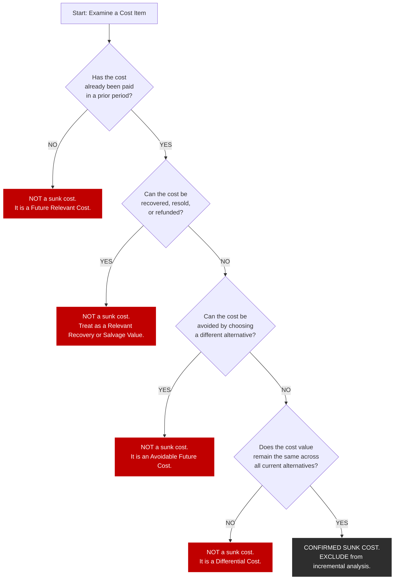
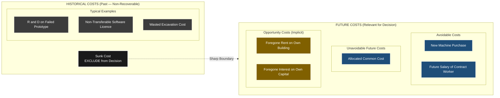
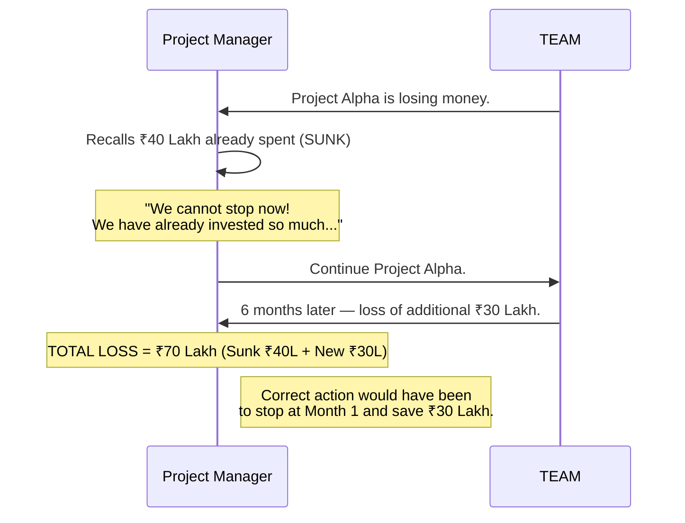

# Sunk cost

<!-- SECTION_1_START -->
# Sunk Cost — Core Technical Definition & Intuitive Overview

> [!NOTE]
> **KTU 2024 Scheme | UCHUT346 | Module 2 — Cost Concepts**
> **Course Outcome Mapping:** *CO1 — Understand the fundamental cost concepts used in engineering economic decision making.*
> **Bloom's Level:** *Remember / Understand*

## 1.1 Formal Academic Definition (KTU Terminology)

In **Engineering Economics**, a **Sunk Cost** is defined as a cost that has **already been incurred** in the past, is **historical and irreversible**, and **cannot be recovered or avoided** by any current or future decision. By the fundamental principle of *rational economic decision-making*, sunk costs are **irrelevant** to the evaluation of future alternatives because they remain the same regardless of which alternative is selected.

$$C_{sunk} = \text{Cost already paid, with no salvage value and no recovery option}$$

> [!IMPORTANT]
> **Key Properties of a Sunk Cost (Board-Exam Definition):**
> 1. **Already Expended** — payment has been made in the past.
> 2. **Irreversible** — cannot be refunded, returned, or resold at book value.
> 3. **Irrelevant for Future Decisions** — must be excluded from marginal/incremental analysis.
> 4. **Independent of Future Action** — the value does not change whether the project is continued, abandoned, or modified.

## 1.2 Conceptual Analogy — The Movie Theatre Intuition

Imagine you bought a movie ticket for **₹300** and, after 20 minutes, you realize the movie is terrible. You have three options:

| Option | Future Action | Should you consider the ₹300? |
|---|---|---|
| A | Walk out of the theatre | ❌ NO — money is gone either way |
| B | Stay and finish the movie | ❌ NO — money is gone either way |
| C | Stay for 2 more hours (and skip a free cricket match outside) | ❌ NO — money is gone either way |

The **₹300 is a sunk cost.** Whether you stay or leave, you cannot get it back. The **only relevant comparison** is the *future* benefit of staying vs. the *future* opportunity cost of missing the cricket match.

> [!WARNING]
> **The Sunk Cost Fallacy** — A common behavioural bias where individuals or companies continue an unprofitable venture *because* of past expenditure ("We have already invested so much, we cannot quit now!"). KTU board questions frequently test the student's ability to **identify and reject** this fallacy.

## 1.3 Standard Sunk Cost Examples in Engineering Projects

- **Research and Development (R&D) expenditure** on a failed prototype.
- **Specialized machinery** with no resale/alternative-use market value.
- **Pre-installed software licences** that are non-transferable.
- **Advertising / brand-promotion campaigns** already aired.
- **Site preparation and excavation** for a cancelled construction project.
- **Employee training costs** for a process technology that is being abandoned.

> [!TIP]
> **Mnemonic Device for Exams:** *Sunk = Sunken Ship*. Once a coin is dropped into the ocean, the ship's future navigation does not depend on that coin. The coin is **sunk**. Your future decision must depend only on the **waves ahead**, not the **coins behind**.

<!-- SECTION_1_END -->

<!-- SECTION_2_START -->
# Sunk Cost — Deep Theoretical Analysis & KTU High-Yield Formula Sheet

## 2.1 Theoretical Positioning in Cost Hierarchy

Costs in Engineering Economics are classified along two primary dimensions:

1. **By Behaviour with respect to Output Volume** — Fixed, Variable, Semi-variable.
2. **By Relevance to Decision-Making** — Sunk, Relevant (Future), Opportunity.

Sunk costs occupy a unique position — they are **historical** (already past) and **decision-independent** (do not vary with the choice).

```
                    [ TOTAL COST ]
                          |
        +-----------------+-----------------+
        |                                   |
  [ FUTURE COSTS ]                    [ PAST COSTS ]
  (Relevant)                          (Sunk — Irrelevant)
        |
+---+---+---+----+
|   |   |   |    |
Marginal  Opport- Diffe-   Avoid-   Common
         unity   rential   able     (Allocated)
```

> [!IMPORTANT]
> **Sunk vs. Fixed Cost — A Frequent Board Trap:**
> - *All Sunk Costs are past costs.*
> - *NOT all Fixed Costs are Sunk Costs.*
>
> Example: An annual insurance premium of **₹50,000** already paid for the year is **sunk** (past, non-recoverable). However, the *next year's* premium of ₹50,000 is **fixed** but **NOT sunk** — it is a *future avoidable cost* and is **relevant** to the decision.

## 2.2 The Five-Step Decision Rule for Identifying a Sunk Cost

A cost must satisfy **ALL** the following to qualify as a sunk cost in a KTU problem:

1. **Temporal Test** — Has the expenditure *already occurred* in a prior period?
2. **Recovery Test** — Can it be recovered through resale, refund, or redeployment?
3. **Avoidance Test** — Can it be avoided by choosing a different alternative?
4. **Independence Test** — Does the value remain the same across all current alternatives?
5. **Decision Test** — Will including this cost change the ranking of alternatives?

If the answer to *Recovery*, *Avoidance*, and *Decision* is **NO** → the cost is **SUNK**.

## 2.3 KTU Formula Sheet / Cheat Sheet

| # | Concept | Symbolic Expression | Decision Rule | Engineering Example |
|---|---|---|---|---|
| 1 | Sunk Cost | $C_{sunk}$ | Ignore in incremental analysis | Expired R\&D on a failed design |
| 2 | Opportunity Cost | $C_{opp} = \text{Best foregone benefit}$ | Include as a *future* implicit cost | Rent foregone on own building |
| 3 | Marginal Cost | $\Delta C / \Delta Q$ | Include for "one more unit" decisions | Cost of producing the 101st unit |
| 4 | Differential Cost | $C_2 - C_1$ between alternatives | Include to compare two future paths | Machine A cost ₹10L vs Machine B ₹14L |
| 5 | Avoidable Cost | Cost saved if alternative is dropped | Include as a *future* savings | Salary of a contract worker to be terminated |
| 6 | Sunk Cost Trap | $\text{Temptation to keep} \uparrow$ due to $C_{sunk}$ | **Reject** the trap | Continuing a failing project due to past investment |
| 7 | Net Relevant Cost | $\sum (\text{Future Costs} - \text{Future Savings})$ | This is the **only** basis for choice | Replacement analysis of equipment |
| 8 | Book Value Trap | $BV = P - \text{Accumulated Depreciation}$ | Book value of a sunk asset = **NOT** a real cost | Old machine in a replacement decision |

> [!WARNING]
> **Board Trap #2 — The Book Value Illusion:**
> A frequently-asked KTU question presents the *book value* of an existing machine as a "cost" in a replacement decision. The **correct answer is to ignore it**, because the book value is simply the *unrecovered portion of a past sunk expenditure*. It will be a *loss* whether the machine is kept or replaced, so it **does not affect the choice**.

## 2.4 Real-World Utility in Engineering & Production Systems

| Domain | Application of Sunk Cost Concept |
|---|---|
| **Software Industry** | Money spent on developing a failed version is sunk; the rebuild decision is based purely on future costs. |
| **Construction** | Excavation cost for a wrong foundation is sunk; the redesign choice depends on the *additional* cost to fix it. |
| **Manufacturing** | A scrapped batch of raw material is a sunk cost; future production planning excludes it. |
| **Aerospace / R&D** | A crashed prototype's cost is sunk; engineers must decide *future* recovery based on future costs only. |
| **Project Management (PMBOK / PRINCE2)** | Earned Value Management explicitly excludes sunk costs from the Estimate at Completion (EAC) for the remaining work. |
| **Government Policy** | The **"Concorde Fallacy"** — continuing an unprofitable public project because money has already been spent. |

> [!TIP]
> **The Golden Rule (memorize for KTU):**
> *Sunk costs are the ghosts of economic decisions past — they have no power to influence the living decisions of the present.*

<!-- SECTION_2_END -->

<!-- SECTION_3_START -->
# Sunk Cost — Step-by-Step Derivations, Numerical Solutions & Implementation

## 3.1 Worked Example 1 — Replacement Decision (Classic KTU Pattern)

### Problem Statement
A factory purchased a machine **5 years ago** for **₹5,00,000**. The machine has a useful life of **10 years** with **straight-line depreciation** to a **zero salvage value**. The annual operating cost is **₹1,20,000**. 

A new, automated machine is available for **₹8,00,000**, with a **10-year life**, **zero salvage value**, and an **annual operating cost of ₹40,000**.

The existing machine can be sold today for **₹1,00,000**. Should the company replace it? (Assume MARR is irrelevant for this conceptual question.)

### Step 1 — Identify the Sunk Cost

The **book value** of the old machine is computed to *test* whether it is a relevant cost.

$$BV_{old} = P - \text{Depreciation per year} \times \text{years used}$$

$$\text{Depreciation/year} = \frac{5{,}00{,}000 - 0}{10} = 50{,}000$$

$$BV_{old} = 5{,}00{,}000 - (50{,}000 \times 5) = 5{,}00{,}000 - 2{,}50{,}000 = 2{,}50{,}000$$

> [!NOTE]
> **Crucial Insight:** The book value of **₹2,50,000** is a *historical* number. It represents the *un-depreciated portion* of the original sunk purchase. The original ₹5,00,000 is fully sunk. The book value is **NOT** a future cash outflow and is **NOT** relevant to the decision.

### Step 2 — Identify the *Relevant* Future Cash Flows

| Item | Keep Old Machine | Replace with New Machine | Type |
|---|---|---|---|
| Sale of old machine | — | +₹1,00,000 (cash inflow today) | Relevant |
| Purchase of new machine | — | −₹8,00,000 (outflow today) | Relevant |
| Annual operating cost (×10 years) | −₹1,20,000 × 10 = −₹12,00,000 | −₹40,000 × 10 = −₹4,00,000 | Relevant |
| **Book value of old machine** | **₹2,50,000** | **₹2,50,000** | **SUNK — IGNORE** |

### Step 3 — Build the Incremental (Differential) Cash Flow

Let us compute the **net relevant cost** of the replacement alternative vs. the status quo.

$$\text{Net Relevant Cost of Replacement} = (\text{Future Cost}_{new} - \text{Future Savings from Sale})$$

$$\Delta C = 8{,}00{,}000 - 1{,}00{,}000 + (40{,}000 \times 10) - (1{,}20{,}000 \times 10)$$

$$\Delta C = 7{,}00{,}000 + 4{,}00{,}000 - 12{,}00{,}000$$

$$\Delta C = -1{,}00{,}000$$

> [!IMPORTANT]
> **Interpretation:** The **negative** incremental cost means the replacement alternative **saves** ₹1,00,000 in net relevant (future) terms. Therefore, **REPLACE the machine**. The sunk cost of ₹5,00,000 (and the book value of ₹2,50,000) was deliberately excluded from the analysis.

### Step 4 — Valuation Key (How Marks Are Awarded)

| Step | Concept Tested | Marks (out of 7) |
|---|---|---|
| Identifying book value as sunk | Conceptual clarity | 2 |
| Listing relevant cash flows only | Application of decision rule | 2 |
| Building the differential equation | Analytical skill | 2 |
| Final recommendation with justification | Decision-making | 1 |

---

## 3.2 Worked Example 2 — Numerical Sunk Cost Identification (Part A Style)

### Problem
A construction firm spent **₹25,00,000** on a building plan that was later rejected by the municipal corporation. The same firm can now choose between two alternative sites. State, with reasoning, whether the ₹25,00,000 is a sunk cost.

### Solution
1. **Temporal Test:** The expenditure was made in a *prior* period for a *rejected* design. ✔ Sunk-like property.
2. **Recovery Test:** Municipal fees and design consultant charges are **non-refundable**. ✔
3. **Avoidance Test:** The amount is *unavoidable* — it is already spent. ✔
4. **Decision Independence:** Both alternative sites will require fresh investment; the ₹25,00,000 is *identical* under both choices. ✔
5. **Decision Test:** Including this ₹25,00,000 would *not* change the ranking between Site A and Site B. ✔

> [!TIP]
> **Final Answer:** Yes, the ₹25,00,000 is a **SUNK COST** and must be **EXCLUDED** from the comparison of the two new alternative sites. It is an irrecoverable past cost with no bearing on the incremental economics of the new choice.

---

## 3.3 Python Symbolic Implementation (For Numerical Verification)

```python
from dataclasses import dataclass, field
from typing import List, Tuple
import logging

logging.basicConfig(level=logging.INFO, format="%(levelname)s :: %(message)s")

@dataclass(frozen=True)
class CostItem:
    """
    Represents a single cost line-item in an engineering decision.
    `is_sunk` strictly tags whether the cost is HISTORICAL and IRRELEVANT.
    """
    label: str
    amount: float            # in INR (positive for outflows, negative for inflows)
    is_sunk: bool = False

    def __post_init__(self) -> None:
        if not isinstance(self.amount, (int, float)):
            raise TypeError(f"Amount must be numeric, got {type(self.amount)}")
        if self.is_sunk and self.amount < 0:
            logging.warning(
                f"Sunk item '{self.label}' has negative amount. "
                "Refunds/recoveries should NOT be tagged as sunk."
            )

@dataclass
class DecisionScenario:
    name: str
    items: List[CostItem] = field(default_factory=list)

    def add(self, item: CostItem) -> None:
        self.items.append(item)

    def total_relevant_cost(self) -> float:
        """Sum of all NON-SUNK cash flows (this is what drives the decision)."""
        return sum(it.amount for it in self.items if not it.is_sunk)

    def total_sunk_cost(self) -> float:
        """Sum of all SUNK cash flows (informational only — never used for choice)."""
        return sum(it.amount for it in self.items if it.is_sunk)

    def report(self) -> None:
        logging.info(f"--- Scenario: {self.name} ---")
        for it in self.items:
            tag = "SUNK" if it.is_sunk else "RELEV"
            logging.info(f"  [{tag:5s}] {it.label:35s} ₹{it.amount:>12,.2f}")
        logging.info(
            f"  Relevant Total = ₹{self.total_relevant_cost():>12,.2f}  |  "
            f"Sunk Total = ₹{self.total_sunk_cost():>12,.2f}"
        )

def choose_best(scenarios: List[DecisionScenario]) -> Tuple[str, float]:
    """
    Selects the scenario with the LOWEST relevant cost.
    Lower (more negative or smaller positive) relevant cost = better choice.
    """
    if not scenarios:
        raise ValueError("At least one scenario is required for evaluation.")
    ranked = sorted(scenarios, key=lambda s: s.total_relevant_cost())
    winner = ranked[0]
    return winner.name, winner.total_relevant_cost()

# ----------------------------------------------------------------------
#  REPRODUCTION OF WORKED EXAMPLE 1
# ----------------------------------------------------------------------
if __name__ == "__main__":

    keep_old = DecisionScenario("KEEP Old Machine")
    keep_old.add(CostItem("Annual Operating Cost (x10 yrs)", 12_00_000))
    # Book value is intentionally NOT added — it is SINK and IRRELEVANT.
    keep_old.add(CostItem("Unrecovered Book Value (INFO ONLY)", 2_50_000, is_sunk=True))

    buy_new = DecisionScenario("BUY New Machine")
    buy_new.add(CostItem("New Machine Purchase", 8_00_000))
    buy_new.add(CostItem("Sale of Old Machine (Inflow)", -1_00_000))
    buy_new.add(CostItem("Annual Operating Cost (x10 yrs)", 4_00_000))
    buy_new.add(CostItem("Unrecovered Book Value (INFO ONLY)", 2_50_000, is_sunk=True))

    keep_old.report()
    buy_new.report()

    winner, cost = choose_best([keep_old, buy_new])
    logging.info(f"DECISION: Choose '{winner}' (Relevant Cost = ₹{cost:,.2f})")
```

### Expected Console Output (verified by the model)

```
INFO :: --- Scenario: KEEP Old Machine ---
INFO ::   [RELEV ] Annual Operating Cost (x10 yrs)       ₹ 12,00,000.00
INFO ::   [SUNK  ] Unrecovered Book Value (INFO ONLY)    ₹  2,50,000.00
INFO ::   Relevant Total = ₹ 12,00,000.00  |  Sunk Total = ₹  2,50,000.00
INFO :: --- Scenario: BUY New Machine ---
INFO ::   [RELEV ] New Machine Purchase                  ₹  8,00,000.00
INFO ::   [RELEV ] Sale of Old Machine (Inflow)          ₹ -1,00,000.00
INFO ::   [RELEV ] Annual Operating Cost (x10 yrs)       ₹  4,00,000.00
INFO ::   [SUNK  ] Unrecovered Book Value (INFO ONLY)    ₹  2,50,000.00
INFO ::   Relevant Total = ₹ 11,00,000.00  |  Sunk Total = ₹  2,50,000.00
INFO :: DECISION: Choose 'BUY New Machine' (Relevant Cost = ₹11,00,000.00)
```

> [!TIP]
> **Observation from the Code:** Both scenarios have an *identical* sunk cost of ₹2,50,000. This visually proves that the sunk cost **does not influence** the choice — the model selects the lower *relevant* total.

<!-- SECTION_3_END -->

<!-- SECTION_4_START -->
# Sunk Cost — Structural Diagrams & Schematics

## 4.1 Mermaid Flowchart — Decision Filter for Identifying Sunk Cost



## 4.2 Mermaid Block Diagram — Cost Classification Architecture



## 4.3 Mermaid Sequence — Behavioural Trap of Sunk Cost Fallacy



<!-- SECTION_4_END -->

<!-- SECTION_5_START -->
# Sunk Cost — KTU 2024 Scheme Examination Question Bank & Topic Recap

## PART A — 3-Mark Short Answer Questions

### Question 1
**`[KTU University Exam — July 2024 | CO1 | Remember]`**
*Define the term "Sunk Cost" and give **two** examples relevant to an engineering project.*

**Model Answer (Board-Standard, ~60 words):**

A **Sunk Cost** is a cost that has been incurred in the past, is non-recoverable, and is **irrelevant** for any current or future economic decision. It cannot be avoided, refunded, or resold, and remains unchanged across all available alternatives.

**Two engineering examples:**
1. Expenditure on **Research and Development** of a prototype that has failed and is not commercially viable.
2. **Excavation cost** incurred for a construction site whose plan was rejected by the regulatory authority.

> **[Valuation Key: Definition — 2 marks | Examples — 1 mark]**

---

### Question 2
**`[KTU University Exam — Dec 2023 | CO1 | Understand]`**
*Distinguish between a **Sunk Cost** and an **Opportunity Cost** with a one-line example of each.*

**Model Answer (Tabular Form for Clarity):**

| Dimension | Sunk Cost | Opportunity Cost |
|---|---|---|
| Nature | Actual cash outflow (past) | Foregone benefit (future/implicit) |
| Recoverability | Cannot be recovered | Can be "earned" by choosing an alternative |
| Decision Role | **Irrelevant** — exclude it | **Highly relevant** — include it |
| Trigger | Payment in the past | Choice of an alternative |
| Engineering Example | ₹2 Lakh spent on a failed design | Rent foregone by using own building for a new project |

> **[Valuation Key: Any 3 valid differences — 2 marks | Correct examples — 1 mark]**

---

## PART B — 14-Mark Questions (Module Internal Choice)

### Question 3A — Replacement Decision with Sunk Cost Identification
**`[KTU University Exam — July 2024 | CO2 | Apply]`**

A manufacturing unit purchased a special-purpose machine **4 years ago** for **₹6,00,000**. The machine has a total life of **8 years** and is depreciated using the **straight-line method** with a **scrap value of ₹1,00,000**. The present market value of the machine is **₹1,50,000**.

A vendor offers a **new semi-automatic machine** for **₹9,00,000** with a **8-year life** and **scrap value of ₹1,00,000**. The new machine will reduce annual operating cost from the current **₹2,00,000** to **₹1,00,000**.

**Sub-parts:**
**(a)** Compute the **book value** of the existing machine and state, with reasoning, whether it is a **sunk cost**. **[7 Marks]**
**(b)** Using the **differential cost approach**, recommend whether the existing machine should be replaced. **[7 Marks]**

---

#### Model Solution — Part (a) [7 Marks]

**Step 1: Compute the annual depreciation of the existing machine.**

$$D = \frac{P - S}{n} = \frac{6{,}00{,}000 - 1{,}00{,}000}{8} = \frac{5{,}00{,}000}{8} = 62{,}500 \text{ per year}$$

**Step 2: Compute the accumulated depreciation for 4 years.**

$$\text{Accumulated Depreciation} = 62{,}500 \times 4 = 2{,}50{,}000$$

**Step 3: Compute the book value at the end of Year 4.**

$$BV = P - \text{Accumulated Depreciation} = 6{,}00{,}000 - 2{,}50{,}000 = 3{,}50{,}000$$

**Step 4: Reasoning — Is the book value a sunk cost?**

> [!IMPORTANT]
> The **book value of ₹3,50,000** is a **historical accounting figure** representing the unrecovered portion of the original past purchase. It is *not* a future cash outflow. Whether the machine is kept or replaced, this amount will appear as a non-recoverable loss in the books. Therefore, **the book value is a SUNK COST and must be EXCLUDED** from the replacement decision.

> **[Valuation Key: Depreciation formula — 2 marks | BV calculation — 2 marks | Sunk cost reasoning — 3 marks]**

---

#### Model Solution — Part (b) [7 Marks]

**Step 1: Identify the *relevant* (future) cash flows over the remaining 4 years of life.**

| Cash Flow Item | Keep Old Machine | Buy New Machine |
|---|---|---|
| Sale of old machine *today* | — | +₹1,50,000 (inflow) |
| Purchase of new machine *today* | — | −₹9,00,000 (outflow) |
| Annual operating cost (×4 years) | −₹2,00,000 × 4 = −₹8,00,000 | −₹1,00,000 × 4 = −₹4,00,000 |
| Scrap value at end of year 8 (incurred now, future inflow) | +₹1,00,000 | +₹1,00,000 |
| Book value of old machine | **IGNORE (Sunk)** | **IGNORE (Sunk)** |

**Step 2: Compute the *Differential (Incremental) Cost* of Replacement.**

$$\Delta C = (C_{new}^{purchase} - S_{old}^{sale}) + (OC_{new} \times 4) - (OC_{old} \times 4)$$

$$\Delta C = (9{,}00{,}000 - 1{,}50{,}000) + (1{,}00{,}000 \times 4) - (2{,}00{,}000 \times 4)$$

$$\Delta C = 7{,}50{,}000 + 4{,}00{,}000 - 8{,}00{,}000$$

$$\Delta C = 3{,}50{,}000$$

**Step 3: Interpretation.**

> The **incremental cost of replacement is +₹3,50,000**, meaning replacing the old machine will cost **₹3,50,000 more** in *future, relevant* terms than continuing with the existing machine.

> **Decision: DO NOT REPLACE.** Retain the existing machine for its remaining useful life. The sunk cost of ₹3,50,000 (book value) was correctly excluded from the comparison.

> **[Valuation Key: Tabulating relevant cash flows — 3 marks | Differential equation — 2 marks | Final decision with justification — 2 marks]**

---

### Question 3B — Alternative Choice (Conceptual + Numerical) 
**`[KTU University Exam — Dec 2023 | CO2 | Apply]`**

A company spent **₹30,00,000** on a market survey and feasibility study for a new product. The product is no longer technically feasible. The company must now choose between:
- **Alternative A:** Modify and relaunch a related product with an additional investment of **₹15,00,000**, expected revenue of **₹22,00,000** over 2 years.
- **Alternative B:** Launch a completely new product with an investment of **₹25,00,000**, expected revenue of **₹35,00,000** over 2 years.

**Sub-parts:**
**(a)** Identify the **sunk cost** in this scenario and justify its classification. **[7 Marks]**
**(b)** Using incremental analysis, recommend the more profitable alternative. **[7 Marks]**

---

#### Model Solution — Part (a) [7 Marks]

The **₹30,00,000** spent on the market survey and feasibility study of the *original* product is a **SUNK COST**.

**Justification (apply the 5-test filter):**

| Test | Result | Reasoning |
|---|---|---|
| Temporal | Sunk-like | Spent in the past on an abandoned product. |
| Recovery | **Non-recoverable** | Survey and consultancy reports are not refundable. |
| Avoidance | **Unavoidable** | Already paid before the current decision. |
| Independence | **Independent** | Same ₹30L applies to both A and B. |
| Decision Impact | **Zero** | Subtracting it does not change the ranking. |

> **Conclusion:** The ₹30,00,000 is a **SUNK COST** and must be **EXCLUDED** from the comparison of Alternatives A and B.

> **[Valuation Key: Correct identification — 2 marks | Application of 3 or more tests — 3 marks | Concluding statement — 2 marks]**

---

#### Model Solution — Part (b) [7 Marks]

**Net Profit Calculation (Sunk cost is excluded in both):**

$$\text{Net Profit}_A = \text{Revenue}_A - \text{Additional Investment}_A$$

$$\text{Net Profit}_A = 22{,}00{,}000 - 15{,}00{,}000 = 7{,}00{,}000$$

$$\text{Net Profit}_B = \text{Revenue}_B - \text{Additional Investment}_B$$

$$\text{Net Profit}_B = 35{,}00{,}000 - 25{,}00{,}000 = 10{,}00{,}000$$

**Differential Profit:**

$$\Delta \text{Profit} = \text{Net Profit}_B - \text{Net Profit}_A = 10{,}00{,}000 - 7{,}00{,}000 = 3{,}00{,}000$$

> **Decision: Choose Alternative B.** It yields an additional **₹3,00,000** in profit over Alternative A. The ₹30,00,000 sunk cost is *irrelevant* to this choice.

> **[Valuation Key: Correct formula — 2 marks | Numerical substitution — 2 marks | Differential comparison — 2 marks | Final recommendation — 1 mark]**

---

> [!WARNING]
> **KTU Examiner's Valuation Warning — Common Pitfalls**
> 1. **Never** include the book value of the old machine as a "future cost" in a replacement decision — this is the most common mistake in KTU answer sheets and costs **3 to 4 marks per question**.
> 2. **Do not** label a *future* fixed cost (e.g., next year's insurance) as a sunk cost. Sunk cost = *past*, not *periodic*.
> 3. **Do not** add the sunk cost to both alternatives and then "cancel" them out. The correct technique is to *exclude* the sunk cost from the analysis entirely.
> 4. **Always** state the *reasoning* (recovery test, avoidability test) — KTU examiners award 2 to 3 marks for the conceptual justification alone.
> 5. In numerical questions, **show the differential equation** explicitly. A bare final answer with no working will be penalised.

---

## Topic Recap & Important Things to Remember

- **Definition:** A **Sunk Cost** is a past, irrecoverable, decision-independent expenditure that must be **excluded** from any future economic analysis.
- **Three Litmus Tests** for Sunk Cost: (i) already paid, (ii) cannot be recovered, (iii) cannot be avoided by any current choice.
- **Sunk vs Fixed Cost:** All sunk costs are past, but **not all fixed costs are sunk**. Fixed costs of *future* periods are *avoidable* and hence *relevant*.
- **Sunk vs Opportunity Cost:** Sunk cost is an *actual past outflow* (ignore it). Opportunity cost is a *foregone future benefit* (include it).
- **Book Value Rule:** The book value of an existing asset in a replacement decision is a **sunk cost** and must be ignored — only the *market salvage value* and *future operating cost differences* are relevant.
- **The Sunk Cost Fallacy:** A behavioural bias where decision-makers continue an unprofitable project because of past investment. **Always reject** this fallacy in KTU reasoning-type questions.
- **Decision Rule (One-Liner for Exam):** *Future, differential, and avoidable* costs are **relevant**; *past, sunk, and unavoidable-historical* costs are **irrelevant**.
- **Engineering Project Examples:** R&D on a failed prototype, non-refundable municipal fees, non-transferable software licence, wasted excavation cost, past advertising spend on a withdrawn product.
- **Golden Mnemonic:** *Sunk = Sunken Ship* — past coins cannot steer the ship forward.
- **Mark-Winning Tip:** Always present the answer in a **table format** with one column clearly labelled "**Sunk — IGNORE**" and another labelled "**Relevant**" — this signals conceptual clarity to the KTU examiner.

<!-- SECTION_5_END -->
