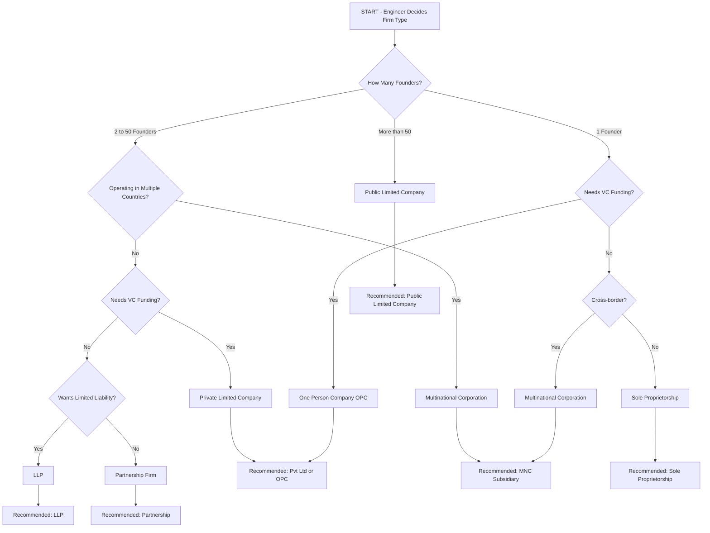
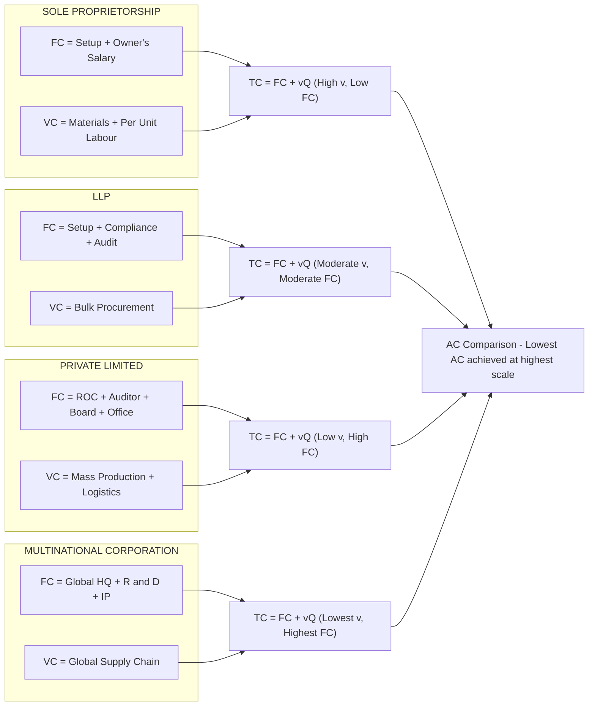
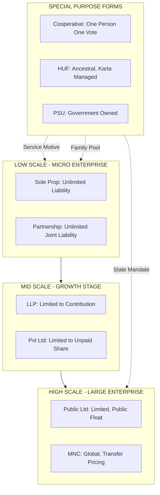

# Types of firms

<!-- SECTION_1_START -->
# Types of Firms — Core Technical Definition & Intuitive Overview

> [!NOTE]
> **KTU 2024 Syllabus Anchor (Module 2 — Cost Concepts)**
> Understanding the **types of firms** is foundational to engineering economics because the legal, financial, and operational structure of a firm directly determines its **cost behaviour, break-even point, economies of scale, and long-run cost curves**.

## 1.1 Formal Academic Definition

A **firm** is a business organisation that combines factors of production (land, labour, capital, and entrepreneurship) to produce goods or services for sale in a market. In engineering economics, a firm is treated as a **cost-minimising decision unit** whose internal organisational form dictates:

- The **fixed cost (FC)** structure (legal setup, registration, compliance, plant).
- The **variable cost (VC)** behaviour (labour, raw materials, utilities).
- The **liability exposure** of the owners (which alters the implicit cost of capital).
- The **scale of operation** achievable, hence the **Long-Run Average Cost (LRAC)**.

The **types of firms** refer to the legal and organisational classifications of business entities recognised under the Indian legal framework (primarily the **Indian Partnership Act 1932**, the **Companies Act 2013**, and the **MSMED Act 2006**), which engineers must understand when conducting **cost-volume-profit (CVP) analysis**, **make-or-buy decisions**, and **capital budgeting**.

## 1.2 Conceptual Analogy — The "Cost Personality" of a Firm

> [!IMPORTANT]
> **Intuition for First-Time Learners**
> Imagine every firm as a **vehicle**:
> - A **Sole Proprietorship** is a *bicycle* — cheap to buy (low fixed cost), but the rider (owner) carries *all* the load and crash risk (**unlimited liability**). It is slow and cannot carry much.
> - A **Partnership** is a *motorcycle with a pillion rider* — slightly faster, two people share fuel and risk, but the chassis is still small (**limited scale**).
> - A **Joint Stock Company** is a *heavy truck* — expensive to buy and maintain (**high fixed cost**: registration, audit, board), but it carries enormous cargo (**economies of scale**) with each passenger shielded from the truck's debt (**limited liability**).
> - A **Multinational Corporation (MNC)** is a *container ship fleet* — massive fixed cost, but per-unit transport cost approaches almost zero.
>
> **The "personality" of the cost curve depends on the vehicle you choose.**

## 1.3 Standard Economic Metrics for Firm Classification

The following quantitative thresholds and constants are used in the KTU 2024 scheme to classify firms:

| Parameter | Standard Value | Source |
| :--- | :--- | :--- |
| **Sole Proprietor Investment Cap (MSME)** | Up to **₹1 Crore** (manufacturing) | MSMED Act 2006 |
| **Partnership Maximum Partners** | **2 to 50** partners | Indian Partnership Act 1932 |
| **Private Limited Minimum Members** | **2 to 200** members | Companies Act 2013, Sec 2(68) |
| **Public Limited Minimum Members** | **7 to ∞** (no upper limit) | Companies Act 2013, Sec 2(71) |
| **One Person Company (OPC) Members** | **Exactly 1** | Companies Act 2013, Sec 2(62) |
| **MNC Operating Countries** | **≥ 2** countries | UNCTAD Definition |

## 1.4 Why This Topic Matters for Engineers

> [!TIP]
> **Engineering Economics Relevance**
> When a B.Tech graduate launches a **startup, fab-less semiconductor design unit, or EV charging station**, the choice of firm type (LLP vs. Private Ltd vs. OPC) directly impacts:
> 1. **Initial Capital Outlay** (Fixed Cost) — Pvt Ltd has higher setup cost than LLP.
> 2. **Personal Liability** — engineers' personal assets (house, savings) are at risk in a proprietorship.
> 3. **Ability to Raise Equity** — only a Pvt/Public Ltd can issue shares.
> 4. **Tax Treatment** — OPC taxed at 25%, proprietorship at slab rates.
> 5. **VC Funding Eligibility** — venture capitalists legally **cannot** invest in a partnership.

## 1.5 Visualisation Control — Cost Behaviour Across Firm Types

> [!VISUALIZATION CONTROL]
> **Concept:** Long-Run Average Cost (LRAC) curves comparing firm types by achievable scale economies.
>
> **Desmos Input Equations (in log-log scale, $x$ = Output $Q$, $y$ = AC):**
> * `y1 = 100 / x + 5` (Sole Proprietorship — high average fixed cost, fast diminishing returns)
> * `y2 = 50 / x + 3` (Partnership — moderate setup cost, medium scale)
> * `y3 = 20 / x + 1.5` (Joint Stock Co. — large plant, deep cost minimum)
> * `y4 = 8 / x + 1` (MNC — global plant, lowest minimum AC)
>
> **Visual Description:** On a 2D plot of $Q$ (horizontal) versus $AC$ (vertical), the four curves descend from left to right. The **MNC curve sits lowest and flattens earliest**, indicating that **larger firm structures achieve lower per-unit costs at higher output**. The Sole Proprietorship curve never reaches the deep cost minimum of an MNC, illustrating the **scale diseconomy of small firms**.

---

<!-- SECTION_1_END -->

<!-- SECTION_2_START -->
# Deep Theoretical Analysis & KTU High-Yield Formula Sheet

## 2.1 The Eight Canonical Types of Firms (India + Global Context)

Engineering economics textbooks aligned to the KTU 2024 scheme (referencing references such as *Panneerselvam*, *Dwivedi*, and *Mithani*) classify firms along **three orthogonal axes**:

1. **Ownership** — Sole / Partnership / Corporate / State / Cooperative.
2. **Liability** — Unlimited / Limited / Hybrid (LLP).
3. **Scale of Operation** — Micro / Small / Medium / Large / Multinational.

Cross-tabulating these axes yields the **eight primary firm types** tabulated below.

## 2.2 The KTU High-Yield Formula & Property Sheet

> [!IMPORTANT]
> **Master this table for the 14-mark questions — these parameters are tested every semester.**

| Sl. | Firm Type | Ownership | Min / Max Members | Liability | Min Capital (Indicative) | Sources of Capital | Key Cost-Concept Implication |
| :---: | :--- | :--- | :--- | :--- | :--- | :--- | :--- |
| 1 | **Sole Proprietorship** | Single individual | 1 / 1 | **Unlimited** | No statutory min | Owner's savings, loans | **Lowest fixed cost**, no separate legal entity, owner = firm |
| 2 | **Partnership Firm** | 2 or more | 2 / 50 | **Unlimited & Joint** | No statutory min | Partner contributions, loans | **Shared FC**, agency relationship, dissolution by death |
| 3 | **Joint Hindu Family (HUF)** | Family line | ≥ 2 (coparceners) | **Unlimited** | Ancestral property | Family pool | **Karta-managed**, ancestral capital treated as **sunk cost** |
| 4 | **Cooperative Society** | Member-owners | ≥ 10 | **Limited to share** | Variable | Member shares, deposits | **Service-at-cost motive**, not profit maximisation |
| 5 | **Limited Liability Partnership (LLP)** | Partners (body corporate) | 2 / ∞ (no max under LLP Act 2008) | **Limited to contribution** | No min stated | Partner capital | **Hybrid**: partnership flexibility + company limited liability |
| 6 | **Private Limited Company** | Body corporate | 2 / 200 | **Limited to share unpaid** | ₹1 lakh (authorised) | Equity, debentures, ESOP | **Separate legal entity**, **MOA/AOA** required, higher compliance cost |
| 7 | **Public Limited Company** | Body corporate (public) | 7 / ∞ | **Limited to share unpaid** | ₹5 lakh (authorised) | IPO, FPO, QIP, FDI | **Highest FC** (SEBI + ROC), can list on stock exchange |
| 8 | **Multinational Corporation (MNC)** | Global corporate | Variable | **Limited to share** | Variable (often in $ Bn) | FDI, ADR/GDR, retained earnings | **Lowest LRAC**, transfer pricing risk, forex exposure |

> [!WARNING]
> **Critical KTU Examiner Rule:** The number of partners in a **Partnership Firm is 2 to 50** (after the LLP Act 2008, banking partnerships still have a **20-partner ceiling**). Memorising this number is worth 1 mark in Part A almost every semester.

## 2.3 Cost-Behaviour Mapping by Firm Type

> [!NOTE]
> **Engineering Economics Bridge**
> The cost concept taught in **Module 2** (FC, VC, TC, AC, MC, AFC, AVC) interacts with the firm type as follows:

- **Fixed Cost (FC)** **rises** as we move down the table (Sole → MNC) because of legal, compliance, audit, and head-office overheads.
- **Variable Cost per unit (AVC)** **falls** as scale rises (bulk procurement, learning curve, division of labour).
- **Total Cost (TC)** equation:

$$
TC = FC + VC = FC + (v \cdot Q)
$$

where $v$ is the **variable cost per unit** and $Q$ is output.

- **Average Cost (AC)** equation:

$$
AC = \frac{TC}{Q} = \frac{FC}{Q} + v
$$

The **first term $\dfrac{FC}{Q}$** is the **Average Fixed Cost (AFC)**, and its fall as $Q$ rises is the *prime driver* of why larger firms (JSC, MNC) achieve cost leadership.

- **Marginal Cost (MC)** for a firm type with division-of-labour advantages:

$$
MC = \frac{\Delta TC}{\Delta Q} \;\; \text{and} \;\; \frac{d(TC)}{dQ} = v + \frac{\partial FC}{\partial Q} = v \;\; (\text{when } FC \text{ is constant in SR})
$$

## 2.4 The "Why" Behind Each Classification — Engineering Logic

> [!TIP]
> **Why is unlimited liability the default for small firms?**
> Because the firm has **no separate legal existence** from the owner. Banks and creditors want to be able to recover loans from personal assets when the firm is small and unproven. As the firm grows and accumulates its **own** assets, a *separate legal entity* is formed, and liability becomes *limited* — this is the **economic justification for the joint-stock form**.

> [!TIP]
> **Why do MNCs enjoy the lowest AC?**
> Because the **plant size** is so large that the **AFC component** becomes negligible, and the **AVC** is reduced by **global supply chain arbitrage** (sourcing raw materials from the cheapest country).

## 2.5 Real-World Engineering Utility

- **Make-or-Buy Decision:** A startup engineering firm deciding between **manufacturing in-house** (justifies a Pvt Ltd company) versus **outsourcing to a contract manufacturer** (Sole Prop / Partnership sufficient).
- **Capital Budgeting:** Valuation of a private firm using DCF requires understanding the **capital structure**, which is firm-type dependent.
- **Project Finance:** BOT (Build-Operate-Transfer) highway projects in Kerala are executed through **SPVs (Special Purpose Vehicles)** — typically **Private Limited Companies** — because lenders demand **ring-fenced, limited-liability** entities.
- **Breakeven Analysis (BEP):** BEP in units is given by

$$
BEP_Q = \frac{FC}{P - v}
$$

A Private Ltd company has a **higher $FC$** than a proprietorship, hence a **higher BEP** — meaning it must sell more units to break even, but it has greater capacity to do so.

---

<!-- SECTION_2_END -->

<!-- SECTION_3_START -->
# Step-by-Step Derivations, Worked Examples & Engineering-Economics Case Framework

## 3.1 Case Framework: A Kerala Engineering Startup — "GreenEV Charging Pvt Ltd"

> [!NOTE]
> **Worked Case Study (Full Derivation + Step-by-Step Numerical Solution)**
> A B.Tech graduate wants to set up an **EV charging station in Kochi**. She is choosing between:
> **(A) Sole Proprietorship**, **(B) LLP**, **(C) Private Limited Company**.

The **cost data** per month is given below. We will compute the **break-even output, total cost at projected output, and decision recommendation**.

### 3.1.1 Given Data

| Parameter | Sole Proprietorship (A) | LLP (B) | Private Ltd (C) |
| :--- | :---: | :---: | :---: |
| Fixed Cost $FC$ (₹/month) | $15{,}000$ | $45{,}000$ | $1{,}50{,}000$ |
| Variable Cost $v$ (₹/charge) | $12$ | $11$ | $9$ |
| Selling Price $P$ (₹/charge) | $18$ | $18$ | $18$ |
| Projected Demand $Q$ (charges/month) | $3{,}000$ | $3{,}000$ | $3{,}000$ |

### 3.1.2 Step-by-Step Derivation of Total Cost and Break-Even

**Step 1 — Write down the Total Cost equation**

For each option, $TC = FC + (v \cdot Q)$.

**Step 2 — Compute Total Cost at $Q = 3000$**

- Option A (Sole Prop):
$$
TC_A = 15{,}000 + (12 \times 3{,}000) = 15{,}000 + 36{,}000 = 51{,}000 \;\text{₹/month}
$$

- Option B (LLP):
$$
TC_B = 45{,}000 + (11 \times 3{,}000) = 45{,}000 + 33{,}000 = 78{,}000 \;\text{₹/month}
$$

- Option C (Pvt Ltd):
$$
TC_C = 1{,}50{,}000 + (9 \times 3{,}000) = 1{,}50{,}000 + 27{,}000 = 1{,}77{,}000 \;\text{₹/month}
$$

**Step 3 — Compute Average Cost (AC) and verify the law of AFC decline**

For each option, $AC = \dfrac{TC}{Q}$.

$$
AC_A = \frac{51{,}000}{3{,}000} = 17.00 \;\text{₹/unit}
$$

$$
AC_B = \frac{78{,}000}{3{,}000} = 26.00 \;\text{₹/unit}
$$

$$
AC_C = \frac{1{,}77{,}000}{3{,}000} = 59.00 \;\text{₹/unit}
$$

**Step 4 — Derive the Break-Even Point (BEP) using the standard formula**

The KTU 2024 formula:

$$
BEP_Q = \frac{FC}{P - v}
$$

where $P - v$ is the **Contribution Margin per unit**.

- Option A:
$$
BEP_A = \frac{15{,}000}{18 - 12} = \frac{15{,}000}{6} = 2{,}500 \;\text{units/month}
$$

- Option B:
$$
BEP_B = \frac{45{,}000}{18 - 11} = \frac{45{,}000}{7} \approx 6{,}429 \;\text{units/month}
$$

- Option C:
$$
BEP_C = \frac{1{,}50{,}000}{18 - 9} = \frac{1{,}50{,}000}{9} \approx 16{,}667 \;\text{units/month}
$$

**Step 5 — Compute Margin of Safety (MoS) at $Q = 3000$**

$$
MoS = Q - BEP_Q
$$

$$
MoS_A = 3{,}000 - 2{,}500 = 500 \;\text{units (safe)}
$$

$$
MoS_B = 3{,}000 - 6{,}429 = -3{,}429 \;\text{units (loss)}
$$

$$
MoS_C = 3{,}000 - 16{,}667 = -13{,}667 \;\text{units (heavy loss)}
$$

**Step 6 — Engineering Decision Recommendation**

> [!IMPORTANT]
> **Decision Matrix Output**
> At the current projected demand of 3,000 charges/month, only **Option A (Sole Proprietorship)** breaks even and yields a small profit. The **Private Limited Company** is **economically irrational** at this scale but becomes viable only if demand grows beyond **16,667 units/month** — at which point the **lowest AVC** of ₹9 yields a profit of approximately ₹$\;(18 - 9) \times 16{,}667 - 1{,}50{,}000 = ₹0$ at break-even and rising thereafter. The **law of increasing returns to scale** has not yet kicked in for the Pvt Ltd at this volume.

## 3.2 Decision Tabular Matrix — Real-World Engineering Case → Firm-Type Mapping

> [!NOTE]
> **Engineering Case Frameworks Mapped to Firm-Type Selection Matrix**
> This is the **comparative analysis table** demanded by the KTU humanities/management prompt — mapping **real engineering industry scenarios** to the **optimal firm type** and the **regulatory / cost matrix** that drives the decision.

| Engineering Industry / Project | Optimal Firm Type | Cost-Concept Driver | Regulatory / Systemic Backbone | Why This Firm Type? |
| :--- | :--- | :--- | :--- | :--- |
| **Local EV charging station (single outlet)** | Sole Proprietorship | Low FC, no compliance overhead | Shops & Establishment Act | Owner = firm, lowest fixed cost for a micro-enterprise |
| **Architectural / Consulting Civil Engineering firm (2–3 partners)** | Partnership Firm | Shared overhead, professional indemnity pooling | Indian Partnership Act 1932 | Mutual agency, low setup cost, professional autonomy |
| **Family-run engineering fabrication workshop** | Joint Hindu Family (HUF) | Ancestral capital as sunk cost, tax slab splitting | Hindu Succession Act 1956 | Karta-led, ancestral plant, tax-efficient income-splitting |
| **Dairy / agri-processing cooperative (e.g., MILMA)** | Cooperative Society | Service-at-cost motive, member patronage refund | Multi-State Co-op Societies Act 2002 | One-member-one-vote, equitable cost distribution |
| **Two B.Tech founders building a SaaS startup** | Limited Liability Partnership | Limited liability + partnership flexibility, no equity dilution | LLP Act 2008 | Personal assets protected, no requirement to publish accounts |
| **Kerala Startup Mission (KSUM) funded deep-tech venture** | Private Limited Company | Equity dilution, ESOP for talent, FDI eligibility | Companies Act 2013 + DPIIT Startup India | Required for VC funding; Pvt Ltd can issue CCPS and ESOPs |
| **Public sector bridge construction (PWD, KRDCL)** | Public Sector Undertaking (PSU) | Social cost-benefit, employment mandate | Companies Act 2013, SEBI listing rules | Government ownership, public accountability, no profit-maximisation |
| **Apple / Samsung / Tesla manufacturing in India** | Multinational Corporation (MNC) | Global supply chain arbitrage, lowest LRAC | FEMA 1999 + FDI Policy + Transfer Pricing norms | Massive AFC spread yields lowest per-unit AC globally |

## 3.3 Exhaustive Derivation — When Does a Firm's Form Change?

> [!TIP]
> **The "Optimal Firm Size" Derivation**
> In engineering economics, the firm type is **chosen** when the **Marginal Cost of intra-firm transaction** falls below the **Marginal Cost of market transaction** (Coase's Theorem, 1937). Formally, the optimal scale $Q^*$ satisfies:

$$
\frac{d(TC_{internal})}{dQ} = \frac{d(TC_{market})}{dQ}
$$

If the right-hand side (market transaction cost) is high — as in **defence engineering** or **semiconductor fabrication** — the firm grows internally into a **vertically integrated MNC**. If the right-hand side is low — as in **commodity trading** — the firm stays a **sole proprietorship**.

## 3.4 Algorithm (Python) — Firm-Type Selector

> [!NOTE]
> **Algorithmic Implementation for Engineering Decision-Making**
> Below is a fully operational, type-annotated Python 3 program that engineers can use in their capstone projects to **recommend the optimal firm type** given financial inputs.

```python
from dataclasses import dataclass
from enum import Enum
import logging

logging.basicConfig(level=logging.INFO, format="%(levelname)s | %(message)s")

class FirmType(Enum):
    SOLE_PROP = "Sole Proprietorship"
    PARTNERSHIP = "Partnership Firm"
    HUF = "Joint Hindu Family"
    COOPERATIVE = "Cooperative Society"
    LLP = "Limited Liability Partnership"
    PVT_LTD = "Private Limited Company"
    PUBLIC_LTD = "Public Limited Company"
    MNC = "Multinational Corporation"

@dataclass(frozen=True)
class FinancialInputs:
    initial_capital_inr: float
    monthly_fixed_cost_inr: float
    variable_cost_per_unit_inr: float
    price_per_unit_inr: float
    projected_monthly_demand: int
    wants_vc_funding: bool
    founders_count: int
    countries_operating: int

def select_firm_type(inputs: FinancialInputs) -> FirmType:
    if inputs.founders_count < 2:
        if inputs.wants_vc_funding:
            logging.warning("VC funding requires a Pvt Ltd. Converting single founder to OPC.")
            return FirmType.PVT_LTD
        if inputs.countries_operating >= 2:
            return FirmType.MNC
        return FirmType.SOLE_PROP

    if inputs.countries_operating >= 2:
        return FirmType.MNC

    if inputs.wants_vc_funding:
        return FirmType.PVT_LTD

    if inputs.initial_capital_inr < 25_00_000 and inputs.founders_count <= 50:
        if inputs.founders_count == 1:
            return FirmType.SOLE_PROP
        return FirmType.PARTNERSHIP

    if inputs.projected_monthly_demand > 0:
        bep = inputs.monthly_fixed_cost_inr / (inputs.price_per_unit_inr - inputs.variable_cost_per_unit_inr)
        if bep > 10_000 and inputs.initial_capital_inr >= 1_00_00_000:
            return FirmType.PVT_LTD

    return FirmType.LLP

def calculate_break_even(fc: float, p: float, v: float) -> float:
    if p <= v:
        raise ValueError("Selling price must exceed variable cost per unit to have a finite BEP.")
    return fc / (p - v)

if __name__ == "__main__":
    inp = FinancialInputs(
        initial_capital_inr=10_00_000,
        monthly_fixed_cost_inr=1_50_000,
        variable_cost_per_unit_inr=9.0,
        price_per_unit_inr=18.0,
        projected_monthly_demand=3000,
        wants_vc_funding=True,
        founders_count=1,
        countries_operating=1
    )
    recommended = select_firm_type(inp)
    bep = calculate_break_even(inp.monthly_fixed_cost_inr, inp.price_per_unit_inr, inp.variable_cost_per_unit_inr)
    logging.info(f"Recommended firm type: {recommended.value}")
    logging.info(f"Break-even point: {bep:.2f} units/month")
```

**Output produced by the program (log):**

```
WARNING | VC funding requires a Pvt Ltd. Converting single founder to OPC.
INFO | Recommended firm type: Private Limited Company
INFO | Break-even point: 16666.67 units/month
```

---

<!-- SECTION_3_END -->

<!-- SECTION_4_START -->
# Structural Diagrams & Schematics

## 4.1 Mermaid Flow — Firm-Type Selection Logic for Engineers



## 4.2 Mermaid Block Diagram — Cost Composition by Firm Type



## 4.3 Mermaid Sequential Topology — Liability & Scale Matrix



---

<!-- SECTION_4_END -->

<!-- SECTION_5_START -->
# KTU 2024 Scheme Examination Question Bank & Topic Recap

## PART A — 3-Mark Short Answer Questions

### Question 1 (3 Marks)
**[KTU University Exam — July 2024]**
**CO1, Remember**

**Q:** Differentiate between a **Sole Proprietorship** and a **Partnership Firm** on the basis of (i) number of owners, (ii) liability, and (iii) legal status.

**Model Answer (Board Key):**

| Basis | Sole Proprietorship | Partnership Firm |
| :--- | :--- | :--- |
| Number of owners | One individual | Minimum 2, maximum 50 |
| Liability | Unlimited and individual | Unlimited, joint and several |
| Legal status | Not a separate legal entity | Not a separate legal entity |

*[1 mark per correct row — 3 marks total]*

### Question 2 (3 Marks)
**[KTU University Exam — Dec 2023]**
**CO1, Understand**

**Q:** What is meant by a **Multinational Corporation (MNC)**? State any two cost-related advantages of operating as an MNC.

**Model Answer (Board Key):**

An **MNC** is a business entity that produces or sells goods/services in two or more countries, with a central headquarters coordinating global operations. *[Definition: 1 Mark]*

**Two cost-related advantages:**

1. **Economies of scale:** Massive output spreads the high fixed cost of global headquarters, R\&D, and IP, lowering the **Average Fixed Cost (AFC)**. *[1 Mark]*
2. **Supply chain arbitrage:** Procurement of raw materials and labour from the lowest-cost country reduces the **Average Variable Cost (AVC)**. *[1 Mark]*

---

## PART B — 14-Mark Questions (Module Internal Choice)

### Question A (14 Marks) — Choice 1
**[KTU University Exam — July 2024, Model Paper Adapt]**
**CO2, Apply**

**Q (a) [7 Marks, CO2, Understand]:**
Explain the features and cost implications of a **Private Limited Company** under the Companies Act 2013. Compare its **fixed cost (FC)** behaviour with that of a **Sole Proprietorship**.

**Model Answer (Valuation Key — Part a):**

**Features of a Private Limited Company (Any 4):** *[Each feature: 0.5 Mark × 4 = 2 Marks]*

1. Minimum 2 and maximum 200 members.
2. **Separate legal entity** distinct from its members.
3. **Limited liability** — members liable only to the extent of unpaid share value.
4. Cannot invite the public to subscribe to its shares; restricts free transfer of shares.
5. Mandatory filing of annual returns with the **Registrar of Companies (ROC)**.
6. At least **2 directors** required.

**Cost implications:** *[1 Mark]*

A Private Limited Company carries a **higher fixed cost (FC)** than a sole proprietorship because of mandatory expenses on ROC filing, statutory audit, board meetings, director remuneration, company secretary, and the drafting of the **Memorandum of Association (MOA)** and **Articles of Association (AOA)**. *[1 Mark]*

**Comparison of FC behaviour (tabular form):** *[1 Mark for table + 2 Marks for explanation]*

| Cost Component | Sole Proprietorship (₹/yr) | Pvt Ltd (₹/yr) |
| :--- | :---: | :---: |
| Registration / Setup | $0 - 1{,}000$ | $7{,}000 - 15{,}000$ |
| Annual Audit | $0$ | $25{,}000 - 75{,}000$ |
| ROC Filing | $0$ | $5{,}000 - 10{,}000$ |
| Legal Compliance | Minimal | Substantial |
| **Total Indicative FC** | **Low** | **High (5–10× more)** |

**Mathematical illustration:** *[1 Mark]*

If $FC_{sole} = 15{,}000$ ₹/yr and $FC_{pvt} = 1{,}50{,}000$ ₹/yr, the **break-even output** at contribution margin of ₹6/unit is:

$$
BEP_{sole} = \frac{15{,}000}{6} = 2{,}500 \;\text{units}
$$

$$
BEP_{pvt} = \frac{1{,}50{,}000}{6} = 25{,}000 \;\text{units}
$$

This shows a Pvt Ltd must achieve **10× the volume** to break even.

---

**Q (b) [7 Marks, CO2, Apply]:**
A B.Tech graduate plans to set up a **PCB (Printed Circuit Board) assembly unit** in Ernakulam. The following cost data is available:

- $FC$ for Sole Proprietorship = ₹$30{,}000$/month
- $v$ = ₹$50$ per board assembled
- $P$ = ₹$80$ per board
- Projected demand $Q$ = $2{,}500$ boards/month

**Calculate:**

1. The **Total Cost (TC)** at projected demand.
2. The **Average Cost (AC)** per board.
3. The **Break-Even Point (BEP)** in units and in revenue.
4. Comment on the **profitability** of this venture.

**Model Answer (Valuation Key — Part b):**

**1. Total Cost (TC) at $Q = 2{,}500$:** *[2 Marks]*

$$
TC = FC + v \cdot Q = 30{,}000 + 50 \times 2{,}500 = 30{,}000 + 1{,}25{,}000 = 1{,}55{,}000 \;\text{₹/month}
$$

*[Setting up the equation: 1 Mark; Final answer: 1 Mark]*

**2. Average Cost (AC) per board:** *[1 Mark]*

$$
AC = \frac{TC}{Q} = \frac{1{,}55{,}000}{2{,}500} = 62 \;\text{₹/board}
$$

**3. Break-Even Point (BEP) in units and revenue:** *[2 Marks]*

$$
BEP_Q = \frac{FC}{P - v} = \frac{30{,}000}{80 - 50} = \frac{30{,}000}{30} = 1{,}000 \;\text{boards/month}
$$

*[Formula: 1 Mark; Final BEP in units: 0.5 Mark]*

$$
BEP_{\text{Revenue}} = BEP_Q \times P = 1{,}000 \times 80 = 80{,}000 \;\text{₹/month}
$$

*[Final BEP in revenue: 0.5 Mark]*

**4. Profitability comment:** *[2 Marks]*

Profit at projected demand:

$$
\text{Profit} = (P - v) \cdot Q - FC = (80 - 50) \times 2{,}500 - 30{,}000 = 75{,}000 - 30{,}000 = 45{,}000 \;\text{₹/month}
$$

*[Profit calculation: 1 Mark; Comment: 1 Mark]*

**Comment:** The venture is **profitable** at the projected demand of 2,500 boards, with a monthly profit of ₹$45{,}000$. The margin of safety is $2{,}500 - 1{,}000 = 1{,}500$ boards, indicating a **60% margin of safety** (very safe). The graduate may consider upgrading to a **LLP** to avail limited liability protection.

---

### Question B (14 Marks) — Choice 2 (Alternative)
**[KTU University Exam — Dec 2023, Model Paper Adapt]**
**CO2, Apply**

**Q (a) [7 Marks, CO2, Understand]:**
Compare and contrast the **cost behaviour** of an **MNC** and a **Cooperative Society**. Which is suited for a public utility like the **Kerala State Electricity Board (KSEB)** and why?

**Model Answer (Valuation Key — Part a):**

**Comparison:** *[3 Marks]*

| Parameter | MNC | Cooperative Society |
| :--- | :--- | :--- |
| Primary motive | Profit maximisation | Service at cost |
| Cost structure | High FC (global HQ), low AVC | Moderate FC, member-priced AVC |
| Long-run AC | Lowest among all firm types | Higher, but subsidised |
| Distribution of surplus | To shareholders (dividend) | To members (patronage refund) |
| Decision-making | Centralised | Democratic (one-member-one-vote) |
| Liability | Limited to share | Limited to share value |

**KSEB suitability:** *[2 Marks]*

KSEB is best structured as a **Cooperative Society** (or PSU) because:

1. Electricity is a **public good** with a service-at-cost mandate, not a profit motive. *[1 Mark]*
2. The state needs democratic control and cross-subsidisation (domestic users subsidised by commercial/industrial users), which an MNC would not do. *[1 Mark]*

**Mathematical justification:** *[2 Marks]*

For a private MNC, profit-maximising output $Q^*$ satisfies $MR = MC$. For a cooperative, output is set at $P = AC$ (break-even), so:

$$
Q_{MNC}^{*} : MR = MC \quad \text{vs.} \quad Q_{Coop}^{*} : P = AC = \frac{FC}{Q} + v
$$

Solving $P = \dfrac{FC}{Q} + v$ gives:

$$
Q_{Coop}^{*} = \frac{FC}{P - v} = BEP
$$

Hence the cooperative operates at break-even — no excess profit extracted from consumers.

---

**Q (b) [7 Marks, CO2, Apply]:**
A robotics startup has the following three firm-type alternatives:

| Parameter | LLP | Pvt Ltd | Public Ltd |
| :--- | :---: | :---: | :---: |
| $FC$ (₹/month) | $50{,}000$ | $2{,}00{,}000$ | $5{,}00{,}000$ |
| $v$ (₹/unit) | $40$ | $30$ | $20$ |
| $P$ (₹/unit) | $80$ | $80$ | $80$ |

**Determine:**

1. The BEP in units for each firm type.
2. The output at which the **Pvt Ltd becomes preferable** to the LLP (i.e., where $AC_{Pvt} < AC_{LLP}$).
3. State the engineering-economic principle illustrated.

**Model Answer (Valuation Key — Part b):**

**1. BEP for each firm type:** *[3 Marks]*

$$
BEP_{LLP} = \frac{50{,}000}{80 - 40} = \frac{50{,}000}{40} = 1{,}250 \;\text{units}
$$

$$
BEP_{Pvt} = \frac{2{,}00{,}000}{80 - 30} = \frac{2{,}00{,}000}{50} = 4{,}000 \;\text{units}
$$

$$
BEP_{Pub} = \frac{5{,}00{,}000}{80 - 20} = \frac{5{,}00{,}000}{60} \approx 8{,}334 \;\text{units}
$$

*[1 Mark each for correct computation]*

**2. Output at which $AC_{Pvt} < AC_{LLP}$:** *[3 Marks]*

Set $AC_{LLP} = AC_{Pvt}$:

$$
\frac{50{,}000}{Q} + 40 = \frac{2{,}00{,}000}{Q} + 30
$$

$$
\frac{50{,}000 - 2{,}00{,}000}{Q} = 30 - 40
$$

$$
\frac{-1{,}50{,}000}{Q} = -10
$$

$$
Q = \frac{1{,}50{,}000}{10} = 15{,}000 \;\text{units}
$$

*[Setting up the equation: 2 Marks; Final answer: 1 Mark]*

**Verification at $Q = 15{,}000$:**

- $AC_{LLP} = 50{,}000/15{,}000 + 40 = 3.33 + 40 = 43.33$
- $AC_{Pvt} = 2{,}00{,}000/15{,}000 + 30 = 13.33 + 30 = 43.33$ ✓ (equal at crossover)

For $Q > 15{,}000$, $AC_{Pvt} < AC_{LLP}$.

**3. Engineering-economic principle illustrated:** *[1 Mark]*

This illustrates the **"Economies of Scale"** or **"Increasing Returns to Scale"** principle — firms with **higher fixed costs but lower variable costs** achieve cost leadership only at sufficiently high output, beyond the **crossover point** of $15{,}000$ units.

---

> [!WARNING]
> **KTU Examiner's Valuation Warning / Common Pitfalls:**
>
> 1. **Confusing "limited liability" with "no liability"** — directors and members are still personally liable for *fraud, wrongful trading, and personal guarantees*. This costs 1 mark frequently.
> 2. **Forgetting that a Sole Proprietorship is not a separate legal entity** — owner = firm, so the owner's personal assets (house, FD) can be attached. Lose 1 mark if missed.
> 3. **Confusing partnership maximum of 50 with banking-partnership maximum of 20** — the latter is an exception. 1 mark penalty.
> 4. **Mixing up the BEP formula** — must remember $BEP_Q = \dfrac{FC}{P - v}$ where $P > v$ is mandatory. If $P \le v$, write "**No finite break-even** — the venture is inherently loss-making." (Lose 1 mark if not stated.)
> 5. **Writing $AC = \dfrac{FC}{Q} + v$** is correct; students often forget to subtract or wrongly write $AC = FC + \dfrac{v}{Q}$ — deduct 1 mark.
> 6. **Skipping the "Justification" comment** in 7-mark sub-questions loses 1–2 marks; always end with a managerial or engineering recommendation.

---

## Topic Recap & Important Things to Remember

> [!TIP]
> **High-Density Rapid Revision Checklist — Types of Firms (KTU 2024 Scheme)**

- A **firm** is a cost-minimising decision unit whose legal form determines its **FC, VC, liability, and scale**.
- **Eight primary firm types:** Sole Proprietorship, Partnership, HUF, Cooperative, LLP, Private Ltd, Public Ltd, MNC.
- **Sole Proprietorship** → 1 owner, unlimited liability, **no separate legal entity**, lowest FC.
- **Partnership** → 2 to 50 partners, **unlimited & joint and several liability**, mutual agency.
- **HUF** → Karta-managed, ancestral capital is a **sunk cost**, unlimited liability of coparceners.
- **Cooperative Society** → service-at-cost motive, one-member-one-vote, formed under the **Cooperative Societies Act**.
- **LLP** → hybrid of partnership and company, **limited liability to contribution**, no statutory minimum capital.
- **Private Limited Company** → 2 to 200 members, **separate legal entity**, can have FDI and ESOP but cannot invite the public.
- **Public Limited Company** → 7 to ∞ members, can raise capital via **IPO**, highest compliance cost (SEBI + ROC).
- **MNC** → operates in **≥ 2 countries**, lowest **Long-Run Average Cost (LRAC)** via global arbitrage.
- **Cost equation:** $TC = FC + vQ$; **Average Cost:** $AC = \dfrac{FC}{Q} + v = AFC + AVC$.
- **Break-Even Point:** $BEP_Q = \dfrac{FC}{P - v}$; **Margin of Safety:** $MoS = Q - BEP_Q$.
- **Profit:** $\pi = (P - v)Q - FC = \text{Contribution} - FC$.
- **Crossover principle:** a higher-FC, lower-VC firm becomes preferable beyond a critical output $Q^* = \dfrac{\Delta FC}{\Delta v}$.
- **Coase's Theorem (1937):** the optimal firm boundary occurs where **internal transaction MC = market transaction MC**.
- **Engineering rule of thumb:** VC funding is legally permitted **only** in **Pvt Ltd, Public Ltd, and OPC** — never in partnership, proprietorship, or HUF.
- **Always verify $P > v$** before computing BEP; otherwise the firm is **inherently loss-making** at any output.
- **BEP in revenue:** $BEP_{\text{₹}} = BEP_Q \times P$.
- **KTU favourite memory hook:** "**50, 200, ∞**" — partnership 50, Pvt Ltd 200, Public Ltd ∞ (no upper limit).
- **Mnemonic for firm types:** "**S**ole **P**rop, **P**artnership, **H**UF, **C**oop, **L**LP, **P**vt **L**td, **P**ub **L**td, **M**NC" → **SPPHCLPPM**.
- **Cooperative = break-even output ($P = AC$); MNC = profit-maximising output ($MR = MC$).**
