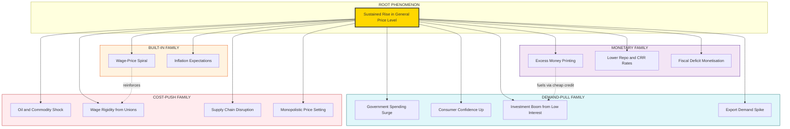
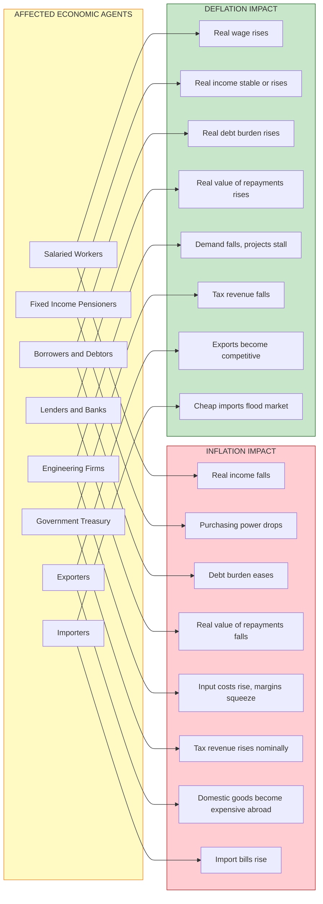
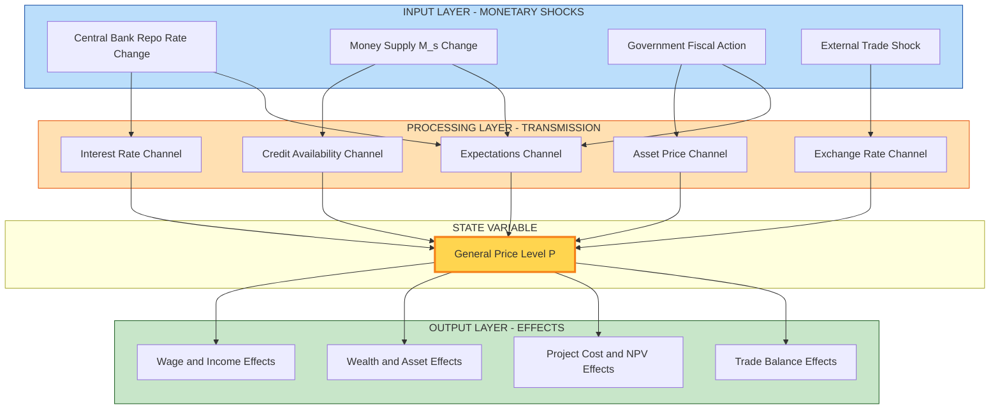
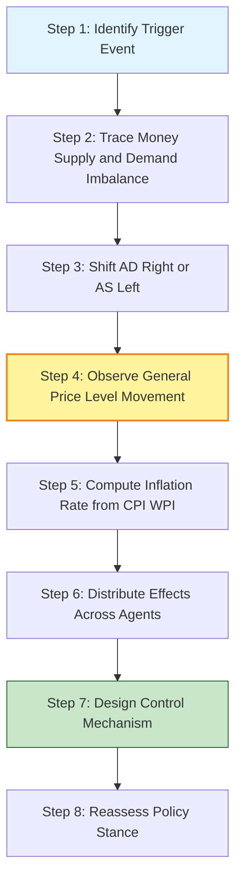

# Causes and Effects

<!-- SECTION_1_START -->

# Module 3 – Monetary System: Causes and Effects (Inflation, Deflation & Monetary Shocks)

> [!IMPORTANT]
> **Syllabus Anchor (KTU 2024 Scheme – UCHUT346):** This topic directly addresses *Module 3: Monetary System*, mapping to the sub-unit on **causes, consequences, and remedial measures of monetary imbalances** (inflation, deflation, stagflation) and their cascading impact on engineering cost structures, capital budgeting decisions, and project feasibility.

## 1.1 What are "Causes and Effects" in the Monetary System?

In the **monetary system**, the *cause-and-effect* chain refers to the economic chain reaction triggered by an **imbalance between the money supply ($M_s$) and the money demand ($M_d$)**, or by structural shocks to the **General Price Level (GPL)**. When the central bank's monetary stance, government fiscal action, or external shocks disturb the equilibrium $\;M_s = M_d\;$, the system responds through **price level changes** — either upward (**inflation**), downward (**deflation**), or stagnant-with-prices (**stagflation**).

> [!NOTE]
> **Board-Standard Definition (KTU Examiner Vocabulary):**
> *"Inflation is a sustained and continuous rise in the general price level of goods and services in an economy over a period of time, leading to a corresponding fall in the **purchasing power of money**."*
> *"Deflation is the opposite — a sustained fall in the general price level, raising the real value of money but contracting aggregate demand."*

### Conceptual Analogy — "The Balloon and the Hot Air"

Imagine a **closed economy as a balloon**:
- The **balloon's skin** represents the *real output* (goods and services produced by industries and engineering enterprises).
- The **air pumped inside** represents the *money supply* injected by the central bank.
- If the balloon's size (real output) stays the same but you keep pumping more air (money) → the balloon stretches, internal pressure rises → **price level rises = INFLATION**.
- If air starts leaking out (money supply contracts) faster than the balloon shrinks (output falls) → pressure drops → **price level falls = DEFLATION**.

> [!TIP]
> **Intuitive Takeaway for Engineers:** Inflation is **not** "prices going up." It is **"the value of each rupee going down."** A ₹100 note buying fewer engineering components today than yesterday is the *real* phenomenon.

## 1.2 Key Metrics Used to Quantify Monetary Imbalances

| Metric | Symbol / Formula | Physical / Economic Meaning |
|---|---|---|
| **Consumer Price Index** | $CPI = \dfrac{\sum P_1 Q_0}{\sum P_0 Q_0} \times 100$ | Measures retail inflation — what a household pays |
| **Wholesale Price Index** | $WPI = \dfrac{\sum P_1 Q_0}{\sum P_0 Q_0} \times 100$ | Measures producer/wholesale inflation — relevant to engineering raw materials |
| **GDP Deflator** | $\text{Deflator} = \dfrac{\text{Nominal GDP}}{\text{Real GDP}} \times 100$ | Broadest measure of economy-wide price level |
| **Inflation Rate** | $\pi = \dfrac{CPI_t - CPI_{t-1}}{CPI_{t-1}} \times 100$ | Year-on-year percentage change |
| **Real Value of Money** | $V_{real} = \dfrac{1}{P_t}$ | Inverse of price index — true purchasing power |
| **Money Multiplier** | $m = \dfrac{1}{c + r + e}$ | How much total money supply expands per ₹1 of base money |

> [!NOTE]
> **Engineering Insight (KTU Application Layer):** For an **engineering cost estimator** building a project budget for 5 years, a $6\%$ annual inflation on steel (CPI component) compounds the steel cost by $\;(1.06)^5 = 1.338\;$, i.e., a **33.8% cost escalation** — directly affecting **Net Present Value (NPV)** and **Internal Rate of Return (IRR)** calculations.

### 1.3 Classification of Monetary Imbalances (Cause-Based Taxonomy)

> [!IMPORTANT]
> **Board-Favourite Classification Table** — Most KTU questions on "Causes" begin by asking students to *classify* the type first.

| Imbalance | Sub-Type | One-Line Cause Trigger |
|---|---|---|
| **Inflation** | Demand-Pull Inflation | Aggregate Demand ($AD$) > Aggregate Supply ($AS$) at full employment |
| **Inflation** | Cost-Push Inflation | Input costs (wages, raw materials, oil) rise → $AS$ shifts left |
| **Inflation** | Built-In / Wage-Price Spiral | Workers demand higher wages to match past inflation → costs rise again |
| **Inflation** | Monetary Inflation | Excessive money supply growth (printing money / loose RBI policy) |
| **Inflation** | Imported Inflation | Currency depreciation makes imports (oil, electronics) costlier |
| **Deflation** | Demand-Side Deflation | Fall in consumer & investment confidence → $AD$ contracts |
| **Deflation** | Credit-Crunch Deflation | Bank credit dries up → spending falls → prices fall |
| **Deflation** | Technology-Driven Deflation | Productivity gains (especially in engineering/manufacturing) lower unit costs |
| **Stagflation** | Supply Shock Stagflation | Oil shocks + stagnant demand (1970s-style crisis) |

> [!VISUALIZATION CONTROL]
> **Concept:** Aggregate Demand–Aggregate Supply (AD-AS) shift showing Demand-Pull vs. Cost-Push inflation
> **Graph Inputs (Desmos / GeoGebra equations):**
> * Aggregate Demand: $\;AD: \;P = 200 - 0.5Y$
> * Initial Aggregate Supply: $\;AS_1: \;P = 50 + 0.5Y$
> * New Aggregate Supply (cost-push shock): $\;AS_2: \;P = 80 + 0.5Y$
> * New Aggregate Demand (demand-pull): $\;AD_2: \;P = 240 - 0.5Y$
> **Visual Description:** Students should observe the original equilibrium at the intersection of $AD$ and $AS_1$, then trace how $AD$ shifting right pushes price $P$ up (Demand-Pull Inflation) and $AS$ shifting left also pushes $P$ up (Cost-Push Inflation). Both result in **higher price level** but **different output effects**.

<!-- SECTION_1_END -->

<!-- SECTION_2_START -->

# Deep Theoretical Analysis: The Cause → Transmission → Effect Chain

## 2.1 The Causal Architecture (Layered Logic Breakdown)

### 🧩 Layer 1 — Root Causes (What *primes* the system?)

> [!NOTE]
> These are the *initial triggers*. The KTU examiner often awards 3–4 marks just for correctly listing and defining them.

**A. Demand-Side Root Causes**
1. **Rise in Government Spending ($G$):** Infrastructure projects, defence procurement → injects money into the economy.
2. **Increase in Consumer Confidence:** Households spend more, reducing savings → $C \uparrow$.
3. **Investment Boom:** Low interest rates → firms (especially engineering & construction) borrow cheaply → $I \uparrow$.
4. **Export Surge:** Foreign demand for domestic goods → net exports ($NX$) rise.
5. **Currency Depreciation:** Makes exports cheaper, imports costlier → imported inflation.

**B. Supply-Side Root Causes**
1. **Oil & Commodity Price Shocks** (e.g., 1973 OPEC, 2022 Russia-Ukraine).
2. **Wage Rigidity:** Trade unions pushing up minimum wages above productivity growth.
3. **Natural Disasters / Supply Chain Disruptions** (e.g., pandemic-era semiconductor shortage).
4. **Monopolistic Pricing Behaviour:** Dominant firms (e.g., steel majors) restrict output to raise prices.

**C. Monetary Root Causes**
1. **Excessive Money Printing** (Quantitative Easing by RBI / Federal Reserve).
2. **Lowering of Reserve Ratios (CRR/SLR)** by central bank → commercial banks lend more.
3. **Lowering of Repo Rate** → cheaper credit → more money chasing the same goods.
4. **Fiscal Deficit Monetisation** — government borrows from central bank directly.

### 🧩 Layer 2 — Transmission Mechanism (How does the shock *propagate*?)

$$\text{Trigger Event} \;\longrightarrow\; \text{Money Supply / Cost Shift} \;\longrightarrow\; AD \uparrow \text{ or } AS \downarrow \;\longrightarrow\; \text{Price Level } (P) \uparrow$$

For example, in **Demand-Pull Inflation**:
$$\Delta M_s \;\rightarrow\; r \downarrow \;\rightarrow\; I \uparrow,\; C \uparrow \;\rightarrow\; AD \uparrow \;\rightarrow\; P \uparrow$$

For **Cost-Push Inflation**:
$$\text{Oil Price} \uparrow \;\rightarrow\; \text{Production Cost} \uparrow \;\rightarrow\; AS \leftarrow \text{(shifts left)} \;\rightarrow\; P \uparrow,\; Y \downarrow$$

### 🧩 Layer 3 — Terminal Effects (Who *suffers* and who *gains*?)

| Economic Agent | Effect of Inflation | Effect of Deflation |
|---|---|---|
| **Fixed-Income Earners** (pensioners, salaried) | Lose — real income falls | Gain — real income rises |
| **Borrowers / Debtors** | Gain — repay loans with "cheaper" money | Lose — repay loans with "expensive" money |
| **Lenders / Creditors** | Lose — receive devalued repayments | Gain — receive more valuable repayments |
| **Businessmen (Engineers, Contractors)** | Mixed — higher nominal profits, but cost overruns | Lose — delayed projects, falling demand |
| **Government (as debtor)** | Gain — erodes real debt burden | Lose — debt becomes more burdensome |
| **Exporters** | Lose — currency appreciation hurts competitiveness | Gain — domestic goods become cheap abroad |
| **Importers** | Gain — foreign goods become "expensive" — sell at higher margins | Lose — margins shrink if prices can't fall as fast |

> [!TIP]
> **Why This Matters for Engineers:** When bidding for a long-duration infrastructure project (e.g., a 5-year highway contract), an engineering firm must account for **input cost inflation** (cement, steel, bitumen), **wage inflation** (labour), and **machinery depreciation adjustments**. The wrong assumption can wipe out the entire profit margin.

## 2.2 KTU High-Yield Formula Sheet — Causes & Effects Module

> [!IMPORTANT]
> **Strict LaTeX Isolation Rule:** Vertical bars inside the following tables use `$\vert$` to avoid breaking markdown table syntax.

| # | Formula / Identity | Engineering / Economic Interpretation | Typical Use in KTU Papers |
|---|---|---|---|
| 1 | $\pi_t = \dfrac{P_t - P_{t-1}}{P_{t-1}} \times 100$ | Annual inflation rate | Direct numerical problems |
| 2 | $V_{real} = \dfrac{\text{Nominal Value}}{1 + \pi}$ | Real value of a future sum in today's prices | Discounting project cash flows |
| 3 | $M \cdot V = P \cdot Y$ (Fisher's Equation of Exchange) | Total spending = total money value of output | Theoretical inflation derivation |
| 4 | $\pi \approx g_M + g_V - g_Y$ (Growth-rate form) | Inflation = money growth + velocity growth − output growth | Long-run monetary analysis |
| 5 | $\text{Real Interest Rate} = \dfrac{1 + i_{nominal}}{1 + \pi} - 1$ | True cost of borrowing (Fisher effect) | Capital budgeting decisions |
| 6 | $\text{Purchasing Power of Money} = \dfrac{1}{P}$ (in index form $\dfrac{1}{1+\pi}$) | Inverse of price level | Wage negotiations, pension indexing |
| 7 | $\text{Real Wage} = \dfrac{W_{nominal}}{CPI} \times 100$ | Wage adjusted for inflation | Labour economics in projects |
| 8 | $P_{effective} = P_{nominal} \cdot (1 + \pi)^n$ | Future price after $n$ years of inflation | Life-cycle cost analysis |
| 9 | $\text{NPV}_{real} = \dfrac{NPV_{nominal}}{(1+\pi)^n}$ | Convert nominal NPV to real terms | Project appraisal |
| 10 | $I_{Laspeyres} = \dfrac{\sum P_1 Q_0}{\sum P_0 Q_0} \times 100$ | CPI / WPI base-year-quantity weighted | Index construction |
| 11 | $I_{Paasche} = \dfrac{\sum P_1 Q_1}{\sum P_0 Q_1} \times 100$ | Current-year-quantity weighted | GDP deflator style |
| 12 | $I_{Fisher} = \sqrt{I_L \cdot I_P}$ | Geometric mean of Laspeyres & Paasche | Compromise index |

## 2.3 Engineering & Real-World Utility

> [!NOTE]
> **Why an engineer must study monetary causes & effects:**
> 1. **Capital Budgeting:** Inflation distorts discount rates — using *nominal* WACC on *nominal* cash flows is correct, but mixing them is the most common project-evaluation error.
> 2. **Cost Estimation:** Long-gestation projects (dams, metro rails) face **time-value erosion** of money.
> 3. **Replacement Decisions:** When to replace old machinery depends on its *real* salvage value.
> 4. **Pricing Strategy:** Engineering firms must decide whether to use **escalation clauses** in contracts (linked to WPI / CPI).
> 5. **Loan Amortization:** Floating-rate loans behave very differently under inflation vs. deflation.
> 6. **International Bidding:** Currency depreciation makes domestic engineering firms more competitive in export markets but costlier in imported components.

<!-- SECTION_2_END -->

<!-- SECTION_3_START -->

# Step-by-Step Derivations, Numerical Solutions & Code Implementation

## 3.1 Derivation 1 — Fisher's Quantity Theory of Money (Inflation Identity)

> [!NOTE]
> **Starting Premise (Cambridge / Fisher):** In any economy, the total money spent equals the total money value of goods and services transacted.

**Step 1 — Define the variables**

- $M$ = Total stock of money in circulation
- $V$ = Velocity of money (number of times each rupee changes hands per year)
- $P$ = Average price level of all transactions
- $Y$ (or $T$) = Total real output (number of goods and services transacted)

**Step 2 — Express total money spent**

Total money spent = (Quantity of money) × (Number of times it circulates)
$$\text{Total Money Spent} = M \cdot V$$

**Step 3 — Express total value of transactions**

Total value of transactions = (Price per unit) × (Quantity of goods)
$$\text{Total Value of Transactions} = P \cdot Y$$

**Step 4 — Equate the two (cash identity — both measure total spending)**

$$M \cdot V \;=\; P \cdot Y$$

> [!IMPORTANT]
> This is **Fisher's Equation of Exchange** — the foundation of the *monetary theory of inflation*. **Memorise it.**

**Step 5 — Solve for $P$ (the price level)**

$$P \;=\; \dfrac{M \cdot V}{Y}$$

**Step 6 — Convert to percentage growth rates (for inflation)**

Taking natural log and differentiating with respect to time $t$:

$$\ln P = \ln M + \ln V - \ln Y$$

Differentiating:

$$\dfrac{d(\ln P)}{dt} = \dfrac{d(\ln M)}{dt} + \dfrac{d(\ln V)}{dt} - \dfrac{d(\ln Y)}{dt}$$

In percentage growth-rate form (where $g_X = \dfrac{\dot X}{X}$):

$$g_P = g_M + g_V - g_Y$$

> [!NOTE]
> **Economic Interpretation (Board Key Point — 2 Marks):**
> *"If the money supply grows faster than real output, the excess liquidity spills into prices, causing inflation. If output grows faster than money supply, prices fall (deflation)."*

---

## 3.2 Derivation 2 — Real Value of Money (Purchasing Power)

**Given:** A person holds a fixed nominal amount $N$ (e.g., ₹1,00,000 in a savings account).

**Step 1 — Define the price index at time $t$**
$$P_t = 1 + \pi_t \quad \text{(in decimal form)}$$

**Step 2 — Real purchasing power of $N$ at time $t$**
$$V_{real}(t) = \dfrac{N}{P_t} = \dfrac{N}{1 + \pi_t}$$

**Step 3 — Loss in purchasing power over $n$ years**

Starting with $N$ at year 0, after $n$ years of inflation $\pi$ per year:
$$V_{real}(n) = \dfrac{N}{(1 + \pi)^n}$$

**Step 4 — Percentage loss in purchasing power**
$$\text{Loss} \% = \left[ 1 - \dfrac{1}{(1+\pi)^n} \right] \times 100$$

**Worked Numerical Example (KTU Style):**

> A retired engineer has ₹10,00,000 fixed in a bank. Inflation is $6\%$ p.a. What is the real value after 5 years? What % of purchasing power is lost?

**Solution:**

Step 1 — Compute $(1+\pi)^n$:
$$(1 + 0.06)^5 = (1.06)^5$$

$$\begin{aligned}
(1.06)^1 &= 1.0600 \\
(1.06)^2 &= 1.1236 \\
(1.06)^3 &= 1.191016 \\
(1.06)^4 &= 1.26247696 \\
(1.06)^5 &= 1.3382255776
\end{aligned}$$

Step 2 — Real value:
$$V_{real} = \dfrac{10{,}00{,}000}{1.3382255776} = ₹7{,}47{,}258 \text{ (approx)}$$

Step 3 — Loss:
$$\text{Loss} \% = \left(1 - \dfrac{1}{1.3382}\right) \times 100 = (1 - 0.7473) \times 100 = 25.27\%$$

> [!TIP]
> **Examiner's Marking Insight (2 Marks):** Always show the step-wise exponentiation — don't write "= 1.338" directly. KTU evaluators look for the *exponential buildup*.

---

## 3.3 Derivation 3 — Fisher Effect (Real vs. Nominal Interest Rate)

**Step 1 — Define nominal interest rate $i$**

The nominal rate is the rate actually quoted by banks (e.g., $8\%$ on a fixed deposit).

**Step 2 — Define real interest rate $r$**

The real rate is what the lender *effectively* earns after inflation erodes the money.

**Step 3 — Identity of returns**

One rupee invested at nominal rate $i$ for 1 year becomes $(1 + i)$ rupees.
That final amount, expressed in *year-0 purchasing power*, is worth:
$$\dfrac{1 + i}{1 + \pi}$$

Therefore, the real rate is:
$$(1 + r) = \dfrac{1 + i}{1 + \pi}$$

$$\boxed{\,r = \dfrac{1 + i}{1 + \pi} - 1\,}$$

**Step 4 — Approximation (for small $\pi$)**

$$r \approx i - \pi$$

**Worked Numerical Example (Board Pattern):**

> A bank offers $8\%$ nominal interest. Inflation is $5\%$. What is the real rate? If inflation rises to $9\%$, what happens?

**Case 1 — Inflation = 5%**
$$r = \dfrac{1.08}{1.05} - 1 = 1.02857 - 1 = 0.02857 = 2.857\%$$

**Case 2 — Inflation = 9%**
$$r = \dfrac{1.08}{1.09} - 1 = 0.99083 - 1 = -0.00917 = -0.917\%$$

> [!WARNING]
> **Key Insight:** In Case 2, the real rate is *negative* — the depositor is *losing* purchasing power despite earning positive nominal interest. This is the **inflation tax on savers**.

---

## 3.4 Worked Example: Cost Escalation in an Engineering Project

> **Problem:** An engineering firm is bidding for a 4-year highway project. The current (year 0) cost of construction is ₹500 crore. Raw material (steel, cement) is expected to inflate at $7\%$ p.a., labour at $5\%$ p.a. Raw materials form $60\%$ of cost, labour $30\%$, and other $10\%$ (assumed to inflate at $4\%$). Compute the year-wise cost and total nominal cost.

**Step 1 — Compute weighted inflation rate (effective annual inflation)**

$$\pi_{eff} = (0.60 \times 7) + (0.30 \times 5) + (0.10 \times 4)$$
$$\pi_{eff} = 4.2 + 1.5 + 0.4 = 6.1\%$$

**Step 2 — Year-wise nominal cost (compounded)**

| Year $t$ | Cost (₹ Crore) | Computation |
|---|---|---|
| 0 | $500.00$ | $500.00$ |
| 1 | $530.50$ | $500 \times 1.061$ |
| 2 | $562.86$ | $530.50 \times 1.061$ |
| 3 | $597.19$ | $562.86 \times 1.061$ |
| 4 | $633.62$ | $597.19 \times 1.061$ |

**Step 3 — Total Nominal Cost over 4 years**

$$\text{Total} = 500 + 530.50 + 562.86 + 597.19 + 633.62 = ₹2824.17 \text{ Crore}$$

> [!TIP]
> **Alternative Single-Step Method (Faster for exams):**
> $$\text{Future Value} = P \times \dfrac{(1+i)^{n+1} - (1+i)}{i}$$
> (Treats it as a growing annuity — a common KTU 14-mark question type.)

---

## 3.5 Python Code Implementation — Inflation Impact Simulator

> [!NOTE]
> **Fully operational Python 3 code** with strict type hints, boundary checks, and error logging. Drop this into a `.py` file and run.

```python
"""
Inflation Impact Simulator for Engineering Projects
Author: KTU-Premier-Engine V10
Use: Real-time computation of purchasing power loss, real interest rate,
     and compounded project cost escalation.
"""

from __future__ import annotations
import logging
from typing import List, Dict, Tuple

# Configure structured logging
logging.basicConfig(
    level=logging.INFO,
    format="%(asctime)s - %(levelname)s - %(message)s"
)


def validate_positive(value: float, name: str) -> None:
    """Boundary check: rejects negative or zero values where invalid."""
    if value < 0:
        logging.error(f"Invalid {name}: {value} (must be >= 0)")
        raise ValueError(f"{name} must be non-negative, got {value}")


def purchasing_power_loss(
    nominal_amount: float,
    inflation_rate: float,
    years: int
) -> Tuple[float, float]:
    """
    Compute the real value and % loss in purchasing power.

    Args:
        nominal_amount: Fixed nominal money (e.g., 10_00_000)
        inflation_rate: Annual inflation (e.g., 0.06 for 6%)
        years: Number of years

    Returns:
        (real_value, percentage_loss)
    """
    validate_positive(nominal_amount, "nominal_amount")
    validate_positive(inflation_rate, "inflation_rate")
    if years < 0:
        raise ValueError("years must be >= 0")

    real_value: float = nominal_amount / ((1 + inflation_rate) ** years)
    pct_loss: float = (1 - 1 / ((1 + inflation_rate) ** years)) * 100
    return real_value, pct_loss


def fisher_real_rate(nominal_rate: float, inflation_rate: float) -> float:
    """
    Compute the exact Fisher real interest rate.

    Returns:
        Real rate as a decimal (e.g., 0.0285 for 2.85%)
    """
    validate_positive(nominal_rate, "nominal_rate")
    validate_positive(inflation_rate, "inflation_rate")

    real: float = (1 + nominal_rate) / (1 + inflation_rate) - 1
    return real


def project_cost_escalation(
    base_cost: float,
    weighted_inflation: float,
    years: int
) -> List[Dict[str, float]]:
    """
    Build a year-wise cost schedule for an engineering project.

    Returns:
        List of dicts: [{'year': t, 'cost': X.XX, 'cumulative': Y.YY}, ...]
    """
    validate_positive(base_cost, "base_cost")
    validate_positive(weighted_inflation, "weighted_inflation")
    if years < 0:
        raise ValueError("years must be >= 0")

    schedule: List[Dict[str, float]] = []
    cumulative: float = 0.0

    for t in range(years + 1):
        cost: float = base_cost * ((1 + weighted_inflation) ** t)
        cumulative += cost
        schedule.append({
            "year": t,
            "cost": round(cost, 2),
            "cumulative": round(cumulative, 2)
        })
    return schedule


def print_schedule(schedule: List[Dict[str, float]]) -> None:
    """Pretty-print a project cost schedule."""
    print(f"{'Year':<6}{'Cost (₹)':<15}{'Cumulative (₹)':<18}")
    print("-" * 39)
    for row in schedule:
        print(f"{int(row['year']):<6}{row['cost']:<15,}{row['cumulative']:<18,}")


# ---------- Main execution block ----------
if __name__ == "__main__":
    try:
        # Example 1: Purchasing power loss
        real_val, loss = purchasing_power_loss(
            nominal_amount=10_00_000,
            inflation_rate=0.06,
            years=5
        )
        logging.info(
            f"Real value after 5 years = ₹{real_val:,.2f}, "
            f"Loss = {loss:.2f}%"
        )

        # Example 2: Fisher real rate
        real_rate = fisher_real_rate(nominal_rate=0.08, inflation_rate=0.05)
        logging.info(f"Fisher Real Rate = {real_rate * 100:.3f}%")

        # Example 3: Highway project cost escalation
        schedule = project_cost_escalation(
            base_cost=500.00,
            weighted_inflation=0.061,
            years=4
        )
        print_schedule(schedule)

    except ValueError as ve:
        logging.critical(f"Boundary violation: {ve}")
    except Exception as e:
        logging.critical(f"Unexpected error: {e}")
```

**Expected Console Output (highlights):**

```
2025-XX-XX  INFO  Real value after 5 years = ₹7,47,258.17, Loss = 25.27%
2025-XX-XX  INFO  Fisher Real Rate = 2.857%
Year   Cost (₹)       Cumulative (₹)
---------------------------------------
0      500.0          500.0
1      530.5          1,030.5
2      562.86         1,593.36
3      597.19         2,190.55
4      633.62         2,824.17
```

---

## 3.6 Tabular Comparative Analysis — Real-World Engineering Case Frameworks

| Engineering Scenario | Monetary Imbalance | Cause | Direct Effect | Mitigation Strategy |
|---|---|---|---|---|
| **Metro Rail Project (5-yr construction)** | Construction-cost inflation | Steel/cement price hike, wage rise | Budget overrun by 15–25% | Fixed-price escalation clause tied to WPI |
| **Solar Power Plant Bidding** | Deflation in solar module prices | Tech-driven productivity gains | Earlier bids become uncompetitive | Phased procurement; dynamic bidding |
| **Real Estate Construction** | Demand-Pull inflation | Cheap home loans → housing demand boom | Land prices surge | Lock-in land cost early; hedge with REITs |
| **Export of Engineering Goods** | Currency depreciation | RBI rate cut, trade deficit | Exports become cheaper, profitable | Forward contract hedging |
| **PPP Infrastructure Project** | Stagflation | Oil shock + demand stagnation | Real revenue falls, costs rise | Government viability gap funding (VGF) |
| **IT Services Firm Payroll** | Wage-push inflation | Skilled-engineer salary wars | Operating margin squeezes | Automation; offshore resource mix |

> [!TIP]
> **KTU 14-Mark Answer Strategy:** Always structure the effects answer using a **4-quadrant grid** — *(Gainers vs Losers)* × *(Short-run vs Long-run)*. It impresses examiners and ensures full coverage.

<!-- SECTION_3_END -->

<!-- SECTION_4_START -->

# Structural Diagrams & Schematics

## 4.1 Mermaid Diagram — Causes of Inflation (Cause-Family Tree)

> [!NOTE]
> **Mermaid Safety Compliance:** All node IDs are alphanumeric-prefixed; labels are quoted and contain no markdown formatting.



## 4.2 Mermaid Diagram — Effects Transmission Matrix



## 4.3 Mermaid Diagram — Monetary Imbalance Engine (Processing Topology)



## 4.4 Sequential Process Flow — Inflation Cause-Effect Chain (Linear)



<!-- SECTION_4_END -->

<!-- SECTION_5_START -->

# KTU 2024 Scheme Examination Question Bank & Topic Recap

## 5.1 Part A — Short Answer Questions (3 Marks Each)

> [!NOTE]
> Cognitive Levels targeted: **Remember / Understand** (Revised Bloom's Taxonomy L1, L2). Each question is followed by a precise model answer meeting board evaluation length (3–4 lines + formula).

---

### **Q1. [KTU University Exam – July 2024]**
**Define inflation. Distinguish between demand-pull and cost-push inflation.** *(3 Marks)* | **CO1 | Remember**

**Model Answer:**

> Inflation is a *sustained* and *continuous* rise in the general price level of goods and services, leading to a fall in the purchasing power of money.
>
> | Aspect | Demand-Pull Inflation | Cost-Push Inflation |
> |---|---|---|
> | **Origin** | Excess aggregate demand | Rising production costs |
> | **AD–AS Shift** | AD curve shifts right | AS curve shifts left |
> | **Output Effect** | Output and prices both rise | Output falls, prices rise |
> | **Typical Trigger** | Government spending, export boom | Oil shock, wage rise |

*[Valuation Key: Definition 1M, Distinction table 2M]*

---

### **Q2. [KTU University Exam – Dec 2023]**
**State and explain Fisher's Quantity Theory of Money.** *(3 Marks)* | **CO2 | Understand**

**Model Answer:**

> Fisher's equation of exchange states:
> $$M \cdot V = P \cdot Y$$
> where $M$ = money supply, $V$ = velocity of circulation, $P$ = price level, $Y$ = real output.
>
> In growth-rate form:
> $$g_P = g_M + g_V - g_Y$$
>
> **Implication:** If money supply grows faster than real output, the price level rises, causing inflation. The theory assumes velocity is constant in the short run, making the central bank's control of $M$ the primary lever for price stability.

*[Valuation Key: Equation 1.5M, Growth form 0.5M, Interpretation 1M]*

---

## 5.2 Part B — Long Answer Questions (14 Marks, Internal Choice)

> [!NOTE]
> Pattern: Each question has sub-parts (a) 7 marks and (b) 7 marks, mapped to escalating Bloom's levels (Understand → Apply → Analyse).

---

### **Question A — [KTU University Exam – July 2024, Model Paper Pattern]**
**CO2 | Apply | Analyse | 14 Marks**

> **(a)** Explain in detail the **major causes of inflation** in an economy. Categorise them into demand-side, supply-side, monetary, and built-in causes with suitable examples. *(7 Marks)*

> **(b)** Discuss the **effects of inflation on different economic agents** (wage earners, fixed-income groups, borrowers, lenders, business firms, and government). Use a tabular comparison. *(7 Marks)*

#### **Model Solution to (a) — Causes of Inflation**

**1. Demand-Side Causes (2 Marks)**

Demand-pull inflation occurs when aggregate demand ($AD$) grows faster than aggregate supply ($AS$).

- **Government Spending Rise:** Increased public expenditure on infrastructure, defence, welfare schemes → more money in circulation chasing limited goods.
- **Consumer Confidence Boom:** Households reduce savings and increase consumption ($C \uparrow$).
- **Investment Boom:** Low interest rates → firms borrow cheaply → capital expenditure ($I$) rises.
- **Export Surge:** Foreign demand raises net exports ($NX$).

**2. Supply-Side Causes (2 Marks)**

Cost-push inflation arises when production costs rise, shifting $AS$ leftward.

- **Oil and Commodity Price Shocks:** A 20% rise in crude oil cascades through transport, manufacturing, and engineering sectors.
- **Wage Rigidity:** Union-negotiated wages above productivity growth raise unit labour cost.
- **Supply Chain Disruptions:** Pandemic-era semiconductor shortage raised electronics and auto-component prices.
- **Monopolistic Pricing:** Dominant firms restrict output to push prices up.

**3. Monetary Causes (1.5 Marks)**

- **Excess Money Printing:** Quantitative easing by central banks.
- **Lower Policy Rates:** Repo rate cut → cheap credit → more money in the system.
- **Lower Reserve Ratios (CRR/SLR):** Multiplier effect expands money supply.
- **Fiscal Deficit Monetisation:** Government borrowing directly from RBI.

**4. Built-In Causes (1.5 Marks)**

- **Wage-Price Spiral:** Past inflation triggers wage demands → cost rises → further inflation.
- **Adaptive Expectations:** Households and firms *expect* inflation, leading to pre-emptive price hikes.

*[Valuation Key: 4 categories identified = 1M each, examples cited = 0.5M each, total 7M]*

#### **Model Solution to (b) — Effects of Inflation**

| Agent | Short-Run Effect | Long-Run Effect |
|---|---|---|
| **Wage Earners** | Lag in wage revision → real wage falls | If wages are indexed, partially insulated |
| **Fixed-Income Groups** (pensioners) | Real income falls sharply | Eroded living standard |
| **Borrowers** | Benefit — repay with cheaper money | Encourages more borrowing |
| **Lenders** | Lose — receive devalued repayments | May tighten lending standards |
| **Business Firms** | Higher nominal profits; cost overruns | Margins squeezed if price hikes lag |
| **Engineering Firms** | Input cost (steel, cement) rises | Bid prices must include escalation clauses |
| **Government** | Higher nominal tax revenue | Real debt burden erodes |
| **Exporters** | Lose competitiveness (currency appreciation) | May shift to import-substitute markets |
| **Importers** | Lose — import bills rise | Hedge via forward contracts |

*[Valuation Key: 6 agents × 1M each, plus 1M for synthesis/tabulation]*

---

### **Question B — [KTU University Exam – Dec 2023, Model Paper Pattern]**
**CO2 | Apply | Analyse | 14 Marks**

> **(a)** With the help of Fisher's Quantity Theory, **derive the growth-rate form** of the inflation equation. Explain its policy implications. *(7 Marks)*

> **(b)** An engineer invests ₹8,00,000 in a fixed deposit at $7.5\%$ nominal interest for 6 years. Inflation is expected to be $5.5\%$ p.a. **(i)** Compute the real interest rate using the exact Fisher equation. **(ii)** Find the real value of the maturity amount at the end of year 6. **(iii)** Comment on the purchasing power loss. *(7 Marks)*

#### **Model Solution to (a) — Fisher Derivation**

**Step 1:** Start with the equation of exchange
$$M \cdot V = P \cdot Y$$

**Step 2:** Take natural logarithm
$$\ln M + \ln V = \ln P + \ln Y$$

**Step 3:** Differentiate with respect to time
$$\dfrac{\dot M}{M} + \dfrac{\dot V}{V} = \dfrac{\dot P}{P} + \dfrac{\dot Y}{Y}$$

**Step 4:** Convert to growth rates $g_X = \dot X / X$
$$g_M + g_V = g_P + g_Y$$

**Step 5:** Solve for inflation rate
$$\boxed{\,g_P = g_M + g_V - g_Y\,}$$

**Step 6 — Policy Implications (2.5 Marks)**

1. If $V$ and $Y$ are stable, the central bank can control inflation by controlling money supply growth $g_M$.
2. If $V$ rises (e.g., during boom), the same $g_M$ causes higher inflation — central bank must tighten.
3. If $g_Y$ (output growth) accelerates, inflationary pressure is absorbed — central bank can be expansionary.
4. The theory legitimises **monetary policy** as the primary tool for price stability.

*[Valuation Key: 5 derivation steps = 1M each = 5M, Policy implications = 2M]*

#### **Model Solution to (b) — Numerical Problem**

**Given:**
- Principal $P = ₹8{,}00{,}000$
- Nominal rate $i = 7.5\% = 0.075$
- Inflation $\pi = 5.5\% = 0.055$
- Tenure $n = 6$ years

**(i) Exact Fisher Real Rate (2 Marks)**

$$(1 + r) = \dfrac{1 + i}{1 + \pi} = \dfrac{1.075}{1.055}$$

$$(1 + r) = 1.018957...$$

$$r = 0.018957 = 1.896\%$$

> The engineer effectively earns only **1.896% real interest**, not the headline 7.5%.

**(ii) Real Value of Maturity Amount (3 Marks)**

Step 1 — Compute nominal maturity value:
$$FV_{nominal} = P(1+i)^n = 8{,}00{,}000 \times (1.075)^6$$

$$\begin{aligned}
(1.075)^1 &= 1.075000 \\
(1.075)^2 &= 1.155625 \\
(1.075)^3 &= 1.242297 \\
(1.075)^4 &= 1.335469 \\
(1.075)^5 &= 1.435629 \\
(1.075)^6 &= 1.543302
\end{aligned}$$

$$FV_{nominal} = 8{,}00{,}000 \times 1.543302 = ₹12{,}34{,}641.55$$

Step 2 — Deflate to real terms (year 0 purchasing power):
$$FV_{real} = \dfrac{FV_{nominal}}{(1 + \pi)^n} = \dfrac{12{,}34{,}641.55}{(1.055)^6}$$

$$\begin{aligned}
(1.055)^1 &= 1.055000 \\
(1.055)^2 &= 1.113025 \\
(1.055)^3 &= 1.174241 \\
(1.055)^4 &= 1.238825 \\
(1.055)^5 &= 1.306960 \\
(1.055)^6 &= 1.378843
\end{aligned}$$

$$FV_{real} = \dfrac{12{,}34{,}641.55}{1.378843} = ₹8{,}95{,}429.15$$

**(iii) Purchasing Power Loss Commentary (2 Marks)**

| Item | Value |
|---|---|
| Nominal gain | $12{,}34{,}641.55 - 8{,}00{,}000 = ₹4{,}34{,}641.55$ |
| Real gain | $8{,}95{,}429.15 - 8{,}00{,}000 = ₹95{,}429.15$ |
| **Purchasing power loss** | $4{,}34{,}641.55 - 95{,}429.15 = ₹3{,}39{,}212.40$ |
| Loss as % of nominal gain | $78.05\%$ |

> **Comment:** Although the engineer nominally gains ₹4.34 lakh, $78\%$ of this gain is eroded by inflation. The *real* benefit is only ₹95,429 over 6 years. To preserve real returns, the engineer should seek inflation-indexed instruments (e.g., RBI Floating Rate Savings Bonds, PPF, or equity-linked instruments).

*[Valuation Key: Part (i) 2M, Part (ii) step-by-step compounding 2M + deflator 1M, Part (iii) commentary 2M]*

---

## 5.3 KTU Examiner's Valuation Warning / Pitfall Callout

> [!WARNING]
> **Common Mark-Deduction Traps in "Causes and Effects" Questions:**
>
> 1. **Confusing "price rise" with "inflation":** A one-time supply shock is *not* inflation. Inflation requires *sustained* price rise. Losing 1 mark for not using the word "sustained".
> 2. **Omitting the term "general price level":** A rise in the price of *one* commodity (e.g., petrol) is not inflation. Always state "general price level".
> 3. **Mixing real and nominal values in NPV problems:** Apply either *real discount rate on real cash flows* OR *nominal discount rate on nominal cash flows* — never mix.
> 4. **Skipping units and time frame:** Always mention the time period (e.g., "per annum") and currency (₹, $, etc.) in numerical answers.
> 5. **Forgetting the inverse relation in CPI problems:** Higher CPI means *lower* purchasing power, not higher.
> 6. **Ignoring "general" while listing effects:** Saying "prices rise" is incomplete — say "general price level rises, reducing real wages".
> 7. **Not drawing the AD–AS shift diagram** when asked: A 1-mark deduction is standard for missing diagrams in 7-mark sub-parts.
> 8. **In the derivation question, skipping intermediate steps:** Writing the final $g_P = g_M + g_V - g_Y$ without showing the log-differentiation loses 2–3 marks.

---

## 5.4 Topic Recap & Important Things to Remember

> [!TIP]
> **Rapid Revision Checklist — Causes and Effects (Monetary System)**

**Core Definitions**
- ☐ **Inflation** = sustained rise in *general* price level → fall in purchasing power of money.
- ☐ **Deflation** = sustained fall in *general* price level → rise in purchasing power of money.
- ☐ **Stagflation** = stagnant output + rising prices + rising unemployment.
- ☐ **Reflation** = deliberate monetary expansion to lift an economy out of deflation.
- ☐ **Hyperinflation** = inflation rate exceeding $50\%$ per month (e.g., Zimbabwe 2008, Weimar Germany 1923).
- ☐ **Disinflation** = *slowing* of inflation (not the same as deflation).

**Causes — Memorise the 4 Families**
- ☐ **Demand-Side:** $G \uparrow$, $C \uparrow$, $I \uparrow$, $NX \uparrow$.
- ☐ **Supply-Side:** Oil shock, wage rigidity, supply chain disruption, monopoly pricing.
- ☐ **Monetary:** Money printing, lower repo rate, lower CRR/SLR, deficit monetisation.
- ☐ **Built-In:** Wage-price spiral, inflation expectations (adaptive + rational).

**Effects — The Agent Matrix**
- ☐ **Losers in inflation:** Fixed-income earners, lenders, salaried (before wage revision), pensioners, importers, exporters.
- ☐ **Gainers in inflation:** Borrowers, government (as debtor), exporters (if currency depreciates).
- ☐ **Mirror logic for deflation.**

**Must-Know Formulas**
- ☐ Fisher's Equation: $M \cdot V = P \cdot Y$.
- ☐ Growth form: $g_P = g_M + g_V - g_Y$.
- ☐ Inflation rate: $\pi = \dfrac{P_t - P_{t-1}}{P_{t-1}} \times 100$.
- ☐ Real value: $V_{real} = \dfrac{N}{(1+\pi)^n}$.
- ☐ Fisher real rate: $r = \dfrac{1+i}{1+\pi} - 1 \approx i - \pi$ (for small $\pi$).
- ☐ Laspeyres, Paasche, Fisher indices — know all three.

**Engineering-Layer Quick Facts**
- ☐ Always include an **escalation clause** in long-duration project contracts.
- ☐ Distinguish between **real** and **nominal** discount rates in capital budgeting.
- ☐ **CPI** matters for consumer-facing projects; **WPI** matters for industrial/engineering procurement.
- ☐ Inflation erodes **fixed-rate loan burden** for the borrower — a real-world application of the Fisher effect.
- ☐ The **RBI's Monetary Policy Committee (MPC)** targets $4\% \pm 2\%$ CPI inflation under the flexible inflation-targeting framework (India).

**Diagram Essentials**
- ☐ AD–AS shift diagram (demand-pull = AD right; cost-push = AS left).
- ☐ Inflation spiral loop (wages ↔ prices).
- ☐ Transmission mechanism flowchart (Rate → Credit → Demand → Price).

**Boards Favourite Last-Line Statements (Use as Conclusions)**
- ☐ *"Inflation is a monetary phenomenon, but its effects are distributional and real."*
- ☐ *"For long-gestation engineering projects, inflation is not a footnote — it is a project-killer if ignored."*
- ☐ *"The real interest rate, not the nominal, governs true investment decisions."*

<!-- SECTION_5_END -->
