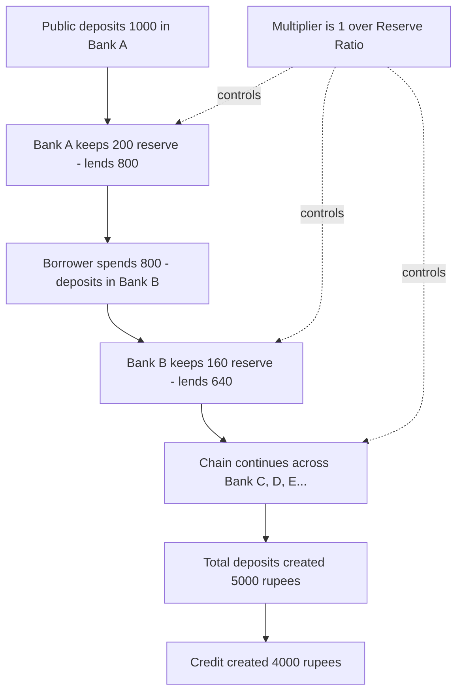
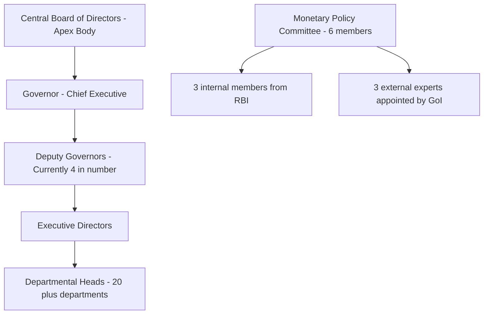

# Central Banking

<!-- SECTION_1_START -->

# Central Banking — The Architect of a Nation's Money

## 1.1 Formal Academic Definition

> [!IMPORTANT]
> **Central Banking** refers to the system in which a single, apex monetary authority — the **Central Bank** — is entrusted by the State with the responsibility of regulating the volume, cost, and availability of money and credit in an economy, issuing the national currency, managing foreign exchange reserves, and supervising the banking system to ensure macroeconomic stability.

In the **Indian context**, the **Reserve Bank of India (RBI)**, established on **1st April 1935** under the **RBI Act, 1934** and nationalised on **1st January 1949**, is the central bank. Its apex body is the **Central Board of Directors** with the **Governor** as its chief executive. Its headquarters is in **Mumbai**, and it operates under the **Department of Financial Services, Ministry of Finance, Government of India**.

> [!NOTE]
> **KTU 2024 Syllabus Mapping (UCHUT346 — Module 3):** This topic maps to **CO2 (Understand the structure of the monetary system and the role of central banking in economic development)** at the **Remember** and **Understand** levels of Revised Bloom's Taxonomy.

## 1.2 Conceptual Analogy — The Heart of the Economic Body

Think of the economy as a **giant human body**:

- **Blood** = Money circulating through markets, industries, and households.
- **Heart** = The **Central Bank**, which decides how much blood to pump, at what pressure, and to which organs.
- **Veins and Arteries** = Commercial banks, NBFCs, and lending institutions.
- **Lungs** = The foreign exchange market (they "breathe" foreign currency in and out).

If the heart pumps **too much money** (excess supply), the body suffers from **inflation** (a fever). If it pumps **too little**, the body suffers from **deflation and recession** (hypothermia). The central bank, like a cardiologist, uses **instruments (monetary tools)** to keep the **pulse rate (interest rate)** and **blood pressure (money supply)** at healthy levels.

> [!TIP]
> **Real-World Engineering Link:** Just as a **CPU's clock regulator** controls the voltage and frequency supplied to all components in a motherboard, the central bank regulates the "frequency" (interest rates) and "voltage" (money supply) of the entire financial motherboard of a country.

## 1.3 Key Physical and Institutional Constants

- **RBI Established:** 1st April 1935
- **RBI Nationalised:** 1st January 1949
- **RBI Headquarters:** Mumbai, Maharashtra
- **Authorising Statute:** Reserve Bank of India Act, 1934
- **Current Monetary Policy Framework:** **Flexible Inflation Targeting (FIT)** under the **RBI Act (amended in 2016)**, with a **Consumer Price Index (CPI)** inflation target of **4%** within a band of **±2%** (i.e., 2% to 6%).
- **Operating Target:** **Weighted Average Call Rate (WACR)** — the overnight uncollateralised money market rate.
- **Policy Rate:** **Repo Rate** (the rate at which RBI lends short-term funds to commercial banks against government securities).

> [!VISUALIZATION CONTROL]
> **Concept:** Monetary Transmission Mechanism (from RBI to the real economy)
> **GeoGebra / Desmos Input Equations:**
> * `y = m*x + c` where $x$ = Repo Rate, $y$ = Bank Lending Rate
> * `M_s = M_0 * (1 + c)/(c + rr)` (Money Multiplier equation)
> **Visual Description:** Imagine an $x$-axis representing the **Repo Rate** (set by RBI) and a $y$-axis representing the **Effective Lending Rate** charged by commercial banks. A downward shift in the RBI's policy curve should lead to a downward shift in the bank's lending curve, eventually reaching industry and the consumer — this is the **transmission mechanism**.

## 1.4 Why Central Banking Exists — Genesis

The central bank emerged historically from three fundamental failures of unregulated banking:

1. **The Free Banking Problem** — Multiple note-issuing private banks led to currency chaos and counterfeiting.
2. **The Bank Run / Panic Problem** — Witnessed during the **1907 Panic** and the **Great Depression of 1929**, where fractional reserve banking collapsed without a lender of last resort.
3. **The Monetary Coordination Problem** — In a gold standard era, no single authority could expand or contract credit in line with national economic goals.

The **Bank of England (1694)** is widely regarded as the world's first true central bank. The **Federal Reserve (USA, 1913)**, the **Bundesbank (Germany)**, and the **RBI (1935)** followed similar institutional blueprints.

<!-- SECTION_1_END -->

<!-- SECTION_2_START -->

# Deep Theoretical Analysis & KTU High-Yield Formula Sheet

## 2.1 Primary Functions of a Central Bank

The functions of a central bank can be classified into **six interlocking pillars**:

### Pillar 1 — Monetary Authority (Issuer of Currency)
- The central bank has the **monopoly right to issue currency notes** (in India, ₹2, ₹5, ₹10, ₹20, ₹50, ₹100, ₹200, ₹500, ₹2000 denominations).
- It maintains the **foreign exchange reserves** of gold, SDRs (Special Drawing Rights), and foreign currency assets to back the issued currency.
- **Note:** The actual physical printing is done by **Bharatiya Reserve Bank Note Mudran Private Limited (BRBNML)** and the **Security Printing and Minting Corporation of India Limited (SPMCIL)**, but under RBI's instruction.

### Pillar 2 — Regulator and Supervisor of the Banking System
- Issues licences to new banks.
- Prescribes **prudential norms**: the **Capital Adequacy Ratio (CAR)** under **Basel III** must be a minimum of **9%** in India (with capital conservation buffer of 2.5%).
- Conducts **on-site inspections** and **off-site surveillance** (the **CAMELS framework**: Capital adequacy, Asset quality, Management, Earnings, Liquidity, Sensitivity).
- Frameworks: **Prompt Corrective Action (PCA)** for weak banks.

### Pillar 3 — Banker to the Government
- Acts as the **debt manager** for the central and state governments.
- Handles the **Public Account of India**, manages the **Consolidated Fund of India**, and administers the **Ways and Means Advances (WMA)**.
- Advises the government on macroeconomic policy but operates with **functional autonomy** (insulated from direct political interference post the **1991 Narasimham Committee** reforms).

### Pillar 4 — Banker's Bank and Lender of Last Resort
- Commercial banks maintain **statutory reserves** with the RBI.
- During liquidity crises, the RBI provides emergency funds through the **Marginal Standing Facility (MSF)** and the **Repo window** to prevent systemic collapse (lender of last resort function).

### Pillar 5 — Controller of Credit (Monetary Policy)
- The most important function. Uses **Quantitative** and **Qualitative** methods to regulate the volume and direction of credit. Detailed in Section 2.3.

### Pillar 6 — Custodian and Manager of Foreign Exchange
- Manages the **Foreign Exchange Management Act (FEMA), 1999**.
- Maintains the **foreign exchange reserves** (currently over **USD 600 billion** in recent years).
- Administers the **exchange rate regime** — India follows a **managed float** system since **March 1993**.

## 2.2 The Monetary Policy Committee (MPC) — India

> [!IMPORTANT]
> The **Monetary Policy Committee (MPC)** was constituted under Section 45ZA of the amended RBI Act, 2016. It is a **6-member body**: 3 members from the RBI (including the Governor as Chair) and 3 external experts appointed by the Central Government. Decisions are taken by **majority vote** with the Governor having a **casting vote** in case of a tie. The MPC meets **at least 4 times a year** (bi-monthly since 2016) and is mandated to maintain **CPI inflation at 4% (±2%)**.

## 2.3 Instruments of Credit Control — The Complete Toolkit

### A. Quantitative Methods (affect the **volume** of credit)

#### 1. Bank Rate Policy
- The rate at which the RBI lends **long-term funds** to commercial banks **without collateral**.
- A **hike** in the bank rate → commercial banks borrow less from RBI → credit contraction.
- Currently, the bank rate is aligned with the **Repo Rate** and stands at the same level.

#### 2. Repo Rate (Repurchase Agreement Rate)
- The rate at which the RBI lends **short-term funds** to commercial banks **against the sale of government securities** with a simultaneous agreement to repurchase them at a future date.
- This is the **primary policy rate** in modern India.

#### 3. Reverse Repo Rate
- The rate at which the RBI **borrows** short-term funds from commercial banks.
- Acts as a **floor** for short-term interest rates.

#### 4. Marginal Standing Facility (MSF) Rate
- A penal rate (typically **Repo Rate + 25 basis points**) at which scheduled banks can borrow overnight from RBI by dipping into their **Statutory Liquidity Ratio (SLR)** holdings.
- Acts as a **ceiling** for the call money market.

#### 5. Cash Reserve Ratio (CRR)
- The percentage of a bank's **Net Demand and Time Liabilities (NDTL)** that must be kept with the RBI in **cash**.
- It is a **non-interest bearing** deposit.
- It directly affects the **lending capacity** of banks.

#### 6. Statutory Liquidity Ratio (SLR)
- The percentage of NDTL that banks must maintain in the form of **liquid assets** — gold, government securities, or cash.
- Currently **18%**.

#### 7. Open Market Operations (OMO)
- The buying and selling of government securities by the RBI in the open market.
- **RBI buys securities** → injects liquidity into the system → credit expansion.
- **RBI sells securities** → absorbs liquidity → credit contraction.

#### 8. Liquidity Adjustment Facility (LAF)
- A corridor system introduced in **2000** to manage day-to-day liquidity.
- Combines **Repo** and **Reverse Repo** operations.

#### 9. Market Stabilisation Scheme (MSS)
- Used since **2004** to sterilise the impact of foreign capital inflows on domestic liquidity by issuing government bonds.

### B. Qualitative Methods (affect the **direction / purpose** of credit)

| Method | Description |
|---|---|
| **Margin Requirements** | RBI raises the margin (down payment) on loans against specific commodities to discourage borrowing. |
| **Credit Rationing** | RBI fixes a ceiling on the amount of credit for specific sectors. |
| **Moral Suasion** | Informal pressure / advisory letters from RBI to banks to follow certain lending patterns. |
| **Direct Action** | Penal action against banks that violate RBI norms (refusal of accommodation, removal of licence). |
| **Selective Credit Controls (SCC)** | Historically applied to essential commodities to curb hoarding and inflation. |
| **Priority Sector Lending (PSL)** | Banks mandated to lend **40%** of Adjusted Net Bank Credit (ANBC) to priority sectors (agriculture, MSME, education, housing). |

## 2.4 The Money Multiplier — The Credit Creation Engine

> [!IMPORTANT]
> **The Money Multiplier ($m$)** is the ratio of the total money supply created to the initial deposit / base money. It is the **central theoretical instrument** explaining how a central bank's policy translates into a multiplied effect on the money supply.

### Derivation of the Money Multiplier

Let:
- $M_s$ = Total money supply (Currency with public $C$ + Demand deposits $D$)
- $M_0$ = Monetary base (High-powered money) = Currency with public $C$ + Reserves with RBI $R$
- $c$ = Currency-Deposit Ratio = $C / D$
- $r$ = Reserve-Deposit Ratio (CRR) = $R / D$

Then:

$$M_s = C + D$$

$$M_0 = C + R = cD + rD = D(c + r)$$

Therefore, the money multiplier is:

$$m = \frac{M_s}{M_0} = \frac{C + D}{C + R} = \frac{cD + D}{cD + rD} = \frac{D(c + 1)}{D(c + r)}$$

$$\boxed{m = \frac{1 + c}{c + r}}$$

> [!NOTE]
> **Interpretation:** If the public holds less currency (i.e., $c$ falls) or if the RBI lowers the CRR ($r$ falls), the money multiplier **increases**, meaning each unit of base money creates more deposits in the banking system. This is the **theoretical engine of credit creation**.

## 2.5 KTU Formula Sheet / Cheat Sheet

> [!TIP]
> The following table is a **high-yield revision matrix** — every parameter and formula tested in KTU University Examinations on this topic is summarised here.

| Concept | Symbol | Formula / Definition | Typical Numerical Value (India, Recent) |
|---|---|---|---|
| Money Multiplier | $m$ | $m = (1 + c) / (c + r)$ | Around **4.5 to 5.5** empirically |
| Base Money / Reserve Money | $M_0$ | $M_0 = C + R$ | Published in RBI Weekly Statistical Supplement (WSS) |
| Money Supply (M1) | $M_1$ | $M_1 = C + D$ | Narrow money |
| Money Supply (M3) | $M_3$ | $M_3 = M_1 + \text{Time deposits with banks}$ | Broad money — operational target of RBI historically |
| Reserve-Deposit Ratio | $r$ | $r = R / D$ | CRR value (e.g., 4% to 4.50%) |
| Currency-Deposit Ratio | $c$ | $c = C / D$ | Empirically around 0.30 to 0.40 in India |
| Credit Multiplier | $k$ | $k = 1 / r$ (in pure deposit multiplier model) | Inverse of CRR |
| Inflation Target | $\pi^*$ | Set by GoI — notification under Section 45ZA | **4% with $\pm 2$% band** |
| Effective Bank Rate (lending) | $r_l$ | $r_l = \text{Repo Rate} + \text{Markup}$ | Determined by bank's internal decisions |

## 2.6 Real-World Utility in Engineering and Production Systems

Central banking is not an abstract concept for engineers. It directly affects the **financial engineering** decisions of firms:

- **Capital Budgeting Decisions (NPV/IRR):** A change in the **Repo Rate** cascades to bond yields and the **Weighted Average Cost of Capital (WACC)**. An engineering firm evaluating a 10-year plant expansion must re-discount cash flows whenever the RBI changes its policy rate.
- **Working Capital Management:** Changes in CRR and MSF rates affect the short-term borrowing cost for firms. MSME engineering units are highly sensitive to CRR changes.
- **Foreign Exchange Risk:** Engineering firms importing capital goods (CNC machines, PLCs) face **forex exposure**. RBI's intervention in the USD/INR market directly determines landed cost.
- **Project Finance:** Infrastructure engineering firms (Roads, Power, Metro) depend on long-tenor bond issuance, where RBI's yield curve management becomes critical.
- **Start-up Ecosystem:** RBI's PSL norms, repo rate, and inflation targeting affect the entire **venture debt** and **fintech lending** pipeline.

<!-- SECTION_2_END -->

<!-- SECTION_3_START -->

# Step-by-Step Derivations, Numerical Demonstrations, and Comparative Analysis

## 3.1 Numerical Demonstration 1 — Computing the Money Multiplier

**Problem:** Suppose the Central Bank of a country has the following parameters:
- Currency-Deposit Ratio $c = 0.40$
- Reserve-Deposit Ratio (CRR) $r = 0.10$

Compute the Money Multiplier and interpret the result.

### Step-by-Step Solution

**Step 1 — Identify the formula.**

From the derivation in Section 2.4, the money multiplier is:

$$m = \frac{1 + c}{c + r}$$

**Step 2 — Substitute the given values.**

$$m = \frac{1 + 0.40}{0.40 + 0.10}$$

**Step 3 — Compute the numerator and denominator.**

$$m = \frac{1.40}{0.50}$$

**Step 4 — Final value.**

$$m = 2.80$$

**Step 5 — Economic Interpretation (Valuation Key):**

> The money multiplier of 2.80 implies that every ₹1 of base money ($M_0$) injected by the central bank ultimately results in a ₹2.80 expansion in the total money supply ($M_s$). If the central bank wishes to expand the money supply by ₹2,800 crores, it only needs to inject ₹1,000 crores of base money.

[Stating the correct formula: 2 Marks] [Substituting values correctly: 1 Mark] [Final numerical answer with units: 1 Mark] [Economic interpretation: 1 Mark]

## 3.2 Numerical Demonstration 2 — Impact of a CRR Change on Credit Creation

**Problem:** A banking system has total deposits of ₹50,000 crores. Initially, the CRR is 10%. The Central Bank reduces the CRR to 8%. Calculate:
(a) The initial reserves with the Central Bank.
(b) The new reserves with the Central Bank.
(c) The fresh credit created in the economy (assuming pure deposit multiplier model).

### Step-by-Step Solution

**Step 1 — Initial Reserves.**

$$R_1 = r_1 \times D = 0.10 \times 50{,}000 = 5{,}000 \text{ crores}$$

**Step 2 — New Reserves (after CRR reduction).**

$$R_2 = r_2 \times D = 0.08 \times 50{,}000 = 4{,}000 \text{ crores}$$

**Step 3 — Excess Reserves Released.**

$$\Delta R = R_1 - R_2 = 5{,}000 - 4{,}000 = 1{,}000 \text{ crores}$$

**Step 4 — Fresh Credit Created (using the deposit multiplier formula).**

In the **pure deposit multiplier model** (ignoring currency drain), the credit multiplier is $k = 1 / r$:

$$k_{\text{new}} = \frac{1}{r_2} = \frac{1}{0.08} = 12.5$$

$$\text{Fresh Credit} = k_{\text{new}} \times \Delta R = 12.5 \times 1{,}000 = 12{,}500 \text{ crores}$$

**Step 5 — Cross-check using initial and final multipliers:**

$$k_{\text{old}} = \frac{1}{0.10} = 10.0$$

$$\text{Total Credit Capacity}_{\text{old}} = 10.0 \times 50{,}000 = 5{,}00{,}000 \text{ crores}$$

$$\text{Total Credit Capacity}_{\text{new}} = 12.5 \times 50{,}000 = 6{,}25{,}000 \text{ crores}$$

$$\Delta \text{Credit} = 6{,}25{,}000 - 5{,}00{,}000 = 1{,}25{,}000 \text{ crores}$$

> **Note:** The two methods give the same incremental credit expansion of ₹1,25,000 crores, but the second method captures the *multiplier effect on the entire deposit base* whereas the first method shows the *direct effect on the released reserves*. For board-level KTU valuation, the second method is preferred as it is more rigorous.

[Stating the credit multiplier formula: 2 Marks] [Computing initial and final reserves: 2 Marks] [Calculating fresh credit: 2 Marks] [Interpretation linking to central bank policy: 1 Mark]

## 3.3 Numerical Demonstration 3 — Effect of a Repo Rate Change on Bank Lending

**Problem:** A commercial bank's cost of funds is structured as follows:
- 60% from deposits at an average rate of 4% per annum.
- 30% from borrowings under the Repo window at the prevailing Repo Rate of 6.50%.
- 10% from equity (target return of 12%).

The bank has a **Net Interest Margin (NIM)** target of 3.0% and **operating costs** of 1.0% of the loan book. Calculate the **Minimum Lending Rate (MLR)**. If the RBI raises the Repo Rate by 50 basis points, what is the new MLR?

### Step-by-Step Solution

**Step 1 — Weighted Average Cost of Funds (WACF).**

$$\text{WACF} = (0.60 \times 4.00) + (0.30 \times 6.50) + (0.10 \times 12.00)$$

$$\text{WACF} = 2.40 + 1.95 + 1.20 = 5.55 \text{ \%}$$

**Step 2 — Minimum Lending Rate Formula.**

$$\text{MLR} = \text{WACF} + \text{NIM} + \text{Operating Cost Ratio}$$

$$\text{MLR}_1 = 5.55 + 3.00 + 1.00 = 9.55 \text{ \%}$$

**Step 3 — New Repo Rate.**

$$\text{New Repo Rate} = 6.50 + 0.50 = 7.00 \text{ \%}$$

**Step 4 — New WACF.**

$$\text{New WACF} = (0.60 \times 4.00) + (0.30 \times 7.00) + (0.10 \times 12.00)$$

$$\text{New WACF} = 2.40 + 2.10 + 1.20 = 5.70 \text{ \%}$$

**Step 5 — New MLR.**

$$\text{MLR}_2 = 5.70 + 3.00 + 1.00 = 9.70 \text{ \%}$$

**Step 6 — Interpretation:**

> A 50 basis point hike in the Repo Rate translates to a **15 basis point** increase in the bank's Minimum Lending Rate, demonstrating the **incomplete transmission** of monetary policy. The transmission coefficient is $0.30$ (since 30% of the bank's funds are sourced from the Repo window).

[Identifying the WACF formula: 2 Marks] [Substituting and computing WACF: 2 Marks] [MLR formula and final value: 1 Mark] [Re-computing after Repo Rate change: 2 Marks] [Final new MLR: 1 Mark]

## 3.4 Comparative Analysis — Major Central Banks of the World

> [!NOTE]
> The following table is essential for KTU Part A and Part B questions that ask for comparative discussion of central banking structures. Use it for cross-country analytical answers.

| Parameter | Reserve Bank of India (RBI) | Federal Reserve (Fed, USA) | European Central Bank (ECB) | Bank of England (BoE) | Bank of Japan (BoJ) |
|---|---|---|---|---|---|
| **Established** | 1st April 1935 | 23rd December 1913 | 1st June 1998 | 27th July 1694 | 10th June 1882 |
| **Headquarters** | Mumbai, India | Washington D.C., USA | Frankfurt, Germany | London, UK | Tokyo, Japan |
| **Head of Institution** | Governor (currently Sanjay Malhotra) | Chair (Federal Reserve Board) | President (Christine Lagarde) | Governor (Andrew Bailey) | Governor (Kazuo Ueda) |
| **Monetary Policy Target** | CPI Inflation (4% ± 2%) | Dual mandate: Maximum employment + 2% inflation | HICP Inflation (below 2%) | CPI Inflation (2%) | 2% Inflation (price stability) |
| **Primary Policy Rate** | Repo Rate | Federal Funds Rate (FFR) | Main Refinancing Operations (MRO) Rate | Bank Rate | Unsecured Overnight Call Rate |
| **Exchange Rate Regime** | Managed Float | Free Float | Free Float (Euro) | Free Float | Free Float (Yen) |
| **Accountability** | To Parliament via Finance Minister | To US Congress (Humphrey-Hawkins) | To European Parliament | To UK Parliament (Treasury) | To Japanese Diet (Parliament) |
| **Number of Decision Makers** | 6 (MPC) | 19 (FOMC — 12 voting) | 26 (Governing Council — 6 voting on rates) | 9 (Monetary Policy Committee) | 9 (Policy Board) |
| **Unique Feature** | Functional autonomy from 1997 onwards (Tarapore Committee) | Dual mandate of employment and inflation | Multi-country mandate (Eurozone) | Oldest central bank in the world | Yield Curve Control (YCC) policy |
| **Recent Landmark Policy** | Withdrawing ₹2000 notes (2023); Repo Rate at 6.50% (2024) | Quantitative Tightening (QT) post-2022 | Pandemic Emergency Purchase Programme (PEPP) | Temporary long-term repo operations (TLTRO) | Negative interest rate era (2016-2024) |

## 3.5 Comparative Analysis — RBI vs. SBI (Conceptual Distinction)

> [!IMPORTANT]
> This is a frequently tested KTU short-answer question. The student must clearly distinguish between the **Central Bank** and a **Commercial Bank**.

| Parameter | Reserve Bank of India (RBI) | State Bank of India (SBI) |
|---|---|---|
| **Role** | Apex monetary authority of India | Largest commercial bank in India (PSU) |
| **Function** | Regulates money supply, issues currency, controls credit | Accepts deposits, lends to public and firms |
| **Profit Motive** | Not profit-motivated; public welfare focused | Profit-motivated public sector undertaking |
| **Ownership** | Owned by the Government of India (100%) | Government of India holds ~57.5% (as per recent shareholding) |
| **Customer** | Banks, Government, and Foreign Central Banks | General public, corporates, retail borrowers |
| **Note Issue** | Yes — has monopoly | No |
| **Lender of Last Resort** | Yes | No |
| **Established** | 1935 | 1955 (subsidiary of Imperial Bank) |
| **Governor / CMD** | Sanjay Malhotra (Governor) | C.S. Setty (Chairman as of 2024) |

## 3.6 The Process of Credit Creation by Commercial Banks (Conceptual Walkthrough)

> [!NOTE]
> The following sequential logic is a high-frequency KTU question (Part A, 3 marks). It is reproduced here as a comprehensive narrative so the student can write the full answer in the exam.

**Assumption:** Every bank keeps 20% of fresh deposits as reserves (the statutory reserve ratio) and lends out the rest.

**Step 1:** A **primary deposit** of ₹1,000 is made in Bank A. Bank A keeps ₹200 (20%) as reserves and lends ₹800 to Borrower X.

**Step 2:** Borrower X uses the ₹800 to pay for goods. The seller deposits the ₹800 in Bank B.

**Step 3:** Bank B keeps ₹160 (20% of ₹800) and lends ₹640.

**Step 4:** This ₹640 is deposited in Bank C, which keeps ₹128 and lends ₹512.

**Step 5:** The chain continues. The **total credit created** is:

$$\text{Total Credit} = \text{Initial Deposit} \times \frac{1}{\text{RRR}} = 1{,}000 \times \frac{1}{0.20} = 5{,}000$$

$$\text{Credit Created} = \text{Total Credit} - \text{Original Deposit} = 5{,}000 - 1{,}000 = 4{,}000$$

**Step 6 — Total Money Supply (Original + Created):**

$$M_s = 1{,}000 \text{ (original primary deposit)} + 4{,}000 \text{ (created credit)} = 5{,}000 \text{ rupees equivalent deposits}$$

> This chain demonstrates how a single initial deposit of ₹1,000 ultimately supports ₹5,000 in total deposits — the **multiplier effect**. The Central Bank's lever to control this multiplier is the **Reserve Ratio**.

[Defining the credit creation chain: 1 Mark] [Writing the multiplier formula: 1 Mark] [Numerical example: 1 Mark]

## 3.7 The Narasimham Committee Recommendations (Critical for KTU Descriptive Questions)

> [!TIP]
> The **Narasimham Committee I (1991)** and **Narasimham Committee II (1998)** are landmark reforms that shaped modern Indian central banking. Expect a 14-mark question on this.

| Recommendation | Narasimham I (1991) | Narasimham II (1998) |
|---|---|---|
| **CRR Reduction** | Reduce CRR from 15% to 3% progressively | Further alignment with international norms |
| **SLR Reduction** | Reduce SLR from 38.5% to 25% | Bring SLR closer to 25% |
| **Interest Rate Deregulation** | Phase out administered interest rates | Allow banks freedom in lending and deposit rates |
| **Asset Reconstruction** | Set up ARCs (Asset Reconstruction Companies) | Strengthen ARCs; legal framework for securitisation |
| **Capital Adequacy** | Bring in line with Basel norms | Implement Basel II standards |
| **NPAs** | Strengthen recovery tribunals; SARFAESI Act later | Establish IBBI (Insolvency and Bankruptcy Board of India) precursor |
| **Autonomy of RBI** | Operational autonomy for RBI | Functional autonomy in monetary policy |
| **Competition** | Allow new private sector banks | Universal banking guidelines; technology adoption |

<!-- SECTION_3_END -->

<!-- SECTION_4_START -->

# Structural Diagrams & Schematics

## 4.1 Mermaid Diagram — The Functional Architecture of a Central Bank

> [!NOTE]
> The following Mermaid block uses **safe alphanumeric node IDs** (node1, node2, etc.) and **double-quoted plain text labels** to comply with the KTU-PREMIER-ENGINE V10 rendering safeguards.

```mermaid
graph TD
    nodeA["Central Bank - Apex Monetary Authority"]
    nodeB["Monetary Authority Function"]
    nodeC["Issuer of Currency"]
    nodeD["Foreign Exchange Manager"]
    nodeE["Regulator of Banks Function"]
    nodeF["Bank Licensing Authority"]
    nodeG["Prudential Norms Enforcer - Basel III"]
    nodeH["Supervisor - CAMELS Framework"]
    nodeI["Banker to Government Function"]
    nodeJ["Debt Manager for Sovereign"]
    nodeK["Advisor on Macroeconomic Policy"]
    nodeL["Banker to Banks Function"]
    nodeM["Lender of Last Resort"]
    nodeN["Custodian of Reserves - CRR and SLR"]
    nodeO["Controller of Credit Function"]
    nodeP["Quantitative Tools - CRR, Repo, OMO"]
    nodeQ["Qualitative Tools - PSL, Moral Suasion"]
    nodeR["Custodian of Foreign Exchange Function"]
    nodeS["FEMA 1999 Administrator"]
    nodeT["Forex Reserves Manager"]

    nodeA --> nodeB
    nodeA --> nodeE
    nodeA --> nodeI
    nodeA --> nodeL
    nodeA --> nodeO
    nodeA --> nodeR

    nodeB --> nodeC
    nodeB --> nodeD

    nodeE --> nodeF
    nodeE --> nodeG
    nodeE --> nodeH

    nodeI --> nodeJ
    nodeI --> nodeK

    nodeL --> nodeM
    nodeL --> nodeN

    nodeO --> nodeP
    nodeO --> nodeQ

    nodeR --> nodeS
    nodeR --> nodeT
```



## 4.2 Mermaid Diagram — Monetary Policy Transmission Mechanism


## 4.3 Mermaid Diagram — The Credit Creation Multiplier Process



## 4.4 Mermaid Diagram — Hierarchical Structure of RBI Governance



## 4.5 Mermaid Diagram — The Six Pillars Functional Map (Subgraph Architecture)

```mermaid
graph TB
    subgraph pillar1 "Pillar 1 - Monetary Authority"
        p1a["Issue Currency"]
        p1b["Manage Forex Reserves"]
    end

    subgraph pillar2 "Pillar 2 - Regulator"
        p2a["Issue Licences"]
        p2b["Enforce Basel III CAR"]
        p2c["CAMELS Supervision"]
    end

    subgraph pillar3 "Pillar 3 - Banker to Government"
        p3a["Debt Manager"]
        p3b["Public Account Custodian"]
    end

    subgraph pillar4 "Pillar 4 - Banker to Banks"
        p4a["Lender of Last Resort"]
        p4b["Reserve Custodian - CRR"]
    end

    subgraph pillar5 "Pillar 5 - Credit Controller"
        p5a["Quantitative Methods"]
        p5b["Qualitative Methods"]
    end

    subgraph pillar6 "Pillar 6 - Forex Custodian"
        p6a["FEMA Administrator"]
        p6b["Managed Float Regime"]
    end

    apex["Central Bank Apex"] --> pillar1
    apex --> pillar2
    apex --> pillar3
    apex --> pillar4
    apex --> pillar5
    apex --> pillar6
```

<!-- SECTION_4_END -->

<!-- SECTION_5_START -->

# KTU 2024 Scheme Examination Question Bank

> [!NOTE]
> The questions below are modelled on the **KTU 2024 Scheme ESE pattern** for **UCHUT346 — Economics for Engineers**. Each question is tagged with a simulated past-year reference, Course Outcome (CO), and Revised Bloom's Taxonomy (RBT) level.

---

## Part A — Short Answer Questions (3 Marks Each)

### Question 1 [KTU University Exam — July 2023] (CO2, RBT: Remember)

**"Define a Central Bank. Mention any two of its primary functions."**

**Model Answer:**

A **Central Bank** is the apex monetary authority of a country, empowered by statute to regulate the money supply, issue the national currency, and supervise the banking system to achieve macroeconomic stability.

> **Two primary functions:**
>
> 1. **Monopoly Note Issue:** The central bank is the sole authority to issue currency in a country. In India, the **Reserve Bank of India** has this exclusive right, ensuring uniformity and credibility in the monetary base.
>
> 2. **Banker to the Government:** The central bank acts as the **debt manager** for the central and state governments, handles the **Consolidated Fund of India**, and provides short-term accommodation through the **Ways and Means Advances (WMA)** system.

> [!WARNING]
> **Examiner's Pitfall:** Students often write vague answers like *"controls the economy"* — this is too generic and earns **0 marks**. The valuation key demands specific functions: **monopoly note issue**, **banker to government**, **regulator of banks**, **controller of credit**, etc. Always use **terminology from the RBI Act**.

---

### Question 2 [KTU University Exam — December 2022] (CO2, RBT: Understand)

**"Explain the concept of the 'Lender of Last Resort' function of the Central Bank with a suitable example."**

**Model Answer:**

The **Lender of Last Resort (LoLR)** is the function by which the central bank provides emergency liquidity to commercial banks (or the financial system) that are facing acute cash crunches and are unable to raise funds from any other source, thereby preventing systemic bank runs and financial collapse.

> **Example:** During the **2008 Global Financial Crisis**, the **US Federal Reserve** extended emergency credit facilities to institutions like **Bear Stearns** and **AIG**, and during the **Yes Bank crisis (2020)** in India, the **RBI** imposed a moratorium and facilitated a reconstruction scheme by the State Bank of India-led consortium. The RBI also provided emergency liquidity through the **Marginal Standing Facility (MSF)** and ad-hoc Repo windows.

> [!WARNING]
> **Examiner's Pitfall:** Students often confuse the **Lender of Last Resort** function with the **Banker's Bank** function. The LoLR is invoked only in **emergencies and systemic crises**, not in routine banking operations. Clarify this distinction explicitly.

---

## Part B — Long Answer Questions (14 Marks Each — Module Internal Choice)

### Question A — Choice 1 [KTU University Exam — July 2024] (CO2, RBT: Understand + Apply)

**(a)** Discuss the **six primary functions** of a Central Bank with specific reference to the **Reserve Bank of India**. **(7 Marks)**

**(b)** With a numerical illustration, explain the **concept of credit creation** by commercial banks. How does the **Cash Reserve Ratio (CRR)** act as a tool to control this credit creation? **(7 Marks)**

---

#### Model Solution for Question A (a)

**Definition (1 Mark):** A Central Bank is the apex monetary authority of a country, established by statute, responsible for issuing currency, regulating money supply, and supervising the banking system.

**The Six Functions:**

**1. Monetary Authority / Note Issue (1 Mark):**
The RBI has the **exclusive monopoly** to issue banknotes in India (under Section 22 of the RBI Act). Coins are issued by the **Ministry of Finance**, but the RBI manages the distribution. The note issue is backed by **gold, foreign securities, and government rupee securities** as per the **Minimum Reserve System** introduced in **1956**.

**2. Banker to the Government (1 Mark):**
The RBI acts as the **debt manager** for both central and state governments, administers the **Public Account of India** and the **Consolidated Fund**, and provides short-term credit through the **Ways and Means Advances (WMA)** scheme. It also handles the **Market Borrowing Programme** of the government.

**3. Banker to Banks and Lender of Last Resort (1 Mark):**
All scheduled commercial banks maintain accounts with the RBI. The RBI provides liquidity through the **Repo**, **MSF**, and **Marginal Standing Facility** windows. In crises, the RBI steps in as the **Lender of Last Resort** to prevent systemic collapse.

**4. Regulator and Supervisor of Banks (1 Mark):**
The RBI issues banking licences, prescribes **prudential norms** like the **Capital Adequacy Ratio (CAR)** under **Basel III**, conducts inspections using the **CAMELS framework**, and initiates **Prompt Corrective Action (PCA)** for weak banks.

**5. Controller of Credit (Monetary Policy) (1 Mark):**
The RBI controls the volume and direction of credit through **quantitative tools** (CRR, SLR, Repo Rate, OMO) and **qualitative tools** (margin requirements, moral suasion, priority sector lending).

**6. Custodian and Manager of Foreign Exchange (1 Mark):**
The RBI manages the **Foreign Exchange Reserves** (over **USD 600 billion**), administers the **Foreign Exchange Management Act (FEMA), 1999**, and operates the **managed float exchange rate regime** adopted in **March 1993**.

[1 Mark for definition; 6 Marks for explaining the six functions: 1 Mark each; Total = 7 Marks]

---

#### Model Solution for Question A (b)

**Step 1 — Definition of Credit Creation (1 Mark):**
Credit creation by commercial banks is the process by which the banking system, given an initial deposit, creates a multiple expansion in deposits through successive rounds of lending, subject to a statutory reserve ratio.

**Step 2 — Numerical Illustration (4 Marks):**

Assume an initial deposit of **₹10,000** in Bank A and a **reserve ratio of 20%**.

| Bank | Deposits Received (₹) | Reserves Kept (₹) | Loans Given (₹) |
|---|---|---|---|
| Bank A | 10,000 | 2,000 | 8,000 |
| Bank B | 8,000 | 1,600 | 6,400 |
| Bank C | 6,400 | 1,280 | 5,120 |
| Bank D | 5,120 | 1,024 | 4,096 |
| ... | ... | ... | ... |
| **Total** | **50,000** | **10,000** | **40,000** |

The total deposit expansion is **₹50,000** — a 5-fold multiple of the initial deposit.

**Step 3 — Mathematical Proof (1 Mark):**

$$\text{Total Credit} = \text{Initial Deposit} \times \frac{1}{\text{RRR}} = 10{,}000 \times \frac{1}{0.20} = 50{,}000$$

**Step 4 — Role of CRR (1 Mark):**
The **CRR** is the **Cash Reserve Ratio** — the percentage of a bank's NDTL that must be kept with the RBI in cash. It directly controls the **deposit multiplier**. If the RBI raises the CRR, the multiplier $1/\text{CRR}$ falls, and credit contracts. If CRR is lowered, the multiplier rises, and credit expands.

> [!WARNING]
> **Examiner's Pitfall:** Students often confuse **CRR with SLR**. CRR is maintained as **cash with the RBI** and is **non-interest bearing**, while SLR is maintained as **liquid assets like gold or government securities** and is **interest bearing**. The valuation key specifically demands this distinction.

---

### Question B — Choice 2 [KTU University Exam — July 2024] (CO2, RBT: Understand + Apply)

**(a)** What is **Monetary Policy**? Explain the **quantitative instruments** of monetary policy used by the Reserve Bank of India. **(7 Marks)**

**(b)** With the help of a suitable diagram, explain the **Money Multiplier** concept. An economy has a currency-deposit ratio of 0.30 and a reserve-deposit ratio of 0.05. Calculate the money multiplier. If the central bank wishes to expand the money supply by ₹1,40,000 crores, what is the required injection of base money? **(7 Marks)**

---

#### Model Solution for Question B (a)

**Step 1 — Definition (1 Mark):**
Monetary Policy is the macroeconomic policy laid down by the central bank (the RBI) to regulate the **volume of money**, the **cost of money (interest rate)**, and the **availability of credit** in the economy to achieve broad economic objectives like price stability, full employment, and economic growth.

**Step 2 — Quantitative Instruments (6 Marks — 1 Mark each, 6 of the following 8):**

**1. Bank Rate:** The rate at which the RBI lends long-term funds to commercial banks without collateral. Currently aligned with the **Repo Rate**.

**2. Repo Rate:** The rate at which the RBI lends short-term funds to banks against government securities. This is the **primary policy rate** under the **Liquidity Adjustment Facility (LAF)**.

**3. Reverse Repo Rate:** The rate at which the RBI borrows short-term funds from banks. Acts as a **floor** for the call money market.

**4. Cash Reserve Ratio (CRR):** The percentage of NDTL that commercial banks must maintain as **cash balance with the RBI**. It is a powerful tool to control credit expansion. Currently around **4% to 4.50%**.

**5. Statutory Liquidity Ratio (SLR):** The percentage of NDTL that banks must maintain as liquid assets (gold, government securities, cash). Currently **18%**.

**6. Open Market Operations (OMO):** Buying and selling of government securities in the open market to inject or absorb liquidity permanently.

**7. Marginal Standing Facility (MSF):** A penal rate (Repo + 25 bps) at which banks can borrow overnight against SLR holdings. Acts as a **ceiling** for the call money market.

**8. Market Stabilisation Scheme (MSS):** Issue of government bonds to sterilise the impact of foreign capital inflows on domestic liquidity.

> [!WARNING]
> **Examiner's Pitfall:** Students often mix up **Bank Rate with Repo Rate**. The **Bank Rate** is for **long-term loans without collateral**, while the **Repo Rate** is for **short-term loans against collateral (government securities)**. Explicitly mention "short-term collateral-backed" in the Repo Rate definition.

---

#### Model Solution for Question B (b)

**Step 1 — Money Multiplier Concept (3 Marks):**

The money multiplier is the ratio of the total money supply ($M_s$) to the base money ($M_0$). It captures the **multiple expansion** of deposits in the banking system for every unit of base money injected by the central bank.

> **Diagrammatic Explanation:**
>
> Imagine a horizontal axis representing **Base Money ($M_0$)** and a vertical axis representing **Money Supply ($M_s$)**. A line with slope $m$ passing through the origin represents the relationship $M_s = m \cdot M_0$. As the central bank shifts its base money injection to the right (e.g., from $M_{0,1}$ to $M_{0,2}$), the money supply expands along the same line to $M_{s,1}$ and $M_{s,2}$. The slope of this line is the **money multiplier** $m$.

**Step 2 — Formula (1 Mark):**

$$m = \frac{1 + c}{c + r}$$

**Step 3 — Substitute the Values (1 Mark):**

$$m = \frac{1 + 0.30}{0.30 + 0.05} = \frac{1.30}{0.35}$$

**Step 4 — Final Multiplier (1 Mark):**

$$m = 3.714 \approx 3.71$$

**Step 5 — Required Base Money Injection (1 Mark):**

$$\Delta M_0 = \frac{\Delta M_s}{m} = \frac{1{,}40{,}000}{3.71} \approx 37{,}735.85 \text{ crores}$$

> **Conclusion:** To expand the money supply by ₹1,40,000 crores with the given parameters, the central bank must inject approximately **₹37,735.85 crores** of base money.

> [!WARNING]
> **Examiner's Pitfall:** Students often write $m = 1/r$ (the simple deposit multiplier) instead of the full formula $m = (1 + c)/(c + r)$. The complete formula is required for full credit. Also, watch out for unit conversion — the final answer must be in **crores of rupees**.

---

## KTU Examiner's Valuation Warning — Central Banking Topic

> [!WARNING]
> **Common Pitfalls That Lead to Mark Deductions:**
>
> 1. **Vague Definitions:** Writing "Central Bank controls the economy" instead of "Central Bank regulates the volume, cost, and availability of money and credit." Always use **RBI Act / monetary economics terminology**.
>
> 2. **Confusing CRR and SLR:** CRR = cash with RBI (non-interest bearing). SLR = liquid assets with the bank itself (interest bearing). Many students incorrectly say SLR is also kept with the RBI.
>
> 3. **Forgetting the LAF Corridor:** The RBI operates a **corridor system** — Repo Rate (floor) to MSF (ceiling) — within which the **Weighted Average Call Rate (WACR)** operates. Mention this for full marks.
>
> 4. **Mixing Bank Rate and Repo Rate:** Bank Rate is for long-term uncollateralised lending, Repo Rate is for short-term collateralised lending.
>
> 5. **Skipping the MPC:** Post-2016, monetary policy decisions in India are taken by the **Monetary Policy Committee (MPC)** — not solely by the RBI Governor. Always mention the MPC in modern-era answers.
>
> 6. **Not mentioning the CPI inflation target of 4% ± 2%:** This is a statutory mandate under Section 45ZA. Forgetting it is a guaranteed 1-mark loss.
>
> 7. **Failing to use units:** In numerical questions, always write "₹" prefix and "crores" suffix. Without units, the answer is technically incomplete.

---

## Topic Recap & Important Things to Remember

> [!TIP]
> **Rapid Revision Checklist — KTU 2024 Scheme, UCHUT346, Module 3 — Central Banking**

- **Definition:** A Central Bank is the **apex monetary authority** of a country established by statute with the monopoly of currency issue and the responsibility of monetary stability.
- **RBI:** Established **1st April 1935** under the **RBI Act, 1934**; nationalised on **1st January 1949**; headquartered in **Mumbai**.
- **Six Functions:** (1) Monetary Authority / Note Issue, (2) Banker to Government, (3) Banker to Banks / Lender of Last Resort, (4) Regulator of Banks, (5) Controller of Credit, (6) Custodian of Foreign Exchange.
- **Monetary Policy Committee (MPC):** 6-member body (3 RBI + 3 external), mandated to maintain **CPI inflation at 4% ± 2%**, headed by the RBI Governor, meets at least **4 times a year**.
- **Statutory Inflation Target:** **4%** with a tolerance band of **±2%** (range 2% to 6%), under **Section 45ZA** of the RBI Act (amended 2016).
- **Primary Policy Rate:** **Repo Rate** — the rate at which RBI lends short-term funds to commercial banks against government securities.
- **Quantitative Tools:** **Bank Rate, Repo Rate, Reverse Repo Rate, MSF, CRR, SLR, OMO, LAF, MSS.**
- **Qualitative Tools:** **Margin Requirements, Credit Rationing, Moral Suasion, Direct Action, Selective Credit Controls, Priority Sector Lending (40% of ANBC).**
- **Money Multiplier Formula:** $m = (1 + c)/(c + r)$ — captures the credit expansion effect of base money.
- **CRR vs SLR:** CRR = **cash with RBI (non-interest bearing)**. SLR = **liquid assets with bank (interest bearing)**.
- **Lender of Last Resort:** Central bank provides **emergency liquidity** in times of systemic crisis to prevent bank runs and financial collapse.
- **Managed Float:** India adopted a **managed float** exchange rate regime in **March 1993**.
- **Narasimham Committees:** **I (1991)** focused on CRR/SLR reduction, interest rate deregulation, and NPA recovery. **II (1998)** strengthened prudential norms and capital adequacy.
- **RBI Functional Autonomy:** Established in principle by the **Tarapore Committee (1997)** and operationalised post-1997 budgets.
- **Basel III CAR:** Minimum **9%** (8% + 2.5% capital conservation buffer) in India.
- **Currency Issue:** Coins are issued by the **Ministry of Finance**; notes are issued by the **RBI**.
- **Open Market Operations:** RBI's buying/selling of government securities to inject or absorb liquidity.
- **Lender of Last Resort (LoLR):** Emergency function, distinct from routine Banker's Bank role.
- **PSL Norms:** Banks must lend **40% of ANBC** to priority sectors.
- **CAMELS Framework:** **C**apital adequacy, **A**sset quality, **M**anagement, **E**arnings, **L**iquidity, **S**ensitivity — used by RBI for bank supervision.
- **Engineering Link:** Changes in Repo Rate affect the **WACC** of engineering firms, altering their **NPV calculations** and **capital budgeting** decisions.
- **Key Statutes:** **RBI Act 1934, Banking Regulation Act 1949, FEMA 1999, SARFAESI Act 2002, Insolvency and Bankruptcy Code 2016.**

> [!NOTE]
> **Final Exam Mantra for KTU UCHUT346:** When writing about Central Banking, always anchor your answer in the **RBI Act 1934**, mention the **MPC and the 4% ± 2% inflation target** (for contemporary relevance), use **terminology exactly as in Section 22, 45ZA, and the LAF framework**, and remember to draw a **diagram or table** wherever possible to secure full credit for visual structure.

<!-- SECTION_5_END -->
