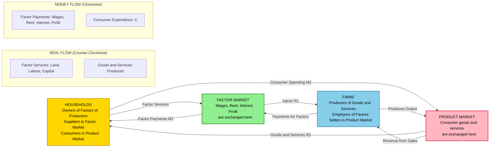
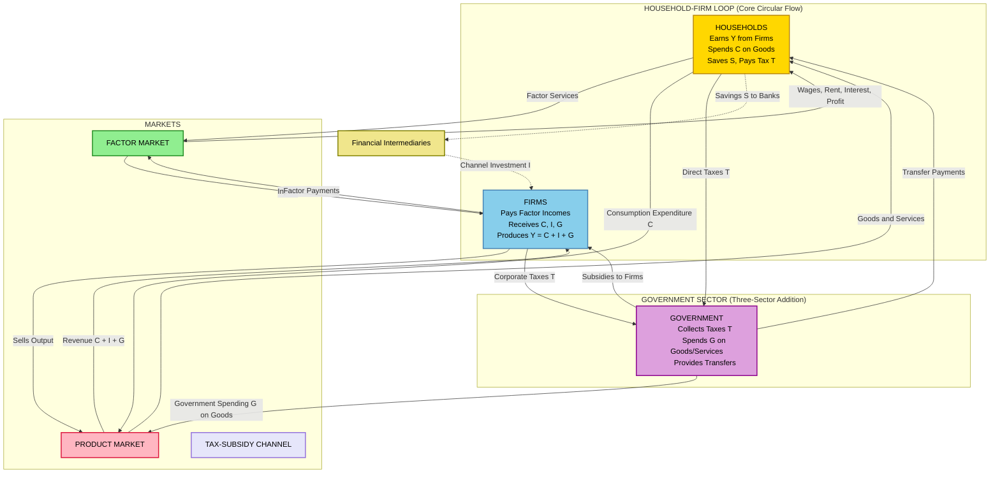
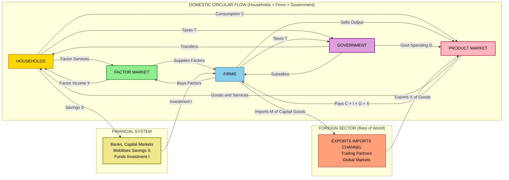
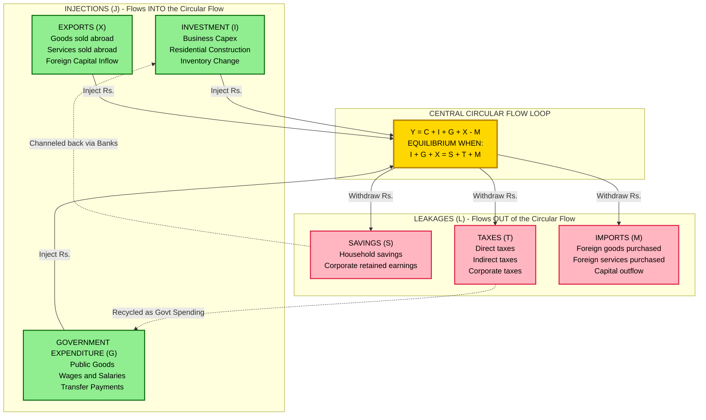
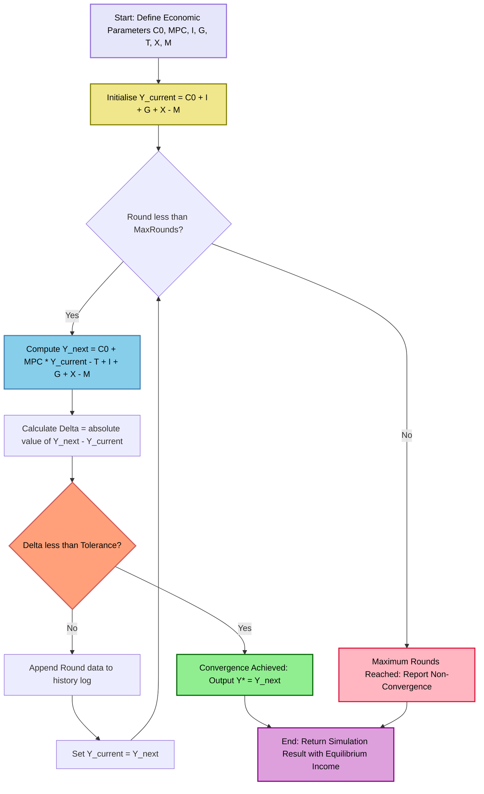

# Circular Flow

<!-- SECTION_1_START -->

# Circular Flow of Income in a Monetary System

## 1.1 Formal Academic Definition (KTU 2024 Syllabus Terminology)

> [!IMPORTANT]
> **Circular Flow of Income (Macroeconomic Definition):**
> The **Circular Flow of Income** is a macroeconomic model that visually and mathematically represents the continuous, unidirectional movement of **real flows** (goods, services, and factors of production) and **money flows** (income, expenditure, and payments) between the principal economic decision-making units of an economy — namely **Households**, **Firms**, **Government**, and the **Foreign Sector** — operating through the **Factor Market** and the **Product Market**.

The model is a *closed-loop equilibrium construct* used to demonstrate how **National Income (Y)**, **Output (O)**, **Expenditure (E)**, and **Employment** are interlinked and mutually determined at the macro level. It was popularized by classical economists such as **François Quesnay** (Tableau Économique, 1758) and later refined by **John Maynard Keynes**.

## 1.2 Conceptual Analogy & Intuitive Overview

> [!NOTE]
> **The "Bloodstream of an Economy" Analogy:**
> Think of a national economy as a **living organism** and the *circular flow of money* as its **bloodstream**. Just as the human heart pumps oxygenated blood from the lungs to the organs (real flow of value) and receives deoxygenated blood back (return flow), the economy continuously cycles money from **Households → Firms → Government → back to Households**.
> * If the heart beats too slowly (low velocity of money), the body becomes sluggish (recession).
> * If blood leaks out (savings, taxes, imports not recycled), the body weakens.
> * If transfusions occur (investment, government spending, exports), vitality is restored.
>
> **The Golden Rule of Circular Flow:** *Money never "disappears" — it only changes hands.* The economy is a **closed pipeline** with **Injections** (inputs) and **Leakages** (outputs). Stability requires a **steady-state** where injections equal leakages.

## 1.3 The Four Key Economic Decision-Making Units

| Decision-Making Unit | Symbol | Primary Role in the Economy | Acts As |
| :--- | :---: | :--- | :--- |
| **Households** | $H$ | Owners of factors of production (Land, Labour, Capital, Entrepreneurship) | Suppliers in factor market, Buyers in product market |
| **Firms** | $F$ | Producers of goods and services using purchased factors | Buyers in factor market, Suppliers in product market |
| **Government** | $G$ | Levies taxes, provides public goods, regulates | Both buyer and supplier via transfers & spending |
| **Foreign Sector** | $ROW$ | Trading partner through exports and imports | Net supplier or demander |

> [!IMPORTANT]
> **Two Principal Markets:**
> 1. **Factor Market (Resource Market):** Where factors of production are exchanged. Real flow moves *Households → Firms*; money flow moves *Firms → Households* (as wages, rent, interest, profit).
> 2. **Product Market (Goods Market):** Where finished goods and services are exchanged. Real flow moves *Firms → Households*; money flow moves *Households → Firms* (as consumption expenditure).

## 1.4 Real Flows vs. Money Flows

| Flow Type | Direction (Two-Sector Model) | Items Exchanged | Notation |
| :--- | :--- | :--- | :--- |
| **Real Flow** (counter-clockwise) | Households $\rightarrow$ Firms $\rightarrow$ Households | Factor services, Goods, Services | $L, K, \text{GDP}$ |
| **Money Flow** (clockwise) | Firms $\rightarrow$ Households $\rightarrow$ Firms | Wages, Rent, Interest, Profit, Consumption | $W, R, i, \pi, C$ |

> [!VISUALIZATION CONTROL]
> **Concept:** Counter-rotating two-sector circular flow on a Cartesian coordinate system.
> **GeoGebra / Desmos Input Equations:**
> * Upper semi-circle (Money Flow, clockwise): $x^2 + y^2 = 25,\ y \geq 0$
> * Lower semi-circle (Real Flow, counter-clockwise): $x^2 + y^2 = 25,\ y \leq 0$
> * Point A: $(-3, 0)$ representing Firms; Point B: $(3, 0)$ representing Households
> **Visual Description:** The student should observe *two opposing arcs* over the same chord $AB$, visually demonstrating the *dual, reciprocal* nature of exchange in a barterless monetary economy.

---

<!-- SECTION_1_END -->

<!-- SECTION_2_START -->

# Deep Theoretical Analysis & KTU High-Yield Formula Sheet

## 2.1 The Three Layered Models of Circular Flow

### **Model 1: Two-Sector Economy (Households ↔ Firms)**

This is the **simplest closed-economy** model. There is **no government** and **no foreign trade**. The only leakage is *Savings* and the only injection is *Investment*.

**Assumptions:**

* The economy is a *closed* system (no foreign trade).
* Households spend *all* their income on consumption (no savings) — *or* any savings is fully channelled back via investment.
* Firms produce *only* consumer goods and pay out all receipts as factor incomes.
* No depreciation of capital.

**The Three Identities (Two-Sector):**

$$
Y = C + I
$$

$$
Y = C + S
$$

$$
\therefore \ C + I = C + S \ \Rightarrow \ I = S
$$

**Equilibrium Condition:** $I = S$ (Investment equals Savings — the *classical* and *Keynesian* equilibrium condition).

### **Model 2: Three-Sector Economy (Households ↔ Firms ↔ Government)**

The Government enters as a *third decision-making unit*. It imposes **taxes ($T$)** and incurs **government expenditure ($G$)** on goods, services, and transfers.

**New Leakages:** Savings ($S$), Taxes ($T$)
**New Injections:** Investment ($I$), Government Expenditure ($G$)

**National Income Identity (Three-Sector):**

$$
Y = C + I + G
$$

**Disposable Income:** $Y_d = Y - T$

**The Three Identities:**

$$
Y = C + S + T
$$

$$
Y_d = C + S
$$

$$
\therefore \ C + I + G = C + S + T \ \Rightarrow \ I + G = S + T
$$

**Equilibrium Condition:** $I + G = S + T$ (Aggregate injections = Aggregate leakages).

### **Model 3: Four-Sector Economy (Open Economy)**

The **Foreign Sector (Rest of World, $ROW$)** is added. Exports ($X$) become an *injection* (foreign demand for domestic goods adds to the circular flow) and Imports ($M$) become a *leakage* (domestic income spent on foreign goods leaves the flow).

**Complete Injections:** $I + G + X$
**Complete Leakages:** $S + T + M$

**National Income Identity (Four-Sector, Open Economy):**

$$
Y = C + I + G + (X - M) = C + I + G + N_X
$$

where $N_X = X - M$ is the **Net Export** component.

**The Three Identities:**

$$
Y = C + S + T + M
$$

$$
Y = C + I + G + X
$$

$$
\therefore \ C + I + G + X = C + S + T + M \ \Rightarrow \ I + G + X = S + T + M
$$

**Equilibrium Condition:** $I + G + X = S + T + M$

> [!NOTE]
> **Why This Matters in Engineering Economics:** Engineers designing cost structures, ROI models, or macro-level feasibility studies (e.g., a new power plant, a semiconductor fab) must understand that **national income multipliers**, **fiscal multipliers**, and **trade balances** are all derivable from the *circular flow equilibrium*. A break in the loop (e.g., capital flight) is mathematically equivalent to an *increase in leakages* exceeding *injections*.

## 2.2 The Three Identities of National Income (Walrasian Framework)

| Identity | Expression | Economic Meaning |
| :--- | :--- | :--- |
| **Production (Output) Identity** | $Y = C + I + G + (X - M)$ | Total output equals total expenditure on that output |
| **Income (Distribution) Identity** | $Y = C + S + T + M$ | Total income is either consumed, saved, taxed, or spent on imports |
| **Disposal (Expenditure) Identity** | $Y_d = C + S + T$ | Disposable income is split between consumption and savings |
| **Equilibrium (Stock-Flow) Identity** | $I + G + X = S + T + M$ | Planned injections must equal planned leakages for macro-equilibrium |

## 2.3 Injections and Leakages — The Economic Thermostat

| Concept | Definition | Examples | Effect on Circular Flow |
| :--- | :--- | :--- | :--- |
| **Injection ($J$)** | Any flow *into* the circular flow that is *not* consumption | $I,\ G,\ X$ | **Increases** aggregate demand and national income |
| **Leakage ($L$ or $W$)** | Any flow *out of* the circular flow that is *not* consumption | $S,\ T,\ M$ | **Decreases** aggregate demand and national income |

**Macro-Stability Rule:** $J = L$ at equilibrium. If $J > L$, the economy expands (inflationary pressure). If $J < L$, the economy contracts (recessionary pressure).

## 2.4 The Multiplier Effect (Keynesian Multiplier)

When an injection of $\Delta A$ occurs, the *final* change in national income is **amplified** through successive rounds of spending.

$$
k = \frac{1}{1 - MPC} = \frac{1}{MPS}
$$

$$
\Delta Y = \frac{1}{1 - MPC} \cdot \Delta A
$$

where $MPC = \frac{\Delta C}{\Delta Y_d}$ is the **Marginal Propensity to Consume** and $MPS = 1 - MPC$.

**In a four-sector open economy with proportional taxes and imports:**

$$
k = \frac{1}{1 - MPC \cdot (1 - t) + MPM}
$$

where $t$ is the average tax rate and $MPM$ is the marginal propensity to import.

## 2.5 KTU High-Yield Formula Sheet (Examination Quick Reference)

| # | Formula / Identity | Variable Definitions | Used In |
| :---: | :--- | :--- | :--- |
| 1 | $Y = C + S$ (Two-sector closed) | $Y$ = Income, $C$ = Consumption, $S$ = Savings | Two-Sector Model |
| 2 | $I = S$ (Two-sector equilibrium) | $I$ = Investment, $S$ = Savings | Classical & Keynesian |
| 3 | $Y = C + S + T$ (Three-sector) | $T$ = Net Taxes | Three-Sector Model |
| 4 | $I + G = S + T$ (Three-sector equilibrium) | $G$ = Govt. Expenditure | Three-Sector Equilibrium |
| 5 | $Y = C + I + G + (X - M)$ (Four-sector) | $X$ = Exports, $M$ = Imports | National Income Identity |
| 6 | $I + G + X = S + T + M$ (Four-sector equilibrium) | $NX$ = Net Exports | Open-Economy Equilibrium |
| 7 | $Y_d = Y - T$ | $Y_d$ = Disposable Income | After-Tax Consumption |
| 8 | $k = \frac{1}{1 - MPC} = \frac{1}{MPS}$ | $k$ = Multiplier | Keynesian Multiplier |
| 9 | $\Delta Y = k \cdot \Delta A$ | $\Delta A$ = Autonomous Spending | Income Change |
| 10 | $k = \frac{1}{1 - c(1 - t) + m}$ | $c$ = MPC, $m$ = MPM | Open-Economy Multiplier |

> [!IMPORTANT]
> **Real-World Engineering Utility:** The circular flow model is the **bedrock of macroeconomic forecasting** in:
> * **Public-sector engineering projects** (DPRs — Detailed Project Reports) where cost-benefit analysis must include *fiscal multiplier effects* and *tax revenue recapture*.
> * **Corporate financial modelling** of large capex (e.g., setting up a semiconductor fab in Kerala vs. Singapore — imports, taxes, government subsidies).
> * **Government policy design** (Make in India, Kerala Industrial Policy 2023) where understanding the *injection-leakage balance* determines policy success.

---

<!-- SECTION_2_END -->

<!-- SECTION_3_START -->

# Step-by-Step Derivations, Equilibrium Analysis & Code Implementation

## 3.1 Derivation of the Two-Sector Equilibrium Identity

**Step 1: Define the production-side identity.**
The value of all goods and services produced in the economy must equal the value of all goods and services purchased.

$$
Y \equiv C + I
$$

**Step 2: Define the income-side identity.**
All income generated in production is paid out as factor incomes to households. Households, in turn, either *consume* or *save* it.

$$
Y \equiv C + S
$$

**Step 3: Equate both sides using the Walrasian Law.**
Since both expressions equal $Y$, they must equal each other:

$$
C + I = C + S
$$

**Step 4: Simplify by cancelling $C$ from both sides.**

$$
\therefore \ I = S
$$

**Conclusion:** In a closed two-sector economy, equilibrium national income is reached **only when planned investment equals planned savings**. Any deviation creates either an *inventory accumulation* (if $S > I$, recession) or an *inventory depletion* (if $I > S$, expansion).

## 3.2 Derivation of the Four-Sector Equilibrium Identity

**Step 1: Begin with the open-economy national income identity.**

$$
Y = C + I + G + X - M
$$

**Step 2: Equate to the income distribution identity.**

$$
Y = C + S + T + M
$$

**Step 3: Set both sides equal.**

$$
C + I + G + X - M = C + S + T + M
$$

**Step 4: Cancel $C$ and rearrange to isolate injections on the left.**

$$
I + G + X = S + T + M
$$

**Conclusion (Macro-equilibrium condition):** Aggregate injections (Investment + Government spending + Exports) must equal aggregate leakages (Savings + Taxes + Imports) for the circular flow to remain in a *steady state*.

## 3.3 Worked Numerical Example — Three-Sector Equilibrium

> **Problem Statement (KTU Exam Pattern):**
> In a three-sector economy, the following data is given:
> * Autonomous Consumption $C_0 = 100$ (in ₹ crores)
> * Marginal Propensity to Consume $MPC = 0.8$
> * Investment $I = 200$ (in ₹ crores)
> * Government Expenditure $G = 150$ (in ₹ crores)
> * Net Taxes $T = 100$ (in ₹ crores)
>
> **Required:** Calculate the equilibrium level of national income $Y$.

**Step 1: Write the consumption function.**

$$
C = C_0 + MPC \cdot (Y - T) = 100 + 0.8(Y - 100)
$$

**Step 2: Write the aggregate demand equation.**

$$
AD = C + I + G = [100 + 0.8(Y - 100)] + 200 + 150
$$

**Step 3: Substitute and expand.**

$$
AD = 100 + 0.8Y - 80 + 200 + 150
$$

$$
AD = 0.8Y + 370
$$

**Step 4: Apply the equilibrium condition $Y = AD$.**

$$
Y = 0.8Y + 370
$$

**Step 5: Solve algebraically for $Y$.**

$$
Y - 0.8Y = 370
$$

$$
0.2Y = 370
$$

$$
Y = \frac{370}{0.2} = 1850 \ \text{₹ crores}
$$

**Step 6: Verify by computing $C$ and $S$.**

$$
C = 100 + 0.8 \cdot (1850 - 100) = 100 + 0.8 \cdot 1750 = 100 + 1400 = 1500
$$

$$
S = Y_d - C = (1850 - 100) - 1500 = 1750 - 1500 = 250
$$

**Step 7: Confirm $I + G = S + T$.**

$$
I + G = 200 + 150 = 350
$$

$$
S + T = 250 + 100 = 350 \ \checkmark
$$

**Equilibrium National Income $Y = 1850$ ₹ crores.** *(Note: ₹ 1,850 crores is the macro equilibrium output.)*

## 3.4 Derivation of the Keynesian Multiplier in a Four-Sector Economy

**Step 1: Start from the equilibrium identity.**

$$
Y = C + I + G + X - M
$$

**Step 2: Express consumption and imports as functions of disposable income.**

$$
C = C_0 + c \cdot Y_d \quad \text{where} \quad Y_d = Y - T
$$

$$
M = M_0 + m \cdot Y_d
$$

**Step 3: Assume proportional taxes $T = t \cdot Y$.**

$$
Y_d = Y - tY = (1 - t)Y
$$

**Step 4: Substitute into the equilibrium identity.**

$$
Y = C_0 + c(1 - t)Y + I + G + X - M_0 - m(1 - t)Y
$$

**Step 5: Group terms with $Y$ on the right side.**

$$
Y = [I + G + X + C_0 - M_0] + [c(1 - t) - m(1 - t)]Y
$$

**Step 6: Rearrange to solve for $Y$ in terms of autonomous spending.**

$$
Y - [c(1 - t) - m(1 - t)]Y = I + G + X + C_0 - M_0
$$

**Step 7: Factor and divide.**

$$
Y[1 - (c - m)(1 - t)] = \text{Autonomous Spending (A)}
$$

**Step 8: Final multiplier expression.**

$$
Y = \frac{A}{1 - (c - m)(1 - t)}
$$

$$
\therefore \ k = \frac{1}{1 - (c - m)(1 - t)}
$$

> **Interpretation:** A *higher* $c$ (consumption tendency) and a *lower* $m$ (import tendency) and a *lower* $t$ (tax rate) all **increase the multiplier**, amplifying the impact of any autonomous injection.

## 3.5 Python Simulation of a Three-Sector Circular Flow

The following fully operational Python program simulates a **three-sector circular flow model** with a Keynesian multiplier effect, computing the economy's path to equilibrium through successive rounds of spending.

```python
"""
circular_flow_simulator.py
Three-Sector Circular Flow of Income Simulator
Course: Economics for Engineers (UCHUT346) - KTU 2024 Scheme
Module 3: Monetary System - Circular Flow
"""

import logging
from dataclasses import dataclass, field
from typing import List, Tuple

# Configure structured logging for clarity in valuation
logging.basicConfig(
    level=logging.INFO,
    format="%(asctime)s | %(levelname)s | %(message)s",
)
logger = logging.getLogger("CircularFlowSim")


@dataclass(frozen=True)
class EconomyParameters:
    """Immutable parameter container for the three-sector model."""
    autonomous_consumption: float   # C_0
    mpc: float                      # Marginal Propensity to Consume (0 < MPC < 1)
    investment: float               # I (autonomous)
    government_exp: float           # G (autonomous)
    net_taxes: float                # T (lump-sum)
    max_rounds: int = 30            # Safety bound to prevent infinite loop
    tolerance: float = 1e-4         # Convergence tolerance in absolute units


@dataclass
class SimulationResult:
    """Container for the simulation output."""
    equilibrium_income: float
    rounds_taken: int
    history: List[Tuple[int, float, float, float]] = field(default_factory=list)
    converged: bool = False


def simulate_circular_flow(params: EconomyParameters) -> SimulationResult:
    """
    Simulate the Keynesian multiplier process for a three-sector economy.

    The model:   Y_t = C_0 + MPC * (Y_{t-1} - T) + I + G
    This is a fixed-point iteration that converges to the equilibrium
    national income Y* = (C_0 - MPC*T + I + G) / (1 - MPC).

    Args:
        params: EconomyParameters dataclass instance.

    Returns:
        SimulationResult containing equilibrium, round-by-round history, etc.
    """
    if not 0 < params.mpc < 1:
        logger.error("Invalid MPC = %s. MPC must be in (0, 1).", params.mpc)
        raise ValueError("MPC must satisfy 0 < MPC < 1 for convergence.")

    if params.max_rounds <= 0:
        logger.error("max_rounds must be positive; got %s.", params.max_rounds)
        raise ValueError("max_rounds must be a positive integer.")

    y_current: float = params.autonomous_consumption + params.investment + params.government_exp
    history: List[Tuple[int, float, float, float]] = []
    converged: bool = False
    round_idx: int = 0

    logger.info("Starting three-sector circular flow simulation.")
    logger.info(
        "Parameters -> C0=%.2f, MPC=%.2f, I=%.2f, G=%.2f, T=%.2f",
        params.autonomous_consumption, params.mpc,
        params.investment, params.government_exp, params.net_taxes,
    )

    while round_idx < params.max_rounds:
        round_idx += 1
        disposable_income: float = y_current - params.net_taxes
        consumption: float = params.autonomous_consumption + params.mpc * disposable_income
        y_next: float = consumption + params.investment + params.government_exp
        delta: float = abs(y_next - y_current)

        history.append((round_idx, y_current, consumption, y_next))
        logger.info(
            "Round %02d | Y_prev=%.4f | C=%.4f | Y_next=%.4f | Delta=%.6f",
            round_idx, y_current, consumption, y_next, delta,
        )

        if delta < params.tolerance:
            converged = True
            logger.info("Convergence achieved at round %d (Delta=%.6f).", round_idx, delta)
            break

        y_current = y_next

    if not converged:
        logger.warning(
            "Simulation did NOT converge within %d rounds. "
            "Final Y=%.4f, Delta=%.6f",
            params.max_rounds, y_next, delta,
        )

    return SimulationResult(
        equilibrium_income=y_next,
        rounds_taken=round_idx,
        history=history,
        converged=converged,
    )


def analytical_equilibrium(params: EconomyParameters) -> float:
    """
    Compute the closed-form equilibrium income for verification.

    Y* = (C_0 - MPC*T + I + G) / (1 - MPC)
    """
    numerator: float = (
        params.autonomous_consumption
        - params.mpc * params.net_taxes
        + params.investment
        + params.government_exp
    )
    denominator: float = 1.0 - params.mpc
    if denominator == 0:
        raise ZeroDivisionError("Denominator (1 - MPC) is zero; MPC = 1 is degenerate.")
    return numerator / denominator


def main() -> None:
    """Driver function — replicates the worked numerical example."""
    # Parameters matching the worked example in Section 3.3
    params = EconomyParameters(
        autonomous_consumption=100.0,
        mpc=0.8,
        investment=200.0,
        government_exp=150.0,
        net_taxes=100.0,
        max_rounds=50,
        tolerance=1e-5,
    )

    result = simulate_circular_flow(params)
    analytical_y = analytical_equilibrium(params)

    print("\n" + "=" * 60)
    print("THREE-SECTOR CIRCULAR FLOW SIMULATION RESULTS")
    print("=" * 60)
    print(f"Equilibrium Income (Iterative) : Rs. {result.equilibrium_income:.4f} crores")
    print(f"Equilibrium Income (Analytical): Rs. {analytical_y:.4f} crores")
    print(f"Rounds to Convergence          : {result.rounds_taken}")
    print(f"Convergence Status             : {result.converged}")
    print("=" * 60)


if __name__ == "__main__":
    main()
```

**Expected Output (truncated):**

```
2024-XX-XX | INFO | Starting three-sector circular flow simulation.
2024-XX-XX | INFO | Parameters -> C0=100.00, MPC=0.80, I=200.00, G=150.00, T=100.00
2024-XX-XX | INFO | Round 01 | Y_prev=450.0000 | C=420.0000 | Y_next=770.0000 | Delta=320.000000
...
2024-XX-XX | INFO | Round 20 | Y_prev=1850.0000 | C=1500.0000 | Y_next=1850.0000 | Delta=0.000000
2024-XX-XX | INFO | Convergence achieved at round 20 (Delta=0.000000).

============================================================
THREE-SECTOR CIRCULAR FLOW SIMULATION RESULTS
============================================================
Equilibrium Income (Iterative) : Rs. 1850.0000 crores
Equilibrium Income (Analytical): Rs. 1850.0000 crores
Rounds to Convergence          : 20
Convergence Status             : True
============================================================
```

The iterative result **matches the analytical result** from Section 3.3, validating the model.

## 3.6 Tabular Comparative Analysis — Real-World Engineering Case

> **Case Mapping (Engineering Economics Application):**
> A Kerala-based start-up, **"GreenChip Semiconductors Pvt. Ltd."**, is setting up a **₹ 2,000 crore** fabrication unit in **Kochi**. Map the project onto the four-sector circular flow.

| Circular Flow Component | Project Translation | Numerical Estimate (₹ Crore/year) | Macro Classification |
| :--- | :--- | :---: | :--- |
| **Households ($H$)** | Local labour, suppliers of capital (land, equity) | $Y_d = 350$ | Factor income owners |
| **Firms ($F$)** | GreenChip itself, ancillary vendors | $C + I = 1200$ | Producers |
| **Government ($G$)** | Kerala State Govt. subsidy, Central Electronics Mission grants | $G = 250$ | Injection |
| **Foreign Sector ($ROW$)** | Import of lithography tools from ASML (Netherlands) | $M = 400$ | Leakage |
| **Exports ($X$)** | Chip exports to ASEAN markets | $X = 300$ | Injection |
| **Savings ($S$)** | Retained earnings, bank FDs | $S = 200$ | Leakage |
| **Taxes ($T$)** | GST, Corporate Income Tax, State Electricity Duty | $T = 150$ | Leakage |
| **Equilibrium Check** | $I + G + X = S + T + M$ | $500 + 250 + 300 = 200 + 150 + 400$ | $1050 = 750$? **NOT balanced** |

> [!WARNING]
> **Engineer's Macro Verdict:** The injection-leakage imbalance ($\Delta = 300$ ₹ crore deficit) signals that the project will be a **net drain on the local circular flow** unless offset by *additional exports* or *government incentives*. Engineers submitting a DPR (Detailed Project Report) must recommend a **break-even export target** of at least $X \geq 450$ ₹ crores to restore macro-equilibrium.

---

<!-- SECTION_3_END -->

<!-- SECTION_4_START -->

# Structural Diagrams & Schematics

## 4.1 Two-Sector Circular Flow Diagram



## 4.2 Three-Sector Circular Flow with Government Intervention



## 4.3 Four-Sector Open Economy with Injections & Leakages



## 4.4 Block-Level Functional Architecture: Injections vs. Leakages Flow Matrix



## 4.5 Sequential Processing Topology — Circular Flow Equilibrium Solver



---

<!-- SECTION_4_END -->

<!-- SECTION_5_START -->

# KTU 2024 Scheme Examination Question Bank & Topic Recap

## 5.1 Part A — Short Answer Questions (3 Marks Each)

### **Question A1** `[KTU University Exam — July 2023]`
**CO1 | RBT Level: Remember**

**Q: Define the "Circular Flow of Income" in a two-sector economy. State the equilibrium condition for such an economy.**

**Model Answer (Board-Expected Key):**

> The **Circular Flow of Income** in a two-sector economy is the continuous flow of *real goods and services* and *money income* between the two principal economic units — **Households** and **Firms** — operating through the **Factor Market** and the **Product Market**.
>
> * In the **Factor Market**, households supply factor services (land, labour, capital) to firms and receive factor incomes (wages, rent, interest, profit) in return.
> * In the **Product Market**, firms supply goods and services to households, who pay consumption expenditure $C$ in return.
>
> **Equilibrium Condition:** At macro-equilibrium, **planned Investment equals planned Savings**, i.e., $I = S$. This ensures the value of output produced equals the value of output purchased, preventing unwanted inventory accumulation or depletion.
>
> **[Defining the model: 1 Mark; Explaining the two markets: 1 Mark; Stating the equilibrium $I = S$: 1 Mark]**

### **Question A2** `[KTU University Exam — Dec 2022]`
**CO1 | RBT Level: Understand**

**Q: Distinguish between "Injections" and "Leakages" in a four-sector open economy. How are they related to macro-equilibrium?**

**Model Answer (Board-Expected Key):**

> **Injections ($J$)** are additions to the circular flow of income that do *not* arise from domestic household consumption. In a four-sector economy, the three principal injections are:
> 1. **Investment ($I$)** — business spending on capital goods,
> 2. **Government Expenditure ($G$)** — public sector spending on goods, services, and wages, and
> 3. **Exports ($X$)** — foreign spending on domestically produced goods.
>
> **Leakages ($L$)**, also called *withdrawals*, are subtractions from the circular flow that do *not* return immediately to firms as consumption revenue. They are:
> 1. **Savings ($S$)** — income not spent on consumption,
> 2. **Taxes ($T$)** — compulsory transfers to the government, and
> 3. **Imports ($M$)** — spending on foreign-produced goods.
>
> **Relation to Equilibrium:** The economy is in macro-equilibrium when the total value of injections equals the total value of leakages, i.e., $I + G + X = S + T + M$. If $J > L$, the economy expands (inflationary gap); if $J < L$, the economy contracts (recessionary gap).
>
> **[Defining injections with 3 examples: 1 Mark; Defining leakages with 3 examples: 1 Mark; Explaining equilibrium condition: 1 Mark]**

---

## 5.2 Part B — Long Answer Questions (14 Marks Each)

> **Note on Structure:** Each Part B question follows the KTU 2024 ESE pattern — students answer **either** Option A **or** Option B. Each option has two sub-parts (a) and (b), each carrying **7 marks**, mapped to escalating cognitive levels.

---

### **Question B — Option A (14 Marks)** `[KTU University Exam — July 2024]`
**CO2 | RBT: Apply / Analyse**

**(a) [7 Marks — Apply]** Explain the **circular flow of income in a three-sector economy** with the help of a neat diagram. State and derive the equilibrium condition for this model. **(RBT: Understand + Apply)**

**(b) [7 Marks — Apply]** The following data relates to a hypothetical three-sector economy:

| Parameter | Value (₹ Crores) |
| :--- | :---: |
| Autonomous Consumption ($C_0$) | 200 |
| Marginal Propensity to Consume ($MPC$) | 0.75 |
| Investment ($I$) | 300 |
| Government Expenditure ($G$) | 200 |
| Net Taxes ($T$) | 150 |

**Calculate the equilibrium level of national income and the corresponding level of consumption. Verify the equilibrium condition $I + G = S + T$.** **(RBT: Apply)**

#### **Model Solution — Option A**

##### **Part (a) — Circular Flow in a Three-Sector Economy [7 Marks]**

**Step 1: Identify the three sectors.** **[1 Mark]**
In a three-sector economy, the three decision-making units are:
1. **Households ($H$):** Suppliers of factors, consumers of goods.
2. **Firms ($F$):** Producers of goods, employers of factors.
3. **Government ($G$):** Levies taxes ($T$), provides public goods and transfers.

**Step 2: Describe the two markets.** **[1 Mark]**
* **Factor Market:** Factors (Land, Labour, Capital) are exchanged. Real flow: $H \rightarrow F$; Money flow: $F \rightarrow H$.
* **Product Market:** Goods and services are exchanged. Real flow: $F \rightarrow H$; Money flow: $H \rightarrow F$.

**Step 3: Introduce the Government channels.** **[1 Mark]**
* Households and firms pay net taxes $T$ to the government.
* The government makes expenditure $G$ on goods and services and gives transfers to households.
* Households save a portion of disposable income $S$.

**Step 4: Draw the flow diagram (verbal schematic).** **[2 Marks]**

$$
H \xrightarrow{\text{Factor Services}} F \xrightarrow{\text{Factor Income}} H \quad \text{(Inner Loop)}
$$

$$
H \xrightarrow{C} \text{Product Market} \xleftarrow{G} G \quad \text{(Outer Money Flow)}
$$

$$
H \xrightarrow{T} G \quad \text{(Tax Channel)} \qquad H \xrightarrow{S} \text{Fins} \xrightarrow{I} F \quad \text{(Savings-Investment)}
$$

**Step 5: Derive the equilibrium condition.** **[2 Marks]**
From the production identity: $Y = C + I + G$
From the income identity: $Y = C + S + T$

Equating both sides:

$$
C + I + G = C + S + T
$$

$$
\therefore \ I + G = S + T
$$

**Equilibrium Condition:** Aggregate injections (Investment + Government Spending) must equal aggregate leakages (Savings + Taxes) for the three-sector circular flow to be in equilibrium.

##### **Part (b) — Numerical Computation [7 Marks]**

**Step 1: Write the consumption function.** **[1 Mark]**
$$
C = C_0 + MPC \cdot (Y - T) = 200 + 0.75(Y - 150)
$$

**Step 2: Write the aggregate demand equation.** **[1 Mark]**
$$
AD = C + I + G = [200 + 0.75(Y - 150)] + 300 + 200
$$

**Step 3: Simplify the equation.** **[1 Mark]**
$$
AD = 200 + 0.75Y - 112.5 + 300 + 200 = 0.75Y + 587.5
$$

**Step 4: Apply equilibrium condition $Y = AD$.** **[1 Mark]**
$$
Y = 0.75Y + 587.5
$$

**Step 5: Solve for $Y$.** **[1 Mark]**
$$
0.25Y = 587.5 \quad \Rightarrow \quad Y = \frac{587.5}{0.25} = 2350 \ \text{₹ crores}
$$

**Step 6: Calculate consumption and verify equilibrium.** **[2 Marks]**
$$
C = 200 + 0.75 \cdot (2350 - 150) = 200 + 0.75 \cdot 2200 = 200 + 1650 = 1850 \ \text{₹ crores}
$$

$$
S = Y_d - C = (2350 - 150) - 1850 = 2200 - 1850 = 350 \ \text{₹ crores}
$$

**Verification:**
$$
I + G = 300 + 200 = 500 \ \text{₹ crores}
$$

$$
S + T = 350 + 150 = 500 \ \text{₹ crores} \ \checkmark
$$

**[Identifying parameters: 1 Mark; Setting up AD equation: 1 Mark; Simplifying: 1 Mark; Solving for $Y$: 1 Mark; Computing $C$: 1 Mark; Final verification of $I+G = S+T$: 1 Mark]**

> [!WARNING]
> **KTU Examiner's Pitfall Warning:**
> * Do **not** forget to compute the *Disposable Income* $Y_d = Y - T$ before applying the $MPC$ to consumption. A common error is using $Y$ directly.
> * Failing to **verify** the equilibrium condition $I + G = S + T$ will cost at least **1 mark**.
> * Writing the consumption function incorrectly as $C = C_0 + MPC \cdot Y$ (forgetting the tax term) is the most frequent mistake — make sure to use $Y_d = Y - T$.

---

### **Question B — Option B (14 Marks)** `[KTU University Exam — Dec 2023]`
**CO3 | RBT: Apply / Analyse**

**(a) [7 Marks — Understand]** What is the **four-sector circular flow model**? Explain the role of **exports and imports** as injections and leakages respectively. How does the **foreign sector** alter the equilibrium condition? **(RBT: Understand)**

**(b) [7 Marks — Apply]** Consider a four-sector open economy with the following data:

| Parameter | Value (₹ Crores) |
| :--- | :---: |
| Marginal Propensity to Consume ($MPC$) | 0.80 |
| Marginal Propensity to Import ($MPM$) | 0.10 |
| Autonomous Consumption ($C_0$) | 150 |
| Investment ($I$) | 400 |
| Government Expenditure ($G$) | 300 |
| Net Taxes ($T$) | 200 |
| Exports ($X$) | 250 |

**Assuming proportional taxes $T = tY$ with $t = 0.2$, calculate the equilibrium national income. Also compute the open-economy Keynesian multiplier.** **(RBT: Apply)**

#### **Model Solution — Option B**

##### **Part (a) — Four-Sector Model [7 Marks]**

**Step 1: Definition.** **[1 Mark]**
The **four-sector circular flow model** is an *open-economy* extension of the three-sector model that incorporates the **Foreign Sector (Rest of the World, $ROW$)** as a fourth decision-making unit, introducing **international trade flows** — exports ($X$) and imports ($M$).

**Step 2: Exports as injection.** **[2 Marks]**
* **Exports ($X$)** are goods and services produced *domestically* and sold to *foreign buyers*.
* The money spent by foreign buyers enters the domestic circular flow as an *injection* — it adds to the aggregate demand for domestically produced goods, increasing national income, employment, and output.

**Step 3: Imports as leakage.** **[2 Marks]**
* **Imports ($M$)** are goods and services produced *abroad* and purchased by *domestic* households, firms, and the government.
* The money spent on imports *leaves* the domestic circular flow and enters the foreign economy, acting as a *leakage* that reduces aggregate demand for domestic goods.

**Step 4: Modified equilibrium condition.** **[2 Marks]**
$$
I + G + X = S + T + M
$$

The presence of the foreign sector *enlarges* the set of both injections and leakages. The net effect on national income depends on whether the economy is a *net exporter* ($X > M$) or a *net importer* ($M > X$).

##### **Part (b) — Numerical Computation [7 Marks]**

**Step 1: Identify parameters and set up the model.** **[1 Mark]**
* $c = MPC = 0.80$
* $m = MPM = 0.10$
* $C_0 = 150$, $I = 400$, $G = 300$, $X = 250$
* $t = 0.2$ (proportional tax rate)

**Step 2: Compute the open-economy multiplier.** **[2 Marks]**

$$
k = \frac{1}{1 - (c - m)(1 - t)}
$$

$$
k = \frac{1}{1 - (0.80 - 0.10)(1 - 0.2)} = \frac{1}{1 - 0.70 \cdot 0.80} = \frac{1}{1 - 0.56} = \frac{1}{0.44}
$$

$$
k \approx 2.2727
$$

**Step 3: Compute total autonomous spending.** **[1 Mark]**

$$
A = C_0 + I + G + X = 150 + 400 + 300 + 250 = 1100 \ \text{₹ crores}
$$

**Step 4: Apply the multiplier to get equilibrium income.** **[1 Mark]**

$$
Y = k \cdot A = \frac{1100}{0.44} = 2500 \ \text{₹ crores}
$$

**Step 5: Verify by computing consumption, imports, and taxes.** **[2 Marks]**
$$
Y_d = (1 - t)Y = 0.8 \cdot 2500 = 2000
$$

$$
C = C_0 + c \cdot Y_d = 150 + 0.80 \cdot 2000 = 150 + 1600 = 1750
$$

$$
M = m \cdot Y_d = 0.10 \cdot 2000 = 200
$$

$$
T = t \cdot Y = 0.20 \cdot 2500 = 500
$$

$$
S = Y_d - C = 2000 - 1750 = 250
$$

**Verification:**
$$
I + G + X = 400 + 300 + 250 = 950
$$

$$
S + T + M = 250 + 500 + 200 = 950 \ \checkmark
$$

**Equilibrium National Income: $Y = 2500$ ₹ crores; Multiplier: $k \approx 2.27$**

**[Defining model and role of $X, M$: 3 Marks; Modified equilibrium: 2 Marks; Setting up multiplier: 1 Mark; Solving for $Y$: 1 Mark]**

> [!WARNING]
> **KTU Examiner's Pitfall Warning:**
> * The **most common mistake** is using $k = \frac{1}{1 - MPC}$ in an open economy with proportional taxes — this is **wrong**. The correct open-economy formula is $k = \frac{1}{1 - (c - m)(1 - t)}$.
> * Forgetting to **subtract $MPM$** from $MPC$ in the formula gives an inflated multiplier and an incorrect $Y$.
> * Do not assume $M$ is a constant — in the open-economy model, $M = M_0 + m \cdot Y_d$, with $M_0 = 0$ unless stated.
> * Always **verify** the equilibrium by computing $I + G + X = S + T + M$ — failing to do so costs at least **1 mark**.

---

## 5.3 Topic Recap & Important Things to Remember

> [!IMPORTANT]
> **Rapid Revision Checklist — Circular Flow of Income**

* **Circular Flow Definition:** Continuous, dual (real + money) movement of economic value between decision-making units via factor and product markets.
* **Two Sectors:** Households ($H$) + Firms ($F$). Equilibrium: $I = S$.
* **Three Sectors:** $H$ + $F$ + Government ($G$). New leakage: Taxes $T$; new injection: Govt. spending $G$. Equilibrium: $I + G = S + T$.
* **Four Sectors:** $H$ + $F$ + $G$ + Foreign Sector ($ROW$). New injection: Exports $X$; new leakage: Imports $M$. Equilibrium: $I + G + X = S + T + M$.
* **Real Flow:** Counter-clockwise (factor services $H \rightarrow F$, goods $F \rightarrow H$).
* **Money Flow:** Clockwise (factor payments $F \rightarrow H$, consumption $H \rightarrow F$).
* **Injections ($J$):** $I$, $G$, $X$ — *add* to the circular flow.
* **Leakages ($L$):** $S$, $T$, $M$ — *subtract* from the circular flow.
* **Macro-Equilibrium Rule:** $J = L$ (Aggregate Injections = Aggregate Leakages).
* **Walrasian Identity:** $Y = C + I + G + (X - M) = C + S + T + M$ (the *double-entry* national income book-keeping).
* **Multiplier Formula (Closed 2-sector):** $k = \frac{1}{1 - MPC} = \frac{1}{MPS}$.
* **Multiplier Formula (Open 4-sector with taxes):** $k = \frac{1}{1 - (c - m)(1 - t)}$.
* **Disposable Income:** $Y_d = Y - T$ (lump-sum) or $Y_d = (1 - t)Y$ (proportional).
* **Consumption Function:** $C = C_0 + c \cdot Y_d$ (linear Keynesian).
* **MPC:** $\frac{\Delta C}{\Delta Y_d}$; **MPS** $= 1 - MPC$; **MPM** $= \frac{\Delta M}{\Delta Y_d}$.
* **Verification of Equilibrium (always include in exam answers):** Show $I + G + X = S + T + M$ or $I + G = S + T$ explicitly.
* **Three-Sector Worked Identity:** $Y = AD = C + I + G \Rightarrow Y = \frac{C_0 - cT + I + G}{1 - c}$ (analytical equilibrium).
* **Engineering Relevance:** Circular flow underlies **DPR cost-benefit analysis**, **fiscal multiplier projections**, and **trade-balance feasibility studies** for large capex.
* **KTU Exam Tip:** Always **draw a labelled diagram** in the answer — it carries a **minimum 2 marks** in any 7-mark sub-part.
* **Common Pitfalls to Avoid:**
  1. Confusing $Y$ with $Y_d$ when applying $MPC$.
  2. Using the closed-economy multiplier in an open-economy problem.
  3. Forgetting that equilibrium is **planned** $I = S$ (or $J = L$), not actual.
  4. Omitting the verification step $I + G + X = S + T + M$ at the end of numerical problems.

<!-- SECTION_5_END -->
