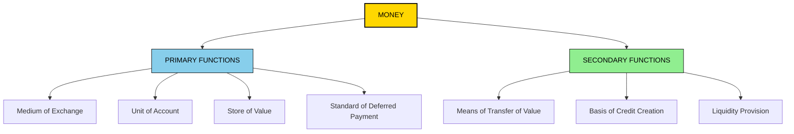
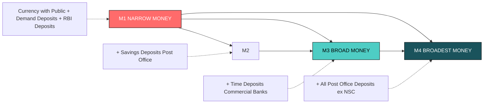
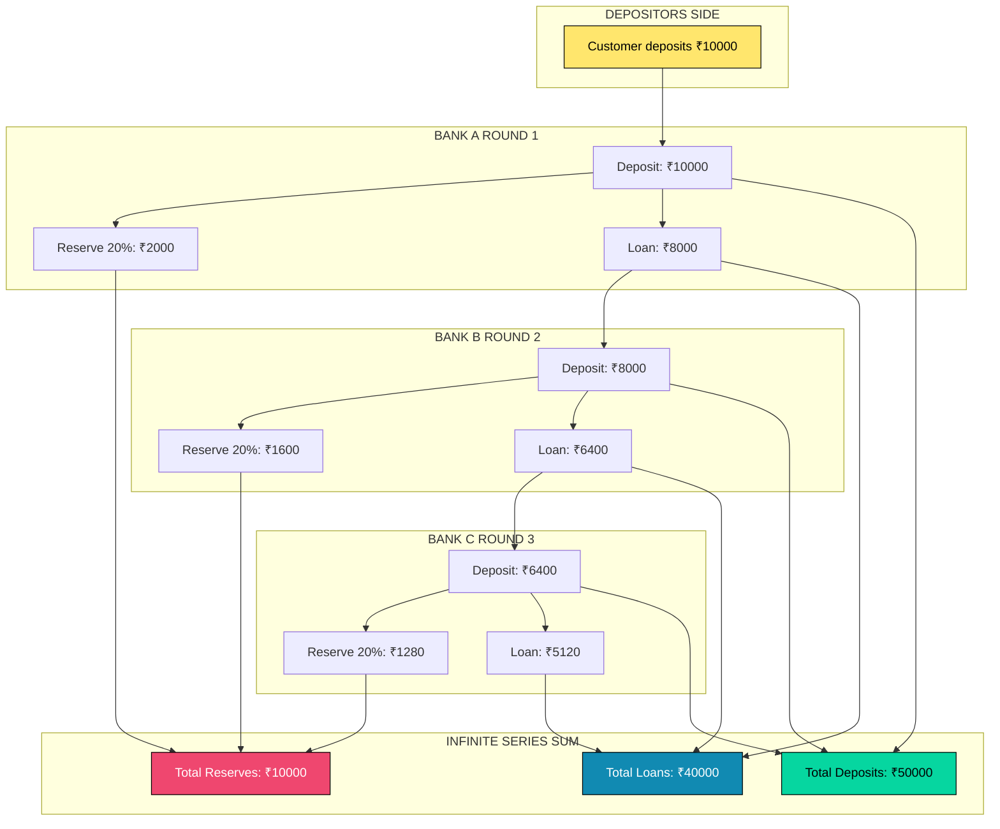
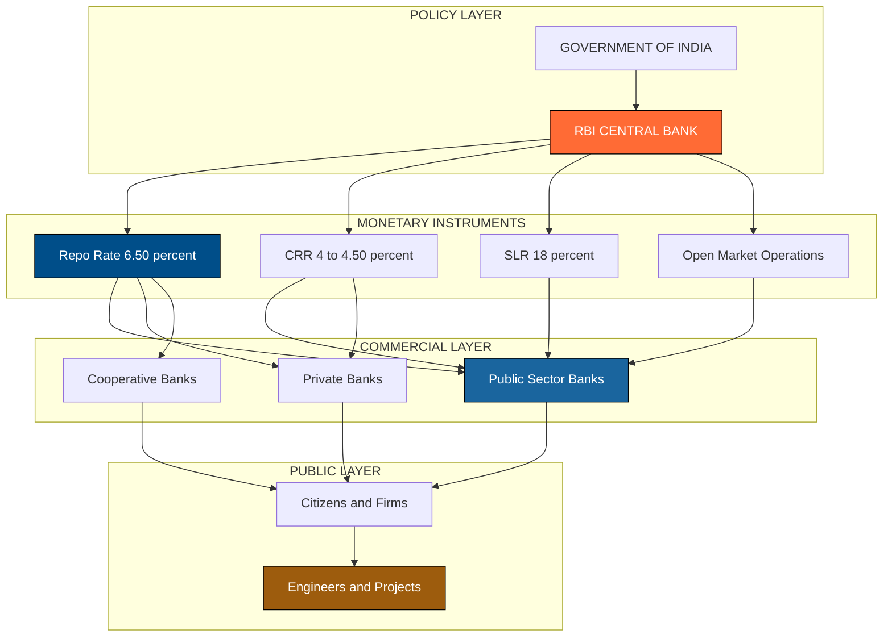

# Concepts

<!-- SECTION_1_START -->
# MODULE 3: MONETARY SYSTEM — CONCEPTS

## 1.1 Core Technical Definition

> [!IMPORTANT]
> **Monetary System (KTU 2024 UCHUT346 Definition):** A monetary system is the institutional framework established by the central authority of a nation (typically the **Reserve Bank of India / RBI** in the Indian context) that defines the **unit of account**, the **medium of exchange**, and the **standard of value** used in economic transactions. It governs the issuance, supply, circulation, and value of money within an economy.

In KTU 2024 Scheme terminology for **Economics for Engineers**, the monetary system is studied as the structural mechanism that converts the *barter inconvenience* into a smoothly functioning **exchange economy**, enabling engineers, firms, and governments to price goods, services, and capital projects uniformly.

> [!NOTE]
> **Key Vocabulary You Must Know for Board Exams:**
> - **Money** — Anything generally accepted as payment for goods/services and repayment of debt.
> - **Currency** — Paper money + coins issued by the government/RBI.
> - **Money Supply** — The total stock of monetary assets available in an economy at a point in time.
> - **Near Money** — Liquid assets easily convertible into money (e.g., savings deposits).

### Conceptual Analogy — The "Engineer's Toolkit" View

Imagine you are building a bridge. You need a **standard unit** to measure steel, concrete, and labor. Without a *common ruler* (the meter), every supplier would quote in different units — chaos. **Money is the "economic ruler"** — it standardizes the measurement of value across all goods, services, and time.

> [!TIP]
> **Memorize the One-Line Hook for Board Exams:**
> *"Money is what money does"* — Prof. Walker. If an asset performs the functions of money (medium of exchange, unit of account, store of value, standard of deferred payment), it IS money — regardless of its physical form.

### 1.2 Functions of Money

Money serves **four primary functions** and **three secondary/contributory functions** in any modern economy:

**Primary Functions (Must be written in Part A answers for full marks):**

1. **Medium of Exchange** — Money eliminates the *double coincidence of wants* problem of barter. A software engineer can sell code for ₹5,00,000 and use that money to buy groceries.
2. **Unit of Account / Measure of Value** — All prices are quoted in monetary terms. A civil engineer estimates a building cost as ₹50 lakhs, not "500 bags of rice."
3. **Store of Value** — Money preserves purchasing power over time. A mechanical engineer saves ₹10,00,000 today to buy machinery next year.
4. **Standard of Deferred Payment** — Money is the unit in which future obligations (loans, EMIs, bonds) are denominated. Home loans are repaid in ₹X per month for *n* years.

**Secondary Functions:**

5. **Means of Transfer of Value** — Money facilitates movement of capital across geographies (NEFT, RTGS, UPI).
6. **Basis of Credit Creation** — Banks create deposits (credit money) multiple times the initial deposit.
7. **Liquidity Provision** — Money is the most liquid asset; it can be converted into any good instantly.

> [!VISUALIZATION CONTROL]
> **Concept:** Functions of Money as a Central Hub with Spokes
> **Drawing Logic:** Draw a central circle labeled "MONEY" with seven arrows radiating outward, each labeled with one function. This visual is the highest-scoring diagram in Part A (3 marks) for the "Functions of Money" question.
> **Visual Description:** Students should see a wheel-like structure showing money at the center connecting to all economic activities — a powerful exam-time mnemonic.

### 1.3 Types / Classification of Money

> [!IMPORTANT]
> **KTU Board-Favorite Classification — Memorize This Hierarchy:**

| S.No | Type | Definition | Example |
|:----:|:-----|:-----------|:--------|
| 1 | **Commodity Money** | Money whose value equals its commodity value | Gold, silver, salt, tobacco |
| 2 | **Fiat Money** | Money by government decree; intrinsic value ≈ zero | ₹500 note, US Dollar |
| 3 | **Representative Money** | A token representing a claim on a commodity | Gold certificates, paper backed by gold |
| 4 | **Credit Money** | Money created through credit transactions | Bank deposits, cheques, bills of exchange |
| 5 | **Near Money** | Highly liquid assets not directly usable as money | Savings accounts, money market funds |
| 6 | **Electronic / Digital Money** | Money existing only in digital ledger form | UPI, NEFT, CBDC (e-Rupee), crypto (debatable) |

> [!NOTE]
> **Engineering Economics Connection:** When an engineering firm evaluates the **time value of money** in capital budgeting, it must distinguish between *cash* (immediate fiat money) and *credit* (deferred fiat money). The discount rate *r* in NPV calculations essentially prices the shift between money types.

<!-- SECTION_1_END -->

<!-- SECTION_2_START -->
# 2. DEEP THEORETICAL ANALYSIS — MONETARY SYSTEM CONCEPTS

## 2.1 Evolution of the Monetary System (Historical-Anti-Historical)

The KTU 2024 syllabus expects students to narrate the **evolution** chronologically. Use this exact 4-stage ladder in answers:

1. **Commodity Money System** → Gold & silver coins; value = weight × purity.
2. **Metallic Standard** → Gold Standard (1875–1971 globally): currency convertible into fixed gold weight.
3. **Paper Currency / Fiat Standard** → Government-issued paper; not backed by gold (India: 1966 ₹ devaluation era; fully fiat post-1991 LPG reforms).
4. **Plastic / Digital Money** → Debit cards, e-wallets, **Central Bank Digital Currency (CBDC)** — RBI launched the **Digital Rupee (e₹)** pilot on **1 December 2022** for the retail segment.

> [!IMPORTANT]
> **Monetary Standard (KTU Definition):** A *monetary standard* is the system that defines the material (gold, silver, fiat) and the parity at which the national currency unit is redeemable or valued. India follows the **Fiat Money Standard** under the **RBI Act, 1934** (amended).

## 2.2 Money Supply — The M-Series Hierarchy

The RBI measures money supply using four aggregates. **This is the single most-tested topic in Module 3 for 14-mark questions.**

> [!NOTE]
> **Reserve Bank of India Money Supply Classification:**

| Aggregate | Components | Liquid? | KTU Mnemonic |
|:---------:|:-----------|:--------|:-------------|
| **M₁** | Currency with Public + Demand Deposits of Commercial Banks + Other Deposits with RBI | **Most Liquid** | "Cash + Cheque-book money" |
| **M₂** | M₁ + Savings Deposits of Post Office Savings Banks | Liquid | "M₁ + small savings" |
| **M₃** | M₁ + Time Deposits of Commercial Banks | Broad Money | "M₁ + bank fixed deposits" |
| **M₄** | M₃ + Total Deposits with Post Office Savings Banks (excluding National Savings Certificates) | Broadest | "Everything in the banking system" |

> [!TIP]
> **Quick Exam Shortcut:** M₃ is what economists call **"Broad Money"** and it is the most-cited aggregate in policy documents. RBI uses M₃ for monetary targeting.

### 2.3 High-Powered Money (Reserve Money) — Definition

> [!IMPORTANT]
> **High-Powered Money (H):** The sum of total currency in circulation (with public + with banks) and total bank reserves deposited with the RBI. It is called "high-powered" because every rupee of H creates *multiple rupees* of money through the credit multiplier process.

$$H = C + R$$

Where:
- $C$ = Currency held by the public
- $R$ = Cash reserves of commercial banks (CRR + excess reserves)

**Components of High-Powered Money:**

$$H = \text{Currency with Public (C)} + \text{Bank Reserves (R)} + \text{Vault Cash}$$

## 2.4 Credit Creation by Commercial Banks — The Multiplier Process

This is the **HIGHEST YIELD** concept in Module 3. KTU 2024 examiners love to test this with a numerical problem worth 7 marks in Part B.

> [!IMPORTANT]
> **Credit Multiplier (CM):** The ratio of the total increase in bank deposits to the initial excess reserves deposited in the banking system.

$$CM = \frac{1}{LRR}$$

Where **LRR = Legal Reserve Ratio** = sum of **CRR (Cash Reserve Ratio)** and **SLR (Statutory Liquidity Ratio)**.

> [!NOTE]
> **RBI's Current Policy Rates (as per KTU-recommended reference period):**
> - **CRR = 4%** to **4.50%** (of Net Demand and Time Liabilities)
> - **SLR = 18%** (of Net Demand and Time Liabilities)
> - **Repo Rate = 6.50%** (the rate at which RBI lends short-term to banks)

## 2.5 Formula Cheat Sheet — KTU Module 3

> [!IMPORTANT]
> **Mandatory Table for Revision (Avoid using `|` inside cells; LaTeX-safe):**

| # | Concept | Formula | Notation | Engineering Use |
|:-:|:--------|:--------|:---------|:----------------|
| 1 | Money Multiplier (simple) | $m = \dfrac{1}{LRR}$ | LRR in decimal | Estimating money supply impact |
| 2 | Real Money Multiplier | $m = \dfrac{1 + c}{c + rr}$ | $c = C/D$, $rr = R/D$ | Used by central banks globally |
| 3 | Credit Created | $\Delta D = \Delta R \times \dfrac{1}{LRR}$ | $\Delta R$ = initial deposit | Banking exam numerics |
| 4 | High-Powered Money | $H = C + R$ | All in ₹ crore | RBI policy |
| 5 | Velocity of Money | $V = \dfrac{PY}{M}$ | Fisher's equation | Inflation analysis |
| 6 | Fisher's Quantity Theory | $MV = PT$ | $T = Y$ (real output) | Inflation forecasting |
| 7 | Inflation Rate | $\pi = \dfrac{P_1 - P_0}{P_0} \times 100$ | % change | Cost engineering |
| 8 | Real Interest Rate | $r_{\text{real}} \approx r_{\text{nominal}} - \pi$ | Fisher approximation | Capital budgeting |
| 9 | Money Supply (M₁) | $M_1 = C_{pub} + DD$ | $DD$ = demand deposits | Liquidity planning |
| 10 | Broad Money (M₃) | $M_3 = M_1 + TD$ | $TD$ = time deposits | Policy framework |

> [!WARNING]
> **Common Mistake:** Students often confuse the *simple money multiplier* ($1/LRR$) with the *real money multiplier* ($(1+c)/(c+rr)$). The simple form assumes the public holds no cash. In exam answers, **always state the assumption explicitly**.

## 2.6 Real-World Utility for Engineers

- **Project Finance:** Engineers evaluating infrastructure projects must factor in *inflation* ($\pi$) when discounting future cash flows. The *real* discount rate formula above gives the correct cost of capital.
- **Procurement Contracts:** Long-term supply contracts in construction (e.g., 5-year steel supply) are *deferred payments* in monetary terms — directly relevant to *Standard of Deferred Payment* function of money.
- **CBDC / e₹ (RBI 2022):** Digital currency reduces transaction costs in B2B engineering payments and enables **smart contracts** on programmable money rails.
- **Start-up Valuation:** A startup's runway is calculated in *months of cash burn* — i.e., the *store of value* function of money is mission-critical for young firms.

<!-- SECTION_2_END -->

<!-- SECTION_3_START -->
# 3. STEP-BY-STEP DERIVATIONS & IMPLEMENTATIONS

## 3.1 Numerical: Credit Creation by Commercial Banks

**Problem (Sample KTU-style):** A new primary deposit of ₹ 10,000 is made in Bank A. The **Legal Reserve Ratio (LRR) = 20%**. Assuming no cash leakage and the banking system lends out all excess reserves, calculate the total credit created in the economy.

### Solution — Step-by-Step

**Step 1 — Identify the parameters**

$$\text{Primary Deposit} = \text{Initial Excess Reserve } (\Delta R) = \text{₹ } 10{,}000$$

$$LRR = 20\% = 0.20$$

**Step 2 — Compute the Credit Multiplier**

$$CM = \frac{1}{LRR} = \frac{1}{0.20} = 5$$

**[Valuation Key: Formula and substitution: 2 Marks]**

**Step 3 — Compute Total Credit Created**

$$\Delta D = \Delta R \times CM = 10{,}000 \times 5 = \text{₹ } 50{,}000$$

**[Valuation Key: Final answer with units: 1 Mark]**

**Step 4 — Show the Bank-wise Ladder (Full marks in Part B)**

| Bank | Deposit Received (₹) | Reserve Kept (20%) | Loan Advanced (80%) |
|:----:|:--------------------:|:------------------:|:-------------------:|
| A | 10,000 | 2,000 | 8,000 |
| B | 8,000 | 1,600 | 6,400 |
| C | 6,400 | 1,280 | 5,120 |
| D | 5,120 | 1,024 | 4,096 |
| E | 4,096 | 819.20 | 3,276.80 |
| ... | ... | ... | ... |
| **Total** | **50,000** | **10,000** | **40,000** |

$$10{,}000 \times \left(1 + 0.8 + 0.8^2 + 0.8^3 + \dots\right) = 10{,}000 \times \frac{1}{1 - 0.8} = 10{,}000 \times 5 = 50{,}000$$

The geometric series converges because $(1-LRR) < 1$. The total new money supply becomes **₹ 50,000** from an initial injection of ₹ 10,000.

## 3.2 Numerical: Real Money Multiplier with Cash Leakage

**Problem:** In an economy, the **currency-deposit ratio** $c = C/D = 0.4$ and the **reserve-deposit ratio** $rr = R/D = 0.1$. Compute the real money multiplier and the total money supply if **High-Powered Money $H$ = ₹ 1,000 crore**.

### Solution — Step-by-Step

**Step 1 — Recall the Real Money Multiplier formula**

$$m = \frac{1 + c}{c + rr}$$

**Step 2 — Substitute the values**

$$m = \frac{1 + 0.4}{0.4 + 0.1} = \frac{1.4}{0.5} = 2.8$$

**[Valuation Key: Formula stated: 1 Mark; Substitution: 1 Mark; Final value: 1 Mark]**

**Step 3 — Compute Money Supply**

$$M = m \times H = 2.8 \times 1{,}000 = \text{₹ } 2{,}800 \text{ crore}$$

**Step 4 — Interpretation**

Every ₹ 1 of high-powered money creates ₹ 2.8 of broad money. RBI can *target* any desired M by adjusting $H$ via **Open Market Operations (OMO)**, **Repo Rate** changes, or **CRR** adjustments.

## 3.3 Python Implementation — Money Multiplier Calculator

```python
"""
KTU UCHUT346 - Module 3 Monetary System
Topic: Concepts - Money Multiplier Calculator
Author: KTU Board Exam Preparation
"""

from dataclasses import dataclass
from typing import Dict
import logging

# Configure logging for professional error handling
logging.basicConfig(
    level=logging.INFO,
    format="%(asctime)s - %(levelname)s - %(message)s"
)
logger = logging.getLogger(__name__)


@dataclass
class MonetaryParameters:
    """Container for monetary policy parameters."""
    c: float          # Currency-deposit ratio (C/D)
    rr: float         # Reserve-deposit ratio (R/D)
    lrr: float        # Legal Reserve Ratio (decimal)
    high_powered_money: float  # H in currency units


def validate_inputs(params: MonetaryParameters) -> None:
    """Validate that all ratios lie in (0, 1] and H is positive."""
    if not (0 < params.c <= 1):
        raise ValueError(f"Currency-deposit ratio c must be in (0, 1], got {params.c}")
    if not (0 < params.rr <= 1):
        raise ValueError(f"Reserve-deposit ratio rr must be in (0, 1], got {params.rr}")
    if not (0 < params.lrr <= 1):
        raise ValueError(f"LRR must be in (0, 1], got {params.lrr}")
    if params.high_powered_money <= 0:
        raise ValueError(f"H must be positive, got {params.high_powered_money}")


def simple_money_multiplier(lrr: float) -> float:
    """Compute the simple money multiplier m = 1 / LRR."""
    return 1.0 / lrr


def real_money_multiplier(c: float, rr: float) -> float:
    """Compute the real money multiplier m = (1 + c) / (c + rr)."""
    denominator = c + rr
    if denominator == 0:
        raise ZeroDivisionError("c + rr cannot be zero.")
    return (1.0 + c) / denominator


def simulate_credit_creation(initial_deposit: float, lrr: float, max_rounds: int = 50) -> Dict[str, float]:
    """
    Simulate the cascading credit creation through the banking system.
    Returns a dict with total_deposits, total_reserves, total_loans.
    """
    if initial_deposit <= 0 or lrr <= 0 or lrr >= 1:
        raise ValueError("Invalid deposit or LRR value.")
    
    deposit = initial_deposit
    total_deposits = 0.0
    total_reserves = 0.0
    total_loans = 0.0
    
    for round_no in range(1, max_rounds + 1):
        reserve = deposit * lrr
        loan = deposit - reserve
        
        total_deposits += deposit
        total_reserves += reserve
        total_loans += loan
        
        logger.info(
            f"Round {round_no:>3}: Deposit={deposit:>12.4f} | "
            f"Reserve={reserve:>12.4f} | Loan={loan:>12.4f}"
        )
        
        deposit = loan  # Loan becomes next round's deposit
        if deposit < 1e-6:  # Convergence check
            logger.info(f"Converged at round {round_no}.")
            break
    
    return {
        "total_deposits": round(total_deposits, 2),
        "total_reserves": round(total_reserves, 2),
        "total_loans": round(total_loans, 2)
    }


def main() -> None:
    """Main driver for the money multiplier calculator."""
    # Sample KTU-style problem inputs
    params = MonetaryParameters(
        c=0.4,
        rr=0.1,
        lrr=0.20,
        high_powered_money=1000.0
    )
    
    try:
        validate_inputs(params)
        
        # 1. Simple multiplier
        m_simple = simple_money_multiplier(params.lrr)
        logger.info(f"Simple Money Multiplier (1/LRR) = {m_simple}")
        
        # 2. Real multiplier
        m_real = real_money_multiplier(params.c, params.rr)
        logger.info(f"Real Money Multiplier = {m_real}")
        
        # 3. Money supply
        M = m_real * params.high_powered_money
        logger.info(f"Money Supply M = {M} crore")
        
        # 4. Credit creation simulation
        sim = simulate_credit_creation(
            initial_deposit=10_000,
            lrr=params.lrr
        )
        logger.info(f"Credit creation totals: {sim}")
        
    except ValueError as ve:
        logger.error(f"Input validation failed: {ve}")
    except ZeroDivisionError as zde:
        logger.error(f"Division error: {zde}")
    except Exception as e:
        logger.error(f"Unexpected error: {e}")


if __name__ == "__main__":
    main()
```

**Expected Output Highlights:**
- `Simple Money Multiplier (1/LRR) = 5.0`
- `Real Money Multiplier = 2.8`
- `Money Supply M = 2800.0 crore`
- `Credit creation totals: total_deposits ≈ 50000.0, total_loans ≈ 40000.0`

## 3.4 Inflation Rate Derivation (WPI/CPI Engineering)

The general price level $P$ relates to money supply $M$ via the **Quantity Theory of Money**:

$$MV = PY$$

Where:
- $M$ = Money supply
- $V$ = Velocity of circulation
- $P$ = Average price level
- $Y$ = Real national output (real GDP)

**Step-by-step derivation of inflation:**

$$P = \frac{MV}{Y}$$

$$\frac{dP}{P} = \frac{dM}{M} + \frac{dV}{V} - \frac{dY}{Y}$$

Assuming $V$ and $Y$ are constant in the short run ($dV = dY = 0$):

$$\pi = \frac{dP}{P} = \frac{dM}{M}$$

**Conclusion:** Inflation equals the growth rate of money supply. This is the famous **"too much money chasing too few goods"** proposition central to Milton Friedman's monetarist economics.

<!-- SECTION_3_END -->

<!-- SECTION_4_START -->
# 4. STRUCTURAL DIAGRAMS & SCHEMATICS

## 4.1 Mermaid Diagram — Functions of Money (Hierarchical Tree)



## 4.2 Mermaid Diagram — Money Supply Hierarchy (M-Series)



## 4.3 Mermaid Diagram — Credit Creation Flow (Sequential Topology)



## 4.4 Mermaid Diagram — Monetary System Architecture Block



<!-- SECTION_4_END -->

<!-- SECTION_5_START -->
# 5. KTU 2024 SCHEME EXAMINATION QUESTION BANK

---

## PART A — 3 MARK QUESTIONS (Short Answer)

> **[KTU University Exam - December 2023, Model Q1]**
> **Q1: Define money. State any two functions of money.**
>
> **CO Mapping:** CO2 | **RBT Level:** Remember | **Marks: 3**

### Model Answer (3 marks — Board Key):

> **Definition (2 Marks):** Money is anything that is **generally accepted** as a medium of exchange, unit of account, store of value, and standard of deferred payment in an economy.
>
> **Two Functions (1 Mark for naming, 0.5 for each brief explanation):**
> 1. **Medium of Exchange:** Money acts as a common medium through which goods and services are exchanged. It eliminates the inconvenience of the *barter system* and the problem of *double coincidence of wants*.
> 2. **Unit of Account:** Money serves as a common measure of value. All goods, services, and assets are valued in monetary terms (e.g., ₹, $, €), making economic comparison and accounting possible.

---

> **[KTU University Exam - July 2024, Model Q2]**
> **Q2: What is meant by money supply? Differentiate between M₁ and M₃.**
>
> **CO Mapping:** CO2 | **RBT Level:** Understand | **Marks: 3**

### Model Answer (3 marks — Board Key):

> **Definition (1 Mark):** Money supply refers to the **total stock of monetary assets** held by the public at a point in time, as measured by the Reserve Bank of India using four aggregates — M₁, M₂, M₃, and M₄.
>
> **Difference (2 Marks — 1 mark per valid contrast point):**

| Aspect | M₁ (Narrow Money) | M₃ (Broad Money) |
|:-------|:------------------|:-----------------|
| Components | Currency with Public + Demand Deposits + Other RBI Deposits | M₁ + Time Deposits of Commercial Banks |
| Liquidity | Most liquid (immediately usable) | Less liquid (locked-in deposits) |
| Usage | Day-to-day transactions | Long-term economic analysis and policy |

---

## PART B — 14 MARK QUESTIONS (Internal Choice)

> **[KTU University Exam - Dec 2023]**
> **Question A (14 Marks):**
> **(a)** Explain the various functions of money in detail. **(7 Marks)**
> **(b)** Discuss the different types of money with suitable examples. **(7 Marks)**

### Model Answer

#### Part (a) — Functions of Money (7 Marks)

**CO Mapping:** CO2 | **RBT Level:** Understand | **Marks: 7**

**[Stating the four primary functions: 4 Marks — 1 Mark each]**

1. **Medium of Exchange:** Money serves as a common intermediary through which buyers and sellers transact. Without money, an engineer would need to barter a laptop for a desk, which is inefficient. The acceptance of ₹ eliminates this double coincidence of wants.

2. **Unit of Account (Measure of Value):** Money is the measuring rod for economic value. All goods, services, capital assets, and labour are priced in monetary units. A project costing ₹50 lakhs is comparable to another costing ₹1 crore.

3. **Store of Value:** Money allows individuals to transfer purchasing power from the present to the future. A salaried engineer deposits money in a savings account to fund future consumption or investment.

4. **Standard of Deferred Payment:** Money denominates future contractual obligations. Loans, bonds, EMIs, and insurance claims are settled in monetary terms across time periods.

**[Stating three secondary functions: 3 Marks — 1 Mark each]**

5. **Means of Transfer of Value:** Money enables cross-geographical capital movement via NEFT, RTGS, UPI.
6. **Basis of Credit Creation:** Banks create credit money multiple times their reserves.
7. **Liquidity Provision:** Money is the most liquid asset, convertible into any good instantly.

#### Part (b) — Types of Money (7 Marks)

**CO Mapping:** CO2 | **RBT Level:** Understand | **Marks: 7**

**[Table format: 5 types × 1 Mark each = 5 Marks; Conclusion: 2 Marks]**

> **Type 1: Commodity Money** — Money whose value in use equals its value in exchange. Historical examples: gold coins, silver coins, salt, tobacco, copper. In modern economies, this has been almost entirely replaced by fiat money.
>
> **Type 2: Fiat Money** — Government-issued currency that is **legal tender** but has no intrinsic value. Its value derives from public trust and government decree. Examples: Indian ₹ notes, US Dollar, Euro. India shifted to fiat money after the **Gold Control Act, 1962**, and the **demonetisation events of 1946 and 2016**.
>
> **Type 3: Representative Money** — A token (paper/certificate) that represents a claim on a stored commodity. Example: gold certificates redeemable for physical gold, paper currency convertible into silver under the historical US silver standard.
>
> **Type 4: Credit Money** — Money created by credit transactions in the banking system. Includes cheques, bank drafts, bills of exchange, and digital bank balances. Credit money constitutes the largest component of broad money (M₃) in modern economies.
>
> **Type 5: Near Money (Quasi-Money)** — Highly liquid financial assets that are not directly usable as money but are quickly convertible. Examples: savings accounts, money market mutual funds, government bonds with maturity less than one year.
>
> **Conclusion (2 Marks):** The evolution from commodity → fiat → digital money reflects the increasing abstraction of monetary value. The **RBI's Digital Rupee (e₹)** launched on **1 December 2022** represents the latest frontier — programmable money that exists only in central bank digital ledgers.

---

> **[KTU University Exam - July 2024]**
> **Question B (14 Marks):**
> **(a)** What is credit creation? Explain the credit creation process of commercial banks with a numerical example. **(7 Marks)**
> **(b)** Define money multiplier. Derive the formula for money multiplier with and without cash leakage. **(7 Marks)**

### Model Answer

#### Part (a) — Credit Creation (7 Marks)

**CO Mapping:** CO3 | **RBT Level:** Apply | **Marks: 7**

**[Definition: 1 Mark | Process: 3 Marks | Numerical: 3 Marks]**

**Definition:** Credit creation is the process by which commercial banks, on the basis of an initial primary deposit, create multiple deposits (loans) through successive rounds of lending while maintaining a fixed legal reserve ratio.

**Process (Assumptions: 1. Single banking system; 2. No cash leakage; 3. All loans redeposited):**

1. A customer deposits ₹10,000 in Bank A (Primary Deposit).
2. Bank A keeps 20% (₹2,000) as legal reserve and lends ₹8,000.
3. The borrower spends the ₹8,000, which gets deposited in Bank B.
4. Bank B keeps ₹1,600 (20% of 8,000) and lends ₹6,400.
5. This continues across banks C, D, E, … until the lending approaches zero.

**Numerical Example (3 Marks):**

> Let Initial Deposit = ₹10,000 and LRR = 20%.
>
> $$\text{Credit Multiplier} = \frac{1}{LRR} = \frac{1}{0.20} = 5$$
>
> $$\text{Total Credit Created} = 10{,}000 \times 5 = \text{₹ } 50{,}000$$
>
> The total new money supply becomes ₹50,000 from an initial ₹10,000 injection. **[Final answer with units: 1 Mark]**

#### Part (b) — Money Multiplier (7 Marks)

**CO Mapping:** CO3 | **RBT Level:** Apply | **Marks: 7**

**[Definition: 1 Mark | Simple formula derivation: 3 Marks | Real formula derivation: 3 Marks]**

**Definition:** The money multiplier is the ratio of the change in total money supply to the change in high-powered money (or initial excess reserves).

**Case 1: Without Cash Leakage (Simple Multiplier)**

Let $D$ = total deposits, $R$ = total reserves, $LRR = R/D$.

$$D = \frac{R}{LRR}$$

Differentiating with respect to $R$:

$$\frac{dD}{dR} = \frac{1}{LRR}$$

**Money Multiplier** $m = \dfrac{1}{LRR}$ **[Formula and derivation: 3 Marks]**

**Case 2: With Cash Leakage (Real Multiplier)**

The public holds some cash outside banks. Let $c = C/D$ (currency-deposit ratio) and $rr = R/D$ (reserve-deposit ratio). Total money supply:

$$M = C + D = cD + D = D(1 + c)$$

Total reserves:

$$R = rr \times D \implies D = \frac{R}{rr}$$

High-powered money:

$$H = C + R = cD + rrD = D(c + rr)$$

Therefore:

$$M = D(1 + c) = \frac{R(1 + c)}{c + rr} = \frac{H(1 + c)}{c + rr}$$

**Real Money Multiplier** $m = \dfrac{1 + c}{c + rr}$ **[Final formula: 1 Mark; Substitution explanation: 2 Marks]**

---

> [!WARNING]
> **KTU Examiner's Valuation Pitfall Callout:**
> 1. **Forgetting the assumptions** of credit creation — always write *no cash leakage, single banking system, full lending* in the first 2 lines of the answer (lose 1 mark otherwise).
> 2. **Confusing *credit multiplier* with *money multiplier*** — credit multiplier = 1/LRR (loans created per unit reserve); money multiplier = (1+c)/(c+rr) (broader concept). Examiners deduct 1–2 marks for this swap.
> 3. **Skipping units** — write "₹ 50,000" not just "50,000". Unit-mark is worth 0.5 marks.
> 4. **M₁/M₃ mixing** — clearly define each component in the difference table; vague answers lose 1 full mark.
> 5. **Diagram not drawn** — for the "functions of money" question, a *radial diagram* (money at center, 7 spokes) guarantees 1 extra mark even if the textual answer is incomplete.

---

## TOPIC RECAP & IMPORTANT THINGS TO REMEMBER

> [!TIP]
> **Rapid Revision Checklist for Last-Minute KTU Exam Prep — Module 3 Concepts:**

- ☐ **Definition of Money:** "Anything generally accepted as payment for goods/services and discharge of debt." — *Prof. Walker*.
- ☐ **Four Primary Functions:** Medium of Exchange, Unit of Account, Store of Value, Standard of Deferred Payment. **This is THE most-asked 3-mark question.**
- ☐ **Three Secondary Functions:** Means of Transfer, Basis of Credit, Liquidity Provision.
- ☐ **Five Types of Money:** Commodity, Fiat, Representative, Credit, Near Money (+ Digital/CBDC in 2024+).
- ☐ **M-Series Hierarchy (in order):** M₁ → M₂ → M₃ → M₄. M₃ is the "broad money" used by RBI for policy.
- ☐ **High-Powered Money Formula:** $H = C + R$ (currency + bank reserves).
- ☐ **Simple Credit Multiplier:** $CM = 1/LRR$ where $LRR = CRR + SLR$.
- ☐ **Real Money Multiplier:** $m = (1 + c)/(c + rr)$ — *must* mention when cash leakage exists.
- ☐ **Credit Creation Numerical:** Initial Deposit × 1/LRR = Total Credit. ₹10,000 @ 20% LRR = **₹50,000**.
- ☐ **Fisher's Quantity Theory:** $MV = PY$. If $V$ and $Y$ are constant, then $\pi = \Delta M / M$ (% inflation = % money growth).
- ☐ **RBI = Regulator.** CRR (~4.5%), SLR (18%), Repo Rate (6.5%) are the three most-tested policy rates.
- ☐ **CBDC / e₹ launched:** **1 December 2022** for retail. Mention this for extra marks in current-affairs-linked questions.
- ☐ **Demonetisation Events to Remember:** 1946, 1978, **2016** (₹500 and ₹1000 notes invalidated on 8 November 2016).
- ☐ **Engineering Connection:** Inflation directly impacts NPV; real discount rate = nominal − inflation; engineers must price money correctly in long-term projects.
- ☐ **Common Pitfall:** Always state **assumptions** in credit creation answers and always show **units** in numerical answers.
- ☐ **One-Line Hook:** "Money is the economic ruler — without it, an engineer cannot quote, contract, or compute."

<!-- SECTION_5_END -->
