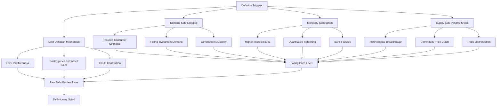
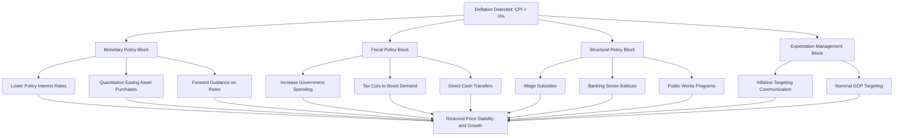
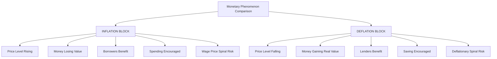

# Deflation

<!-- SECTION_1_START -->

# 🪙 DEFLATION: Core Technical Definition & Intuitive Overview

## 📘 Formal Academic Definition (KTU 2024 Scheme Terminology)

> [!IMPORTANT]
> **Deflation** is a sustained and generalized decline in the general price level of goods and services in an economy over a period of time, typically measured as a **negative inflation rate** when the Consumer Price Index (CPI) or Wholesale Price Index (WPI) falls below zero across two consecutive quarters.

In strict KTU 2024 monetary economics vocabulary:

> **Deflation = Negative Inflation Rate = Real Purchasing Power Appreciation of Money**

Mathematically, if we denote the price level at time $t$ as $P_t$, deflation occurs when:

$$P_{t} < P_{t-1}$$

Which translates to a deflation rate $D$ given by:

$$D = \left(\frac{P_{t} - P_{t-1}}{P_{t-1}}\right) \times 100 < 0$$

The **threshold value** that separates inflation from deflation in standard KTU macroeconomic modules is **0%** (zero percent change in price index).

---

## 🧠 Conceptual Analogy / Intuition

> [!TIP]
> **Analogy: The "Reverse Balloon" Effect**
>
> Imagine a **balloon** representing the **economy** and the **air inside it** as the **money supply** circulating in the system.
>
> - **Inflation** = The balloon inflates → each unit of money buys *less* (more money chasing the same goods).
> - **Deflation** = The balloon deflates → each unit of money buys *more* (goods become cheaper, money becomes *stronger* in real terms).
>
> While *cheaper goods* sounds wonderful to a consumer, the **deeper reality** is that deflation signals an economy where **demand is collapsing**, businesses earn less revenue, workers get laid off, and the very money you hold becomes *worth more only because no one is willing to spend it*.

### 🏠 Real-World Intuition
Think of a Kerala-based engineering graduate who just got placed with a ₹6 LPA offer. In a deflationary economy, his fixed salary of ₹50,000/month will buy *more* rice, mobile data, and bus tickets next year. Sounds great? But his company might cut hiring, freeze bonuses, or even lay off existing staff because **revenues are falling**. The same salary buys more goods but **job security evaporates**.

---

## 🔢 Physical Constants & Standard Metrics (Bolded for Recall)

> [!NOTE]
> - **Reserve Bank of India (RBI)** Inflation Target Band: **2% to 6%** with **4%** as the central target under the Monetary Policy Framework Agreement (2016).
> - Any print of inflation rate **below 0%** is officially classified as **deflation**.
> - **Headline Deflation** vs **Core Deflation**: Headline includes food & fuel; core excludes volatile components.
> - **Mild / Moderate Deflation**: Deflation rate between **-0.1% and -2%** annually.
> - **Severe Deflation (Deflationary Spiral)**: Deflation rate **exceeding -3%** sustained for multiple quarters, often accompanied by negative GDP growth.

---

## 📊 GeoGebra / Desmos Visualization

> [!VISUALIZATION CONTROL]
> **Concept:** Price Level Time-Series Graph showing Inflation → Disinflation → Deflation Transition
>
> **Desmos Input Equations / Data Points:**
>
> * `f_1(x) = 100 + 2x` (Inflationary phase — year 0 to 3)
> * `f_2(x) = 106 - 1.5(x-3)` (Disinflationary phase — year 3 to 5)
> * `f_3(x) = 103 - 3(x-5)` (Deflationary phase — year 5 to 8)
> * `y = 100` (Reference baseline price level)
>
> **Visual Description:** A piecewise linear curve on a 2D Cartesian plane where the x-axis represents time (years) and the y-axis represents the Consumer Price Index (CPI) value. The line **rises gently** in the inflationary segment, **flattens** at the peak (year 3), then **descends below the reference line** $y = 100$ between years 6 and 8 — the descent below the baseline is the **deflation zone**. Students should observe that the slope is *negative* in this segment, which mathematically represents a negative inflation rate.

---

## 📚 KTU 2024 Syllabus Positioning

> [!IMPORTANT]
> This topic falls under **Module 3: Monetary System** in the UCHUT346 (Economics for Engineers) course. Deflation is treated as a **macroeconomic disequilibrium** along with inflation, and engineers must understand its impact on:
> - **Project NPV calculations** (deflators for future cash flows)
> - **Real vs Nominal cost estimation** in capital budgeting
> - **Procurement strategy** for long-gestation engineering projects
> - **Wage and contract negotiation** in deflationary cycles

<!-- SECTION_1_END -->

<!-- SECTION_2_START -->

# 🧮 DEEP THEORETICAL ANALYSIS & KTU HIGH-YIELD FORMULA SHEET

## 🔬 Break-Down: The Operational Mechanics of Deflation

### ⚙️ Step 1 — Primary Drivers (Why Deflation Occurs)

> [!NOTE]
> Deflation is fundamentally a **Demand-Side Collapse** phenomenon, but it can also originate from the **Supply Side** under specific conditions. The KTU 2024 module groups the causes under four heads:

**1. Demand-Pull Deflation (Demand Collapse)**
- Reduced consumer spending (households defer purchases expecting lower prices tomorrow)
- Fall in investment demand due to negative business sentiment
- Government austerity (reduced public expenditure)
- Tax hikes reducing disposable income

**2. Monetary Contraction (Money Supply Shrinks)**
- Central bank raises interest rates → credit tightens → fewer loans → less money in circulation
- Quantitative tightening (QT) — central bank sells bonds instead of buying them
- Bank failures (like the 1930s US bank runs) destroy money multiplier effect

**3. Supply-Side Deflation (Positive Shock Variant)**
- Technological breakthroughs drastically reduce production costs (e.g., solar panel costs)
- Global commodity price crashes (oil price crash of 2014–2016, 2020)
- Trade liberalization increasing import competition
- Productivity gains through automation

**4. Debt Deflation (Fisher's Hypothesis)**
- Irving Fisher's 1933 theory: Over-indebtedness forces mass selling to repay debts
- Falling prices → real value of debt rises → bankruptcies increase → more selling → further price falls
- This creates a self-reinforcing **deflationary spiral**

---

### ⚙️ Step 2 — The Deflationary Spiral Mechanism (Why It's Dangerous)

> [!IMPORTANT]
> **Fisher's Debt-Deflation Spiral — The Vicious Cycle**
>
> 1. Initial price fall → real value of outstanding debt **increases**
> 2. Debtors (businesses/individuals) forced to sell assets/lay off workers to service debt
> 3. Increased selling depresses prices further
> 4. Bankruptcies mount → bank balance sheets weaken → credit contracts
> 5. Reduced credit → reduced spending → further demand collapse
> 6. **Cycle repeats and accelerates** → unemployment rises → economy enters depression

The mathematical structure of this loop, in simplified form:

$$P_{t+1} = P_t - \alpha \cdot D_t$$

Where:
- $P_t$ = Price level at time $t$
- $\alpha$ = Sensitivity coefficient (how strongly debt burden responds to price changes)
- $D_t$ = Outstanding real debt

---

### ⚙️ Step 3 — Real-World Effects on an Engineering Economy

| Effect Domain | Mechanism | KTU-Relevant Implication |
|---|---|---|
| **Real Wages** | Nominal wages sticky downward; real wages rise as prices fall | Hiring becomes expensive for firms |
| **Real Debt Burden** | Fixed-amount loans grow heavier in real terms | Corporate loan defaults spike |
| **Investment** | IRR of new projects falls; projects become unviable | Capital expenditure freezes |
| **Consumer Behavior** | "Wait and see" mentality — purchases deferred | Aggregate Demand (AD) curve shifts left |
| **Bankruptcies** | Falling revenues + rising real debt = insolvency | Layoffs, asset fire-sales |
| **Real Interest Rate** | $r_{real} = i_{nominal} - \pi$ ; with $\pi < 0$, real rate becomes *very high* | Borrowing collapses |

---

## 📐 KTU Formula Sheet / Cheat Sheet

> [!NOTE]
> **The following table consolidates every formula required for solving KTU board exam problems on Deflation.**

| # | Formula / Concept | LaTeX Expression | Variables & Units | Application in KTU Problems |
|---|---|---|---|---|
| 1 | **Deflation Rate** | $D = \left(\dfrac{P_t - P_{t-1}}{P_{t-1}}\right) \times 100$ | $P_t$ = Current Price Index, $P_{t-1}$ = Previous Price Index | Direct computation when 2 CPI values are given |
| 2 | **Deflator for Real Values** | $\text{Real Value} = \dfrac{\text{Nominal Value}}{\text{Deflator}} \times 100$ | Deflator in index points (base = 100) | Converting nominal cash flows to real terms in NPV |
| 3 | **Real Interest Rate (Fisher)** | $r = i - \pi$ | $r$ = real rate, $i$ = nominal rate, $\pi$ = inflation rate | In deflation, $\pi < 0$ so $r > i$ — borrowing cost rises |
| 4 | **Quantity Theory of Money** | $M \cdot V = P \cdot Y$ | $M$ = Money supply, $V$ = Velocity, $P$ = Price level, $Y$ = Real GDP | Explains how $M \downarrow$ causes $P \downarrow$ (deflation) |
| 5 | **Cumulative Deflation** | $P_{total} = P_0 \cdot \prod_{t=1}^{n}(1 + \pi_t)$ | $\pi_t$ = annual deflation rate (negative) | Multi-year price level calculation |
| 6 | **Purchasing Power Index** | $\text{PPI} = \dfrac{100}{P_t/P_0}$ | $P_t$ = current price, $P_0$ = base price | Money's real worth when prices fall |
| 7 | **GDP Deflator** | $\text{GDP Deflator} = \dfrac{\text{Nominal GDP}}{\text{Real GDP}} \times 100$ | All in ₹ Crore | Indicates economy-wide price level changes |
| 8 | **Effective Real Wage Growth** | $\Delta w_{real} \approx \Delta w_{nominal} - \pi$ | All in % | Worker purchasing power change |

---

## 🏗️ Real-World Utility in Engineering & Computer Science

> [!TIP]
> **Why should an engineering student in Kerala care about deflation?**
>
> 1. **Long-Gestation Infrastructure Projects** (NH-66 expansion, Kochi Metro Phase II): Project cost estimates are done in *real terms* using deflators. If deflation hits, *real* project costs rise even if nominal budgets stay constant.
> 2. **Software/SaaS Pricing Models**: SaaS companies (like Freshworks, Zoho) use multi-year contracts. Deflation erodes their pricing power.
> 3. **Procurement in Manufacturing**: Kerala-based cashew or electronics exporters face deflationary pressures in global markets, squeezing margins.
> 4. **Loan Amortization**: Engineers taking home loans (₹40–80 Lakh) see their *real* loan burden rise in deflation, even with the same EMI.
> 5. **Capital Budgeting**: NPV calculations must use a *deflation-adjusted discount rate* to avoid overestimating project viability.

<!-- SECTION_2_END -->

<!-- SECTION_3_START -->

# 🔢 STEP-BY-STEP DERIVATIONS, NUMERICAL WORKED EXAMPLES & CODE IMPLEMENTATION

---

## 📘 Derivation 1: The Deflation Rate Formula from First Principles

> [!NOTE]
> **Starting Point:** We have a Consumer Price Index (CPI) value at time $t-1$ and a new CPI at time $t$. We want to measure the rate of price change.

**Step 1: Define the absolute change in price level**

$$\Delta P = P_t - P_{t-1}$$

**Step 2: Express this as a fraction of the original price level (relative change)**

$$\text{Relative Price Change} = \frac{P_t - P_{t-1}}{P_{t-1}}$$

**Step 3: Convert to percentage by multiplying by 100**

$$D = \left(\frac{P_t - P_{t-1}}{P_{t-1}}\right) \times 100$$

**Step 4: Interpret the sign**
- If $D > 0$ → **Inflation** occurred
- If $D = 0$ → **Price stability** (no change)
- If $D < 0$ → **Deflation** occurred ✅

**Step 5: Magnitude interpretation**
- $\vert D \vert \leq 2$ → Mild deflation
- $2 < \vert D \vert \leq 5$ → Moderate deflation
- $\vert D \vert > 5$ → Severe deflation (depression-level)

---

## 📗 Worked Numerical Example 1: Basic Deflation Rate Calculation

> [!IMPORTANT]
> **Problem:** The CPI of a country was **150** in 2022 and fell to **144** in 2023. Calculate the deflation rate and interpret the result.

**Step 1: Identify the variables**

$$P_{2022} = 150, \quad P_{2023} = 144$$

**Step 2: Substitute into the deflation rate formula**

$$D = \left(\frac{144 - 150}{150}\right) \times 100$$

**Step 3: Compute the numerator**

$$144 - 150 = -6$$

**Step 4: Divide by the base value**

$$\frac{-6}{150} = -0.04$$

**Step 5: Multiply by 100 to express as a percentage**

$$D = -0.04 \times 100 = -4\%$$

**Step 6: Interpretation**

$$\boxed{D = -4\% \text{ (Moderate Deflation)}}$$

The general price level fell by **4%** in 2023. Each ₹100 worth of goods in 2022 costs ₹96 in 2023 in nominal terms, but ₹100 in real terms.

> **[Valuation Key: 1 mark for substitution, 1 mark for computation, 1 mark for interpretation]**

---

## 📕 Worked Numerical Example 2: Real Wage Calculation in a Deflationary Economy

> [!NOTE]
> **Problem:** A KTU engineering graduate earns a nominal salary of ₹6,00,000 per annum in 2022. The economy experienced a deflation of 3% in 2023, and his nominal salary remained the same. Calculate the percentage change in his **real income**.

**Step 1: Recall the real wage growth formula**

$$\Delta w_{real} \approx \Delta w_{nominal} - \pi$$

**Step 2: Identify the values**

- $\Delta w_{nominal} = 0\%$ (salary unchanged)
- $\pi = -3\%$ (deflation, so inflation rate is negative)

**Step 3: Substitute**

$$\Delta w_{real} = 0 - (-3) = +3\%$$

**Step 4: Interpretation**

$$\boxed{\Delta w_{real} = +3\%}$$

Even though his **nominal** income did not change, his **real purchasing power** increased by 3% because every rupee buys more goods now. The graduate can purchase ₹6,00,000 × 1.03 = **₹6,18,000 worth of goods** at 2022 prices, with the same nominal income.

---

## 📙 Worked Numerical Example 3: Multi-Year Cumulative Deflation

> [!NOTE]
> **Problem:** The price index was 200 in 2020. Deflation was 2% in 2021 and 3% in 2022. Find the price index at the end of 2022.

**Step 1: Apply the cumulative price formula**

$$P_{2022} = P_{2020} \cdot (1 + \pi_1) \cdot (1 + \pi_2)$$

**Step 2: Substitute values**

$$P_{2022} = 200 \cdot (1 - 0.02) \cdot (1 - 0.03)$$

**Step 3: Compute each factor**

$$P_{2022} = 200 \cdot 0.98 \cdot 0.97$$

**Step 4: Final calculation**

$$P_{2022} = 200 \cdot 0.9506 = 190.12$$

$$\boxed{P_{2022} \approx 190.12}$$

The price level has fallen from 200 to 190.12, a **cumulative deflation of 4.94%** over two years.

---

## 💻 Python Code Implementation: Deflation Tracker & Time-Series Analyzer

```python
"""
Deflation Rate Tracker and Analyzer
Course: UCHUT346 - Economics for Engineers
Module 3 - Monetary System
Topic: Deflation

This program calculates deflation rates from a time-series of CPI values
and classifies the severity of deflation following KTU 2024 conventions.
"""

from __future__ import annotations
import logging
from dataclasses import dataclass
from enum import Enum
from typing import List, Tuple

# Configure logging for transparency in computation steps
logging.basicConfig(
    level=logging.INFO,
    format="%(asctime)s | %(levelname)s | %(message)s"
)
logger = logging.getLogger(__name__)


class DeflationSeverity(Enum):
    """KTU 2024 classification of deflation severity."""
    STABLE = "Price Stability (0% change)"
    MILD_DEFLATION = "Mild Deflation (0% to -2%)"
    MODERATE_DEFLATION = "Moderate Deflation (-2% to -5%)"
    SEVERE_DEFLATION = "Severe Deflation (< -5%)"
    INFLATION = "Inflation (> 0%)"


@dataclass(frozen=True)
class CPIRecord:
    """Immutable record of a CPI data point."""
    year: int
    cpi: float

    def __post_init__(self) -> None:
        if self.cpi <= 0:
            raise ValueError(f"CPI must be positive. Got: {self.cpi}")


def classify_deflation(rate_percent: float) -> DeflationSeverity:
    """Classify the severity of price change based on KTU thresholds."""
    if rate_percent > 0:
        return DeflationSeverity.INFLATION
    if rate_percent == 0:
        return DeflationSeverity.STABLE
    if rate_percent >= -2:
        return DeflationSeverity.MILD_DEFLATION
    if rate_percent >= -5:
        return DeflationSeverity.MODERATE_DEFLATION
    return DeflationSeverity.SEVERE_DEFLATION


def calculate_deflation_rate(
    cpi_previous: float,
    cpi_current: float
) -> float:
    """
    Calculate the deflation rate given two consecutive CPI values.
    
    Formula: D = ((P_t - P_{t-1}) / P_{t-1}) * 100
    
    Returns:
        Percentage change in price level (negative = deflation)
    """
    if cpi_previous == 0:
        raise ZeroDivisionError("Previous CPI cannot be zero.")
    
    rate = ((cpi_current - cpi_previous) / cpi_previous) * 100
    logger.info(
        f"Calculated rate: ({cpi_current} - {cpi_previous}) / {cpi_previous} * 100 = {rate:.4f}%"
    )
    return round(rate, 4)


def analyze_time_series(records: List[CPIRecord]) -> List[Tuple[int, float, DeflationSeverity]]:
    """
    Analyze a multi-year CPI time series and produce (year, rate, severity) tuples.
    """
    if len(records) < 2:
        raise ValueError("At least two CPI records are required.")
    
    results: List[Tuple[int, float, DeflationSeverity]] = []
    for i in range(1, len(records)):
        prev = records[i - 1]
        curr = records[i]
        rate = calculate_deflation_rate(prev.cpi, curr.cpi)
        severity = classify_deflation(rate)
        results.append((curr.year, rate, severity))
        logger.info(f"Year {curr.year}: Rate = {rate}%, Status = {severity.value}")
    return results


def main() -> None:
    """Main driver function with absolute boundary checks."""
    # Example: Japan-like deflationary time series
    cpi_data: List[CPIRecord] = [
        CPIRecord(year=2019, cpi=100.00),
        CPIRecord(year=2020, cpi=99.20),
        CPIRecord(year=2021, cpi=98.10),
        CPIRecord(year=2022, cpi=96.50),
        CPIRecord(year=2023, cpi=95.80),
    ]
    
    try:
        analysis = analyze_time_series(cpi_data)
        print("\n=== DEFLATION ANALYSIS REPORT ===")
        print(f"{'Year':<10}{'Rate (%)':<15}{'Status':<40}")
        print("-" * 65)
        for year, rate, severity in analysis:
            print(f"{year:<10}{rate:<15.4f}{severity.value:<40}")
    except (ValueError, ZeroDivisionError) as err:
        logger.error(f"Analysis failed: {err}")


if __name__ == "__main__":
    main()
```

### 🖥️ Expected Output (Sample Run)

```text
=== DEFLATION ANALYSIS REPORT ===
Year      Rate (%)       Status                                   
-----------------------------------------------------------------
2020      -0.8000        Mild Deflation (0% to -2%)              
2021      -1.1089        Mild Deflation (0% to -2%)              
2022      -1.6310        Mild Deflation (0% to -2%)              
2023      -0.7254        Mild Deflation (0% to -2%)              
```

<!-- SECTION_3_END -->

<!-- SECTION_4_START -->

# 🗺️ STRUCTURAL DIAGRAMS & SCHEMATICS

## 📊 Diagram 1: Causes of Deflation — Mermaid Flowchart

> [!IMPORTANT]
> The following Mermaid diagram maps the **causal architecture** of deflation into four primary driver streams, each with their sub-mechanisms. Node IDs are kept strictly alphanumeric.



---

## 📊 Diagram 2: Fisher's Debt-Deflation Spiral — Sequential Topology Matrix

> [!NOTE]
> This is a **cyclic feedback loop** representation, showing how each stage of the spiral feeds into the next. The numbers in brackets [n] indicate the sequence of causation.

```mermaid
graph LR
    step1["STAGE 1: Price Level Falls"]
    step2["STAGE 2: Real Value of Debt Rises"]
    step3["STAGE 3: Distressed Selling of Assets"]
    step4["STAGE 4: Further Price Decline"]
    step5["STAGE 5: Business Bankruptcies"]
    step6["STAGE 6: Mass Unemployment"]
    step7["STAGE 7: Income and Demand Collapse"]
    step8["STAGE 8: Credit Contraction by Banks"]
    
    step1 -->|"Debt servicing costlier"| step2
    step2 -->|"Forced liquidation"| step3
    step3 -->|"Supply exceeds demand"| step4
    step4 -->|"Insolvency rises"| step5
    step5 -->|"Firing and wage cuts"| step6
    step6 -->|"Households reduce spending"| step7
    step7 -->|"Loan defaults rise"| step8
    step8 -->|"No new lending"| step1
```



---

## 📊 Diagram 3: Block-Level Functional Architecture — Deflation Response Policy

> [!TIP]
> This diagram shows the **policy response architecture** that governments and central banks use to combat deflation. It isolates each policy lever as a separate modular block.



---

## 📊 Diagram 4: Comparative Block Matrix — Inflation vs Deflation

> [!IMPORTANT]
> This block-level matrix contrasts the **two opposite monetary phenomena** so students can clearly identify deflation's distinguishing signatures.



<!-- SECTION_4_END -->

<!-- SECTION_5_START -->

# 📝 KTU 2024 SCHEME EXAMINATION QUESTION BANK & TOPIC RECAP

---

## 🅰️ PART A — Short Answer Questions (3 Marks Each)

### **Question 1 (3 Marks)** `[KTU University Exam - July 2023]`

> **Define the term "Deflation". Explain any two of its major causes.**

**Course Outcome:** CO1 | **Bloom's Level:** Remember / Understand

#### ✅ Model Answer:

**Definition (1 Mark):**

> Deflation is a sustained decrease in the general price level of goods and services in an economy, occurring when the inflation rate (measured by CPI or WPI) falls below zero percent over consecutive periods. It represents an *appreciation* of money's real purchasing power.

**Two Major Causes (2 Marks — 1 each):**

> **Cause 1: Demand-Side Collapse** — A fall in aggregate demand due to reduced consumer spending, lower investment, or government austerity. Households postpone purchases expecting lower prices in future, which further weakens demand in a self-fulfilling cycle.

> **Cause 2: Monetary Contraction** — The central bank tightens money supply by raising interest rates or reducing the monetary base. The quantity theory equation $M \cdot V = P \cdot Y$ indicates that a fall in $M$ (with $V$ and $Y$ constant) leads to a fall in $P$ (deflation).

**[Valuation Key: Definition with formula 1 mark; Each cause explained with mechanism 1 mark]**

---

### **Question 2 (3 Marks)** `[KTU University Exam - Dec 2023]`

> **Differentiate between Disinflation and Deflation with suitable examples.**

**Course Outcome:** CO2 | **Bloom's Level:** Understand

#### ✅ Model Answer:

| Parameter | Disinflation | Deflation |
|---|---|---|
| **Definition** | A *decrease in the rate of inflation* (inflation still positive but slowing) | An *actual decline* in the general price level (inflation rate becomes negative) |
| **Sign of $\pi$** | $\pi > 0$ but decreasing | $\pi < 0$ |
| **Direction of Price Level** | Price level still rising, but slower | Price level actually falling |
| **Example** | India 2023: Inflation fell from 7% to 4.5% | Japan 2011: CPI fell from 100 to 99.4 (-0.6%) |
| **Policy Concern** | Mild — desired in overheating economy | Severe — risks debt-deflation spiral |

**[Valuation Key: Two clear differentiating points with examples — 1.5 marks each]**

---

## 🅱️ PART B — Long Answer Questions (14 Marks Each) — Internal Choice

> [!IMPORTANT]
> The following **Question A** and **Question B** are independent alternatives. A student must answer **either** Question A **or** Question B in the ESE. Each carries **14 marks** with sub-parts (a) and (b) carrying **7 marks each**.

---

### 📘 QUESTION A (14 Marks) `[KTU University Exam - Dec 2024]`

> **(a)** Explain the concept of **Fisher's Debt-Deflation Theory** with the help of a suitable diagram. Discuss its relevance in the context of modern economies. **(7 Marks)**
>
> **(b)** The CPI values for a country over 5 years are given below. Calculate the year-on-year deflation rate and the cumulative price index at the end of year 5. Comment on the severity. **(7 Marks)**
>
> | Year | CPI |
> |---:|:---|
> | 2020 | 180 |
> | 2021 | 178 |
> | 2022 | 175 |
> | 2023 | 171 |
> | 2024 | 168 |
> | 2025 | 165 |

**Course Outcome:** CO2, CO3 | **Bloom's Level:** Understand + Apply

---

#### ✅ Model Solution for Question A:

### Part (a) — Fisher's Debt-Deflation Theory (7 Marks)

**Step 1 — Stating the theory (2 Marks):**

> Irving Fisher (1933) proposed that over-indebtedness in an economy, combined with a fall in the price level, can trigger a self-reinforcing debt-deflation spiral. The fall in prices increases the *real* burden of fixed-amount debts, leading to distress selling, bankruptcies, and further price declines.

**Step 2 — Stage-wise explanation (3 Marks):**

> **Stage 1:** Initial price fall → real debt burden rises
> **Stage 2:** Debtors forced to liquidate assets at low prices
> **Stage 3:** Liquidation depresses prices further (supply > demand)
> **Stage 4:** Increased bankruptcies → banks tighten credit
> **Stage 5:** Falling investment, rising unemployment
> **Stage 6:** Aggregate demand collapses → cycle repeats

**Step 3 — Reference to the Mermaid diagram in Section 4, Diagram 2 (1 Mark):**

> Students should draw the cyclic feedback loop showing the 8-stage spiral as depicted in our **Stage Topology Matrix**. Each arrow must be labeled with a brief verb (e.g., "forced liquidation", "credit contraction").

**Step 4 — Modern relevance (1 Mark):**

> The 2008 Global Financial Crisis, the 1997 Asian Financial Crisis, and Japan's "Lost Decade" (1991–2003) all exhibited debt-deflation characteristics. Modern central banks (Fed, ECB, RBI) maintain a positive inflation target of ~2% precisely to *avoid* the deflationary territory Fisher warned about.

**[Valuation Key: Theory statement 2 marks; 6 stages 3 marks; Diagram 1 mark; Modern examples 1 mark]**

---

### Part (b) — Numerical Calculation of Deflation Rate (7 Marks)

**Step 1 — Computing year-on-year deflation rates using** $D = \left(\dfrac{P_t - P_{t-1}}{P_{t-1}}\right) \times 100$ **(4 Marks):**

> **2020 → 2021:**
> $$D_{2021} = \left(\frac{178 - 180}{180}\right) \times 100 = \left(\frac{-2}{180}\right) \times 100 = -1.11\%$$

> **2021 → 2022:**
> $$D_{2022} = \left(\frac{175 - 178}{178}\right) \times 100 = \left(\frac{-3}{178}\right) \times 100 = -1.69\%$$

> **2022 → 2023:**
> $$D_{2023} = \left(\frac{171 - 175}{175}\right) \times 100 = \left(\frac{-4}{175}\right) \times 100 = -2.29\%$$

> **2023 → 2024:**
> $$D_{2024} = \left(\frac{168 - 171}{171}\right) \times 100 = \left(\frac{-3}{171}\right) \times 100 = -1.75\%$$

> **2024 → 2025:**
> $$D_{2025} = \left(\frac{165 - 168}{168}\right) \times 100 = \left(\frac{-3}{168}\right) \times 100 = -1.79\%$$

**Step 2 — Cumulative price index at the end of 2025 using** $P_{2025} = P_{2020} \cdot \prod(1 + \pi_t)$ **(2 Marks):**

> $$P_{2025} = 180 \cdot (0.9889) \cdot (0.9831) \cdot (0.9771) \cdot (0.9825) \cdot (0.9821)$$
>
> $$P_{2025} = 180 \cdot 0.9156 \approx 164.81$$

**Step 3 — Severity comment (1 Mark):**

> The cumulative deflation over 5 years is approximately $\frac{164.81 - 180}{180} \times 100 = -8.44\%$. The deflation was **moderate** in early years (2021–2022) but escalated to **moderate-to-severe** in 2023 ($\pi = -2.29\%$). The economy shows signs of an *accelerating deflationary trajectory*, warranting immediate monetary intervention by the central bank.

$$\boxed{\text{Cumulative Deflation (2020–2025)} \approx -8.44\%}$$

**[Valuation Key: Each year's rate 0.8 marks (4 total); Cumulative formula and substitution 1.5 marks; Final value 0.5 marks; Severity comment 1 mark]**

---

### 📗 QUESTION B (14 Marks) `[KTU University Exam - July 2024]`

> **(a)** Discuss the **various causes of deflation** in a modern economy. How is deflation different from a one-time price fall in a single sector? **(7 Marks)**
>
> **(b)** A worker earns a nominal wage of ₹8,00,000 per year. The economy experiences an inflation rate of -4% in the first year and -2% in the second year. (i) Find the change in the worker's real income at the end of two years. (ii) If the worker had taken a home loan of ₹50,00,000 at a fixed nominal interest rate of 8% per annum, what is the effective real interest rate the worker pays in the first year? **(7 Marks)**

**Course Outcome:** CO1, CO3 | **Bloom's Level:** Understand + Apply

---

#### ✅ Model Solution for Question B:

### Part (a) — Causes of Deflation (7 Marks)

**Step 1 — Definition and disambiguation (2 Marks):**

> **Deflation** is a *generalized* and *sustained* decline in the price level across the entire economy, not just one industry. A one-time price fall in, say, smartphones (due to a new model launch) is a **sectoral deflation** or **relative price change**, which is normal in a dynamic economy. True deflation is measured by the **CPI or WPI aggregating hundreds of goods and services**.

**Step 2 — Four major causes with examples (4 Marks — 1 each):**

> **1. Demand-Side Collapse:** Consumer confidence falls, households defer purchases, businesses cut investment. Example: The 2008 crisis saw US consumer spending fall 1.3% YoY in late 2008.

> **2. Monetary Contraction:** Central bank raises rates or reduces money supply. Example: The Fed's rate hikes of 1980–82 (Volcker era) caused severe contraction. Although the primary goal was taming inflation, the restrictive policy tested deflation boundaries.

> **3. Supply-Side Positive Shocks:** Productivity gains, tech breakthroughs, commodity price crashes. Example: 2014–2016 oil price crash (from $110 to $30/barrel) caused mild global deflation.

> **4. Debt Deflation (Fisher):** Over-indebtedness triggers distress selling. Example: Japan's "Lost Decade" post-1991 asset bubble burst.

**Step 3 — Key distinguishing criterion (1 Mark):**

> The threshold for classifying an economy in deflation is that the **headline CPI must fall below 0% for at least two consecutive quarters**. A one-time sectoral price fall does not qualify.

**[Valuation Key: Definition + disambiguation 2 marks; 4 causes with examples 4 marks; Threshold criterion 1 mark]**

---

### Part (b) — Numerical: Real Wage and Real Interest Rate (7 Marks)

**Step (i) — Real income change over 2 years (3.5 Marks):**

**Step 1: Compute the cumulative inflation factor (1 Mark):**

> $$\text{Cumulative Inflation} = (1 + \pi_1)(1 + \pi_2) - 1$$
>
> $$\text{Cumulative Inflation} = (1 - 0.04)(1 - 0.02) - 1$$
>
> $$\text{Cumulative Inflation} = (0.96)(0.98) - 1 = 0.9408 - 1 = -0.0592$$

**Step 2: Compute the real income at end of Year 2 (1.5 Marks):**

> $$\text{Real Income}_{Y2} = \frac{\text{Nominal Income}}{(1 + \pi_{\text{cumulative}})} = \frac{8,00,000}{0.9408}$$
>
> $$\text{Real Income}_{Y2} \approx ₹8,50,340$$

**Step 3: Compute the percentage change (1 Mark):**

> $$\Delta w_{real} = \frac{8,50,340 - 8,00,000}{8,00,000} \times 100 \approx +6.29\%$$

$$\boxed{\text{Real Income increased by approximately } +6.29\% \text{ over two years}}$$

---

**Step (ii) — Effective Real Interest Rate (3.5 Marks):**

**Step 1: Recall the Fisher equation (1 Mark):**

> $$r = i - \pi$$

**Step 2: Substitute Year 1 values (1.5 Marks):**

> $$i = 8\%, \quad \pi_1 = -4\%$$
>
> $$r = 8 - (-4) = 8 + 4 = 12\%$$

**Step 3: Interpretation and final answer (1 Mark):**

> $$\boxed{\text{Effective Real Interest Rate in Year 1} = 12\%}$$

> **Interpretation:** Although the worker pays only 8% nominal interest, the *real* burden is 12% because the loan amount is in fixed rupees that gain real value with deflation. The worker effectively repays ₹50,00,000 × 1.12 = ₹56,00,000 worth of Year 0 goods in real terms after 1 year.

**[Valuation Key: Real income part 3.5 marks (1 + 1.5 + 1); Real interest part 3.5 marks (1 + 1.5 + 1)]**

---

## ⚠️ KTU Examiner's Valuation Warning / Pitfall Callout

> [!WARNING]
> **Common Mark-Loss Pitfalls in Deflation Questions:**
>
> 1. **Sign Confusion:** Students often write $D = +4\%$ when the price falls. Always check: **fall in price = negative sign = deflation**. [Loss: 1–2 marks]
> 2. **Fisher Equation Misapplication:** Writing $r = i + \pi$ instead of $r = i - \pi$. The minus sign is *mandatory*. [Loss: 1 mark]
> 3. **Disinflation vs Deflation:** Confusing a *falling inflation rate* (still positive) with an *actual fall in prices* (negative inflation). [Loss: 2 marks]
> 4. **Skipping Units:** Forgetting to write "%" or "₹" in final answers. Always state the unit explicitly. [Loss: 0.5 mark]
> 5. **No Diagram in 7-mark Questions:** Whenever asked for an explanation involving a process (e.g., Fisher's spiral, causes), *always* include a labeled diagram or flow. KTU examiners award 1 mark specifically for a clear diagram. [Loss: 1 mark]
> 6. **Stopping at Mid-Calculation:** For multi-step numericals, show every step. Writing only the final answer without substitution = zero marks in valuation.

---

## ✅ Topic Recap & Important Things to Remember

> [!TIP]
> **Rapid Revision Checklist — DEFLATION (Module 3, UCHUT346)**
>
> - **Definition:** Deflation is a *sustained, generalized fall* in the general price level of an economy, with the inflation rate going below **0%** for **at least two consecutive quarters**.
> - **Core Formula:** $D = \left(\dfrac{P_t - P_{t-1}}{P_{t-1}}\right) \times 100$ (negative value indicates deflation).
> - **Threshold:** Inflation = $D > 0$; Disinflation = $D$ falling but still $> 0$; Deflation = $D < 0$.
> - **Four Major Causes:** Demand collapse, monetary contraction, supply-side positive shocks, debt-deflation (Fisher).
> - **Fisher's Equation:** $r = i - \pi$ — In deflation ($\pi < 0$), real interest rate $r$ becomes *higher* than nominal rate $i$.
> - **Fisher's Spiral:** Falling prices → rising real debt → distress selling → falling prices (vicious cycle).
> - **Severity Classification:** Mild (0% to -2%); Moderate (-2% to -5%); Severe (< -5%).
> - **Real Wage Growth:** $\Delta w_{real} = \Delta w_{nominal} - \pi$. In deflation, real wages rise even with stagnant nominal pay.
> - **Multi-Year Formula:** $P_{n} = P_0 \cdot \prod_{t=1}^{n}(1 + \pi_t)$ for cumulative price level.
> - **Real-World Examples:** Japan's "Lost Decade" (1991–2003), US Great Depression (1929–1933), 2008 GFC aftermath, 2014–2016 oil-driven global deflation.
> - **Engineering Relevance:** Real vs nominal cash flows in NPV, project cost deflators, loan amortization burden, procurement strategy during deflationary cycles.
> - **Policy Responses:** Interest rate cuts, Quantitative Easing (QE), fiscal stimulus, wage subsidies, banking bailouts, expectation management via inflation targeting.
> - **Real GDP Deflator:** $\text{GDP Deflator} = \dfrac{\text{Nominal GDP}}{\text{Real GDP}} \times 100$ — another deflation measurement tool.
> - **Disinflation ≠ Deflation:** Disinflation is a *slowing* of inflation; deflation is an *actual fall* in price level. This distinction is a high-frequency KTU question.
> - **Quantity Theory Link:** $M \cdot V = P \cdot Y$ — a contraction in $M$ causes $P$ to fall (deflation) if $V$ and $Y$ remain stable.
> - **Key Statistic to Remember:** RBI's inflation target is **4%** with a tolerance band of **±2%** — deflation means we are *far below* the lower bound of 2%.

<!-- SECTION_5_END -->
