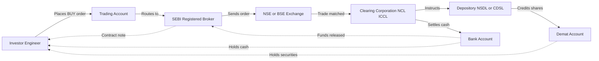
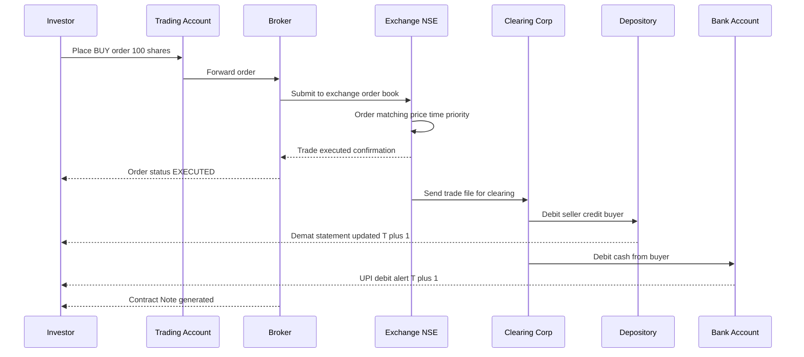
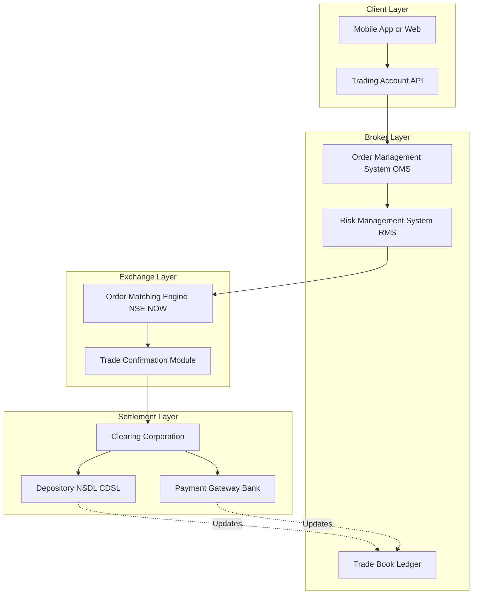
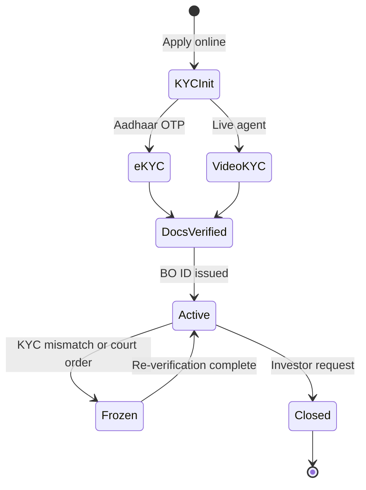
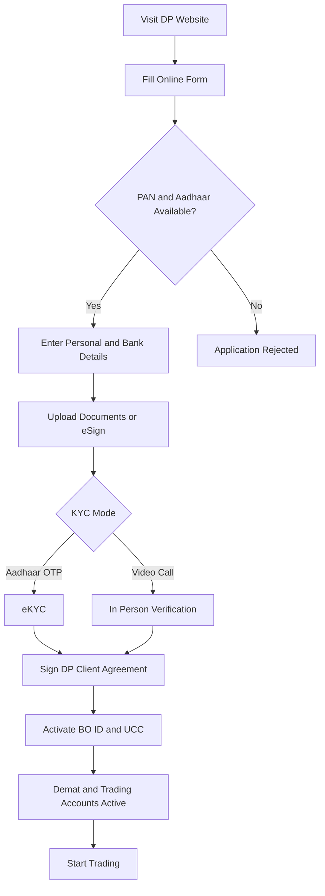

# Demat Account and Trading Account

<!-- SECTION_1_START -->
# Demat Account & Trading Account — Core Technical Definition & Intuitive Overview

> [!IMPORTANT]
> **KTU 2024 Scheme | UCHUT346 | Module 3 — Monetary System**
> This topic belongs to **CO2: Understand the financial system, markets and investment concepts relevant to engineering project decisions.**

## 1.1 Formal Definition (KTU 2024 Syllabus Terminology)

A **Demat Account** (short for *Dematerialized Account*) is an electronic ledger maintained by a **Depository** (NSDL or CDSL) through an authorized intermediary called a **Depository Participant (DP)**, in which the units of financial securities (equity shares, debentures, bonds, government securities, mutual fund units, ETFs) are held in **electronic / book-entry form** instead of physical paper certificates.

A **Trading Account** is an account opened with a **SEBI-registered Stock Broker** that gives the investor the electronic interface (web or mobile platform) required to place **buy and sell orders** on recognized stock exchanges such as the **NSE (National Stock Exchange)** or **BSE (Bombay Stock Exchange)**.

> [!NOTE]
> **Crucial KTU Distinction** — Demat account = **storage** of securities (like a bank locker). Trading account = **place where orders are placed** (like the bank's website). The money to pay for purchases flows from a **Bank Account** linked to the trading account.

## 1.2 Intuitive Analogy — "The Locker–Catalogue–Counter Model"

Think of investing in shares the way a person deals with a jewellery store:

| Real-World Analogy | Financial Equivalent | Function |
|---|---|---|
| Jewellery locker at home | **Demat Account** | Safekeeps the asset (gold / shares) |
| Jewellery catalogue on the shop website | **Trading Account** | Shows live prices; lets you click "Buy" or "Sell" |
| Bank account (for cash) | **Bank Account (Savings)** | Provides money to pay for purchases; receives sale proceeds |
| Jeweller (shop owner) | **Stock Broker** | Routes your order to the market |
| Jewellery association registry | **Depository (NSDL / CDSL)** | Official record of who owns what |

So, when an engineer wants to buy a share of *Infosys Ltd.*:

1. They open the **catalogue** (Trading Account) → search "INFY" → click *BUY 10 @ ₹1,500*.
2. The **jeweller** (Broker) routes this order to the NSE/BSE exchange.
3. Once matched, the **locker** (Demat Account) is credited with 10 *Infosys* shares.
4. Money is debited from the **bank account** linked to the trading account.

## 1.3 Key Institutional Pillars

> [!IMPORTANT]
> **Statutory Backbone** — Every transaction is governed by the **Securities and Exchange Board of India (SEBI)**, established under the SEBI Act, **1992**.

- **Depositories** — Two central depositories in India:
  - **NSDL** — National Securities Depository Limited (promoted by NSE, IDBI Bank, UTI).
  - **CDSL** — Central Depository Services (India) Limited (promoted by BSE, Bank of Bombay).
- **Depository Participants (DPs)** — Banks, brokers, or financial institutions authorized to act as agents of depositories. Examples: HDFC Bank, ICICI Bank, Zerodha, Groww, Sharekhan.
- **Stock Brokers** — Entities registered with SEBI and a member of a recognized stock exchange who execute buy/sell orders. Examples: Zerodha, Upstox, Angel One, ICICI Direct.
- **Custodian** — An entity (often a bank) that holds securities on behalf of large institutional clients (FIIs, mutual funds).

## 1.4 Why an Engineering Student Must Know This

Engineering economics decisions (e.g., evaluating a startup, choosing between debt and equity financing, working in a fintech product team) require familiarity with how capital markets work. Knowing what a Demat and Trading account *are*, *how* they interact, and *what* their costs are is foundational for the **CO2** learning outcomes of UCHUT346.

> [!TIP]
> **Mnemonic for the Exam:** **D T B** → **D**emat (Storage) → **T**rading (Order) → **B**ank (Money).

---

<!-- SECTION_1_END -->

<!-- SECTION_2_START -->
# Deep Theoretical Analysis & KTU High-Yield Formula Sheet

## 2.1 Anatomy of the Two Accounts

### 2.1.1 Demat Account — Operational Structure

- **Opened with:** A Depository Participant (DP) — usually a bank or broker.
- **Unique ID:** **DP ID (8 digits) + Client ID (8 digits)** — together a 16-digit number called the **Beneficial Owner Identification Number (BO ID)**. For CDSL this is a single 16-digit number.
- **Holds:** Equity shares, preference shares, debentures, bonds, G-Secs, T-Bills, mutual fund units, ETFs, sovereign gold bonds.
- **Mode:** Purely electronic — no physical certificates.
- **Nomination:** Available; very important for transmission upon death.
- **Freezing / De-mat suspension:** Possible if suspicious activity is reported (SEBI compliance).

### 2.1.2 Trading Account — Operational Structure

- **Opened with:** A SEBI-registered stock broker who is a member of a stock exchange.
- **Unique ID:** The broker assigns a **UCC (Unique Client Code)**.
- **Functions:**
  1. Display real-time price quotes.
  2. Place buy / sell orders.
  3. Track order status (open / executed / rejected).
  4. View contract notes, trade ledger, P&L.
- **Order Types:** Market, Limit, Stop-Loss, Stop-Loss-Market, Bracket, Cover, GTT (Good Till Triggered).
- **Segments accessible (depending on registration):**
  - **CM** — Capital Market (equity)
  - **F&O** — Futures and Options
  - **CDS** — Currency Derivatives Segment
  - **MF** — Mutual Fund (ETF) orders

## 2.2 The Complete Transaction Lifecycle

Below is the canonical end-to-end flow for a single share purchase — a high-yield point for 14-mark questions.

1. **Investor places a BUY order** in the trading account (e.g., 10 shares of *Reliance Industries* at limit price ₹2,900).
2. **Broker routes order** to the exchange (NSE) via the broker's trading engine.
3. **Exchange order-matching engine** (e.g., NSE NOW) matches the buy order with a corresponding sell order using a **price-time priority** algorithm.
4. **Trade is executed.** Both buyer and seller receive a **Trade Confirmation**.
5. **Exchange sends the trade file to clearing corporation** (NSE → NCL / ICCL). Settlement is guaranteed by the clearing corporation (T+1 cycle since 2023).
6. **Clearing corporation instructs depositories** (NSDL / CDSL) to debit 10 shares from the seller's Demat account and credit 10 shares to the buyer's Demat account.
7. **Cash settlement** — On T+1 day, money is debited from the buyer's bank account and credited to the seller's bank account (now mostly UPI / IMPS / NEFT).
8. **Contract Note** is issued by the broker to the client — a legal record for tax and accounting.

> [!NOTE]
> **Settlement Cycle** — As per SEBI's 2023 reform, the Indian equity market follows a **T+1 rolling settlement** (Trade day + 1 working day).

## 2.3 Cost / Charges Structure — The KTU Formula Sheet

> [!IMPORTANT]
> For UCHUT346, students are not expected to compute brokerage numerically, but must **define each charge and explain when it applies.** The following table is the **formula sheet** for the topic.

| # | Charge | Levied By | Typical Value | Formula / Logic | When Applicable |
|---|---|---|---|---|---|
| 1 | **Account Opening Fee** | DP / Broker | ₹0 – ₹500 | One-time, flat | One time |
| 2 | **Annual Maintenance Charge (AMC)** | DP | ₹200 – ₹800 / yr | Flat yearly | Annual, for Demat |
| 3 | **Brokerage** | Stock Broker | ₹0 (discount) or 0.1% – 0.5% (traditional) | $\text{Brokerage} = \text{Trade Value} \times \text{Rate}$ | Every buy & sell |
| 4 | **STT (Securities Transaction Tax)** | Government | 0.1% (delivery equity) | $\text{STT} = \text{Turnover} \times 0.001$ | On both buy & sell for delivery |
| 5 | **GST** | Government | 18% on (brokerage + DP charges + SEBI charges) | $\text{GST} = 0.18 \times (\text{Brokerage} + \text{DP Fees} + \text{SEBI Charges})$ | Every transaction |
| 6 | **SEBI Charges / Turnover Fee** | SEBI | ₹10 per crore of turnover | $\text{SEBI Charge} = \dfrac{\text{Turnover}}{1{,}00{,}00{,}000} \times 10$ | Both buy & sell |
| 7 | **Stamp Duty** | State Government | 0.015% (buy side only) | $\text{Stamp Duty} = \text{Buy Value} \times 0.00015$ | Only on buy delivery |
| 8 | **Exchange Transaction Charges** | NSE / BSE | ~0.00297% (NSE, equity) | $\text{ETC} = \text{Turnover} \times \text{Exchange Rate}$ | Buy & sell |
| 9 | **DP Transaction Fee** | Depository Participant | ₹13 + GST per scrip per day (NSDL) | Flat per scrip | On each sell (delivery) |
| 10 | **Pledge / Unpledge Fee** | DP | ₹25 – ₹50 per ISIN | Flat per request | When pledging shares for margin |

### 2.3.1 Worked Formula — Total Cost of a Delivery Trade

For a *BUY* trade of 100 shares of *TCS* at ₹4,000 each with a discount broker (brokerage = ₹0):

$$
\begin{aligned}
\text{Trade Value (Turnover)} &= Q \times P = 100 \times 4000 = 4{,}00{,}000 \\
\text{STT (buy delivery)} &= 4{,}00{,}000 \times 0.001 = 400 \\
\text{Exchange Turnover Charge} &= 4{,}00{,}000 \times 0.0000297 = 11.88 \\
\text{SEBI Charge} &= \frac{4{,}00{,}000}{1{,}00{,}00{,}000} \times 10 = 0.04 \\
\text{Stamp Duty} &= 4{,}00{,}000 \times 0.00015 = 60 \\
\text{Brokerage} &= 0 \\
\text{GST on Brokerage} &= 0 \\
\hline
\text{Total Buy Cost} &= 400 + 11.88 + 0.04 + 60 \approx 471.92
\end{aligned}
$$

> [!TIP]
> **KTU Exam Trick Question** — *On a delivery sell order, which charge is NOT applied?* **Answer: Stamp Duty** (it is paid on the buy side only).

## 2.4 Real-World Utility in Engineering & Industry

- **Fintech engineering:** Demat-Trading-Bank linkage is the technological triple that every modern broking app (Zerodha Kite, Groww, Upstox) integrates via APIs.
- **Corporate finance:** When a company raises capital through an **IPO (Initial Public Offering)**, the shares are credited directly to investors' Demat accounts.
- **Mergers & Acquisitions:** Shares of the acquired company are debited and new shares are credited in shareholders' Demat accounts.
- **Employee Stock Options (ESOPs):** Tech companies like Infosys, TCS, Wipro allot ESOPs to engineers — vesting shares appear in the employee's Demat account.
- **Algo-trading systems:** Engineers design automated trading systems that interface with the trading account API to place algorithmic orders.

---

<!-- SECTION_2_END -->

<!-- SECTION_3_START -->
# Step-by-Step Derivations, Procedures & Implementation

## 3.1 Procedure to Open a Demat Account (Detailed, No Steps Skipped)

> [!IMPORTANT]
> **Paperless KYC** — Since 2017, opening is fully digital via the **e-KYC / Aadhaar OTP** route, or through in-person verification.

**Step 1: Choose a Depository Participant.**
Compare DP on the basis of: AMC, DP transaction fee, broker tie-up, platform usability. Common choices: Zerodha (DP ID IN300484), Groww, HDFC Securities, ICICI Direct, Axis Direct, Sharekhan.

**Step 2: Visit the DP website / app → "Open Demat Account".**
Fill the account opening form. Mandatory details:
- PAN (Permanent Account Number) — *mandatory without exception*.
- Aadhaar (for e-KYC).
- Bank account details (for the linked bank account).
- Mobile number & email (OTP-based verification).

**Step 3: Complete e-KYC / IPV (In-Person Verification).**
Either a **video KYC** where the DP's agent verifies your live video with PAN and original documents, or **Aadhaar OTP-based e-sign**.

**Step 4: Sign the agreements.**
Two agreements are signed:
- **DP–Client Agreement** — between you and the Depository Participant.
- **Broker–Client Agreement** — between you and the Stock Broker (if you open both at once).

**Step 5: Receive BO ID and Client ID.**
The DP allocates a **16-digit BO ID** (combination of DP ID + Client ID for NSDL). For CDSL, the 16-digit number is unified.

**Step 6: Set up the trading account & link the bank account.**
The DP activates the **UCC (Unique Client Code)** and your **bank mapping** is verified through a ₹1 penny-drop test.

**Step 7: Account is activated.**
You can now buy / sell securities. The whole process takes between **15 minutes (video KYC)** to **2 working days**.

## 3.2 Procedure to Dematerialize Old Physical Shares

If an investor still holds paper share certificates, they can be converted to electronic form:

1. Open a Demat account if not already done.
2. Submit a **Dematerialization Request Form (DRF)** to the DP.
3. Attach the **physical share certificates** and **Transposition-cum-Demat Form**, if required.
4. DP forwards the certificates to the **Issuer / Registrar and Transfer Agent (RTA)**.
5. RTA verifies and sends an electronic **Dematerialization Confirmation** to the depository.
6. Depository credits the equivalent number of shares to the investor's Demat account.
7. The physical certificates are destroyed after **30 days** by the RTA.

> [!WARNING]
> **Common Pitfall** — Never sign a blank DRF. Always mention **ISIN (International Securities Identification Number)** clearly, otherwise the form is rejected.

## 3.3 Procedure to Rematerialize (Convert Electronic → Physical)

1. Submit a **Rematerialization Request Form (RRF)** to the DP.
2. DP verifies the request and forwards to the depository.
3. Depository confirms and informs the RTA.
4. RTA issues new physical share certificates (within **30 days**) and dispatches by registered post.

> [!NOTE]
> Rematerialization is now rare. SEBI encourages 100% electronic holding for operational efficiency.

## 3.4 Comparison Table — Demat vs. Trading Account

| Feature | Demat Account | Trading Account |
|---|---|---|
| **Maintained by** | Depository (via DP) | Stock Broker |
| **Purpose** | Storage of securities | Placing buy / sell orders |
| **Regulator** | SEBI + Depositories Act, 1996 | SEBI + Stock Exchange |
| **Unique ID** | BO ID (16-digit) | UCC (Unique Client Code) |
| **Holds** | Shares, bonds, MF units | Orders, trade book, P&L |
| **Money flows in / out of** | No direct cash flow | Linked to a **Bank Account** |
| **Charges** | AMC, DP transaction fee | Brokerage, exchange fees |
| **Mandatory for** | Holding / receiving securities | Trading on the exchange |
| **Analogy** | Jewellery locker | Jewellery shop counter |

## 3.5 Detailed Differences: Demat vs. Trading vs. Bank Account

> [!IMPORTANT]
> A frequent 7-mark question asks: *Explain the roles of Demat, Trading, and Bank accounts with their inter-linkage.*

| Aspect | Demat Account | Trading Account | Bank Account |
|---|---|---|---|
| **Function** | Stores securities electronically | Buys / sells securities electronically | Stores money; facilitates payments |
| **Service Provider** | Depository Participant (DP) | SEBI-registered Stock Broker | Scheduled Commercial Bank |
| **Identifier** | BO ID (16-digit) | UCC | Account Number + IFSC |
| **Activated by** | DP-Customer Agreement | Broker-Client Agreement | Standard KYC |
| **Cash flow** | None directly | Linked to bank; receives / pays money | All monetary inflows / outflows |
| **Holds** | Shares, debentures, MF units, ETFs | Order book, contract notes, ledger | INR balance |
| **Required for** | Settlement of trades | Placing orders | Funding purchases; receiving sale proceeds |
| **Operated through** | CDSL Easiest / NSDL Speed-e / Statement of Account | Broker's mobile / web app | Net banking / UPI app |

**Inter-linkage (the "Triangle"):**
1. Investor places order → **Trading Account** sends order to exchange.
2. Trade executed → **Bank Account** is debited / credited for cash leg.
3. Securities credited / debited → **Demat Account** reflects the change.

## 3.6 Types of Demat Accounts (Per SEBI Norms)

| Type | Holder | Restrictions |
|---|---|---|
| **Regular Demat Account** | Resident Indian individual | No restriction |
| **Repatriable Demat Account** | NRI (Non-Resident Indian) | Linked to NRE bank account; sale proceeds can be repatriated |
| **Non-Repatriable Demat Account** | NRI | Linked to NRO bank account; proceeds stay in India |
| **Minor's Demat Account** | Guardian on behalf of minor | Operated by guardian until minor turns 18 |
| **Corporate Demat Account** | Companies, LLPs, Trusts | Requires board resolution, KYC of signatories |
| **HUF Demat Account** | Hindu Undivided Family | Karta is the authorized signatory |

## 3.7 Symbolic / Numerical Worked Example for a 14-Mark Question

**Question Pattern (KTU):** "Mr. A bought 200 shares of *HCL Tech* at ₹1,500 per share via a discount broker (brokerage = ₹20 flat per executed order). He sold all 200 shares after 60 days at ₹1,650 per share. Calculate (a) total charges on the buy leg, (b) total charges on the sell leg, (c) net profit after all charges."

Given: Brokerage ₹20/order. AMC ignored. STT = 0.1% both sides. Exchange charge = 0.00297%. Stamp duty = 0.015% (buy only). SEBI = ₹10 per crore. GST = 18% on (brokerage + SEBI).

### 3.7.1 Buy Leg Charges

$$
\begin{aligned}
\text{Turnover} &= 200 \times 1500 = 3{,}00{,}000 \\
\text{STT}_{\text{buy}} &= 3{,}00{,}000 \times 0.001 = 300 \\
\text{Exchange Charge} &= 3{,}00{,}000 \times 0.0000297 = 8.91 \\
\text{SEBI Charge} &= \frac{3{,}00{,}000}{1{,}00{,}00{,}000} \times 10 = 0.03 \\
\text{Stamp Duty} &= 3{,}00{,}000 \times 0.00015 = 45 \\
\text{Brokerage} &= 20 \\
\text{GST} &= 0.18 \times (20 + 0.03) = 3.61 \\
\text{DP Charge (sell only — 0 on buy)} &= 0 \\
\hline
\text{Total Buy Charges} &= 300 + 8.91 + 0.03 + 45 + 20 + 3.61 \\
&= 377.55
\end{aligned}
$$

### 3.7.2 Sell Leg Charges

$$
\begin{aligned}
\text{Turnover}_{\text{sell}} &= 200 \times 1650 = 3{,}30{,}000 \\
\text{STT}_{\text{sell}} &= 3{,}30{,}000 \times 0.001 = 330 \\
\text{Exchange Charge} &= 3{,}30{,}000 \times 0.0000297 = 9.80 \\
\text{SEBI Charge} &= \frac{3{,}30{,}000}{1{,}00{,}00{,}000} \times 10 = 0.033 \\
\text{Stamp Duty (sell side)} &= 0 \\
\text{Brokerage} &= 20 \\
\text{GST} &= 0.18 \times (20 + 0.033) = 3.61 \\
\text{DP Charge (NSDL, flat)} &= 13 + 18\% \text{ GST} = 15.34 \\
\hline
\text{Total Sell Charges} &= 330 + 9.80 + 0.033 + 20 + 3.61 + 15.34 \\
&= 378.78
\end{aligned}
$$

### 3.7.3 Net Profit

$$
\begin{aligned}
\text{Gross Profit} &= \text{Sell Value} - \text{Buy Value} \\
&= 3{,}30{,}000 - 3{,}00{,}000 = 30{,}000 \\
\text{Net Profit} &= 30{,}000 - 377.55 - 378.78 = 29{,}243.67
\end{aligned}
$$

> [!TIP]
> **Valuation Key Point** — For 14-mark questions, present each charge with the **formula** used and the **rounded** amount. Examiners allocate **1 mark per major charge + 1 mark for the final net profit.**

---

<!-- SECTION_3_END -->

<!-- SECTION_4_START -->
# Structural Diagrams & Schematics

## 4.1 Mermaid Flow — Demat-Trading-Bank Triangle

## 4.2 Mermaid Sequence — Settlement Lifecycle (T+1)

## 4.3 Mermaid Block Diagram — Functional Architecture of a Broking Platform

## 4.4 Mermaid State Diagram — Account Lifecycle

## 4.5 Mermaid Architecture — Demat Account Opening Pipeline

> [!VISUALIZATION CONTROL]
> **Concept:** Comparison of the three accounts in the capital market workflow.
> **GeoGebra / Desmos Input Equations:** Plot the relationship between the three accounts on a triangular coordinate system:
> * Vertex A = $(1, 0)$ representing Demat
> * Vertex B = $(-0.5, \sqrt{3}/2)$ representing Trading
> * Vertex C = $(-0.5, -\sqrt{3}/2)$ representing Bank
> **Visual Description:** Each point inside the triangle represents a transaction state — the **closer to a vertex**, the more that account is active in that state. A *buy* transaction moves state towards A (shares credited) then C (cash debited). A *sell* transaction reverses it.

---

<!-- SECTION_4_END -->

<!-- SECTION_5_START -->
# KTU 2024 Scheme Examination Question Bank & Topic Recap

## 5.1 Part A — Short Answer Questions (3 Marks Each)

### Q1. `[KTU University Exam - July 2024]`
**Define a Demat Account. Mention the two depositories in India.** (CO1, Remember — 3 marks)

**Model Answer:**

A Demat (Dematerialized) Account is an electronic account in which an investor's securities — such as shares, debentures, bonds, mutual fund units, and government securities — are held in **book-entry form** instead of as physical certificates. It is opened with a **Depository Participant (DP)**, which is an agent of a depository. The unique identifier is the **16-digit BO ID**.

The two depositories in India are:
1. **NSDL** — National Securities Depository Limited.
2. **CDSL** — Central Depository Services (India) Limited.

> [!Valuation Key]
> * [Definition: 1 Mark]
> * [Function explanation: 1 Mark]
> * [Naming both depositories correctly: 1 Mark]

---

### Q2. `[KTU University Exam - Dec 2023]`
**Distinguish between a Demat Account and a Trading Account in three points.** (CO2, Understand — 3 marks)

**Model Answer:**

| Sl. No. | Demat Account | Trading Account |
|---|---|---|
| 1 | Holds securities electronically in book-entry form. | Provides the platform to place buy and sell orders. |
| 2 | Opened with a Depository Participant (DP) under NSDL or CDSL. | Opened with a SEBI-registered stock broker. |
| 3 | Unique ID is the 16-digit **BO ID**. | Unique ID is the **UCC (Unique Client Code)**. |

> [!Valuation Key]
> * [Each correct distinction: 1 Mark × 3 = 3 Marks]

---

## 5.2 Part B — Long Answer (14 Marks) — Module Internal Choice

### Question A (14 Marks) `[KTU University Exam - Dec 2024]`

**"Explain the concept of a Demat Account, its features, types, and the procedure to open one. Discuss the role of NSDL and CDSL in detail."**

#### (a) Concept, Features, and Types of Demat Account — **7 Marks** (CO2, Understand)

**Concept:** A Demat Account is the electronic equivalent of a physical share locker. It eliminates the risks of theft, loss, forgery, mutilation, and delays in share transfer that plagued the paper-certificate era. It was introduced in India following the **Depositories Act, 1996**, and the system became operational in **NSDL since 1996** and **CDSL since 1999**.

**Features:**
- **Electronic Holding** — securities stored as book entries in the depository's computer systems.
- **No Physical Certificates** — risk of damage, loss, and forgery eliminated.
- **Unique BO ID** — 16-digit Beneficial Owner Identification Number.
- **Faster Settlement** — T+1 cycle since 2023.
- **Nomination Facility** — easy transmission to legal heirs.
- **Pledge / Hypothecation** — shares can be pledged to banks as collateral electronically.
- **Multiple ISINs** — one Demat account can hold thousands of different securities.
- **Free Transfer of Holdings** — moving from one DP to another is free of cost (per SEBI 2019 rule).

**Types of Demat Accounts:**
1. **Regular Demat Account** — for resident Indian individuals.
2. **Repatriable Demat Account** — for NRIs, linked to NRE bank accounts.
3. **Non-Repatriable Demat Account** — for NRIs, linked to NRO accounts.
4. **Minor's Demat Account** — operated by a natural/legal guardian.
5. **Corporate / HUF Demat Accounts** — for companies, LLPs, trusts, and HUFs.

> [!Valuation Key — Part (a)]
> * [Concept with Depositories Act 1996 reference: 2 Marks]
> * [At least 5 features: 3 Marks]
> * [Listing 4+ types correctly: 2 Marks]

#### (b) Procedure to Open a Demat Account and Role of NSDL / CDSL — **7 Marks** (CO3, Apply)

**Procedure to Open:**
1. **Choose a Depository Participant** — bank (HDFC, ICICI, SBI) or broker (Zerodha, Groww).
2. **Fill the account opening form** online on the DP's website / app.
3. **Submit KYC documents** — PAN, Aadhaar, address proof, photograph, bank account proof.
4. **Complete e-KYC** — via Aadhaar OTP, or Video KYC with the agent.
5. **In-Person Verification (IPV)** — live video call where the agent verifies identity.
6. **Sign the DP–Client Agreement** — legally binds the relationship.
7. **Receive BO ID** — 16-digit unique account number.
8. **Account is activated** — ready to receive shares electronically.

**Role of NSDL and CDSL:**

| Aspect | NSDL | CDSL |
|---|---|---|
| **Year Established** | 1996 (first depository) | 1999 |
| **Promoted by** | NSE, IDBI Bank, UTI | BSE, Bank of Bombay |
| **DP ID Format** | 8-digit alpha-numeric | 16-digit unified BO ID |
| **Settlement** | Works with NSE clearing | Works with BSE clearing |
| **Market Share** | Larger (legacy + NSE volumes) | Comparable (BSE + many brokers) |
| **Key Service** | Speed-e, IDeAS (online access) | Easiest (online access) |

**Functions Common to Both:**
- Maintain the **master script** — central register of who owns what.
- Provide **electronic settlement** of trades.
- **Facilitate corporate actions** — dividends, bonus, splits, rights.
- Enable **pledging** of securities as collateral.
- Offer **online access portals** for clients to view their holdings.

> [!Valuation Key — Part (b)]
> * [Correct opening procedure with 5+ steps: 3 Marks]
> * [Distinguishing NSDL and CDSL: 2 Marks]
> * [Listing 4+ functions of depositories: 2 Marks]

---

### Question B (14 Marks) `[KTU University Exam - July 2023]`

**"Discuss the concept of a Trading Account, its order types, the role of stock brokers, and the complete settlement cycle in the Indian stock market."**

#### (a) Concept of Trading Account, Order Types, and Role of Brokers — **7 Marks** (CO2, Understand)

**Concept:** A Trading Account is the electronic interface through which an investor places buy / sell orders on a recognized stock exchange. The account is opened with a **SEBI-registered stock broker** who is also a **member of the exchange**. The broker receives orders, transmits them to the exchange's order-matching system, executes them, and issues a **Contract Note** as proof of the trade. The trading account is linked to both a Demat account (for securities settlement) and a Bank account (for cash settlement).

**Types of Orders:**

| Order Type | Behaviour | When to Use |
|---|---|---|
| **Market Order** | Executes at the best available price | When immediate execution is priority |
| **Limit Order** | Executes only at the specified price or better | When price is priority over execution |
| **Stop-Loss (SL)** | Becomes a market order once trigger price is hit | To limit loss on existing positions |
| **Stop-Loss-Limit (SL-M)** | Becomes a limit order once triggered | To limit loss and control price |
| **Bracket Order** | Combines two limit orders (target + stop-loss) | Intraday risk-defined trades |
| **Cover Order** | Compulsory stop-loss with main order | Intraday with margin benefit |
| **GTT (Good Till Triggered)** | Limit order valid up to 1 year | Long-term target buying |
| **AMO (After Market Order)** | Placed after market hours | Convenience for retail investors |

**Role of Stock Brokers:**
1. **Order Routing** — sending client orders to the exchange.
2. **Trade Execution** — ensuring best possible execution.
3. **Risk Management** — collecting margins, validating orders.
4. **Settlement** — ensuring Demat and Bank leg is completed.
5. **Client Education & Advisory** — research reports (for full-service brokers).
6. **Compliance** — adhering to SEBI, exchange, and depository rules.

> [!Valuation Key — Part (a)]
> * [Concept with broker + exchange mention: 2 Marks]
> * [At least 4 order types with examples: 3 Marks]
> * [Listing 4+ broker functions: 2 Marks]

#### (b) Complete Settlement Cycle in the Indian Stock Market — **7 Marks** (CO3, Apply)

**Settlement Cycle: T+1 Rolling Settlement** (since SEBI circular dated 27-Sep-2023).

**Step 1 — Order Placement (Day T):**
Investor places a BUY order via trading account. Broker validates the order (cheque-bounce check, margin availability, KYC compliance).

**Step 2 — Order Routing to Exchange:**
Broker's **Order Management System (OMS)** transmits the order to the exchange (NSE) using the **CTCL (Computer-to-Computer Link)** protocol.

**Step 3 — Order Matching:**
The exchange's **Order Matching Engine** (e.g., NSE NOW) uses a **price-time priority** algorithm to match buy and sell orders.

**Step 4 — Trade Confirmation:**
A trade is generated with a unique **Trade ID**. Both counterparties receive instant confirmation. The trade file is forwarded to the **Clearing Corporation** (NSE Clearing → NCL or ICCL).

**Step 5 — Clearing & Margin Collection (End of Day T):**
The clearing corporation computes the **net obligation** of each broker. Mark-to-market (MTM) margins are collected / paid.

**Step 6 — Settlement (Day T+1):**
- **Securities Leg:** Depositories (NSDL / CDSL) debit the seller's BO ID and credit the buyer's BO ID. The Demat account reflects the new holding by EOD T+1.
- **Cash Leg:** Funds are debited from the buyer's linked bank account and credited to the seller's account (mostly via UPI / IMPS / RTGS by 2024).

**Step 7 — Contract Note & Reporting:**
The broker issues a **Contract Note** to the client (within 24 hours), which is a legal document for tax purposes (showing brokerage, STT, etc.). The broker also reports the trade to the depository and the exchange.

**Step 8 — Corporate Action Processing:**
Dividends, bonuses, stock splits, etc. are processed automatically by the depository and credited to the Demat account on the record date.

> [!Valuation Key — Part (b)]
> * [Naming T+1 cycle correctly: 1 Mark]
> * [Order routing to exchange: 2 Marks]
> * [Clearing corporation and depository role: 2 Marks]
> * [Demat and cash leg settlement: 2 Marks]

---

## 5.3 KTU Examiner's Valuation Warning & Pitfall Callout

> [!WARNING]
> **Common Mark-Deduction Pitfalls in Demat / Trading Account Questions**
> 1. **Confusing Demat with Trading account** — Examiners report that ~30% of answer scripts mix the two. Always state: *Demat = storage, Trading = order placement.*
> 2. **Forgetting the Bank Account in the triangle** — A complete explanation requires all three accounts (Demat + Trading + Bank) and their linkage.
> 3. **Wrongly attributing STT** — STT is paid on both buy and sell for delivery, but **Stamp Duty is paid only on the buy side.**
> 4. **Missing the Depositories Act 1996 reference** — Always cite this Act when defining a Demat account; it carries 1 mark.
> 5. **Not naming the two depositories** — NSDL and CDSL must be spelled out fully, not abbreviated without expansion.
> 6. **Skipping T+1 mention** — Older answers still say T+2, but SEBI moved to T+1 in 2023. Use T+1.
> 7. **Ignoring the BO ID format** — Examiner may ask for 16-digit nature; quote it.

---

## 5.4 Topic Recap & Important Things to Remember

> [!TIP]
> **Rapid-Revision Checklist for VIVA & Exam**

- **Demat Account** = electronic storage of securities; opened with a **Depository Participant**; identified by **16-digit BO ID**.
- **Trading Account** = electronic interface for placing buy/sell orders; opened with a **SEBI-registered Stock Broker**; identified by **UCC**.
- **Bank Account** is the third leg of the triangle; it provides funds and receives sale proceeds.
- **Two depositories in India:** **NSDL (1996)** and **CDSL (1999)**.
- **Statute:** **Depositories Act, 1996** governs Demat accounts; **SEBI Act, 1992** governs the capital market.
- **Settlement cycle:** **T+1 rolling** (since 27-Sep-2023).
- **Order matching algorithm** at exchanges uses **price-time priority**.
- **Clearing corporations:** **NCL** (NSE Clearing), **ICCL** (Indian Clearing Corporation for BSE).
- **Order types:** Market, Limit, Stop-Loss, SL-M, Bracket, Cover, GTT, AMO.
- **Major charges** — STT, GST, brokerage, exchange transaction charge, SEBI charge, stamp duty, DP transaction fee (sell-side only).
- **Stamp Duty** is **paid only on BUY** side; **DP charge** is **paid only on SELL** side.
- **Types of Demat accounts:** Regular, Repatriable (NRI), Non-Repatriable (NRI), Minor, Corporate, HUF.
- **Free inter-DP transfer** of Demat accounts was mandated by SEBI in 2019.
- **Demat-related forms:** **DRF** (Dematerialization Request Form), **RRF** (Rematerialization Request Form).
- **Engineering relevance:** ESOPs, IPO allotments, fintech APIs, algo-trading systems.
- **Mnemonic to remember the triangle:** **D T B** → **D**emat (Storage) → **T**rading (Order) → **B**ank (Money).

<!-- SECTION_5_END -->
