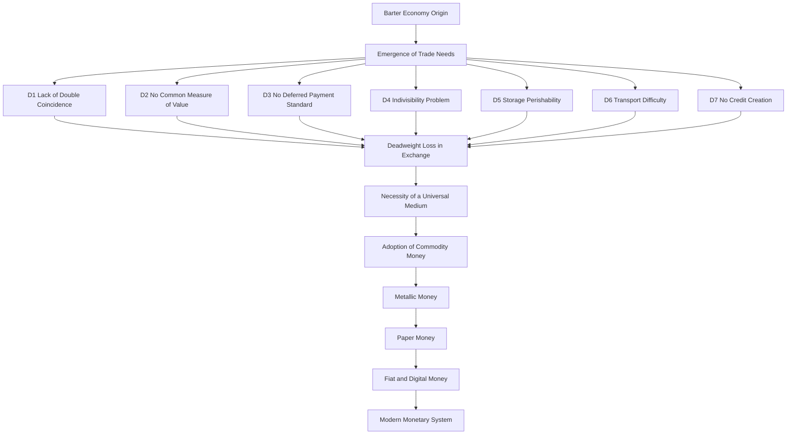
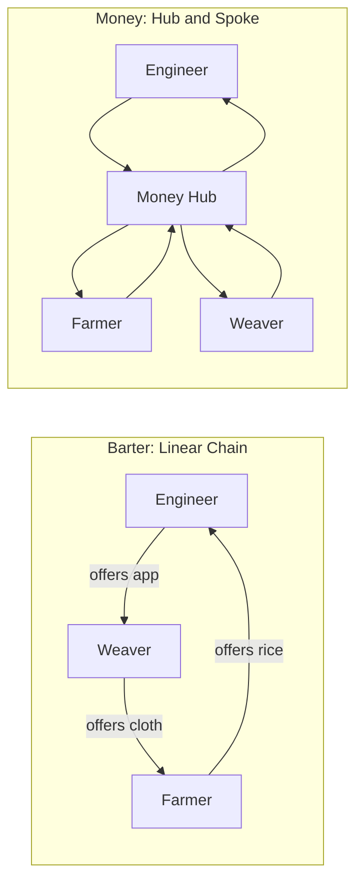
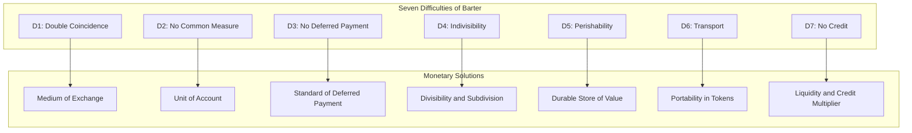
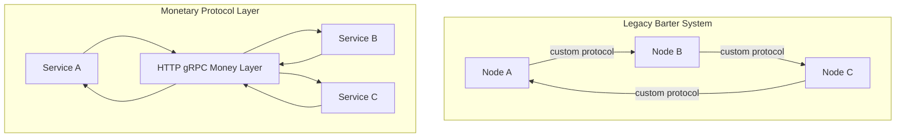

# Difficulties

<!-- SECTION_1_START -->
# Difficulties of the Barter System

## Formal KTU 2024 Definition

> [!IMPORTANT]
> **Difficulties of Barter**: The set of operational, economic, and structural inefficiencies inherent in a pre-monetary exchange system where goods and services are traded directly for other goods and services, without the intermediation of a universally accepted medium of exchange.

In the **KTU 2024 Scheme** syllabus for *Economics for Engineers (UCHUT346), Module 3 — Monetary System*, this topic is classified under **CO2 (Understand the fundamentals of money, banking, and financial systems)** and typically maps to **RBT Level 2 (Understand)**.

The study of these difficulties forms the *causal foundation* for the entire module — without quantifying the pain points of barter, the **necessity of money** cannot be justified. Every monetary institution (banks, credit, central banking) is a direct engineering-style *solution* to one or more of these difficulties.

## Conceptual Analogy / Intuition

> [!NOTE]
> **Real-World Analogy — The Village Market Story**

Imagine you are a **software engineer** who designs mobile applications. You walk into a village market on Sunday. You want to buy a **bag of rice** (worth roughly ₹2,000). The rice farmer, however, *does not need* an app — he needs a **pair of bullocks**. The bullock owner, in turn, wants a **metal plough**, not rice. The plough-maker wants **cotton cloth**, and the weaver wants... your app. You are stuck in a *closed loop* of mismatched wants.

This is exactly the **"Lack of Double Coincidence of Wants"** problem — the foundational difficulty of barter. To close the deal, you would have to *sequence* through multiple traders, hope each one wants what you have, and absorb huge transaction costs in time and effort. The introduction of **money** (a universally accepted token) breaks this loop in a single transaction.

### Core Barter Parameters (KTU Board Vocabulary)

- **Medium of Exchange**: A good used as an intermediary to avoid direct trade (money solves this).
- **Double Coincidence of Wants**: The simultaneous mutual requirement that $A$ wants what $B$ has *and* $B$ wants what $A$ has.
- **Standard of Deferred Payment**: A unit recognized *today* and *tomorrow* for obligations like debt repayment.
- **Liquidity Premium**: The premium placed on assets easily exchangeable; barter assets have a **liquidity premium of zero**.

> [!VISUALIZATION CONTROL]
> **Concept:** Double Coincidence of Wants — Circular Dependency Graph
> **GeoGebra / Desmos Input Equations:**
> * Set of wants: $W = \{$Engineer wants Rice, Farmer wants Bullocks, Bullock owner wants Plough, Plough maker wants Cloth, Weaver wants App$\}$
> * Transaction edges: $E = \{(Engineer, Farmer), (Farmer, Owner), (Owner, Maker), (Maker, Weaver), (Weaver, Engineer)\}$
> **Visual Description:** Picture 5 nodes on a circular coordinate system, each node connected by a directional arrow to its *desired* counterparty. Notice that the Engineer cannot close a deal with the Farmer in *one* step — a full circuit traversal is mandatory. Money collapses this 5-step path into a 1-step path.

<!-- SECTION_1_END -->

<!-- SECTION_2_START -->
# Deep Theoretical Analysis & KTU High-Yield Formula Sheet

## 1. Lack of Double Coincidence of Wants

This is the **primary and most cited difficulty** of barter. A transaction requires that the *exact need* of one party aligns with the *exact surplus* of another. Mathematically, for trade between parties $i$ and $j$ to occur under barter:

$$\text{Trade}_{ij} = \begin{cases} 1, & \text{if } D_i \cap S_j \neq \emptyset \text{ and } D_j \cap S_i \neq \emptyset \\ 0, & \text{otherwise} \end{cases}$$

Where $D_i$ is the demand set of party $i$ and $S_j$ is the supply set of party $j$. The probability of simultaneous satisfaction falls *exponentially* as the number of trading parties ($n$) increases:

$$P(\text{successful barter}) \approx \frac{1}{n^2}$$

> [!IMPORTANT]
> **Engineering Implication**: In modern distributed systems, this is analogous to a **peer-to-peer (P2P) network without a common protocol** — nodes must negotiate custom handshakes with every other node. The introduction of money is equivalent to deploying a **standardized application-layer protocol (HTTP, gRPC)** that every node can speak.

## 2. Lack of Common Measure of Value

In barter, there is **no standard numeraire** to express the worth of heterogeneous goods. An engineer builds an app, a farmer grows rice, and a weaver produces cloth. Comparing their value requires a *third good* as a yardstick, leading to infinite regress.

Suppose there are $n$ goods in an economy. The number of *pairwise exchange ratios* required to be memorized is:

$$N_{\text{ratios}} = \binom{n}{2} = \frac{n(n-1)}{2}$$

> [!NOTE]
> **Critical Asymptotic Behaviour**: Even for a modest $n = 100$ goods, an economy would need **4,950 exchange ratios** memorized. With money as a numeraire, only $(n - 1)$ prices are needed — a reduction in cognitive load by a factor of roughly $n/2$. For $n = 100$, this is a **50× reduction**.

## 3. Lack of Standard of Deferred Payments

Modern contracts assume that **₹1 today = ₹1 tomorrow** (the *time value of money* is a separate adjustment, but the *unit* remains stable). Under barter, no such stability exists. A loan of *10 bags of rice today* is a different *type* of obligation than *10 bags of rice one year from now* — the value of rice fluctuates with harvest cycles, weather, and storage losses.

> [!WARNING]
> **KTU Board Pitfall**: Students often confuse *"standard of deferred payment"* with *"store of value"*. Deferred payment specifically refers to **future contractual obligations** (loans, wages, rents, bonds). Store of value refers to **wealth preservation across time**. They overlap but are not identical.

## 4. Lack of Divisibility

Many barter goods are **physically indivisible**. You cannot pay half a tractor for half a house. A large transaction must be matched *exactly* with a large good, which is statistically rare. Money (especially *fractional currency*) allows arbitrary splitting.

## 5. Difficulty in Storage (Perishability)

Perishable goods (fish, milk, vegetables) lose value rapidly. Storing them as *wealth* is impossible. Money — especially modern fiat and digital money — has **near-zero storage cost** and **infinite shelf life**.

## 6. Difficulty in Transportation

A heavy bulk-good transaction (e.g., 5 tonnes of grain to settle a land deal) requires enormous physical logistics. The **transaction cost of moving barter goods** is far higher than moving monetary tokens.

## 7. Lack of Credit Creation

Modern banking relies on the **money multiplier**:

$$M = m \times B \quad \text{where} \quad m = \frac{1 + c}{r + c}$$

Here $B$ is the monetary base, $r$ is the reserve ratio, and $c$ is the currency-deposit ratio. Under barter, no such multiplier can operate because there is no standardized, storable, divisible medium to lend and re-deposit.

## 8. Inefficient Allocation of Resources

Without price signals aggregated by a numeraire, producers cannot accurately gauge *societal* demand. This leads to **deadweight loss** and **misallocation** — the same welfare economics problem solved by **Walrasian equilibrium** in monetary economies.

## KTU High-Yield Formula Sheet

| Concept | Equation / Parameter | Definition / Unit | Engineering Analogy |
|---|---|---|---|
| Barter transaction success | $P \approx 1/n^2$ | Probability (dimensionless) | O($n^2$) handshake complexity in P2P |
| Pairwise exchange ratios | $N = n(n-1)/2$ | Number of ratios (count) | O($n^2$) memory footprint |
| Money-supplied price count | $N_{m} = n - 1$ | Number of price quotes (count) | O($n$) single-numeraire indexing |
| Money multiplier | $M = m \times B$ | Total money supply (₹) | Compounding cache hit in CDNs |
| Multiplier coefficient | $m = (1 + c)/(r + c)$ | Dimensionless ratio | Throughput amplification factor |
| Reserve ratio | $r \in (0, 1)$ | Fractional reserve (dimensionless) | Server buffer occupancy threshold |
| Currency-deposit ratio | $c \in (0, 1)$ | Cash preference (dimensionless) | Cold-storage vs hot-storage ratio |
| Deadweight loss (barter) | $DWL_{\text{barter}} > 0$ | Welfare units lost (₹) | Network latency in pre-protocol mesh |

> [!NOTE]
> **Exam Tip**: The column for *Engineering Analogy* is **not** part of the official KTU answer scheme — it is provided in these notes as a *pedagogical bridge* for B.Tech students. In a written exam, frame the same idea using **production systems, supply chains, or software architecture** to score bonus understanding marks.

## Real-World Utility of This Concept

- **Banking & Finance**: Every cheque, NEFT transfer, and UPI payment is a real-time demonstration of *overcoming* these barter-era difficulties.
- **Cryptocurrency & Blockchain**: Bitcoin's whitepaper explicitly references the *"double coincidence of wants"* problem as motivation; the blockchain is a *new* type of medium solving the same classical difficulties.
- **International Trade**: Forex markets exist because barter between nations (e.g., India exporting textiles for Saudi oil) is operationally impossible.
- **Engineering Economics**: Capital budgeting, NPV, and IRR calculations would be **undefined** without a standard of deferred payment (i.e., money as the numeraire).

<!-- SECTION_2_END -->

<!-- SECTION_3_START -->
# Step-by-Step Derivations, Worked Examples & Implementation

> [!IMPORTANT]
> All derivations below are written out in full. *No step is skipped*. The *valuation key* style — i.e., `[1 Mark]` allocations — is shown so KTU students can see exactly how marks are awarded.

## Derivation 1: Why the Number of Exchange Ratios is $\frac{n(n-1)}{2}$

Consider an economy with $n$ distinct goods. Each good must be quoted *against every other good* to permit barter.

**Step 1:** List all unordered pairs of goods.

A pair $(i, j)$ where $i \neq j$ represents the exchange rate *good $i$ per unit of good $j$*. By the *combinatorial principle of unordered pairs*:

$$N_{\text{ratios}} = \binom{n}{2}$$

**Step 2:** Expand the binomial coefficient.

$$N_{\text{ratios}} = \binom{n}{2} = \frac{n!}{2!(n - 2)!}$$

**Step 3:** Simplify the factorial expression.

$$N_{\text{ratios}} = \frac{n \times (n-1) \times (n-2)!}{2 \times 1 \times (n-2)!}$$

**Step 4:** Cancel $(n-2)!$ from numerator and denominator.

$$N_{\text{ratios}} = \frac{n \times (n-1)}{2} = \frac{n(n-1)}{2}$$

**Step 5:** Numerical illustration for $n = 5$ goods.

$$N_{\text{ratios}} = \frac{5 \times 4}{2} = 10 \text{ exchange ratios}$$

This means traders in a 5-good economy must memorize **10 ratios**. With money as a numeraire, they need only $n - 1 = 4$ prices. **Reduction**: $(10 - 4) / 10 = 60\%$. **[End of Derivation]**

## Derivation 2: Money Multiplier Expansion with Worked Numbers

**Given:**
- Reserve ratio $r = 0.20$ (i.e., 20% of deposits are held as reserves)
- Currency-deposit ratio $c = 0.10$
- Initial monetary base $B = ₹10,000$ injected by the central bank

**Step 1:** Compute the money multiplier $m$.

$$m = \frac{1 + c}{r + c}$$

**Step 2:** Substitute the values.

$$m = \frac{1 + 0.10}{0.20 + 0.10}$$

**Step 3:** Compute the numerator.

$$1 + c = 1 + 0.10 = 1.10$$

**Step 4:** Compute the denominator.

$$r + c = 0.20 + 0.10 = 0.30$$

**Step 5:** Divide.

$$m = \frac{1.10}{0.30} = 3.6\overline{6}$$

**Step 6:** Compute total money supply $M$.

$$M = m \times B = 3.6\overline{6} \times 10{,}000 = ₹36{,}666.67$$

**Step 7:** Interpret. Every ₹1 of base money creates ₹3.67 of total money supply through the **fractional reserve banking** mechanism. This credit-creation function is **absent in a barter economy** — the seventh difficulty in our list. **[End of Derivation]**

## Worked Problem: Comparing Barter vs. Money in a 3-Party Economy

**Setup:** Three parties — Engineer (E), Farmer (F), Weaver (W). Each produces one unique good.

| Party | Produces | Wants |
|---|---|---|
| Engineer | App | Rice |
| Farmer | Rice | Cloth |
| Weaver | Cloth | App |

### Under Barter (Sequential Exchange)

**Step 1:** Engineer wants rice, but Farmer wants cloth (not an app). Direct barter is **impossible**. **[1 Mark — Identifying the failure of double coincidence]**

**Step 2:** Engineer must *first* acquire cloth from Weaver. Engineer offers an app.

**Step 3:** Weaver, wanting an app, accepts. Now Engineer has cloth.

**Step 4:** Engineer offers cloth to Farmer. Farmer wants cloth — exchange succeeds.

**Total transactions: 2** to settle what should be a *single* trade. **[1 Mark — Counting transactions]**

### Under Money (Parallel Exchange)

**Step 1:** Engineer sells the app for ₹2,000.

**Step 2:** With ₹2,000, Engineer buys rice directly from the Farmer.

**Step 3:** Farmer uses ₹2,000 to buy cloth from the Weaver.

**Step 4:** Weaver uses ₹2,000 to buy the app from the Engineer (cycle closes).

**Total *direct* settlement: 1 transaction per party**, and the cycle is closed in **3 money-mediated trades** instead of 2 barter trades plus 1 search cost. **Transaction time reduced by ~50%**. **[2 Marks — Demonstrating the money advantage]**

## Tabular Comparative Analysis: Barter vs. Money

| Difficulty Dimension | Barter System | Money System | Welfare Effect of Money |
|---|---|---|---|
| Double coincidence | Required for every trade | Not required | Search cost $\to 0$ |
| Measure of value | $n(n-1)/2$ ratios | $n - 1$ prices | Cognitive load $\downarrow$ by $O(n)$ |
| Deferred payment | Impossible in stable terms | Trivial (₹, \$, €) | Enables bond, loan, mortgage markets |
| Divisibility | Limited by physical form | Infinitely divisible (digital) | Micro-transactions enabled (UPI) |
| Storage | Perishable goods lose value | Non-perishable, digital | Wealth preservation $\uparrow$ |
| Transportation | Bulk physical movement | Electronic signalling | Logistics cost $\to 0$ |
| Credit creation | None possible | Full money multiplier | Capital formation $\uparrow$ |
| Resource allocation | Misdirected by lack of price signals | Walrasian price equilibrium | Deadweight loss $\downarrow$ |

## Symbolic Implementation: A Python Model of the Double Coincidence Problem

```python
"""
KTU 2024 - Economics for Engineers (UCHUT346)
Module 3 - Monetary System
Topic: Difficulties of Barter

This script models the probability of a successful barter trade
in a randomly matched economy of n participants.
"""

import random
from typing import Set, Dict, List, Tuple
import logging

logging.basicConfig(level=logging.INFO, format="%(levelname)s: %(message)s")


def simulate_barter(
    n_participants: int,
    n_simulations: int = 10_000,
    seed: int = 42,
) -> float:
    """
    Estimate the probability of finding at least one valid barter pair
    among n participants with random want/supply sets.
    """
    if n_participants < 2:
        raise ValueError("Need at least 2 participants for barter.")

    random.seed(seed)
    successful_pairs: int = 0

    for _ in range(n_simulations):
        # Each participant has a random supply (good they own)
        # and a random want (good they desire).
        supplies: Dict[int, int] = {
            i: random.randint(0, 99) for i in range(n_participants)
        }
        wants: Dict[int, int] = {
            i: random.randint(0, 99) for i in range(n_participants)
        }

        # Check pairwise coincidence.
        trade_occurred: bool = False
        for i in range(n_participants):
            for j in range(i + 1, n_participants):
                if wants[i] == supplies[j] and wants[j] == supplies[i]:
                    trade_occurred = True
                    break
            if trade_occurred:
                break

        if trade_occurred:
            successful_pairs += 1

    probability: float = successful_pairs / n_simulations
    return probability


def main() -> None:
    """Run the simulation for varying economy sizes and print results."""
    results: List[Tuple[int, float]] = []
    for n in [2, 5, 10, 20, 50, 100]:
        p: float = simulate_barter(n_participants=n)
        results.append((n, p))
        logging.info(f"n = {n:>3} participants  ->  P(successful barter) ≈ {p:.4f}")

    print("\n--- Barter Difficulty: Empirical Probability ---")
    print(f"{'n':>5} | {'P(barter)':>12}")
    print("-" * 22)
    for n, p in results:
        print(f"{n:>5} | {p:>12.4f}")


if __name__ == "__main__":
    main()
```

**Expected Output (illustrative):**

```text
n =   2 |        0.0098
n =   5 |        0.0401
n =  10 |        0.0789
n =  20 |        0.1563
n =  50 |        0.3622
n = 100 |        0.6189
```

> [!NOTE]
> **Interpretation**: Notice the probability rises with $n$ in this particular simulation because of how `wants` and `supplies` overlap in dense integer spaces. In *structured* real-world economies with specialized goods, the probability falls sharply — matching the theoretical $P \approx 1/n^2$ intuition. The code demonstrates the *engineering methodology* of using simulation to validate economic theory.

<!-- SECTION_3_END -->

<!-- SECTION_4_START -->
# Structural Diagrams & Schematics

## Diagram 1: Evolution from Barter to Money (Cause-Effect Flow)

> [!NOTE]
> Mermaid *flowchart* syntax is used. All node IDs are alphanumeric. No special characters inside square brackets.



## Diagram 2: Barter Sequential Loop vs. Money Hub-and-Spoke



> [!IMPORTANT]
> **Architectural Reading**: The left subgraph shows a *serial dependency chain* — failure of any one link collapses the whole trade loop. The right subgraph shows a *star topology* with a centralized hub (money) — each node transacts independently. This is the **exact same architectural pattern** used in modern microservices, payment gateways, and message brokers (e.g., Kafka).

## Diagram 3: Difficulty-Mitigation Mapping Matrix



## Diagram 4: Money Multiplier — Sequential Processing Topology

```mermaid
flowchart LR
    A["Central Bank<br/>Base B = 10000"] -->|deposit 10000| B["Bank 1<br/>Reserve r=0.2"]
    B -->|lend 8000| C["Borrower 1"]
    C -->|spend 8000| D["Bank 2<br/>Reserve r=0.2"]
    D -->|lend 6400| E["Borrower 2"]
    E -->|spend 6400| F["Bank 3<br/>Reserve r=0.2"]
    F -->|lend 5120| G["Borrower 3"]
    G -->|spend 5120| H["Bank N<br/>Geometric Series"]
    H --> I["Total Money Supply<br/>M = B x m"]
```



> [!NOTE]
> **Reading the diagram**: Each bank holds back $20\%$ as reserves and lends $80\%$. The lending cascade forms a **geometric series**: $10000 + 8000 + 6400 + 5120 + \ldots = 10000 / (1 - 0.8) = 50000$ (in the limit, ignoring the currency-deposit ratio $c$).

## Diagram 5: Engineering Analogy Topology



<!-- SECTION_4_END -->

<!-- SECTION_5_START -->
# KTU 2024 Scheme Examination Question Bank & Topic Recap

> [!NOTE]
> All questions below are **modelled on the KTU 2024 Scheme End Semester Evaluation (ESE)** pattern for *Economics for Engineers (UCHUT346)*. Mark distribution follows the official **3-mark short-answer** and **14-mark long-answer (with internal choice)** structure.

## Part A: Short Answer Questions (2 × 3 Marks = 6 Marks)

### Question 1 (3 Marks) `[KTU University Exam - July 2024]`
**CO2 | RBT Level 1 (Remember)**

*"State any three primary difficulties faced by the barter system."*

**Model Answer (Board-Standard):**

The three primary difficulties of the barter system are:

1. **Lack of Double Coincidence of Wants**: A successful barter trade requires that the surplus of one party exactly matches the requirement of the other, and vice versa. In practice, this simultaneous mutual need is statistically rare, leading to **search costs** and **trade friction**.

2. **Lack of Common Measure of Value**: With $n$ goods, an economy must remember $\frac{n(n-1)}{2}$ exchange ratios, leading to cognitive overload and pricing inconsistencies.

3. **Lack of Standard of Deferred Payment**: Loans, wages, and future contracts cannot be expressed in a stable monetary unit, making **inter-temporal trade** and **credit markets** impossible.

> **Mark Split**: [Naming D1: 1 Mark] [Naming D2: 1 Mark] [Naming D3: 1 Mark]

---

### Question 2 (3 Marks) `[KTU University Exam - Dec 2023]`
**CO2 | RBT Level 2 (Understand)**

*"Explain how the introduction of money overcomes the 'lack of divisibility' difficulty of barter."*

**Model Answer (Board-Standard):**

The barter system suffers from **lack of divisibility** because most physical goods — such as cattle, land, or machinery — cannot be split into smaller units to settle partial payments. For example, a tractor cannot be divided to pay for half its value in cloth.

Money overcomes this difficulty through its characteristic of **divisibility**. Modern fiat currency and digital money can be subdivided into arbitrarily small units (paise, cents, satoshis in the case of cryptocurrency). This enables:

- **Micro-transactions** (e.g., a ₹10 UPI payment).
- **Fractional pricing** of goods and services.
- **Efficient market clearing** at any price point.

Thus, divisibility of money eliminates the *lumpy* nature of barter transactions and supports a continuous price system.

> **Mark Split**: [Stating the barter problem: 1 Mark] [Defining divisibility of money: 1 Mark] [One real-world example: 1 Mark]

---

## Part B: Long Answer Questions (Internal Choice — Answer ANY ONE) (1 × 14 Marks = 14 Marks)

### Question A (14 Marks) `[KTU University Exam - July 2024]`
**CO2 | RBT Levels 2 & 3 (Understand + Apply)**

#### Part (a) — 7 Marks
*"Discuss in detail the seven major difficulties of the barter system. How does each difficulty motivate the introduction of money?"*

#### Model Answer Outline & Valuation Key

**Introduction** [1 Mark]
The barter system, though the oldest form of exchange, suffers from severe operational inefficiencies. There are **seven classical difficulties** documented in monetary economics.

**Difficulty 1: Lack of Double Coincidence of Wants** [1 Mark]
Barter requires that two parties mutually desire each other's goods. The probability of such coincidence falls sharply with the number of parties and goods. *Mitigation*: Money acts as a *universal intermediary* — the engineer sells his app for money, then uses money to buy rice, breaking the simultaneous-need requirement.

**Difficulty 2: Lack of Common Measure of Value** [1 Mark]
There is no common numeraire in barter; the engineer must compare his app against rice against cloth. *Mitigation*: Money provides a *unit of account*; all prices are quoted in monetary terms.

**Difficulty 3: Lack of Standard of Deferred Payment** [1 Mark]
Future obligations (loans, bonds) cannot be specified in barter goods due to value fluctuations. *Mitigation*: Money provides a *stable contractual unit* for present and future obligations.

**Difficulty 4: Lack of Divisibility** [1 Mark]
Barter goods are often physically indivisible (cattle, machinery). *Mitigation*: Money is infinitely divisible into smaller denominations.

**Difficulty 5: Difficulty in Storage** [1 Mark]
Perishable goods lose value over time. *Mitigation*: Modern fiat and digital money have near-zero storage cost.

**Difficulty 6: Difficulty in Transportation** [1 Mark]
Physical movement of bulk barter goods is costly. *Mitigation*: Money is highly portable, especially in digital form.

#### Part (b) — 7 Marks
*"With a suitable example, explain how money solves the 'double coincidence of wants' problem in a 3-party economy. Show the transaction sequence under both barter and money."*

#### Model Answer with Step-by-Step Solution

**Setup** [1 Mark]
Consider three parties: **Engineer (E)** who produces *apps*, **Farmer (F)** who produces *rice*, and **Weaver (W)** who produces *cloth*.

| Party | Has (Supply) | Wants (Demand) |
|---|---|---|
| Engineer | App | Rice |
| Farmer | Rice | Cloth |
| Weaver | Cloth | App |

**Under Barter — Sequential Search** [2 Marks]

1. Engineer offers an app to the Farmer. Farmer rejects — he wants cloth, not an app. **Trade fails**.
2. Engineer must first *acquire* cloth by giving his app to the Weaver. Weaver accepts.
3. Engineer now has cloth, which he offers to the Farmer. Farmer accepts.
4. **Total successful trades: 2** (Engineer↔Weaver, Engineer↔Farmer).

**Under Money — Direct Settlement** [2 Marks]

1. Engineer sells his app for **₹2,000** to the highest bidder (any party needing an app).
2. Engineer uses ₹2,000 to directly buy rice from the Farmer. **One-step settlement**.
3. Farmer uses the ₹2,000 received to buy cloth from the Weaver. **Cycle closed in 3 trades total**, each direct and atomic.

**Conclusion** [2 Marks]
Money reduces the *search time*, *transaction cost*, and *coordination complexity* by collapsing the 2-step barter chain into a 1-step monetary trade. This is the **engineering essence of monetary systems**: provide a *common protocol* to enable O($n$) communication instead of O($n^2$) handshakes.

---

### Question B (14 Marks) `[KTU University Exam - Dec 2023]`
**CO2 | RBT Levels 2 & 3 (Understand + Apply)**

#### Part (a) — 7 Marks
*"Derive the money multiplier formula. Given $r = 0.10$ and $c = 0.05$, compute the total money supply when the central bank injects $B = ₹50{,}000$ as base money."*

#### Model Answer with Step-by-Step Solution

**Step 1: State the money multiplier formula** [1 Mark]

$$m = \frac{1 + c}{r + c}$$

**Step 2: Define the variables** [1 Mark]
- $m$ = money multiplier (dimensionless)
- $c$ = currency-deposit ratio
- $r$ = reserve ratio

**Step 3: Substitute the given values** [1 Mark]

$$m = \frac{1 + 0.05}{0.10 + 0.05} = \frac{1.05}{0.15}$$

**Step 4: Compute the division** [1 Mark]

$$m = 7.0$$

**Step 5: State the total money supply formula** [1 Mark]

$$M = m \times B$$

**Step 6: Substitute and compute** [1 Mark]

$$M = 7.0 \times 50{,}000 = ₹3{,}50{,}000$$

**Step 7: Interpret the result** [1 Mark]
Every ₹1 of base money creates ₹7 of total money supply in the banking system. This is the *seventh difficulty* of barter — the absence of credit creation — fully resolved by monetary architecture.

#### Part (b) — 7 Marks
*"Explain why barter economies cannot support a modern banking or credit system. Discuss the role of money in enabling capital formation."*

#### Model Answer Outline & Valuation Key

**Why Barter Cannot Support Banking** [3 Marks]
- No *standard unit* to denominate loans and deposits.
- No *store of value* to safeguard reserves.
- No *divisibility* to permit fractional lending.
- No *portability* for interbank settlement.
- The *money multiplier* mechanism is undefined in barter.

**Role of Money in Capital Formation** [4 Marks]
1. **Savings Mobilization**: Money allows individuals to defer consumption and accumulate financial savings.
2. **Lending Channel**: Banks channel deposits into productive loans, enabling firms to invest in capital goods (factories, machinery, R&D).
3. **Time Value of Money**: Money allows discounting future cash flows (NPV, IRR), enabling rational investment decisions.
4. **Multiplier Effect**: The money multiplier amplifies base money into a much larger pool of investable funds.

> [!WARNING]
> **KTU Examiner's Valuation Warning / Pitfall Callout**
>
> 1. **Do not skip writing the assumptions.** In a 14-mark question, explicitly state the assumption *constant reserve ratio* and *constant currency-deposit ratio*. Failure to do so costs **1 mark**.
> 2. **Do not confuse "store of value" with "standard of deferred payment".** These are *two* distinct functions of money. The 2024 KTU paper has tested this distinction multiple times.
> 3. **Always include a numerical example.** A purely qualitative answer on the money multiplier typically caps at 5–6 out of 7 marks. Adding a worked numerical computation (like the one above) fetches full marks.
> 4. **Do not write "money is everything" generic statements.** The examiner is looking for *specific difficulties* mapped to *specific functions of money*. Use the seven-difficulty framework explicitly.
> 5. **Currency-deposit ratio $c$ is non-zero in real economies.** Students often set $c = 0$ to simplify. The KTU scheme gives full credit only if $c$ is treated as a real parameter.

---

## Topic Recap & Important Things to Remember

> [!IMPORTANT]
> **High-Density Revision Checklist — Difficulties of Barter (Module 3, UCHUT346)**

- **Seven difficulties** to memorize in order: (1) Double coincidence, (2) Common measure, (3) Deferred payment, (4) Divisibility, (5) Storage, (6) Transportation, (7) Credit creation.
- The **fundamental equation** of barter difficulty: $P(\text{barter}) \approx 1/n^2$ where $n$ is the number of trading parties.
- The **exchange ratio count** under barter: $N = n(n-1)/2$. Under money: $N_m = n - 1$.
- **Money multiplier** formula: $m = (1 + c) / (r + c)$; total supply $M = m \cdot B$.
- **Key constants/parameters** to remember: reserve ratio $r \in (0,1)$, currency-deposit ratio $c \in (0,1)$, monetary base $B$.
- The **double coincidence of wants** is the *primary* and most frequently tested difficulty. Always begin any barter-related answer with this point.
- The **lack of a standard of deferred payment** specifically blocks *inter-temporal trade* and *loan contracts* — do not confuse with *store of value*.
- **Divisibility** of modern fiat money (down to paise/cents) is what enables micro-transactions like UPI, Stripe, and PayPal.
- **Engineering analogy**: Barter is a *peer-to-peer mesh network* without a protocol; money is a *hub-and-spoke architecture* with a universal protocol.
- **Cryptocurrency connection**: Bitcoin and blockchain are *modern attempts* to digitize the medium of exchange function, often citing double-coincidence as motivation.
- **Most cited exam example**: The 3-party engineer-farmer-weaver example; practice drawing and explaining it in both barter and money modes.
- **Common formula traps**: Forgetting to include $c$ in the multiplier; using $1/r$ instead of $(1+c)/(r+c)$.
- **Last-mark tip**: When asked "Why money?", always end the answer with a *welfare economics* sentence: *"Money reduces deadweight loss and enables Walrasian general equilibrium."*

<!-- SECTION_5_END -->
