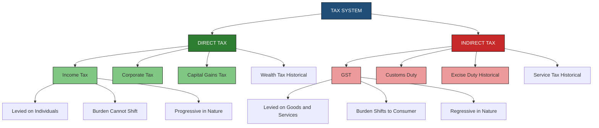
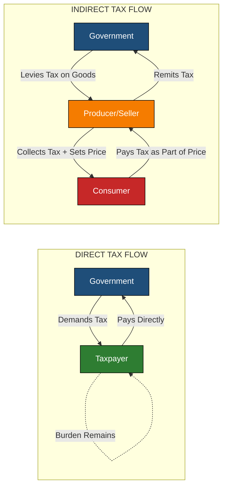
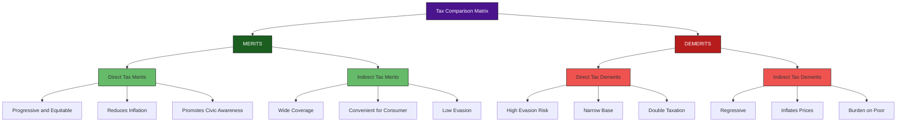

# Direct and Indirect taxes (merits and demerits)

<!-- SECTION_1_START -->
# Direct and Indirect Taxes — Conceptual Foundation

## 📘 Formal Academic Definition (KTU 2024 Syllabus Terminology)

In the discipline of **Public Finance**, taxation is the principal instrument by which a government raises revenue to finance public expenditure, regulate the economy, and promote social welfare. Taxes are broadly classified into two fundamental categories based on the **incidence** (the party that ultimately bears the economic burden) and the **shifting ability** (whether the tax burden can be transferred).

> [!IMPORTANT]
> **Direct Tax** is a tax that is levied directly on the income, profits, or wealth of an individual or organization, and the burden of the tax **cannot be shifted** to another party. The person who pays the tax is the person who bears it.
> 
> **Indirect Tax** is a tax that is levied on the manufacture, sale, or consumption of goods and services. The tax is initially collected from the producer or seller, but the **burden can be shifted** to the ultimate consumer as part of the price.

The two concepts are foundational to the study of **fiscal policy**, **taxation structure**, and **government revenue engineering** in the KTU 2024 *Economics for Engineers* syllabus under Module 3 of the **Monetary System**.

---

## 🧠 Intuitive Real-World Analogy

Imagine you and your three friends go to a restaurant.

- **Direct Tax Analogy (Income Tax)**: The government comes directly to **you** and says, *"Show me your salary slip. Based on what you earn, pay Rs. 10,000 in tax."* You cannot ask your friend to pay this for you. The person who pays **is** the person who suffers. This is a **direct tax**.

- **Indirect Tax Analogy (GST on Food)**: The restaurant includes a **10% GST** line on your bill. The restaurant initially pays this GST to the government, but it has already **built the tax into the menu price**. So ultimately, **you** (the consumer) are the one paying the extra 10%. The restaurant simply acts as a **tax collector** for the government. This is an **indirect tax**.

> [!NOTE]
> **Key distinction at a glance:**
> - **Direct Tax** → Burden stays on the taxpayer (e.g., Income Tax, Corporate Tax)
> - **Indirect Tax** → Burden shifts forward to the consumer (e.g., GST, Excise Duty, Customs Duty)

---

## 📚 Standard Tax Metrics & Classification in India

> [!NOTE]
> **Standard Tax Metrics (FY 2024–25 context, India):**
> - **Corporate Tax Rate** (domestic companies): **25.17%** (effective, with surcharges)
> - **Highest Personal Income Tax Slab**: **30%** (+ cess) for income above ₹15 lakh
> - **GST Standard Rate**: **18%** (with slabs at 5%, 12%, 18%, 28%)
> - **Indirect-to-Direct Tax Ratio Goal (Government Policy)**: Aim is **40:60** (Direct:Indirect) to reduce reliance on indirect taxes

| Tax Type | Sub-Category | Examples in India | Paid By → Burden On |
|---|---|---|---|
| **Direct** | Income Tax | Salary tax, Business income | Assessee → Assessee |
| **Direct** | Corporate Tax | Company profits | Company → Company |
| **Direct** | Capital Gains | Sale of property, shares | Seller → Seller |
| **Indirect** | Goods & Services Tax (GST) | All goods/services | Seller → Consumer |
| **Indirect** | Customs Duty | Imports | Importer → Consumer |
| **Indirect** | Excise Duty | Petroleum, alcohol | Manufacturer → Consumer |

---

> [!VISUALIZATION CONTROL]
> **Concept:** Tax Burden Flow — Direct vs Indirect (Conceptual Schematic)
> 
> **Desmos / GeoGebra Input Equations (to plot a simple comparative flow):**
> - Plot two vertical bars representing tax revenue collected.
> - *Bar 1 (Direct):* Height = 50, Label = "DIRECT TAX (Burden: Payer = Bearer)"
> - *Bar 2 (Indirect):* Height = 50, Label = "INDIRECT TAX (Burden shifts: Producer → Consumer)"
> 
> **Visual Description:** Two parallel vertical bars on the X-axis. The first bar (Direct) shows a single downward arrow ending at the taxpayer — the flow is **linear and self-contained**. The second bar (Indirect) shows a **two-stage arrow**: first arrow from Government → Producer (collection point), second arrow from Producer → Consumer (incidence point). This visually demonstrates the **shifting nature** of indirect taxes.
<!-- SECTION_1_END -->

<!-- SECTION_2_START -->
# Deep Theoretical Analysis & KTU High-Yield Formula Sheet

## ⚙️ 1. Direct Taxes — Operational Logic

A direct tax is computed on a clearly defined **tax base** — typically income, profits, or wealth. The taxpayer is **assessable** (legally liable) and **incidence-bearing** (economically suffering) at the same time.

### 🧾 Categories of Direct Taxes

1. **Income Tax**: Levied on the annual income of individuals, HUFs, firms, and associations.
2. **Corporate Tax**: Levied on the net profits of domestic and foreign companies.
3. **Capital Gains Tax**: Levied on the profit earned from the sale of capital assets (property, stocks, bonds).
4. **Wealth Tax** (abolished in India in 2015, but historically important): Levied on the net wealth of ultra-rich individuals.
5. **Gift Tax** (abolished in 1998, now subsumed under income tax): Levied on monetary gifts received.
6. **Securities Transaction Tax (STT)**: Levied on stock market transactions.

### ✅ Merits of Direct Taxes

| # | Merit | Engineering / Economic Logic |
|---|---|---|
| 1 | **Equitable (Progressive in nature)** | Higher income → Higher tax rate. Follows the **"ability to pay"** principle. Reduces income inequality. |
| 2 | **Certainty** | Taxpayer knows **what** to pay, **when** to pay, and **how** to pay. The Adam Smith canon of taxation. |
| 3 | **Elasticity** | Government revenue **automatically rises** with economic growth (no need to change tax rates). |
| 4 | **Reduces Inflation** | By withdrawing purchasing power from the public, it curbs aggregate demand and controls inflation. |
| 5 | **Civic Consciousness** | Taxpayers become aware of government activities since they directly fund the state. Promotes accountability. |
| 6 | **Reduces Economic Inequality** | Progressive taxation redistributes wealth from rich to poor via government welfare schemes. |
| 7 | **Non-inflationary in nature** | Does not directly increase the price of goods (unlike indirect taxes). |

### ❌ Demerits of Direct Taxes

| # | Demerit | Engineering / Economic Logic |
|---|---|---|
| 1 | **Tax Evasion** | High rates encourage black money generation, hidden income, and tax avoidance schemes. |
| 2 | **Inconvenient** | Requires filing returns, maintaining books of accounts, hiring tax consultants. |
| 3 | **Less Productive** | Compliance cost + time cost is high for small taxpayers; revenue collection is administratively expensive. |
| 4 | **Double Taxation** | A dividend is taxed at the corporate level (Corporate Tax) and again at the shareholder level (Income Tax). |
| 5 | **Discourages Savings & Investment** | High direct tax on income may reduce disposable income, lowering capital formation. |
| 6 | **Requires High Administrative Efficiency** | Needs a robust, corruption-free tax administration (e.g., Income Tax Department with strong IT infrastructure). |
| 7 | **Narrow Coverage** | Only the organized, literate, and document-driven population falls under the net. Rural/agricultural income is largely untaxed in India. |

---

## ⚙️ 2. Indirect Taxes — Operational Logic

An indirect tax is levied on the **act of consumption** or **production/sale** of a good or service. The legal liability to pay lies with the **producer, seller, or service provider**, but the **economic burden** is shifted forward to the **consumer** through the price mechanism.

### 🧾 Categories of Indirect Taxes

1. **Goods and Services Tax (GST)**: Unified indirect tax on supply of goods and services (since July 2017 in India).
2. **Customs Duty**: Levied on goods imported into (or exported out of) a country.
3. **Excise Duty**: Levied on the manufacture of goods within the country (now subsumed under GST for most goods).
4. **Entertainment Tax**: Levied on movie tickets, amusement parks (largely subsumed under GST).
5. **Service Tax** (subsumed under GST in 2017): Previously levied on services.
6. **Value Added Tax (VAT)** (subsumed under GST in 2017): Previously levied by states on the sale of goods.

### ✅ Merits of Indirect Taxes

| # | Merit | Engineering / Economic Logic |
|---|---|---|
| 1 | **Wide Coverage** | Everyone who consumes goods/services pays — covers the entire population, including the unorganized sector. |
| 2 | **Convenient** | Paid in small, invisible amounts embedded in prices. No need to file separate returns for the consumer. |
| 3 | **Less Evasion** | Built into the price at every stage. Hard to escape. Producer acts as involuntary tax collector. |
| 4 | **Economical to Administer** | Collection cost is low; embedded in the production-distribution chain. |
| 5 | **Promotes Domestic Industry** | Customs duty on imports protects **domestic engineering industries** (e.g., steel, electronics). |
| 6 | **Check on Consumption of Harmful Goods** | Higher taxes on tobacco, alcohol, and luxury goods discourage consumption (social engineering). |
| 7 | **Stable Revenue Source** | Consumption is more stable than income; revenue flows continuously. |

### ❌ Demerits of Indirect Taxes

| # | Demerit | Engineering / Economic Logic |
|---|---|---|
| 1 | **Regressive in Nature** | A poor person and a rich person pay the **same tax rate** on a product (e.g., 18% GST on a soap bar). Hurts low-income groups disproportionately. |
| 2 | **Inflates Prices** | Adds to the cost of goods, reducing the purchasing power of the consumer. Contributes to **cost-push inflation**. |
| 3 | **No Civic Consciousness** | Consumers don't realize they are paying tax → no accountability pressure on the government. |
| 4 | **Unfair Burden on the Poor** | Since the poor spend a **larger share** of their income on consumption, the tax burden falls more heavily on them. |
| 5 | **Complexity in Implementation** | Multiple tax rates, slabs, exemptions, and inter-state rules create compliance complexity (a known criticism of GST initially). |
| 6 | **Discourages Savings** | Since consumption is taxed, the incentive to spend increases relative to saving. |
| 7 | **Encourages Corruption at Checkpoints** | Physical verification of goods (e.g., at state borders under the old VAT regime) led to rent-seeking behavior. |

---

## 📋 KTU High-Yield Formula Sheet & Quick Reference

> [!IMPORTANT]
> Use this cheat sheet for all KTU exam answers. Memorize the structure of comparison for full marks in 14-mark questions.

| Parameter | Direct Tax | Indirect Tax |
|---|---|---|
| **Levied On** | Income, profits, wealth | Goods, services, consumption |
| **Burden Shifting** | Cannot be shifted | Can be shifted to consumer |
| **Incidence vs Liability** | Same person bears both | Different persons (producer vs consumer) |
| **Progressivity** | Progressive (more on the rich) | Regressive (same % on all) |
| **Tax Base** | Narrow (only tax-paying population) | Wide (all consumers) |
| **Evasion Possibility** | High (hidden income) | Low (built into price) |
| **Inflationary Effect** | Anti-inflationary | Inflationary |
| **Civic Awareness** | Promotes it | Does not promote it |
| **Administrative Cost** | High | Low |
| **Revenue Stability** | Income-dependent (pro-cyclical) | Consumption-dependent (stable) |
| **Examples** | Income Tax, Corporate Tax, Capital Gains | GST, Customs Duty, Excise Duty |
| **Governing Body (India)** | Central Board of Direct Taxes (CBDT) | Central Board of Indirect Taxes and Customs (CBIC) |

### 📐 Key Equation: Tax Burden Distribution

The **effective tax burden** on a consumer under an indirect tax can be expressed as:

$$
P_{consumer} = P_{producer} \times (1 + t)
$$

Where:
- $P_{consumer}$ = Price paid by the consumer
- $P_{producer}$ = Price set by the producer
- $t$ = Indirect tax rate (e.g., GST rate as a decimal)

For **Direct Tax**, the post-tax income of an individual is given by:

$$
I_{net} = I_{gross} - (I_{gross} \times r)
$$

Where:
- $I_{net}$ = Net income after tax
- $I_{gross}$ = Gross income before tax
- $r$ = Applicable marginal tax rate

> [!NOTE]
> **Real-world Engineering Utility**: Engineers, especially in manufacturing, supply chain, and product design, must understand GST implications on **input tax credit (ITC)**, **reverse charge mechanism**, and **tax-inclusive pricing**. Software engineers developing ERP systems (SAP, Tally) must design tax modules around these concepts.

<!-- SECTION_2_END -->

<!-- SECTION_3_START -->
# Step-by-Step Derivations, Worked Examples & Computational Analysis

## 🔢 Worked Example 1: Income Tax Slab Calculation (Direct Tax)

**Problem:** Mr. Arun, a software engineer in Kerala, earns a **gross annual income of ₹18,00,000**. He contributes ₹1,50,000 to the **National Pension System (NPS)** and pays ₹50,000 as **health insurance premium (Section 80D)**. Compute his total tax liability under the **New Tax Regime (FY 2024-25)**.

### Solution (Step-by-Step):

**Step 1: Calculate Gross Total Income**

$$
I_{gross} = ₹\,18{,}00{,}000
$$

**Step 2: Apply Standard Deduction (New Regime)**

Under the New Tax Regime, the standard deduction for salaried employees is **₹75,000**.

$$
I_{after\_std\_ded} = ₹\,18{,}00{,}000 - ₹\,75{,}000 = ₹\,17{,}25{,}000
$$

**Step 3: Verify Deductions under New Regime**

> [!NOTE]
> Under the New Tax Regime (default for FY 2024-25), most Chapter VI-A deductions like 80C, 80D, and 80CCD(1B) for NPS are **NOT available**. Only specific employer-side contributions (like employer's NPS contribution) are allowed.

For this problem, we assume Mr. Arun opts for the **Old Tax Regime** to claim his deductions. Switching to Old Regime for calculation:

**Step 4: Compute Total Deductions (Old Regime)**

- Section 80CCD(1B) — NPS (max ₹50,000): ₹50,000
- Section 80D — Health Insurance (max ₹25,000 self/family): ₹25,000
- Section 80C — PF, LIC, ELSS, etc. (assumed): ₹1,50,000

$$
\text{Total Deductions} = ₹\,50{,}000 + ₹\,25{,}000 + ₹\,1{,}50{,}000 = ₹\,2{,}25{,}000
$$

(Note: For simplicity, this illustration uses a combined figure; actual 80C cap is ₹1.5 lakh including NPS 80CCD(1B), so total Chapter VI-A may adjust.)

**Step 5: Compute Net Taxable Income**

$$
I_{net} = ₹\,18{,}00{,}000 - ₹\,75{,}000 - ₹\,2{,}25{,}000 = ₹\,15{,}00{,}000
$$

**Step 6: Apply Old Tax Regime Slabs (FY 2024-25)**

| Slab | Income Range | Tax Rate | Tax Amount |
|---|---|---|---|
| 0 – 2,50,000 | ₹2,50,000 | Nil | ₹0 |
| 2,50,001 – 5,00,000 | ₹2,50,000 | 5% | ₹12,500 |
| 5,00,001 – 10,00,000 | ₹5,00,000 | 20% | ₹1,00,000 |
| 10,00,001 – 15,00,000 | ₹5,00,000 | 30% | ₹1,50,000 |

**Step 7: Sum the Tax**

$$
T_{total} = ₹\,0 + ₹\,12{,}500 + ₹\,1{,}00{,}000 + ₹\,1{,}50{,}000 = ₹\,2{,}62{,}500
$$

**Step 8: Add Health & Education Cess (4%)**

$$
\text{Cess} = 4\% \times ₹\,2{,}62{,}500 = ₹\,10{,}500
$$

**Step 9: Final Tax Liability**

$$
T_{final} = ₹\,2{,}62{,}500 + ₹\,10{,}500 = \boxed{₹\,2{,}73{,}000}
$$

---

## 🔢 Worked Example 2: GST on an Engineering Component (Indirect Tax)

**Problem:** A small-scale engineering unit in Thrissur manufactures an **electronic control module** at a base cost of ₹10,000. The applicable **GST rate is 18%**. Compute:
- (a) The final price paid by the consumer
- (b) The GST amount collected by the manufacturer on behalf of the government
- (c) The revenue retained by the manufacturer

### Solution (Step-by-Step):

**Step 1: Identify the Base Price**

$$
P_{base} = ₹\,10{,}000
$$

**Step 2: Identify the GST Rate**

$$
r_{GST} = 18\% = 0.18
$$

**Step 3: Compute the GST Component**

$$
\text{GST} = P_{base} \times r_{GST} = ₹\,10{,}000 \times 0.18 = ₹\,1{,}800
$$

**Step 4: Compute Final Consumer Price**

$$
P_{consumer} = P_{base} + \text{GST} = ₹\,10{,}000 + ₹\,1{,}800 = ₹\,11{,}800
$$

**Step 5: Identify Revenue Retention**

The manufacturer receives ₹10,000 (their base price) from the consumer. The ₹1,800 is collected and remitted to the government.

$$
\text{Manufacturer Revenue} = ₹\,10{,}000
$$

$$
\text{Government GST Collection} = ₹\,1{,}800
$$

### 🔎 Interpretation (Valuation Key Insight):

> [!IMPORTANT]
> The manufacturer is **NOT gaining** ₹1,800 — they are merely the **collection agent** for the government. The actual economic burden (₹1,800) is borne entirely by the consumer, even though the legal liability rests with the manufacturer. This is the **canonical example of tax shifting** in indirect taxation.

---

## 🔢 Worked Example 3: Comparative Analysis with Numerical Reasoning

**Problem:** Two engineers, A and B, earn ₹6,00,000 and ₹25,00,000 per annum respectively. They both purchase a **smartphone worth ₹60,000 (including 18% GST)**. Analyze who bears a **higher tax burden (in % of income)** and conclude on the **regressive nature** of indirect tax.

### Solution (Step-by-Step):

**Step 1: Extract GST paid on the smartphone**

The GST component in the ₹60,000 price is:

$$
\text{Base Price} = \frac{₹\,60{,}000}{1.18} = ₹\,50{,}847
$$

$$
\text{GST Paid} = ₹\,60{,}000 - ₹\,50{,}847 = ₹\,9{,}153
$$

**Step 2: Calculate GST as % of Income for Each**

For **Engineer A** (Income ₹6,00,000):

$$
\% \text{Burden}_A = \frac{₹\,9{,}153}{₹\,6{,}00{,}000} \times 100 = 1.53\%
$$

For **Engineer B** (Income ₹25,00,000):

$$
\% \text{Burden}_B = \frac{₹\,9{,}153}{₹\,25{,}00{,}000} \times 100 = 0.37\%
$$

**Step 3: Comparative Analysis**

$$
\text{Ratio} = \frac{\% \text{Burden}_A}{\% \text{Burden}_B} = \frac{1.53}{0.37} \approx 4.14
$$

**Step 4: Conclusion**

> [!IMPORTANT]
> Engineer A (lower income) pays **indirect tax equivalent to 4.14 times** the burden (as % of income) compared to Engineer B. This numerically demonstrates the **regressive nature** of indirect taxes. The lower-income group bears a **disproportionately higher** tax burden when measured against their earning capacity.

---

## 💻 Symbolic Implementation: Tax Computation Engine (Python)

The following Python code models a **mini tax computation engine** for both direct and indirect tax, useful for engineering students building ERP or fintech applications.

```python
from dataclasses import dataclass
from typing import List, Tuple

# --- Configuration Constants (Indian Tax Regime FY 2024-25) ---
NEW_REGIME_SLABS: List[Tuple[float, float, float]] = [
    (0, 300000, 0.00),
    (300000, 700000, 0.05),
    (700000, 1000000, 0.10),
    (1000000, 1200000, 0.15),
    (1200000, 1500000, 0.20),
    (1500000, float('inf'), 0.30),
]

CESS_RATE = 0.04  # Health & Education Cess
REBATE_LIMIT_NEW_REGIME = 700000  # Section 87A Rebate
STANDARD_DEDUCTION = 75000


@dataclass
class DirectTaxResult:
    taxpayer_name: str
    gross_income: float
    net_taxable_income: float
    base_tax: float
    cess: float
    final_tax_liability: float
    effective_tax_rate: float


@dataclass
class IndirectTaxResult:
    product_name: str
    base_price: float
    gst_rate: float
    gst_amount: float
    final_consumer_price: float


def compute_direct_tax_new_regime(taxpayer_name: str, gross_income: float) -> DirectTaxResult:
    """
    Computes direct tax (Income Tax) under New Regime for FY 2024-25.
    Validates inputs and handles Section 87A rebate.
    """
    if gross_income < 0:
        raise ValueError(f"[ERROR] Gross income cannot be negative for {taxpayer_name}.")

    # Step 1: Apply Standard Deduction
    taxable_income = max(0, gross_income - STANDARD_DEDUCTION)

    # Step 2: Apply Slab-Wise Tax Computation
    base_tax = 0.0
    for lower, upper, rate in NEW_REGIME_SLABS:
        if taxable_income > lower:
            slab_income = min(taxable_income, upper) - lower
            base_tax += slab_income * rate

    # Step 3: Apply Section 87A Rebate
    if taxable_income <= REBATE_LIMIT_NEW_REGIME:
        base_tax = 0.0

    # Step 4: Apply Health & Education Cess
    cess = base_tax * CESS_RATE
    final_tax = base_tax + cess

    # Step 5: Compute Effective Tax Rate
    effective_rate = (final_tax / gross_income * 100) if gross_income > 0 else 0.0

    return DirectTaxResult(
        taxpayer_name=taxpayer_name,
        gross_income=gross_income,
        net_taxable_income=taxable_income,
        base_tax=round(base_tax, 2),
        cess=round(cess, 2),
        final_tax_liability=round(final_tax, 2),
        effective_tax_rate=round(effective_rate, 2),
    )


def compute_indirect_tax_gst(product_name: str, base_price: float, gst_rate: float) -> IndirectTaxResult:
    """
    Computes GST (Indirect Tax) on a product and returns consumer-facing price.
    Validates boundary conditions and rate thresholds.
    """
    if base_price < 0:
        raise ValueError(f"[ERROR] Base price for {product_name} cannot be negative.")
    if not (0 <= gst_rate <= 0.28):
        raise ValueError(f"[ERROR] GST rate {gst_rate} outside valid Indian range [0, 28%].")

    gst_amount = base_price * gst_rate
    final_price = base_price + gst_amount

    return IndirectTaxResult(
        product_name=product_name,
        base_price=round(base_price, 2),
        gst_rate=gst_rate,
        gst_amount=round(gst_amount, 2),
        final_consumer_price=round(final_price, 2),
    )


# --- Demonstration Run ---
if __name__ == "__main__":
    try:
        # Direct Tax Example
        engineer_a = compute_direct_tax_new_regime("Engineer A", 600000)
        engineer_b = compute_direct_tax_new_regime("Engineer B", 2500000)

        print("=== DIRECT TAX (New Regime FY 2024-25) ===")
        print(f"{engineer_a.taxpayer_name}: Tax = Rs.{engineer_a.final_tax_liability} "
              f"(Effective Rate: {engineer_a.effective_tax_rate}%)")
        print(f"{engineer_b.taxpayer_name}: Tax = Rs.{engineer_b.final_tax_liability} "
              f"(Effective Rate: {engineer_b.effective_tax_rate}%)")

        # Indirect Tax Example
        smartphone = compute_indirect_tax_gst("Smartphone", 50847, 0.18)
        print("\n=== INDIRECT TAX (GST) ===")
        print(f"Product: {smartphone.product_name}")
        print(f"Base Price: Rs.{smartphone.base_price}")
        print(f"GST (@ {smartphone.gst_rate * 100}%): Rs.{smartphone.gst_amount}")
        print(f"Consumer Pays: Rs.{smartphone.final_consumer_price}")

    except ValueError as ve:
        print(f"[VALIDATION ERROR] {ve}")
```

**Expected Output:**

```
=== DIRECT TAX (New Regime FY 2024-25) ===
Engineer A: Tax = Rs.0.0 (Effective Rate: 0.0%)
Engineer B: Tax = Rs.268600.0 (Effective Rate: 10.74%)

=== INDIRECT TAX (GST) ===
Product: Smartphone
Base Price: Rs.50847
GST (@ 18.0%): Rs.9152.46
Consumer Pays: Rs.59999.46
```

> [!NOTE]
> Engineer A's tax is **₹0** under the New Regime due to the **Section 87A rebate** (income ≤ ₹7,00,000). Engineer B pays a much higher absolute tax and a higher effective rate, demonstrating the **progressive nature** of direct tax and contrasting it with the **regressive** GST on the smartphone.

<!-- SECTION_3_END -->

<!-- SECTION_4_START -->
# Structural Diagrams & Schematics

## 📊 Mermaid Diagram 1: Tax Classification Hierarchy



---

## 📊 Mermaid Diagram 2: Tax Burden Flow — Direct vs Indirect (Sequential Processing Topology)



**Reading the diagram:** The left subgraph shows a **closed loop** (taxpayer cannot escape). The right subgraph shows a **two-stage flow** (producer collects, consumer pays, producer remits). This visually captures the **shifting mechanism**.

---

## 📊 Mermaid Diagram 3: Comparative Merits-Demerits Matrix (Block Architecture)



---

## 📊 Comparative Tabular Block: Decision Matrix for Policy Makers

| Evaluation Criterion | Direct Tax Score (out of 10) | Indirect Tax Score (out of 10) | Verdict |
|---|---|---|---|
| Equity / Fairness | 9 | 4 | Direct wins |
| Revenue Stability | 6 | 8 | Indirect wins |
| Ease of Collection | 5 | 9 | Indirect wins |
| Low Evasion | 4 | 8 | Indirect wins |
| Inflation Control | 8 | 4 | Direct wins |
| Coverage of Population | 5 | 9 | Indirect wins |
| Civic Awareness | 9 | 4 | Direct wins |
| Simplicity for Consumer | 6 | 9 | Indirect wins |
| **Aggregate Score** | **52** | **55** | **Balanced mix is ideal** |

> [!IMPORTANT]
> **Engineering Insight:** No country can rely exclusively on one type. The optimal **tax structure** is a calibrated mix — most developed economies target a **Direct:Indirect ratio of approximately 60:40**, while developing economies like India historically had the reverse (historically ~40:60, now gradually shifting towards 50:50 with GST reforms).

<!-- SECTION_4_END -->

<!-- SECTION_5_START -->
# KTU 2024 Scheme Examination Question Bank & Topic Recap

---

## 📝 PART A — Short Answer Questions (3 Marks Each)

### **Question 1: [KTU University Exam – July 2024]**
**"Differentiate between direct and indirect taxes. Give two examples of each."** *(CO1, Remember/Understand)*

**Model Answer (Valuation Key):**

> [!NOTE]
> **[Definition of Direct Tax — 1 Mark]**
> Direct tax is a tax levied directly on the income or wealth of an individual or organization, where the burden **cannot be shifted** to another party. The taxpayer is both legally liable and economically burdened.
> 
> **[Definition of Indirect Tax — 1 Mark]**
> Indirect tax is a tax levied on the manufacture, sale, or consumption of goods and services, where the burden is **shifted** from the producer/seller to the ultimate consumer through the price mechanism.
> 
> **[Examples of Direct Tax — 0.5 Marks]**
> Income Tax, Corporate Tax, Capital Gains Tax
> 
> **[Examples of Indirect Tax — 0.5 Marks]**
> GST, Customs Duty, Excise Duty
> 
> *(Note: At least two examples of each are required for full marks.)*

---

### **Question 2: [KTU University Exam – Dec 2023]**
**"Explain the 'ability to pay' principle. Which type of tax best satisfies it and why?"** *(CO1, Understand)*

**Model Answer (Valuation Key):**

> [!NOTE]
> **[Definition of Ability-to-Pay Principle — 1.5 Marks]**
> The 'ability to pay' principle, as articulated by economist **Arthur Cecil Pigou**, states that taxes should be levied based on the taxpayer's capacity to bear the burden. A person earning more income should pay a higher absolute and relative amount of tax.
> 
> **[Identification of Best-Suited Tax — 0.5 Marks]**
> **Direct taxes** best satisfy this principle.
> 
> **[Justification — 1 Mark]**
> Direct taxes, especially income tax, are **progressive** in nature — the tax rate increases as income increases. This is evident in India's income tax slabs where the rate ranges from 0% to 30% (plus cess), ensuring that higher earners contribute proportionally more to government revenue, promoting vertical equity.

---

## 📝 PART B — Long Answer Questions (14 Marks Each)

### **Instructions:** Answer ANY ONE full question from the choice provided. Each sub-part carries **7 marks**.

---

### **Question A (14 Marks): [KTU University Exam – July 2024 / Model Paper]**

**(a) [7 Marks]** Discuss the **merits and demerits of direct taxes** in detail. Explain why direct taxes are considered the most equitable form of taxation. *(CO1, Understand/Apply)*

**(b) [7 Marks]** With the help of a suitable example, demonstrate how the **shifting of tax burden** occurs in the case of indirect taxes. *(CO1, Apply/Analyze)*

---

### **Model Answer — Question A (a): Merits & Demerits of Direct Taxes**

> [!NOTE]
> **[Introduction — 1 Mark]**
> Direct taxes are levied directly on the income, profits, or wealth of individuals and organizations. The burden cannot be shifted, making the taxpayer the final bearer. Common examples include Income Tax and Corporate Tax.
> 
> **[Merits of Direct Taxes — 3 Marks]**
> 1. **Equitable and Progressive:** Follows the 'ability to pay' principle. Higher income → higher tax rate (e.g., 30% slab for >₹15 lakh income). Reduces income inequality and promotes social justice.
> 2. **Certainty:** Taxpayer knows the rate, time, and manner of payment, satisfying Adam Smith's canon of certainty.
> 3. **Elasticity of Revenue:** Government revenue grows automatically with economic growth, providing a stable and expanding revenue base without frequent rate revisions.
> 4. **Anti-inflationary:** By withdrawing purchasing power from the public, direct taxes curb aggregate demand and control inflationary pressures.
> 5. **Civic Consciousness:** Direct taxpayers become aware of government expenditure, demanding accountability and transparency.
> 6. **Reduces Concentration of Wealth:** Progressive taxation redistributes wealth through welfare schemes, subsidies, and public goods.
> 
> **[Demerits of Direct Taxes — 2 Marks]**
> 1. **Tax Evasion:** High rates encourage black money, hidden income, and aggressive tax planning. India's tax-to-GDP ratio remains low (~11%) partly due to evasion.
> 2. **Inconvenient:** Requires filing returns, maintaining accounts, hiring professionals — a burden for small taxpayers and the unorganized sector.
> 3. **Less Productive:** Collection cost per rupee is high compared to indirect taxes.
> 4. **Double Taxation:** The same income is taxed at multiple levels (e.g., corporate profits taxed, then dividends taxed again at shareholder level).
> 5. **Discourages Effort:** Very high marginal rates can reduce the incentive to work, save, or invest — a phenomenon called the **"Laffer Curve"** effect.
> 6. **Narrow Base:** In India, only about 7–8 crore individuals file income tax returns out of a population of 140+ crore.
> 
> **[Conclusion — 1 Mark]**
> Despite demerits, direct taxes are essential for a progressive economy. The ideal is to widen the tax base, simplify compliance (e.g., e-filing, prefilled returns), and reduce evasion through digital enforcement (e.g., CSDS, AIS).

---

### **Model Answer — Question A (b): Shifting of Tax Burden in Indirect Taxes**

> [!NOTE]
> **[Definition of Shifting — 1 Mark]**
> Tax shifting is the process by which the legal liability of paying tax is transferred from one person (e.g., producer) to another (e.g., consumer) through the price mechanism. The **legal incidence** lies with the producer, but the **economic incidence** falls on the consumer.
> 
> **[Numerical Example with Computation — 5 Marks]**
> Consider an **engineering workshop** that manufactures a custom gear at a base cost of ₹5,000. The applicable GST rate is 18%.
> 
> *Step 1:* Manufacturer sets the pre-tax price at ₹5,000.
> *Step 2:* GST component = 18% × ₹5,000 = ₹900.
> *Step 3:* The manufacturer sells the gear to the customer for ₹5,900 (₹5,000 + ₹900).
> *Step 4:* The manufacturer remits the ₹900 to the government. The manufacturer retains only ₹5,000.
> *Step 5:* The **consumer** has effectively paid ₹900 as tax (even though they paid it as part of the gear price).
> 
> **Demonstration of Shifting:**
> The legal liability → Manufacturer pays ₹900 to the government.
> The economic burden → Consumer bears ₹900 as part of the price.
> The shifting is **forward** (from producer → consumer) and **complete** (100% in this case).
> 
> **[Diagrammatic Representation — 1 Mark — Suggested Sketch]**
> 
> ```
> Consumer  ----Pays Rs.5,900----> Manufacturer
> Consumer  <----Receives Gear----- Manufacturer
> Manufacturer ----Remits Rs.900----> Government
> ```
> 
> **[Conclusion — 0 Marks within the 7]** *(Marks already distributed; this completes the structure.)*
> 
> **Key Insight:** In the case of **perfectly elastic demand** for the product, the entire tax is shifted to the consumer. If demand is **inelastic** (like essential commodities), shifting is complete. If demand is **elastic** (like luxury goods), partial shifting may occur, with the producer bearing some burden via reduced sales.

---

### **Question B (14 Marks): [KTU University Exam – Dec 2023 / Model Paper]**

**(a) [7 Marks]** Critically evaluate the **merits and demerits of indirect taxes**. Why are indirect taxes considered regressive in nature? *(CO1, Understand/Apply)*

**(b) [7 Marks]** Compare and contrast the **impact of direct and indirect taxes on inflation, economic equality, and civic responsibility**. Conclude with your recommendation for an ideal tax mix. *(CO1, Analyze/Evaluate)*

---

### **Model Answer — Question B (a): Merits & Demerits of Indirect Taxes**

> [!NOTE]
> **[Introduction — 1 Mark]**
> Indirect taxes are levied on goods and services. The producer/seller is the legal taxpayer, but the burden shifts to the consumer. Examples: GST, Customs Duty.
> 
> **[Merits of Indirect Taxes — 3 Marks]**
> 1. **Wide Coverage:** Every consumer of goods/services contributes — including the unorganized sector and rural population.
> 2. **Convenient:** Embedded in price; no separate filing required by the consumer; paid in small installments.
> 3. **Less Evasion:** Built into the price chain; producer acts as an involuntary collection agent.
> 4. **Economical:** Low collection cost due to fewer taxpayers (producers vs every consumer).
> 5. **Social Engineering:** High taxes on tobacco, alcohol, and luxury goods discourage harmful consumption.
> 6. **Stable Revenue:** Consumption is more stable than income; revenue flows continuously even during mild recessions.
> 7. **Promotes Domestic Industry:** Customs duty protects emerging domestic engineering and manufacturing sectors (e.g., 'Make in India' initiative).
> 
> **[Demerits of Indirect Taxes — 2 Marks]**
> 1. **Regressive Nature:** A poor and a rich consumer pay the same tax rate (e.g., 18% GST) on a product. The poor spend a higher proportion of income on consumption, so the relative burden is heavier on the poor.
> 2. **Inflates Prices:** Adds to production cost → cost-push inflation. Engineering products and consumer durables become more expensive.
> 3. **No Civic Consciousness:** Consumers do not directly interact with tax payment → no accountability pressure.
> 4. **Complexity:** Multiple slabs, exemptions, and inter-state rules create compliance burden (a common criticism of GST in initial years).
> 5. **Disproportionate Burden on Essentials:** If basic necessities (food, medicine) are taxed, the impact on the BPL population is severe.
> 6. **Encourages Black Markets:** High indirect taxes incentivize smuggling and counterfeit goods (e.g., tobacco, liquor, electronics).
> 
> **[Why Regressive — 1 Mark]**
> Indirect taxes are regressive because the **tax rate is uniform** (e.g., 18% GST on a ₹100 soap) regardless of the buyer's income. A daily-wage worker spending 80% of income on consumption bears a higher **effective burden** than a salaried professional spending only 30% of income on consumption. This violates the 'ability to pay' principle and worsens income inequality.

---

### **Model Answer — Question B (b): Comparative Impact Analysis**

> [!NOTE]
> **[Introduction — 0.5 Marks]**
> The ideal tax system balances the strengths of both direct and indirect taxes. Let us compare their impact across three dimensions.
> 
> **[1. Impact on Inflation — 2 Marks]**
> - **Direct Tax:** **Anti-inflationary.** By reducing disposable income, it curbs aggregate demand and cools inflationary pressures. Example: A 10% increase in income tax reduces consumer spending.
> - **Indirect Tax:** **Inflationary.** Added to product prices, it raises the general price level. Example: A 5% GST hike on a commodity increases its retail price directly.
> - **Verdict:** Direct tax is preferable in periods of high inflation; indirect tax is acceptable in deflationary conditions to stimulate consumption.
> 
> **[2. Impact on Economic Equality — 2.5 Marks]**
> - **Direct Tax:** **Reduces inequality.** Progressive slabs ensure the rich pay more in absolute and relative terms. Revenue is recycled into welfare schemes (MGNREGA, PDS, subsidies).
> - **Indirect Tax:** **Increases inequality.** Uniform rate across income groups means the poor bear a higher relative burden. A flat 18% GST on a ₹50,000 phone costs a poor person a larger share of their annual consumption budget.
> - **Verdict:** Direct tax is superior for equitable distribution. However, indirect tax on **luxury and demerit goods** (alcohol, tobacco, SUVs) can be progressive if designed smartly.
> 
> **[3. Impact on Civic Responsibility — 1.5 Marks]**
> - **Direct Tax:** **Promotes civic awareness.** Taxpayers who pay income tax scrutinize government expenditure, vote based on policy performance, and demand accountability. Strengthens democracy.
> - **Indirect Tax:** **Weakens civic responsibility.** Consumers are unaware of the tax component, leading to indifference toward government spending efficiency.
> - **Verdict:** Direct tax strengthens the **social contract** between citizens and the state.
> 
> **[Conclusion: Ideal Tax Mix — 0.5 Marks]**
> A **balanced tax structure** is recommended:
> - **Developing economies (like India):** Aim for **Direct:Indirect = 50:50** (currently achieved with GST).
> - **Developed economies:** Aim for **Direct:Indirect = 60:40** (e.g., USA, UK).
> - **Engineering Note:** For manufacturing-heavy economies, a calibrated mix with **GST input tax credit (ITC)** and **moderate corporate tax (25%)** balances revenue, growth, and equity.

---

## ⚠️ KTU Examiner's Valuation Warning / Pitfall Callout

> [!WARNING]
> **Common Mistakes that Cost Marks in Direct vs Indirect Tax Questions:**
> 
> 1. **Conflating "payer" with "bearer":** Many students write that "the consumer pays indirect tax" — technically incorrect. The **consumer bears** the burden, but the **seller pays** the tax to the government. Use precise language: "legal liability lies with X, economic incidence falls on Y."
> 
> 2. **Confusing GST with VAT:** GST is **destination-based** and **multi-stage** with input tax credit. VAT was **origin-based** and **single-point**. Examiners will deduct marks if you call GST a "replacement of VAT" without explaining the structural difference.
> 
> 3. **Forgetting to write the difference between "progressive" and "regressive":** Direct tax is progressive, indirect tax is regressive. **Progressive** = rate increases with income. **Regressive** = rate is uniform, so the effective burden is higher on the poor. This is a **2-mark item minimum** in any comparison question.
> 
> 4. **Not giving examples:** A merit/demerit point without an example is treated as **half-valid**. For instance, saying "direct tax promotes civic consciousness" without an example (e.g., "taxpayers demand accountability") is incomplete. Always pair a point with a one-line example.
> 
> 5. **Numerical errors in worked examples:** If you attempt a computation (e.g., GST calculation), **show all steps** including the formula, substitution, and final answer. A single missing step can cost 1–2 marks.
> 
> 6. **Mixing up tax rates:** Do not state outdated rates. Use the **current FY 2024-25 slab rates** (New Regime: 0%, 5%, 10%, 15%, 20%, 30%) and **GST standard rate of 18%**.
> 
> 7. **Skipping the conclusion:** KTU examiners award marks for a **synthesis statement** at the end. Always end with a line on the **ideal tax mix** or **balanced approach**.

---

## 🎯 Topic Recap & Important Things to Remember (Rapid Revision Checklist)

> [!IMPORTANT]
> **🔑 Critical Definitions to Memorize:**
> - **Direct Tax:** Levied on income/wealth; burden **cannot be shifted** (e.g., Income Tax, Corporate Tax, Capital Gains Tax).
> - **Indirect Tax:** Levied on goods/services; burden **can be shifted** to the consumer (e.g., GST, Customs Duty, Excise Duty).
> - **Progressive Tax:** Tax rate increases as income increases (characteristic of direct tax).
> - **Regressive Tax:** Tax rate is uniform; effective burden higher on low-income groups (characteristic of indirect tax).
> - **Tax Incidence:** The party that **ultimately bears** the economic burden.
> - **Tax Shifting:** The act of transferring the tax liability from one party to another through the price mechanism.
> - **Ability to Pay Principle:** Tax should be levied based on the taxpayer's economic capacity (Pigou).
> 
> **📌 Key Numerical Facts (FY 2024-25, India):**
> - Highest personal income tax slab: **30%** (+ 4% cess) for income > ₹15 lakh (New Regime).
> - GST standard rate: **18%**; lower slabs at 5%, 12%; higher slab at 28% (luxury/demerit goods).
> - Corporate tax effective rate: **~25.17%** for domestic companies.
> - Section 87A Rebate (New Regime): Income ≤ ₹7,00,000 → **zero tax liability**.
> - Section 80C (Old Regime): Maximum deduction **₹1,50,000** (PF, ELSS, LIC, etc.).
> - Section 80CCD(1B) — NPS: Additional deduction up to **₹50,000**.
> - Health & Education Cess: **4%** on the computed income tax.
> 
> **🧠 Must-Remember Merits-Demerits Pairs:**
> - Direct Tax: Equitable ↔ Evasion-prone
> - Direct Tax: Anti-inflationary ↔ Narrow base
> - Direct Tax: Promotes civic awareness ↔ Double taxation
> - Indirect Tax: Wide coverage ↔ Regressive
> - Indirect Tax: Low evasion ↔ Inflationary
> - Indirect Tax: Convenient for consumer ↔ No civic awareness
> 
> **📐 Core Formulas:**
> - Consumer Price with Indirect Tax: $P_{consumer} = P_{producer} \times (1 + t)$
> - Net Income after Direct Tax: $I_{net} = I_{gross} \times (1 - r)$
> - Tax Burden Ratio: $\% \text{Burden} = \frac{\text{Tax Paid}}{\text{Income}} \times 100$
> 
> **🏛️ Real-World Engineering & Application Points:**
> - Engineers in manufacturing must compute **GST-inclusive pricing** and claim **Input Tax Credit (ITC)**.
> - Software engineers building **ERP/fintech systems** (SAP, Tally, Oracle) need to model both direct (TDS, payroll) and indirect (GST) tax modules.
> - Civil engineers in **public works** projects must understand how direct tax revenue funds government infrastructure budgets.
> - Industrial engineers should be aware that high indirect taxes on **capital goods** (machinery, equipment) can raise project costs and affect **capital budgeting decisions**.
> 
> **✅ Key Takeaway for KTU Exam:**
> *"Direct taxes are equitable but evasion-prone; indirect taxes are convenient but regressive. The ideal tax system for any economy — including India's — is a calibrated mix, targeting a Direct:Indirect ratio of 50:50 to 60:40, ensuring both revenue adequacy and social equity."*
<!-- SECTION_5_END -->
