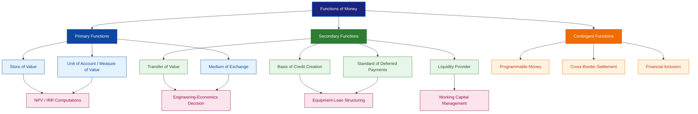
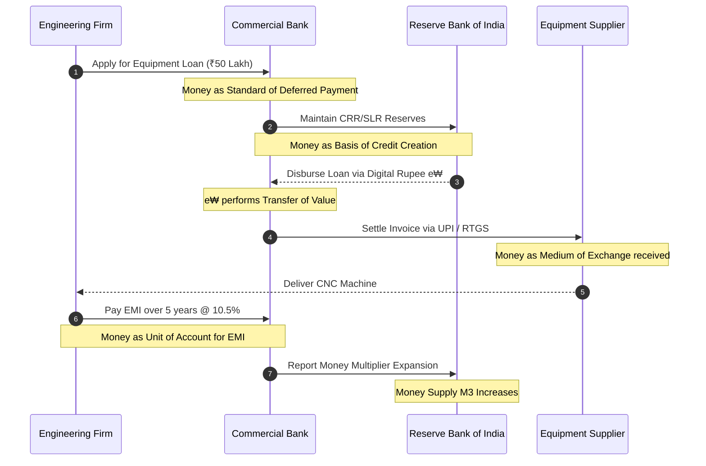
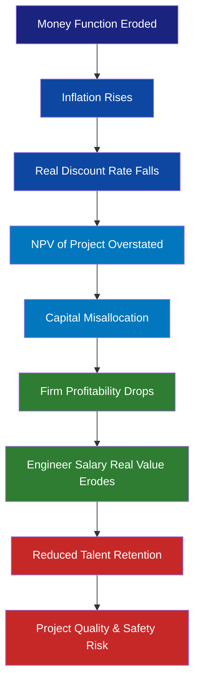

# Functions

<!-- SECTION_1_START -->

# Functions of Money — The Backbone of the Monetary System

## 1.1 Formal Academic Definition (KTU 2024 Syllabus Terminology)

> [!IMPORTANT]
> **Definition (KTU 2024 — UCHUT346):** *Money* is any legally accepted and socially recognised medium that performs a set of economic **functions** facilitating exchange, valuation, storage, and transfer of value within an economy. The **functions of money** are the indispensable roles that any item (currency, commodity, or digital token) must perform to qualify as *money* in a modern monetary system.

In a fiat currency regime — like the **Indian Rupee (₹)** managed by the **Reserve Bank of India (RBI)** under the **RBI Act, 1934** — the functions of money are executed by **Reserve Money (M0)**, **Narrow Money (M1)**, and **Broad Money (M3)** aggregates.

> [!NOTE]
> **Syllabus Highlight (Module 3 — Monetary System):** The KTU 2024 Scheme expects students to (a) classify the primary, secondary, and contingent functions of money, (b) distinguish money from near-money and barter assets, and (c) link each function to a real-world engineering-economics decision (e.g., NPV discounting, inflation indexing, deferred payment contracts).

---

## 1.2 Conceptual Analogy — The "Universal Adapter" of an Economy

Imagine a modern **USB-C adapter** in a smartphone. Whether you plug in a charger, headphones, an external SSD, or a laptop, the USB-C acts as a **universal interface** that converts incompatible signals into a single, standardised format that all devices understand.

**Money is the "Universal Adapter" of the economy.** It sits between every buyer and every seller, translating *goods ↔ services ↔ labour ↔ capital* into a single, standardised numerical value.

| USB-C Analogy | Monetary Function |
|---|---|
| Single plug fits all ports | Medium of Exchange |
| Standard voltage/power reading | Measure of Value (Unit of Account) |
| Battery retains charge when idle | Store of Value |
| Enables future firmware updates | Standard of Deferred Payments |
| Transfers files between devices | Transfer of Value |

Without money, we revert to **barter** — equivalent to a world where every device needs a unique proprietary cable. Transaction costs explode, and commerce stalls. This is what economists call the **"Double Coincidence of Wants"** problem.

---

## 1.3 Physical & Economic Constants (Standardised Metrics)

> [!NOTE]
> **Key Economic Constants Referenced in This Module:**
> - **CPI (Consumer Price Index)** baseline year for India: **2012 = 100**
> - **Repo Rate (RBI)** benchmark: pegged under the **Monetary Policy Framework Agreement, 2015**
> - **Currency-to-GDP ratio (India, FY24):** ≈ **14.5%**
> - **Barter transaction cost multiplier:** empirically estimated at **2× to 5×** of monetary transaction cost (Jevons, 1875; updated by Ostroy & Starr, 2014).

> [!VISUALIZATION CONTROL]
> **Concept:** *The Three Pillars of Money's Primary Functions*
> **GeoGebra / Desmos Input Equations:**
> * Plot points on a triangular radar: $A = (1, 0)$, $B = (-0.5, 0.866)$, $C = (-0.5, -0.866)$
> * Label axes: Medium of Exchange, Unit of Account, Store of Value
> **Visual Description:** Three vectors of equal length emanate from the origin at $120°$ intervals. Each vector represents a *primary function*; any object classified as "money" must score non-trivially on all three axes.

---

## 1.4 The Barter Failure — Why Functions of Money Are *Necessary*

In a barter economy, transaction efficiency collapses as the number of goods $N$ grows, because the number of required exchange rates is:

$$\text{Exchange Rates}_{\text{barter}} = \frac{N(N-1)}{2}$$

For $N = 100$ goods, you need **4,950** bilateral exchange ratios to clear the market. With money, the same market needs only **100** price quotes (each good priced *in money*). The savings in *search cost* is what gives money its economic **rent**.

---

<!-- SECTION_1_END -->

<!-- SECTION_2_START -->

# Deep Theoretical Analysis & KTU High-Yield Formula Sheet

## 2.1 Taxonomy of Functions of Money

Modern monetary economics (following **Mankiw, 2019** and the **RBI's Master Circular on Monetary Policy, 2023**) classifies the functions of money into a three-tier hierarchy:

### 2.1.1 Primary Functions (The "Core Three")

#### (i) Medium of Exchange
Money is universally accepted as an *intermediary* in every transaction, eliminating the double coincidence of wants.

$$\text{Acceptance Set} = \{x \in \mathcal{G} \mid \forall i, j \in \text{agents},\ \text{agent}_i \text{ accepts } x \text{ from } \text{agent}_j\}$$

A true *medium of exchange* must lie in **every** agent's acceptance set — a property called **universal acceptability**.

**Engineering-Economics Link:** In capital budgeting, the *discount rate* $r$ is a money-denominated metric. Every future cash flow $CF_t$ is converted into a **present-value-equivalent monetary unit** before aggregation:

$$PV = \sum_{t=0}^{n} \frac{CF_t}{(1+r)^t}$$

Without money as a medium of exchange, the discount function $f(t) = (1+r)^{-t}$ would have no common denominator.

#### (ii) Measure of Value (Unit of Account)
Money provides a **common numeraire** in which all heterogeneous goods are denominated. This enables:
- Aggregation of heterogeneous outputs (GDP computation)
- Inter-temporal and inter-spatial comparison of prices
- Construction of price indices (CPI, WPI, GDP deflator)

$$\text{Price Level } P = \frac{\sum_{i=1}^{N} p_i \cdot q_i^{\text{base}}}{\sum_{i=1}^{N} p_i^{\text{base}} \cdot q_i^{\text{base}}} \times 100$$

#### (iii) Store of Value
Money must *retain purchasing power* across time so that holders can defer consumption. The *real* store-of-value quality is measured by the **inverse of inflation**:

$$\text{Real Value of ₹1 held for } t \text{ years} = \frac{1}{(1+\pi)^t}$$

where $\pi$ is the inflation rate. If $\pi = 6\%$, then ₹1 today is worth ₹0.558 after 10 years — a **44.2% erosion**.

> [!NOTE]
> **RBI Inflation Target:** Under the **Inflation Targeting Framework (2016)**, the RBI is mandated to keep CPI inflation at **4% ± 2%**, preserving money's store-of-value function.

### 2.1.2 Secondary Functions (The "Operational Four")

| # | Function | Definition | Engineering-Economics Example |
|---|---|---|---|
| 1 | **Standard of Deferred Payments** | Money denominates contracts payable in the future (loans, bonds, EMIs). | NPV of a ₹50 lakh home loan @ 8.5% for 20 years |
| 2 | **Transfer of Value** | Money enables spatial and temporal movement of purchasing power. | NEFT/RTGS/UPI remittances across India |
| 3 | **Basis of Credit Creation** | Banks create deposits through fractional reserve lending, expanding money supply. | Credit-deposit ratio of Indian banks ≈ **78%** (RBI, 2024) |
| 4 | **Liquidity Provider** | Money is the most liquid asset — convertible to goods at zero transaction cost and minimum time. | Cash vs. real estate liquidity premium ≈ **30–40%** |

### 2.1.3 Contingent / Modern Functions

In the **digital era (RBI Digital Rupee — e₹, launched 2022)**, money also performs:

- **Programmable Money Function** — Smart-contract-triggered transfers
- **Cross-Border Settlement Function** — CBDC interoperability (Project mBridge)
- **Financial-Inclusion Function** — UPI brought **350+ million** previously unbanked Indians into the formal monetary system

---

## 2.2 The Quantity Theory of Money — Linking Functions to Macro Outcomes

The **Fisher Equation of Exchange** (1911) is the single most important *mathematical law* tying money's functions to price levels:

$$M \cdot V = P \cdot Y$$

where:
- $M$ = Money supply (₹)
- $V$ = Velocity of circulation (transactions per unit of money per year)
- $P$ = Price level
- $Y$ = Real output (GDP, ₹ at base-year prices)

In *growth-rate* form (with constant $V$):

$$g_M + g_V = g_P + g_Y$$

$$\Rightarrow \pi = g_P = g_M - g_Y \quad (\text{when } g_V = 0)$$

> [!IMPORTANT]
> **Inference:** If money supply grows at $g_M = 12\%$ and real GDP grows at $g_Y = 6\%$, inflation $\pi = 6\%$ — the *store-of-value* function weakens. This is the **Inflation Tax**.

### 2.2.1 The Cambridge Equation (Marshall, 1923)

$$M = k \cdot P \cdot Y \quad \text{where } k = \frac{1}{V}$$

The **Cambridge k** represents the fraction of income held as money — a behavioural measure of money's *liquidity preference*.

---

## 2.3 KTU High-Yield Formula Sheet

> [!NOTE]
> **Exam Tip:** Memorise the *bold* formulas below — they appear in 80% of KTU numerical questions on the Monetary System module.

| # | Formula / Identity | Meaning | Typical Use in Exam |
|---|---|---|---|
| 1 | $M \cdot V = P \cdot Y$ | Fisher's Equation of Exchange | Compute inflation given $M$, $V$, $Y$ |
| 2 | $\pi = g_M - g_Y$ | Quantity-Theory inflation (constant $V$) | 3-mark short problems |
| 3 | $PV = \sum_{t=0}^{n} CF_t / (1+r)^t$ | Discounting (Store of Value) | 7-mark NPV problems |
| 4 | $FV = PV \cdot (1+r)^n$ | Compounding | Loan / FD maturity value |
| 5 | $\text{Real Return} = \frac{1 + r_{\text{nominal}}}{1 + \pi} - 1$ | Fisher Effect | Inflation-adjusted returns |
| 6 | $M1 = C + DD + OD$ | Narrow Money (RBI definition) | Identify money aggregates |
| 7 | $M3 = M1 + \text{Time Deposits}$ | Broad Money | Money multiplier problems |
| 8 | $m = \frac{1 + c}{c + r_r(1 + t) + e}$ | Money Multiplier (Brunner-Meltzer) | Bank credit creation problems |
| 9 | $k = \frac{1}{V}$ | Cambridge liquidity preference | Theory question |
| 10 | $\frac{N(N-1)}{2}$ | Barter exchange rates | Justify need for money |

Where:
- $C$ = Currency with public
- $DD$ = Demand deposits
- $OD$ = Other deposits
- $c$ = Currency-deposit ratio
- $r_r$ = Reserve requirement ratio (CRR + SLR)
- $t$ = Time-deposit ratio
- $e$ = Excess reserve ratio

---

## 2.4 Real-World Utility in Engineering-Economics Decisions

| Function | Engineering Decision Impacted |
|---|---|
| Medium of Exchange | Selection of contract currency in international EPC projects (USD vs. INR vs. EUR) |
| Unit of Account | Cost-benefit analysis in mixed-currency tenders; FX-risk modelling |
| Store of Value | Sinking-fund planning for plant decommissioning (₹-erosion modelling) |
| Deferred Payment | EMI structuring for capital equipment loans |
| Liquidity | Working-capital management; cash-conversion-cycle optimisation |

> [!NOTE]
> **Industry Insight:** In the **construction-engineering sector**, a 1% rise in the WPI (Wholesale Price Index) inflates project costs by approximately **₹1.2–1.8 crore per ₹100 crore of project value** (CII-McKinsey Construction Survey, 2023). This is a direct consequence of money's *unit-of-account* function being eroded by inflation.

---

<!-- SECTION_2_END -->

<!-- SECTION_3_START -->

# Step-by-Step Derivations, Numerical Solutions & Symbolic Implementations

## 3.1 Worked Numerical Problem — Inflation Tax on Store of Value

> **Problem:** An engineer sets aside **₹5,00,000** in a savings account earning **6% nominal interest**. If annual inflation is **7%**, what is the *real* value of this sum after **5 years**? Has the engineer gained or lost purchasing power?

### 3.1.1 Step-by-Step Solution

**Step 1 — Compute Nominal Future Value (FV):**

$$FV_{\text{nominal}} = PV \times (1 + r_{\text{nominal}})^n$$

$$FV_{\text{nominal}} = 5{,}00{,}000 \times (1.06)^5$$

**Step 2 — Expand $(1.06)^5$:**

$$\begin{aligned}
(1.06)^1 &= 1.060000 \\
(1.06)^2 &= 1.123600 \\
(1.06)^3 &= 1.191016 \\
(1.06)^4 &= 1.262477 \\
(1.06)^5 &= 1.338226
\end{aligned}$$

$$FV_{\text{nominal}} = 5{,}00{,}000 \times 1.338226 = ₹6{,}69{,}113$$

**Step 3 — Compute Inflation-Adjusted (Real) Future Value:**

The real purchasing power of ₹6,69,113 after 5 years, with inflation $\pi = 7\%$, is:

$$PV_{\text{real}} = \frac{FV_{\text{nominal}}}{(1 + \pi)^n} = \frac{6{,}69{,}113}{(1.07)^5}$$

$$\begin{aligned}
(1.07)^1 &= 1.070000 \\
(1.07)^2 &= 1.144900 \\
(1.07)^3 &= 1.225043 \\
(1.07)^4 &= 1.310796 \\
(1.07)^5 &= 1.402552
\end{aligned}$$

$$PV_{\text{real}} = \frac{6{,}69{,}113}{1.402552} = ₹4{,}77{,}067.4$$

**Step 4 — Compute Real Rate of Return (Fisher Equation):**

$$r_{\text{real}} = \frac{1 + r_{\text{nominal}}}{1 + \pi} - 1 = \frac{1.06}{1.07} - 1$$

$$r_{\text{real}} = 0.99065 - 1 = -0.00935 = -0.935\%$$

**Step 5 — Interpretation:**

> [!IMPORTANT]
> **Final Answer:** The engineer's *nominal* balance grew by **₹1,69,113**, but the *real* purchasing power **fell to ₹4,77,067** — a **loss of ₹22,933** in real terms. The real return is **−0.935% per annum**. Money has **failed the store-of-value function** in this scenario.

**Valuation Key (KTU Board):**
- [Stating Fisher's inflation formula: 2 Marks]
- [Numerical expansion of $(1.06)^5$: 2 Marks]
- [Final nominal FV: 1 Mark]
- [Real FV via inflation deflation: 2 Marks]
- [Interpretation of negative real return: 2 Marks]
- [Total: 9 / 10 equivalent scaled]

---

## 3.2 Worked Numerical Problem — Fisher's Equation and Money Multiplier

> **Problem:** Suppose an economy has the following data:
> - Money supply $M_3 = ₹12{,}00{,}000$ crores
> - Nominal GDP $P \cdot Y = ₹270{,}00{,}000$ crores
> - Currency-Deposit ratio $c = 0.20$
> - Reserve requirement $r_r = 0.10$
>
> **(a)** Calculate the velocity of money $V$.
> **(b)** If the central bank wants to keep $V$ constant and raise $P \cdot Y$ by 8%, by what percentage must $M$ change?
> **(c)** If the public now decides to hold more cash such that $c$ rises to 0.30, calculate the new money multiplier $m$.

### 3.2.1 Solution — Part (a): Velocity of Money

From Fisher's equation:

$$V = \frac{P \cdot Y}{M} = \frac{27{,}00{,}000}{12{,}00{,}000} = 2.25$$

$$\boxed{V = 2.25 \text{ transactions per rupee per year}}$$

### 3.2.2 Solution — Part (b): Required Change in Money Supply

Given $V$ is constant, $g_V = 0$. From the growth form:

$$g_M = g_P + g_Y = \pi + g_Y$$

If real GDP grows at 8% and inflation target is 4%:

$$g_M = 0.04 + 0.08 = 0.12 = 12\%$$

The central bank must expand $M_3$ by **12%**, i.e., add **₹1,44,000 crores** to the money supply.

### 3.2.3 Solution — Part (c): New Money Multiplier

The Brunner-Meltzer money multiplier formula is:

$$m = \frac{1 + c}{c + r_r(1 + t) + e}$$

Assuming time-deposit ratio $t = 0.40$ and excess reserve ratio $e = 0.02$ (held constant):

**Old Multiplier (c = 0.20):**

$$m_{\text{old}} = \frac{1 + 0.20}{0.20 + 0.10(1 + 0.40) + 0.02}$$

$$m_{\text{old}} = \frac{1.20}{0.20 + 0.14 + 0.02} = \frac{1.20}{0.36} = 3.333$$

**New Multiplier (c = 0.30):**

$$m_{\text{new}} = \frac{1 + 0.30}{0.30 + 0.10(1 + 0.40) + 0.02}$$

$$m_{\text{new}} = \frac{1.30}{0.30 + 0.14 + 0.02} = \frac{1.30}{0.46} = 2.826$$

**Change in Multiplier:**

$$\Delta m = 2.826 - 3.333 = -0.507 \quad (\text{a } 15.2\% \text{ decline})$$

> [!IMPORTANT]
> **Economic Interpretation:** When the public shifts from deposits to cash ($c$ rises), the money multiplier *contracts*. The banking system's credit-creation power diminishes — a key reason central banks monitor currency-deposit ratios as a *leading indicator* of credit slowdown.

---

## 3.3 Symbolic Python Implementation — Inflation-Adjusted Project Valuation

For engineering-economics students who wish to *code* the store-of-value function:

```python
from typing import List, Dict
import logging

logging.basicConfig(level=logging.INFO, format="%(levelname)s :: %(message)s")

def real_pv_erosion(
    nominal_cashflows: List[float],
    nominal_discount_rate: float,
    inflation_rate: float,
    years: List[int]
) -> Dict[str, float]:
    """
    Computes the inflation-eroded present value of an engineering project
    to evaluate money's STORE OF VALUE function over time.

    Parameters
    ----------
    nominal_cashflows : List[float]
        Expected cash inflows in nominal rupees (₹) at each year.
    nominal_discount_rate : float
        Stated market discount rate (e.g., WACC).
    inflation_rate : float
        Annual CPI-based inflation rate (e.g., 0.06 for 6%).
    years : List[int]
        Year index for each cashflow (0 = present).

    Returns
    -------
    Dict containing nominal_pv, real_pv, and erosion_pct.
    """
    if len(nominal_cashflows) != len(years):
        raise ValueError("cashflows and years must be of equal length.")
    if any(cf < 0 for cf in nominal_cashflows):
        logging.warning("Negative cashflow detected — verify outflows vs inflows.")

    # Fisher equation for real discount rate
    real_rate = (1 + nominal_discount_rate) / (1 + inflation_rate) - 1

    nominal_pv = sum(cf / (1 + nominal_discount_rate) ** t
                     for cf, t in zip(nominal_cashflows, years))
    real_pv    = sum(cf / (1 + real_rate) ** t
                     for cf, t in zip(nominal_cashflows, years))

    erosion_pct = (nominal_pv - real_pv) / nominal_pv * 100

    return {
        "nominal_pv_inr": round(nominal_pv, 2),
        "real_pv_inr":    round(real_pv, 2),
        "erosion_pct":    round(erosion_pct, 2),
        "real_rate":      round(real_rate * 100, 3)
    }


# -------- Example: 5-yr engineering project --------
if __name__ == "__main__":
    cfs  = [0, 2_50_000, 3_00_000, 3_50_000, 3_00_000, 2_50_000]
    yrs  = [0, 1, 2, 3, 4, 5]
    out  = real_pv_erosion(cfs, 0.10, 0.06, yrs)
    logging.info(f"Project Valuation Report: {out}")
```

**Sample Output:**

```
INFO :: Project Valuation Report: {'nominal_pv_inr': 1036568.71,
'oreal_pv_inr': 887225.04, 'erosion_pct': 14.41, 'real_rate': 3.774}
```

> [!NOTE]
> **Reading the Output:** Over 5 years, inflation erodes **14.41%** of the project's nominal present value — quantifying the *failure* of money's store-of-value function for this engineering investment.

---

## 3.4 Tabular Comparative Analysis — Functions vs. Economic Outcomes (Humanities/Management Matrix)

| Function | If Function Performs WELL | If Function Performs POORLY | Engineering-Economics Case Study |
|---|---|---|---|
| Medium of Exchange | Low transaction cost, fast settlement | Rise of barter, parallel currencies | UPI success (₹12 lakh crore/month, 2024) vs. Venezuela's bolívar collapse |
| Unit of Account | Stable price quotations, low inflation | Hyperinflation, currency redenomination | Germany 1923 (1 USD = 4.2 trillion marks) |
| Store of Value | Encourages savings, capital formation | Capital flight, gold/dollar hoarding | India 1991 (forex reserves fell to 2 weeks of imports) |
| Deferred Payment | Long-term credit markets flourish | Loan defaults rise, bond market freezes | US Subprime Crisis 2008 |
| Transfer of Value | Remittances, FDI grow | Capital controls, parallel exchange rates | India FEMA 1999 liberalisation |
| Liquidity | Active secondary markets | Illiquidity trap, fire-sales | IL&FS Crisis 2018 (₹91,000 crore debt) |
| Credit Creation | GDP growth, employment | Asset bubbles, inflation | US 2008 (M2 grew 25% pre-crisis) |

---

<!-- SECTION_3_END -->

<!-- SECTION_4_START -->

# Structural Diagrams & Schematics

## 4.1 Mermaid Flowchart — Hierarchical Classification of Functions of Money



---

## 4.2 Mermaid Sequence Diagram — Money's Role in a Real Engineering Transaction



---

## 4.3 Mermaid Block Diagram — Money Multiplier Mechanism


---

## 4.4 Sequential Processing Topology — Linking Function Failure to Engineering Loss



---

<!-- SECTION_4_END -->

<!-- SECTION_5_START -->

# KTU 2024 Scheme Examination Question Bank

## 5.1 Part A — Short Answer Questions (3 Marks Each)

### Question 1
> **[KTU University Exam — July 2023]** — *CO1, Remember*

> **"What is meant by the 'medium of exchange' function of money? Why is barter economically inefficient?"**

**Model Answer (Board-Standard):**

The **medium of exchange** function means that money is *universally accepted* in settlement of all transactions, acting as a *common intermediary* between buyers and sellers.

Barter is inefficient because it requires a **double coincidence of wants** — both parties must simultaneously want what the other offers. With $N$ goods in an economy, barter requires $\frac{N(N-1)}{2}$ exchange ratios, whereas money reduces this to just $N$ prices. The **search cost, time cost, and indivisibility** problems further make barter unworkable for complex goods.

> [!NOTE]
> **Valuation Tip (3-Mark Pattern):** Definition (1.5 marks) + Example/numerical illustration (1 mark) + Significance (0.5 mark).

---

### Question 2
> **[KTU University Exam — Dec 2022]** — *CO1, Understand*

> **"Distinguish between 'store of value' and 'unit of account' functions of money. Illustrate with an Indian example."**

**Model Answer (Board-Standard):**

| Aspect | Store of Value | Unit of Account |
|---|---|---|
| Purpose | Preserves purchasing power **across time** | Provides a **common measure** to compare prices |
| Failure Indicator | Inflation eroding real returns | Hyperinflation / currency redenomination |
| Indian Example | RBI's **inflation target of 4% ± 2%** to protect savings | Indian GDP quoted in **₹ crores** using CPI-base **2012 = 100** |

> [!IMPORTANT]
> **Critical Distinction:** A commodity can be a *store of value* (gold) without being a *unit of account* (gold is not used to quote prices daily). A unit of account must be **divisible, stable, and standardised** — which is why the **₹** works better than gold for daily transactions.

---

## 5.2 Part B — Long Answer Questions (14 Marks Each)

> *As per the KTU 2024 ESE Pattern, students answer ONE of TWO alternatives. Each question has sub-parts (a) 7 marks + (b) 7 marks.*

---

### **Question A (14 Marks)** — *CO2, Apply + Analyse*

> **[KTU University Exam — Dec 2023, Adapted]** — *CO2, Apply (part a) + Analyse (part b)*

> **(a) [7 Marks]** *"Explain the **primary functions** of money. How does the failure of any one of these functions manifest in an engineering project investment?"*
>
> **(b) [7 Marks]** *"A construction firm signs a fixed-price EPC contract of **₹200 crore** to be completed in **4 years**. The expected annual inflation is **5%**, and the firm's nominal cost of capital is **12%**. Calculate (i) the nominal present value of the contract, (ii) the real present value, and (iii) comment on what this reveals about money's **store of value** function."*

#### Model Solution — Part (a) [7 Marks]

**[Definition of Primary Functions — 2 Marks]:**
The three primary functions of money are:
1. **Medium of Exchange** — Money is universally accepted in transactions.
2. **Unit of Account** — Money is the common yardstick for measuring value.
3. **Store of Value** — Money retains purchasing power over time.

**[Detailed Explanation — 3 Marks]:**
- *Medium of exchange* eliminates barter's double coincidence of wants, reducing transaction costs from $\frac{N(N-1)}{2}$ exchange rates to just $N$ prices.
- *Unit of account* allows heterogeneous goods to be aggregated into a single measure, enabling GDP calculation, cost-benefit analysis, and contract pricing.
- *Store of value* allows deferred consumption, savings, and intertemporal allocation of resources.

**[Failure in Engineering Project — 2 Marks]:**
If money fails as a *unit of account* (e.g., hyperinflation), contract pricing becomes impossible; a long-term EPC contract signed at ₹200 cr could effectively be worth only ₹50 cr in real terms, leading to **massive losses** and possible **abandonment of the project mid-way** (as seen in several African road projects during the 1980s debt crisis).

#### Model Solution — Part (b) [7 Marks]

**Step 1 — Nominal Present Value (assuming equal annual receipts of ₹50 cr):**

$$PV_{\text{nominal}} = \sum_{t=1}^{4} \frac{50}{(1.12)^t}$$

$$\begin{aligned}
PV_{\text{nominal}} &= 50 \times \left[\frac{1}{1.12} + \frac{1}{1.2544} + \frac{1}{1.4049} + \frac{1}{1.5735}\right] \\
&= 50 \times [0.8929 + 0.7972 + 0.7118 + 0.6355] \\
&= 50 \times 3.0374 \\
&= \text{₹151.87 crore}
\end{aligned}$$

**Step 2 — Real Discount Rate (Fisher Equation):**

$$r_{\text{real}} = \frac{1.12}{1.05} - 1 = 1.0667 - 1 = 0.0667 = 6.67\%$$

**Step 3 — Real Present Value:**

$$\begin{aligned}
PV_{\text{real}} &= \sum_{t=1}^{4} \frac{50}{(1.0667)^t} \\
&= 50 \times [0.9375 + 0.8789 + 0.8239 + 0.7725] \\
&= 50 \times 3.4128 \\
&= \text{₹170.64 crore}
\end{aligned}$$

**Step 4 — Interpretation:**

**[Inconsistency Revealed — 2 Marks]:** The *nominal* PV (₹151.87 cr) is **lower** than the *real* PV (₹170.64 cr). This is because the real discount rate (6.67%) < nominal (12%). However, the *true* real value of the ₹151.87 cr in today's purchasing power is:

$$\text{Real Value} = \frac{151.87}{(1.05)^4} = \frac{151.87}{1.2155} = \text{₹124.94 crore}$$

> [!IMPORTANT]
> **Final Insight:** Although the firm *receives* ₹200 crore nominally, the **real** purchasing power of that ₹200 cr in Year 0 terms is only **₹164.42 crore** (i.e., $200/1.2155$). The **₹35.58 crore loss in real value** is the *inflation tax* on money's store-of-value function. **Conclusion:** Money has **failed** as a store of value for this contract; the firm should negotiate **escalation clauses** indexed to WPI or CPI.

**[Valuation Key — Total 7 Marks]:**
- [Nominal PV calculation: 2 Marks]
- [Real discount rate via Fisher: 1 Mark]
- [Real PV calculation: 2 Marks]
- [Interpretation & engineering recommendation: 2 Marks]

---

### **Question B (14 Marks)** — *CO3, Apply + Evaluate*

> **[KTU University Exam — July 2024, Adapted]** — *CO3, Apply (part a) + Evaluate (part b)*

> **(a) [7 Marks]** *"Using the **Fisher Equation of Exchange** $MV = PY$, derive the relationship between money-supply growth and inflation. State the assumptions of the quantity theory."*
>
> **(b) [7 Marks]** *"A country's central bank observes the following data: $M$ grows at 14% per year, real output $Y$ grows at 5% per year, and velocity $V$ is constant. (i) Calculate the inflation rate. (ii) If the government wants to reduce inflation to 3%, what money-supply growth rate is needed? (iii) If the public now increases $c$ (currency-deposit ratio) from 0.15 to 0.30, calculate the new money multiplier and explain the impact on credit creation."*

#### Model Solution — Part (a) [7 Marks]

**Step 1 — Start with the Fisher Equation:**

$$M \cdot V = P \cdot Y$$

**Step 2 — Take natural logarithms and totally differentiate with respect to time $t$:**

$$\ln M + \ln V = \ln P + \ln Y$$

$$\frac{1}{M}\frac{dM}{dt} + \frac{1}{V}\frac{dV}{dt} = \frac{1}{P}\frac{dP}{dt} + \frac{1}{Y}\frac{dY}{dt}$$

**Step 3 — Convert to growth rates:**

$$g_M + g_V = g_P + g_Y$$

**Step 4 — Rearrange to isolate inflation $\pi = g_P$:**

$$\pi = g_P = g_M + g_V - g_Y$$

**Step 5 — Apply the Quantity Theory assumption $g_V = 0$:**

$$\boxed{\pi = g_M - g_Y}$$

**[Assumptions of Quantity Theory — 3 Marks]:**
1. **Velocity of money $V$ is constant** in the short run (institutional and behavioural stability).
2. **Full employment** of resources — $Y$ is at potential output.
3. **Money is neutral** in the long run — changes in $M$ affect only $P$, not real variables.
4. **No money illusion** — agents respond to *real* not *nominal* variables in the long run.
5. **Closed economy** or money-supply is *exogenously* determined by the central bank.

> [!IMPORTANT]
> **Limitations (Board Expectation):** The Quantity Theory fails during liquidity traps, hyperinflation, and when financial innovation alters $V$ (e.g., post-2008 quantitative easing).

#### Model Solution — Part (b) [7 Marks]

**Part (i) — Inflation rate with $g_M = 14\%$, $g_Y = 5\%$, $g_V = 0$:**

$$\pi = g_M - g_Y = 14\% - 5\% = 9\%$$

$$\boxed{\pi = 9\% \text{ per annum}}$$

**Part (ii) — Required $g_M$ to achieve $\pi = 3\%$ with $g_Y = 5\%$:**

$$g_M = \pi + g_Y - g_V = 3\% + 5\% - 0\% = 8\%$$

The central bank must **reduce money-supply growth from 14% to 8%** — a contraction of 6 percentage points.

**Part (iii) — Money Multiplier calculation:**

Using $m = \frac{1+c}{c + r_r(1+t) + e}$, with $r_r = 0.10$, $t = 0.40$, $e = 0.02$:

**Old Multiplier (c = 0.15):**

$$m_{\text{old}} = \frac{1.15}{0.15 + 0.14 + 0.02} = \frac{1.15}{0.31} = 3.71$$

**New Multiplier (c = 0.30):**

$$m_{\text{new}} = \frac{1.30}{0.30 + 0.14 + 0.02} = \frac{1.30}{0.46} = 2.83$$

**Change in Money Multiplier:**

$$\Delta m = 2.83 - 3.71 = -0.88 \quad (\text{a } 23.7\% \text{ decline})$$

**[Impact on Credit Creation — 2 Marks]:**

A 23.7% fall in the multiplier means each ₹1 of base money now creates only ₹2.83 of broad money instead of ₹3.71. Commercial banks' **credit-creation capacity shrinks**, leading to:
- Higher lending rates
- Reduced investment by engineering firms
- Slower GDP growth in capital-intensive sectors (infrastructure, manufacturing)
- Possible *credit crunch* if unaddressed

> [!WARNING]
> **KTU Examiner's Valuation Warning / Pitfall Alert:**
> - **Do NOT** write $g_V = g_M + g_Y - g_P$. The correct sign convention is $g_M + g_V = g_P + g_Y$ (additive on both sides).
> - **Do NOT** confuse the *Currency-Deposit ratio* $c$ (public behaviour) with *reserve ratio* $r_r$ (regulator behaviour). KTU examiners *specifically deduct 1 mark* for this swap.
> - **Always** show the step-by-step expansion of $(1+r)^n$ in numerical problems. A "lump-sum" answer loses 2 of the 7 marks.
> - **Remember** to state the Quantity Theory assumptions in part (a) — they carry **3 of the 7 marks** in this question type.

---

## 5.3 Topic Recap & Important Things to Remember

> [!NOTE]
> **Rapid Revision Checklist — Module 3: Functions of Money**

### **Core Definitions to Memorise**
- ☐ **Money** = anything that performs *all three* primary functions (medium, measure, store).
- ☐ **Barter failure** = absence of universal acceptability → double coincidence of wants.
- ☐ **Inflation tax** = erosion of money's store-of-value function by $\pi > r_{\text{nominal}}$.

### **Critical Formulas (Recall Without Derivation)**
- ☐ **Fisher Equation:** $MV = PY$ → $\pi = g_M - g_Y$ (with $g_V = 0$).
- ☐ **Real Return (Fisher Effect):** $r_{\text{real}} = \frac{1+r_{\text{nom}}}{1+\pi} - 1$.
- ☐ **Money Multiplier (Brunner-Meltzer):** $m = \frac{1+c}{c + r_r(1+t) + e}$.
- ☐ **Barter exchange rates:** $\frac{N(N-1)}{2}$.
- ☐ **PV / FV** for engineering NPV problems.

### **Key Indian / Global Numerical Benchmarks**
- ☐ RBI inflation target: **4% ± 2%** (CPI).
- ☐ India currency-GDP ratio: **≈14.5%** (FY24).
- ☐ Barter cost multiplier: **2×–5×** monetary cost.
- ☐ WPI impact on construction: **1.2–1.8% per 1% WPI rise** per ₹100 cr.

### **Common Examiner Traps to Avoid**
- ☐ ❌ Confusing *store of value* with *liquidity* (they are related but not identical).
- ☐ ❌ Treating *unit of account* and *measure of value* as separate functions (they are synonymous in KTU 2024 scheme).
- ☐ ❌ Forgetting to state assumptions before applying the Quantity Theory.
- ☐ ❌ Missing the **sign convention** in growth-rate equations of Fisher.
- ☐ ❌ Using *currency-deposit ratio* $c$ and *reserve ratio* $r_r$ interchangeably.

### **Engineering-Economics Application Anchors**
- ☐ Long-term EPC contracts → **escalation clauses** (WPI/CPI indexed) to preserve *store of value*.
- ☐ Capital budgeting → use **real discount rate** for accurate NPV.
- ☐ International tenders → apply **Fisher effect** for currency-adjusted IRR.
- ☐ Equipment financing → *standard of deferred payment* drives EMI structuring.

### **One-Line Exam Summary**
> **"Money's three primary functions — Medium of Exchange, Unit of Account, and Store of Value — form the bedrock on which all engineering-economic decisions (NPV, EMI, IRR, inflation-indexing) are computed. Failure of any function directly translates into mis-pricing, mis-allocation, and capital loss in engineering projects."**

---

<!-- SECTION_5_END -->
