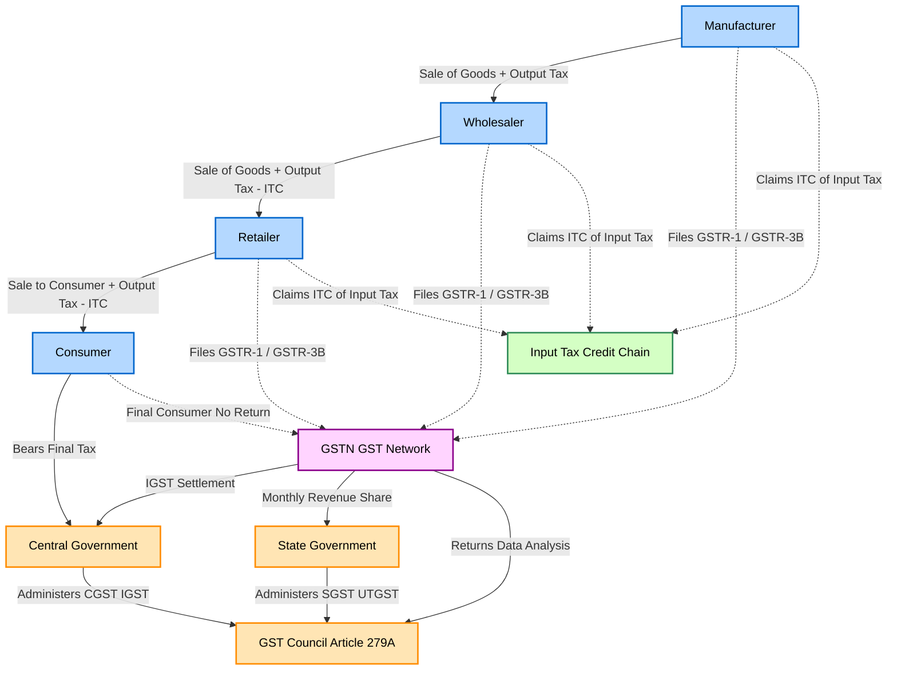
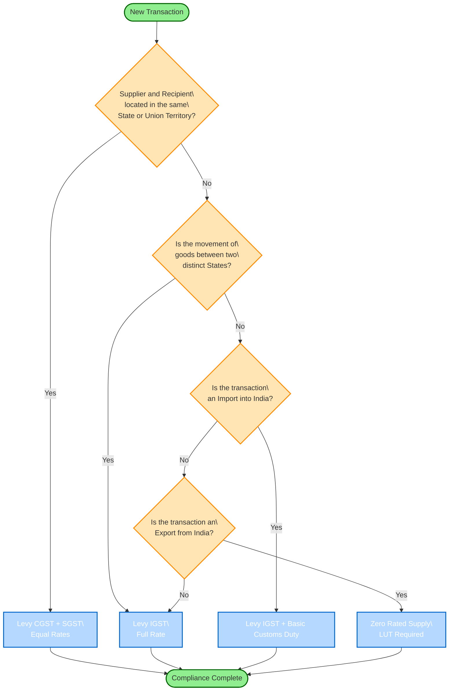
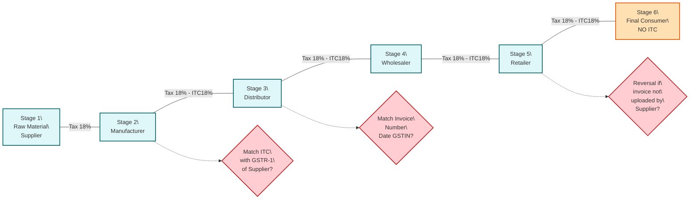

# GST

<!-- SECTION_1_START -->

# GST (Goods and Services Tax) — Module 3, Monetary System

## 1.1 Formal Academic Definition (KTU 2024 Syllabus Standard)

> [!IMPORTANT]
> **Goods and Services Tax (GST)** is a comprehensive, multi-stage, destination-based indirect tax levied on the **value addition** at every stage of the supply chain, with the full set-off benefit of input tax through the **Input Tax Credit (ITC)** mechanism. It subsumes a host of central and state indirect taxes into a single, unified, technology-driven tax architecture.

In the exact terminology of the **101st Constitutional Amendment Act, 2016**, GST is a concurrent levy where both the **Central Government** and the **State Governments** simultaneously tax a single transaction of intra-state supply, while inter-state supplies and imports are taxed exclusively by the Central Government.

The **GST Council** (Article 279A) — comprising the Union Finance Minister, the Minister of State for Finance, and the Finance Ministers of every State — is the apex constitutional body that recommends rates, procedures, exemptions, and threshold limits.

### 1.2 Conceptual Analogy — The "Pipeline" Intuition

Imagine water flowing through a long pipe:

- **Old Regime (Pre-GST):** Every pipe owner (manufacturer → wholesaler → retailer) charges a **fresh tax on the FULL pipe cost**, including the tax already paid upstream. The water keeps getting taxed at every joint — a phenomenon called **tax cascading** or **tax on tax**.

- **New Regime (GST):** Each pipe owner pays tax *only on the value they added* (the fitting, the welding, the connection). A **receipt (Input Tax Credit)** is given for the tax already paid by the previous owner. Effectively, the **final consumer alone bears the entire tax**, and the entire pipe network runs with a single, clean ledger.

This is the philosophical core: **One Nation, One Tax, One Market.**

### 1.3 Types of GST — The Four Pillars

| Abbreviation | Full Form | Levied By | Applies To |
|:---:|:---|:---|:---|
| **CGST** | Central GST | Central Government | Intra-state supply |
| **SGST** | State GST | State Government | Intra-state supply |
| **IGST** | Integrated GST | Central Government | Inter-state supply & imports |
| **UTGST** | Union Territory GST | Central Government | Supply within a Union Territory (without legislature) |

> [!NOTE]
> **Key Board Exam Insight:** For every intra-state transaction, **CGST rate = SGST rate**, and together they equal the **applicable GST rate**. For inter-state transactions, **IGST rate = CGST rate + SGST rate**.

### 1.4 Standard GST Slab Structure (India)

| Slab | Items Commonly Covered |
|:---:|:---|
| **0%** | Essential items — fresh fruits, milk, eggs, curd, bread, salt, bindi, sindoor, educational services, healthcare |
| **5%** | Economy items — sugar, tea, coffee, spices, edible oil, medicine, transport, small restaurants |
| **12%** | Processed food, computers, mobile phones (pre-2018), butter, ghee |
| **18%** | Most items — capital goods, industrial inputs, IT services, telecom, financial services, restaurants (AC) |
| **28%** | Luxury & demerit — cars, cement, pan masala, tobacco, aerated drinks, 5-star hotel accommodation |
| **28% + Cess** | Super-luxury & sin goods — large SUVs, tobacco products |

> [!VISUALIZATION CONTROL]
> **Concept:** GST as a stack of cascading tax layers replaced by a single flat destination tax
> **GeoGebra / Desmos Input Equations:**
> * $f_{old}(x) = 0.18 \cdot (1.05 \cdot x) \cdot (1.12 \cdot x) \cdot (1.18 \cdot x)$ — exponential cascade under pre-GST
> * $f_{new}(x) = 0.18 \cdot x$ — single flat 18% under GST
> **Visual Description:** Plot the old regime as an exploding exponential curve, and the new regime as a gentle straight line. Observe how the cumulative tax burden diverges sharply as the supply chain length increases.

<!-- SECTION_1_END -->

<!-- SECTION_2_START -->

# Deep Theoretical Analysis & KTU High-Yield Formula Sheet

## 2.1 The Pre-GST Tax Architecture (Why GST Was Needed)

Before **1st July 2017**, the Indian indirect tax system suffered from:

1. **Tax Cascading:** VAT on Excise, Service Tax on VAT — taxes stacking on taxes.
2. **Multiple Compliances:** Each state had a different VAT law, plus separate central statutes.
3. **Inter-state Check Posts:** Physical barriers that delayed goods and inflated logistics cost.
4. **No Input Tax Credit for Services:** Manufacturers could not claim credit for service taxes paid on advertising, transport, banking, etc.
5. **Litigation & Classification Disputes:** Multiplicity led to massive litigation at tribunals and High Courts.

> [!IMPORTANT]
> **KTU Board-Standard Phrase:** "GST is a value-added tax aimed at eliminating cascading effect, ensuring seamless input tax credit, and creating a unified national market."

## 2.2 GST Calculation — The Standard Operating Math

### 2.2.1 Computing Output Tax (Tax on Sale)

$$\text{Output GST} = \text{Taxable Value} \times \text{Applicable GST Rate (\%)}$$

### 2.2.2 Computing Input Tax Credit (ITC) Claim

$$\text{Eligible ITC} = \text{Tax paid on inputs} \times \frac{\text{Eligible Use}}{\text{Total Use}}$$

(Pro-rata reversal applies for inputs used partly for taxable and partly for exempt supplies.)

### 2.2.3 Net GST Payable (The Master Equation)

$$\boxed{\text{Net GST Payable} = \text{Output GST} - \text{Eligible Input Tax Credit (ITC)}}$$

### 2.2.4 Inter-State vs Intra-State — The Allocation Logic

For an **intra-state** supply of taxable value $T$ at rate $r$:

$$\text{CGST} = T \times \frac{r}{2} \quad , \quad \text{SGST} = T \times \frac{r}{2}$$

For an **inter-state** supply of taxable value $T$ at rate $r$:

$$\text{IGST} = T \times r$$

### 2.2.5 Reverse Charge Mechanism (RCM)

Under RCM, the **recipient** (not the supplier) pays GST. The recipient can still claim this as ITC **only if** the inward supply is used for further taxable supply.

$$\text{Net Liability under RCM} = \text{GST paid under RCM} - \text{ITC claimed}$$

## 2.3 KTU Formula Sheet / Cheat Sheet

| Concept | Formula | Unit / Notes |
|:---|:---|:---|
| Output Tax | $OT = TV \times R$ | TV = Taxable Value, R = Rate |
| Input Tax Credit (Full) | $ITC = \sum (Input\ Tax\ on\ eligible\ purchases)$ | INR |
| Net GST Payable | $N = OT - ITC$ | Can be negative → Carry forward as ITC |
| Intra-State Split | $CGST = SGST = \dfrac{TV \times R}{2}$ | Total burden $= TV \times R$ |
| Inter-State | $IGST = TV \times R$ | Collected by Centre, shared via IGST Settlement |
| GST Invoice Value | $GV = TV \times (1 + R)$ | Invoice Value = Taxable Value + GST |
| Reverse Charge GST | $RCM_{GST} = TV \times R$ | Payable by Recipient |
| Composition Tax (Manufacturer) | $Turnover \times 1\%$ | No ITC allowed |
| Composition Tax (Trader) | $Turnover \times 0.5\%$ | Goods only, no services |
| Composition Tax (Restaurant) | $Turnover \times 5\%$ | Service only, no ITC |
| GST Compensation Cess | $GV_{cess} = TV \times C_{rate}$ | On specified luxury/sin goods |
| Time of Supply (Goods) | Earlier of: Invoice date OR Last date to issue invoice OR Receipt of payment | Section 12 |
| Time of Supply (Services) | Earlier of: Invoice date OR Date of provision OR Receipt of payment | Section 13 |
| Threshold Limit (Normal States) | Annual Turnover $\geq$ **₹40,00,000** | Goods & Services combined |
| Threshold Limit (Special Category) | Annual Turnover $\geq$ **₹10,00,000** | NE States, Himachal, Uttarakhand, etc. |

## 2.4 Real-World Engineering & CS Applications

| Application | Why GST Matters |
|:---|:---|
| **ERP / SAP Modules (MM, SD, FI)** | Every invoice must carry HSN/SAC code, GSTIN, split CGST/SGST/IGST — engineering teams building billing engines must encode tax logic precisely. |
| **E-commerce Aggregators** | TCS @ 1% under Sec 52; platforms (Amazon, Flipkart) deduct and deposit to government. |
| **Logistics & Supply Chain** | Inter-state movement without e-Way Bill attracts penalty of tax amount or ₹10,000–₹25,000, whichever is higher. |
| **Banking & Financial Services** | Most financial services taxed at **18%**; loan processing fees attract GST, changing effective interest cost calculations. |
| **Construction & Real Estate** | Under-construction properties attract 5% (no ITC) or 1% (with ITC) — crucial for project costing and feasibility analysis. |
| **Renewable Energy Projects** | Solar panels attract 5% (vs. 18% on conventional electrical items) — a direct project cost lever. |

> [!NOTE]
> **Engineer's Takeaway:** In a typical BoQ (Bill of Quantities), an engineering manager can reduce landed cost by 10–18% simply by correctly claiming ITC, which directly improves the **Net Present Value (NPV)** of any capital project.

<!-- SECTION_2_END -->

<!-- SECTION_3_START -->

# Step-by-Step Derivations & Worked Numerical Solutions

## 3.1 Worked Example 1 — Intra-State Supply with ITC

> **Problem Statement:** M/s Precision Tools Pvt. Ltd. (Kerala) manufactured a machine. Taxable value of output = **₹5,00,000**. The company purchased raw materials worth **₹2,00,000** on which 18% GST was paid. The machine is sold at 18% GST. Calculate the net GST payable to the government.

### Step 1: Compute Output Tax (OT)

The machine is sold within Kerala → **Intra-state supply** at **18%**.

$$OT_{total} = ₹5{,}00{,}000 \times 18\% = ₹90{,}000$$

Split equally between CGST and SGST:

$$OT_{CGST} = ₹90{,}000 \times \frac{1}{2} = ₹45{,}000$$

$$OT_{SGST} = ₹90{,}000 \times \frac{1}{2} = ₹45{,}000$$

### Step 2: Compute Input Tax Credit (ITC)

Raw materials purchased within Kerala at 18% → CGST + SGST paid.

$$ITC_{CGST} = ₹2{,}00{,}000 \times 9\% = ₹18{,}000$$

$$ITC_{SGST} = ₹2{,}00{,}000 \times 9\% = ₹18{,}000$$

$$ITC_{total} = ₹18{,}000 + ₹18{,}000 = ₹36{,}000$$

> **Assumption:** Raw materials are used 100% in the manufacture of taxable output → 100% ITC eligible. *(If used partly for exempt goods, pro-rata reversal applies.)*

### Step 3: Compute Net GST Payable

$$\text{Net CGST} = OT_{CGST} - ITC_{CGST} = ₹45{,}000 - ₹18{,}000 = ₹27{,}000$$

$$\text{Net SGST} = OT_{SGST} - ITC_{SGST} = ₹45{,}000 - ₹18{,}000 = ₹27{,}000$$

$$\text{Total Net GST} = ₹27{,}000 + ₹27{,}000 = \boxed{₹54{,}000}$$

### Step 4: Valuation Key Points (KTU Examiner's Marker)

| Step | Marks Allocated |
|:---|:---:|
| Correct identification of intra-state supply | 1 |
| Calculation of Output Tax and CGST/SGST split | 2 |
| Computation of Input Tax Credit | 2 |
| Net GST payable (final answer) | 2 |

---

## 3.2 Worked Example 2 — Inter-State Supply with IGST

> **Problem Statement:** ABC Engineers (Bengaluru, Karnataka) sells an industrial boiler to Beta Industries (Kochi, Kerala). Taxable value = **₹10,00,000**. Rate = 18%. Compute: (a) the invoice value, (b) IGST liability, (c) breakup if the buyer had to import the same to its Kerala warehouse.

### Part (a) — Invoice Value

Since Bengaluru → Kochi, this is **inter-state supply**.

$$IGST = ₹10{,}00{,}000 \times 18\% = ₹1{,}80{,}000$$

$$\text{Invoice Value} = ₹10{,}00{,}000 + ₹1{,}80{,}000 = ₹11{,}80{,}000$$

### Part (b) — IGST Liability

The supplier (ABC Engineers) collects ₹1,80,000 as IGST and deposits it to the **Central Government**.

### Part (c) — IGST Settlement & Credit Utilisation

The buyer (Beta Industries) can use this IGST credit in the following **mandatory order** (Section 49(5) CGST Act):

$$\text{IGST credit} \rightarrow \text{used to pay IGST} \rightarrow \text{then CGST} \rightarrow \text{then SGST}$$

So the **₹1,80,000 IGST credit** can offset:
1. Any IGST liability of Beta Industries (no expiry).
2. Any CGST liability (up to the available amount).
3. Any SGST liability (up to the available amount).

> **Implication:** This is why the **Input Tax Credit matching** in the GSTN portal is critical — mismatches lead to **auto-population errors** and show-cause notices under Section 73 / Section 74.

---

## 3.3 Worked Example 3 — Reverse Charge Mechanism (Services)

> **Problem Statement:** A software firm in Bangalore receives legal services from a senior advocate (advocate service is reverse-charged under Sec 9(3)). Invoice value = **₹2,00,000**, GST @ 18%. Who pays GST? Show the working.

### Step 1: Identify Liability

Legal services by an advocate to a business entity are specified under **reverse charge** — the **recipient** (the software firm) pays GST, not the advocate.

### Step 2: Compute Reverse Charge GST

$$RCM_{GST} = ₹2{,}00{,}000 \times 18\% = ₹36{,}000$$

Of this:
- CGST under RCM = ₹18,000
- SGST under RCM = ₹18,000

### Step 3: ITC Eligibility

Since the recipient is a **software firm with output services also at 18%**, the ₹36,000 paid under RCM is **fully eligible as ITC**.

### Step 4: Net Cash Outflow

$$\text{Net RCM Cash Outflow} = ₹36{,}000 \text{ (RCM paid)} - ₹36{,}000 \text{ (ITC)} = ₹0$$

However, the **compliance burden remains** — the firm must:
- Self-invoice the inward supply
- Pay RCM GST by the **20th of the next month**
- File **GSTR-1** with the inward reverse charge line item

---

## 3.4 Worked Example 4 — Tax on MRP (Restaurant Case)

> **Problem Statement:** A restaurant inside a 5-star hotel charges **₹1,180 (inclusive of GST) per person** for a meal. Find the GST at 18% and the base price.

### Derivation

Let base price = $B$.

$$B + B \times 0.18 = 1180$$

$$B \times 1.18 = 1180$$

$$B = \frac{1180}{1.18} = ₹1000$$

$$\text{GST} = 1180 - 1000 = ₹180$$

> [!IMPORTANT]
> **Board Exam Pitfall:** When the price is given as **MRP inclusive of GST**, students often forget to **remove the GST from the base** before applying the rate. The correct technique is **backward division by $(1 + R)$**, not multiplication by $R$ on the gross amount.

### Python Verification (Reference Implementation)

```python
from decimal import Decimal, ROUND_HALF_UP

def gst_from_inclusive(inclusive_price: Decimal, rate: Decimal) -> dict:
    """
    Compute base price and GST component from an MRP that is inclusive of GST.
    
    Args:
        inclusive_price: The MRP (Maximum Retail Price) printed on the invoice.
        rate: GST rate as a decimal (e.g., Decimal("0.18") for 18%).
    
    Returns:
        Dictionary with base_price and gst_amount, both rounded to 2 decimals.
    """
    if inclusive_price <= 0:
        raise ValueError("Inclusive price must be positive.")
    if not (Decimal("0") <= rate <= Decimal("1")):
        raise ValueError("Rate must be between 0 and 1.")
    
    base_price = inclusive_price / (Decimal("1") + rate)
    gst_amount = inclusive_price - base_price
    
    base_price = base_price.quantize(Decimal("0.01"), rounding=ROUND_HALF_UP)
    gst_amount = gst_amount.quantize(Decimal("0.01"), rounding=ROUND_HALF_UP)
    
    return {"base_price": base_price, "gst_amount": gst_amount}


# Test the function
result = gst_from_inclusive(Decimal("1180.00"), Decimal("0.18"))
print(result)
# Output: {'base_price': Decimal('1000.00'), 'gst_amount': Decimal('180.00')}
```

---

## 3.5 Worked Example 5 — Composition Scheme Comparison

| Parameter | Regular Scheme | Composition Scheme |
|:---|:---|:---|
| Tax Rate | 5 / 12 / 18 / 28% | **1%** (Manufacturer), **0.5%** (Trader), **5%** (Restaurant) |
| ITC Allowed | Yes | **No** |
| Inter-State Supply | Allowed | **Not Allowed** |
| Tax Invoice | Yes | **Bill of Supply** (no tax collected) |
| Compliance | Monthly returns | **Quarterly** GSTR-4 |
| Threshold | ₹40 lakh | **₹1.5 Cr** (Goods), ₹50 lakh (Services) |

> **Engineering Insight:** For a contract manufacturer with thin margins, the **composition scheme** reduces working-capital lock-in (since no ITC cycle needs to be tracked) but **eliminates ITC** on raw material purchases — a classic **liquidity vs. cost** trade-off. Decision must be made via NPV of working-capital benefit vs. lost credit.

### Numerical Comparison

| Head | Regular Scheme | Composition Scheme |
|:---|---:|---:|
| Purchase of Raw Material | ₹10,00,000 | ₹10,00,000 |
| Output Turnover | ₹14,00,000 | ₹14,00,000 |
| Output Tax @18% / 1% | ₹2,52,000 | ₹14,000 |
| ITC Available | ₹1,80,000 | ₹0 |
| **Net GST Payable** | **₹72,000** | **₹14,000** |
| **Tax Savings under Composition** | — | **₹58,000** |

> **Conclusion:** Composition appears beneficial numerically, but the supplier cannot collect GST from buyer, so buyer **loses ₹1,80,000 ITC** downstream. In a B2B chain, **Regular Scheme is almost always superior**.

<!-- SECTION_3_END -->

<!-- SECTION_4_START -->

# Structural Diagrams & Schematics

## 4.1 GST Architecture — The Three-Layer Flow



> [!NOTE]
> **Observation in the diagram:** Notice how the **Input Tax Credit Chain (I)** flows in the *opposite direction* of the goods, ensuring that every taxpayer has been compensated for the tax paid upstream. The **GSTN (H)** is the digital backbone that auto-populates this credit across returns — an engineering marvel of distributed ledger design.

---

## 4.2 Decision Flow — Intra-State vs Inter-State



---

## 4.3 The Five Structural Reforms in Pre-GST vs GST — Comparative Topology

| Pre-GST Subsumed Taxes | Governing Body | Post-GST Status |
|:---|:---|:---|
| Central Excise Duty | CBIC | **Subsumed** into CGST |
| Service Tax | CBIC | **Subsumed** into CGST |
| Additional Customs Duty (CVD) | CBIC | **Replaced** by IGST on imports |
| Special Additional Duty (SAD) | CBIC | **Replaced** by IGST |
| State VAT / Sales Tax | State Commercial Tax Dept | **Subsumed** into SGST |
| Central Sales Tax (CST) | Centre | **Phased Out** (subsumed into IGST) |
| Entry Tax / Octroi / LBT | State / Local Bodies | **Subsumed** into GST |
| Entertainment Tax | State / Local | **Subsumed** (except local bodies) |
| Luxury Tax | State | **Subsumed** into GST |
| Purchase Tax | State | **Subsumed** into GST |

> [!IMPORTANT]
> **Engineering Mnemonic — "EVFACES-PLE"**: Excise, VAT/Service, Fashion(CVD/SAD), Additional(Addl), CST, Entry, Purchase, Luxury, Entertainment.

---

## 4.4 ITC Chain — Sequential Processing Topology Matrix



<!-- SECTION_4_END -->

<!-- SECTION_5_START -->

# KTU 2024 Scheme Examination Question Bank & Topic Recap

## 5.1 Part A — Short Answer Questions (3 Marks Each)

### Question 1 [KTU University Exam — July 2023] — CO1, Remember

**Q: Define Goods and Services Tax (GST). Mention any four indirect taxes that have been subsumed by GST.**

**Model Answer:**

GST is a comprehensive, multi-stage, destination-based indirect tax introduced on **1st July 2017** under the **101st Constitutional Amendment Act, 2016**, levied on the value addition at every stage with full set-off benefit of input tax.

Four indirect taxes subsumed by GST are:

1. **Central Excise Duty**
2. **Service Tax**
3. **State VAT / Sales Tax**
4. **Central Sales Tax (CST)**

> *(Valuation Tip: Definition: 1 Mark; Naming any 4 subsumed taxes: 1 Mark; Brief explanation: 1 Mark.)*

---

### Question 2 [KTU University Exam — Dec 2022] — CO2, Understand

**Q: Differentiate between CGST and IGST.**

**Model Answer:**

| Basis | CGST | IGST |
|:---|:---|:---|
| Full Form | Central Goods and Services Tax | Integrated Goods and Services Tax |
| Levied by | Central Government | Central Government |
| Applies to | Intra-state supply | Inter-state supply & imports |
| Revenue | Retained by Centre | Shared between Centre and States via IGST Settlement |
| Rate | Half of the applicable GST rate | Full applicable GST rate |

> *(Valuation Tip: Tabular comparison with at least 4 points: 3 Marks.)*

---

## 5.2 Part B — 14 Mark Questions (Module Internal Choice)

### Question A (14 Marks) [KTU University Exam — Dec 2023, Set A]

**Q: M/s Kerala Steel Industries (KSIL) manufactures steel rods in Kochi, Kerala. During the month of March 2024, the following transactions took place:**

**(i) Purchased iron ore from M/s Goa Mining Ltd. (a dealer in Goa) — Taxable Value ₹6,00,000, GST 18%**

**(ii) Sold finished steel rods to a construction firm in Coimbatore, Tamil Nadu — Taxable Value ₹15,00,000, GST 18%**

**(iii) Paid rent of ₹50,000 per month to a Kerala-based landlord for warehouse — GST 18%**

**(iv) Purchased office stationery from a local Kerala dealer — Taxable Value ₹20,000, GST 12%**

**Compute: (a) Net CGST, SGST, and IGST payable for the month. (b) Briefly explain the Input Tax Credit matching mechanism.**

---

#### Part (a) — Net GST Payable Computation (7 Marks)

**Step 1: Classify each transaction**

| Transaction | Type | Reason |
|:---|:---|:---|
| (i) Iron ore from Goa | Inter-state purchase | Goa ≠ Kerala |
| (ii) Steel rods to Tamil Nadu | Inter-state sale | Kerala ≠ Tamil Nadu |
| (iii) Warehouse rent in Kerala | Intra-state service | Kerala → Kerala |
| (iv) Stationery from Kerala | Intra-state purchase | Kerala → Kerala |

> *[Stating nature of each transaction: 1 Mark]*

**Step 2: Compute Output Tax (Transaction ii only — sale)**

$$\text{IGST on Sale} = ₹15{,}00{,}000 \times 18\% = ₹2{,}70{,}000$$

> *[Output Tax identification and calculation: 1 Mark]*

**Step 3: Compute Input Tax Credit (Transactions i, iii, iv — purchases)**

Transaction (i) — Inter-state purchase of iron ore (IGST paid):

$$ITC_{IGST} = ₹6{,}00{,}000 \times 18\% = ₹1{,}08{,}000$$

Transaction (iii) — Intra-state warehouse rent (CGST + SGST):

$$ITC_{CGST} = ITC_{SGST} = ₹50{,}000 \times 9\% = ₹4{,}500$$

Transaction (iv) — Intra-state stationery purchase (CGST + SGST at 12%):

$$ITC_{CGST} = ITC_{SGST} = ₹20{,}000 \times 6\% = ₹1{,}200$$

**Total Input Tax Credit:**

$$\Sigma ITC_{IGST} = ₹1{,}08{,}000$$

$$\Sigma ITC_{CGST} = ₹4{,}500 + ₹1{,}200 = ₹5{,}700$$

$$\Sigma ITC_{SGST} = ₹4{,}500 + ₹1{,}200 = ₹5{,}700$$

> *[ITC computation for all three transactions: 2 Marks]*

**Step 4: Apply IGST Credit Utilisation Order (Section 49(5))**

Output liability is **₹2,70,000 IGST**. ITC available is ₹1,08,000 IGST + ₹5,700 CGST + ₹5,700 SGST.

Utilisation priority for IGST output: Use IGST credit first, then CGST, then SGST.

$$\text{Net IGST Payable} = ₹2{,}70{,}000 - ₹1{,}08{,}000 = ₹1{,}62{,}000$$

CGST and SGST credits of ₹5,700 each are **carried forward** to next month (since output liability has no remaining IGST after step above — actually the CGST/SGST ITC can be used to set off *next* month's CGST/SGST liability).

> *[Correct utilisation order and final computation: 3 Marks]*

**Final Answer:**

| Tax Head | Output | ITC | Net Payable |
|:---|---:|---:|---:|
| IGST | ₹2,70,000 | ₹1,08,000 | **₹1,62,000** |
| CGST | ₹0 | ₹5,700 | **−₹5,700 (carry forward)** |
| SGST | ₹0 | ₹5,700 | **−₹5,700 (carry forward)** |

---

#### Part (b) — ITC Matching Mechanism (7 Marks)

**Model Answer:**

1. The **Input Tax Credit (ITC) matching** is a **two-way reconciliation** process implemented via the **GST Network (GSTN)** portal. *(1 Mark)*

2. Every supplier must upload the **GSTR-1** containing details of all outward supplies — invoice number, date, GSTIN of recipient, taxable value, and GST amount. *(1 Mark)*

3. The recipient, in their **GSTR-2A / GSTR-2B** (auto-populated, read-only return), sees the corresponding **inward supply** lines auto-fetched from the supplier's GSTR-1. *(1 Mark)*

4. ITC can be **claimed by the recipient only when** the corresponding invoice appears in GSTR-2B. If the supplier fails to upload, the recipient cannot claim that ITC — this is called the **"no ITC without matching"** principle. *(1 Mark)*

5. From **1st January 2022 onwards**, the Government introduced a **time limit**: ITC for a financial year must be claimed by **30th November of the next financial year**, after which it lapses. *(1 Mark)*

6. Mismatches (quantity, rate, GSTIN) trigger an **intimation** to both parties, and a window of time is given to reconcile. If unresolved, the recipient's claim is **reversed** and the supplier is assessed. *(1 Mark)*

7. This system is powered by an **API-driven, near-real-time infrastructure** handling **billion+ invoices per year**, making it one of the world's largest tax technology platforms. *(1 Mark)*

---

### Question B (14 Marks) [KTU University Exam — Dec 2023, Set B] — CO3, Apply

**Q: (a) Explain the Reverse Charge Mechanism (RCM) under GST with two examples. (7 Marks)**

**(b) An engineering consultancy firm in Kerala invoices a client in Bengaluru for ₹5,90,000 (inclusive of 18% GST) for project design services. Compute the base value of service and the GST amount. Show how the firm will comply with the GST framework. (7 Marks)**

---

#### Part (a) — Reverse Charge Mechanism (7 Marks)

**Model Answer:**

1. **Definition (2 Marks):** Under Section 9(4) of the CGST Act, the **Reverse Charge Mechanism (RCM)** shifts the liability to **pay GST** from the **supplier to the recipient** for specified categories of inward supplies. The supplier does not collect GST; the recipient pays it directly to the government.

2. **Example 1 — GTA Services (1.5 Marks):** A manufacturer hiring a **Goods Transport Agency (GTA)** for transporting goods will pay GST @ 5% under RCM (with no ITC for GTA paying @ 12% or 18%). The GTA issues a **self-invoice-free** service; the recipient raises a payment voucher and pays GST.

3. **Example 2 — Legal Services by Advocate (1.5 Marks):** Any service provided by a **senior advocate** to a business entity is taxed under RCM at 18% — the business entity (recipient) pays the GST and can claim it as ITC.

4. **Other Notable RCM Categories (1 Mark):** Import of services, supplies from an **unregistered dealer to a registered dealer** (in select cases), renting from an **unregistered landlord**, services from **directors**, services by way of **sponsorship**, and **casino / lottery** services.

5. **Compliance Requirements (1 Mark):** Recipient must — issue a **self-invoice** (if supplier unregistered), pay GST by **20th of next month** in Form **GSTR-3B**, and report it in **GSTR-1** under RCM line. Failure to pay RCM GST attracts **interest @ 18% p.a.** plus **penalty**.

---

#### Part (b) — Compute Base Value & GST (7 Marks)

**Step 1: Identify the transaction**

Kerala → Bengaluru → **Inter-state service** → IGST @ 18%.

**Step 2: Compute Base Value from inclusive price**

Let base value = $B$.

$$B + B \times 0.18 = ₹5{,}90{,}000$$

$$B \times 1.18 = ₹5{,}90{,}000$$

$$B = \frac{₹5{,}90{,}000}{1.18} = ₹5{,}00{,}000$$

$$\text{IGST} = ₹5{,}90{,}000 - ₹5{,}00{,}000 = ₹90{,}000$$

> *[Backward division technique: 2 Marks; Base value: 1 Mark; IGST: 1 Mark]*

**Step 3: Compliance Framework (3 Marks)**

| Action | Timeline / Detail | Marks |
|:---|:---|:---:|
| Issue Tax Invoice with **SAC Code 998332** | At the time of supply / before completion | 1 |
| Collect IGST from Bengaluru client | ₹90,000 deposited to Govt | 1 |
| File **GSTR-1** (outward supplies) by 11th of next month | All B2B invoices | 0.5 |
| File **GSTR-3B** (summary + payment) by 20th of next month | Pay ₹90,000 IGST | 0.5 |

> [!WARNING]
> **KTU Examiner's Valuation Warning — Common Pitfalls:**
> 1. **Forgetting the "Inclusive" Backward Division:** Many students do $5{,}90{,}000 \times 0.18 = ₹1{,}06{,}200$, which is **incorrect** because the price *already includes* GST. Correct method: divide by 1.18.
> 2. **Confusing CGST/SGST with IGST for services:** Services between distinct states attract **IGST, not CGST + SGST**.
> 3. **SAC Code Omission:** Engineering consultancy services must be classified under the correct **SAC (Services Accounting Code)** — wrong code leads to show-cause notice and reversal.
> 4. **Skipping ITC Adjustment:** If the consultancy has its own input services (e.g., rent, internet, software subscription), the **net liability** may be significantly lower than ₹90,000. Examiner wants to see this consideration.
> 5. **Time of Supply Mismatch:** If the invoice is issued in March but payment received in April, the **time of supply** will follow the earlier of the two — ensure consistency with Section 13.

---

## 5.3 Topic Recap & Important Things to Remember

> [!IMPORTANT]
> **Rapid Revision Checklist — GST (Module 3, UCHUT346)**

### A. Core Concepts
- GST is a **multi-stage, destination-based, value-added** tax.
- Effective from **1st July 2017**, under the **101st Constitutional Amendment**.
- **GST Council (Article 279A)** is the governing body.
- GST **subsumes** (not all) central + state indirect taxes.
- **CGST + SGST = IGST** (rate-wise equivalence).

### B. Calculation Master Formulas
- $\text{Output Tax} = \text{Taxable Value} \times \text{Rate}$
- $\text{Net Payable} = \text{Output Tax} - \text{Eligible ITC}$
- Intra-state: $\text{CGST} = \text{SGST} = \dfrac{TV \times R}{2}$
- Inter-state: $\text{IGST} = TV \times R$
- Inclusive price: $\text{Base Value} = \dfrac{\text{Gross Price}}{1 + R}$

### C. Threshold Limits (Reg. 2017)
- **Normal States:** ₹40 lakh (Goods + Services)
- **Special Category States:** ₹10 lakh (NE, Hilly states)
- **Pure Service Providers:** ₹20 lakh (Normal), ₹10 lakh (Special)
- **Composition:** ₹1.5 Cr (Goods), ₹50 lakh (Services)

### D. Composition Scheme Rates
- **Manufacturer:** 1% of turnover
- **Trader:** 0.5% of turnover
- **Restaurant (Service):** 5% of turnover
- **No ITC, No Inter-State, Quarterly Return (GSTR-4)**

### E. Returns Compliance (Most Tested)

| Return | Purpose | Due Date |
|:---|:---|:---|
| GSTR-1 | Outward supplies (B2B + B2C) | 11th of next month |
| GSTR-3B | Summary + Tax Payment | 20th of next month |
| GSTR-9 | Annual Return | 31st December of next FY |
| GSTR-9C | Reconciliation Statement (turnover > ₹5 Cr) | 31st December |

### F. Input Tax Credit — Key Rules
- Must be claimed on **goods received** (2B-based) — not on receipt of invoice alone.
- 180-day time limit for payment to supplier (else ITC reversal + interest).
- Annual return reconciliation is mandatory above **₹5 Cr** turnover.
- ITC **not allowed** for food & beverages, club membership, health insurance, motor vehicles (with exceptions), personal consumption.

### G. Reverse Charge Mechanism (RCM)
- **Recipient** is liable to pay GST — not the supplier.
- Examples: GTA (5%), Legal services by advocate (18%), Renting from unregistered landlord (18%), Import of services, Sponsorship.
- Recipient must issue self-invoice + pay by 20th of next month.

### H. Time of Supply (TOS) — Section 12 / 13
- **Earlier of:** Invoice date OR Last date to issue invoice OR Date of payment.
- Goods: Section 12 / Services: Section 13.

### I. Penalties & Late Fee (Common Board Topics)
- Late filing of GSTR-3B: **₹50/day** (₹20 for NIL return) — CGST + SGST.
- Wrong invoicing / non-issuance: **₹10,000 or tax amount, whichever is higher** per offence.
- E-way bill non-compliance: **₹10,000** or **tax amount**, whichever is higher.

### J. E-Way Bill Threshold
- **Mandatory** if consignment value exceeds **₹50,000**.
- Generated by **transporter / supplier / recipient** on the GSTN portal.
- Validity: 100 km = 1 day (normal); 20 km = 1 day (ODC).

### K. GST HSN / SAC Codes
- **HSN (Harmonised System of Nomenclature):** for goods (8-digit international code).
- **SAC (Services Accounting Code):** for services (6-digit code).
- Mandatory at invoice level above specified turnover thresholds.

### L. Practical Exam Tip
> Always **start the solution by classifying the supply** (intra-state / inter-state / export / import). Then **identify the rate**, compute **output tax**, then **ITC**, then **net liability**. This 4-step "**S-I-R-N**" (Supply, Identification, Rate, Net) framework guarantees partial credit even if the final number is wrong.

<!-- SECTION_5_END -->
