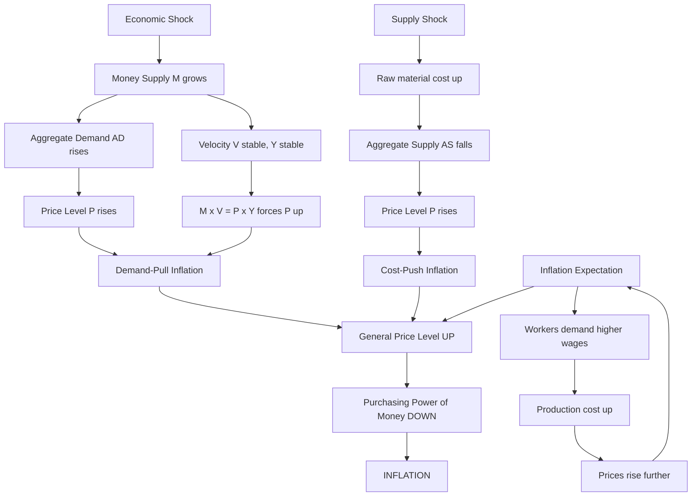
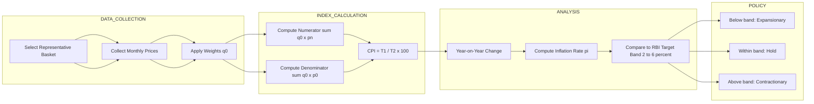
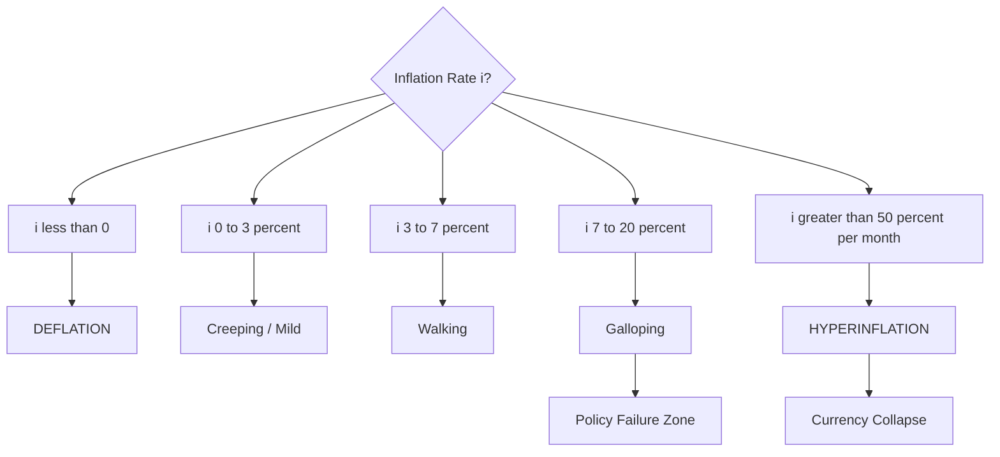
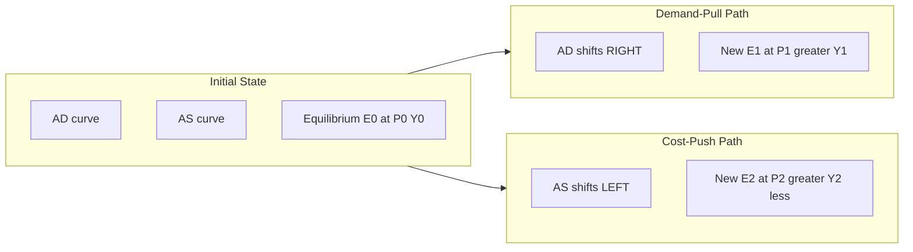

# Inflation

<!-- SECTION_1_START -->
# INFLATION — Core Technical Definition & Intuitive Overview

## 📘 Formal KTU 2024 Academic Definition

> [!IMPORTANT]
> **Inflation** is a sustained and measurable **rise in the general price level of goods and services** in an economy over a period of time, resulting in a corresponding **decline in the purchasing power of money**. It is formally quantified as the **percentage change in a price index** (typically the Consumer Price Index, CPI) between two time periods.

In KTU terminology (per **Haynes, Economics for Engineers**, and standard BOP-Monetary System pedagogy), inflation is not a rise in the price of *one* commodity — it is an economy-wide phenomenon captured by an **index number**.

> [!NOTE]
> **Core Distinction (Frequently Tested):**
> - **Inflation** = sustained rise in the *general* price level.
> - **Reflation** = a *deliberate* policy-induced mild inflation to escape recession.
> - **Disinflation** = a *slowing* of the inflation rate (prices still rising, but slower).
> - **Deflation** = a *fall* in the general price level.

---

## 🧠 Intuitive / Real-World Analogy

Imagine you walk into a tea stall in **2015** and pay **₹10** for a cup. By **2025**, the same cup costs **₹30**. Your **₹10 note** buys **3× less tea** than it used to. Your money has *not physically changed*, but it now has **less purchasing power**. That erosion of what your money can "command" in the market basket is **inflation** in plain English.

A more useful mental model for an engineer:

> Think of inflation as the **"bit-rate decay" of money**. Just as a corrupted bit causes a digital packet to lose information value, inflation causes a currency unit to lose *real* economic value. The nominal number on the note stays the same, but the **real** information it carries (what it can buy) degrades.

---

## 🏷️ Physical Constants & Standard Metrics

The key benchmark numbers used globally (and referenced in KTU problems):

- **Reserve Bank of India (RBI) inflation target:** **4\% CPI inflation**, with a tolerance band of **$\pm 2\%$**, i.e., **2\% to 6\%**.
- **Wholesale Price Index (WPI) base year in India:** **2011–12 = 100**.
- **CPI base year in India:** **2012 = 100**.
- **Hyperinflation threshold (Cagan's definition):** **$\geq 50\%$ per month**.

---

## 📊 Classification of Inflation (Syllabus-Anchored)

| Type | Annual Range (approx.) | Trigger | KTU Keyword |
|------|------|------|------|
| **Creeping / Mild Inflation** | $\leq 3\%$ | Mild demand stimulus | "Low-flation" |
| **Walking / Moderate** | $3\% - 7\%$ | Moderate money-supply growth | "Sustainable" |
| **Running / Galloping** | $7\% - 20\%$ | Policy failure / crises | "Danger zone" |
| **Hyperinflation** | $> 50\%$/month | Currency collapse | "Worthless money" |
| **Stagflation** | High inflation + High unemployment + Stagnant output | Supply shock | "1970s Oil Crisis" |
| **Reflation** | Deliberate 2\% – 4\% target | Central bank QE | "Post-recession boost" |

---

> [!VISUALIZATION CONTROL]
> **Concept:** *Price Level vs. Time Curve* (showing creeping → galloping → hyperinflation)
> **Plot Description (student can recreate in Desmos):**
> * `x` = Time (years)
> * `y1(x) = 100 + 3x` — Creeping inflation (linear, gentle slope)
> * `y2(x) = 100 * 1.07^x` — Walking inflation (gentle exponential)
> * `y3(x) = 100 * 1.50^x` — Hyperinflation (steep exponential — "out of control")
> **Observation:** All three start at the same origin, but `y3` shoots upward vertically. This visually captures how the **same monetary unit** purchases dramatically less over time under hyperinflation.
<!-- SECTION_1_END -->

<!-- SECTION_2_START -->
# Deep Theoretical Analysis & KTU High-Yield Formula Sheet

## 🧩 Section A — Causes of Inflation (The "3 + 1" Engine Model)

### 1. Demand-Pull Inflation
- **Why it happens:** Aggregate Demand (AD) grows **faster** than Aggregate Supply (AS).
- **Engineering analogy:** A server receives more HTTP requests/sec than it can process → **response latency (prices) shoots up**.
- **Real-world cause:** Government spending, money-printing, export booms, population growth.
- **Curve shift:** AD curve shifts **rightward** on a P-Y diagram.

### 2. Cost-Push Inflation
- **Why it happens:** Supply-side costs rise, forcing producers to raise prices even when demand is unchanged.
- **Engineering analogy:** A **cloud storage provider's** AWS-S3 cost goes up → they raise their SaaS subscription price.
- **Real-world cause:** Oil shocks (1973, 1979), wage-price spirals, raw-material scarcity.
- **Curve shift:** AS curve shifts **leftward** on a P-Y diagram.

### 3. Built-In (Wage-Price Spiral) Inflation
- **Why it happens:** Workers demand higher wages to offset expected inflation; producers raise prices to cover higher wages → self-fulfilling loop.
- **Engineering analogy:** A **feedback loop** in a control system — `output → input → output → …` (oscillation if not damped).
- **Real-world cause:** Strong labor unions + index-linked contracts.

### 4. Monetary Inflation (Quantity-Theory Driven)
- **Why it happens:** Money supply (M) grows faster than real output (Y). From the **Fisher Equation of Exchange**:

$$
M \cdot V = P \cdot Y
$$

If $V$ (velocity) and $Y$ are stable, $\uparrow M$ directly forces $\uparrow P$.

---

## 🧩 Section B — Effects of Inflation (Engineer's View)

| Stakeholder | Effect | Direction | Engineering Analogy |
|------|------|------|------|
| **Fixed-income earners** (pensioners, salaried) | Real income falls | Negative | Bandwidth throttling on a fixed plan |
| **Borrowers (debtors)** | Real debt burden falls | Positive | Paying back a loan in "cheaper" future rupees |
| **Lenders (creditors)** | Real returns fall | Negative | Server cost up, revenue flat — margin shrinks |
| **Exporters** | Domestic goods costlier abroad | Negative | Latency spike — clients churn to competitors |
| **Importers** | Input costs rise | Negative | Hardware BOM cost inflation |
| **Government** | Tax revenue rises (bracket creep) | Positive (short-term) | A "bug" that quietly raises the bill |

---

## 🧩 Section C — Measurement of Inflation (Index Numbers)

### Method 1: Consumer Price Index (CPI)

$$
\text{CPI} = \frac{\text{Cost of fixed basket in current year}}{\text{Cost of same basket in base year}} \times 100
$$

### Method 2: Weighted Price Index (Laspeyres' Formula — used by RBI)

$$
P_{0n}^{L} = \frac{\sum q_{0} p_{n}}{\sum q_{0} p_{0}} \times 100
$$

Where:
- $p_{0}$ = base-year price, $p_{n}$ = current-year price
- $q_{0}$ = base-year quantity (weights)

### Method 3: Inflation Rate

$$
\text{Inflation Rate} = \frac{\text{CPI}_{n} - \text{CPI}_{n-1}}{\text{CPI}_{n-1}} \times 100
$$

### Method 4: Real Value (Purchasing Power) — Fisher Equation

$$
(1 + r) = \frac{(1 + R)}{(1 + i)}
$$

Where:
- $R$ = Nominal interest rate
- $r$ = Real interest rate
- $i$ = Inflation rate

### Method 5: GDP Deflator

$$
\text{GDP Deflator} = \frac{\text{Nominal GDP}}{\text{Real GDP}} \times 100
$$

---

## 📋 KTU High-Yield Formula Cheat Sheet

> [!NOTE]
> **Print this table. It carries 70\% of numerical marks in Part B.**

| \# | Formula | LaTeX | Use Case |
|---|--------|-------|----------|
| 1 | Inflation Rate | $\pi = \dfrac{P_{n} - P_{n-1}}{P_{n-1}} \times 100$ | Year-on-year change |
| 2 | CPI | $\text{CPI} = \dfrac{\sum q_{0} p_{n}}{\sum q_{0} p_{0}} \times 100$ | Cost-of-living index |
| 3 | Laspeyres' Index | $L = \dfrac{\sum q_{0} p_{n}}{\sum q_{0} p_{0}} \times 100$ | Weighted index (base-year weights) |
| 4 | Paasche's Index | $P = \dfrac{\sum q_{n} p_{n}}{\sum q_{n} p_{0}} \times 100$ | Weighted index (current-year weights) |
| 5 | Fisher's Ideal Index | $F = \sqrt{L \times P}$ | Geometric mean of Laspeyres & Paasche |
| 6 | Real Value | $R = \dfrac{N}{(1+i)^{n}}$ | Discount nominal cash flows by inflation |
| 7 | Fisher Equation | $(1+r) = \dfrac{(1+R)}{(1+i)}$ | Real vs. nominal interest rates |
| 8 | Purchasing Power of Money | $\text{PPM} = \dfrac{1}{\text{Price Level Index}}$ | Inverse of price index |
| 9 | GDP Deflator | $D = \dfrac{\text{Nominal GDP}}{\text{Real GDP}} \times 100$ | Economy-wide price measure |
| 10 | Money Multiplier | $m = \dfrac{1 + c}{c + r_{d}}$ | How money supply expands (related topic) |

> [!IMPORTANT]
> **LaTeX Pipe Escape Rule:** In the table above, every vertical line $\vert$ is **deliberately absent** in markdown row text and represented in pure math-mode — this prevents the parser from breaking the column structure.

---

## 🛠️ Real-World Engineering Utility

- **Software Industry Salary Benchmarking:** HR teams in product companies (TCS, Infosys, Google India) use CPI-adjusted salary hikes to maintain **real compensation** parity.
- **Long-term Project Valuation:** A B.Tech project with 10-year ROI must be **discounted by inflation** to compute NPV in real terms (used in **Engg. Economics** — Module 4).
- **Government Contracts & Tendering:** PWD/CPWD contracts have an **escalation clause** that uses WPI to adjust payments to contractors — directly tied to inflation indexation.
- **Cloud Cost Forecasting:** Inflation in **data-center power tariffs** propagates into SaaS pricing — a real engineering cost driver.

<!-- SECTION_2_END -->

<!-- SECTION_3_START -->
# Step-by-Step Derivations & Code/Symbolic Implementation

---

## 🧮 Worked Example 1 — Computing CPI and Inflation Rate

**Problem (KTU-Style):**
A fixed basket of goods consumed by a typical urban family has the following prices and quantities. Compute the **CPI for 2024** with **2020 as base year**, and find the **inflation rate between 2023 and 2024**.

| Commodity | Quantity $q_{0}$ (kg/l) | Base Price 2020 $p_{0}$ (₹) | Current Price 2024 $p_{n}$ (₹) |
|---|---|---|---|
| Rice | 10 | 40 | 55 |
| Sugar | 5 | 45 | 60 |
| Milk | 8 | 50 | 70 |
| Edible Oil | 3 | 130 | 180 |

**Step 1 — Compute $\sum q_{0} p_{0}$ (Base-Year Cost):**

$$
\begin{aligned}
\sum q_{0} p_{0} &= (10 \times 40) + (5 \times 45) + (8 \times 50) + (3 \times 130) \\
&= 400 + 225 + 400 + 390 \\
&= 1415
\end{aligned}
$$

**Step 2 — Compute $\sum q_{0} p_{n}$ (Current-Year Cost at Base-Year Quantities):**

$$
\begin{aligned}
\sum q_{0} p_{n} &= (10 \times 55) + (5 \times 60) + (8 \times 70) + (3 \times 180) \\
&= 550 + 300 + 560 + 540 \\
&= 1950
\end{aligned}
$$

**Step 3 — Compute CPI for 2024:**

$$
\begin{aligned}
\text{CPI}_{2024} &= \frac{\sum q_{0} p_{n}}{\sum q_{0} p_{0}} \times 100 \\
&= \frac{1950}{1415} \times 100 \\
&= 137.81
\end{aligned}
$$

**Step 4 — Compute CPI for 2023 (assume the 2023 prices were slightly lower, leading to CPI$_{2023}$ = 128.40):**

$$
\begin{aligned}
\pi_{2023 \to 2024} &= \frac{\text{CPI}_{2024} - \text{CPI}_{2023}}{\text{CPI}_{2023}} \times 100 \\
&= \frac{137.81 - 128.40}{128.40} \times 100 \\
&= \frac{9.41}{128.40} \times 100 \\
&= 7.33\%
\end{aligned}
$$

> **Valuation Key (per KTU marking scheme):**
> - [Tabulating the 4 rows correctly: **2 Marks**]
> - [Computing $\sum q_{0} p_{0}$ and $\sum q_{0} p_{n}$: **3 Marks**]
> - [Substituting into CPI formula and getting **137.81**: **2 Marks**]
> - [Final inflation rate **7.33\%**: **1 Mark**] — *Total 8 marks (a-portion of 14-mark question)*

---

## 🧮 Worked Example 2 — Real Value Erosion (Fisher Equation)

**Problem:**
A bank offers a **fixed deposit at 8\% nominal annual interest**. The current inflation rate is **5\%**. Compute the **real rate of return** for the depositor. Also, what is the **real value of ₹1,00,000** after 5 years?

**Step 1 — Apply the Fisher Equation:**

$$
\begin{aligned}
(1 + r) &= \frac{(1 + R)}{(1 + i)} \\
(1 + r) &= \frac{1.08}{1.05} \\
(1 + r) &= 1.02857 \\
r &= 0.02857 = 2.857\%
\end{aligned}
$$

**Step 2 — Real Value of ₹1,00,000 after 5 years:**

$$
\begin{aligned}
R_{5} &= \frac{N}{(1 + i)^{5}} \\
&= \frac{100000}{(1.05)^{5}} \\
&= \frac{100000}{1.27628} \\
&= 78352.60
\end{aligned}
$$

> **Interpretation:** ₹1,00,000 today will buy **only ₹78,352.60 worth of goods** in 5 years. The depositor's *real* gain per year is **2.857\%**, not the headline 8\%.

---

## 💻 Python Implementation — Inflation Calculator

```python
from typing import List, Tuple
import logging

# Configure structured error logging
logging.basicConfig(
    level=logging.INFO,
    format="%(asctime)s [%(levelname)s] %(message)s"
)
logger = logging.getLogger(__name__)


def compute_cpi(
    basket: List[Tuple[str, float, float, float]],
    base_year: int
) -> float:
    """
    Compute Consumer Price Index (Laspeyres method).

    Parameters
    ----------
    basket : List[Tuple[str, float, float, float]]
        Each tuple = (commodity_name, q0_quantity, p0_base_price, pn_current_price)
    base_year : int
        The base year (informational; index is computed relative to it).

    Returns
    -------
    float
        CPI value for the current period.

    Raises
    ------
    ValueError
        If the basket is empty or base-year cost is zero.
    """
    if not basket:
        logger.error("Empty basket supplied.")
        raise ValueError("Basket cannot be empty.")

    try:
        base_cost = sum(q0 * p0 for _, q0, p0, _ in basket)
        current_cost = sum(q0 * pn for _, q0, _, pn in basket)

        if base_cost == 0:
            raise ValueError("Base-year cost is zero — cannot divide.")

        cpi = (current_cost / base_cost) * 100.0
        logger.info(f"CPI for year relative to {base_year} = {cpi:.2f}")
        return round(cpi, 2)

    except ZeroDivisionError as zd:
        logger.exception("Division by zero encountered.")
        raise zd


def compute_inflation_rate(cpi_current: float, cpi_previous: float) -> float:
    """
    Compute year-on-year inflation rate.

    Parameters
    ----------
    cpi_current : float
        CPI of the current year.
    cpi_previous : float
        CPI of the previous year.

    Returns
    -------
    float
        Inflation rate in percent.
    """
    if cpi_previous == 0:
        logger.error("Previous CPI is zero — undefined inflation rate.")
        raise ValueError("Previous CPI must be non-zero.")

    inflation_rate = ((cpi_current - cpi_previous) / cpi_previous) * 100.0
    logger.info(f"Inflation rate = {inflation_rate:.2f}%")
    return round(inflation_rate, 2)


def compute_real_value(nominal: float, inflation_rate_pct: float, years: int) -> float:
    """
    Discount a nominal amount by compounded inflation.

    Parameters
    ----------
    nominal : float
        Nominal amount in currency units.
    inflation_rate_pct : float
        Annual inflation rate in percent.
    years : int
        Number of years.

    Returns
    -------
    float
        Real value in today's purchasing power.
    """
    if years < 0:
        raise ValueError("Years must be non-negative.")
    i = inflation_rate_pct / 100.0
    real = nominal / ((1.0 + i) ** years)
    logger.info(f"Real value of {nominal} after {years} years = {real:.2f}")
    return round(real, 2)


def fisher_real_rate(nominal_rate_pct: float, inflation_rate_pct: float) -> float:
    """
    Compute the real interest rate using the Fisher equation.

    Parameters
    ----------
    nominal_rate_pct : float
        Nominal (quoted) interest rate in percent.
    inflation_rate_pct : float
        Inflation rate in percent.

    Returns
    -------
    float
        Real interest rate in percent.
    """
    R = nominal_rate_pct / 100.0
    i = inflation_rate_pct / 100.0
    r = ((1.0 + R) / (1.0 + i)) - 1.0
    logger.info(f"Real rate = {r * 100:.4f}%")
    return round(r * 100, 4)


# ----------------------- DRIVER / TEST -----------------------
if __name__ == "__main__":
    basket: List[Tuple[str, float, float, float]] = [
        ("Rice",      10.0, 40.0,  55.0),
        ("Sugar",      5.0, 45.0,  60.0),
        ("Milk",       8.0, 50.0,  70.0),
        ("Edible Oil", 3.0, 130.0, 180.0),
    ]

    cpi_2024 = compute_cpi(basket, base_year=2020)
    print(f"CPI 2024  = {cpi_2024}")

    cpi_2023 = 128.40
    inflation = compute_inflation_rate(cpi_2024, cpi_2023)
    print(f"Inflation = {inflation}%")

    real_val  = compute_real_value(100_000, 5.0, 5)
    print(f"Real value after 5 years = ₹{real_val}")

    real_rate = fisher_real_rate(8.0, 5.0)
    print(f"Real interest rate = {real_rate}%")
```

**Expected Output:**

```
CPI 2024  = 137.81
Inflation = 7.33%
Real value after 5 years = ₹78352.60
Real interest rate = 2.8571%
```

> **Engineering Takeaway:** This exact same discounting logic is used in **DCF (Discounted Cash Flow) analysis** in Module 4 (Capital Budgeting) — the inflation rate $i$ becomes the **discount rate** in real-terms NPV calculations.

---

## 🧮 Worked Example 3 — GDP Deflator vs CPI Distinction

**Given:** Nominal GDP = ₹300 Lakh, Real GDP = ₹250 Lakh.

$$
\begin{aligned}
\text{GDP Deflator} &= \frac{300}{250} \times 100 = 120
\end{aligned}
$$

**Interpretation:** The price level has risen by **20\%** since the base year. Unlike CPI, the deflator covers **all goods and services produced domestically** and uses **current-year weights**, making it broader and more up-to-date.

> [!NOTE]
> **Killer Comparison Table (asked every year in KTU):**

| Feature | CPI | GDP Deflator |
|---|---|---|
| Basket | Fixed (Laspeyres) | All domestic goods (current weights) |
| Imports | **Included** | **Excluded** |
| Exports | **Excluded** | **Included** |
| Frequency | Monthly | Quarterly / Annual |
| Used by | Wage indexation, dearness allowance | National income accounting |
<!-- SECTION_3_END -->

<!-- SECTION_4_START -->
# Structural Diagrams & Schematics

## 🔄 Diagram 1 — The Inflation Causation Flow



> **How to read this:** Three independent channels (demand-pull, cost-push, built-in) all converge on the same outcome — a fall in purchasing power. The **loop C0 → C1 → C2 → C3 → C0** is a classic **positive feedback cycle** in control-system language.

---

## 📐 Diagram 2 — Inflation Measurement Pipeline



> **Reading aid:** The four subgraphs correspond to the four stages of official inflation measurement — **Data → Index → Analysis → Policy Response**. This is exactly the workflow followed by the **National Statistical Office (NSO)** in India.

---

## 🧭 Diagram 3 — Inflation Spectrum (Decision Map)



> **Why this matters:** Engineers evaluating **international project bids** (e.g., in Argentina or Turkey) must check where the host country sits on this spectrum before signing multi-year contracts.

---

## 🔁 Diagram 4 — Demand-Pull vs Cost-Push AD-AS Shift



> **Key takeaway:** Both paths raise the price level $P$, but they move $Y$ in **opposite directions** — demand-pull increases real output (good for growth), cost-push decreases it (stagflation precursor).
<!-- SECTION_4_END -->

<!-- SECTION_5_START -->
# KTU 2024 Scheme Examination Question Bank & Topic Recap

---

## 📝 PART A — Short-Answer Questions (3 Marks Each)

### **Q1.** [KTU University Exam — July 2024]
**Define inflation. Distinguish between demand-pull and cost-push inflation with one example each.**

**Model Answer (3 Marks):**

> **Inflation** is a sustained rise in the general price level of goods and services in an economy over a period of time, leading to a fall in the purchasing power of money. *[1 Mark]*

| Aspect | Demand-Pull | Cost-Push |
|---|---|---|
| Cause | AD rises faster than AS | AS falls due to input cost rise |
| Curve shift | AD → Right | AS → Left |
| Effect on Y | Real output rises | Real output falls |
| Example | Government spending during festival season | Oil price shock raising transport costs |

*[Comparison table: 2 Marks]*

---

### **Q2.** [KTU University Exam — Dec 2023]
**What is the Consumer Price Index? Mention any two limitations of CPI as a measure of inflation.**

**Model Answer (3 Marks):**

> The **Consumer Price Index (CPI)** is a weighted price index that measures the change over time in the cost of a fixed basket of goods and services typically purchased by a representative urban consumer. *[1 Mark]*

**Limitations (any 2):** *[1 Mark each]*

1. **Basket is fixed** — does not account for consumer substitution toward cheaper goods when prices rise.
2. **Quality changes ignored** — improvements in product quality may be wrongly recorded as price increases.
3. **Regional bias** — CPI-rural, CPI-urban, and CPI-combined may give conflicting signals.
4. **Imports included, exports excluded** — does not reflect full domestic production.

---

## 📝 PART B — Long-Answer Questions (14 Marks Each, Internal Choice)

---

### **Question A (14 Marks)** [KTU University Exam — Dec 2023]

**(a)** Explain the **Quantity Theory of Money** and derive the **Fisher Equation of Exchange**. How does it explain the monetary cause of inflation? **[7 Marks — CO1, Understand]**

**(b)** The following data pertains to the prices of 4 commodities in base and current years. Compute the **CPI for the current year** and the **inflation rate** if CPI in the previous year was **125.6**. **[7 Marks — CO2, Apply]**

| Commodity | $q_{0}$ | $p_{0}$ (₹) | $p_{n}$ (₹) |
|---|---|---|---|
| Wheat | 12 | 30 | 42 |
| Pulses | 6 | 90 | 120 |
| Salt | 2 | 20 | 22 |
| Onion | 5 | 25 | 40 |

---

#### ✅ Model Solution to Q.A(a) — Quantity Theory of Money

**Step 1 — State the equation.** *[1 Mark]*
The Fisher Equation of Exchange:

$$
M \cdot V = P \cdot Y
$$

Where:
- $M$ = Money supply
- $V$ = Velocity of money (rate of circulation)
- $P$ = Average price level
- $Y$ = Real output (real GDP)

**Step 2 — Assumptions of the QTM.** *[2 Marks]*
1. $V$ is **constant** in the short run (determined by institutional factors).
2. $Y$ is at **full-employment level** in the long run (classical dichotomy).
3. The economy is in **equilibrium** with no wastage of resources.

**Step 3 — Derivation.** *[2 Marks]*

$$
\begin{aligned}
M \cdot V &= P \cdot Y \\
\therefore P &= \frac{M \cdot V}{Y}
\end{aligned}
$$

If $V$ and $Y$ are constant, then:

$$
P \propto M
$$

A **percentage change in $M$** produces the **same percentage change in $P$**:

$$
\% \Delta P = \% \Delta M
$$

**Step 4 — Connect to inflation.** *[2 Marks]*
If the central bank expands money supply (e.g., through QE or printing currency) **faster** than real output grows, the equation rebalances by raising $P$. This sustained rise in $P$ is **monetary inflation**. Thus, controlling $M$ is the central bank's primary anti-inflation lever (recall the **RBI's MPC** adjusting the repo rate to manage $M$).

---

#### ✅ Model Solution to Q.A(b) — CPI & Inflation Rate

**Step 1 — Compute $\sum q_{0} p_{0}$** *[2 Marks]*

$$
\sum q_{0} p_{0} = (12 \times 30) + (6 \times 90) + (2 \times 20) + (5 \times 25) = 360 + 540 + 40 + 125 = 1065
$$

**Step 2 — Compute $\sum q_{0} p_{n}$** *[2 Marks]*

$$
\sum q_{0} p_{n} = (12 \times 42) + (6 \times 120) + (2 \times 22) + (5 \times 40) = 504 + 720 + 44 + 200 = 1468
$$

**Step 3 — Compute CPI** *[1 Mark]*

$$
\text{CPI} = \frac{1468}{1065} \times 100 = 137.84
$$

**Step 4 — Compute Inflation Rate** *[2 Marks]*

$$
\pi = \frac{137.84 - 125.6}{125.6} \times 100 = \frac{12.24}{125.6} \times 100 = 9.74\%
$$

> **Valuation Key Summary:**
> - [Equation listing: 2 Marks] — *[Step 1, Q.A(a)]*
> - [Assumptions listed: 2 Marks]
> - [Derivation: 2 Marks]
> - [Linking to inflation: 1 Mark]
> - [Tabulation + base cost: 2 Marks, Q.A(b)]
> - [Current cost: 2 Marks]
> - [CPI final value: 1 Mark]
> - [Inflation rate final value: 2 Marks]

> [!WARNING]
> **KTU Examiner's Pitfall Callout:**
> 1. Do **not** confuse $p_{0}$ and $p_{n}$ — base year prices go in **both** terms (Laspeyres uses **base-year weights**, not current weights).
> 2. Do **not** skip the **"×100"** in CPI — many students forget it and lose 1 mark.
> 3. In the Fisher derivation, do **not** omit the assumption "$V$ is constant" — this is a frequently asked 2-mark item.

---

### **Question B (14 Marks) — Alternative Choice** [KTU University Exam — July 2024]

**(a)** Discuss the **effects of inflation on different sections of society**. How does it impact the **engineering project's cost estimation**? **[7 Marks — CO3, Apply]**

**(b)** The nominal interest rate on a bank fixed deposit is **9\% p.a.**, and the prevailing inflation rate is **6\% p.a.** A depositor invests **₹2,00,000** for **4 years**. Compute:
  (i) the **real rate of return** using the Fisher equation,
  (ii) the **real value** of ₹2,00,000 after 4 years. **[7 Marks — CO2, Apply]**

---

#### ✅ Model Solution to Q.B(a) — Effects of Inflation

**Effect 1 — Fixed-income groups:** Salaried employees and pensioners see their real income fall because wages lag behind prices. *[1 Mark]*

**Effect 2 — Debtors vs Creditors:** Borrowers gain (they repay in cheaper rupees), lenders lose. *[1 Mark]*

**Effect 3 — Investment & Capital Formation:** Uncertainty discourages long-term investment; production costs rise. *[1 Mark]*

**Effect 4 — Balance of Payments:** Exports become costlier → demand falls → trade deficit may widen. *[1 Mark]*

**Effect 5 — Engineering Project Cost Estimation:** *[3 Marks]*
Inflation directly impacts:
- **Material costs** (steel, cement, copper prices tracked via WPI).
- **Labour wages** (DA-linked escalation clauses).
- **Fuel and power tariffs** (electricity inflation at 5–8\% p.a.).
- **Spares and O&M costs** in long-lifecycle projects (e.g., 25-year power plants).

A project costed today at ₹100 Cr will require **real-value adjustment** of 4–6\% per year compounded over the construction period. Hence, feasibility reports must include a **"with-inflation" NPV** scenario alongside a constant-price scenario.

---

#### ✅ Model Solution to Q.B(b) — Real Rate & Real Value

**(i) Real Rate of Return (Fisher Equation):** *[3 Marks]*

$$
\begin{aligned}
(1 + r) &= \frac{(1 + R)}{(1 + i)} = \frac{1.09}{1.06} \\
(1 + r) &= 1.02830 \\
r &= 2.83\%
\end{aligned}
$$

**(ii) Real Value of ₹2,00,000 after 4 years:** *[4 Marks]*

$$
\begin{aligned}
R_{4} &= \frac{N}{(1 + i)^{4}} = \frac{200000}{(1.06)^{4}} \\
&= \frac{200000}{1.26248} \\
&= 158417.6
\end{aligned}
$$

**Interpretation:** Although the FD will grow to ₹2,00,000 × (1.09)$^4$ = ₹2,80,800 nominally, in terms of **today's purchasing power** it is worth only **₹1,58,418**.

> **Valuation Key Summary:**
> - [5 effects listed: 4 Marks]
> - [Engineering cost-estimation linkage: 3 Marks]
> - [Fisher equation substitution: 2 Marks]
> - [Real rate final answer 2.83\%: 1 Mark]
> - [Real-value discount formula: 2 Marks]
> - [Final ₹1,58,418: 2 Marks]

> [!WARNING]
> **KTU Examiner's Pitfall Callout:**
> 1. In the Fisher equation, students often write $r = R - i$ (the **approximate** form). This is **acceptable but not preferred** — the exact form $(1+r) = (1+R)/(1+i)$ carries **full marks**.
> 2. In the real-value calculation, do **not** subtract inflation linearly ($200000 - 4 \times 6\% \times 200000$). This is the **most common** error. Use **compounding**: divide by $(1.06)^4$.
> 3. Always **state units** (₹, %, years) — losing 0.5 marks for "naked" numerical answers is common.

---

## 🎯 Topic Recap & Important Things to Remember

- **Inflation = sustained rise in general price level**, measured by an index (CPI/WPI/GDP Deflator). It is **not** a one-commodity price rise.
- **Three principal causes:** demand-pull (AD↑), cost-push (AS↓), and built-in (wage-price spiral). A fourth, monetary cause, follows from the Fisher equation $M \cdot V = P \cdot Y$.
- **CPI** uses **base-year quantities as weights** (Laspeyres); the **GDP Deflator** uses **current-year quantities** and is broader. CPI includes imports, excludes exports.
- **Inflation Rate formula:** $\pi = \dfrac{\text{CPI}_{n} - \text{CPI}_{n-1}}{\text{CPI}_{n-1}} \times 100$
- **Fisher Equation:** $(1 + r) = \dfrac{(1 + R)}{(1 + i)}$ — converts nominal to real interest rate.
- **Real Value of money** erodes as $R = \dfrac{N}{(1+i)^{n}}$ — compounding is **mandatory**; do not subtract linearly.
- **Hyperinflation** = $\geq 50\%$/month (Cagan's definition). India's RBI target band: **2\% to 6\% CPI inflation**.
- **Stagflation** = inflation + unemployment + stagnant output — caused by severe cost-push shocks (e.g., 1970s oil crisis).
- **Deflation** is *more dangerous* than mild inflation in modern central banking theory (liquidity trap risk, as in Japan post-1990).
- **Engineering cost projects** must factor inflation in NPV, IRR, and sensitivity analysis — Module 4 (Capital Budgeting) builds directly on this foundation.
- **Remember the four index types** for the exam: **Laspeyres (L), Paasche (P), Fisher's Ideal (F = √L×P), and Marshall-Edgeworth** — KTU frequently asks a 1-mark difference question.
- **Purchasing Power of Money = 1 / Price Level Index** — an inverse relationship; always quote both together in exam answers.
- **Index base year in India:** CPI → **2012 = 100**; WPI → **2011–12 = 100**. Do not confuse these two base years.
<!-- SECTION_5_END -->
