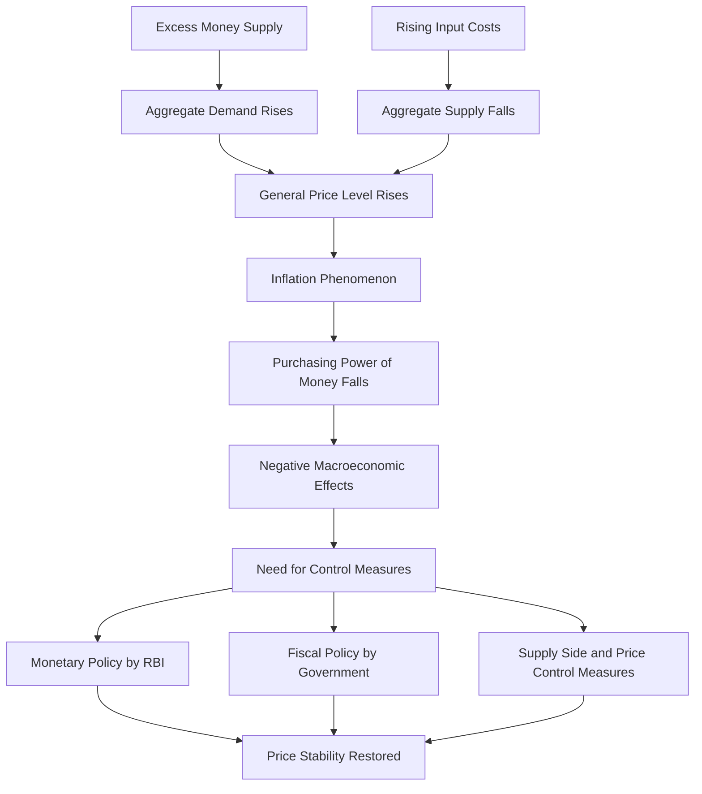
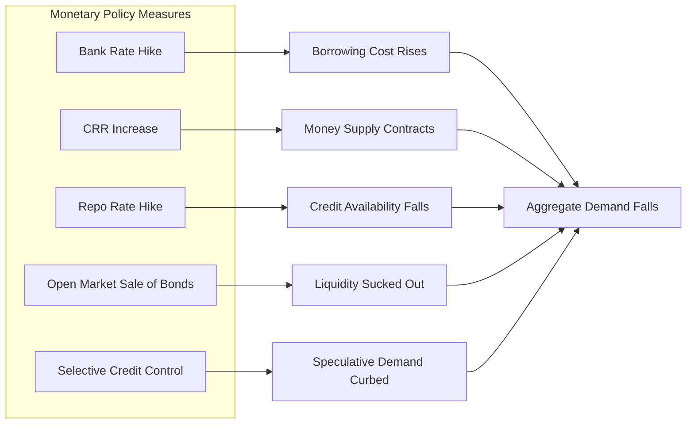
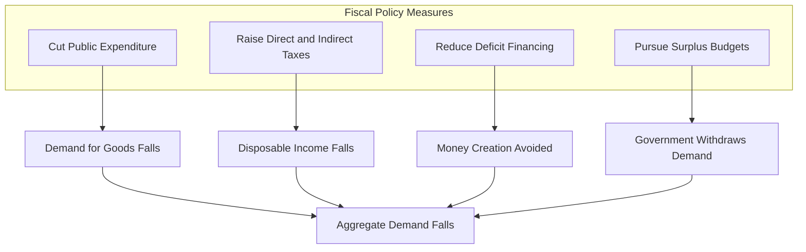

# Measures to Control Inflation

<!-- SECTION_1_START -->

# Measures to Control Inflation

## 1. Core Technical Definition & Intuitive Overview

> [!IMPORTANT]
> **Inflation** is a sustained and continuous rise in the general price level of goods and services in an economy over a period of time, resulting in a **decline in the purchasing power of money**.

In simpler economic terminology, inflation is the rate at which the **average price level** of a basket of selected goods and services rises over time. The opposite condition, where prices fall, is called **Deflation**.

### Inflation Rate Formula

The most common metric used to express inflation is the **percentage change in a price index** over a specific period (usually a year).

$$\text{Inflation Rate} = \frac{\text{Current Year Price Index} - \text{Base Year Price Index}}{\text{Base Year Price Index}} \times 100$$

Two major price indices tracked globally are:
- **CPI (Consumer Price Index)** – measures retail prices paid by consumers.
- **WPI (Wholesale Price Index)** – measures wholesale/bulk prices at the producer level.

> [!NOTE]
> In India, the **Reserve Bank of India (RBI)** historically used WPI, but since **2014** it formally adopted the **Consumer Price Index (CPI)** as the key inflation benchmark for monetary policy formulation under the new inflation targeting framework.

### Conceptual Analogy / Intuition

Imagine a student has a fixed monthly allowance of **₹5,000**. Earlier, this amount could buy them a full week of meals, two movie tickets, and a bus pass. A year later, the same ₹5,000 barely covers three days of meals.

> [!TIP]
> **Plain English Intuition:** Inflation means *your money is losing its "muscle."* The same currency note buys fewer goods and services tomorrow than it does today. It is not the prices printed on currency that rise — it is the *value* of money that falls.

### The Engineering Connection

For an engineer, the concept of inflation is not abstract. It directly impacts:
- **Capital budgeting decisions** (Discounted Cash Flow analysis uses the inflation-adjusted real rate of return).
- **Project cost estimation** in construction and manufacturing.
- **Loan amortization** schedules (floating interest rates are tied to inflation expectations).

> [!VISUALIZATION CONTROL]
> **Concept:** Purchasing Power of Money over Time
> **Description:** A downward-sloping curve showing the inverse relationship between the general price level (Y-axis) and the purchasing power of money (X-axis). As time progresses, prices rise, and the same rupee fetches fewer goods. The curve can be drawn as a hyperbola $P \times Q = \text{Constant}$.

---

<!-- SECTION_1_END -->

<!-- SECTION_2_START -->

# 2. Deep Theoretical Analysis & KTU High-Yield Formula Sheet

## 2.1 Types of Inflation

Understanding the *type* of inflation is critical because the **control measure differs** for each.

> [!NOTE]
> **Demand-Pull Inflation** — Caused when **aggregate demand** in the economy exceeds **aggregate supply** at full employment. "Too much money chasing too few goods." It is often associated with a booming economy.

> [!NOTE]
> **Cost-Push Inflation** — Caused by a **decrease in aggregate supply** due to rising costs of production (e.g., higher wages, expensive raw materials, increased taxes, or supply shocks like oil price spikes).

> [!NOTE]
> **Built-In Inflation** (Wage-Price Spiral) — Workers demand higher wages to keep up with rising living costs, which raises production costs, which raises prices again — creating a self-reinforcing loop.

> [!NOTE]
> **Hyperinflation** — An extremely rapid and out-of-control inflation, typically exceeding **50% per month**. Historical examples include Zimbabwe (2008) and the Weimar Republic (1923).

| Type | Root Cause | Primary Trigger |
|---|---|---|
| Demand-Pull | Excess demand | Government spending, credit expansion |
| Cost-Push | Rising input costs | Oil shocks, wage hikes |
| Built-In | Wage-price spiral | Inflationary expectations |
| Hyperinflation | Loss of currency confidence | Money printing, political instability |

## 2.2 Effects of Inflation (Why We Must Control It)

| Effect | Consequence |
|---|---|
| **Erosion of purchasing power** | Fixed-income groups (pensioners, salaried) suffer |
| **Reduced savings value** | Real return on bank deposits falls |
| **Income redistribution** | Debtors gain; Creditors lose |
| **Export competitiveness loss** | Domestic goods become costlier abroad |
| **Investment uncertainty** | Long-term project planning becomes risky |
| **Balance of Payments deficit** | Imports become cheaper than exports |

## 2.3 KTU Formula Sheet & Key Metrics

| Concept | Formula / Definition | Unit / Benchmark |
|---|---|---|
| Inflation Rate | $(\frac{P_t - P_{t-1}}{P_{t-1}}) \times 100$ | Percentage |
| Real Interest Rate | $r = \frac{1 + i}{1 + \pi} - 1$ (Fisher Equation) | Percentage |
| Nominal Interest Rate | $i = (1 + r)(1 + \pi) - 1$ | Percentage |
| Money Multiplier | $m = \frac{1}{CRR}$ (simplified) | Ratio |
| RBI Inflation Target | CPI-based, $\pm 2\%$ band around $4\%$ | Percentage |

> [!IMPORTANT]
> The **Fisher Equation** connects nominal interest, real interest, and inflation:
> $$\text{Nominal Rate} = \text{Real Rate} + \text{Expected Inflation} + (\text{Real Rate} \times \text{Expected Inflation})$$

## 2.4 Real-World Engineering & Economic Utility

Controlling inflation is vital for:
- **Macroeconomic stability**, ensuring predictable input costs for engineering projects.
- **Attracting Foreign Direct Investment (FDI)** — investors prefer low and stable inflation regimes.
- **Sustainable GDP growth** — moderate inflation encourages consumption and investment.

---

<!-- SECTION_2_END -->

<!-- SECTION_3_START -->

# 3. Step-by-Step Derivations, Numerical Examples & Conceptual Breakdowns

## 3.1 Inflation Rate Numerical Derivation

**Problem:** A country had a Consumer Price Index (CPI) value of **150** in 2022 and **162** in 2023. Calculate the inflation rate for 2023.

### Step-by-Step Solution

**Step 1:** Identify the variables.
- Base Year (Previous) CPI, $P_{t-1} = 150$
- Current Year CPI, $P_t = 162$

**Step 2:** Substitute into the inflation rate formula.

$$
\text{Inflation Rate} = \frac{P_t - P_{t-1}}{P_{t-1}} \times 100
$$

**Step 3:** Compute the numerator.

$$
P_t - P_{t-1} = 162 - 150 = 12
$$

**Step 4:** Divide and multiply by 100.

$$
\text{Inflation Rate} = \frac{12}{150} \times 100 = \frac{1200}{150} = 8\%
$$

**Final Answer:** The inflation rate for 2023 is **8%**.

> [!IMPORTANT]
> **Valuation Key Point:** Always specify the **base year** and **reference index** (CPI vs WPI) in your answer. Examiners award marks for identifying the correct index used.

## 3.2 Real Interest Rate Using Fisher Equation

**Problem:** A bank offers a nominal interest rate of **9%** per annum on fixed deposits. The expected inflation rate is **4%**. Calculate the real interest rate earned by the depositor.

### Step-by-Step Solution

**Step 1:** Identify the given values.
- Nominal Rate, $i = 9\% = 0.09$
- Expected Inflation, $\pi = 4\% = 0.04$

**Step 2:** Apply the exact Fisher Equation.

$$
r = \frac{1 + i}{1 + \pi} - 1
$$

**Step 3:** Substitute the values.

$$
r = \frac{1 + 0.09}{1 + 0.04} - 1 = \frac{1.09}{1.04} - 1
$$

**Step 4:** Compute the division.

$$
\frac{1.09}{1.04} \approx 1.048077
$$

**Step 5:** Subtract 1.

$$
r \approx 1.048077 - 1 = 0.048077
$$

**Step 6:** Convert to percentage.

$$
r \approx 4.81\%
$$

**Final Answer:** The real interest rate is approximately **4.81%**.

> [!TIP]
> **Approximate Fisher Equation (for quick calculation):** $r \approx i - \pi = 9\% - 4\% = 5\%$. This approximation is used when inflation is low (under 10%).

## 3.3 Detailed Breakdown — Measures to Control Inflation

Inflation control measures are broadly classified into three categories:

### A. Monetary Policy Measures (RBI / Central Bank)

These work by **reducing the money supply** in the economy.

1. **Bank Rate Policy:** RBI increases the **bank rate** — the rate at which it lends to commercial banks. Higher bank rate → commercial banks raise their lending rates → borrowing becomes expensive → demand falls → prices stabilize.

2. **Cash Reserve Ratio (CRR):** Commercial banks must hold a higher percentage of deposits with RBI. This reduces funds available for lending, contracting the money supply.

3. **Statutory Liquidity Ratio (SLR):** Banks are mandated to maintain a higher proportion of assets as government securities, restricting credit flow.

4. **Open Market Operations (OMO):** RBI **sells government bonds** in the open market. Buyers pay RBI, money is sucked out of circulation, reducing liquidity.

5. **Repo Rate Hike:** RBI raises the **repo rate** (rate at which it lends short-term funds to banks), making borrowing costly for banks and ultimately for consumers.

6. **Selective Credit Control:** RBI issues directives to banks to restrict credit for non-essential and speculative sectors (e.g., real estate, luxury goods).

### B. Fiscal Policy Measures (Government)

These work by **reducing aggregate demand** through government spending and taxation.

1. **Reduction in Public Spending:** The government cuts down on its expenditure, directly lowering demand pressure in the economy.

2. **Increase in Taxes:** Raising **direct taxes** (income tax) and **indirect taxes** (GST, excise) reduces disposable income in the hands of consumers, curbing consumption.

3. **Reduction in Deficit Financing:** The government avoids borrowing from the RBI to fund its deficit, preventing fresh money creation.

4. **Surplus Budgets:** Instead of deficit budgets, governments aim for surplus budgets during inflationary periods.

### C. Other Measures

1. **Price Control / Administered Prices:** Government fixes maximum prices for essential commodities (e.g., subsidized LPG, PDS grains).

2. **Wage Policy:** Voluntary restraint by trade unions to avoid excessive wage demands that fuel cost-push inflation.

3. **Supply-Side Measures:** Boosting production through tax holidays, subsidies for essential industries, import of scarce goods, and reducing bottlenecks.

4. **Rationing:** Distributing essential goods through fair-price shops to ensure equitable access.

5. **Import Promotion:** Removing import duties on essential commodities increases supply, lowering prices.

> [!IMPORTANT]
> **Engineering Relevance:** Inflation control measures directly affect **engineering project financing**. A hike in repo rate increases the cost of capital (interest on loans) for infrastructure and industrial projects, impacting the **Net Present Value (NPV)** and **Internal Rate of Return (IRR)** calculations.

---

<!-- SECTION_3_END -->

<!-- SECTION_4_START -->

# 4. Structural Diagrams & Schematics

## 4.1 Causal Flow of Inflation — From Causes to Control

## 4.2 Subgraph: Monetary Policy Tools of RBI

## 4.3 Subgraph: Fiscal Policy Tools of Government

## 4.4 Classification Table — Control Measures Matrix

| Domain | Tool | Mechanism | Direct Effect |
|---|---|---|---|
| Monetary | Bank Rate | Raises cost of RBI lending to banks | Reduces commercial credit |
| Monetary | CRR | Forces banks to hold more reserves | Contracts money multiplier |
| Monetary | Repo Rate | Raises short-term borrowing cost | Slows loan disbursal |
| Monetary | OMO - Sale | RBI sells bonds, takes in cash | Drains market liquidity |
| Fiscal | Public Spending Cut | Government consumes less | Demand pressure eased |
| Fiscal | Tax Hike | Less disposable income | Consumption falls |
| Other | Price Control | Legal cap on prices | Direct price suppression |
| Other | Supply Boost | Increased imports/production | Supply-demand gap closes |

---

<!-- SECTION_4_END -->

<!-- SECTION_5_START -->

# 5. KTU 2024 Scheme Examination Question Bank & Topic Recap

## 5.1 Part A — Short Answer Questions (3 Marks Each)

### Question 1 `[KTU University Exam – Dec 2023]` — CO3, Understand

**Q: Define inflation. Distinguish between demand-pull and cost-push inflation.**

**Model Answer:**

> [!NOTE]
> **Inflation** is a sustained and continuous increase in the general price level of goods and services in an economy over a period of time, accompanied by a corresponding decline in the purchasing power of money.

| Parameter | Demand-Pull Inflation | Cost-Push Inflation |
|---|---|---|
| **Cause** | Aggregate demand exceeds aggregate supply | Aggregate supply falls due to rising input costs |
| **Origin** | Demand side of the economy | Supply side of the economy |
| **Trigger** | Increased money supply, government spending | Wage rise, raw material cost, oil shocks |
| **Policy Response** | Monetary/fiscal contraction needed | Supply-side measures needed |

> [!WARNING]
> **Examiner's Pitfall:** Students often write "inflation is the rise in prices" without specifying **"general price level"** or **"purchasing power of money"** — both are mandatory terms for full marks.

---

### Question 2 `[KTU University Exam – July 2024]` — CO3, Remember

**Q: List any three monetary policy measures used by the RBI to control inflation.**

**Model Answer:**

1. **Bank Rate Policy:** RBI raises the bank rate, increasing the cost of borrowing for commercial banks, which in turn raises lending rates for the public.
2. **Cash Reserve Ratio (CRR):** RBI raises the CRR, forcing commercial banks to keep more deposits with the RBI, reducing the funds available for lending.
3. **Open Market Operations (Sale of Bonds):** RBI sells government securities in the open market, absorbing excess liquidity from the banking system.

> [!TIP]
> **Valuation Key Point:** Naming the measure alone is sufficient for 1 mark. Explaining the mechanism earns the remaining 2 marks. Always write the **mechanism**, not just the name.

---

## 5.2 Part B — Long Answer Questions (14 Marks Each)

### Question A `[KTU University Exam – Dec 2022]` — CO3, Apply

**Q: (a)** Explain the various **fiscal policy measures** that a government can adopt to control inflation in an economy. (7 Marks)

**(b)** The CPI value of a country was **200** in 2021 and **218** in 2022. The RBI adopted a contractionary monetary policy. If the bank's nominal interest rate is **10%** and the expected inflation is the rate you calculated, find the **real interest rate** using the Fisher equation. (7 Marks)

---

#### Solution to Part (a) — Fiscal Policy Measures (7 Marks)

The government adopts the following fiscal policy tools to control inflation:

1. **Reduction in Public Expenditure (2 Marks):** The government cuts its spending on projects, subsidies, and administrative costs. This directly reduces the aggregate demand in the economy, easing the price pressure.

2. **Increase in Taxation (2 Marks):** By raising direct taxes (income tax) and indirect taxes (GST, excise duties), the government reduces the disposable income in the hands of consumers, thereby curbing consumption demand.

3. **Surplus Budget and Reduced Deficit Financing (2 Marks):** The government avoids financing its expenditure by printing new money or borrowing from the RBI. Pursuing a surplus budget ensures money is withdrawn from circulation, not injected.

4. **Public Debt Management (1 Mark):** The government retires past public debt, soaking up excess money supply from the economy.

---

#### Solution to Part (b) — Fisher Equation Calculation (7 Marks)

**Step 1: Calculate Inflation Rate (3 Marks)**

Given:
- Previous Year CPI, $P_{t-1} = 200$
- Current Year CPI, $P_t = 218$

$$
\text{Inflation Rate} = \frac{P_t - P_{t-1}}{P_{t-1}} \times 100 = \frac{218 - 200}{200} \times 100
$$

$$
= \frac{18}{200} \times 100 = 9\%
$$

**Step 2: Apply the Fisher Equation (3 Marks)**

Given:
- Nominal Rate, $i = 10\% = 0.10$
- Inflation Rate, $\pi = 9\% = 0.09$

$$
r = \frac{1 + i}{1 + \pi} - 1
$$

$$
r = \frac{1.10}{1.09} - 1 \approx 1.00917 - 1 = 0.00917
$$

**Step 3: Final Answer (1 Mark)**

$$
r \approx 0.92\%
$$

> [!WARNING]
> **Examiner's Pitfall — Common Mistake:** Many students use the approximate formula $r = i - \pi$ in the KTU exam and get $1\%$. While close, the **exact Fisher equation** is preferred for full marks. The examiner specifically tests whether you know the difference between approximate and exact forms.

---

### Question B `[KTU University Exam – July 2023]` — CO3, Understand / Apply

**Q: (a)** Discuss the **monetary policy instruments** used by the Reserve Bank of India (RBI) to control inflationary pressures in the economy. (7 Marks)

**(b)** What is **deflation**? How is it different from **disinflation**? Explain with a suitable numerical example. (7 Marks)

---

#### Solution to Part (a) — Monetary Policy Instruments of RBI (7 Marks)

The RBI uses the following monetary policy tools to control inflation:

1. **Bank Rate Policy (1 Mark):** Raising the bank rate increases the cost of funds for commercial banks, which they pass on to borrowers. This reduces credit creation and aggregate demand.

2. **Repo Rate and Reverse Repo Rate (2 Marks):** An increase in the **repo rate** makes short-term borrowing costly for commercial banks, which in turn raises loan interest rates for businesses and consumers. A rise in the **reverse repo rate** incentivizes banks to park more funds with the RBI, reducing lendable resources.

3. **Cash Reserve Ratio (CRR) and Statutory Liquidity Ratio (SLR) (2 Marks):** Raising CRR or SLR forces commercial banks to lock up more funds as reserves, leaving fewer funds for lending. This contracts the money multiplier effect.

4. **Open Market Operations (1 Mark):** When the RBI **sells government securities** in the open market, buyers (banks, institutions) pay money to the RBI, which is withdrawn from active circulation.

5. **Selective Credit Control (1 Mark):** The RBI issues directives to banks to restrict credit flow to speculative and non-essential sectors such as real estate, bullion, and luxury goods.

---

#### Solution to Part (b) — Deflation vs Disinflation (7 Marks)

> [!NOTE]
> **Deflation** is a sustained **decrease** in the general price level of goods and services in an economy, leading to an **increase in the purchasing power of money**. (2 Marks)

> [!NOTE]
> **Disinflation** is a **slowdown in the rate of inflation** — the inflation rate itself is positive but is decreasing over time. The economy is **not** experiencing falling prices. (2 Marks)

**Numerical Example (3 Marks):**

Consider the following inflation rate data over four years:

| Year | Inflation Rate |
|---|---|
| 2020 | 10% |
| 2021 | 6% |
| 2022 | 3% |
| 2023 | -1% |

- From 2020 to 2022, the inflation rate is **falling** (10% → 6% → 3%) but is still **positive**. This is **disinflation**.
- In 2023, the inflation rate becomes **negative** (-1%), meaning prices are actually falling. This is **deflation**.

> [!WARNING]
> **Examiner's Pitfall:** Students frequently confuse disinflation with deflation. Remember — **disinflation = inflation slowing down, prices still rising.** **Deflation = prices actually falling.** Drawing a clear table with the year-wise data is the simplest way to secure full marks.

---

## 5.3 Topic Recap & Important Things to Remember

> [!IMPORTANT]
> **Rapid Revision Checklist — Measures to Control Inflation**

- **Inflation Definition:** Sustained rise in the general price level, decline in purchasing power of money.
- **Inflation Rate Formula:** $(P_t - P_{t-1}) / P_{t-1} \times 100$.
- **Key Indian Index:** RBI uses **CPI (Consumer Price Index)** as the benchmark since 2014; RBI's target is **4% CPI inflation with a $\pm 2\%$ tolerance band**.
- **Two Major Types:** Demand-Pull (demand-side) and Cost-Push (supply-side).
- **Monetary Policy Tools (RBI):** Bank Rate, Repo Rate, Reverse Repo Rate, CRR, SLR, Open Market Operations (Sales), Selective Credit Control.
- **Fiscal Policy Tools (Government):** Reduce public expenditure, raise taxes, avoid deficit financing, pursue surplus budgets, retire public debt.
- **Other Measures:** Price control, wage policy, supply-side boosts, rationing, import promotion.
- **Fisher Equation (Exact):** $r = (1+i)/(1+\pi) - 1$.
- **Fisher Equation (Approximate):** $r \approx i - \pi$.
- **Effects of Inflation:** Loss of purchasing power, income redistribution, reduced savings, export decline, investment uncertainty.
- **Hyperinflation Threshold:** Generally considered to be **50% or more per month**.
- **Engineering Implication:** Inflation control directly affects cost of capital, NPV/IRR of projects, loan EMIs, and long-term infrastructure planning.

> [!TIP]
> **Last-Minute Tip for KTU Exam:** Always remember to (a) state the formula before substituting, (b) show intermediate calculation steps, and (c) box or underline your final numerical answer. Examiners in KTU 2024 scheme award **partial marks generously** for correct methodology, even if the final answer is slightly off.

---

<!-- SECTION_5_END -->
