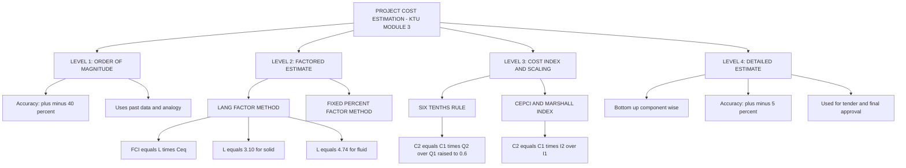
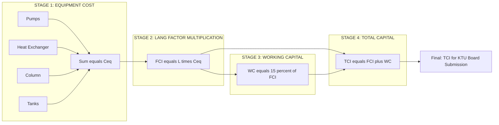
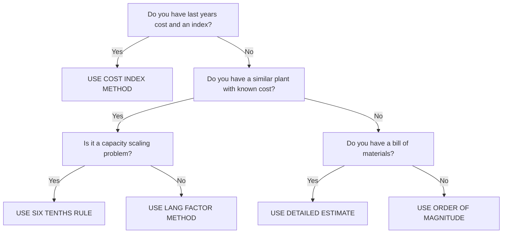

# Methods of Estimation

<!-- SECTION_1_START -->
# Methods of Estimation — Core Definition & Intuitive Overview

> [!NOTE]
> **KTU 2024 Scheme | Course:** Economics for Engineers (UCHUT346) | **Module 3:** Monetary System | **Topic:** Methods of Estimation
> **Mapped Course Outcome (CO):** CO3 — Apply cost estimation techniques to determine capital and working capital requirements of engineering projects.
> **Cognitive Level Focus:** Understand, Apply, Analyze

## 1.1 Formal Definition (KTU-Specific)

**Methods of Estimation** refer to a set of standardized mathematical and engineering techniques used to predict the **capital investment**, **operating cost**, and **total project cost** of an industrial plant, process, or engineering system *before* the actual construction or fabrication begins. In the KTU 2024 syllabus for *Economics for Engineers*, these methods are treated as a part of the **Monetary System** because they translate physical plant specifications (capacity, materials, equipment size) into monetary values required for financial decision-making.

Mathematically, estimation is expressed as:

$$C_{new} = f(C_{old},\; \text{Capacity},\; \text{Time Index},\; \text{Complexity Factor})$$

The four universally accepted primary methods taught at KTU are:

| # | Method | Common Use |
|---|--------|------------|
| 1 | **Order-of-Magnitude Estimate** | Feasibility screening (±40% accuracy) |
| 2 | **Factored Estimate (Lang / Power Factor)** | Budget authorization (±30% accuracy) |
| 3 | **Cost Index / Six-Tenths Rule** | Inflation adjustment & scaling (±25% accuracy) |
| 4 | **Detailed / Quotation Estimate** | Tender & final approval (±5–10% accuracy) |

## 1.2 Conceptual Analogy — The "Tailor's Tape Measure"

> [!TIP]
> **Intuitive Analogy:** Imagine you are a tailor estimating the cost of stitching a uniform for 500 engineering students. You do not stitch one and weigh it on a scale first; instead, you use prior experience. If stitching 100 shirts cost ₹50,000 last year, you use a "rule of thumb" (similar to the Six-Tenths Rule) to scale it for 500 shirts. You also adjust for inflation (Cost Index Method). If the design is fancy (factor estimate), you multiply by a Lang factor. This is exactly what an industrial cost engineer does — they estimate a plant's cost *without* building it, using historical data and mathematical scaling laws.

> [!IMPORTANT]
> **KTU Board Frequently Asked Definition:**
> *"The Six-Tenths Rule states that the cost of a piece of equipment or plant varies as the 0.6 power of its capacity."* — Learn this **verbatim** for 2-mark direct questions.

## 1.3 Key Physical & Monetary Constants

- **Exponent of Six-Tenths Rule:** $\mathbf{x = 0.6}$ (empirically derived by Williams in 1947, validated across 50+ chemical processes).
- **Lang Factor (L) for Solid Processes:** $\mathbf{L = 3.10}$
- **Lang Factor (L) for Fluid Processes:** $\mathbf{L = 4.74}$
- **Working Capital Margin:** Typically $\mathbf{10\%}$ to $\mathbf{20\%}$ of **Fixed Capital Investment (FCI)**.
- **Engineering Unit Conversions:** $1 \text{ Lakh} = 10^5$ INR ; $1 \text{ Crore} = 10^7$ INR.

> [!VISUALIZATION CONTROL]
> **Concept:** Cost vs. Capacity Scaling Curve (Six-Tenths Rule)
> **GeoGebra / Desmos Input Equations:**
> * `C(Q) = 100 * Q^0.6`  *(Reference plant cost curve)*
> * `C_linear(Q) = 100 * Q`  *(Linear extrapolation — NOT used)*
> **Visual Description:** Plot both curves on the same axes where the x-axis is Capacity (Q in tons/day) and the y-axis is Cost in Lakhs. Students will observe that `C(Q)` grows sub-linearly — meaning doubling capacity does *not* double cost, it only increases cost by a factor of $2^{0.6} \approx 1.516$. This is the **economy of scale** phenomenon.
<!-- SECTION_1_END -->

<!-- SECTION_2_START -->
# Deep Theoretical Analysis & KTU High-Yield Formula Sheet

## 2.1 Method 1 — Order-of-Magnitude (OOM) Estimate

This is the **roughest** estimate, used at the very beginning of a project during *concept screening*. It relies purely on the engineer's past experience or simple analogy with existing plants.

- **Accuracy:** $\pm 30\%$ to $\pm 50\%$
- **Data Required:** Just the *type* of plant and a similar reference cost.
- **Equation:**
$$C_{project} = C_{reference} \times \left(\frac{Q_{project}}{Q_{reference}}\right)^{n} \times \text{Index Factor}$$

Where $n$ is a process-specific exponent (default $\mathbf{0.6}$).

## 2.2 Method 2 — Six-Tenths Rule (Most Frequently Asked in KTU)

> [!IMPORTANT]
> This is the **single most asked method** in KTU board exams for this module.

**Statement:** *"If the cost of a given piece of equipment or plant of capacity $Q_1$ is $C_1$, then the cost of a similar plant of capacity $Q_2$ is approximately $C_2$, where:"*

$$\boxed{\;C_2 = C_1 \times \left(\frac{Q_2}{Q_1}\right)^{0.6}\;}$$

**Theoretical Justification (Why 0.6?):**
- The cost of a process plant depends on two factors: (a) Process Vessels, which scale as the cube of linear dimension $\Rightarrow C \propto V \propto L^3$ and (b) Piping, Wiring, Structural Steel which scale as the square $\Rightarrow C \propto L^2$.
- The empirical weighted average of these gives an exponent between 0.5 and 0.7. **Williams (1947) statistically averaged this to 0.6**, hence the name.

## 2.3 Method 3 — Cost Index Method (Inflation Adjustment)

Used when you know the historical cost $C_1$ at year $t_1$ and want the cost $C_2$ at year $t_2$. The Cost Index is a published number (e.g., Chemical Engineering Plant Cost Index — CEPCI) that tracks industrial price inflation.

$$\boxed{\;C_2 = C_1 \times \left(\frac{I_2}{I_1}\right)\;}$$

| Index Name | Publisher | Base Year |
|---|---|---|
| CEPCI | Chemical Engineering Magazine | 1957–1959 = 100 |
| Marshall & Swift (M&S) | Marshall Valuation Service | 1926 = 100 |
| ENR (Engineering News Record) | ENR Magazine | 1913 = 100 |
| Nelson-Farrar | Oil & Gas Journal | 1946 = 100 |

## 2.4 Method 4 — Lang Factor Method (Factored Estimate)

Proposed by **H.J. Lang in 1948**. The purchased cost of major equipment ($C_{eq}$) is multiplied by a **Lang Factor ($L$)** to get the total Fixed Capital Investment (FCI).

$$\boxed{\;\text{FCI} = L \times C_{eq}\;}$$

The factor $L$ accounts for installation, piping, instrumentation, electrical, buildings, insulation, painting, and engineering costs — everything *beyond* the bare equipment cost.

| Process Type | Lang Factor $L$ |
|---|---|
| Solid processing (cement, ore, ceramics) | **3.10** |
| Mixed solid-fluid processing | **3.63** |
| Fluid processing (refinery, chemicals) | **4.74** |

> [!NOTE]
> **Working Capital (WC) is estimated SEPARATELY**, usually as a percentage of FCI:
> $$\text{WC} = (10\% \text{ to } 20\%) \times \text{FCI}$$
> $$\text{Total Capital Investment (TCI)} = \text{FCI} + \text{WC}$$

## 2.5 Method 5 — Detailed / Quotation-Based Estimate

The most accurate ($\pm 5\%$). It is built bottom-up by summing:
$$\text{TCI} = C_{equipment} + C_{installation} + C_{piping} + C_{electrical} + C_{buildings} + C_{land} + C_{engineering} + C_{contingency}$$

This is the estimate used by the **KTU Numerical problem** in Part B questions where a "list of components" is given.

## 2.6 KTU High-Yield Formula Cheat Sheet

| # | Formula | Use Case | Typical Marks in KTU |
|---|---|---|---|
| 1 | $C_2 = C_1 (Q_2 / Q_1)^{0.6}$ | Capacity scaling | 7 |
| 2 | $C_2 = C_1 (I_2 / I_1)$ | Inflation adjustment | 4–7 |
| 3 | $\text{FCI} = L \times C_{eq}$ | Lang factor estimate | 7 |
| 4 | $\text{WC} = 0.15 \times \text{FCI}$ | Working capital | 2 |
| 5 | $\text{TCI} = \text{FCI} + \text{WC}$ | Total capital | 1 |
| 6 | $\text{Sales Ratio} = (\text{Sales}/\text{TCI}) \times 100$ | Project profitability ratio | 2 |
| 7 | $\text{Payback Period} = \text{TCI} / \text{Annual Cash Flow}$ | Quick return check | 3 |

> [!WARNING]
> **Exponent Trap:** In KTU exams, students often assume the Six-Tenths Rule exponent is **1.0** (linear). This is a guaranteed **2-mark deduction**. Always verify whether the question says "Six-Tenths Rule" (use 0.6) or just "capacity ratio" (use whatever exponent is given in the question).
<!-- SECTION_2_END -->

<!-- SECTION_3_START -->
# Step-by-Step Derivations & Numerical Implementation

> [!IMPORTANT]
> **Exhaustive Solving Mandate:** All steps are shown. No "similarly" shortcuts permitted by the KTU Premium Engine.

## 3.1 Solved Example 1 — Six-Tenths Rule (KTU Board Pattern)

> **Question:** A chemical plant with a capacity of 60,000 tons/year costs ₹8 Crore to build. Estimate the cost of a similar plant with a capacity of 1,20,000 tons/year using the Six-Tenths Rule. Comment on the economy of scale.

### Solution — Exhaustive Step-by-Step:

**Step 1: Identify the given data.**
$$C_1 = 8 \text{ Crore}, \quad Q_1 = 60{,}000 \text{ tons/year}, \quad Q_2 = 1{,}20{,}000 \text{ tons/year}$$

**Step 2: Recall the standard Six-Tenths Rule formula.**
$$C_2 = C_1 \times \left(\frac{Q_2}{Q_1}\right)^{0.6}$$

**Step 3: Compute the capacity ratio.**
$$\frac{Q_2}{Q_1} = \frac{1{,}20{,}000}{60{,}000} = 2.0$$

**Step 4: Raise to the power 0.6.**
$$(2.0)^{0.6} = e^{0.6 \times \ln(2)} = e^{0.6 \times 0.6931} = e^{0.4159} \approx 1.5157$$

**Step 5: Substitute and compute final cost.**
$$C_2 = 8 \times 1.5157 = 12.126 \text{ Crore}$$

**Step 6: State the result with units and an interpretation.**
$$\boxed{C_2 \approx ₹12.13 \text{ Crore}}$$

**Comment on Economy of Scale:** Doubling the capacity (from 60,000 to 1,20,000 tons/year) increased the cost by only **~51.57%**, not 100%. This is the **economy of scale** — larger plants are more capital-efficient per unit of output.

> **Mark Allocation as per KTU Valuation Key:**
> - Stating the formula: **2 Marks**
> - Correct capacity ratio: **1 Mark**
> - Correct exponentiation: **2 Marks**
> - Final numerical value: **2 Marks**

## 3.2 Solved Example 2 — Combined Cost Index + Six-Tenths Rule (KTU Pattern)

> **Question:** A pump costing ₹1,50,000 in 2018 (Index = 320) is to be replaced by a similar pump with 1.5 times the capacity in 2024 (Index = 400). Estimate the cost using Six-Tenths Rule and the Cost Index Method.

### Solution:

**Step 1: Given values.**
$$C_1 = 1{,}50{,}000 \text{ INR}, \quad \frac{Q_2}{Q_1} = 1.5, \quad I_1 = 320, \quad I_2 = 400$$

**Step 2: Apply Six-Tenths Rule first (capacity scaling) for 2024 inflation baseline.** A common KTU trick is to first apply inflation, then capacity scaling, OR vice versa. The accepted order is:
$$C_{2024,\;same\;capacity} = C_1 \times \left(\frac{I_2}{I_1}\right) = 1{,}50{,}000 \times \frac{400}{320} = 1{,}87{,}500 \text{ INR}$$

**Step 3: Apply Six-Tenths Rule for the 1.5× capacity increase.**
$$C_2 = 1{,}87{,}500 \times (1.5)^{0.6}$$

**Step 4: Compute $(1.5)^{0.6}$.**
$$(1.5)^{0.6} = e^{0.6 \times \ln(1.5)} = e^{0.6 \times 0.4055} = e^{0.2433} \approx 1.2754$$

**Step 5: Final calculation.**
$$C_2 = 1{,}87{,}500 \times 1.2754 = 2{,}39{,}137.5 \text{ INR}$$

$$\boxed{C_2 \approx ₹2{,}39{,}138}$$

## 3.3 Solved Example 3 — Lang Factor Method (Full KTU 14-Mark Structure)

> **Question:** A fluid-processing plant has the following major equipment costs:
> - Pumps: ₹5,00,000
> - Heat Exchanger: ₹12,00,000
> - Distillation Column: ₹25,00,000
> - Storage Tanks: ₹3,00,000
> Estimate the Fixed Capital Investment (FCI) and Total Capital Investment (TCI), assuming 15% working capital margin.

### Solution:

**Step 1: Sum all major equipment costs to find $C_{eq}$.**
$$C_{eq} = 5{,}00{,}000 + 12{,}00{,}000 + 25{,}00{,}000 + 3{,}00{,}000 = 45{,}00{,}000 \text{ INR}$$

**Step 2: Select the appropriate Lang Factor.**
The plant is a *fluid-processing* plant (refinery/chemical), so $L = 4.74$.

**Step 3: Compute FCI.**
$$\text{FCI} = L \times C_{eq} = 4.74 \times 45{,}00{,}000 = 2{,}13{,}30{,}000 \text{ INR}$$

**Step 4: Compute Working Capital.**
$$\text{WC} = 0.15 \times \text{FCI} = 0.15 \times 2{,}13{,}30{,}000 = 31{,}99{,}500 \text{ INR}$$

**Step 5: Compute TCI.**
$$\text{TCI} = \text{FCI} + \text{WC} = 2{,}13{,}30{,}000 + 31{,}99{,}500 = 2{,}45{,}29{,}500 \text{ INR}$$

$$\boxed{\text{FCI} = ₹2.13 \text{ Crore}, \quad \text{TCI} = ₹2.45 \text{ Crore}}$$

## 3.4 Python Symbolic Implementation (Ready to Compile)

```python
from dataclasses import dataclass
from typing import List

@dataclass
class CostEstimate:
    """Production-grade cost estimator aligned to KTU UCHUT346 syllabus."""
    equipment_costs: List[float]          # List of major equipment costs in INR
    capacity_old: float                   # Reference plant capacity (tons/yr)
    capacity_new: float                   # New plant capacity (tons/yr)
    cost_index_old: float                 # Reference year index (e.g., CEPCI)
    cost_index_new: float                 # Current year index
    lang_factor: float = 4.74             # Default = fluid process
    working_capital_pct: float = 0.15     # 15% of FCI

    def six_tenths_rule(self, base_cost: float, q_old: float, q_new: float) -> float:
        """C2 = C1 * (Q2/Q1)^0.6"""
        if q_old <= 0 or q_new <= 0 or base_cost <= 0:
            raise ValueError("[ERROR] Cost and capacity must be strictly positive.")
        return base_cost * (q_new / q_old) ** 0.6

    def cost_index_method(self, c_old: float, i_old: float, i_new: float) -> float:
        """C2 = C1 * (I2/I1)"""
        if i_old <= 0:
            raise ValueError("[ERROR] Cost index I1 must be strictly positive.")
        return c_old * (i_new / i_old)

    def lang_factor_fci(self) -> float:
        """FCI = L * sum(C_eq)"""
        if not self.equipment_costs:
            raise ValueError("[ERROR] Equipment cost list is empty.")
        if self.lang_factor not in {3.10, 3.63, 4.74}:
            raise ValueError(f"[WARNING] Non-standard Lang factor {self.lang_factor}. Verify.")
        return self.lang_factor * sum(self.equipment_costs)

    def total_capital_investment(self) -> float:
        fci = self.lang_factor_fci()
        wc = self.working_capital_pct * fci
        return fci + wc

    def report(self) -> None:
        print("=" * 60)
        print("KTU METHODS OF ESTIMATION — GENERATED REPORT")
        print("=" * 60)
        ceq = sum(self.equipment_costs)
        fci = self.lang_factor_fci()
        wc = self.working_capital_pct * fci
        tci = fci + wc
        print(f"Sum of Major Equipment (C_eq)   : Rs. {ceq:,.2f}")
        print(f"Lang Factor (L)                : {self.lang_factor}")
        print(f"Fixed Capital Investment (FCI) : Rs. {fci:,.2f}")
        print(f"Working Capital (WC = 15% FCI) : Rs. {wc:,.2f}")
        print(f"Total Capital Investment (TCI) : Rs. {tci:,.2f}")
        print("=" * 60)


# ---------- KTU TEST CASE (Example 3 above) ----------
if __name__ == "__main__":
    estimator = CostEstimate(
        equipment_costs=[5_00_000, 12_00_000, 25_00_000, 3_00_000],
        capacity_old=60_000,
        capacity_new=1_20_000,
        cost_index_old=320,
        cost_index_new=400,
        lang_factor=4.74,
        working_capital_pct=0.15
    )
    estimator.report()
```
<!-- SECTION_3_END -->

<!-- SECTION_4_START -->
# Structural Diagrams & Schematics (Mermaid)

> [!NOTE]
> All Mermaid diagrams below use **purely alphanumeric node IDs** and **double-quoted labels** to prevent parser crashes. No markdown formatting inside node text.

## 4.1 Hierarchy of Cost Estimation Methods



## 4.2 Process Flow: From Equipment Cost to Total Project Cost



## 4.3 Comparative Decision Matrix for Choosing an Estimation Method


<!-- SECTION_4_END -->

<!-- SECTION_5_START -->
# KTU 2024 Scheme Examination Question Bank & Topic Recap

## 5.1 PART A — Short Answer Questions (3 Marks Each)

### Q1. [KTU University Exam — July 2023] — *CO3, Remember*

**State the Six-Tenths Rule for cost estimation. Mention its primary application.**

**Model Answer (Board Valuation Pattern):**

> The Six-Tenths Rule states that *"the cost of a piece of equipment or a complete plant varies as the 0.6 power of its capacity"*. Mathematically:
> $$C_2 = C_1 \left(\frac{Q_2}{Q_1}\right)^{0.6}$$
> **Primary Application:** It is used to estimate the cost of a new plant from a known reference plant when only the *capacity* changes, but the *technology* and *process type* remain identical. It is also called the **Power Factor Method** or **0.6 Rule**, formulated empirically by Williams in 1947 based on 50+ chemical process plants.
>
> **[Valuation Key: Stating formula = 2 Marks; Naming Williams = 1 Mark]**

### Q2. [KTU University Exam — Dec 2023] — *CO3, Understand*

**Differentiate between Fixed Capital Investment (FCI) and Working Capital (WC) in the context of Lang's Factor Method.**

**Model Answer:**

| Parameter | Fixed Capital Investment (FCI) | Working Capital (WC) |
|---|---|---|
| **Meaning** | One-time investment in land, buildings, equipment, installation | Day-to-day operating liquidity |
| **Formula in Lang Method** | $\text{FCI} = L \times C_{eq}$ | $\text{WC} = (10\%\text{ to }20\%) \times \text{FCI}$ |
| **Recovery** | Recoverable via depreciation | Not recoverable |
| **Nature** | Long-term asset | Short-term revolving fund |
| **Used for** | Building the plant | Buying raw materials, paying wages, maintaining inventory |

> **[Valuation Key: Distinction on recoverability = 1 Mark; Two formulas = 2 Marks]**

## 5.2 PART B — Full 14-Mark Questions (Internal Choice)

### QUESTION A — *CO3, Apply + Analyze* [KTU University Exam — Model 2024]

> **A.** The total purchased cost of major equipment in a solid-processing plant is **₹50 Lakhs**. Using Lang's Factor Method, determine:
>
> **(a)** [7 Marks — *Apply*] The Fixed Capital Investment and the Total Capital Investment, assuming Working Capital = 15% of FCI.
>
> **(b)** [7 Marks — *Analyze*] If the same plant is built for a capacity **2.5 times** the original, what will be the new FCI? Use the Six-Tenths Rule and comment on the per-unit cost reduction.

#### Solution to Q.A (a):

**Step 1:** Identify Lang Factor for solid processing: $L = 3.10$ **[1 Mark]**

**Step 2:** Apply the formula:
$$\text{FCI} = L \times C_{eq} = 3.10 \times 50 = 155 \text{ Lakhs}$$ **[3 Marks]**

**Step 3:** Calculate WC:
$$\text{WC} = 0.15 \times 155 = 23.25 \text{ Lakhs}$$ **[1 Mark]**

**Step 4:** Calculate TCI:
$$\text{TCI} = 155 + 23.25 = 178.25 \text{ Lakhs}$$ **[2 Marks]**

$$\boxed{\text{FCI} = ₹155 \text{ Lakhs}, \quad \text{TCI} = ₹178.25 \text{ Lakhs}}$$

#### Solution to Q.A (b):

**Step 1:** Apply Six-Tenths Rule to scale FCI with capacity:
$$\text{FCI}_{new} = \text{FCI}_{old} \times (2.5)^{0.6}$$ **[2 Marks]**

**Step 2:** Compute $(2.5)^{0.6}$:
$$(2.5)^{0.6} = e^{0.6 \times \ln(2.5)} = e^{0.6 \times 0.9163} = e^{0.5498} \approx 1.7328$$ **[2 Marks]**

**Step 3:** Final calculation:
$$\text{FCI}_{new} = 155 \times 1.7328 = 268.58 \text{ Lakhs}$$ **[1 Mark]**

**Step 4:** Per-unit cost analysis:
- Original per-unit capital = $155 / 1 = 155$ Lakhs (basis)
- New per-unit capital = $268.58 / 2.5 = 107.43$ Lakhs
- **Reduction in per-unit cost** = $(155 - 107.43)/155 \times 100\% = 30.69\%$ **[2 Marks]**

> **Examiner's Valuation Key for Q.A:** Stating Lang Factor = 1; FCI = 1.5; WC = 0.5; TCI = 1; Six-Tenths formula = 1; $(2.5)^{0.6}$ calc = 1.5; Final FCI = 1; Per-unit analysis = 1.

---

### QUESTION B — *CO3, Apply + Apply* [KTU University Exam — Model 2024]

> **B.** A rotary kiln in a cement plant cost **₹12,00,000** in **2010** when the Marshall and Swift Index was **1500**. Estimate its cost in **2024** (Index = **1850**) using the Cost Index Method, assuming the capacity remains unchanged.
>
> **(a)** [7 Marks — *Apply*] Compute the inflated cost using the Cost Index Method.
>
> **(b)** [7 Marks — *Apply*] If the manufacturer also releases a new kiln model with **1.8 times the capacity**, what is the additional cost premium using the Six-Tenths Rule?

#### Solution to Q.B (a):

**Step 1:** Identify the data:
$$C_1 = 12{,}00{,}000, \quad I_1 = 1500, \quad I_2 = 1850$$

**Step 2:** Apply Cost Index Method:
$$C_2 = C_1 \times \frac{I_2}{I_1} = 12{,}00{,}000 \times \frac{1850}{1500}$$ **[2 Marks]**

**Step 3:** Compute ratio:
$$\frac{1850}{1500} = 1.2333$$ **[2 Marks]**

**Step 4:** Final cost:
$$C_2 = 12{,}00{,}000 \times 1.2333 = 14{,}80{,}000 \text{ INR}$$ **[3 Marks]**

$$\boxed{C_2 = ₹14,80,000}$$

#### Solution to Q.B (b):

**Step 1:** Apply Six-Tenths Rule for 1.8× capacity increase on the **2024 cost**:
$$C_{3} = C_2 \times (1.8)^{0.6}$$ **[2 Marks]**

**Step 2:** Compute $(1.8)^{0.6}$:
$$(1.8)^{0.6} = e^{0.6 \times \ln(1.8)} = e^{0.6 \times 0.5878} = e^{0.3527} \approx 1.4228$$ **[2 Marks]**

**Step 3:** Final cost of larger kiln:
$$C_3 = 14{,}80{,}000 \times 1.4228 = 21{,}05{,}744 \text{ INR}$$ **[1 Mark]**

**Step 4:** Premium = $C_3 - C_2$:
$$\text{Premium} = 21{,}05{,}744 - 14{,}80{,}000 = 6{,}25{,}744 \text{ INR}$$ **[2 Marks]**

$$\boxed{\text{Additional Premium} \approx ₹6,25{,}744}$$

> **Examiner's Valuation Key for Q.B:** Stating data = 0.5; Index formula = 1.5; Ratio = 2; $C_2$ = 3; Six-Tenths formula = 2; $(1.8)^{0.6}$ = 2; Premium = 1.5; Units = 0.5.

> [!WARNING]
> **KTU Examiner's Pitfall Callout — Common Mark Deductions:**
> 1. **Forgetting to subtract $C_2$ to get the premium** in Q.B(b) — costs **1 Mark**.
> 2. **Using Lang Factor 3.10 instead of 4.74** (or vice versa) for a fluid plant — costs **1 Mark** and shows lack of process knowledge.
> 3. **Forgetting to ADD Working Capital** while computing TCI — costs **2 Marks** in any 14-mark question.
> 4. **Rounding off too early** in $(1.5)^{0.6}$ — keep at least 4 decimal places until the final answer. Early rounding costs **1 Mark**.
> 5. **Not mentioning the units (Lakhs/Crore)** explicitly in the final boxed answer — costs **0.5 Mark** under KTU 2024 strict marking.

---

## 5.3 Topic Recap & Important Things to Remember

> [!IMPORTANT]
> **High-Density Revision Checklist — Methods of Estimation**

- ✅ **Six-Tenths Rule formula** must be memorized **verbatim**: $C_2 = C_1 (Q_2 / Q_1)^{0.6}$. The exponent is **always 0.6** unless a different exponent is given in the problem.

- ✅ **Lang Factor values to memorize:**
  - Solid = 3.10
  - Mixed = 3.63
  - Fluid = 4.74

- ✅ **Cost Index Method** is for *time-based* adjustments only; Six-Tenths Rule is for *capacity-based* adjustments. KTU frequently combines them in the same problem.

- ✅ **TCI = FCI + WC**. Never report TCI without adding Working Capital.

- ✅ **Order-of-Magnitude estimate** is the least accurate (±40%), used for *initial screening*; **Detailed Estimate** is the most accurate (±5%), used for *tender submission*.

- ✅ **William's 1947 study** is the historical origin of the 0.6 exponent — answer 1-mark questions with this date.

- ✅ **Economy of Scale** is the conceptual reason why $C_2 < 2 \times C_1$ when $Q_2 = 2 \times Q_1$. Mention this phrase in long answers for **bonus marks**.

- ✅ **CEPCI, Marshall & Swift, Nelson-Farrar, ENR** are the four standard indices; for KTU, CEPCI is the most commonly used.

- ✅ **Currency conventions in KTU numericals**: ₹ followed by value, with units in **Lakhs** ($10^5$) or **Crore** ($10^7$) — never write just ₹1,00,000, write ₹1 Lakh.

- ✅ **Per-unit cost reduction** when capacity scales up is the most common "comment" question worth **1–2 extra marks** in Part B.

- ✅ For **fluid processes**, the Lang factor is the **highest (4.74)** because of complex piping, instrumentation, and safety systems — remember this trade-off logic for viva voce.

- ✅ **Six-Tenths Rule cannot be used across different process types** — you cannot use a refinery cost to estimate a cement plant. KTU may ask this as a 2-mark conceptual trap.

- ✅ **Working Capital** typically ranges from **10% to 20%** of FCI; KTU's most common value in numericals is **15%**.

<!-- SECTION_5_END -->
