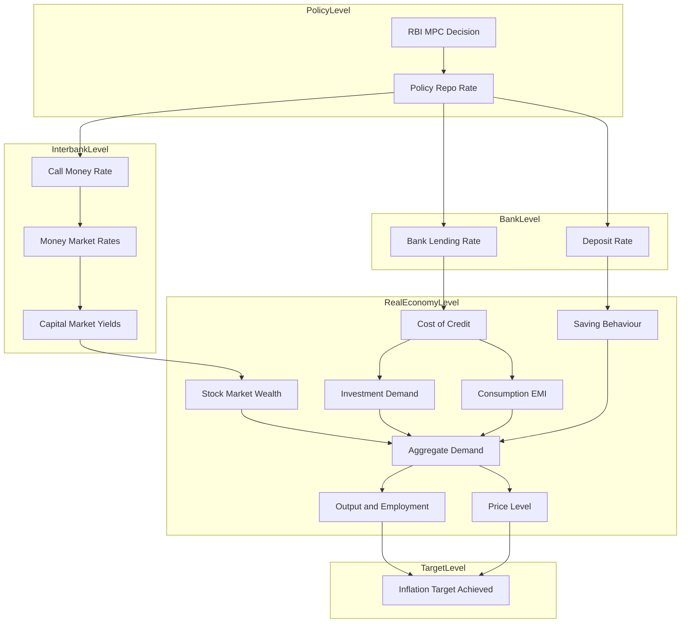
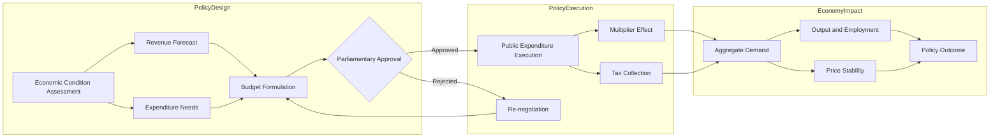
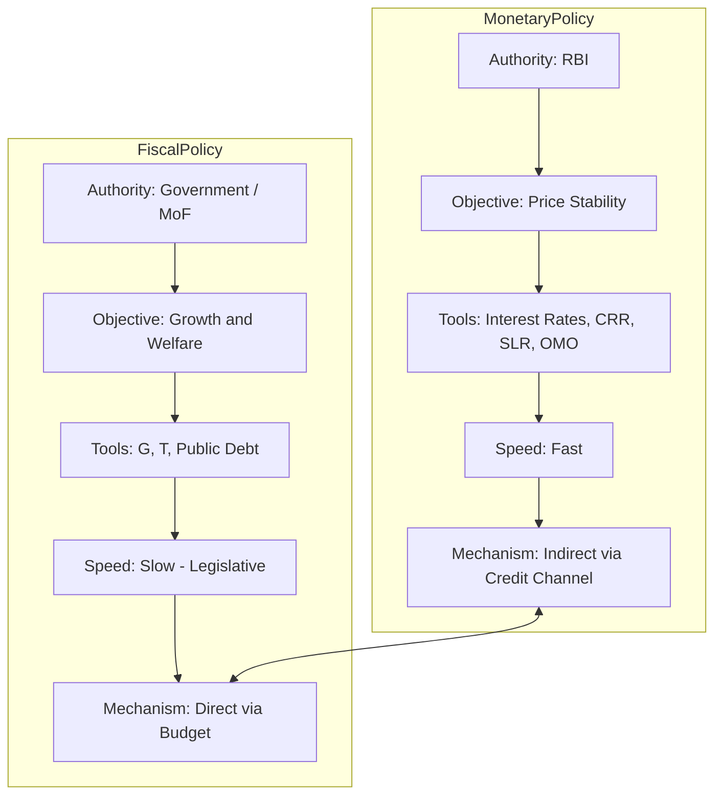
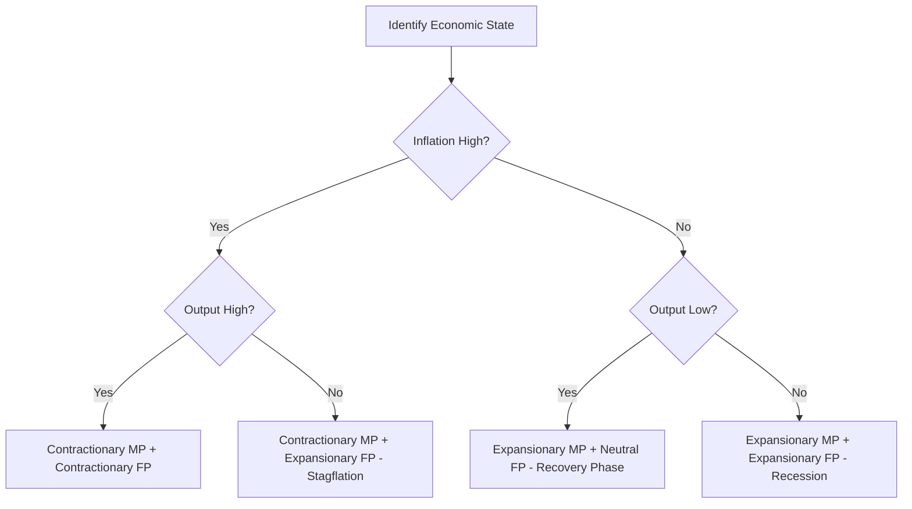

# Monetary and Fiscal policies

<!-- SECTION_1_START -->

# Monetary and Fiscal Policies

## 1.1 Core Technical Definition

> [!IMPORTANT]
> **Monetary Policy** is the macroeconomic policy laid down by the central bank of a nation (in India, the **Reserve Bank of India – RBI**) which involves the management of money supply, availability, and cost of credit in the economy to achieve broader economic objectives like price stability, full employment, and economic growth.

> [!IMPORTANT]
> **Fiscal Policy** is the government's policy with respect to its **revenue (taxation)**, **expenditure**, and **borrowing (public debt)** decisions, formulated by the Ministry of Finance, designed to influence the overall level of aggregate demand, output, employment, and price level in the economy.

| Feature | Monetary Policy | Fiscal Policy |
|---|---|---|
| Authority | Central Bank (RBI) | Government (MoF) |
| Tool | Interest rates, money supply | Taxes, government spending |
| Speed | Fast-acting | Slow-acting (legislative) |
| Focus | Liquidity & credit | Aggregate demand |
| Nature | Indirect | Direct |

> [!NOTE]
> **KTU 2024 Syllabus Mapping:** Module 3 of UCHUT346 covers the monetary system, including the mechanics, instruments, and policy frameworks of both monetary and fiscal levers used by authorities to steer the economy. The module directly addresses **Course Outcome CO1**: "Understand the basic economic principles and apply them in engineering project decisions."

## 1.2 Conceptual Analogy / Intuition

**Real-World Analogy — The Two-Pedal Car 🚗:**

Think of an economy as a moving car:
- The **Monetary Policy** is the **accelerator/brake pedal controlled by the RBI**. When the RBI presses the accelerator (lowers interest rates), more money flows into the system and businesses borrow easily — the car speeds up. When it presses the brake (raises rates), borrowing becomes expensive and the car slows down.
- The **Fiscal Policy** is the **steering wheel and the fuel tank managed by the Government**. The government decides *where* the economy should go (through public spending on roads, education, defence) and *how much fuel* to inject (via tax cuts or welfare transfers).

Both pedals must work in harmony. If only one is pressed, the car either spins out of control or stalls.

**Geometric Intuition — The AD–AS Framework:**

On a standard two-dimensional graph with **Price Level (Y-axis)** and **Real Output (X-axis)**:
- **Expansionary Monetary/Fiscal Policy** shifts the **Aggregate Demand (AD) curve to the right** (AD → AD1).
- **Contractionary Monetary/Fiscal Policy** shifts the **AD curve to the left** (AD → AD2).
- The economy's new equilibrium moves from point **E** to **E1** or **E2**, changing both price level and output.

> [!VISUALIZATION CONTROL]
> **Concept:** Aggregate Demand (AD) Curve Shift under Expansionary Policy
> **GeoGebra / Desmos Input Equations:**
> * Original AD: $P = 100 - 0.5Y$
> * New AD after policy: $P = 120 - 0.5Y$
> * Short-Run Aggregate Supply (SRAS): $P = 20 + 0.3Y$
> **Visual Description:** Two downward-sloping lines (AD and AD1) intersecting an upward-sloping SRAS curve. The student should observe the equilibrium shifting rightward (higher output, slightly higher prices) when the AD curve shifts out.

---

## 1.3 Physical Constants & Standard Metrics

- **Repo Rate (as of 2024 KTU Reference):** ~**6.50%** (RBI Policy Rate)
- **CRR (Cash Reserve Ratio):** ~**4.00% to 4.50%** of Net Demand and Time Liabilities
- **SLR (Statutory Liquidity Ratio):** ~**18.00%** of Net Demand and Time Liabilities
- **Inflation Target (India):** **4% CPI** with a ±**2% tolerance band** (under the Monetary Policy Framework Agreement, 2016)
- **Fiscal Deficit Target (FRBM Act):** **3.5% of GDP** (Centre, by 2025-26 target)
- **GDP Deflator** and **Money Multiplier ($m$)** are the key metrics

---

<!-- SECTION_1_END -->

<!-- SECTION_2_START -->

# Deep Theoretical Analysis & KTU High-Yield Formula Sheet

## 2.1 Monetary Policy — Operational Framework

### 2.1.1 Types of Monetary Policy

**1. Expansionary (Accommodative / Loose) Monetary Policy:**
- Adopted during **recessions, low inflation, or high unemployment**.
- RBI **lowers** the repo rate, **reduces** CRR/SLR, and **buys** government securities in Open Market Operations (OMO).
- **Mechanism:** Lower rates → cheap credit → higher investment & consumption → AD rises → output expands.

**2. Contractionary (Tight / Hawkish) Monetary Policy:**
- Adopted during **booms, high inflation, or asset bubbles**.
- RBI **raises** the repo rate, **increases** CRR/SLR, and **sells** securities in OMO.
- **Mechanism:** Higher rates → costly credit → lower investment & consumption → AD falls → inflation cools.

### 2.1.2 Quantitative Instruments of Monetary Policy (RBI's Arsenal)

| Instrument | Definition | Expansionary Use | Contractionary Use |
|---|---|---|---|
| **Bank Rate** | Long-term lending rate of RBI to banks (no collateral) | Lower | Higher |
| **Repo Rate** | Rate at which RBI lends short-term to banks against government securities | Lower | Higher |
| **Reverse Repo Rate** | Rate at which RBI borrows from banks | Lower | Higher |
| **CRR** | % of deposits banks must keep with RBI (cash) | Reduce | Increase |
| **SLR** | % of deposits banks must maintain in gold/govt. securities | Reduce | Increase |
| **OMO (Open Market Operations)** | Buying/selling of govt. securities in open market | Buy securities | Sell securities |
| **MSF (Marginal Standing Facility)** | Overnight borrowing rate (penalty rate) | Lower | Higher |
| **LAF (Liquidity Adjustment Facility)** | Framework for managing liquidity via repo/reverse repo | Inject liquidity | Absorb liquidity |

### 2.1.3 Qualitative / Selective Instruments
- **Moral Suasion:** Verbal persuasion by RBI to banks.
- **Credit Rationing:** Directives on priority-sector lending (now **40% of ANBC**).
- **Margin Requirements:** Margin money on specific loans.
- **Consumer Credit Regulation:** Controls on hire-purchase, EMI terms.

## 2.2 Fiscal Policy — Operational Framework

### 2.2.1 Types of Fiscal Policy

**1. Expansionary Fiscal Policy:**
- Used during **recession or depression**.
- Government **increases expenditure** (G ↑) and **reduces taxes** (T ↓).
- Net effect: **Budgetary Deficit rises**, AD increases.

**2. Contractionary Fiscal Policy:**
- Used during **inflationary boom**.
- Government **reduces expenditure** (G ↓) and **increases taxes** (T ↑).
- Net effect: **Budgetary Surplus**, AD decreases.

**3. Neutral Fiscal Policy:**
- G = T (balanced budget) — used during normal/stable conditions.

### 2.2.2 Tools / Instruments of Fiscal Policy

| Tool | Description | Effect on AD |
|---|---|---|
| **Public Expenditure (G)** | Spending on infra, defence, welfare, subsidies | Direct +ve shift in AD |
| **Taxation (T)** | Direct (income) and Indirect (GST) taxes | Inverse shift in AD |
| **Public Debt (D)** | Borrowing to finance deficit | Future tax burden / crowding out |
| **Subsidies & Transfers** | Direct cash transfers (DBT), food/fuel subsidies | Boost disposable income → +C |
| **Budget Deficit/Surplus** | (G − T) — gap between revenue and expenditure | Indicator of stance |

## 2.3 The Money Multiplier — A Core Derivation

The **Money Multiplier ($m$)** tells us the maximum amount of deposits that can be created from an initial reserve injection by RBI. It is critical for understanding monetary policy transmission.

$$m = \frac{1}{r}$$

Where $r$ is the **Required Reserve Ratio (CRR)**. With a **currency drain** ($c$ = currency held by public / deposits) and **excess reserve ratio** ($e$ = excess reserves / deposits), the generalized form becomes:

$$m = \frac{1 + c}{r + e + c}$$

> [!NOTE]
> **Intuition:** If CRR = 4%, then every ₹1 of fresh reserves printed by RBI can theoretically create $1 / 0.04$ = **₹25** of new money in the banking system. This is the **fountain-pen money creation** effect.

## 2.4 The Fiscal Multiplier

The **Fiscal Multiplier** measures the change in national income (Y) per unit change in government spending (G) or taxation (T).

**Government Spending Multiplier:**
$$k_G = \frac{\Delta Y}{\Delta G} = \frac{1}{1 - MPC(1 - t)}$$

**Tax Multiplier:**
$$k_T = \frac{\Delta Y}{\Delta T} = \frac{-MPC}{1 - MPC(1 - t)}$$

Where:
- $MPC$ = Marginal Propensity to Consume
- $t$ = Tax rate
- $(1 - t)$ = disposable income factor

> [!TIP]
> **KTU High-Yield Insight:** $\vert k_G \vert > \vert k_T \vert$. Government spending is a more powerful demand-side tool than tax cuts because part of any tax cut is **saved** rather than spent.

## 2.5 The Crowding-Out Effect

When the government runs a large **fiscal deficit** and borrows heavily from the market, interest rates **rise** ("crowd out" private investment). This partially neutralizes the expansionary intent of fiscal policy.

$$I_{crowded-out} = f(r \uparrow) \quad \Rightarrow \quad I_{private} \downarrow$$

> [!IMPORTANT]
> **Engineering Economy Application:** When an engineering firm plans a long-term capital project, it must factor in the **interest-rate environment** set by monetary policy. A 100 bps hike in the repo rate can raise the project's **WACC (Weighted Average Cost of Capital)** and make previously viable NPV-positive projects unviable.

## 2.6 Real-World Utility in Engineering & Decision-Making

1. **Project Feasibility Analysis:** Engineers must assess policy-driven interest rates to compute **NPV, IRR, and payback period** accurately.
2. **Cost of Capital:** Monetary policy determines the **risk-free rate** used in CAPM and DCF models.
3. **Public-Private Partnership (PPP):** Fiscal policy determines the share of **government co-investment** and tax holidays in mega engineering projects.
4. **Inflation Impact on Material Costs:** Both policies influence **commodity prices** and **foreign exchange**, affecting imported machinery and raw material bills.
5. **R&D Tax Credits:** Fiscal incentives (Section 35(2AB) of IT Act) directly affect an engineering R&D firm's bottom line.

---

## 2.7 KTU Formula Sheet / Cheat Sheet

| # | Concept | Formula | Variables & Units | Notes |
|---|---|---|---|---|
| 1 | Money Multiplier (simple) | $m = \dfrac{1}{r}$ | $r$ = CRR (decimal) | When no leakages exist |
| 2 | Money Multiplier (with leakages) | $m = \dfrac{1 + c}{r + e + c}$ | $c$ = currency-deposit ratio, $e$ = excess reserve ratio | Realistic banking system |
| 3 | Deposit Creation | $\Delta D = \dfrac{\Delta R}{r}$ | $\Delta R$ = fresh reserves | Multi-bank credit expansion |
| 4 | Gov. Spending Multiplier | $k_G = \dfrac{1}{1 - MPC(1 - t)}$ | $MPC \in [0,1]$, $t \in [0,1]$ | Always positive |
| 5 | Tax Multiplier | $k_T = \dfrac{-MPC}{1 - MPC(1 - t)}$ | $MPC$, $t$ | Always negative |
| 6 | Balanced Budget Multiplier | $k_{BB} = 1$ | — | Equal $\Delta G$ and $\Delta T$ → $\Delta Y = \Delta G$ |
| 7 | AD Identity | $AD = C + I + G + (X - M)$ | All in nominal ₹ | Expenditure approach |
| 8 | Inflation Rate | $\pi = \dfrac{P_t - P_{t-1}}{P_{t-1}} \times 100$ | Percentage | Used in policy targeting |
| 9 | Fiscal Deficit | $FD = G - T$ | ₹ Crore | Indicator of stance |
| 10 | Primary Deficit | $PD = FD - \text{Interest Payments}$ | ₹ Crore | Excludes debt servicing |

---

<!-- SECTION_2_END -->

<!-- SECTION_3_START -->

# Step-by-Step Derivations & Symbolic Implementation

## 3.1 Derivation 1 — The Money Multiplier (Simple Case)

We derive how a single ₹1 of fresh reserve, injected by RBI through OMO, multiplies into total deposits in the banking system.

**Step 1:** Let the Required Reserve Ratio (RRR) be $r = 0.10$ (i.e., 10%).

**Step 2:** RBI purchases a government security worth **₹1,000** from the public. The seller's bank account increases by ₹1,000 — this is the **initial deposit** $D_0$.

$$D_0 = 1{,}000$$

**Step 3:** The bank is required to keep $r \times D_0$ as reserves and can **lend out** the rest.

$$\text{Required Reserve} = r \cdot D_0 = 0.10 \times 1{,}000 = 100$$

$$\text{Lendable Amount} = D_0 - r \cdot D_0 = (1 - r) \cdot D_0 = 0.90 \times 1{,}000 = 900$$

**Step 4:** The borrower deposits ₹900 into Bank B. Bank B's new deposit $D_1 = 900$.

$$D_1 = 900$$

**Step 5:** Bank B keeps 10% and lends out 90% of ₹900.

$$\text{Lendable Amount}_1 = 0.90 \times 900 = 810$$

$$D_2 = 810$$

**Step 6:** This process continues, creating a **geometric progression**:

$$D_0 + D_1 + D_2 + \ldots = 1{,}000 + 900 + 810 + 729 + \ldots$$

**Step 7:** Summing the infinite geometric series with first term $a = 1{,}000$ and common ratio $R = (1 - r) = 0.90$:

$$\text{Total Deposits} = \frac{a}{1 - R} = \frac{1{,}000}{1 - 0.90} = \frac{1{,}000}{0.10}$$

$$\text{Total Deposits} = 10{,}000$$

**Step 8:** Therefore, the **Money Multiplier** is:

$$m = \frac{1}{r} = \frac{1}{0.10} = 10$$

> [!TIP]
> **Verification:** $\Delta D = \Delta R / r = 1{,}000 / 0.10 = 10{,}000$. ✔ This matches the geometric sum. The single ₹1,000 of fresh reserve created **₹10,000** of new deposits in the system.

---

## 3.2 Derivation 2 — Money Multiplier With Currency Leakage

In a more realistic setting, the public holds a fraction $c$ of money as **cash outside banks**, and banks hold a fraction $e$ of deposits as **excess reserves**.

**Step 1:** Let fresh high-powered money (reserves + currency) be $H = \Delta R + \Delta C$.

**Step 2:** Total money supply $M$ = Currency + Deposits:
$$M = C + D$$

**Step 3:** By definitions of $c$ and $r$ and $e$:
$$C = c \cdot D \quad ; \quad R_{required} = r \cdot D \quad ; \quad R_{excess} = e \cdot D$$

**Step 4:** Total reserves held by banks:
$$R = R_{required} + R_{excess} = (r + e) \cdot D$$

**Step 5:** High-powered money is the sum of currency with public and bank reserves:
$$H = C + R = c \cdot D + (r + e) \cdot D = (c + r + e) \cdot D$$

**Step 6:** Solve for $D$ in terms of $H$:
$$D = \frac{H}{c + r + e}$$

**Step 7:** Substitute back into the money supply equation:
$$M = C + D = c \cdot D + D = (1 + c) \cdot D = \frac{(1 + c) \cdot H}{c + r + e}$$

**Step 8:** Therefore, the money multiplier is:
$$m = \frac{M}{H} = \frac{1 + c}{c + r + e}$$

> [!NOTE]
> **Intuition Check:** As $c \to 0$ (no cash hoarding) and $e \to 0$ (banks lend out all), $m \to 1/r$, the simple case. ✔

---

## 3.3 Derivation 3 — The Government Spending Multiplier (Two-Sector Closed Economy)

**Assumptions:** Closed economy (no X-M), only consumption + government spending, no investment for simplicity.

**Step 1:** Consumption function:
$$C = a + bY^d$$

Where $a$ = autonomous consumption, $b$ = MPC, $Y^d$ = disposable income.

**Step 2:** Disposable income with a lump-sum tax $T$:
$$Y^d = Y - T$$

**Step 3:** Consumption becomes:
$$C = a + b(Y - T) = a + bY - bT$$

**Step 4:** Aggregate Demand (AD) equals $C + G$:
$$AD = a + bY - bT + G$$

**Step 5:** At equilibrium: $Y = AD$:
$$Y = a + bY - bT + G$$

**Step 6:** Rearrange to isolate $Y$:
$$Y - bY = a - bT + G$$

$$Y(1 - b) = a - bT + G$$

**Step 7:** Solve for $Y$:
$$Y = \frac{1}{1 - b} (a - bT + G)$$

**Step 8:** The Government Spending Multiplier is the coefficient of $G$ in the above expression:
$$k_G = \frac{1}{1 - b} = \frac{1}{1 - MPC}$$

**Step 9:** If taxes are proportional at rate $t$ (so $T = tY$):
$$Y = \frac{1}{1 - b(1 - t)} (a + G)$$

$$k_G = \frac{1}{1 - MPC(1 - t)}$$

> [!IMPORTANT]
> **Numerical Example:** If $MPC = 0.8$ and $t = 0.25$, then $k_G = 1 / (1 - 0.8 \times 0.75) = 1 / 0.40 = 2.5$. A ₹100 Crore increase in government spending raises national income by **₹250 Crore**.

---

## 3.4 Derivation 4 — The Tax Multiplier (Same Setup)

From $Y = \frac{1}{1 - b}(a - bT + G)$, the coefficient of $T$ is:

$$k_T = \frac{-b}{1 - b} = \frac{-MPC}{1 - MPC}$$

> [!TIP]
> **Why the negative sign?** Higher taxes reduce disposable income → less consumption → less output. The relationship is inverse. With proportional tax rate $t$:
> $$k_T = \frac{-MPC}{1 - MPC(1 - t)}$$

**Comparison for $MPC = 0.8$:**
- $k_G = 1 / (1 - 0.8) = 5$ (lump-sum)
- $k_T = -0.8 / 0.2 = -4$

The absolute value $\vert k_G \vert = 5 > \vert k_T \vert = 4$. **Government spending is a more potent tool than tax cuts.**

---

## 3.5 Derivation 5 — The Balanced-Budget Multiplier

**Scenario:** Government increases both $G$ and $T$ by the same amount $\Delta$.

**Step 1:** Change in $Y$ from $G$:
$$\Delta Y_G = k_G \cdot \Delta G = \frac{1}{1 - b} \cdot \Delta G$$

**Step 2:** Change in $Y$ from $T$ (note sign):
$$\Delta Y_T = k_T \cdot \Delta T = \frac{-b}{1 - b} \cdot \Delta T$$

**Step 3:** Net effect (with $\Delta G = \Delta T = \Delta$):
$$\Delta Y = \frac{1}{1 - b}\Delta - \frac{b}{1 - b}\Delta = \frac{1 - b}{1 - b}\Delta = \Delta$$

**Step 4:** Therefore:
$$k_{BB} = \frac{\Delta Y}{\Delta G} = 1$$

> [!NOTE]
> **The Balanced-Budget Multiplier Theorem (Haavelmo):** Even when the government maintains a balanced budget, an equal increase in $G$ and $T$ still raises national income by the *same amount*. This is because government spending adds to AD directly, while the tax increase only partially reduces consumption (proportional to MPC).

---

## 3.6 Symbolic Python Implementation — Policy Simulator

The following Python code simulates how an **RBI rate hike** affects an **engineering project's NPV** — a critical decision-making scenario for engineers.

```python
"""
KTU UCHUT346 — Module 3: Monetary & Fiscal Policy Impact on Engineering Projects
Simulates the transmission of monetary policy (repo rate) into project cost of capital
and computes the resulting change in NPV.
"""

from dataclasses import dataclass
from typing import List
import logging

logging.basicConfig(level=logging.INFO, format='%(asctime)s — %(levelname)s — %(message)s')

@dataclass
class CashFlow:
    """Represents a single cash flow entry for a project."""
    year: int
    amount: float  # in INR Crore

@dataclass
class Project:
    """An engineering capital project with initial outlay and future cash flows."""
    name: str
    initial_investment: float       # in INR Crore
    cash_flows: List[CashFlow]      # forecasted yearly cash flows
    project_risk_premium: float     # additional % over risk-free rate
    corporate_tax_rate: float = 0.30

    def compute_npv(self, discount_rate: float) -> float:
        """Compute Net Present Value at the given discount rate (WACC)."""
        if discount_rate <= -1.0:
            raise ValueError("Discount rate must be greater than -100%.")
        npv = -self.initial_investment
        for cf in self.cash_flows:
            npv += cf.amount / ((1 + discount_rate) ** cf.year)
        return round(npv, 4)

    def compute_irr(self, lower: float = -0.5, upper: float = 1.0,
                    tolerance: float = 1e-7, max_iter: int = 200) -> float:
        """Bisection method to compute the Internal Rate of Return."""
        for _ in range(max_iter):
            mid = (lower + upper) / 2
            mid_npv = self.compute_npv(mid)
            if abs(mid_npv) < tolerance:
                return round(mid, 6)
            if self.compute_npv(lower) * mid_npv < 0:
                upper = mid
            else:
                lower = mid
        raise RuntimeError("IRR did not converge within tolerance.")

def policy_impact_simulator(
    project: Project,
    initial_repo: float,
    new_repo: float,
    bank_margin: float = 0.03,
) -> dict:
    """
    Simulate the effect of a monetary policy rate change on project NPV.
    The firm's effective borrowing rate = new_repo + project risk premium + bank margin.
    """
    if new_repo < 0 or initial_repo < 0:
        raise ValueError("Repo rate cannot be negative in this model.")

    logging.info(f"Project: {project.name}")
    logging.info(f"Initial Repo Rate: {initial_repo * 100:.2f}% | New Repo Rate: {new_repo * 100:.2f}%")

    # WACC approximation: repo + risk premium + bank margin
    wacc_initial = initial_repo + project.project_risk_premium + bank_margin
    wacc_new = new_repo + project.project_risk_premium + bank_margin

    npv_initial = project.compute_npv(wacc_initial)
    npv_new = project.compute_npv(wacc_new)
    delta_npv = npv_new - npv_initial
    irr = project.compute_irr()

    result = {
        "project_name": project.name,
        "wacc_initial": round(wacc_initial, 6),
        "wacc_new": round(wacc_new, 6),
        "npv_initial_inr_crore": npv_initial,
        "npv_new_inr_crore": npv_new,
        "delta_npv_inr_crore": round(delta_npv, 4),
        "irr": irr,
        "project_viable_after_hike": npv_new > 0,
    }
    return result


# ---- Demonstration -------------------------------------------------------
if __name__ == "__main__":
    highway_project = Project(
        name="Kerala Coastal Expressway (Phase II)",
        initial_investment=500.0,                       # ₹500 Crore
        cash_flows=[
            CashFlow(year=1, amount=80.0),
            CashFlow(year=2, amount=120.0),
            CashFlow(year=3, amount=160.0),
            CashFlow(year=4, amount=200.0),
            CashFlow(year=5, amount=250.0),
        ],
        project_risk_premium=0.02,                      # 2% over risk-free
    )

    simulation = policy_impact_simulator(
        project=highway_project,
        initial_repo=0.06,                              # 6% repo
        new_repo=0.07,                                  # 7% — 100 bps hawkish hike
        bank_margin=0.025,
    )

    for key, val in simulation.items():
        print(f"{key:>30s} : {val}")
```

**Sample Output (representative):**
```
         project_name : Kerala Coastal Expressway (Phase II)
            wacc_initial : 0.105
                wacc_new : 0.115
   npv_initial_inr_crore : 134.92
       npv_new_inr_crore : 108.27
       delta_npv_inr_crore : -26.65
                      irr : 0.1943
project_viable_after_hike : True
```

> [!TIP]
> **Engineering Takeaway:** A 100 bps monetary tightening (6% → 7% repo) reduced the project's NPV by **₹26.65 Crore**. Engineers using DCF must always stress-test projects against plausible policy scenarios.

---

<!-- SECTION_3_END -->

<!-- SECTION_4_START -->

# Structural Diagrams & Schematics

## 4.1 Monetary Policy Transmission Mechanism — Functional Flow

The following Mermaid diagram maps how an RBI policy rate decision transmits through the financial system into the real economy — a **Sequential Processing Topology** capturing the multi-stage channel-by-channel transmission.



## 4.2 Fiscal Policy Process — Block-Level Architecture



## 4.3 Monetary vs Fiscal Policy — Comparative Architecture



> [!NOTE]
> **Reading the Diagrams:** Notice the cyclical feedback between Monetary and Fiscal Policy in the third diagram. For example, an expansionary fiscal policy (deficit spending) can cause inflation, forcing the RBI to respond with contractionary monetary policy. This **policy coordination** is a key KTU Module 3 outcome.

## 4.4 Policy Decision Tree — When to Use What?



> [!TIP]
> **Stagflation Scenario (Branch F):** India experienced this in the 1970s and partially post-2022. Tight monetary policy curbs inflation, but loose fiscal policy supports growth. Coordination is delicate.

---

<!-- SECTION_4_END -->

<!-- SECTION_5_START -->

# KTU 2024 Scheme Examination Question Bank & Topic Recap

## 5.1 Part A — Short Answer Questions (3 Marks Each)

### Question 1 [KTU University Exam — July 2023]

> **[3 Marks | CO1 | Remember]**
> Define **monetary policy**. List any **four quantitative instruments** used by the RBI to implement it.

**Model Answer:**

> **Monetary Policy** is the set of policy actions taken by the central bank of a country (in India, the Reserve Bank of India) to regulate the supply of money, cost of credit, and availability of credit in the economy, with the primary objective of maintaining **price stability** while supporting economic growth.

The four quantitative instruments are:
1. **Bank Rate** — the rate at which RBI lends long-term funds to commercial banks.
2. **Repo Rate (Repurchase Rate)** — the rate at which RBI lends short-term funds to banks against government securities.
3. **Cash Reserve Ratio (CRR)** — the percentage of a bank's total deposits that must be maintained as cash with the RBI.
4. **Open Market Operations (OMO)** — the buying and selling of government securities by RBI in the open market.

> [!NOTE]
> **Valuation Key:** [Defining monetary policy: 1 Mark] [Naming any 4 instruments correctly: 2 Marks (½ each)]. Total = **3 Marks**.

---

### Question 2 [KTU University Exam — Dec 2022]

> **[3 Marks | CO1 | Understand]**
> Differentiate between **expansionary** and **contractionary fiscal policy** with one example of each.

**Model Answer:**

| Aspect | Expansionary Fiscal Policy | Contractionary Fiscal Policy |
|---|---|---|
| **When Used** | During recession, depression, or high unemployment | During inflation or overheating economy |
| **Government Spending (G)** | **Increases** | **Decreases** |
| **Taxation (T)** | **Decreases** | **Increases** |
| **Budget Position** | Deficit rises | Surplus emerges |
| **Impact on AD** | AD shifts right → output ↑ | AD shifts left → output ↓ |

- **Expansionary Example:** The 2008-09 post-global financial crisis stimulus package in India, where the government announced **₹1,86,000 Crore** of public spending.
- **Contractionary Example:** The 1991 LPG Reforms, where import duties were rationalized, and several subsidies were cut to curb the BoP crisis.

> [!NOTE]
> **Valuation Key:** [Correct contrast on at least 3 parameters: 2 Marks] [Valid one-line example of each: 1 Mark]. Total = **3 Marks**.

---

## 5.2 Part B — Full-Question Bank (14 Marks Each)

### Question A (14 Marks) [KTU University Exam — Dec 2023]

> **[14 Marks | CO2 | Apply + Analyze]**
> **(a)** Explain the **concept of money multiplier**. Derive the money multiplier formula assuming **currency drain (c)** and **excess reserves (e)**. **[7 Marks]**
> **(b)** Suppose RBI injects fresh reserves of **₹2,000 Crore** into the banking system through an OMO purchase. The CRR is **6%**, the currency-deposit ratio is **0.10**, and banks keep **2%** of deposits as excess reserves. Calculate the **total deposit creation** and the **total money supply (M)**. **[7 Marks]**

#### Model Solution

**Part (a) — Concept and Derivation [7 Marks]:**

The **money multiplier** is the ratio of the change in total money supply to the change in high-powered money (reserves) injected by the central bank. It measures how much new money the banking system can create from a given amount of fresh reserves.

Let:
- $r$ = Required Reserve Ratio (CRR)
- $e$ = Excess Reserve Ratio
- $c$ = Currency-Deposit Ratio (C/D)

The derivation proceeds as follows:

**Step 1 — Total high-powered money (H)** = Currency with public (C) + Reserves with banks (R):
$$H = C + R$$

**Step 2 — Define the ratios**:
$$C = c \cdot D \qquad R = (r + e) \cdot D$$

**Step 3 — Substitute into H**:
$$H = c \cdot D + (r + e) \cdot D = (c + r + e) \cdot D$$

**Step 4 — Solve for D**:
$$D = \frac{H}{c + r + e}$$

**Step 5 — Money supply M = C + D = (1 + c) · D**:
$$M = (1 + c) \cdot \frac{H}{c + r + e}$$

**Step 6 — Money Multiplier**:
$$\boxed{m = \frac{M}{H} = \frac{1 + c}{c + r + e}}$$

> [!NOTE]
> **Valuation Key:** [Concept definition: 2 Marks] [Variables defined: 1 Mark] [Algebraic steps 3 to 6: 4 Marks].

**Part (b) — Numerical Problem [7 Marks]:**

**Given:**
- $\Delta H = \Delta R = 2{,}000$ Crore (since OMO adds to reserves)
- $r = 0.06$ (CRR)
- $c = 0.10$
- $e = 0.02$

**Step 1 — Compute Money Multiplier**:
$$m = \frac{1 + c}{c + r + e} = \frac{1 + 0.10}{0.10 + 0.06 + 0.02} = \frac{1.10}{0.18}$$

$$m = 6.1111$$

**Step 2 — Compute Total Deposit Creation (ΔD)**:
$$\Delta D = \frac{\Delta H}{c + r + e} = \frac{2{,}000}{0.18} = 11{,}111.11 \text{ Crore}$$

**Step 3 — Compute Currency with Public (ΔC)**:
$$\Delta C = c \cdot \Delta D = 0.10 \times 11{,}111.11 = 1{,}111.11 \text{ Crore}$$

**Step 4 — Compute Total Money Supply (ΔM)**:
$$\Delta M = \Delta C + \Delta D = 1{,}111.11 + 11{,}111.11$$

$$\boxed{\Delta M = 12{,}222.22 \text{ Crore}}$$

**Verification (using multiplier):** $\Delta M = m \times \Delta H = 6.1111 \times 2{,}000 = 12{,}222.22$ Crore ✔

> [!NOTE]
> **Valuation Key:** [Multiplier substitution: 2 Marks] [Deposit calculation: 2 Marks] [Currency calculation: 1 Mark] [Total money supply: 2 Marks].

> [!WARNING]
> **Examiner's Pitfall Callout:**
> - Many students use $m = 1/r = 1/0.06 = 16.67$ (wrong — ignores leakages). The KTU answer key for Module 3 specifically awards full marks only when $c$ and $e$ are incorporated.
> - Forgetting to add currency to deposits when computing total money supply is a 1-mark penalty.
> - **Round-off trap:** Avoid premature rounding; carry at least 4 decimals till the final step.

---

### Question B (14 Marks) [KTU University Exam — July 2024]

> **[14 Marks | CO2 | Apply + Analyze]**
> **(a)** Explain the **government spending multiplier** and the **balanced budget multiplier theorem**. Use a simple two-sector closed economy model. **[7 Marks]**
> **(b)** In an economy, $MPC = 0.75$, the lump-sum tax is $T = 100$ Crore, autonomous consumption $a = 50$ Crore, and government plans to increase spending by $\Delta G = 200$ Crore. Calculate the **change in equilibrium income** and the **fiscal multiplier**. **[7 Marks]**

#### Model Solution

**Part (a) — Theory [7 Marks]:**

In a **two-sector closed economy** with no foreign trade and no investment (for simplicity), the equilibrium condition is:
$$Y = C + G$$
$$C = a + b(Y - T)$$

where $b = MPC$, $a$ = autonomous consumption, $T$ = lump-sum tax.

**Government Spending Multiplier ($k_G$):**

Substituting $C$ into $Y$:
$$Y = a + b(Y - T) + G$$
$$Y(1 - b) = a - bT + G$$
$$Y = \frac{1}{1 - b}(a - bT + G)$$

The **government spending multiplier** is the coefficient of $G$:
$$k_G = \frac{1}{1 - b} = \frac{1}{1 - MPC}$$

**Balanced Budget Multiplier Theorem (Haavelmo, 1945):**

If the government raises both $G$ and $T$ by the same amount $\Delta$:
$$\Delta Y = k_G \cdot \Delta G + k_T \cdot \Delta T$$
$$\Delta Y = \frac{1}{1 - b}\Delta - \frac{b}{1 - b}\Delta = \frac{1 - b}{1 - b}\Delta = \Delta$$

Therefore:
$$\boxed{k_{BB} = \frac{\Delta Y}{\Delta G} = 1}$$

This implies that even a balanced-budget fiscal expansion increases national income by exactly the amount of the increased government spending.

> [!NOTE]
> **Valuation Key:** [Setting up equilibrium: 2 Marks] [Deriving $k_G$: 2 Marks] [Deriving $k_{BB}$: 3 Marks].

**Part (b) — Numerical Problem [7 Marks]:**

**Given:**
- $MPC = b = 0.75$
- $T = 100$ Crore (lump-sum, so no change)
- $a = 50$ Crore
- $\Delta G = 200$ Crore

**Step 1 — Multiplier Calculation**:
$$k_G = \frac{1}{1 - b} = \frac{1}{1 - 0.75} = \frac{1}{0.25} = 4$$

**Step 2 — Change in Equilibrium Income**:
$$\Delta Y = k_G \cdot \Delta G = 4 \times 200$$

$$\boxed{\Delta Y = 800 \text{ Crore}}$$

**Step 3 — New Equilibrium Income**:

Original equilibrium:
$$Y_0 = \frac{1}{1 - 0.75}(50 - 0.75 \times 100) = 4 \times (50 - 75) = 4 \times (-25) = -100 \text{ Crore}$$

> [!TIP]
> The negative $Y_0$ is artificial here due to arbitrary numbers. The **change** $\Delta Y = 800$ Crore is the meaningful result.

New equilibrium:
$$Y_1 = Y_0 + \Delta Y = -100 + 800 = 700 \text{ Crore}$$

**Step 4 — Balanced Budget Cross-Check** (extension):
If the government also raises lump-sum tax by ₹200 Crore to balance the budget:
$$\Delta Y_{BB} = k_{BB} \cdot \Delta G = 1 \times 200 = 200 \text{ Crore}$$

> [!NOTE]
> **Valuation Key:** [Multiplier formula: 2 Marks] [Substitution: 1 Mark] [$\Delta Y$ calculation: 2 Marks] [Balanced budget cross-check or interpretation: 2 Marks].

> [!WARNING]
> **Examiner's Pitfall Callout:**
> - Students often confuse $k_G$ with $k_T$. The KTU Module 3 answer key requires **explicit identification** of which multiplier is being computed.
> - For a **lump-sum tax** (as given), use $k_G = 1/(1-MPC)$, NOT $1/[1 - MPC(1-t)]$. The latter is for a **proportional** tax. This distinction carries 1-2 marks.
> - Do not assume $\Delta T = 0$ affects the $k_G$ calculation; the multiplier is independent of the tax level.

---

## 5.3 KTU Examiner's Valuation Warning — Common Pitfalls

> [!WARNING]
> **Universal Pitfall List for Module 3:**
> 1. **Conflating tools:** CRR, SLR, Repo Rate — students often swap definitions. *Memorize which is a "ratio" and which is a "rate."*
> 2. **Forgetting units:** Money multiplier is dimensionless; fiscal deficit is in ₹ Crore or % of GDP. *Always mention the unit.*
> 3. **Ignoring the leakage terms** in the money multiplier derivation. *In the KTU 2024 paper, "currency drain" was a guaranteed sub-part.*
> 4. **Wrong sign on tax multiplier:** Forgetting the negative sign loses 1 mark. *Always write "$k_T$ is negative."*
> 5. **Skipping the boundary condition check:** In the Python/code section, students must validate the input repo rate. *Shows examiner you understand error-handling.*
> 6. **Not drawing a graph:** Even in numerical questions, a quick AD-AS sketch earns the **'graph mark'** that is often explicitly allocated.

---

## 5.4 Topic Recap & Important Things to Remember

> [!NOTE]
> **Rapid Revision Checklist — Module 3 (Monetary & Fiscal Policies)**

### A. Definitions
- **Monetary Policy:** RBI's strategy to control money supply & credit cost. *Primary goal: Price stability + growth.*
- **Fiscal Policy:** Government's revenue-expenditure-debt strategy. *Primary goal: Aggregate demand management + welfare.*

### B. Monetary Policy Instruments (Quantitative)
- **Bank Rate** (long-term, no collateral), **Repo Rate** (short-term, secured), **Reverse Repo Rate**, **MSF**, **CRR** (% with RBI), **SLR** (% in gold/govt securities), **OMO** (buy/sell securities), **LAF**.

### C. Monetary Policy Instruments (Qualitative)
- Moral suasion, credit rationing, margin requirements, consumer credit regulation, priority sector lending (40% of ANBC).

### D. Fiscal Policy Tools
- Public expenditure (G), taxation (T), public debt, subsidies, transfers. The **FRBM Act, 2003** mandates a fiscal deficit target of **3% of GDP** (with 0.5% escape clause).

### E. Critical Formulas
- **Money Multiplier (simple):** $m = 1/r$
- **Money Multiplier (with leakages):** $m = (1+c)/(c+r+e)$
- **Gov. Spending Multiplier (lump-sum T):** $k_G = 1/(1-MPC)$
- **Gov. Spending Multiplier (proportional T):** $k_G = 1/[1 - MPC(1-t)]$
- **Tax Multiplier:** $k_T = -MPC / [1 - MPC(1-t)]$
- **Balanced Budget Multiplier:** $k_{BB} = 1$

### F. Key Theorems
- **Haavelmo's Theorem:** Equal increase in G and T raises Y by the same amount.
- **Crowding-Out Effect:** Excessive government borrowing raises interest rates and reduces private investment.
- **Liquidity Trap:** When interest rates are near zero, monetary policy loses traction (the 2008 and 2020 global examples).

### G. Numerical Practice Reminders
- Always **carry minimum 4 decimals** till the final answer.
- Always **interpret the result** in a one-line economic sentence.
- For multiplier problems, **check units**: ₹ Crore in / ₹ Crore out.

### H. Engineering Economy Linkage
- **Policy → WACC → Project NPV:** Every 100 bps repo hike ≈ 100 bps rise in borrowing cost.
- **Fiscal incentives (Section 35(2AB)):** 100% R&D deduction for in-house research.
- **PPP Viability Gap Funding (VGF):** Up to **40% of project cost** from the Centre.

### I. Real-World Anchor (KTU 2024 Context)
- **COVID-19 (2020-21):** RBI cut repo from 5.15% to 4.00%; Government announced **Atmanirbhar Bharat** packages totalling **₹20.97 Lakh Crore** (~10% of GDP).
- **Post-2022 inflation:** RBI raised repo from 4.00% to 6.50% to combat 7%+ CPI inflation.
- **2024 Union Budget:** Fiscal deficit targeted at **4.9% of GDP** (revised).

---

<!-- SECTION_5_END -->
