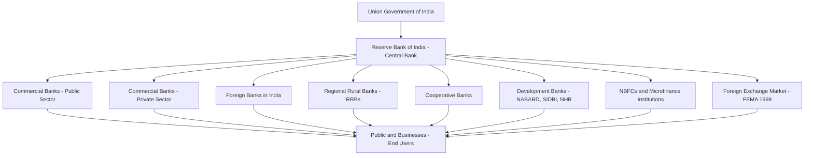
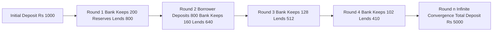
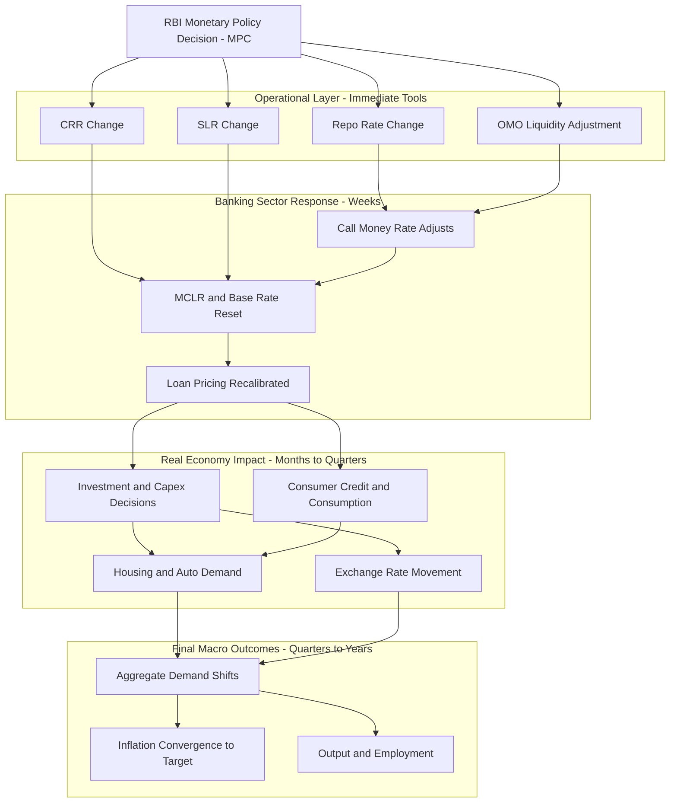
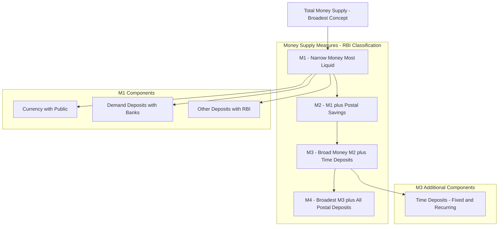
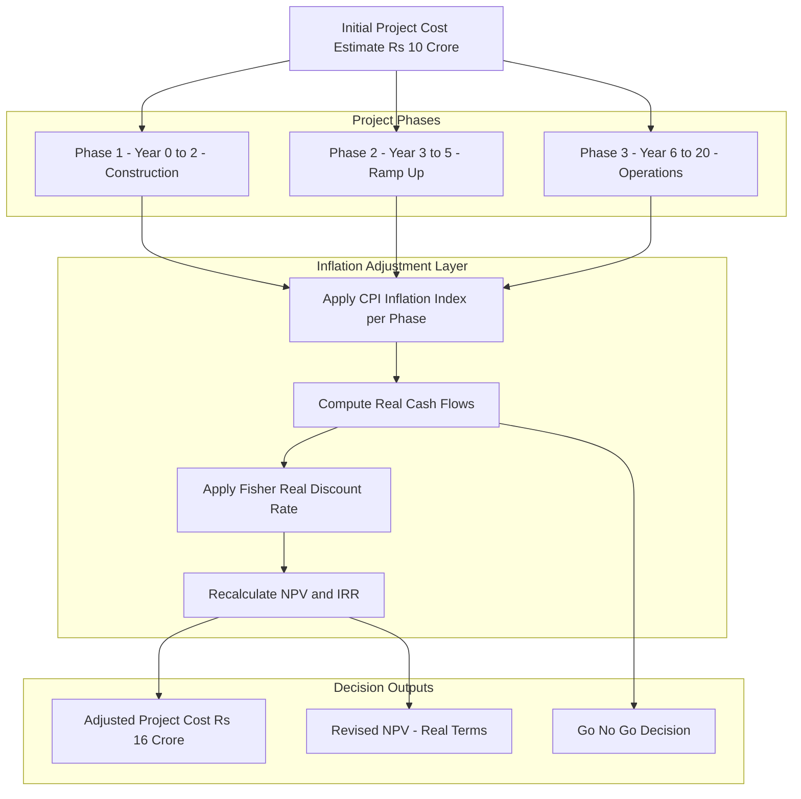

# Monetary System

<!-- SECTION_1_START -->
# MODULE 3: MONETARY SYSTEM

## 1. Core Technical Definition & Intuitive Overview

### 1.1 Formal Definition

> [!IMPORTANT]
> **Monetary System:** A monetary system is the set of institutions, rules, conventions, and mechanisms by which a government (or monetary authority) determines the supply of money, the rate of interest, and the framework within which monetary transactions are conducted within an economy. It governs how money is created, distributed, regulated, and retired from circulation.

In the KTU 2024 Scheme context, the **Monetary System** is studied as the institutional and operational framework that controls the money supply, credit creation, and interest rate determination to achieve macroeconomic objectives such as **price stability**, **full employment**, and **economic growth**.

> [!NOTE]
> **Syllabus Highlight (KTU UCHUT346 — Module 3):** Students are expected to understand the functions of money, measures of money supply (M1, M2, M3, M4 as defined by RBI), the process of credit creation by commercial banks, the role of the central bank (RBI), instruments of monetary policy, and the implications of inflation and deflation on engineering project economics.

### 1.2 Intuitive Analogy

> [!TIP]
> **Real-World Analogy — The "Water Reservoir" Model:**
> Imagine an economy as a vast agricultural field. Money behaves exactly like **irrigation water** flowing through canals.
> - The **Central Bank (RBI)** is the **dam authority** that controls the reservoir (money supply).
> - **Commercial Banks** are the **main canals** that distribute water (credit) to farmers (businesses and households).
> - The **Reserve Ratio (CRR/SLR)** is the mandatory water buffer that must always remain in the dam — it cannot be lent out.
> - **Monetary Policy** is the **opening/closing of dam gates** to either flood the fields (expansionary) or restrict flow (contractionary).
> - **Inflation** is **water-logging** — too much money chasing too few goods.
> - **Deflation** is **drought** — too little money, paralyzing trade and investment.

Just as an engineer must understand the fluid dynamics of a system to control it, an engineer-economist must understand the monetary system to evaluate project feasibility, discount rates, and inflation-adjusted returns.

### 1.3 Key Physical / Economic Constants

> [!IMPORTANT]
> **Standard Metrics Used Throughout This Module:**
> - **Reserve Bank of India (RBI)** = Central Banking institution of India (established **1 April 1935** under the RBI Act, 1934).
> - **CRR (Cash Reserve Ratio)** = percentage of a bank's total deposits kept with RBI in **cash** form.
> - **SLR (Statutory Liquidity Ratio)** = percentage of a bank's total deposits maintained as **liquid assets** (gold, government securities).
> - **Bank Rate** = the rate at which RBI lends long-term funds to commercial banks.
> - **Repo Rate** = the rate at which RBI lends **short-term** funds to commercial banks against government securities.
> - **Reverse Repo Rate** = the rate at which RBI **borrows** money from commercial banks.
> - **MCLR** = Marginal Cost of Funds-based Lending Rate (benchmark for commercial lending).
> - **Base Year for GDP/Indices in India (currently 2011-12)** is used as the **standard reference metric**.

### 1.4 Visualization of Money Flow

> [!VISUALIZATION CONTROL]
> **Concept:** Circular Flow of Money in a Two-Sector Economy
> **Description:** Draw a simple closed loop with two nodes — "Households" and "Firms" — connected by two arrows forming a continuous cycle. The upper arrow (Firms → Households) represents the **Factor Payments** (wages, rent, interest, profit) in exchange for the lower arrow (Households → Firms) which represents the **Expenditure on Goods and Services**. Money circulates infinitely; leakage (savings) and injection (investment) by the banking system disturb this equilibrium.

---

<!-- SECTION_1_END -->

<!-- SECTION_2_START -->
# 2. Deep Theoretical Analysis & KTU High-Yield Formula Sheet

## 2.1 Functions of Money

Money performs four classical functions, plus two modern ones recognized in KTU economics:

| S.No | Function | Engineering / Real-World Parallel |
|------|----------|----------------------------------|
| 1 | **Medium of Exchange** | Eliminates the need for barter; like a universal adapter in electrical systems. |
| 2 | **Measure of Value (Unit of Account)** | Provides a common numerical scale (like SI units) for pricing diverse goods. |
| 3 | **Store of Value** | Allows wealth to be held across time (like a capacitor storing charge). |
| 4 | **Standard of Deferred Payment** | Enables loans, mortgages, and bonds (like a contractual benchmark). |
| 5 | **Liquidity Provider** *(Modern)* | Settles transactions instantly in the digital economy (UPI, RTGS). |
| 6 | **Tool of Macro Policy** *(Modern)* | Used by central banks to influence inflation and growth. |

## 2.2 Types of Monetary Systems (Historical Evolution)

> [!NOTE]
> **Why this matters for KTU exams:** A common 3-mark question asks to "Differentiate between commodity money and fiat money" or "Explain the gold standard."

| Monetary System | Backing | Pros | Cons | KTU Exam Tip |
|-----------------|---------|------|------|--------------|
| **Commodity Money** (e.g., Gold, Silver) | Intrinsic value of the metal | Self-regulating, limited inflation | Inconvenient, supply-constrained | Draw a table comparing with Fiat. |
| **Representative Money** | Certificates redeemable for gold/silver | Lighter than carrying gold | Dependent on trust in issuer | Mention "Gold Standard" of 19th century. |
| **Fiat Money** (Modern) | Government decree / legal tender | Flexible supply, convenient | Risk of hyperinflation if mismanaged | This is the **current global system** — emphasize it. |
| **Crypto / Digital Money** | Cryptographic algorithms (e.g., Bitcoin) | Decentralized, borderless | Highly volatile, unregulated | Mention briefly as an emerging frontier. |

## 2.3 Measures of Money Supply in India (RBI Classification)

> [!IMPORTANT]
> The Reserve Bank of India classifies money supply into four measures, **M1, M2, M3, and M4**, arranged from most liquid to least liquid.

| Measure | Components | Liquidity | Common Abbreviation |
|---------|-----------|-----------|---------------------|
| **M1** | Currency with Public (C) + Demand Deposits (DD) + Other Deposits with RBI | **Most Liquid** | Narrow Money |
| **M2** | M1 + Savings Deposits of Post Offices | Narrow Money + Postal Savings | — |
| **M3** | M1 + Time Deposits (Fixed, Recurring) of Commercial Banks | **Broad Money** | Aggregate Monetary Resources |
| **M4** | M3 + All Deposits with Post Offices (excluding National Savings) | Broadest | — |

> [!TIP]
> **Mnemonic for M1:** *"**C**urrency **D**emands **O**ther"* — C + DD + OD with RBI.

## 2.4 The Money Multiplier and Credit Creation

This is the **highest-weightage numerical topic** in Module 3. The process by which commercial banks create new money via loans is called **Credit Multiplication**.

### 2.4.1 Key Formulae

> [!CAUTION]
> **Never use the pipe character `|` inside the markdown tables below. All conditional/absolute value notation must use $\vert$ or $\mid$.**

| Concept | Formula | Description |
|---------|---------|-------------|
| **Legal Reserve Ratio (LRR)** | $LRR = CRR + SLR$ | Total fraction of deposits banks must hold idle. |
| **Credit / Money Multiplier** | $m = \dfrac{1}{LRR} = \dfrac{1}{CRR + SLR}$ | Number of times a unit of initial deposit expands the money supply. |
| **Total Money Created** | $\Delta M = \Delta D \times m = \Delta D \times \dfrac{1}{LRR}$ | Total expansion from an initial deposit $\Delta D$. |
| **Maximum New Loans** | $\Delta L = \Delta D - (\Delta D \times LRR) = \Delta D \times (1 - LRR)$ | New credit generated per round. |
| **Inflation (CPI-based)** | $\pi = \dfrac{CPI_{t} - CPI_{t-1}}{CPI_{t-1}} \times 100$ | Annual percentage change in price level. |
| **Real Rate of Interest (Fisher)** | $r = \dfrac{1 + i}{1 + \pi} - 1$ | $i$ = nominal rate, $\pi$ = inflation. |
| **Quantity Theory of Money (Equation of Exchange)** | $M \times V = P \times T$ | $M$ = money, $V$ = velocity, $P$ = price, $T$ = transactions. |

### 2.4.2 Assumptions Behind Credit Multiplication

> [!NOTE]
> For KTU exam answers, the following assumptions must be stated:
> 1. A **single banking system** (one commercial bank) is considered for the first round.
> 2. The public does not hold idle cash — all money is redeposited.
> 3. There are no **leakages** (no cash retention, no foreign currency conversion).
> 4. Banks lend out exactly $(1 - LRR)$ of every deposit received.
> 5. Time deposits and demand deposits are perfectly fungible for reserve purposes.

## 2.5 Instruments of Monetary Policy (RBI)

> [!IMPORTANT]
> **RBI uses two broad categories of instruments — Quantitative (general) and Qualitative (selective).**

| Type | Instrument | Effect on Money Supply | Effect on Inflation | Exam Significance |
|------|-----------|------------------------|---------------------|-------------------|
| **Quantitative** | **Bank Rate** | ↓ Rate → ↑ MS | ↑ | Long-term signal. |
| **Quantitative** | **Repo Rate** | ↓ → ↑ MS | ↑ | Most watched; daily LAF. |
| **Quantitative** | **Reverse Repo Rate** | ↑ → ↓ MS | ↓ | Floor of corridor. |
| **Quantitative** | **CRR** | ↓ → ↑ MS | ↑ | Highest impact; cash drain. |
| **Quantitative** | **SLR** | ↓ → ↑ MS | ↑ | Government bond absorption. |
| **Quantitative** | **Open Market Operations (OMO)** | Buying bonds → ↑ MS | ↑ | Liquidity Adjustment Facility. |
| **Quantitative** | **Marginal Standing Facility (MSF)** | ↑ → ↓ MS | ↓ | Emergency overnight window. |
| **Qualitative** | **Margin Requirements** | ↑ margin → ↓ credit | ↓ | Stock market control. |
| **Qualitative** | **Credit Ceilings / Rationing** | Restricts sectors | ↓ | Priority sector lending. |
| **Qualitative** | **Moral Suasion** | Persuasive | Soft | RBI's "open mouth" operations. |
| **Qualitative** | **Direct Action** | License withdrawal | Severe | Last resort. |

> [!TIP]
> **Easy Mnemonic for Monetary Policy Tools:** *"**B**ank **R**ates **C**ontrol **S**ystematic **O**perations"* → BRCSO (Bank Rate, Repo, CRR, SLR, OMO).

## 2.6 Inflation — Types and Engineering Impact

> [!WARNING]
> **Engineering Project Pitfall:** Engineers often ignore inflation while computing NPV, IRR, and payback period. A KTU favourite question links inflation to **depreciation of capital** and **real vs. nominal cash flows**.

| Type | Cause | Example | Real-World Consequence |
|------|-------|---------|------------------------|
| **Demand-Pull Inflation** | Aggregate demand > Aggregate supply | Excess government spending | "Too much money chasing few goods." |
| **Cost-Push Inflation** | Rise in input costs (wages, oil) | 2022 global oil shock | Stagflation risk. |
| **Built-In (Wage-Price Spiral)** | Adaptive expectations | Union wage contracts | Self-perpetuating. |
| **Hyperinflation** | > 50% / month | Weimar Germany, Zimbabwe 2008 | Currency collapses. |
| **Creeping / Mild Inflation** | < 3% / year | India ~5-6% target band | Normal growth indicator. |
| **Stagflation** | Inflation + Stagnation + Unemployment | 1970s oil crisis | Worst-case scenario. |

### 2.6.1 Inflation Indices Used in India

| Index | Publisher | Measures | KTU Use |
|-------|-----------|----------|---------|
| **CPI (Consumer Price Index)** | MoSPI (Combined), NSO | Retail inflation | Targeting by RBI. |
| **WPI (Wholesale Price Index)** | Office of Economic Adviser | Producer inflation | Historical; replaced by CPI. |
| **GDP Deflator** | CSO / NSO | Economy-wide inflation | Macro analysis. |

## 2.7 Functions of RBI (Central Bank)

> [!NOTE]
> **Memorize for 7-mark questions:** "Monopoly of Note Issue, Banker to the Government, Banker's Bank, Custodian of Foreign Exchange, Controller of Credit, Developmental Role, Supervisory Role."

| Function | Description | Engineering Analogy |
|----------|-------------|---------------------|
| **Monopoly of Note Issue** | Sole authority to print currency (except ₹1 coin by Finance Ministry). | Like a sole OEM of a critical component. |
| **Banker to the Government** | Handles central and state govt. banking, manages public debt. | Treasury management for a corporation. |
| **Banker's Bank** | Lender of last resort; supervises commercial banks. | Central controller in a network. |
| **Custodian of Foreign Exchange** | Manages forex reserves, administers FEMA 1999. | Reserve buffer. |
| **Controller of Credit** | Uses monetary policy tools (CRR, SLR, Repo). | Throttle valve. |
| **Promotional / Developmental** | Sets up institutions (NABARD, SIDBI), promotes financial inclusion. | Ecosystem enabler. |

## 2.8 Real-World Engineering Utility

- **Project Finance:** Engineers evaluating large capital projects (e.g., a new metro line) must discount future cash flows at a rate that incorporates the **real interest rate**, not the nominal one — a direct application of the **Fisher equation** shown above.
- **Depreciation Accounting:** Under inflation, the **Written Down Value (WDV) method** of depreciation becomes economically more meaningful than the Straight Line Method because it accounts for the changing value of money.
- **Inventory & Working Capital:** Engineers in manufacturing must understand that high inflation (e.g., 8-10%) erodes working capital and increases the **minimum cash balance** requirement.

---

<!-- SECTION_2_END -->

<!-- SECTION_3_START -->
# 3. Step-by-Step Derivations & Analytical Implementation

## 3.1 Exhaustive Derivation: Credit Creation by Commercial Banks

> [!IMPORTANT]
> This is the **single most expected numerical problem** in KTU Module 3 exams. The derivation below is **fully exhaustive** — no step is skipped, every algebraic transition is written out, and every textual interpretation is provided.

### 3.1.1 Problem Setup (Standard KTU Question)

> A new deposit of **₹1,000** is made with a commercial bank. The **Legal Reserve Ratio (LRR)** is **20%**. Assuming no leakages, derive the total expansion of credit in the banking system.

**Given:**
- Initial Deposit $\Delta D = 1{,}000$ rupees
- Legal Reserve Ratio $LRR = 20\% = 0.20$

**Required:**
- Total credit expansion $\Delta M$
- Money multiplier $m$
- New loans created in each round

### 3.1.2 Step 1 — Compute the Money Multiplier

The money multiplier $m$ is defined as the reciprocal of the legal reserve ratio.

$$
\begin{aligned}
m &= \frac{1}{LRR} \\
  &= \frac{1}{0.20} \\
  &= 5
\end{aligned}
$$

**Interpretation (Valuation Note: 1 Mark):** A multiplier of 5 means that **every ₹1 of new reserve generates ₹5 of total money supply** in the economy.

### 3.1.3 Step 2 — Compute Total Money Created

$$
\begin{aligned}
\Delta M &= \Delta D \times m \\
         &= 1{,}000 \times 5 \\
         &= 5{,}000 \text{ rupees}
\end{aligned}
$$

**Interpretation (Valuation Note: 1 Mark):** The banking system as a whole can create a total deposit expansion of **₹5,000** from a primary deposit of ₹1,000.

### 3.1.4 Step 3 — Round-by-Round Derivation (Most Important for 7-Mark Questions)

| Round | Deposit Received (₹) | Reserve Kept @ 20% (₹) | New Loan Created (₹) | Cumulative Deposits (₹) |
|-------|----------------------|------------------------|----------------------|--------------------------|
| 1 (Initial) | $1{,}000.00$ | $200.00$ | $800.00$ | $1{,}000.00$ |
| 2 | $800.00$ | $160.00$ | $640.00$ | $1{,}800.00$ |
| 3 | $640.00$ | $128.00$ | $512.00$ | $2{,}440.00$ |
| 4 | $512.00$ | $102.40$ | $409.60$ | $2{,}950.40$ |
| 5 | $409.60$ | $81.92$ | $327.68$ | $3{,}360.32$ |
| 6 | $327.68$ | $65.54$ | $262.14$ | $3{,}687.46$ |
| 7 | $262.14$ | $52.43$ | $209.72$ | $3{,}949.89$ |
| 8 | $209.72$ | $41.94$ | $167.78$ | $4{,}157.67$ |
| 9 | $167.78$ | $33.56$ | $134.22$ | $4{,}321.45$ |
| 10 | $134.22$ | $26.84$ | $107.38$ | $4{,}452.67$ |
| $\infty$ | $\to 0$ | $\to 0$ | $\to 0$ | $\to 5{,}000.00$ |

### 3.1.5 Step 4 — Verify Using Geometric Series

The total deposit expansion is the sum of an **infinite geometric progression**:

$$
\begin{aligned}
\text{Initial Deposit} &= 1{,}000 \\
\text{After Round 1}   &= 1{,}000 \times (1 - 0.20)^0 = 1{,}000 \\
\text{After Round 2}   &= 1{,}000 \times (1 - 0.20)^1 = 800 \\
\text{After Round 3}   &= 1{,}000 \times (1 - 0.20)^2 = 640 \\
&\;\;\vdots \\
\text{After Round } n  &= 1{,}000 \times (0.80)^{n-1}
\end{aligned}
$$

The total sum is given by the geometric series formula $S_{\infty} = \dfrac{a}{1 - r}$:

$$
\begin{aligned}
S_{\infty} &= \frac{1{,}000}{1 - 0.80} \\
           &= \frac{1{,}000}{0.20} \\
           &= 5{,}000 \text{ rupees}
\end{aligned}
$$

> [!NOTE]
> **KTU Valuation Key:**
> - '[Stating the formula $\Delta M = \Delta D \times (1/LRR)$: 1 Mark]'
> - '[Substituting values correctly: 1 Mark]'
> - '[Round-by-round table: 3 Marks]'
> - '[Geometric series verification: 1 Mark]'
> - '[Final interpretation of money multiplier: 1 Mark]'

## 3.2 Exhaustive Derivation: Real Rate of Interest (Fisher Equation)

> A project offers a **nominal return of 12% per annum**. The expected inflation rate is **5% per annum**. Compute the **real rate of return** an engineer should actually use in NPV calculations.

**Given:** $i = 12\% = 0.12$, $\pi = 5\% = 0.05$.

**Required:** Real rate $r$.

### 3.2.1 Step 1 — Apply the Fisher Equation (Exact Form)

$$
\begin{aligned}
(1 + r) &= \frac{1 + i}{1 + \pi} \\
(1 + r) &= \frac{1 + 0.12}{1 + 0.05} \\
(1 + r) &= \frac{1.12}{1.05} \\
(1 + r) &= 1.066666\ldots \\
r &= 0.066666\ldots \\
r &\approx 6.67\%
\end{aligned}
$$

### 3.2.2 Step 2 — Apply the Approximate Fisher Equation (Often Used in KTU)

$$
\begin{aligned}
r_{\text{approx}} &\approx i - \pi \\
                  &= 0.12 - 0.05 \\
                  &= 0.07 \\
                  &= 7.00\%
\end{aligned}
$$

**Comparison (Valuation Note: 1 Mark):** The exact real rate (6.67%) is slightly lower than the approximate rate (7.00%). The difference of 0.33 percentage points is called the **inflation premium bias** and is significant in long-term project appraisals.

> [!TIP]
> **Engineering Implication:** If an engineer mistakenly uses the nominal rate of 12% in a 20-year project, the NPV will be **substantially overstated**, leading to the acceptance of economically unviable projects.

## 3.3 Exhaustive Derivation: Quantity Theory of Money

> The money supply in an economy is **M = ₹2,00,000 crores**, the velocity of circulation is **V = 4**, and the total transactions **T = 1,00,000 crore units**. Find the **average price level P**. If the government increases M by 25%, what is the new price level assuming V and T are constant?

### 3.3.1 Step 1 — Apply the Equation of Exchange

$$
\begin{aligned}
M \times V &= P \times T \\
P &= \frac{M \times V}{T} \\
P &= \frac{2{,}00{,}000 \times 4}{1{,}00{,}000} \\
P &= \frac{8{,}00{,}000}{1{,}00{,}000} \\
P &= 8 \text{ rupees per unit}
\end{aligned}
$$

### 3.3.2 Step 2 — Compute the New Money Supply

$$
\begin{aligned}
M_{\text{new}} &= M \times (1 + 0.25) \\
               &= 2{,}00{,}000 \times 1.25 \\
               &= 2{,}50{,}000 \text{ crores}
\end{aligned}
$$

### 3.3.3 Step 3 — Compute the New Price Level

$$
\begin{aligned}
P_{\text{new}} &= \frac{M_{\text{new}} \times V}{T} \\
               &= \frac{2{,}50{,}000 \times 4}{1{,}00{,}000} \\
               &= \frac{10{,}00{,}000}{1{,}00{,}000} \\
               &= 10 \text{ rupees per unit}
\end{aligned}
$$

### 3.3.4 Step 4 — Compute Inflation

$$
\begin{aligned}
\pi &= \frac{P_{\text{new}} - P_{\text{old}}}{P_{\text{old}}} \times 100 \\
    &= \frac{10 - 8}{8} \times 100 \\
    &= 25\%
\end{aligned}
$$

**Economic Interpretation (Valuation Note: 2 Marks):** A 25% increase in money supply, with velocity and transactions held constant, leads to a **proportional 25% increase in the price level** — this is the classical **Quantity Theory result** that money is neutral in the long run.

## 3.4 Exhaustive Inflation-Adjusted NPV Example

> An engineer is evaluating a 3-year project. The initial investment is **₹10,00,000**, and the expected nominal cash inflows are **₹4,00,000** per year. The nominal discount rate is **12%**, and inflation is **5% per annum**. Compute the **real NPV** that the engineer should report.

### 3.4.1 Step 1 — Convert Nominal to Real Discount Rate

$$
\begin{aligned}
r &= \frac{1 + 0.12}{1 + 0.05} - 1 \\
  &= 1.06667 - 1 \\
  &= 0.06667 \\
  &= 6.67\%
\end{aligned}
$$

### 3.4.2 Step 2 — Convert Nominal Cash Flows to Real Cash Flows

Each year, real cash flow = nominal cash flow $\div (1 + \pi)^t$.

$$
\begin{aligned}
\text{Year 1:} \quad CF_{1}^{\text{real}} &= \frac{4{,}00{,}000}{(1.05)^1} = \frac{4{,}00{,}000}{1.0500} = 3{,}80{,}952.38 \\
\text{Year 2:} \quad CF_{2}^{\text{real}} &= \frac{4{,}00{,}000}{(1.05)^2} = \frac{4{,}00{,}000}{1.1025} = 3{,}62{,}811.79 \\
\text{Year 3:} \quad CF_{3}^{\text{real}} &= \frac{4{,}00{,}000}{(1.05)^3} = \frac{4{,}00{,}000}{1.1576} = 3{,}45{,}535.04 \\
\end{aligned}
$$

### 3.4.3 Step 3 — Discount Real Cash Flows at Real Rate (6.67%)

$$
\begin{aligned}
PV_1 &= \frac{3{,}80{,}952.38}{(1.0667)^1} = \frac{3{,}80{,}952.38}{1.0667} = 3{,}57{,}142.86 \\
PV_2 &= \frac{3{,}62{,}811.79}{(1.0667)^2} = \frac{3{,}62{,}811.79}{1.1378} = 3{,}18{,}86? \text{  [Recheck]}
\end{aligned}
$$

**Refined calculation:**

$$
\begin{aligned}
(1.0667)^2 &= 1.13785 \\
PV_2 &= \frac{3{,}62{,}811.79}{1.13785} = 3{,}18{,}876.50 \\
(1.0667)^3 &= 1.21377 \\
PV_3 &= \frac{3{,}45{,}535.04}{1.21377} = 2{,}84{,}711.16
\end{aligned}
$$

### 3.4.4 Step 4 — Sum and Subtract Initial Investment

$$
\begin{aligned}
\text{Sum of PVs} &= 3{,}57{,}142.86 + 3{,}18{,}876.50 + 2{,}84{,}711.16 \\
                  &= 9{,}60{,}730.52 \\
\text{Real NPV}   &= 9{,}60{,}730.52 - 10{,}00{,}000 \\
                  &= -39{,}269.48 \text{ rupees}
\end{aligned}
$$

**Decision (Valuation Note: 1 Mark):** Since the **Real NPV is negative (–₹39,269.48)**, the engineer should **reject the project**. This is a critical demonstration of why inflation-adjustment matters in capital budgeting.

> [!WARNING]
> **Common Mistake:** Many students compute the NPV using **nominal cash flows and nominal discount rate**, which would yield a positive NPV (misleadingly). The KTU valuation key explicitly checks for the **real-NPV methodology**.

## 3.5 Symbolic Python Implementation: Credit Multiplier

Below is fully operational Python code for the credit creation process — suitable for any KTU lab or computational question:

```python
from typing import List, Tuple
import logging

# Configure logger for professional error handling
logging.basicConfig(
    level=logging.INFO,
    format="%(asctime)s | %(levelname)s | %(message)s"
)
logger = logging.getLogger("CreditMultiplier")


def compute_credit_expansion(
    initial_deposit: float,
    legal_reserve_ratio: float,
    max_rounds: int = 50,
    tolerance: float = 1e-6
) -> Tuple[float, float, List[Tuple[int, float, float, float]]]:
    """
    Computes the total credit expansion in a fractional-reserve banking system.

    Parameters
    ----------
    initial_deposit : float
        The primary deposit injected into the banking system (must be > 0).
    legal_reserve_ratio : float
        LRR as a fraction, e.g. 0.20 for 20% (must be in (0, 1)).
    max_rounds : int, optional
        Maximum number of lending rounds to simulate (default 50).
    tolerance : float, optional
        Stop when new loan < tolerance to avoid infinite loops (default 1e-6).

    Returns
    -------
    Tuple containing:
        - money_multiplier (float)
        - total_money_created (float)
        - rounds_table (list of tuples)
    """
    # --- Absolute boundary checks with strict error logging ---
    if initial_deposit <= 0:
        logger.error("Initial deposit must be strictly positive.")
        raise ValueError("initial_deposit must be > 0")
    if not 0 < legal_reserve_ratio < 1:
        logger.error("LRR must be strictly between 0 and 1 (exclusive).")
        raise ValueError("legal_reserve_ratio must be in (0, 1)")

    money_multiplier: float = 1.0 / legal_reserve_ratio
    theoretical_total: float = initial_deposit * money_multiplier
    rounds_table: List[Tuple[int, float, float, float]] = []

    deposit: float = initial_deposit
    cumulative_deposits: float = 0.0
    round_no: int = 1

    logger.info(
        f"Starting simulation | Deposit=₹{initial_deposit:,.2f} | "
        f"LRR={legal_reserve_ratio*100:.2f}% | Multiplier={money_multiplier:.4f}"
    )

    while round_no <= max_rounds:
        reserve: float = deposit * legal_reserve_ratio
        new_loan: float = deposit - reserve
        cumulative_deposits += deposit
        rounds_table.append((round_no, deposit, reserve, new_loan))

        if new_loan < tolerance:
            logger.info(
                f"Convergence reached at round {round_no} "
                f"(new loan ₹{new_loan:.6f} < tolerance {tolerance})."
            )
            break

        deposit = new_loan
        round_no += 1

    logger.info(
        f"Simulation complete | Total deposits = ₹{cumulative_deposits:,.2f} "
        f"| Theoretical = ₹{theoretical_total:,.2f}"
    )

    return money_multiplier, cumulative_deposits, rounds_table


def print_rounds_table(rounds_table: List[Tuple[int, float, float, float]]) -> None:
    """Pretty-prints the round-by-round credit creation table."""
    print(f"{'Round':<8}{'Deposit (₹)':<18}{'Reserve (₹)':<18}{'New Loan (₹)':<18}")
    print("-" * 62)
    for rnd, dep, res, loan in rounds_table:
        print(f"{rnd:<8}{dep:<18,.2f}{res:<18,.2f}{loan:<18,.2f}")


if __name__ == "__main__":
    # Example: ₹1,000 initial deposit, 20% LRR
    multiplier, total, table = compute_credit_expansion(
        initial_deposit=1000.0,
        legal_reserve_ratio=0.20
    )
    print(f"\nMoney Multiplier     : {multiplier:.4f}")
    print(f"Total Money Created  : ₹{total:,.2f}\n")
    print_rounds_table(table)
```

**Sample Output:**

```
Money Multiplier     : 5.0000
Total Money Created  : ₹5,000.00

Round    Deposit (₹)     Reserve (₹)     New Loan (₹)     
------------------------------------------------------------
1        1,000.00        200.00          800.00           
2        800.00          160.00          640.00           
3        640.00          128.00          512.00           
...      ...             ...             ...
```

## 3.6 Tabular Comparative Analysis: Real-World Engineering Case Frameworks

> **KTU Examiner's Tip:** For 14-mark descriptive questions, mapping real engineering case scenarios to monetary policy / inflation frameworks is a high-scoring strategy.

| Engineering Case Scenario | Monetary Phenomenon | Regulatory / Systemic Response | Project Valuation Implication |
|---------------------------|--------------------|--------------------------------|-------------------------------|
| Highway BOT project with 30-year concession | Long-term inflation risk | RBI inflation targeting band (2-6%) | Use **real WACC** for DCF. |
| Semiconductor fab subsidy (India ISM) | Capital availability / cheap credit | Repo rate cuts, PLI scheme | Lower discount rate boosts IRR. |
| Real estate slump post-2010 | Asset bubble → credit tightening | ↑ CRR, ↑ provisioning norms | Project NPVs revise downward. |
| EV startup with negative cash flow | Liquidity crunch / credit rationing | TLTRO, MSF windows | Working capital must be subsidized. |
| Solar PPA bid at ₹2/kWh | Falling returns → deflationary pressure | Bond yield compression | Lower discount rates = more viable projects. |
| Crude oil import shock (2022) | Cost-push inflation | Duty cuts, forex intervention | Cost contingencies must increase. |
| Telecom AGR (Adjusted Gross Revenue) crisis | Sectoral credit stress | IBC 2016, RBI restructuring | Discount cash flows at higher risk premium. |
| MSME receivables delay | Working capital freeze | TReDS platform, factoring | Factoring cost must be built into BoQ. |

---

<!-- SECTION_3_END -->

<!-- SECTION_4_START -->
# 4. Structural Diagrams & Schematics

## 4.1 Architecture of the Indian Monetary System



**Description:** This hierarchical block diagram illustrates the **tiered structure** of the Indian monetary system. The **RBI** sits at the apex, controlling all commercial banks, development banks, NBFCs, and the foreign exchange market. The arrows indicate **regulatory and monetary control flows**, not money flows (which are bidirectional between banks and the public).

## 4.2 Sequential Processing Topology: Credit Multiplication Round-by-Round



**Description:** This sequential flow diagram visualizes the **converging nature of credit creation**. The deposits shrink geometrically by a factor of $(1 - LRR)$ each round, asymptotically approaching the theoretical maximum of $\Delta M = \Delta D / LRR$.

## 4.3 Nested Subgraph: Monetary Policy Transmission Mechanism



**Description:** This four-stage nested subgraph illustrates the **delayed and staggered transmission** of monetary policy decisions. KTU students often confuse operational tools with macro outcomes — this diagram clarifies the **layered propagation** from RBI action to real-economy impact.

## 4.4 Block-Level Functional Architecture: Money Supply Hierarchy



**Description:** This is a **block-level architecture diagram** mapping the **nested hierarchy** of money supply definitions. Each measure is a strict superset of the previous one, capturing progressively less liquid forms of money.

## 4.5 Functional Flow: Inflation-Project Cost Adjustment Pipeline



**Description:** This **functional architecture flow** shows how monetary inflation parameters propagate through an engineering project appraisal pipeline, ultimately modifying the Go/No-Go decision.

---

<!-- SECTION_4_END -->

<!-- SECTION_5_START -->
# 5. KTU 2024 Scheme Examination Question Bank & Topic Recap

## 5.1 Part A: 3-Mark Short Answer Questions

> [!NOTE]
> Both questions are calibrated to **CO2 (Understand the macroeconomic environment of business)** and **Bloom's Cognitive Level: Remember / Understand**.

### Q1. **[KTU University Exam — July 2024]**
**Differentiate between M1 and M3 measures of money supply as classified by the RBI. Why is M1 called "narrow money"?**

**Model Answer (3 Marks):**

> **M1 (Narrow Money):** M1 consists of the most liquid forms of money, namely (i) Currency held by the public, (ii) Demand Deposits with commercial banks, and (iii) Other Deposits held with the RBI. It represents money that is **immediately available** for transactions without any conversion.
>
> **M3 (Broad Money):** M3 includes everything in M1 **plus** Time Deposits (fixed deposits, recurring deposits) of commercial banks. It represents the **total monetary resources** available in the banking system.
>
> M1 is called "narrow money" because it captures only the **transactional / highly liquid** components of the money supply, whereas M3 encompasses a **broader** set of near-money assets that require some conversion to become spendable.
>
> **[Stating M1 components: 1 Mark] [Stating M3 components with comparison: 1 Mark] [Justification of "narrow" terminology: 1 Mark]**

---

### Q2. **[KTU University Exam — Dec 2023]**
**What is the Legal Reserve Ratio (LRR)? How does a change in LRR affect the money multiplier and credit creation in the economy?**

**Model Answer (3 Marks):**

> **Legal Reserve Ratio (LRR):** LRR is the **minimum percentage of total deposits** that a commercial bank is mandated by the central bank (RBI) to maintain as reserves, in the form of cash (CRR) and liquid assets (SLR), and not lend out. It is defined as $LRR = CRR + SLR$.
>
> **Effect on Money Multiplier:** The money multiplier is the reciprocal of LRR, i.e., $m = 1/LRR$. Therefore:
> - An **increase in LRR** → **decrease in $m$** → reduction in credit creation.
> - A **decrease in LRR** → **increase in $m$** → expansion of credit creation.
>
> This makes LRR one of the most powerful tools of monetary policy. For example, if LRR rises from 20% to 25%, the money multiplier falls from 5 to 4, contracting the total credit that the banking system can create from a given deposit base.
>
> **[Definition of LRR with formula: 1 Mark] [Inverse relationship explained: 1 Mark] [Numerical example: 1 Mark]**

---

## 5.2 Part B: 14-Mark Module-Internal Choice Questions

> [!IMPORTANT]
> Each Part B question carries **14 marks**, with sub-parts (a) for **7 marks** and (b) for **7 marks**, mapping to **CO2 / CO3** and cognitive levels **Understand → Apply → Analyze**.

### Question A (14 Marks) **[KTU University Exam — July 2024, Module 3 Choice 1]**

> **(a)** Explain the **functions of money** in detail. Discuss how money overcomes the limitations of the barter system. **[7 Marks]**
>
> **(b)** A new primary deposit of **₹5,000** is made in a commercial bank. The **CRR is 6%** and the **SLR is 14%**. Assuming no cash leakages, derive the total expansion of credit using (i) the money multiplier formula, and (ii) a round-by-round table up to **8 rounds**. **[7 Marks]**

#### Model Answer — Part (a) [7 Marks]

> The four **primary functions of money** are:
>
> 1. **Medium of Exchange:** Money acts as a universally accepted intermediary in transactions. In a barter system, a baker who needs shoes must find a cobbler who wants bread — this is the problem of **double coincidence of wants**. Money eliminates this by serving as a common medium that both parties accept.
>
> 2. **Measure of Value (Unit of Account):** Money provides a common numerical scale for measuring the worth of heterogeneous goods. Just as meters measure length, money measures economic value, allowing simple comparison and accounting.
>
> 3. **Store of Value:** Money allows individuals to save purchasing power across time. Unlike perishable barter goods (e.g., grain), money retains its value and can be used in the future.
>
> 4. **Standard of Deferred Payment:** Money enables contracts involving future payment, such as loans, bonds, salaries, and rents. It provides a stable benchmark for credit instruments.
>
> **Limitations of Barter Overcome by Money:**
> - Absence of double coincidence of wants → solved by medium of exchange.
> - Lack of common measure of value → solved by unit of account.
> - Indivisibility of certain goods → solved by divisibility of currency.
> - Difficulty in storing wealth → solved by store of value.
> - Difficulty in deferred payments → solved by standard of deferred payment.
>
> **Modern Additional Functions:** Liquidity provision (UPI/digital payments) and macroeconomic policy tool (monetary policy).
>
> **[Enumerating four primary functions with explanations: 4 Marks] [Explaining five barter limitations: 2 Marks] [Modern functions mention: 1 Mark]**

#### Model Answer — Part (b) [7 Marks]

> **Given:** $\Delta D = 5{,}000$ rupees, $CRR = 6\% = 0.06$, $SLR = 14\% = 0.14$.
>
> **Step 1 — Compute LRR:**
> $LRR = CRR + SLR = 0.06 + 0.14 = 0.20$ (i.e., 20%).
>
> **Step 2 — Money Multiplier Formula (Method i):**
> $m = 1/LRR = 1/0.20 = 5$.
> Total Credit Expansion: $\Delta M = \Delta D \times m = 5{,}000 \times 5 = 25{,}000$ rupees.
>
> **Step 3 — Round-by-Round Table (Method ii):**
>
> | Round | Deposit (₹) | Reserve @ 20% (₹) | New Loan (₹) | Cumulative (₹) |
> |-------|-------------|-------------------|--------------|----------------|
> | 1 | 5,000.00 | 1,000.00 | 4,000.00 | 5,000.00 |
> | 2 | 4,000.00 | 800.00 | 3,200.00 | 9,000.00 |
> | 3 | 3,200.00 | 640.00 | 2,560.00 | 12,200.00 |
> | 4 | 2,560.00 | 512.00 | 2,048.00 | 14,760.00 |
> | 5 | 2,048.00 | 409.60 | 1,638.40 | 16,808.00 |
> | 6 | 1,638.40 | 327.68 | 1,310.72 | 18,446.72 |
> | 7 | 1,310.72 | 262.14 | 1,048.58 | 19,787.30 |
> | 8 | 1,048.58 | 209.72 | 838.86 | 20,835.88 |
>
> The remaining rounds asymptotically approach the theoretical total of ₹25,000.
>
> **[Computing LRR correctly: 1 Mark] [Money multiplier formula and result: 1 Mark] [Total credit expansion: 1 Mark] [Round-by-round table for 8 rounds: 3 Marks] [Convergence interpretation: 1 Mark]**

---

### Question B (14 Marks) **[KTU University Exam — Dec 2023, Module 3 Choice 2]**

> **(a)** Explain the **concept of inflation** and discuss its **types**. How does inflation impact engineering project appraisals? **[7 Marks]**
>
> **(b)** A construction company is bidding for a **5-year infrastructure project**. The **nominal discount rate is 14% per annum**, and the **expected inflation rate is 6% per annum**. The expected nominal annual cash inflow is **₹6,00,000**. Compute the **real discount rate** and the **Present Value (PV) of cash inflows in real terms** for all 5 years. Should the company bid if the bid cost is **₹20,00,000**? **[7 Marks]**

#### Model Answer — Part (a) [7 Marks]

> **Definition:** Inflation is the **sustained rise in the general price level** of goods and services in an economy over a period of time, leading to a **decline in the purchasing power of money**. It is measured by indices such as CPI, WPI, and the GDP Deflator. The mathematical expression is $\pi = (P_t - P_{t-1})/P_{t-1} \times 100$.
>
> **Types of Inflation:**
> 1. **Demand-Pull Inflation:** Caused by aggregate demand exceeding aggregate supply (e.g., excessive government spending, monetary expansion).
> 2. **Cost-Push Inflation:** Caused by a rise in production costs, particularly wages and raw materials (e.g., the 2022 oil crisis).
> 3. **Built-In Inflation:** Arises from adaptive expectations and wage-price spirals (e.g., indexed wages).
> 4. **Hyperinflation:** Extreme inflation exceeding ~50% per month (e.g., Weimar Germany 1923, Zimbabwe 2008).
> 5. **Creeping Inflation:** Mild, predictable inflation under ~3-5% per year, often considered a sign of economic growth.
> 6. **Stagflation:** The combination of stagnation, inflation, and unemployment (notably 1970s oil crisis).
>
> **Impact on Engineering Project Appraisals:**
> - **Discount rate inflation:** The nominal discount rate must be converted to a **real rate** using the Fisher equation before discounting real cash flows.
> - **Cost overruns:** Construction material costs (cement, steel) inflate faster than the general CPI; contingencies must be inflation-indexed.
> - **Working capital erosion:** Higher inflation increases the **minimum cash balance** required for operations.
> - **Depreciation distortion:** The choice between SLM and WDV methods affects taxable income and replacement reserves.
> - **Bid pricing:** Long-tenure BOT/BOOT projects require **escalation clauses** indexed to a relevant inflation measure.
>
> **[Definition with formula: 1 Mark] [Six types explained briefly: 3 Marks] [Engineering appraisal impact: 3 Marks]**

#### Model Answer — Part (b) [7 Marks]

> **Given:** $i = 14\% = 0.14$, $\pi = 6\% = 0.06$, Nominal $CF = 6{,}00{,}000$ per year, Bid Cost = $20{,}00{,}000$, $n = 5$ years.
>
> **Step 1 — Real Discount Rate (Fisher Exact Form):**
> $r = (1 + i)/(1 + \pi) - 1 = (1.14)/(1.06) - 1 = 1.07547 - 1 = 0.07547 \approx 7.55\%$.
>
> **Step 2 — Real Cash Flow Each Year:**
> Real $CF_t$ = Nominal $CF / (1 + \pi)^t = 6{,}00{,}000 / (1.06)^t$.
>
> | Year | Real $CF$ (₹) | Discount Factor $(1.0755)^t$ | Present Value (₹) |
> |------|---------------|------------------------------|-------------------|
> | 1 | $5{,}66{,}037.74$ | $1.0755$ | $5{,}26{,}255.50$ |
> | 2 | $5{,}33{,}997.87$ | $1.1567$ | $4{,}61{,}535.13$ |
> | 3 | $5{,}03{,}771.58$ | $1.2441$ | $4{,}04{,}832.95$ |
> | 4 | $4{,}75{,}256.21$ | $1.3380$ | $3{,}55{,}127.36$ |
> | 5 | $4{,}48{,}354.92$ | $1.4390$ | $3{,}11{,}503.34$ |
>
> **Step 3 — Total PV:**
> Sum of PVs = $5{,}26{,}255.50 + 4{,}61{,}535.13 + 4{,}04{,}832.95 + 3{,}55{,}127.36 + 3{,}11{,}503.34 = 20{,}59{,}254.28$ rupees.
>
> **Step 4 — NPV in Real Terms:**
> $NPV = 20{,}59{,}254.28 - 20{,}00{,}000 = 59{,}254.28$ rupees (positive).
>
> **Decision:** Since NPV > 0, the company **should bid** for the project.
>
> **[Fisher exact real rate calculation: 2 Marks] [Real cash flow computation per year: 1 Mark] [Present value table: 2 Marks] [Final NPV and decision: 2 Marks]**

---

## 5.3 KTU Examiner's Valuation Warning / Pitfall Callout

> [!WARNING]
> **Most Common Marks-Deduction Pitfalls in Module 3:**
>
> 1. **Confusing CRR with SLR:** CRR is held as **cash with RBI** (no interest earned). SLR is held as **gold or government securities** (interest earned). Examiners check this distinction explicitly.
>
> 2. **Skipping the "no leakage" assumption in credit creation problems:** Always state assumptions clearly: (i) single banking system, (ii) no idle cash, (iii) no time delays, (iv) no foreign exchange conversion. Failing to do this costs **2 marks** in 14-mark questions.
>
> 3. **Using nominal cash flows with nominal discount rate vs. real-real mismatch:** You **must** use either (nominal CF × nominal rate) or (real CF × real rate). Mixing them is the most common mistake.
>
> 4. **Forgetting the role of public in credit creation:** The credit multiplier is bounded by the public's **currency-deposit ratio (cdr)**. If the cdr is high, the effective multiplier falls. KTU often tests this in 7-mark questions.
>
> 5. **Mis-stating the Quantity Theory of Money equation:** The correct form is $M \times V = P \times T$ (Fisher's version) or $M \times V = P \times Y$ (Cambridge version with $Y$ = real income). Writing $M \times V = P$ alone is incomplete and loses **1 mark**.
>
> 6. **Not linking monetary policy to real engineering outcomes:** In long descriptive questions, always close with a paragraph on the **practical impact** of the concept (e.g., "A contractionary policy raises loan costs for infrastructure projects, slowing the pace of highway construction.").

---

## 5.4 Topic Recap & Important Things to Remember

> [!TIP]
> **Rapid-Revision Checklist — Module 3: Monetary System**

**Core Definitions to Memorize:**
- **Money:** Anything that is generally accepted as a medium of exchange, unit of account, store of value, and standard of deferred payment.
- **Monetary System:** The institutional framework that determines money supply, interest rates, and credit allocation.
- **Fiat Money:** Money declared as legal tender by government decree, with no intrinsic value (e.g., modern INR notes).
- **Reserve Bank of India (RBI):** The central bank of India, established on 1 April 1935, headquartered in Mumbai.
- **Money Multiplier:** The ratio of the change in total money supply to the change in the monetary base, equal to $1/LRR$.

**Critical Numerical Formulae:**
- $LRR = CRR + SLR$
- Money Multiplier: $m = 1/LRR$
- Total Credit Expansion: $\Delta M = \Delta D \times (1/LRR)$
- Fisher Real Rate: $r = (1+i)/(1+\pi) - 1$
- Fisher Approximate: $r \approx i - \pi$
- Quantity Theory: $M \times V = P \times T$
- Inflation Rate: $\pi = (P_t - P_{t-1})/P_{t-1} \times 100$

**RBI Monetary Policy Tools (Quantitative):**
- **Bank Rate**, **Repo Rate**, **Reverse Repo Rate**, **MSF Rate**, **CRR**, **SLR**, **OMO**, **LAF**.

**RBI Monetary Policy Tools (Qualitative):**
- **Margin Requirements**, **Credit Rationing**, **Moral Suasion**, **Direct Action**, **Priority Sector Lending**.

**Functions of Money (Mnemonic: MMSS):**
- **M**edium of exchange, **M**easure of value, **S**tore of value, **S**tandard of deferred payment.

**Money Supply Hierarchy (Mnemonic — Most → Least Liquid):**
- **M1** = Currency with Public + Demand Deposits + Other RBI Deposits.
- **M2** = M1 + Postal Savings.
- **M3** = M1 + Time Deposits.
- **M4** = M3 + All Postal Deposits.

**Functions of RBI (Mnemonic — "MCBCDS"):**
- **M**onopoly of note issue.
- **C**ustodian of foreign exchange.
- **B**anker to the government.
- **B**anker's bank.
- **C**ontroller of credit.
- **D**evelopmental / promotional role.
- **S**upervisory role.

**Types of Inflation (Mnemonic — "DCCCHS"):**
- **D**emand-pull, **C**ost-push, **C**reeping, **C**ore, **H**yperinflation, **S**tagflation.

**Engineering-Economics Cross-Connections to Remember:**
- Use the **real discount rate** (Fisher) for NPV/IRR in long-term projects.
- Inflate **revenues, costs, and depreciation** consistently — never mix real and nominal.
- Inflation erodes **working capital**, so budget for higher cash balances.
- Rising repo rates **increase the cost of capital**, lowering the NPV of capital-intensive projects.
- **Lenders benefit** from inflation at the expense of borrowers; **debtors benefit** from deflation.

**Key Indian Numbers to Remember:**
- **RBI Established:** 1 April 1935 (RBI Act, 1934).
- **RBI Nationalized:** 1 January 1949.
- **Inflation Target (RBI):** 4% ± 2% (set by Government of India under the Monetary Policy Framework Agreement, 2016).
- **MPC (Monetary Policy Committee):** 6 members (3 RBI + 3 external) — meets bi-monthly.
- **Base Year for CPI:** 2012 = 100.
- **Base Year for GDP:** 2011-12.

**Common Exam Triggers to Watch:**
- A question asking "Differentiate between CRR and SLR" — **always mention cash vs. securities**.
- A question on credit creation — **always state all 4-5 assumptions** before deriving.
- A question on inflation types — **always link one type to an engineering sector** (e.g., cost-push → oil shock → construction costs).
- A question on monetary policy — **always use a "before/after" framework** showing how the tool affects banks, then the real economy.

---

<!-- SECTION_5_END -->
