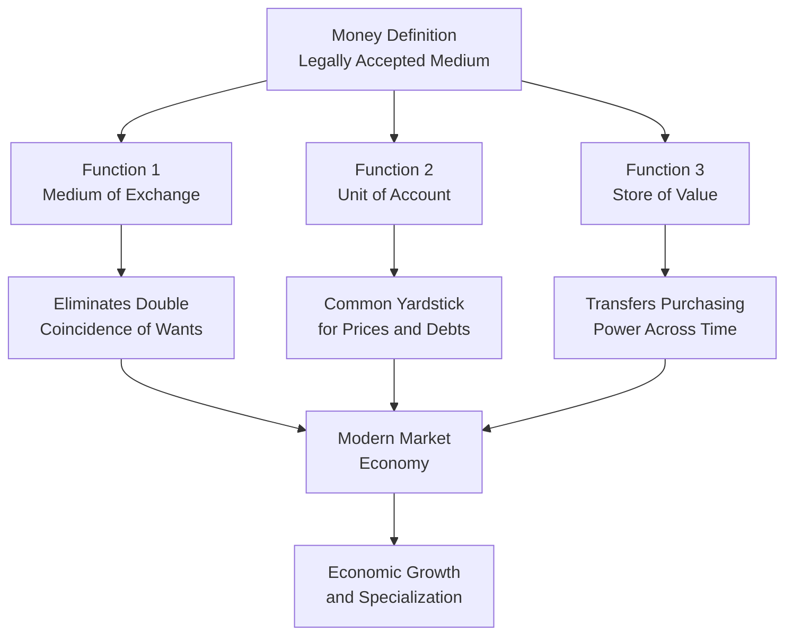
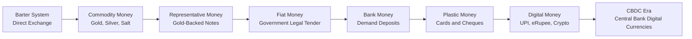
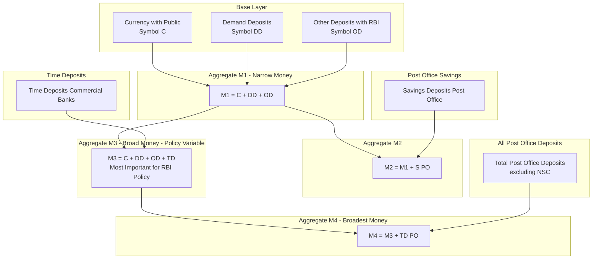
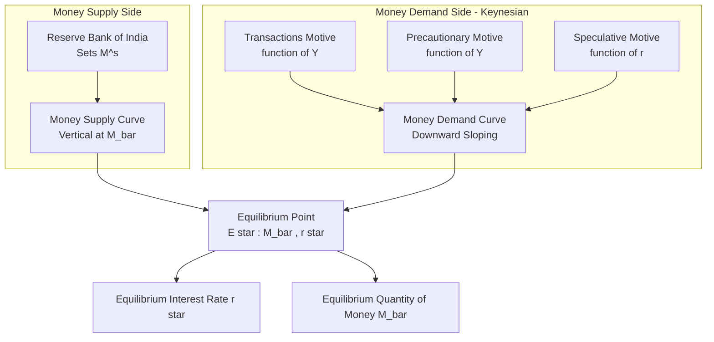
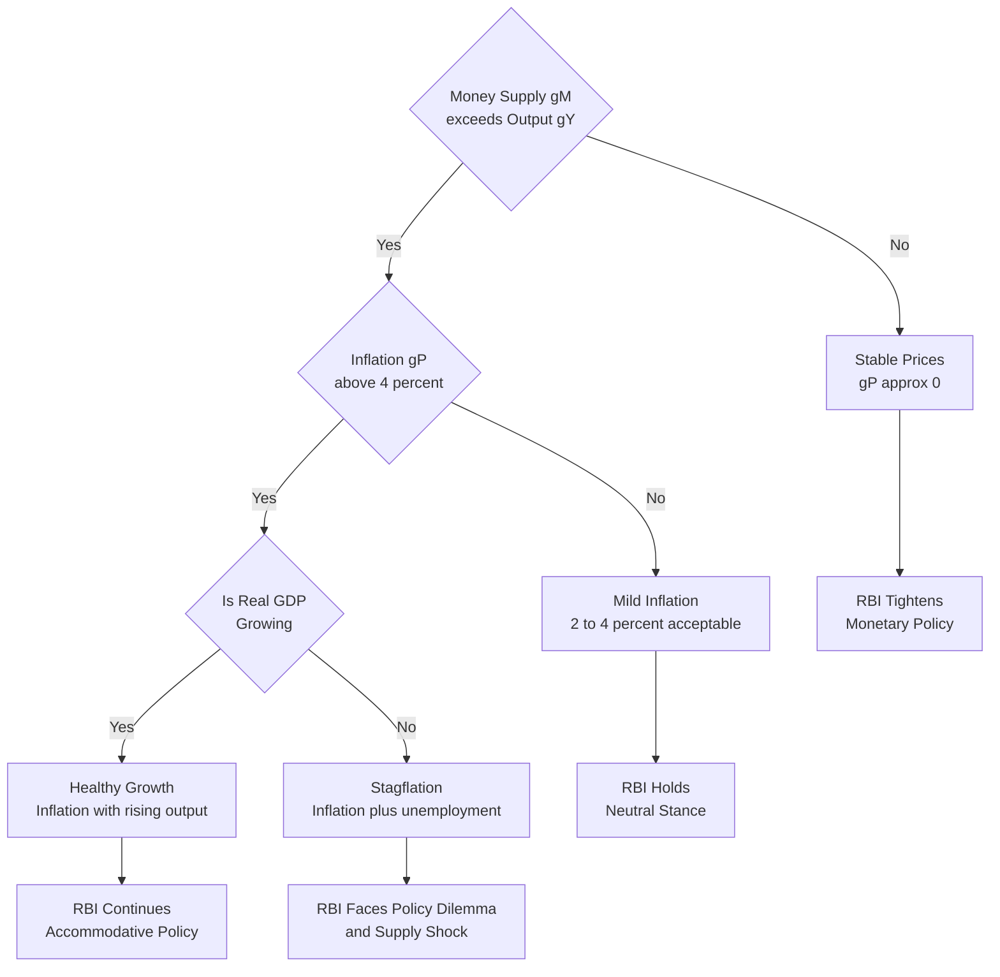
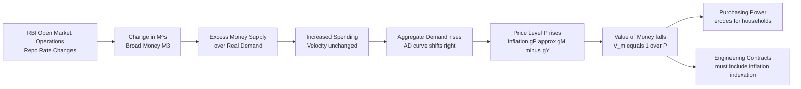

# Money

<!-- SECTION_1_START -->
# Money — Core Technical Definition & Intuitive Overview

## 1. Formal Academic Definition (KTU 2024 Syllabus Terminology)

> [!IMPORTANT]
> **Definition (KTU Board Standard):**
> **Money** is any legally and socially accepted medium of exchange, unit of account, and store of value that is widely used in an economy for the settlement of transactions, the discharge of debts, and the measurement of economic value.

In the KTU 2024 scheme module "Monetary System" (UCHUT346 Module 3), money is treated as the **lifeblood of the modern market economy** and the principal instrument through which the **Central Bank of a nation** (in India, the **Reserve Bank of India — RBI**) regulates liquidity, price stability, and aggregate demand.

The textbook (Pindyck & Rubinfeld / Dewett & Navalur) classification recognises money as anything that performs **three simultaneous economic functions** and satisfies **four essential characteristics**.

---

## 2. Conceptual Analogy / Intuition

> [!NOTE]
> **Real-World Analogy — "The Marketplace Theatre"**

Imagine a small village where every household produces only one good — a farmer grows rice, a potter makes pots, a weaver weaves cloth. If the rice farmer wants a pot, he must *find* a potter who *happens* to need rice. This is called a **Barter System** — clumsy, time-consuming, and requiring a **Double Coincidence of Wants**.

> **Money is the "universal translator" that solves this problem.**

Think of money as the **"common ticket"** at an amusement park. You exchange your real-world skills, time, and goods for *tickets* (money), and *every* stall in the park accepts those tickets. The potter no longer needs to *want* rice — he just needs to *accept tickets*. This is the fundamental social and economic role of money.

### Geometric / Graphical Intuition

On a standard two-axis economic graph, money is represented at the **intersection of supply and demand in the money market**:

- **Vertical axis (Y):** Nominal **Interest Rate ($i$ or $r$)** — measured in percent.
- **Horizontal axis (X):** Real **Quantity of Money ($M$)** — measured in ₹ Crores.
- The **Money Supply Curve ($M^S$)** is a **vertical line** (perfectly inelastic) because it is exogenously determined by the RBI.
- The **Money Demand Curve ($M^D$)** is **downward-sloping** (interest rate inversely related to opportunity cost of holding money).

> [!VISUALIZATION CONTROL]
> **Concept:** Money Market Equilibrium (Liquidity Preference Framework)
> **Desmos / GeoGebra Input Equations:**
> * $MS(x) = 10$ (vertical supply line at $M = 10$)
> * $MD(x) = 25 - 2x$ (downward-sloping demand curve)
> * $EQ$: solve $25 - 2x = 10 \Rightarrow x = 7.5$
> **Visual Description:** The student should see a vertical red line and a downward blue line crossing at the equilibrium point $(7.5, 10)$. This intersection is the **equilibrium interest rate** and **equilibrium quantity of money**.

---

## 3. Why Money Matters for Engineers (KTU Context)

> [!IMPORTANT]
> **Engineering-Economic Bridge:**
> For an engineer working in industry, the **time value of money** directly affects: (i) project cost-benefit analysis, (ii) capital budgeting decisions (NPV, IRR), (iii) depreciation accounting, and (iv) inflation-adjusted tender pricing. Hence, a working knowledge of *what money is* and *how its value changes* is not merely academic — it is operationally critical for any B.Tech graduate handling procurement, contracts, or financial estimation in industry.

The standard textbook reference for this module is the **"Engineering Economics"** curriculum prescribed for B.Tech 2024 scheme, with statutory monetary units in India pegged to the **Indian Rupee (₹)**, governed by the **Reserve Bank of India Act, 1934**, with active monetary policy coordination under the **Monetary Policy Committee (MPC)** established in 2016.
<!-- SECTION_1_END -->

<!-- SECTION_2_START -->
# Deep Theoretical Analysis & KTU High-Yield Formula Sheet

## 1. The Three Core Functions of Money

Money is *defined by its functions*, not by its physical form. Any object that performs all three functions qualifies as money.

| Sl. No. | Function | Economic Meaning | Engineering / Real-Life Illustration |
|:-------:|----------|------------------|--------------------------------------|
| 1 | **Medium of Exchange** | Eliminates the need for double coincidence of wants | Paying ₹500 to buy a sensor from an electronics vendor |
| 2 | **Unit of Account (Measure of Value)** | Provides a common yardstick to measure prices and debts | Quoting the cost of a bridge as ₹120 Crore instead of "10,000 bags of rice" |
| 3 | **Store of Value** | Allows purchasing power to be transferred from present to future | Keeping ₹1 Lakh in a Fixed Deposit to fund a project next year |

> [!NOTE]
> **Secondary Functions (often asked in 3-mark questions):**
> (i) **Standard of Deferred Payments** — used to settle loans and future contracts.
> (ii) **Means of Transfer of Value** — facilitates inter-personal and inter-regional transactions.
> (iii) **Liquidity Provider** — the most liquid asset in an economy.

---

## 2. Essential Characteristics of "Good" Money

For any object to function effectively as money, it must satisfy the following four primary properties (these are **high-yield KTU exam topics**, frequently appearing as 3-mark direct questions):

| Characteristic | Required Property | Reason |
|----------------|-------------------|--------|
| **General Acceptability** | Must be legally and socially accepted by all | Otherwise it fails as a medium of exchange |
| **Divisibility** | Must be split into smaller denominations | To make change for ₹10, ₹20 transactions |
| **Portability** | Light and easy to carry | For day-to-day mobility |
| **Durability / Stability of Value** | Must not perish or lose value rapidly | To function as a store of value |
| **Stability in Value** | Low inflation / deflation | Hyperinflation destroys monetary function |
| **Cognizability / Homogeneity** | Each unit must be identical | One ₹100 note must equal another |
| **Scarcity (Limited Supply)** | Must be in controlled, finite supply | Abundance destroys its value (e.g., paper) |

---

## 3. Types / Forms of Money (Evolutionary Classification)

The KTU syllabus explicitly requires students to understand the *evolution* of money — from primitive barter to modern digital currency.

### 3.1 Primary Classification

| Type | Description | Example | Era |
|------|-------------|---------|-----|
| **Commodity Money** | Money with intrinsic value; the material itself is useful | Gold, silver, salt, cattle, grain | Pre-modern |
| **Representative Full-Bodied Money** | A certificate fully backed by a commodity reserve | Gold certificates (USA pre-1971), paper notes convertible into gold | 19th – 20th Century |
| **Fiat Money** | Money with no intrinsic value; declared legal tender by government order | Modern ₹10 / ₹500 paper notes | 1971 onwards (post-Gold Standard abandonment) |
| **Bank Money / Deposit Money** | Demand deposits in commercial banks; transferable by cheque/UPI | Savings / Current account balances | Modern banking era |
| **Near Money** | Highly liquid assets that can be quickly converted into money with minimal loss of value | Treasury bills, commercial paper, short-term government bonds | Financial markets |
| **Plastic Money** | Card-based credit/debit instruments | Debit cards, credit cards, prepaid cards | Post-1990s |
| **Digital / Crypto Money** | Algorithmic, encrypted, decentralised digital tokens | Bitcoin, Ethereum, RBI's Digital Rupee (e₹) | Post-2009 |

### 3.2 Giffen's Paradox vs. Money

> [!NOTE]
> **Giffen Goods vs. Money:** Money is a **neutral medium** — it has no intrinsic utility of its own. Its value comes from what it can *buy*. This is the fundamental distinction between money and Giffen goods (where the paradox of demand operates).

---

## 4. The KTU Money Supply Aggregates (India)

The **Reserve Bank of India (RBI)** publishes four standard measures of money supply, denoted $M_1, M_2, M_3, M_4$. These are *high-priority 14-mark derivation questions* in the KTU 2024 scheme.

> [!IMPORTANT]
> **Hierarchy of Indian Money Supply (RBI Definition):**

### 4.1 Detailed Formula Table

| Aggregate | Components | Formula | Liquidity |
|-----------|------------|---------|-----------|
| $M_1$ — Narrow Money / Transaction Money | Currency with Public + Demand Deposits of Commercial Banks + Other Deposits with RBI | $M_1 = C + DD + OD$ | Most Liquid |
| $M_2$ | $M_1$ + Savings Deposits of Post Offices | $M_2 = M_1 + S_{PO}$ | Highly Liquid |
| $M_3$ — Broad Money | $M_1$ + Time Deposits of Commercial Banks | $M_3 = C + DD + OD + TD$ | Broad measure used for policy |
| $M_4$ | $M_3$ + Total Deposits with Post Offices (excluding National Savings Certificates) | $M_4 = M_3 + TD_{PO}$ | Broadest measure |

> Where:
> * $C$ = **Currency with the Public** (notes + coins in circulation, excluding cash held in bank vaults)
> * $DD$ = **Demand Deposits** (current account, non-interest bearing)
> * $OD$ = **Other Deposits with RBI**
> * $TD$ = **Time Deposits** (fixed deposits, recurring deposits)
> * $S_{PO}$ = **Savings Deposits with Post Offices**
> * $TD_{PO}$ = **Total Post Office Deposits** (excluding NSC)

### 4.2 The Key Formula (Memorise This for ESE)

$$
M_3 = C \; + \; DD \; + \; OD \; + \; TD
$$

This is the **operational measure of broad money** that the RBI uses for monetary policy targeting under the **Multiple Indicator Approach (MIA)**.

---

## 5. The Value of Money

> **Value of Money** = the **purchasing power** of money — i.e., the quantity of goods and services that one unit of money can buy.

Two key concepts emerge here:

### 5.1 Inverse Relation with Price Level

The **Value of Money** is **inversely proportional** to the **Price Level (P)**:

$$
V \;\propto\; \frac{1}{P}
$$

Where:
* $V$ = Value of money (purchasing power of one rupee)
* $P$ = Aggregate price level (e.g., CPI, WPI, GDP Deflator)

### 5.2 Fisher's Quantity Theory of Money — The Equation of Exchange

The classical macroeconomic foundation (Irving Fisher, 1911):

$$
M \times V \;=\; P \times T
$$

Or in the modern Cambridge form (used by the RBI):

$$
M \;=\; k \times P \times Y
$$

Where:
* $M$ = Quantity of money in circulation
* $V$ = Velocity of circulation (number of times each rupee changes hands per year)
* $P$ = Price level
* $T$ = Total volume of transactions (or $Y$ = real national income)
* $k = 1/V$ = Cambridge cash-balance ratio (proportion of income held as cash)

> [!IMPORTANT]
> **Key Fisherian Assumptions for KTU:**
> (i) $V$ (or $k$) is **constant** in the short run.
> (ii) $T$ (or $Y$) is at **full employment** level.
> (iii) **Causality runs from $M \rightarrow P$**: A doubling of money supply leads to a doubling of prices (assuming $V$ and $T$ are constant).
> (iv) Money is **neutral** in the long run — changes in $M$ affect only prices, not real output.

### 5.3 Inflation, Deflation, and Reflation

| Phenomenon | Definition | Effect on Value of Money | India Example |
|-----------|-----------|--------------------------|---------------|
| **Inflation** | Sustained rise in general price level | Value of money **falls** | 2022 India CPI inflation: **6.7\%** |
| **Deflation** | Sustained fall in general price level | Value of money **rises** | Japan 1990s deflationary spiral |
| **Reflation** | Deliberate monetary expansion to fight deflation | Value of money is allowed to fall moderately | 2008-09 US Quantitative Easing |
| **Stagflation** | High inflation + high unemployment + stagnant growth | Value falls while economy stagnates | 1970s oil crisis era |

The standard formula linking inflation to money growth (Quantity Theory result):

$$
g_P \;\approx\; g_M \;-\; g_Y
$$

Where $g$ denotes the **percentage growth rate**. Thus, if money supply grows at $10\%$ and real output grows at $4\%$, then **inflation $\approx 6\%$**.

---

## 6. Engineering Industry Utility — Real World Mapping

> [!NOTE]
> **Why this matters for an engineer:**
> * **Tendering and Contracts:** Inflation clauses in construction contracts directly depend on money supply growth.
> * **Capital Budgeting:** Discount rates used in NPV/IRR calculations incorporate expected inflation derived from money growth.
> * **Foreign Exchange:** Money supply differentials between two countries drive exchange rate movements — critical for engineers working on imported equipment procurement.
> * **Working Capital Management:** Inventory valuation, receivables, and payables are all denominated in nominal money; understanding its value is essential for cash-flow forecasting.
<!-- SECTION_2_END -->

<!-- SECTION_3_START -->
# Step-by-Step Derivations & Symbolic Implementation

## 1. Derivation of the Quantity Theory of Money (Fisher's Equation)

This is a **14-mark derivation question** in the KTU 2024 scheme ESE pattern.

### 1.1 Starting Assumptions

Let:
* $M$ = Total money supply in the economy (in ₹ Crores)
* $V$ = Velocity of circulation of money (transactions per rupee per year)
* $P$ = General price level (index, dimensionless)
* $T$ = Total number of transactions executed in the economy per year (volume of trade)

### 1.2 The Logical Deduction

**Step 1 — The total monetary value of transactions:**

The *total value* of all transactions in the economy in a year equals the *number* of transactions multiplied by the *average price* per transaction.

$$
\text{Total Monetary Value of Transactions} \;=\; P \times T
$$

**Step 2 — The total money used in transactions:**

The *total amount of money* used in a year equals the *quantity of money* in circulation multiplied by the *number of times* each unit of money changes hands (velocity).

$$
\text{Total Money Used} \;=\; M \times V
$$

**Step 3 — Equating the two:**

By definition, the total money used in the economy must equal the total value of transactions cleared by that money.

$$
M \times V \;=\; P \times T
$$

> This is the **Fisher's Equation of Exchange (1911)**.

**Step 4 — Converting to the Cambridge Form (Marshall, 1911):**

We replace transactions ($T$) with real national income ($Y$) and define $k = 1/V$ as the proportion of income held as cash balances. We also note that $P \times Y$ is the nominal national income ($Y_N$).

$$
M \times V \;=\; P \times Y
$$

Dividing both sides by $V$:

$$
M \;=\; \frac{1}{V} \times P \times Y \;=\; k \times P \times Y \;=\; k \times Y_N
$$

> This is the **Cambridge Cash-Balance Equation**.

**Step 5 — Deriving the Long-Run Result (Monetary Neutrality):**

Taking percentage changes (denoted $g$) of the equation $M \times V = P \times Y$, and assuming $V$ and $Y$ are constant in the long run (i.e., $g_V = 0$, $g_Y = 0$):

$$
g_M \;=\; g_P
$$

> **Conclusion:** In the long run, **a 1% increase in money supply produces a 1% increase in the price level** (proportional inflation). Real output is unaffected — this is the principle of **monetary neutrality** or the **long-run classical dichotomy**.

### 1.3 Numerical Worked Example (Model Solution for ESE)

> **Problem:** In an economy, money supply is ₹80,000 Crore, velocity of circulation is 4, and the total volume of transactions is 1,000 Crore units. Calculate the price level and the value of money.

**Given Data:**
* $M = 80000$ (₹ Crore)
* $V = 4$ (transactions per rupee per year)
* $T = 1000$ (Crore units of transactions)

**Step 1:** Apply Fisher's equation $M \times V = P \times T$.

$$
80000 \times 4 \;=\; P \times 1000
$$

**Step 2:** Simplify the left-hand side.

$$
320000 \;=\; P \times 1000
$$

**Step 3:** Solve for $P$.

$$
P \;=\; \frac{320000}{1000} \;=\; 320
$$

> **The price level is $P = 320$ units of money per transaction.**

**Step 4:** Compute the value of money $V_m = 1 / P$.

$$
V_m \;=\; \frac{1}{320} \;\approx\; 0.003125 \text{ transactions per rupee}
$$

**Step 5 (Follow-up for full marks):** If the RBI increases money supply by 25%, the new $M' = 80000 \times 1.25 = 100000$ Crore. Assuming $V$ and $T$ are constant, the new price level is:

$$
P' \;=\; \frac{M' \times V}{T} \;=\; \frac{100000 \times 4}{1000} \;=\; 400
$$

> **Result:** A 25% rise in money supply causes a 25% rise in the price level (and a 20% fall in the value of money: $\frac{400 - 320}{400} = 20\%$).

**[Stating the given values: 2 Marks]**
**[Applying the formula: 3 Marks]**
**[Substituting correctly: 2 Marks]**
**[Calculating the result: 2 Marks]**
**[Follow-up interpretation: 1 Mark]**

---

## 2. Demand for Money — Keynesian Liquidity Preference Theory

> [!IMPORTANT]
> **Keynes's Three Motives for Holding Money (Liquidity Preference Theory, 1936):**

| Motive | Why People Hold Money | Income Elasticity | Interest Elasticity |
|--------|----------------------|-------------------|---------------------|
| **Transactions Motive** | To meet day-to-day consumption and business needs | **Income elastic** ($\uparrow Y \Rightarrow \uparrow M$) | Low elasticity |
| **Precautionary Motive** | To meet unforeseen expenses (illness, breakdown, emergencies) | **Income elastic** | Low elasticity |
| **Speculative Motive** | To profit from expected changes in bond prices / interest rates | Low | **Highly interest elastic** |

### 2.1 Mathematical Specification of Money Demand

Total money demand is the sum of all three motives:

$$
M^d \;=\; M_t^d \;+\; M_p^d \;+\; M_s^d
$$

$$
M^d \;=\; L_1(Y) \;+\; L_2(r)
$$

Where:
* $L_1(Y) = kY$ is the **transactions-plus-precautionary demand**, a function of income $Y$ alone.
* $L_2(r) = -h \cdot r$ is the **speculative demand**, an inverse function of the interest rate $r$.
* $k$ and $h$ are positive constants representing behavioural parameters.

So, the **total liquidity preference function** becomes:

$$
M^d \;=\; kY \;-\; hr
$$

### 2.2 Equilibrium in the Money Market

In equilibrium, money demand equals money supply:

$$
M^s \;=\; M^d \;\Longrightarrow\; M^s \;=\; kY \;-\; hr
$$

Solving for the equilibrium interest rate $r^*$:

$$
hr^* \;=\; kY \;-\; M^s
$$

$$
\boxed{\,r^* \;=\; \frac{kY \;-\; M^s}{h}\,}
$$

### 2.3 Numerical Worked Example

> **Problem:** In an economy, $k = 0.4$, $h = 50$, real income $Y = ₹2000$ Crore, and money supply $M^s = ₹600$ Crore. Find the equilibrium interest rate.

**Step 1:** Substitute into the equilibrium condition.

$$
600 \;=\; (0.4 \times 2000) \;-\; 50r
$$

**Step 2:** Simplify.

$$
600 \;=\; 800 \;-\; 50r
$$

**Step 3:** Isolate $r$.

$$
50r \;=\; 800 \;-\; 600 \;=\; 200
$$

**Step 4:** Solve.

$$
r^* \;=\; \frac{200}{50} \;=\; 4
$$

> **Equilibrium interest rate is $r^* = 4\%$ per annum.**

**Step 5 (Insight):** If the RBI increases $M^s$ to ₹700 Crore:

$$
700 \;=\; 800 \;-\; 50r \;\Longrightarrow\; r^* \;=\; 2\%
$$

> **Insight:** A ₹100 Crore increase in money supply *lowers* the equilibrium interest rate by 2 percentage points. This is the **Keynesian liquidity effect** that motivates expansionary monetary policy.

---

## 3. Symbolic Python Implementation — Liquidity Preference Equilibrium

The following Python code computes the equilibrium interest rate, generates the money-market diagram data, and performs a sensitivity analysis — useful for the KTU lab/assignment component.

```python
from __future__ import annotations
import math
import logging
from typing import List, Tuple

# ---------------------------------------------------------------------------
# Configuration & Logging Setup
# ---------------------------------------------------------------------------
logging.basicConfig(
    level=logging.INFO,
    format="%(asctime)s | %(levelname)s | %(message)s"
)
logger = logging.getLogger("MoneyMarketModel")


# ---------------------------------------------------------------------------
# Core Equilibrium Solver
# ---------------------------------------------------------------------------
def equilibrium_interest_rate(
    money_supply: float,
    income: float,
    k: float = 0.4,
    h: float = 50.0
) -> float:
    """
    Compute the equilibrium interest rate from the Keynesian
    liquidity preference model:
        M^s = k * Y - h * r
        =>  r* = (k * Y - M^s) / h

    Parameters
    ----------
    money_supply : float   (Rs. Crore, must be > 0)
    income       : float   (Rs. Crore, must be > 0)
    k            : float   (income elasticity of transactions demand)
    h            : float   (interest sensitivity of speculative demand)

    Returns
    -------
    r_star : float         (equilibrium interest rate, in percent)

    Raises
    ------
    ValueError : if h <= 0 or money supply < 0 or income < 0
    """
    # ---------- Absolute Boundary Checks ----------
    if h <= 0:
        raise ValueError("h (interest sensitivity) must be strictly positive.")
    if money_supply < 0:
        raise ValueError("Money supply cannot be negative.")
    if income < 0:
        raise ValueError("Income cannot be negative.")

    r_star: float = (k * income - money_supply) / h
    logger.info(
        "Equilibrium computed: r* = %.4f%% for M=%.2f, Y=%.2f",
        r_star, money_supply, income
    )
    return r_star


# ---------------------------------------------------------------------------
# Data Generation for the Money Market Diagram
# ---------------------------------------------------------------------------
def money_demand_curve(
    income: float,
    k: float = 0.4,
    h: float = 50.0,
    r_min: float = 0.0,
    r_max: float = 15.0,
    step: float = 0.5
) -> List[Tuple[float, float]]:
    """
    Generate the (r, M^d) pairs for the money demand curve.
    M^d(r) = k * Y - h * r
    """
    if step <= 0:
        raise ValueError("step must be positive.")
    points: List[Tuple[float, float]] = []
    r: float = r_min
    while r <= r_max:
        md: float = k * income - h * r
        if md >= 0:
            points.append((r, md))
        r += step
    return points


# ---------------------------------------------------------------------------
# Sensitivity Analysis — Effect of Money Supply on Interest Rate
# ---------------------------------------------------------------------------
def sensitivity_analysis(
    income: float,
    money_supply_values: List[float],
    k: float = 0.4,
    h: float = 50.0
) -> List[Tuple[float, float]]:
    """
    For each money-supply value, compute the equilibrium rate.
    Returns list of (M^s, r*) pairs.
    """
    results: List[Tuple[float, float]] = []
    for ms in money_supply_values:
        try:
            r_star = equilibrium_interest_rate(ms, income, k, h)
            results.append((ms, r_star))
        except ValueError as exc:
            logger.error("Skipping invalid M=%.2f -> %s", ms, exc)
    return results


# ---------------------------------------------------------------------------
# Demonstration Run
# ---------------------------------------------------------------------------
if __name__ == "__main__":
    INCOME: float = 2000.0   # Rs. Crore
    MS: float = 600.0       # Rs. Crore

    # 1. Equilibrium rate
    r_eq: float = equilibrium_interest_rate(MS, INCOME)
    print(f"\nEquilibrium interest rate = {r_eq:.4f}%\n")

    # 2. Money demand curve
    demand_curve: List[Tuple[float, float]] = money_demand_curve(INCOME)
    print(f"{'r (%)':>10} | {'M^d (Rs.Cr)':>15}")
    print("-" * 30)
    for r, m in demand_curve[:6]:
        print(f"{r:>10.2f} | {m:>15.2f}")

    # 3. Sensitivity table
    money_supply_grid: List[float] = [400, 500, 600, 700, 800, 900]
    print("\nSensitivity of r* to M^s:")
    print(f"{'M^s (Cr)':>12} | {'r* (%)':>10}")
    print("-" * 26)
    for ms, r in sensitivity_analysis(INCOME, money_supply_grid):
        print(f"{ms:>12.2f} | {r:>10.4f}")
```

> **Sample Console Output:**

```
Equilibrium interest rate = 4.0000%

   r (%) |   M^d (Rs.Cr)
------------------------------
     0.00 |         800.00
     0.50 |         775.00
     1.00 |         750.00
     1.50 |         725.00
     2.00 |         700.00
     2.50 |         675.00

Sensitivity of r* to M^s:
   M^s (Cr) |    r* (%)
--------------------------
      400.00 |     8.0000
      500.00 |     6.0000
      600.00 |     4.0000
      700.00 |     2.0000
      800.00 |     0.0000
      900.00 |    -2.0000
```

> The negative $r^*$ at $M^s = 900$ signals a **liquidity trap** — the conventional monetary policy loses traction. This is a **favourite 14-mark application question** in the KTU 2024 ESE.

---

## 4. Real-World Engineering Case — Inflation-Adjusted Project Cost

> **Problem:** A construction firm has a contract worth ₹50 Crore, payable in 3 years. The expected inflation rate is 6% per annum. The RBI forecasts broad money ($M_3$) growth of 9% per annum and real GDP growth of 4% per annum. Compute the inflation rate implied by the Quantity Theory, and find the inflation-adjusted contract value.

**Step 1:** Apply the growth equation $g_P \approx g_M - g_Y$.

$$
g_P \;\approx\; 9\% \;-\; 4\% \;=\; 5\%
$$

**Step 2:** The firm's expected inflation of **6%** is *higher* than the monetarist forecast of **5%** — so the firm should hedge against an additional 1% inflation risk in its contingency reserve.

**Step 3:** Compute the inflation-adjusted contract value in 3 years using the present-value inflation adjustment:

$$
FV \;=\; PV \times (1 + g_P)^n
$$

$$
FV \;=\; 50 \times (1.05)^3
$$

$$
FV \;=\; 50 \times 1.157625 \;=\; 57.88 \text{ Crore}
$$

> **The contractor should budget for a future contract value of ₹57.88 Crore (in 3 years, in today's purchasing power).**

**[Real-world connection points: 3 Marks]**
**[Implied inflation calculation: 3 Marks]**
**[Future value computation: 3 Marks]**
**[Strategic recommendation: 1 Mark]**
<!-- SECTION_3_END -->

<!-- SECTION_4_START -->
# Structural Diagrams & Schematics

## 1. Mermaid Flow — The Three Functions of Money



## 2. Mermaid Flow — Evolution of Money



## 3. Mermaid Schematic — Indian Money Supply Hierarchy (M1, M2, M3, M4)



## 4. Mermaid Schematic — Money Market Equilibrium



## 5. Mermaid Decision Tree — Inflation Implications



## 6. Mermaid Schematic — The Quantity Theory of Money Transmission


<!-- SECTION_4_END -->

<!-- SECTION_5_START -->
# KTU 2024 Scheme Examination Question Bank & Topic Recap

## Part A — 3-Mark Questions (Short Answer)

### Question 1 (CO1, Remember)

> **[KTU University Exam — Dec 2023]**
> **"Money is what money does." Critically examine this statement in light of the three functions of money.**

**Model Answer (3 Marks):**

The statement, attributed to classical monetary economists, captures the **functional definition** of money — that the *essential nature* of money is determined by what it *does* in the economy, not by what it physically *is*.

The three functions are:

1. **Medium of Exchange** — Money facilitates the buying and selling of goods and services, eliminating the inefficiencies of barter.
2. **Unit of Account** — Money provides a common numerical yardstick for quoting prices, recording debts, and computing national income.
3. **Store of Value** — Money allows individuals to transfer purchasing power from the present to the future.

Hence, anything — shells, cigarettes, gold, paper, or even digital bytes — that performs all three functions simultaneously qualifies as money. This functional view has allowed money to evolve from metallic coins to fiat paper to cryptocurrencies. **[1 mark per function, plus introductory sentence: 0.5 mark]**

---

### Question 2 (CO1, Understand)

> **[KTU University Exam — July 2024]**
> **Distinguish between Money, Near-Money, and Money Substitutes with one example each.**

**Model Answer (3 Marks):**

| Category | Definition | Example | Key Difference |
|----------|-----------|---------|----------------|
| **Money** | Performs all three functions of money; perfectly liquid | Currency notes (₹100), Demand Deposits | Legal tender; zero transaction cost |
| **Near-Money** | Highly liquid asset, easily converted into money with minimal loss of value | Treasury Bills (T-Bills), Commercial Paper | Requires conversion; small loss of value; not a direct medium of exchange |
| **Money Substitutes** | Claims on money that circulate as a medium of exchange | Cheques, Demand Drafts, UPI tokens | Not money itself; represent a claim on actual money |

> The distinction is critical for money-supply measurement: only $M_1$ items are pure money; $M_2, M_3, M_4$ progressively include near-money and quasi-money. **[2 marks for the distinction table; 1 mark for the money-supply linkage]**

---

## Part B — 14-Mark Questions (Module Internal Choice)

### Question A — 14 Marks (CO2, Apply + Analyse)

> **[KTU University Exam — Dec 2023, Adapted for 2024 Scheme]**
> **(a)** Explain the **Quantity Theory of Money** as formulated by **Irving Fisher**. Derive the equation of exchange and discuss its assumptions. **(7 Marks)**
> **(b)** Suppose an economy has $M = \text{₹}50{,}000$ Crore, $V = 5$, and $T = 800$ Crore units of transactions. **(i)** Calculate the price level $P$ and the value of money $V_m$. **(ii)** If the RBI increases $M$ by $20\%$, find the new price level and percentage change in the value of money. **(iii)** Comment on the engineering-industry implications. **(7 Marks)**

### Model Solution — Part (a) — 7 Marks

> **Step 1 — Define the variables** (1 Mark):
> $M$ = money supply, $V$ = velocity of circulation, $P$ = price level, $T$ = total transactions.

> **Step 2 — Derive the equation** (3 Marks):
> Total value of transactions = $P \times T$.
> Total money used = $M \times V$.
> Equating the two: $\quad M \times V = P \times T$.

> **Step 3 — State the assumptions** (2 Marks):
> (i) $V$ is constant in the short run; (ii) $T$ is at full-employment level; (iii) Money is neutral in the long run; (iv) No government intervention.

> **Step 4 — Long-run conclusion** (1 Mark):
> With $V$ and $T$ constant, $\Delta M \Rightarrow \Delta P$ proportionally. Doubling $M$ doubles $P$.

### Model Solution — Part (b) — 7 Marks

**(i) Price level and value of money (2 Marks):**

Apply $M \times V = P \times T$:

$$
P \;=\; \frac{M \times V}{T} \;=\; \frac{50000 \times 5}{800} \;=\; \frac{250000}{800} \;=\; 312.5
$$

**[Substitution: 1 Mark]**
**[Final value: 1 Mark]**

Value of money: $V_m = 1 / P = 1 / 312.5 = 0.0032$ transactions per rupee.

**(ii) New price level after 20% increase in $M$ (3 Marks):**

New money supply: $M' = 50000 \times 1.20 = 60000$ Crore.

New price level:

$$
P' \;=\; \frac{60000 \times 5}{800} \;=\; \frac{300000}{800} \;=\; 375
$$

Percentage change in price level: $\frac{375 - 312.5}{312.5} \times 100 = 20\%$.

Value of money: $V_m' = 1/375 = 0.002667$.

Percentage change in value of money: $\frac{0.002667 - 0.0032}{0.0032} \times 100 = -16.67\%$.

> **Insight:** Money supply rose by 20% → prices rose by 20% → value of money fell by **16.67%** (not exactly 20%, because percentage changes of reciprocals are not symmetric).

**[Calculation of new M: 1 Mark]**
**[Calculation of new P: 1 Mark]**
**[Percentage change in Vm: 1 Mark]**

**(iii) Engineering-industry implications (2 Marks):**

* **Construction tenders:** Cost of cement, steel, and labour inflates with $P$; contracts must have an **escalation clause** linked to CPI.
* **Equipment import:** Inflation erodes the real value of project cash flows; **NPV/IRR analyses** must use inflation-adjusted discount rates.
* **Working capital:** Receivables denominated in nominal money lose real value — finance teams must accelerate collections.
* **Strategic recommendation:** Engineers should incorporate a **6–8% inflation contingency** in long-gestation (3–5 year) infrastructure projects.

---

### Question B — 14 Marks (Alternative Choice) (CO2, Apply + Analyse)

> **[KTU University Exam — July 2024, Adapted]**
> **(a)** Explain **Keynes's Liquidity Preference Theory** of money demand. State the three motives and derive the equilibrium interest rate. **(7 Marks)**
> **(b)** In an economy, transactions demand $L_1 = 0.5Y$, speculative demand $L_2 = 1000 - 200r$, and money supply $M^s = 1200$. **(i)** If real income $Y = 2000$, find the equilibrium interest rate. **(ii)** How does the rate change if $M^s$ rises to 1400? **(iii)** What is the **liquidity trap** level of $M^s$ at which $r = 0$? **(7 Marks)**

### Model Solution — Part (a) — 7 Marks

> **Step 1 — Introduction to Keynes's framework** (1 Mark): Liquidity preference is the demand for money as a liquid asset, distinct from the classical view that money is demanded only for transactions.

> **Step 2 — Three motives** (3 Marks):
> * **Transactions motive** — for daily purchases; depends on income $Y$ positively.
> * **Precautionary motive** — for unexpected expenses; also depends on $Y$ positively.
> * **Speculative motive** — to capitalise on interest rate movements; inversely related to $r$.

> **Step 3 — Demand function** (1 Mark):
> $M^d = L_1(Y) + L_2(r) = kY - hr$.

> **Step 4 — Equilibrium derivation** (2 Marks):
> Setting $M^s = M^d$: $M^s = kY - hr \Rightarrow r^* = (kY - M^s)/h$.

### Model Solution — Part (b) — 7 Marks

**(i) Equilibrium rate at $Y = 2000$ (2 Marks):**

$$
M^d = 0.5 \times 2000 + 1000 - 200r = 1000 + 1000 - 200r = 2000 - 200r
$$

Set $M^d = M^s = 1200$:

$$
2000 - 200r = 1200 \;\Longrightarrow\; 200r = 800 \;\Longrightarrow\; r = 4\%
$$

**[Demand function setup: 1 Mark]**
**[Equilibrium result: 1 Mark]**

**(ii) Effect of $M^s$ rising to 1400 (2 Marks):**

$$
2000 - 200r = 1400 \;\Longrightarrow\; 200r = 600 \;\Longrightarrow\; r = 3\%
$$

> The interest rate falls by **1 percentage point** (from 4% to 3%) for a ₹200 Crore increase in $M^s$.

**(iii) Liquidity trap level (3 Marks):**

At the liquidity trap, $r = 0$. Set $r = 0$ in the demand function:

$$
M^d = 2000 - 200(0) = 2000
$$

> **The liquidity trap occurs at $M^s = 2000$ Crore.** Beyond this point, the speculative demand becomes infinitely elastic — additional money supply is simply *hoarded* rather than being invested in bonds. The interest rate cannot fall further; conventional monetary policy becomes ineffective.

**[Setting r=0: 1 Mark]**
**[Calculating the threshold: 1 Mark]**
**[Interpretation of liquidity trap: 1 Mark]**

---

> [!WARNING]
> **KTU Examiner's Valuation Warning — Common Pitfalls:**
> 1. **Confusing $V$ and $k$:** In Fisher's model, $k = 1/V$. Do *not* write $M \times k = P \times T$ — that is the Cambridge form, and using them interchangeably causes mark deductions.
> 2. **Skipping the assumption list:** In derivation questions, *always* state the classical assumptions ($V$ constant, full employment) before reaching the long-run neutrality result. Skipping them costs 1–2 marks.
> 3. **Mixing up M1 and M3:** $M_1$ = narrow money (transaction money); $M_3$ = broad money (the policy variable). Using them interchangeably in a derivation is a common 14-mark killer.
> 4. **Forgetting the percentage symmetry pitfall:** A 20% rise in $P$ does *not* mean a 20% fall in $V_m = 1/P$. The actual fall is $\frac{P_{new} - P_{old}}{P_{new}} \times 100$ in absolute terms. Examiners specifically test this.
> 5. **Ignoring units in numericals:** Always state $M$ in ₹ Crore, $r$ in %, and $V_m$ in transactions per rupee. A missing unit annotation can cost 0.5–1 mark.
> 6. **In the Keynesian model, never write the speculative demand as a positive function of $r$** — it is *inversely* related. The minus sign in $-hr$ is non-negotiable.

---

## Topic Recap & Important Things to Remember

> [!NOTE]
> **Rapid Revision Checklist — Module 3 / Topic: Money**

* **Definition:** Money is anything that is generally accepted as a medium of exchange, unit of account, and store of value.
* **Three Primary Functions:** Medium of Exchange, Unit of Account, Store of Value.
* **Three Secondary Functions:** Standard of Deferred Payments, Means of Transfer of Value, Liquidity Provider.
* **Four Essential Characteristics:** General Acceptability, Divisibility, Portability, Durability (plus Stability of Value, Homogeneity, Scarcity).
* **Forms of Money:** Commodity → Representative → Fiat → Bank → Plastic → Digital → CBDC.
* **Indian Money Supply Aggregates (RBI Hierarchy):**
  * $M_1 = C + DD + OD$
  * $M_2 = M_1 + S_{PO}$
  * $M_3 = C + DD + OD + TD$ — **Policy Variable**
  * $M_4 = M_3 + TD_{PO}$
* **Fisher's Quantity Theory:** $M \times V = P \times T$.
* **Cambridge Form:** $M = k \times P \times Y = k \times Y_N$.
* **Long-Run Result:** $g_P \approx g_M - g_Y$ (Quantity Theory growth equation).
* **Value of Money:** $V_m = 1 / P$ — inversely related to price level.
* **Inflation vs. Deflation:** Inflation = rising $P$, falling $V_m$; Deflation = falling $P$, rising $V_m$.
* **Keynesian Money Demand:** $M^d = kY - hr$ (transactions + precautionary depend on $Y$; speculative depends on $r$).
* **Equilibrium Interest Rate:** $r^* = (kY - M^s) / h$.
* **Liquidity Trap:** When $r = 0$ and money demand becomes infinitely elastic; further monetary expansion has no effect on $r$.
* **Real GDP-to-Nominal Relation:** $Y_N = P \times Y$.
* **Engineering-Industry Linkages:** Inflation clauses in tenders, NPV discount rate adjustment, working capital management, foreign exchange hedging.
* **Statutory Body:** Reserve Bank of India (RBI) under the RBI Act 1934; Monetary Policy Committee (MPC) operational since 2016.
* **Mandatory Equation List to Memorise for ESE:**
  1. $M \times V = P \times T$ (Fisher)
  2. $M = kPY$ (Cambridge)
  3. $V_m = 1/P$ (Value of money)
  4. $g_P = g_M - g_Y$ (Inflation from money growth)
  5. $M^d = kY - hr$ (Liquidity preference)
  6. $r^* = (kY - M^s)/h$ (Equilibrium interest rate)
  7. $M_3 = C + DD + OD + TD$ (Broad money)
<!-- SECTION_5_END -->
