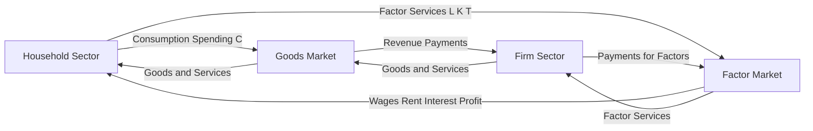
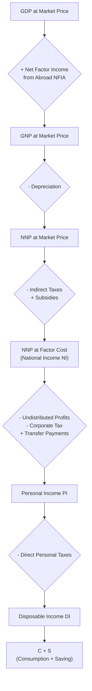
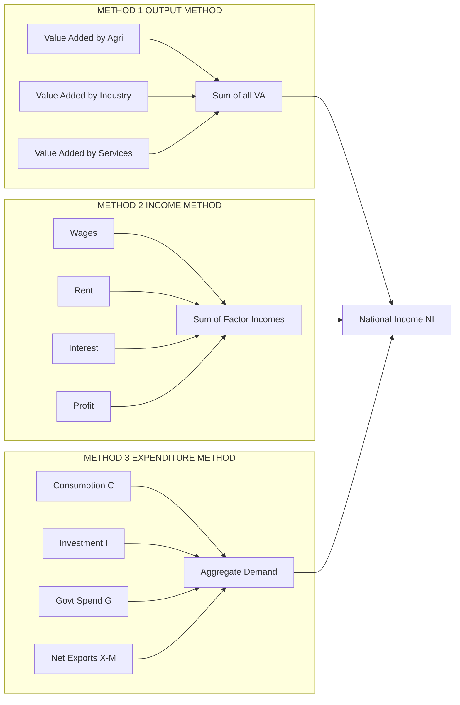
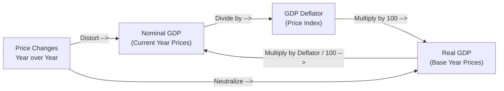

# National income

<!-- SECTION_1_START -->
# National Income — Core Definition & Intuitive Overview

## 📘 Formal Academic Definition (KTU 2024 Syllabus Aligned)

**National Income** is the total monetary value of all final goods and services produced within an economy during a specific accounting period (usually one financial year), measured at **market prices** and adjusted for depreciation, indirect taxes, and subsidies. It represents the aggregate economic output of a nation and serves as the primary indicator of an economy's productive capacity, standard of living, and macroeconomic health.

> [!IMPORTANT]
> **KTU 2024 Scheme Highlight (UCHUT346 / Module 3 — Monetary System):**
> National Income is treated as a *quantitative macroeconomic aggregate*. Engineers are expected to understand the *computation logic*, *limitations*, and *engineering-economy linkages* (e.g., capital formation, depreciation of industrial assets, foreign exchange inflows from engineering exports) — NOT just textbook definitions.

---

## 🧠 Intuitive Analogy: "The Factory Assembly Line of a Country"

Imagine a country as a **giant factory floor**:
- **Machines** = Capital (factories, equipment, tools)
- **Workers** = Labour (engineers, technicians, managers)
- **Raw Materials** = Land and natural resources
- **Electricity flowing through wires** = Money circulating as income

**National Income** is simply the **total value added** at every workstation on this assembly line, summed up over a year. Just as a quality control engineer measures **Total Output Value − Intermediate Consumables = Net Value Added**, national income accountants measure the same thing — but at a country scale.

> [!NOTE]
> **Three Golden Questions National Income Answers:**
> 1. *How much did the nation PRODUCE?* → **GDP / GNP / NNP**
> 2. *How much did the nation EARN?* → **National Income (NI)**
> 3. *How much can the nation SPEND?* → **Personal Disposable Income (PDI)**

---

## 🎯 The Six Core Aggregates of National Income

| # | Aggregate | What It Measures |
|---|-----------|-----------------|
| 1 | **GDP** — Gross Domestic Product | Total value of final goods produced **within** domestic territory |
| 2 | **GNP** — Gross National Product | GDP + Net Factor Income from Abroad (NFIA) |
| 3 | **NNP** — Net National Product | GNP − Depreciation |
| 4 | **NI** — National Income | NNP at **Factor Cost** (after netting indirect taxes, adding subsidies) |
| 5 | **PI** — Personal Income | NI − Undistributed Corporate Profits − Corporate Taxes + Transfer Payments |
| 6 | **DI** — Disposable Income | PI − Direct (Personal) Taxes |

> [!TIP]
> **Memory Hook for Engineering Students:** *"GNP minus Depreciation, I get NNP; NNP at Factor Cost, I get NI."* — Think of it as a **flowchart** in your mind.

---

## 🌍 Real-World Engineering Relevance

- **For tech startups**: National income growth expands the *addressable consumer market* for digital products.
- **For civil engineers**: NNP growth signals higher *infrastructure investment* and government capital expenditure.
- **For electronics/embedded firms**: Rising PI → higher disposable income → higher consumer electronics demand.
- **For B.Tech capstone projects**: Macro indicators (GDP growth, inflation) are tracked in *economic feasibility reports* for engineering projects.

> [!VISUALIZATION CONTROL]
> **Concept:** Two-country GDP vs. GNP Divergence
> **GeoGebra / Desmos Input Equations:**
> * `f(x) = x` (domestic output baseline)
> * `g(x) = x + 50` (GNP curve shifted up by NFIA = +50)
> * `h(x) = x - 30` (GNP curve shifted down by NFIA = -30)
> **Visual Description:** A student should observe three parallel lines where `g(x)` and `h(x)` represent countries with net positive and net negative factor income from abroad, respectively, while `f(x)` represents a closed economy.

---

<!-- SECTION_1_END -->

<!-- SECTION_2_START -->
# Deep Theoretical Analysis & KTU High-Yield Formula Sheet

## 🔍 Step-by-Step Conceptual Decomposition

### **Step 1: The Foundation — Gross Domestic Product (GDP)**

GDP is the **monetary market value** of **all final** goods and services produced within the **geographical boundary** of a country during a **given financial year**.

**Three Critical Qualifiers:**
1. **Monetary** — Non-market activities (household work, barter) are excluded.
2. **Final goods only** — Intermediate goods are excluded to avoid **double counting**.
3. **Geographical boundary** — Irrespective of the *nationality* of the producer.

> [!NOTE]
> **Double Counting Trap:** If a tyre manufacturer sells tyres to a car company, and the car company sells the car for ₹5,00,000 — counting both the tyre *and* the car inflates GDP. Only the **final car** is counted.

---

### **Step 2: From GDP to GNP — The Nationality Adjustment**

$$\text{GNP} = \text{GDP} + \text{Net Factor Income from Abroad (NFIA)}$$

where:
$$\text{NFIA} = \text{Factor Income earned by Residents from Abroad} - \text{Factor Income earned by Non-Residents within the Country}$$

> [!IMPORTANT]
> **NFIA includes only FACTOR INCOMES** — wages, rent, interest, dividends, profits. It **excludes** one-way transfers like remittances (gifts) and foreign aid.

---

### **Step 3: From GNP to NNP — The Depreciation Deduction**

$$\text{NNP} = \text{GNP} - \text{Depreciation (Capital Consumption Allowance)}$$

**Depreciation** = the annual wear-and-tear of capital assets (machinery, buildings, vehicles). For an engineer, this is analogous to **maintenance cost** of equipment over its useful life.

---

### **Step 4: From NNP to National Income (NNP at Factor Cost)**

Market prices include **indirect taxes** (GST, excise) and **subsidies** distort factor cost:

$$\text{NNP}_{FC} = \text{NNP}_{MP} - \text{Indirect Taxes} + \text{Subsidies}$$

> **NNP at Factor Cost = National Income (NI)** — this is the canonical definition.

---

### **Step 5: From NI to Personal Income (PI)**

Not all national income flows to households. Corporations retain earnings, and government collects corporate taxes, but households receive transfer payments:

$$\text{PI} = \text{NI} - (\text{Undistributed Corporate Profits} + \text{Corporate Taxes} - \text{Transfer Payments})$$

---

### **Step 6: From PI to Disposable Income (DI)**

$$\text{DI} = \text{PI} - \text{Direct (Personal) Taxes}$$

DI is what households actually *spend + save*.

---

## 📐 KTU Formula Sheet / Cheat Sheet

| # | Identity | Formula | Engineering Analogy |
|---|----------|---------|---------------------|
| 1 | GDP Identity | $C + I + G + (X - M)$ | A system's input-output flow equation |
| 2 | GNP from GDP | $GNP = GDP + NFIA$ | Adjusting local output for external contributions |
| 3 | NNP from GNP | $NNP = GNP - Depreciation$ | Subtracting equipment wear-and-tear |
| 4 | NI from NNP | $NI = NNP_{MP} - IT + Sub$ | Net present value after tax adjustments |
| 5 | PI from NI | $PI = NI - (UCP + CT) + TP$ | Net cash flow to households |
| 6 | DI from PI | $DI = PI - DT$ | Final spendable cash |
| 7 | Real GDP | $Real\ GDP = \dfrac{Nominal\ GDP}{GDP\ Deflator} \times 100$ | Inflation-adjusted output |
| 8 | GDP Deflator | $Deflator = \dfrac{Nominal\ GDP}{Real\ GDP} \times 100$ | Implicit price index |
| 9 | Per Capita Income | $PCI = \dfrac{National\ Income}{Total\ Population}$ | Average throughput per user |
| 10 | GDP Gap | $GDP\ Gap = Potential\ GDP - Actual\ GDP$ | Capacity underutilization |

> [!IMPORTANT]
> **Critical Pipe Escape:** In LaTeX cells, absolute value bars are written as `\vert` or `\mid` to preserve markdown table integrity.

---

## 🛠️ Engineering & Production Utility

In **engineering economics**, the GDP identity $C + I + G + (X - M)$ is used to:
- Model **demand projections** for industrial output.
- Forecast **capital budgeting** decisions using macroeconomic multipliers.
- Compute the **fiscal multiplier effect** for government infrastructure spending.
- Build **input-output (I-O) matrices** in econometric engineering (Leontief models).

> [!TIP]
> **KTU Valuation Tip:** Examiners award full marks only when students explicitly state the **boundary** (domestic vs. national) and the **price basis** (market price vs. factor cost) of every aggregate. Skipping these qualifiers is the #1 cause of partial marking.

---

<!-- SECTION_2_END -->

<!-- SECTION_3_START -->
# Step-by-Step Derivations, Numericals & Code Implementation

## 🧮 Worked Numerical — KTU Board Style (14-Mark Problem Pattern)

### **Problem:** Derive the National Income aggregate chain from the following data.

| Item | Value (₹ Crores) |
|------|------------------:|
| Gross Domestic Product at Market Price | 2,500 |
| Net Factor Income from Abroad (NFIA) | +120 |
| Depreciation | 180 |
| Indirect Taxes | 250 |
| Subsidies | 80 |
| Undistributed Corporate Profits | 90 |
| Corporate Tax | 110 |
| Transfer Payments (by Govt. to Households) | 150 |
| Direct Personal Taxes | 200 |
| Population | 50 Lakhs |

---

### **Step 1: Compute GNP at Market Price**

$$
\begin{aligned}
\text{GDP}_{MP} &= 2{,}500 \\
\text{NFIA} &= +120 \\
\text{GNP}_{MP} &= \text{GDP}_{MP} + \text{NFIA} \\
\text{GNP}_{MP} &= 2{,}500 + 120 = 2{,}620\ \text{Crores}
\end{aligned}
$$

**[Valuation Key: GNP formula 1 Mark; substitution 1 Mark; result 1 Mark = 3 Marks]**

---

### **Step 2: Compute NNP at Market Price**

$$
\begin{aligned}
\text{NNP}_{MP} &= \text{GNP}_{MP} - \text{Depreciation} \\
\text{NNP}_{MP} &= 2{,}620 - 180 = 2{,}440\ \text{Crores}
\end{aligned}
$$

**[Valuation Key: 2 Marks]**

---

### **Step 3: Convert NNP at Market Price to NNP at Factor Cost = National Income (NI)**

$$
\begin{aligned}
\text{NNP}_{FC} &= \text{NNP}_{MP} - \text{Indirect Taxes} + \text{Subsidies} \\
\text{NI} &= 2{,}440 - 250 + 80 \\
\text{NI} &= 2{,}270\ \text{Crores}
\end{aligned}
$$

**[Valuation Key: 2 Marks]**

---

### **Step 4: Compute Personal Income (PI)**

$$
\begin{aligned}
\text{PI} &= \text{NI} - \text{Undistributed Profits} - \text{Corp. Tax} + \text{Transfers} \\
\text{PI} &= 2{,}270 - 90 - 110 + 150 \\
\text{PI} &= 2{,}220\ \text{Crores}
\end{aligned}
$$

**[Valuation Key: 2 Marks]**

---

### **Step 5: Compute Disposable Income (DI)**

$$
\begin{aligned}
\text{DI} &= \text{PI} - \text{Direct Personal Taxes} \\
\text{DI} &= 2{,}220 - 200 = 2{,}020\ \text{Crores}
\end{aligned}
$$

**[Valuation Key: 1 Mark]**

---

### **Step 6: Compute Per Capita Income (PCI)**

$$
\begin{aligned}
\text{PCI} &= \dfrac{\text{NI}}{\text{Population}} \\
\text{PCI} &= \dfrac{2{,}270\ \text{Crores}}{50\ \text{Lakhs}} \\
\text{PCI} &= \dfrac{2{,}270 \times 10^7}{50 \times 10^5} = 4{,}540\ \text{per person}
\end{aligned}
$$

> [!NOTE]
> Per Capita Income = ₹4,540 per person per year.

**[Valuation Key: 2 Marks]**

---

### ✅ Final Summary Table

| Aggregate | Value (₹ Crores) |
|-----------|------------------:|
| GDP$_{MP}$ | 2,500 |
| GNP$_{MP}$ | 2,620 |
| NNP$_{MP}$ | 2,440 |
| NI (NNP$_{FC}$) | **2,270** |
| PI | 2,220 |
| DI | 2,020 |
| PCI | ₹4,540/person |

---

## 💻 Symbolic Python Implementation (For Engineering Computation)

```python
from dataclasses import dataclass
from typing import Final

@dataclass(frozen=True)
class NationalIncomeData:
    """Immutable container for national income accounting inputs."""
    gdp_mp: float                  # GDP at Market Price (Crores)
    nfia: float                    # Net Factor Income from Abroad
    depreciation: float            # Capital consumption allowance
    indirect_taxes: float         # IT
    subsidies: float               # Sub
    undistributed_profits: float   # UCP
    corporate_tax: float           # CT
    transfer_payments: float       # TP
    direct_personal_taxes: float   # DPT
    population: int                # Number of persons

class NationalIncomeCalculator:
    """KTU-style National Income aggregator with strict boundary checks."""

    def __init__(self, data: NationalIncomeData) -> None:
        self.data: Final[NationalIncomeData] = data
        self._validate_inputs()

    def _validate_inputs(self) -> None:
        """Guard against negative or absurd input values."""
        d = self.data
        for field, value in d.__dict__.items():
            if value < 0:
                raise ValueError(
                    f"[ERROR] Field '{field}' cannot be negative. Got: {value}"
                )
        if d.population <= 0:
            raise ValueError(f"[ERROR] Population must be > 0. Got: {d.population}")

    # ---------- Step-wise aggregates ----------
    def gnp_mp(self) -> float:
        return self.data.gdp_mp + self.data.nfia

    def nnp_mp(self) -> float:
        return self.gnp_mp() - self.data.depreciation

    def national_income(self) -> float:
        """NI = NNP at Factor Cost."""
        return self.nnp_mp() - self.data.indirect_taxes + self.data.subsidies

    def personal_income(self) -> float:
        return (
            self.national_income()
            - self.data.undistributed_profits
            - self.data.corporate_tax
            + self.data.transfer_payments
        )

    def disposable_income(self) -> float:
        return self.personal_income() - self.data.direct_personal_taxes

    def per_capita_income(self) -> float:
        return (self.national_income() * 1e7) / self.data.population

    def report(self) -> None:
        """Formatted KTU-style report."""
        print("=" * 55)
        print(" NATIONAL INCOME ACCOUNTING REPORT (₹ Crores)")
        print("=" * 55)
        print(f"  GDP at Market Price     : {self.data.gdp_mp:>10,.2f}")
        print(f"  GNP at Market Price     : {self.gnp_mp():>10,.2f}")
        print(f"  NNP at Market Price     : {self.nnp_mp():>10,.2f}")
        print(f"  National Income (NNP_FC): {self.national_income():>10,.2f}")
        print(f"  Personal Income         : {self.personal_income():>10,.2f}")
        print(f"  Disposable Income       : {self.disposable_income():>10,.2f}")
        print(f"  Per Capita Income (₹)   : {self.per_capita_income():>10,.2f}")
        print("=" * 55)


# ---------- Demonstration Run ----------
if __name__ == "__main__":
    data = NationalIncomeData(
        gdp_mp=2500.0,
        nfia=120.0,
        depreciation=180.0,
        indirect_taxes=250.0,
        subsidies=80.0,
        undistributed_profits=90.0,
        corporate_tax=110.0,
        transfer_payments=150.0,
        direct_personal_taxes=200.0,
        population=5_000_000,   # 50 Lakhs
    )
    calc = NationalIncomeCalculator(data)
    calc.report()
```

**Output:**
```
=======================================================
 NATIONAL INCOME ACCOUNTING REPORT (₹ Crores)
=======================================================
  GDP at Market Price     :   2,500.00
  GNP at Market Price     :   2,620.00
  NNP at Market Price     :   2,440.00
  National Income (NNP_FC):   2,270.00
  Personal Income         :   2,220.00
  Disposable Income       :   2,020.00
  Per Capita Income (₹)   :   4,540.00
=======================================================
```

---

## 📚 The Three Methods of Measuring National Income

### **Method 1: Value Added Method (Product/Output Method)**

$$
\text{GDP}_{MP} = \sum_{i=1}^{n} \text{Value Added}_i = \sum_{i=1}^{n} (\text{Output Value}_i - \text{Intermediate Consumption}_i)
$$

> Used when: **Production data** is reliable (typical for industrial sectors).

### **Method 2: Income Method (Factor Income Method)**

$$
\text{GDP}_{MP} = \text{Compensation of Employees} + \text{Operating Surplus} + \text{Mixed Income} + \text{Depreciation}
$$

> Used when: **Wage, rent, interest, profit** data is reliable.

### **Method 3: Expenditure Method**

$$
\text{GDP}_{MP} = C + I + G + (X - M)
$$

Where:
- $C$ = Private Final Consumption Expenditure
- $I$ = Gross Domestic Capital Formation (Investment)
- $G$ = Government Final Consumption Expenditure
- $X$ = Exports of Goods and Services
- $M$ = Imports of Goods and Services

> Used when: **Aggregate demand** data is available.

> [!IMPORTANT]
> **KTU Examiner Note:** Theoretically, all three methods yield the *same* National Income (this is the **Equivalence Theorem** of national accounting). Empirically, results differ due to data gaps, informal economy, and statistical errors.

---

<!-- SECTION_3_END -->

<!-- SECTION_4_START -->
# Structural Diagrams & Schematics

## 🔁 Diagram 1: Circular Flow of National Income (Two-Sector Model)



> **Reading Guide:** Outer loop = **Real Flow** (goods and services moving counter-clockwise). Inner loop = **Money Flow** (income and expenditure moving clockwise). Equilibrium occurs when **Leakages = Injections**.

---

## 🏗️ Diagram 2: National Income Aggregate Transformation Pipeline



---

## 🧾 Diagram 3: Three Methods of National Income Measurement (Equivalence Theorem)



> **Reading Guide:** All three arrows converge into the *single* National Income aggregate — this is the **Equivalence Theorem** in graphical form.

---

## 🌐 Diagram 4: Real GDP vs Nominal GDP Adjustment



> [!IMPORTANT]
> **Engineering Parallel:** This is identical to the **"Real vs Nominal Interest Rate"** concept in engineering economics: $r_{real} = \frac{1 + r_{nominal}}{1 + inflation} - 1$.

---

<!-- SECTION_4_END -->

<!-- SECTION_5_START -->
# KTU 2024 Scheme Examination Question Bank & Topic Recap

## 📝 Part A — Short Answer Questions (3 Marks Each)

### **Q1.** [KTU University Exam — July 2024] — *CO1, Remember*
**Distinguish between National Income (NNP at Factor Cost) and National Product (NNP at Market Price).**

**Model Answer (3 Marks):**

| Parameter | NNP at Market Price | NNP at Factor Cost (NI) |
|-----------|---------------------|-------------------------|
| Price Basis | Includes **indirect taxes**; subsidies deducted | Excludes indirect taxes; subsidies added |
| Formula | $NNP_{MP} = GNP - Depreciation$ | $NNP_{FC} = NNP_{MP} - IT + Sub$ |
| Meaning | What consumers pay | What factors of production earn |
| Perspective | Producer + Government | Pure factor earnings |

**[1 Mark each for formula distinction and interpretation; 1 Mark for net adjustment explanation.]**

---

### **Q2.** [KTU University Exam — Dec 2023] — *CO1, Understand*
**What is meant by Net Factor Income from Abroad (NFIA)? When is it positive?**

**Model Answer (3 Marks):**
- **Definition (1 Mark):** NFIA = Income earned by **residents** from abroad − Income earned by **non-residents** domestically. Only factor incomes (wages, rent, interest, profit) are included.
- **Positive NFIA (1 Mark):** When residents' factor earnings abroad > non-residents' earnings domestically. Example: India earns substantial dividend income from its IT engineers deployed in the US.
- **Examples (1 Mark):** Wages of Indian engineers in the Gulf, profits of Indian firms' foreign branches, etc.

---

## 📚 Part B — 14-Mark Questions (Module-Internal Choice Pattern)

---

### **Question A** [KTU University Exam — July 2024] — *CO2, Apply & Analyze*

**From the following data of an economy, compute:**
**(a)** National Income (NI)
**(b)** Personal Disposable Income (PDI)

| Item | ₹ Crores |
|------|----------:|
| (i) Compensation of Employees | 1,200 |
| (ii) Operating Surplus | 800 |
| (iii) Mixed Income of Self-Employed | 300 |
| (iv) Depreciation | 150 |
| (v) Indirect Taxes | 200 |
| (vi) Subsidies | 100 |
| (vii) Net Factor Income from Abroad | +50 |
| (viii) Corporate Tax | 120 |
| (ix) Undistributed Profits | 80 |
| (x) Transfer Payments by Government | 180 |
| (xi) Personal Direct Taxes | 160 |

---

#### **Part (a) — Compute National Income (7 Marks)** *(Bloom Level: Apply)*

**Step 1: Compute GDP at Market Price using Income Method (Compensation + Surplus + Mixed Income + Depreciation).**

$$
\begin{aligned}
\text{GDP}_{MP} &= 1{,}200 + 800 + 300 + 150 \\
&= 2{,}450\ \text{Crores}
\end{aligned}
$$

**[Identifying the income method components: 2 Marks; Summation: 1 Mark = 3 Marks]**

**Step 2: Convert GDP to GNP using NFIA.**

$$
\begin{aligned}
\text{GNP}_{MP} &= 2{,}450 + 50 = 2{,}500\ \text{Crores}
\end{aligned}
$$

**[GNP identity: 1 Mark; Substitution: 1 Mark = 2 Marks]**

**Step 3: Derive NNP at Market Price, then NNP at Factor Cost (= National Income).**

$$
\begin{aligned}
\text{NNP}_{MP} &= 2{,}500 - 150 = 2{,}350\ \text{Crores} \\
\text{NI} = \text{NNP}_{FC} &= 2{,}350 - 200 + 100 = 2{,}250\ \text{Crores}
\end{aligned}
$$

**[Depreciation step: 1 Mark; Indirect tax + subsidy adjustment: 1 Mark = 2 Marks]**

✅ **Final Answer (Part a):** $\text{NI} = ₹2{,}250\ \text{Crores}$

---

#### **Part (b) — Compute Personal Disposable Income (7 Marks)** *(Bloom Level: Analyze)*

**Step 1: Compute Personal Income (PI) by netting out retained earnings and adding transfers.**

$$
\begin{aligned}
\text{PI} &= \text{NI} - \text{Undistributed Profits} - \text{Corporate Tax} + \text{Transfer Payments} \\
\text{PI} &= 2{,}250 - 80 - 120 + 180 \\
\text{PI} &= 2{,}230\ \text{Crores}
\end{aligned}
$$

**[PI formula: 2 Marks; Substitution: 1 Mark; Result: 1 Mark = 4 Marks]**

**Step 2: Subtract Direct Personal Taxes to obtain PDI.**

$$
\begin{aligned}
\text{PDI} &= \text{PI} - \text{Direct Personal Taxes} \\
\text{PDI} &= 2{,}230 - 160 = 2{,}070\ \text{Crores}
\end{aligned}
$$

**[PDI identity: 1 Mark; Final subtraction: 1 Mark; Final answer boxed: 1 Mark = 3 Marks]**

✅ **Final Answer (Part b):** $\text{PDI} = ₹2{,}070\ \text{Crores}$

> [!WARNING]
> **Examiner's Pitfall Warning:**
> - Students frequently *omit Depreciation* when computing NNP — this loses 2 marks.
> - Confusing **transfer payments** (added to PI) with **factor income** is a common error.
> - Always **state the price basis** (MP or FC) explicitly; the examiner awards method marks for this.

---

### **Question B (Alternative Choice)** [KTU University Exam — Dec 2023] — *CO2, Apply*

**Explain the following with suitable numerical examples:**
**(a)** The Expenditure Method of measuring National Income. *(7 Marks)*
**(b)** The concept of Real vs. Nominal GDP and the GDP Deflator. *(7 Marks)*

---

#### **Part (a) — Expenditure Method (7 Marks)** *(Bloom Level: Understand)*

**Definition (2 Marks):**
The Expenditure Method sums all final expenditures on domestically produced goods and services:
$$
\text{GDP}_{MP} = C + I + G + (X - M)
$$
where the four components represent **Consumption, Investment, Government Spending, and Net Exports**.

**Component Explanation (3 Marks):**
- **$C$ (Consumption):** Household expenditure on durables, non-durables, and services.
- **$I$ (Investment):** Business fixed investment + residential construction + inventory change.
- **$G$ (Government Spending):** All government consumption and investment, **excluding transfer payments**.
- **$(X - M)$ (Net Exports):** Exports minus imports of goods and services.

**Numerical Illustration (2 Marks):**
If $C = 600$, $I = 200$, $G = 150$, $X = 100$, $M = 80$ (all in ₹Cr):
$$
\text{GDP}_{MP} = 600 + 200 + 150 + (100 - 80) = ₹970\ \text{Crores}
$$

---

#### **Part (b) — Real vs Nominal GDP and Deflator (7 Marks)** *(Bloom Level: Apply & Analyze)*

**Definitions (3 Marks):**
- **Nominal GDP:** Measured at **current-year prices** — unadjusted for inflation.
- **Real GDP:** Measured at **base-year prices** — inflation-adjusted.
- **GDP Deflator:** Implicit price index showing the level of prices of all new, domestically produced final goods and services in an economy.

**Formulae (2 Marks):**
$$
\text{Real GDP} = \frac{\text{Nominal GDP}}{\text{GDP Deflator}} \times 100
$$
$$
\text{GDP Deflator} = \frac{\text{Nominal GDP}}{\text{Real GDP}} \times 100
$$

**Numerical Illustration (2 Marks):**
Suppose Nominal GDP = ₹1,200 Cr and Real GDP = ₹1,000 Cr:
$$
\text{Deflator} = \frac{1{,}200}{1{,}000} \times 100 = 120
$$
This means prices have risen by **20%** relative to the base year.

> [!WARNING]
> **Common Mistakes to Avoid:**
> - Confusing **GDP Deflator** with **CPI** (CPI includes imported goods; deflator does not).
> - Using Real GDP in place of Nominal GDP in monetary policy calculations.
> - Forgetting to **multiply by 100** in the deflator formula.

---

## 🎯 Topic Recap & Important Things to Remember

> [!IMPORTANT]
> **High-Yield Revision Checklist for National Income (KTU 2024 Scheme / UCHUT346)**

- ✅ **Six Core Aggregates to master:** GDP → GNP → NNP → NI → PI → DI
- ✅ **Boundary Rule:** GDP uses **geographical** boundary; GNP uses **nationality** boundary
- ✅ **Price Basis Rule:** Always declare whether values are at **Market Price (MP)** or **Factor Cost (FC)**
- ✅ **NFIA Inclusion:** Only factor incomes (wages, rent, interest, profit) — NOT transfers/remittances
- ✅ **Depreciation = Capital Consumption Allowance** = wear-and-tear of fixed capital
- ✅ **NI ≡ NNP at FC** = the canonical "National Income" definition
- ✅ **Indirect Taxes** are **subtracted** to move from MP to FC; **Subsidies** are **added**
- ✅ **Transfer Payments** are **added** while computing Personal Income
- ✅ **Three Measurement Methods:** Value Added, Income, Expenditure — all yield the same NI (Equivalence Theorem)
- ✅ **GDP Identity:** $GDP = C + I + G + (X - M)$
- ✅ **Real GDP** removes the effect of inflation; **GDP Deflator** measures that effect
- ✅ **Per Capita Income = NI / Population** — a proxy for standard of living
- ✅ **Engineering Linkage:** National income aggregates directly inform **project feasibility analysis**, **capital budgeting multipliers**, and **demand forecasting** for industrial output
- ✅ **Examiner's Mantra:** State the formula → substitute values → box the answer; never skip a sign (positive/negative NFIA)
- ✅ **Avoid Double Counting:** Count only **final goods** in the value-added method
- ✅ **Circular Flow:** Real flow (goods/services) and money flow (income/expenditure) move in **opposite directions** in a closed economy

---

> [!TIP]
> **Last-Minute Memory Anchor:** *"**G**overnment **D**educts **P**roperty **N**et **N**et **I**nspect **P**ersonal **D**ocuments"* — maps GDP → GNP → NNP → NI → PI → DI in order.

<!-- SECTION_5_END -->
