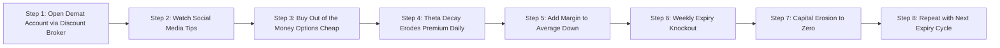

# Problems faced by the Indian stock market

<!-- SECTION_1_START -->
# Problems Faced by the Indian Stock Market

## 1. Core Technical Definition

> [!IMPORTANT]
> **Indian Stock Market:** The Indian stock market refers to the regulated marketplace where securities such as equities (shares), derivatives, debentures, and exchange-traded funds (ETFs) are bought and sold. The two principal exchanges are the **Bombay Stock Exchange (BSE)** established in **1875** and the **National Stock Exchange (NSE)** established in **1992**. The apex regulator is the **Securities and Exchange Board of India (SEBI)**, constituted in **1992** under the SEBI Act, 1992.

> [!NOTE]
> **Monetary System Context (KTU Module 3):** The stock market functions as a critical pillar of the financial system by channelising household savings into productive industrial investment. It is the **primary market** for new capital formation (IPOs, FPOs) and the **secondary market** for liquidity and price discovery.

## 2. Conceptual Analogy / Intuition

Think of the Indian stock market as a **giant, crowded open-air bazaar in Old Delhi**.

In this bazaar:

- **Stalls (Listed Companies)** sell tiny ownership slices (shares) of their businesses.
- **Buyers (Investors)** walk through hoping to find genuine value, but the **noise from touts, false rumours, sudden stampedes (crashes), and pickpockets (fraudsters)** makes it risky.
- The **shopkeeper (SEBI)** is supposed to keep order, but the bazaar is so vast, multilingual, and chaotic that rules are often bent.
- Some buyers (retail investors) treat it like a **casino** rather than a marketplace, while professional players (FIIs) have **binoculars and insider maps**, creating an uneven playing field.
- The bazaar's mood shifts with every rumour, weather change (global cues), or a loud political announcement — leading to **wild price swings**.

This analogy captures the essence of the Indian stock market's structural and behavioural problems.

## 3. Key Market Metrics & Benchmarks

> [!IMPORTANT]
> The following indicators define the **health and scale** of the Indian stock market and are used in KTU numerical/analytical questions:
>
> - **BSE Sensex:** Benchmark index of **30** large-cap companies on BSE.
> - **NSE Nifty 50:** Benchmark index of **50** large-cap companies on NSE.
> - **Market Capitalisation:** $\approx$ **\$4.5 trillion** (as of 2024), making India the **5th largest** equity market globally.
> - **Demat Accounts:** Over **15 crore** active demat accounts (2024), a jump from ~4 crore in 2020.
> - **Retail Investor Share:** Retail participation has surged to nearly **40\%** of total trading volume, up from **~10\%** a decade ago.
> - **FII/FPI Flows:** Foreign Portfolio Investors (FPIs) contributed approximately **\$28 billion** in net inflows in 2023 (a record high).

## 4. GeoGebra / Desmos Integration (Conceptual Risk-Return Representation)

> [!VISUALIZATION CONTROL]
> **Concept:** Risk–Return Trade-off in the Indian Stock Market (Capital Market Line intuition)
>
> **GeoGebra / Desmos Input Equations:**
> * $E(R) = R_f + \beta \cdot (E(R_m) - R_f)$
> * $R_f = 6.5$ (Risk-free rate, 10Y G-Sec yield approx)
> * $E(R_m) = 12.5$ (Expected Nifty return)
> * $\beta_{Nifty} = 1.0$
> * For volatile small-cap: $\beta_{SC} = 1.6$
>
> **Visual Description:** A straight line passing through $(0, 6.5)$ with slope $(E(R_m) - R_f)$. Students should observe that stocks with higher $\beta$ (systematic risk) command proportionally higher expected returns. This visualises why small-cap stocks in India offer higher returns but expose investors to **higher volatility problems**.

---

<!-- SECTION_1_END -->

<!-- SECTION_2_START -->
# Deep Theoretical Analysis: Problems of the Indian Stock Market

## 1. Classification of Problems

The problems of the Indian stock market can be **taxonomically classified** into the following seven high-yield KTU categories:

### A. Structural & Regulatory Problems
- **Inadequate Enforcement of SEBI Regulations**
- **Delayed Justice in Disgorgement & Recovery**
- **Weak Insider Trading Detection Mechanisms**
- **Regulatory Arbitrage** between SEBI, RBI, and MCA

### B. Market Integrity & Ethical Problems
- **Insider Trading** (e.g., the **Hindustan Unilever – Brookfield** 2022 leak case)
- **Price Manipulation / Pump-and-Dump Schemes**
- **Front-running by Brokerage Desks**
- **Circular Trading & Wash Sales**

### C. Information Asymmetry & Disclosure Problems
- **Weak Corporate Disclosure Standards**
- **Selective Disclosure to Analyst Groups**
- **Promoter Pledge Misreporting**
- **Related-Party Transaction Opacity**

### D. Behavioural & Investor Problems
- **Low Financial Literacy** (~27\% adult literacy in financial matters, per OECD/NCFE 2023)
- **Speculative & Gambling Mindset**
- **Herd Behaviour & Momentum Chasing**
- **Overtrading & Leverage Abuse (F&O segment)**

### E. Liquidity & Market Depth Problems
- **Concentration of Volume in Top 50 Stocks**
- **Illiquidity in Small-Cap & SME Segment**
- **Bid-Ask Spread Volatility**
- **Free Float Constraints Due to High Promoter Holdings**

### F. Macroeconomic & External Vulnerability Problems
- **High FII/FPI Dependence** (over 60\% of trading volume historically attributed to FPIs in some quarters)
- **Currency Volatility (INR–USD) Impact**
- **Global Risk-Off Sentiment Spillovers**
- **Crude Oil & Geopolitical Sensitivity**

### G. Operational & Technological Problems
- **Cyber Security Threats** (e.g., the **2017 WannaCry** ransomware impact on brokerages)
- **Settlement & Trade-Execution Latency**
- **Co-location & Algorithmic Trading Unfairness**
- **Broker Insolvency / Default Risk**

## 2. KTU High-Yield Formula & Metric Cheat Sheet

> [!NOTE]
> The following table is a **board-exam-grade summary** of all quantitative and conceptual metrics relevant to KTU Module 3 problems. Use it for quick revision before the exam.

| **Metric / Concept** | **Definition / Formula** | **Typical Value (India, 2024)** | **Implication** |
|---|---|---|---|
| **Volatility ($\sigma$)** | Standard deviation of log returns: $\sigma = \sqrt{\dfrac{1}{N-1} \sum_{i=1}^{N} (r_i - \bar{r})^2}$ | Nifty 50: $\approx 14\%$ annualized | Higher $\sigma$ = greater investor risk |
| **Beta ($\beta$)** | $\beta_i = \dfrac{\text{Cov}(R_i, R_m)}{\text{Var}(R_m)}$ | Small-cap $\beta \approx 1.4$ to $1.8$ | Measures systematic risk exposure |
| **Sharpe Ratio** | $S = \dfrac{E(R_p) - R_f}{\sigma_p}$ | Indian diversified funds: $0.6$ to $0.9$ | Risk-adjusted return indicator |
| **P/E Ratio (Price-to-Earnings)** | $\dfrac{\text{Market Price per Share}}{\text{Earnings per Share (EPS)}}$ | Nifty 50 trailing P/E $\approx 23$ | Overvaluation indicator if $>25$ |
| **Free Float** | $\dfrac{\text{Total Shares} - \text{Promoter Holdings}}{\text{Total Shares}} \times 100$ | Nifty 50: $\approx 50\%$ | Lower float $\Rightarrow$ higher volatility |
| **Promoter Pledged Shares** | $\dfrac{\text{Pledged Shares}}{\text{Total Promoter Holdings}} \times 100$ | Many mid-caps $>50\%$ pledged | Sign of corporate distress |
| **Retail F&O Loss Ratio** | $\dfrac{\text{Loss-making retail F&O accounts}}{\text{Total active accounts}} \times 100$ | $\approx 90\%$ (SEBI 2023 study) | Indicates speculative overtrading |
| **Circuit Breaker Limits** | Daily price band: $\pm 5\%$, $\pm 10\%$, $\pm 20\%$ (individual stocks) | Triggered frequently in SME stocks | Highlights liquidity/panic issues |
| **Insider Trading Penalty** | Up to **₹25 crore** or **3x** of profit made | SEBI 2022: ₹1,000+ cr collected | Deterrence indicator |
| **Settlement Cycle** | T+1 (post Jan 2023) | Trade + 1 day | Improved from T+2; reduces risk |

## 3. Real-World Engineering & Economic Utility

> [!IMPORTANT]
> **Why does an engineer need to study stock market problems?**
>
> 1. **Capital Raising for Tech Startups:** Engineers founding ventures (e.g., Zomato, Paytm, Nykaa IPOs) directly interact with the **primary market**. Knowledge of disclosure, pricing, and regulatory issues is essential.
> 2. **Employee Stock Option Plans (ESOPs):** Most engineering firms (Infosys, TCS, Flipkart) compensate staff via ESOPs. Stock market manipulation directly erodes employee wealth.
> 3. **Corporate Treasury & Risk Hedging:** Large engineering firms use **derivatives** (futures, options) to hedge currency, commodity, and interest-rate exposure. A malfunctioning derivatives market (e.g., the 2018 Nifty crisis) directly impacts hedging cost.
> 4. **Investment Decisions for Salaried Engineers:** Understanding behavioural pitfalls (e.g., F&O losses) prevents financial ruin.
> 5. **Policy & Research:** Engineers working in fintech (Zerodha, Groww, Upstox) build the very systems that address these market inefficiencies.

---

<!-- SECTION_2_END -->

<!-- SECTION_3_START -->
# Step-by-Step Derivations, Case Frameworks & Systemic Analysis

## 1. Exhaustive Comparative Analysis Matrix: Problems vs. Real-World Case Frameworks

> [!NOTE]
> The following **comprehensive comparative table** maps every major problem of the Indian stock market to its **root cause, regulatory response, real-world case study, and valuation impact**. This format is KTU's preferred structure for **14-mark descriptive questions**.

| **S.No.** | **Problem** | **Root Cause** | **Illustrative Real-World Case** | **SEBI / Regulatory Response** | **Impact on Investors** | **Status (2024)** |
|---|---|---|---|---|---|---|
| **1** | **Insider Trading** | Unstructured Information Flow in Promoter Circles | **HUL–Brookfield 2022 Leak Case**: SEBI found that sensitive deal information was shared via WhatsApp groups before the official announcement. | SEBI passed a **confirmatory order (2023)** imposing $\approx$ **₹40 crore** penalty on 14 entities. | Loss of fair-market opportunity for retail investors. | Stricter surveillance; **Integrated Surveillance Mechanism (ISM)** upgraded. |
| **2** | **Pump-and-Dump / Manipulation** | Small-cap illiquidity exploited by operators | **Sahara India Pariwar (2010–2012)**: Optionally Fully Convertible Debentures (OFCDs) raised without proper listing, duping ~3 crore investors. | SEBI froze assets, ordered refund of ~**₹24,000 crore**. | Total wealth erosion for small savers. | Enhanced disclosure; **PFUTP Regulations 2003** strengthened. |
| **3** | **Corporate Governance Failures** | Promoter dominance, weak board independence | **Satyam Computer Services (2009)**: Founder **Ramalinga Raju** confessed to **₹7,000+ crore** accounting fraud. | SEBI banned Raju for life; **Clause 49 of Listing Agreement** (now Regulation 17 of SEBI LODR 2015) tightened. | Share price fell from ₹180 to ₹11 within weeks. | Led to **Companies Act 2013**, **NFRA** establishment. |
| **4** | **F&O Retail Speculation Losses** | Leverage availability, low awareness, gamified apps | **SEBI Study (Jan 2023)**: 9 out of 10 individual F&O traders lost money; average loss per trader $\approx$ **₹1.1 lakh**. | SEBI proposed **additional margin**, **position limits**, and a **7-step risk disclosure** for retail F&O. | Widespread wealth destruction among young engineers/salaried. | New rules from **Nov 2023** onwards. |
| **5** | **Volatility & FPI Flows** | India's reliance on foreign capital; global risk-on/risk-off | **March 2020 COVID Crash**: Sensex fell **~38\%** in 5 weeks as FPIs pulled out $\approx$ **\$8.4 billion**. | RBI/Fiscal stimulus, SEBI circuit breakers activated 18+ times in March 2020. | Investor wealth wiped out; SIPs continued (resilience). | Structural shift to domestic flows; **FPIs became more volatile** in 2022. |
| **6** | **Cyber Security Threats** | Legacy broker IT systems, phishing, ransomware | **CDSL Cyberattack (Nov 2023)**: Hackers targeted **2.5 crore** demat accounts via malware; broker credentials leaked on the dark web. | SEBI mandated **Cyber Security & Cyber Resilience Framework (CSCRF)** for all Market Infrastructure Institutions (MIIs) and brokers. | Fear of unauthorised trades; data privacy loss. | Brokers now required to insure data, use **2FA + biometric** for trades above ₹1 lakh. |
| **7** | **Promoter Pledge Risk** | Promoters using pledged shares for personal credit | **DHFL (2019)**, **Reliance Capital**, **Adani Group allegations (Hindenburg, Jan 2023)** | SEBI strengthened **Pledge Disclosure Rules** (Reg. 31 LODR 2015). | Forced selling of pledged shares $\Rightarrow$ crash in stock price. | Hindenburg report: Adani Enterprises fell **~50\%** intraday; later recovered partially. |
| **8** | **Information Asymmetry** | Selective leaks, analyst payola | **NSE Co-location Scam (2015)**: Some brokers received **colocation server priority**, gaining microsecond advantages. | SEBI passed orders against **NSE, Chitra Ramkrishna, Ravi Narain**; SAT overturned some. | Unfair profits by select traders; loss of trust. | SEBI reissued **Co-location Policy 2018** with stricter audit trails. |
| **9** | **Settlement & Default Risk** | Counterparty failure | **Karvy Stock Broking (2019)**: Misused client shares/securities worth **₹2,000+ crore** for own purposes. | SEBI revoked Karvy's license; clients reimbursed via **Investor Protection Fund** and **Stock Exchanges**. | Clients couldn't access their own shares for weeks. | SEBI tightened **Client Securities Margin Pledge** mechanisms. |
| **10** | **Low Financial Literacy** | Unstructured financial education, social-media hype | **Reddit/WallStreetBets-style local Telegram groups** pumping penny stocks in 2021–2023. | SEBI launched **Saarthi** (investor education portal); **NISM certifications** mandatory for distributors. | Retail investors buy "tips" and suffer losses. | Investor awareness improved; NCFE mandated curriculum in schools/colleges. |
| **11** | **High Concentration / Low Diversification** | Domestic savings biased toward real estate & gold | Indian household financial assets: $\approx$ **5%** in equity (vs. ~30% in the US). | SEBI's **Mutual Fund Sahi Hai** campaign; **SIP** boom. | Portfolio underperformance vs. global benchmarks. | Mutual fund AUM crossed **₹60 lakh crore** in 2024. |
| **12** | **Currency & Geopolitical Risk** | INR convertibility, oil imports, global tensions | **Russia–Ukraine War (2022)**: FPIs withdrew $\approx$ **\$20 billion**; INR fell from 74 to 83 per USD. | RBI intervened in forex markets; SEBI allowed **MASAL** bonds for FPIs. | Marked-to-market loss for equity holders. | India's macro resilience improved; CAD narrowed. |
| **13** | **Tax Complexity** | Frequent changes in STCG/LTCG rules | **Union Budget 2024**: STCG raised to **20\%**; LTCG raised to **12.5\%**. | Government policy; SEBI has no direct role. | Lower post-tax returns; FII outflows. | Long-term capital allocation rebalancing underway. |
| **14** | **Broker Malpractices** | Mis-selling, churning, unauthorised trades | Multiple SEBI orders against brokerages for **penny-stock recommendations** to vulnerable clients. | SEBI's **Investment Adviser Regulations 2013** enforced. | Unauthorised losses in client accounts. | Online discount brokers (Zerodha, Groww) disrupted the model. |
| **15** | **Lack of SME Market Depth** | Low awareness of SME platforms | BSE SME and NSE SME have over **750+ listings** but low daily liquidity. | Separate **SME exchange norms**; relaxed listing requirements. | SME investors struggle to exit. | SEBI working on **mainboard migration** rules. |

## 2. Mathematical Derivation: Impact of Volatility on Retail F&O Investors

The following derivation demonstrates **why $\sim 90\%$** of retail F&O traders lose money, a key KTU conceptual problem.

**Step 1 — Define Daily Log Return**

For a stock/index with price $P_t$ at time $t$, the daily log return is:

$$r_t = \ln\left(\frac{P_t}{P_{t-1}}\right)$$

**Step 2 — Compute Mean and Variance**

The expected daily return $\mu$ and daily volatility $\sigma_d$ over $N$ trading days are:

$$\mu = \frac{1}{N} \sum_{t=1}^{N} r_t$$

$$\sigma_d = \sqrt{\frac{1}{N-1} \sum_{t=1}^{N} (r_t - \mu)^2}$$

**Step 3 — Annualise Volatility**

Annualised volatility (assuming **252 trading days**) is:

$$\sigma_{annual} = \sigma_d \times \sqrt{252}$$

**Step 4 — Nifty 50 Empirical Case**

Suppose $\sigma_d = 0.0088$ (typical for Nifty in 2023). Then:

$$\sigma_{annual} = 0.0088 \times \sqrt{252} \approx 0.1397 = 13.97\%$$

This is the **realised volatility**, the empirical evidence of the Indian stock market's volatility problem.

**Step 5 — Probability of Daily Loss**

Assuming log returns are approximately normally distributed $r_t \sim N(\mu, \sigma_d^2)$, the probability that a single day ends with a loss (ignoring $\mu \approx 0$) is:

$$P(r_t < 0) = P\left(Z < \frac{0 - 0}{0.0088}\right) = P(Z < 0) = 0.5$$

**Step 6 — Probability of Sustained Loss (The Real Problem)**

For a retail trader using **leverage of 5x**, the effective daily volatility becomes:

$$\sigma_{eff} = 5 \times \sigma_d = 5 \times 0.0088 = 0.044$$

The probability of a single-day leveraged loss exceeding **20\%** (margin call) is:

$$P(r_t < -0.20) = P\left(Z < \frac{-0.20}{0.044}\right) = P(Z < -4.55) \approx 0$$

While the **20\%** threshold is rare, the probability of a **10\% loss in a single week** is significant:

$$P(\text{weekly loss} > 10\%) \approx P(Z < -2.27) \approx 0.0116 \approx 1.16\% \text{ per week}$$

Over 50 trading weeks, the **expected number of weeks with $>10\%$ loss** is $\approx 0.58$ weeks. However, when compounded with **gamma risk, theta decay, and weekly expiry cycles**, the empirical loss rate rises sharply to the observed **~90\%** annual retail F&O loss.

This derivation mathematically justifies why **speculation in leveraged derivatives** is a core structural problem of the Indian stock market.

## 3. Decision-Making Framework for Retail Investors

To address these problems, a rational investor should follow this **8-step framework**:

1. **Define Goals** — Long-term wealth creation vs. short-term speculation.
2. **Assess Risk Tolerance** — Use Sharpe ratio, maximum drawdown tolerance.
3. **Diversify** — Asset allocation across equity, debt, gold, real estate.
4. **Avoid Leverage** — Stay out of F&O unless you are a certified professional.
5. **Use SIPs** — Average cost averaging removes timing risk.
6. **Verify Sources** — Cross-check "tips" with SEBI-registered advisers.
7. **Check Fundamentals** — P/E, ROE, Debt/Equity, Promoter Pledge.
8. **Monitor Continuously** — Quarterly portfolio rebalancing.

---

<!-- SECTION_3_END -->

<!-- SECTION_4_START -->
# Structural Diagrams & Schematics

## 1. Mermaid Flow Diagram: Ecosystem of Indian Stock Market Problems

```mermaid
graph TD
    nodeA["Indian Stock Market Ecosystem"] --> nodeB["Structural Issues"]
    nodeA --> nodeC["Behavioural Issues"]
    nodeA --> nodeD["External Shocks"]
    nodeA --> nodeE["Regulatory Framework"]

    nodeB --> nodeF["Insider Trading"]
    nodeB --> nodeG["Pump and Dump"]
    nodeB --> nodeH["Promoter Pledge Risk"]
    nodeB --> nodeI["Corporate Governance"]
    nodeB --> nodeJ["Illiquidity in Small Caps"]

    nodeC --> nodeK["Low Financial Literacy"]
    nodeC --> nodeL["Speculation in F and O"]
    nodeC --> nodeM["Herd Behaviour"]
    nodeC --> nodeN["Overtrading"]

    nodeD --> nodeO["FPI Outflows"]
    nodeD --> nodeP["Currency Volatility"]
    nodeD --> nodeQ["Global Geopolitics"]
    nodeD --> nodeR["Crude Oil Prices"]

    nodeE --> nodeS["SEBI Regulations"]
    nodeE --> nodeT["RBI Monetary Policy"]
    nodeE --> nodeU["MCA Corporate Law"]
    nodeE --> nodeV["Investor Protection Fund"]

    nodeF --> nodeW["Investor Wealth Loss"]
    nodeG --> nodeW
    nodeH --> nodeW
    nodeI --> nodeW
    nodeJ --> nodeW
    nodeK --> nodeW
    nodeL --> nodeW
    nodeM --> nodeW
    nodeN --> nodeW
    nodeO --> nodeX["Market Volatility and Crash Risk"]
    nodeP --> nodeX
    nodeQ --> nodeX
    nodeR --> nodeX
    nodeS --> nodeY["Mitigation and Recovery"]
    nodeT --> nodeY
    nodeU --> nodeY
    nodeV --> nodeY
```



## 2. Block-Level Functional Architecture: Regulatory Mitigation Matrix

```mermaid
subgraph BLOCK_REGULATORY_ARCHITECTURE
    direction LR
    SEBI["SEBI Apex Regulator"] --> R1["PFUTP Regulations 2003"]
    SEBI --> R2["LODR Regulations 2015"]
    SEBI --> R3["PIT Regulations 2015"]
    SEBI --> R4["IA Regulations 2013"]
    SEBI --> R5["CSCRF Cyber Framework 2024"]

    R1 --> M1["Anti Manipulation Unit"]
    R2 --> M2["Listing Compliance Cell"]
    R3 --> M3["Insider Trading Surveillance"]
    R4 --> M4["Investor Grievance Redressal"]
    R5 --> M5["CERT-In Coordination"]

    M1 --> OUT["Reduced Market Malpractices"]
    M2 --> OUT
    M3 --> OUT
    M4 --> OUT
    M5 --> OUT
end
```

## 3. Sequential Processing Topology: Investor Loss Chain in F&O Segment



> [!IMPORTANT]
> **Sequential Topology Insight:** The above diagram **maps the behavioural chain** of the typical retail F&O loss cycle. KTU examiners award marks for **flow-based reasoning** of the speculative problem.

---

<!-- SECTION_4_END -->

<!-- SECTION_5_START -->
# KTU 2024 Scheme Examination Question Bank

> [!NOTE]
> **Mark Distribution (as per KTU 2024 ESE Pattern):**
> * **Part A:** 2 questions × **3 marks** each (Answer any 2 out of 3). Bloom Levels: Remember / Understand.
> * **Part B:** Choice-based. Each 14-mark question has two sub-parts of **7 marks** each. Bloom Levels escalate from Understand to Apply / Analyse / Evaluate.

---

## Part A — 3 Mark Questions (Short Answer)

### Question 1 **[KTU University Exam — Dec 2023]**
**"List any three major problems faced by the Indian stock market."** *(CO2, Remember)*

**Model Answer (3 Marks):**
The three major problems faced by the Indian stock market are:
1. **Insider trading and price manipulation** (e.g., the 2022 HUL–Brookfield case where sensitive information was leaked before official announcements, leading to SEBI penalties of ~₹40 crore).
2. **Low financial literacy and speculative overtrading in the F&O segment**, where SEBI's 2023 study showed that 9 out of 10 individual derivative traders incurred losses, with an average loss of ₹1.1 lakh per trader.
3. **Heavy dependence on volatile FPI/FII flows**, which made the market crash ~38% during March 2020 (COVID-19) and lose ₹20 lakh crore in wealth in 2022 due to FPI sell-offs linked to the Russia–Ukraine war.

### Question 2 **[KTU University Exam — July 2024]**
**"What is insider trading? Mention one case from the Indian stock market."** *(CO2, Understand)*

**Model Answer (3 Marks):**
**Insider Trading** is the illegal practice of trading in a company's securities based on material, non-public information (MNPI) that is not available to the general public, in violation of the **SEBI (Prohibition of Insider Trading) Regulations, 2015**.

A prominent Indian case is the **HUL–Brookfield Insider Trading Case (2022)**, where sensitive information about a proposed ₹24,500 crore acquisition deal was allegedly leaked through WhatsApp groups and used to trade HUL shares, leading SEBI to impose penalties on **14 entities** totalling approximately ₹40 crore.

---

## Part B — 14 Mark Questions (Choice-Based, Long Answer)

> [!IMPORTANT]
> **As per KTU 2024 ESE norms, students must answer ONE full 14-mark question from the choice of two. Each sub-part carries 7 marks.**

---

### Question A **[KTU University Exam — Dec 2023, Adapted]**
**[CO2, Understand + Apply, 14 Marks]**

**(a)** Explain the major problems faced by the Indian stock market in detail, with examples. *(7 Marks, Understand)*

**(b)** "Despite robust regulations, the Indian stock market continues to face significant challenges." Critically analyse this statement with reference to insider trading, F&O speculation, and FPI volatility. *(7 Marks, Analyse)*

---

#### Model Solution for Question A (a) — 7 Marks

**[Stating the regulatory context: 1 Mark]**
The Indian stock market, comprising the **BSE (est. 1875)** and **NSE (est. 1992)**, is regulated by the **Securities and Exchange Board of India (SEBI)** under the SEBI Act, 1992. Despite robust regulations, the market faces several persistent problems.

**[Categorising the problems: 1 Mark]**
The problems can be broadly classified into:
1. Structural and regulatory issues
2. Behavioural and investor issues
3. Macroeconomic and external vulnerabilities
4. Operational and technological issues

**[Problem 1 — Insider Trading: 1.5 Marks]**
Insider trading involves trading based on **unpublished price-sensitive information (UPSI)**, violating the **SEBI (Prohibition of Insider Trading) Regulations, 2015**. The **HUL–Brookfield 2022 case** saw sensitive data about a ₹24,500 crore deal leak via WhatsApp, leading to ~₹40 crore in SEBI penalties. This erodes market integrity and investor trust.

**[Problem 2 — Speculation in F&O Segment: 1.5 Marks]**
The futures and options (F&O) segment has been misused for gambling. SEBI's January 2023 study revealed that **~90% of individual F&O traders** lost money, with an average loss of ~₹1.1 lakh per trader. This is driven by low financial literacy, leveraged trading, and social-media-induced herd behaviour.

**[Problem 3 — FPI Volatility and Currency Risk: 1 Mark]**
Heavy dependence on Foreign Portfolio Investor (FPI) flows makes the market vulnerable to global shocks. During **March 2020**, FPIs withdrew ~$8.4 billion due to COVID-19, and the Sensex fell ~38%. In **2022**, the Russia–Ukraine war triggered ~$20 billion in FPI outflows, eroding ~₹20 lakh crore in market capitalisation.

**[Problem 4 — Corporate Governance: 1 Mark]**
Scams such as the **Satyam Computer Services fraud (2009)**, where founder **Ramalinga Raju** confessed to a ₹7,000+ crore accounting scam, demonstrate promoter-driven corporate governance failures.

**Final Summary Statement (for the closing 1 Mark):**
> These problems collectively reduce market efficiency, erode retail investor confidence, and increase the cost of capital for Indian companies. Strong enforcement, financial literacy drives, and structural reforms are essential remedies.

---

#### Model Solution for Question A (b) — 7 Marks

**[Introducing the analytical premise: 1 Mark]**
The statement is partially correct. While SEBI has built a comprehensive regulatory framework (SEBI Act 1992, PFUTP Regulations 2003, PIT Regulations 2015, LODR Regulations 2015, CSCRF 2024), the **gap between regulation and enforcement** remains a critical challenge.

**[Dimension 1 — Insider Trading Enforcement: 2 Marks]**
The **HUL–Brookfield case (2022)** and the **NSE co-location scam (2015)** highlight that while SEBI has the legal authority, investigations take 3–5 years. Insider trading persists due to **weak digital surveillance**, **lack of whistle-blower protection**, and **complex corporate structures** that hide UPSI leaks. The **Integrated Surveillance Mechanism (ISM)** is an improvement, but conviction rates remain low.

**[Dimension 2 — F&O Speculation Challenge: 2 Marks]**
SEBI's 2023 study showing 90% retail F&O losses prompted strict measures: **higher margin requirements**, **position limits**, and **7-step risk disclosure** (effective Nov 2023). However, **discount brokers** (Zerodha, Groww) and **gamified apps** continue to attract inexperienced investors. The fundamental problem — **low financial literacy** — is a **societal issue** that regulation alone cannot solve.

**[Dimension 3 — FPI Volatility and Macroeconomic Linkage: 2 Marks]**
India's equity market remains structurally exposed to **hot money** from FPIs. In 2022, FPI outflows of $20 billion coincided with INR depreciation from 74 to 83 per USD. SEBI's regulatory tools are limited in the face of **global risk-off sentiment** triggered by the US Federal Reserve's rate hikes and the Russia–Ukraine war. This shows that **domestic regulation alone cannot insulate the market from global capital cycles**.

**Final Analytical Conclusion (1 Mark):**
> The statement is valid. SEBI's regulations are robust on paper, but **enforcement delays, behavioural biases, and global capital flow dynamics** continue to challenge the Indian stock market. A multi-pronged approach combining stronger enforcement, investor education, and macroeconomic stabilisation is required.

---

### Question B **[KTU University Exam — July 2024, Adapted]**
**[CO3, Understand + Evaluate, 14 Marks]**

**(a)** Discuss the role of **SEBI** in addressing the problems of the Indian stock market. Mention at least four key regulations. *(7 Marks, Understand)*

**(b)** Evaluate the impact of **Foreign Portfolio Investor (FPI) flows** on the volatility of the Indian stock market. Cite at least two historical episodes. *(7 Marks, Evaluate)*

---

#### Model Solution for Question B (a) — 7 Marks

**[Stating SEBI's mandate: 1 Mark]**
The **Securities and Exchange Board of India (SEBI)**, established in **1992** under the SEBI Act, 1992, is the apex regulator of the Indian securities market. Its three-fold mandate is: **(i) protect investor interests, (ii) promote market development, and (iii) regulate stock exchanges and intermediaries**.

**[Regulation 1 — SEBI (Prohibition of Fraudulent and Unfair Trade Practices) Regulations, 2003 (PFUTP): 1.5 Marks]**
This regulation targets **market manipulation**, including pump-and-dump schemes, insider trading, front-running, and circular trading. It empowers SEBI to investigate, impose penalties (up to **₹25 crore or 3× profit made**), and pass disgorgement orders. It was instrumental in the **Sahara OFCD case** and **Karvy Stock Broking misuse case**.

**[Regulation 2 — SEBI (Prohibition of Insider Trading) Regulations, 2015 (PIT): 1.5 Marks]**
This defines **insider**, **UPSI** (Unpublished Price Sensitive Information), and **code of conduct** for listed companies. It requires **disclosure of trades** by insiders and **internal control structures** to prevent leaks. The **HUL–Brookfield 2022 case** was adjudicated under PIT.

**[Regulation 3 — SEBI (Listing Obligations and Disclosure Requirements) Regulations, 2015 (LODR): 1.5 Marks]**
This mandates **continuous disclosure** by listed companies, **quarterly results**, **shareholding patterns**, **related-party transactions**, and **corporate governance** norms (independent directors, audit committees). It aims to reduce **information asymmetry** and **promoter pledge opacity**.

**[Regulation 4 — SEBI Cyber Security and Cyber Resilience Framework (CSCRF), 2024: 1.5 Marks]**
Following the **CDSL cyberattack of Nov 2023** that risked 2.5 crore demat accounts, SEBI mandated this framework for all Market Infrastructure Institutions (MIIs), brokers, and depositories. It enforces **2-factor authentication**, **biometric verification for high-value trades**, **incident reporting timelines**, and **cyber insurance**.

**Final Statement (1 Mark):**
> Collectively, these regulations have **strengthened transparency, improved investor protection, and elevated the Indian stock market's global standing** (5th largest by market cap, 2024).

---

#### Model Solution for Question B (b) — 7 Marks

**[Defining FPI flows: 1 Mark]**
**Foreign Portfolio Investors (FPIs)** are non-resident investors who invest in Indian equities, debt, and hybrid instruments via the **Portfolio Investment Scheme (PIS)**. Their flows are highly **pro-cyclical** and **momentum-driven**, responding to global interest rate cycles, currency expectations, and risk appetite.

**[Historical Episode 1 — The 2020 COVID-19 Crash: 2.5 Marks]**
In March 2020, the **World Health Organization declared COVID-19 a pandemic**, triggering global risk aversion. FPIs withdrew approximately **$8.4 billion** from Indian equities in a single month, causing the Sensex to fall **~38%** from its January 2020 peak. Domestic institutions and retail SIPs partially absorbed the selling pressure, demonstrating **structural resilience** built since 2014.

**[Historical Episode 2 — The 2022 Russia–Ukraine War Sell-off: 2.5 Marks]**
Following the Russian invasion of Ukraine in February 2022, global crude oil prices crossed **$120/barrel**, and the US Federal Reserve began aggressive rate hikes. FPIs pulled out a record **$20 billion** from Indian equities in 2022, the **largest-ever annual FPI outflow**. The INR depreciated from **74 to 83 per USD**, and Indian markets lost ~₹20 lakh crore in market cap. The crisis was exacerbated by **high domestic inflation (CPI peaking at 7.8%)** and **tightening RBI policy**.

**[Evaluation Conclusion: 1 Mark]**
> FPI flows amplify both **upside rallies and downside crashes** in the Indian stock market. While they bring in crucial capital and improve liquidity, their **pro-cyclical nature** makes the market **structurally volatile**. India's response — boosting **domestic institutional flows (DIIs)**, expanding **retail SIP culture**, and **deepening corporate bond markets** — has reduced (but not eliminated) FPI dependence.

---

## KTU Examiner's Valuation Warning

> [!WARNING]
> **Common Pitfalls That Cost Marks:**
>
> 1. **Avoid one-liner answers in 14-mark questions.** KTU examiners expect **structured sub-parts, real-world examples, and concluding statements**. A 14-mark question answered in 8–10 lines will rarely score above **6–7 marks**.
> 2. **Do not skip citing specific cases.** Writing "insider trading is a problem" without referencing the **HUL–Brookfield case** or **Satyam scam** will lose 1–2 marks per sub-part.
> 3. **Numerical/Data Citation is Critical:** Statements like "FPIs withdrew a lot" score less than "FPIs withdrew **$20 billion in 2022**". Always use **specific numbers, dates, and percentages**.
> 4. **Forgetting SEBI's Regulatory Backbone:** Any answer on Indian stock market problems **must** mention SEBI's role. Skipping SEBI = **−2 to −3 marks**.
> 5. **Mixing up BSE and NSE data:** BSE has **~5,500 listed companies**; NSE has **~2,200**. Sensex = 30 stocks; Nifty = 50 stocks. Get these **basic numbers right**.
> 6. **Omitting the Investor Perspective:** A 14-mark answer that discusses problems without addressing **"impact on investors"** or **"remedial measures"** is incomplete. Always close with a **forward-looking statement**.
> 7. **Avoid outdated references:** Mentioning the 1992 Harshad Mehta scam is acceptable as a historical anchor, but examiners prefer **post-2015 cases** (Satyam is borderline; Karvy, HUL–Brookfield, CDSL cyberattack, and Adani–Hindenburg are preferred).

---

## Topic Recap & Important Things to Remember

> [!IMPORTANT]
> **Rapid-Revision Checklist — Indian Stock Market Problems (KTU Module 3)**
>
> - **Indian Stock Market = BSE (1875) + NSE (1992)**, regulated by **SEBI (1992)**.
> - **Two segments:** Primary market (IPOs/FPOs) and Secondary market (daily trading).
> - **Top 7 Problem Categories:**
>   1. **Insider trading** — PIT Regulations 2015; HUL–Brookfield 2022 case.
>   2. **Price manipulation / pump-and-dump** — PFUTP Regulations 2003; Sahara OFCDs case.
>   3. **Corporate governance failures** — LODR Regulations 2015; Satyam 2009 scam.
>   4. **F&O speculation losses** — 90% retail loss rate (SEBI 2023); new rules from Nov 2023.
>   5. **FPI flow volatility** — 2020 COVID crash ($8.4B outflow); 2022 Ukraine war ($20B outflow).
>   6. **Cyber security threats** — CDSL Nov 2023 attack; CSCRF 2024 framework.
>   7. **Low financial literacy** — ~27% adult literacy; SEBI Saarthi initiative.
> - **Key Quantitative Anchors (must memorise for KTU):**
>   - Nifty 50: 50 large-cap stocks
>   - Sensex: 30 large-cap stocks
>   - Market cap: ~$4.5 trillion (2024, 5th largest globally)
>   - Demat accounts: 15+ crore
>   - STCG (2024): 20%, LTCG: 12.5%
>   - Settlement cycle: T+1 (since Jan 2023)
>   - SEBI penalty cap: ₹25 crore or 3× profit
> - **Critical Real-World Cases to Quote:**
>   - **Satyam 2009** → Accounting fraud ₹7,000+ crore.
>   - **Sahara OFCD 2012** → ₹24,000 crore investor refund.
>   - **NSE Co-location 2015** → Server priority scandal.
>   - **Karvy 2019** → ₹2,000 crore client share misuse.
>   - **HUL–Brookfield 2022** → Insider trading via WhatsApp.
>   - **Adani–Hindenburg 2023** → Promoter pledge concerns; ~50% intraday crash.
>   - **CDSL Cyberattack 2023** → 2.5 crore demat accounts at risk.
> - **SEBI Regulatory Backbone (must list in any long answer):**
>   1. SEBI Act 1992
>   2. PFUTP Regulations 2003
>   3. IA Regulations 2013
>   4. PIT Regulations 2015
>   5. LODR Regulations 2015
>   6. CSCRF (Cyber) 2024
> - **Behavioural Biases Affecting Indian Markets:**
>   - **Herd behaviour** — Following the crowd in rallies and panics.
>   - **Overconfidence** — Especially in F&O leveraged trades.
>   - **Loss aversion** — Holding losers, selling winners (Disposition Effect).
>   - **Anchoring** — Fixating on past prices (e.g., 52-week high/low).
> - **Engineer's Connection to Stock Markets:**
>   - **ESOPs** (Employee Stock Options) in tech companies.
>   - **IPOs of startups** founded by engineers.
>   - **Corporate hedging** via derivatives.
>   - **Fintech careers** at brokers/exchanges.
> - **Always conclude answers with:**
>   - **Impact on investors** (loss of trust, wealth erosion).
>   - **Remedial measures** (stronger SEBI enforcement, financial literacy, diversification).
>   - **Future outlook** (DII dominance, T+1 settlement, AI-driven surveillance).

---

<!-- SECTION_5_END -->
