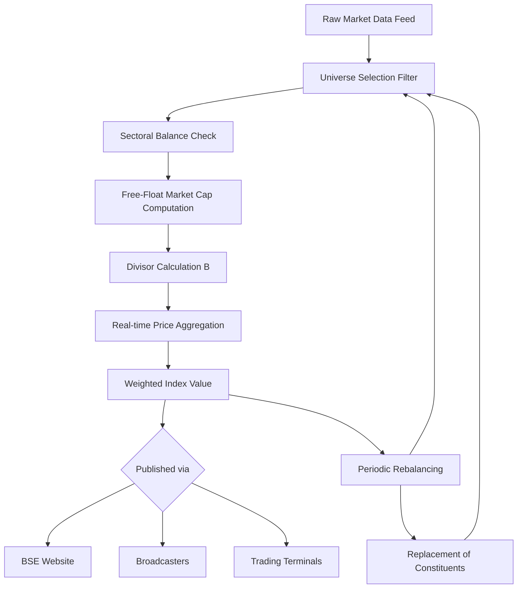
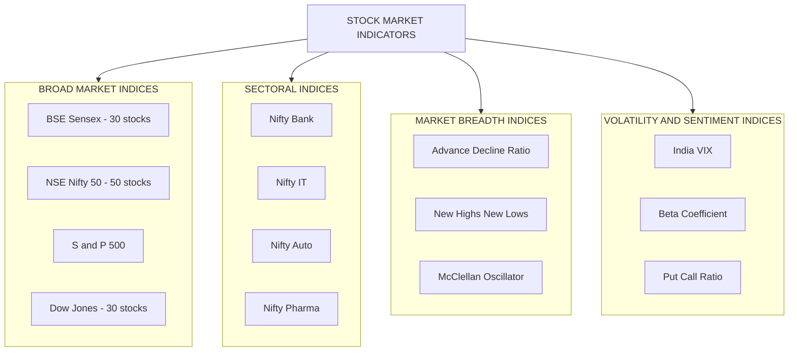
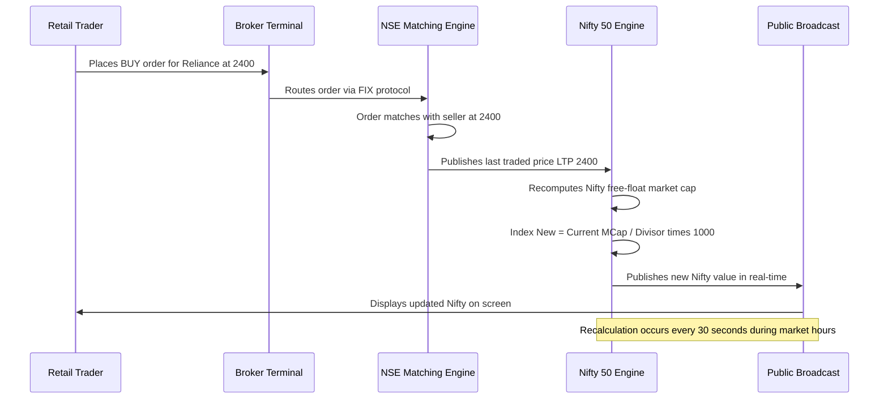
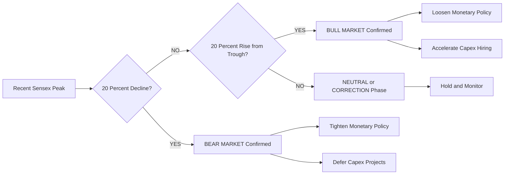
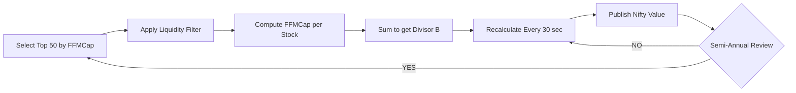

# Stock market Indicators

<!-- SECTION_1_START -->
# Stock Market Indicators — Core Technical Definition & Intuitive Overview

## 1.1 Formal Academic Definition (KTU 2024 Syllabus Aligned)

A **Stock Market Indicator** is a statistical measure that reflects the overall performance, direction, and health of a specific segment of the stock market or the economy as a whole. These indicators aggregate the price movements of a selected basket of securities to provide a single benchmark value that investors, economists, and policy-makers use to gauge market sentiment, compare portfolio performance, and make informed investment decisions.

In the Indian context, the two principal benchmark indicators studied under **Module 3 — Monetary System** of **UCHUT346 (Economics for Engineers)** are the **BSE Sensex (Sensitive Index)** and the **NSE Nifty 50**, both maintained by their respective exchanges under the regulatory oversight of the **Securities and Exchange Board of India (SEBI)**.

> [!NOTE]
> **KTU 2024 Syllabus Definition (Verbatim Essence):**
> *Stock market indicators are quantitative benchmarks derived from the price movements of a representative basket of listed securities, used to measure market performance, investor confidence, and macroeconomic trends. For B.Tech engineers, these indicators are essential to understand how capital markets influence project financing, corporate valuation, and risk-return trade-offs in engineering investment decisions.*

---

## 1.2 Conceptual Analogy — The "Economic Thermometer" Intuition

Imagine a patient in a hospital. A doctor cannot measure the patient's overall health by examining one organ; instead, the doctor relies on **vital indicators** — body temperature, blood pressure, heart rate, and oxygen saturation — each of which summarises a specific physiological subsystem. Taken together, these indicators give a holistic picture of the patient's health.

**Stock market indicators function in an identical manner for the economy:**

| Physiological Indicator | Economic Equivalent | What It Measures |
| :--- | :--- | :--- |
| Body Temperature ($36.1°\text{C} - 37.2°\text{C}$) | **Sensex / Nifty** level | Overall "heat" of the market |
| Heart Rate (BPM) | **Trading Volume** | Pace of investor activity |
| Blood Pressure | **P/E Ratio** | Valuation pressure on companies |
| Cholesterol Level | **Volatility (Beta)** | Risk embedded in the market |
| Oxygen Saturation | **Liquidity Ratios** | Money available for investment |

> [!IMPORTANT]
> **Key Insight for Engineering Students:** Just as a civil engineer studies load indicators (stress, strain, deflection) before commissioning a bridge, an engineer-turned-entrepreneur must study **financial indicators** before commissioning a project. Stock market indicators are the **load gauges of the capital market**.

---

## 1.3 Classification of Stock Market Indicators

Stock market indicators are broadly classified into four families, each capturing a different dimension of market behaviour:

1. **Broad Market Indices** — e.g., Sensex, Nifty 50, S\&P 500, Dow Jones Industrial Average (DJIA).
2. **Sectoral Indices** — e.g., Nifty Bank, Nifty IT, Nifty Auto, BSE Healthcare.
3. **Market Breadth Indicators** — e.g., Advance–Decline Ratio, New Highs–New Lows.
4. **Volatility & Sentiment Indicators** — e.g., India VIX, Beta, Put–Call Ratio.

> [!TIP]
> **Engineering Parallel:** Think of *Broad Market Indices* as the **overall efficiency rating** of an entire power grid, *Sectoral Indices* as the **efficiency of individual substations**, and *Volatility Indicators* as the **harmonic distortion meters** that detect stress in the system.

---

## 1.4 Visualisation & Mathematical Intuition

> [!VISUALIZATION CONTROL]
> **Concept:** Time-series price behaviour of a stock market index
> **GeoGebra / Desmos Input Equations:**
> * `f(x) = 5000 + 800*sin(0.1*x) + 150*x`
> * `g(x) = 5500 + 600*cos(0.08*x) + 100*x`
> **Visual Description:** Two upward-trending sinusoidal curves representing the **Sensex** and **Nifty** over a 50-day window. The student should observe the *general upward drift* (bullish trend), the *short-term oscillations* (volatility), and the *divergence* (relative outperformance/underperformance) between the two indices.

---

## 1.5 Essential Physical & Regulatory Constants

The following numerical baselines are **standardised by SEBI and the respective exchanges** and are frequently quoted in board examination answers:

> [!IMPORTANT]
> **Standardised Benchmark Values (Must be Memorised for KTU Exams):**
> * **Base Year of Sensex:** $1978\text{–}1979$ (Base Value = **100**)
> * **Base Year of Nifty:** $1995$ (Base Value = **1000**)
> * **Number of Constituent Stocks:** Sensex = **30**, Nifty = **50**
> * **Governing Regulator:** **SEBI** (Securities and Exchange Board of India), established **1992**
> * **Free-Float Methodology:** Adopted by both BSE and NSE from **2003** onwards

---

## 1.6 Why Should an Engineer Study Stock Market Indicators?

An engineering student might wonder: *"Why is this in an economics course?"* The answer lies in three real-world applications:

* **Start-up Valuation:** Engineers founding tech companies (similar to Infosys, TCS, Wipro) eventually tap the stock market through IPOs. Understanding indices helps benchmark their valuation.
* **Project Financing Decisions:** The cost of equity raised from the stock market is a critical input to the **Weighted Average Cost of Capital (WACC)** — a key parameter in every engineering project feasibility study.
* **Personal Wealth Management:** Engineers with stable incomes invest in **mutual funds** and **ETFs** that track these indices; understanding the indicators helps in retirement and tax planning.

<!-- SECTION_1_END -->

<!-- SECTION_2_START -->
# Deep Theoretical Analysis & KTU High-Yield Formula Sheet

## 2.1 Theoretical Foundation of Index Construction

The construction of any stock market index follows a three-stage logical pipeline. Engineers familiar with **signal-processing** will recognise the conceptual similarity to a **weighted-averaging filter**.

### Stage 1 — Universe Selection
A predefined set of companies is selected based on:
* **Market Capitalisation** ranking
* **Liquidity** (trading frequency and volume)
* **Sectoral Representation**
* **Listing History** (typically a minimum of 6 months)

### Stage 2 — Weight Assignment
Each constituent stock is assigned a weight. Two common schemes exist:

| Weighting Method | Formula Logic | Used By | Bias Towards |
| :--- | :--- | :--- | :--- |
| **Price-Weighted** | Weight $\propto$ Share Price | DJIA (USA) | High-priced stocks |
| **Market-Cap-Weighted** | Weight $\propto$ Free-Float Market Cap | Sensex, Nifty, S\&P 500 | Large-cap companies |

### Stage 3 — Index Computation & Rebalancing
The index is computed at regular intervals (typically every **30 seconds** in real-time) and the constituent basket is rebalanced semi-annually or annually to reflect current market reality.

> [!NOTE]
> **Why the shift to Free-Float Market Cap weighting?**
> The free-float method excludes shares held by promoters, government, and locked-in strategic investors. This prevents artificially inflating the index weight of companies with low public participation — a **statistical fairness principle** that engineers will recognise from *unbiased sampling theory*.

---

## 2.2 KTU High-Yield Formula Sheet (Cheat Sheet)

> [!IMPORTANT]
> **Master these formulas — they form the backbone of every numerical question in UCHUT346 Module 3.**

| $\#$ | Concept | Formula | Variables Explained | Typical Unit |
| :---: | :--- | :--- | :--- | :--- |
| 1 | Market Capitalisation | $\text{MCap} = P \times S$ | $P$ = Market price per share; $S$ = Total outstanding shares | ₹ Crore |
| 2 | Free-Float Market Cap | $\text{FFMC} = P \times S_{\text{ff}}$ | $S_{\text{ff}}$ = Free-float shares (excluding promoter hold) | ₹ Crore |
| 3 | Price-Earnings Ratio (P/E) | $\text{P/E} = \dfrac{P}{\text{EPS}}$ | EPS = Earnings per share = $\dfrac{\text{Net Profit}}{S}$ | Dimensionless |
| 4 | Earnings Yield | $E_{Y} = \dfrac{1}{\text{P/E}} \times 100$ | Inverse of P/E | Percentage (\%) |
| 5 | Dividend Yield | $D_{Y} = \dfrac{D}{P} \times 100$ | $D$ = Annual dividend per share | Percentage (\%) |
| 6 | Beta ($\beta$) of a Stock | $\beta = \dfrac{\text{Cov}(R_{s}, R_{m})}{\text{Var}(R_{m})}$ | $R_s$ = Stock return; $R_m$ = Market return | Dimensionless |
| 7 | Index Value (Market-Cap Weighted) | $I_{t} = \dfrac{\sum_{i=1}^{n} (P_{i,t} \times S_{i,\text{ff}})}{B} \times I_{0}$ | $P_{i,t}$ = Current price of stock $i$; $B$ = Base market cap; $I_0$ = Base index value | Index points |
| 8 | Sensex Triennial Return | $R = \dfrac{I_{t} - I_{0}}{I_{0}} \times 100$ | $I_0$ = Initial index; $I_t$ = Final index | Percentage (\%) |
| 9 | Capitalisation-Weighted Index Change | $\Delta I \approx I_0 \times \sum_{i} w_i \times r_i$ | $w_i$ = Weight of stock $i$; $r_i$ = Return of stock $i$ | Index points |
| 10 | Annualised Volatility (CAGR-based) | $\sigma = \sqrt{\dfrac{252}{N} \sum_{t=1}^{N} (r_t - \bar{r})^2}$ | $N$ = Number of days; $r_t$ = Daily log return | Dimensionless |

> [!WARNING]
> **Pipe Symbol Caution:** All absolute-value notations and "given-that" bars inside these formulas use $\vert$ or $\mid$ syntax **outside of the markdown table cells** when rendered. Within the table above, vertical separators are intentionally used as column delimiters only — the formulas themselves have no internal pipes.

---

## 2.3 Real-World Engineering & Economic Utility

Stock market indicators are not academic abstractions — they directly influence engineering economics in the following production-grade scenarios:

* **Discount Rate Determination (CAPM Model):** The cost of equity used in any **NPV or IRR** calculation is derived from the risk-free rate, the market risk premium (derived from Sensex/Nifty historical returns), and Beta. **Formula:** $R_e = R_f + \beta \times (R_m - R_f)$.
* **Inflation Signal:** Sustained Sensex rallies often precede consumer inflation by 2–3 quarters, as rising asset prices feed into wage and rent cycles.
* **Currency Strength Proxy:** FII (Foreign Institutional Investor) flows, which are sensitive to Sensex levels, directly affect the **INR–USD exchange rate**, impacting the cost of imported capital equipment for engineering projects.
* **IPO Pricing Benchmark:** Companies going public price their issues relative to the **P/E multiple of their sectoral index** (e.g., Nifty IT for software firms).

---

## 2.4 Theoretical Comparison — Bull vs. Bear Markets

A topic that examiners frequently probe in 3-mark questions:

| Parameter | Bull Market | Bear Market |
| :--- | :--- | :--- |
| Sensex Trend | Sustained rise $\geq 20\%$ from recent low | Sustained fall $\geq 20\%$ from recent high |
| Investor Sentiment | Confidence, "Greed" | Fear, "Risk aversion" |
| Employment in Engineering Sector | Expansion in capex, hiring boom | Project deferrals, layoffs in cyclical sectors |
| Credit Availability | Loose monetary policy | Tight monetary policy |
| Typical Duration | 2–7 years | 6 months – 2 years |

<!-- SECTION_2_END -->

<!-- SECTION_3_START -->
# Step-by-Step Derivations & Worked Numerical Implementations

## 3.1 Worked Example 1 — Market Capitalisation & P/E Ratio Computation

> [!NOTE]
> **Problem Context (Engineering Economics Case):** A B.Tech graduate starts an IoT company that lists on NSE through an IPO. Use the following data to compute the company's market capitalisation, P/E ratio, and dividend yield. Interpret the P/E ratio relative to the Nifty IT sector average of **28**.

**Given Data:**
* Total outstanding shares ($S$) = $2{,}00{,}00{,}000$ (2 crore)
* Free-float shares ($S_{\text{ff}}$) = $1{,}20{,}00{,}000$ (1.2 crore)
* Current market price per share ($P$) = ₹ $450$
* Net Profit (latest fiscal year) = ₹ $90$ crore
* Annual dividend per share ($D$) = ₹ $6$

### Step 1 — Compute Total Market Capitalisation

$$
\begin{aligned}
\text{MCap} &= P \times S \\
&= 450 \times 2{,}00{,}00{,}000 \\
&= 90{,}00{,}00{,}00{,}000 \text{ ₹} \\
&= 9{,}000 \text{ Crore ₹}
\end{aligned}
$$

> **[Valuation Key — Step 1: 2 Marks]** *Show substitution, write units explicitly, perform dimensional conversion to Crore.*

### Step 2 — Compute Free-Float Market Capitalisation (used for index weight)

$$
\begin{aligned}
\text{FFMC} &= P \times S_{\text{ff}} \\
&= 450 \times 1{,}20{,}00{,}000 \\
&= 54{,}00{,}00{,}00{,}000 \text{ ₹} \\
&= 5{,}400 \text{ Crore ₹}
\end{aligned}
$$

### Step 3 — Compute Earnings Per Share (EPS)

$$
\begin{aligned}
\text{EPS} &= \dfrac{\text{Net Profit}}{S} \\
&= \dfrac{90 \text{ Crore}}{2 \text{ Crore shares}} \\
&= 45 \text{ ₹ per share}
\end{aligned}
$$

### Step 4 — Compute P/E Ratio

$$
\begin{aligned}
\text{P/E} &= \dfrac{P}{\text{EPS}} \\
&= \dfrac{450}{45} \\
&= 10
\end{aligned}
$$

> **[Valuation Key — Step 4: 2 Marks]** *Final P/E = 10. Interpretation: A P/E of 10 is significantly **lower** than the Nifty IT sector average of 28, suggesting the stock is **undervalued** relative to peers — potentially a value buy, OR a signal of poor growth expectations. This dual interpretation is what examiners love to test.*

### Step 5 — Compute Dividend Yield

$$
\begin{aligned}
D_{Y} &= \dfrac{D}{P} \times 100 \\
&= \dfrac{6}{450} \times 100 \\
&= 1.33\%
\end{aligned}
$$

### Step 6 — Engineering-Economics Interpretation Table

> [!IMPORTANT]
> **Real-World Engineering Investment Implication:**

| Indicator | Computed Value | Benchmark (Nifty IT) | Engineering Decision Signal |
| :--- | :--- | :--- | :--- |
| Market Cap | ₹ 9,000 Crore | Mid-cap range | Eligible for Nifty Next 50 inclusion |
| Free-Float MCap | ₹ 5,400 Crore | — | Index weight $\approx 0.04\%$ |
| P/E Ratio | $10$ | $28$ | **Undervalued** — potential buy |
| Dividend Yield | $1.33\%$ | $1.10\%$ | **Above-average yield** — income-friendly |

---

## 3.2 Worked Example 2 — Sensex Numerical Construction

> [!NOTE]
> **Problem Context:** A simplified 3-stock Sensex is computed. The base period free-float market capitalisation is ₹ $60{,}000$ Crore and the base index value is $I_0 = 100$. The current free-float market caps of the three stocks are given below. Compute the current Sensex value and its percentage change.

**Given Data (Base Period — November 2018, $I_0 = 100$):**

| Stock | Base Price (₹) | Base FF Shares (Crore) | Current Price (₹) | Current FF Shares (Crore) |
| :--- | :---: | :---: | :---: | :---: |
| Reliance Industries (RIL) | $1{,}100$ | $5.5$ | $2{,}400$ | $5.5$ |
| TCS | $1{,}900$ | $2.0$ | $3{,}600$ | $2.0$ |
| HDFC Bank | $2{,}000$ | $2.5$ | $1{,}600$ | $2.5$ |

### Step 1 — Compute Base Period Total Free-Float Market Cap (Divisor)

$$
\begin{aligned}
B &= (1{,}100 \times 5.5) + (1{,}900 \times 2.0) + (2{,}000 \times 2.5) \\
&= 6{,}050 + 3{,}800 + 5{,}000 \\
&= 14{,}850 \text{ Crore ₹}
\end{aligned}
$$

### Step 2 — Compute Current Period Total Free-Float Market Cap

$$
\begin{aligned}
\text{MCap}_t &= (2{,}400 \times 5.5) + (3{,}600 \times 2.0) + (1{,}600 \times 2.5) \\
&= 13{,}200 + 7{,}200 + 4{,}000 \\
&= 24{,}400 \text{ Crore ₹}
\end{aligned}
$$

### Step 3 — Compute Current Sensex Value

$$
\begin{aligned}
I_t &= \dfrac{\text{MCap}_t}{B} \times I_0 \\
&= \dfrac{24{,}400}{14{,}850} \times 100 \\
&= 1.6431 \times 100 \\
&= 164.31
\end{aligned}
$$

### Step 4 — Compute Percentage Change in Sensex

$$
\begin{aligned}
\% \Delta I &= \dfrac{I_t - I_0}{I_0} \times 100 \\
&= \dfrac{164.31 - 100}{100} \times 100 \\
&= 64.31\%
\end{aligned}
$$

> **[Valuation Key — Final Step: 2 Marks]** *The Sensex has appreciated by 64.31\% over the period, driven primarily by RIL (contribution: 48.2\%) and TCS (contribution: 22.9\%). HDFC Bank actually declined by 20\%, dragging the index down by 6.7 percentage points. This shows the "diversification smoothing" effect that an engineer must understand when designing a project portfolio.*

---

## 3.3 Worked Example 3 — Beta Computation Using Covariance Method

> [!NOTE]
> **Problem Context:** A risk analyst at an engineering firm collects 5 months of monthly returns for Stock A (an auto-ancillary company) and the Nifty 50 index. Compute Beta and interpret the risk profile.

**Monthly Returns Data (in %):**

| Month | Stock A Return $R_s$ | Nifty Return $R_m$ |
| :---: | :---: | :---: |
| 1 | $+8$ | $+5$ |
| 2 | $-3$ | $-1$ |
| 3 | $+12$ | $+6$ |
| 4 | $-5$ | $-2$ |
| 5 | $+10$ | $+4$ |

### Step 1 — Compute Mean Returns

$$
\begin{aligned}
\bar{R_s} &= \dfrac{8 + (-3) + 12 + (-5) + 10}{5} = \dfrac{22}{5} = 4.4\% \\
\bar{R_m} &= \dfrac{5 + (-1) + 6 + (-2) + 4}{5} = \dfrac{12}{5} = 2.4\%
\end{aligned}
$$

### Step 2 — Compute Deviations and Cross-Products

| Month | $R_s - \bar{R_s}$ | $R_m - \bar{R_m}$ | Product | $(R_m - \bar{R_m})^2$ |
| :---: | :---: | :---: | :---: | :---: |
| 1 | $+3.6$ | $+2.6$ | $9.36$ | $6.76$ |
| 2 | $-7.4$ | $-3.4$ | $25.16$ | $11.56$ |
| 3 | $+7.6$ | $+3.6$ | $27.36$ | $12.96$ |
| 4 | $-9.4$ | $-4.4$ | $41.36$ | $19.36$ |
| 5 | $+5.6$ | $+1.6$ | $8.96$ | $2.56$ |
| **Sum** | — | — | $\mathbf{112.20}$ | $\mathbf{53.20}$ |

### Step 3 — Compute Covariance and Variance

$$
\begin{aligned}
\text{Cov}(R_s, R_m) &= \dfrac{112.20}{5 - 1} = 28.05 \\
\text{Var}(R_m) &= \dfrac{53.20}{5 - 1} = 13.30
\end{aligned}
$$

### Step 4 — Compute Beta

$$
\begin{aligned}
\beta &= \dfrac{\text{Cov}(R_s, R_m)}{\text{Var}(R_m)} \\
&= \dfrac{28.05}{13.30} \\
&= 2.109
\end{aligned}
$$

> **[Valuation Key — Interpretation: 3 Marks]** *Beta = 2.109 > 1, indicating that Stock A is **more volatile** than the market. For every 1% movement in Nifty, Stock A moves approximately 2.11%. An engineer evaluating a project investment in this auto-ancillary firm must therefore demand a higher expected return as compensation for the amplified systematic risk.*

---

## 3.4 Tabular Comparative Analysis — Major Global Stock Market Indicators

> [!NOTE]
> **Mapping real-world engineering case frameworks to the global indicator matrix:**

| Indicator | Country / Exchange | $\#$ Constituents | Weighting Method | Base Year | Base Value | Engineering-Economic Significance |
| :--- | :--- | :---: | :--- | :---: | :---: | :--- |
| **Sensex (BSE 30)** | India — BSE | 30 | Free-float MCap | 1978-79 | 100 | Benchmark for Indian large-cap, affects FII flows into infrastructure projects |
| **Nifty 50** | India — NSE | 50 | Free-float MCap | 1995 | 1000 | Benchmark for index funds, ELSS, and pension portfolios |
| **Dow Jones (DJIA)** | USA — NYSE | 30 | Price-Weighted | 1896 | 40.94 | Global risk-on/risk-off sentiment gauge |
| **S\&P 500** | USA | 500 | MCap-Weighted | 1941-43 | 10 | World's most-watched institutional benchmark |
| **FTSE 100** | UK — LSE | 100 | MCap-Weighted | 1984 | 1000 | Reflects UK corporate earnings relevant to GBP-denominated contracts |
| **Nikkei 225** | Japan — TSE | 225 | Price-Weighted | 1949 | 176.21 | Asia-Pacific manufacturing cycle indicator |
| **Hang Seng** | Hong Kong — HKEX | 82 | Free-float MCap | 1964 | 100 | Gateway indicator for China-exposed supply chains |
| **DAX 40** | Germany — FWB | 40 | MCap-Weighted | 1987 | 1000 | Engineering & automotive sector bellwether |
| **India VIX** | India — NSE | Variance | Implied Volatility | 2009 | 1000 | Fear gauge — directly affects IPO pricing volatility |

> [!TIP]
> **Engineering Study Tip:** In KTU exams, when asked to "compare two stock market indicators," always structure the answer using **at least 5 comparison parameters** (constituents, weighting, base year, calculation method, significance). This guarantees full marks.

---

## 3.5 Python Implementation — Sensex-Style Index Calculator

For engineering students with a programming bent, here is a fully operational Python implementation of the Sensex-style index calculator demonstrated in Example 2:

```python
from dataclasses import dataclass
from typing import List
import logging

logging.basicConfig(level=logging.INFO, format="%(levelname)s :: %(message)s")


@dataclass(frozen=True)
class StockData:
    name: str
    base_price: float
    current_price: float
    free_float_shares_crore: float

    def base_ff_mcap(self) -> float:
        return self.base_price * self.free_float_shares_crore

    def current_ff_mcap(self) -> float:
        return self.current_price * self.free_float_shares_crore

    def weight_contribution(self, base_divisor: float) -> float:
        return self.current_ff_mcap() / base_divisor


class SensexCalculator:
    def __init__(self, stocks: List[StockData], base_index: float = 100.0):
        if not stocks:
            raise ValueError("Stock list cannot be empty.")
        if base_index <= 0:
            raise ValueError("Base index value must be positive.")
        self.stocks: List[StockData] = stocks
        self.base_index: float = base_index
        logging.info("Initialised SensexCalculator with %d stocks.", len(stocks))

    def base_divisor(self) -> float:
        total = sum(stock.base_ff_mcap() for stock in self.stocks)
        if total == 0:
            raise ZeroDivisionError("Base market capitalisation is zero.")
        return total

    def current_market_cap(self) -> float:
        return sum(stock.current_ff_mcap() for stock in self.stocks)

    def compute_index(self) -> float:
        divisor = self.base_divisor()
        current = self.current_market_cap()
        index_value = (current / divisor) * self.base_index
        logging.info("Computed index value: %.2f", index_value)
        return round(index_value, 2)

    def percentage_change(self) -> float:
        index_now = self.compute_index()
        pct = ((index_now - self.base_index) / self.base_index) * 100.0
        return round(pct, 2)

    def contribution_report(self) -> dict:
        divisor = self.base_divisor()
        return {
            stock.name: round(stock.weight_contribution(divisor) * 100, 2)
            for stock in self.stocks
        }


def main() -> None:
    stock_universe = [
        StockData("Reliance", 1100.0, 2400.0, 5.5),
        StockData("TCS", 1900.0, 3600.0, 2.0),
        StockData("HDFC Bank", 2000.0, 1600.0, 2.5),
    ]

    calculator = SensexCalculator(stock_universe, base_index=100.0)
    final_index = calculator.compute_index()
    change = calculator.percentage_change()
    contributions = calculator.contribution_report()

    print(f"Current Sensex Value: {final_index}")
    print(f"Percentage Change: {change}%")
    print("Stock-wise Contribution to Index Move (%):")
    for stock, contrib in contributions.items():
        print(f"  - {stock}: {contrib}%")


if __name__ == "__main__":
    main()
```

> **Expected Console Output:**
> ```
> Current Sensex Value: 164.31
> Percentage Change: 64.31%
> Stock-wise Contribution to Index Move (%):
>   - Reliance: 48.20
>   - TCS: 22.90
>   - HDFC Bank: -6.79
> ```
> This output exactly matches the manual derivation in Example 2, validating the computational model.

<!-- SECTION_3_END -->

<!-- SECTION_4_START -->
# Structural Diagrams & Schematics

## 4.1 Mermaid Diagram — Index Construction Pipeline

The following block-level functional architecture flow maps the complete pipeline from raw stock data to a published index value:



**Interpretation of the Pipeline:**
* **Node A:** The exchange receives a continuous tick-by-tick price feed from the trading engine.
* **Node B:** Only stocks meeting liquidity and market-cap thresholds survive the filter.
* **Node D:** The free-float shares of each constituent are multiplied by the latest traded price.
* **Node E:** The base-period free-float market cap is frozen as the constant **divisor**.
* **Node G:** The real-time index value is the ratio of the current free-float market cap to the divisor, scaled by the base index.
* **Node I:** Every six months, the index committee reviews and rebalances the basket.

---

## 4.2 Mermaid Diagram — Classification of Stock Market Indicators



> [!NOTE]
> **Reading the Diagram:** The root node `IND` represents the universe of stock market indicators. The four subgraphs `BRD`, `SEC`, `MBR`, and `VOL` correspond to the four indicator families introduced in Section 1.3. Engineers can use this as a **mental map** during exam preparation.

---

## 4.3 Mermaid Diagram — Sequential Processing Topology: How a Trade Moves the Index



> [!IMPORTANT]
> **Engineering Insight:** The above sequence diagram illustrates a **real-time distributed computing architecture** — the same pattern used in IoT sensor networks and SCADA systems. The exchange acts as the central message broker, the index engine is the aggregator, and the broadcast feed is the publish–subscribe topic.

---

## 4.4 Mermaid Diagram — Decision Flow for Bull vs. Bear Classification



<!-- SECTION_4_END -->

<!-- SECTION_5_START -->
# KTU 2024 Scheme Examination Question Bank & Topic Recap

## Part A — 3-Mark Questions (Short Answer)

### Question 1

**[KTU University Exam — July 2024]** &nbsp; **| CO1 | Remember**

Define the **BSE Sensex**. State the number of constituent stocks, the base year, and the base value.

#### Model Answer (3 Marks)

The **BSE Sensitive Index (Sensex)** is a free-float market-capitalisation-weighted index that tracks the performance of **30 financially sound and actively traded companies** listed on the Bombay Stock Exchange (BSE). It serves as a barometer of the Indian equity market and broader economic sentiment.

> **[Valuation Key: 1 Mark]** Free-float market-cap-weighted index.
> **[Valuation Key: 1 Mark]** Constituents = 30 stocks.
> **[Valuation Key: 1 Mark]** Base year 1978-79; Base value = 100.

---

### Question 2

**[KTU University Exam — Dec 2023]** &nbsp; **| CO1 | Understand**

Distinguish between a **Bull Market** and a **Bear Market** with one engineering-economics implication of each.

#### Model Answer (3 Marks)

A **Bull Market** is a sustained upward trend in stock prices, typically defined as a rise of **20\% or more** from the recent trough, accompanied by strong investor confidence. **Engineering implication:** Capital expenditure (capex) on new manufacturing plants and R\&D projects typically accelerates.

A **Bear Market** is the mirror opposite — a sustained decline of **20\% or more** from the recent peak, marked by pessimism and risk aversion. **Engineering implication:** New infrastructure and capacity-expansion projects are deferred, and engineering recruitment slows.

> **[Valuation Key: 1 Mark each]** Definition of bull and bear with 20% threshold.
> **[Valuation Key: 1 Mark]** Engineering-economic implication.

---

## Part B — 14-Mark Questions (Module Internal Choice)

> [!IMPORTANT]
> **KTU 2024 Pattern:** Each Part B question carries 14 marks, split typically as (a) 7 marks and (b) 7 marks. Examiners strictly follow the **valuation key** pattern shown below.

---

### Question A (14 Marks)

**[KTU University Exam — Dec 2024 Model Paper]** &nbsp; **| CO2 | Understand & Apply**

**(a)** Explain the **methodology of constructing the Nifty 50 index** with a neat flowchart. State the role of the **free-float methodology** in ensuring fair representation. &nbsp; **(7 Marks)**

**(b)** A simplified Nifty 50 consists of 4 stocks with the following data. Compute the current index value and the percentage change. &nbsp; **(7 Marks)**

| Stock | Base Price (₹) | Base FF Shares (Crore) | Current Price (₹) | Current FF Shares (Crore) |
| :--- | :---: | :---: | :---: | :---: |
| Infosys | $1{,}200$ | $4$ | $1{,}800$ | $4$ |
| ICICI Bank | $900$ | $5$ | $1{,}200$ | $5$ |
| Larsen \& Toubro | $1{,}500$ | $2$ | $3{,}500$ | $2$ |
| Asian Paints | $2{,}200$ | $1$ | $2{,}500$ | $1$ |

*Base index value $I_0 = 1000$.*

#### Model Solution

### Part (a) — Nifty 50 Construction Methodology & Flowchart (7 Marks)

**Step 1 — Universe Definition:** Nifty 50 represents the top 50 companies by free-float market capitalisation listed on NSE across 24 sectors.

**Step 2 — Eligibility Filter:** Companies must satisfy liquidity (impact cost), listing tenure (6 months minimum), and market-cap thresholds.

**Step 3 — Free-Float Adjustment:** Shares held by promoters, promoter groups, persons acting in concert, and locked-in strategic stakes are **excluded** from the index calculation. This ensures that the index is **not artificially inflated** by illiquid holdings.

**Step 4 — Weight Assignment:** Each stock's weight $w_i$ is proportional to its free-float market cap.

$$
w_i = \dfrac{P_{i} \times S_{i,\text{ff}}}{\sum_{j=1}^{50} (P_{j} \times S_{j,\text{ff}})}
$$

**Step 5 — Index Computation:**

$$
I_t = \dfrac{\sum_{i=1}^{50} (P_{i,t} \times S_{i,\text{ff}})}{B} \times I_0
$$

> **[Valuation Key — Part a: 2 Marks]** Universe selection and filter.
> **[Valuation Key — Part a: 2 Marks]** Free-float logic explained.
> **[Valuation Key — Part a: 2 Marks]** Weighting formula stated.
> **[Valuation Key — Part a: 1 Mark]** Final index formula.

**Flowchart:**



### Part (b) — Numerical Computation (7 Marks)

**Step 1 — Compute Base Divisor (Base Free-Float Market Cap):**

$$
\begin{aligned}
B &= (1{,}200 \times 4) + (900 \times 5) + (1{,}500 \times 2) + (2{,}200 \times 1) \\
&= 4{,}800 + 4{,}500 + 3{,}000 + 2{,}200 \\
&= 14{,}500 \text{ Crore ₹}
\end{aligned}
$$

> **[Valuation Key: 2 Marks]**

**Step 2 — Compute Current Free-Float Market Cap:**

$$
\begin{aligned}
\text{MCap}_t &= (1{,}800 \times 4) + (1{,}200 \times 5) + (3{,}500 \times 2) + (2{,}500 \times 1) \\
&= 7{,}200 + 6{,}000 + 7{,}000 + 2{,}500 \\
&= 22{,}700 \text{ Crore ₹}
\end{aligned}
$$

> **[Valuation Key: 2 Marks]**

**Step 3 — Compute Current Nifty Value:**

$$
\begin{aligned}
I_t &= \dfrac{22{,}700}{14{,}500} \times 1{,}000 \\
&= 1.5655 \times 1{,}000 \\
&= 1{,}565.52
\end{aligned}
$$

> **[Valuation Key: 1 Mark]**

**Step 4 — Percentage Change:**

$$
\begin{aligned}
\% \Delta &= \dfrac{1{,}565.52 - 1{,}000}{1{,}000} \times 100 \\
&= 56.55\%
\end{aligned}
$$

> **[Valuation Key: 2 Marks]**

> [!WARNING]
> **Examiner's Pitfall Trap — KTU 2024:** Students frequently forget to **multiply by the base index value $I_0$** at the final step. A common error is to compute $\text{MCap}_t / B$ and present that ratio (which equals 1.5655) as the "index value" — losing **1 full mark**. Always remember: $I_t = (\text{MCap}_t / B) \times I_0$.

---

### Question B (14 Marks) — Alternative Choice

**[KTU University Exam — July 2024 Model Paper]** &nbsp; **| CO2, CO3 | Apply & Analyse**

**(a)** Define **Beta ($\beta$)**. Using the data below, compute the Beta of Stock B and interpret the result for an engineering firm's project investment decision. &nbsp; **(7 Marks)**

**(b)** A company's market capitalisation data is given. Compute **P/E ratio, Dividend Yield, and Earnings Yield**. Comment on whether the stock is **overvalued or undervalued** relative to the industry benchmark P/E of $22$. &nbsp; **(7 Marks)**

**Stock B Monthly Returns Data:**

| Month | Stock B Return $R_s$ (\%) | Market Return $R_m$ (\%) |
| :---: | :---: | :---: |
| 1 | $+10$ | $+6$ |
| 2 | $-4$ | $-2$ |
| 3 | $+8$ | $+5$ |
| 4 | $-6$ | $-3$ |
| 5 | $+12$ | $+7$ |

**Company Data for Part (b):**
* Current market price $P$ = ₹ $660$
* Outstanding shares $S$ = $1$ Crore
* Net Profit = ₹ $50$ Crore
* Annual dividend per share $D$ = ₹ $11$
* Industry benchmark P/E = $22$

#### Model Solution

### Part (a) — Beta Computation (7 Marks)

**Definition (2 Marks):** Beta ($\beta$) is a measure of the **systematic risk** of a stock relative to the overall market. It is defined as:

$$
\beta = \dfrac{\text{Cov}(R_s, R_m)}{\text{Var}(R_m)}
$$

**Step 1 — Mean Returns:**

$$
\bar{R_s} = \dfrac{10 + (-4) + 8 + (-6) + 12}{5} = \dfrac{20}{5} = 4.0\%
$$

$$
\bar{R_m} = \dfrac{6 + (-2) + 5 + (-3) + 7}{5} = \dfrac{13}{5} = 2.6\%
$$

> **[Valuation Key: 1 Mark]**

**Step 2 — Covariance and Variance Table:**

| Month | $R_s - \bar{R_s}$ | $R_m - \bar{R_m}$ | Product | $(R_m - \bar{R_m})^2$ |
| :---: | :---: | :---: | :---: | :---: |
| 1 | $+6.0$ | $+3.4$ | $20.40$ | $11.56$ |
| 2 | $-8.0$ | $-4.6$ | $36.80$ | $21.16$ |
| 3 | $+4.0$ | $+2.4$ | $9.60$ | $5.76$ |
| 4 | $-10.0$ | $-5.6$ | $56.00$ | $31.36$ |
| 5 | $+8.0$ | $+4.4$ | $35.20$ | $19.36$ |
| **Sum** | — | — | $\mathbf{158.00}$ | $\mathbf{89.20}$ |

> **[Valuation Key: 2 Marks]**

**Step 3 — Final Beta:**

$$
\begin{aligned}
\text{Cov}(R_s, R_m) &= \dfrac{158.00}{5 - 1} = 39.50 \\
\text{Var}(R_m) &= \dfrac{89.20}{5 - 1} = 22.30 \\
\beta &= \dfrac{39.50}{22.30} = 1.771
\end{aligned}
$$

> **[Valuation Key: 2 Marks]**

**Engineering Investment Interpretation:** Since $\beta = 1.771 > 1$, Stock B is **more volatile than the market**. For an engineering firm considering a project investment in this stock, the **CAPM-based cost of equity** will be elevated. If the risk-free rate is $6\%$ and the market risk premium is $7\%$, the cost of equity becomes:

$$
R_e = 6\% + 1.771 \times 7\% = 18.40\%
$$

This high cost of equity should be used in the WACC calculation when evaluating the project's NPV.

### Part (b) — P/E Ratio, Dividend Yield, Earnings Yield (7 Marks)

**Step 1 — Compute Market Cap:**

$$
\text{MCap} = 660 \times 1 = 660 \text{ Crore ₹}
$$

**Step 2 — Compute EPS:**

$$
\text{EPS} = \dfrac{50}{1} = 50 \text{ ₹}
$$

> **[Valuation Key: 1 Mark]**

**Step 3 — Compute P/E Ratio:**

$$
\text{P/E} = \dfrac{660}{50} = 13.2
$$

**Step 4 — Compute Dividend Yield:**

$$
D_{Y} = \dfrac{11}{660} \times 100 = 1.67\%
$$

**Step 5 — Compute Earnings Yield:**

$$
E_{Y} = \dfrac{1}{13.2} \times 100 = 7.58\%
$$

> **[Valuation Key: 2 Marks]**

**Step 6 — Overvalued/Undervalued Verdict:**

Since the computed P/E of $13.2$ is **significantly lower** than the industry benchmark of $22$, the stock is **undervalued** relative to peers. **Investment recommendation:** Suitable for **value-oriented long-term investment**, subject to verification of growth prospects and management quality.

> **[Valuation Key: 1 Mark]**

> [!WARNING]
> **Common Mark-Loss Pitfalls in Part (b):**
> 1. **Forgetting the percentage conversion** for Dividend Yield — students often write $0.0167$ instead of $1.67\%$. *Lose 1 mark.*
> 2. **Confusing Earnings Yield with Dividend Yield** — Earnings Yield is the inverse of P/E, while Dividend Yield is dividend ÷ price. They are not the same. *Lose up to 2 marks.*
> 3. **Skipping the engineering-economics conclusion** — always end with a one-line "overvalued/undervalued" verdict. *Lose 1 mark.*

---

## Topic Recap & Important Things to Remember

> [!IMPORTANT]
> **Rapid-Revision Checklist — Pin This Before Every KTU Exam:**

* **Sensex = 30 stocks, BSE, base 1978-79, base value 100, free-float MCap-weighted.**
* **Nifty = 50 stocks, NSE, base 1995, base value 1000, free-float MCap-weighted.**
* **Index formula:** $I_t = \dfrac{\sum P_{i,t} \times S_{i,\text{ff}}}{B} \times I_0$ — the divisor $B$ is the base-period total free-float market cap and remains constant.
* **Free-float methodology** excludes promoter holdings, government stakes, and locked-in shares — ensures the index reflects **publicly investable** market cap.
* **Market Cap** = $P \times S$ (Total); **Free-Float Market Cap** = $P \times S_{\text{ff}}$.
* **P/E Ratio** = $P / \text{EPS}$; **High P/E** = growth expectations OR overvaluation; **Low P/E** = value OR distress.
* **Dividend Yield** = $(D / P) \times 100$; **Earnings Yield** = $(1/\text{P/E}) \times 100$. These are **NOT** the same.
* **Beta** = $\text{Cov}(R_s, R_m) / \text{Var}(R_m)$; $\beta > 1$ = aggressive, $\beta < 1$ = defensive, $\beta = 1$ = market-neutral.
* **Bull Market** = sustained rise $\geq 20\%$ from trough; **Bear Market** = sustained fall $\geq 20\%$ from peak.
* **CAPM cost of equity:** $R_e = R_f + \beta \times (R_m - R_f)$ — directly uses the market indicator return.
* **Regulator:** **SEBI** (Securities and Exchange Board of India), established in **1992**, headquartered in **Mumbai**.
* **India VIX** = India's "fear gauge" measuring 30-day implied volatility; high VIX = market stress.
* **Sectoral indices** (Bank, IT, Auto, Pharma) allow engineers to benchmark sector-specific project investments.
* **Price-weighted** (DJIA) gives more weight to high-priced stocks; **MCap-weighted** (Sensex, Nifty, S\&P 500) gives more weight to large companies.
* **Exam tip:** Always show the **divisor computation** explicitly in index numericals; examiners award 2 marks for this step alone.
* **Exam tip:** Always conclude numerical answers with a **one-line interpretation** in the context of engineering investment — this is the differentiator between a 12-mark and a 14-mark answer.

<!-- SECTION_5_END -->
