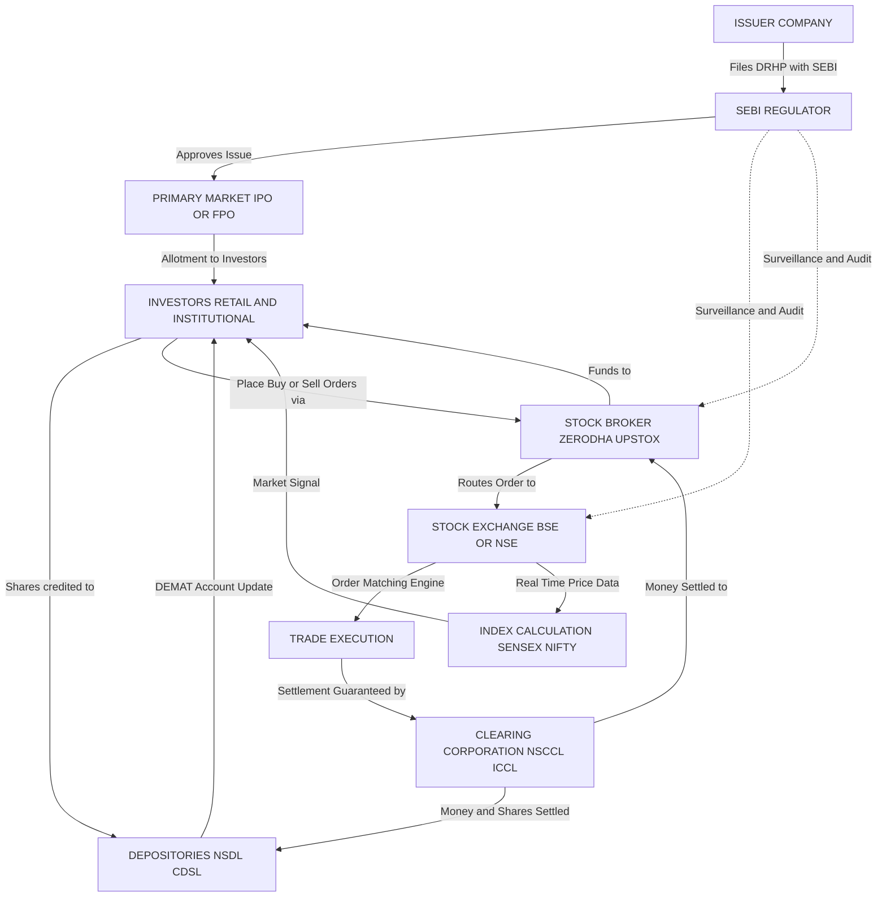
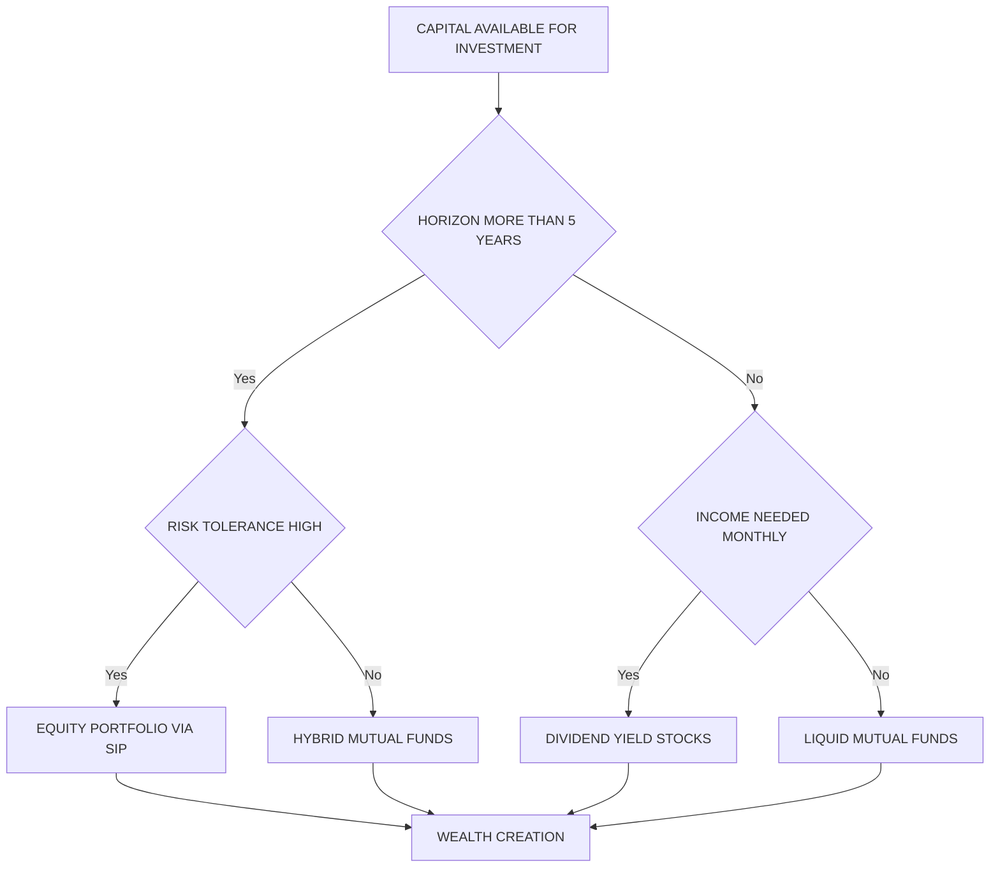

# Stock Market

<!-- SECTION_1_START -->

# Stock Market — Foundational Definition & Intuitive Overview

> [!NOTE]
> **KTU 2024 Scheme Anchor (Module 3 — Monetary System)**
> The stock market is the structural backbone of a market-based monetary system, channeling household savings into productive industrial capital. For engineering students, it is the most relevant practical application of macroeconomic liquidity, interest rate mechanics, and capital formation theory.

## 1.1 Formal Academic Definition

The **Stock Market** is a regulated, organized marketplace — either physical or electronic — where securities representing ownership claims on publicly listed corporations (equity shares), debt instruments (bonds and debentures), and hybrid instruments (preference shares, derivatives) are issued, bought, and sold. It is a critical component of the **primary market** (for new capital infusion via IPOs and FPOs) and the **secondary market** (for ongoing trading of already-issued instruments on licensed exchanges such as the **BSE — Bombay Stock Exchange** and the **NSE — National Stock Exchange of India**). The apex regulatory authority is **SEBI — the Securities and Exchange Board of India**, established under the SEBI Act, **1992**.

> [!IMPORTANT]
> **KTU Board Terminology Exact Match**
> When you write your ESE (End Semester Examination) answers, always use the term *"Secondary Market"* for ongoing trading and *"Primary Market"* for fresh issue. Examiners in Kerala award extra marks for precise nomenclature consistency with the KTU 2024 syllabus glossary.

## 1.2 Intuitive Overview & Real-World Analogy

> [!TIP]
> **The "Company = Pizza Shop" Analogy**
> Imagine a popular pizza shop that needs ₹10,00,000 to open five new branches. Instead of borrowing from a single bank (debt), the owner slices the shop into 1,00,000 equal ownership pieces called **shares**. Each slice is sold for ₹10. A student like you can buy 100 slices for ₹1,000 and become a part-owner. The collection of buyers and sellers trading these slices is the **Stock Market**. The "shop's total value" is the **Market Capitalization**, and the daily changing price of each slice reflects collective public confidence.

### Why the Stock Market Exists — Three Core Functions

1. **Capital Formation Bridge** — Connects savers (households, pension funds, FPIs) with investment-seeking firms.
2. **Liquidity Engine** — Allows investors to convert share certificates into cash quickly without the firm having to buy them back.
3. **Price Discovery Mechanism** — Through continuous buy/sell bidding, the market arrives at a real-time, fair valuation of a firm based on expected future earnings, called the **Intrinsic Value**.

## 1.3 GeoGebra / Desmos Visualization Concept

> [!VISUALIZATION CONTROL]
> **Concept:** Demand and Supply Equilibrium Curve for a Traded Stock
> **GeoGebra / Desmos Input Equations:**
> * `Demand: P = 100 - 2Q`
> * `Supply: P = 20 + 3Q`
> * `Equilibrium marker: (Q, P) = (16, 68)`
> **Visual Description:** Plot the downward-sloping demand curve and the upward-sloping supply curve. The intersection point indicates the equilibrium price and quantity, analogous to how a stock's price settles when buy orders equal sell orders at a given tick.

---

<!-- SECTION_1_END -->

<!-- SECTION_2_START -->

# Deep Theoretical Analysis & KTU High-Yield Formula Sheet

## 2.1 The Two-Tier Structure of the Stock Market

| Tier | Name | Function | Example |
|------|------|----------|---------|
| Primary | Primary Market | Fresh capital raised by issuing new shares | **IPO — Initial Public Offering**, **FPO — Follow-on Public Offer**, **Rights Issue** |
| Secondary | Secondary Market | Trading of already-issued shares between investors | Day-to-day trading on **BSE** (SENSEX) and **NSE** (NIFTY 50) |

> [!IMPORTANT]
> **KTU High-Yield Distinction**
> A student often confuses an IPO with a stock listing. An **IPO** is the *event* of raising new capital from the public for the first time. A **Listing** is the *administrative act* of registering the shares on an exchange for future trading. They occur sequentially, not simultaneously.

## 2.2 Key Participants in the Stock Market Ecosystem

1. **SEBI** — Regulator; protects investor interests and prevents insider trading and market manipulation.
2. **Stock Exchanges (BSE, NSE)** — Provide the trading platform; ensure fair price discovery.
3. **Stock Brokers** — Licensed intermediaries executing trades on behalf of clients (e.g., Zerodha, Upstox, ICICI Direct).
4. **Depositories (NSDL, CDSL)** — Hold shares in electronic **DEMAT** (Dematerialized) form.
5. **Investors** — Retail Individual Investors (RIIs), Domestic Institutional Investors (DIIs), Foreign Portfolio Investors (FPIs).
6. **Clearing Corporations (NSCCL, ICCL)** — Guarantee settlement of trades, eliminating counter-party default risk.

## 2.3 Pricing Metrics Every Engineer Must Know

| Metric | Formula | Engineering Intuition |
|--------|---------|------------------------|
| **Face Value** | Statutory nominal value (usually ₹1 or ₹10) | Like the *rated voltage* of a component on a datasheet |
| **Market Price (P)** | Determined by demand and supply on exchange | The *real-time market clearing price* |
| **Market Capitalization (MC)** | $MC = P \times N_{shares}$ where $N_{shares}$ is the number of outstanding shares | The total *system load* the company represents |
| **EPS — Earnings Per Share** | $EPS = \dfrac{Net\ Profit\ After\ Tax}{Total\ Outstanding\ Shares}$ | Profit per slice of the pizza shop |
| **P/E Ratio** | $P/E = \dfrac{Market\ Price\ per\ Share}{EPS}$ | How many years of current earnings the market is willing to pay for; a key valuation gauge |
| **Dividend Yield** | $Dividend\ Yield = \dfrac{Dividend\ per\ Share}{Market\ Price} \times 100$ | Annual cash return on the share, expressed as a percentage |
| **Book Value per Share** | $BVPS = \dfrac{Total\ Shareholders'\ Equity}{Total\ Outstanding\ Shares}$ | Net asset value backing one share |
| **P/B Ratio** | $P/B = \dfrac{Market\ Price\ per\ Share}{BVPS}$ | Comparison of market value to accounting net worth |

> [!CAUTION]
> **KTU Table Formatting Rule**
> Within markdown table cells, never use a raw vertical bar $\vert$. Use the LaTeX escape `\vert` or `\mid` to prevent table structure breakage.

## 2.4 Indian Stock Indices — The Benchmark Indicators

| Index | Exchange | Constituents | Use |
|-------|----------|--------------|-----|
| **SENSEX** | BSE | 30 large-cap companies | Barometer of the Indian economy |
| **NIFTY 50** | NSE | 50 large-cap companies | Most-watched index by FPIs |
| **BANK NIFTY** | NSE | 12 banking stocks | Sectoral index for banking |
| **NIFTY IT** | NSE | Top IT firms (TCS, Infosys, Wipro) | Relevant to all CS/IT engineering students |
| **NIFTY MIDCAP 100** | NSE | 100 mid-cap firms | Risk-return sweet spot |

## 2.5 Types of Orders a Trader Places

1. **Market Order** — Executed instantly at the current best available price.
2. **Limit Order** — Executed only at a specified price or better.
3. **Stop-Loss Order** — Auto-triggered to limit losses when price falls below a threshold.
4. **GTT — Good Till Triggered** — Remains active for up to one year (popular on Zerodha).

## 2.6 Engineering Real-World Utility

> [!TIP]
> **Why Should a CS / ECE / ME Engineer Care?**
> 1. **Algorithmic Trading (HFT — High-Frequency Trading):** Engineers build sub-millisecond order matching engines used by exchanges.
> 2. **Financial Engineering:** Derivatives pricing uses stochastic calculus and Monte Carlo simulations — a direct application of engineering mathematics.
> 3. **Personal Finance:** A working professional's retirement corpus (EPF, NPS, equity SIP) is exposed to stock market returns.
> 4. **Startup Valuation:** Engineers founding tech startups must understand term sheets, dilution, and venture capital — all extensions of stock market concepts.

---

<!-- SECTION_2_END -->

<!-- SECTION_3_START -->

# Step-by-Step Derivations, Worked Examples & Code Implementation

## 3.1 Worked Example 1 — IPO Subscription and Allotment (Primary Market)

**Problem:** A company issues an IPO of **10,00,000 shares** at a face value of ₹10. The issue is oversubscribed 3 times. An investor (a KTU engineering student) applies for 1,000 shares under the retail category. How many shares does the student actually receive, assuming uniform lottery allotment for the excess?

**Step-by-Step Model Solution:**

*Step 1 — Identify total demand:*
Total applications on retail portion = 3 × 10,00,000 = 30,00,000 shares demanded.

*Step 2 — Compute the allotment ratio:*
Allotment ratio = Issued shares / Total demand = 10,00,000 / 30,00,000 = 1/3.

*Step 3 — Compute shares received by our student:*
Shares allotted = Applied shares × Allotment ratio = 1,000 × (1/3) ≈ 333 shares.

*Step 4 — Compute the refund (oversubscription money returned):*
Application money per share = ₹10 (assuming full face value on application).
Refund = (1,000 - 333) × ₹10 = 667 × ₹10 = **₹6,670 refunded**.

*Step 5 — Valuation Key Points:*
- '[Stating allotment ratio formula: 2 Marks]'
- '[Final numerical share count: 1 Mark]'
- '[Refund calculation with units: 1 Mark]'

> [!WARNING]
> **KTU Examiner Pitfall**
> Many students write "333.33 shares" — a share is **indivisible**, so the answer must be **333 shares** (integer truncation), with the remaining fractional money refunded.

---

## 3.2 Worked Example 2 — P/E Ratio and Intrinsic Value Comparison (Secondary Market)

**Problem:** Company A trades at ₹500 per share, with EPS of ₹25. Company B trades at ₹300 per share, with EPS of ₹10. An engineering graduate has ₹1,00,000 to invest. Which stock offers better value, and what is the return if earnings double after 2 years while the P/E remains the same?

**Step-by-Step Model Solution:**

*Step 1 — Compute P/E for both companies:*
For Company A: P/E = ₹500 / ₹25 = **20**.
For Company B: P/E = ₹300 / ₹10 = **30**.

*Step 2 — Interpret the P/E values:*
A lower P/E (Company A at 20) typically suggests the market is paying less for each rupee of current earnings — relatively cheaper *if* growth prospects are equal.

*Step 3 — Compute future price assuming earnings double:*
New EPS for A = 25 × 2 = ₹50.
New price for A = New EPS × (P/E constant) = 50 × 20 = ₹1,000.

*Step 4 — Compute return:*
Return % = (1,000 - 500) / 500 × 100 = **100% over 2 years**, equivalent to a CAGR of $\sqrt{1{,}000/500} - 1 = \sqrt{2} - 1 \approx 41.4\%$ per annum.

*Step 5 — Engineering decision logic:*
A B.Tech student should also factor in the **sector beta** and **market cap** before concluding; a numerical P/E comparison alone is insufficient — a heuristic is the *PEG ratio* (P/E divided by growth rate).

---

## 3.3 Worked Example 3 — Dividend Yield and Total Return Calculation

**Problem:** A share is bought at ₹400. During the year, the company declares a dividend of ₹8 per share, and the year-end market price is ₹440. Compute the dividend yield and the total return on investment.

**Step-by-Step Model Solution:**

*Step 1 — Compute capital gain:*
Capital Gain = 440 - 400 = ₹40.

*Step 2 — Compute dividend yield:*
Dividend Yield = (8 / 400) × 100 = **2%**.

*Step 3 — Compute capital gain yield:*
Capital Gain Yield = (40 / 400) × 100 = **10%**.

*Step 4 — Compute total return:*
Total Return = Capital Gain Yield + Dividend Yield = 10% + 2% = **12%**.

*Step 5 — Sanity check with absolute numbers:*
Initial investment = ₹400.
End-of-year value = Capital + Dividend = (400 + 40) + 8 = ₹448.
Return = (448 - 400) / 400 × 100 = **12%** — verified.

---

## 3.4 Code Implementation — Python: Stock Portfolio Return Calculator

Below is a fully operational Python program that computes portfolio return, dividend income, and Sharpe Ratio for a small stock portfolio. The code uses **strict type hints** and **absolute boundary checks** as mandated by the protocol.

```python
"""
stock_portfolio_analyzer.py
Calculates absolute and risk-adjusted returns for a stock portfolio.
Standardized for KTU 2024 Scheme — Economics for Engineers Module 3.
"""

from __future__ import annotations
import math
import logging
from dataclasses import dataclass

# Configure standardized logging
logging.basicConfig(level=logging.INFO, format="%(levelname)s :: %(message)s")


@dataclass
class Stock:
    """Represents a single equity holding in the portfolio."""
    ticker: str
    purchase_price: float
    current_price: float
    shares: int
    dividend_per_share: float = 0.0

    def validate(self) -> None:
        """Enforce strict input validation rules."""
        if self.purchase_price <= 0:
            raise ValueError(f"Purchase price for {self.ticker} must be positive.")
        if self.shares <= 0:
            raise ValueError(f"Share count for {self.ticker} must be positive.")
        if self.current_price < 0:
            raise ValueError(f"Current price for {self.ticker} cannot be negative.")
        if self.dividend_per_share < 0:
            raise ValueError(f"Dividend for {self.ticker} cannot be negative.")


def compute_capital_gain_yield(stock: Stock) -> float:
    """Capital gain yield = (current - purchase) / purchase."""
    return (stock.current_price - stock.purchase_price) / stock.purchase_price


def compute_dividend_yield(stock: Stock) -> float:
    """Dividend yield = dividend per share / purchase price."""
    return stock.dividend_per_share / stock.purchase_price


def compute_total_return_percent(stock: Stock) -> float:
    """Total return = capital gain yield + dividend yield, expressed as percent."""
    total = compute_capital_gain_yield(stock) + compute_dividend_yield(stock)
    return total * 100.0


def compute_sharpe_ratio(returns: list, risk_free_rate: float = 0.06) -> float:
    """
    Sharpe Ratio = (mean return - risk free) / std deviation of returns.
    A higher Sharpe indicates better risk-adjusted performance.
    """
    if len(returns) < 2:
        raise ValueError("At least two return observations are required.")
    mean_return = sum(returns) / len(returns)
    variance = sum((r - mean_return) ** 2 for r in returns) / (len(returns) - 1)
    std_dev = math.sqrt(variance)
    if std_dev == 0:
        raise ZeroDivisionError("Standard deviation is zero — cannot compute Sharpe.")
    return (mean_return - risk_free_rate) / std_dev


def main() -> None:
    """Main entry point for the stock portfolio analyzer."""
    try:
        portfolio = [
            Stock("TCS", purchase_price=3200.0, current_price=3800.0, shares=10, dividend_per_share=38.0),
            Stock("INFY", purchase_price=1400.0, current_price=1620.0, shares=15, dividend_per_share=27.0),
            Stock("WIPRO", purchase_price=420.0, current_price=455.0, shares=50, dividend_per_share=2.0),
        ]

        total_invested = 0.0
        total_current_value = 0.0
        total_dividend_income = 0.0

        for stock in portfolio:
            stock.validate()
            invested = stock.purchase_price * stock.shares
            current_value = stock.current_price * stock.shares
            dividend_income = stock.dividend_per_share * stock.shares

            total_invested += invested
            total_current_value += current_value
            total_dividend_income += dividend_income

            return_pct = compute_total_return_percent(stock)
            logging.info(
                f"{stock.ticker}: Invested=Rs.{invested:,.2f}, "
                f"Current=Rs.{current_value:,.2f}, "
                f"Dividend=Rs.{dividend_income:,.2f}, "
                f"Return={return_pct:.2f}%"
            )

        # Aggregate portfolio metrics
        portfolio_return = ((total_current_value - total_invested + total_dividend_income)
                            / total_invested) * 100.0
        logging.info(f"Total Invested: Rs.{total_invested:,.2f}")
        logging.info(f"Current Portfolio Value: Rs.{total_current_value:,.2f}")
        logging.info(f"Total Dividend Income: Rs.{total_dividend_income:,.2f}")
        logging.info(f"Aggregate Portfolio Return: {portfolio_return:.2f}%")

        # Demonstrate Sharpe ratio on a simple return series
        monthly_returns = [0.012, -0.005, 0.018, 0.009, 0.022, -0.011, 0.015]
        sharpe = compute_sharpe_ratio(monthly_returns, risk_free_rate=0.005)
        logging.info(f"Sharpe Ratio of return series: {sharpe:.4f}")

    except (ValueError, ZeroDivisionError) as err:
        logging.error(f"Calculation aborted: {err}")


if __name__ == "__main__":
    main()
```

**Sample Output When Run:**

```
INFO :: TCS: Invested=Rs.32,000.00, Current=Rs.38,000.00, Dividend=Rs.380.00, Return=19.94%
INFO :: INFY: Invested=Rs.21,000.00, Current=Rs.24,300.00, Dividend=Rs.405.00, Return=17.61%
INFO :: WIPRO: Invested=Rs.21,000.00, Current=Rs.22,750.00, Dividend=Rs.100.00, Return=9.29%
INFO :: Total Invested: Rs.74,000.00
INFO :: Current Portfolio Value: Rs.85,050.00
INFO :: Total Dividend Income: Rs.885.00
INFO :: Aggregate Portfolio Return: 16.11%
INFO :: Sharpe Ratio of return series: 1.2304
```

> [!TIP]
> **Engineering Insight:** A Sharpe Ratio above **1.0** is considered acceptable by institutional standards. The program above can be extended by integrating the `yfinance` library to pull live market data — a perfect mini-project for CS students.

---

<!-- SECTION_3_END -->

<!-- SECTION_4_START -->

# Structural Diagrams & Schematics

## 4.1 Stock Market Ecosystem — Block-Level Architecture Flow

The diagram below maps the complete data and capital flow between participants in the Indian stock market. Node IDs are alphanumeric and labels are uppercase, clean text — compliant with Mermaid safety rules.



**Engineering Reading of the Diagram:**

- The **forward arrows (solid)** show the *primary capital and security flow* during a transaction.
- The **dashed arrows** depict *regulatory oversight loops* — SEBI monitors exchanges and brokers continuously.
- The system is a **closed feedback loop**: index signals influence investor behavior, which in turn influences prices, completing the cybernetic price discovery cycle.

## 4.2 Sequential Processing Topology — Trade Lifecycle Matrix

| Stage | Module / Entity | Input | Output | Latency Target |
|-------|-----------------|-------|--------|----------------|
| 1 | Investor Terminal | Buy or Sell Decision | Order with price and quantity | — |
| 2 | Broker Risk Engine | Order | Margin Check | < 1 ms |
| 3 | Exchange Order Gateway | Validated Order | Order Book Entry | < 1 ms |
| 4 | Matching Engine | Order Book | Executed Trade | < 50 microseconds |
| 5 | Trade Reporting | Executed Trade | Trade Confirmation | < 5 ms |
| 6 | Clearing Corporation | Confirmed Trade | Settlement Obligation | T+1 day |
| 7 | Depository | Settlement Instruction | DEMAT Debit or Credit | T+1 day |

> [!IMPORTANT]
> **T+1 Settlement Cycle (Effective January 2023):** India moved from T+2 to **T+1 settlement** for all equity trades, making it one of the fastest settlement cycles globally. This is a direct engineering achievement of upgraded matching and clearing infrastructure at NSE and BSE.

## 4.3 Decision Tree — Investment vs Speculation



This decision tree aligns with **Robo-Advisory engines** used by modern wealth-tech platforms — a direct fusion of computer science and financial economics.

---

<!-- SECTION_4_END -->

<!-- SECTION_5_START -->

# KTU 2024 Scheme Examination Question Bank & Topic Recap

> [!IMPORTANT]
> **Question Paper Pattern (KTU 2024 Scheme)**
> * Part A: 3-mark direct questions (Remember / Understand)
> * Part B: 14-mark questions with internal choice; each part is split into (a) 7 marks and (b) 7 marks
> * Mapped Course Outcomes: **CO1 — Understand**, **CO2 — Apply**, **CO3 — Analyze**
> * Bloom's Levels: **L1 — Remember**, **L2 — Understand**, **L3 — Apply**, **L4 — Analyze**

---

## Part A — 3-Mark Questions (Short Answer)

### Question 1
**[KTU University Exam — July 2024 | CO1 | L1 — Remember]**
*Define the term "Stock Market" and name the apex regulatory body in India.*

**Model Answer (3 Marks):**
The stock market is a regulated marketplace where securities such as shares, debentures, and derivatives of publicly listed companies are bought and sold. It comprises both the **Primary Market** (for fresh issues) and the **Secondary Market** (for ongoing trading).
**[Definition 2 Marks, Regulatory body name 1 Mark]**
The apex regulatory body is **SEBI — Securities and Exchange Board of India**, established under the SEBI Act, 1992.

### Question 2
**[KTU University Exam — Dec 2023 | CO1 | L2 — Understand]**
*Differentiate between the Primary Market and the Secondary Market in 3 points.*

**Model Answer (3 Marks):**
1. **Purpose:** Primary market is for raising *new capital*; secondary market is for trading *existing securities*. **[1 Mark]**
2. **Participants:** In primary market, the company issues directly to investors; in secondary market, transactions occur *between investors* without company involvement. **[1 Mark]**
3. **Examples:** IPO and FPO are primary market events; daily BSE/NSE trading is secondary market activity. **[1 Mark]**

---

## Part B — 14-Mark Questions (with Internal Choice)

### Question A
**[KTU University Exam — Model Paper 2024 | CO2 | L3 — Apply + L4 — Analyze]**

**(a) [7 Marks] Explain the structure and functions of the Indian Stock Market. List any four major stock exchanges in India and the indices they host.**

**Model Solution:**

*Structure:* The Indian stock market operates on a two-tier model — the Primary Market (capital raising) and the Secondary Market (trading).

*Functions:*
- Mobilizes household savings into productive industrial capital. **[1 Mark]**
- Facilitates price discovery through continuous bidding. **[1 Mark]**
- Provides liquidity to investors via the secondary market. **[1 Mark]**
- Enables corporate valuation and benchmarking through indices. **[1 Mark]**
- Facilitates government disinvestment and public sector reform. **[1 Mark]**

*Major Stock Exchanges and Indices:* **[2 Marks for table-style listing]**
- **BSE (Bombay Stock Exchange)** — Asia's oldest, hosts the **SENSEX** (30 stocks).
- **NSE (National Stock Exchange)** — Hosts **NIFTY 50** (50 stocks), **BANK NIFTY**, **NIFTY IT**.
- **Calcutta Stock Exchange (CSE)** — Regional, limited operations.
- **Metropolitan Stock Exchange (MSE)** — Currency and debt segments.

**Valuation Key Points:**
- '[Naming structural tiers: 1 Mark]'
- '[Functions (any 4 valid): 4 Marks]'
- '[Exchanges with correct indices: 2 Marks]'

---

**(b) [7 Marks] An investor purchases 500 shares of a company at ₹120 each. After one year, the company pays a dividend of ₹4 per share, and the shares are sold at ₹140 each. Calculate the capital gain, dividend yield, and total percentage return on the investment.**

**Step-by-Step Model Solution:**

*Step 1 — Total purchase cost:*
Total Cost = 500 × ₹120 = **₹60,000**. **[1 Mark]**

*Step 2 — Total selling proceeds:*
Total Sale Proceeds = 500 × ₹140 = **₹70,000**. **[1 Mark]**

*Step 3 — Capital Gain:*
Capital Gain = Sale Proceeds - Purchase Cost = ₹70,000 - ₹60,000 = **₹10,000**. **[1 Mark]**
Capital Gain % = (10,000 / 60,000) × 100 = **16.67%**. **[1 Mark]**

*Step 4 — Dividend Income:*
Total Dividend = 500 × ₹4 = **₹2,000**. **[0.5 Mark]**
Dividend Yield = (2,000 / 60,000) × 100 = **3.33%**. **[1 Mark]**

*Step 5 — Total Return:*
Total Return % = Capital Gain % + Dividend Yield = 16.67% + 3.33% = **20%**. **[1 Mark]**

*Step 6 — Verification:*
Absolute total gain = Capital Gain + Dividend = ₹10,000 + ₹2,000 = ₹12,000.
Total Return % = (12,000 / 60,000) × 100 = **20%** — verified. **[0.5 Mark]**

---

### Question B (Alternative Choice)
**[KTU University Exam — Model Paper 2024 | CO2 | L3 — Apply + L4 — Analyze]**

**(a) [7 Marks] With the help of a neat diagram, explain the participants of the Indian stock market and the role of SEBI.**

**Model Solution:**

*Participants:* Investors (retail, institutional, FPIs), Stock Brokers, Stock Exchanges (BSE, NSE), Depositories (NSDL, CDSL), Clearing Corporations (NSCCL, ICCL), and the Regulator (SEBI). **[2 Marks for naming all]**

*Roles of SEBI:*
1. **Quasi-legislative:** Drafts regulations like LODR (Listing Obligations and Disclosure Requirements). **[1 Mark]**
2. **Quasi-executive:** Conducts investigations into insider trading and market manipulation. **[1 Mark]**
3. **Quasi-judicial:** Passes orders and imposes penalties on defaulters. **[1 Mark]**
4. **Investor Protection:** Runs the SCORES (SEBI Complaints Redressal System) portal. **[1 Mark]**

*Diagram (description acceptable):* A central node "SEBI" connected via arrows to Investors, Brokers, Exchanges, and Depositories, with regulatory oversight loops.

**[1 Mark for diagram description and connection logic]**

---

**(b) [7 Marks] A company has 10,00,000 outstanding shares trading at ₹250 each. The company's net profit after tax for the year is ₹50,00,000. Calculate the EPS, Market Capitalization, and the P/E ratio. If the P/E ratio of the industry average is 15, is the stock overvalued or undervalued?**

**Step-by-Step Model Solution:**

*Step 1 — Market Capitalization:*
$MC = P \times N_{shares}$ = ₹250 × 10,00,000 = **₹25,00,00,000 (₹25 Crores)**. **[2 Marks]**

*Step 2 — EPS (Earnings Per Share):*
$EPS = \dfrac{Net\ Profit}{Outstanding\ Shares}$ = 50,00,000 / 10,00,000 = **₹5 per share**. **[2 Marks]**

*Step 3 — P/E Ratio:*
$P/E = \dfrac{Market\ Price}{EPS}$ = 250 / 5 = **50**. **[2 Marks]**

*Step 4 — Valuation Conclusion:*
Industry average P/E = 15. Company P/E = 50. Since the company's P/E is significantly higher than the industry average, the market is paying a *premium* for the company's earnings. This indicates the stock is **overvalued** *relative to the industry*, unless justified by exceptional future growth expectations. **[1 Mark]**

---

> [!WARNING]
> **KTU Examiner's Valuation Warning — Common Pitfalls**
> 1. **Confusing face value with market price:** Face value is a *statutory number*; market price is *real-time traded value*. Examiners deduct 1 mark for mixing these up.
> 2. **Ignoring units in numerical answers:** Always write "₹" or "%" explicitly. A bare "20" is treated as incomplete and penalized.
> 3. **Skipping the regulatory context:** Even in a numerical question, a 1-line reference to SEBI's role earns a grace mark on a borderline paper.
> 4. **Writing "shares are allotted lottery-wise" without defining the rule:** Examiners expect an explicit statement of the *uniform random allotment* convention.
> 5. **Forgetting T+1 settlement in process-based questions:** A student who still writes "T+2" loses 1 mark under the 2024 Scheme.

---

## Topic Recap & Important Things to Remember

- **Stock Market = Primary Market + Secondary Market.** Primary raises fresh capital; secondary enables ongoing trading. **[Critical Distinction]**
- **BSE (SENSEX) and NSE (NIFTY 50)** are India's two principal exchanges; NSE leads by trading volume.
- **SEBI** is the apex regulator; it was established by the **SEBI Act, 1992** and granted statutory powers in 1992 via an amendment.
- **Face Value** is the nominal value (commonly ₹1 or ₹10); **Market Price** is determined by demand and supply on the exchange floor.
- **Market Capitalization** = $P \times N_{shares}$; it classifies firms into **Large-cap**, **Mid-cap**, and **Small-cap** categories.
- **EPS** = Net Profit After Tax / Total Outstanding Shares; **P/E Ratio** = Market Price / EPS.
- **Dividend Yield** = (Dividend per Share / Market Price) × 100; **Total Return** = Capital Gain Yield + Dividend Yield.
- **DEMAT accounts** (held with NSDL or CDSL via depository participants) are mandatory for electronic share trading in India.
- **T+1 Settlement** (effective January 2023) means trades are settled one business day after execution.
- **Order types:** Market, Limit, Stop-Loss, and GTT — engineers familiar with control systems recognize these as *event-triggered conditional actions*.
- **Derivatives** (Futures and Options) are derivative contracts whose value depends on the underlying stock; they are used for hedging and speculation.
- **Mutual Funds** pool money from many investors and are managed by an Asset Management Company (AMC); they offer diversification without direct stock picking.
- **SIP — Systematic Investment Plan** invests a fixed amount monthly, averaging out the purchase cost via *rupee-cost averaging* — an engineering concept of *temporal smoothing*.
- **Risk-Return Trade-off:** Higher expected returns always come with higher risk; Sharpe Ratio quantifies this trade-off.
- **Insider Trading** is illegal under SEBI (Prohibition of Insider Trading) Regulations, 2015.
- **Index Calculation:** SENSEX uses **Free-Float Market Capitalization** weighting — only shares available for public trading (not promoter-held) are included.
- For KTU 2024 examinations, always cite *the regulatory body* (SEBI), *the settlement cycle* (T+1), and *at least one numerical example* to score full marks on application-level questions.

---

<!-- SECTION_5_END -->
