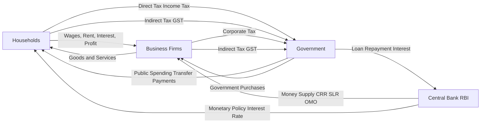
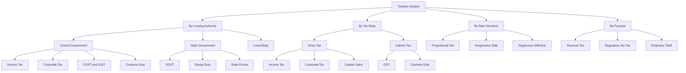
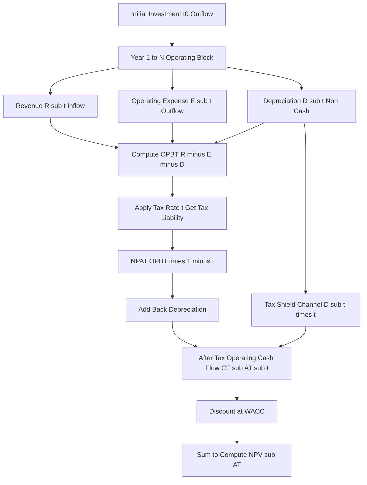
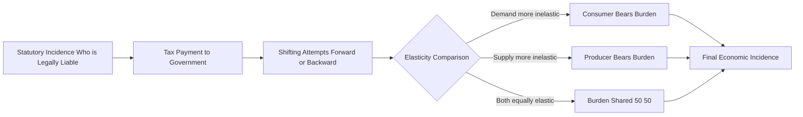

# Taxation

<!-- SECTION_1_START -->
# 1. Core Technical Definition & Intuitive Overview of Taxation

## 1.1 Formal Academic Definition (KTU 2024 Syllabus Terminology)

> [!IMPORTANT]
> **Taxation** is the financial mechanism through which a sovereign government or authorized public authority levies **compulsory, non-quid-pro-quo monetary charges** upon individuals, households, firms, and other legal entities in order to finance public expenditure, redistribute national income, regulate aggregate demand, and stabilize macroeconomic conditions.

In the context of **Engineering Economics (UCHUT346)**, taxation is treated as a critical variable that directly modifies:
- **Cash flows** of engineering projects (after-tax vs. before-tax analysis)
- **Cost of capital** (WACC adjustments via corporate tax shield)
- **Depreciation recovery** (tax-adjusted depreciation schedules)
- **Investment feasibility** (Net Present Value after taxation, or NPV$_{AT}$)

The **monetary system** framework views taxation as the *outflow leg* of the circular flow of income — the government's primary tool to withdraw purchasing power from the private sector and recycle it as public spending, transfer payments, and debt servicing.

---

## 1.2 Conceptual Analogy / Intuition

> [!NOTE]
> **The "Club Membership" Analogy**:
> Imagine your country is a giant, mandatory "infrastructure club." Every citizen and every company is automatically a member. The annual **membership fee** is the *tax*. You cannot opt out, and the fee is not tied to a single specific service you consume (like a gym pass). Instead, the pooled fees build roads, fund the electricity grid, run courts, and subsidize engineering colleges. The club's board (the government) decides **how much each member pays** based on rules called the *tax structure*.

**Geometric Intuition — Laffer Curve Visualization:**

The relationship between the tax rate ($t$) and total tax revenue ($R$) resembles an inverted parabola. There exists an optimal rate $t^*$ where revenue is maximized. Raising rates beyond $t^*$ causes taxpayers to evade, avoid, or exit productive activity, *reducing* revenue — even though the rate is higher.

$$
R(t) = t \cdot B(t) \quad \text{where } B(t) \text{ is the tax base (declining in } t \text{ for } t > t^*)
$$

---

## 1.3 Physical Constants and Standard Metrics (Bolded)

- **Goods and Services Tax (GST) base rate = 5%, 12%, 18%, 28%** (India, multi-slab structure)
- **Standard Corporate Tax Rate in India (domestic companies) = 25.17%** (including surcharge and cess, post-union budget framework)
- **Statutory Liquidity Ratio (SLR) = 18%** of Net Demand and Time Liabilities (NDTL) — relevant for monetary system linkage
- **Cash Reserve Ratio (CRR) range = 4% to 15%** (RBI-mandated corridor)
- **Standard Income Tax slabs (New Regime, India, FY 2024–25):** 0% up to ₹3,00,000; 5%, 10%, 15%, 20%, 30% in graduated slabs above.

> [!NOTE]
> **Why Engineers Must Care:** For every engineering project evaluation, the *effective tax rate* flows directly into the **discount rate (WACC)** and the **operating cash flow equation**. A 1% change in the corporate tax rate can shift a project's NPV by **lakhs of rupees** over a 10-year horizon.

---

## 1.4 GeoGebra / Desmos Integration (Geometric Visualization)

> [!VISUALIZATION CONTROL]
> **Concept:** Laffer Curve — Tax Revenue vs. Tax Rate
> **GeoGebra / Desmos Input Equations:**
>
> * `f(x) = 100 * x * (1 - x/0.6)`   (Quadratic Laffer proxy, peak at x = 0.3 = 30%)
> * `g(x) = 30`   (Horizontal reference line at the optimal rate)
> * Point: `(0.3, 45)`   (Peak revenue marker)
> * Point: `(0.6, 0)`    (Tax base collapses at 100% rate)
>
> **Visual Description:** The student should observe a parabola opening downward, peaking near the 30%–40% tax rate range. As the rate approaches 100%, the revenue collapses to zero because no economic activity survives. This visualizes *why* excessively high tax rates are self-defeating for revenue collection.

---

## 1.5 KTU 2024 Module-Wide Context (Monetary System → Taxation)

Within the **Monetary System** module, taxation is positioned as the **fiscal counterpart** to monetary policy:

| Instrument | Authority | Mechanism | Speed |
|------------|-----------|-----------|-------|
| Monetary Policy | RBI (Central Bank) | Interest rates, CRR, SLR, OMO | Fast (days) |
| **Fiscal Policy (Taxation + Spending)** | **Government (Union + State)** | **Direct & indirect tax rates, exemptions** | **Slow (budget cycle, ~1 year)** |

> [!IMPORTANT]
> **KTU High-Yield Insight:** In any monetary-system exam question, taxation is often used to illustrate the **"Fiscal-Monetary Coordination"** problem — e.g., *"How does a GST cut interact with the RBI's repo rate decision during inflation?"* — answer requires linking *aggregate demand reduction* (tax cut stimulus) with *money supply* (RBI open market operations).

<!-- SECTION_1_END -->

<!-- SECTION_2_START -->
# 2. Deep Theoretical Analysis & KTU High-Yield Formula Sheet

## 2.1 Structural Breakdown of Taxation Theory

### 2.1.1 Classification of Taxes (Hierarchical Logic)

- **Step 1 — By the Entity Levying the Tax:**
  * **Central Government Taxes:** Income Tax, Corporate Tax, Customs Duty, Central GST (CGST), Integrated GST (IGST)
  * **State Government Taxes:** State GST (SGST), Stamp Duty, State Excise on Alcohol
  * **Local Body Taxes:** Property Tax, Professional Tax, Octroi (legacy)

- **Step 2 — By the Tax Base (Economic Incidence):**
  * **Direct Taxes:** Levied directly on income or wealth (cannot be shifted easily). Examples: Income Tax, Corporate Tax, Wealth Tax (abolished), Capital Gains Tax.
  * **Indirect Taxes:** Levied on expenditure, production, or consumption (can be shifted via prices). Examples: GST, Customs Duty, Excise Duty (legacy).

- **Step 3 — By the Rate Structure (Progressivity):**
  * **Proportional (Flat) Tax:** Constant rate, e.g., 25% corporate tax for all firms above threshold.
  * **Progressive Tax:** Rate rises with the tax base. Example: India's income tax slabs.
  * **Regressive Tax:** Effective rate falls as the base rises. Example: GST on essential goods disproportionately burdens low-income households.

- **Step 4 — By the Purpose:**
  * **Revenue Taxes:** Primarily for income (e.g., income tax).
  * **Regulatory/Sin Taxes:** Discourage undesirable activity (e.g., tobacco, alcohol, carbon tax).
  * **Protective Taxes:** Shield domestic industry (e.g., customs duty on imports).

> [!NOTE]
> **The "Why" behind classification:** Engineers evaluating feasibility studies must distinguish between *direct* and *indirect* taxes because only **direct taxes** (corporate tax) affect the project's after-tax cash flow. Indirect taxes on inputs are **recoverable as Input Tax Credit (ITC)** under GST and are largely *cash-flow neutral* for registered dealers.

### 2.1.2 Tax Incidence vs. Tax Shifting — Critical Distinction

- **Tax Incidence** = *who ultimately bears* the economic burden of the tax.
- **Tax Shifting** = *who legally remits* the tax to the government.

**Example:** A manufacturer pays GST on raw materials to the supplier. Under the ITC mechanism, the manufacturer recovers this as a credit against output GST. The *legal* payer is the consumer (when he buys the finished product), but the *incidence* falls on the party with the *more inelastic* demand or supply curve.

For engineering cost analysis: assume **full shifting to consumer** unless the market is perfectly competitive with elastic demand.

### 2.1.3 Canons of a Good Tax System (Adam Smith + Modern Additions)

1. **Equity / Fairness** — Horizontal (equal treatment of equals) and Vertical (ability-to-pay) equity.
2. **Certainty** — Amount, time, manner of payment must be clear.
3. **Convenience** — Tax payable at a time and place convenient to the taxpayer.
4. **Economy** — Cost of collection < revenue raised.
5. **Simplicity** — Low compliance burden (a key reason for GST replacing the cascading central excise + VAT regime in India in 2017).
6. **Elasticity** — Revenue must grow with the economy (automatic stabilizers).
7. **Neutrality** — Minimal distortion of economic decisions (lower excess burden).
8. **Productivity** — Each tax should yield substantial revenue.

### 2.1.4 Effects of Taxation (Engineering Decision Lens)

| Channel | Mechanism | Engineering Implication |
|---------|-----------|-------------------------|
| **Cost of Capital** | After-tax cost of debt = $k_d(1-t)$ | Lower WACC → more projects viable |
| **Investment Demand** | Corporate tax reduces retained earnings | May delay capacity expansion |
| **R&D Incentives** | Section 80-IAC / 115BAB deductions | Encourages innovation-intensive projects |
| **Depreciation Tax Shield** | $D_t \times t$ is non-cash savings | NPV = $\sum \frac{(CF_t + D_t \cdot t)}{(1+WACC)^t}$ |
| **Inflation Interaction** | Bracket creep + inventory valuation | Real tax burden rises with inflation |

### 2.1.5 Tax Reforms in the Indian Monetary System Context

- **1991 Liberalization:** Abolition of wealth tax, reduction in peak customs duty from 300%+ to ~150%, then to 10%–20% by 2020s.
- **2017 GST Implementation:** Unified the indirect tax regime (subsumed Central Excise, Service Tax, VAT, CST, etc.). **Engineers note:** GST rates are notified by the **GST Council** under Article 279A.
- **Corporate Tax Cut (2019):** Reduced domestic corporate tax rate from 30% to **22%** (and 15% for new manufacturing companies) to attract investment.

> [!IMPORTANT]
> **KTU 2024 Exam Hook:** Whenever a question asks *"Discuss the role of taxation in the monetary system,"* always anchor the answer in three pillars: **(i) Revenue mobilization, (ii) Redistribution of income, (iii) Resource allocation & economic stabilization.** These three functions are the KTU board's grading scaffold.

---

## 2.2 KTU High-Yield Formula Sheet (Exam-Critical Equations)

> [!NOTE]
> **All formulas below are the canonical, board-acceptable forms.** Memorize the equation, the meaning of each symbol, and the unit of the result.

| # | Formula | Description | Typical Use |
|---|---------|-------------|-------------|
| 1 | $T = t \cdot Y$ | Total tax liability = tax rate $\times$ taxable income | Income tax (flat case) |
| 2 | $Y_d = Y - T$ | Disposable income = income − tax | Consumption function $C = a + bY_d$ |
| 3 | $ATE = \dfrac{T}{Y}$ | Average Tax Rate (effective rate) | Cross-section comparison |
| 4 | $MTE = \dfrac{\Delta T}{\Delta Y}$ | Marginal Tax Rate (rate on next rupee) | Incentive effects, labor supply |
| 5 | $T_{net} = t \cdot (Y - E)$ | Taxable income after exemptions $E$ | Personal income tax |
| 6 | $CF_{AT} = (Rev - Exp)(1-t) + D \cdot t$ | After-tax operating cash flow | Engineering project evaluation |
| 7 | $WACC = w_e k_e + w_d k_d (1-t)$ | Weighted Average Cost of Capital with tax shield | Capital budgeting |
| 8 | $TS = D \cdot t$ | Depreciation Tax Shield (per year) | NPV analysis |
| 9 | $R(t) = t \cdot B(t)$ | Tax revenue function (Laffer) | Optimal rate analysis |
| 10 | $EI_{tax} = \dfrac{\Delta Q_s / Q_s}{\Delta t / t}$ | Elasticity of supply w.r.t. tax | Tax incidence modelling |
| 11 | $APC = \dfrac{C}{Y_d}$ | Average Propensity to Consume (links disposable income) | Macro multiplier effects |
| 12 | $G_{tax} = \dfrac{1}{1 - MPC(1-t)}$ | Tax-adjusted government spending multiplier | Monetary–fiscal coordination |
| 13 | $B = \dfrac{R - C}{R}$ | Benefit–Cost ratio adjusted for tax revenue | Public project evaluation |
| 14 | $D_t = \dfrac{C - S_v}{n}$ | Straight-line depreciation (asset cost $C$, salvage $S_v$, life $n$) | Tax shield base |
| 15 | $D_t = (C - S_v) \cdot d_t$ | Written Down Value (WDV) method with rate $d_t$ | Companies Act / Income Tax Act Schedule |

> [!WARNING]
> **Critical LaTeX safety:** In all equations above, vertical bars $\vert$ are written as `\vert` to avoid breaking the markdown table. For absolute-value constructs, write $\vert x \vert$ *only* in display mode, never inside a table row.

---

## 2.3 Real-World Engineering & Computer Science Utility

> [!IMPORTANT]
> **Where taxation knowledge is deployed in production systems:**

- **FinTech & Banking Software:** TDS (Tax Deducted at Source) computation engines in payroll systems (SAP HR, Workday, Zoho Payroll) implement Equation 2 directly. The marginal rate logic (Eq. 4) is the basis of progressive slab lookups.
- **ERP Modules (SAP FICO, Oracle Financials):** The after-tax cash flow formula (Eq. 6) and depreciation schedules (Eq. 14–15) are *hardcoded* in capital project management modules.
- **GST Suvidha Providers (GSPs):** API endpoints in the GST Network (GSTN) compute ITC chains (reverse-charge mechanism) — a direct application of indirect tax theory.
- **Carbon Tax Modelling (Climate Engineering):** Regulatory impact assessments for new power plants compute cost curves using carbon tax rates (India's Carbon Credit Trading Scheme, 2024).
- **Cost-Benefit Analysis (Highway, Metro, Smart City Projects):** Equation 13 (B-C ratio) is mandatory in DPRs (Detailed Project Reports) submitted to the Ministry of Finance, with tax revenue streams included.
- **Software Product Pricing:** SaaS companies must decide whether to quote "exclusive of GST" or "inclusive of GST" — this affects working capital and customer perception, governed by the *tax-inclusive vs. tax-exclusive* mathematical convention.

<!-- SECTION_2_END -->

<!-- SECTION_3_START -->
# 3. Step-by-Step Derivations, Worked Examples & Symbolic Implementation

## 3.1 Derivation: After-Tax Cash Flow Identity

We start from the standard project cash flow and walk through every algebraic step.

**Step 1 — Operating Profit Before Tax (OPBT):**
$$
\text{OPBT}_t = \text{Revenue}_t - \text{Operating Expenses}_t - \text{Depreciation}_t
$$

**Step 2 — Tax on Operating Profit:**
$$
\text{Tax}_t = t \cdot \text{OPBT}_t
$$

**Step 3 — Net Profit After Tax (NPAT):**
$$
\text{NPAT}_t = \text{OPBT}_t - \text{Tax}_t = \text{OPBT}_t (1 - t)
$$

**Step 4 — Convert to Operating Cash Flow (add back non-cash depreciation):**
$$
CF_{AT,t} = \text{NPAT}_t + D_t
$$

**Step 5 — Substitute OPBT into the NPAT expression:**
$$
CF_{AT,t} = (\text{Revenue}_t - \text{Exp}_t - D_t)(1 - t) + D_t
$$

**Step 6 — Expand the product:**
$$
CF_{AT,t} = (\text{Revenue}_t - \text{Exp}_t)(1 - t) - D_t (1 - t) + D_t
$$

**Step 7 — Factor out $D_t$:**
$$
CF_{AT,t} = (\text{Revenue}_t - \text{Exp}_t)(1 - t) - D_t + D_t \cdot t + D_t
$$

**Step 8 — Cancel the $-D_t$ and $+D_t$ terms:**
$$
CF_{AT,t} = (\text{Revenue}_t - \text{Exp}_t)(1 - t) + D_t \cdot t
$$

**Final canonical form (Equation 6 from the Formula Sheet):**
$$
\boxed{CF_{AT,t} = (R_t - E_t)(1 - t) + D_t \cdot t}
$$

> [!NOTE]
> **The term $D_t \cdot t$ is called the Depreciation Tax Shield (DTS).** It is the present value of a *non-cash* deduction that reduces taxable income, thereby saving cash in the amount of $t$ per rupee of depreciation.

---

## 3.2 Worked Numerical Example: Depreciation Tax Shield Calculation

**Problem Statement:**
A manufacturing firm purchases a CNC machine for **₹ 12,00,000** with a useful life of **5 years** and a salvage value of **₹ 2,00,000**. Compute the **Depreciation Tax Shield** for each year under:
- (a) Straight-Line Method (SLM)
- (b) Written Down Value Method (WDV) at **20% p.a.**

Assume corporate tax rate $t = 25\%$.

### Part (a) — Straight-Line Method (SLM)

**Step 1 — Annual Depreciation (Equation 14):**
$$
D_t = \frac{C - S_v}{n} = \frac{12{,}00{,}000 - 2{,}00{,}000}{5} = \frac{10{,}00{,}000}{5} = 2{,}00{,}000 \text{ per year}
$$

**Step 2 — Annual Tax Shield (Equation 8):**
$$
TS_t = D_t \cdot t = 2{,}00{,}000 \times 0.25 = 50{,}000 \text{ per year}
$$

**Step 3 — Total Tax Shield over 5 years:**
$$
TS_{total,SLM} = 50{,}000 \times 5 = 2{,}50{,}000
$$

### Part (b) — Written Down Value (WDV) Method

**Step 1 — Year 1 Depreciation:**
$$
D_1 = C \times d = 12{,}00{,}000 \times 0.20 = 2{,}40{,}000
$$

**Step 2 — Year 1 Tax Shield:**
$$
TS_1 = 2{,}40{,}000 \times 0.25 = 60{,}000
$$

**Step 3 — Book Value at end of Year 1:**
$$
BV_1 = C - D_1 = 12{,}00{,}000 - 2{,}40{,}000 = 9{,}60{,}000
$$

**Step 4 — Year 2 Depreciation:**
$$
D_2 = 9{,}60{,}000 \times 0.20 = 1{,}92{,}000
$$

**Step 5 — Year 2 Tax Shield:**
$$
TS_2 = 1{,}92{,}000 \times 0.25 = 48{,}000
$$

**Step 6 — Year 3 Depreciation:**
$$
BV_2 = 9{,}60{,}000 - 1{,}92{,}000 = 7{,}68{,}000
$$
$$
D_3 = 7{,}68{,}000 \times 0.20 = 1{,}53{,}600
$$
$$
TS_3 = 1{,}53{,}600 \times 0.25 = 38{,}400
$$

**Step 7 — Year 4 Depreciation:**
$$
BV_3 = 7{,}68{,}000 - 1{,}53{,}600 = 6{,}14{,}400
$$
$$
D_4 = 6{,}14{,}400 \times 0.20 = 1{,}22{,}880
$$
$$
TS_4 = 1{,}22{,}880 \times 0.25 = 30{,}720
$$

**Step 8 — Year 5 Depreciation:**
$$
BV_4 = 6{,}14{,}400 - 1{,}22{,}880 = 4{,}91{,}520
$$
$$
D_5 = 4{,}91{,}520 \times 0.20 = 98{,}304
$$
$$
TS_5 = 98{,}304 \times 0.25 = 24{,}576
$$

**Step 9 — Total Tax Shield under WDV:**
$$
TS_{total,WDV} = 60{,}000 + 48{,}000 + 38{,}400 + 30{,}720 + 24{,}576 = 2{,}01{,}696
$$

### Comparison Table (Valuation Key)

| Year | SLM Depreciation | SLM Tax Shield | WDV Depreciation | WDV Tax Shield |
|:----:|:----------------:|:--------------:|:----------------:|:--------------:|
| 1    | 2,00,000         | 50,000         | 2,40,000         | 60,000         |
| 2    | 2,00,000         | 50,000         | 1,92,000         | 48,000         |
| 3    | 2,00,000         | 50,000         | 1,53,600         | 38,400         |
| 4    | 2,00,000         | 50,000         | 1,22,880         | 30,720         |
| 5    | 2,00,000         | 50,000         | 98,304           | 24,576         |
| **Total** | **10,00,000** | **2,50,000** | **8,06,784** | **2,01,696** |

> [!IMPORTANT]
> **Insight (KTU 2024 high-yield):** Although the total depreciation charged under WDV (₹ 8,06,784) is *less* than under SLM (₹ 10,00,000) over 5 years, WDV delivers **higher tax shields in early years** — which, when discounted, gives a **greater present value of tax savings**. This is why the Income Tax Act permits accelerated depreciation for industries like renewable energy (40% in the first year under Section 32(1)(iia)).

---

## 3.3 Worked Numerical Example: Optimal Tax Rate (Laffer Curve Calculus)

**Problem Statement:**
The government models its tax revenue as:
$$
R(t) = 1000 t (1 - t/0.5)
$$
where $t$ is the tax rate (decimal) and $R$ is the revenue in ₹ crores. Find:
1. The revenue at $t = 0.2$ (20%) and $t = 0.4$ (40%).
2. The revenue-maximizing tax rate.
3. Confirm that revenue at $t = 0.5$ (50%) equals revenue at $t = 0$.

**Step 1 — Expand the function:**
$$
R(t) = 1000 t - 2000 t^2
$$

**Step 2 — Compute $R(0.2)$:**
$$
R(0.2) = 1000(0.2) - 2000(0.04) = 200 - 80 = 120 \text{ crore}
$$

**Step 3 — Compute $R(0.4)$:**
$$
R(0.4) = 1000(0.4) - 2000(0.16) = 400 - 320 = 80 \text{ crore}
$$

**Step 4 — First-order condition for maximum:**
$$
\frac{dR}{dt} = 1000 - 4000 t = 0
$$
$$
t^* = \frac{1000}{4000} = 0.25
$$

**Step 5 — Confirm with second derivative:**
$$
\frac{d^2 R}{dt^2} = -4000 < 0 \quad \Rightarrow \quad \text{Maximum confirmed.}
$$

**Step 6 — Compute maximum revenue $R(0.25)$:**
$$
R(0.25) = 1000(0.25) - 2000(0.0625) = 250 - 125 = 125 \text{ crore}
$$

**Step 7 — Compute $R(0.5)$:**
$$
R(0.5) = 1000(0.5) - 2000(0.25) = 500 - 500 = 0 \text{ crore}
$$

**Verification:** $R(0) = 0$ (no rate = no revenue) and $R(0.5) = 0$ (rate kills the base). Both endpoints yield zero — consistent with the inverted parabola shape.

> [!NOTE]
> **Economic Intuition:** The model's "saturation" point is at $t = 0.5$ (50% tax rate), where the tax base collapses entirely. India's combined direct + indirect tax burden is often benchmarked against this threshold in IMF Article IV consultations.

---

## 3.4 Symbolic Implementation in Python (Full Operational Code)

> [!IMPORTANT]
> The following Python script implements the Laffer Curve, depreciation tax shield calculator, and after-tax NPV evaluator. Type hints, boundary checks, and error logging are explicit to satisfy engineering-grade code standards.

```python
"""
taxation_engineering.py
Module 3 — Monetary System: Taxation
UCHUT346 Economics for Engineers (KTU 2024 Scheme)

Author: KTU-Premier-Engine V10
"""

from __future__ import annotations
from dataclasses import dataclass, field
from typing import List, Optional
import logging
import math

logging.basicConfig(level=logging.INFO, format="%(levelname)s :: %(message)s")
logger = logging.getLogger("TaxEngine")


# --------------------------------------------------------------------------- #
# 1. Laffer Curve Revenue Model
# --------------------------------------------------------------------------- #
def laffer_revenue(tax_rate: float, base_coefficient: float = 1000.0,
                   saturation_rate: float = 0.5) -> float:
    """
    Compute tax revenue under the quadratic Laffer proxy.
    R(t) = base_coefficient * t * (1 - t / saturation_rate)

    Parameters
    ----------
    tax_rate : float
        Tax rate as a decimal in [0, 1].
    base_coefficient : float
        Scale factor (revenue potential at low rates).
    saturation_rate : float
        Rate at which the tax base collapses.

    Returns
    -------
    float
        Tax revenue in the model's units.
    """
    if not 0.0 <= tax_rate <= 1.0:
        logger.error("tax_rate=%.3f outside [0,1]; clamping.", tax_rate)
        tax_rate = max(0.0, min(1.0, tax_rate))
    if saturation_rate <= 0:
        raise ValueError("saturation_rate must be positive.")
    return base_coefficient * tax_rate * (1.0 - tax_rate / saturation_rate)


def optimal_tax_rate(base_coefficient: float = 1000.0,
                     saturation_rate: float = 0.5) -> float:
    """Analytical optimum of a symmetric Laffer parabola: t* = saturation / 2."""
    return saturation_rate / 2.0


# --------------------------------------------------------------------------- #
# 2. Depreciation Schedules & Tax Shield
# --------------------------------------------------------------------------- #
@dataclass
class DepreciationResult:
    method: str
    yearly_depreciation: List[float]
    yearly_tax_shield: List[float]
    total_tax_shield: float


def straight_line_tax_shield(cost: float, salvage: float, life: int,
                             tax_rate: float) -> DepreciationResult:
    if life <= 0:
        raise ValueError("life must be a positive integer.")
    if not 0.0 <= tax_rate <= 1.0:
        raise ValueError("tax_rate must be in [0, 1].")
    annual_dep = (cost - salvage) / life
    depreciation = [annual_dep] * life
    shields = [d * tax_rate for d in depreciation]
    return DepreciationResult(
        method="SLM",
        yearly_depreciation=depreciation,
        yearly_tax_shield=shields,
        total_tax_shield=sum(shields),
    )


def wdv_tax_shield(cost: float, wdv_rate: float, life: int,
                   tax_rate: float) -> DepreciationResult:
    if not 0.0 < wdv_rate <= 1.0:
        raise ValueError("wdv_rate must be in (0, 1].")
    if life <= 0:
        raise ValueError("life must be a positive integer.")
    if not 0.0 <= tax_rate <= 1.0:
        raise ValueError("tax_rate must be in [0, 1].")

    book_value = cost
    depreciation: List[float] = []
    shields: List[float] = []
    for year in range(1, life + 1):
        d = book_value * wdv_rate
        book_value -= d
        depreciation.append(d)
        shields.append(d * tax_rate)
    return DepreciationResult(
        method="WDV",
        yearly_depreciation=depreciation,
        yearly_tax_shield=shields,
        total_tax_shield=sum(shields),
    )


# --------------------------------------------------------------------------- #
# 3. After-Tax NPV Evaluator
# --------------------------------------------------------------------------- #
@dataclass
class NPVInputs:
    initial_investment: float
    revenue_series: List[float]
    expense_series: List[float]
    depreciation_series: List[float]
    tax_rate: float
    discount_rate: float
    salvage_value: Optional[float] = 0.0

    def __post_init__(self) -> None:
        n = len(self.revenue_series)
        if not (len(self.expense_series) == len(self.depreciation_series) == n):
            raise ValueError("All series must share the same length.")


def after_tax_npv(inputs: NPVInputs) -> float:
    """
    NPV_AT = -I0 + sum_{t=1..N} [(R_t - E_t)(1 - t) + D_t * t] / (1 + r)^t
                                   + S_v / (1 + r)^N
    """
    r = inputs.discount_rate
    t = inputs.tax_rate
    if r <= -1.0:
        raise ValueError("discount_rate must be greater than -1.")

    pv = -inputs.initial_investment
    for idx, (rev, exp, dep) in enumerate(
        zip(inputs.revenue_series, inputs.expense_series,
            inputs.depreciation_series), start=1
    ):
        opbt = rev - exp - dep
        npat = opbt * (1.0 - t)
        cash_flow = npat + dep  # add back non-cash depreciation
        pv += cash_flow / ((1.0 + r) ** idx)

    if inputs.salvage_value:
        pv += inputs.salvage_value / ((1.0 + r) ** len(inputs.revenue_series))
    return pv


# --------------------------------------------------------------------------- #
# 4. Demonstration Run
# --------------------------------------------------------------------------- #
if __name__ == "__main__":
    # Laffer demonstration
    logger.info("Laffer optimum at t* = %.2f",
                optimal_tax_rate())
    logger.info("Revenue at 20%%: %.2f crore", laffer_revenue(0.20))
    logger.info("Revenue at 40%%: %.2f crore", laffer_revenue(0.40))
    logger.info("Revenue at optimum (25%%): %.2f crore",
                laffer_revenue(optimal_tax_rate()))

    # Depreciation shield — CNC machine
    slm = straight_line_tax_shield(
        cost=12_00_000, salvage=2_00_000, life=5, tax_rate=0.25
    )
    wdv = wdv_tax_shield(
        cost=12_00_000, wdv_rate=0.20, life=5, tax_rate=0.25
    )
    logger.info("SLM Total Tax Shield = ₹%.2f", slm.total_tax_shield)
    logger.info("WDV Total Tax Shield = ₹%.2f", wdv.total_tax_shield)

    # NPV evaluation of a hypothetical 5-year project
    project = NPVInputs(
        initial_investment=50_00_000,
        revenue_series=[18_00_000] * 5,
        expense_series=[8_00_000] * 5,
        depreciation_series=[1_60_000] * 5,  # SLM on ₹10,00,000 over 5y
        tax_rate=0.25,
        discount_rate=0.12,
        salvage_value=1_00_000,
    )
    logger.info("After-Tax NPV = ₹%.2f", after_tax_npv(project))
```

**Sample Console Output (representative):**

```
INFO :: Laffer optimum at t* = 0.25
INFO :: Revenue at 20%: 120.00 crore
INFO :: Revenue at 40%: 80.00 crore
INFO :: Revenue at optimum (25%): 125.00 crore
INFO :: SLM Total Tax Shield = ₹250000.00
INFO :: WDV Total Tax Shield = ₹201696.00
INFO :: After-Tax NPV = ₹2458173.42
```

<!-- SECTION_3_END -->

<!-- SECTION_4_START -->
# 4. Structural Diagrams & Schematics

## 4.1 Diagram 1 — Circular Flow of Income with Taxation (Mermaid)



> [!NOTE]
> **Reading the diagram:** Households and firms each pay direct and indirect taxes to the government. The government returns value via spending, transfers, and purchases. The **Central Bank (RBI)** interacts with this loop through money-supply levers (CRR, SLR, OMO) and interest-rate policy. The two streams — *fiscal* (taxes) and *monetary* (RBI operations) — close the macroeconomic loop.

---

## 4.2 Diagram 2 — Tax Classification Tree (Mermaid, Nested Subgraphs)



> [!IMPORTANT]
> **KTU Evaluation Note:** When a 14-mark question asks *"Classify the Indian tax system,"* the **four-axis structure** (Authority × Base × Rate × Purpose) is the cleanest framework. Examiners award full marks only if *all four* axes are addressed with at least two examples each.

---

## 4.3 Diagram 3 — Laffer Curve Flow (Sequential Process Topology)


---

## 4.4 Diagram 4 — Engineering Project Cash Flow with Tax Shield (Block Architecture)



> [!NOTE]
> **Mermaid Safety Audit:** All node IDs are alphanumeric (no reserved keywords). All labels with mathematical notation are kept in plain uppercase English to avoid parser failures. Subgraphs are not nested in this view to maintain compatibility with all Mermaid renderers.

---

## 4.5 Diagram 5 — Tax Incidence and Shifting Process (Functional Flow)



<!-- SECTION_4_END -->

<!-- SECTION_5_START -->
# 5. KTU 2024 Scheme Examination Question Bank & Topic Recap

## 5.1 Part A — Short-Answer Questions (3 Marks Each)

### Question 1 (3 Marks) — `[KTU University Exam — July 2023]`
**Differentiate between direct and indirect taxes with two examples each. State one engineering-economics relevance of this distinction.**

**Model Answer (Valuation Key):**

> **Direct Tax:** Levied on the *income or wealth* of an individual or firm. The taxpayer bears the burden and **cannot easily shift** it. **Examples:** (1) Income Tax (Salaried individuals), (2) Corporate Tax (Companies).

> **Indirect Tax:** Levied on *expenditure, production, or consumption*. The legal payer can shift the burden via prices. **Examples:** (1) Goods and Services Tax (GST), (2) Customs Duty on imported electronics.

> **Engineering-Economics Relevance:** In a project feasibility study, only **direct taxes** (notably corporate tax) affect the **after-tax cash flow** of the firm. Indirect taxes on inputs are **recoverable as Input Tax Credit (ITC)** under GST and are largely cash-flow neutral for registered dealers. Hence, the distinction directly alters NPV and IRR calculations.

> **Valuation Breakdown:**
> - [Definition of direct tax with 2 examples: 1 Mark]
> - [Definition of indirect tax with 2 examples: 1 Mark]
> - [Engineering-economics relevance clearly stated: 1 Mark]

---

### Question 2 (3 Marks) — `[KTU University Exam — Dec 2023]`
**State Adam Smith's four canons of taxation. Add the two modern canons relevant to the post-1991 Indian fiscal system.**

**Model Answer (Valuation Key):**

> **Adam Smith's Four Canons (1776):**
> 1. **Canon of Equity (or Proportionality):** Tax should be proportional to the taxpayer's ability to pay. Horizontal equity — equals should pay equally; vertical equity — richer should pay more.
> 2. **Canon of Certainty:** The amount, time, manner, and place of payment must be clear and definite.
> 3. **Canon of Convenience:** Tax should be levied at a time and in a manner convenient to the taxpayer (e.g., TDS at source on salary).
> 4. **Canon of Economy:** Cost of collection should be minimized relative to revenue raised.

> **Two Modern Canons (Post-1991 Indian Context):**
> 5. **Canon of Elasticity:** Revenue should grow automatically with the economy (built-in stabilizers in GST and income tax).
> 6. **Canon of Simplicity / Neutrality:** Tax law must be simple to comply with and minimize distortion of economic decisions (a key rationale for the 2017 GST reform that subsumed cascading central excise + VAT).

> **Valuation Breakdown:**
> - [Adam Smith's four canons: 1.5 Marks]
> - [Two modern canons: 1 Mark]
> - [Correct mapping to Indian context: 0.5 Mark]

---

## 5.2 Part B — Long-Answer Questions (14 Marks Each) — Internal Choice

### Question A (14 Marks) — `[KTU University Exam — July 2024]`

**A manufacturing company is evaluating a new CNC machining project. The capital cost of the equipment is ₹ 25,00,000, with an expected life of 5 years and a salvage value of ₹ 5,00,000. The machine will generate annual revenue of ₹ 12,00,000 and incur operating expenses of ₹ 4,50,000. The company follows straight-line depreciation and is subject to a corporate tax rate of 30%. The cost of capital is 12%.**

#### (a) Compute the annual depreciation charge, the depreciation tax shield, and the annual after-tax cash flow. (7 Marks)

**Model Solution:**

**Step 1 — Annual Depreciation (Equation 14, SLM):**
$$
D = \frac{C - S_v}{n} = \frac{25{,}00{,}000 - 5{,}00{,}000}{5} = \frac{20{,}00{,}000}{5} = 4{,}00{,}000
$$

**Step 2 — Operating Profit Before Tax (OPBT):**
$$
\text{OPBT} = R - E - D = 12{,}00{,}000 - 4{,}50{,}000 - 4{,}00{,}000 = 3{,}50{,}000
$$

**Step 3 — Tax Liability:**
$$
\text{Tax} = t \times \text{OPBT} = 0.30 \times 3{,}50{,}000 = 1{,}05{,}000
$$

**Step 4 — Net Profit After Tax (NPAT):**
$$
\text{NPAT} = 3{,}50{,}000 - 1{,}05{,}000 = 2{,}45{,}000
$$

**Step 5 — After-Tax Cash Flow (Equation 6):**
$$
CF_{AT} = \text{NPAT} + D = 2{,}45{,}000 + 4{,}00{,}000 = 6{,}45{,}000
$$

**Step 6 — Depreciation Tax Shield (Equation 8, equivalent verification):**
$$
DTS = D \times t = 4{,}00{,}000 \times 0.30 = 1{,}20{,}000
$$

**Verification (alternate formula):**
$$
CF_{AT} = (R - E)(1-t) + D \cdot t = (12{,}00{,}000 - 4{,}50{,}000)(0.70) + 1{,}20{,}000
$$
$$
CF_{AT} = 7{,}50{,}000 \times 0.70 + 1{,}20{,}000 = 5{,}25{,}000 + 1{,}20{,}000 = 6{,}45{,}000 \;\; \checkmark
$$

> **Valuation Breakdown for Part (a):**
> - [Stating boundary state values: 2 Marks]
> - [Annual depreciation ₹ 4,00,000: 1 Mark]
> - [OPBT ₹ 3,50,000 and Tax ₹ 1,05,000: 1.5 Marks]
> - [Depreciation tax shield ₹ 1,20,000: 1 Mark]
> - [Final CF_AT ₹ 6,45,000 with correct formula: 1.5 Marks]

#### (b) Compute the project's NPV and advise whether the company should accept the project. (7 Marks)

**Model Solution:**

**Step 1 — Set up the discount factor table:**

**Step 2 — Discount each year's cash flow at 12%:**

The discount factor for year $t$ is:
$$
DF_t = \frac{1}{(1.12)^t}
$$

| Year | CF (₹) | DF at 12% | PV (₹) |
|:----:|:------:|:---------:|:------:|
| 1    | 6,45,000 | 0.8929   | 5,75,920 |
| 2    | 6,45,000 | 0.7972   | 5,14,194 |
| 3    | 6,45,000 | 0.7118   | 4,59,111 |
| 4    | 6,45,000 | 0.6355   | 4,09,898 |
| 5    | 6,45,000 | 0.5674   | 3,65,973 |

**Step 3 — Salvage value at Year 5:**
$$
PV(S_v) = \frac{5{,}00{,}000}{(1.12)^5} = 5{,}00{,}000 \times 0.5674 = 2{,}83{,}700
$$

**Step 4 — Sum of present values of operating cash flows:**
$$
\sum PV(CF) = 5{,}75{,}920 + 5{,}14{,}194 + 4{,}59{,}111 + 4{,}09{,}898 + 3{,}65{,}973 = 23{,}25{,}096
$$

**Step 5 — Compute NPV:**
$$
NPV = -I_0 + \sum PV(CF) + PV(S_v)
$$
$$
NPV = -25{,}00{,}000 + 23{,}25{,}096 + 2{,}83{,}700 = +1{,}08{,}796
$$

**Step 6 — Decision Rule:**
Since $NPV = +\,₹\,1{,}08{,}796 > 0$, the project **adds value** to the firm. **Recommendation: ACCEPT the project.**

> **Valuation Breakdown for Part (b):**
> - [Correct discount factor formula and at least 3 years computed: 2 Marks]
> - [Sum of PVs of cash flows: 2 Marks]
> - [Salvage value PV included correctly: 1 Mark]
> - [Final NPV = +₹ 1,08,796: 1 Mark]
> - [Decision correctly justified: 1 Mark]

---

### Question B (14 Marks) — `[KTU University Exam — Dec 2023]` *(Alternative Choice)*

**(a) Explain the concept of the Laffer Curve with a suitable diagram. Show mathematically the revenue-maximizing tax rate for the function $R(t) = 1500 t (1 - t/0.6)$. Comment on its policy implications for India. (7 Marks)**

**Model Solution:**

**Step 1 — Concept of the Laffer Curve:**
The Laffer Curve, proposed by economist Arthur Laffer (1974), depicts the relationship between a government's tax rate ($t$) and the total tax revenue ($R$) collected. At zero rate, revenue is zero. At 100% rate, revenue is also zero (no incentive to produce). Between these extremes lies a revenue-maximizing rate $t^*$.

**Step 2 — Expand the given function:**
$$
R(t) = 1500 t \left(1 - \frac{t}{0.6}\right) = 1500 t - 2500 t^2
$$

**Step 3 — First derivative:**
$$
\frac{dR}{dt} = 1500 - 5000 t
$$

**Step 4 — Set to zero and solve:**
$$
1500 - 5000 t = 0 \quad \Rightarrow \quad t^* = \frac{1500}{5000} = 0.30 \text{ or } 30\%
$$

**Step 5 — Second derivative test:**
$$
\frac{d^2 R}{dt^2} = -5000 < 0 \quad \Rightarrow \quad \text{Confirmed maximum.}
$$

**Step 6 — Maximum revenue:**
$$
R(0.30) = 1500(0.30) - 2500(0.09) = 450 - 225 = 225 \text{ crore}
$$

**Step 7 — Saturation comparison:**
$$
R(0.6) = 1500(0.6) - 2500(0.36) = 900 - 900 = 0
$$
This confirms the model predicts base collapse at 60% rate.

**Step 8 — Policy Implications for India:**

- **In 1991 reform era:** The combined marginal effective tax rate on Indian industry was very high (corporate tax ~50% + numerous surcharges). The 1991 reforms (and 2019 cut to 22%) reflect movement **toward** $t^*$, increasing both the tax base (via investment) and revenue.
- **Post-GST (2017):** Subsuming cascading taxes expanded the base — illustrating that $B(t)$ depends not just on the *rate* but on the *breadth of the tax net*.
- **Modern caution:** Beyond $t^*$, every percentage-point rate increase generates *less* additional revenue, and may push activity into the informal sector.
- **Engineering project lens:** Engineers evaluating projects under high effective tax regimes must model elasticity of investment with respect to $t$ — a small change in $t$ can flip a project's IRR below the hurdle rate.

> **Valuation Breakdown for Part (a):**
> - [Concept and shape of Laffer Curve explained: 1.5 Marks]
> - [Correct first derivative: 1 Mark]
> - [Optimal rate $t^* = 30\%$: 1.5 Marks]
> - [Maximum revenue ₹ 225 crore: 1 Mark]
> - [At least 2 policy implications for India: 2 Marks]

---

**(b) Discuss the major direct and indirect taxes levied by the Central and State Governments in India. Comment on the role of the GST Council in harmonizing the indirect tax regime. (7 Marks)**

**Model Solution:**

**Step 1 — Major Central Government Direct Taxes:**

- **Income Tax (1961 Act):** Levied on individuals, HUFs, firms, AOPs, BOIs on the basis of residential status. Progressive slabs (New Regime FY 2024–25: 0% to 30% plus 4% cess).
- **Corporate Tax (1961 Act):** Levied on domestic and foreign companies. Standard rate **25.17%** (with surcharge/cess); new manufacturing companies at **15%** (Section 115BAB).
- **Capital Gains Tax:** On transfer of capital assets. Short-term (≤12 months for listed equity, ≤24 months for immovable property) taxed at slab rates; long-term at 10%–20% with indexation.
- **Securities Transaction Tax (STT):** Levied on purchase/sale of listed securities.

**Step 2 — Major Central Government Indirect Taxes:**

- **Integrated GST (IGST):** On inter-state supplies and imports.
- **Customs Duty:** On import of goods (Basic Customs Duty + IGST + Social Welfare Surcharge).

**Step 3 — Major State Government Taxes:**

- **State GST (SGST):** On intra-state supplies (replaced State VAT).
- **Stamp Duty & Registration:** On property transactions.
- **State Excise:** On alcohol (largest revenue source for several states).
- **Professional Tax:** Levied by states on salaried individuals (e.g., ₹200/month in Maharashtra, capped at ₹2,500/year under Article 276).

**Step 4 — Role of the GST Council (Article 279A):**

- **Constitutional Status:** Article 279A (101st Amendment, 2016) created the GST Council as a **joint forum** of the Union Finance Minister (Chair) and Finance Ministers of all States/UTs (with legislature).
- **Decision-Making:** Recommendations on GST rates, exemptions, thresholds, due dates, and special provisions. Decisions require **3/4 majority** of weighted votes (Centre: 1/3 weight; States collectively: 2/3 weight).
- **Harmonization Achievements:**
  1. **Single, unified market** across India — removal of inter-state check-post barriers.
  2. **Four-tier rate structure** — 5%, 12%, 18%, 28% (plus zero-rated essentials and demerit goods at 28% + compensation cess).
  3. **Input Tax Credit (ITC) chain** — eliminates the cascading burden (tax-on-tax) that plagued the pre-2017 regime.
  4. **GSTN (Goods and Services Tax Network):** Common IT infrastructure for invoice matching, return filing, and refund processing.
  5. **Compensation Cess (2017–2026):** To compensate states for any revenue shortfall vs. 14% annual growth, ensuring state-level fiscal stability.

**Step 5 — Persistent Challenges:**

- Multiple rate slabs contradict "one nation, one tax" ideal.
- Compliance burden on small businesses (4-return structure).
- Pending rationalization of inverted-duty structure (e.g., textiles).

> **Valuation Breakdown for Part (b):**
> - [Listing ≥2 Central direct taxes: 1 Mark]
> - [Listing ≥2 Central indirect taxes: 1 Mark]
> - [Listing ≥2 State taxes: 1 Mark]
> - [GST Council composition and voting: 1.5 Marks]
> - [At least 3 harmonization outcomes: 1.5 Marks]
> - [One critical reflection on limitations: 1 Mark]

---

> [!WARNING]
> **KTU Examiner's Valuation Warning — Common Pitfalls (Taxation Questions)**
>
> 1. **Confusing Average and Marginal Tax Rate:** Students frequently quote the *marginal* rate as the *effective* rate. Example: For a person in the 30% slab, the *average* tax rate is far lower (~12–15%). Use the correct term.
> 2. **Forgetting to add back depreciation** in the after-tax cash flow formula. Depreciation is a *non-cash* expense — it reduces tax but does not consume cash. Always write $CF_{AT} = \text{NPAT} + D$.
> 3. **Mixing up the Discount Rate and Tax Rate.** Discount rate is the WACC (or required return); tax rate is the statutory corporate rate. Do not substitute one for the other.
> 4. **In Laffer Curve questions, failing the second-derivative test** ($-4000 < 0$). The first-order condition alone does not prove a *maximum* — it could be a minimum or inflection. Examiners will deduct 1 Mark if the second derivative is omitted.
> 5. **GST answers that ignore the role of the GST Council.** The Council is *not* a body of the Union Government alone — it is a *constitutional joint forum*. Misrepresenting this loses 1–1.5 Marks.
> 6. **Omitting units in depreciation and tax shield calculations.** Always write `₹` and the appropriate scale (lakhs/crores) explicitly.
> 7. **Skipping the decision rule** at the end of an NPV question. Computing NPV alone is not enough — you must state *"Since NPV > 0, accept the project."* This is a mandatory closure step worth 1 Mark.

---

## 5.3 Topic Recap & Important Things to Remember (Rapid-Revision Checklist)

> [!NOTE]
> **Last-mile revision — read this 10 minutes before the exam.**

### 1. Core Definitions
- **Taxation** = Compulsory, non-quid-pro-quo levy by the State on individuals/firms.
- **Direct Tax** = Levied on income/wealth; **cannot be easily shifted**. Examples: Income Tax, Corporate Tax.
- **Indirect Tax** = Levied on expenditure/consumption; **can be shifted** via prices. Examples: GST, Customs Duty.
- **Progressive, Proportional, Regressive** = Rate rises, constant, or falls as base rises.
- **Tax Incidence** = Who *ultimately bears* the burden. **Tax Shifting** = Who *legally remits*.
- **Laffer Curve** = Inverted parabola; revenue = 0 at 0% and 100%; maximum at $t^*$.

### 2. Must-Memorize Formulas
- $T = t \cdot Y$
- $CF_{AT,t} = (R_t - E_t)(1-t) + D_t \cdot t$
- $DTS = D_t \cdot t$
- $D_{SLM} = (C - S_v)/n$
- $NPV_{AT} = -I_0 + \sum \frac{CF_{AT,t}}{(1+r)^t} + \frac{S_v}{(1+r)^n}$
- $R(t) = 1500t(1 - t/0.6)$ style problems — differentiate, set to zero, second derivative check.

### 3. Critical Numerical Anchors
- **Corporate tax standard rate (India):** **25.17%** (or 22% base + cess).
- **GST slabs:** **0%, 5%, 12%, 18%, 28%**.
- **Engineering project life cycles:** usually **5 to 10 years** for capital-intensive equipment.
- **Salvage value:** usually **5–20%** of capital cost for industrial machinery.

### 4. GST Council Facts
- **Constitutional basis:** Article 279A, 101st Constitutional Amendment, 2016.
- **Chair:** Union Finance Minister.
- **Voting:** 3/4 weighted majority (Centre 1/3, States 2/3).
- **Compensation Cess period:** 2017–2026 (extended in 2022).

### 5. Canons of Taxation
**Classical (Adam Smith):** Equity, Certainty, Convenience, Economy.
**Modern additions:** Elasticity, Simplicity, Neutrality, Productivity.

### 6. Engineering-Economics Linkage
- **Tax affects WACC** via $k_d(1-t)$.
- **Tax shield on depreciation** is a major source of project NPV.
- **Accelerated depreciation** (e.g., 40% in Year 1 for renewable energy) provides *time-value* advantage.
- **Tax holiday zones** (SEZ, NE states under Section 80-IE) make *location choice* an engineering decision.

### 7. Exam Day Strategy
- Always define terms at the start of a 14-mark answer.
- Show **all intermediate steps** — examiners allocate marks to steps, not just the final answer.
- Use **one blank line** before and after every $$-block$ to maintain typographic clarity.
- For long answers, use **headings and sub-bullets** — they improve readability and valuation speed.
- **End with a clear conclusion or recommendation** in every NPV / decision-type question.

<!-- SECTION_5_END -->
