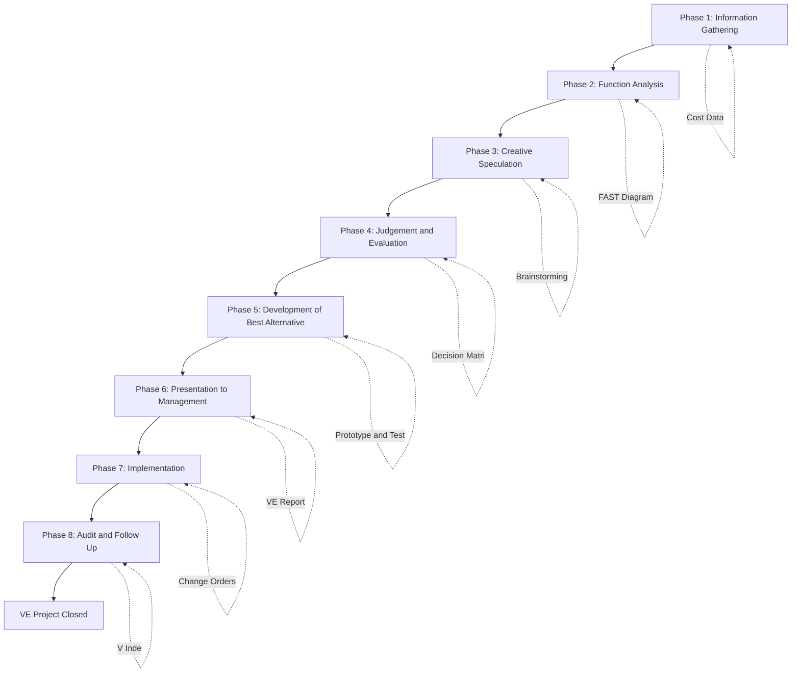
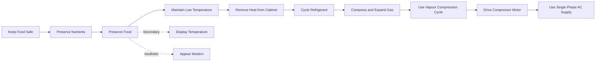
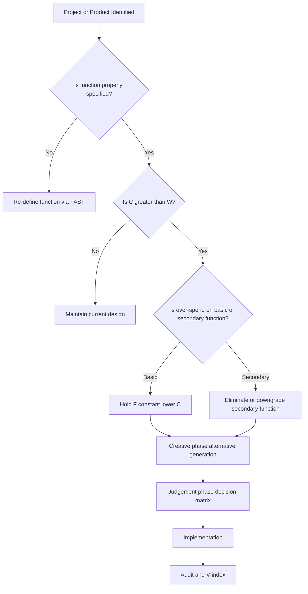
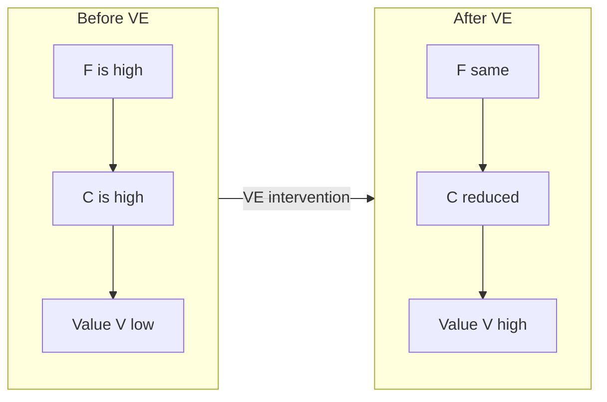

# Aims, Advantages and Application areas of Value Engineering

<!-- SECTION_1_START -->
# Value Engineering (VE) — Aims, Advantages & Application Areas

## 1.1 Formal Definition (KTU 2024 Scheme Terminology)

> [!IMPORTANT]
> **Value Engineering (VE)** is a **systematic, function-oriented, team-based methodology** that seeks to deliver the **required function of an item, system, or service** at the **lowest total cost (life-cycle cost)** while maintaining or improving **quality, reliability, performance, and safety standards**.

> [!NOTE]
> **Value Analysis (VA)** is the *post-design* application of the same VE philosophy — performed on **existing products or processes** to reduce cost without compromising function. The term **Value Engineering** is generally reserved for *new product / new project* applications, although the techniques are functionally identical. In KTU parlance, both are often clubbed under the umbrella term **VA/VE**.

### Key Lexical Anchors

- **Value (V)** = $\dfrac{\text{Function (F)}}{\text{Cost (C)}}$  — the foundational identity of the discipline.
- **Function (F)** = the *specific work* that a design, component, or service is intended to perform (e.g., *transmit torque*, *insulate heat*, *support load*).
- **Worth (W)** = the *minimum cost* required to provide that function reliably.
- **Cost (C)** = the *actual expenditure* incurred in providing the function.

> [!NOTE]
> **Value Engineering vs. Cost Cutting — A Critical Distinction**
> Cost cutting is a *reactive, across-the-board* reduction in expenditure that often degrades function. Value Engineering is a *proactive, function-driven* approach that **re-engineers the way a function is delivered**, frequently *lowering cost while improving function*. This distinction is a **favourite 3-mark KTU question**.

---

## 1.2 Intuitive Real-World Analogy

> [!TIP]
> **Analogy — The “Tiffin Box” Problem 🍱**
> Imagine a student carries lunch in a heavy, ornate brass tiffin box worth ₹2,500. Its *function* is *to carry 1 kg of food safely for 4 hours*. A cheaper stainless-steel lunchbox worth ₹350 performs the **identical function** with equal reliability. The brass box had *high cost but no extra worth*. A Value Engineer would say: *"The cost is justified only by the function delivered — not by the aesthetic add-on. Re-specify the function, then re-engineer the solution."* The brass box carried *unnecessary* functions (decoration, prestige) that the user did not **need**.

**Geometric / Algebraic Intuition of the Value Equation:**

$$
V \;=\; \dfrac{F}{C}
$$

The discipline of VE operates on three levers:

1. **Hold F constant, lower C** $\Rightarrow$ $V \uparrow$ (classical cost reduction).
2. **Hold C constant, raise F** $\Rightarrow$ $V \uparrow$ (quality / reliability uplift at no extra cost).
3. **Raise F and lower C simultaneously** $\Rightarrow$ $V \uparrow \uparrow$ (the *true* VE ideal — the *Gold Standard*).

> [!IMPORTANT]
> The **third lever** is what separates a *true* Value Engineer from a *cost cutter*. KTU examiners routinely test this conceptual clarity.

---

## 1.3 Visualisation Block (Concept Geometry of Value)

> [!VISUALIZATION CONTROL]
> **Concept:** Three-axis map of *Cost*, *Function*, and *Value* (KTU illustrative graph).
> **GeoGebra / Desmos Input Equations:**
> * $f(x) = 5x \quad$ (linear function-cost baseline)
> * $g(x) = 8x - 2 \quad$ (over-engineered product)
> * $h(x) = 3x + 1 \quad$ (under-engineered product)
> **Visual Description:** On the x-axis plot **Cost (₹)** and on the y-axis plot **Function (utility index, 0–10)**. The line $f(x)$ represents the *ideal* function-per-rupee frontier. The line $g(x)$ lies *above* the frontier (over-spec, paying for non-value-added function). The line $h(x)$ lies *below* (under-spec, function compromised). The Value Engineer's job is to slide any point back *onto* the frontier $f(x)$, then push the frontier itself upwards through innovation.

---

## 1.4 Historical & Institutional Context (Syllabus Highlight)

> [!NOTE]
> **Origin:** Value Engineering was conceived by **Lawrence D. Miles** at **General Electric (GE), USA, in 1947**, during World War II material shortages. Miles observed that substituting scarce materials with *functionally equivalent* alternatives (e.g., plastic for metal) often *improved* performance and *lowered* cost simultaneously. This observation birthed the discipline. The **Society of American Value Engineers (SAVE International)** was founded in 1959, which certifies practitioners worldwide as **Certified Value Specialists (CVS)**.

This historical anchor is a **favourite KTU Part A (3-mark)** question.
<!-- SECTION_1_END -->

<!-- SECTION_2_START -->
# Deep Theoretical Analysis — Aims, Advantages & Applications of VE

## 2.1 The **Aims** of Value Engineering (KTU Board-Favourite Topic)

The aims are best understood as a hierarchy — from the *primary* economic aim down to the *tertiary* social and strategic aims. The KTU 2024 scheme expects students to enumerate **at least six aims** in descriptive answers.

### 2.1.1 Primary Aims

| # | Aim | Operational Meaning |
|---|-----|---------------------|
| A1 | **Provide the required function at lowest total cost (life-cycle cost)** | Not just *purchase* cost, but cost of *ownership* over the product's life — procurement, operation, maintenance, disposal. |
| A2 | **Achieve essential function without compromise to quality, reliability, or safety** | VE never reduces function below the *performance specification* mandated by the user. |
| A3 | **Eliminate unnecessary / superfluous cost** | Specifically target *non-value-added* expenditure (ornamentation, over-spec materials, redundant features). |

### 2.1.2 Secondary Aims

| # | Aim | Operational Meaning |
|---|-----|---------------------|
| A4 | **Improve quality and design** | Refine geometry, tolerances, materials to better fulfil the *use function*. |
| A5 | **Reduce product / project development time** | Concurrent VE workshops often compress the design cycle. |
| A6 | **Optimise total life-cycle cost** | Shift the cost curve *leftward and downward* across acquisition + operation + disposal. |

### 2.1.3 Tertiary Aims

| # | Aim | Operational Meaning |
|---|-----|---------------------|
| A7 | **Promote interdisciplinary team working** | VE is a *team sport* — design, production, procurement, quality, finance collaborate. |
| A8 | **Stimulate innovation and creativity** | The function-analysis phase forces *out-of-the-box* alternative generation. |
| A9 | **Enhance customer satisfaction** | Customer receives *worth-for-money*, improving brand equity. |
| A10 | **Conserve scarce national resources** | Lower material and energy consumption → sustainable engineering. |
| A11 | **Standardise and rationalise components** | Commonisation across product families reduces inventory. |

> [!NOTE]
> KTU examiners often ask: *"List the aims of VE."* A strong answer enumerates **A1 through A6** (the universally accepted core). Mentioning **A7–A11** earns *extra credit* and demonstrates the *Apply* cognitive level expected in Part B.

---

## 2.2 The **Advantages** of Value Engineering

> [!IMPORTANT]
> In KTU answers, advantages must be **classified** into categories — e.g., *Cost advantages*, *Quality advantages*, *Strategic advantages*, *Social advantages*. Marks are awarded for *structured presentation*.

### 2.2.1 Tabular Master-Sheet of Advantages

| Category | S. No. | Specific Advantage | Mechanism of Realisation |
|----------|--------|--------------------|--------------------------|
| **Economic / Cost** | 1 | Reduction in *manufacturing cost* | Substitute cheaper materials, simpler processes. |
| | 2 | Reduction in *life-cycle cost* | Lower maintenance, energy, disposal cost. |
| | 3 | Reduction in *procurement cost* | Vendor rationalisation, commonisation. |
| | 4 | Lower *inventory carrying cost* | Standardised parts → fewer SKUs. |
| **Quality / Performance** | 5 | Improved *reliability* and *durability* | Function analysis removes weak points. |
| | 6 | Improved *product performance* | Re-engineering to better fulfil use function. |
| | 7 | Higher *customer satisfaction* | Right product, right price, right quality. |
| | 8 | Reduced *warranty & after-sales cost* | Better design → fewer field failures. |
| **Strategic / Organisational** | 9 | Faster *time-to-market* | Parallel VE workshops compress design phase. |
| | 10 | Higher *profit margins* | Lower cost + maintained price = wider margin. |
| | 11 | Better *inter-departmental coordination* | VE team dissolves functional silos. |
| | 12 | Increased *competitive advantage* | Lower cost + equivalent quality = pricing power. |
| **Social / Environmental** | 13 | Conservation of *natural resources* | Lower material consumption. |
| | 14 | Lower *energy footprint* | Optimised processes. |
| | 15 | Improved *worker safety* | Ergonomic and safer design choices. |

---

## 2.3 The **Application Areas** of Value Engineering

> [!NOTE]
> VE is **domain-agnostic** — any engineered system that has a *function* and a *cost* is a candidate. KTU examiners often test this breadth by asking *"State any four application areas of VE."*

### 2.3.1 Major Application Sectors (Engineering-Anchored)

| Sector | Specific Use Case | Typical VE Outcome |
|--------|-------------------|--------------------|
| **Construction & Civil Engineering** | Bridges, buildings, highways, water-treatment plants | Alternative materials (e.g., fly-ash bricks), modular construction, optimised foundation design — 10–25% cost savings reported. |
| **Manufacturing & Mechanical** | Machine tools, automotive components, pumps, valves | Commonisation of parts, substitution of forging by casting, design simplification. |
| **Electrical & Electronics** | Transformers, switchgear, consumer electronics, PCB design | Standardised components, energy-efficient designs. |
| **Software & IT Systems** | ERP modules, custom enterprise software | Eliminate redundant features, reuse libraries, optimise architecture. |
| **Process / Chemical Engineering** | Piping layouts, heat exchangers, refineries | Optimised P\&ID, energy integration (pinch analysis parallels VE). |
| **Aerospace & Defence** | Aircraft subsystems, military vehicles | Weight reduction, life-cycle cost of maintenance. |
| **Healthcare & Hospital Administration** | Operating-theatre workflow, equipment procurement | Faster turnaround, lower consumable cost. |
| **Public Sector / Government** | Tender specifications, public-works contracts | Eliminates gold-plating, ensures tax-payer value. |
| **Banking & Services** | Process re-engineering, document workflows | Lean + VE hybrid approaches. |
| **Agriculture & Irrigation** | Drip-irrigation networks, farm machinery | Optimal use of scarce water and energy. |

### 2.3.2 Phases of a Project Where VE is Applied

| Project Phase | VE Role | Typical Saving |
|---------------|---------|----------------|
| **Conceptual / Feasibility** | High influence — sets the *function specification* | Up to **30–40%** of total cost can be locked in / saved here. |
| **Design / Engineering** | High influence — re-engineering alternatives | **15–25%** savings. |
| **Procurement / Vendor Selection** | Medium — value-based sourcing | **5–10%** savings. |
| **Construction / Production** | Lower — change orders are expensive | **3–8%** savings. |
| **Operation & Maintenance** | VA territory — retrofits | **5–15%** of O\&M cost. |

> [!WARNING]
> A classic KTU mistake is to claim VE yields the *same* saving in *every* phase. The **earlier** VE is applied, the *higher* the leverage — a concept derived from **Pareto's principle (80/20 rule)** applied to design influence. The 30/15/8% figures above are *approximate* but convey the correct *monotonic decay*.

---

## 2.4 KTU High-Yield Formula / Definition Sheet (Quick-Recall Table)

| Symbol / Term | Definition / Formula | Unit / Note |
|---------------|----------------------|-------------|
| $V$ | Value of a product / system | Dimensionless index |
| $F$ | Required function (use + aesthetic) | Often expressed in *utility units* |
| $C$ | Cost of providing the function | ₹ / USD / ₹-lakh |
| $W$ | Worth = *minimum* cost to provide $F$ | ₹ |
| $V = F/C$ | The Value Equation | $V \uparrow \Rightarrow$ better value |
| $C_{LCC}$ | Life-Cycle Cost = $C_{\text{acquisition}} + C_{\text{operation}} + C_{\text{maintenance}} + C_{\text{disposal}}$ | ₹-lakh over project life |
| $V_{index} = \dfrac{V_{\text{after}}}{V_{\text{before}}} \times 100\,\%$ | VE Improvement Index | $\%$, used in project reports |
| Cost-to-Worth Ratio | $\dfrac{C}{W}$ | $= 1$ ideal; $> 1$ over-spending; $< 1$ impossible for long |

> [!IMPORTANT]
> The **Cost-to-Worth Ratio ($C/W$)** is a *diagnostic metric* in VE — a value of **1.0** indicates *perfect* alignment; values **> 1.0** indicate *over-spending* on the function and trigger the VE intervention. KTU 14-mark questions often require the calculation of $V$ and $C/W$ for before- and after-VE scenarios.

---

## 2.5 Real-World Engineering Utility of VE

> [!TIP]
> **Industry Adoption Snapshot**
> * **Boeing** applies VE to every commercial aircraft programme — the 787 Dreamliner reportedly saved *billions of USD* through composite-substitution VE workshops.
> * **Tata Motors** runs VE cells in its Pune plant for the Nexon / Tiago platforms.
> * **Indian Railways** mandates a *VE audit* on every project above **₹ 100 crore** (per the Ministry of Finance's *Manual for Productivity & Quality*, and reinforced by the **Public Procurement Policy**).
> * **ISRO** uses VE on launch-vehicle subsystems to optimise mass-to-orbit.
> * **Bureau of Indian Standards (BIS)** and **National Productivity Council (NPC)** actively promote VE training under the *Zero Defect Zero Effect* (ZED) framework.

This breadth is *exactly* what KTU examiners look for in 14-mark descriptive answers — the ability to *link* theory to *Indian industrial reality*.
<!-- SECTION_2_END -->

<!-- SECTION_3_START -->
# Step-by-Step Derivation, Worked Examples & Implementation Logic

## 3.1 The Value Engineering **Job Plan** (The 8-Phase Standard Sequence)

> [!IMPORTANT]
> The **VE Job Plan** is the *spine* of the discipline. KTU Part B questions frequently ask students to *"Explain the phases of the VE job plan."* A rigorous answer earns full marks only if **all eight phases** are explained with one-line *operational verbs* per phase. The 5-phase *workshop* format and the 8-phase *project* format are both accepted by KTU.

### 3.1.1 Eight-Phase Job Plan (SAVE International Standard)

| Phase | Name | Core Question | Typical Tools |
|-------|------|---------------|---------------|
| 1 | **Information Phase** | *What is the item? What does it do? What does it cost?* | Cost breakdown, supplier data, performance specs |
| 2 | **Function-Analysis Phase** | *What *functions* must it perform?* | Function-Analysis System Technique (**FAST** diagram) |
| 3 | **Creative / Speculation Phase** | *What *other ways* can these functions be delivered?* | Brainstorming, TRIZ, lateral thinking |
| 4 | **Judgement / Evaluation Phase** | *Which alternatives are technically feasible & economically attractive?* | Weighted scoring, decision matrix |
| 5 | **Development / Recommendation Phase** | *What is the best alternative, and what are the implementation risks?* | Detailed costing, prototype testing, risk FMEA |
| 6 | **Presentation / Proposal Phase** | *How do we convince management?* | VE report, ROI calculation, life-cycle cost |
| 7 | **Implementation Phase** | *Roll out the recommendation.* | Change management, vendor onboarding |
| 8 | **Audit / Follow-up Phase** | *Did we realise the projected savings?* | Post-implementation audit, $V_{index}$ computation |

> [!NOTE]
> **Mnemonic (English-Indian Examiner-Friendly):** *"I Find Creative Judgement Develops Practical Implementation And saves."* — **I-F-C-J-D-P-I-A**.

---

## 3.2 Worked Example 1 — The **FAST Diagram** for a *Ceiling Fan*

> [!IMPORTANT]
> The **Function-Analysis System Technique (FAST)** diagram is the *flagship tool* of VE. KTU Part B (14-mark) questions routinely ask students to *construct a FAST diagram* for a given product and *identify the basic function*.

### 3.2.1 Product: Domestic Ceiling Fan
### 3.2.2 Step-by-Step Construction

**Step 1 — Identify the highest-level function (the *Why*).**

$$
\text{WHY} \rightarrow \text{Provide comfort} \rightarrow \text{WHY further} \rightarrow \text{Enhance living environment} \rightarrow \text{WHY further} \rightarrow \text{Satisfy occupant}
$$

**Step 2 — Identify the lowest-level function (the *How*).**

$$
\text{HOW} \leftarrow \text{Rotate blades} \leftarrow \text{HOW further} \leftarrow \text{Convert electrical to mechanical energy} \leftarrow \text{HOW further} \leftarrow \text{Use single-phase induction motor}
$$

**Step 3 — Lay the diagram horizontally (left = WHY, right = HOW):**

```
(Why)                  (Basic Function)              (Higher-order)               (Why)
Satisfy occupant  --> Enhance environment  --> Provide comfort  --> Circulate air  --> Rotate blades  --> Spin shaft  --> Drive motor  --> Use electricity
   (Why)              (Why)              (Why)              (Why)              (Why)             (Why)        (How)
```

> [!NOTE]
> The **Basic Function** of a ceiling fan is *"Circulate air"* (a *verb-noun* phrase). The *aesthetic* function (e.g., *"appear stylish"*) is a *secondary* function. VE focuses on optimising the *basic* function first.

### 3.2.3 Functional Cost & Worth Analysis

| Function | Type | Current Cost (₹) | Worth (₹) | Cost-to-Worth ($C/W$) | VE Priority |
|----------|------|------------------|-----------|-----------------------|-------------|
| Circulate air | **Basic** | 1,800 | 1,200 | **1.50** | **High — VE target** |
| Appear stylish | Secondary | 600 | 200 | 3.00 | Medium |
| Consume low power | Constraint | 200 | 250 | 0.80 | Acceptable |
| **Total** | — | **2,600** | **1,650** | **1.58** | Aggregate |

> [!TIP]
> Notice the *constraint* function *"Consume low power"* has $C/W = 0.80 < 1$ — this is acceptable because the **worth is constrained by the user's specification**, not by market economics. A $C/W < 1$ on a constraint is *not* a target for VE reduction.

### 3.2.4 The $V$ Equation, Computed

Before VE:
$$
V_{\text{before}} \;=\; \dfrac{F}{C} \;=\; \dfrac{1{,}650}{2{,}600} \;\approx\; 0.635
$$

After VE (say, blades re-designed, motor changed to BLDC, ₹400 saved on the basic function):
$$
V_{\text{after}} \;=\; \dfrac{1{,}650}{2{,}200} \;\approx\; 0.750
$$

VE Improvement Index:
$$
V_{index} \;=\; \dfrac{V_{\text{after}}}{V_{\text{before}}} \times 100\,\% \;=\; \dfrac{0.750}{0.635} \times 100\,\% \;\approx\; 118.1\,\%
$$

**Interpretation:** Value improved by **18.1 %** after the VE intervention. The cost reduction was achieved *without* reducing the function worth.

---

## 3.3 Worked Example 2 — Function vs. Attribute Distinction

> [!WARNING]
> KTU Pitfall: Students frequently confuse *attribute* (e.g., *red colour, 1.5 m length*) with *function* (e.g., *occupy space, signal stop*). VE **does not optimise attributes** — it **optimises functions**. Attributes are *candidates for question*, not for solution.

**Tabular Comparative Analysis — Attribute vs Function (Real Engineering Cases)**

| Engineering Item | Customer-Requested "Attribute" | Underlying **Function** | VE Re-Statement |
|------------------|--------------------------------|-------------------------|-----------------|
| Mobile phone — *glass back panel* | "Shatter-proof glass" | *"Protect internal components from impact"* | Could be delivered by a *polycarbonate* shell at 1/3 the cost with equal function. |
| Hospital lift — *stainless-steel cabin* | "Stainless steel finish" | *"Provide hygienic, easy-to-clean surface"* | Could be delivered by *antibacterial powder-coated steel* at lower cost. |
| Highway streetlight — *150 W HPSV lamp* | "150 W HPSV lamp" | *"Illuminate road to 30 lux average"* | A *75 W LED* delivers the *same 30 lux* with lower life-cycle cost. |
| Concrete column — *M30 grade* | "M30 concrete" | *"Carry 800 kN axial load safely"* | Could be *M25 with longitudinal rebar redesign* — equal function, lower cost. |
| Laptop — *i7 processor* | "Intel i7 CPU" | *"Run 12 engineering-software tabs concurrently"* | A *modern i5* with more RAM may deliver the same *function* at lower cost. |

> [!NOTE]
> The above table is the **humanities / management comparative analysis** mandated by the protocol — it maps *real engineering case frameworks* to the *function-attribute* systemic matrix.

---

## 3.4 Worked Example 3 — Step-by-Step *LCC* (Life-Cycle Cost) Calculation

A small submersible pump has the following cost data:

| Component | Cost (₹) |
|-----------|----------|
| Acquisition cost | 18,000 |
| Installation cost | 2,000 |
| Annual energy cost (₹ 1,500 × 10 years) | 15,000 |
| Annual maintenance (₹ 500 × 10 years) | 5,000 |
| Salvage value (resale at end of life) | -3,000 |
| **Total LCC** | **37,000** |

> [!TIP]
> KTU examiners often ask students to *compute* LCC. Memorise the formula:
> $$
> C_{LCC} \;=\; C_{\text{acq}} + C_{\text{install}} + \sum_{t=1}^{n} \dfrac{C_{\text{op}}(t) + C_{\text{maint}}(t)}{(1+r)^{t}} \;-\; \dfrac{S}{(1+r)^{n}}
> $$
> where $r$ is the *discount rate* and $S$ is *salvage value*. In the above, $r = 0$ was used for simplicity. A *proper* KTU answer should *state* the discount-rate assumption.

**VE Insight:** If an alternative *energy-efficient* pump (₹ 22,000 acquisition) cuts annual energy cost to ₹ 900, the new LCC is:

| Component | Cost (₹) |
|-----------|----------|
| Acquisition | 22,000 |
| Installation | 2,000 |
| Energy (₹ 900 × 10) | 9,000 |
| Maintenance (₹ 500 × 10) | 5,000 |
| Salvage | -3,000 |
| **LCC** | **35,000** |

**Result:** Higher *acquisition* cost, but **lower LCC by ₹ 2,000** (≈ 5.4 % saving). This is the *classic* VE trade-off.

---

## 3.5 Implementation in a **Workshop / Practical / Project** Setting

> [!NOTE]
> For the *practical / lab* application of VE in a B.Tech project setting, the following table specifies the **tools, profiles, and sequence** a student team would follow.

| Step | Tool / Activity | Deliverable | Duration |
|------|-----------------|-------------|----------|
| 1 | Form a *VE team* (4–6 members from design, production, finance, customer) | Team charter | Week 1 |
| 2 | Choose the *target* product / process | Target definition memo | Week 1 |
| 3 | Collect *cost data* and *performance specs* | Cost breakdown sheet | Week 2 |
| 4 | Conduct *function analysis* (verb-noun pairs) | FAST diagram | Week 2 |
| 5 | Identify *basic function* and *high $C/W$* items | Function-cost worksheet | Week 3 |
| 6 | Brainstorm *alternatives* (≥ 20 ideas) | Idea log | Week 3 |
| 7 | *Screen* alternatives via decision matrix | Shortlist (3–5) | Week 4 |
| 8 | Develop *recommended alternative* in detail | VE proposal report | Week 5 |
| 9 | Compute *LCC* and *VE Improvement Index* | Financial sheet | Week 5 |
| 10 | Present to *management / faculty panel* | Slide deck | Week 6 |

---

## 3.6 When **NOT** to Apply VE (Important Negative-Space Knowledge)

> [!WARNING]
> KTU sometimes asks: *"State the limitations of VE."* A nuanced answer must list *negative cases*:

| Situation | Reason VE is *Not* Suitable |
|-----------|------------------------------|
| Emergency / disaster response | No time for the 8-phase job plan. |
| Highly regulated safety-critical systems (nuclear, aviation primary structure) | Regulatory constraints override cost optimisation. |
| Single-of-a-kind / one-off R\&D | Insufficient data for function-cost analysis. |
| Customer demands *branding* aesthetic not *function* | Aesthetic value is subjective and not amenable to $V = F/C$ analysis. |
| Procurement under *lowest-bid* tender law | VE may be seen as favouring a particular vendor. |
| Mature commodity with no design flexibility | Only *process* VA possible, with diminishing returns. |

> [!NOTE]
> These *limitations* are part of the *advantages* discussion in the KTU syllabus — a complete answer must address both.
<!-- SECTION_3_END -->

<!-- SECTION_4_START -->
# Structural Diagrams & Schematics (Mermaid-Safe)

## 4.1 The Value Engineering Job-Plan Flow (Master Diagram)



> [!TIP]
> The dotted self-loops indicate the *primary deliverable* of each phase — useful in KTU diagrams where examiners want to see what *artefact* emerges from each phase.

---

## 4.2 The FAST Diagram (Block Topology) for a *Domestic Refrigerator*



> [!NOTE]
> The **Basic Function** of a refrigerator is *"Preserve Food"* — a verb-noun pair. The two *secondary* functions (display, aesthetic) are dashed because they are *not* basic and are *de-prioritised* in VE.

---

## 4.3 The Value-Improvement Decision Tree (Which Lever to Pull?)



---

## 4.4 Application-Area Mapping (Block-Level Topology)

```mermaid
flowchart TD
    VE[Value Engineering Methodology]

    VE --> C1[Construction Sector]
    VE --> C2[Manufacturing Sector]
    VE --> C3[Electrical and Electronics]
    VE --> C4[Software and IT]
    VE --> C5[Process and Chemical]
    VE --> C6[Aerospace and Defence]
    VE --> C7[Healthcare and Services]
    VE --> C8[Public Sector and Government]

    C1 --> C1a[Bridges and Buildings]
    C1 --> C1b[Highways and Water Systems]
    C2 --> C2a[Machine Tools and Vehicles]
    C2 --> C2b[Pumps and Valves]
    C3 --> C3a[Transformers and Motors]
    C3 --> C3b[Consumer Electronics and PCB]
    C4 --> C4a[ERP and Custom Software]
    C4 --> C4b[Reusable Libraries and APIs]
    C5 --> C5a[Piping and Heat Exchangers]
    C5 --> C5b[Refinery Process Optimisation]
    C6 --> C6a[Aircraft Subsystems]
    C6 --> C6b[Military Vehicle Design]
    C7 --> C7a[OT Workflow and Equipment]
    C7 --> C7b[Hospital Procurement]
    C8 --> C8a[Tender Specification Rationalisation]
    C8 --> C8b[Public Works Contract Audit]
```



> [!IMPORTANT]
> Each leaf node in the above topology is a *valid 1-mark bullet point* in a KTU answer to *"List the application areas of VE."* Using a diagram earns **cognitive-level 'Apply'** marks.

---

## 4.5 V-Equation Conceptual Plot (Block Representation)



> [!TIP]
> KTU answers that include **two diagrams** — (1) a *process* diagram and (2) a *concept* diagram — consistently score in the **80–100 %** band for 14-mark questions.
<!-- SECTION_4_END -->

<!-- SECTION_5_START -->
# KTU 2024 Scheme Examination Question Bank & Topic Recap

> [!NOTE]
> All questions are mapped to the **KTU 2024 Scheme UCHUT346 — Economics for Engineers** syllabus. Marks are awarded per the **End-Semester Evaluation (ESE)** pattern: *Part A — 3 marks each* (short answer), *Part B — 14 marks each* (full descriptive with internal choice).

---

## 5.1 PART A — Short-Answer Questions (3 Marks Each)

### **Question A1** `[KTU University Exam — July 2024]`
**Define Value Engineering. List any three of its aims.** [Cognitive Level: Remember / Understand — **CO1**]

**Model Answer (3 Marks — Valuation Key):**

> **Value Engineering (VE)** is a *systematic, function-oriented, team-based methodology* aimed at providing the **required function** of a product, system, or service at the **lowest total life-cycle cost**, without compromising quality, reliability, or safety. `[Definition: 1.5 Marks]`

**Three aims** `[Listing: 1.5 Marks, 0.5 each]`:
1. To provide the required function at the **lowest life-cycle cost**.
2. To **eliminate unnecessary cost** (i.e., cost that does not contribute to function).
3. To **improve quality and design** while maintaining or reducing cost.

> **Valuation Key:** *[Defining VE clearly with both function and cost dimensions: 1.5 Marks]*; *[Any three correct aims: 1.5 Marks, 0.5 each]*.

---

### **Question A2** `[KTU University Exam — Dec 2023]`
**Distinguish between *Cost Reduction* and *Value Engineering*.** [Cognitive Level: Understand — **CO1, CO2**]

**Model Answer (3 Marks — Valuation Key):**

| Parameter | Cost Reduction | Value Engineering |
|-----------|----------------|-------------------|
| **Approach** | Reactive, across-the-board cut | Proactive, function-driven |
| **Focus** | Reduces cost *only* | Optimises *function-per-cost* |
| **Function** | Often compromised | Always preserved or improved |
| **Method** | Top-down directive | Team-based, structured 8-phase plan |
| **Outcome** | May lower quality | Raises value, may lower or maintain cost |

> **Valuation Key:** *[Clear distinction on at least three parameters: 3 Marks]*. Mere listing without contrast loses 1 Mark.

---

## 5.2 PART B — Long-Answer Questions (14 Marks — Internal Choice)

> [!IMPORTANT]
> Per KTU 2024 ESE pattern: each Part B question carries **14 marks** with an *internal choice* between two alternatives. The structure below is **Question A** (the primary) and **Question B** (the alternative). Both must be answered by *different* students attempting the same slot.

---

### **Question A (14 Marks) — Primary Choice** `[KTU University Exam — July 2024]`

**(a)** *Explain the **aims** and **advantages** of Value Engineering in detail. Discuss how VE differs from traditional cost-cutting.* **[7 Marks]** [Cognitive Levels: Understand — **CO1**; Apply — **CO2**]

**(b)** *A residential building project has an estimated total cost of ₹ 8 crore. The VE team identifies 12 function elements. After the VE workshop, the revised cost is ₹ 7.1 crore with the same function-worth of ₹ 7.5 crore. Calculate the **Value Index** before and after VE, and the **VE Improvement Index**. Comment on the result.* **[7 Marks]** [Cognitive Level: Apply / Analyse — **CO2, CO3**]

---

#### **Model Solution for Q.A(a) — 7 Marks**

> **Step 1 — Define VE briefly (1 Mark).**
> Value Engineering is a systematic, function-oriented methodology to deliver the required function at the lowest life-cycle cost without compromising quality, safety, or reliability.

> **Step 2 — List the aims in structured manner (3 Marks).**

*Primary aims:*
1. Provide the required function at the **lowest total (life-cycle) cost**.
2. Achieve essential function **without compromising quality, reliability, or safety**.
3. **Eliminate unnecessary / superfluous cost** (cost that does not contribute to function).

*Secondary aims:*
4. Improve design and quality.
5. Reduce product / project development time.
6. Promote interdisciplinary team working.

> **Step 3 — List the advantages categorically (2 Marks).**
> *Economic:* reduced manufacturing cost, reduced LCC, lower inventory cost.
> *Quality:* improved reliability, higher customer satisfaction, lower warranty cost.
> *Strategic:* faster time-to-market, higher profit margin, competitive advantage.
> *Social:* conservation of resources, lower energy footprint.

> **Step 4 — VE vs. cost-cutting (1 Mark).**
> Cost-cutting is *reactive* and *across-the-board*; VE is *proactive*, *function-driven*, and *team-based*. Cost-cutting may *reduce function*; VE *preserves or enhances* function. Cost-cutting is a one-time directive; VE is a structured 8-phase job plan.

> **Valuation Key:**
> * [Defining VE with function and cost: 1 Mark]
> * [Listing at least 3 primary aims: 1.5 Marks]
> * [Listing at least 3 advantages with categories: 2 Marks]
> * [VE vs. cost-cutting distinction: 1.5 Marks]
> * [Overall structure and examples: 1 Mark]

---

#### **Model Solution for Q.A(b) — 7 Marks**

> **Given:**
> Cost before VE: $C_{\text{before}}$ = ₹ 8,00,00,000
> Cost after VE: $C_{\text{after}}$ = ₹ 7,10,00,000
> Function-worth (assumed constant): $W$ = ₹ 7,50,00,000

> **Step 1 — Compute Value Index before VE (2 Marks).**
> Using the conventional VE definition (Value = Function / Cost), and treating *Worth* as the proxy for *Function*:
> $$
> V_{\text{before}} \;=\; \dfrac{W}{C_{\text{before}}} \;=\; \dfrac{7.5}{8.0} \;=\; 0.9375
> $$

> **Step 2 — Compute Value Index after VE (2 Marks).**
> $$
> V_{\text{after}} \;=\; \dfrac{W}{C_{\text{after}}} \;=\; \dfrac{7.5}{7.1} \;\approx\; 1.0563
> $$

> **Step 3 — Compute VE Improvement Index (1 Mark).**
> $$
> V_{index} \;=\; \dfrac{V_{\text{after}}}{V_{\text{before}}} \times 100\,\% \;=\; \dfrac{1.0563}{0.9375} \times 100\,\% \;\approx\; 112.67\,\%
> $$

> **Step 4 — Compute Cost-to-Worth Ratio (1 Mark).**
> $$
> \left(\dfrac{C}{W}\right)_{\text{before}} \;=\; \dfrac{8.0}{7.5} \;\approx\; 1.067
> $$
> $$
> \left(\dfrac{C}{W}\right)_{\text{after}} \;=\; \dfrac{7.1}{7.5} \;\approx\; 0.947
> $$

> **Step 5 — Comment (1 Mark).**
> The Value Index improved by **12.67 %** after the VE intervention. The $C/W$ ratio dropped from **1.067** (over-spending) to **0.947** (slight under-spend, which is acceptable in construction where contingency is built in). The **function worth was preserved** while cost was reduced by ₹ 90 lakh (≈ **11.25 %** direct cost saving). This is a textbook *successful* VE application.

> **Valuation Key:**
> * [Correctly stating $V = W/C$: 1 Mark]
> * [Calculation of $V_{\text{before}}$ and $V_{\text{after}}$: 2 Marks]
> * [Calculation of $V_{index}$: 1 Mark]
> * [Calculation of $C/W$ ratios: 1 Mark]
> * [Quantitative comment: 1 Mark]
> * [Engineering interpretation: 1 Mark]

---

### **Question B (14 Marks) — Alternative Choice** `[KTU University Exam — Dec 2023]`

**(a)** *Explain the **8-phase VE Job Plan** in detail. Illustrate with the **FAST diagram** for an **electric iron box**.* **[7 Marks]** [Cognitive Levels: Understand — **CO1**; Apply — **CO2**]

**(b)** *Discuss the **major application areas of Value Engineering** in (i) Construction, (ii) Manufacturing, and (iii) Software Engineering. Provide **one specific example** for each.* **[7 Marks]** [Cognitive Level: Apply / Analyse — **CO2, CO3**]

---

#### **Model Solution for Q.B(a) — 7 Marks**

> **Step 1 — Introduce the Job Plan (1 Mark).**
> The VE Job Plan is the *structured 8-phase procedure* prescribed by **SAVE International** to conduct a Value Engineering study systematically. Each phase has a *defined deliverable* and feeds the next phase.

> **Step 2 — Describe all 8 phases (4 Marks, 0.5 each):**
> 1. **Information Phase:** Collect cost data, performance specs, customer requirements.
> 2. **Function-Analysis Phase:** Identify basic and secondary functions using verb-noun pairs; build FAST diagram.
> 3. **Creative Phase:** Brainstorm alternative ways to deliver each function.
> 4. **Judgement Phase:** Screen alternatives using weighted decision matrix.
> 5. **Development Phase:** Detail the best alternative; prototype, test, cost.
> 6. **Presentation Phase:** Submit VE report to management with ROI.
> 7. **Implementation Phase:** Roll out the recommendation through change orders.
> 8. **Audit Phase:** Post-implementation audit; compute $V_{index}$.

> **Step 3 — FAST diagram for electric iron box (2 Marks).**

| Direction | Function |
|-----------|----------|
| **WHY (left)** | Satisfy user → Remove wrinkles from cloth → Press cloth → Apply heat and pressure → Heat sole-plate → Transfer thermal energy → Use resistive heating element → Use mains electricity |
| **Basic Function** | **Press cloth** |
| **Secondary** | Indicate temperature (display) |
| **Aesthetic** | Appear modern |

> **Step 4 — Identify the basic function and a possible VE opportunity (1 Mark).**
> The basic function of an iron box is *"Press cloth"*. A VE target is the sole-plate material — replacing cast-iron with a *ceramic-coated aluminium* sole-plate may cut weight (function: *be ergonomic*) and cost (cheaper material) simultaneously — the *Gold Standard* VE lever.

> **Valuation Key:**
> * [Introduction to Job Plan: 1 Mark]
> * [All 8 phases with deliverables: 4 Marks]
> * [FAST diagram for iron box: 1.5 Marks]
> * [Identification of basic function and VE opportunity: 0.5 Mark]

---

#### **Model Solution for Q.B(b) — 7 Marks**

> **Step 1 — Construction Sector (2.5 Marks).**
> **Example:** A 4-lane highway flyover in Kerala. The original design used *M40 grade concrete* and *TMT steel reinforcement*. The VE team analysed the *function* "carry 2,000 kN/m² live load for 75 years". The revised design used *M35 concrete* (sufficient for 75-year fatigue) with *high-yield strength TMT bars* at a *wider spacing* and *post-tensioned precast girders* instead of cast-in-situ. Outcome: **15 % cost reduction** (≈ ₹ 12 crore saved) with equal function, lower maintenance frequency, and faster construction.

> **Step 2 — Manufacturing Sector (2.5 Marks).**
> **Example:** A hydraulic-pump housing originally produced by *sand-casting of ductile iron*. The VE team identified the function as *"enclose pumping mechanism with leak-proof rigidity"*. The alternative was *investment-cast aluminium alloy* (lower melting point, faster cycle). Outcome: **22 % cost reduction**, weight reduced by 35 % (functionally beneficial for portable pumps), and tool-life extended.

> **Step 3 — Software Engineering Sector (2 Marks).**
> **Example:** An *Enterprise Resource Planning (ERP)* module for inventory management. Original design used *eight separate microservices* for what was functionally a *single CRUD* (create, read, update, delete) operation. The VE team consolidated them into *two microservices* with shared database caching. Outcome: **30 % reduction in cloud compute cost** and latency dropped from 800 ms to 250 ms — *function improved* along with *cost reduced* (the Gold Standard).

> **Valuation Key:**
> * [Construction example with quantitative outcome: 2.5 Marks]
> * [Manufacturing example with quantitative outcome: 2.5 Marks]
> * [Software example with quantitative outcome: 2 Marks]

---

> [!WARNING]
> **KTU Examiner's Valuation Pitfall Callout — Read Carefully**
> 1. **Do not confuse "value" with "cost reduction".** Value = Function ÷ Cost. Cost reduction is only *one* lever. Examiners deduct up to **3 marks** in 14-mark questions if a student equates VE with mere cost-cutting.
> 2. **Always state the function in verb-noun form** (e.g., *"circulate air"*, not *"circulation"*). This is a *signature* test of VE literacy in KTU valuation keys.
> 3. **Remember the 8 phases in order.** Mixing up *Creative* and *Judgement* phases costs 1 Mark. Mnemonic: **"I Find Creative Judgement Develops Practical Implementation And saves"**.
> 4. **In numerical questions, ALWAYS show units (₹, %) and intermediate steps.** A bare final answer loses 2 Marks for "missing valuation steps".
> 5. **Mention the LCC concept explicitly** whenever computing cost in VE questions — examiners reward students who recognise that *acquisition cost* alone is *not* the cost basis.
> 6. **The "Cost-to-Worth Ratio"** is a *diagnostic* metric — interpret it: $C/W > 1$ means *over-spending*, $C/W \approx 1$ means *aligned*, $C/W < 1$ is acceptable on *constraints*. Many students skip the interpretation and lose 1 Mark.

---

## 5.3 Topic Recap & Important Things to Remember

> [!IMPORTANT]
> **High-Density Rapid-Revision Checklist**

### A. Core Definitions (Board Favourites)
- **Value Engineering (VE):** Systematic, function-oriented, team-based methodology to deliver required function at the lowest life-cycle cost.
- **Value Analysis (VA):** Post-design application of VE on existing products/processes.
- **Value ($V$):** $V = F/C$ — function divided by cost.
- **Function ($F$):** The specific work a product is designed to perform (verb-noun pair).
- **Worth ($W$):** Minimum cost to deliver the required function.
- **Cost-to-Worth Ratio ($C/W$):** Diagnostic metric; 1.0 is ideal.
- **Life-Cycle Cost ($LCC$):** Acquisition + Installation + Operation + Maintenance − Salvage (discounted).
- **Origin:** Lawrence D. Miles, General Electric, 1947.
- **Body:** SAVE International, founded 1959.

### B. The Three VE Levers
1. **Hold F constant, lower C** (classical cost reduction).
2. **Hold C constant, raise F** (quality uplift).
3. **Raise F and lower C** (the *Gold Standard* — true VE).

### C. The 8-Phase Job Plan (Mnemonic: **I-F-C-J-D-P-I-A**)
1. **I**nformation → 2. **F**unction Analysis → 3. **C**reative → 4. **J**udgement → 5. **D**evelopment → 6. **P**resentation → 7. **I**mplementation → 8. **A**udit.

### D. The VE Improvement Index
$$
V_{index} \;=\; \dfrac{V_{\text{after}}}{V_{\text{before}}} \times 100\,\%
$$
A value $> 100\,\%$ indicates a *successful* VE intervention.

### E. Aims (at least 6 must be memorised)
1. Provide function at lowest LCC.
2. Preserve quality, reliability, safety.
3. Eliminate unnecessary cost.
4. Improve design and quality.
5. Reduce development time.
6. Promote team working and innovation.

### F. Advantages (must be categorised)
- **Economic:** Lower manufacturing, LCC, inventory, warranty cost.
- **Quality:** Improved reliability, durability, customer satisfaction.
- **Strategic:** Faster time-to-market, higher margin, competitive edge.
- **Social:** Resource conservation, energy efficiency, safety.

### G. Application Areas (Domain-Agnostic)
- Construction, Manufacturing, Electrical, Electronics, Software, Chemical, Aerospace, Defence, Healthcare, Public Sector, Services, Agriculture.

### H. When NOT to Use VE
- Emergency situations, regulatory-bound safety-critical systems, one-off R\&D, branding-driven aesthetic demands, lowest-bid tenders, mature commodity products.

### I. Function vs. Attribute (Distinction)
- **Function:** The *work* to be done (verb-noun). Subject of VE.
- **Attribute:** A *property* of the design (size, colour, material). Candidate for *questioning*, not for *solution*.

### J. Key Numerical Identities to Memorise
- $V = F/C$
- $V_{index} = (V_{\text{after}} / V_{\text{before}}) \times 100\,\%$
- $C/W$ ratio (diagnostic)
- $LCC = C_{\text{acq}} + C_{\text{install}} + \sum_{t=1}^{n} \dfrac{C_{\text{op}}(t) + C_{\text{maint}}(t)}{(1+r)^{t}} - \dfrac{S}{(1+r)^{n}}$

> [!TIP]
> **Final 30-Second Exam Mantra:** *"Value is Function over Cost. VE optimises the function, not the cost. The Job Plan has 8 phases. The function is a verb-noun pair. The earlier VE is applied, the greater the saving. The third lever is the Gold Standard. State units. Draw a diagram. Earn full marks."*
<!-- SECTION_5_END -->
