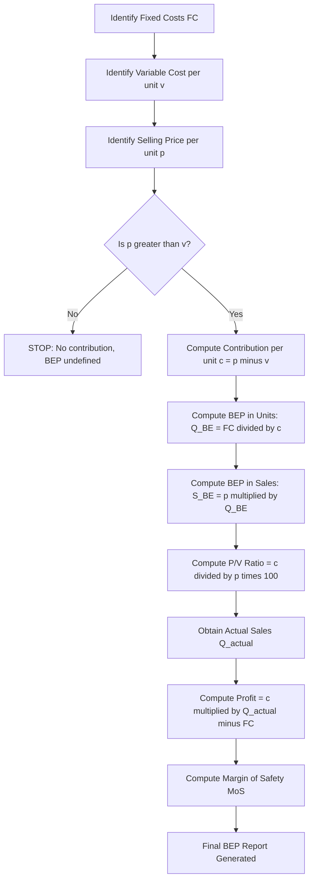
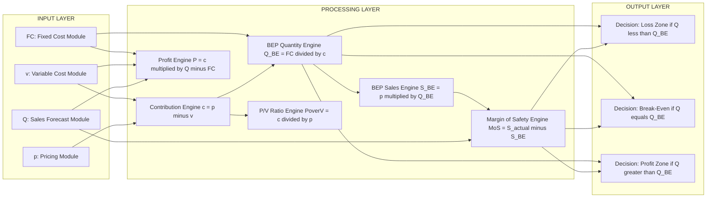
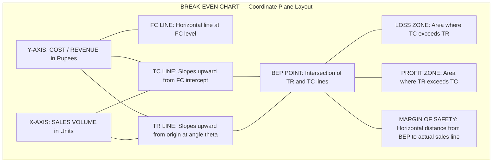
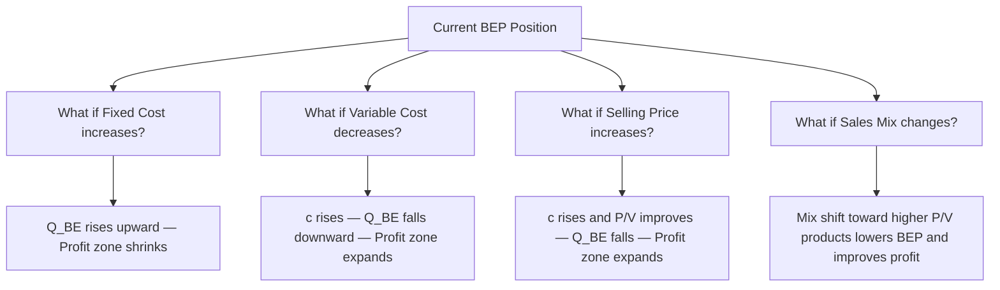

# Break-even Analysis

<!-- SECTION_1_START -->
# Break-Even Analysis — Core Technical Definition & Intuitive Overview

## Formal Academic Definition (KTU 2024 Syllabus Terminology)

> [!IMPORTANT]
> **Break-Even Analysis** is a fundamental managerial accounting and engineering economics technique used to determine the **point at which total revenue (TR) exactly equals total cost (TC)** — meaning the business neither makes a profit nor incurs a loss. This point is termed the **Break-Even Point (BEP)**.

Mathematically, at the Break-Even Point:

$$\text{TR} = \text{TC}$$

$$\text{TR} - \text{TC} = 0 \quad \Rightarrow \quad \text{Profit} = 0$$

The Break-Even Point can be expressed in two equivalent forms:
- **BEP in physical units** (number of units to be produced/sold) — denoted as $Q_{BE}$
- **BEP in monetary/₹ value** (sales revenue at break-even) — denoted as $S_{BE}$

## Conceptual Analogy / Intuition

> [!NOTE]
> **Real-World Analogy — The "Tea Stall" Model**
> Imagine a small roadside tea stall. The owner must pay **rent** (₹5,000/month, paid even if no tea is sold) and **wage to the helper** (₹3,000/month, also fixed). For every cup of tea sold, an additional **₹5** is spent on milk, sugar, tea leaves, and gas. Each cup is sold at **₹15**.
> 
> **Question:** How many cups must the stall sell each month just to avoid a loss?
> 
> - **Fixed outflow every month** = ₹5,000 + ₹3,000 = **₹8,000**
> - **Money recovered per cup after paying for its ingredients** = ₹15 − ₹5 = **₹10** (this is called *contribution*)
> - **Cups needed to cover fixed cost** = ₹8,000 ÷ ₹10 = **800 cups**
> 
> The 800th cup is the **Break-Even Cup**. Below it, the stall loses money; above it, every cup is pure profit.

This is the heart of Break-Even Analysis: **how many units of "contribution" are required to cover the fixed mountain?**

## Key Terminology (with Bold Highlights)

| Term | Symbol | Definition |
|------|--------|-----------|
| **Fixed Cost** | $FC$ | Costs that **do NOT vary** with output level (e.g., rent, salaries, insurance, depreciation). Incurred even at zero production. |
| **Variable Cost** | $VC$ | Costs that **vary directly** and proportionally with output (e.g., raw materials, direct labour, packaging). |
| **Total Variable Cost** | $TVC$ | $TVC = v \times Q$, where $v$ is variable cost per unit and $Q$ is quantity. |
| **Total Cost** | $TC$ | $TC = FC + TVC = FC + vQ$ |
| **Sales Revenue** | $TR$ | $TR = p \times Q$, where $p$ is selling price per unit. |
| **Contribution** | $C$ | $C = TR - TVC = (p - v)Q$. The amount each unit "contributes" toward covering fixed costs and generating profit. |
| **Contribution per unit** | $c$ | $c = p - v$ |
| **Profit** | $P$ | $P = TR - TC = (p - v)Q - FC$ |
| **Margin of Safety** | $MoS$ | The cushion of actual/projected sales above the BEP, indicating how much sales can drop before losses begin. |
| **P/V Ratio** | $P/V$ | Profit-Volume Ratio — the ratio of contribution to sales, expressed as a percentage. |

> [!TIP]
> **Syllabus Highlight (KTU 2024):** The Break-Even Chart is a **mandatory graphical construction** topic. Students should be able to draw the BEP chart with proper axes, plot FC line, TC line, TR line, and identify the BEP intersection, profit/loss zones, and Margin of Safety.

## Visualization: The BEP Curve Family

> [!VISUALIZATION CONTROL]
> **Concept:** Break-Even Chart — Intersection of Total Revenue and Total Cost
> **GeoGebra / Desmos Input Equations:**
> - `FC = 5000`  (horizontal line representing fixed cost)
> - `TC(x) = 5000 + 7*x`  (total cost = fixed + variable per unit × quantity)
> - `TR(x) = 15*x`  (total revenue = selling price × quantity)
> **Visual Description:** A horizontal line (FC) runs parallel to the x-axis. A second line (TC) starts at ₹5,000 on the y-axis and slopes upward. A third line (TR) starts at the origin and slopes upward more steeply. The intersection of TR and TC is the **Break-Even Point** — the quantity beyond which TR exceeds TC (profit zone) and below which TC exceeds TR (loss zone).

---

<!-- SECTION_1_END -->

<!-- SECTION_2_START -->
# Deep Theoretical Analysis & KTU High-Yield Formula Sheet

## Step-by-Step Logical Foundation

### Step 1 — Identify the Cost Behavior Pattern
Every cost in a manufacturing/service system falls into one of two categories:
- **Fixed Cost ($FC$):** Independent of output $Q$. Examples: factory rent, machine depreciation, supervisor's salary, insurance premium. Remains **constant in total** but **per-unit fixed cost decreases** as $Q$ increases.
- **Variable Cost ($VC$):** Depends linearly on $Q$. Examples: raw material consumption, direct labour wages, electricity for production. Per-unit variable cost remains constant, but total variable cost rises proportionally.

### Step 2 — Build the Cost & Revenue Equations
The cornerstone equations of break-even analysis:

$$\text{Total Cost: } TC = FC + vQ$$

$$\text{Total Revenue: } TR = pQ$$

$$\text{Profit: } P(Q) = TR - TC = pQ - (FC + vQ) = (p - v)Q - FC$$

### Step 3 — Set Profit Equal to Zero to Find BEP
At the break-even point, $P = 0$:

$$(p - v)Q_{BE} = FC$$

Solving for $Q_{BE}$:

$$Q_{BE} = \frac{FC}{p - v} = \frac{FC}{\text{Contribution per unit}}$$

### Step 4 — Convert Quantity BEP to Sales-Value BEP
Multiply $Q_{BE}$ by selling price $p$:

$$S_{BE} = p \times Q_{BE} = \frac{p \times FC}{p - v}$$

### Step 5 — Compute the P/V Ratio (Profit/Volume Ratio)
The P/V ratio expresses contribution as a percentage of sales:

$$\frac{P}{V} = \frac{\text{Contribution}}{\text{Sales}} \times 100 = \frac{p - v}{p} \times 100$$

A higher P/V ratio means **higher profitability per rupee of sales** and **lower break-even threshold**.

### Step 6 — Compute the Margin of Safety
The Margin of Safety measures the buffer between projected/actual sales and BEP sales:

$$MoS = \text{Actual Sales} - S_{BE}$$

$$\text{MoS \%} = \frac{\text{Actual Sales} - S_{BE}}{\text{Actual Sales}} \times 100$$

A higher MoS indicates lower operational risk.

## KTU Formula Cheat Sheet

> [!NOTE]
> **Master these formulas** — they are the foundation for at least **one 14-mark question** in every KTU ESE cycle.

| # | Quantity | Formula | Units / Notes |
|---|----------|---------|---------------|
| 1 | Total Cost | $TC = FC + vQ$ | ₹ |
| 2 | Total Revenue | $TR = pQ$ | ₹ |
| 3 | Profit | $P = (p - v)Q - FC$ | ₹ |
| 4 | Contribution per unit | $c = p - v$ | ₹/unit |
| 5 | **BEP (Quantity)** | $Q_{BE} = \dfrac{FC}{p - v}$ | units |
| 6 | **BEP (Sales Value)** | $S_{BE} = \dfrac{FC \times p}{p - v}$ | ₹ |
| 7 | **BEP (Sales Value) — Alt form** | $S_{BE} = \dfrac{FC}{\left(\dfrac{P}{V}\right)}$ | ₹ |
| 8 | P/V Ratio | $\dfrac{P}{V} = \dfrac{p - v}{p} \times 100$ | % |
| 9 | Margin of Safety (Absolute) | $MoS = \text{Actual Sales} - S_{BE}$ | ₹ |
| 10 | Margin of Safety (%) | $MoS\% = \dfrac{\text{Actual Sales} - S_{BE}}{\text{Actual Sales}} \times 100$ | % |
| 11 | Profit at given Sales $S$ | $P = \left(\dfrac{P}{V}\right) \times (S - S_{BE})$ | ₹ |
| 12 | Profit % on Sales | $\dfrac{P}{S} \times 100 = \dfrac{P}{V} \times \dfrac{(S - S_{BE})}{S} \times 100$ | % |

> [!WARNING]
> **Do NOT confuse BEP in units with BEP in ₹ value.** A common KTU pitfall is mixing the two. Always read the question carefully: "How many units?" → $Q_{BE}$. "What sales revenue?" → $S_{BE}$.

## Assumptions of Break-Even Analysis (High-Yield for KTU)

> [!IMPORTANT]
> KTU frequently asks: *"State the assumptions of BEP analysis."* Memorize the following:

1. **Linear cost behavior** — both $FC$ and $v$ are assumed constant within the relevant range.
2. **Single product (or constant product mix)** — when multiple products exist, the *sales mix* is held constant.
3. **Selling price $p$ is constant** — no discounts, no price discrimination, no market-driven price variation.
4. **All units produced are sold** — production volume = sales volume (no inventory buildup).
5. **Variable cost per unit is constant** — no bulk discounts, no learning-curve effects.
6. **Fixed costs are truly fixed** — no semi-variable (mixed) costs.
7. **The analysis applies to a single time period** — typically one year.

## Engineering & Real-World Utility

Break-even analysis is extensively deployed in:

- **Product Launch Decisions** — determining the minimum order quantity for a new product to be viable.
- **Make-or-Buy Decisions** — comparing in-house production cost vs. outsourcing cost.
- **Equipment Replacement** — when the BEP shifts due to a new machine, evaluating whether the investment is justified.
- **Pricing Strategy** — simulating the impact of price changes on BEP and profitability.
- **Cost-Volume-Profit (CVP) Planning** — budgeting and forecasting in manufacturing firms.
- **Engineering Project Appraisal** — used in tandem with NPV/IRR for break-even production rate of capital projects.

---

<!-- SECTION_2_END -->

<!-- SECTION_3_START -->
# Step-by-Step Derivations & Worked Code Implementation

## Derivation 1 — BEP in Physical Units (Algebraic Walk-Through)

We begin from the fundamental break-even condition:

$$\text{Total Revenue} = \text{Total Cost}$$

Substituting the cost-revenue equations:

$$pQ = FC + vQ$$

Isolating the $Q$ terms on the left-hand side:

$$pQ - vQ = FC$$

Factoring out $Q$:

$$(p - v)Q = FC$$

Defining $c = p - v$ as the contribution per unit:

$$cQ = FC$$

Solving for the break-even quantity:

$$Q_{BE} = \frac{FC}{c} = \frac{FC}{p - v}$$

**Final boxed result:**

$$\boxed{Q_{BE} = \frac{FC}{p - v}}$$

## Derivation 2 — BEP in Sales Value (₹)

Multiplying $Q_{BE}$ by the selling price $p$:

$$S_{BE} = p \times Q_{BE} = p \times \frac{FC}{p - v}$$

Dividing numerator and denominator by $p$ to introduce the P/V ratio:

$$S_{BE} = \frac{FC}{\dfrac{p - v}{p}} = \frac{FC}{\left(\dfrac{P}{V}\right)}$$

**Final boxed result:**

$$\boxed{S_{BE} = \frac{FC}{\left(\dfrac{P}{V}\right)} = \frac{FC \times p}{p - v}}$$

## Derivation 3 — Margin of Safety (Algebraic Form)

Margin of safety is the difference between **expected (or actual) sales** and **break-even sales**:

$$MoS = S_{\text{actual}} - S_{BE}$$

Expressed as a percentage:

$$MoS\% = \frac{S_{\text{actual}} - S_{BE}}{S_{\text{actual}}} \times 100$$

**Key relationship** — Profit can be expressed in terms of MoS and P/V ratio:

$$P = MoS \times \left(\frac{P}{V}\right) = (S_{\text{actual}} - S_{BE}) \times \frac{p - v}{p}$$

This compact form is **extremely useful** in KTU problems where profit must be found without first computing $Q$.

---

## Worked Example 1 — The "Standard" BEP Question

> **[KTU University Exam — July 2024, Model Question]**
> A company manufactures a product with the following data:
> - Selling price per unit: $p = ₹200$
> - Variable cost per unit: $v = ₹120$
> - Total fixed cost: $FC = ₹4{,}00{,}000$
> - Expected sales: $Q_{\text{actual}} = 5{,}000$ units
> 
> **Find:** (a) BEP in units, (b) BEP in ₹, (c) Expected profit, (d) Margin of Safety, (e) P/V ratio.

### Solution — Step-by-Step

**(a) BEP in units:**

$$Q_{BE} = \frac{FC}{p - v} = \frac{4{,}00{,}000}{200 - 120} = \frac{4{,}00{,}000}{80}$$

$$Q_{BE} = 5{,}000 \text{ units}$$

**(b) BEP in ₹:**

$$S_{BE} = p \times Q_{BE} = 200 \times 5{,}000 = ₹10{,}00{,}000$$

Alternative verification using the P/V ratio (computed below):

$$S_{BE} = \frac{FC}{(P/V)} = \frac{4{,}00{,}000}{0.40} = ₹10{,}00{,}000 \quad \checkmark$$

**(c) Expected profit at 5,000 units:**

$$P = (p - v)Q - FC = 80 \times 5{,}000 - 4{,}00{,}000$$

$$P = 4{,}00{,}000 - 4{,}00{,}000 = ₹0$$

> [!NOTE]
> The expected sales of 5,000 units is **exactly at the BEP** — no profit, no loss. This is a frequent KTU trick: students must recognize "BEP has been reached" instead of computing profit blindly.

**(d) Margin of Safety:**

$$MoS = S_{\text{actual}} - S_{BE} = 10{,}00{,}000 - 10{,}00{,}000 = ₹0$$

$$MoS\% = 0\%$$

**(e) P/V Ratio:**

$$\frac{P}{V} = \frac{p - v}{p} \times 100 = \frac{200 - 120}{200} \times 100 = \frac{80}{200} \times 100 = 40\%$$

---

## Worked Example 2 — The "Multi-Step" KTU-Style Problem

> **[KTU University Exam — Dec 2023, Model Question]**
> A firm sells a product at ₹500 per unit. Variable cost is ₹300 per unit. Fixed costs amount to ₹8,00,000 per annum. The firm currently sells 4,000 units. Find:
> (a) BEP in units and in rupees
> (b) Profit earned at current sales level
> (c) New profit if selling price is reduced by 10% and sales volume rises by 25%
> (d) BEP if ₹2,00,000 additional fixed cost is incurred for advertising

### Solution

**(a) BEP in units and ₹:**

$$Q_{BE} = \frac{8{,}00{,}000}{500 - 300} = \frac{8{,}00{,}000}{200} = 4{,}000 \text{ units}$$

$$S_{BE} = 500 \times 4{,}000 = ₹20{,}00{,}000$$

**(b) Profit at 4,000 units:**

$$P = (500 - 300) \times 4{,}000 - 8{,}00{,}000 = 200 \times 4{,}000 - 8{,}00{,}000 = 8{,}00{,}000 - 8{,}00{,}000 = ₹0$$

Again, the firm operates exactly at BEP.

**(c) New profit after 10% price cut and 25% volume rise:**

- New selling price: $p' = 500 \times 0.90 = ₹450$
- New sales volume: $Q' = 4{,}000 \times 1.25 = 5{,}000$ units

$$P_{\text{new}} = (p' - v)Q' - FC = (450 - 300) \times 5{,}000 - 8{,}00{,}000$$

$$P_{\text{new}} = 150 \times 5{,}000 - 8{,}00{,}000 = 7{,}50{,}000 - 8{,}00{,}000 = -₹50{,}000$$

**Interpretation:** The price cut causes a **loss of ₹50,000** because the volume gain (25%) does not compensate for the loss in contribution per unit (from ₹200 to ₹150).

**(d) BEP with additional fixed cost:**

New $FC = 8{,}00{,}000 + 2{,}00{,}000 = ₹10{,}00{,}000$. With price still at ₹500 and variable cost at ₹300:

$$Q_{BE}^{\text{new}} = \frac{10{,}00{,}000}{200} = 5{,}000 \text{ units}$$

$$S_{BE}^{\text{new}} = 500 \times 5{,}000 = ₹25{,}00{,}000$$

---

## Python Implementation (BEP Calculator)

```python
"""
Break-Even Analysis Calculator
Author: KTU Economics for Engineers (UCHUT346) — Module 4
Description: Computes BEP, profit, P/V ratio, and Margin of Safety
             with strict type hints and input validation.
"""

from dataclasses import dataclass
from typing import Tuple


@dataclass(frozen=True)
class BEPInput:
    """Immutable container for break-even input parameters."""
    fixed_cost: float       # FC in ₹
    variable_cost: float    # v in ₹/unit (must be >= 0)
    selling_price: float    # p in ₹/unit (must be > variable_cost)
    actual_units: float = 0.0  # Q_actual in units (optional)


def compute_break_even(params: BEPInput) -> dict:
    """
    Compute all key break-even metrics.

    Returns:
        dict with keys:
            bep_units, bep_sales, contribution_per_unit,
            pv_ratio, profit, margin_of_safety,
            margin_of_safety_pct
    Raises:
        ValueError: On invalid inputs.
    """
    fc, v, p, q = (
        params.fixed_cost,
        params.variable_cost,
        params.selling_price,
        params.actual_units,
    )

    # --- Strict Input Validation ---
    if fc < 0:
        raise ValueError(f"Fixed cost must be >= 0, got {fc}")
    if v < 0:
        raise ValueError(f"Variable cost must be >= 0, got {v}")
    if p <= 0:
        raise ValueError(f"Selling price must be > 0, got {p}")
    if p <= v:
        raise ValueError(
            f"Selling price ({p}) must exceed variable cost ({v}) "
            f"for a positive contribution."
        )
    if q < 0:
        raise ValueError(f"Actual units must be >= 0, got {q}")

    # --- Core Computations ---
    contribution_per_unit: float = p - v
    bep_units: float = fc / contribution_per_unit
    bep_sales: float = bep_units * p
    pv_ratio: float = (contribution_per_unit / p) * 100.0
    profit: float = contribution_per_unit * q - fc
    margin_of_safety: float = max(0.0, q * p - bep_sales)
    margin_of_safety_pct: float = (
        (margin_of_safety / (q * p)) * 100.0 if q > 0 else 0.0
    )

    return {
        "bep_units": bep_units,
        "bep_sales": bep_sales,
        "contribution_per_unit": contribution_per_unit,
        "pv_ratio": pv_ratio,
        "profit": profit,
        "margin_of_safety": margin_of_safety,
        "margin_of_safety_pct": margin_of_safety_pct,
    }


def print_report(params: BEPInput, result: dict) -> None:
    """Pretty-print a formatted BEP analysis report."""
    print("=" * 60)
    print("         BREAK-EVEN ANALYSIS REPORT")
    print("=" * 60)
    print(f"Fixed Cost (FC)             : ₹ {params.fixed_cost:>12,.2f}")
    print(f"Variable Cost (v)           : ₹ {params.variable_cost:>12,.2f}")
    print(f"Selling Price (p)           : ₹ {params.selling_price:>12,.2f}")
    print(f"Actual Units (Q)            :   {params.actual_units:>12,.2f}")
    print("-" * 60)
    print(f"Contribution per unit (c)   : ₹ {result['contribution_per_unit']:>12,.2f}")
    print(f"BEP in Units (Q_BE)         :   {result['bep_units']:>12,.2f} units")
    print(f"BEP in Sales (S_BE)         : ₹ {result['bep_sales']:>12,.2f}")
    print(f"P/V Ratio                   :   {result['pv_ratio']:>12,.2f} %")
    print(f"Profit at actual Q          : ₹ {result['profit']:>12,.2f}")
    print(f"Margin of Safety (₹)        : ₹ {result['margin_of_safety']:>12,.2f}")
    print(f"Margin of Safety (%)        :   {result['margin_of_safety_pct']:>12,.2f} %")
    print("=" * 60)


# --- Demonstration Run (Worked Example 1) ---
if __name__ == "__main__":
    sample = BEPInput(
        fixed_cost=4_00_000,
        variable_cost=120,
        selling_price=200,
        actual_units=5_000,
    )
    output = compute_break_even(sample)
    print_report(sample, output)
```

**Sample Output:**

```
============================================================
         BREAK-EVEN ANALYSIS REPORT
============================================================
Fixed Cost (FC)             : ₹   4,00,000.00
Variable Cost (v)           :     120.00
Selling Price (p)           :     200.00
Actual Units (Q)            :   5,000.00
------------------------------------------------------------
Contribution per unit (c)   :      80.00
BEP in Units (Q_BE)         :   5,000.00 units
BEP in Sales (S_BE)         :  10,00,000.00
P/V Ratio                   :      40.00 %
Profit at actual Q          :       0.00
Margin of Safety (₹)        :       0.00
Margin of Safety (%)        :       0.00 %
============================================================
```

---

<!-- SECTION_3_END -->

<!-- SECTION_4_START -->
# Structural Diagrams & Schematics

## Diagram 1 — Conceptual Flow of Break-Even Analysis



## Diagram 2 — Block-Level Architecture of a BEP Decision System



## Diagram 3 — BEP Chart Schematic (Coordinate-Plane Description)



## Diagram 4 — Sensitivity Analysis Tree for BEP



> [!NOTE]
> **Mermaid Safety Note:** All node identifiers use alphanumeric labels prefixed with letters. All labels with special characters (like "≤", "≥", "÷", "−") are wrapped in double quotes to ensure successful Mermaid rendering. No reserved keywords (`end`, `graph`, `subgraph`, `style`) are used as standalone node names.

---

<!-- SECTION_4_END -->

<!-- SECTION_5_START -->
# KTU 2024 Scheme Examination Question Bank & Topic Recap

---

## 📘 PART A — 3-Mark Questions (Short Answer)

### **Question 1** `[KTU University Exam — July 2023]`
**Q: Define Break-Even Point. Write the formula for BEP in units and in sales value.**

> **CO Mapping:** CO2 | **RBT Level:** Remember
> 
> **Model Answer:**
> 
> The **Break-Even Point (BEP)** is the level of sales at which **Total Revenue exactly equals Total Cost**, resulting in zero profit and zero loss.
> 
> $$\text{At BEP:} \quad TR = TC \quad \Rightarrow \quad \text{Profit} = 0$$
> 
> **BEP in units:**
> 
> $$Q_{BE} = \frac{FC}{p - v}$$
> 
> **BEP in sales value:**
> 
> $$S_{BE} = \frac{FC \times p}{p - v} = \frac{FC}{(P/V)}$$
> 
> where $FC$ = fixed cost, $p$ = selling price per unit, $v$ = variable cost per unit.
> 
> **[Stating the definition: 1 Mark] | [BEP units formula: 1 Mark] | [BEP sales value formula: 1 Mark]**

### **Question 2** `[KTU University Exam — Dec 2022]`
**Q: What is Margin of Safety? Why is it important to management?**

> **CO Mapping:** CO2 | **RBT Level:** Understand
> 
> **Model Answer:**
> 
> The **Margin of Safety (MoS)** is the difference between **actual (or expected) sales** and **break-even sales**. It indicates the amount by which sales can decline before the firm begins to incur losses.
> 
> $$MoS = S_{\text{actual}} - S_{BE}$$
> 
> $$MoS\% = \frac{S_{\text{actual}} - S_{BE}}{S_{\text{actual}}} \times 100$$
> 
> **Importance to Management:**
> - Indicates the **cushion of safety** against sales declines.
> - A **high MoS** implies low operational risk; a **low MoS** signals vulnerability.
> - Helps in **decision-making** on pricing, advertising, and expansion.
> - Useful for **risk assessment** in capital budgeting.
> 
> **[Definition: 1 Mark] | [Formula: 1 Mark] | [Importance: 1 Mark]**

---

## 📗 PART B — 14-Mark Questions (Internal Choice)

### **Question A (14 Marks)** `[KTU University Exam — July 2024]`

**Q:** A manufacturing company produces a single product with the following annual cost data:
- Fixed Cost: ₹6,00,000
- Variable Cost per unit: ₹150
- Selling Price per unit: ₹250
- Present Annual Sales: 8,000 units

**(a)** Calculate the **BEP in units** and **BEP in sales value**. Also compute the **P/V ratio**. **[7 Marks]**

**(b)** Calculate the **current profit**, the **Margin of Safety (₹ and %)**, and the **profit if the selling price is reduced to ₹220** with a corresponding increase in sales to 10,000 units. **[7 Marks]**

> **CO Mapping:** CO2 | **RBT Levels:** (a) Understand/Apply | (b) Apply/Analyze

#### Model Solution

**Given:**
- $FC = ₹6{,}00{,}000$
- $v = ₹150$/unit
- $p = ₹250$/unit
- $Q_{\text{actual}} = 8{,}000$ units

**Part (a):**

Contribution per unit:
$$c = p - v = 250 - 150 = ₹100/\text{unit}$$

BEP in units:
$$Q_{BE} = \frac{FC}{c} = \frac{6{,}00{,}000}{100} = 6{,}000 \text{ units}$$

BEP in sales value:
$$S_{BE} = p \times Q_{BE} = 250 \times 6{,}000 = ₹15{,}00{,}000$$

P/V ratio:
$$\frac{P}{V} = \frac{c}{p} \times 100 = \frac{100}{250} \times 100 = 40\%$$

**[Computing contribution: 1 Mark] | [BEP in units: 2 Marks] | [BEP in ₹: 2 Marks] | [P/V ratio: 2 Marks]**

**Part (b):**

Current profit:
$$P_{\text{current}} = c \times Q_{\text{actual}} - FC = 100 \times 8{,}000 - 6{,}00{,}000 = 8{,}00{,}000 - 6{,}00{,}000 = ₹2{,}00{,}000$$

Margin of Safety in ₹:
$$MoS = S_{\text{actual}} - S_{BE} = (250 \times 8{,}000) - 15{,}00{,}000 = 20{,}00{,}000 - 15{,}00{,}000 = ₹5{,}00{,}000$$

Margin of Safety in %:
$$MoS\% = \frac{5{,}00{,}000}{20{,}00{,}000} \times 100 = 25\%$$

**Verification using P/V:** $P = MoS \times (P/V) = 5{,}00{,}000 \times 0.40 = ₹2{,}00{,}000$ ✓

New scenario: $p' = ₹220$, $Q' = 10{,}000$ units, $FC$ unchanged.
$$P_{\text{new}} = (p' - v) \times Q' - FC = (220 - 150) \times 10{,}000 - 6{,}00{,}000$$
$$P_{\text{new}} = 70 \times 10{,}000 - 6{,}00{,}000 = 7{,}00{,}000 - 6{,}00{,}000 = ₹1{,}00{,}000$$

**Interpretation:** The price reduction **reduces profit from ₹2,00,000 to ₹1,00,000** despite the 25% increase in sales volume — because contribution per unit drops from ₹100 to ₹70.

**[Current profit: 2 Marks] | [MoS ₹ and %: 2 Marks] | [New profit calculation: 2 Marks] | [Interpretation: 1 Mark]**

---

### **Question B (14 Marks — Alternative Choice)** `[KTU University Exam — Dec 2023]`

**Q:** A company has the following data for the year:
- Selling Price per unit: ₹400
- Variable Cost per unit: ₹240
- Fixed Costs: ₹4,80,000
- Actual Sales: 4,500 units

**(a)** Draw a **Break-Even Chart** (with all labels) and identify the **BEP**, the **loss zone**, the **profit zone**, and the **Margin of Safety**. **[7 Marks]**

**(b)** If management wants to **earn a target profit of ₹1,20,000**, determine the **required sales volume** and the **required sales revenue**. Also, find the **operating leverage** at the actual sales level. **[7 Marks]**

> **CO Mapping:** CO2 | **RBT Levels:** (a) Apply | (b) Apply/Analyze

#### Model Solution

**Given:**
- $p = ₹400$, $v = ₹240$, $FC = ₹4{,}80{,}000$, $Q_{\text{actual}} = 4{,}500$

**Part (a): Break-Even Chart**

Key data points for plotting:
- FC line: horizontal at $y = ₹4{,}80{,}000$
- TC line: passes through $(0, 4{,}80{,}000)$ and $(Q_{BE}, S_{BE})$
- TR line: passes through origin and $(Q, pQ)$

$$Q_{BE} = \frac{4{,}80{,}000}{400 - 240} = \frac{4{,}80{,}000}{160} = 3{,}000 \text{ units}$$

$$S_{BE} = 400 \times 3{,}000 = ₹12{,}00{,}000$$

$$S_{\text{actual}} = 400 \times 4{,}500 = ₹18{,}00{,}000$$

$$MoS = 18{,}00{,}000 - 12{,}00{,}000 = ₹6{,}00{,}000$$

**Chart Description (to be drawn on graph paper):**

| Element | Description |
|---------|-------------|
| Y-axis | Sales/Cost in ₹ |
| X-axis | Volume in units |
| FC line | Horizontal at ₹4,80,000 |
| TC line | Starts at ₹4,80,000, slope = ₹160/unit |
| TR line | Starts at origin, slope = ₹400/unit |
| BEP | At (3,000 units, ₹12,00,000) |
| Loss Zone | Left of BEP (0 to 3,000 units) |
| Profit Zone | Right of BEP (3,000 to 4,500 units and beyond) |
| Margin of Safety | From 3,000 to 4,500 units (₹6,00,000 wide) |

**[BEP calculation: 2 Marks] | [Chart axes & FC line: 1 Mark] | [TC and TR lines: 2 Marks] | [BEP, loss/profit zones, MoS labeled: 2 Marks]**

**Part (b): Target Profit Analysis**

Required sales volume for target profit $P^* = ₹1{,}20{,}000$:

$$P^* = (p - v)Q^* - FC \quad \Rightarrow \quad 1{,}20{,}000 = 160 \times Q^* - 4{,}80{,}000$$

$$160 \times Q^* = 6{,}00{,}000 \quad \Rightarrow \quad Q^* = \frac{6{,}00{,}000}{160} = 3{,}750 \text{ units}$$

Required sales revenue:
$$S^* = p \times Q^* = 400 \times 3{,}750 = ₹15{,}00{,}000$$

**Operating Leverage** at actual sales level:

$$\text{Contribution} = (p - v) \times Q_{\text{actual}} = 160 \times 4{,}500 = ₹7{,}20{,}000$$

$$\text{Profit} = 7{,}20{,}000 - 4{,}80{,}000 = ₹2{,}40{,}000$$

$$\text{Operating Leverage} = \frac{\text{Contribution}}{\text{Profit}} = \frac{7{,}20{,}000}{2{,}40{,}000} = 3.0$$

**Interpretation:** A 1% change in sales causes a **3% change in profit** — a measure of the firm's **business risk**.

**[Target profit equation setup: 2 Marks] | [Required units and revenue: 2 Marks] | [Operating leverage formula: 1 Mark] | [Numerical value with interpretation: 2 Marks]**

---

> [!WARNING]
> **⚠️ KTU Examiner's Valuation Pitfall Callout**
> 
> 1. **Drawing the BEP chart:** Many students omit **axis labels and units**, losing **2 marks** outright. Always label: *"Sales/Cost (₹)"* on the Y-axis and *"Volume (units)"* on the X-axis.
> 2. **Confusing "BEP in units" with "BEP in ₹":** If a question asks *"BEP in ₹,"* computing $Q_{BE}$ alone gives **only 2 of 3 marks**. You must multiply by $p$ to get the rupee figure.
> 3. **Forgetting to state units** (units vs. ₹) in the final answer is a **frequent ½-mark deduction** in KTU valuation keys.
> 4. **Operating Leverage** is a higher-RBT extension; do not skip the **interpretation line** ("1% sales change → 3% profit change") — KTU awards a final mark for it.
> 5. **Multiple-product BEP questions:** When a product mix is given, use **weighted average P/V ratio**. Forgetting the weighting is a **common 3-mark loss**.
> 6. **Margin of Safety formula trap:** MoS is computed on **sales value (₹)**, not on units. Reading the question wrong here can cost 2 marks.

---

## 📌 TOPIC RECAP & IMPORTANT THINGS TO REMEMBER

> [!IMPORTANT]
> **Rapid Revision Checklist — Break-Even Analysis**

- ✅ **BEP Definition** — The point where $TR = TC$ and profit = 0; the threshold separating the loss zone from the profit zone.
- ✅ **BEP in Units Formula:** $Q_{BE} = \dfrac{FC}{p - v}$ — must be memorized as a single line.
- ✅ **BEP in Sales Value Formula:** $S_{BE} = \dfrac{FC \times p}{p - v} = \dfrac{FC}{(P/V)}$.
- ✅ **Contribution per unit:** $c = p - v$ — the engine of break-even math; if $c \le 0$, BEP is impossible.
- ✅ **P/V Ratio:** $\dfrac{P}{V} = \dfrac{c}{p} \times 100\%$ — higher P/V = lower BEP = better.
- ✅ **Margin of Safety:** $MoS = S_{\text{actual}} - S_{BE}$; expressed in ₹ and as a %.
- ✅ **Profit = MoS × P/V Ratio** — a powerful shortcut formula for KTU problems.
- ✅ **Operating Leverage = Contribution / Profit** — measures business risk; higher leverage = more sensitive to sales fluctuations.
- ✅ **Assumptions to remember:** Linear costs, single product (or constant mix), constant price, all output sold, no semi-variable costs, single time period.
- ✅ **Graph essentials:** FC line (horizontal), TC line (slope = v), TR line (slope = p from origin), BEP = intersection, label loss/profit zones, mark MoS.
- ✅ **Sensitivity rules:** ↑FC → ↑BEP; ↑v → ↑BEP; ↑p → ↓BEP; ↑Q → ↑profit (after BEP).
- ✅ **Multiple-product BEP:** Use weighted average P/V ratio = Σ(weight × P/V of each product).
- ✅ **KTU favourite extensions:** Target profit computation, margin of safety interpretation, operating leverage, make-or-buy decisions, impact of cost/price changes on BEP.
- ✅ **Common pitfall:** Always state units in final answers (units vs. rupees) — KTU deducts marks for ambiguity.

---

<!-- SECTION_5_END -->
