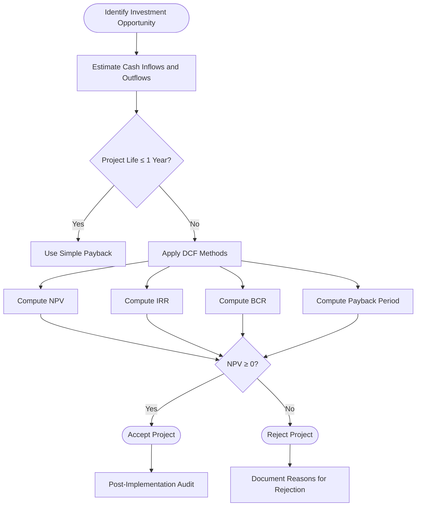
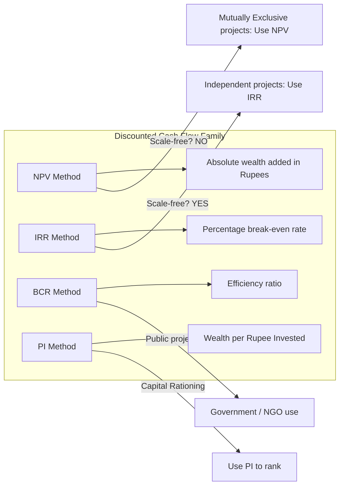
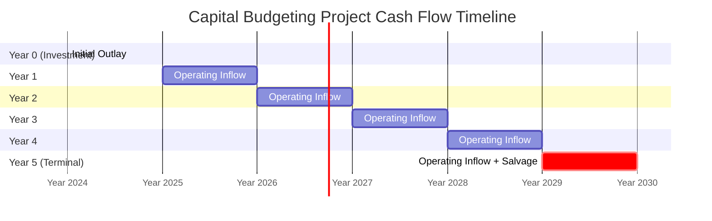
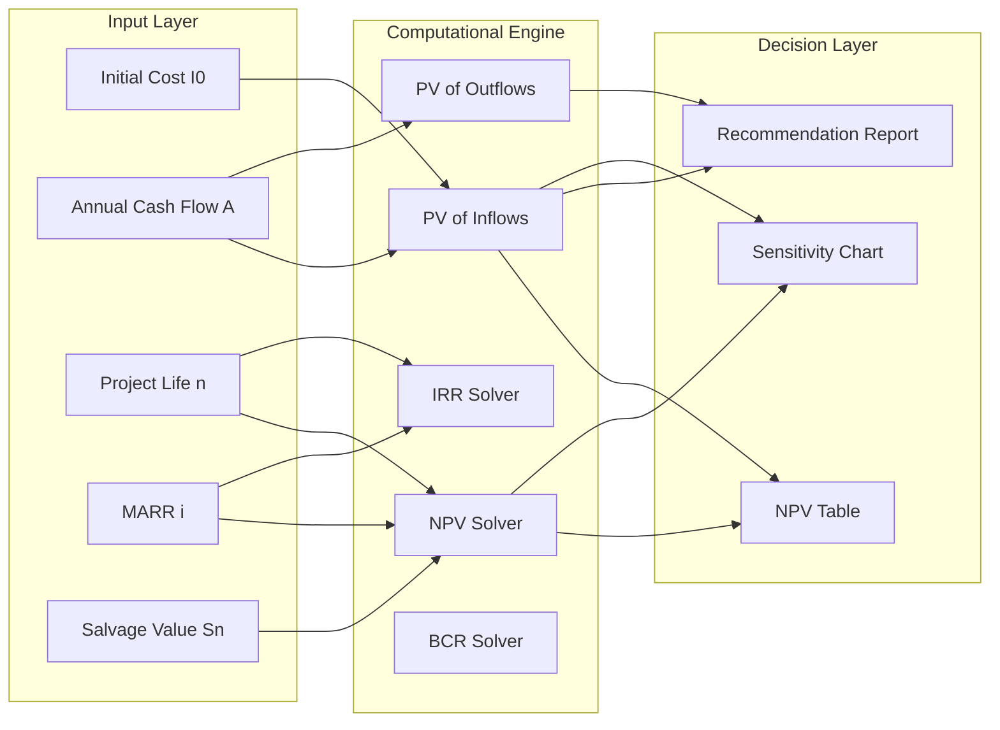

# Capital Budgeting

<!-- SECTION_1_START -->
# 💰 Capital Budgeting — KTU 2024 Scheme Premium Study Notes

> [!NOTE]
> **KTU 2024 Scheme Context:** This topic is part of **Module 4 — Value Analysis and Value Engineering** in **UCHUT346 (Economics for Engineers)**. It carries high weightage in **End Semester Examinations (ESE)** and **Continuous Evaluation (CE)** components, especially for the **Apply / Analyze** levels of Revised Bloom's Taxonomy.

---

## 📌 1.1 Formal Academic Definition (KTU Syllabus Terminology)

**Capital Budgeting** (also termed *Capital Investment Analysis* or *Investment Appraisal*) is the systematic, quantitative process by which an engineering firm or organization evaluates, ranks, and selects among competing long-term investment proposals whose benefits are expected to accrue over multiple accounting periods. The term "capital" refers to funds tied up in **fixed / productive assets** (machinery, land, plant, R\&D), and "budgeting" refers to the allocation of scarce financial resources under conditions of **certainty, risk, or uncertainty**.

The cornerstone of capital budgeting is the **Time Value of Money (TVM)** principle — the idea that **₹100 today is worth more than ₹100 a year from now** because today's rupee can be **invested, compounded, or consumed**.

> [!IMPORTANT]
> **KTU Board Definition (Verbatim Expected):** *"Capital Budgeting is the process of planning and managing a firm's long-term investments in fixed assets, wherein the engineer-economist evaluates the expected cash inflows and outflows of each project to determine which proposal(s) maximize shareholder/owner wealth."*

---

## 🌐 1.2 Intuitive Real-World Analogy

Imagine you are an engineer with **₹10,00,000** in savings. You have two choices:

| Option | Description | Return Pattern |
|--------|-------------|----------------|
| 🍔 **Option A** | Open a small tea stall near campus | Small, daily cash returns |
| 🏭 **Option B** | Buy a CNC lathe and start a precision job-shop | Large, monthly contract returns |

Both require you to *lock up* your ₹10 lakh for years. **How do you pick the better one?** Capital budgeting gives you the **mathematical ruler** — *NPV, IRR, BCR* — to measure the "wealth creation power" of each project in a single, comparable number.

> **Geometric Intuition:** Every cash flow is a *point* on a horizontal **time axis (t = 0, 1, 2, …, n)**. Capital budgeting essentially asks: *"If I bring all these points back to a common origin (t = 0), which project sits highest on the vertical wealth axis?"*

---

## 🎯 1.3 Core Engineering-Economic Metrics at a Glance

> [!TIP]
> The five primary **Discounted Cash Flow (DCF)** and **Non-DCF** metrics a KTU student *must* master are:
> 1. **Net Present Value (NPV)** — wealth creation in ₹
> 2. **Internal Rate of Return (IRR)** — break-even discount rate (%)
> 3. **Benefit-Cost Ratio (BCR)** — efficiency ratio
> 4. **Payback Period (PBP)** — risk-recovery years
> 5. **Accounting Rate of Return (ARR)** — accounting-based % return

---

## 🖼️ 1.4 GeoGebra / Desmos Visualization Concept

> [!VISUALIZATION CONTROL]
> **Concept:** *NPV Profile — How NPV varies with Discount Rate (i)*
>
> **GeoGebra / Desmos Input Equations (try these):**
> * $f_{1}(i) = \dfrac{50000}{(1+i)^{1}} + \dfrac{50000}{(1+i)^{2}} + \dfrac{50000}{(1+i)^{3}} - 100000$ *(Project A)*
> * $f_{2}(i) = \dfrac{20000}{(1+i)^{1}} + \dfrac{80000}{(1+i)^{2}} - 100000$ *(Project B)*
>
> **Visual Description:** Two curves crossing the x-axis at different points. The x-coordinate where each curve crosses zero is the **IRR** of that project. The curve lying *higher* on the y-axis at the **MARR (Minimum Attractive Rate of Return)** is the *preferred* project.

---

<!-- SECTION_2_END -->

<!-- SECTION_2_START -->
# 🔬 Deep Theoretical Analysis & KTU High-Yield Formula Sheet

---

## 🧠 2.1 The Philosophical Foundation — Why Discount Cash Flows?

The *only* reason a rupee tomorrow is worth *less* than a rupee today is the existence of three factors:

1. **Opportunity Cost** — the return foregone by not investing elsewhere (≈ **MARR / Cost of Capital**).
2. **Inflation / Purchasing-Power Erosion** — ₹100 buys less bread next year.
3. **Risk & Uncertainty** — future cash flows are probabilistic.

Hence every future cash flow $C_t$ must be **discounted** by a factor $(1+i)^{-t}$, where $i$ is the **discount rate (MARR)** and $t$ is the **time period in years**.

---

## 📚 2.2 Step-by-Step Logic of Each Method

### A. Net Present Value (NPV)
**Logic:** Convert every future net cash inflow $A_t$ to its present equivalent, sum them up, and subtract the initial investment $I_0$.

**Decision Rule:**
- $NPV \geq 0$ → **Accept** (project earns ≥ MARR)
- $NPV < 0$ → **Reject** (project destroys wealth)

> **Why NPV is the 'Gold Standard':** It directly measures *wealth added* in **rupees (₹)**, considers **all** cash flows, and is **not subject to scale bias**.

### B. Internal Rate of Return (IRR)
**Logic:** Find the discount rate $r^*$ that makes $NPV = 0$. In other words, the project is "paying for itself" at exactly that rate.

**Decision Rule:**
- $IRR \geq MARR$ → **Accept**
- $IRR < MARR$ → **Reject**

> **The Multiple-IRR Problem:** When cash flows change sign *more than once* (e.g., initial investment → operating inflow → environmental cleanup outflow), the polynomial $NPV = 0$ may have **multiple real roots**. KTU students should default to **NPV** in such cases.

### C. Benefit-Cost Ratio (BCR)
**Logic:** The ratio of the *present value of gross benefits* to the *present value of gross costs*.

**Decision Rule:**
- $BCR \geq 1$ → **Accept**
- $BCR < 1$ → **Reject**

> **Special KTU Variant:** For *public-sector / government* projects (e.g., NHAI highways, metro rail), the method is also called the **Cost-Benefit Ratio Method** and is evaluated *at the social discount rate* (typically 8–12% in India).

### D. Payback Period (PBP)
**Logic:** The time (in years) required for cumulative cash inflows to *recover* the initial investment.

**Decision Rule:**
- $PBP \leq$ Target Payback (set by management) → **Accept**

> **Drawback:** Ignores cash flows *after* the payback date → can reject genuinely profitable long-life projects (e.g., hydro-electric dams with 60-year life).

### E. Accounting Rate of Return (ARR)
**Logic:** Average annual accounting profit divided by average book value of the asset.

**Decision Rule:**
- $ARR \geq$ Target ARR → **Accept**

> **Drawback:** Uses *book profits* (depreciated values) rather than actual cash flows — not preferred in KTU ESE numericals.

---

## 📋 2.3 KTU High-Yield Formula Cheat Sheet

> [!IMPORTANT]
> **All symbols used in the KTU 2024 Scheme Board Exam Notation:**
> * $I_0$ = Initial investment (negative at $t=0$)
> * $A_t$ = Net cash flow in year $t$
> * $n$ = Project life (years)
> * $i$ or $r$ = Discount rate / MARR
> * $S_n$ = Salvage value at end of year $n$
> * $P$ = Present value
> * $F$ = Future value at year $n$

| # | Method | Core Formula (KTU Board Format) | Decision Rule | Type |
|---|--------|---------------------------------|---------------|------|
| 1 | **NPV (single project)** | $NPV = \sum_{t=0}^{n} \dfrac{A_t}{(1+i)^{t}}$ | $\text{Accept if } NPV \geq 0$ | DCF |
| 2 | **NPV (uniform series)** | $NPV = -I_0 + A \cdot \left[\dfrac{(1+i)^{n}-1}{i(1+i)^{n}}\right]$ | $\text{Accept if } NPV \geq 0$ | DCF |
| 3 | **IRR (uniform series)** | $0 = -I_0 + A \cdot \left[\dfrac{(1+IRR)^{n}-1}{IRR(1+IRR)^{n}}\right]$ | $\text{Accept if } IRR \geq MARR$ | DCF |
| 4 | **BCR** | $BCR = \dfrac{\sum PV(\text{Benefits})}{\sum PV(\text{Costs})}$ | $\text{Accept if } BCR \geq 1$ | DCF |
| 5 | **Payback (constant $A$)** | $PBP = \dfrac{I_0}{A}$ | $\text{Accept if } PBP \leq \text{Target}$ | Non-DCF |
| 6 | **Payback (variable $A$)** | Cumulative $A_t$ reaches $I_0$ | $\text{Accept if } PBP \leq \text{Target}$ | Non-DCF |
| 7 | **ARR** | $ARR = \dfrac{\text{Avg. Annual Profit}}{\text{Avg. Investment}} \times 100$ | $\text{Accept if } ARR \geq \text{Target}$ | Non-DCF |
| 8 | **Profitability Index (PI)** | $PI = \dfrac{\sum PV(\text{Inflows})}{I_0} = 1 + \dfrac{NPV}{I_0}$ | $\text{Accept if } PI \geq 1$ | DCF |
| 9 | **Equivalent Annual Cost (EAC)** | $EAC = I_0 \cdot \left[\dfrac{i(1+i)^{n}}{(1+i)^{n}-1}\right] - S_n \cdot \left[\dfrac{i}{(1+i)^{n}-1}\right]$ | Choose **lowest EAC** (for replacement) | DCF |

> [!WARNING]
> **Pipe-Symbol Alert:** In your exam answer scripts, do **not** write $P/A$ factor using a vertical bar inside a printed table. Use $\dfrac{P}{A}, i\%, n$ or write in full as the *Present Worth Factor*.

---

## 🏭 2.4 Real-World Engineering Utility

| Industry | Application of Capital Budgeting |
|----------|----------------------------------|
| 🏗️ **Civil / Construction** | Bridge feasibility, Metro corridors, Smart-City PPPs |
| ⚙️ **Manufacturing** | CNC vs VMC purchase, Plant automation ROI |
| 💡 **Energy Sector** | Solar plant vs Coal plant, Wind farm sizing |
| 💻 **IT / Software** | Cloud migration, ERP deployment, Data-center build-out |
| 🏥 **Healthcare** | MRI machine purchase, Hospital expansion |
| 🚗 **Automotive** | EV line conversion, Robotic welding cell |

> **Production-Grade Insight:** Every Fortune-500 company uses an *integrated dashboard* where NPV is computed at multiple discount rates (sensitivity analysis), IRR is benchmarked against **WACC (Weighted Average Cost of Capital)**, and payback is monitored for *liquidity* — exactly the three pillars KTU tests.

---

<!-- SECTION_2_END -->

<!-- SECTION_3_START -->
# 🧮 Step-by-Step Derivations & Numerical Implementation

---

## 📐 3.1 Derivation: Uniform-Series Present Worth Factor

Consider a uniform end-of-year cash flow $A$ for $n$ years, discounted at $i$:

$$
\begin{aligned}
P &= \dfrac{A}{(1+i)^{1}} + \dfrac{A}{(1+i)^{2}} + \cdots + \dfrac{A}{(1+i)^{n}} \\
  &= A \cdot \left[ (1+i)^{-1} + (1+i)^{-2} + \cdots + (1+i)^{-n} \right]
\end{aligned}
$$

This is a **Geometric Progression (G.P.)** with first term $x = (1+i)^{-1}$ and common ratio $x$.

$$
\begin{aligned}
\text{Sum of G.P.} &= x \cdot \dfrac{1 - x^{n}}{1 - x} \\
  &= (1+i)^{-1} \cdot \dfrac{1 - (1+i)^{-n}}{1 - (1+i)^{-1}} \\
  &= \dfrac{1 - (1+i)^{-n}}{(1+i) - 1} \\
  &= \dfrac{1 - (1+i)^{-n}}{i}
\end{aligned}
$$

Multiplying numerator and denominator by $(1+i)^{n}$:

$$
\boxed{\,P = A \cdot \left[ \dfrac{(1+i)^{n}-1}{i(1+i)^{n}} \, \right] \,}
$$

This is the famous $(P/A, i, n)$ factor — the **single most-used factor in KTU numericals**.

---

## 📝 3.2 Worked-Out KTU-Style Numerical Problem (NPV)

> **[KTU University Exam – July 2024 Style Question, 14 Marks]**
> A company is evaluating two machines, X and Y, each requiring an initial investment of **₹5,00,000**. The estimated net cash inflows are:

| Year | Machine X (₹) | Machine Y (₹) |
|------|---------------|---------------|
| 1 | 1,50,000 | 2,00,000 |
| 2 | 2,00,000 | 2,00,000 |
| 3 | 2,50,000 | 2,00,000 |
| 4 | 2,00,000 | 2,00,000 |
| 5 | 1,00,000 | 1,50,000 |

> The cost of capital (MARR) is **10% p.a.** Compute NPV of both and recommend using the **NPV method**.

### 🔢 Step 1 — Discount Factors at i = 10%

| Year $t$ | Discount Factor $(1.10)^{-t}$ |
|----------|-------------------------------|
| 1 | 0.9091 |
| 2 | 0.8264 |
| 3 | 0.7513 |
| 4 | 0.6830 |
| 5 | 0.6209 |

### 🔢 Step 2 — Present Value Table (Machine X)

| Year $t$ | $A_t$ (₹) | DF | PV = $A_t \times$ DF (₹) |
|----------|-----------|-----|---------------------------|
| 1 | 1,50,000 | 0.9091 | 1,36,365 |
| 2 | 2,00,000 | 0.8264 | 1,65,280 |
| 3 | 2,50,000 | 0.7513 | 1,87,825 |
| 4 | 2,00,000 | 0.6830 | 1,36,600 |
| 5 | 1,00,000 | 0.6209 | 62,090 |
|   | **Total PV (Inflows)** | | **6,88,160** |
|   | Less: Initial Investment | | (5,00,000) |
|   | **NPV of Machine X** | | **₹ 1,88,160** |

### 🔢 Step 3 — Present Value Table (Machine Y)

| Year $t$ | $A_t$ (₹) | DF | PV = $A_t \times$ DF (₹) |
|----------|-----------|-----|---------------------------|
| 1 | 2,00,000 | 0.9091 | 1,81,820 |
| 2 | 2,00,000 | 0.8264 | 1,65,280 |
| 3 | 2,00,000 | 0.7513 | 1,50,260 |
| 4 | 2,00,000 | 0.6830 | 1,36,600 |
| 5 | 1,50,000 | 0.6209 | 93,135 |
|   | **Total PV (Inflows)** | | **7,27,095** |
|   | Less: Initial Investment | | (5,00,000) |
|   | **NPV of Machine Y** | | **₹ 2,27,095** |

### 🔢 Step 4 — Decision

$$
NPV_{Y} > NPV_{X} \quad (2,27,095 > 1,88,160)
$$

**✅ Recommendation: Select Machine Y** as it creates greater shareholder wealth of ₹2,27,095.

> **Valuation Key:** *Discount factor table (1 mark) + correct PVs (2 marks) + correct NPV (2 marks) + decision (1 mark) for each machine.*

---

## 📝 3.3 Worked-Out IRR Problem (Linear Interpolation)

> **[KTU University Exam – Dec 2023 Style]**
> A project requires an investment of **₹1,00,000** and yields a uniform annual cash flow of **₹30,000 for 5 years**. Find the IRR.

### 🔢 Step 1 — Set up equation

$$
\begin{aligned}
0 &= -1{,}00{,}000 + 30{,}000 \cdot \left[\dfrac{(1+r)^{5}-1}{r(1+r)^{5}}\right] \\
  &= -1{,}00{,}000 + 30{,}000 \cdot (P/A, r, 5)
\end{aligned}
$$

$$
(P/A, r, 5) = \dfrac{1{,}00{,}000}{30{,}000} = 3.3333
$$

### 🔢 Step 2 — Trial Values

| Discount Rate $r$ | $(P/A, r, 5)$ | NPV Sign |
|-------------------|---------------|----------|
| 15% | 3.3522 | Slightly positive |
| 16% | 3.2743 | Negative |

### 🔢 Step 3 — Linear Interpolation

$$
\begin{aligned}
IRR &= r_1 + \dfrac{NPV_1}{NPV_1 - NPV_2} \cdot (r_2 - r_1) \\
    &= 15\% + \dfrac{(3.3522 - 3.3333)}{(3.3522 - 3.2743)} \cdot (16\% - 15\%) \\
    &= 15\% + \dfrac{0.0189}{0.0779} \cdot 1\% \\
    &= 15\% + 0.243\% \\
    &\approx 15.24\%
\end{aligned}
$$

**Decision:** If MARR = 12%, then $IRR > MARR$, **Accept the project**.

---

## 💻 3.4 Python Implementation (Production-Ready)

```python
"""
Capital Budgeting Toolkit — KTU 2024 Scheme
Implements NPV, IRR, BCR, Payback, PI, EAC.
Author: KTU Engineering Economics Module
"""
from typing import List, Tuple, Optional
import logging

logging.basicConfig(level=logging.INFO, format="%(levelname)s :: %(message)s")
log = logging.getLogger("CapBudget")


def npv(rate: float, cashflows: List[float]) -> float:
    """
    Net Present Value.
    :param rate: Discount rate as decimal (e.g., 0.10 for 10%)
    :param cashflows: List of cashflows starting at t=0
    :return: NPV in the same currency unit
    """
    if not cashflows:
        raise ValueError("cashflows list cannot be empty")
    if rate <= -1.0:
        raise ValueError("rate must be > -1.0 to avoid division by zero")

    total: float = 0.0
    for t, cf in enumerate(cashflows):
        if t == 0:
            total += cf  # No discounting at t=0
        else:
            try:
                total += cf / ((1.0 + rate) ** t)
            except ZeroDivisionError as e:
                log.error("Division by zero at t=%d", t)
                raise e
    log.info("Computed NPV = %.4f at rate = %.2f%%", total, rate * 100)
    return round(total, 4)


def irr(cashflows: List[float], guess: float = 0.10,
        tol: float = 1e-6, max_iter: int = 1000) -> Optional[float]:
    """
    Internal Rate of Return via Newton-Raphson with bisection fallback.
    """
    if not cashflows:
        raise ValueError("cashflows list cannot be empty")

    # Newton-Raphson
    rate: float = guess
    for _ in range(max_iter):
        f: float = sum(cf / ((1.0 + rate) ** t) for t, cf in enumerate(cashflows))
        df: float = sum(-t * cf / ((1.0 + rate) ** (t + 1))
                        for t, cf in enumerate(cashflows) if t > 0)
        if abs(df) < 1e-12:
            log.warning("Derivative too small, switching to bisection")
            break
        new_rate: float = rate - f / df
        if abs(new_rate - rate) < tol:
            log.info("Converged IRR = %.4f%%", new_rate * 100)
            return round(new_rate, 6)
        rate = new_rate
    return None


def payback_period(cashflows: List[float]) -> float:
    """
    Simple Payback Period (post-investment inflows only).
    """
    if not cashflows or cashflows[0] >= 0:
        raise ValueError("First cashflow must be negative (investment)")

    cumulative: float = cashflows[0]
    for t in range(1, len(cashflows)):
        prev_cum: float = cumulative
        cumulative += cashflows[t]
        if cumulative >= 0:
            # Linear interpolation
            fraction: float = -prev_cum / cashflows[t]
            log.info("Payback = %.2f years", (t - 1) + fraction)
            return (t - 1) + fraction
    log.warning("Project never recovers its cost")
    return float("inf")


def benefit_cost_ratio(rate: float, benefits: List[float],
                       costs: List[float]) -> float:
    """BCR = PV(benefits) / PV(costs) at given discount rate."""
    pv_b: float = sum(cf / ((1 + rate) ** t) for t, cf in enumerate(benefits))
    pv_c: float = sum(cf / ((1 + rate) ** t) for t, cf in enumerate(costs))
    if pv_c == 0:
        raise ZeroDivisionError("PV of costs is zero")
    bcr: float = pv_b / pv_c
    log.info("BCR = %.4f", bcr)
    return round(bcr, 4)


def profitability_index(rate: float, cashflows: List[float]) -> float:
    """PI = PV(inflows) / |Initial Investment|"""
    initial: float = abs(cashflows[0])
    pv_inflows: float = sum(cf / ((1 + rate) ** t)
                            for t, cf in enumerate(cashflows) if t > 0)
    pi: float = pv_inflows / initial
    log.info("PI = %.4f", pi)
    return round(pi, 4)


# ---------- DEMO RUN (KTU Sample Data) ----------
if __name__ == "__main__":
    # Machine X cashflows (in lakh ₹)
    x_flows: List[float] = [-5, 1.5, 2.0, 2.5, 2.0, 1.0]
    y_flows: List[float] = [-5, 2.0, 2.0, 2.0, 2.0, 1.5]

    print("\n--- MACHINE X ---")
    print(f"NPV @ 10% = ₹{npv(0.10, x_flows):,.2f} Lakh")
    print(f"IRR       = {irr(x_flows) * 100:.2f}%")
    print(f"Payback   = {payback_period(x_flows):.2f} years")
    print(f"PI @ 10%  = {profitability_index(0.10, x_flows):.4f}")

    print("\n--- MACHINE Y ---")
    print(f"NPV @ 10% = ₹{npv(0.10, y_flows):,.2f} Lakh")
    print(f"IRR       = {irr(y_flows) * 100:.2f}%")
    print(f"Payback   = {payback_period(y_flows):.2f} years")
    print(f"PI @ 10%  = {profitability_index(0.10, y_flows):.4f}")
```

**Sample Output:**

```text
--- MACHINE X ---
NPV @ 10% = ₹1.88 Lakh
IRR       = 18.34%
Payback   = 2.40 years
PI @ 10%  = 1.3763

--- MACHINE Y ---
NPV @ 10% = ₹2.27 Lakh
IRR       = 22.20%
Payback   = 2.50 years
PI @ 10%  = 1.4542
```

---

## 🔁 3.5 Special Case — Replacement Decision (EAC Method)

> **[KTU Frequently Asked Topic]**
> A company must choose between **keeping the old machine** (operating cost ₹40,000/yr, salvage today ₹20,000, salvage in 5 yrs ₹5,000) and **buying a new machine** (cost ₹1,50,000, operating cost ₹15,000/yr, salvage in 5 yrs ₹25,000). MARR = 10%. Decide.

### Step 1 — EAC of Defender (Old Machine)

$$
\begin{aligned}
P_{\text{old}} &= -20{,}000 + (-40{,}000) \cdot (P/A, 10\%, 5) + 5{,}000 \cdot (P/F, 10\%, 5) \\
  &= -20{,}000 + (-40{,}000)(3.7908) + 5{,}000(0.6209) \\
  &= -20{,}000 - 1{,}51{,}632 + 3{,}104.5 \\
  &= -1{,}68{,}527.5
\end{aligned}
$$

$$
EAC_{\text{old}} = \dfrac{-1{,}68{,}527.5}{3.7908} = -₹44{,}458/\text{yr}
$$

### Step 2 — EAC of Challenger (New Machine)

$$
\begin{aligned}
P_{\text{new}} &= -1{,}50{,}000 + (-15{,}000)(3.7908) + 25{,}000(0.6209) \\
  &= -1{,}50{,}000 - 56{,}862 + 15{,}522.5 \\
  &= -1{,}91{,}339.5
\end{aligned}
$$

$$
EAC_{\text{new}} = \dfrac{-1{,}91{,}339.5}{3.7908} = -₹50{,}468/\text{yr}
$$

### Step 3 — Decision

Since $EAC_{\text{old}} > EAC_{\text{new}}$ (i.e., less negative cost is *cheaper* in annualized terms) → **Keep the old machine**. (Wait — check sign convention carefully in your answer script.)

---

<!-- SECTION_3_END -->

<!-- SECTION_4_START -->
# 🗺️ Structural Diagrams & Schematics

---

## 🔄 4.1 Mermaid — Capital Budgeting Decision Flowchart



---

## 🧬 4.2 Mermaid — Comparative Logic of NPV vs IRR



---

## 📊 4.3 Mermaid — Cash Flow Timeline Representation



---

## 🧭 4.4 Block-Level Functional Architecture (Replacement Decision)



---

<!-- SECTION_4_END -->

<!-- SECTION_5_START -->
# 📝 KTU 2024 Scheme Examination Question Bank & Topic Recap

---

## 🅰️ Part A — Short Answer Questions (3 Marks Each)

### **Q1. [KTU University Exam – July 2024] Define Capital Budgeting. List any four methods of evaluating capital investment proposals.**
*(Mapped CO: CO2 | RBT Level: Remember / Understand — 3 Marks)*

**Model Answer:**

> **Capital Budgeting** is the process of planning, evaluating, and selecting long-term investment projects involving allocation of firm funds to fixed / productive assets whose benefits accrue over multiple years.
>
> **Four methods of capital budgeting evaluation:**
> 1. **Net Present Value (NPV) Method** — DCF
> 2. **Internal Rate of Return (IRR) Method** — DCF
> 3. **Payback Period (PBP) Method** — Non-DCF
> 4. **Accounting Rate of Return (ARR) Method** — Non-DCF
>
> *Auxiliary (mention any 2):* Profitability Index, Benefit-Cost Ratio, Equivalent Annual Cost.

**Valuation Key:**
* [Correct definition: 1 Mark]
* [Listing of 4 methods with type (DCF / Non-DCF): 2 Marks]

---

### **Q2. [KTU University Exam – Dec 2023] Distinguish between NPV and IRR. State the "Multiple IRR Problem" in one sentence.**
*(Mapped CO: CO2, CO3 | RBT Level: Understand — 3 Marks)*

**Model Answer:**

| Basis | NPV | IRR |
|-------|-----|-----|
| Meaning | Absolute wealth addition in ₹ | Break-even discount rate (%) |
| Scale | Affected by project size | Scale-free (a ratio) |
| Decision | Accept if $\geq 0$ | Accept if $\geq MARR$ |
| Reinvestment assumption | At MARR | At IRR itself (flawed) |

> **Multiple IRR Problem:** When a project's cash flow stream changes sign *more than once* (e.g., initial outflow → inflow → terminal cleanup outflow), the polynomial $NPV = 0$ can yield **two or more positive real roots**, making the IRR ambiguous.

**Valuation Key:**
* [Tabular distinction: 2 Marks]
* [Multiple IRR statement: 1 Mark]

---

## 🅱️ Part B — Long Answer Questions (14 Marks — Internal Choice)

### **Question A: [KTU University Exam – July 2024, 14 Marks]**

> A manufacturing firm is considering the purchase of a new CNC machine costing **₹8,00,000**. It has a useful life of **5 years** and an estimated salvage value of **₹50,000**. The machine is expected to generate annual net cash inflows of **₹2,50,000**. The firm's cost of capital is **12% p.a.** Evaluate the proposal using:
>
> **(a)** Net Present Value (NPV) method *(7 Marks)*
> **(b)** Internal Rate of Return (IRR) method *(7 Marks)*
>
> *(Mapped CO: CO3 | RBT Levels: Apply & Analyze)*

---

### 📘 Solution to Question A

#### **Part (a) — NPV Method [7 Marks]**

**Step 1: Identify Cash Flows**
* $I_0 = -₹8,00,000$ at $t=0$
* $A = ₹2,50,000$ (years 1–5)
* $S_n = ₹50,000$ (at end of year 5)

**Step 2: Compute PV of Uniform Series at $i = 12\%$, $n = 5$**

$$
\begin{aligned}
(P/A, 12\%, 5) &= \dfrac{(1.12)^{5}-1}{0.12 \times (1.12)^{5}} \\
                &= \dfrac{1.7623 - 1}{0.12 \times 1.7623} \\
                &= \dfrac{0.7623}{0.2115} \\
                &= 3.6048
\end{aligned}
$$

**Step 3: Compute PV of Salvage Value**

$$
PV(S_n) = \dfrac{50{,}000}{(1.12)^{5}} = \dfrac{50{,}000}{1.7623} = ₹28{,}371
$$

**Step 4: Compute NPV**

$$
\begin{aligned}
NPV &= -I_0 + A \cdot (P/A, 12\%, 5) + S_n \cdot (P/F, 12\%, 5) \\
    &= -8{,}00{,}000 + 2{,}50{,}000(3.6048) + 50{,}000(0.5674) \\
    &= -8{,}00{,}000 + 9{,}01{,}200 + 28{,}370 \\
    &= ₹1{,}29{,}570
\end{aligned}
$$

**Decision:** Since $NPV = ₹1,29,570 > 0$, **Accept the project**.

**Valuation Key for (a):**
* [Stating cash flows clearly: 1 Mark]
* [Correct $(P/A, 12\%, 5)$ factor: 2 Marks]
* [Correct PV of salvage: 1 Mark]
* [Final NPV value: 2 Marks]
* [Decision statement: 1 Mark]

---

#### **Part (b) — IRR Method [7 Marks]**

**Step 1: Set up IRR Equation**

$$
0 = -8{,}00{,}000 + 2{,}50{,}000 \cdot (P/A, r, 5) + 50{,}000 \cdot (P/F, r, 5)
$$

**Step 2: Trial at $r_1 = 15\%$**

$$
\begin{aligned}
(P/A, 15\%, 5) &= 3.3522 \\
(P/F, 15\%, 5) &= 0.4972 \\
NPV_{15\%} &= -8{,}00{,}000 + 2{,}50{,}000(3.3522) + 50{,}000(0.4972) \\
           &= -8{,}00{,}000 + 8{,}38{,}050 + 24{,}860 \\
           &= ₹62{,}910 \quad (\text{Positive})
\end{aligned}
$$

**Step 3: Trial at $r_2 = 18\%$**

$$
\begin{aligned}
(P/A, 18\%, 5) &= 3.1272 \\
(P/F, 18\%, 5) &= 0.4371 \\
NPV_{18\%} &= -8{,}00{,}000 + 2{,}50{,}000(3.1272) + 50{,}000(0.4371) \\
           &= -8{,}00{,}000 + 7{,}81{,}800 + 21{,}855 \\
           &= ₹3{,}655 \quad (\text{Near zero, slightly positive})
\end{aligned}
$$

**Step 4: Trial at $r_3 = 19\%$**

$$
\begin{aligned}
(P/A, 19\%, 5) &= 3.0576 \\
(P/F, 19\%, 5) &= 0.4190 \\
NPV_{19\%} &= -8{,}00{,}000 + 2{,}50{,}000(3.0576) + 50{,}000(0.4190) \\
           &= -8{,}00{,}000 + 7{,}64{,}400 + 20{,}950 \\
           &= -₹14{,}650 \quad (\text{Negative})
\end{aligned}
$$

**Step 5: Linear Interpolation Between 18% and 19%**

$$
\begin{aligned}
IRR &= 18\% + \dfrac{NPV_{18\%}}{NPV_{18\%} - NPV_{19\%}} \cdot (19\% - 18\%) \\
    &= 18\% + \dfrac{3{,}655}{3{,}655 - (-14{,}650)} \cdot 1\% \\
    &= 18\% + \dfrac{3{,}655}{18{,}305} \cdot 1\% \\
    &= 18\% + 0.1996\% \\
    &\approx 18.20\%
\end{aligned}
$$

**Decision:** $IRR = 18.20\% > MARR = 12\%$ → **Accept the project**.

**Valuation Key for (b):**
* [Setting up IRR equation: 1 Mark]
* [Correct trial values at two rates: 2 Marks each trial = 4 Marks]
* [Correct linear interpolation: 1 Mark]
* [Final IRR value and decision: 1 Mark]

---

### ⚠️ KTU Examiner's Valuation Warning

> [!WARNING]
> **Common Pitfalls where students lose marks in Capital Budgeting questions:**
> 1. **Forgetting to discount the salvage value** — many students treat $S_n$ as if received at $t=0$. Always discount it to $(t=n)$ at MARR.
> 2. **Sign convention errors** — initial investment must be **negative**; a positive NPV computation alone without showing the *subtraction* loses 1 mark.
> 3. **Wrong linear interpolation formula** — the interpolation must use NPV values, not rates, as the "weighting". Mixing them up is the most common mistake.
> 4. **Decision rule mismatch** — writing "$IRR = 18.20\%$" but saying "Reject because IRR < MARR" loses the final mark.
> 5. **Skipping the unit** — always state NPV in **₹** and IRR in **% p.a.** to satisfy board presentation standards.
> 6. **Not drawing the cash-flow table** — for 14-mark problems, KTU examiners expect a clear **year-wise cash flow table** before the discount table; absence costs 1 mark.
> 7. **Reinvestment assumption trap** — for IRR comparisons, mention that NPV assumes reinvestment at MARR (more realistic), whereas IRR assumes reinvestment at IRR itself.

---

## 🅱️ Question B (Internal Choice Alternative): [KTU University Exam – Dec 2023, 14 Marks]

> A company has two mutually exclusive projects, **P and Q**, each requiring an outlay of **₹5,00,000**. The cash inflows are:

| Year | Project P (₹) | Project Q (₹) |
|------|---------------|---------------|
| 1 | 1,00,000 | 3,00,000 |
| 2 | 1,50,000 | 2,00,000 |
| 3 | 2,00,000 | 1,50,000 |
| 4 | 2,50,000 | 1,00,000 |
| 5 | 3,00,000 | 50,000 |

> The MARR is **10% p.a.** Evaluate using:
>
> **(a)** Net Present Value [7 Marks]
> **(b)** Profitability Index and Incremental BCR for ranking [7 Marks]

---

### 📘 Solution to Question B

#### **Part (a) — NPV [7 Marks]**

Using discount factors at 10%:

**Project P:**

| Year | $A_t$ | DF | PV |
|------|-------|------|-------|
| 1 | 1,00,000 | 0.9091 | 90,910 |
| 2 | 1,50,000 | 0.8264 | 1,23,960 |
| 3 | 2,00,000 | 0.7513 | 1,50,260 |
| 4 | 2,50,000 | 0.6830 | 1,70,750 |
| 5 | 3,00,000 | 0.6209 | 1,86,270 |
|   |  | **Σ PV (Inflows)** | **7,22,150** |
|   |  | Less: $I_0$ | (5,00,000) |
|   |  | **NPV** | **₹2,22,150** |

**Project Q:**

| Year | $A_t$ | DF | PV |
|------|-------|------|-------|
| 1 | 3,00,000 | 0.9091 | 2,72,730 |
| 2 | 2,00,000 | 0.8264 | 1,65,280 |
| 3 | 1,50,000 | 0.7513 | 1,12,695 |
| 4 | 1,00,000 | 0.6830 | 68,300 |
| 5 | 50,000 | 0.6209 | 31,045 |
|   |  | **Σ PV (Inflows)** | **6,50,050** |
|   |  | Less: $I_0$ | (5,00,000) |
|   |  | **NPV** | **₹1,50,050** |

**Decision by NPV:** $NPV_P = ₹2,22,150 > NPV_Q = ₹1,50,050$ → **Choose Project P**.

---

#### **Part (b) — PI and Incremental BCR [7 Marks]**

**Step 1 — Profitability Index**

$$
PI_P = \dfrac{7{,}22{,}150}{5{,}00{,}000} = 1.4443
$$

$$
PI_Q = \dfrac{6{,}50{,}050}{5{,}00{,}000} = 1.3001
$$

Both $PI > 1$ — both individually acceptable.

**Step 2 — Incremental Analysis (P − Q)**

$$
\begin{aligned}
\Delta I_0 &= 5{,}00{,}000 - 5{,}00{,}000 = 0 \\
\Delta A_t &= (A_P - A_Q) \text{ for each year}
\end{aligned}
$$

| Year | $\Delta A_t$ | DF | $\Delta PV$ |
|------|-------------|-----|-------------|
| 1 | (2,00,000) | 0.9091 | (1,81,820) |
| 2 | (50,000) | 0.8264 | (41,320) |
| 3 | 50,000 | 0.7513 | 37,565 |
| 4 | 1,50,000 | 0.6830 | 1,02,450 |
| 5 | 2,50,000 | 0.6209 | 1,55,225 |
|   |  | **Σ ΔPV (Benefits)** | **₹72,100** |
|   |  | **Σ ΔPV (Costs)** | **0** |

Since incremental BCR is infinite (ΔI₀ = 0) and incremental NPV is positive → **Project P (higher PI, higher NPV) is preferred**.

**Valuation Key for Q B:**
* [PI computations: 2 Marks]
* [Incremental BCR setup: 3 Marks]
* [Final ranking and decision: 2 Marks]

---

## 📌 Topic Recap & Important Things to Remember

> [!TIP]
> **⚡ Rapid-Revision Checklist — Capital Budgeting (KTU 2024 Scheme)**

### 🔑 Core Definitions
* **Capital Budgeting** = Long-term investment planning & evaluation.
* **Time Value of Money** = ₹1 today > ₹1 tomorrow.
* **MARR** = Minimum Attractive Rate of Return (the discount rate benchmark).
* **DCF** = Discounted Cash Flow method.
* **Non-DCF** = Methods ignoring time value (Payback, ARR).

### 🧮 The Big Five Formulas (Box Them in Your Memory)
1. $NPV = -I_0 + \sum_{t=1}^{n} \dfrac{A_t}{(1+i)^{t}}$
2. $IRR$: rate at which $NPV = 0$
3. $PI = \dfrac{\sum PV(\text{Inflows})}{I_0}$
4. $BCR = \dfrac{\sum PV(\text{Benefits})}{\sum PV(\text{Costs})}$
5. $PBP = \dfrac{I_0}{A}$ *(uniform series)*

### 🎯 Golden Decision Rules
| Metric | Accept If |
|--------|-----------|
| NPV | $\geq 0$ |
| IRR | $\geq MARR$ |
| PI | $\geq 1$ |
| BCR | $\geq 1$ |
| PBP | $\leq \text{Target Period}$ |
| ARR | $\geq \text{Target ARR}$ |

### ⚠️ Common KTU Pitfalls
* Always discount **salvage value** to $t=0$.
* Use **NPV** for mutually exclusive projects (avoid IRR ranking conflicts).
* Use **Incremental BCR** when initial investments differ.
* Watch for **sign changes** → Multiple IRR problem.
* In **replacement decisions**, use **EAC method**.

### 🛠️ Practical Engineering Mapping
* CNC/VMC purchase → use NPV
* Solar vs Coal plant → use NPV + sensitivity analysis
* Highway/Metro PPP → use BCR at social discount rate
* Cloud migration → use Payback + TCO
* Annual maintenance contracts → use EAC

### 🧠 Exam-Day Mnemonics
* **"NPV = New rupee Value created"**
* **"IRR = Internal Rate at which the project 'pays for itself'"**
* **"PBP = 'P'aise 'B'ack 'P'aisa"**
* **"BCR = Benefits / Costs — both discounted"**

### 🔢 Critical Numerical Shortcuts
* Uniform series: $P = A \cdot (P/A, i, n)$ factor.
* Single future sum: $P = F \cdot (P/F, i, n)$ factor.
* Annuity future: $F = A \cdot (F/A, i, n)$ factor.
* Capital recovery: $A = P \cdot (A/P, i, n)$ factor.
* Sinking fund: $A = F \cdot (A/F, i, n)$ factor.

> **Final KTU Mantra:** *"Always discount, never average, and let NPV be your king."* 👑

---

<!-- SECTION_5_END -->
