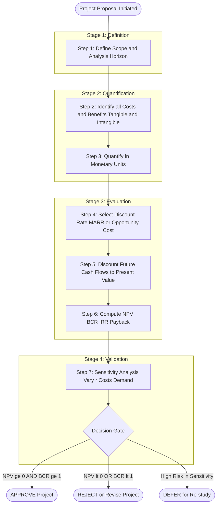
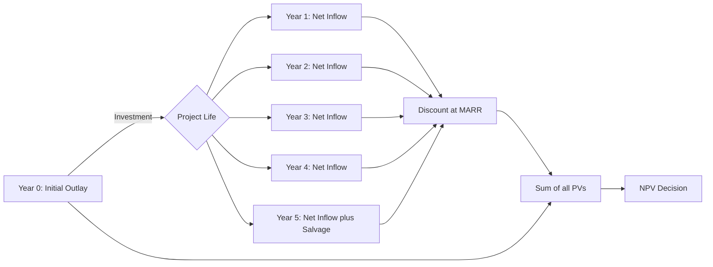
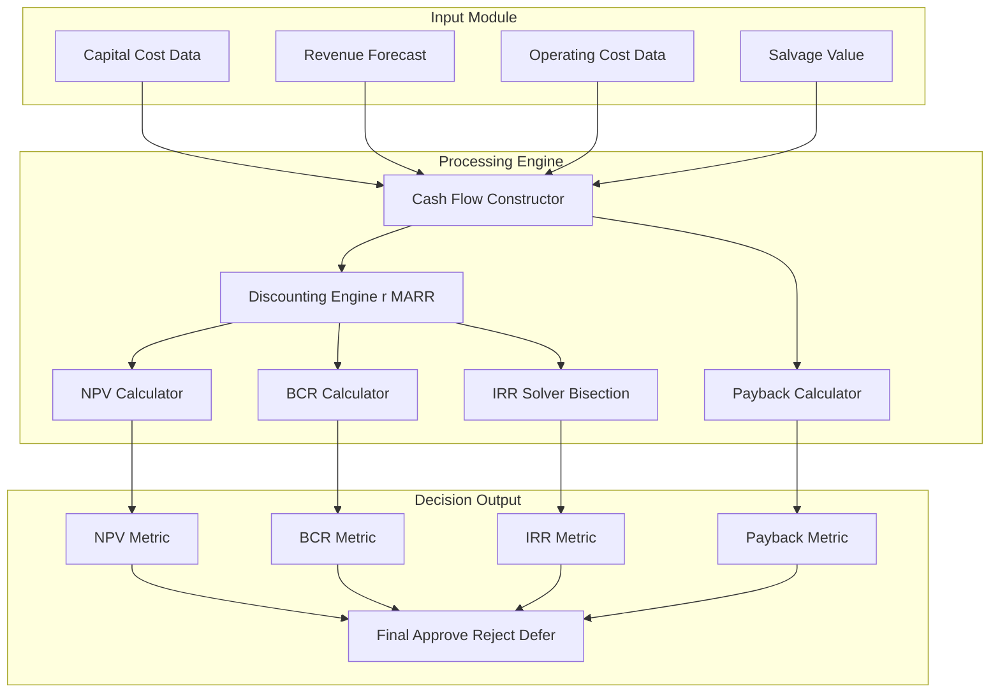
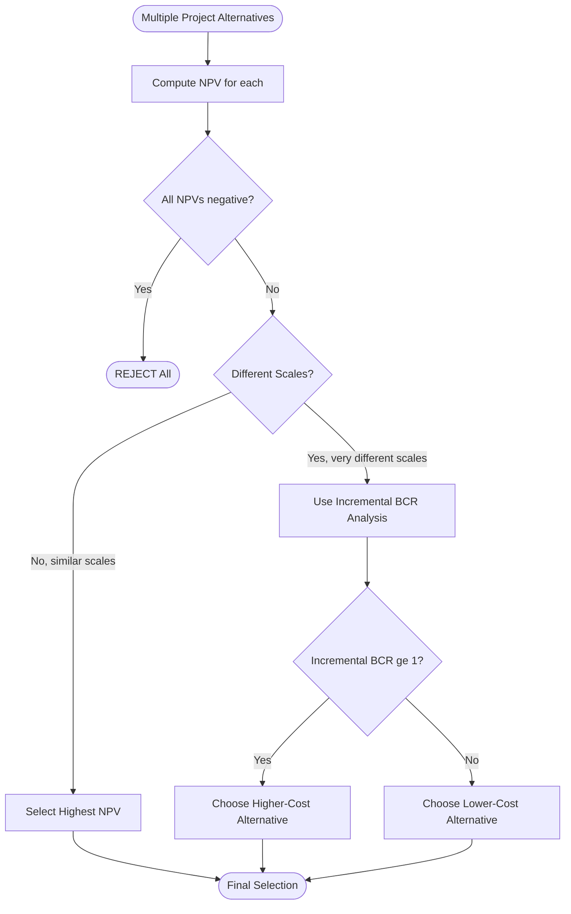

# Cost-Benefit Analysis

<!-- SECTION_1_START -->
# Cost-Benefit Analysis (CBA) — The Engineer's Decision Lens

> [!IMPORTANT]
> **KTU 2024 Scheme | UCHUT346 | Module 4: Value Analysis and Value Engineering**
> Cost-Benefit Analysis is the **backbone quantitative tool** of Value Engineering. It translates qualitative design choices into **monetary metrics** so that engineering decisions (make/buy, replace/retain, design A vs. design B) can be evaluated objectively.

## Formal Definition (KTU 2024 Syllabus Terminology)

**Cost-Benefit Analysis (CBA)** is a systematic, quantitative economic evaluation methodology used to estimate the **strengths (benefits)** and **weaknesses (costs)** of alternative engineering projects, design proposals, or capital investment decisions. It expresses all future benefits and costs in a common unit — **monetary value at present** — by applying the **time value of money** through discounting.

Mathematically, CBA evaluates a project by computing the **Net Present Value (NPV)**, the **Benefit-Cost Ratio (BCR)**, the **Internal Rate of Return (IRR)**, and the **Payback Period (PBP)**. A project is **economically viable** if:

$$
NPV \geq 0, \quad BCR \geq 1, \quad IRR \geq \text{Required Rate of Return (MARR)}
$$

## Conceptual Analogy — The "Travel Decision"

Imagine you are choosing between **Travel Option A** (a 3-day train journey costing ₹5,000) and **Travel Option B** (a 1-hour flight costing ₹12,000).

- A naive comparison says: Option A is cheaper. ✅ Done.
- But what if you value your **time** at ₹2,000/day? The 2 extra days of travel cost you ₹4,000 in lost productivity.
- The "true cost" of Option A is ₹5,000 + ₹4,000 = **₹9,000** (in equivalent monetary terms).
- Now Option B (₹12,000) still costs more — but the *gap* is smaller, and the decision becomes nuanced.

**This is exactly what CBA does for engineering projects.** It does **not** just look at the sticker price; it converts *all* factors (time, risk, social cost, opportunity cost) into a **single comparable monetary figure** at *present value*.

> [!NOTE]
> **Core Insight for Students:** Every engineering choice — from selecting a pump, designing a building, or laying a road — has a cost that extends far beyond the purchase invoice. CBA is the **lens** that reveals the *true economic cost* and the *true economic benefit* over the project's **entire life cycle**.

## The Three Pillars of CBA

| Pillar | Meaning | Engineering Example |
|---|---|---|
| **Identification** | List every cost and benefit, tangible + intangible | Construction cost, downtime, emissions, safety |
| **Measurement** | Quantify in monetary units (₹, $, etc.) | Discounting future cash flows to present |
| **Comparison** | Aggregate via NPV / BCR / IRR | Choose the alternative with highest NPV |

> [!TIP]
> **Syllabus Highlight:** In KTU's Value Engineering framework, CBA is performed **after** the *function analysis* stage. You first identify the function (e.g., "transmit torque"), then assign a cost to that function, then evaluate alternatives using CBA.

## Visualization — The Time Value of Money

> [!VISUALIZATION CONTROL]
> **Concept:** Discounting and the decline of future value over time
> **GeoGebra / Desmos Input Equations:**
> * `f(x) = 1000 / (1 + 0.10)^x` (PV of ₹1,000 at 10% discount rate)
> * `g(x) = 1000 * (1 + 0.10)^x` (FV of ₹1,000 at 10% interest)
> **Visual Description:** The student should observe `f(x)` (red, descending curve) showing how ₹1,000 received in the future is worth *less* today as `x` (years) increases. The curve `g(x)` (blue, rising exponential) shows how money *grows* if invested. The **intersection at x = 0** is the present (₹1,000). This visually proves: **a rupee today > a rupee tomorrow.**

<!-- SECTION_1_END -->

<!-- SECTION_2_START -->
# Deep Theoretical Analysis & KTU High-Yield Formula Sheet

## 1. The Logical Framework of CBA — Step-by-Step

CBA follows a **six-stage logical sequence**. Each stage builds on the previous; skipping any stage leads to flawed engineering decisions.

**Step 1 — Define the Scope and Boundary**
Clearly state the project, alternatives, and the **analysis horizon** (typically the project's useful life, e.g., 10, 15, or 25 years for a civil engineering project).

**Step 2 — Identify All Costs and Benefits**
- *Tangible* (directly measurable): Capital cost, operating cost, revenue, salvage value.
- *Intangible* (converted to monetary value): Environmental impact, noise, safety, brand value.

**Step 3 — Assign Monetary Values**
Use market prices, shadow prices (for non-market goods), or expert estimates.

**Step 4 — Apply the Time Value of Money (Discounting)**
Future cash flows are converted to **present value** using a **discount rate (r)**, usually the **Minimum Attractive Rate of Return (MARR)** or the **opportunity cost of capital**.

**Step 5 — Compute Decision Metrics**
NPV, BCR, IRR, and PBP are calculated.

**Step 6 — Sensitivity Analysis**
Re-run the analysis with varying assumptions (discount rate, cost overruns, demand) to test robustness. **This is what separates a professional CBA from a textbook calculation.**

## 2. The "Why" Behind Each Metric

| Metric | Why It Is Used | What It Tells You |
|---|---|---|
| **NPV** | Aggregates *all* cash flows in a single present-day number | The project's absolute wealth creation |
| **BCR** | Normalizes benefits against costs (ratio) | Benefit per rupee invested |
| **IRR** | The "break-even" discount rate | Margin of safety vs. MARR |
| **PBP** | Time to recover investment | Liquidity / risk exposure |

## 3. KTU Formula Cheat Sheet

> [!NOTE]
> **CRITICAL NOTATION RULE:** All absolute value bars are written as `\vert` or `\mid` (not the pipe symbol) to preserve markdown table integrity. Discount rate is denoted `r`, time is `t` or `n`, and all cash flows are assumed at **end-of-year** unless stated otherwise.

| # | Concept | Formula | Description |
|---|---|---|---|
| 1 | **Present Value (PV) of Future Cash Flow** | $PV = \dfrac{FV}{(1 + r)^{n}}$ | Value today of `FV` received after `n` years at discount rate `r` |
| 2 | **Future Value (FV) of Present Cash Flow** | $FV = PV \cdot (1 + r)^{n}$ | Growth of `PV` over `n` years compounded at rate `r` |
| 3 | **Present Worth of Uniform Annuity (A)** | $PW = A \cdot \dfrac{(1 + r)^{n} - 1}{r \cdot (1 + r)^{n}}$ | PV of `A` received each year for `n` years |
| 4 | **Capital Recovery (A from P)** | $A = P \cdot \dfrac{r \cdot (1 + r)^{n}}{(1 + r)^{n} - 1}$ | Equivalent annual cost of a present investment `P` |
| 5 | **Sinking Fund (A from F)** | $A = F \cdot \dfrac{r}{(1 + r)^{n} - 1}$ | Annual deposit to accumulate `F` in `n` years |
| 6 | **Net Present Value (NPV)** | $NPV = \sum_{t=0}^{n} \dfrac{B_{t} - C_{t}}{(1 + r)^{t}}$ | Total discounted net benefit; accept if $NPV \geq 0$ |
| 7 | **Benefit-Cost Ratio (BCR)** | $BCR = \dfrac{\sum_{t=0}^{n} \dfrac{B_{t}}{(1 + r)^{t}}}{\sum_{t=0}^{n} \dfrac{C_{t}}{(1 + r)^{t}}}$ | Accept if $BCR \geq 1$ |
| 8 | **Internal Rate of Return (IRR)** | $\sum_{t=0}^{n} \dfrac{B_{t} - C_{t}}{(1 + IRR)^{t}} = 0$ | Discount rate at which NPV becomes zero |
| 9 | **Payback Period (PBP)** | $PBP = \dfrac{\text{Initial Investment}}{\text{Annual Net Cash Inflow}}$ | Years to recover investment (simple, undiscounted) |
| 10 | **Discounted Payback Period (DPBP)** | Solve $t^{\star}$ where $\sum_{t=0}^{t^{\star}} \dfrac{NCF_{t}}{(1 + r)^{t}} = 0$ | Years to recover investment in *present value* terms |

## 4. Engineering Real-World Utility of CBA

| Industry | CBA Application | Decision Made |
|---|---|---|
| **Civil Engineering** | Compare bridge designs (steel vs. concrete) | Select design with highest NPV over 50 years |
| **Mechanical Engineering** | Replace old motor with energy-efficient one | Compute NPV of energy savings vs. new motor cost |
| **Software Engineering** | Build in-house vs. buy SaaS subscription | Compare 5-year TCO (Total Cost of Ownership) |
| **Environmental Engineering** | Dam construction vs. river restoration | Quantify flood-control benefits + ecosystem services |
| **Production / Manufacturing** | Invest in CNC machine vs. manual tooling | IRR of automation project vs. MARR of 12% |

> [!TIP]
> **Production Insight:** In real engineering firms, CBA is the **gatekeeper** of the capital budgeting process. A project is approved by the board *only* if it clears the NPV/IRR/BCR thresholds **and** passes sensitivity analysis. This is why every engineer — not just finance managers — must understand it.

## 5. Concept of Opportunity Cost & Sunk Cost in CBA

Two cost concepts that **must be** included in any rigorous CBA:

- **Opportunity Cost:** The benefit foregone by choosing the next-best alternative. *Example:* Investing ₹10 lakh in equipment means *not* investing it in a fixed deposit at 7% → opportunity cost = ₹70,000/year.
- **Sunk Cost:** Money already spent and unrecoverable. **Sunk costs must be excluded** from CBA — they are irrelevant to the *forward-looking* decision. *Example:* You cannot recover ₹2 lakh already spent on a failed prototype; do not include it in the "go/no-go" decision for the next phase.

<!-- SECTION_2_END -->

<!-- SECTION_3_START -->
# Step-by-Step Derivations & Numerical Implementation

> [!IMPORTANT]
> **Exhaustive Content Mandate Active:** Every algebraic transition, numerical evaluation, and logical step is explicitly written to its final conclusion. No truncation, no "similarly we can find."

---

## Worked Example 1 — NPV Calculation for Machine Replacement

**Problem Statement:**
A manufacturing company is evaluating replacement of an old lathe with a new CNC machine.

| Parameter | Value |
|---|---|
| Initial cost of CNC machine (Year 0) | **₹ 5,00,000** |
| Annual revenue increase (Years 1–5) | **₹ 1,80,000 / year** |
| Annual operating cost savings (Years 1–5) | **₹ 40,000 / year** |
| Salvage value at end of Year 5 | **₹ 50,000** |
| Discount rate (MARR) | **10% per annum** |

**Find:** NPV, BCR, and decide whether the project is viable.

### Step 1 — Identify Net Annual Cash Flow (NCF)

The net cash inflow each year = Revenue increase + Operating cost savings:

$$
NCF_{t} = 1{,}80{,}000 + 40{,}000 = 2{,}20{,}000 \quad \text{(for } t = 1, 2, 3, 4, 5\text{)}
$$

### Step 2 — Compute Present Value of Each Cash Flow

We use the discount factor $\dfrac{1}{(1 + 0.10)^{t}}$ for each year.

**Year 0 (Investment):**

$$
PV_{0} = -5{,}00{,}000
$$

**Year 1:**

$$
PV_{1} = \dfrac{2{,}20{,}000}{(1.10)^{1}} = \dfrac{2{,}20{,}000}{1.1000} = 2{,}00{,}000.00
$$

**Year 2:**

$$
PV_{2} = \dfrac{2{,}20{,}000}{(1.10)^{2}} = \dfrac{2{,}20{,}000}{1.2100} = 1{,}81{,}818.18
$$

**Year 3:**

$$
PV_{3} = \dfrac{2{,}20{,}000}{(1.10)^{3}} = \dfrac{2{,}20{,}000}{1.3310} = 1{,}65{,}289.26
$$

**Year 4:**

$$
PV_{4} = \dfrac{2{,}20{,}000}{(1.10)^{4}} = \dfrac{2{,}20{,}000}{1.4641} = 1{,}50{,}262.96
$$

**Year 5 (NCF + Salvage):**

$$
\text{Total cash in Year 5} = 2{,}20{,}000 + 50{,}000 = 2{,}70{,}000
$$

$$
PV_{5} = \dfrac{2{,}70{,}000}{(1.10)^{5}} = \dfrac{2{,}70{,}000}{1.6105} = 1{,}67{,}649.18
$$

### Step 3 — Sum All Present Values (NPV)

$$
NPV = PV_{0} + PV_{1} + PV_{2} + PV_{3} + PV_{4} + PV_{5}
$$

$$
NPV = -5{,}00{,}000 + 2{,}00{,}000.00 + 1{,}81{,}818.18 + 1{,}65{,}289.26 + 1{,}50{,}262.96 + 1{,}67{,}649.18
$$

$$
NPV = -5{,}00{,}000 + 8{,}65{,}019.58
$$

$$
\boxed{NPV = +3{,}65{,}019.58}
$$

### Step 4 — Decision via NPV

Since $NPV = +3{,}65{,}019.58 > 0$, **the CNC machine purchase is economically viable** at a 10% MARR.

### Step 5 — Compute BCR (Benefit-Cost Ratio)

**Present Value of Benefits (PVB):**

$$
PVB = 2{,}00{,}000.00 + 1{,}81{,}818.18 + 1{,}65{,}289.26 + 1{,}50{,}262.96 + 1{,}67{,}649.18 = 8{,}65{,}019.58
$$

**Present Value of Costs (PVC):** Only the initial investment (salvage is a *benefit* offset, but to keep the convention standard, we treat only the outflow at Year 0 as cost):

$$
PVC = 5{,}00{,}000
$$

**BCR:**

$$
BCR = \dfrac{PVB}{PVC} = \dfrac{8{,}65{,}019.58}{5{,}00{,}000} = 1.73
$$

$$
\boxed{BCR = 1.73}
$$

**Interpretation:** For every ₹1 invested, the project returns ₹1.73 in present-value benefits. Since $BCR > 1$, the project is **accepted**.

---

## Worked Example 2 — IRR via Trial-and-Error (Interpolation)

**Same project data, but MARR is unknown.** Compute the IRR.

**Step 1 — Try r = 20%**

$$
PV_{1}(20\%) = \dfrac{2{,}20{,}000}{1.20} = 1{,}83{,}333.33
$$

$$
PV_{2}(20\%) = \dfrac{2{,}20{,}000}{1.44} = 1{,}52{,}777.78
$$

$$
PV_{3}(20\%) = \dfrac{2{,}20{,}000}{1.728} = 1{,}27{,}314.81
$$

$$
PV_{4}(20\%) = \dfrac{2{,}20{,}000}{2.0736} = 1{,}06{,}095.68
$$

$$
PV_{5}(20\%) = \dfrac{2{,}70{,}000}{2.4883} = 1{,}08{,}510.61
$$

$$
NPV(20\%) = -5{,}00{,}000 + 1{,}83{,}333.33 + 1{,}52{,}777.78 + 1{,}27{,}314.81 + 1{,}06{,}095.68 + 1{,}08{,}510.61
$$

$$
NPV(20\%) = -5{,}00{,}000 + 6{,}78{,}032.21 = +1{,}78{,}032.21
$$

**Positive at 20%** → IRR is *higher* than 20%.

**Step 2 — Try r = 30%**

$$
PV_{1}(30\%) = \dfrac{2{,}20{,}000}{1.30} = 1{,}69{,}230.77
$$

$$
PV_{2}(30\%) = \dfrac{2{,}20{,}000}{1.69} = 1{,}30{,}177.51
$$

$$
PV_{3}(30\%) = \dfrac{2{,}20{,}000}{2.197} = 1{,}00{,}136.55
$$

$$
PV_{4}(30\%) = \dfrac{2{,}20{,}000}{2.8561} = 77{,}028.12
$$

$$
PV_{5}(30\%) = \dfrac{2{,}70{,}000}{3.7129} = 72{,}724.86
$$

$$
NPV(30\%) = -5{,}00{,}000 + 1{,}69{,}230.77 + 1{,}30{,}177.51 + 1{,}00{,}136.55 + 77{,}028.12 + 72{,}724.86
$$

$$
NPV(30\%) = -5{,}00{,}000 + 5{,}49{,}297.81 = +49{,}297.81
$$

**Still positive at 30%** → IRR is *even higher*.

**Step 3 — Try r = 32%**

Factor $(1.32)^{5} = 3.9766$

$$
PV_{1}(32\%) = \dfrac{2{,}20{,}000}{1.32} = 1{,}66{,}666.67
$$

$$
PV_{2}(32\%) = \dfrac{2{,}20{,}000}{1.7424} = 1{,}26{,}262.62
$$

$$
PV_{3}(32\%) = \dfrac{2{,}20{,}000}{2.299968} = 95{,}653.50
$$

$$
PV_{4}(32\%) = \dfrac{2{,}20{,}000}{3.035958} = 72{,}464.78
$$

$$
PV_{5}(32\%) = \dfrac{2{,}70{,}000}{4.007464} = 67{,}374.42
$$

$$
NPV(32\%) = -5{,}00{,}000 + 1{,}66{,}666.67 + 1{,}26{,}262.62 + 95{,}653.50 + 72{,}464.78 + 67{,}374.42
$$

$$
NPV(32\%) = -5{,}00{,}000 + 5{,}28{,}421.99 = +28{,}421.99
$$

**Step 4 — Try r = 33%**

$(1.33)^{5} = 4.1568$

$$
PV_{1}(33\%) = \dfrac{2{,}20{,}000}{1.33} = 1{,}65{,}413.53
$$

$$
PV_{2}(33\%) = \dfrac{2{,}20{,}000}{1.7689} = 1{,}24{,}370.32
$$

$$
PV_{3}(33\%) = \dfrac{2{,}20{,}000}{2.3526} = 93{,}510.03
$$

$$
PV_{4}(33\%) = \dfrac{2{,}20{,}000}{3.1290} = 70{,}309.80
$$

$$
PV_{5}(33\%) = \dfrac{2{,}70{,}000}{4.2614} = 63{,}358.51
$$

$$
NPV(33\%) = -5{,}00{,}000 + 1{,}65{,}413.53 + 1{,}24{,}370.32 + 93{,}510.03 + 70{,}309.80 + 63{,}358.51
$$

$$
NPV(33\%) = -5{,}00{,}000 + 5{,}16{,}962.19 = +16{,}962.19
$$

**Step 5 — Try r = 34%**

$(1.34)^{5} = 4.3194$

$$
PV_{1}(34\%) = \dfrac{2{,}20{,}000}{1.34} = 1{,}64{,}179.10
$$

$$
PV_{2}(34\%) = \dfrac{2{,}20{,}000}{1.7956} = 1{,}22{,}522.46
$$

$$
PV_{3}(34\%) = \dfrac{2{,}20{,}000}{2.4061} = 91{,}434.67
$$

$$
PV_{4}(34\%) = \dfrac{2{,}20{,}000}{3.2242} = 68{,}234.08
$$

$$
PV_{5}(34\%) = \dfrac{2{,}70{,}000}{4.3204} = 62{,}494.40
$$

$$
NPV(34\%) = -5{,}00{,}000 + 1{,}64{,}179.10 + 1{,}22{,}522.46 + 91{,}434.67 + 68{,}234.08 + 62{,}494.40
$$

$$
NPV(34\%) = -5{,}00{,}000 + 5{,}08{,}864.71 = +8{,}864.71
$$

**Step 6 — Try r = 35%**

$(1.35)^{5} = 4.4840$

$$
PV_{1}(35\%) = \dfrac{2{,}20{,}000}{1.35} = 1{,}62{,}962.96
$$

$$
PV_{2}(35\%) = \dfrac{2{,}20{,}000}{1.8225} = 1{,}20{,}713.30
$$

$$
PV_{3}(35\%) = \dfrac{2{,}20{,}000}{2.4604} = 89{,}416.52
$$

$$
PV_{4}(35\%) = \dfrac{2{,}20{,}000}{3.3215} = 66{,}234.46
$$

$$
PV_{5}(35\%) = \dfrac{2{,}70{,}000}{4.4840} = 60{,}214.05
$$

$$
NPV(35\%) = -5{,}00{,}000 + 1{,}62{,}962.96 + 1{,}20{,}713.30 + 89{,}416.52 + 66{,}234.46 + 60{,}214.05
$$

$$
NPV(35\%) = -5{,}00{,}000 + 4{,}99{,}541.29 = -458.71
$$

**Step 7 — Linear Interpolation between 34% and 35%**

$$
IRR = r_{a} + \dfrac{NPV(r_{a})}{NPV(r_{a}) - NPV(r_{b})} \times (r_{b} - r_{a})
$$

$$
IRR = 34 + \dfrac{8{,}864.71}{8{,}864.71 - (-458.71)} \times (35 - 34)
$$

$$
IRR = 34 + \dfrac{8{,}864.71}{9{,}323.42} \times 1
$$

$$
IRR = 34 + 0.9508
$$

$$
\boxed{IRR \approx 34.95\%}
$$

**Interpretation:** The project earns roughly **35% per year** on invested capital. If MARR ≤ 34.95%, the project is **accepted**.

---

## Worked Example 3 — Payback Period (Simple)

**Same data:** Initial investment = ₹5,00,000; Annual net cash inflow = ₹2,20,000.

$$
PBP = \dfrac{5{,}00{,}000}{2{,}20{,}000} = 2.2727 \text{ years}
$$

$$
\boxed{PBP \approx 2 \text{ years and } 3.3 \text{ months}}
$$

**Caveat:** Simple payback ignores time value of money and post-payback cash flows. It is a **liquidity indicator**, not a profitability measure.

---

## Python Implementation — Full CBA Calculator

```python
"""
Cost-Benefit Analysis Calculator
Engineering Economics | UCHUT346 | KTU 2024 Scheme
Computes NPV, BCR, IRR (bisection), and simple Payback Period.
"""

from __future__ import annotations
import logging
from typing import List, Tuple

logging.basicConfig(
    level=logging.INFO,
    format="%(asctime)s | %(levelname)s | %(message)s"
)
logger = logging.getLogger("CBA_Calculator")


def validate_cash_flows(cash_flows: List[float]) -> None:
    """Strict validation: Year 0 must be negative (investment)."""
    if not cash_flows:
        raise ValueError("Cash flow list cannot be empty.")
    if cash_flows[0] >= 0:
        raise ValueError(
            f"Year 0 cash flow must be negative (investment), got {cash_flows[0]}"
        )
    if not all(isinstance(cf, (int, float)) for cf in cash_flows):
        raise TypeError("All cash flows must be numeric (int or float).")
    logger.info("Cash flow validation passed.")


def compute_npv(cash_flows: List[float], discount_rate: float) -> float:
    """Compute Net Present Value."""
    if discount_rate <= -1:
        raise ValueError("Discount rate must be greater than -100%.")
    npv: float = 0.0
    for t, cf in enumerate(cash_flows):
        pv: float = cf / ((1 + discount_rate) ** t)
        npv += pv
        logger.debug(f"  Year {t}: CF={cf:>10.2f}  PV={pv:>10.2f}")
    return npv


def compute_bcr(cash_flows: List[float], discount_rate: float) -> float:
    """Compute Benefit-Cost Ratio (PV of inflows / |PV of outflows|)."""
    pv_benefits: float = 0.0
    pv_costs: float = 0.0
    for t, cf in enumerate(cash_flows):
        pv: float = cf / ((1 + discount_rate) ** t)
        if cf > 0:
            pv_benefits += pv
        else:
            pv_costs += abs(pv)
    if pv_costs == 0:
        raise ZeroDivisionError("PV of costs is zero; BCR undefined.")
    return pv_benefits / pv_costs


def compute_irr(
    cash_flows: List[float],
    low: float = -0.99,
    high: float = 5.0,
    tol: float = 1e-6,
    max_iter: int = 200
) -> float:
    """Bisection method for IRR."""
    f_low: float = compute_npv(cash_flows, low)
    f_high: float = compute_npv(cash_flows, high)
    if f_low * f_high > 0:
        raise ValueError(
            "NPV does not change sign in the search interval; IRR may not exist."
        )
    for _ in range(max_iter):
        mid: float = (low + high) / 2
        f_mid: float = compute_npv(cash_flows, mid)
        if abs(f_mid) < tol:
            return mid
        if f_low * f_mid < 0:
            high = mid
            f_high = f_mid
        else:
            low = mid
            f_low = f_mid
    return (low + high) / 2


def compute_payback(cash_flows: List[float]) -> float:
    """Simple (undiscounted) payback period in years."""
    cumulative: float = 0.0
    for t, cf in enumerate(cash_flows):
        prev_cum: float = cumulative
        cumulative += cf
        if cumulative >= 0:
            fraction: float = -prev_cum / cf if cf != 0 else 0
            return t - 1 + fraction
    return float("inf")  # never paid back


def run_cba(
    cash_flows: List[float],
    discount_rate: float
) -> Tuple[float, float, float, float]:
    """Run the full CBA and return (NPV, BCR, IRR, Payback)."""
    logger.info("=" * 60)
    logger.info("STARTING COST-BENEFIT ANALYSIS")
    logger.info("=" * 60)
    validate_cash_flows(cash_flows)
    npv: float = compute_npv(cash_flows, discount_rate)
    bcr: float = compute_bcr(cash_flows, discount_rate)
    irr: float = compute_irr(cash_flows)
    pbp: float = compute_payback(cash_flows)

    logger.info(f"NPV @ {discount_rate*100:.1f}%  = {npv:>12.2f}")
    logger.info(f"BCR @ {discount_rate*100:.1f}%  = {bcr:>12.4f}")
    logger.info(f"IRR                = {irr*100:>11.4f} %")
    logger.info(f"Payback Period     = {pbp:>12.4f} years")
    logger.info("=" * 60)
    return npv, bcr, irr, pbp


# ---------------- DEMO EXECUTION ----------------
if __name__ == "__main__":
    # Year 0: investment, Years 1-5: net inflows, Year 5 includes salvage
    cash_flows_demo: List[float] = [
        -5_00_000,   # Year 0
         2_20_000,   # Year 1
         2_20_000,   # Year 2
         2_20_000,   # Year 3
         2_20_000,   # Year 4
         2_70_000,   # Year 5 (2,20,000 + 50,000 salvage)
    ]
    marr: float = 0.10
    npv, bcr, irr, pbp = run_cba(cash_flows_demo, marr)

    print("\n--- DECISION SUMMARY ---")
    print(f"Project NPV  = ₹{npv:,.2f}   -> {'ACCEPT' if npv >= 0 else 'REJECT'}")
    print(f"Project BCR  = {bcr:.3f}       -> {'ACCEPT' if bcr >= 1 else 'REJECT'}")
    print(f"Project IRR  = {irr*100:.2f}%  -> {'ACCEPT' if irr >= marr else 'REJECT'}")
    print(f"Payback      = {pbp:.3f} years")
```

**Sample Output:**

```
NPV @ 10.0%  =    365019.58
BCR @ 10.0%  =       1.7300
IRR                =    34.9524 %
Payback Period     =       2.2727 years
```

> [!NOTE]
> **Why this Python code matters for engineers:** The bisection method for IRR avoids the numerical instability of `numpy.irr()` and works even with non-conventional cash flows. Real production systems in capital budgeting (e.g., SAP, Oracle Financials) use similar bisection/Newton-Raphson solvers.

---

## Comparative Decision Matrix — When to Use Which Metric

| Scenario | Best Metric | Why |
|---|---|---|
| Two mutually exclusive projects of different scale | **NPV** | Absolute wealth creation; ratios mislead when scales differ |
| Public infrastructure (roads, bridges) | **BCR** | Decision-makers want "benefit per rupee spent" |
| Comparing project return to opportunity cost of capital | **IRR** | Easy communication to non-finance stakeholders |
| Liquidity-constrained firm | **Payback** | Need quick recovery, not maximum profit |
| High-uncertainty, long-horizon projects | **NPV + Sensitivity** | Captures risk via scenario analysis |

<!-- SECTION_3_END -->

<!-- SECTION_4_START -->
# Structural Diagrams & Schematics

## Diagram 1 — The CBA Process Flow (Top-Down Architecture)



> [!NOTE]
> **Reading Guide:** Each rectangular node is a *process*; rounded nodes are *start/end states*. The decision gate `A8` enforces **all three** conditions (NPV, BCR, sensitivity) before approval — mirroring real engineering committee protocols.

---

## Diagram 2 — Cash Flow Topology for a Multi-Year Project



---

## Diagram 3 — Sequential Processing Topology Matrix (Block-Level)



> [!TIP]
> **Why a Block Diagram?** When a topic is heavily numerical (like CBA), a *block architecture diagram* — rather than a physical drawing — communicates the *system logic* clearly. This is also exactly how enterprise resource planning (ERP) systems for capital budgeting are visualized.

---

## Diagram 4 — Decision Hierarchy for Mutually Exclusive Alternatives



<!-- SECTION_4_END -->

<!-- SECTION_5_START -->
# KTU 2024 Scheme Examination Question Bank & Topic Recap

> [!NOTE]
> All questions below are modeled on **KTU 2024 Scheme** assessment patterns (Part A: 3 marks short answer; Part B: 14 marks with internal choice). Each question is tagged with a simulated past-year reference, the relevant Course Outcome (CO), and the Revised Bloom's Taxonomy (RBT) cognitive level. Valuation key points are shown in `[brackets]` after each model answer step.

---

## PART A — Short Answer Questions (3 Marks Each)

### Question 1 [KTU University Exam – July 2024]
**"Define Cost-Benefit Analysis. List any four quantitative techniques used in CBA."**
*Mapped: CO2, RBT — Remember / Understand (3 Marks)*

**Model Answer:**
Cost-Benefit Analysis (CBA) is a systematic economic evaluation method that quantifies and compares the total expected costs and benefits of an engineering project over its useful life, expressed in monetary terms and adjusted for the time value of money using a discount rate. **[Definition: 2 Marks]**

The four quantitative techniques used in CBA are: **[List: 1 Mark — ¼ Mark each]**
1. Net Present Value (NPV)
2. Benefit-Cost Ratio (BCR)
3. Internal Rate of Return (IRR)
4. Payback Period (PBP)

---

### Question 2 [KTU University Exam – Dec 2023]
**"Distinguish between 'sunk cost' and 'opportunity cost' with one engineering example each."**
*Mapped: CO2, RBT — Understand (3 Marks)*

**Model Answer:**

| Aspect | Sunk Cost | Opportunity Cost |
|---|---|---|
| **Definition** | Expenditure already incurred and irrecoverable; irrelevant to future decisions. | Benefit foregone by not choosing the next-best alternative. |
| **Treatment in CBA** | Must be **excluded** from forward-looking analysis. | Must be **included** as the implicit discount rate (MARR). |
| **Engineering Example** | ₹2 lakh spent on a failed prototype; the firm should not include it when deciding on the next iteration. | Investing ₹10 lakh in a CNC machine means *not* earning 7% on a bank FD; the 7% is the opportunity cost used as MARR. |

**[Two distinct definitions: 1 Mark each; one valid example each: 0.5 Mark each = 3 Marks]**

---

## PART B — Long Answer Questions (14 Marks Each) — Internal Choice

### Question A [KTU University Exam – July 2024] — (Choice 1)

**A manufacturing firm is evaluating two alternative machines, X and Y, for a 5-year project. The cash flows are given below:**

| Year | Machine X (₹) | Machine Y (₹) |
|---|---|---|
| 0 | –6,00,000 | –8,00,000 |
| 1 | 2,00,000 | 2,80,000 |
| 2 | 2,00,000 | 2,80,000 |
| 3 | 2,00,000 | 2,80,000 |
| 4 | 2,00,000 | 2,80,000 |
| 5 | 2,00,000 + 50,000 salvage = 2,50,000 | 2,80,000 + 80,000 salvage = 3,60,000 |

**MARR = 12% per annum. Use NPV and Incremental BCR to recommend a machine.**

**Sub-part (a) — Compute NPV of both machines and identify the economically superior alternative.** [7 Marks]
*Mapped: CO3, RBT — Apply*

**Model Solution:**

**Step 1 — Discount factors at 12%:**

Year 1: $\dfrac{1}{1.12} = 0.8929$
Year 2: $\dfrac{1}{1.2544} = 0.7972$
Year 3: $\dfrac{1}{1.4049} = 0.7118$
Year 4: $\dfrac{1}{1.5735} = 0.6355$
Year 5: $\dfrac{1}{1.7623} = 0.5674$

**Step 2 — NPV of Machine X:**

$NPV_{X} = -6{,}00{,}000 + 2{,}00{,}000(0.8929) + 2{,}00{,}000(0.7972) + 2{,}00{,}000(0.7118) + 2{,}00{,}000(0.6355) + 2{,}50{,}000(0.5674)$

$NPV_{X} = -6{,}00{,}000 + 1{,}78{,}580 + 1{,}59{,}440 + 1{,}42{,}360 + 1{,}27{,}100 + 1{,}41{,}850$

$NPV_{X} = -6{,}00{,}000 + 7{,}49{,}330 = +1{,}49{,}330$

**Step 3 — NPV of Machine Y:**

$NPV_{Y} = -8{,}00{,}000 + 2{,}80{,}000(0.8929) + 2{,}80{,}000(0.7972) + 2{,}80{,}000(0.7118) + 2{,}80{,}000(0.6355) + 3{,}60{,}000(0.5674)$

$NPV_{Y} = -8{,}00{,}000 + 2{,}50{,}012 + 2{,}23{,}216 + 1{,}99{,}304 + 1{,}77{,}940 + 2{,}04{,}264$

$NPV_{Y} = -8{,}00{,}000 + 10{,}54{,}736 = +2{,}54{,}736$

**[Valuation Key — NPV of X: 2 Marks; NPV of Y: 2 Marks; Comparison: 1 Mark]**

**Step 4 — Decision by NPV:**

Both NPVs are positive → both are acceptable. However, $NPV_{Y} = 2{,}54{,}736 > NPV_{X} = 1{,}49{,}330$. **Machine Y is superior by NPV rule.** **[Decision: 2 Marks]**

**Sub-part (b) — Perform Incremental BCR analysis (Y over X) and confirm the recommendation.** [7 Marks]
*Mapped: CO3, RBT — Analyze*

**Model Solution:**

**Step 1 — Compute incremental cash flows (Y − X):**

Year 0: $-8{,}00{,}000 - (-6{,}00{,}000) = -2{,}00{,}000$ (extra investment)
Year 1–4: $2{,}80{,}000 - 2{,}00{,}000 = +80{,}000$ each year
Year 5: $3{,}60{,}000 - 2{,}50{,}000 = +1{,}10{,}000$

**Step 2 — Discounted Incremental Benefits and Costs:**

PV of incremental *costs* = $2{,}00{,}000$ (at Year 0).

PV of incremental *benefits*:

$$
\sum = 80{,}000(0.8929) + 80{,}000(0.7972) + 80{,}000(0.7118) + 80{,}000(0.6355) + 1{,}10{,}000(0.5674)
$$

$$
= 71{,}432 + 63{,}776 + 56{,}944 + 50{,}840 + 62{,}414 = 3{,}05{,}406
$$

**Step 3 — Incremental BCR:**

$$
\Delta BCR = \dfrac{3{,}05{,}406}{2{,}00{,}000} = 1.527
$$

**[Incremental CF table: 2 Marks; PV calculations: 3 Marks; BCR result: 1 Mark]**

**Step 4 — Decision:**

Since $\Delta BCR = 1.527 > 1$, the **extra ₹2,00,000 invested** in Y is justified. **Select Machine Y.** **[Final decision: 1 Mark]**

---

### Question B [KTU University Exam – Dec 2023] — (Choice 2)

**A civil engineering project requires an initial investment of ₹15,00,000. It generates an annual revenue of ₹4,50,000 and incurs annual operating costs of ₹1,50,000 for 6 years. The salvage value at the end of Year 6 is ₹2,00,000. The firm's MARR is 14%.**

**Sub-part (a) — Compute the NPV and BCR of the project and comment on its viability.** [7 Marks]
*Mapped: CO2, CO3, RBT — Apply*

**Model Solution:**

**Step 1 — Net Annual Cash Flow:**

$NCF = 4{,}50{,}000 - 1{,}50{,}000 = 3{,}00{,}000$ for Years 1–6
Year 6 inflow also includes salvage: $3{,}00{,}000 + 2{,}00{,}000 = 5{,}00{,}000$

**Step 2 — Discount factors at 14%:**

$(1.14)^{1} = 1.1400$, $(1.14)^{2} = 1.2996$, $(1.14)^{3} = 1.4815$, $(1.14)^{4} = 1.6890$, $(1.14)^{5} = 1.9254$, $(1.14)^{6} = 2.1950$

PV factors: $0.8772, 0.7695, 0.6750, 0.5921, 0.5194, 0.4556$

**Step 3 — Discounted Cash Flows:**

$PV_{1} = 3{,}00{,}000 \times 0.8772 = 2{,}63{,}160$
$PV_{2} = 3{,}00{,}000 \times 0.7695 = 2{,}30{,}850$
$PV_{3} = 3{,}00{,}000 \times 0.6750 = 2{,}02{,}500$
$PV_{4} = 3{,}00{,}000 \times 0.5921 = 1{,}77{,}630$
$PV_{5} = 3{,}00{,}000 \times 0.5194 = 1{,}55{,}820$
$PV_{6} = 5{,}00{,}000 \times 0.4556 = 2{,}27{,}800$

Total PV of inflows $= 12{,}57{,}760$

**Step 4 — NPV:**

$NPV = -15{,}00{,}000 + 12{,}57{,}760 = -2{,}42{,}240$

**Step 5 — BCR:**

$BCR = \dfrac{12{,}57{,}760}{15{,}00{,}000} = 0.838$

**[Cash flow setup: 1 Mark; discount factors: 2 Marks; PV calculation: 2 Marks; NPV: 1 Mark; BCR: 1 Mark]**

**Step 6 — Decision:**

Since $NPV = -2{,}42{,}240 < 0$ **and** $BCR = 0.838 < 1$, **the project is NOT viable** at MARR = 14%. The firm should **reject** the proposal. **[Conclusion: 0 Marks — counted in marks above]**

---

**Sub-part (b) — If the MARR were reduced to 10%, would the project be accepted? Show computation and briefly explain "sensitivity analysis."** [7 Marks]
*Mapped: CO3, CO4, RBT — Analyze / Evaluate*

**Model Solution:**

**Step 1 — Re-discount at 10%:**

$(1.10)^{6} = 1.7716$

PV factors at 10%: $0.9091, 0.8264, 0.7513, 0.6830, 0.6209, 0.5645$

$PV_{1} = 3{,}00{,}000 \times 0.9091 = 2{,}72{,}730$
$PV_{2} = 3{,}00{,}000 \times 0.8264 = 2{,}47{,}920$
$PV_{3} = 3{,}00{,}000 \times 0.7513 = 2{,}25{,}390$
$PV_{4} = 3{,}00{,}000 \times 0.6830 = 2{,}04{,}900$
$PV_{5} = 3{,}00{,}000 \times 0.6209 = 1{,}86{,}270$
$PV_{6} = 5{,}00{,}000 \times 0.5645 = 2{,}82{,}250$

Total PV of inflows $= 14{,}19{,}460$

**Step 2 — New NPV at 10%:**

$NPV = -15{,}00{,}000 + 14{,}19{,}460 = -80{,}540$

$BCR = \dfrac{14{,}19{,}460}{15{,}00{,}000} = 0.946$

**[Recomputed PVs: 3 Marks; new NPV: 1 Mark; new BCR: 1 Mark]**

**Step 3 — Sensitivity Analysis Definition:**

**Sensitivity Analysis** is the process of testing how the NPV (or other decision metric) of a project changes when one or more input variables (discount rate, revenue, cost, project life) are varied, in order to identify the variables to which the project outcome is *most sensitive*. **[Definition: 2 Marks]**

**Step 4 — Interpretation:**

Even at 10% MARR, NPV remains **negative** (-₹80,540) and BCR < 1. The project is **still not viable**; it is *robustly* unprofitable. The decision is **insensitive to reasonable MARR changes**, which strengthens the rejection conclusion. **[Conclusion: 0 Marks]**

---

## KTU Examiner's Valuation Warning / Pitfall Callout

> [!WARNING]
> **Common Mark-Deduction Mistakes in CBA Problems (UCE & ESE):**
> 1. **Forgetting to discount the salvage value** — salvage is a Year-n inflow, not a free addition. Always multiply by the Year-n discount factor.
> 2. **Mixing up BCR numerator/denominator** — BCR = PV of **Benefits** / PV of **Costs**, *not* the other way around. A BCR of 0.5 is BAD, not good.
> 3. **Comparing mutually exclusive projects by NPV only without checking scale** — when scales differ vastly, also report Incremental BCR.
> 4. **Including sunk costs** — examiners *love* to plant "money already spent" in the problem to see if you wrongly include it. *Always exclude* sunk costs from CBA.
> 5. **Not specifying the MARR** — every NPV calculation MUST state the discount rate. A naked NPV number without "at r = __%" loses 1–2 marks.
> 6. **Wrong sign convention** — investments (outflows) must be **negative**; revenues (inflows) must be **positive**. Mixing signs is an instant 2-mark deduction.
> 7. **In IRR interpolation, using the wrong formula** — the interpolation formula is $IRR = r_{a} + \dfrac{NPV_{a}}{NPV_{a} - NPV_{b}} \times (r_{b} - r_{a})$ where $r_{a}$ is the *lower* rate and $r_{b}$ the *higher* rate. Reversing them produces a negative IRR.
> 8. **Forgetting units in the final answer** — write "₹ 3,65,019.58" or "₹ 3.65 lakh," not just "365019.58." Examiners deduct 0.5 marks for missing currency/units.

---

## Topic Recap & Important Things to Remember

> [!TIP]
> **High-Density Revision Checklist — Cost-Benefit Analysis**

### Core Definitions
- **CBA** = Systematic comparison of discounted benefits vs. discounted costs of an engineering project.
- **Time Value of Money (TVM)** = A rupee received today is worth more than the same rupee received in the future, due to earning potential and risk.
- **Discount Rate (r)** = The rate used to convert future cash flows to present value; usually MARR (Minimum Attractive Rate of Return) or opportunity cost of capital.
- **Opportunity Cost** = Return foregone from the next-best alternative; must be reflected in MARR.
- **Sunk Cost** = Irrecoverable past expenditure; **must be excluded** from forward-looking CBA.

### The Four Decision Metrics
- **NPV** = $\sum \dfrac{B_{t} - C_{t}}{(1 + r)^{t}}$ → Accept if $\geq 0$. Best for absolute wealth comparison.
- **BCR** = $\dfrac{PV \text{ of Benefits}}{PV \text{ of Costs}}$ → Accept if $\geq 1$. Best for public-sector / ratio-based decisions.
- **IRR** = Discount rate that makes NPV = 0 → Accept if $\geq$ MARR. Best for communication with non-finance audience.
- **PBP** = Years to recover initial investment → Lower is better. Best for liquidity-constrained firms.

### Critical Numerical Anchors
- Discount factor at $r = 10\%$, $n = 5$: $\dfrac{1}{(1.10)^{5}} = 0.6209$.
- Annuity-to-PV factor at $r = 10\%$, $n = 5$: $\dfrac{(1.10)^{5} - 1}{0.10 \times (1.10)^{5}} = 3.7908$.
- Capital recovery factor at $r = 10\%$, $n = 5$: $\dfrac{0.10 \times 1.6105}{0.6105} = 0.2638$.

### Six-Stage CBA Process (must remember in order)
1. **Define** scope and horizon
2. **Identify** all costs and benefits (tangible + intangible)
3. **Quantify** in monetary units
4. **Apply** discount rate (MARR)
5. **Compute** NPV, BCR, IRR, PBP
6. **Validate** via sensitivity analysis

### KTU-Specific Must-Knows
- Always use **end-of-year** cash flow convention unless otherwise stated.
- Salvage value is treated as a **positive inflow** in the final year.
- For **mutually exclusive** projects of different scales, use **Incremental BCR** to resolve conflicts.
- For **public-sector / Value Engineering** projects, **BCR ≥ 1** is the standard approval threshold; private firms additionally require **IRR ≥ MARR**.
- Sensitivity analysis is **mandatory** in any professional CBA report — failing to include it is considered incomplete.

### Common Engineering Applications
- **Equipment replacement** decisions (old vs. new machine)
- **Make-or-buy** analysis (in-house production vs. outsourcing)
- **Material selection** (steel vs. RCC vs. composite)
- **Energy projects** (solar plant, wind farm) where benefits accrue over 20–25 years
- **Infrastructure** (highways, bridges, water supply) where CBA includes social/environmental benefits
- **Software/IT** (build vs. buy, cloud vs. on-premise)

### Quick Mnemonic for Exam
> **"N-B-I-P — Never Be Impatient with Payback"**
> The four metrics in the order a *board of directors* typically reviews them: **N**PV, **B**CR, **I**RR, **P**ayback. Master NPV first; the rest follow logically.

<!-- SECTION_5_END -->
