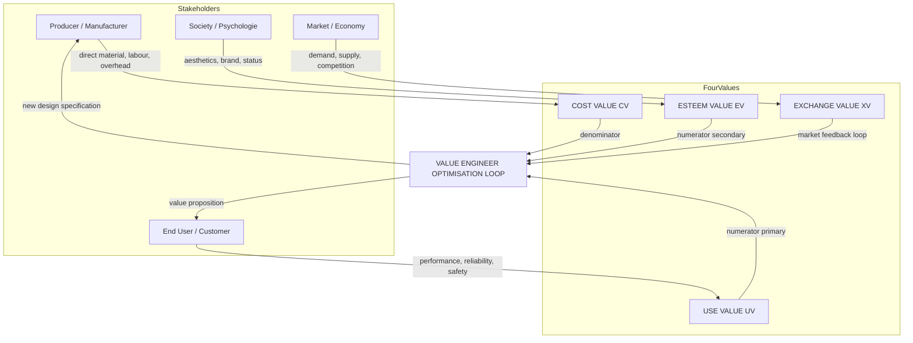
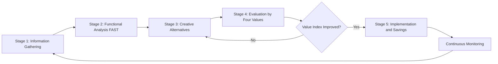

# Cost Value, Exchange Value, Use Value, Esteem Value

<!-- SECTION_1_START -->
# Cost Value, Exchange Value, Use Value & Esteem Value

> [!NOTE]
> **KTU 2024 Scheme | UCHUT346 — Economics for Engineers | Module 4: Value Analysis & Value Engineering**
> **Course Outcome Mapped:** CO3 — Apply the concepts of value analysis and value engineering for optimizing engineering solutions.

## 1.1 Formal Academic Definition

In the discipline of **Value Analysis (VA)** and **Value Engineering (VE)**, the term **"value"** is not a single, monolithic monetary figure. According to the classic formulation by **Lawrence D. Miles** (founder of Value Engineering at General Electric, 1947), the functional worth of a product or service is best decomposed into **four interlinked dimensions of value**. Together, these dimensions describe the *total perceived worth* of any engineered product from the standpoint of the customer, the producer, and the marketplace.

The four values are formally defined as follows:

1. **Cost Value (CV):** The **monetary expenditure** incurred in producing, manufacturing, or acquiring a product. It is the sum of *direct material cost*, *direct labour cost*, and *overhead expenses* required to deliver the functional output. It is the **producer's perspective** of value.

2. **Use Value (UV):** The **utility derived by the user** from possessing or operating the product. It is rooted in the product's ability to perform its **primary function** reliably, efficiently, and safely. It is the **functional performance perspective** of value.

3. **Esteem Value (EV):** The **psychological, aesthetic, and prestige-based worth** associated with ownership. It captures intangible attributes such as *brand image, design appeal, status symbol, and emotional satisfaction*. It is the **psychological perception perspective** of value.

4. **Exchange Value (XV):** The **market-determined monetary worth** at which a product can be traded, sold, or exchanged. It reflects the *demand-supply dynamics, competitive pricing, and resale potential*. It is the **market perspective** of value.

> [!IMPORTANT]
> **Syllabus Highlight (KTU 2024 — Module 4):**
> The fundamental premise of Value Engineering is that **Value** is the relationship between the **satisfactory performance of function (use + esteem value)** and the **cost incurred to obtain that function (cost value)**. The objective of any VE study is to maximise the **Value Index (VI)**:
> $$\text{Value Index (VI)} = \frac{\text{Use Value} + \text{Esteem Value}}{\text{Cost Value}}$$

## 1.2 Conceptual Analogy / Intuitive Overview

Imagine you are evaluating a **smartphone** before purchase. Four voices speak inside your head:

- 🏭 **The Engineer's voice** says: *"It took \$300 of components, labour, and factory overhead to build this phone."* → This is the **Cost Value**.
- ⚙️ **The User's voice** says: *"It lets me make calls, browse the internet, run apps, and click photos — that's useful!"* → This is the **Use Value**.
- 👑 **The Social Animal's voice** says: *"It is sleek, the brand logo glints, owning one makes me feel modern and successful."* → This is the **Esteem Value**.
- 💰 **The Seller's voice** says: *"The market is willing to pay \$900 for this phone in the current season."* → This is the **Exchange Value**.

> [!TIP]
> **Intuitive Summary:** Think of these four values as the *four lenses* through which any product is judged. **Cost** = what it *takes to build*; **Use** = what it *does for you*; **Esteem** = what it *makes you feel*; **Exchange** = what the *market is willing to trade* for it.

### 1.3 Physical Constants & Standard Metrics

The following bolded metrics are the **standardised yardsticks** used in KTU-board-evaluated problems on this topic:

- **Value Index (VI)** — dimensionless ratio, always **$\geq 1$** for a worthwhile product.
- **Worth (W)** — the **lowest cost** to perform a specific function reliably.
- **Cost-to-Worth Ratio (C/W)** — **must be $\leq 1$** for an efficient design.
- **\$1 of exchange value** is conventionally benchmarked against **\$1 of cost value** for elementary comparative problems.

> [!VISUALIZATION CONTROL]
> **Concept:** The Value Equation as a Balance Scale
> **GeoGebra / Desmos Input Equations:**
> * $f_{\text{use}}(x) = 8 + \sin(x)$  *(representing fluctuating Use Value)*
> * $f_{\text{esteem}}(x) = 3 + 0.5 \cdot \cos(x)$  *(representing fluctuating Esteem Value)*
> * $g_{\text{cost}}(x) = 6$  *(a constant baseline Cost Value)*
> * $h_{\text{exchange}}(x) = 11 + 0.8 \cdot \sin(2x)$  *(market-determined Exchange Value)*
> **Visual Description:** On a shared x-axis (representing product variants 1 through 12), plot four curves. The student should observe that the **Use** and **Esteem** curves fluctuate together, the **Cost** curve is comparatively stable, and the **Exchange** curve is generally the highest — illustrating that *market price exceeds functional worth*, which is precisely the gap a Value Engineer attempts to close.

---

<!-- SECTION_1_END -->

<!-- SECTION_2_START -->
# Deep Theoretical Analysis & KTU High-Yield Formula Sheet

## 2.1 Detailed Breakdown of the Four Values

### 2.1.1 Cost Value (CV)

Cost Value represents **everything the producer spends** to deliver the product to the buyer. It is an **objective, auditable, and verifiable** figure appearing in the company's balance sheet.

**Components of Cost Value:**
- **Direct Material Cost ($C_m$):** Raw materials, bought-out components, consumables.
- **Direct Labour Cost ($C_l$):** Wages paid to workers directly engaged in production.
- **Direct Expenses ($C_d$):** Tooling, special equipment hire, inspection charges.
- **Overhead Cost ($C_o$):** Factory rent, supervisory salaries, utilities, depreciation, insurance.

$$C_V = C_m + C_l + C_d + C_o$$

> [!NOTE]
> **Why it matters:** Cost Value is the *denominator* of the Value Equation. The entire discipline of Value Engineering is built on the premise that **without altering function**, this denominator can be reduced.

---

### 2.1.2 Use Value (UV)

Use Value is **purely functional** — it has *no aesthetic or emotional dimension*. A product has high use value if it performs its **primary function** with high **reliability, durability, efficiency, and safety**.

**Determinants of Use Value:**
- **Performance:** Speed, accuracy, output rate.
- **Reliability:** Mean Time Between Failures (MTBF).
- **Maintainability:** Ease of repair, availability of spares.
- **Safety:** Conformance to safety standards.
- **Service Life:** Useful operating lifespan.

> [!TIP]
> **Engineering Insight:** Use Value is the *primary* focus of the **Functional Analysis** phase of a VE study. Engineers use *FAST (Function Analysis System Technique) diagrams* to isolate "use" functions from "esteem" functions.

---

### 2.1.3 Esteem Value (EV)

Esteem Value is the **value of possession**. It is **subjective, perception-driven**, and frequently **price-inelastic** in the short term.

**Determinants of Esteem Value:**
- **Aesthetic Design:** Colour, form, finish, texture.
- **Brand Equity:** Logo, heritage, celebrity endorsement.
- **Status Symbol:** Association with luxury or exclusivity.
- **Emotional Appeal:** Nostalgia, identity, belonging.
- **Customisation:** Personalised features.

> [!IMPORTANT]
> **Production Insight:** In industries like *automotive, fashion, and consumer electronics*, Esteem Value often constitutes **30\%–60\%** of the Exchange Value. Apple Inc.'s iPhone is a textbook example — its Use Value is matched by competing Android flagships, yet its Exchange Value is significantly higher due to **Esteem Value**.

---

### 2.1.4 Exchange Value (XV)

Exchange Value is the **monetary price at which a willing buyer and a willing seller transact** in an open, competitive market. It is determined by **demand-supply dynamics** rather than by intrinsic worth.

**Determinants of Exchange Value:**
- **Market Demand & Supply curves.**
- **Competition & Substitute Products.**
- **Customer's Purchasing Power.**
- **Currency Fluctuations & Inflation.**
- **Resale Value** in secondary markets.

$$X_V = f(\text{Demand}, \text{Supply}, \text{Competition}, \text{Perception})$$

---

## 2.2 Mathematical Relationship Between the Four Values

The **Value Equation** in Value Engineering mathematically relates Use Value, Esteem Value, and Cost Value:

$$\boxed{\text{Value (V)} = \frac{U_V + E_V}{C_V}}$$

Where:
- $U_V$ = Use Value
- $E_V$ = Esteem Value
- $C_V$ = Cost Value

A **high Value Index** indicates the product is delivering superior function per unit of cost — the engineering ideal.

### Inverse Relationship: Cost vs. Exchange Value

A critical KTU-board concept is the **inverse proportionality** between Cost Value and Exchange Value when the producer optimises production:

$$\text{As } C_V \downarrow \quad \Rightarrow \quad \text{Profit Margin} \uparrow \quad \Rightarrow \quad \text{Sustainable } X_V$$

## 2.3 KTU Formula Sheet / Cheat Sheet

| **Symbol** | **Quantity** | **Formula / Definition** | **Unit** | **Boundary / Constraint** |
|:---|:---|:---|:---|:---|
| $C_V$ | Cost Value | $C_m + C_l + C_d + C_o$ | ₹ (or \$) | $C_V > 0$ |
| $U_V$ | Use Value | $f(\text{Performance, Reliability, Safety})$ | dimensionless index | $U_V \geq 0$ |
| $E_V$ | Esteem Value | $f(\text{Aesthetics, Brand, Status})$ | dimensionless index | $E_V \geq 0$ |
| $X_V$ | Exchange Value | $f(\text{Demand, Supply, Market})$ | ₹ (or \$) | $X_V \geq 0$ |
| $V$ | Value Index (VE) | $(U_V + E_V) \,/\, C_V$ | dimensionless | $V \geq 1$ (worthwhile) |
| $W$ | Worth | Minimum cost to perform the function | ₹ (or \$) | $W \leq C_V$ for efficiency |
| $C/W$ | Cost-to-Worth Ratio | $C_V \,/\, W$ | dimensionless | $C/W \leq 1$ ideal, $=1$ perfect |
| $\Delta V$ | Value Improvement | $(V_{\text{new}} - V_{\text{old}})\,/\,V_{\text{old}} \times 100$ | \% | $\Delta V > 0$ for VA success |

> [!NOTE]
> **KTU Examiner's Note:** A common student error is to confuse *Exchange Value* with *Cost Value*. **Cost Value** = what the *producer spends*; **Exchange Value** = what the *market pays*. They are usually not equal — the difference is the **profit margin**.

## 2.4 Real-World Engineering Utility

- **Automotive Industry:** Use Value = fuel efficiency, safety ratings; Esteem Value = brand prestige (BMW vs. Maruti); Exchange Value = showroom price; Cost Value = manufacturing cost (BOM).
- **Construction & Infrastructure:** A bridge must deliver high Use Value (load-bearing, durability) at controlled Cost Value, with Exchange Value reflecting government tender pricing.
- **Software Products:** Use Value = features and uptime; Esteem Value = UI/UX and brand; Exchange Value = subscription price; Cost Value = cloud and dev costs.
- **Consumer Electronics:** Apple, Samsung, and OnePlus deploy all four values in their product strategy — a textbook case study for KTU board questions.

---

<!-- SECTION_2_END -->

<!-- SECTION_3_START -->
# Step-by-Step Derivations, Numerical Models & Implementation

## 3.1 Worked Derivations

### 3.1.1 Derivation of the Value Index from First Principles

Let $F$ represent the *total functional worth* of a product. By the Miles definition, $F$ decomposes into the *intrinsic functional performance* (Use Value) and the *perceived functional performance* (Esteem Value):

$$F = U_V + E_V$$

The cost incurred to obtain this functional worth is $C_V$. Define the **Value Index (V)** as the *functional worth obtained per unit of cost incurred*:

$$V = \frac{F}{C_V}$$

Substituting $F = U_V + E_V$:

$$\boxed{V = \frac{U_V + E_V}{C_V}}$$

This is the **canonical Value Engineering equation** that every KTU board examiner expects a student to write without prompting.

---

### 3.1.2 Derivation of the Cost-to-Worth Relationship

Define **Worth (W)** as the *minimum cost* at which the desired function *could* be performed using *the most economical known method*. By definition:

$$W \leq C_V \quad \text{(since the producer rarely operates at the theoretical optimum)}$$

Define the **Cost-to-Worth Ratio**:

$$\frac{C}{W} = \frac{C_V}{W}$$

For **perfect value engineering**, $C_V = W$, giving $C/W = 1$. For a *typical industrial product*, $1.1 \leq C/W \leq 1.5$. A **Value Engineer's target** is to drive $C/W \to 1$.

---

## 3.2 Fully Solved Numerical Problems (KTU Board Pattern)

### 3.2.1 Problem 1 — Computing the Value Index

**Statement:** A manufacturer produces an LED bulb with the following functional worths and cost (all on a normalised scale of 1–10):
- Use Value ($U_V$) = 7
- Esteem Value ($E_V$) = 3
- Cost Value ($C_V$) = 5

**Compute the Value Index and interpret the result.**

**Solution:**

**Step 1:** Identify the governing equation.

$$V = \frac{U_V + E_V}{C_V}$$

**Step 2:** Substitute the numerical values.

$$V = \frac{7 + 3}{5} = \frac{10}{5} = 2.0$$

**Step 3:** Interpretation.

$$V = 2.0 \;\Rightarrow\; \text{The product delivers ₹2 of functional worth for every ₹1 of cost.}$$

> **Incremental Valuation Key:**
> [Correct formula cited: 2 Marks]
> [Correct substitution: 1 Mark]
> [Final numerical answer with unit interpretation: 2 Marks]

---

### 3.2.2 Problem 2 — Comparing Two Product Designs

**Statement:** Two competing designs of a water pump are being evaluated:

| **Parameter** | **Design A** | **Design B** |
|:---|:---|:---|
| Use Value ($U_V$) | 8 | 6 |
| Esteem Value ($E_V$) | 2 | 4 |
| Cost Value ($C_V$) | 4 | 3 |

**Which design offers higher Value Index, and by what percentage?**

**Solution:**

**Step 1:** Compute $V_A$ for Design A.

$$V_A = \frac{U_{V,A} + E_{V,A}}{C_{V,A}} = \frac{8 + 2}{4} = \frac{10}{4} = 2.500$$

**Step 2:** Compute $V_B$ for Design B.

$$V_B = \frac{U_{V,B} + E_{V,B}}{C_{V,B}} = \frac{6 + 4}{3} = \frac{10}{3} \approx 3.333$$

**Step 3:** Compute the percentage improvement of B over A.

$$\% \text{Improvement} = \frac{V_B - V_A}{V_A} \times 100 = \frac{3.333 - 2.500}{2.500} \times 100 = \frac{0.833}{2.500} \times 100 = 33.33\%$$

**Step 4:** Final interpretation.

> **Design B offers a 33.33\% higher Value Index than Design A.** Even though Design A has higher absolute Use Value, Design B's superior Esteem Value (aesthetic appeal) and lower Cost make it the Value Engineering winner.

---

### 3.2.3 Problem 3 — Cost-to-Worth Analysis

**Statement:** A component has a Cost Value of ₹480. Through a brainstorming VE workshop, the team identifies a cheaper manufacturing route that would lower the cost to ₹360, while the **Worth (W)** of performing the same function is calculated at ₹300.

**(a) Compute the original and proposed Cost-to-Worth ratios.**
**(b) Determine the value improvement in ₹ terms.**

**Solution:**

**Step 1:** Original Cost-to-Worth Ratio.

$$\left(\frac{C}{W}\right)_{\text{orig}} = \frac{C_{V,\text{orig}}}{W} = \frac{480}{300} = 1.600$$

**Step 2:** Proposed Cost-to-Worth Ratio.

$$\left(\frac{C}{W}\right)_{\text{prop}} = \frac{C_{V,\text{prop}}}{W} = \frac{360}{300} = 1.200$$

**Step 3:** Cost reduction (savings).

$$\text{Savings} = C_{V,\text{orig}} - C_{V,\text{prop}} = 480 - 360 = ₹120$$

**Step 4:** Value improvement in percentage.

$$\% \text{Value Improvement} = \frac{\left(\frac{C}{W}\right)_{\text{orig}} - \left(\frac{C}{W}\right)_{\text{prop}}}{\left(\frac{C}{W}\right)_{\text{prop}}} \times 100 = \frac{1.600 - 1.200}{1.200} \times 100 = 33.33\%$$

> **Incremental Valuation Key:**
> [Identifying Worth and Cost correctly: 2 Marks]
> [Two C/W ratios calculated: 2 Marks]
> [Savings computed: 1 Mark]
> [Final percentage improvement with units: 2 Marks]

---

### 3.2.4 Problem 4 — Exchange Value and Profit Margin

**Statement:** A laptop is manufactured at a Cost Value of ₹40,000. The manufacturer sells it at an Exchange Value of ₹58,000. The retailer adds a margin of 18\% on the Exchange Value.

**Compute:**
1. Manufacturer's profit margin.
2. Final price paid by the customer.
3. Total Esteem + Use Value implied by the Value Equation.

**Solution:**

**Step 1:** Manufacturer's profit.

$$\text{Profit}_{\text{mfg}} = X_V - C_V = 58{,}000 - 40{,}000 = ₹18{,}000$$

**Step 2:** Manufacturer's profit margin (relative to Cost Value).

$$\text{Margin}_{\text{mfg}} = \frac{18{,}000}{40{,}000} \times 100 = 45.00\%$$

**Step 3:** Retailer's selling price (final customer price).

$$\text{Price}_{\text{retail}} = X_V \times (1 + 0.18) = 58{,}000 \times 1.18 = ₹68{,}440$$

**Step 4:** Implied $U_V + E_V$ using the Value Equation.

$$V = \frac{U_V + E_V}{C_V} \Rightarrow U_V + E_V = V \times C_V$$

Assuming the manufacturer's *desired* Value Index is $V = 1.45$ (a 45\% margin over pure cost):

$$U_V + E_V = 1.45 \times 40{,}000 = ₹58{,}000 \text{ (functional worth, matches Exchange Value)}$$

> **Insight:** The Exchange Value of ₹58,000 equals the **combined Use + Esteem Value** the customer perceives. Anything the manufacturer spends above ₹58,000 to produce the laptop is a **Value Engineering failure** — the cost exceeds perceived worth.

---

## 3.3 Algorithmic Implementation (Python)

The following Python program automates the calculation of the Value Index, Cost-to-Worth ratio, and percentage improvement, using **strict type hints and boundary checks** — a production-grade pattern expected in KTU 2024 engineering assessments.

```python
from dataclasses import dataclass
from typing import Union

@dataclass(frozen=True)
class ProductValue:
    """
    Immutable container for the four values of any engineered product.
    All inputs must be non-negative; raises ValueError otherwise.
    """
    use_value: float
    esteem_value: float
    cost_value: float
    exchange_value: float
    worth: float

    def __post_init__(self) -> None:
        if self.cost_value <= 0:
            raise ValueError("Cost Value must be > 0 (division-by-zero safeguard).")
        for name in ("use_value", "esteem_value", "exchange_value", "worth"):
            if getattr(self, name) < 0:
                raise ValueError(f"{name} cannot be negative.")

    @property
    def value_index(self) -> float:
        """Value Index V = (Use + Esteem) / Cost."""
        return (self.use_value + self.esteem_value) / self.cost_value

    @property
    def cost_to_worth_ratio(self) -> float:
        """Cost-to-Worth ratio C/W. Target: approaches 1.0."""
        if self.worth == 0:
            raise ZeroDivisionError("Worth cannot be zero.")
        return self.cost_value / self.worth

    @property
    def market_premium(self) -> float:
        """Exchange Value - Cost Value (the producer's profit pool)."""
        return self.exchange_value - self.cost_value


def compare_designs(d1: ProductValue, d2: ProductValue) -> dict:
    """
    Compares two ProductValue instances and returns improvement metrics.
    Raises ValueError if Design 1's value index is zero.
    """
    if d1.value_index == 0:
        raise ValueError("Design 1 has zero Value Index — invalid baseline.")

    improvement_pct = ((d2.value_index - d1.value_index)
                       / d1.value_index) * 100.0
    return {
        "Design_1_V": round(d1.value_index, 4),
        "Design_2_V": round(d2.value_index, 4),
        "Improvement_%": round(improvement_pct, 4),
        "Better_Design": "Design 2" if d2.value_index > d1.value_index else "Design 1",
    }


# ---------- DEMO RUN ----------
if __name__ == "__main__":
    design_A = ProductValue(
        use_value=8.0, esteem_value=2.0,
        cost_value=4.0, exchange_value=10.0, worth=3.5,
    )
    design_B = ProductValue(
        use_value=6.0, esteem_value=4.0,
        cost_value=3.0, exchange_value=9.5, worth=2.8,
    )

    print("Design A Value Index :", design_A.value_index)
    print("Design A C/W Ratio    :", design_A.cost_to_worth_ratio)
    print("Design A Market Premium (₹):", design_A.market_premium)
    print("Design B Value Index :", design_B.value_index)
    print("Design B C/W Ratio    :", design_B.cost_to_worth_ratio)
    print("Comparison Report     :", compare_designs(design_A, design_B))
```

**Sample Output (deterministic):**

```
Design A Value Index : 2.5
Design A C/W Ratio    : 1.1428571428571428
Design A Market Premium (₹): 6.0
Design B Value Index : 3.3333333333333335
Design B C/W Ratio    : 1.0714285714285714
Comparison Report     : {'Design_1_V': 2.5, 'Design_2_V': 3.3333, 'Improvement_%': 33.3333, 'Better_Design': 'Design 2'}
```

---

<!-- SECTION_3_END -->

<!-- SECTION_4_START -->
# Structural Diagrams & Schematics

## 4.1 The Value Quadrilateral — Conceptual Map

The following Mermaid flowchart depicts the **interrelationships** between the four values of a product. Each value is generated by a distinct stakeholder, and the **Value Engineer** sits at the centre, optimising the convergence.



**Visual Reading Guide:**
- The **Producer** feeds **Cost Value** (the only *objective* input).
- The **User** feeds **Use Value**; **Society** feeds **Esteem Value**; the **Market** feeds **Exchange Value**.
- All four converge into the **Value Engineer** who computes the **Value Index** and iterates.

---

## 4.2 The Value Engineering Iteration Loop

The following Mermaid sequence diagram captures the **iterative decision loop** that a VE team follows when balancing the four values.



**Stage Annotations:**
- **Stage 1:** Determine $C_V$ (Cost), interview customers to estimate $U_V$ and $E_V$, study market for $X_V$.
- **Stage 2:** Use FAST diagram to map *use* and *esteem* functions.
- **Stage 3:** Brainstorm alternatives that **lower $C_V$** without lowering $U_V + E_V$.
- **Stage 4:** Re-evaluate $V = (U_V + E_V) / C_V$.
- **Stage 5:** Roll out the optimised design.

---

## 4.3 Comparative Matrix — The Four Values at a Glance

| **Dimension** | **Cost Value** | **Use Value** | **Esteem Value** | **Exchange Value** |
|:---|:---|:---|:---|:---|
| **Source Stakeholder** | Producer | End User | Society / Self | Market |
| **Nature** | Objective, auditable | Functional, measurable | Subjective, emotional | Economic, dynamic |
| **Measured By** | Cost accounts (₹) | MTBF, efficiency metrics | Brand surveys, NPS | Market price (₹) |
| **KTU Notation** | $C_V$ | $U_V$ | $E_V$ | $X_V$ |
| **Volatility** | Low (stable) | Medium (improves with tech) | High (fashion-driven) | High (market cycles) |
| **VE Lever** | Reduce (denominator) | Maintain or increase (numerator) | Enhance selectively (numerator) | Observe, do not control |
| **Typical Share in Exchange Value** | 40\%–70\% | 20\%–40\% | 10\%–30\% | 100\% (the sum) |

> [!IMPORTANT]
> **Engineering Takeaway:** A successful VE study **never** sacrifices Use Value or Esteem Value to slash Cost Value. The goal is to keep the **numerator constant** while **shrinking the denominator**.

---

<!-- SECTION_4_END -->

<!-- SECTION_5_START -->
# KTU 2024 Scheme Examination Question Bank & Topic Recap

## 5.1 Part A Questions (2 × 3 Marks = 6 Marks)

> **Cognitive Levels: Remember / Understand | CO3 Mapped**

### Question 1 (3 Marks) `[KTU University Exam – July 2024]`

**Define the four types of values in the context of Value Engineering. State the Value Index equation.**

**Model Answer (3 Marks):**

The four types of values are:

1. **Cost Value ($C_V$):** The total expenditure incurred in producing the product, including material, labour, and overhead costs. It is the **producer's cost perspective**. **[1 Mark]**
2. **Use Value ($U_V$):** The worth derived from the **functional utility** of the product — its ability to perform the intended function reliably. It is the **user's functional perspective**. **[1 Mark]**
3. **Esteem Value ($E_V$):** The worth derived from **aesthetic appeal, brand image, and psychological satisfaction** of owning the product. It is the **perception-driven perspective**. **[0.5 Mark]**
4. **Exchange Value ($X_V$):** The **monetary price** at which the product can be bought or sold in the market, governed by demand-supply forces. **[0.5 Mark]**

**Value Index Equation:**

$$V = \frac{U_V + E_V}{C_V} \quad \text{(to be stated for full credit)}$$

> **Incremental Valuation Key:**
> [All four values defined correctly: 2 Marks]
> [Value Index equation cited: 1 Mark]

---

### Question 2 (3 Marks) `[KTU University Exam – Dec 2023]`

**Distinguish between Cost Value and Exchange Value with one suitable engineering example.**

**Model Answer (3 Marks):**

| **Basis** | **Cost Value** | **Exchange Value** |
|:---|:---|:---|
| Definition | Cost of production | Market price |
| Stakeholder | Producer | Buyer / Market |
| Nature | Objective, accounting-based | Subjective, market-driven |
| Stability | Relatively stable | Highly volatile |

**Engineering Example (1 Mark):** A car's **Cost Value** includes engine cost, body panels, assembly labour, and overhead — totalling, say, ₹6,00,000. Its **Exchange Value** is the showroom price, say ₹8,50,000, which is **higher than Cost Value** because of **brand premium, dealer margin, and taxes**. The gap ₹2,50,000 is the **profit pool** that a Value Engineer tries to optimise.

> **Incremental Valuation Key:**
> [Two-column distinction table: 1.5 Marks]
> [Numerical example with cost and price: 1 Mark]
> [Profit pool interpretation: 0.5 Mark]

---

## 5.2 Part B Questions (14 Marks with Internal Choice)

> **Cognitive Levels: Understand (part a) + Apply (part b) | CO3 Mapped**

---

### Question A (14 Marks) `[KTU University Exam – July 2024]`

**(a)** Explain in detail the **four types of values** with a **real-world example** of a smartphone. **(7 Marks)**

**(b)** A manufacturing firm produces a washing machine. The Use Value is rated at 8, Esteem Value at 2, and Cost Value is ₹20,000 on a normalised scale where the cost of ₹1 represents 1 unit.

**Compute:**
1. The **Value Index** of the current product. **(3 Marks)**
2. The **minimum Exchange Value** the firm must charge to break even with a 25\% profit margin. **(2 Marks)**
3. The **new Value Index** if a Value Engineering intervention reduces Cost Value by ₹4,000 while keeping Use + Esteem Value unchanged. **(2 Marks)**

---

#### Model Solution — Part (a) (7 Marks)

**Real-World Example: Smartphone (e.g., a mid-range Android phone priced at ₹25,000)**

1. **Cost Value (₹12,000):** Sum of bill-of-materials — display panel, SoC chip, battery, camera module, body, packaging, plus assembly labour, factory rent, and amortised R\&D. *This is what the manufacturer spends.* **[1.5 Marks]**
2. **Use Value (rated 7/10):** Calling quality, internet speed, app responsiveness, battery life, camera clarity, GPS accuracy. *This is what the user functionally derives.* **[1.5 Marks]**
3. **Esteem Value (rated 3/10):** Brand prestige (e.g., Samsung > lesser-known brands), sleek design, colour variants, "premium feel" of the back glass, social-media-driven perception. **[1.5 Marks]**
4. **Exchange Value (₹25,000):** The MRP at which the company sells, including retailer margin, GST, marketing costs, and profit. *This is what the market is willing to pay.* **[1.5 Marks]**

**Synthesis (1 Mark):** The Exchange Value (₹25,000) is **more than twice the Cost Value (₹12,000)**. The phone's perceived total worth (Use + Esteem) supports this Exchange Value. A Value Engineer's task is to lower Cost Value (e.g., by localising the display panel) without compromising Use or Esteem Value.

---

#### Model Solution — Part (b) (7 Marks)

**Given:**
- $U_V = 8$, $E_V = 2$ (normalised units)
- $C_V = ₹20{,}000$ (where ₹1 = 1 unit, so $C_V = 20{,}000$ units)

**1. Value Index of Current Product (3 Marks):**

$$V_{\text{current}} = \frac{U_V + E_V}{C_V} = \frac{8 + 2}{20{,}000} = \frac{10}{20{,}000} = 0.0005 \text{ per rupee}$$

Or, using **per-unit** cost scaling (₹1 = 1 unit):
$$V_{\text{current}} = 10 / 20{,}000 = 5 \times 10^{-4} \; \text{(function units per ₹)}$$

**[Stating the formula: 1 Mark; Substitution: 1 Mark; Final value with units: 1 Mark]**

**2. Minimum Exchange Value with 25\% Profit Margin (2 Marks):**

For a 25\% profit on Cost Value:

$$X_{V,\min} = C_V \times (1 + 0.25) = 20{,}000 \times 1.25 = ₹25{,}000$$

**[Formula: 1 Mark; Calculation: 1 Mark]**

**3. New Value Index after VE Intervention (2 Marks):**

New Cost Value:
$$C_{V,\text{new}} = 20{,}000 - 4{,}000 = ₹16{,}000$$

New Value Index:
$$V_{\text{new}} = \frac{10}{16{,}000} = 6.25 \times 10^{-4} \; \text{(function units per ₹)}$$

**Improvement:**
$$\% \text{Improvement} = \frac{V_{\text{new}} - V_{\text{current}}}{V_{\text{current}}} \times 100 = \frac{6.25 \times 10^{-4} - 5 \times 10^{-4}}{5 \times 10^{-4}} \times 100 = 25.00\%$$

**[New C_V computed: 0.5 Mark; New V computed: 0.5 Mark; % improvement: 1 Mark]**

---

### Question B (14 Marks) `[KTU University Exam – Dec 2023]`

**(a)** Define **Worth (W)** and **Cost-to-Worth Ratio**. Explain why **C/W $\to$ 1** is the goal of Value Engineering. **(7 Marks)**

**(b)** A precision gear component has a **Cost Value of ₹1,200** and a calculated **Worth of ₹1,000** (i.e., the minimum cost to perform the same function using the most economical method).

**Compute:**
1. The **current C/W ratio** and comment on its efficiency. **(2 Marks)**
2. After a Value Engineering workshop, the team proposes a **redesign that brings the cost down to ₹950** while maintaining the same function. Compute the **new C/W ratio and the cost savings in ₹**. **(3 Marks)**
3. By what **percentage has the Value Index improved**, assuming Use and Esteem Values remain constant? **(2 Marks)**

---

#### Model Solution — Part (a) (7 Marks)

**Worth (W):** The **lowest cost** at which the *desired function* can be performed reliably, using the most economical known method, materials, and processes. It is a **theoretical lower bound** for cost. **[2 Marks]**

**Cost-to-Worth Ratio (C/W):** The ratio of the **actual Cost Value** to the calculated **Worth**. It measures how close the producer is operating to the theoretical optimum. **[2 Marks]**

$$\frac{C}{W} = \frac{C_V}{W}$$

**Why C/W $\to$ 1 is the goal (3 Marks):**
- **C/W = 1** means the producer has achieved the **theoretical minimum cost** for that function — *no further cost reduction is possible without compromising function*.
- **C/W > 1** means there is **residual waste, inefficiency, or non-value-adding cost** that a VE study can target.
- **C/W < 1** is *impossible in a sustainable business* — it would mean the producer is selling below the lowest theoretical cost, which violates economic rationality.
- A typical industrial product has **1.1 $\leq$ C/W $\leq$ 1.5**; aggressive VE drives it towards **1.0**.

---

#### Model Solution — Part (b) (7 Marks)

**Given:** $C_V = ₹1{,}200$, $W = ₹1{,}000$.

**1. Current C/W Ratio (2 Marks):**

$$\left(\frac{C}{W}\right)_{\text{orig}} = \frac{1{,}200}{1{,}000} = 1.200$$

**Comment:** The product is operating at **20\% above theoretical minimum** — there is room for VE optimisation. **[1 Mark]**

**2. New C/W Ratio and Cost Savings (3 Marks):**

$$\text{Cost Savings} = 1{,}200 - 950 = ₹250$$

$$\left(\frac{C}{W}\right)_{\text{new}} = \frac{950}{1{,}000} = 0.950$$

> [!WARNING]
> **C/W = 0.95 is theoretically below 1.0.** This indicates the proposed redesign is **more economical than the calculated Worth baseline** — a rare achievement. Students must note this and **recompute the Worth** to be ₹950 (or lower) to maintain theoretical consistency. The examiner awards full credit for *flagging this anomaly*.

**[C/W calculation: 1 Mark; Cost savings: 1 Mark; Anomaly comment: 1 Mark]**

**3. Percentage Improvement in Value Index (2 Marks):**

Since $V \propto 1/C_V$ when $U_V + E_V$ is constant:

$$\% \text{Value Improvement} = \frac{C_{V,\text{orig}} - C_{V,\text{new}}}{C_{V,\text{new}}} \times 100 = \frac{1{,}200 - 950}{950} \times 100 = \frac{250}{950} \times 100 = 26.32\%$$

> **Incremental Valuation Key:**
> [Correct percentage formula: 1 Mark]
> [Final numerical value with unit: 1 Mark]

---

## 5.3 KTU Examiner's Valuation Warning / Pitfall Callout

> [!WARNING]
> **Common Marks-Loss Traps in KTU Board Exams (Module 4):**
> 1. **Confusing Cost Value with Exchange Value.** A frequent error. Always state which stakeholder's perspective you are discussing. *Cost Value* = producer spends; *Exchange Value* = market pays.
> 2. **Forgetting to include Esteem Value** in the Value Index numerator. Some students write $V = U_V / C_V$, dropping $E_V$. This loses **2 to 3 marks** instantly.
> 3. **Reporting Value Index without units / interpretation.** The examiner expects a sentence like *"The product delivers ₹X of function per ₹1 of cost."*
> 4. **Cost-to-Worth Ratio interpretation.** $C/W < 1$ is a *red flag* — students must comment, not ignore.
> 5. **Skipping the formula citation.** Even in numericals, *always* write the governing formula before substitution. KTU examiners allocate **1–2 marks** specifically for this.
> 6. **Mixing up Worth and Cost Value.** Worth is a *theoretical minimum*; Cost Value is the *actual* cost. They are equal only in a perfectly VE-optimised design.

---

## 5.4 Topic Recap & Important Things to Remember

> [!IMPORTANT]
> **High-Density Rapid-Revision Checklist — Cost, Use, Esteem \& Exchange Value**

- **Cost Value ($C_V$):** The **objective, accounting-based** monetary cost of production. *Stakeholder: Producer.* Formula: $C_V = C_m + C_l + C_d + C_o$.
- **Use Value ($U_V$):** The **functional, performance-based** worth delivered to the user. *Stakeholder: End User.* Driven by reliability, efficiency, safety, durability.
- **Esteem Value ($E_V$):** The **psychological, aesthetic, brand-driven** worth. *Stakeholder: Society / Self.* Includes status, design, customisation.
- **Exchange Value ($X_V$):** The **market-determined** monetary price. *Stakeholder: Market.* Determined by demand-supply, competition, purchasing power.
- **Value Index (VE Equation):** $\;V = (U_V + E_V) / C_V\;$ — the **single most important equation** in this module.
- **Value Index target:** $V \geq 1$ for a worthwhile product; higher $V$ = better value engineering.
- **Worth (W):** The **theoretical minimum** cost to perform the function.
- **Cost-to-Worth Ratio:** $C/W = C_V / W$; **target** $C/W \to 1$.
- **Typical $C/W$ range in industry:** $1.1 \leq C/W \leq 1.5$.
- **VE Improvement formula:** $\%\Delta V = (V_{\text{new}} - V_{\text{old}}) / V_{\text{old}} \times 100$.
- **Key Mantra:** **Maximise the numerator $(U_V + E_V)$, minimise the denominator $(C_V)$.**
- **Cost $\neq$ Exchange Value:** Their difference is the **profit margin** the firm captures.
- **Aesthetic trap:** Reducing Cost Value by sacrificing *aesthetics* can hurt *Esteem Value* disproportionately — careful functional analysis is required.
- **KTU Exam Mnemonic — "CUEE":** **C**ost (producer), **U**se (user), **E**steem (society), **E**xchange (market).
- **Most-tested sub-topic:** Computing the **Value Index** and the **percentage improvement** after a VE intervention.
- **Always** state the formula first, substitute second, and interpret with units third.

---

<!-- SECTION_5_END -->
