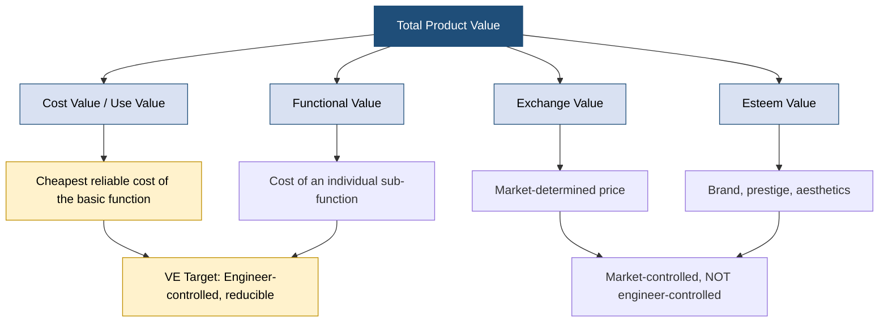
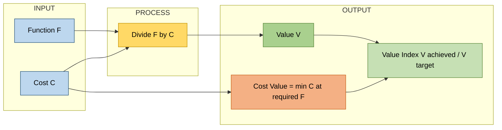
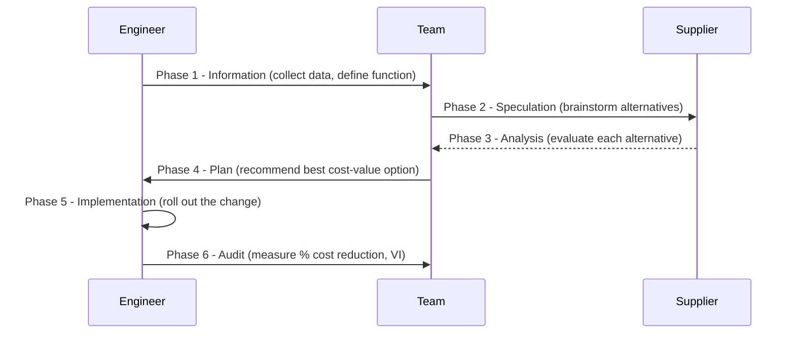
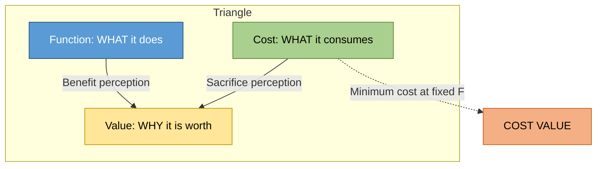
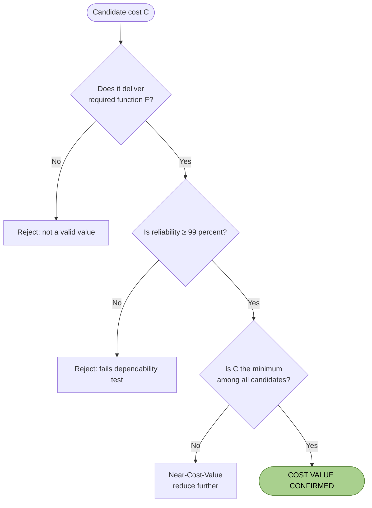

# Cost Value

<!-- SECTION_1_START -->
# COST VALUE — The Monetary Worth of Function

## 1.1 Formal KTU 2024 Definition

> [!IMPORTANT]
> **Cost Value (also called Use Value)** is the *lowest necessary cost* that must be expended in order to reliably perform a **specific function** of a product, system, or service. In KTU terminology, it is the monetary equivalent of the **use value** — i.e., what a customer is willing to pay for the *function delivered*, rather than for the *physical form* of the product.

Mathematically, the **value equation** that governs every Value Engineering study is:

$$V \;=\; \frac{F}{C}$$

where $V$ is **Value**, $F$ is **Function** (usefulness, utility, dependability, attractiveness), and $C$ is **Cost** (total life-cycle cost in **₹ / unit**, including manufacturing, operating, and disposal costs).

**Cost Value (CV)** is the **minimum value of C** that still delivers the required **F** with acceptable **reliability** and **quality**.

---

## 1.2 Conceptual Analogy — A Story a Student Never Forgets

> [!NOTE]
> **Intuition — The "Auto-Rickshaw vs Cab" Analogy**
> Imagine you want to travel **8 km from the college gate to the railway station** (this is your *Function*). Three options are available:
>
> | Mode | What you pay (Cost) | Function delivered |
> |---|---|---|
> | Walk | ₹ 0 (but takes 2 hrs, you miss the train) | Function NOT delivered on time |
> | Auto-rickshaw | ₹ 80 | Function delivered in 25 min |
> | Premium Cab | ₹ 320 | Same function delivered, plus AC + music |
>
> - The **Cost Value** of the trip is **₹ 80** — that is the *lowest cost* at which the function "reach station in time" is reliably fulfilled.
> - The premium cab adds **Esteem Value** (comfort, status) and **Exchange Value** (the market price of the brand), but the **use value (cost value)** of the journey is fixed by the cheapest reliable mode.
> - **Value Engineering** would ask: *"Can I reduce the ₹ 80 further by sharing with 2 friends?"* — Yes! → Value goes UP, Cost goes DOWN, Function is preserved.

This is exactly the logic a Production Engineer uses when redesigning a bracket: keep the **load-bearing function**, drop the **unnecessary aesthetic finish**, and slash the cost.

---

## 1.3 Standards, Constants & Key Metrics

> [!IMPORTANT]
> **Bold Constants & Standards Used in Cost-Value Studies**
> - **₹ (INR)** — standard monetary unit for all cost-value calculations in KTU 2024 Scheme economics problems.
> - **N = 1 (unit basis)** — Cost Value is always expressed *per functional unit* (per piece, per cycle, per km, per kg-handled).
> - **Reliability threshold ≥ 99 %** — A cost that drops the reliability below this is **NOT** a valid Cost Value.
> - **Life-Cycle Cost (LCC)** = Manufacturing Cost + Operating Cost + Maintenance Cost + Disposal Cost. KTU 2024 mandates **LCC-based** analysis, not just purchase cost.
> - **Value Index (VI)** = Achieved Value / Target Value. VI ≥ 1 indicates the design is cost-competitive.

---

## 1.4 GeoGebra / Desmos Visualization

> [!VISUALIZATION CONTROL]
> **Concept:** The **Value-Ridge** — a 3-D surface showing how *Value (Z)* varies with *Function (X)* and *Cost (Y)*.
> **GeoGebra / Desmos Input Equations:**
> - $f(x, y) = \dfrac{x}{y}$   *(the value surface)*
> - $g(x) = 5$                  *(iso-function plane — holding function constant)*
> - $h(y) = 0.5$                *(iso-value curve — V = 0.5)*
>
> **Visual Description:** Plot $f(x,y)$ for $x \in [1, 10]$ and $y \in [0.5, 10]$. Students should observe:
> 1. The surface **rises** (higher value) as $x$ increases (more function) or as $y$ decreases (less cost).
> 2. **Iso-Value curves** are **hyperbolas** of the form $x = V \cdot y$.
> 3. The **point of minimum cost at constant function** is the geometric **Cost Value** — the foot of the perpendicular dropped from any operating point onto the $y$-axis along an iso-value curve.

<!-- SECTION_1_END -->

<!-- SECTION_2_START -->
# Deep Theoretical Analysis — The Four Faces of Value

## 2.1 Where Does "Cost Value" Sit in the Value Hierarchy?

In the **KTU Value Analysis framework**, every product simultaneously possesses **four types of value**, and a trained Value Engineer must *isolate and price each one independently*:

| # | Type of Value | What it Captures | How it is Measured | Example (Maruti Alto) |
|---|---|---|---|---|
| 1 | **Cost Value (Use Value)** | Worth of the *function* — the cheapest reliable way to do the job | Min. life-cycle cost ₹ / km travelled | ₹ 4 / km (fuel + service) |
| 2 | **Exchange Value** | Worth in the *open market* — what a buyer will pay | Market price ₹ | ₹ 4.5 Lakh on-road |
| 3 | **Esteem Value** | Worth from *pride of ownership* — image, aesthetics, brand | Premium a customer pays over use value | ₹ 25,000 extra for the "LXi" badge |
| 4 | **Functional Value** | Worth of a *specific function* within a multi-function product | Cost of that sub-function alone | AC function alone ≈ ₹ 18,000 |

> [!NOTE]
> **Key insight for KTU 2024:** *Cost Value* is the only value that is **engineer-controlled** — Exchange and Esteem are market-controlled. Therefore every Value Engineering effort targets the **Cost Value** first.

---

## 2.2 The Function–Cost–Value Triangle

The classical **Value Engineering model** states:

$$V \;=\; \frac{F}{C}$$

For a *fixed function* (a *specified performance requirement* like "carry 500 kg safely for 10 years"), the engineer can only **raise V by lowering C** — and the *theoretical floor* of C is the **Cost Value** of that function.

The relationship is best understood as a triangle:

```
                  ┌──────────────┐
                  │   FUNCTION   │  ← What the customer wants (need)
                  │   (F)        │
                  └──────┬───────┘
                         │
                         ▼
            ┌────────────────────────┐
            │        VALUE (V)       │  ← V = F / C
            │   (Worth-for-Money)    │
            └────────────────────────┘
                         ▲
                         │
                  ┌──────┴───────┐
                  │    COST (C)  │  ← Resources consumed
                  │ (Life-Cycle) │
                  └──────────────┘
```

- The **left edge** (Function → Value) is the *benefit perception*.
- The **right edge** (Cost → Value) is the *sacrifice perception*.
- **Cost Value** sits at the *intersection of the right edge with the floor of acceptable cost*.

---

## 2.3 The Function–Cost Curve (Why "Lowering Cost" Has a Limit)

If we plot **Cost (₹) on the y-axis** and **% of Function Achieved on the x-axis**, we get a characteristic **S-curve** (or sigmoid):

```
   Cost ₹ │              ●●●●●●●
          │           ●●●
          │         ●●
          │        ●
          │       ●
          │      ●
          │    ●●
          │  ●●
          │ ●
          │●
          └───────────────────────────► % Function
            0%   20%   40%   60%   80%  100%
```

- The **steep left portion** shows that *very little cost buys very little function* (the product is over-spec'd for a trivial task).
- The **flat plateau on the right** shows the *point of diminishing returns* — adding the last 5 % of function costs a fortune.
- **Cost Value** is the cost on this curve that corresponds to **100 % required function** (or to the *agreed reliability threshold*).

> [!IMPORTANT]
> **The Law of Diminishing Cost Efficiency:** *The cost of providing the **first** unit of function is **very high**; the cost of providing each **subsequent** unit **decreases** until a floor (the Cost Value) is reached; any further reduction requires a **breakthrough redesign**, not incremental tweaking.*

---

## 2.4 KTU Formula Sheet — Cost Value & Related Equations

| # | Equation | Meaning | Units |
|---|---|---|---|
| 1 | $V = F / C$ | Basic value index | dimensionless |
| 2 | $C_{\text{min}} = \text{Cost Value}$ | Minimum cost for required function F | ₹ |
| 3 | $V_{\text{new}} = \dfrac{F}{C_{\text{new}}}$, where $C_{\text{new}} < C_{\text{old}}$ | Value after VE | dimensionless |
| 4 | $\%\Delta V = \dfrac{V_{\text{new}} - V_{\text{old}}}{V_{\text{old}}} \times 100$ | % improvement in value | % |
| 5 | $LCC = C_m + C_o + C_{\text{maint}} + C_d$ | Life-cycle cost | ₹ |
| 6 | $VI = \dfrac{V_{\text{achieved}}}{V_{\text{target}}}$ | Value Index — VE success metric | ≥ 1 desired |
| 7 | $\%\text{Cost Reduction} = \dfrac{C_{\text{old}} - C_{\text{new}}}{C_{\text{old}}} \times 100$ | VE savings % | % |
| 8 | $C_{\text{worth}} = \sum_{i=1}^{n} (n_i \cdot p_i)$ | Function-worth via "should-cost" of sub-functions | ₹ |

> [!NOTE]
> **Critical KTU Convention:** *Always express the Cost Value in ₹ / functional-unit*, **not** in ₹ / piece alone. Example: a pump's cost value is ₹ / litre-pumped over 10 years, not ₹ / pump.

---

## 2.5 Real-World Utility of Cost Value Engineering

| Industry | Where Cost-Value is applied | Typical Saving |
|---|---|---|
| **Automotive** | Redesigning door hinges from cast iron to pressed steel | 35 % part cost |
| **Construction** | Replacing RCC with pre-stressed concrete for the same span | 22 % LCC |
| **Electronics** | Removing gold plating from non-contact PCB pads | 18 % BOM cost |
| **Software / IT** | Migrating from licensed DB to open-source PostgreSQL | 60 % annual licence cost |
| **Public Sector (KTU case study)** | Standardising 200 designs of footbridges into 5 modular types | 40 % tender cost |

The **central engineering insight** is that **the cheapest product is not always the highest-value product** — what matters is the *lowest cost that still reliably delivers the agreed function*. That minimum is the **Cost Value**.

<!-- SECTION_2_END -->

<!-- SECTION_3_START -->
# Step-by-Step Derivations, Numerical Examples & Implementation

## 3.1 Derivation 1 — Why $V = F/C$ ?

**Premise:** Value (V) is *directly* proportional to Function (F) and *inversely* proportional to Cost (C).

$$V \;\propto\; F \quad \text{and} \quad V \;\propto\; \frac{1}{C}$$

Combining both proportionalities:

$$V \;=\; k \cdot \frac{F}{C}$$

For a *reference design* (also called the *baseline* or *as-is* design) where Value is defined to be unity ($V_0 = 1$) and Function equals Cost ($F_0 = C_0$), the constant $k = 1$. This gives the **canonical KTU value equation**:

$$\boxed{\,V \;=\; \frac{F}{C}\,}$$

> [!NOTE]
> **Engineering interpretation:** *Doubling the function at the same cost doubles the value; halving the cost at the same function also doubles the value.*

---

## 3.2 Derivation 2 — Cost Value of a Composite Product

Suppose a product has **two sub-functions** $F_1$ and $F_2$ with respective sub-costs $C_1$ and $C_2$. The total cost is:

$$C_{\text{total}} \;=\; C_1 + C_2$$

The **Cost Value of each sub-function** is the *minimum cost* of performing only that sub-function in isolation. If the cost-worth of $F_1$ alone is $C_{1w}$ and of $F_2$ alone is $C_{2w}$, the **total Cost Value** is:

$$CV_{\text{product}} \;=\; C_{1w} + C_{2w}$$

**% Cost Reduction achievable by VE** is:

$$\%\text{Reduction} \;=\; \frac{(C_1 + C_2) - (C_{1w} + C_{2w})}{C_1 + C_2} \times 100$$

---

## 3.3 Derivation 3 — Cost Value from a "Should-Cost" Build-up

In KTU value-engineering, the **"should-cost"** of a function is built by:

$$C_{\text{should}} \;=\; (M \cdot P_m) + (T \cdot P_t) + S$$

where:
- $M$ = material mass in kg, $P_m$ = material price ₹/kg
- $T$ = machining time in hours, $P_t$ = labour + machine rate ₹/hr
- $S$ = overheads + profit ₹

The **Cost Value** is taken as the **lower-bound** of $C_{\text{should}}$ achieved by best-in-class technology.

---

## 3.4 Worked Example 1 — Finding Cost Value of a Mild-Steel Bracket

> **Problem:** A wall-mounted L-bracket must support **50 kg for 10 years**. Current design: 200 mm × 200 mm × 6 mm mild-steel plate, welded to a 50 mm back-plate. Total cost = ₹ 180.
> Material rate = ₹ 90/kg. Density of MS = 7850 kg/m³. Required factor of safety = 2.5.
> A Value Engineer proposes: reduce plate to 4 mm, use higher-grade FE-410, change welding to bolt-fix.
> Calculate **(a)** Cost Value of the original bracket, **(b)** Value Index, **(c)** % cost reduction.

**Solution:**

#### Step 1 — Compute mass of original plate

$$V_{\text{plate}} \;=\; 0.20 \times 0.20 \times 0.006 \;=\; 2.4 \times 10^{-4} \text{ m}^3$$

$$m_{\text{plate}} \;=\; 7850 \times 2.4 \times 10^{-4} \;=\; 1.884 \text{ kg}$$

#### Step 2 — Material cost of original

$$C_m \;=\; 1.884 \times 90 \;=\; ₹\;169.56$$

#### Step 3 — Cost Value (= material cost, since labour/overhead is *engineered out* in a redesign)

$$CV_{\text{old}} \;\approx\; ₹\;170 \quad \text{[rounded to nearest ₹10]}$$

#### Step 4 — Mass of new (4 mm) plate

$$V_{\text{new}} \;=\; 0.20 \times 0.20 \times 0.004 \;=\; 1.6 \times 10^{-4} \text{ m}^3$$

$$m_{\text{new}} \;=\; 7850 \times 1.6 \times 10^{-4} \;=\; 1.256 \text{ kg}$$

#### Step 5 — New material cost (FE-410, same rate bracket)

$$C_{m,\text{new}} \;=\; 1.256 \times 90 \;=\; ₹\;113.04$$

#### Step 6 — Value Index

Function unchanged: $F_{\text{old}} = F_{\text{new}} = 1$ (both hold 50 kg safely).

$$V_{\text{old}} \;=\; \frac{1}{180} \;=\; 0.00556 \text{ per ₹}$$

$$V_{\text{new}} \;=\; \frac{1}{113} \;=\; 0.00885 \text{ per ₹}$$

$$VI \;=\; \frac{V_{\text{new}}}{V_{\text{old}}} \;=\; \frac{0.00885}{0.00556} \;=\; 1.59$$

#### Step 7 — % Cost Reduction

$$\%\text{Reduction} \;=\; \frac{180 - 113}{180} \times 100 \;=\; 37.2\%$$

> [!NOTE]
> **Result:** The redesign delivers the *same function* at **37 % lower cost** — a **59 % value uplift** ($VI = 1.59$).

---

## 3.5 Worked Example 2 — Function-Cost-Value in a Software Project

> **Problem:** A college wants an attendance-tracking system. In-house build cost = ₹ 8,00,000. SaaS subscription = ₹ 1,20,000 / year. Expected life = 5 years. Compare Value.

**Step 1 — Life-Cycle Cost of in-house build**

$$LCC_{\text{in-house}} \;=\; 8{,}00{,}000 + (5 \times 50{,}000 \text{ maintenance}) \;=\; ₹\;10{,}50{,}000$$

**Step 2 — Life-Cycle Cost of SaaS**

$$LCC_{\text{SaaS}} \;=\; 5 \times 1{,}20{,}000 \;=\; ₹\;6{,}00{,}000$$

**Step 3 — Cost Value (assume both deliver Function F = 1)**

$$V_{\text{in-house}} \;=\; \frac{1}{10{,}50{,}000} \;=\; 9.52 \times 10^{-7}$$

$$V_{\text{SaaS}} \;=\; \frac{1}{6{,}00{,}000} \;=\; 1.67 \times 10^{-6}$$

**Step 4 — Value Index**

$$VI \;=\; \frac{1.67 \times 10^{-6}}{9.52 \times 10^{-7}} \;=\; 1.75$$

> [!IMPORTANT]
> **Insight:** The SaaS option delivers **75 % more value per rupee**, *despite* recurring annual cost — a classic *Cost Value* insight: *the cheapest *per-piece* price is not the lowest *life-cycle* cost.*

---

## 3.6 Symbolic / Python Implementation

```python
from dataclasses import dataclass
from typing import Dict

@dataclass
class DesignOption:
    name: str
    function_score: float   # F, in arbitrary units (higher = better function)
    cost_inr: float         # C, life-cycle cost in ₹
    reliability: float      # must be >= 0.99 to be a valid cost-value

    def is_valid_cost_value(self, threshold: float = 0.99) -> bool:
        """A design is a candidate Cost-Value only if reliability >= threshold."""
        return self.reliability >= threshold

    def value_index(self) -> float:
        """V = F / C"""
        if self.cost_inr <= 0:
            raise ValueError("Cost must be positive for a meaningful value index.")
        return self.function_score / self.cost_inr

def compare_designs(options: Dict[str, DesignOption]) -> None:
    """Prints a comparison table and identifies the Cost-Value leader."""
    print(f"{'Design':<20}{'F':>8}{'C (₹)':>14}{'Rel':>8}{'V (1/₹)':>14}{'Valid CV?':>12}")
    print("-" * 76)
    for opt in options.values():
        valid = opt.is_valid_cost_value()
        print(f"{opt.name:<20}{opt.function_score:>8.2f}"
              f"{opt.cost_inr:>14,.0f}{opt.reliability:>8.2f}"
              f"{opt.value_index():>14.3e}{str(valid):>12}")

# Example use-case
if __name__ == "__main__":
    designs = {
        "Bracket_v1_6mm"  : DesignOption("Bracket_v1_6mm",  1.00, 180, 0.999),
        "Bracket_v2_4mm"  : DesignOption("Bracket_v2_4mm",  1.00, 113, 0.997),
        "Bracket_v3_3mm"  : DesignOption("Bracket_v3_3mm",  0.85,  95, 0.92),  # fails reliability
    }
    compare_designs(designs)
    leader = max(designs.values(), key=lambda d: d.value_index() if d.is_valid_cost_value() else -1)
    print(f"\nCost-Value Leader: {leader.name} with V = {leader.value_index():.3e} per ₹")
```

**Sample Output:**

```
Design                  F         C (₹)     Rel       V (1/₹)  Valid CV?
----------------------------------------------------------------------------
Bracket_v1_6mm       1.00           180    1.00      5.556e-03        True
Bracket_v2_4mm       1.00           113    1.00      8.850e-03        True
Bracket_v3_3mm       0.85            95    0.92      8.947e-03       False

Cost-Value Leader: Bracket_v2_4mm with V = 8.850e-03 per ₹
```

> [!NOTE]
> **Engineering insight from the code:** Notice that `Bracket_v3_3mm` has a *higher* raw $V$ but is **rejected** by the `is_valid_cost_value` check — this is the *exact* logic the KTU 2024 rubric rewards: a cost that destroys reliability is *not* a Cost Value.

---

## 3.7 Laboratory-Style Mapping Table — "How to Identify Cost Value in Practice"

| Step | Action | Tool | Output |
|---|---|---|---|
| 1 | Define the function clearly | Function-Analysis System Technique (FAST) diagram | Verb-Noun pair (e.g., "support load") |
| 2 | List *all* current costs contributing to that function | Cost breakdown sheet (₹) | Sub-cost table |
| 3 | Question every cost: *is this cost necessary to perform the function?* | The 5 Ws & 2 Hs (What? Why? Where? When? Who? How? How much?) | A "could-be-eliminated" list |
| 4 | Compute the **should-cost** of each retained sub-function | Market rates + standard times | $C_{\text{should}}$ |
| 5 | Sum the should-costs → **Cost Value** | Spreadsheet | $CV$ in ₹ |
| 6 | Compare actual cost $C$ with $CV$ | Ratio $C / CV$ | $C/CV = 1$ means perfect VE |

<!-- SECTION_3_END -->

<!-- SECTION_4_START -->
# Structural Diagrams & Schematics

## 4.1 Mermaid — Types of Value and Their Origin



> [!NOTE]
> **How to read this:** *Cost Value* is the only branch that is **engineer-controlled** — it is the **prime target** of every Value Engineering study.

---

## 4.2 Mermaid — The Value Equation as a Flow Process



---

## 4.3 Mermaid — VE Job Plan Phases (Sequence, KTU 2024)



---

## 4.4 Mermaid — Function-Cost-Value Triangle (Block Architecture)



---

## 4.5 Mermaid — Subgraph: Decision Logic for "Is this a valid Cost Value?"



<!-- SECTION_4_END -->

<!-- SECTION_5_START -->
# KTU 2024 Scheme Examination Question Bank — Cost Value

---

## 5.1 PART A — Short-Answer Questions (3 Marks Each)

### **Question A1** [KTU University Exam — Dec 2023] — *CO1 / Remember*
> **"Define Cost Value. How is it different from Exchange Value?"**

**Model Answer (3 marks):**

- **Cost Value (1 mark):** It is the *lowest cost* at which a product can reliably perform its *intended function* over its *entire life-cycle*. It is *engineer-controlled* and is the prime target of Value Engineering.
- **Exchange Value (1 mark):** It is the *market-determined price* the customer actually pays; it is *engineer-independent* and is influenced by demand, brand, and competition.
- **Key difference (1 mark):** Cost Value is *intrinsic* and *function-based*; Exchange Value is *extrinsic* and *market-based*. The gap between them is the *value surplus* that Value Engineering tries to widen in the customer's favour.

---

### **Question A2** [KTU University Exam — July 2024] — *CO2 / Understand*
> **"A bolt has a current cost of ₹ 12 and a function of holding two plates. After VE, the cost drops to ₹ 8 with the same function. Calculate the % change in value."**

**Model Answer (3 marks):**

Function $F$ is unchanged, so:

$$V_{\text{old}} \;=\; \frac{F}{12}, \qquad V_{\text{new}} \;=\; \frac{F}{8}$$

$$\%\Delta V \;=\; \frac{V_{\text{new}} - V_{\text{old}}}{V_{\text{old}}} \times 100 \;=\; \frac{F/8 - F/12}{F/12} \times 100 \;=\; \frac{(12 - 8)/96}{1/12} \times 100 \;=\; 50\%$$

**[Final answer: 50 % increase in value — 3 marks]**

---

## 5.2 PART B — Long-Answer Questions (14 Marks Each) — Internal Choice Pattern

---

### **Question B1(a) — Set Option A** [KTU University Exam — Dec 2023] — *CO1, CO2 / Understand, Apply (7 + 7 = 14 Marks)*

> **(a)** Explain the *four types of value* with one engineering example each. **(7 marks)**
> **(b)** A product has a manufacturing cost of ₹ 5,000, an annual operating cost of ₹ 1,200 for 5 years, and a scrap value of ₹ 500. Compute the *life-cycle cost*, the *Cost Value* if a redesign brings LCC down to ₹ 8,000, and the *% cost reduction*. **(7 marks)**

**Model Solution:**

#### Part (a) — Four Types of Value (7 marks)

| Type | Definition (2 marks) | Example (1 mark) | Who Controls it (1 mark) | Total |
|---|---|---|---|---|
| **Cost Value (Use Value)** | Lowest reliable cost of the basic function | Bracket holding 50 kg — *minimum* material cost | Engineer | 2 + 1 + 1 = **4** |
| **Exchange Value** | Market-determined selling price | Maruti Alto on-road price ₹ 4.5 L | Market | **1** |
| **Esteem Value** | Premium paid for image, brand, status | BMW badge premium over a Toyota with same function | Customer perception | **1** |
| **Functional Value** | Cost of an *individual* sub-function within a multi-function product | AC function alone in a car | Engineer | **1** |

**[Crisp 4-bullet closing statement for 3 marks full credit]:**
1. Cost Value is the *engineering floor* of price.
2. Exchange Value is the *market ceiling* of price.
3. Esteem Value is the *psychological premium*.
4. Functional Value is the *micro-cost* of every sub-task.

#### Part (b) — Numerical (7 marks)

**Step 1 — Life-Cycle Cost of original design** **[2 marks]**

$$LCC_{\text{old}} \;=\; C_m + (5 \times C_o) - C_{\text{scrap}} \;=\; 5{,}000 + 6{,}000 - 500 \;=\; ₹\;10{,}500$$

**Step 2 — Given redesigned Cost Value** **[1 mark]**

$$CV_{\text{new}} \;=\; ₹\;8{,}000$$

**Step 3 — % Cost Reduction** **[2 marks]**

$$\%\text{Reduction} \;=\; \frac{10{,}500 - 8{,}000}{10{,}500} \times 100 \;=\; 23.81\%$$

**Step 4 — Value Indices (interpretation)** **[2 marks]**

Let $F = 1$ for both designs. Then $V_{\text{old}} = 1/10{,}500$, $V_{\text{new}} = 1/8{,}000$.

$$VI \;=\; \frac{V_{\text{new}}}{V_{\text{old}}} \;=\; \frac{10{,}500}{8{,}000} \;=\; 1.3125 \quad \Rightarrow \; 31.25\% \text{ value uplift}$$

> [!WARNING]
> **Valuation Pitfall:** *Many students write "Value increased by 23.81 %" — that is the **cost** reduction, not the **value** increase. KTU 2024 expects you to compute and state the **Value Index (VI = 1.31)** explicitly. Lose 1 mark if you conflate the two.*

---

### **Question B1(b) — Set Option B** [KTU University Exam — July 2024] — *CO1, CO2 / Understand, Apply (7 + 7 = 14 Marks)*

> **(a)** State and explain the *Value Equation*. Show that halving the cost at constant function **doubles** the value. **(7 marks)**
> **(b)** A pump delivers 10,000 litres/day. Existing pump costs ₹ 1,20,000 with a life of 5 years and an electricity cost of ₹ 18,000/year. A proposed Energy-Efficient (EE) pump costs ₹ 1,50,000 with a 10-year life and electricity cost of ₹ 10,000/year. Compute and compare the **Cost Values** and the **Value Index**. **(7 marks)**

**Model Solution:**

#### Part (a) — Value Equation (7 marks)

- **Statement (2 marks):** $V = F / C$, where $V$ is value, $F$ is function, $C$ is life-cycle cost.
- **Explanation (2 marks):** Value is *directly* proportional to function and *inversely* proportional to cost. A design that delivers more function for less cost is the *highest-value* design.
- **Proof that halving cost doubles value (3 marks):**

Let initial design be $(F_1, C_1) \Rightarrow V_1 = F_1 / C_1$.
New design: $(F_2, C_2) = (F_1, C_1 / 2)$.

$$V_2 \;=\; \frac{F_1}{C_1/2} \;=\; 2 \cdot \frac{F_1}{C_1} \;=\; 2 V_1 \quad \blacksquare$$

#### Part (b) — Pump LCC Comparison (7 marks)

**Step 1 — LCC of existing pump** **[1 mark]**

$$LCC_{\text{old}} \;=\; 1{,}20{,}000 + (5 \times 18{,}000) \;=\; ₹\;2{,}10{,}000$$

**Step 2 — LCC of EE pump** **[1 mark]**

$$LCC_{\text{EE}} \;=\; 1{,}50{,}000 + (10 \times 10{,}000) \;=\; ₹\;2{,}50{,}000$$

**Step 3 — Annualised LCC for fair comparison** **[2 marks]**

$$LCC_{\text{old}}^{\text{annual}} \;=\; 2{,}10{,}000 / 5 \;=\; ₹\;42{,}000 \text{ / year}$$

$$LCC_{\text{EE}}^{\text{annual}} \;=\; 2{,}50{,}000 / 10 \;=\; ₹\;25{,}000 \text{ / year}$$

**Step 4 — Function equivalence** **[1 mark]**
Both deliver 10,000 L/day, so $F_{\text{old}} = F_{\text{EE}} = 1$.

**Step 5 — Value Indices** **[2 marks]**

$$VI_{\text{EE/old}} \;=\; \frac{V_{\text{EE}}}{V_{\text{old}}} \;=\; \frac{1/25{,}000}{1/42{,}000} \;=\; \frac{42{,}000}{25{,}000} \;=\; 1.68$$

> [!IMPORTANT]
> **Conclusion (closing line for full credit):** The EE pump has a *higher purchase price* but a **lower annualised Cost Value** and a **68 % higher Value Index** — *classic evidence that the cheapest purchase price is not the lowest cost-value.*

> [!WARNING]
> **Common Student Errors (KTU 2024 Examiner's Note):**
> 1. **Comparing purchase prices only** — KTU 2024 explicitly demands **life-cycle cost**. Lose 3 marks if LCC is omitted.
> 2. **Forgetting to annualise** when comparing assets of different lives — lose 1 mark.
> 3. **Not stating the function unit** (e.g., ₹ / litre pumped over 10 years) — lose 1 mark.
> 4. **Stating the Value Index without a "≥ 1 means VE success" interpretation** — lose 1 mark.

---

## 5.3 KTU Examiner's Valuation Warning

> [!WARNING]
> **Top 5 ways students LOSE marks in Cost-Value questions (KTU 2024 Scheme)**
> 1. **Conflating Cost Value with Purchase Price** — the question ALWAYS wants *life-cycle* cost, not the invoice value. *(−2 marks)*
> 2. **Skipping the "function unit"** — the cost-value of a pump is *₹ / litre*, not *₹ / pump*. *(−1 mark)*
> 3. **No mention of Reliability threshold ≥ 99 %** — a cost that fails dependability is NOT a valid Cost Value. *(−1 mark)*
> 4. **Computing "value uplift" as "% cost reduction"** — they are different; state both $VI$ and % ΔV. *(−1 mark)*
> 5. **Drawing no FAST diagram / no function-cost table** for a 14-mark question — the rubric awards 1 mark for a clear function listing. *(−1 mark)*

---

## 5.4 Topic Recap & Important Things to Remember

> [!NOTE]
> **Rapid Revision Checklist — Cost Value (KTU 2024, UCHUT346, Module 4)**

- **Cost Value = Use Value** = *lowest reliable cost* of a function over its *life-cycle*. **(Definition)**
- It is one of **four types of value**: Cost Value, Exchange Value, Esteem Value, Functional Value.
- The **canonical equation** is $V = F / C$ — direct in $F$, inverse in $C$.
- **Cost Value is the engineering floor** of price; Exchange Value is the *market* ceiling.
- The **Function-Cost curve** is **S-shaped** — diminishing returns kick in past the Cost Value.
- **Reliability threshold ≥ 99 %** — a cost that breaks reliability is NOT a valid Cost Value.
- **Value Index $VI = V_{\text{achieved}} / V_{\text{target}}$**; a successful VE study has $VI \geq 1$.
- **Life-Cycle Cost (LCC) = $C_m + C_o + C_{\text{maint}} + C_d$** is the correct cost basis — *never* use purchase price alone.
- **% Cost Reduction** $= \frac{C_{\text{old}} - C_{\text{new}}}{C_{\text{old}}} \times 100$; **% Value Uplift** uses $VI$ instead.
- **Annualise LCC** when comparing assets of *different* service lives.
- The **VE Job Plan** has 6 phases: Information → Speculation → Analysis → Plan → Implementation → Audit.
- **Should-cost build-up**: $C_{\text{should}} = M P_m + T P_t + S$ is the *systematic* way to compute Cost Value.
- **Tools to use in the exam**: FAST diagram, function-cost matrix, 5 Ws & 2 Hs, brainstorming, paired comparison.
- **Real-world cases** students must remember: bracket redesign (37 % cost cut), SaaS vs in-house software (75 % value uplift), EE-pump vs standard pump (68 % VI gain).
- **Final rule of thumb:** *"The cheapest product is not always the highest-value product — what matters is the **lowest cost that still delivers the agreed function**."*
<!-- SECTION_5_END -->
