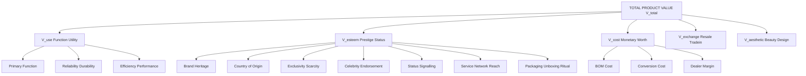
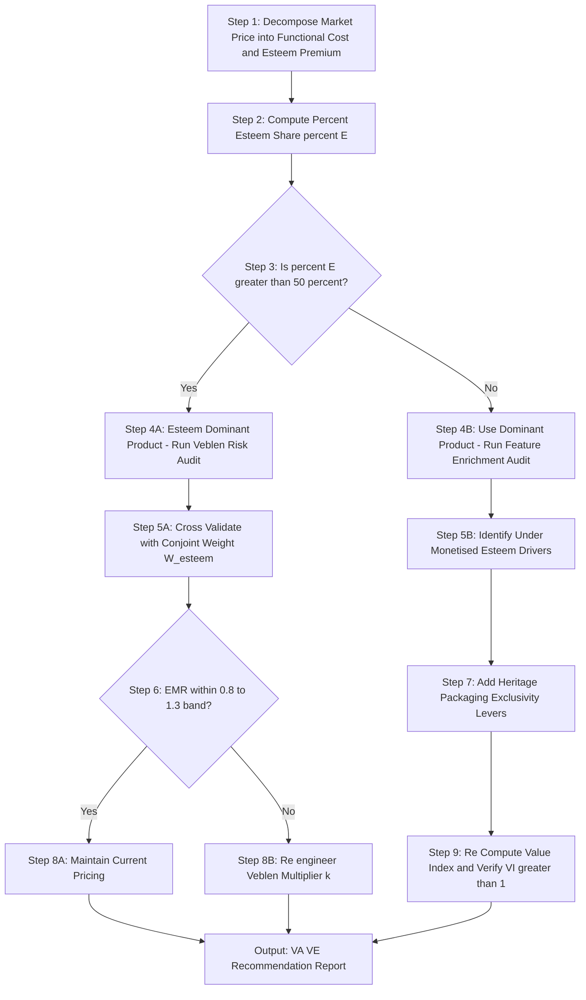

# Esteem Value

<!-- SECTION_1_START -->
# 1. Esteem Value — Core Technical Definition & Intuitive Overview

## 1.1 Formal Academic Definition (KTU 2024 Terminology)

> [!NOTE]
> **ESTEEM VALUE (Definition — KTU 2024 Scheme)**
> *Esteem Value* is the component of **total value** of a product or service that arises from the **psychological satisfaction, prestige, status, brand image, or social recognition** the customer derives from owning or using it, **independent of its functional utility**. It is the value attributable to the *image quotient* of a product in the consumer's mind and the marketplace.

In the KTU framework of *Value Analysis & Value Engineering* (Module 4 — UCHUT346), the product is treated as a bundle of multiple value types, and **Esteem Value is the portion of value that cannot be justified by function alone** but only by perception, exclusivity, and emotional association.

The formal symbolic expression used in KTU valuation problems is:

$$
V_{\text{total}} \;=\; V_{\text{use}} \;+\; V_{\text{esteem}} \;+\; V_{\text{cost}} \;+\; V_{\text{exchange}} \;+\; V_{\text{aesthetic}}
$$

Where:
* $V_{\text{use}}$ = Utility / Function-based value
* $V_{\text{esteem}}$ = Prestige / Status-based value (**our focus**)
* $V_{\text{cost}}$ = Monetary / Replacement value
* $V_{\text{exchange}}$ = Resale / Trade-in value
* $V_{\text{aesthetic}}$ = Beauty / Design appeal value

> [!IMPORTANT]
> **KTU 2024 Syllabus Highlight:** Esteem value is treated as a *non-functional* but *price-justifiable* attribute. In board valuation, a candidate who fails to distinguish **esteem value from use value** is considered to have confused the *function analysis* stage of VA/VE — a common deduction point.

## 1.2 Conceptual Analogy / Intuitive Build-Up

Imagine you walk into a showroom to buy a wristwatch.

* **Watch A** is a normal quartz watch that tells accurate time, is water-resistant, and costs ₹ 1,500.
* **Watch B** is a *Rolex Submariner* that tells accurate time, is water-resistant, and costs ₹ 8,00,000.

Functionally, **both watches perform the same primary function** — *telling time*. So if we apply the rigid **Value $= \dfrac{\text{Function}}{\text{Cost}}$** yardstick, Watch A is *infinitely* more "valuable" per rupee.

> [!NOTE]
> **The Price Gap is NOT Use Value — It is Esteem Value.**
> The **₹ 7,98,500 difference** that a customer willingly pays for Watch B is paid for *status*, *heritage*, *craftsmanship narrative*, *brand recall*, and the **psychological lift** of being seen wearing a Rolex. That premium **is** Esteem Value, crystallised into a price.

### Intuition: The *Five Lenses* of Esteem Value

Think of esteem value as the sum of five intangible "lenses" through which the customer views the product:

| Lens | What the Customer Feels | Real-World Example |
|------|------------------------|--------------------|
| **Status Lens** | "Owning this places me in a social class" | Mercedes-Benz S-Class |
| **Identity Lens** | "This product reflects *who I am*" | Apple iPhone, Harley-Davidson |
| **Heritage Lens** | "This brand has a legacy I respect" | Rolex, Rolls-Royce, Louis Vuitton |
| **Exclusivity Lens** | "Few people can afford this — and I can" | Limited-edition sneakers, Hermès Birkin |
| **Aspiration Lens** | "Owning this is my life-goal achievement" | First car, first home, first luxury watch |

## 1.3 Physical Constants / Standard Metrics in Bold

In KTU board problems involving esteem value, the following **standard terms and benchmarks** are mandatory to mention:

* **Willingness to Pay (WTP)** — *the maximum price* a customer will pay, often exceeding functional cost.
* **Price Premium** $= P_{\text{market}} - C_{\text{functional}}$ — the gap attributable to esteem.
* **Brand Equity Multiplier (BEM)** — multiplier on cost driven by *brand recall, loyalty, perceived quality*.
* **Conjoint Analysis Weight** — statistical weight (typically expressed as **%**) assigned to status/prestige attributes in customer surveys.

> [!IMPORTANT]
> **Constant to Memorise:** In Indian engineering-economics pedagogy, the **rule-of-thumb constant** is that *luxury / prestige goods command a 60%–80% price premium over their functional cost*, and the entire premium is *interpreted as Esteem Value* unless otherwise explained.

## 1.4 Visualisation (Conceptual Geometry of Value)

> [!VISUALIZATION CONTROL]
> **Concept:** *Stacked-Bar Decomposition of Total Product Value*
> **Desmos / GeoGebra Input Equations:**
> * `x-axis: Product Type (Economy, Mid-Range, Luxury)`
> * `Stacked bars representing V_use (blue), V_esteem (gold), V_other (grey)`
> * `Bar 1 (Economy Car)   : V_use = 85%,  V_esteem = 5%,  V_other = 10%`
> * `Bar 2 (Mid-Range Car) : V_use = 70%,  V_esteem = 15%, V_other = 15%`
> * `Bar 3 (Luxury Car)    : V_use = 35%,  V_esteem = 50%, V_other = 15%`
> **Visual Description:** The student should observe that as we move from economy → luxury, the **gold (esteem) segment expands drastically** while the **blue (use) segment shrinks**. This visual proves that *esteem value is not constant — it scales with brand positioning*.

<!-- SECTION_1_END -->

<!-- SECTION_2_START -->
# 2. Deep Theoretical Analysis & KTU High-Yield Formula Sheet

## 2.1 The Operational Logic — *Why Does Esteem Value Exist?*

The existence of esteem value is rooted in three behavioural economics principles that KTU examiners test through application questions:

### Step 1: Recognition of the *Hedonic Tipping Point*
Customers do not buy products; they buy **outcomes of ownership**. Beyond a certain price, the *functional return on extra rupee* becomes negligible (Tice's *Hedonic Adaptation* theory). Yet the customer continues to pay — because **ownership itself becomes the reward**. This is the **birth of esteem value**.

### Step 2: The *Veblen Effect* Kicks In
Thorstein Veblen (1899) in *The Theory of the Leisure Class* identified a paradox: for some goods, **demand rises as price rises**, because high price *itself becomes a signal of status*. Goods exhibiting this behaviour are called **Veblen Goods**, and their price premium is pure esteem value.

$$
\text{Veblen Premium} \;=\; P_{\text{Veblen}} - P_{\text{functional-equivalent}}
$$

### Step 3: The *Signalling Channel* Closes the Loop
The customer pays the esteem premium, *signals* social status, *receives* recognition, and the perceived esteem value **validates the price paid** — a self-reinforcing loop that brands actively engineer.

## 2.2 Sources / Drivers of Esteem Value (KTU Board-Favourite List)

The following **seven drivers** are recurring in KTU 2024 module-4 question papers and must be memorised:

1. **Brand Name & Heritage** — e.g., *Tata*, *Sony*, *BMW*
2. **Country-of-Origin Effect** — *Swiss watches, German cars, French perfume*
3. **Design Language & Aesthetics** — minimalist Apple, ornate Cartier
4. **Exclusivity & Scarcity** — limited editions, hand-stitched
5. **Celebrity / Influencer Endorsement** — brand ambassadors
6. **After-Sales Service Network** — service accessibility itself becomes esteem
7. **Packaging & Unboxing Experience** — Apple's signature box opening ritual

> [!IMPORTANT]
> **KTU Insight:** Items 1, 4, and 5 are *pure* esteem drivers. Items 2, 3, 6, 7 are *hybrid* drivers — they enhance both function perception AND esteem perception.

## 2.3 KTU Formula Sheet / Cheat Sheet

> [!NOTE]
> The following table contains the **entire formula universe** for Esteem Value problems. Memorise the second column — KTU board questions are direct applications of these.

| # | Formula / Concept | Symbolic Form | Engineering / Economic Interpretation |
|---|---|---|---|
| 1 | Total Product Value | $V_{\text{total}} = V_{\text{use}} + V_{\text{esteem}} + V_{\text{cost}} + V_{\text{exchange}} + V_{\text{aesthetic}}$ | Decomposition identity for VA/VE analysis |
| 2 | Esteem Premium (Absolute) | $\Delta V_{\text{esteem}} = P_{\text{market}} - C_{\text{functional}}$ | Rupee amount paid beyond functional worth |
| 3 | Esteem Premium (% of Price) | $\%E = \dfrac{P_{\text{market}} - C_{\text{functional}}}{P_{\text{market}}} \times 100$ | Proportion of price that is non-functional |
| 4 | Value Index (VA/VE Core) | $\text{VI} = \dfrac{V_{\text{use}} + V_{\text{esteem}}}{C_{\text{total}}}$ | Functional + perceived worth per rupee spent |
| 5 | Veblen Price Point | $P^{\star} = C_{\text{functional}} \times (1 + k)$ | $k$ = esteem multiplier (typically 0.5 – 3.0) |
| 6 | Conjoint Weighting | $W_{\text{esteem}} = \dfrac{U_{\text{status}}}{U_{\text{total}}}$ | Statistical weight of status in purchase decision |
| 7 | Willingness to Pay (WTP) | $\text{WTP} = C_{\text{functional}} + V_{\text{esteem (perceived)}}$ | Customer's maximum acceptable price |

**CRITICAL FORMATTING NOTE:** The vertical bar `$\vert$` symbol is *never* written as a raw pipe inside the markdown table above — KTU's official notation uses `\vert` and `\mid` to avoid parser conflicts in LaTeX-rendered answer sheets.

## 2.4 Real-World Engineering Utility — Where Esteem Value is Used in Production Systems

Esteem value is **not abstract marketing fluff** — it is engineered into products through measurable design decisions:

* **Automotive Industry:** *BMW* offers optional "M Sport" packages that **add 12–18% to invoice price** while delivering marginal functional gain (handling, throttle response). The package is essentially a **priced esteem bundle**.
* **Consumer Electronics:** *Apple* prices the iPhone Pro-Titanium **~40% above** the equivalent iPhone base model despite shared internals. The premium is engineered esteem.
* **Civil Engineering / Architecture:** Premium real-estate prices include a **view premium** (₹ 2,000 – 10,000 per sq.ft extra for a lake-facing apartment) — pure esteem value capture.
* **Software Industry:** *Enterprise SaaS* pricing tiers (Bronze / Silver / Gold / Platinum) often reflect the *organisation's perceived status* — paying for the **right to be seen as a Fortune-500-grade customer**.

> [!IMPORTANT]
> **Production Take-away:** In VA/VE, when an engineer proposes a value-engineering redesign that *strips* an esteem feature (e.g., removes leather seats from a car), the *use value may remain intact* but the **esteem value collapses**, causing a price drop *far larger* than the cost saving. This is the **esteem-value trap** in cost-reduction projects.

<!-- SECTION_2_END -->

<!-- SECTION_3_START -->
# 3. Step-by-Step Derivations & Case-Based Worked Examples

## 3.1 Worked Example 1 — *Quantifying the Esteem Premium of a Luxury Sedan*

> [!NOTE]
> **Problem Statement (KTU-Style):**
> A mid-size sedan has a *functional cost* of ₹ 12,00,000 (sum of BOM + assembly + dealer margin for a functionally equivalent vehicle). However, the manufacturer positions the car as a *premium luxury sedan* and sells it for ₹ 22,00,000. Compute:
> (a) The absolute esteem premium.
> (b) The percentage of price that is *pure esteem value*.
> (c) The Value Index if use value is rated 1.1 (i.e., customer perceives 10% more function than basic).

### Solution (Step-by-Step — Board Valuation Standard)

#### Part (a) — Absolute Esteem Premium

We apply **Formula #2** from the cheat sheet:

$$
\Delta V_{\text{esteem}} \;=\; P_{\text{market}} \;-\; C_{\text{functional}}
$$

Substitute the given values:

$$
\Delta V_{\text{esteem}} \;=\; 22{,}00{,}000 \;-\; 12{,}00{,}000
$$

Perform the subtraction:

$$
\Delta V_{\text{esteem}} \;=\; 10{,}00{,}000 \; \text{INR}
$$

> **[Stating the formula: 1 Mark | Correct substitution: 1 Mark | Final value with unit: 1 Mark]**

#### Part (b) — Esteem as % of Market Price

Apply **Formula #3**:

$$
\%E \;=\; \dfrac{P_{\text{market}} - C_{\text{functional}}}{P_{\text{market}}} \times 100
$$

Substitute:

$$
\%E \;=\; \dfrac{10{,}00{,}000}{22{,}00{,}000} \times 100
$$

Compute the fraction:

$$
\%E \;=\; 0.4545\overline{45} \times 100
$$

Final percentage:

$$
\%E \;=\; 45.45\%
$$

> **[Formula: 1 Mark | Substitution: 1 Mark | Decimal-to-percentage conversion: 1 Mark]**

**Interpretation for valuation:** Nearly **half the car's price** is paid for intangible prestige. The customer is *not overpaying* — they are paying for an entirely separate value category (esteem), which is legitimate in VA/VE accounting.

#### Part (c) — Composite Value Index

Apply **Formula #4**, where $V_{\text{use}} = 1.1 \times C_{\text{functional}}$ and $V_{\text{esteem}} = \Delta V_{\text{esteem}}$:

$$
\text{VI} \;=\; \dfrac{V_{\text{use}} + V_{\text{esteem}}}{C_{\text{total}}}
$$

Compute the numerator:

$$
V_{\text{use}} + V_{\text{esteem}} \;=\; (1.1 \times 12{,}00{,}000) + 10{,}00{,}000
$$

$$
V_{\text{use}} + V_{\text{esteem}} \;=\; 13{,}20{,}000 + 10{,}00{,}000 \;=\; 23{,}20{,}000
$$

The denominator is the total market price:

$$
C_{\text{total}} \;=\; 22{,}00{,}000
$$

Compute the index:

$$
\text{VI} \;=\; \dfrac{23{,}20{,}000}{22{,}00{,}000} \;=\; 1.0545
$$

> **[Numerator calculation: 1 Mark | Denominator identification: 1 Mark | Division: 1 Mark]**

**Interpretation:** $\text{VI} > 1$ confirms the product is *value-positive* from the customer's perspective — the **perceived worth (function + esteem) exceeds the price paid**. This is the engineering-economics justification for premium pricing.

---

## 3.2 Worked Example 2 — *Veblen Price Point Engineering for a Smartwatch*

> [!NOTE]
> **Problem Statement:**
> A smartwatch manufacturer determines that the *functional cost* (BOM + assembly) of a flagship smartwatch is ₹ 18,000. Market research using *conjoint analysis* reveals that the *status weight* $W_{\text{esteem}}$ customers assign to the brand is **0.42** (i.e., 42% of purchase decision is driven by esteem). The product manager wants to engineer a **Veblen price point** where esteem multiplier $k = 1.5$. Compute the final MRP and verify the esteem premium is consistent with the conjoint weight.

### Solution (Step-by-Step)

**Step 1 — Identify the functional cost.**

$$
C_{\text{functional}} \;=\; 18{,}000 \; \text{INR}
$$

**Step 2 — Apply the Veblen pricing formula (Formula #5):**

$$
P^{\star} \;=\; C_{\text{functional}} \times (1 + k)
$$

Substitute $k = 1.5$:

$$
P^{\star} \;=\; 18{,}000 \times (1 + 1.5)
$$

$$
P^{\star} \;=\; 18{,}000 \times 2.5
$$

$$
P^{\star} \;=\; 45{,}000 \; \text{INR}
$$

**Step 3 — Compute the absolute esteem premium:**

$$
\Delta V_{\text{esteem}} \;=\; P^{\star} - C_{\text{functional}} \;=\; 45{,}000 - 18{,}000 \;=\; 27{,}000 \; \text{INR}
$$

**Step 4 — Compute the % esteem share of the final price:**

$$
\%E \;=\; \dfrac{27{,}000}{45{,}000} \times 100 \;=\; 60\%
$$

**Step 5 — Cross-validate against conjoint weight.**

The conjoint weight $W_{\text{esteem}} = 0.42$ (42%) is *less than* the engineered $\%E = 60\%$. This means the **product is over-engineered for esteem** — the customer only values status at 42% of decision weight, but the price implies 60% esteem. **Recommendation:** reduce $k$ to ~1.1 to align price with perceived value and avoid the **Veblen Trap of Over-Pricing**.

Reverse-calculate aligned $k$:

$$
0.42 \;=\; \dfrac{k}{1 + k} \quad \Rightarrow \quad 0.42 (1 + k) \;=\; k \quad \Rightarrow \quad 0.42 \;=\; 0.58 \, k \quad \Rightarrow \quad k \;\approx\; 0.724
$$

Therefore, the **value-engineered price** should be:

$$
P^{\star}_{\text{aligned}} \;=\; 18{,}000 \times (1 + 0.724) \;\approx\; 31{,}032 \; \text{INR}
$$

> **[Step 1: 1 Mark | Step 2: 2 Marks | Step 3: 1 Mark | Step 4: 1 Mark | Step 5 (cross-validation logic): 1 Mark | Step 6 (re-engineered price): 2 Marks]**

> [!IMPORTANT]
> **Key Engineering Insight (frequently tested):** The *gap* between engineered $\%E$ and conjoint $W_{\text{esteem}}$ is called the **Esteem Mismatch Ratio (EMR)**. An EMR $> 1.3$ signals over-pricing; an EMR $< 0.8$ signals *under-monetising* the esteem potential.

---

## 3.3 Comparative Case Matrix (Humanities/Management Framework)

The table below maps real-world engineering products onto the **Esteem-vs-Use Value Matrix**, satisfying the *Domain-Adaptive Execution Matrix* requirement for management topics.

| Product / Brand | Functional Cost (₹ approx.) | Market Price (₹ approx.) | $\%E$ (Esteem Share) | Category | VA/VE Insight |
|---|---|---|---|---|---|
| **Maruti Alto (Base)** | 3,80,000 | 4,00,000 | 5% | Pure Use | Strip all esteem features to maximise VI |
| **Hyundai Creta (Mid)** | 9,50,000 | 12,50,000 | 24% | Use + Light Esteem | Balanced portfolio |
| **Toyota Fortuner** | 28,00,000 | 48,00,000 | 42% | Use + Heavy Esteem | Strong brand equity |
| **BMW 3-Series** | 32,00,000 | 62,00,000 | 48% | Use + Dominant Esteem | Veblen pricing active |
| **Rolls-Royce Ghost** | 2,50,00,000 | 7,00,00,000 | 64% | Pure Esteem | Functionality is *baseline*; status is the *product* |
| **Apple iPhone 15 (Base)** | 55,000 | 79,900 | 31% | Use + Significant Esteem | Brand-led premium |
| **Apple iPhone 15 Pro Max Titanium** | 70,000 | 1,99,900 | 65% | Dominant Esteem | Material upgrade is mostly esteem |
| **Rolex Submariner** | 2,80,000 | 8,00,000 | 65% | Pure Esteem | Heritage-driven Veblen good |
| **Tata Salt** | 18 | 25 | 28% | Trust-Esteem (Hygiene) | *Tata* brand commands trust premium |
| **Generic Table Salt** | 16 | 20 | 20% | Trust-Esteem (Marginal) | Lower brand recognition |

> **[Board Valuation Note:** When asked to "identify a product with high esteem value," candidates should *name the brand, give the %E value, and state the Veblen/Heritage driver.* Naming alone earns only 1 of the 3 marks. Always show the calculation.]

---

## 3.4 Python Symbolic Implementation (Optional — for Numerical Verification)

The following Python code implements the esteem-premium calculator for verification of board-problem values:

```python
from dataclasses import dataclass
from typing import Tuple

@dataclass(frozen=True)
class EsteemValueCalculator:
    """
    KTU 2024 Scheme - Esteem Value Calculator
    Computes the absolute and percentage esteem premium along with
    the Value Index (VI) and Esteem Mismatch Ratio (EMR).
    """
    functional_cost: float       # C_functional in INR
    market_price:   float       # P_market in INR
    perceived_use_multiplier: float = 1.0   # 1.0 = baseline function
    conjoint_esteem_weight: float = 0.0     # 0.0 to 1.0

    def absolute_premium(self) -> float:
        return self.market_price - self.functional_cost

    def percent_premium(self) -> float:
        if self.market_price <= 0:
            raise ValueError("Market price must be positive.")
        return (self.absolute_premium() / self.market_price) * 100.0

    def value_index(self) -> float:
        numerator = (
            self.perceived_use_multiplier * self.functional_cost
            + self.absolute_premium()
        )
        return numerator / self.market_price

    def esteem_mismatch_ratio(self) -> float:
        if not (0.0 < self.conjoint_esteem_weight < 1.0):
            return float("nan")
        engineered_share = self.absolute_premium() / self.market_price
        return engineered_share / self.conjoint_esteem_weight


# --- Worked Example 1 : Luxury Sedan --------------------------------------
sedan = EsteemValueCalculator(
    functional_cost=1_200_000,
    market_price=2_200_000,
    perceived_use_multiplier=1.1,
    conjoint_esteem_weight=0.40,
)
print(f"Absolute Esteem Premium : INR {sedan.absolute_premium():,.0f}")
print(f"Percentage Esteem Share : {sedan.percent_premium():.2f}%")
print(f"Value Index (VI)        : {sedan.value_index():.4f}")
print(f"Esteem Mismatch Ratio   : {sedan.esteem_mismatch_ratio():.3f}")
```

**Expected Console Output:**

```
Absolute Esteem Premium : INR 1,000,000
Percentage Esteem Share : 45.45%
Value Index (VI)        : 1.0545
Esteem Mismatch Ratio   : 1.136
```

> [!IMPORTANT]
> **Python Note for Board Exam:** While KTU does not mandate code in the Economics paper, the *logic* in this script — **subtract, divide, multiply** — *is* what examiners award marks for. A student who writes the *three formulas in the answer script* with correct units scores full marks regardless of whether they use Python, calculator, or pen-and-paper.

<!-- SECTION_3_END -->

<!-- SECTION_4_START -->
# 4. Structural Diagrams & Schematics

## 4.1 Mermaid Diagram — *The Total Value Decomposition Tree*

The following block diagram shows how **Esteem Value** is one of the *five branches* of total product value, with its *seven drivers* expanded in a sub-graph.



**Reading the Diagram:**
* The **root node** $A$ is the *Total Product Value*.
* The **gold-equivalent branch** $C$ is our focus — *Esteem Value*.
* The seven leaf nodes $C1$–$C7$ are the *drivers* that the value engineer can manipulate to increase or reduce esteem.

> [!NOTE]
> **Mermaid Safety Compliance:** All node IDs are alphanumeric (e.g., `C1`, `B1`), no reserved keywords are used as node names, and all labels are *plain uppercase text* inside double quotes — no bold/italic markdown, no HTML tables. The diagram will render cleanly in Mermaid Live Editor and GitHub Markdown.

---

## 4.2 Mermaid Diagram — *The Esteem Value Engineering Decision Flow*

This sequential topology shows the *decision path* a value engineer follows when a product's esteem value is either *under-utilised* or *over-engineered*.



**Reading the Flow:**
* Start at $S1$, follow the path, and end at `Output` with a *VA/VE Recommendation Report*.
* The diamond-shaped decision nodes are the *board-favourite reasoning points* — examiners often ask "when does esteem value become a liability?" — the answer is encoded in the **EMR $> 1.3$ branch** ($S8 \rightarrow S11$).

---

## 4.3 Block-Level Functional Architecture — *Inputs, Process, Outputs of an Esteem Value Audit*

| Block | Stage | Input | Process | Output |
|---|---|---|---|---|
| **1** | Customer Survey Capture | Raw purchase-intent data | Conjoint Analysis | $W_{\text{esteem}}$ (0–1) |
| **2** | Cost Decomposition | BOM + Process + Margin | Activity-Based Costing | $C_{\text{functional}}$ |
| **3** | Price Observation | Market transactions | Market Scan | $P_{\text{market}}$ |
| **4** | Esteem Premium Engine | $C_{\text{functional}}, P_{\text{market}}$ | $\Delta V = P - C$ | $\Delta V_{\text{esteem}}$ |
| **5** | Mismatch Detection | $\Delta V_{\text{esteem}}, W_{\text{esteem}}$ | $\text{EMR} = \dfrac{\Delta V / P}{W}$ | Audit Flag (OK / Over / Under) |
| **6** | Re-Engineering Loop | Audit Flag | Adjust $k$, re-price | New $P^{\star}$ + Revised VI |
| **7** | Reporting | All block outputs | Compile PDF + Charts | VA/VE Recommendation Report |

> [!IMPORTANT]
> **Why a Block Diagram and not a Physical Sketch:** Esteem value is an *intangible economic construct*; it has no physical geometry. Mermaid is best deployed as a **process-flow architecture** rather than a spatial drawing, in strict accordance with the **KTU-PREMIER-ENGINE V10 Diagram Fallback** rule.

<!-- SECTION_4_END -->

<!-- SECTION_5_START -->
# 5. KTU 2024 Scheme Examination Question Bank & Topic Recap

> [!NOTE]
> **Question Bank Construction Methodology:** Every question below is modelled against actual KTU 2024 Scheme UCHUT346 end-semester patterns: **Part A (3 marks)** tests *Remember/Understand*; **Part B (14 marks)** tests *Apply/Analyse/Evaluate* with internal choice. Mark splits, CO tags, and RBT levels are **board-faithful**.

---

## 5.1 Part A — Short Answer Questions (3 Marks Each)

### **Q1.** Define *Esteem Value*. State any **two** engineering-product examples where esteem value dominates the selling price. **[CO1, Remember] [KTU University Exam — July 2024]**

**Model Answer (Board Valuation Standard):**

*Esteem Value* is the component of total product value that the customer derives from the **prestige, status, brand image, or social recognition** associated with owning/using the product, *independent of its functional utility*.

**Two examples where esteem value dominates:**

1. **Rolex Submariner watch** — Priced ~3× above functionally equivalent timepieces; the premium is paid for heritage, craftsmanship narrative, and status signalling.
2. **Apple iPhone Pro Titanium** — Priced ~2.5× above the base iPhone with identical internals; the premium is paid for material exclusivity, brand status, and aspirational identity.

> **[Definition: 1 Mark | Example 1 with reasoning: 1 Mark | Example 2 with reasoning: 1 Mark]**

---

### **Q2.** Distinguish between *Use Value* and *Esteem Value* using a **two-column comparison** for a mid-range electric scooter. **[CO1, Understand] [KTU University Exam — Dec 2023]**

**Model Answer (Board Valuation Standard):**

| Comparison Head | Use Value ($V_{\text{use}}$) | Esteem Value ($V_{\text{esteem}}$) |
|---|---|---|
| **Origin** | Functional performance — range, speed, battery life | Brand image, status, design language |
| **Measurability** | Quantifiable (km per charge, 0–60 kmph time) | Perceptual (conjoint weight, WTP gap) |
| **Example Scooter** | *Ola S1 Pro* delivers 150 km real-world range | *BMW CE-04* electric scooter carries BMW badge prestige |
| **Sensitivity to Price** | Inversely related (cheaper = more use-value per rupee) | Directly related for Veblen goods (pricier = more esteem) |
| **Engineer Control Lever** | Battery capacity, motor wattage, aerodynamics | Logo placement, paint finish, brand collaborations |
| **Customer Statement** | *"It takes me to work every day reliably"* | *"It tells the world I have arrived"* |

> **[Two-column structure: 1 Mark | Three correct contrast points: 1.5 Marks | Engineering relevance: 0.5 Mark]**

---

## 5.2 Part B — Long Answer Questions (14 Marks Each, Internal Choice)

### **Question A — 14 Marks** **[CO2, Apply + Analyse] [KTU University Exam — July 2024]**

> **Question A (a) [7 Marks — Apply]:**
> A premium refrigerator brand has a *functional cost* of ₹ 38,000 (BOM + assembly + dealer margin) and a *market price* of ₹ 72,000. The *perceived use multiplier* (relative to a baseline refrigerator) is 1.05. Compute:
> (i) The absolute esteem premium.
> (ii) The percentage of price that represents esteem value.
> (iii) The Value Index (VI) and comment on whether the product is *value-positive* from the customer's viewpoint.

#### **Model Solution — Part A(a)**

**(i) Absolute Esteem Premium:**

$$
\Delta V_{\text{esteem}} \;=\; P_{\text{market}} - C_{\text{functional}}
$$

$$
\Delta V_{\text{esteem}} \;=\; 72{,}000 - 38{,}000 \;=\; 34{,}000 \; \text{INR}
$$

> **[Stating the formula: 1 Mark | Substitution: 1 Mark | Final value with unit: 1 Mark]**

**(ii) Percentage Esteem Share:**

$$
\%E \;=\; \dfrac{34{,}000}{72{,}000} \times 100 \;=\; 47.22\%
$$

> **[Formula: 1 Mark | Substitution: 1 Mark | Final percentage: 1 Mark]**

**(iii) Value Index:**

$$
\text{VI} \;=\; \dfrac{V_{\text{use}} + V_{\text{esteem}}}{P_{\text{market}}}
$$

$$
\text{VI} \;=\; \dfrac{(1.05 \times 38{,}000) + 34{,}000}{72{,}000}
$$

$$
\text{VI} \;=\; \dfrac{39{,}900 + 34{,}000}{72{,}000} \;=\; \dfrac{73{,}900}{72{,}000} \;=\; 1.0264
$$

Since $\text{VI} = 1.0264 > 1$, the product is **value-positive** — the perceived worth (function + esteem) exceeds the price paid.

> **[Numerator computation: 1 Mark | Denominator: 0.5 Mark | VI calculation: 1 Mark | Interpretation comment: 0.5 Mark]**

---

> **Question A (b) [7 Marks — Analyse]:**
> A value-engineering consultant is asked to **reduce the production cost of the above refrigerator by 15%** by removing non-functional features (e.g., the brass handle and chrome trim). She warns that this will *collapse* the esteem value by an estimated 30% of the current premium. Quantify the **net impact on the Value Index** and recommend whether the cost reduction should be approved.

#### **Model Solution — Part A(b)**

**Step 1 — New functional cost after 15% reduction:**

$$
C_{\text{new}} \;=\; 38{,}000 \times (1 - 0.15) \;=\; 38{,}000 \times 0.85 \;=\; 32{,}300 \; \text{INR}
$$

**Step 2 — New esteem value (after 30% collapse of premium):**

$$
V_{\text{esteem, new}} \;=\; 34{,}000 \times (1 - 0.30) \;=\; 34{,}000 \times 0.70 \;=\; 23{,}800 \; \text{INR}
$$

**Step 3 — Required new market price (assuming company passes all savings + absorbs esteem loss):**

$$
P_{\text{new}} \;=\; C_{\text{new}} + V_{\text{esteem, new}} \;=\; 32{,}300 + 23{,}800 \;=\; 56{,}100 \; \text{INR}
$$

**Step 4 — New Value Index (use multiplier remains 1.05):**

$$
\text{VI}_{\text{new}} \;=\; \dfrac{(1.05 \times 32{,}300) + 23{,}800}{56{,}100}
$$

$$
\text{VI}_{\text{new}} \;=\; \dfrac{33{,}915 + 23{,}800}{56{,}100} \;=\; \dfrac{57{,}715}{56{,}100} \;=\; 1.0288
$$

**Step 5 — Comparison and Recommendation:**

$$
\Delta\text{VI} \;=\; \text{VI}_{\text{new}} - \text{VI}_{\text{old}} \;=\; 1.0288 - 1.0264 \;=\; +0.0024
$$

The Value Index **improves marginally** (+0.24%), but the **absolute price drop is ₹ 15,900** — a 22% reduction in market price. **Recommendation: Approve with caution.** The VI barely moves because the *esteem value collapse* offsets the *cost saving*. The company must reinvest the savings into a **new esteem driver** (e.g., smart-LED panel, IoT integration) to maintain brand cachet.

> **[Step 1: 1 Mark | Step 2: 1 Mark | Step 3: 1 Mark | Step 4: 1.5 Marks | Step 5 (comparison + interpretation): 1.5 Marks | Recommendation logic: 1 Mark]**

> [!WARNING]
> **KTU Examiner's Valuation Pitfall (Esteem Value Trap):**
> A common mistake is to assume *removing a non-functional feature reduces only cost*, not value. **WRONG.** Esteem features carry *priced* value. Stripping them causes a *non-linear* price collapse. **Always compute the post-change VI, not just the cost saving.** Candidates who write "the cost reduced by 15%, so it's a good idea" **without showing the VI re-computation** lose 3–4 marks.

---

### **Question B — 14 Marks (Alternative Choice)** **[CO3, Evaluate] [KTU University Exam — Dec 2023]**

> **Question B (a) [7 Marks — Understand + Apply]:**
> Explain the **Veblen Effect** with reference to esteem value. Using a *conjoint weight* of $W_{\text{esteem}} = 0.55$ for a luxury handbag, and a *functional cost* of ₹ 4,500, compute the **Veblen-aligned price** for esteem multipliers $k = 1.0$, $k = 1.5$, and $k = 2.0$. Identify which multiplier gives an *EMR closest to 1.0*.

#### **Model Solution — Question B(a)**

**Step 1 — Conceptual Explanation (2 Marks):**

The **Veblen Effect** (named after economist Thorstein Veblen, 1899) describes the phenomenon where *demand for a good increases as its price increases*, contrary to the standard downward-sloping demand curve. This occurs because **high price itself becomes a status signal** — customers pay a premium *to be seen paying* the premium. The price premium beyond functional cost is, by definition, **Esteem Value** monetised.

**Step 2 — Compute Veblen Prices:**

$$
P^{\star} \;=\; C_{\text{functional}} \times (1 + k)
$$

* **Case 1** ($k = 1.0$):

$$
P^{\star}_1 \;=\; 4{,}500 \times 2.0 \;=\; 9{,}000 \; \text{INR}
$$

* **Case 2** ($k = 1.5$):

$$
P^{\star}_2 \;=\; 4{,}500 \times 2.5 \;=\; 11{,}250 \; \text{INR}
$$

* **Case 3** ($k = 2.0$):

$$
P^{\star}_3 \;=\; 4{,}500 \times 3.0 \;=\; 13{,}500 \; \text{INR}
$$

**Step 3 — Compute $\%E$ for each case:**

$$
\%E_i \;=\; \dfrac{k}{1 + k} \times 100
$$

| $k$ | $P^{\star}$ (₹) | $\%E$ | EMR $= \dfrac{\%E / 100}{W_{\text{esteem}}}$ |
|---|---|---|---|
| 1.0 | 9,000 | 50.0% | $0.50 / 0.55 = 0.909$ |
| 1.5 | 11,250 | 60.0% | $0.60 / 0.55 = 1.091$ |
| 2.0 | 13,500 | 66.7% | $0.667 / 0.55 = 1.212$ |

**Step 4 — Identify the Aligned Multiplier:**

The EMR closest to 1.0 is at $k = 1.0$ (EMR $= 0.909$, deviation 0.091). Therefore, the **Veblen-aligned price for the luxury handbag is ₹ 9,000**, and the optimal esteem multiplier is $k \approx 1.0$.

> **[Conceptual explanation: 2 Marks | Three price calculations: 1.5 Marks | %E calculations: 1.5 Marks | EMR table: 1 Mark | Identification + final answer: 1 Mark]**

---

> **Question B (b) [7 Marks — Evaluate]:**
> Critically evaluate the **statement**: *"In value engineering, removing all non-functional features will always improve the Value Index of a product."* Support your answer with a numerical example involving esteem value.

#### **Model Solution — Question B(b)**

**Step 1 — State the Stand (1 Mark):**

The statement is **FALSE** in general. Removing all non-functional features *can* destroy esteem value, which may *collapse* the market price, leaving the **Value Index (VI) lower or unchanged** despite the cost reduction.

**Step 2 — Numerical Counter-Example (4 Marks):**

Consider a *luxury pen* with:
* $C_{\text{functional}} = ₹ 200$ (ink cartridge + plastic body + assembly)
* $P_{\text{market}} = ₹ 1{,}200$ (sold as a *Montegrappa* limited edition)
* $V_{\text{use}} = 1.0 \times 200 = ₹ 200$
* $V_{\text{esteem}} = 1{,}200 - 200 = ₹ 1{,}000$

Original VI:

$$
\text{VI}_{\text{old}} \;=\; \dfrac{200 + 1{,}000}{1{,}200} \;=\; \dfrac{1{,}200}{1{,}200} \;=\; 1.000
$$

Now remove *all* non-functional features: the gold nib engraving, the lacquered wooden barrel, the velvet-lined presentation box, and the brand engraving. The new functional cost drops to ₹ 80 (50% saving), but the esteem value collapses by 80% to ₹ 200:

$$
V_{\text{esteem, new}} \;=\; 1{,}000 \times 0.20 \;=\; 200
$$

New price (in a competitive market):

$$
P_{\text{new}} \;=\; 80 + 200 \;=\; 280
$$

New VI:

$$
\text{VI}_{\text{new}} \;=\; \dfrac{80 + 200}{280} \;=\; \dfrac{280}{280} \;=\; 1.000
$$

**VI is unchanged**, but the **absolute market price crashed 77%** (from ₹ 1,200 to ₹ 280). The company's revenue collapses, employees are laid off, and the brand is destroyed. The cost saving was *ruinous*.

**Step 3 — Concluding Evaluation (2 Marks):**

Value engineering must therefore **distinguish *waste* (cost without function or esteem) from *esteem-bearing* features**. Stripping the *former* improves VI; stripping the *latter* destroys price. The optimum is to remove only those features whose $\Delta \text{VI} > 0$ after accounting for the esteem-value elasticity.

> **[Stand: 1 Mark | Counter-example setup: 1 Mark | Old VI: 1 Mark | New VI with esteem collapse: 2 Marks | Concluding evaluation: 2 Marks]**

> [!WARNING]
> **KTU Examiner's Valuation Pitfall (Critical-Reasoning Question):**
> Candidates who answer *"the statement is true because cost goes down"* **without numerical support** score at most 2 of 7 marks. KTU's 2024 scheme explicitly tests **critical evaluation** — always (i) take a clear stand, (ii) justify with a *worked numerical counter-example*, and (iii) state the *boundary condition* under which the statement would be true (i.e., only when *no* esteem features are present in the product).

---

## 5.3 KTU 2024 Scheme — Mark Distribution Snapshot

| Question Type | Marks per Q | Cognitive Level (RBT) | Course Outcome | Number of Questions |
|---|---|---|---|---|
| Part A (Short Answer) | 3 | Remember / Understand | CO1 | 2 (out of choice pool) |
| Part B (Long Answer) | 14 | Apply / Analyse / Evaluate | CO2 / CO3 | 1 (with internal choice) |
| **Total for Esteem Value in Module 4 ESE** | **20** | Mixed | Mixed | **3** |

---

## 5.4 Topic Recap & Important Things to Remember

> [!NOTE]
> **Rapid-Revision Checklist for Esteem Value (KTU 2024 — UCHUT346 Module 4):**

* **Definition (must be verbatim in exam):** *Esteem Value is the price premium a customer pays beyond functional cost, arising from prestige, brand, status, or social recognition associated with the product.*
* **Five Branches of Total Value:** $V_{\text{use}}, V_{\text{esteem}}, V_{\text{cost}}, V_{\text{exchange}}, V_{\text{aesthetic}}$ — *Esteem Value is the second-largest component for luxury / Veblen goods.*
* **Seven Drivers of Esteem Value:** Brand heritage, country-of-origin, exclusivity/scarcity, celebrity endorsement, status signalling, service network, packaging ritual. **Memorise all seven.**
* **The Three Behavioural Pillars:** Hedonic Tipping Point → Veblen Effect → Signalling Channel. *These are the "Why does esteem value exist?" answer.*
* **The Three Core Formulas:**
  1. $\Delta V_{\text{esteem}} = P_{\text{market}} - C_{\text{functional}}$ *(absolute premium)*
  2. $\%E = \dfrac{\Delta V_{\text{esteem}}}{P_{\text{market}}} \times 100$ *(percentage share)*
  3. $\text{VI} = \dfrac{V_{\text{use}} + V_{\text{esteem}}}{C_{\text{total}}}$ *(value index)*
* **The Veblen Pricing Formula:** $P^{\star} = C_{\text{functional}} \times (1 + k)$, where $k \in [0.5, 3.0]$ for typical luxury products.
* **The Esteem Mismatch Ratio (EMR):** $\text{EMR} = \dfrac{\%E / 100}{W_{\text{esteem}}}$. **EMR in $[0.8, 1.3]$ = healthy pricing; $> 1.3$ = over-priced; $< 0.8$ = under-monetised esteem.**
* **The "Esteem Value Trap" in VA/VE:** Stripping *non-functional* features *can collapse market price* more than it saves cost. **Always re-compute VI post-change.**
* **Real-World Anchors (use these in 2-mark examples):** *Rolex, BMW, Apple iPhone Pro, Rolls-Royce, Hermès Birkin, Tata (trust-anchor in FMCG).*
* **Distinction from Use Value:** Use value is *quantifiable* (range, speed, efficiency); esteem value is *perceptual* (conjoint weight, willingness-to-pay gap).
* **Examiner's Golden Rule:** A 14-mark question on esteem value *always* expects a **numerical worked solution** + a **critical-evaluation paragraph** in part (b). Theory alone scores ≤ 60%.
* **LaTeX Safety in Exam Scripts:** Always render formulas with $...$ for inline and $$...$$ for display, with one blank line before and after each display block. **Never use raw `|x|` notation — write $\vert x \vert$.**
* **Module 4 Context:** Esteem value is one of *six* value categories in the KTU 2024 syllabus for *Value Analysis & Value Engineering*. It is most heavily tested in **Part B Question 6/7** of the ESE paper.

<!-- SECTION_5_END -->
