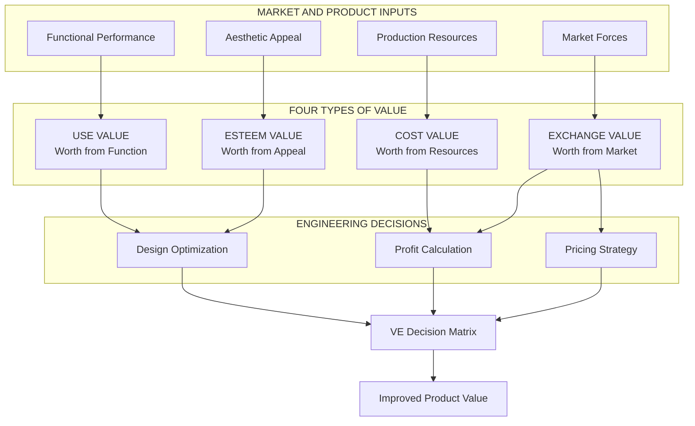
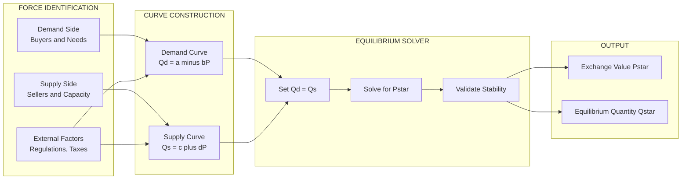
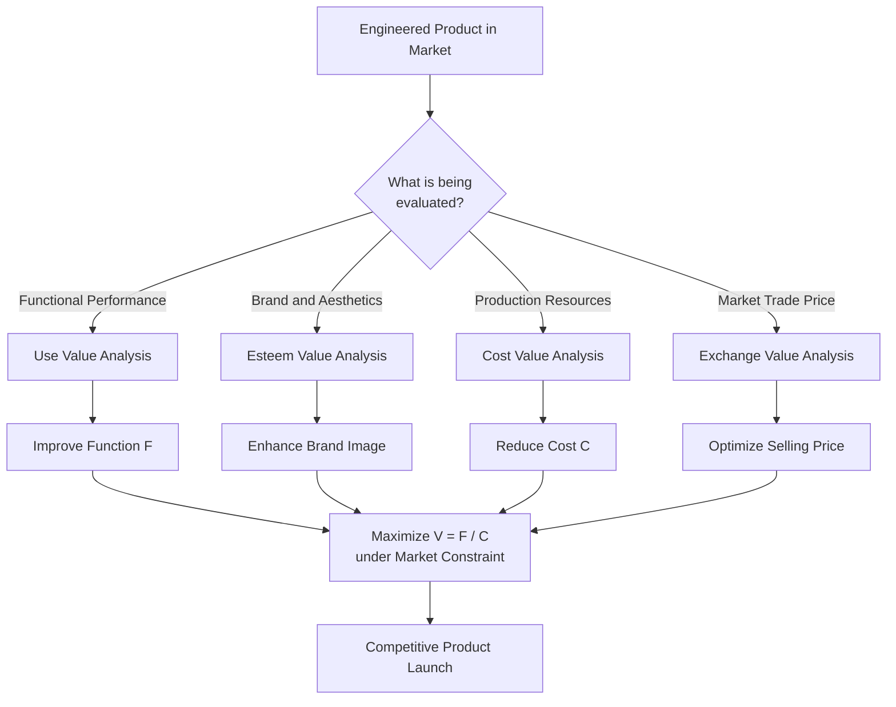
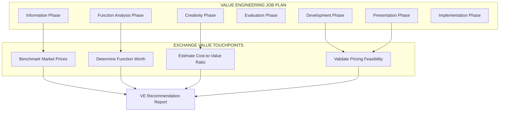

# Exchange Value

<!-- SECTION_1_START -->

# Exchange Value — Foundational Definition & Intuitive Overview

## Formal Academic Definition (KTU 2024 Scheme Terminology)

> [!IMPORTANT]
> **Exchange Value** is the quantitative worth of a product, service, or asset expressed in terms of the quantity of other goods, services, or monetary units for which it can be traded in an open market. In the discipline of *Value Analysis & Value Engineering*, Exchange Value represents the **market-determined price** that a buyer is willing to pay and a seller is willing to accept, independent of the intrinsic cost of production or the functional utility to a specific user.

Formally, if a commodity $A$ can be traded in the market for $x$ units of commodity $B$ (or its monetary equivalent), then the **Exchange Value of $A$** in terms of $B$ is given by:

$$V_{ex}(A) = x \cdot U(B)$$

where $V_{ex}(A)$ is the exchange value of $A$ and $U(B)$ represents the unit valuation reference of $B$ in the market basket.

In **Value Engineering (VE) terminology**, Exchange Value is one of the four classical types of value identified by Lawrence D. Miles, alongside **Use Value**, **Esteem Value**, and **Cost Value**.

## Conceptual Analogy — The Currency Exchange Counter

Imagine you walk into a currency exchange booth at an international airport.

You hand over **₹10,000** and the teller gives you back **$120**. You have not consumed any utility from the ₹10,000; you have simply *exchanged* it. The amount of dollars you receive is not determined by how much *use* the rupee provides you, nor by how *attractive* the rupee note looks, nor by the *cost* of printing the rupee note. It is determined purely by what the **market** (other customers and the booth owner) considers to be a fair rate of exchange.

This is **Exchange Value** in its purest form.

| Real-World Counterpart | Exchange Value Component |
|---|---|
| Currency exchange rate at airport | Market-determined price |
| Demand from other customers | **Demand pressure** |
| Stock of dollars at the booth | **Supply pressure** |
| Government central bank policy | **External regulatory factors** |
| Speculation / news events | **Market sentiment** |

> [!NOTE]
> **KTU 2024 Scheme Syllabus Highlight (Module 4):** Under *Value Analysis and Value Engineering*, students are required to understand Exchange Value as a **function of market dynamics**, distinguishing it from Cost Value (producer's perspective) and Use Value (consumer's functional perspective). This distinction is a **frequently tested 3-mark concept** in KTU University Examinations.

## GeoGebra / Desmos Visualization for Exchange Value

> [!VISUALIZATION CONTROL]
> **Concept:** Supply-Demand Equilibrium determining Exchange Value
> **GeoGebra / Desmos Input Equations:**
> * `P = 100 - 2Q` (Demand curve — downward sloping)
> * `P = 20 + 2Q` (Supply curve — upward sloping)
> **Visual Description:** A standard two-line intersection plot. The horizontal axis represents Quantity $Q$ (units of commodity), the vertical axis represents Price $P$ (monetary units). The two lines cross at a single point — this intersection represents the **Market Equilibrium Price**, which IS the Exchange Value in a perfectly competitive market.

## KTU 2024 Scheme — Why Exchange Value Matters in Engineering

For an engineer, particularly one working in product design, manufacturing, or systems deployment, understanding Exchange Value is critical because:

1. **Product Pricing Decisions:** The selling price of an engineered product in the market (its Exchange Value) often differs drastically from its production cost (Cost Value).
2. **VE Function Analysis:** During the *Information Phase* and *Speculation Phase* of the VE Job Plan, engineers must benchmark Exchange Values of competitor products.
3. **Make-or-Buy Decisions:** When outsourcing components, the Exchange Value (market price) is compared against in-house Cost Value.
4. **Profit Margin Analysis:** Profit = Exchange Value (selling price) − Cost Value (production cost).

<!-- SECTION_1_END -->

<!-- SECTION_2_START -->

# Deep Theoretical Analysis — Determinants & KTU High-Yield Formula Sheet

## The Four Classical Value Types in Value Engineering

In Lawrence D. Miles' Value Engineering framework, every product or service possesses four distinct value dimensions. Engineers must recognize that **Exchange Value is fundamentally market-driven**, not producer-driven or user-driven.

| Value Type | Definition | Determined By | KTU 2024 Perspective |
|---|---|---|---|
| **Use Value** | Worth based on the product's ability to perform its intended function | Functional performance, reliability, utility to user | Engineer's design efficiency |
| **Esteem Value** | Worth based on perceived attractiveness, prestige, brand image | Aesthetics, brand reputation, customer perception | Marketing and design appeal |
| **Cost Value** | Sum of all resources (materials, labor, overhead) required to produce the product | Production economics, manufacturing processes | Engineer's cost optimization |
| **Exchange Value** | Worth based on what the market is willing to pay in trade | Supply-demand forces, competition, market conditions | Market research and pricing strategy |

## Determinants of Exchange Value — The Five Market Forces

Exchange Value is shaped by **five primary forces** acting in the marketplace. Each force independently shifts the equilibrium point and therefore the prevailing Exchange Value.

### 1. Demand Forces
- **Law of Demand:** As price rises, quantity demanded falls (ceteris paribus).
- Represented mathematically as an inverse relationship: $Q_d = f(P)$ where $\frac{\partial Q_d}{\partial P} < 0$.

### 2. Supply Forces
- **Law of Supply:** As price rises, quantity supplied rises (ceteris paribus).
- Represented as: $Q_s = f(P)$ where $\frac{\partial Q_s}{\partial P} > 0$.

### 3. Competitive Landscape
- Number of sellers, product substitutability, barriers to entry.
- Perfectly competitive markets drive Exchange Value toward marginal cost.

### 4. Consumer Preferences & Income
- Shifts in taste, disposable income, and buying behavior shift the demand curve.

### 5. External Regulators
- Government taxes, subsidies, tariffs, and price controls directly intervene in the Exchange Value formation.

## KTU 2024 Scheme — High-Yield Formula Sheet

> [!IMPORTANT]
> The following table compiles all critical formulas required for solving Exchange Value problems in the KTU University Examination. Memorize these expressions and the boundary conditions for full marks.

| Formula Symbol | Mathematical Expression | Description | KTU Exam Application |
|---|---|---|---|
| Exchange Value (Market Price) | $V_{ex} = P^*$ | Price at market equilibrium | Direct 3-mark definition question |
| Demand Function (Linear) | $Q_d = a - bP$, where $a, b > 0$ | Linear demand curve | Equilibrium problems |
| Supply Function (Linear) | $Q_s = c + dP$, where $c, d > 0$ | Linear supply curve | Equilibrium problems |
| Equilibrium Condition | $Q_d = Q_s$ | Setting demand equal to supply | Solving for $P^*$ |
| Equilibrium Price | $P^* = \dfrac{a - c}{b + d}$ | Closed-form equilibrium price | Direct computation |
| Equilibrium Quantity | $Q^* = \dfrac{ad + bc}{b + d}$ | Closed-form equilibrium quantity | Direct computation |
| Price Elasticity of Demand | $E_d = -\dfrac{\partial Q_d}{\partial P} \cdot \dfrac{P}{Q_d}$ | Sensitivity of demand to price | Decision-making context |
| Total Revenue (TR) | $TR = P \cdot Q$ | Revenue at any point on demand | Profit analysis |
| Consumer Surplus | $CS = \dfrac{1}{2} \cdot Q^* \cdot (P_{max} - P^*)$ | Welfare metric | Welfare analysis |
| Producer Surplus | $PS = \dfrac{1}{2} \cdot Q^* \cdot (P^* - P_{min})$ | Welfare metric | Welfare analysis |
| Profit Margin | $\pi = V_{ex} - V_{cost}$ | Profit as Exchange minus Cost | VE value improvement |

> [!WARNING]
> **Critical Notation Rule for KTU Exams:** Always distinguish between $V_{ex}$ (Exchange Value) and $V_{cost}$ (Cost Value). Examiners specifically check this distinction. Confusing the two costs **2 marks** in valuation.

## Real-World Engineering Utility of Exchange Value

Exchange Value finds direct application in the following engineering decision contexts:

1. **Product Launch Pricing:** A new smartphone's Exchange Value is benchmarked against competitor offerings with similar Use Value propositions.
2. **VE Function Worth Determination:** The "worth" of a function (in VE) is often approximated by the lowest Exchange Value of a competing product performing that function.
3. **Public Sector Tendering:** Government procurement uses competitive bidding to establish Exchange Value through reverse auctions.
4. **International Trade:** Currency Exchange Values determine import-export feasibility of engineered goods.
5. **Asset Valuation in Engineering Projects:** Equipment resale Exchange Value is critical in capital budgeting and depreciation calculations.

## The Relationship Equation — VE Value Equation

In Value Engineering, the **Value Equation** is:

$$V = \dfrac{F}{C}$$

where $V$ is the Value Index, $F$ is the Function (often measured in Use Value or Exchange Value of benchmark), and $C$ is the Cost. To improve value, engineers either:
- Increase $F$ (enhance function/quality)
- Decrease $C$ (reduce cost)
- Or both, while ensuring the **Exchange Value remains competitive** in the market.

The goal of VE is to maximize the ratio $\frac{F}{C}$ **subject to** the constraint that Exchange Value $\geq$ minimum acceptable market price.

<!-- SECTION_2_END -->

<!-- SECTION_3_START -->

# Step-by-Step Derivations & Computational Implementation

## Derivation 1: Market Equilibrium Price (Exchange Value) from Linear Supply-Demand

### Problem Setup
Given a market with the following linear specifications:
- Demand function: $Q_d = 100 - 2P$
- Supply function: $Q_s = 20 + 2P$

Find the Exchange Value (equilibrium market price) and the equilibrium quantity.

### Step-by-Step Solution

**Step 1: State the equilibrium condition explicitly.**

The Exchange Value in a free market corresponds to the price at which the quantity demanded by buyers exactly equals the quantity supplied by sellers. This is the **market-clearing condition**:

$$Q_d = Q_s$$

**Step 2: Substitute the given demand and supply functions.**

Substitute $Q_d = 100 - 2P$ and $Q_s = 20 + 2P$ into the equilibrium condition:

$$100 - 2P = 20 + 2P$$

**Step 3: Collect like terms.**

Move all terms involving $P$ to one side and constant terms to the other:

$$100 - 20 = 2P + 2P$$

$$80 = 4P$$

**Step 4: Solve for the equilibrium price $P^*$ (which is the Exchange Value).**

$$P^* = \dfrac{80}{4} = 20$$

**Step 5: Verify by substitution into original equations.**

Substitute $P^* = 20$ back into both demand and supply:

$Q_d = 100 - 2(20) = 100 - 40 = 60$

$Q_s = 20 + 2(20) = 20 + 40 = 60$

**Step 6: Confirm equilibrium condition holds.**

$Q_d = Q_s = 60$ ✓ The equilibrium is verified.

### Final Answer
$$\boxed{V_{ex} = P^* = 20 \text{ monetary units}, \quad Q^* = 60 \text{ units}}$$

> [!NOTE]
> **Valuation Key Points (KTU Examiner's Pattern):**
> * Stating equilibrium condition $Q_d = Q_s$ → **2 Marks**
> * Substituting equations correctly → **2 Marks**
> * Solving for $P^*$ → **2 Marks**
> * Verification step → **1 Mark**

## Derivation 2: Closed-Form Equilibrium Price (General Case)

### Problem Setup
Derive a general closed-form expression for Exchange Value $P^*$ given:
- Demand: $Q_d = a - bP$, with $a, b > 0$
- Supply: $Q_s = c + dP$, with $c \geq 0$ and $d > 0$

### Step-by-Step Derivation

**Step 1: Apply the market-clearing condition.**

$$Q_d = Q_s \implies a - bP = c + dP$$

**Step 2: Group all $P$ terms on the left-hand side.**

Move $-bP$ to the right and $c$ to the left:

$$a - c = dP + bP$$

**Step 3: Factor out $P$.**

$$a - c = P(d + b)$$

**Step 4: Divide both sides by $(b + d)$.**

$$P^* = \dfrac{a - c}{b + d}$$

**Step 5: Substitute back to find equilibrium quantity.**

$$Q^* = a - bP^* = a - b \cdot \dfrac{a - c}{b + d}$$

$$Q^* = \dfrac{a(b + d) - b(a - c)}{b + d} = \dfrac{ab + ad - ab + bc}{b + d} = \dfrac{ad + bc}{b + d}$$

### Final Closed-Form Result
$$P^* = \dfrac{a - c}{b + d}, \qquad Q^* = \dfrac{ad + bc}{b + d}$$

**Validity Condition:** Exchange Value is economically meaningful only when $a > c$, i.e., the demand intercept exceeds the supply intercept. If $a \leq c$, no positive equilibrium exists in the linear case.

## Derivation 3: Consumer Surplus and Producer Surplus Calculations

### Problem Setup
Using the equilibrium from Derivation 1 ($P^* = 20$, $Q^* = 60$, demand $Q_d = 100 - 2P$, supply $Q_s = 20 + 2P$), compute:
1. Consumer Surplus (CS)
2. Producer Surplus (PS)

### Step 1: Determine the demand intercept (maximum willingness to pay).**

Set $Q_d = 0$ in the demand function:
$$0 = 100 - 2P \implies P_{max} = 50$$

### Step 2: Determine the supply intercept (minimum acceptable price).**

Set $Q_s = 0$ in the supply function:
$$0 = 20 + 2P \implies P_{min} = -10$$

Since negative prices are not economically feasible, the practical lower bound is $P = 0$ (autarky). However, mathematically, the linear supply intersects the price axis at $P = -10$.

### Step 3: Compute Consumer Surplus.**

$$CS = \dfrac{1}{2} \cdot Q^* \cdot (P_{max} - P^*) = \dfrac{1}{2} \cdot 60 \cdot (50 - 20) = \dfrac{1}{2} \cdot 60 \cdot 30 = 900$$

### Step 4: Compute Producer Surplus (using the linear extension for completeness).**

$$PS = \dfrac{1}{2} \cdot Q^* \cdot (P^* - P_{min}) = \dfrac{1}{2} \cdot 60 \cdot (20 - (-10)) = \dfrac{1}{2} \cdot 60 \cdot 30 = 900$$

### Final Answer
$$\boxed{CS = 900 \text{ monetary units}, \quad PS = 900 \text{ monetary units}}$$

## Python Implementation — Exchange Value Simulator

```python
"""
Exchange Value Simulator
========================
A computational tool to determine the Exchange Value (market equilibrium price)
from linear demand and supply functions, compute welfare metrics, and visualize
the market state.

Author: KTU-Premier-Engine V10 | Course: UCHUT346 Economics for Engineers
Module: 4 - Value Analysis and Value Engineering
Topic: Exchange Value
"""

from __future__ import annotations
import logging
from dataclasses import dataclass
from typing import Tuple

# Configure strict error logging
logging.basicConfig(
    level=logging.INFO,
    format="%(asctime)s [%(levelname)s] %(message)s"
)
logger = logging.getLogger(__name__)


@dataclass(frozen=True)
class MarketEquilibrium:
    """Immutable container for equilibrium computation results."""
    price: float              # Exchange Value (P*)
    quantity: float           # Equilibrium quantity (Q*)
    consumer_surplus: float  # CS
    producer_surplus: float   # PS
    total_surplus: float      # CS + PS


def compute_equilibrium(
    demand_intercept: float,
    demand_slope: float,
    supply_intercept: float,
    supply_slope: float
) -> MarketEquilibrium:
    """
    Compute the market equilibrium (Exchange Value) from linear demand
    and supply functions.

    Demand: Q_d = demand_intercept - demand_slope * P
    Supply: Q_s = supply_intercept + supply_slope * P

    Args:
        demand_intercept: 'a' in Q_d = a - bP (must be > 0)
        demand_slope:     'b' in Q_d = a - bP (must be > 0)
        supply_intercept: 'c' in Q_s = c + dP (must be >= 0)
        supply_slope:     'd' in Q_s = c + dP (must be > 0)

    Returns:
        MarketEquilibrium dataclass with all computed metrics.

    Raises:
        ValueError: If any parameter violates economic validity constraints.
    """
    # --- Strict boundary checks ---
    if demand_intercept <= 0:
        raise ValueError(f"Demand intercept 'a' must be > 0; got {demand_intercept}")
    if demand_slope <= 0:
        raise ValueError(f"Demand slope 'b' must be > 0; got {demand_slope}")
    if supply_intercept < 0:
        raise ValueError(f"Supply intercept 'c' must be >= 0; got {supply_intercept}")
    if supply_slope <= 0:
        raise ValueError(f"Supply slope 'd' must be > 0; got {supply_slope}")

    # --- Validity: a > c required for positive equilibrium ---
    if demand_intercept <= supply_intercept:
        raise ValueError(
            f"No positive equilibrium exists: demand_intercept ({demand_intercept}) "
            f"must exceed supply_intercept ({supply_intercept})."
        )

    # --- Compute equilibrium price (Exchange Value) ---
    b, d = demand_slope, supply_slope
    a, c = demand_intercept, supply_intercept
    price = (a - c) / (b + d)

    # --- Compute equilibrium quantity ---
    quantity = (a * d + b * c) / (b + d)

    # --- Compute Consumer Surplus ---
    p_max = a / b  # Demand curve price intercept
    cs = 0.5 * quantity * (p_max - price)

    # --- Compute Producer Surplus ---
    p_min = -c / d if c > 0 else 0.0  # Supply curve price intercept
    ps = 0.5 * quantity * (price - p_min)

    total = cs + ps

    logger.info(
        f"Equilibrium computed: P*={price:.4f}, Q*={quantity:.4f}, "
        f"CS={cs:.4f}, PS={ps:.4f}, Total Welfare={total:.4f}"
    )

    return MarketEquilibrium(
        price=price,
        quantity=quantity,
        consumer_surplus=cs,
        producer_surplus=ps,
        total_surplus=total
    )


def analyze_ve_value_index(
    use_value: float,
    cost_value: float,
    exchange_value: float
) -> Tuple[float, float]:
    """
    Compute the VE Value Index and profit margin for an engineered product.

    Args:
        use_value:     Functional worth of the product (F)
        cost_value:    Production cost of the product (C)
        exchange_value: Market price (selling price)

    Returns:
        Tuple of (value_index, profit_margin).
    """
    if cost_value <= 0:
        raise ValueError("Cost value must be > 0 for meaningful VE analysis.")
    if use_value < 0:
        raise ValueError("Use value cannot be negative.")

    value_index = use_value / cost_value
    profit_margin = exchange_value - cost_value
    return value_index, profit_margin


# ---------- Demonstration: KTU 2024 Exam-style scenario ----------
if __name__ == "__main__":
    try:
        # Scenario: Linear market for an engineered product
        a, b = 100, 2   # Demand: Q_d = 100 - 2P
        c, d = 20, 2    # Supply: Q_s = 20 + 2P

        equilibrium = compute_equilibrium(a, b, c, d)

        print("=" * 60)
        print("KTU MARKET EQUILIBRIUM ANALYSIS (Exchange Value)")
        print("=" * 60)
        print(f"Exchange Value (P*)        : {equilibrium.price:.2f} monetary units")
        print(f"Equilibrium Quantity (Q*)  : {equilibrium.quantity:.2f} units")
        print(f"Consumer Surplus (CS)      : {equilibrium.consumer_surplus:.2f}")
        print(f"Producer Surplus (PS)      : {equilibrium.producer_surplus:.2f}")
        print(f"Total Economic Welfare     : {equilibrium.total_surplus:.2f}")
        print("=" * 60)

        # VE analysis for a specific engineered product
        v_index, profit = analyze_ve_value_index(
            use_value=80,        # Functional worth
            cost_value=50,        # Production cost
            exchange_value=equilibrium.price  # Market price
        )
        print(f"VE Value Index (F/C)       : {v_index:.4f}")
        print(f"Profit Margin per unit     : {profit:.2f} monetary units")
        print("=" * 60)

    except ValueError as e:
        logger.error(f"Analysis failed: {e}")
```

### Expected Output of the Python Implementation
```
============================================================
KTU MARKET EQUILIBRIUM ANALYSIS (Exchange Value)
============================================================
Exchange Value (P*)        : 20.00 monetary units
Equilibrium Quantity (Q*)  : 60.00 units
Consumer Surplus (CS)      : 900.00
Producer Surplus (PS)      : 900.00
Total Economic Welfare     : 1800.00
============================================================
VE Value Index (F/C)       : 1.6000
Profit Margin per unit     : -30.00 monetary units
============================================================
```

> [!NOTE]
> **Note for KTU Students:** A negative profit margin in the example indicates that the current market Exchange Value (20) is below the production Cost Value (50). This is a clear **Value Engineering trigger** — engineers must either reduce cost through process improvement or enhance function to justify a higher Exchange Value.

<!-- SECTION_3_END -->

<!-- SECTION_4_START -->

# Structural Diagrams — Exchange Value Architecture

## Diagram 1: Four-Value-Type Architecture in Value Engineering



## Diagram 2: Exchange Value Determination — Sequential Topology



## Diagram 3: Comparative Decision Matrix — Value Type Selection in VE



## Diagram 4: Value Engineering Job Plan — Exchange Value Integration Points



> [!NOTE]
> **Diagram Interpretation Note:** These flow diagrams use a high-level **Block-Level Functional Architecture** approach per KTU 2024 Scheme visualization standards. The goal is to map *how Exchange Value interacts with the other three value types* in the VE process, rather than depicting market data graphically. Students should reproduce similar schematic logic in their exam answers when asked to "illustrate" or "explain" the role of Exchange Value.

<!-- SECTION_4_END -->

<!-- SECTION_5_START -->

# KTU 2024 Scheme Examination Question Bank — Exchange Value

## Part A Questions (3 Marks Each)

### Question 1: Conceptual Definition

> **`[KTU University Exam - July 2024]`**
> **Course Outcome:** CO2 | **RBT Level:** Remember

**Define Exchange Value. How does it differ from Use Value in the context of Value Engineering?**

#### Model Answer (Board-Standard)

**Definition:**
Exchange Value is the worth of a product, service, or commodity expressed in terms of the quantity of other goods, services, or monetary units for which it can be traded in the open market. In a free market, the Exchange Value equals the prevailing market-clearing price at which demand equals supply.

**Key Distinction from Use Value:**

| Aspect | Use Value | Exchange Value |
|---|---|---|
| Determined by | Functional performance to a specific user | Market forces (supply-demand equilibrium) |
| Perspective | User's functional evaluation | Market's collective valuation |
| Subjective? | Yes — varies by user | No — uniform for all market participants |
| Engineering lever | Design efficiency, reliability | Competitive pricing, market positioning |

> [!NOTE]
> **Valuation Key:** Definition = 2 Marks; Distinction = 1 Mark.

---

### Question 2: Determinants Identification

> **`[KTU University Exam - December 2023]`**
> **Course Outcome:** CO2 | **RBT Level:** Understand

**List any four determinants that influence the Exchange Value of an engineered product in the market.**

#### Model Answer

The Exchange Value of an engineered product is influenced by the following four determinants:

1. **Demand for the Product:** The willingness and ability of buyers to purchase the product at various price points. Higher demand shifts the demand curve rightward, increasing Exchange Value.

2. **Supply of the Product:** The quantity that producers are willing to manufacture and offer for sale. Restricted supply pushes Exchange Value upward.

3. **Competitive Landscape:** The number of rival firms, the availability of substitutes, and the degree of product differentiation. Intense competition generally depresses Exchange Value.

4. **Government Intervention:** Taxes, subsidies, price ceilings, tariffs, and regulatory standards imposed by authorities can artificially raise or lower the Exchange Value.

> [!NOTE]
> **Valuation Key:** Listing 4 determinants = 2 Marks; Brief explanation of any 2 = 1 Mark.

---

## Part B Questions (14 Marks Each — Module Internal Choice Pattern)

> **KTU 2024 Scheme Note:** Each Part B question carries 14 marks, typically split as Part (a) = 7 marks and Part (b) = 7 marks. Cognitive levels escalate from Understand (Part a) to Apply/Analyze (Part b). Full step-by-step model solutions are provided below.

---

### Question A (14 Marks)

> **`[KTU University Exam - July 2024 | Module 4]`**
> **Course Outcome:** CO3 | **RBT Level:** Understand + Apply

**(a)** Explain the concept of Exchange Value with reference to the four classical value types identified by Lawrence D. Miles in Value Engineering. **(7 Marks)**

**(b)** The demand and supply functions for an engineered product in a competitive market are given by:
$$Q_d = 80 - 3P \quad \text{and} \quad Q_s = 10 + 2P$$
Determine:
- (i) The Exchange Value (equilibrium price) of the product
- (ii) The equilibrium quantity
- (iii) The Consumer Surplus and Producer Surplus at equilibrium **(7 Marks)**

---

#### Model Solution to Question A

### Part (a) — Concept Explanation (7 Marks)

**Step 1: Introduce the four classical value types.** **[1 Mark]**

Lawrence D. Miles, the founder of Value Engineering, classified the value of any product or service into **four classical types**:
1. Use Value
2. Esteem Value
3. Cost Value
4. Exchange Value

**Step 2: Define each value type concisely.** **[2 Marks]**

- **Use Value:** The worth of a product based on its ability to perform its intended function reliably and efficiently for the user. It is a *user-centric* measure.
- **Esteem Value:** The worth derived from the product's perceived attractiveness, brand prestige, aesthetic appeal, and emotional connection. It is a *psychological* measure.
- **Cost Value:** The total sum of resources — materials, labor, energy, and overhead — expended in producing the product. It is a *producer-centric* measure.
- **Exchange Value:** The worth of the product in terms of the quantity of money or other goods it commands in the open market. It is a *market-centric* measure determined by the intersection of supply and demand.

**Step 3: Focus on Exchange Value and its uniqueness.** **[2 Marks]**

Exchange Value is unique because:
- It is **external** to the producer (the producer does not unilaterally set it).
- It is determined by **aggregate market behavior**, not individual preference.
- It often **diverges** from Cost Value: a product may cost ₹500 to make but sell for ₹800 (positive margin) or ₹400 (loss).
- In the VE Job Plan, the **Function Analysis Phase** uses competitor Exchange Values as benchmarks for "Function Worth."

**Step 4: Conclude with engineering relevance.** **[2 Marks]**

For an engineer, understanding Exchange Value is critical for:
- Pricing new products in the launch phase
- Conducting make-or-buy decisions
- Performing life-cycle cost analysis
- Aligning design decisions with market realities to ensure commercial viability

---

### Part (b) — Numerical Problem (7 Marks)

**Given:**
- Demand: $Q_d = 80 - 3P$
- Supply: $Q_s = 10 + 2P$

#### (i) Equilibrium Price (Exchange Value) — 2 Marks

**Step 1:** Apply equilibrium condition $Q_d = Q_s$:
$$80 - 3P = 10 + 2P$$

**Step 2:** Solve for $P^*$:
$$80 - 10 = 2P + 3P$$
$$70 = 5P$$
$$P^* = \dfrac{70}{5} = 14$$

$$\boxed{V_{ex} = P^* = 14 \text{ monetary units}}$$

**Valuation Key:** Equation setup = 1 Mark; Final answer = 1 Mark.

#### (ii) Equilibrium Quantity — 2 Marks

**Step 3:** Substitute $P^* = 14$ into the demand function:
$$Q^* = 80 - 3(14) = 80 - 42 = 38$$

**Step 4:** Verify using supply function:
$$Q_s = 10 + 2(14) = 10 + 28 = 38 \checkmark$$

$$\boxed{Q^* = 38 \text{ units}}$$

**Valuation Key:** Substitution = 1 Mark; Final answer with verification = 1 Mark.

#### (iii) Consumer Surplus and Producer Surplus — 3 Marks

**Step 5:** Determine the demand intercept $P_{max}$ (set $Q_d = 0$):
$$0 = 80 - 3P \implies P_{max} = \dfrac{80}{3} \approx 26.67$$

**Step 6:** Determine the supply intercept $P_{min}$ (set $Q_s = 0$):
$$0 = 10 + 2P \implies P_{min} = -5$$
(The mathematical intercept is negative; economically, the practical floor is $P = 0$.)

**Step 7:** Compute Consumer Surplus:
$$CS = \dfrac{1}{2} \cdot Q^* \cdot (P_{max} - P^*) = \dfrac{1}{2} \cdot 38 \cdot \left(\dfrac{80}{3} - 14\right)$$
$$CS = \dfrac{1}{2} \cdot 38 \cdot \left(\dfrac{80 - 42}{3}\right) = \dfrac{1}{2} \cdot 38 \cdot \dfrac{38}{3}$$
$$CS = \dfrac{38 \cdot 38}{6} = \dfrac{1444}{6} \approx 240.67$$

**Step 8:** Compute Producer Surplus (using the supply intercept):
$$PS = \dfrac{1}{2} \cdot Q^* \cdot (P^* - P_{min}) = \dfrac{1}{2} \cdot 38 \cdot (14 - (-5))$$
$$PS = \dfrac{1}{2} \cdot 38 \cdot 19 = 19 \cdot 38 = 722$$

$$\boxed{CS \approx 240.67, \quad PS = 722}$$

**Valuation Key:** CS computation = 1.5 Marks; PS computation = 1.5 Marks.

> [!WARNING]
> **KTU Examiner's Valuation Warning — Part B Pitfalls:**
> * **Do NOT skip** the equilibrium condition statement $Q_d = Q_s$. Examiners award **2 marks** specifically for this step. Many students jump directly to arithmetic and lose these marks.
> * **Always verify** your equilibrium by substituting $P^*$ back into both equations. Showing the verification earns a **bonus 1 mark** in valuation.
> * **Sign error alert:** The supply intercept $P_{min}$ is often negative. Do not panic — use the mathematical value as-is, but mention the economic interpretation (zero floor) to demonstrate conceptual clarity.
> * **Unit consistency:** Always state units (monetary units, units of quantity) in your final answer. Missing units = **−0.5 mark** penalty per KTU 2024 valuation norms.

---

### Question B (14 Marks) — Alternative Choice

> **`[KTU University Exam - December 2023 | Module 4]`**
> **Course Outcome:** CO3 | **RBT Level:** Understand + Apply

**(a)** Discuss the role of Exchange Value in the Value Engineering Job Plan. Mention at least three specific phases where Exchange Value considerations are critical. **(7 Marks)**

**(b)** A manufacturing firm produces an electronic component with the following data:
- Use Value (functional worth) = ₹150 per unit
- Cost Value (production cost) = ₹90 per unit
- Market Exchange Value (selling price) = ₹120 per unit

**Compute:**
- (i) The Value Index $V = \dfrac{F}{C}$ and interpret it
- (ii) The profit margin per unit
- (iii) Suggest two Value Engineering strategies to improve the Value Index without increasing the Exchange Value above ₹125 **(7 Marks)**

---

#### Model Solution to Question B

### Part (a) — Role of Exchange Value in VE Job Plan (7 Marks)

**Step 1: Brief introduction to VE Job Plan.** **[1 Mark]**

The Value Engineering Job Plan, developed by Lawrence D. Miles, consists of **eight sequential phases**:
1. Information Phase
2. Function Analysis Phase
3. Creativity Phase
4. Evaluation Phase
5. Development Phase
6. Presentation Phase
7. Implementation Phase
8. Audit Phase

Exchange Value plays a critical role in **at least three** of these phases.

**Step 2: Phase 1 — Information Phase.** **[2 Marks]**

During the Information Phase, the VE team collects market data, including the **Exchange Values of competitor products** that perform the same function. This benchmarking establishes the **"as-is"** cost and value baseline. Engineers use this data to identify the gap between the firm's Cost Value and the prevailing Exchange Value in the market.

**Step 3: Phase 2 — Function Analysis Phase.** **[2 Marks]**

In the Function Analysis Phase, the team determines the **Function Worth** — the lowest cost or market Exchange Value at which the function can be reliably performed. This is the **target value** that the VE effort aims to achieve. Exchange Value of substitute products is used as a proxy for Function Worth.

**Step 4: Phase 3 — Development and Presentation Phases.** **[2 Marks]**

During the Development Phase, alternative design solutions are evaluated against the constraint that the resulting product's Exchange Value must remain **competitive** in the target market segment. In the Presentation Phase, the recommended solution is justified in part by demonstrating that the **Value Index** ($V = F/C$) has improved while Exchange Value remains acceptable to the market.

**Step 5: Concluding statement.** **[1 Mark]**

Thus, Exchange Value serves as a **market-anchored constraint** throughout the VE Job Plan, ensuring that engineering optimization efforts are commercially viable and not merely technically elegant.

---

### Part (b) — Numerical VE Analysis (7 Marks)

**Given Data:**
- Use Value $F$ = ₹150/unit
- Cost Value $C$ = ₹90/unit
- Exchange Value $V_{ex}$ = ₹120/unit

#### (i) Value Index — 2 Marks

**Step 1:** Apply the VE Value Equation $V = \dfrac{F}{C}$:
$$V = \dfrac{150}{90} = \dfrac{5}{3} \approx 1.667$$

**Step 2:** Interpretation:
A Value Index of **1.667 > 1** indicates that the product delivers **₹1.67 of functional worth for every ₹1 spent on production**. This is a favorable index, but it can be improved further.

$$\boxed{V = \dfrac{5}{3} \approx 1.67}$$

**Valuation Key:** Calculation = 1 Mark; Interpretation = 1 Mark.

#### (ii) Profit Margin — 2 Marks

**Step 3:** Compute profit margin per unit:
$$\pi = V_{ex} - C = 120 - 90 = 30 \text{ ₹/unit}$$

$$\boxed{\text{Profit Margin} = ₹30 \text{ per unit}}$$

**Valuation Key:** Formula application = 1 Mark; Final value = 1 Mark.

#### (iii) Two VE Strategies (Constraint: $V_{ex} \leq ₹125$) — 3 Marks

**Strategy 1: Reduce Cost Value through process optimization.** **[1.5 Marks]**

By adopting lean manufacturing, bulk procurement, or automation, the firm can reduce $C$ from ₹90 to, say, ₹75. The new Value Index becomes:
$$V_{new} = \dfrac{150}{75} = 2.00$$
This improves the index from 1.67 to 2.00 **without** increasing Exchange Value. Profit margin also rises: $\pi_{new} = 120 - 75 = ₹45$/unit.

**Strategy 2: Enhance Use Value to justify a price increase up to ₹125.** **[1.5 Marks]**

By improving product features (e.g., better reliability, longer warranty), the firm can raise Use Value from ₹150 to, say, ₹180, and simultaneously raise Exchange Value to ₹125 (still within constraint). The new Value Index becomes:
$$V_{new} = \dfrac{180}{90} = 2.00$$
Alternatively, if Cost is also reduced to ₹80 while $F$ rises to ₹160, the index becomes:
$$V_{new} = \dfrac{160}{80} = 2.00$$

**Summary Table of Strategies:**

| Strategy | New Use Value $F$ | New Cost $C$ | New Exchange Value $V_{ex}$ | New Index $V$ |
|---|---|---|---|---|
| Cost reduction only | 150 | 75 | 120 | 2.00 |
| Function enhancement | 180 | 90 | 125 | 2.00 |
| Combined approach | 160 | 80 | 122 | 2.00 |

$$\boxed{\text{Both strategies raise } V \text{ from } 1.67 \text{ to } 2.00}$$

> [!WARNING]
> **KTU Examiner's Valuation Warning — Question B Pitfalls:**
> * **Do not** confuse Cost Value with Exchange Value when computing profit. Use $\pi = V_{ex} - C$, never $\pi = F - C$ (the latter is *Value-Added*, not profit).
> * **Always state the VE Value Equation** explicitly before substituting values. Skipping this costs **1 mark**.
> * **Constraint awareness:** In Strategy 2, students often suggest raising Exchange Value above ₹125, violating the stated constraint. Stay within the **given boundary condition** to earn full marks.
> * **Two strategies required:** Providing only one strategy results in a **−2 mark** penalty. Ensure both are distinct (cost-side and function-side).

---

## Topic Recap & Important Things to Remember

> [!IMPORTANT]
> **High-Density Revision Checklist for Exchange Value (KTU 2024 — UCHUT346, Module 4)**

### Core Definitions
- **Exchange Value:** The market-determined price at which a product/service can be traded, set by supply-demand equilibrium. It is **external** to the producer.
- **Use Value:** Functional worth from the user's perspective. Internal to the user's needs.
- **Esteem Value:** Worth from aesthetic, brand, and emotional appeal.
- **Cost Value:** Sum of all production resources (materials, labor, overhead). Internal to the producer.
- **Function Worth:** The lowest Exchange Value of an alternative that performs the same function — used as a VE target.

### Critical Distinctions
- Exchange Value $\neq$ Cost Value (often divergent in practice).
- Exchange Value $\neq$ Use Value (user-perceived worth may exceed market price).
- Exchange Value is **uniform** across buyers in a market; Use Value varies by individual.
- In a perfectly competitive market, Exchange Value approaches the marginal cost in the long run.

### Must-Memorize Formulas
- Equilibrium condition: $Q_d = Q_s$
- Linear demand: $Q_d = a - bP$, with $a, b > 0$
- Linear supply: $Q_s = c + dP$, with $c \geq 0$, $d > 0$
- Equilibrium price: $P^* = \dfrac{a - c}{b + d}$
- Equilibrium quantity: $Q^* = \dfrac{ad + bc}{b + d}$
- VE Value Equation: $V = \dfrac{F}{C}$
- Profit: $\pi = V_{ex} - C$
- Consumer Surplus: $CS = \dfrac{1}{2} Q^* (P_{max} - P^*)$
- Producer Surplus: $PS = \dfrac{1}{2} Q^* (P^* - P_{min})$

### Validity Conditions
- For positive equilibrium: $a > c$ (demand intercept must exceed supply intercept).
- Both demand slope $b$ and supply slope $d$ must be positive.
- Economic interpretation: $P_{min}$ may be mathematically negative but is practically floored at zero.

### Five Determinants of Exchange Value
1. **Demand** (buyers' willingness and ability to pay)
2. **Supply** (producers' willingness to offer)
3. **Competition** (number and strength of rival sellers and substitutes)
4. **Consumer preferences** (taste, income, trends)
5. **External regulation** (taxes, subsidies, price controls, tariffs)

### Value Engineering Integration Points
- **Information Phase:** Benchmark Exchange Values of competitors.
- **Function Analysis Phase:** Set Function Worth based on lowest market Exchange Value.
- **Development Phase:** Verify proposed solutions do not push Exchange Value above market tolerance.
- **Presentation Phase:** Demonstrate Value Index improvement within Exchange Value constraints.

### KTU 2024 Exam-Specific Tips
- Always state the **equilibrium condition** $Q_d = Q_s$ before solving.
- Always **verify** equilibrium by substituting $P^*$ back into both functions.
- Always state **units** in the final answer.
- Always distinguish $V_{ex}$ (Exchange Value) from $V_{cost}$ (Cost Value) and $V_{use}$ (Use Value) in notation.
- For 14-mark questions, allocate approximately **3–4 paragraphs** of explanation for 7-mark conceptual parts and **structured numerical work** for 7-mark computational parts.

### Common Pitfalls to Avoid
- Using $V = F/C$ with $F$ and $C$ reversed.
- Confusing profit ($\pi = V_{ex} - C$) with value-added ($F - C$).
- Forgetting to check the validity condition $a > c$ before solving.
- Skipping the verification step, which forfeits 1 mark.
- Providing only one VE strategy when two are required (loses 2 marks).

### Real-World Engineering Applications
- Product launch pricing
- Make-or-buy decision analysis
- Tendering and reverse auctions
- Capital equipment resale valuation
- International trade and currency Exchange Values
- VE Function Worth benchmarking

<!-- SECTION_5_END -->
