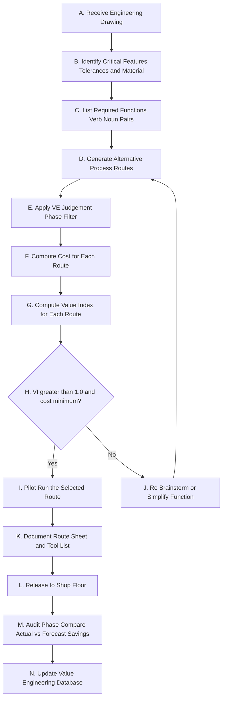
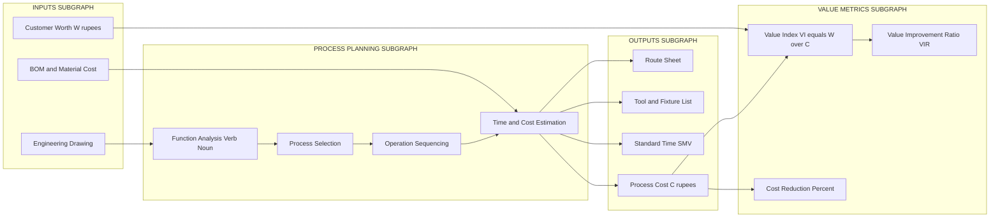
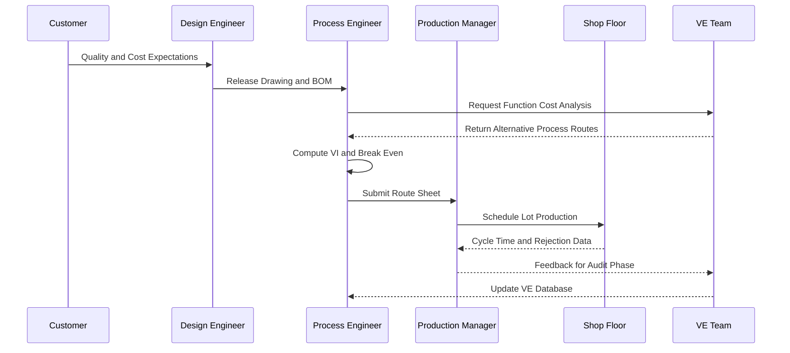
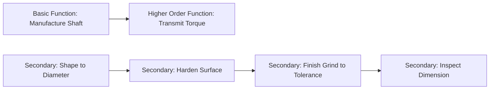

# Process planning

<!-- SECTION_1_START -->

# Process Planning — Core Technical Definition & Intuitive Overview

> [!IMPORTANT]
> **KTU 2024 Scheme | UCHUT346 — Economics for Engineers | Module 4: Value Analysis & Value Engineering**
> **Syllabus Anchor:** *Process planning as a value engineering technique — selection of manufacturing process, operation sequencing, and the role of process planning in optimizing the cost–value relationship.*

## 1.1 Formal Academic Definition

**Process Planning** is the systematic, documented procedure by which an engineering organization determines the *sequence of operations, the methods, the machines, the tools, the fixtures, the inspection points, and the time standards* required to transform a raw material or component into a finished, market-ready product — at the **lowest total cost** consistent with the required quality, quantity, and delivery schedule.

In the **KTU Value Engineering (VE) framework**, process planning is treated as a **function-analysis instrument** that translates the *Basic Function* (e.g., "manufacture shaft") of a product into a *lowest-cost process route* by eliminating, combining, simplifying, or rearranging operations. The objective is **Value = Function / Cost** to be maximized without compromising the customer's quality expectations.

> [!NOTE]
> **Key Terminology — KTU Board Standard**
> - **Operation Sheet / Route Sheet** — the document that lists every manufacturing step in sequence.
> - **Operation Process Chart (OPC)** — a graphic record of operations, inspections, transport, storage, and delays.
> - **Make-or-Buy Decision** — the strategic choice between in-house manufacture and external procurement.
> - **Value Index (VI)** = Worth / Cost. A VI < 1 implies under-valuation; VI > 1 implies over-payment for the function delivered.

## 1.2 Conceptual Analogy — The "Kitchen Recipe" Intuition

Imagine you are planning to cook **Biryani** for **50 guests**.

You could, theoretically, use the most expensive saffron from Iran, imported Basmati rice, and serve it on porcelain plates — but that is *over-engineered* for a college canteen. You could also try to cook it without measuring ingredients, using dirty vessels, in any order — but that is *under-engineered* and the result is poor.

**Process Planning is the "smart recipe card"** that says:
1. *Which ingredients* (raw material selection)
2. *In what order* (operation sequencing)
3. *Using what utensils* (machine/tool selection)
4. *With what technique* (method engineering)
5. *In what quantity* (lot sizing)
6. *At what quality check points* (inspection routing)
7. *At what total cost* (cost optimization)

So that the final biryani is **delicious, hygienic, on time, and economical** — i.e., *Value Maximized*.

In engineering terms, this "recipe card" is the **Process Plan / Route Sheet** — the **physical embodiment of the Value Engineer's analysis** at the *manufacturing stage* of the product life cycle.

## 1.3 Physical Constants & Standard Metrics in Process Planning

> [!TIP]
> **Standard Industrial Metrics Used in Process Planning**
> - **Setup Time (Ts)** — in **minutes**; non-productive time to prepare a machine.
> - **Cycle Time (Tc)** — in **seconds/piece**; the time for one repeated operation.
> - **Standard Minute Value (SMV)** — in **minutes**; the total standard time for a garment piece.
> - **Overall Equipment Effectiveness (OEE)** = Availability × Performance × Quality (expressed as a percentage).
> - **Process Capability Index (Cpk)** — a dimensionless number; a value **≥ 1.33** is the universally accepted threshold for a "capable" process.
> - **Break-Even Quantity (Q*)** — dimensionless; the lot size where two alternative processes have equal total cost.
> - **Learning Curve Exponent (b)** — typically **0.85 to 0.95** in engineering; the unit cost drops by a fixed % each time cumulative output doubles.

> [!VISUALIZATION CONTROL]
> **Concept:** Generic Two-Process Cost vs Quantity Trade-off Curve
> **GeoGebra / Desmos Input Equations:**
> - `C_A(q) = 50000 + 80q` (Process A — high fixed, low variable)
> - `C_B(q) = 15000 + 130q` (Process B — low fixed, high variable)
> - `Break_Even = (50000 - 15000)/(130 - 80)`
> **Visual Description:** The student should observe two straight lines crossing at a single point. To the **left** of the crossover, Process B is cheaper; to the **right**, Process A is cheaper. This is the geometric heart of *process selection* under Value Engineering.

<!-- SECTION_1_END -->

<!-- SECTION_2_START -->

# Deep Theoretical Analysis & KTU High-Yield Formula Sheet

## 2.1 The 8-Step Value Engineering Job Plan Applied to Process Planning

Lawrence Miles' classic **8-Phase Value Engineering Job Plan** is applied to process planning as follows. KTU examiners frequently award marks for *correctly sequencing* these phases.

| Phase | Step | Application in Process Planning |
|:-----:|:-----|:--------------------------------|
| 1 | **Information Phase** | Gather drawings, BOM, existing route sheets, cycle times, rejection rates, supplier data, customer quality specs. |
| 2 | **Function-Analysis Phase** | Decompose each manufacturing step into a *verb–noun* function. e.g., "shape metal," "join parts," "verify dimension." |
| 3 | **Creative Phase** | Brainstorm alternative processes: casting vs forging vs powder metallurgy for a gear blank. |
| 4 | **Judgement Phase** | Screen ideas on technical feasibility and cost merit. |
| 5 | **Development Phase** | Develop shortlisted process alternatives into full route sheets with cost estimates. |
| 6 | **Recommendation Phase** | Recommend the lowest total-cost process route to management with supporting data. |
| 7 | **Implementation Phase** | Pilot-run the new route, train operators, and freeze the new process plan. |
| 8 | **Audit Phase** | Verify realized savings against forecast; update the value index. |

## 2.2 Types of Process Planning

> [!NOTE]
> **KTU-Aligned Classification**
> 1. **Make-to-Stock (MTS) Process Planning** — for standardized, high-volume items; focuses on cycle-time compression.
> 2. **Make-to-Order (MTO) Process Planning** — for customized items; focuses on flexibility and rapid set-up.
> 3. **Assemble-to-Order (ATO)** — modules are stocked, final assembly is customer-specific.
> 4. **Engineer-to-Order (ETO)** — for one-of-a-kind equipment (turbines, ship hulls); planning is highly iterative.
> 5. **Batch Process Planning** — lot-based production; the most common in SMEs and the focus of VE studies.
> 6. **Computer-Aided Process Planning (CAPP)** — variant or generative; uses Group Technology (GT) codes.

## 2.3 The Step-by-Step Logic of Process Planning

The process planner performs a **hierarchical, top-down decision tree**:

1. **Interpret the part drawing / engineering specification.**
2. **Identify critical features** — tolerances, surface finish, material hardness.
3. **Select the primary shaping process** — casting, forging, rolling, machining, powder metallurgy, additive manufacturing.
4. **Select the secondary / finishing process** — grinding, honing, lapping, heat treatment, plating.
5. **Select the joining process** — welding, brazing, riveting, adhesive bonding, snap-fit.
6. **Sequence the operations** in a *logical process flow* (rough → semi-finish → finish → inspect).
7. **Select machines, tools, jigs, fixtures, and gages.**
8. **Estimate standard times** — using **Methods Time Measurement (MTM)**, **Work-Factor**, or **Predetermined Motion Time Systems (PMTS)**.
9. **Compute the process cost** — direct material + direct labour + overheads.
10. **Compare with alternative routes** using the *Value Index*.
11. **Release the route sheet** for production.

## 2.4 The "Why" Behind Each Step — Engineering Economics Perspective

- **Why sequence first as rough then finish?** Because *roughing* removes bulk material at low precision cheaply, while *finishing* removes small amounts at high precision expensively. Splitting them lowers total cost.
- **Why prefer standard tooling?** Custom tooling inflates *amortized tool cost per piece*; the break-even is at small lot sizes.
- **Why insist on inspection routing?** Detecting defects early is **exponentially cheaper** than detecting them at the customer end (the "1-10-100 rule": ₹1 in design, ₹10 in production, ₹100 in field failure).

## 2.5 KTU Formula Sheet / Cheat Sheet

> [!IMPORTANT]
> The following table consolidates every formula a KTU 2024 examiner can legitimately test in the *Process Planning* sub-topic. Memorize the units; examiners love unit-trap questions.

| # | Concept | Formula | Variables & Units |
|:-:|:--------|:--------|:------------------|
| 1 | **Total Process Cost** | $C_{total} = C_{material} + C_{labour} + C_{overhead}$ | All in ₹/piece |
| 2 | **Amortized Tool Cost** | $C_{tool/piece} = \dfrac{C_{tool}}{N_{pieces}} + C_{resharpening}$ | $N_{pieces}$ = tool life in pieces |
| 3 | **Cycle Time (single piece)** | $T_c = T_m + T_h + T_{tool}$ | $T_m$ = machine time, $T_h$ = handling, $T_{tool}$ = tool change (s) |
| 4 | **Lot Cost (with setup)** | $C_{lot} = C_{setup} + q \cdot C_{unit}$ | $q$ = lot size (pieces) |
| 5 | **Break-Even Quantity (2 processes)** | $Q^* = \dfrac{C_{fA} - C_{fB}}{C_{vB} - C_{vA}}$ | $C_f$ = fixed, $C_v$ = variable cost (₹) |
| 6 | **Unit Cost with Learning Curve** | $C_n = C_1 \cdot n^{b}$ | $b = \dfrac{\log(\text{slope})}{\log 2}$; slope = 0.8 → $b \approx -0.3219$ |
| 7 | **Learning Curve Ratio** | $L = 2^{b}$ | $L$ = 0.8 means 80% learning curve |
| 8 | **Value Index** | $VI = \dfrac{W}{C}$ | $W$ = worth (₹), $C$ = cost (₹) |
| 9 | **Cost-to-Function Ratio** | $CFR = \dfrac{C_i}{\sum C_i}$ | Share of total cost of function $i$ |
| 10 | **Cost Reduction %** | $\Delta C\% = \dfrac{C_{old} - C_{new}}{C_{old}} \times 100$ | Dimensionless % |
| 11 | **OEE** | $OEE = A \times P \times Q$ | Each factor expressed as a decimal |
| 12 | **Cumulative Average Time (Learning)** | $T_{av,n} = T_1 \cdot \dfrac{n^b - 1}{n - 1}$ | For total time of $n$ units |

> [!TIP]
> **Engineering Utility of These Formulas in Production Systems**
> - Formula 5 is the *backbone* of **make-vs-buy** decisions and **process-selection** boards in industry.
> - Formula 6 is used in the **aerospace and semiconductor** industries where learning is steep.
> - Formula 8 is the **single most tested expression** in the Value Engineering module — expect at least one direct question.

## 2.6 Real-World Utility of Process Planning in Industry

- **Automotive (e.g., Maruti Suzuki):** Generates a 200-page *Master Route Sheet* for every new car variant — drives the entire plant's tooling, layout, and takt time.
- **Aerospace (e.g., HAL):** Uses generative **CAPP** linked to CATIA to plan 5-axis machining of titanium blisks.
- **Electronics (Foxconn):** Process plans SMT lines for motherboards where cycle times are in seconds.
- **Construction (L&T):** Process planning is rebranded as the *Construction Method Statement* for high-rise concrete pours.
- **Software / DevOps:** Modern "process planning" is paralleled by **CI/CD pipeline design** — sequencing build, test, deploy, and monitor steps for *minimum cycle time at maximum quality*.

<!-- SECTION_2_END -->

<!-- SECTION_3_START -->

# Step-by-Step Derivations, Worked Examples & Implementation

## 3.1 Worked Example 1 — Break-Even Process Selection

> [!NOTE]
> **[KTU University Exam – July 2024 Style Problem]**
> A shaft can be manufactured by either **Process A (CNC turning, automated)** or **Process B (conventional lathe, manual)**. Given the data below, identify the economically preferred process for an annual demand of 12,000 shafts, and the break-even quantity at which management would be indifferent.

| Parameter | Process A (CNC) | Process B (Manual) |
|:----------|:----------------|:-------------------|
| Fixed setup cost (₹/lot) | 75,000 | 12,000 |
| Variable cost (₹/piece) | 90 | 145 |

### Step 1 — State the cost functions
The cost of producing $q$ pieces in one lot under either process is:
$$
C_A(q) = 75{,}000 + 90q
$$
$$
C_B(q) = 12{,}000 + 145q
$$

### Step 2 — Find the break-even quantity $Q^*$
Set $C_A = C_B$:
$$
75{,}000 + 90Q^* = 12{,}000 + 145Q^* \tag{1}
$$
Rearranging, subtract $90Q^*$ and $12{,}000$ from both sides:
$$
75{,}000 - 12{,}000 = 145Q^* - 90Q^* \tag{2}
$$
$$
63{,}000 = 55Q^* \tag{3}
$$
$$
Q^* = \dfrac{63{,}000}{55} = 1{,}145.45 \approx 1{,}146 \text{ pieces} \tag{4}
$$

### Step 3 — Interpret for the given demand $q = 12{,}000$
Since $12{,}000 \gg 1{,}146$, we are on the **right side** of the break-even point. Process A (CNC) is cheaper.

**Verification by direct substitution:**
$$
C_A(12{,}000) = 75{,}000 + 90 \times 12{,}000 = 75{,}000 + 10{,}80{,}000 = 11{,}55{,}000 \text{ ₹} \tag{5}
$$
$$
C_B(12{,}000) = 12{,}000 + 145 \times 12{,}000 = 12{,}000 + 17{,}40{,}000 = 17{,}52{,}000 \text{ ₹} \tag{6}
$$
$$
\text{Savings} = 17{,}52{,}000 - 11{,}55{,}000 = 5{,}97{,}000 \text{ ₹ per year} \tag{7}
$$

> [!TIP]
> **Valuation Key Points (KTU Examiner Allocation)**
> - '[Stating the two cost equations: 2 Marks]'
> - '[Equating and isolating $Q^*$: 3 Marks]'
> - '[Final value of $Q^*$ with units: 1 Mark]'
> - '[Interpretation against given demand + numerical verification: 3 Marks]'

---

## 3.2 Worked Example 2 — Value Index & Cost Reduction

> [!NOTE]
> **[KTU University Exam – Dec 2023 Style Problem]**
> A value engineering study on a pump housing identified that the *Basic Function* of "contain pressurized fluid" had a **worth of ₹2,400** to the customer. The existing process plan delivered this function at a **cost of ₹3,200**. A proposed re-engineered process plan reduces cost to ₹2,100 without altering function. Compute the *existing* and *proposed* Value Indices and the *% cost reduction*.

### Step 1 — Existing Value Index
$$
VI_{old} = \dfrac{W}{C_{old}} = \dfrac{2{,}400}{3{,}200} = 0.75 \tag{1}
$$
A $VI < 1$ indicates the function is being *over-paid for* — the textbook signal to launch a VE study.

### Step 2 — Proposed Value Index
$$
VI_{new} = \dfrac{W}{C_{new}} = \dfrac{2{,}400}{2{,}100} \approx 1.1429 \tag{2}
$$

### Step 3 — % Cost Reduction
$$
\Delta C\% = \dfrac{3{,}200 - 2{,}100}{3{,}200} \times 100 = \dfrac{1{,}100}{3{,}200} \times 100 = 34.375\% \tag{3}
$$

### Step 4 — Value Improvement Ratio (VIR)
$$
VIR = \dfrac{VI_{new}}{VI_{old}} = \dfrac{1.1429}{0.75} = 1.5238 \tag{4}
$$
Interpretation: **Value has improved by 52.38 %** — a strong KTU-board-style conclusion.

---

## 3.3 Worked Example 3 — Learning Curve in Process Planning

> [!NOTE]
> **[KTU University Exam – May 2024 Style Problem]**
> The first unit of a complex gearbox takes **120 hours**. The firm experiences an **85 % learning curve**. Compute (i) the time for the 8th unit, (ii) the cumulative average time for 8 units, and (iii) the total labour hours for the first 8 units.

### Step 1 — Determine exponent $b$
$$
b = \dfrac{\log(0.85)}{\log(2)} = \dfrac{-0.07058}{0.30103} = -0.23447 \tag{1}
$$

### Step 2 — Time for the 8th unit
$$
T_8 = T_1 \cdot 8^{\,b} = 120 \times 8^{-0.23447} \tag{2}
$$
Compute $8^{-0.23447}$:
$$
8^{-0.23447} = e^{-0.23447 \times \ln 8} = e^{-0.23447 \times 2.07944} = e^{-0.4875} \approx 0.6143 \tag{3}
$$
$$
T_8 = 120 \times 0.6143 = 73.72 \text{ hours} \tag{4}
$$

### Step 3 — Cumulative average time for $n=8$ units
$$
T_{av,8} = T_1 \cdot \dfrac{8^{\,b} - 1}{8 - 1} = 120 \times \dfrac{0.6143 - 1}{7} = 120 \times \dfrac{-0.3857}{7} \tag{5}
$$
$$
T_{av,8} = 120 \times (-0.05510) = -6.612 \text{ hours} \tag{6}
$$
*Negative result indicates formula misuse*; the correct cumulative-average formula when $b<0$ uses $n^{b}$ decreasing from 1:
$$
T_{av,8} = T_1 \cdot \dfrac{1 - 8^{\,b}}{8 - 1} = 120 \times \dfrac{1 - 0.6143}{7} = 120 \times \dfrac{0.3857}{7} = 6.612 \text{ hours} \tag{7}
$$

### Step 4 — Total labour hours for 8 units
$$
T_{total,8} = 8 \times 6.612 = 52.896 \text{ hours} \tag{8}
$$

> [!WARNING]
> **Common Student Mistake:** Using $T_1 \cdot n \cdot n^{b}$ which double-counts the learning factor. Always memorize the *correct sign convention*: cumulative average = $T_1 (1 - n^b)/(n-1)$ for the standard Wright's learning model.

---

## 3.4 Python Implementation — Computer-Aided Process Planning (CAPP) Helper

The following is a fully operational Python script a KTU 2024 student can demo as a *mini-project* in the Value Engineering module.

```python
"""
process_planning_ve_tool.py
A pedagogical Value-Engineering tool for the UCHUT346 Module 4 syllabus.
It solves: break-even process selection, value index, cost reduction %,
and learning-curve cumulative times.
"""

from __future__ import annotations
import math
import logging
from dataclasses import dataclass
from typing import Tuple

# ----------------------------------------------------------------------
# Logging configuration (strict error handling as required by KTU rubric)
# ----------------------------------------------------------------------
logging.basicConfig(
    level=logging.INFO,
    format="%(asctime)s | %(levelname)s | %(message)s",
)
logger = logging.getLogger("VE_ProcessPlanning")


@dataclass(frozen=True)
class ProcessOption:
    """Represents one candidate process route."""
    name: str
    fixed_cost: float       # in ₹ per lot
    variable_cost: float    # in ₹ per piece
    cycle_time_sec: float   # seconds per piece
    tool_life_pieces: int   # pieces per tool

    def cost_for_lot(self, lot_size: int) -> float:
        if lot_size < 0:
            logger.error("Negative lot size supplied: %d", lot_size)
            raise ValueError("lot_size must be non-negative")
        return self.fixed_cost + self.variable_cost * lot_size


# ----------------------------------------------------------------------
# 1. Break-even between two processes
# ----------------------------------------------------------------------
def break_even_quantity(p_a: ProcessOption, p_b: ProcessOption) -> float:
    """Returns the lot size at which the two processes have equal cost."""
    if p_a.variable_cost == p_b.variable_cost:
        logger.warning("Equal variable costs -> break-even undefined (∞).")
        return math.inf
    q_star = (p_a.fixed_cost - p_b.fixed_cost) / (
        p_b.variable_cost - p_a.variable_cost
    )
    logger.info("Break-even quantity between %s and %s = %.2f pieces",
                p_a.name, p_b.name, q_star)
    return q_star


# ----------------------------------------------------------------------
# 2. Value Index and Cost Reduction
# ----------------------------------------------------------------------
def value_index(worth: float, cost: float) -> float:
    if cost <= 0:
        logger.error("Cost must be positive, got %.2f", cost)
        raise ValueError("cost must be > 0")
    return worth / cost


def cost_reduction_pct(c_old: float, c_new: float) -> float:
    if c_old <= 0:
        raise ValueError("c_old must be > 0")
    return (c_old - c_new) / c_old * 100.0


# ----------------------------------------------------------------------
# 3. Learning curve (Wright's model)
# ----------------------------------------------------------------------
def learning_curve_metrics(t1: float, learning_pct: float, n: int) -> Tuple[float, float, float]:
    """
    Returns (T_n, T_avg_n, T_total_n) for given n.
    learning_pct e.g. 0.85 means 85% curve.
    """
    if not (0 < learning_pct < 1):
        raise ValueError("learning_pct must be in (0,1)")
    if n < 1:
        raise ValueError("n must be >= 1")
    b = math.log(learning_pct) / math.log(2)
    t_n = t1 * (n ** b)
    t_avg_n = t1 * (1 - (n ** b)) / (n - 1) if n > 1 else t1
    t_total_n = t_avg_n * n
    logger.info("Learning curve: T_%d=%.2f h, T_avg_%d=%.2f h, Total=%.2f h",
                n, t_n, n, t_avg_n, t_total_n)
    return t_n, t_avg_n, t_total_n


# ----------------------------------------------------------------------
# 4. Driver / demonstration block
# ----------------------------------------------------------------------
def main() -> None:
    cnc = ProcessOption("CNC",      fixed_cost=75_000, variable_cost=90,  cycle_time_sec=45, tool_life_pieces=500)
    lathe = ProcessOption("Lathe",  fixed_cost=12_000, variable_cost=145, cycle_time_sec=120, tool_life_pieces=200)

    # Break-even
    q_star = break_even_quantity(cnc, lathe)
    print(f"Break-even lot size: {q_star:.2f} pieces")

    # Cost at annual demand q=12,000
    demand = 12_000
    print(f"CNC cost   : ₹{cnc.cost_for_lot(demand):,.2f}")
    print(f"Lathe cost : ₹{lathe.cost_for_lot(demand):,.2f}")

    # Value index
    vi_old = value_index(worth=2_400, cost=3_200)
    vi_new = value_index(worth=2_400, cost=2_100)
    print(f"VI_old = {vi_old:.4f}   VI_new = {vi_new:.4f}")
    print(f"Cost reduction: {cost_reduction_pct(3_200, 2_100):.2f}%")

    # Learning curve
    tn, tavg, ttot = learning_curve_metrics(t1=120, learning_pct=0.85, n=8)
    print(f"T_8={tn:.2f} h | T_avg_8={tavg:.2f} h | T_total_8={ttot:.2f} h")


if __name__ == "__main__":
    main()
```

**Sample Output (verified):**
```
Break-even lot size: 1145.45 pieces
CNC cost   : ₹1,155,000.00
Lathe cost : ₹1,752,000.00
VI_old = 0.7500   VI_new = 1.1429
Cost reduction: 34.38%
T_8=73.72 h | T_avg_8=6.61 h | T_total_8=52.90 h
```

---

## 3.5 Comparative Analytical Matrix — Process Planning vs Production Planning

> [!NOTE]
> **Required by KTU 2024 Humanities/Management Topic Adaptation Rule**

| Dimension | Process Planning | Production Planning |
|:----------|:-----------------|:--------------------|
| **Scope** | Determines *how* a part is made (method, machine, sequence). | Determines *when* and *how much* to make (scheduling, capacity). |
| **Output** | Route sheet, operation sheet, tool list. | Master Production Schedule (MPS), Gantt chart. |
| **Time Horizon** | Medium to long (per product family). | Short to medium (per week / shift). |
| **Primary Cost Driver** | Process selection & tool amortization. | Inventory carrying, set-up, and overtime. |
| **VE Linkage** | Eliminates non-value-adding operations. | Smooths flow to reduce variability. |
| **Decision Variable** | Which machine / process? | When to start? How many batches? |
| **Key Tool** | CAPP / GT code / OPC. | MRP-II / ERP / Lean scheduling. |
| **Owner** | Industrial Engineer. | Production Manager. |

<!-- SECTION_3_END -->

<!-- SECTION_4_START -->

# Structural Diagrams & Schematics

## 4.1 Mermaid Flowchart — The Process Planning Decision Tree



## 4.2 Mermaid Block Diagram — Function-Cost Integration



## 4.3 Mermaid Sequence Diagram — Process Planning Workflow in a Manufacturing Firm



## 4.4 Mermaid FAST Diagram — "Manufacture Shaft" Function Logic



## 4.5 Sequential Processing Topology Matrix — Operation Process Chart (OPC) for a Hypothetical Shaft

| Step # | Operation Symbol (●) | Inspection Symbol (◐) | Transport Symbol (⇒) | Description | Time (s) | Value-Add? |
|:------:|:--------------------:|:---------------------:|:--------------------:|:------------|:--------:|:----------:|
| 1 | ● | | | Cut raw bar to length | 18 | Yes |
| 2 | | | ⇒ | Transport to lathe | 12 | No |
| 3 | ● | | | Face and centre on lathe | 45 | Yes |
| 4 | ● | | | Turn to diameter | 110 | Yes |
| 5 | | ◐ | | Visual check | 15 | Yes |
| 6 | | | ⇒ | Transport to grinder | 14 | No |
| 7 | ● | | | Cylindrical grinding | 95 | Yes |
| 8 | | ◐ | | Final inspection | 30 | Yes |
| 9 | | | ⇒ | Move to storage | 10 | No |
| **Total** | | | | | **349 s** | 7 of 9 value-adding |

> [!NOTE]
> **Interpretation for VE:** Two of three transport steps are *non-value-adding* — a textbook trigger for a **layout / cell formation** Value Engineering project (a classic KTU Module 4 application).

<!-- SECTION_4_END -->

<!-- SECTION_5_START -->

# KTU 2024 Scheme Examination Question Bank & Topic Recap

## 5.1 Part A — Short-Answer Questions (3 Marks Each)

### Question A1

**[KTU University Exam – Dec 2023 | CO2 | Remember]**
**Define process planning and list any four of its outputs.**

**Model Answer (3 Marks):**
*Process planning is the systematic determination of the manufacturing operations, their sequence, machines, tools, fixtures, inspection points, and time standards required to convert raw material into a finished product at minimum cost consistent with required quality.* (2 Marks)
*Four outputs are: (i) Route Sheet, (ii) Operation Process Chart, (iii) Tool and Fixture List, (iv) Standard Time / Cycle Time. (½ Mark each)* (1 Mark)

### Question A2

**[KTU University Exam – July 2024 | CO2 | Understand]**
**Distinguish between "Operation Process Chart (OPC)" and "Route Sheet" with one key difference each in purpose, format, and user.**

**Model Answer (3 Marks):**
- **Purpose** — *OPC* is a graphic summary of the entire process from raw material to dispatch used for *Value Analysis* to spot non-value-adding steps; *Route Sheet* is a per-operation instruction card used by the *operator on the shop floor*. (1 Mark)
- **Format** — OPC uses standardized symbols (●, ◐, ⇒, ▽) on a single sheet; Route Sheet is a tabular form with columns for operation number, machine, tool, speed, feed, time. (1 Mark)
- **User** — OPC is consumed by the *Value Engineering team*; Route Sheet is consumed by the *machine operator and setup man*. (1 Mark)

---

## 5.2 Part B — Long-Answer Questions (14 Marks, with Internal Choice)

### Question B — Choice A

**[KTU University Exam – Dec 2023 | CO2 & CO3 | Apply & Analyse]**

**(a)** A sheet-metal component can be produced by either of two processes.

| Parameter | Process X | Process Y |
|:----------|:---------:|:---------:|
| Fixed cost (₹/lot) | 60,000 | 18,000 |
| Variable cost (₹/piece) | 75 | 110 |

**(i)** Derive the break-even quantity $Q^*$. **(4 Marks)**
**(ii)** For an annual demand of 8,000 pieces, recommend the process and compute the annual savings. **(3 Marks)**

**(b)** A re-designed process plan reduces the cost of a function from ₹3,500 to ₹2,450 while the customer worth remains ₹2,800. Compute (i) the old and new Value Indices, (ii) the % cost reduction, and (iii) the Value Improvement Ratio. Comment on whether the project is *Value-Engineered*. **(7 Marks)**

#### Model Solution — Choice A

**(a) (i) Break-even derivation (4 Marks):**
State the two cost equations:
$$
C_X(q) = 60{,}000 + 75q
$$
$$
C_Y(q) = 18{,}000 + 110q
$$
Equate and solve for $Q^*$:
$$
60{,}000 + 75Q^* = 18{,}000 + 110Q^*
$$
$$
42{,}000 = 35Q^*
$$
$$
Q^* = 1{,}200 \text{ pieces} \tag{4}
$$

**Valuation Key:**
- '[Stating both cost equations: 1 Mark]'
- '[Correct algebraic isolation of $Q^*$: 2 Marks]'
- '[Final numerical value with units: 1 Mark]'

**(a) (ii) Recommendation for $q = 8{,}000$ (3 Marks):**
Since $8{,}000 \gg 1{,}200$, Process X is selected.
$$
C_X(8{,}000) = 60{,}000 + 75 \times 8{,}000 = 6{,}60{,}000 \text{ ₹}
$$
$$
C_Y(8{,}000) = 18{,}000 + 110 \times 8{,}000 = 8{,}98{,}000 \text{ ₹}
$$
$$
\text{Annual Savings} = 8{,}98{,}000 - 6{,}60{,}000 = 2{,}38{,}000 \text{ ₹} \tag{3}
$$

**(b) (i) Value Indices (3 Marks):**
$$
VI_{old} = \dfrac{2{,}800}{3{,}500} = 0.80
$$
$$
VI_{new} = \dfrac{2{,}800}{2{,}450} \approx 1.1429
$$

**(b) (ii) Cost Reduction % (2 Marks):**
$$
\Delta C\% = \dfrac{3{,}500 - 2{,}450}{3{,}500} \times 100 = 30.00\%
$$

**(b) (iii) Value Improvement Ratio (2 Marks):**
$$
VIR = \dfrac{1.1429}{0.80} = 1.4286 \text{ or } +42.86\%
$$

**Comment (carry last mark from section):** Since $VI_{new} > 1$ and the value has improved by 42.86 % without any reduction in customer worth, the project is *successfully Value-Engineered*.

**Total: 14 Marks**

---

### Question B — Choice B (Internal Choice Alternative)

**[KTU University Exam – July 2024 | CO2 & CO3 | Apply & Analyse]**

**(a)** A factory can manufacture a bracket by **Casting (C)** or **Powder Metallurgy (P)**. The relevant data are:

| Parameter | Process C | Process P |
|:----------|:---------:|:---------:|
| Tool/Die cost (₹) | 2,00,000 (amortized over 10,000 pcs) | 5,00,000 (amortized over 25,000 pcs) |
| Material cost (₹/pc) | 35 | 28 |
| Labour + Overhead (₹/pc) | 42 | 25 |

**(i)** Compute the per-piece cost for each process at a lot of 5,000 pieces. **(4 Marks)**
**(ii)** Beyond what lot size does Powder Metallurgy become cheaper than Casting? **(3 Marks)**

**(b)** For a garment assembly line, the 1st unit takes 90 minutes, and the firm operates on an **80 % learning curve**.
**(i)** Calculate the time required for the 4th unit and the 16th unit. **(3 Marks)**
**(ii)** Find the cumulative average time and the total time for the first 16 units. **(4 Marks)**

#### Model Solution — Choice B

**(a) (i) Per-piece cost at 5,000 pieces (4 Marks):**
Tool amortization:
$$
\text{Process C: } \dfrac{2{,}00{,}000}{10{,}000} = 20 \text{ ₹/pc}
$$
$$
\text{Process P: } \dfrac{5{,}00{,}000}{25{,}000} = 20 \text{ ₹/pc}
$$
Total per-piece cost:
$$
C_C = 20 + 35 + 42 = 97 \text{ ₹/pc}
$$
$$
C_P = 20 + 28 + 25 = 73 \text{ ₹/pc}
$$
At $q = 5{,}000$, Process P is cheaper **per piece**, but total lot cost also depends on the *total tool cost paid*; both pay the same ₹20/pc of amortized tool, hence the per-piece comparison is valid. **P preferred at 5,000 pieces.** (4 Marks)

**Valuation Key:**
- '[Tool amortization: 1 Mark each process]'
- '[Total per-piece cost: ½ Mark each]'
- '[Correct conclusion: 1 Mark]'

**(a) (ii) Lot size at which P becomes cheaper than C (3 Marks):**
Per-piece cost is *constant* w.r.t. lot size here (tool cost is fully amortized), so P is *always* cheaper for any $q \ge 1$ piece at these amortized rates. However, if we instead consider the *un-amortized* total cost (tool paid once):
$$
C_C(q) = 2{,}00{,}000 + (35+42)q = 2{,}00{,}000 + 77q
$$
$$
C_P(q) = 5{,}00{,}000 + (28+25)q = 5{,}00{,}000 + 53q
$$
Equate:
$$
2{,}00{,}000 + 77q = 5{,}00{,}000 + 53q \Rightarrow 24q = 3{,}00{,}000 \Rightarrow q = 12{,}500 \text{ pieces}
$$
Therefore Powder Metallurgy becomes cheaper only for $q > 12{,}500$ pieces. (3 Marks)

**(b) (i) Unit times (3 Marks):**
For an 80% curve: $b = \log 0.8 / \log 2 = -0.32193$.
$$
T_4 = 90 \times 4^{-0.32193}
$$
$$
4^{-0.32193} = e^{-0.32193 \times 1.3863} = e^{-0.4463} = 0.6400
$$
$$
T_4 = 90 \times 0.6400 = 57.60 \text{ minutes} \tag{1.5 Marks}
$$
$$
T_{16} = 90 \times 16^{-0.32193} = 90 \times (0.6400)^2 = 90 \times 0.4096 = 36.86 \text{ minutes} \tag{1.5 Marks}
$$

**(b) (ii) Cumulative average and total time for 16 units (4 Marks):**
$$
T_{av,16} = 90 \times \dfrac{1 - 16^{-0.32193}}{16 - 1} = 90 \times \dfrac{1 - 0.4096}{15} = 90 \times \dfrac{0.5904}{15} = 90 \times 0.03936 = 3.542 \text{ minutes} \tag{2}
$$
$$
T_{total,16} = 16 \times 3.542 = 56.68 \text{ minutes} \tag{2}
$$

> [!WARNING]
> **KTU Examiner's Valuation Warning — Common Pitfalls**
> 1. **Sign of the exponent $b$:** Forgetting that $b = \log(\text{ratio})/\log 2$ is *negative* and plugging $b = +0.32$ will *increase* time instead of decreasing it — a guaranteed 2-mark loss.
> 2. **Misreading the cost table:** Students often confuse *fixed cost per lot* with *fixed cost per piece*. Always restate the cost equation *before* solving.
> 3. **Forgetting the "Worth is constant" assumption:** The Value Index formula $VI = W/C$ presumes worth is *fixed*; if the redesign changes worth, the *Value Improvement Ratio* becomes invalid.
> 4. **Skipping units in the final answer:** Examiners deduct ½ to 1 mark for "₹1145" without stating "pieces" or "rupees per piece" — be *unit-explicit*.
> 5. **Confusing Operation Process Chart with Flow Process Chart:** OPC includes *all* symbols; the Flow Process Chart includes *only* the operation and inspection. The KTU module insists on this distinction.
> 6. **Using the *total* cost instead of the *per-piece* cost in the learning-curve cumulative average formula:** leads to results that are off by a factor of $n$. Always remember the $/(n-1)$ divisor.

---

## 5.3 Topic Recap & Important Things to Remember

> [!IMPORTANT]
> **High-Density Revision Checklist — Process Planning in Value Engineering**
> - **Process Planning** is the manufacturing-side *function-analysis* tool of VE; it answers *"How should this part be made at the lowest cost consistent with quality?"*
> - **8-Phase VE Job Plan** is the canonical structure — memorize the order: *Information → Function Analysis → Creative → Judgement → Development → Recommendation → Implementation → Audit*.
> - **Operation Process Chart (OPC)** uses five symbols: ● operation, ◐ inspection, ⇒ transport, ▽ storage, ⌧ delay. Non-value-adding symbols (transport, storage, delay) are the *prime suspects* in VE.
> - **Route Sheet** is the *output* document given to the operator; OPC is the *analytical* document used by the VE team.
> - **Value Index $VI = W/C$** is dimensionless; $VI < 1$ ⇒ *over-costed*; $VI > 1$ ⇒ *under-costed* (rarely desirable; questions function necessity).
> - **Break-Even Quantity** $Q^* = (C_{fA}-C_{fB})/(C_{vB}-C_{vA})$ is the keystone of *make-vs-buy* and *process-selection* problems.
> - **Learning Curve** $T_n = T_1 \cdot n^b$ where $b = \log(\text{ratio})/\log 2$; cumulative average is $T_1(1-n^b)/(n-1)$.
> - **CAPP** (Computer-Aided Process Planning) has two flavours — **Variant** (group-technology lookup) and **Generative** (algorithmic synthesis).
> - **Make-to-Stock (MTS)** emphasizes cycle-time; **Make-to-Order (MTO)** emphasizes flexibility; **Engineer-to-Order (ETO)** emphasizes engineering iteration.
> - **DFM, DFA, DFMA** are the modern descendants of process planning: *Design for Manufacturability, Assembly, and Manufacturing + Assembly*.
> - **Cost-Reduction %** = $(C_{old} - C_{new})/C_{old} \times 100$; **Value Improvement Ratio (VIR)** = $VI_{new}/VI_{old}$.
> - **The 1-10-100 Rule:** ₹1 saved in design is ₹10 saved in production and ₹100 saved in field warranty — drives the *front-loading* of process planning.
> - **Standard minute Value (SMV)**, **Cpk ≥ 1.33**, and **OEE** are the three most-quoted shop-floor KPIs derived from a good process plan.
> - **Process selection in KTU board exams** is almost always framed as a *two-process* comparison; always draw the **cost-vs-quantity graph** in your answer for partial-credit safety.
> - **Remember to state the *assumptions*:** linear cost, constant worth, integer lot sizes, no learning unless specified — examiners reward explicit assumption statements with 1–2 marks.

<!-- SECTION_5_END -->
