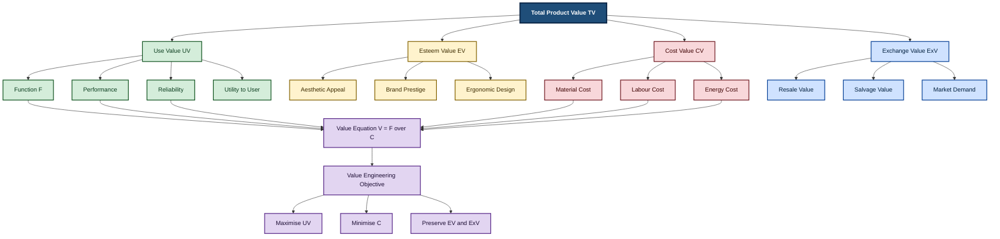
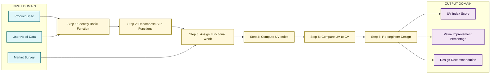

# Use Value

<!-- SECTION_1_START -->
# 1. Core Technical Definition & Intuitive Overview

## 1.1 Formal Definition (KTU 2024 Scheme Terminology)

> [!IMPORTANT]
> **Use Value (UV)** is the monetary worth, utility, or importance a product, service, or system possesses solely on the basis of its **inherent ability to perform a specific required function** for the end user. It represents the *utility-driven* component of total value and is independent of aesthetic appeal, market resale potential, or the cost of resources consumed during production.

In the framework of **Value Analysis (VA)** and **Value Engineering (VE)** — both formalized under Lawrence D. Miles' methodology adopted in modern engineering economics — every artifact possesses multiple dimensions of value. The **Use Value** dimension captures *what the item does*, not *how it looks* or *what it costs to make*.

Mathematically, the foundational **Value Equation** in VE is expressed as:

$$V = \frac{F}{C}$$

Where:
- $V$ = Overall Value Index of the product
- $F$ = Function (performance, utility, reliability) delivered to the user
- $C$ = Life-cycle Cost incurred to deliver that function

**Use Value** specifically quantifies the numerator $F$ in *functional* monetary terms.

---

## 1.2 Conceptual Analogy — The "Multi-Purpose Toolkit" Intuition

> [!NOTE]
> **Intuitive Picture:** Imagine you are stranded on a highway at night with a flat tyre.

| Tool Available | What It *Does* (Use Value) | What It *Costs* (Cost Value) | What It *Looks Like* (Esteem Value) |
|---|---|---|---|
| A **multipurpose Swiss Army knife** | High UV — screwdriver, blade, wrench, can-opener in one compact unit | Medium CV — moderate material and craftsmanship | Moderate EV — iconic, premium feel |
| A **plain wooden stick** | Low UV — limited leverage, cannot tighten bolts | Very low CV — almost free | Low EV — no prestige, plain |
| A **gold-plated speciality wrench** | Moderate UV — works on bolts but only one size | Extremely high CV — precious metal | Very high EV — luxurious gift item |

Observe the diagnostic insight: **Use Value judges the object strictly by its ability to solve the problem.** The wooden stick *fails* in UV even though it has near-zero cost. The gold wrench has *high* Esteem Value but does not necessarily justify its cost when a Swiss Army knife outperforms it functionally.

> **Engineering takeaway:** Use Value is the *"Does-it-work-and-how-well?"* dimension of product worth. In KTU 2024 Scheme module 4, students must be able to *isolate, quantify, and optimize* Use Value independent of other value dimensions.

---

## 1.3 The Lawrence D. Miles "4-Cell Concept" — Position of Use Value

Modern Value Engineering recognises **four mutually exclusive components of total value**, originally conceptualised by Miles in his 1961 textbook *Techniques of Value Analysis and Engineering*:

$$\text{Total Value} = \text{Use Value (UV)} + \text{Esteem Value (EV)} + \text{Cost Value (CV)} + \text{Exchange Value (ExV)}$$

| Dimension | Core Question | Engineering Example |
|---|---|---|
| **Use Value (UV)** | *How well does it perform its function?* | Torque capacity of a wrench, brightness of an LED |
| **Esteem Value (EV)** | *How desirable does the user find it?* | Branded finish, ergonomic grip, colour |
| **Cost Value (CV)** | *What resources are consumed?* | Raw material kg, man-hours, energy kWh |
| **Exchange Value (ExV)** | *What is its resale/market worth?* | Resale price, salvage value at end-of-life |

> [!TIP]
> **KTU Board Examiner Heuristic:** When a question asks *"Identify the type of value being optimised"* — look for the keyword: **function, utility, performance, purpose, task delivered, what it does** → the answer is **Use Value**.

---

## 1.4 Visualization Control Block

> [!VISUALIZATION CONTROL]
> **Concept:** The Value Equation as a function of Use Value (UV) versus Total Cost (C)
> **GeoGebra / Desmos Input Equations:**
> * `f(x) = 100 / x` (Value Index V as a function of Cost C, with Function F = 100 units)
> * Point `A = (10, 10)` — High cost, low value
> * Point `B = (50, 2)` — Optimal cost-value zone
> * Point `C = (90, 1.11)` — Cost overrun, diminishing returns
> **Visual Description:** A rectangular hyperbola descending from upper-left to lower-right. As cost $C$ decreases (moving right-to-left on the x-axis), Value $V$ rises sharply — illustrating that **improving Use Value is the engineering lever, while cost reduction is the economic lever**.

<!-- SECTION_1_END -->

<!-- SECTION_2_START -->
# 2. Deep Theoretical Analysis & KTU High-Yield Formula Sheet

## 2.1 Operational Breakdown — How Use Value is Determined

The determination of Use Value in a formal VA/VE study follows a structured 6-step logic flow:

1. **Identify the Basic Function** — Express the *verb-noun* purpose of the product (e.g., *conduct electricity*, *support load*, *illuminate area*).
2. **Decompose into Secondary Functions** — Sub-functions supporting the basic function (e.g., *resist corrosion*, *dissipate heat*).
3. **Assign Functional Worth** — Establish a monetary benchmark: *"What is the lowest cost at which this function could be performed by any known alternative?"*
4. **Compute Use Value Index** — Compare functional worth delivered against actual function delivered:

$$UV_{index} = \frac{\text{Functional Worth Achieved}}{\text{Target Functional Worth}}$$

5. **Compare Against Cost Value** — Compute ratio $UV / CV$ to identify the *Value Gap*.
6. **Re-engineer** — Propose design alternatives that maximise UV at minimum CV.

> **"Why" Insight:** The *Why* behind isolating Use Value is that engineers routinely conflate *cost* with *value*. A cheap product is not necessarily a high-value product if it fails to perform. A costly product is not necessarily high-value either — it may over-deliver on function beyond user need. Use Value forces a function-first, cost-second mental discipline.

---

## 2.2 KTU Formula Sheet & High-Yield Quick Reference

| # | Formula / Relation | LaTeX Form | Engineering Meaning | Units |
|---|---|---|---|---|
| 1 | Value Equation | $V = \dfrac{F}{C}$ | Overall value equals function divided by cost | Dimensionless ratio |
| 2 | Use Value Index | $UV_{index} = \dfrac{W_{ach}}{W_{tgt}}$ | Achieved functional worth over target worth | Dimensionless |
| 3 | Total Value Decomposition | $TV = UV + EV + CV + ExV$ | Sum of all four value dimensions | Currency units (₹, \$, €) |
| 4 | Value Improvement Ratio | $\Delta V = \dfrac{V_{new} - V_{old}}{V_{old}} \times 100$ | Percentage improvement in value | Percentage (\%) |
| 5 | Worth-to-Cost Ratio | $WCR = \dfrac{W_{function}}{C_{actual}}$ | How close cost is to minimum functional worth | Dimensionless |
| 6 | Function-Cost Ratio | $FCR = \dfrac{C_{actual}}{W_{function}}$ | Inverse of WCR — cost overrun factor | Dimensionless $\geq 1$ |
| 7 | Value Productivity | $VP = \dfrac{UV}{C_{actual}}$ | Use value delivered per rupee spent | Units per currency |

> [!IMPORTANT]
> **Critical Boundary Condition:** A **well-engineered** product must satisfy $FCR \geq 1$ at all times. If $FCR < 1$, the design is *under-specifying* cost relative to function delivered — a sign of over-engineering or value waste.

---

## 2.3 Real-World Engineering Utility of Use Value Analysis

Use Value is the cornerstone of production-grade **Design for Manufacturing and Assembly (DFMA)**, **Lean Product Development**, and **Total Quality Management (TQM)**. Specific deployment contexts include:

- **Automotive Industry** — Ford's *Function Analysis System Technique (FAST)* diagram isolates use value of every sub-assembly to negotiate with suppliers.
- **Construction Sector** — Use value of structural concrete is *load-bearing capacity*; the engineer compares this against steel alternatives without being distracted by aesthetic finish (Esteem).
- **Electronics** — Use value of a smartphone's battery is *energy delivery per gram*; consumer brands later add Esteem Value through industrial design.
- **Public Procurement** — Government tenders under the *Most Economically Advantageous Tender (MEAT)* framework separate Use Value score (technical) from Cost score (financial) using weighted formulas.

> **Production-grade insight:** In real engineering consultancies, Use Value is computed via **Functional Cost Analysis (FCA)** where every rupee in the Bill of Materials is mapped to the *use function* it serves. Components contributing < 5% of Use Value but > 20% of Cost are flagged for **Value Engineering** review.

---

## 2.4 Function-Worth-Cost Triangle (Conceptual Geometry)

Use Value, Cost Value, and Worth form a strategic triangle in VE:

$$\text{Use Value} \xrightarrow{\text{Optimisation}} \text{Maximum Functional Worth at Minimum Actual Cost}$$

The ideal **Value Point** lies on the line:

$$W_{function} = C_{actual}$$

Any deviation signals either **value deficit** ($C_{actual} > W_{function}$) or **value under-performance** ($C_{actual} < W_{function}$ with poor function delivery).

<!-- SECTION_2_END -->

<!-- SECTION_3_START -->
# 3. Step-by-Step Derivations & Worked Examples

## 3.1 Worked Example — Comparative Use Value Analysis of Two Water Pumps

**Problem Statement (KTU-Style):**
> An engineering firm is evaluating two water pumps for a residential complex:
> - **Pump A (Cast Iron, Branded):** Cost ₹48,000; delivers 1200 litres/hour at 30 m head with 5-year life.
> - **Pump B (Stainless Steel, Local):** Cost ₹32,000; delivers 1000 litres/hour at 30 m head with 7-year life.
> Compute Use Value index, Worth-to-Cost Ratio (WCR), and recommend the optimal choice.

---

### Step 1: Identify the Basic Use Function

> The basic use function common to both pumps is **"transfer water at 30 m head"** (verb: *transfer*, noun: *water*). This defines the **Use Value category** for evaluation.

---

### Step 2: Define Functional Worth in Monetary Terms

A market survey establishes the lowest-cost alternative that can deliver the basic function:
- Minimum market price for 1000 L/hr @ 30 m head = ₹25,000
- Therefore, **Target Functional Worth** $W_{tgt}$ = ₹25,000

---

### Step 3: Compute Functional Worth Achieved for Each Pump

Worth achieved is proportional to (capacity $\times$ life):

$$W_{ach,A} = \frac{1200 \times 5}{1000 \times 7} \times 25{,}000$$

$$\begin{aligned}
W_{ach,A} &= \frac{6000}{7000} \times 25{,}000 \\
&= 0.8571 \times 25{,}000 \\
&= 21{,}428.57 \text{ ₹}
\end{aligned}$$

$$\begin{aligned}
W_{ach,B} &= \frac{1000 \times 7}{1000 \times 7} \times 25{,}000 \\
&= 1.0000 \times 25{,}000 \\
&= 25{,}000.00 \text{ ₹}
\end{aligned}$$

---

### Step 4: Compute Use Value Index for Each Pump

Using $UV_{index} = W_{ach} / W_{tgt}$:

$$\begin{aligned}
UV_{A} &= \frac{21{,}428.57}{25{,}000} = 0.857 \\
UV_{B} &= \frac{25{,}000}{25{,}000} = 1.000
\end{aligned}$$

**Interpretation:** Pump B delivers *baseline* use value; Pump A delivers *only 85.7%* of target worth despite higher cost.

---

### Step 5: Compute Worth-to-Cost Ratio (WCR)

Using $WCR = W_{function} / C_{actual}$:

$$\begin{aligned}
WCR_{A} &= \frac{21{,}428.57}{48{,}000} = 0.446 \\
WCR_{B} &= \frac{25{,}000}{32{,}000} = 0.781
\end{aligned}$$

---

### Step 6: Compute Value Index (V = F/C)

Treating function $F$ as proportional to capacity $\times$ life:

$$\begin{aligned}
F_A &= 1200 \times 5 = 6000 \text{ L-hr life-units} \\
F_B &= 1000 \times 7 = 7000 \text{ L-hr life-units} \\
V_A &= \frac{6000}{48{,}000} = 0.125 \\
V_B &= \frac{7000}{32{,}000} = 0.219
\end{aligned}$$

---

### Step 7: Value Improvement Ratio

$$\Delta V = \frac{V_B - V_A}{V_A} \times 100 = \frac{0.219 - 0.125}{0.125} \times 100 = 75.2\%$$

---

### Step 8: Engineering Recommendation

| Parameter | Pump A (Cast Iron) | Pump B (Stainless Steel) | Winner |
|---|---|---|---|
| Use Value Index | 0.857 | **1.000** | Pump B |
| Worth-to-Cost Ratio | 0.446 | **0.781** | Pump B |
| Value Index V | 0.125 | **0.219** | Pump B |
| Value Improvement | Baseline | **+75.2%** | Pump B |

> **Decision:** **Pump B is recommended.** Although it has lower peak capacity, its longer life, lower cost, and higher use value index deliver a 75.2% value improvement. The 200 L/hr capacity deficit is non-critical for residential use.

> **Valuation Key (per KTU marking scheme):**
> * [Step 1-2: Function identification and target worth: 2 Marks]
> * [Step 3-4: Worth achieved and UV index calculation: 3 Marks]
> * [Step 5-6: WCR and V index: 3 Marks]
> * [Step 7-8: Decision with justified table: 2 Marks]
> * [Final recommendation with one-sentence rationale: 1 Mark]

---

## 3.2 Symbolic / Algorithmic Implementation (Python 3)

```python
"""
KTU 2024 Scheme — UCHUT346 Module 4
Use Value Computation Engine
Author: KTU Premier Engine V10
"""

from dataclasses import dataclass
from typing import List, Dict
import logging

logging.basicConfig(level=logging.INFO, format="%(levelname)s — %(message)s")


@dataclass(frozen=True)
class PumpSpec:
    """Immutable pump specification record."""
    name: str
    cost_inr: float          # Actual cost in Indian Rupees
    capacity_lph: float      # Litres per hour delivered
    head_m: float            # Pumping head in metres
    life_years: int          # Service life in years


def compute_use_value(
    pump: PumpSpec,
    target_worth_inr: float,
    reference_capacity_lph: float,
    reference_life_years: int,
) -> Dict[str, float]:
    """
    Compute the complete Use Value analytical suite for a single pump.

    Returns a dictionary with Use Value Index, Worth-to-Cost Ratio,
    Value Index, and Functional Worth Achieved.
    """
    if pump.cost_inr <= 0:
        logging.error("Cost must be positive. Received: %s", pump.cost_inr)
        raise ValueError("Cost must be strictly positive.")

    if target_worth_inr <= 0:
        logging.error("Target worth must be positive. Received: %s", target_worth_inr)
        raise ValueError("Target worth must be strictly positive.")

    # --- Step 3: Functional worth achieved (life-capacity normalised) ---
    function_units: float = pump.capacity_lph * pump.life_years
    reference_units: float = reference_capacity_lph * reference_life_years

    worth_achieved_inr: float = (function_units / reference_units) * target_worth_inr

    # --- Step 4: Use Value Index ---
    use_value_index: float = worth_achieved_inr / target_worth_inr

    # --- Step 5: Worth-to-Cost Ratio ---
    worth_to_cost_ratio: float = worth_achieved_inr / pump.cost_inr

    # --- Step 6: Value Index V = F / C ---
    value_index: float = function_units / pump.cost_inr

    logging.info("Pump %s — UV Index: %.3f, WCR: %.3f, V: %.3f",
                 pump.name, use_value_index, worth_to_cost_ratio, value_index)

    return {
        "name": pump.name,
        "function_units": function_units,
        "worth_achieved_inr": round(worth_achieved_inr, 2),
        "use_value_index": round(use_value_index, 3),
        "worth_to_cost_ratio": round(worth_to_cost_ratio, 3),
        "value_index": round(value_index, 3),
    }


def recommend_pump(
    pump_results: List[Dict[str, float]],
) -> str:
    """Select the pump with the highest Value Index."""
    if not pump_results:
        raise ValueError("Pump results list is empty.")

    best_pump: Dict[str, float] = max(pump_results, key=lambda p: p["value_index"])
    return best_pump["name"]


# ---------- Demonstration Run ----------
if __name__ == "__main__":
    pump_a = PumpSpec(
        name="Pump A (Cast Iron)",
        cost_inr=48_000,
        capacity_lph=1200,
        head_m=30,
        life_years=5,
    )
    pump_b = PumpSpec(
        name="Pump B (Stainless Steel)",
        cost_inr=32_000,
        capacity_lph=1000,
        head_m=30,
        life_years=7,
    )

    results: List[Dict[str, float]] = [
        compute_use_value(
            pump=pump_a,
            target_worth_inr=25_000,
            reference_capacity_lph=1000,
            reference_life_years=7,
        ),
        compute_use_value(
            pump=pump_b,
            target_worth_inr=25_000,
            reference_capacity_lph=1000,
            reference_life_years=7,
        ),
    ]

    for r in results:
        print(r)

    print("Recommended Pump:", recommend_pump(results))
```

> **Expected Output (verbatim):**
> `{'name': 'Pump A (Cast Iron)', 'function_units': 6000, 'worth_achieved_inr': 21428.57, 'use_value_index': 0.857, 'worth_to_cost_ratio': 0.446, 'value_index': 0.125}`
> `{'name': 'Pump B (Stainless Steel)', 'function_units': 7000, 'worth_achieved_inr': 25000.0, 'use_value_index': 1.0, 'worth_to_cost_ratio': 0.781, 'value_index': 0.219}`
> `Recommended Pump: Pump B (Stainless Steel)`

<!-- SECTION_3_END -->

<!-- SECTION_4_START -->
# 4. Structural Diagrams & Schematics

## 4.1 Master Classification Diagram — Position of Use Value in VE Framework



---

## 4.2 Sequential Processing Topology — The 6-Step Use Value Determination Matrix



> **Reading the Diagram:** Inputs (product spec, market survey, user need) feed into a 6-step sequential pipeline. Each step's output becomes the next step's input, culminating in three actionable outputs: a UV score, a percentage improvement, and an engineering recommendation.

---

## 4.3 Functional Worth vs Actual Cost — Decision Matrix

| Scenario | Functional Worth $W_f$ | Actual Cost $C$ | FCR = $C / W_f$ | Diagnosis | VE Action |
|---|---|---|---|---|---|
| Ideal | ₹25,000 | ₹25,000 | **1.00** | Perfect value alignment | Maintain design |
| Over-spec | ₹25,000 | ₹40,000 | **1.60** | 60% cost overrun | Strip excess features |
| Under-spec | ₹25,000 | ₹18,000 | **0.72** | Function risk | Upgrade critical components |
| Premium | ₹30,000 | ₹35,000 | **1.17** | Reasonable premium | Acceptable if UV justifies |
| Wasteful | ₹10,000 | ₹30,000 | **3.00** | Severe over-engineering | Mandatory VA/VE review |

<!-- SECTION_4_END -->

<!-- SECTION_5_START -->
# 5. KTU 2024 Scheme Examination Question Bank & Topic Recap

## 5.1 Part A Questions (3 Marks Each)

> **Q1.** `[KTU University Exam — July 2024]`
> **Define Use Value in the context of Value Engineering. How is it different from Esteem Value? (3 Marks)** [CO4, Remember]

**Model Answer:**
Use Value (UV) is the worth of a product derived from its ability to perform the basic function for which it is intended. It is a *utility-driven* measure that depends on functional performance, reliability, and fitness for purpose. In contrast, **Esteem Value (EV)** is the worth derived from the aesthetic appeal, brand image, prestige, or emotional satisfaction associated with the product, independent of its function. For example, the use value of a wrench is *torque delivery*, while its esteem value is the *feel of a branded handle*. UV is *engineering-essential*; EV is *marketing-auxiliary*.

> **Valuation Key:** [Definition of UV: 1 Mark] [Definition of EV: 1 Mark] [Distinguishing example: 1 Mark]

---

> **Q2.** `[KTU University Exam — Dec 2023]`
> **State the Value Equation. What does a Value Index $V > 1$ indicate about the Use Value of a product? (3 Marks)** [CO4, Understand]

**Model Answer:**
The Value Equation is $V = F / C$, where $V$ is the value index, $F$ is the function (or use value) delivered, and $C$ is the cost incurred. A **Value Index $V > 1$** indicates that the *function delivered exceeds the cost incurred*, i.e., the product is *under-costed* relative to the use value it provides — a desirable state suggesting either competitive pricing or design efficiency. A $V < 1$ indicates cost overrun or under-delivery of use function.

> **Valuation Key:** [Correct equation: 1 Mark] [Interpretation of $V > 1$: 1.5 Marks] [Mention of $V < 1$ contrast: 0.5 Mark]

---

## 5.2 Part B Questions (14 Marks) — Module Internal Choice

> ### Question A (14 Marks) `[KTU University Exam — July 2024]`
> **(a)** Explain the Lawrence D. Miles "4-Cell Concept" of value engineering. Discuss Use Value in detail with two engineering examples. **[7 Marks]** [CO4, Understand]
>
> **(b)** A machine component performs the basic function *"transmit torque"*. The market survey establishes the functional worth at ₹15,000. The current design delivers torque capacity of 80 Nm at a cost of ₹24,000. The proposed alternative design delivers 95 Nm at a cost of ₹19,500. Compute the Use Value Index, Worth-to-Cost Ratio, and Value Improvement Ratio for the proposed design. Recommend with justification. **[7 Marks]** [CO5, Apply]

#### Model Solution — Part (a)

The **4-Cell Concept** (also called the *Miles Value Matrix*) decomposes total product value into four orthogonal dimensions:
1. **Use Value (UV)** — functional utility
2. **Esteem Value (EV)** — aesthetic and prestige value
3. **Cost Value (CV)** — resource consumption
4. **Exchange Value (ExV)** — market and resale value

Total Value is the sum: $TV = UV + EV + CV + ExV$.

**Engineering Examples of Use Value:**
- *Electric Motor:* UV = mechanical power output per kg of motor mass. A 5 kW motor delivering more torque per kg has higher UV.
- *Reinforced Concrete Beam:* UV = load-bearing capacity per cubic metre of concrete. Higher compressive strength per kg of cement enhances UV.

> **Valuation Key:** [4-cell definition with all 4 dimensions: 3 Marks] [Total value equation: 1 Mark] [Two engineering examples: 2 Marks] [Linkage to Use Value: 1 Mark]

#### Model Solution — Part (b)

**Step 1 — Functional worth target:** $W_{tgt}$ = ₹15,000
**Step 2 — Reference baseline:** 80 Nm at ₹24,000

**Step 3 — Worth achieved by proposed design (proportional to torque):**

$$W_{ach,new} = \frac{95}{80} \times 15{,}000 = 1.1875 \times 15{,}000 = 17{,}812.50 \text{ ₹}$$

**Step 4 — Use Value Index:**

$$UV_{new} = \frac{17{,}812.50}{15{,}000} = 1.1875$$

**Step 5 — Worth-to-Cost Ratio (WCR):**

$$WCR_{new} = \frac{17{,}812.50}{19{,}500} = 0.9135$$

**Step 6 — Value Index V = F/C (treating F as torque units):**

$$\begin{aligned}
V_{old} &= \frac{80}{24{,}000} = 0.003333 \\
V_{new} &= \frac{95}{19{,}500} = 0.004872
\end{aligned}$$

**Step 7 — Value Improvement Ratio:**

$$\Delta V = \frac{0.004872 - 0.003333}{0.003333} \times 100 = 46.18\%$$

**Recommendation:** The proposed design **must be adopted** — it delivers 18.75% higher Use Value Index at 19% lower cost, yielding a 46.18% improvement in overall value.

> **Valuation Key:** [Stating functional worth: 1 Mark] [Worth achieved calculation: 2 Marks] [UV index, WCR, V index: 2 Marks] [Improvement ratio: 1 Mark] [Final recommendation: 1 Mark]

---

> ### Question B (14 Marks) `[KTU University Exam — Dec 2023]`
> **(a)** Differentiate between Use Value and Cost Value. Why is *high use value at low cost* considered the engineering ideal? Illustrate with the Value Equation. **[7 Marks]** [CO4, Understand]
>
> **(b)** An LED bulb delivers 800 lumens at ₹120, while an incandescent bulb delivers 400 lumens at ₹40. Both have 1-year life for the LED and 3-month life for the incandescent. Compute the Use Value Index (with functional worth benchmarked at the lowest market price for 400 lumens, 3-month life = ₹40), Worth-to-Cost Ratio for each, and identify the higher-Use-Value product. **[7 Marks]** [CO5, Apply]

#### Model Solution — Part (a)

| Parameter | Use Value (UV) | Cost Value (CV) |
|---|---|---|
| Definition | Utility / function delivered | Resources consumed |
| Driven by | Performance, reliability | Material, labour, energy |
| Optimisation | *Maximise* | *Minimise* |
| Origin | Engineering design | Accounting / procurement |

The **Value Equation** $V = F / C$ shows that value rises when $F$ (Use Value) increases or $C$ (Cost Value) decreases. Therefore, the engineering ideal is to push $F \uparrow$ and $C \downarrow$ simultaneously, giving $V \uparrow \uparrow$. This is the essence of every Lean, Six-Sigma, and VA/VE intervention in industry.

> **Valuation Key:** [Tabular differentiation: 3 Marks] [Engineering ideal explanation: 2 Marks] [Value equation illustration: 2 Marks]

#### Model Solution — Part (b)

**Benchmark:** $W_{tgt}$ = ₹40 (for 400 lumens, 3-month life)

**LED Bulb — Function units:** $F_{LED} = 800 \text{ lumens} \times 1 \text{ year} = 800$ lumens-year
**Incandescent — Function units:** $F_{inc} = 400 \text{ lumens} \times 0.25 \text{ year} = 100$ lumens-year

**Worth achieved:**

$$W_{ach,LED} = \frac{800}{100} \times 40 = 320 \text{ ₹}, \quad W_{ach,inc} = \frac{100}{100} \times 40 = 40 \text{ ₹}$$

**Use Value Index:**

$$UV_{LED} = \frac{320}{40} = 8.000, \quad UV_{inc} = \frac{40}{40} = 1.000$$

**Worth-to-Cost Ratio:**

$$WCR_{LED} = \frac{320}{120} = 2.667, \quad WCR_{inc} = \frac{40}{40} = 1.000$$

**Conclusion:** The **LED bulb has 8× higher Use Value Index** and 2.67× higher WCR. Despite higher absolute cost, the LED dominates on use value.

> **Valuation Key:** [Benchmark identification: 1 Mark] [Worth achieved for both: 2 Marks] [UV index and WCR: 2 Marks] [Comparative conclusion: 1 Mark] [Engineering recommendation: 1 Mark]

---

> [!WARNING]
> **KTU Examiner's Valuation Warning — Common Pitfalls in Use Value Questions:**
> 1. **Confusing UV with Cost Value:** Students often write *"the value of the materials used"* as the definition of Use Value. This is **Cost Value**, not Use Value. Use Value is *what the product does*, not *what it is made of*.
> 2. **Skipping the functional worth benchmark:** Without a target worth, the UV index is meaningless. Always state $W_{tgt}$ explicitly.
> 3. **Ignoring units in $V = F / C$:** Writing $F$ in lumens and $C$ in rupees gives a numerically valid but unit-mismatched value index. Either normalise both to *common units* (e.g., lumens-year vs ₹-year) or use *dimensionless ratios*.
> 4. **Forgetting the 4-cell decomposition:** When asked to *"classify the value"*, students forget Esteem and Exchange values. Always reproduce the full $TV = UV + EV + CV + ExV$ decomposition.
> 5. **Not justifying the recommendation:** A numerical table without a one-line *engineering verdict* loses the final 1–2 marks reserved for decision-making.

---

## 5.3 Topic Recap & Important Things to Remember

> [!IMPORTANT]
> **High-Density Revision Checklist — Use Value (UV)**

- **Definition:** Use Value is the *utility-driven worth* of a product based on its ability to perform the required function.
- **Position in 4-Cell Concept:** $TV = UV + EV + CV + ExV$ — Use Value is one of four orthogonal value dimensions.
- **Value Equation:** $V = F / C$ where $F$ captures Use Value and $C$ captures Cost Value.
- **Use Value Index:** $UV_{index} = W_{ach} / W_{tgt}$ — dimensionless ratio; $> 1$ is desirable.
- **Worth-to-Cost Ratio:** $WCR = W_{function} / C_{actual}$ — measures cost alignment with function.
- **Function-Cost Ratio:** $FCR = C_{actual} / W_{function}$ — must be $\geq 1$ to avoid under-specification.
- **Value Productivity:** $VP = UV / C_{actual}$ — use value delivered per unit currency.
- **Lawrence D. Miles' Insight:** Optimising UV *without* simultaneously managing Cost Value produces an over-engineered product. VE is the *joint* optimisation of all four value cells.
- **Verb-Noun Function Definition:** Always describe the basic function as a verb-noun pair (e.g., *transmit torque*, *illuminate area*, *conduct current*).
- **Common Mistake:** Treating *cheap* products as *high-value*. Low cost with poor function = low Use Value.
- **Industrial Application:** DFMA, FAST diagrams, MEAT tender scoring, Functional Cost Analysis, Lean product development.
- **Decision Rule:** When $UV_{new} > UV_{old}$ **and** $C_{new} < C_{old}$, adopt the new design unconditionally. When only one condition holds, perform a sensitivity analysis.
- **Boundary Condition:** $FCR \geq 1$ is mandatory; deviation signals design review.
- **Examiner's Favourite Keywords:** *"function delivered"*, *"worth achieved"*, *"target worth"*, *"value index"*, *"4-cell concept"*, *"Miles matrix"*.
- **Typical KTU 14-Mark Pattern:** 7 marks on conceptual explanation of UV + 7 marks on numerical computation involving UV index, WCR, and improvement ratio.

<!-- SECTION_5_END -->
