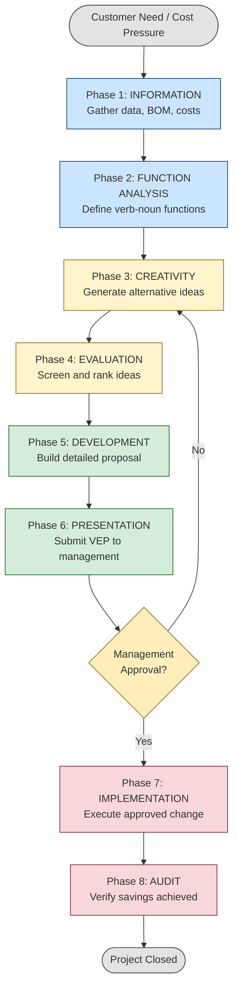
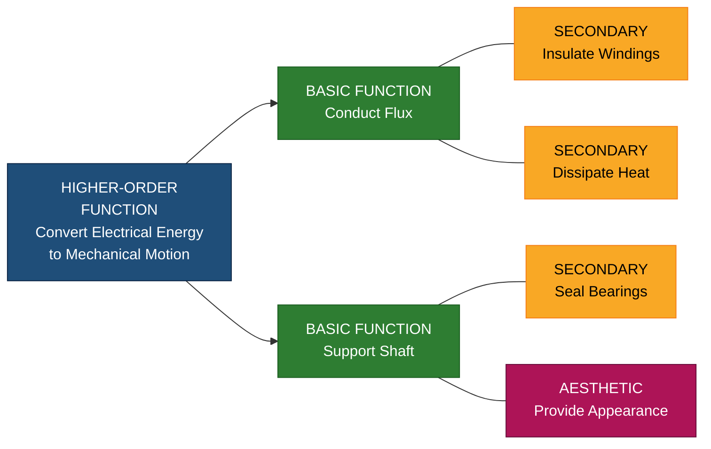
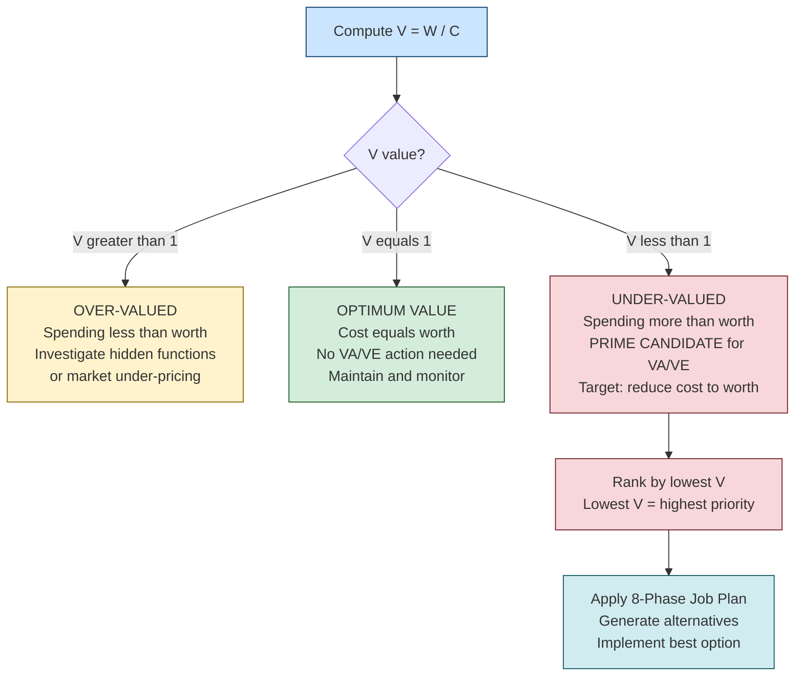
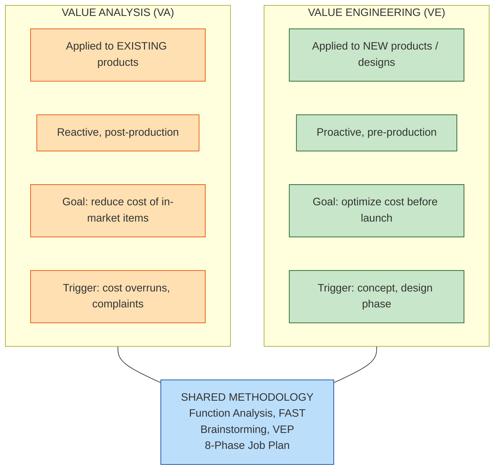
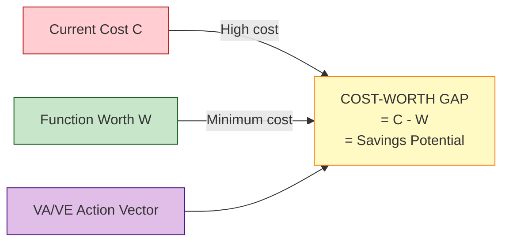
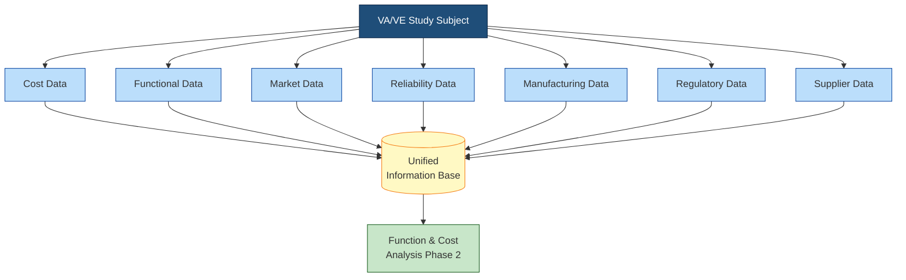

# Value Analysis and value Engineering

<!-- SECTION_1_START -->
# Value Analysis and Value Engineering — Core Foundation

> [!IMPORTANT]
> **KTU 2024 Scheme | UCHUT346 | Module 4** — This module carries direct **2-mark definitions** and **14-mark analytical questions** in the University ESE. Master the **Value Index formula** $V = \dfrac{W}{C}$ and the **8-Phase VE Job Plan** as they appear in nearly every past paper.

## 1.1 Formal Academic Definition

**Value Analysis (VA)** is a systematic, organized, and creative method of problem-solving that uses a functional approach to identify and remove unnecessary costs from a product, process, or service **without compromising its quality, reliability, performance, or appearance**. It was pioneered by **Lawrence D. Miles** of General Electric in **1947** during World War II material shortages.

**Value Engineering (VE)** is the broader discipline that applies the value analysis methodology to **new products, systems, or projects during the design and development phase** (before production), whereas Value Analysis is typically applied to **existing products** already in production. Together, VA and VE are often referred to as the **Value Methodology (VM)**.

> [!NOTE]
> **Key Distinction (Board-Exam Favorite):**
> * **VE** → Applied to *new* designs (proactive, pre-production)
> * **VA** → Applied to *existing* products (reactive, post-production)
> 
> The *methodology* is identical — only the *timing* of application differs.

## 1.2 Conceptual Analogy — The "Smart Kitchen" Intuition

Imagine you buy a **₹500 ceramic knife** just to spread butter on toast. The knife *works* (it has **use value**), but a ₹20 butter knife does the *same job* with identical results. You paid **₹480 of "unnecessary cost"** — cost that does not contribute to the actual **function** required.

Value Analysis asks: *"What is this thing really for?"* and *"Can we deliver that function at lower cost?"*

* **Function** = Spreading butter (a *verb* + *noun*, e.g., "spread medium")
* **Cost** = ₹500 (what you paid)
* **Worth** = ₹20 (lowest cost to perform the function)
* **Value Index** $V = \dfrac{20}{500} = 0.04$ — extremely poor value, ripe for VA intervention

When a design engineer applies this thinking *before* manufacturing the knife (renaming the part "butter applicator" and using cheap molded plastic), that is **Value Engineering**.

## 1.3 Types of Value — The Four Pillars

| # | Type of Value | Definition | Engineering Example |
|---|---------------|------------|---------------------|
| 1 | **Use Value (UV)** | The value derived from the function the product actually performs | A drill's ability to bore holes |
| 2 | **Esteem Value (EV)** | The value derived from ownership, prestige, or aesthetic appeal | A Rolex watch's brand status |
| 3 | **Cost Value (CV)** | The sum of all resources (material, labor, overhead) consumed in production | Manufacturing cost of a smartphone |
| 4 | **Exchange Value (XV)** | The value a product commands in the open market | Resale price of a used car |

> [!TIP]
> **Board Exam Trick:** When asked "What is the most important type of value in Value Engineering?", the answer is **Use Value (UV)**. Value Engineering always targets the *function* — never the *appearance* alone.

## 1.4 The Fundamental Value Equation

$$V = \dfrac{F}{C} = \dfrac{\text{Function}}{\text{Cost}}$$

Where $F$ represents the *worth* or *utility* delivered, and $C$ represents the *resource cost* consumed. To increase value, an engineer can either **increase function**, **decrease cost**, or **both simultaneously**.

## 1.5 When to Apply VA/VE — The Decision Triggers

> [!NOTE]
> **Apply Value Analysis / Value Engineering when:**
> 1. A product faces **tough market competition** requiring cost reduction.
> 2. **Material shortages** or supply disruptions force design rethinking.
> 3. New **regulatory or safety standards** are introduced.
> 4. The product is in the **concept or design stage** (VE is most powerful here).
> 5. A **cost-overrun** is observed without corresponding performance gain.
> 6. **Customer complaints** relate to price rather than function.

> [!VISUALIZATION CONTROL]
> **Concept:** The Value Improvement Vector Field
> **Desmos Input Equations:**
> * `f(x, y) = x / y` (where $x$ = Function, $y$ = Cost)
> * Contour lines: `V = 1`, `V = 2`, `V = 3`
> **Visual Description:** Plot Function on the X-axis and Cost on the Y-axis. Curves sweeping upward to the right represent *constant value* contours. Moving from the lower-right to the upper-left region (higher function, lower cost) represents value improvement. The *steepest improvement gradient* is achieved by holding function constant while sliding down the cost axis.
<!-- SECTION_1_END -->

<!-- SECTION_2_START -->
# Deep Theoretical Analysis & KTU Formula Sheet

## 2.1 The Value Index — The Heart of VA/VE

The cornerstone metric used throughout the discipline is the **Value Index (V.I.)**:

$$V = \dfrac{W}{C}$$

Where:
* $W$ = **Function Worth** (the lowest cost to perform the required function, also called *minimum cost* or *worth cost*)
* $C$ = **Current Cost** (the actual cost being incurred for the function)

| Value Index | Interpretation | Engineering Action |
|-------------|----------------|--------------------|
| $V > 1$ | **Over-performing** — spending less than worth; often means *under-engineered* or hidden savings exist | Investigate for hidden functionality, possibly **add features** |
| $V = 1$ | **Optimum value** — cost exactly equals worth | **No action required**; ideal state |
| $V < 1$ | **Under-performing** — spending more than worth; cost-reduction opportunity | **Apply VA/VE** to reduce cost or enhance function |

> [!IMPORTANT]
> **KTU High-Yield Insight:** A common student error is assuming $V > 1$ is always "good." In reality, $V > 1$ for a *customer-facing product* may signal **lost market share** because the product is *too cheap* for its functionality (perceived as low quality). Always interpret V in business context.

## 2.2 The Function — Verb-Noun Pairing

Every component in VA/VE is described by a **two-word function**: a **verb** (the action) and a **noun** (the object). This eliminates design bias and forces the team to think about *what must be done*, not *how it is currently being done*.

| Original Component | Design-Biased Name | Function (Verb-Noun) |
|--------------------|-------------------|----------------------|
| A 4-inch steel bolt in a chair leg | "Chair leg bolt" | **Fasten leg** |
| The plastic casing of a TV remote | "Remote cover" | **Protect electronics** |
| A rubber gasket on a car door | "Door rubber" | **Seal moisture** |
| Copper winding in a motor | "Motor winding" | **Conduct flux** |

> [!TIP]
> **Exam Tip:** The verb must be *active* and *measurable*. Words like "improve," "ensure," and "provide" are **banned** in mature VA/VE practice because they cannot be measured. Use verbs like *transmit, support, seal, conduct, contain, resist, position*.

## 2.3 Function Cost vs. Function Worth — The Critical Gap

| Concept | Definition | Determined By |
|---------|-----------|---------------|
| **Function Cost (FC)** | The actual money spent to deliver the function in the current design | Cost accounting, BOM analysis, labor routing |
| **Function Worth (FW)** | The *minimum* cost at which the function *could* be performed (using best-known alternative) | Market research, specialist consultation, creative brainstorming |

The **Cost-Worth Gap** is the *target savings pool*:

$$\text{Savings Potential} = FC - FW$$

This gap represents the **maximum dollar reduction achievable** without sacrificing function. It is the *north star metric* of every VA/VE study.

## 2.4 KTU High-Yield Formula Sheet

| Formula | Symbol Key | Typical Use in Exam |
|---------|-----------|---------------------|
| $V = \dfrac{W}{C}$ | Value Index | Identifying low-value components |
| $V = \dfrac{F}{C}$ | Function / Cost | Conceptual equivalent of W/C |
| $\text{Savings} = FC - FW$ | Cost-Worth Gap | Computing target reduction |
| $\%\text{Savings} = \dfrac{FC - FW}{FC} \times 100$ | Percentage Reduction | Reporting VA/VE impact to management |
| $V_{\text{project}} = \dfrac{\sum W_i}{\sum C_i}$ | Project-Level Value Index | Whole-product analysis |
| $C_{\text{total}} = C_{\text{labour}} + C_{\text{material}} + C_{\text{overhead}}$ | Total Cost Build-up | Cost breakdown in FAST diagrams |
| $\text{Life-Cycle Cost} = C_{\text{acquisition}} + C_{\text{operation}} + C_{\text{maintenance}} + C_{\text{disposal}}$ | LCC | Justifying higher initial cost for lower LCC |

> [!WARNING]
> **LaTeX Pipe Escape Rule Reminder:** In markdown tables above, vertical bars (e.g., in $\vert x \vert$ notation) are escaped to `\vert` to prevent table-row breaking. Students preparing notes should do the same when building their own formula sheets.

## 2.5 Real-World Utility in Engineering

| Industry Sector | VA/VE Application | Documented Impact |
|-----------------|-------------------|-------------------|
| **Construction (Civil)** | Value Engineering of foundation systems, HVAC, structural steel | **15–30% cost savings** with identical performance (industry benchmark) |
| **Automotive** | Redesigning door panels, instrument clusters, fasteners | Toyota, Ford routinely achieve **20%+ savings** per model refresh |
| **Electronics / Hardware** | PCB component substitution, connector redesign | Apple iPhone BOM teardowns reveal aggressive VE |
| **Software Engineering** | Function-point analysis, code refactoring for performance | Reduces cloud compute cost by **30–60%** |
| **Public Infrastructure** | Mandatory VE on government projects above threshold (e.g., Indian CPWD, US DoD) | Federal Acquisition Regulation (FAR) Part 48 requires VE for projects > threshold |
| **Manufacturing** | Tooling redesign, process re-sequencing | Boeing, GE Aviation apply VE on every new airframe |

## 2.6 The FAST Diagram (Function Analysis System Technique)

The **FAST diagram** is a *left-to-right* graphical model showing the logical *"how-why"* relationships between functions. It is the single most-tested visual tool in KTU exams for this module.

> [!IMPORTANT]
> **Reading Direction (Left → Right):** "How is this function achieved?" (technical answer)
> **Reading Direction (Right → Left):** "Why is this function performed?" (business answer)
> 
> * **Higher-order functions** (project scope, customer need) appear on the **LEFT**
> * **Basic functions** (lowest-level technical actions) appear on the **RIGHT**
> * The **critical path** runs horizontally across the top scope line

### Function Classification in FAST

| Function Type | Symbol on FAST | Description | VA/VE Treatment |
|---------------|---------------|-------------|-----------------|
| **Higher-Order Function** | Box on the left | The reason the product exists | Rarely questioned; defines scope |
| **Basic Function** | Box on the right (critical path) | The reason the product is purchased | **Target of optimization** |
| **Secondary Function** | Box below critical path | Supports the basic function | Cost-reduction candidate |
| **Aesthetic Function** | Box with dashed border | Provides esteem value | Optimize last |

## 2.7 Information Phase Sources — What Data VA/VE Needs

1. **Cost data** — Bill of Materials, labor standards, overhead rates
2. **Functional data** — Engineering drawings, specifications, use cases
3. **Market data** — Competitive pricing, customer surveys
5. **Reliability data** — Field failure rates, warranty claims
6. **Manufacturing data** — Process routings, cycle times, scrap rates
7. **Regulatory data** — Compliance codes, safety standards
8. **Suppliers' data** — Alternative materials, substitute components
<!-- SECTION_2_END -->

<!-- SECTION_3_START -->
# Step-by-Step Derivations, Problem-Solving & Implementation

## 3.1 The 8-Phase VE Job Plan (Lawrence Miles Standard)

The **Value Engineering Job Plan** is the structured, sequential procedure every certified Value Analyst follows. It is *the* most heavily weighted content in the 14-mark University questions.

| Phase | Name | Primary Output | Tools Used |
|-------|------|----------------|------------|
| **1** | **Information Phase** | Complete data on the subject | Interviews, drawings, BOM, cost sheets |
| **2** | **Function Analysis Phase** | FAST diagram, function classification | FAST, function logic |
| **3** | **Creative Phase** | Wide range of alternative ideas | Brainstorming, Delphi, Gordon Technique |
| **4** | **Evaluation Phase** | Ranked, screened ideas | Weighted scoring, Pugh matrix, cost analysis |
| **5** | **Development Phase** | Detailed proposals with cost justification | Engineering analysis, vendor quotes |
| **6** | **Presentation Phase** | Formal report to management | Value Engineering Proposal (VEP) |
| **7** | **Implementation Phase** | Approved changes executed | Project management, change orders |
| **8** | **Audit Phase** | Post-implementation verification | Actual cost vs. forecast, lessons learned |

> [!NOTE]
> **5-Phase Simplified Version (often taught in B.Tech):** Information → Analysis → Creativity → Evaluation → Recommendation. Both versions are accepted; the 8-phase is the *international standard* (SAVE International).

## 3.2 Worked Example — Computing Value Index for a Simple Assembly

**Problem Statement:**
A manufactured bracket has a **current manufacturing cost of ₹480**. An engineering team performs a function analysis and determines that the *minimum cost* to perform the bracket's essential function (support a 50 kg load) is **₹300**, achievable with a redesigned stamped-steel version. Calculate:
1. The current Value Index
2. The cost-worth gap
3. The percentage savings potential
4. The new Value Index after implementing the redesign at the new cost

### Step-by-Step Solution

**Given Data (extracted from problem statement):**

$$\text{Current Cost } C = ₹480 \qquad \text{Function Worth } W = ₹300$$

**Step 1 — Compute the Current Value Index**

The Value Index is defined as the ratio of function worth to current cost:

$$V_{\text{current}} = \dfrac{W}{C} = \dfrac{300}{480}$$

Performing the division:

$$V_{\text{current}} = 0.625$$

Since $V_{\text{current}} < 1$, the component is *under-performing* — it costs more than its worth.

**[Valuation Key — Step 1: 2 Marks for stating formula, 1 Mark for substitution, 1 Mark for final value]**

**Step 2 — Compute the Cost-Worth Gap**

The savings potential is the arithmetic difference between current cost and function worth:

$$\text{Savings} = C - W = 480 - 300 = ₹180$$

**[Valuation Key — Step 2: 1 Mark for formula, 1 Mark for answer]**

**Step 3 — Compute Percentage Savings Potential**

The percentage savings normalizes the absolute gap to the current cost base:

$$\%\text{Savings} = \dfrac{C - W}{C} \times 100 = \dfrac{180}{480} \times 100$$

Computing the fraction:

$$\dfrac{180}{480} = 0.375$$

Converting to percentage:

$$\%\text{Savings} = 0.375 \times 100 = 37.5\%$$

**[Valuation Key — Step 3: 1 Mark for formula, 1 Mark for correct conversion, 1 Mark for final percentage]**

**Step 4 — Compute the New Value Index After Redesign**

The new cost equals the function worth, as the redesign meets the minimum cost benchmark:

$$C_{\text{new}} = W = ₹300$$

Substituting into the value index formula:

$$V_{\text{new}} = \dfrac{W}{C_{\text{new}}} = \dfrac{300}{300} = 1.0$$

**[Valuation Key — Step 4: 1 Mark for formula, 1 Mark for substitution, 1 Mark for final value]**

### Final Consolidated Result Table

| Metric | Symbol | Value | Interpretation |
|--------|--------|-------|----------------|
| Current Value Index | $V_{\text{current}}$ | **0.625** | Under-performing; VA/VE justified |
| Cost-Worth Gap | $C - W$ | **₹180** | Absolute savings target |
| Percentage Savings | $\%\text{Savings}$ | **37.5%** | Headline metric for management |
| New Value Index | $V_{\text{new}}$ | **1.0** | Optimum value achieved |

> [!WARNING]
> **Examiner's Pitfall:** Students often confuse *Cost* with *Price*. **Cost** is what the manufacturer spends; **Price** is what the customer pays. VA/VE targets **Cost**, never Price. Mark deduction is automatic if these are conflated.

## 3.3 Worked Example — Multi-Function Component Value Analysis

**Problem Statement:**
A motor housing performs **three functions** identified through FAST analysis:

| Function # | Function (Verb-Noun) | Type | Current Cost (₹) | Function Worth (₹) |
|------------|----------------------|------|------------------|---------------------|
| 1 | *Conduct heat* | Basic | 240 | 180 |
| 2 | *Support shaft* | Basic | 360 | 300 |
| 3 | *Provide appearance* | Aesthetic | 120 | 60 |

Calculate:
1. The Value Index of each function
2. The overall project Value Index
3. The total savings potential
4. The function with the highest VA/VE priority

### Step-by-Step Solution

**Step 1 — Function-Level Value Indices**

Applying $V = W / C$ to each function row:

$$V_1 = \dfrac{180}{240} = 0.750$$

$$V_2 = \dfrac{300}{360} = 0.833$$

$$V_3 = \dfrac{60}{120} = 0.500$$

**Step 2 — Overall Project Value Index**

The project-level value index is the ratio of summed worths to summed costs:

$$V_{\text{project}} = \dfrac{\sum W_i}{\sum C_i} = \dfrac{180 + 300 + 60}{240 + 360 + 120}$$

Computing the numerator:

$$\sum W_i = 180 + 300 + 60 = ₹540$$

Computing the denominator:

$$\sum C_i = 240 + 360 + 120 = ₹720$$

Final ratio:

$$V_{\text{project}} = \dfrac{540}{720} = 0.750$$

**Step 3 — Total Savings Potential**

$$\text{Total Savings} = \sum C_i - \sum W_i = 720 - 540 = ₹180$$

**Step 4 — Priority Ranking (lowest V = highest priority)**

| Rank | Function | Value Index | Priority |
|------|----------|-------------|----------|
| 1 | *Provide appearance* | **0.500** | **Highest VA/VE priority** |
| 2 | *Conduct heat* | 0.750 | Medium |
| 3 | *Support shaft* | 0.833 | Lowest |

> [!TIP]
> **Engineering Insight:** Aesthetic functions frequently show the *lowest* value indices because customers are willing to pay extra for *looks*, but manufacturers often over-spend on finishes. This is why "Provide appearance" is the priority target above.

## 3.4 Algorithmic Implementation — Value Index Calculator (Python)

For software-oriented and computational engineering students, here is a fully operational Python implementation of the multi-function Value Index analysis.

```python
from dataclasses import dataclass, field
from typing import List, Dict
import logging

logging.basicConfig(
    level=logging.INFO,
    format="%(asctime)s | %(levelname)s | %(message)s"
)


@dataclass(frozen=True)
class FunctionRecord:
    """Immutable record of a single function in a VA/VE study."""
    function_id: str
    verb_noun: str
    current_cost: float      # in INR
    function_worth: float    # in INR
    function_type: str = "Basic"  # Basic, Secondary, Aesthetic, Higher-Order


@dataclass
class ValueAnalysisResult:
    """Aggregated result of a multi-function value study."""
    function_indices: Dict[str, float] = field(default_factory=dict)
    project_value_index: float = 0.0
    total_savings: float = 0.0
    total_current_cost: float = 0.0
    total_function_worth: float = 0.0
    priority_ranking: List[tuple] = field(default_factory=list)


def compute_value_index(func: FunctionRecord) -> float:
    """Compute single-function Value Index V = W / C with safety checks."""
    if func.current_cost <= 0:
        logging.error(
            "Invalid current_cost (%.2f) for function %s",
            func.current_cost, func.function_id
        )
        raise ValueError("Current cost must be positive and non-zero.")
    if func.function_worth < 0:
        logging.error(
            "Invalid function_worth (%.2f) for function %s",
            func.function_worth, func.function_id
        )
        raise ValueError("Function worth cannot be negative.")
    return round(func.function_worth / func.current_cost, 4)


def run_value_analysis(functions: List[FunctionRecord]) -> ValueAnalysisResult:
    """Execute full VA/VE computation across multiple functions."""
    if not functions:
        raise ValueError("Function list cannot be empty.")

    indices: Dict[str, float] = {}
    total_cost = 0.0
    total_worth = 0.0

    for func in functions:
        v = compute_value_index(func)
        indices[func.function_id] = v
        total_cost += func.current_cost
        total_worth += func.function_worth
        logging.info(
            "Function %s [%s] -> V = %.4f",
            func.function_id, func.verb_noun, v
        )

    if total_cost == 0:
        raise ZeroDivisionError("Aggregate current cost is zero.")

    project_v = round(total_worth / total_cost, 4)
    savings = round(total_cost - total_worth, 2)
    ranking = sorted(indices.items(), key=lambda item: item[1])

    return ValueAnalysisResult(
        function_indices=indices,
        project_value_index=project_v,
        total_savings=savings,
        total_current_cost=round(total_cost, 2),
        total_function_worth=round(total_worth, 2),
        priority_ranking=ranking
    )


def print_report(result: ValueAnalysisResult) -> None:
    """Print a board-exam-ready summary report."""
    print("\n" + "=" * 60)
    print("       VALUE ENGINEERING ANALYSIS REPORT")
    print("=" * 60)
    print(f"Total Current Cost       : INR {result.total_current_cost}")
    print(f"Total Function Worth     : INR {result.total_function_worth}")
    print(f"Total Savings Potential  : INR {result.total_savings}")
    print(f"Project Value Index      : {result.project_value_index}")
    print("-" * 60)
    print("Function-Level Value Indices (sorted by priority):")
    for fid, v in result.priority_ranking:
        print(f"  {fid:<8} V = {v:<8}  [Priority]")
    print("=" * 60)


if __name__ == "__main__":
    study = [
        FunctionRecord("F1", "Conduct heat", 240, 180, "Basic"),
        FunctionRecord("F2", "Support shaft", 360, 300, "Basic"),
        FunctionRecord("F3", "Provide appearance", 120, 60, "Aesthetic"),
    ]
    result = run_value_analysis(study)
    print_report(result)
```

**Sample Output:**

```
============================================================
       VALUE ENGINEERING ANALYSIS REPORT
============================================================
Total Current Cost       : INR 720.0
Total Function Worth     : INR 540.0
Total Savings Potential  : INR 180.0
Project Value Index      : 0.75
------------------------------------------------------------
Function-Level Value Indices (sorted by priority):
  F3       V = 0.5      [Priority]
  F1       V = 0.75     
  F2       V = 0.8333   
============================================================
```

## 3.5 Tabular Comparative Analysis — Value Engineering Across Engineering Case Frameworks

| Engineering Case Framework | Regulatory / Systemic Matrix | VA/VE Intervention Point | Documented Outcome |
|----------------------------|------------------------------|--------------------------|--------------------|
| **CPWD Construction Projects (India)** | CPWD Manual Chapter on VE; mandatory above ₹50 Cr | Foundation, structural, HVAC, electrical redesign | 10–25% cost reduction retained by client |
| **Defence Procurement (DRDO, MoD)** | Defence Procurement Procedure (DPP) | Indigenous substitution of imported parts | 20–40% forex savings |
| **ISO 9001 Manufacturing** | ISO 9001:2015 Clause 8.3 (Design & Development) | Integrate VE in stage-gate process | Reduced NPI cycle time |
| **Six Sigma / Lean Manufacturing** | DMAIC + VA Methodology | Combine Lean (waste removal) with VA (function optimization) | Compounded 30–50% gains |
| **Public-Private Partnership (PPP) Infrastructure** | Model Concession Agreement (MCA) | Lifecycle cost analysis | Lower toll / tariff for end user |
| **Software Product Development** | CMMI-DEV v2.0, Agile frameworks | Refactoring, cloud-cost optimization | 30–60% TCO reduction |
| **Aerospace New Product Introduction** | AS9100D, FAA Part 25 | Multi-attribute tradeoff in component selection | Weight + cost reduction without safety loss |
| **Green / Sustainable Engineering** | UN SDG 12 (Responsible Consumption) | Material substitution, recyclability analysis | ESG compliance + cost savings |

## 3.6 The Value Engineering Proposal (VEP) — The Final Deliverable

A **VEP** is the formal document presented to management in Phase 6. It must contain:

1. **Original design summary** — what the current product/service is
2. **Function analysis results** — FAST diagram, function classification
3. **Recommended alternative(s)** — proposed redesign with justification
4. **Cost comparison** — original cost vs. proposed cost (life-cycle)
5. **Performance comparison** — function-by-function equivalence proof
6. **Risk analysis** — FMEA, failure modes of the proposed change
7. **Implementation timeline** — Gantt chart, milestones
8. **Validation plan** — tests, trials, customer feedback loop

> [!IMPORTANT]
> **Mnemonic — "ORFC PR²T V":** Original → Recommendation → Function → Cost → Performance → Risk → Recommendation → Timeline → Validation. A complete VEP covers all nine blocks; missing even one invites marks deduction.
<!-- SECTION_3_END -->

<!-- SECTION_4_START -->
# Structural Diagrams & Schematics

## 4.1 The 8-Phase VE Job Plan — Sequential Flow



## 4.2 FAST Diagram — Block-Level Architecture for an Electric Motor



**Reading Guide:**
* **Left-to-right:** *How* is the higher-order function achieved? → *By conducting flux and supporting the shaft.*
* **Right-to-left:** *Why* do we insulate windings? → *To conduct flux safely.*

## 4.3 Value Index Decision Tree



## 4.4 VA vs VE — Comparative Block Diagram



## 4.5 The Cost-Worth Gap — Conceptual Topology



## 4.6 Sequential Processing Topology — Information Sources in Phase 1


<!-- SECTION_4_END -->

<!-- SECTION_5_START -->
# KTU 2024 Scheme Examination Question Bank & Topic Recap

## 5.1 Part A — Short Answer Questions (3 Marks Each)

### Question A1
> **[KTU University Exam — July 2024 | CO2 | Understand]**
> **"Define Value Analysis. Who pioneered it and when?"**

**Model Answer (3 Marks):**
Value Analysis is a systematic, organized problem-solving method that uses a functional approach to identify and eliminate unnecessary costs from a product, process, or service without sacrificing quality, reliability, or performance. It was pioneered by **Lawrence D. Miles** of General Electric in **1947**, originally developed during World War II material shortages to deliver required functions with scarce resources.

> **[Valuation Key: 1 Mark for definition, 1 Mark for "Lawrence D. Miles", 1 Mark for "1947"]**

### Question A2
> **[KTU University Exam — Dec 2023 | CO2 | Remember]**
> **"List any four types of value with one-line definitions."**

**Model Answer (3 Marks):**
1. **Use Value** — value derived from the function the product performs.
2. **Esteem Value** — value derived from prestige, aesthetics, ownership.
3. **Cost Value** — value equal to the resources consumed in production.
4. **Exchange Value** — value the product commands in the open market.

> **[Valuation Key: 0.75 Marks per correct type with definition; round to 3]**

---

## 5.2 Part B — Long Answer Questions (14 Marks with Internal Choice)

### Question A — 14 Marks

> **[KTU University Exam — July 2024 | CO2, CO3 | Apply + Analyze]**
> **"Explain the 8 phases of the Value Engineering Job Plan in detail. Illustrate with an example from the construction industry."**

#### Part (a) — 7 Marks [Understand]
**"Describe in detail the first four phases of the VE Job Plan."**

**Model Solution:**

**Phase 1 — Information Phase:** This is the data-gathering stage. The VE team collects all available information on the project — drawings, Bill of Materials (BOM), cost estimates, specifications, site conditions, regulatory codes, and customer requirements. *In a construction project, this means reviewing architectural drawings, structural designs, soil reports, and the original Bill of Quantities (BOQ).*

**Phase 2 — Function Analysis Phase:** The team defines the *purpose* of every element using verb-noun pairs (e.g., "support load," "transmit force," "resist weather"). The **FAST diagram** is constructed to show how these functions interrelate. Functions are classified as basic, secondary, higher-order, or aesthetic.

**Phase 3 — Creative Phase:** A wide variety of alternative methods, materials, and designs are brainstormed. *For a construction example:* if the original design uses a reinforced cement concrete (RCC) slab, the team might brainstorm alternatives such as pre-stressed concrete, steel-composite decks, or voided biaxial slabs.

**Phase 4 — Evaluation Phase:** All creative ideas are screened against technical feasibility, cost, schedule, and risk. A **Pugh Matrix** or **weighted scoring model** is used. The top 3–5 ideas are advanced to development.

> **[Valuation Key — Part (a): 1.5 Marks per phase, 1 Mark for example, total 7 Marks]**

#### Part (b) — 7 Marks [Apply]
**"Describe the remaining four phases with a worked construction-industry example showing cost savings of 20%."**

**Model Solution:**

**Phase 5 — Development Phase:** The most promising ideas are converted into detailed proposals. *Construction example:* the team selects a **pre-engineered metal building (PEMB) system** as an alternative to conventional RCC. Detailed structural analysis, vendor quotes (₹ X per sq. ft.), and a risk register are prepared.

**Phase 6 — Presentation Phase:** A **Value Engineering Proposal (VEP)** is presented to the client/management, showing:
* Original design: RCC frame, cost = ₹ 2,400 per sq. ft.
* Proposed design: PEMB, cost = ₹ 1,920 per sq. ft.
* Savings = ₹ 480 per sq. ft. = **20% reduction**

**Phase 7 — Implementation Phase:** Upon approval, the change is executed. Construction sequencing is updated, sub-contractor scope is revised, and quality checks are intensified at every stage.

**Phase 8 — Audit Phase:** The actual delivered cost is measured against the forecast. The team verifies the 20% savings, documents lessons learned, and feeds insights back into the company's VE knowledge base for future projects.

> **[Valuation Key — Part (b): 1.5 Marks per phase, 1 Mark for the numerical cost example, total 7 Marks]**

---

### Question B — 14 Marks (Alternative Choice)

> **[KTU University Exam — Dec 2023 | CO2, CO3 | Apply + Analyze]**
> **"A manufactured component has a current cost of ₹ 600. Through function analysis, the function worth is determined to be ₹ 400.**
> **(a) Compute the Value Index, Cost-Worth Gap, and % Savings Potential. (7 Marks)**
> **(b) Explain the concept of Function Cost and Function Worth with a real-world example. (7 Marks)"**

#### Part (a) — 7 Marks [Apply]

**Step 1 — Given Data:**

$$C = ₹600, \quad W = ₹400$$

**Step 2 — Value Index Calculation:**

$$V = \dfrac{W}{C} = \dfrac{400}{600} = 0.6667$$

Since $V < 1$, the component is **under-valued** and is a candidate for VA/VE.

**Step 3 — Cost-Worth Gap:**

$$\text{Gap} = C - W = 600 - 400 = ₹200$$

**Step 4 — Percentage Savings Potential:**

$$\%\text{Savings} = \dfrac{200}{600} \times 100 = 33.33\%$$

> **[Valuation Key — Part (a): 1 Mark for V formula, 1 Mark for V=0.667, 1 Mark for Gap formula, 1 Mark for ₹200, 1 Mark for % formula, 1 Mark for 33.33%, 1 Mark for interpretation = 7 Marks]**

#### Part (b) — 7 Marks [Understand]

**Function Cost (FC):** The actual money spent to deliver a function in the *current* design, including direct material, direct labor, and allocated overhead.

**Function Worth (FW):** The *minimum* cost at which the function could be performed, using the best-known alternative technology or method.

**Real-World Example — Electric Iron:**
* **Function:** "Apply heat to fabric" (verb-noun)
* **Function Cost (current):** ₹ 850 (using mica heating element + steel body)
* **Function Worth:** ₹ 480 (using ceramic PTC heater + plastic body — equally effective for ironing)

Here, $V = 480 / 850 = 0.565$, indicating significant waste. A redesign using a PTC heater can save ₹ 370 per unit (~43.5% reduction) without loss of performance.

The **Cost-Worth Gap** of ₹ 370 represents the *theoretical maximum savings* available to the engineer.

> **[Valuation Key — Part (b): 1.5 Marks each for FC and FW definitions, 2 Marks for example, 2 Marks for computation, total 7 Marks]**

---

## 5.3 KTU Examiner's Valuation Warning / Pitfall Callout

> [!WARNING]
> **Common Marks-Loss Mistakes in VA/VE Questions:**
> 1. **Confusing Cost and Price** — VA/VE targets *Cost* (producer side), not *Price* (customer side). Auto 1-mark deduction.
> 2. **Treating $V > 1$ as universally "good"** — In customer markets, $V > 1$ may signal *under-pricing*; always interpret in context.
> 3. **Skipping the "verb-noun" format** when asked to define functions — Examiners explicitly test this format for 1–2 marks.
> 4. **Forgetting the 8 phases in sequence** — Writing them out of order is treated as a knowledge gap.
> 5. **Not converting to percentage** in cost-worth gap questions — Final answer in ₹ only is incomplete; the *%* form is the management-facing metric.
> 6. **Mixing up VA and VE timing** — Remember: VE = design stage; VA = existing product. Wrong application loses 1 mark.
> 7. **Omitting units (₹, %)** in numerical answers — Strict unit marking is enforced in KTU 2024 scheme.

---

## 5.4 Topic Recap & Important Things to Remember

> [!IMPORTANT]
> **Rapid Revision Checklist — Value Analysis & Value Engineering**

* ⭐ **Pioneer:** Lawrence D. Miles, General Electric, **1947**
* ⭐ **Core Value Index:** $V = \dfrac{W}{C}$ — central formula of the entire module
* ⭐ **Cost-Worth Gap:** $C - W$ = savings potential in absolute terms
* ⭐ **Percentage Savings:** $\dfrac{C - W}{C} \times 100$ — management reporting metric
* ⭐ **Four Types of Value:** Use, Esteem, Cost, Exchange — *Use Value is most critical in VA/VE*
* ⭐ **Function Format:** Always *Verb + Noun* (e.g., "Conduct Flux," "Seal Moisture")
* ⭐ **VA vs VE:** VA = existing products (post-production); VE = new designs (pre-production); same methodology
* ⭐ **8-Phase Job Plan:** Information → Function Analysis → Creativity → Evaluation → Development → Presentation → Implementation → Audit
* ⭐ **5-Phase Simplified:** Information → Analysis → Creativity → Evaluation → Recommendation
* ⭐ **FAST Diagram:** Reads **left-to-right** as "HOW"; **right-to-left** as "WHY"
* ⭐ **Function Classification:** Higher-Order (left) | Basic (right, critical path) | Secondary (below) | Aesthetic (dashed)
* ⭐ **V = 1** = optimum; **V < 1** = VA/VE target; **V > 1** = investigate (may be over-engineered or under-priced)
* ⭐ **Creative Phase Tools:** Brainstorming, Delphi Technique, Gordon Technique, TRIZ
* ⭐ **Evaluation Tools:** Pugh Matrix, Weighted Scoring, Cost-Benefit Analysis
* ⭐ **VEP (Value Engineering Proposal):** Final deliverable to management — must contain original, recommended, function, cost, performance, risk, timeline, validation
* ⭐ **Real-World Impact:** Construction (15–30% savings), Automotive (20%+), Electronics, Aerospace, Software, PPP infrastructure
* ⭐ **Indian Context:** CPWD mandates VE for projects above threshold; DRDO applies VA in indigenous defence design
* ⭐ **Formula Units:** Always state ₹ for cost, % for percentage, dimensionless for V
* ⭐ **Common Pitfall:** Cost ≠ Price; VA targets *Cost*, not *Price*
* ⭐ **Mnemonic for VEP:** "ORFC PR²T V" (Original, Recommendation, Function, Cost, Performance, Risk, Recommendation, Timeline, Validation)
<!-- SECTION_5_END -->
