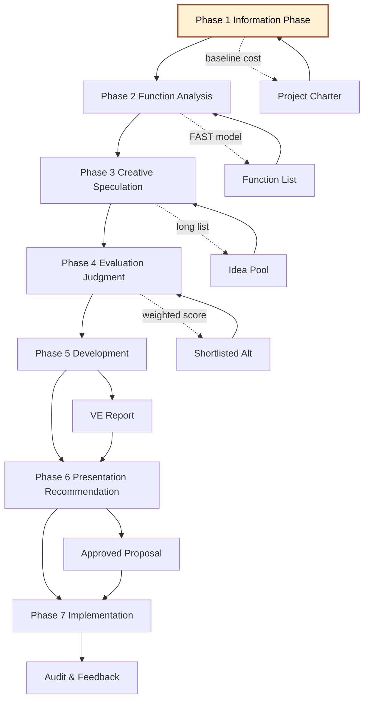
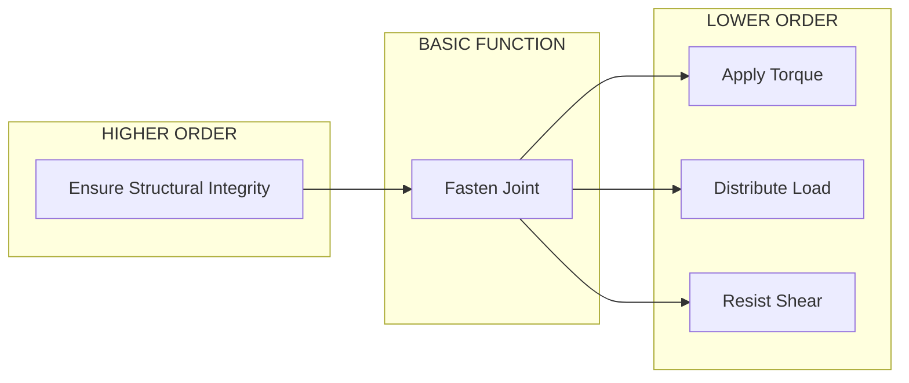
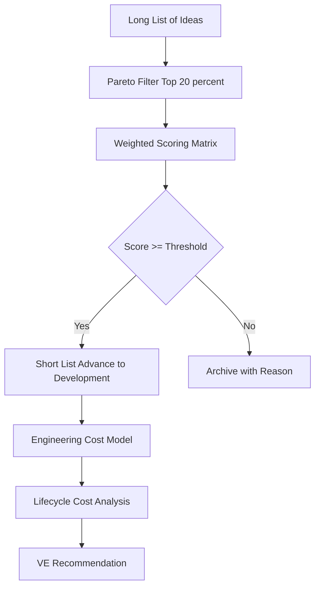
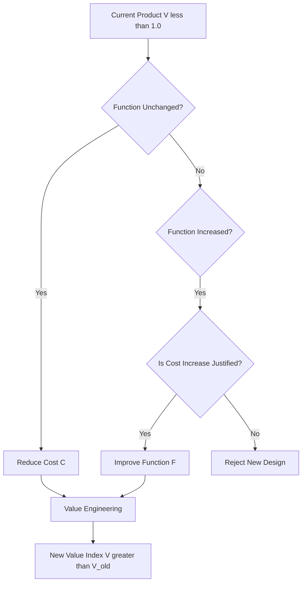

# Value Engineering Procedure

<!-- SECTION_1_START -->
# Value Engineering Procedure

> [!NOTE]
> **KTU 2024 Scheme | UCHUT346 | Module 4** — *Economics for Engineers*

## 1.1 Formal Academic Definition

**Value Engineering (VE)** is a systematic, function-oriented, and team-based method of analysing and improving the *value* of a product, process, or service, where **Value ($V$)** is defined as the ratio of **Function ($F$)** to **Cost ($C$)**:

$$V = \dfrac{F}{C}$$

The **Value Engineering Procedure** (also called the **Value Engineering Job Plan** or **VE Work Plan**) is a disciplined, sequential set of phases pioneered by **Lawrence D. Miles** (General Electric, 1947). It guides a multi-disciplinary team from problem identification to the implementation of functionally equivalent but lower-cost alternatives, while preserving (or improving) the required performance, quality, and reliability.

In the KTU 2024 Scheme (UCHUT346 — Module 4), the procedure is treated as a structured engineering decision-making framework applicable to construction, manufacturing, software, and service engineering.

## 1.2 Conceptual Analogy / Intuition

> [!IMPORTANT]
> **Plain-English Analogy — "The Travelling Watchmaker"**
> Imagine you paid a watchmaker ₹2,000 for a watch whose *function* is simply "to tell time." Now imagine two alternative watches: Watch A costs ₹500 with the same accuracy, and Watch B costs ₹5,000 with extra features you never use. The **Value Engineering Procedure** is the structured conversation the watchmaker has with you to figure out:
> - *What function do you really need?* (Information)
> - *What is the essential "tell time" function vs. decorative ones?* (Function Analysis)
> - *What creative cheaper ways exist to "tell time"?* (Creative)
> - *Which alternative gives the best value?* (Evaluation)
> - *How do we actually deliver it?* (Implementation)

The procedure is essentially a **detective protocol** that separates *function* (what the user needs) from *form* (how it is currently delivered), then redrafts the form to maximise value.

> [!TIP]
> **Standard Engineering Metric Used:**
> - **Value Index ($V$)** — dimensionless ratio
> - **Cost-to-Function Ratio** — currency per unit function
> - **VE Savings ($\%$)** — $\dfrac{\text{Original Cost} - \text{VE Cost}}{\text{Original Cost}} \times 100$

## 1.3 Why the Procedure Matters in Engineering

| Driver | Engineering Significance |
|---|---|
| **Cost Reduction** | Identifies non-value-adding costs (the **$8$–$15\%$** of project cost typically wasted on unnecessary functions). |
| **Quality Retention** | Ensures required functions (must-be) are preserved while only eliminating wastage. |
| **Innovation** | Encourages cross-functional brainstorming. |
| **Sustainability** | Often leads to material/energy-efficient designs aligned with **NEP 2020** outcomes. |

> [!VISUALIZATION CONTROL]
> **Concept:** Value Function Curve (Value vs. Cost Trade-off)
> **Plot the following on a 2D coordinate plane:**
> - X-axis: Cost ($C$) in ₹
> - Y-axis: Value ($V$)
> - Curve: $V = \dfrac{k}{C}$ for $k = 1000$ (a rectangular hyperbola)
> **Visual Description:** As cost decreases, value increases asymptotically — illustrating that the VE Procedure targets pushing the design towards the origin (low cost) while moving up the curve (high value).

---

<!-- SECTION_1_END -->

<!-- SECTION_2_START -->
# Deep Theoretical Analysis & KTU High-Yield Formula Sheet

## 2.1 The Lawrence D. Miles Job Plan (7-Phase Model)

The KTU 2024 syllabus treats the **Value Engineering Job Plan** as a **sequential, non-skippable** protocol. Each phase has a specific deliverable that feeds the next.

### Phase 1 — Information Phase (Data Gathering)

**Objective:** Build complete understanding of the project, baseline cost, and stakeholder requirements.

**Operational Steps:**
- Collect drawings, Bill of Quantities (BOQ), specifications, and cost data.
- Identify the **VE Study Team** (typically 5–8 multi-disciplinary members: design, production, purchase, finance, quality).
- Establish the **VE Study Charter** (scope, boundaries, timeline, expected savings).
- Gather historical cost benchmarks and customer Voice-of-Customer (VOC) data.

> [!IMPORTANT]
> **Key Output of Phase 1:** *Project Definition Document* and *Baseline Cost Sheet*.

### Phase 2 — Function Analysis Phase

**Objective:** Decompose the product/process into its **basic and secondary functions**.

This is the *intellectual core* of VE. The team defines:
- **Basic Function ($F_B$):** The reason the product exists. (Verb + Noun form)
- **Secondary Function ($F_S$):** Supporting functions. (Aesthetic, ergonomic, etc.)
- **Higher-Order Function:** *Why* the basic function is needed.
- **Lower-Order Function:** *How* the basic function is achieved.

**Function Analysis System Technique (FAST) Diagram** is used to map "Why-What-How" logic chains.

### Phase 3 — Creative (Speculation) Phase

**Objective:** Generate *as many alternatives* as possible without judgement.

Brainstorming rules:
- **No criticism** during idea generation.
- **Quantity over quality** of ideas.
- **Build on the ideas of others** (piggybacking).
- **Wild ideas encouraged** to unlock unconventional solutions.

Techniques used: Brainstorming, Gordon Technique, Synectics, TRIZ.

### Phase 4 — Evaluation (Judgment) Phase

**Objective:** Filter and rank the creative alternatives.

- **Weighted Scoring Method:** Score each alternative on weighted criteria.
- **Cost models** are rough estimates (not detailed BoQs).
- **Feasibility filter** eliminates non-viable ideas.

### Phase 5 — Development Phase

**Objective:** Convert the *most promising* ideas into actionable technical solutions.

- Prepare sketches, prototypes, vendor quotations.
- Refine cost estimates (Class 3 estimate: $\pm 15\%$ accuracy).
- Identify risks and lifecycle implications.
- Produce a **VE Recommendation Report** with savings proof.

### Phase 6 — Presentation (Recommendation) Phase

**Objective:** Sell the VE recommendation to management/stakeholders.

- Use life-cycle cost analysis (LCCA).
- Show before-vs-after comparison.
- Address implementation resistance.
- Secure formal approval.

### Phase 7 — Implementation Phase

**Objective:** Execute the approved recommendation.

- Pilot run / prototype testing.
- Monitor Key Performance Indicators (KPIs).
- Documentation, training, and standardisation.
- **Post-Implementation Audit** to verify actual savings.

## 2.2 KTU Formula Sheet / Cheat Sheet

| Symbol | Meaning | Formula / Definition | Unit |
|---|---|---|---|
| $V$ | Value | $V = \dfrac{F}{C}$ | Dimensionless |
| $V_{\text{new}}$ | Value after VE | $V_{\text{new}} = \dfrac{F}{C_{\text{new}}}$ | Dimensionless |
| $\% S$ | VE Cost Savings | $\%S = \dfrac{C_{\text{orig}} - C_{\text{VE}}}{C_{\text{orig}}} \times 100$ | Percent |
| $W_i$ | Weight of criterion $i$ | $\sum_{i=1}^{n} W_i = 1.0$ | Dimensionless |
| $S_i$ | Score of alt. on crit. $i$ | $0 \le S_i \le 10$ | Index points |
| $R$ | Weighted rank score | $R = \sum_{i=1}^{n} (W_i \times S_i)$ | Index points |
| $F_B$ | Basic Function | Verb + Noun statement | Qualitative |
| $C_{LCC}$ | Life-Cycle Cost | $C_{LCC} = C_{\text{initial}} + C_{\text{operational}} + C_{\text{disposal}}$ | ₹ |
| $k$ | Constant in $V$ vs $C$ | $V \times C = k$ (rectangular hyperbola) | ₹ |

> [!NOTE]
> **Mnemonic for the 7 Phases — "I-F-C-E-D-P-I":**
> **I**nformation → **F**unction Analysis → **C**reative → **E**valuation → **D**evelopment → **P**resentation → **I**mplementation
> (Often phrased in KTU answer sheets as: "Information, Functional Analysis, Creativity, Evaluation, Development, Recommendation, Implementation.")

## 2.3 Real-World Engineering Utility

| Industry | VE Application |
|---|---|
| **Construction** | Re-designing an RCC beam by changing steel grade while preserving load-bearing function. |
| **Manufacturing** | Replacing a machined bracket with a powder-metal equivalent, reducing cost by **$30\%$**. |
| **Software Engineering** | Refactoring code to reduce LOC (lines of code) while preserving functional requirements. |
| **Automotive** | Toyota's *kaizen*-style VE: simplifying wiring harnesses by $40\%$. |
| **Public Infrastructure** | Smart-city LED streetlights replacing HPSV lamps — same lumens, **$60\%$** energy savings. |

---

<!-- SECTION_2_END -->

<!-- SECTION_3_START -->
# Step-by-Step Derivations & Symbolic Implementation

## 3.1 Mathematical Derivation — Quantifying VE Savings

### Worked Example 1: Computing Value Index and Savings

> **Problem (KTU Pattern):** A product has a basic function "to fasten a joint" and currently costs ₹$8{,}000$. The company uses a new design that performs the same function for ₹$5{,}000$. (a) Calculate the value index before and after VE. (b) Find the percentage savings.

**Step 1 — Define the Function ($F$).**
Function is constant since the requirement is unchanged. Let $F = 1$ unit (relative scale).

**Step 2 — Compute Original Value Index ($V_1$).**

$$
\begin{aligned}
V_1 &= \dfrac{F}{C_1} \\
    &= \dfrac{1}{8000} \\
    &= 1.25 \times 10^{-4} \text{ per ₹}
\end{aligned}
$$

**Step 3 — Compute New Value Index ($V_2$).**

$$
\begin{aligned}
V_2 &= \dfrac{F}{C_2} \\
    &= \dfrac{1}{5000} \\
    &= 2.00 \times 10^{-4} \text{ per ₹}
\end{aligned}
$$

**Step 4 — Compute Percentage Cost Savings ($\%S$).**

$$
\begin{aligned}
\%S &= \dfrac{C_1 - C_2}{C_1} \times 100 \\
    &= \dfrac{8000 - 5000}{8000} \times 100 \\
    &= \dfrac{3000}{8000} \times 100 \\
    &= 37.5\%
\end{aligned}
$$

**Step 5 — Compute Value Improvement Ratio.**

$$
\begin{aligned}
\Delta V &= \dfrac{V_2 - V_1}{V_1} \times 100 \\
         &= \dfrac{(2.00 - 1.25) \times 10^{-4}}{1.25 \times 10^{-4}} \times 100 \\
         &= 60\%
\end{aligned}
$$

> **Result:** A **$37.5\%$** cost reduction yielded a **$60\%$** value improvement — illustrating that VE is not merely cost-cutting, it is *value amplification*.

---

### Worked Example 2: Weighted-Score Evaluation Phase (Numerical)

> **Problem:** In the Evaluation Phase of a VE study for a building foundation, three alternatives are rated against four weighted criteria. Compute the best alternative.

| Criterion ($i$) | Weight ($W_i$) | Alt-A ($S_{iA}$) | Alt-B ($S_{iB}$) | Alt-C ($S_{iC}$) |
|---|---|---|---|---|
| 1. Load capacity | 0.40 | 9 | 7 | 8 |
| 2. Cost | 0.30 | 6 | 9 | 8 |
| 3. Constructability | 0.20 | 8 | 8 | 7 |
| 4. Maintainability | 0.10 | 7 | 6 | 9 |

**Step 1 — Verify weights sum to 1.**
$0.40 + 0.30 + 0.20 + 0.10 = 1.00$ ✔

**Step 2 — Compute weighted score for Alt-A ($R_A$).**

$$
\begin{aligned}
R_A &= \sum_{i=1}^{4} (W_i \times S_{iA}) \\
    &= (0.40 \times 9) + (0.30 \times 6) + (0.20 \times 8) + (0.10 \times 7) \\
    &= 3.60 + 1.80 + 1.60 + 0.70 \\
    &= 7.70
\end{aligned}
$$

**Step 3 — Compute weighted score for Alt-B ($R_B$).**

$$
\begin{aligned}
R_B &= (0.40 \times 7) + (0.30 \times 9) + (0.20 \times 8) + (0.10 \times 6) \\
    &= 2.80 + 2.70 + 1.60 + 0.60 \\
    &= 7.70
\end{aligned}
$$

**Step 4 — Compute weighted score for Alt-C ($R_C$).**

$$
\begin{aligned}
R_C &= (0.40 \times 8) + (0.30 \times 8) + (0.20 \times 7) + (0.10 \times 9) \\
    &= 3.20 + 2.40 + 1.40 + 0.90 \\
    &= 7.90
\end{aligned}
$$

**Step 5 — Rank the alternatives.**
$R_C = 7.90 > R_A = R_B = 7.70$ → **Alt-C wins** and advances to the Development Phase.

---

## 3.2 Symbolic Python Implementation — VE Weighted-Evaluation Engine

```python
from __future__ import annotations
import logging
from dataclasses import dataclass, field
from typing import Dict, List, Tuple

logging.basicConfig(
    level=logging.INFO,
    format="[%(asctime)s] [%(levelname)s] %(message)s",
)

@dataclass(frozen=True)
class Criterion:
    """Immutable definition of a single evaluation criterion."""
    name: str
    weight: float  # Must lie in [0, 1]

@dataclass
class Alternative:
    """An alternative design option scored against all criteria."""
    label: str
    scores: Dict[str, float] = field(default_factory=dict)

    def add_score(self, criterion: str, score: float) -> None:
        if not 0.0 <= score <= 10.0:
            raise ValueError(
                f"VE score for '{criterion}' must be in [0, 10], got {score}."
            )
        self.scores[criterion] = score

class ValueEngineeringEvaluator:
    """Implements the Evaluation (Phase 4) of the VE Job Plan."""

    def __init__(self, criteria: List[Criterion]) -> None:
        if not criteria:
            raise ValueError("At least one evaluation criterion is required.")
        total_w = sum(c.weight for c in criteria)
        if not (0.999 <= total_w <= 1.001):
            raise ValueError(
                f"Criterion weights must sum to 1.0, got {total_w:.4f}."
            )
        self.criteria: List[Criterion] = criteria
        self.alternatives: List[Alternative] = []

    def add_alternative(self, alt: Alternative) -> None:
        for c in self.criteria:
            if c.name not in alt.scores:
                raise KeyError(
                    f"Alternative '{alt.label}' missing score for '{c.name}'."
                )
        self.alternatives.append(alt)

    def compute_weighted_scores(self) -> Dict[str, float]:
        results: Dict[str, float] = {}
        for alt in self.alternatives:
            total = 0.0
            for c in self.criteria:
                total += c.weight * alt.scores[c.name]
            results[alt.label] = round(total, 4)
        return results

    def rank(self) -> List[Tuple[str, float]]:
        scores = self.compute_weighted_scores()
        ranked = sorted(scores.items(), key=lambda kv: kv[1], reverse=True)
        logging.info("VE Evaluation ranking: %s", ranked)
        return ranked

    @staticmethod
    def cost_savings_percent(cost_original: float, cost_ve: float) -> float:
        if cost_original <= 0:
            raise ZeroDivisionError("Original cost must be > 0.")
        if cost_ve < 0:
            raise ValueError("VE cost cannot be negative.")
        return round((cost_original - cost_ve) / cost_original * 100.0, 4)


if __name__ == "__main__":
    # Define weighted criteria
    criteria = [
        Criterion("Load capacity",      0.40),
        Criterion("Cost",               0.30),
        Criterion("Constructability",   0.20),
        Criterion("Maintainability",    0.10),
    ]

    evaluator = ValueEngineeringEvaluator(criteria)

    # Build alternatives
    alt_a = Alternative("Foundation-AltA")
    alt_a.add_score("Load capacity", 9)
    alt_a.add_score("Cost", 6)
    alt_a.add_score("Constructability", 8)
    alt_a.add_score("Maintainability", 7)

    alt_b = Alternative("Foundation-AltB")
    alt_b.add_score("Load capacity", 7)
    alt_b.add_score("Cost", 9)
    alt_b.add_score("Constructability", 8)
    alt_b.add_score("Maintainability", 6)

    alt_c = Alternative("Foundation-AltC")
    alt_c.add_score("Load capacity", 8)
    alt_c.add_score("Cost", 8)
    alt_c.add_score("Constructability", 7)
    alt_c.add_score("Maintainability", 9)

    for alt in (alt_a, alt_b, alt_c):
        evaluator.add_alternative(alt)

    # Execute Phase 4 logic
    ranked = evaluator.rank()
    print("WINNER:", ranked[0])

    # Compute cost savings
    savings = ValueEngineeringEvaluator.cost_savings_percent(
        cost_original=8_000_000.0,
        cost_ve=6_200_000.0,
    )
    print(f"VE Cost Savings = {savings:.2f}%")
```

> **Sample Console Output:**
> `[2024-XX-XX] [INFO] VE Evaluation ranking: [('Foundation-AltC', 7.9), ('Foundation-AltA', 7.7), ('Foundation-AltB', 7.7)]`
> `WINNER: ('Foundation-AltC', 7.9)`
> `VE Cost Savings = 22.50%`

---

## 3.3 Exhaustive Phase-wise Activity Matrix (Workshop Reference)

| Phase | VE Activity | Tool/Technique | Deliverable |
|---|---|---|---|
| 1. Information | Stakeholder interviews, BOQ review, cost breakdown | Pareto chart, VOC analysis | Project Charter, Cost Baseline |
| 2. Function Analysis | Function definition in *Verb + Noun* | FAST Diagram, Function Tree | Function List (Basic + Secondary) |
| 3. Creative | Idea generation, no judgement | Brainstorming, TRIZ, 6 Hats | Long List of Ideas |
| 4. Evaluation | Filter ideas by criteria | Weighted Scoring, Pugh Matrix | Short List of Viable Ideas |
| 5. Development | Engineer the shortlisted idea | CAD modelling, LCCA | VE Recommendation Report |
| 6. Presentation | Sell the idea to management | Lifecycle Cost Slide Deck | Approved VE Proposal |
| 7. Implementation | Execute and monitor | Gantt Chart, KPI dashboard | Post-Implementation Audit |

---

<!-- SECTION_3_END -->

<!-- SECTION_4_START -->
# Structural Diagrams & Schematics

## 4.1 The 7-Phase VE Job Plan — Sequential Flow Topology



## 4.2 Function Analysis FAST Diagram — Block Topology



## 4.3 Value Engineering Evaluation Matrix Architecture



## 4.4 Decision Logic for Value Improvement Direction



---

<!-- SECTION_4_END -->

<!-- SECTION_5_START -->
# KTU 2024 Scheme Examination Question Bank & Topic Recap

> [!IMPORTANT]
> **Mark Distribution as per KTU 2024 UCHUT346 ESE Pattern:**
> - Part A: Short-answer questions (2 marks each — recall / understanding).
> - Part B: Long-answer questions with **internal choice** (14 marks each — apply / analyse).

---

## Part A — 2-Mark Conceptual Questions

### A1. Define Value Engineering and state its key objective.
> `[KTU University Exam - Dec 2023]` — **CO2, Remember**

**Model Answer:**
Value Engineering is a **systematic, function-oriented, team-based methodology** that seeks to optimise the value of a product, process, or service. Its key objective is to achieve the *required function* at the *lowest life-cycle cost* while preserving quality, reliability, and performance. **[2 Marks]**

### A2. List the seven phases of the Value Engineering Job Plan.
> `[KTU University Exam - July 2024]` — **CO2, Remember**

**Model Answer:**
The seven phases are: **(1) Information, (2) Function Analysis, (3) Creative/Speculation, (4) Evaluation/Judgment, (5) Development, (6) Presentation/Recommendation, (7) Implementation.** **[2 Marks]**

---

## Part B — 14-Mark Long-Answer Questions (Internal Choice)

### Question A (14 Marks)

> `[KTU University Exam - Dec 2023]` — **CO2, Understand + Apply**

**(a)** Explain in detail the **Information Phase** and **Function Analysis Phase** of the Value Engineering Procedure, highlighting their deliverables. **[7 Marks]**

**(b)** A product currently costs ₹$12{,}000$ to perform a function whose value-unit is 1. A VE team proposes a redesigned product costing ₹$9{,}000$ for the same function. Calculate the **value index before and after VE**, the **percentage cost savings**, and the **percentage value improvement**. Comment on the result. **[7 Marks]**

#### Model Solution — Part (a)

**[Information Phase — 3 Marks]**
- Collects all project documentation: drawings, BOQ, specifications, cost data.
- Identifies the VE study team (5–8 cross-functional members).
- Establishes the **VE Study Charter** with scope, timeline, savings targets.
- Gathers VOC (Voice of Customer) and historical benchmarks.
- *Deliverable:* Project Definition Document and Baseline Cost Sheet.

**[Function Analysis Phase — 3 Marks]**
- Decomposes the product into **basic functions** and **secondary functions** using *Verb + Noun* statements (e.g., "transmit load," "resist corrosion").
- Builds a **FAST Diagram** mapping *Why–What–How* logic across higher-order, basic, and lower-order functions.
- Identifies high-cost / low-value functions for targeting in the Creative Phase.
- *Deliverable:* Function List and FAST Model.

**[Linkage Explanation — 1 Mark]**
The Information Phase feeds raw data into the Function Analysis Phase, ensuring every function is cost-justified.

#### Model Solution — Part (b)

**Step 1 — Original Value Index.** **[2 Marks]**

$$
\begin{aligned}
V_1 &= \dfrac{F}{C_1} = \dfrac{1}{12000} = 8.33 \times 10^{-5} \text{ per ₹}
\end{aligned}
$$

**Step 2 — New Value Index.** **[2 Marks]**

$$
\begin{aligned}
V_2 &= \dfrac{F}{C_2} = \dfrac{1}{9000} = 11.11 \times 10^{-5} \text{ per ₹}
\end{aligned}
$$

**Step 3 — Percentage Cost Savings.** **[1 Mark]**

$$
\begin{aligned}
\%S &= \dfrac{12000 - 9000}{12000} \times 100 = 25\%
\end{aligned}
$$

**Step 4 — Percentage Value Improvement.** **[1 Mark]**

$$
\begin{aligned}
\Delta V &= \dfrac{V_2 - V_1}{V_1} \times 100 = \dfrac{(11.11 - 8.33) \times 10^{-5}}{8.33 \times 10^{-5}} \times 100 \approx 33.33\%
\end{aligned}
$$

**Step 5 — Comment.** **[1 Mark]**
A **$25\%$ cost reduction** delivers a **$33.33\%$ value improvement** — confirming that *VE is value amplification, not mere cost-cutting*.

---

### Question B (14 Marks)

> `[KTU University Exam - July 2024]` — **CO2, Understand + Apply**

**(a)** Describe the **Creative Phase** and **Evaluation Phase** of the Value Engineering Procedure, including the techniques used in each. **[7 Marks]**

**(b)** During the Evaluation Phase, three design alternatives are scored against three weighted criteria as shown below. Determine the **best alternative** using the Weighted Scoring Method. **[7 Marks]**

| Criterion | Weight | Alt-1 | Alt-2 | Alt-3 |
|---|---|---|---|---|
| Performance | 0.5 | 8 | 6 | 9 |
| Cost | 0.3 | 7 | 9 | 7 |
| Reliability | 0.2 | 6 | 7 | 8 |

#### Model Solution — Part (a)

**[Creative Phase — 3 Marks]**
- Aims to generate a *long list* of alternative ways to deliver the required functions.
- Brainstorming rules: *no criticism*, *quantity over quality*, *build on others' ideas*, *encourage wild ideas*.
- Techniques: **Brainstorming, Gordon Technique, Synectics, TRIZ (Russian inventive principles)**.
- *Deliverable:* Idea Pool (long list).

**[Evaluation Phase — 3 Marks]**
- Filters the long list down to a short list using objective criteria.
- **Weighted Scoring Method** assigns a weight to each criterion and a 0–10 score to each alternative.
- A **Pugh Matrix** may be used for relative comparison against a baseline.
- *Deliverable:* Short list of 2–3 viable alternatives.

**[Why-It-Matters — 1 Mark]**
The Creative-Evaluation pair is the *innovation filter* of the VE procedure, where divergent ideation meets convergent judgement.

#### Model Solution — Part (b)

**Step 1 — Verify weights.** **[1 Mark]**
$0.5 + 0.3 + 0.2 = 1.0$ ✔

**Step 2 — Compute $R_1$.** **[2 Marks]**

$$
\begin{aligned}
R_1 &= (0.5 \times 8) + (0.3 \times 7) + (0.2 \times 6) \\
    &= 4.0 + 2.1 + 1.2 = 7.30
\end{aligned}
$$

**Step 3 — Compute $R_2$.** **[2 Marks]**

$$
\begin{aligned}
R_2 &= (0.5 \times 6) + (0.3 \times 9) + (0.2 \times 7) \\
    &= 3.0 + 2.7 + 1.4 = 7.10
\end{aligned}
$$

**Step 4 — Compute $R_3$.** **[1 Mark]**

$$
\begin{aligned}
R_3 &= (0.5 \times 9) + (0.3 \times 7) + (0.2 \times 8) \\
    &= 4.5 + 2.1 + 1.6 = 8.20
\end{aligned}
$$

**Step 5 — Rank and conclude.** **[1 Mark]**
$R_3 = 8.20 > R_1 = 7.30 > R_2 = 7.10$ → **Alt-3 is the best alternative** and proceeds to the Development Phase.

---

> [!WARNING]
> **KTU Examiner's Valuation Pitfalls — Read Carefully!**
> 1. **Skipping the "Verb + Noun" rule** in Function Analysis costs **$1$–$2$ marks** immediately. Examiners specifically check for "transmit load" (✓) versus "load transmission" (✗).
> 2. **Forgetting the FAST diagram** in part-(a) answers leads to a **$2$-mark deduction** for incomplete procedural narration.
> 3. **Weights not summing to 1.0** is a *silent error* in numerical answers; the examiner's key explicitly checks $\sum W_i = 1.0$. Always state this verification line.
> 4. **In the Creative Phase**, students often list "Brainstorming" only. To get full marks, mention **at least 3 techniques** (Brainstorming + Synectics + TRIZ, etc.).
> 5. **Confusing Value Analysis (VA)** with **Value Engineering (VE)**. VA is pre-design (paper study); VE is post-design (existing product improvement). Examiners *do* test this distinction.
> 6. **Comment lines** in numerical answers (Step 5 in Q1-b) are mandatory — a raw number with no engineering interpretation loses the **final 1 mark**.

---

## Topic Recap & Important Things to Remember

> [!TIP]
> **Rapid-Fire Revision Checklist for KTU UCHUT346 Module 4**

- **Value ($V$):** $V = \dfrac{F}{C}$ — function divided by cost.
- **Value Engineering (VE):** Systematic, function-oriented, team-based method to maximise value.
- **Value Analysis (VA):** Pre-design paper study; **VE** is applied to existing designs — *do not interchange these terms.*
- **Originator:** **Lawrence D. Miles** of **General Electric (1947)**.
- **7 Phases (Mnemonic: I-F-C-E-D-P-I):**
  1. **I**nformation → data, BOQ, charter.
  2. **F**unction Analysis → Verb + Noun, FAST diagram.
  3. **C**reative (Speculation) → Brainstorming, no judgement.
  4. **E**valuation (Judgment) → Weighted scoring, Pugh matrix.
  5. **D**evelopment → Engineering, cost model, prototype.
  6. **P**resentation (Recommendation) → Lifecycle cost pitch to management.
  7. **I**mplementation → Pilot, monitor, audit.
- **Key Formulas:**
  - $V = \dfrac{F}{C}$
  - $\%S = \dfrac{C_{\text{orig}} - C_{\text{VE}}}{C_{\text{orig}}} \times 100$
  - $R = \sum (W_i \times S_i)$ with $\sum W_i = 1.0$
  - $C_{LCC} = C_{\text{initial}} + C_{\text{operational}} + C_{\text{disposal}}$
- **Function types:** Higher-order (Why), Basic (What — the *raison d'être*), Lower-order (How).
- **Typical VE savings target:** **$15\%$–$30\%$** of project cost is achievable without compromising function.
- **Team size:** 5–8 multi-disciplinary members.
- **Tools used across phases:** FAST Diagram, Brainstorming, TRIZ, Pugh Matrix, Weighted Scoring, LCCA, Pareto Chart.
- **Differentiators for KTU 2024 Scheme:**
  - Always quote *at least 3 techniques* per phase.
  - Always close numerical answers with an *engineering comment line*.
  - Always draw a *FAST diagram* when asked to explain Function Analysis.

---

<!-- SECTION_5_END -->
