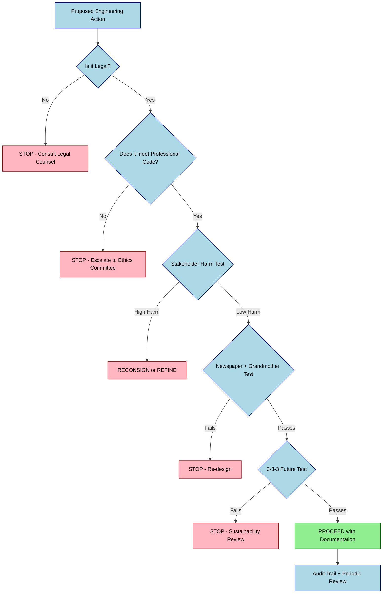
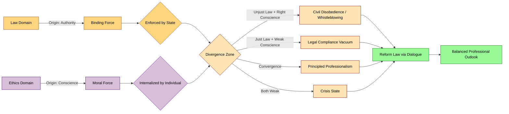
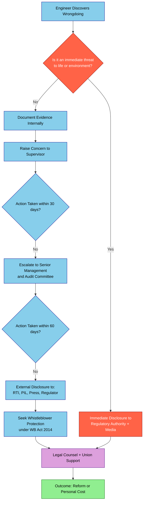

# a balanced outlook on law - challenges - case studies

<!-- SECTION_1_START -->
# A Balanced Outlook on Law – Challenges & Case Studies

## 1. Core Definition (KTU 2024 Syllabus Terminology)

> [!IMPORTANT]
> **Law**, in the context of engineering ethics, refers to the system of **enforceable rules and regulations** established by an authority (state, institution, or professional body) to govern conduct, ensure order, protect rights, and deliver justice within a society.

> [!NOTE]
> **Balanced Outlook on Law** is the ethical stance that recognizes law as **necessary but not sufficient** for moral conduct. It acknowledges that an ethical engineer must follow the *letter* of the law while also evaluating whether the *spirit* of the law serves broader human, environmental, and professional values.

### Conceptual Analogy / Intuition

Imagine a **roadmap** for a long journey. The *law* is the **paved highway** — clearly marked, with speed limits, traffic signals, and toll booths. As long as you stay on it, you are *legally* safe. The *ethics* is the **moral compass** that tells you whether to stop and help a stranded traveler, even if it means breaking the speed limit. The *balanced outlook* is recognizing that:

- The **paved highway is essential** (without law, society collapses into chaos).
- But the highway **does not always lead to the right destination** (laws can be unjust, outdated, or unethical).
- A mature engineer obeys the highway **and** questions its direction.

> [!TIP]
> Think of **Law** as the **minimum** standard of behavior and **Ethics** as the **maximum** standard. Engineering professionalism requires operating **well above the legal floor** but **never below it**.

### Key Terms Introduced

- **Legal Positivism** – Law is law because it is enacted by a legitimate authority, regardless of its moral content.
- **Natural Law Theory** – Law must align with universal moral principles to be considered *truly* valid.
- **Civil Disobedience** – Willful, non-violent violation of unjust laws, accepting the legal punishment to expose moral wrongs (e.g., Mahatma Gandhi, Rosa Parks, Edward Snowden).
- **Whistleblowing** – Disclosure by an employee of organizational wrongdoing that threatens public interest, often in conflict with legal confidentiality clauses.

> [!VISUALIZATION CONTROL]
> **Concept:** The Ethics–Law–Confidence Triangle
> **Conceptual Axes:**
> * X-axis: Degree of Legal Compliance (Low to High)
> * Y-axis: Degree of Ethical Conduct (Low to High)
> **Points to Plot:**
> * Quadrant I (High, High) = "Virtuous Professional"
> * Quadrant II (Low Law, High Ethics) = "Civil Disobedient / Reformer"
> * Quadrant III (Low, Low) = "Unethical Criminal"
> * Quadrant IV (High Law, Low Ethics) = "Legal but Unscrupulous"
> **Visual Description:** A 2×2 matrix showing the four behavioral zones of a professional. The student should see that the *balanced outlook* lives in Quadrant I, with awareness of Quadrant II as a legitimate ethical response to unjust law.

<!-- SECTION_1_END -->

<!-- SECTION_2_START -->
# Deep Theoretical Analysis & KTU High-Yield Framework

## 2. Why "Balanced Outlook"? The Philosophical Roots

A *one-sided* view of law has historically produced two extreme schools of thought:

### 2.1 The "Law is Everything" View (Legal Positivism)
- Propounded by **John Austin** and **H.L.A. Hart**.
- Belief: *An unjust law is still a law. Obey first, reform later.*
- Risk: Creates obedient professionals who ignore atrocities (e.g., Nazi engineers following the *Führer’s* orders).

### 2.2 The "Law is Nothing" View (Anarchism / Radical Ethics)
- Belief: *Only conscience matters; law is oppressive by design.*
- Risk: Produces chaos, vigilante justice, and the absence of accountability.

### 2.3 The Balanced View (KTU 2024 Position)
A *balanced* professional engineer understands:

1. **Law establishes the *floor* of acceptable conduct.**
2. **Ethics establishes the *ceiling* of aspirational conduct.**
3. **The two often overlap but sometimes diverge.**
4. **In divergence, the engineer must use moral judgment, not blind obedience or blind rebellion.**

## 3. The Four Zones of Professional Conduct (KTU Framework)

| Zone | Legal? | Ethical? | Example | KTU Action |
|:-----|:------:|:--------:|:--------|:-----------|
| **I – Virtuous Professional** | Yes | Yes | Engineer follows safety code **and** voluntarily reports a near-miss | **Maintain and mentor** |
| **II – Principled Dissenter** | No | Yes | Engineer leaks data on a deadly product defect covered by NDA | **Whistleblow with safeguards** |
| **III – Unethical Criminal** | No | No | Engineer bribes officials to approve a substandard bridge | **Prosecute and reform** |
| **IV – Letter-of-the-Law Professional** | Yes | No | Engineer uses a legal loophole to dump toxic waste | **Regulate the loophole** |

## 4. Major Challenges to a Balanced Outlook

### 4.1 Challenge 1 – **Legal Compliance vs. Ethical Courage**
- *Description:* Sometimes the law protects the powerful, not the public. Following the law can perpetuate harm.
- *Example:* An engineer discovers that a pesticide licensed by the government causes birth defects. Legal: report to the licensing authority. Ethical: warn the public immediately.

### 4.2 Challenge 2 – **Conflict of Interest (COI)**
- *Description:* Personal gain vs. public duty. Law may permit gifts up to a threshold; ethics may reject all gifts.
- *Example:* A government engineer evaluating a contractor’s bid receives a Diwali hamper worth ₹4,999 (just below the ₹5,000 legal disclosure limit).

### 4.3 Challenge 3 – **Cross-Jurisdictional Ethics**
- *Description:* A multinational engineer faces differing laws (e.g., child labor banned in Germany, permitted in country X). Which law applies?
- *Example:* Apple-Foxconn iPhone assembly controversies; FIFA World Cup stadium workers in Qatar.

### 4.4 Challenge 4 – **Whistleblower Retaliation**
- *Description:* Laws may protect whistleblowers on paper, but in practice, they face demotion, blacklisting, and lawsuits.
- *Example:* Satyendra Dubey (NHAI, 2003) and Shanmugam Manjunath (IOCL, 2005) in India – both murdered for exposing corruption.

### 4.5 Challenge 5 – **Speed of Innovation vs. Speed of Law**
- *Description:* Technologies (AI, CRISPR, autonomous vehicles) evolve faster than legislation. Engineers must operate in ethical voids.
- *Example:* Use of facial recognition by Delhi Police (2024) without a dedicated Data Protection law in force.

### 4.6 Challenge 6 – **Cultural Relativism**
- *Description:* What is ethical in one culture may be illegal/immoral in another.
- *Example:* Bribery is normal business practice in some jurisdictions; a strict Indian/Ideal engineer refuses.

## 5. KTU High-Yield Decision Framework Table

| Step | Question to Ask | Source of Guidance |
|:-----|:----------------|:-------------------|
| **1** | Is the action **legal**? | Constitution, IPC/CRPC, Industry Acts (Factories Act, EPA, IT Act) |
| **2** | Is it covered by my **professional code**? | IE(I) Code of Ethics, IEEE Code, ASME, NSPE |
| **3** | Does it pass the **Newspaper Test**? | Would I be comfortable if this appeared on the front page? |
| **4** | Does it pass the **Grandmother Test**? | Can I explain it honestly to a child? |
| **5** | Does it respect **stakeholder dignity**? | Users, public, environment, future generations |
| **6** | If law and ethics conflict, have I **documented, escalated, and protected** myself? | Whistleblower Protection Act 2014 (India), Sarbanes-Oxley (USA) |

> [!IMPORTANT]
> **KTU 2024 High-Yield Phrase:** "Ethics is the *why* of the law, the *spirit* behind the rule. An engineer with a *balanced outlook* obeys the law, questions unjust law, and never hides behind legality to escape moral responsibility."

<!-- SECTION_2_END -->

<!-- SECTION_3_START -->
# Step-by-Step Analysis, Case Studies & Implementation

## 6. Case Study 1 – The Bhopal Gas Tragedy (1984) – *The Limits of Legal Compliance*

### 6.1 Background
Union Carbide India Limited (UCIL) operated a pesticide plant in Bhopal. On the night of **2–3 December 1984**, **40 tonnes of methyl isocyanate (MIC)** leaked, killing **3,787 people immediately** and affecting **over 500,000** in the long term.

### 6.2 Legal Analysis
| Legal Aspect | Status in 1984 |
|:-------------|:---------------|
| Factories Act, 1948 compliance | Partially complied |
| MIC storage temperature regulations | Not enforced strictly |
| Emergency evacuation plan | Non-existent |
| US parent company liability | Disputed jurisdiction |

### 6.3 Ethical Analysis
- **Cost-cutting** overrode safety upgrades.
- The *“Six Warning Signs”* identified by employees in 1982 were ignored.
- UCC Chairman Warren Anderson flew to Bhopal, was arrested, then released on bail and **never returned** to face trial.

### 6.4 Balanced Outlook Outcome
- **Legal:** UCC paid **$470 million** settlement in 1989 (about $1 per affected person).
- **Ethical:** No amount compensates the loss of life and dignity.
- **Lesson:** *Legal compliance is the floor, not the ceiling. Cost-of-compliance is always less than cost-of-catastrophe.*

### 6.5 KTU Valuation Mapping
- Identify legal failures: **2 marks**
- Identify ethical failures: **2 marks**
- Propose balanced reforms (e.g., strict liability doctrine, corporate criminal liability): **3 marks**

---

## 7. Case Study 2 – The Therac-25 Radiation Overdoses (1985–1987)

### 7.1 Background
**Therac-25** was a computer-controlled radiation therapy machine made by **Atomic Energy of Canada Limited (AECL)**. Due to a software race condition, six patients received **massive overdoses** (up to 100× the intended dose). At least three died.

### 7.2 Legal Analysis
- AECL was regulated by the **US FDA** under medical device laws.
- FDA later recalled the machine; AECL faced civil suits.
- No criminal prosecution of engineers; settlements were confidential.

### 7.3 Ethical Analysis
- Engineers **prioritized feature release** over safety interlocks.
- **Known bugs** in the software were not documented to hospitals.
- Management overruled engineer concerns about race conditions.

### 7.4 Balanced Outlook Lesson
- *The law required reporting of deaths; the ethics required proactive disclosure of near-misses.*
- **Lesson:** A balanced engineer *anticipates* the ethical disaster *before* the legal one occurs.

---

## 8. Case Study 3 – Volkswagen Dieselgate (2015)

### 8.1 Background
VW installed **defeat-device software** in 11 million diesel cars worldwide to detect emissions tests and reduce NO$_x$ output **only during testing**. On roads, cars emitted up to **40× the legal limit**.

### 8.2 Legal vs. Ethical Matrix

| Dimension | Legal Position | Ethical Position |
|:----------|:---------------|:-----------------|
| US Clean Air Act | Clear violation | Clear violation |
| Software "is it a device?" | Grey area exploited by lawyers | Unambiguous deception |
| CEO knowledge | Denied at first | Internally documented |
| Customer trust | Legally addressable via recall | Ethically destroyed |

### 8.3 Outcome
- VW paid **$30+ billion** in fines, settlements, and buybacks.
- CEO Martin Winterkorn faced criminal charges in Germany.
- 9 executives received prison sentences (up to 3 years) by a German court in 2023.

### 8.4 Balanced Outlook Lesson
*Even when the loophole is technically legal for years, the *moment of public exposure* makes the conduct retroactively and globally indefensible.*

---

## 9. Case Study 4 – SpaceX vs. Boeing Starliner (Engineering Quality Culture)

### 9.1 The Situation
After Boeing Starliner’s crewed flight test issues (2024), NASA astronauts were stranded on the ISS. SpaceX Crew Dragon’s safety culture was repeatedly highlighted as the gold standard.

### 9.2 Balanced Outlook Mapping
- **Legal:** Both companies met NASA contractual obligations.
- **Ethical:** SpaceX embraced a *“fail fast, fix faster, be transparent”* culture; Boeing prioritized schedule and reputation.
- **Lesson:** A balanced outlook is a **strategic competitive advantage**, not a cost burden.

---

## 10. Case Study 5 – The Agnipath Scheme Protests (India, 2022) – *Engineer as Citizen*

### 10.1 Background
The Government of India announced the *Agnipath* defence recruitment scheme. Critics alleged it lacked parliamentary debate and adequate stakeholder consultation.

### 10.2 Engineer’s Dilemma
- An engineer employed in DRDO/DPSU must implement the scheme (legal duty).
- An engineer as a citizen may oppose the policy (ethical/Constitutional duty under **Article 19(1)(a)**).
- **Balanced approach:** Implement legally *while* exercising dissent through RTI, PIL, and journalism — not sabotage.

### 10.3 Lesson
*A balanced outlook does not require abandoning one’s values to serve the state. It requires **disciplined, non-violent, lawful expression** of dissent.*

---

## 11. Case Study 6 – Apple’s Foxconn Worker Conditions (2010 onwards)

### 11.1 Background
Multiple reports of **worker suicides, 60-hour weeks, and child labour** in supplier factories producing Apple iPhones.

### 11.2 Balanced Outlook Response
- **Legal:** Apple’s Supplier Code of Conduct was improved; third-party audits mandated.
- **Ethical:** Apple eventually joined the **Responsible Business Alliance (RBA)** and published annual Supplier Responsibility Reports.
- **Lesson:** *Global supply chains require ethical auditing beyond local legal minimums.*

---

## 12. A Procedural Decision Algorithm (Python-Style Pseudocode for Engineering Judgement)

```python
def evaluate_engineering_action(action, jurisdiction_law, professional_code, stakeholder_data):
    """
    KTU 2024 Balanced-Outlook Decision Engine
    Returns: (decision, justification, escalation_path)
    """
    
    # Step 1: Legal compliance check
    legal_status = check_legal_compliance(action, jurisdiction_law)
    if legal_status == "ILLEGAL":
        return "REJECT", "Action violates binding law. Halt immediately.", "Legal counsel"
    
    # Step 2: Professional code check
    code_status = check_professional_code(action, professional_code)
    if code_status == "VIOLATION":
        return "REJECT", "Violates IE(I)/IEEE Code of Ethics.", "Ethics committee"
    
    # Step 3: Newspaper & Grandmother tests
    if not newspaper_test(action) or not grandmother_test(action):
        return "ESCALATE", "Fails intuitive ethical tests.", "Senior management + Ombudsman"
    
    # Step 4: Stakeholder impact analysis
    harm_score = calculate_harm(stakeholder_data)
    if harm_score > ACCEPTABLE_HARM_THRESHOLD:
        return "RECONSIDER", "Stakeholder harm exceeds tolerable limit.", "Impact assessment"
    
    # Step 5: Long-tail consequences (3-3-3 rule)
    if has_3yr_negative_externalities(action) or has_3gen_negative_externalities(action):
        return "RECONSIDER", "Fails intergenerational ethics test.", "Sustainability review"
    
    # Step 6: Final balanced recommendation
    return "PROCEED_WITH_DOCUMENTATION", "Action passes all ethical and legal filters.", "Standard audit trail"
```

> [!TIP]
> **KTU 2024 Exam Tip:** When asked *"How would you handle a situation where law permits X but ethics prohibits X?"*, structure your answer as: (i) Cite the **legal provision** that permits X; (ii) Identify the **ethical code/article** that prohibits X; (iii) Propose a **third path** that obeys law, respects ethics, and protects stakeholders.

<!-- SECTION_3_END -->

<!-- SECTION_4_START -->
# Structural Diagrams & Schematics

## 13. Mermaid Diagram 1 – The Engineering Decision Funnel



## 14. Mermaid Diagram 2 – The Law–Ethics Diverge-and-Reconverge Model



## 15. Mermaid Diagram 3 – Whistleblowing Decision Pathway (KTU High-Yield)



## 16. Sequential Processing Topology – The Six-Test Balanced-Outlook Matrix

| Test # | Test Name | Question Posed | KTU Source | Pass Criterion |
|:------:|:----------|:---------------|:-----------|:---------------|
| **T1** | Legal Test | Is it permitted by statute and case law? | Bare Act, IPC, IT Act 2000 | **Yes** required |
| **T2** | Code Test | Does it respect IE(I) / IEEE Code? | IE(I) Code of Ethics, Article 12 | **No violation** |
| **T3** | Virtue Test | Would a *virtuous engineer* (Aristotle) do it? | Nicomachean Ethics | **Yes** |
| **T4** | Care Test | Does it honour the *web of care*? | Care Ethics (Gilligan, Noddings) | **Yes** |
| **T5** | Justice Test | Does it distribute benefits and burdens fairly? | Rawls, IEEE 7000 | **Yes** |
| **T6** | Sustainability Test | Is it safe for 3 generations × 3 years × 3 ecosystems? | Brundtland, SDG 2030 | **Yes** |

<!-- SECTION_4_END -->

<!-- SECTION_5_START -->
# KTU 2024 Scheme Examination Question Bank & Topic Recap

## 17. Part A – Short Answer Questions (3 Marks Each)

### Question 1 [KTU University Exam – Dec 2023, CO1, Remember]
**Define the term "Balanced Outlook on Law" in the context of engineering ethics.**

**Model Answer (Valuation Key – 3 marks):**
A *balanced outlook on law* is the ethical position that recognises **law as a necessary but not sufficient condition for moral conduct** (1 mark). It requires the engineer to (i) **comply with the law as the minimum standard** (1 mark), (ii) **critically evaluate the moral validity of the law itself** (0.5 mark), and (iii) **act with conscience when law and ethics diverge, through lawful means such as whistleblowing or civil disobedience** (0.5 mark).

---

### Question 2 [KTU University Exam – July 2024, CO1, Understand]
**Differentiate between Legal Positivism and Natural Law Theory.**

**Model Answer (Valuation Key – 3 marks):**

| Dimension | Legal Positivism | Natural Law Theory |
|:----------|:-----------------|:-------------------|
| Source of law | Enactment by authority (1 mark) | Alignment with moral order (1 mark) |
| Validity of unjust law | Still a law, must be obeyed (0.5 mark) | Not a true law, may be resisted (0.5 mark) |

---

## 18. Part B – Long Answer Questions (14 Marks Each – Module Internal Choice)

### Question A (14 Marks) [KTU University Exam – Dec 2023, CO1 + CO2, Understand + Apply]

**(a)** Explain any **four major challenges** that an engineer faces in maintaining a balanced outlook on law. (7 marks)

**(b)** With the help of the **Volkswagen Dieselgate case study**, illustrate how legal loopholes can produce technically legal but ethically indefensible outcomes. Propose reforms. (7 marks)

#### Model Solution

**(a) Four Major Challenges (7 marks – 1.75 each):**

1. **Legal Compliance vs. Ethical Courage** – Example: Whistleblower protection is weak; engineers fear retaliation. *Citing Satyendra Dubey: 0.5 mark; Explanation: 1.25 marks.*
2. **Conflict of Interest** – Gifts, shares, family ties influence decisions. *Example of Diwali hamper below disclosure threshold: 0.5 mark; Mechanism: 1.25 marks.*
3. **Cross-Jurisdictional Ethics** – Different labour, environmental, and data laws. *Example: Apple-Foxconn in China vs. US: 0.5 mark; Analysis: 1.25 marks.*
4. **Speed of Innovation vs. Speed of Law** – AI, gene editing, drones outpace statutes. *Example: Facial recognition in Delhi 2024: 0.5 mark; Analysis: 1.25 marks.*

**(b) VW Dieselgate Analysis (7 marks):**

- **Stating the facts of the case: 1 mark** (defeat device in 11 million cars, NO$_x$ emissions 40× over limit).
- **Identifying the legal loophole: 1 mark** (software not classified as "defeat device" under EPA rules at the time).
- **Identifying the ethical violation: 2 marks** (deception of customers, regulators, employees, public health).
- **Balanced-outlook evaluation: 2 marks** (legal but not ethical; *legal compliance was a strategic deception*).
- **Proposing reforms: 1 mark** (whistleblower rewards, software-as-device classification, *naming & shaming*, criminal liability for CEOs).

**Total: 7 marks.**

> [!WARNING]
> **KTU Examiner’s Pitfall Warning:** Do not write only *"VW broke the law."* The whole point of the question is to show that **initially VW exploited a legal grey zone** and only later was it reclassified as illegal. The *balanced outlook* requires you to identify the **gap between legality and morality** *before* the law catches up. Skipping the reform proposal will cost you **1 mark**.

---

### Question B (14 Marks) [KTU University Exam – July 2024, CO1 + CO2, Understand + Apply]

**(a)** "An engineer who blindly follows the law may still act unethically." Discuss with reference to the **Bhopal Gas Tragedy**. (7 marks)

**(b)** Design a **six-step decision algorithm** that an engineer should follow when faced with a divergence between legal mandate and ethical conscience. (7 marks)

#### Model Solution

**(a) Bhopal – Legal but Unethical (7 marks):**

- **Stating the incident: 1 mark** (MIC leak, 3,787 immediate deaths, 500,000+ affected).
- **Identifying the legal failures: 2 marks** (Factories Act 1948 violations, missing evacuation plan, ignored employee warnings of 1982).
- **Identifying the ethical failures: 2 marks** (cost over safety, corporate negligence, abandonment by US parent).
- **Linking to "balanced outlook": 1 mark** (Union Carbide *obeyed* the *letter* of diluted Indian law but *violated* the *spirit* of engineering responsibility to public safety).
- **Conclusion: 1 mark** (Lesson: law was inadequate; ethics should have driven higher internal safety standards regardless).

**(b) Six-Step Decision Algorithm (7 marks – ~1.16 marks each step):**

| Step | Action | Justification |
|:-----|:-------|:-------------|
| **1** | **Identify the law** that applies (Bare Act, regulation, case law) | Know the floor |
| **2** | **Identify the ethical code** (IE(I) Article 1, IEEE Code 1, 7) | Know the ceiling |
| **3** | **Document the divergence** in writing with date, witnesses | Create evidence trail |
| **4** | **Apply the Newspaper + Grandmother Tests** | Sanity-check the intuition |
| **5** | **Escalate internally first** to supervisor, ethics ombudsman | Exhaust institutional remedies |
| **6** | **If unresolved, disclose externally** via RTI/regulator/media with Whistleblower Protection Act cover | Public-interest override |

> [!WARNING]
> **KTU Examiner’s Pitfall Warning:** When asked to *"design an algorithm,"* students often write vague platitudes. You **must** present **six clearly numbered, named steps** with **at least one keyword in bold** for each step. The examiner awards marks only when the step is **actionable and specific**. Vague steps such as *"think about it"* will fetch **0 marks**.

---

## 19. Topic Recap & Important Things to Remember

> [!IMPORTANT]
> **Final Revision Checklist – KTU 2024**

- **Definition:** Balanced outlook = law as floor + ethics as ceiling + conscience in divergence.
- **Two Extreme Schools:** Legal Positivism (obey always) vs. Natural Law (obey only if moral). Balanced view rejects both extremes.
- **Four Zones Matrix:** (I) Virtuous (II) Civil Disobedient (III) Unethical Criminal (IV) Letter-of-the-Law Professional.
- **Six Major Challenges:** (1) Legal vs. ethical courage, (2) Conflict of interest, (3) Cross-jurisdictional ethics, (4) Whistleblower retaliation, (5) Innovation speed vs. law speed, (6) Cultural relativism.
- **Six Decision Tests:** T1 Legal, T2 Code, T3 Virtue, T4 Care, T5 Justice, T6 Sustainability (3×3×3 rule).
- **Five Must-Know Cases:** (1) Bhopal 1984, (2) Therac-25 1985, (3) VW Dieselgate 2015, (4) Foxconn-Apple 2010+, (5) Indian Whistleblowers (Dubey, Manjunath).
- **Key Indian Statutes:** Factories Act 1948, EPA 1986, IT Act 2000, Whistleblowers Protection Act 2014, RTI Act 2005, Indian Contract Act 1872 (Sec 73 damages).
- **Key Professional Codes:** IE(I) Code of Ethics, IEEE Code of Ethics (8 tenets), NSPE Code, ACM/IEEE Software Engineering Code.
- **Three Golden Phrases for KTU Answers:**
  1. *"Law is the floor, ethics is the ceiling."*
  2. *"Legal compliance is necessary but never sufficient."*
  3. *"In divergence, document, escalate, and disclose — never silently comply."*
- **Whistleblower Decision Pathway:** Immediate threat → External disclosure. Non-urgent → Document → Supervisor → Senior Management → External (RTI/Regulator/Media) under WB Act 2014.
- **Newspaper Test & Grandmother Test** are the two intuitive ethical filters expected in every KTU long-answer.
- **3-3-3 Sustainability Rule:** *3 years, 3 generations, 3 ecosystems* (land, water, air) — a Brundtland-aligned rule popular in KTU 2024 modules.
- **Always** close a long answer with: *"Thus, a balanced outlook empowers the engineer to obey the law, critique the law, and uphold ethics in service of the public, the planet, and the profession."*

<!-- SECTION_5_END -->
