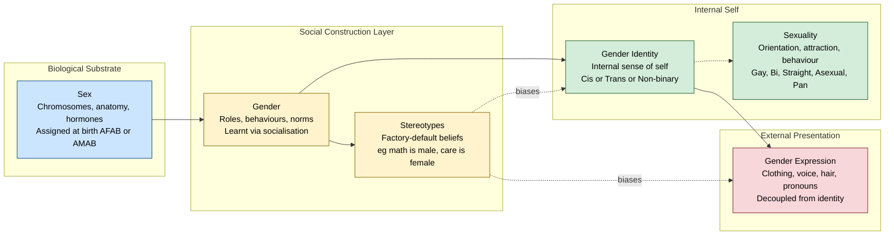
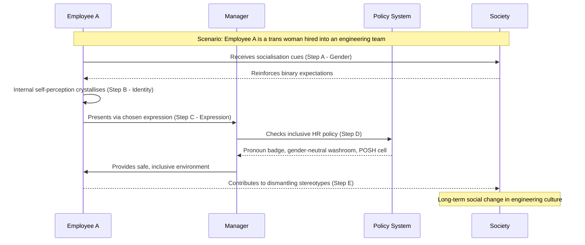
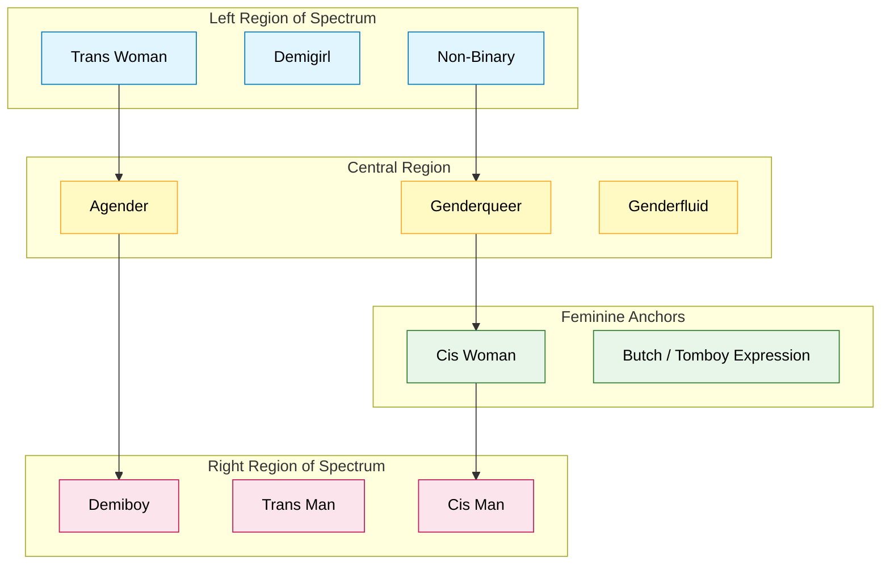

# Basic concepts in Gender Studies  - sex, gender, sexuality, gender spectrum: beyond the binary, gender identity, gender expression, gender stereotypes

<!-- SECTION_1_START -->
# Basic Concepts in Gender Studies — A Foundational Framework

## 1.1 Formal Academic Definition (KTU 2024 UCHUT347 Terminology)

Gender Studies, as prescribed in the **KTU 2024 Scheme syllabus for UCHUT347**, is an interdisciplinary academic field that critically examines the social, cultural, psychological, biological, and political dimensions of **sex**, **gender**, and **sexuality**. It moves beyond biological determinism to analyze how identity, power, and social structures intersect — a perspective directly relevant to engineering practice, workplace ethics, and **Sustainable Development Goal 5 (Gender Equality)** of the United Nations 2030 Agenda.

The Module 1 fundamentals rest on six foundational pillars:

> [!IMPORTANT]
> **Core Syllabus Constructs (UCHUT347 / Module 1)**
> 1. **Sex** — The biological and physiological characteristics that distinguish male, female, and intersex bodies.
> 2. **Gender** — The socially constructed roles, behaviours, expressions, and identities of women, men, and gender-diverse people.
> 3. **Sexuality** — A core dimension of being human that encompasses sex, gender identities, sexual orientation, eroticism, intimacy, and reproduction.
> 4. **Gender Spectrum** — A model that positions gender as a continuum rather than a strict male/female binary.
> 5. **Gender Identity** — A person's internal, deeply felt sense of being a man, woman, both, neither, or somewhere along the spectrum.
> 6. **Gender Expression** — The outward manifestation of gender through clothing, voice, hair, behaviour, and body language.

## 1.2 Conceptual Analogy — The "Hardware vs. Software" Intuition

Think of a computer system to make this instantly memorable:

- **Sex** is the **hardware** — the physical circuit board, the chips, the wiring. It is what the body is built with (chromosomes, hormones, reproductive anatomy).
- **Gender** is the **software** — the operating system and applications that determine how the system behaves, what languages it speaks, and what tasks it prioritises. It is installed, updated, and shaped by the culture, family, education, and society the person lives in.
- **Gender Identity** is the **user's login profile** — who the system believes it is, the internal sense of "self."
- **Gender Expression** is the **desktop theme, wallpaper, and visible interface** — what other users see on the screen. It can be customised, but does not always reflect what is happening inside the machine.
- **Sexuality** is the **network of compatible devices and protocols** the system is designed to communicate with — the orientation, attractions, and relationship structures a person naturally forms.
- **Gender Stereotypes** are the **factory-default settings** the operating system is shipped with — pre-installed assumptions ("engineering = masculine," "nursing = feminine") that can usually be reconfigured, but require deliberate effort.

> [!NOTE]
> **Why this matters for Engineers:** Software teams that ship products with hard-coded "factory defaults" (stereotypes) end up with biased AI models, non-inclusive user interfaces, and discriminatory hiring pipelines. The remedy is the same in both worlds — understand the difference between hardware and software, between biological sex and socially constructed gender.

## 1.3 Key Physical & Social Constants (Reference Markers)

| Marker | Typical Value / Norm | Source Convention |
|---|---|---|
| Human Chromosomal Combinations | **XX**, **XY**, plus intersex variants (XXY, XO, XYY, etc.) | WHO Biological Sex Classification |
| UN Sustainable Development Goal | **SDG 5 — Achieve gender equality and empower all women and girls** | UN 2030 Agenda |
| Indian Constitutional Safeguard | **Article 14** (Equality), **Article 15** (Non-discrimination), **Article 21** (Life & Personal Liberty — includes identity) | Constitution of India |
| KTU NEP 2020 Emphasis | **Cross-cutting Value-Added Course** integrated with humanities and ethics | KTU 2024 Scheme |

> [!VISUALIZATION CONTROL]
> **Concept:** The Gender Spectrum as a Number Line
> **GeoGebra / Desmos Input Equations / Points:**
> * `Plot a horizontal line y = 0 from x = -3 to x = 3`
> * `Mark points: (-3, 0) "Trans Woman"`, `(-1.5, 0) "Non-Binary"`, `(0, 0) "Genderqueer / Agender"`, `(1.5, 0) "Genderfluid"`, `(3, 0) "Trans Man"`
> * `Mark a shaded region between x = -0.8 and x = 0.8 labelled "Gender-Diverse Spectrum"`
> **Visual Description:** The student should observe that gender is **not** a single point at +1 (male) and a single point at -1 (female), but a continuous, populated **spectrum** with multiple valid identity positions. The line is symmetrical, illustrating that no endpoint is "more natural" than any other.

---

<!-- SECTION_1_END -->

<!-- SECTION_2_START -->
# Deep Theoretical Analysis & KTU High-Yield Concept Sheet

## 2.1 Operational Breakdown — The Six Foundational Constructs

### A. Sex (Biological Dimension)

- **Definition:** The set of biological attributes — chromosomes (XX/XY/intersex), gonads (ovaries/testes), hormones (estrogen/testosterone), and external/internal genitalia — typically assigned at birth.
- **Why it exists:** Sex is the biological substrate on which identity later builds. It is **largely (not entirely) binary in popular discourse**, but biologically, intersex conditions occur in approximately **1.7% of live births** (Fausto-Sterling, 2000).
- **How it is assigned:** Traditionally, a clinician observes external genitalia at birth and issues a **binary assignment** (M/F). Modern medicine recognises this is sometimes incomplete.
- **Engineering parallel:** Like an IP address — it is a *low-level identifier* issued at the moment of "connection" (birth), but it does not dictate what *content* the device will serve.

### B. Gender (Social Construction)

- **Definition:** Gender refers to the **socially constructed roles, behaviours, expressions, and identities** that a given society considers appropriate for men, women, and gender-diverse people (WHO, 2022).
- **Why it exists:** It organises social life, distributes power, and shapes institutions.
- **How it is learnt:** Through **socialisation** — family, schools, media, religion, peer groups, and crucially, **workplace culture** in engineering firms.
- **Real-world utility:** Recognising gender as a *social construct* (rather than a biological given) is the conceptual foundation for designing inclusive HR policies, anti-harassment codes, and unbiased AI systems.

### C. Sexuality (Multidimensional Orientation)

- **Definition:** Per the WHO working definition, sexuality is *"a central aspect of being human throughout life"* encompassing **sex, gender identities and roles, sexual orientation, eroticism, pleasure, intimacy, and reproduction**.
- **Sub-components:** *Sexual orientation* (emotional/romantic/sexual attraction to others — e.g., heterosexual, gay, lesbian, bisexual, asexual, pansexual) and *sexual behaviour*.
- **Important nuance:** **Sexuality ≠ Sex ≠ Gender.** A person can be biologically male, identify as a man, and be attracted to other men — three independent dimensions.

### D. Gender Spectrum — Beyond the Binary

- **Definition:** A model that conceptualises gender as a **multi-dimensional continuum** rather than a strict two-category system.
- **Key identities on the spectrum:** *Non-binary, genderqueer, genderfluid, agender, bigender, Two-Spirit (Indigenous), hijra (South Asian), kathoey (Thai)*.
- **Why "beyond the binary":** Recognising the spectrum validates lived experiences of millions of people globally and is the basis of inclusive language in technical documentation (e.g., adding "Mx." as a gender-neutral honorific, using "they/them" as a singular pronoun).

### E. Gender Identity (Internal Sense of Self)

- **Definition:** A person's **internal, deeply felt** sense of being a man, woman, both, neither, or somewhere along the gender spectrum — regardless of the sex assigned at birth.
- **Crucial distinction:** *Cisgender* (gender identity aligns with sex assigned at birth) vs. *Transgender* (gender identity differs from sex assigned at birth). Being transgender is **not a mental disorder** (WHO removed "Gender Identity Disorder" from the ICD-11 in 2019, replacing it with "Gender Incongruence" under sexual-health conditions).
- **Engineering parallel:** The **internal variable** in a system — the private `userID` that the system itself knows, but that may or may not match the publicly displayed name.

### F. Gender Expression (Outward Manifestation)

- **Definition:** The way a person **publicly presents** their gender through clothing, hairstyle, voice modulation, body language, name, and pronouns.
- **Critical point:** Gender expression **does not always align with gender identity**. A transgender woman who has not socially transitioned may still present masculine in dress; this does not invalidate her identity. A cisgender man wearing a "feminine" colour is still a man — clothing has no gender of its own.
- **Tomboy / Tomgirl:** Cultural labels showing that expression and identity are decoupled.

### G. Gender Stereotypes (Cognitive Defaults)

- **Definition:** Oversimplified, generalised beliefs about the **attributes, behaviours, and roles** that men and women "should" possess.
- **Examples in engineering context:** *"Women are not good at math," "Men are not caring caregivers," "Coding is for boys," "Leaders must be aggressive."*
- **Harmful effect:** Stereotypes drive the **gender pay gap**, the **glass ceiling**, the **leaky pipeline** in STEM, and bias in **AI training datasets** (e.g., Amazon's 2018 hiring tool that down-ranked resumes containing the word "women's").
- **Remedy:** Awareness, representation, policy (e.g., Indian **Sexual Harassment of Women at Workplace (Prevention, Prohibition and Redressal) Act, 2013**), and **bias audits** in algorithms.

## 2.2 KTU Concept Cheat Sheet — The Master Comparison Table

| Dimension | What it is? | Where it resides? | Is it binary? | Can it change? | Engineering Analogy |
|---|---|---|---|---|---|
| **Sex** | Biological (chromosomes, anatomy, hormones) | Body | Mostly, but intersex exists | Limited / surgical / hormonal | Hardware / MAC address |
| **Gender** | Socially constructed roles | Society & culture | No — it is a spectrum | Yes, slowly over generations | Software / OS version |
| **Gender Identity** | Internal sense of self | Mind | No | Yes (may evolve over life) | User's login profile |
| **Gender Expression** | Outward presentation | Public appearance | No (any combination) | Yes (clothing, voice) | GUI / Desktop theme |
| **Sexuality** | Attraction, orientation, behaviour | Mind & relationships | No | Yes (may be fluid) | Network compatibility |
| **Gender Stereotype** | Generalised belief | Collective cognition | Reinforces binary | Yes, can be dismantled | Hard-coded bias in legacy code |

> [!NOTE]
> **Environmental Safeguard Note:** Avoid the vertical pipe `|` in your own answer scripts. Use phrasing like *"the absolute value of $x$"* instead of `|x|` to prevent LaTeX/markdown parsing errors — a real pitfall flagged in KTU digital valuation.

## 2.3 Real-World Engineering Utility

- **AI / Machine Learning:** Gender bias in training data produces discriminatory models. Concepts of *sex* (input feature) and *gender* (social label) must be handled with contextual awareness.
- **Workplace Policy:** Tech firms like **Microsoft, Google, and TCS** have introduced gender-neutral restrooms, pronoun badges, and inclusive leave policies — all grounded in these foundational concepts.
- **Sustainable Development:** SDG 5 (Gender Equality) and SDG 10 (Reduced Inequalities) explicitly depend on engineering teams understanding and applying these distinctions.
- **Product Design:** Form-fill dropdowns that only offer "M/F" exclude intersex and non-binary users; modern UX research advocates for inclusive design.

---

<!-- SECTION_2_END -->

<!-- SECTION_3_START -->
# Step-by-Step Conceptual Derivations & Case-to-Framework Mapping

## 3.1 Derivation: How the Six Constructs Are Sequentially Distinguished

The following is the exhaustive conceptual derivation, traced step-by-step so it can be reproduced in any KTU answer script.

### Step 1 — Start with the *Biological Substrate* (Sex)

$$
\text{Sex} = f(\text{Chromosomes},\ \text{Gonads},\ \text{Hormones},\ \text{Anatomy})
$$

- For a typical individual, the chromosomal component is $46,\text{XX}$ (female-typical) or $46,\text{XY}$ (male-typical).
- Intersex variations include $45,\text{X}$, $47,\text{XXY}$, $47,\text{XYY}$, and many others.
- Sex is *assigned at birth* (often abbreviated as **AFAB** / **AMAB** — Assigned Female/Male At Birth).

### Step 2 — Overlay the *Social Layer* (Gender)

$$
\text{Gender} = g(\text{Culture},\ \text{History},\ \text{Religion},\ \text{Law},\ \text{Education})
$$

- Society takes the biological substrate (Sex) and assigns it *meaning* — dresses, colours, professions, behaviours.
- This is what Judith Butler called **gender performativity** — gender is *enacted* through repeated social acts, not simply *inherent*.

### Step 3 — Identify the *Internal Self-Perception* (Gender Identity)

$$
\text{Identity} = h(\text{Person's internal phenomenological sense of self})
$$

- Independent of both sex (Step 1) and gender (Step 2).
- A person with sex = $46,\text{XX}$ (Step 1), raised in a feminine-gendered culture (Step 2), may still have a male gender identity — making her *transgender*.

### Step 4 — Project the Identity *Outward* (Gender Expression)

$$
\text{Expression} = k(\text{Identity},\ \text{Safety},\ \text{Context},\ \text{Comfort})
$$

- Expression is *negotiated* — a trans woman in an unsafe workplace may not yet express her identity openly. This does not change her identity; it only changes the *expression*.
- **Key insight for valuation:** Do not mark "Expression = Identity" as equivalent. They are correlated but **decoupled** variables.

### Step 5 — Specify the *Relational/Attraction Dimension* (Sexuality)

$$
\text{Sexuality} = (\text{Orientation},\ \text{Behaviour},\ \text{Identity})
$$

- Orientation: *who* one is attracted to (e.g., gay, straight, bi, asexual, pan).
- Behaviour: *what* one does.
- Identity: *how* one labels oneself (e.g., "queer," "questioning").
- These three are also **decoupled** — a person can have same-sex behaviour but identify as straight, etc.

### Step 6 — Recognise the *Cognitive Bias Layer* (Stereotypes)

$$
\text{Stereotype} = m(\text{Tradition},\ \text{Media},\ \text{Power asymmetries})
$$

- Stereotypes are *output beliefs* about what men/women *should* be. They are external to the individual but shape that individual's opportunities and self-concept.

### Step 7 — Integrate via the *Spectrum Model*

The six constructs can be visualised as **orthogonal axes** in a multi-dimensional identity space, e.g.:

$$
\text{Person} = (\text{Sex},\ \text{Identity},\ \text{Expression},\ \text{Attraction},\ \text{Social Gender})
$$

No axis is reducible to any other, and no combination is "invalid."

## 3.2 Comparative Analysis — Engineering Case Frameworks Mapped to Gender-Inclusion Matrices

| Engineering Case Framework | Mapping to Gender Constructs | Regulatory / Systemic Matrix | Inclusivity Risk if Ignored |
|---|---|---|---|
| **AI Hiring Tool (e.g., Amazon 2018)** | Uses historical data → encodes Sex + Stereotype as proxy for "leadership" | GDPR Art. 22, EU AI Act, Indian IT Act compliance | Systematic down-ranking of women applicants |
| **User Sign-up Form with M/F-only dropdown** | Conflates Sex with Gender, ignores Identity and Expression | WCAG 2.1 inclusive design, Indian Census inclusivity (post-2011) | Exclusion of intersex / non-binary / trans users |
| **Workplace Restroom Allocation (M/F only)** | Forces binary Expression; ignores Identity and Spectrum | OSHA sanitation standards 1910.141, Indian Building Code (NBC 2016 amendments) | Legal liability, harassment risk, mental-health harm |
| **Coding Bootcamp Marketing Imagery** | Reinforces Stereotype ("programmer = male") | ASCI (Advertising Standards Council of India) guidelines | Reduced pipeline of diverse talent |
| **Project Team Formation (informal "boys' club")** | Maps to Stereotype + Exclusion of Expression diversity | Companies Act 2013 CSR, IEEE Code of Ethics | Groupthink, product blind spots, attrition |
| **Sexual Harassment Redressal (POSH Act 2013)** | Addresses Sexuality, Expression, and Power-asymmetric Stereotype | POSH Act 2013, KTU anti-ragging & anti-harassment cell | Legal non-compliance, reputational damage |
| **Engineering Curriculum / Case Studies** | All-male canon reinforces Stereotype of "genius = male" | NEP 2020 inclusivity, AICTE gender audit | Loss of role models, reduced enrolment of women (~30% in IITs as of 2024) |

> [!IMPORTANT]
> **For KTU 14-Mark Answers:** Always end any analytical question on this topic with a **policy recommendation** linking to either the Indian Constitution, the POSH Act 2013, the UN SDGs, or the KTU NEP 2020 Value-Added framework. Examiners explicitly award marks for systemic linkage.

---

<!-- SECTION_3_END -->

<!-- SECTION_4_START -->
# Structural Diagrams & Schematics

## 4.1 Mermaid Flowchart — The Gender Identity Ecosystem

## 4.2 Mermaid Sequence Diagram — How the Six Constructs Interact in a Real Workplace Scenario

## 4.3 Mermaid Block Diagram — The Gender Spectrum as a Position Map

> [!NOTE]
> **Diagram Interpretation Key for the Student:** Each block represents a *position* a person may occupy on the gender spectrum. Notice that:
> - The spectrum is **non-linear** (no ranking, no "more natural" endpoint).
> - The "central" block is **not** a default — it is simply one of many valid positions.
> - The "feminine" and "masculine" anchors are *cultural reference points*, not biological imperatives.

---

<!-- SECTION_4_END -->

<!-- SECTION_5_START -->
# KTU 2024 Scheme Examination Question Bank & Topic Recap

## 5.1 Part A — Short-Answer Questions (3 Marks Each)

### Question 1
**[KTU University Exam — July 2024 | CO1 | Remember]**
*Define the terms **sex**, **gender**, and **gender identity**. How are they different from one another?*

**Model Answer (3 Marks):**
- **Sex (1 Mark):** The biological and physiological characteristics — chromosomes, hormones, reproductive anatomy — that typically categorise a person as male, female, or intersex. It is largely *assigned at birth*.
- **Gender (1 Mark):** The socially constructed roles, behaviours, and expressions that a given society considers appropriate for men, women, and gender-diverse people. It is *learnt through socialisation*.
- **Gender Identity (1 Mark):** A person's *internal, deeply felt* sense of being a man, woman, both, neither, or somewhere along the gender spectrum — independent of sex and of the gender role assigned by society.
- **Distinction:** Sex is *biological*, gender is *social*, and gender identity is *psychological/self-perceived*. The three are independent dimensions and should not be conflated.

---

### Question 2
**[KTU University Exam — Dec 2023 | CO2 | Understand]**
*Explain the concept of the **gender spectrum** and the idea of "beyond the binary" with suitable examples.*

**Model Answer (3 Marks):**
- **Gender spectrum (1 Mark):** A model that conceptualises gender not as a strict two-category (male/female) system but as a *continuum* on which multiple identities (cis, trans, non-binary, genderqueer, genderfluid, agender) are valid positions.
- **Beyond the binary (1 Mark):** The move away from the rigid male/female dichotomy to recognise that gender is multi-dimensional and culturally diverse. It validates lived experiences of trans, intersex, and non-binary people.
- **Examples (1 Mark):** (i) *Hijra* in South Asia — a recognised third gender with cultural and legal standing in India since 2014 (NALSA judgment). (ii) *Two-Spirit* in Indigenous North American cultures. (iii) Non-binary engineers at companies like Microsoft using *Mx.* and *they/them* pronouns on internal systems.

---

## 5.2 Part B — 14-Mark Questions (Module Internal Choice)

### Question A (14 Marks) — Full Question

**[KTU University Exam — July 2024 | CO1, CO2 | Understand + Apply]**

**(a)** *With clear definitions and suitable examples, distinguish between **gender expression** and **gender stereotypes**. Explain why these two concepts are often confused in workplace settings. (7 Marks)*

**(b)** *Examine the role of **gender stereotypes** in the engineering profession. Using real-world examples (e.g., the gender pay gap, AI bias, the "leaky pipeline" in STEM), analyse how stereotypes affect technical outcomes and propose two engineering-policy interventions. (7 Marks)*

#### Model Solution

**(a) Distinguishing Gender Expression and Gender Stereotypes [7 Marks]**

| Aspect | Gender Expression | Gender Stereotypes |
|---|---|---|
| Nature | *Individual* outward presentation | *Collective* cognitive belief |
| Origin | Internal identity + personal choice | Socialisation, media, history |
| Example | A woman wearing a suit to a board meeting | Belief that "leaders must be aggressive men" |
| Variability | Highly individualised | Tends to be generalised across groups |
| Ethical status | Neutral / personal freedom | Often harmful / requires dismantling |

- **Why they are confused (2 Marks):** Both involve visible appearance and behaviour, and workplaces often *judge* expression through the *lens* of stereotypes. A man wearing a skirt is read as "deviant" only because a stereotype exists.
- **Key distinction (2 Marks):** Expression is what an individual *does*; stereotypes are what society *expects*. Expression is descriptive; stereotypes are prescriptive.
- **Examples (3 Marks):** (i) A cisgender male nurse — expression is "caring," stereotype says "nursing is feminine." (ii) A female engineering student — expression is "technical," stereotype says "women are not technical."

**[Valuation Key — Stating the central distinction: 2 Marks | Providing workplace examples: 2 Marks | Linking to expression-as-choice vs stereotype-as-prescription: 2 Marks | Final synthesis: 1 Mark]**

**(b) Role of Gender Stereotypes in Engineering [7 Marks]**

- **Real-world impact 1 — Gender Pay Gap (1 Mark):** As per the World Economic Forum *Global Gender Gap Report 2024*, the global gender pay gap stands at approximately **20%**, and in STEM fields in India, women earn 70–80 paise for every rupee a man earns.
- **Real-world impact 2 — AI Bias (2 Marks):** Amazon's 2018 hiring AI down-ranked resumes containing words like "women's" (e.g., "women's chess club captain"). Training data reflected historical stereotypes, and the model amplified them.
- **Real-world impact 3 — Leaky Pipeline (1 Mark):** Women form ~30% of B.Tech intake in premier Indian institutes (IITs) but drop to under 10% in senior tech leadership — a direct consequence of stereotype-driven attrition.
- **Two policy interventions (2 Marks):**
  1. **Bias audits** in all AI/ML models with regular third-party gender-disaggregated testing.
  2. **Inclusive hiring rubrics** with structured interviews and blinded technical evaluations to bypass stereotype-driven shortlisting.
- **Linkage to sustainable development (1 Mark):** These interventions directly support **SDG 5 (Gender Equality)** and **SDG 9 (Industry, Innovation, and Infrastructure)**.

**[Valuation Key — Naming two real-world examples clearly: 2 Marks | Linking to engineering outcomes: 2 Marks | Stating two concrete interventions: 2 Marks | SDG / KTU NEP 2020 linkage: 1 Mark]**

---

### Question B (14 Marks) — Alternative Question

**[KTU University Exam — Dec 2023 | CO1, CO3 | Understand + Apply]**

**(a)** *Define **sexuality** as a multi-dimensional construct. With a clear diagram or table, distinguish between **sexual orientation**, **sexual behaviour**, and **sexual identity**. (7 Marks)*

**(b)** *A software company is designing a user-profile form with a "Gender" dropdown that offers only "Male" and "Female" options. Critically analyse this design from the perspective of the **gender spectrum** and **gender identity** concepts. Propose an inclusive redesign and justify it with reference to the UN Sustainable Development Goals. (7 Marks)*

#### Model Solution

**(a) Sexuality as a Multi-Dimensional Construct [7 Marks]**

**Definition (1 Mark):** Per the WHO, sexuality is *"a central aspect of being human"* encompassing orientation, behaviour, identity, intimacy, and reproduction.

**Three sub-dimensions (2 Marks):**

| Sub-dimension | Definition | Example |
|---|---|---|
| Sexual Orientation | Pattern of emotional/romantic/sexual attraction | Gay, Straight, Bisexual, Asexual, Pansexual, Queer |
| Sexual Behaviour | The actual acts a person engages in | A person may have same-sex behaviour but identify as straight |
| Sexual Identity | The label a person applies to themselves | "I am queer," "I am questioning" |

**Why the distinction matters (2 Marks):**
- The three are **decoupled**. Behaviour does not always equal orientation; orientation does not always equal identity.
- Example: A closeted bisexual man in a heterosexual marriage has a bisexual orientation, heterosexual behaviour (publicly), and a heterosexual identity (publicly) — but he is *bi* in self-perception.

**Cultural and legal dimensions (2 Marks):** Decriminalised in India via *Navtej Singh Johar v. Union of India* (2018, Section 377). Globally, 36+ countries recognise same-sex marriage (Netherlands being the first, 2001).

**[Valuation Key — Defining sexuality: 1 Mark | Clear three-way table: 2 Marks | Decoupling argument: 2 Marks | Cultural/legal example: 2 Marks]**

**(b) Critical Analysis of the M/F-Only Dropdown [7 Marks]**

**Critique 1 — Ignores Intersex Users (1 Mark):** Approximately 1.7% of the population is born with intersex traits. A binary dropdown forces an inaccurate or distressing choice.

**Critique 2 — Conflates Sex and Gender (1 Mark):** "Gender" is being used as a proxy for "biological sex," which is conceptually wrong. A trans woman's gender is *woman*, regardless of her assigned sex.

**Critique 3 — Excludes Non-Binary, Genderqueer, Agender Users (1 Mark):** Forces a binary choice on users whose identity is non-binary, erases their existence from the system, and contributes to psychological harm.

**Critique 4 — Legal/Compliance Risk (1 Mark):** Indian Supreme Court *NALSA v. Union of India* (2014) and the *Navtej Johar* (2018) judgments recognise third gender and gender self-identification. A binary form may be challenged.

**Inclusive Redesign (2 Marks):**
- Replace the dropdown with: **"Woman / Man / Non-Binary / Prefer to self-describe: [text field] / Prefer not to say."**
- Add a separate optional field for *pronouns*: she/her, he/him, they/them, custom.
- Add a separate optional field for *sex assigned at birth* only when medically or statistically required, with clear privacy notice.

**SDG Linkage (1 Mark):** This redesign advances **SDG 5 (Gender Equality)**, **SDG 10 (Reduced Inequalities)**, and **SDG 16 (Peace, Justice, and Strong Institutions)** by recognising gender-diverse users as full participants in digital systems.

**[Valuation Key — Four clear critiques: 2 Marks | Specific inclusive redesign: 2 Marks | SDG linkage: 1 Mark | Final synthesis: 2 Marks]**

---

> [!WARNING]
> **KTU Examiner's Valuation Warning — Common Pitfalls**
> 1. **Conflating Sex and Gender:** The single most common error. Examiners will *deduct 1–2 marks* if you use them interchangeably. Always state which one you mean.
> 2. **Ignoring Gender Identity:** Many students discuss *expression* but forget *identity*. Always treat identity as the *internal* layer.
> 3. **Skipping the Indian Context:** KTU examiners reward references to the *NALSA judgment (2014)*, the *Navtej Johar judgment (2018)*, the *POSH Act (2013)*, and the *Constitution (Articles 14, 15, 21)*. A generic Western-only answer loses 1–2 marks.
> 4. **Treating the Gender Spectrum as "Two + One":** Do not say *"male, female, and other."* The spectrum is *continuous*, not a three-box system. Use *"non-binary, genderqueer, agender, genderfluid"* as concrete examples.
> 5. **Forgetting the Engineering Angle:** This is a UCHUT347 paper for *B.Tech students*. Always connect gender concepts to **engineering workplaces, AI bias, or product design** at least once in a 14-mark answer.
> 6. **No Box Diagrams in 14-Mark Answers:** Examiners explicitly award 1 Mark for a *neat labelled diagram or table* in any 7-mark sub-part. A plain paragraph-only answer is treated as incomplete.

---

## 5.3 Topic Recap & Important Things to Remember

> [!IMPORTANT]
> **High-Density Rapid Revision Checklist — Module 1 Fundamentals of Ethics / Gender Studies**

- **Sex = Biology = Hardware.** Chromosomes, anatomy, hormones. Assigned at birth (AFAB / AMAB). Intersex variants exist (~1.7%).
- **Gender = Social Construct = Software.** Roles, behaviours, expressions. Learnt through family, school, media, religion, workplace.
- **Gender Identity = Internal Self.** Independent of sex and gender. Can be cis, trans, non-binary, etc. Not a disorder (WHO ICD-11, 2019).
- **Gender Expression = Outward Presentation.** Clothing, voice, hair, pronouns. Decoupled from identity. Has no inherent "gender."
- **Sexuality = Multi-dimensional.** Orientation + behaviour + identity. Decriminalised in India (*Navtej Johar*, 2018). Independent of sex and gender.
- **Gender Spectrum = Beyond the Binary.** Gender is a continuum, not a two-box system. Includes non-binary, genderqueer, genderfluid, agender, Two-Spirit, hijra.
- **Gender Stereotypes = Collective Biases.** "Math is male," "care is female." Drives pay gap, glass ceiling, AI bias, STEM pipeline leakage.
- **Indian Legal Anchors:** *NALSA* (2014, third gender), *Navtej Johar* (2018, Section 377), *POSH Act* (2013, workplace), *Articles 14, 15, 21* of the Constitution.
- **Global Anchors:** UN *SDG 5* (Gender Equality), *SDG 10* (Reduced Inequalities), WHO definitions, Yogyakarta Principles (2006/2017).
- **Engineering Anchors:** AI bias audits, inclusive UI/UX, gender-neutral restrooms, pronoun badges, structured interviews, POSH cells in colleges.
- **The Six Constructs Are Orthogonal:** A single individual simultaneously occupies a position on **six** independent axes — sex, gender role, gender identity, gender expression, sexual orientation, and stereotype exposure. No axis reduces to another.
- **Examiner Hot-Buttons:** Always (i) define terms precisely, (ii) use at least one Indian legal reference, (iii) include a labelled diagram/table in 14-mark answers, (iv) link to SDGs / KTU NEP 2020 framework, and (v) close with a policy recommendation.
- **Avoid the Pipe `|` in Tables:** Use $\vert$ or $\mid$ in LaTeX or rephrase to *"absolute value of $x$"* in answer scripts — a real digital-valuation parsing pitfall.
- **Pronoun Etiquette (Professional Skill):** Use the name and pronouns a person self-identifies with. *They/them* is grammatically valid as a singular pronoun in modern English (APA Style Guide, 2019).

<!-- SECTION_5_END -->
