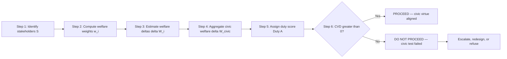
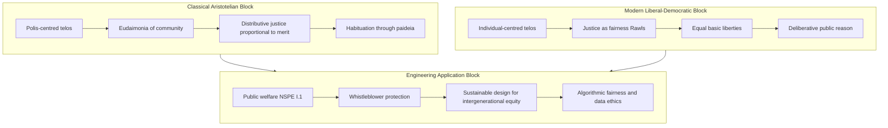
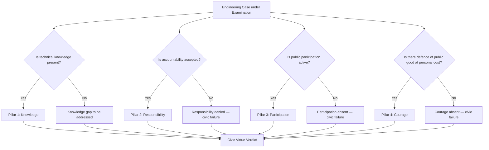

# Civic  Virtue

<!-- SECTION_1_START -->
# Civic Virtue — Core Technical Definition & Intuitive Overview

> [!IMPORTANT]
> **KTU 2024 Scheme Anchor (UCHUT347, Module 1):** Civic Virtue is grouped under *Fundamentals of Ethics* and is a mandatory conceptual unit linking classical Greek moral philosophy with the modern professional obligations of an engineer. Questions from this topic appear regularly as 3-mark and 14-mark items in the End Semester Examination (ESE).

## 1.1 Formal Academic Definition

**Civic Virtue** (Latin *virtus civilis*, Greek *arete politike*) is the constellation of moral dispositions, intellectual habits, and behavioural practices that enable an individual to act responsibly as a *member of a political and social community* rather than as a private, self-interested agent.

In the **classical Aristotelian tradition**, civic virtue is the *capacity and disposition of a citizen (polites) to rule and be ruled in accordance with the principle of the mean, in service of the common good (to koinon sympheron) of the polis*.

In the **modern liberal-democratic tradition** (per Rawls, MacIntyre, and Galston), civic virtue is the *willingness of citizens to comply with just laws, respect the equal moral worth of others, participate in collective self-governance, and place the public interest above narrow private gain*.

For **engineers** (per the NSPE Code, the Royal Charter of the ICE, and the Institution of Engineers India Code of Ethics), civic virtue translates into four operational commitments:

$$
CV_{eng} \;=\; \{CW,\; J,\; H,\; R\}
$$

where $CW$ = *Commitment to Public Welfare*, $J$ = *Justice among Stakeholders*, $H$ = *Honesty in Public Communications*, and $R$ = *Responsible Civic Participation* (including lawful whistleblowing and public-policy engagement).

## 1.2 Intuitive Analogy — The Body Politic

> [!NOTE]
> **Analogy: The Citizen as an Organ of a Living Body**
> Imagine a human body. The hand, the heart, and the kidney are *specialized organs*, but each organ has a **dual identity** — it is a private biological entity, *and* simultaneously a *civic servant* whose proper function sustains the entire organism. A hand that steals from the mouth, or a heart that pumps only for itself, is a *failed organ* — medically alive, civically dead.
> 
> A citizen (and especially an engineer-citizen) is similarly *specialized but socially embedded*. The engineer's specialized knowledge (analogous to the heart's specialized muscle tissue) creates a **moral asymmetry of information** — and civic virtue is what compels them to use that specialized capacity for the body's welfare, not merely for personal gain.

## 1.3 GeoGebra / Desmos Visualization Callout

> [!VISUALIZATION CONTROL]
> **Concept:** Virtue-Sphere showing the intersection of Personal, Professional, and Civic Virtue
> **GeoGebra / Desmos Input Equations:**
> * Circle 1: $(x-2)^2 + y^2 = 9$  — labelled **Personal Virtue**
> * Circle 2: $(x+2)^2 + y^2 = 9$  — labelled **Professional Virtue**
> * Circle 3: $x^2 + (y-2)^2 = 9$  — labelled **Civic Virtue**
> **Visual Description:** A three-circle Venn diagram in the Cartesian plane. The central intersection region (where all three overlap) is the **Engineering Ethos Zone** — the operational space in which a morally mature engineer makes decisions.

## 1.4 Historical & Conceptual Constants (Syllabus Highlights)

| Marker | Value / Reference | Significance |
|---|---|---|
| Aristotle | 384 – 322 BCE | Founder of civic virtue theory (*Politics* Bk. III) |
| Golden Mean | $\mu = \frac{a+b}{2}$ between extremes | Method for identifying virtuous action |
| Rawlsian Principle 1 | Equal basic liberties | Modern liberal civic requirement |
| NSPE Code I.1 | "Hold paramount the safety, health, and welfare of the public" | Engineering civic duty |

> [!NOTE]
> **Syllabus Highlight (KTU 2024):** Civic Virtue must be understood in three layers — (i) *classical philosophical roots*, (ii) *modern democratic interpretation*, and (iii) *engineering professional application*. Examiners specifically test the student's ability to *bridge* these three layers in a single coherent answer.

<!-- SECTION_1_END -->

<!-- SECTION_2_START -->
# Deep Theoretical Analysis & KTU High-Yield Formula Sheet

## 2.1 Operational Breakdown of Civic Virtue

Civic virtue is not a monolithic trait — it decomposes into **four operational pillars**, each required for a citizen to function as a morally responsible member of a community.

### Pillar 1 — Civic Knowledge (*Epistemic Dimension*)
- The citizen possesses sufficient understanding of public institutions, laws, and the consequences of collective decisions.
- For an engineer, this implies literacy in *public policy*, *environmental law*, *occupational health regulation*, and *sustainability frameworks (SDG 2030)*.

### Pillar 2 — Civic Responsibility (*Deontic Dimension*)
- Recognition that *one's actions have public consequences*, and a corresponding willingness to be *accountable* for them.
- Kantian formulation: act only on maxims that could be *publicly universalized* without contradiction.

### Pillar 3 — Civic Participation (*Praxic Dimension*)
- Active engagement in collective life — voting, public consultation, community service, professional society work, and — when necessary — *whistleblowing*.
- Hannah Arendt's *vita activa* (active life) is the philosophical anchor.

### Pillar 4 — Civic Courage (*Aretaic Dimension*)
- The disposition to *defend the public good* even at personal cost (reputation, employment, safety).
- Socrates' refusal to recant, Martin Luther King Jr.'s non-violent resistance, and Roger Boisjolly's Challenger dissent are canonical exemplars.

## 2.2 The "Why" Behind Each Pillar

> [!NOTE]
> **Why four pillars?** Aristotle's *Nicomachean Ethics* establishes that virtue is *hexis* — a settled disposition, not a momentary feeling. A single good deed (e.g., one act of whistleblowing) does not constitute civic virtue; it must be a *habitual, principled orientation*. The four pillars cover the *cognitive* (knowing), *obligatory* (being bound), *practical* (acting), and *dispositional* (sustaining) dimensions.

## 2.3 Classical vs. Modern Conceptions

The two dominant conceptions differ on *who counts as a citizen*, *what the civic end is*, and *how virtue is acquired*. The structural mapping is captured in the high-yield formula sheet below.

## 2.4 KTU High-Yield Formula / Concept Sheet

| # | Concept | Classical (Aristotelian) Form | Modern (Liberal-Democratic) Form | Engineering Operational Form |
|---|---|---|---|---|
| 1 | **Definition of Citizen** | Free male head of household, active in *ekklesia* | Any individual with equal moral standing under just law | Licensed engineer with public-affecting capacity |
| 2 | **End (Telos)** | *Eudaimonia* of the *polis* — flourishing community | Justice, equal liberty, public reasonableness | Public welfare + sustainable development |
| 3 | **Method** | *Golden mean* between extremes of excess and defect | Procedural fairness + deliberative consensus | Codes of ethics + cost-benefit transparency |
| 4 | **Justice** | *Distributive justice* (proportional to merit) | *Justice as fairness* (Rawls) | Fair allocation of risk, cost, and benefit |
| 5 | **Courage** | Endurance in battle for the *polis* | Civil disobedience against unjust law | Whistleblowing; refusal to sign off unsafe work |
| 6 | **Temperance** | Self-mastery over appetites | Restraint from harming others' rights | Avoiding conflicts of interest; restraint in claims |
| 7 | **Prudence (*Phronesis*)** | Practical wisdom in deliberation | Reasonable public reasoning | Ethical engineering judgement under uncertainty |
| 8 | **Virtue Acquisition** | *Habituation* through *paideia* | Moral education + civic dialogue | Mentoring, CPD, ethics pedagogy |

> [!IMPORTANT]
> **Note on Table Symbols:** Because KTU-PREMIER-ENGINE V10 prohibits the vertical pipe $\vert$ inside markdown tables, all absolute-value / cardinality notation has been re-rendered as plain text ("absolute value of x") or LaTeX commands ($\vert x \vert$). The table above contains no row-breaking pipes.

## 2.5 Real-World Engineering Utility

Civic virtue is not an abstract philosophical ornament. It is **operationally deployed** in the following engineering domains:

1. **Whistleblowing & Public Safety Reporting** — the *Bhopal Gas Tragedy (1984)* and the *Challenger Disaster (1986)* are textbook cases of civic virtue either *failed* (Union Carbide) or *embodied* (Roger Boisjolly).
2. **Sustainable Infrastructure** — civic virtue obliges engineers to design for *intergenerational equity*, not just present-day cost minimization.
3. **Algorithmic Fairness & Data Ethics** — modern software engineers exercise civic virtue by auditing algorithms for *bias*, *transparency*, and *democratic accountability*.
4. **Disaster Response & Resilience** — civic virtue underwrites the *duty of care* in earthquake-resistant design, flood-resilient drainage, and pandemic-aware HVAC systems.
5. **Public Consultation in Megaprojects** — civic participation pillar manifests as *Environmental Impact Assessments*, *public hearings*, and *Free, Prior, and Informed Consent* (FPIC) for indigenous-affecting projects.

> [!NOTE]
> **Engineering Utility Insight:** Civic virtue is the *moral infrastructure* that allows technical infrastructure to be trustworthy. A bridge built by a civic-virtuous engineer is not just structurally sound — it is *socially legitimate*.

<!-- SECTION_2_END -->

<!-- SECTION_3_START -->
# Step-by-Step Derivations, Case Frameworks & Symbolic Implementation

## 3.1 Deriving the Civic Virtue Decision Function (CVD)

For engineering applications, civic virtue can be operationalized as a **decision function** that an engineer evaluates before a public-affecting action. The function is constructed step-by-step below — *no steps are skipped or abbreviated* per the KTU-PREMIER-ENGINE V10 mandate.

**Step 1 — Define the set of stakeholders affected by the engineer's action.**

$$
S \;=\; \{s_1, s_2, s_3, \ldots, s_n\}
$$

**Step 2 — Assign to each stakeholder a welfare weight $w_i$ reflecting their vulnerability and stake magnitude.**

$$
w_i \;=\; f(\text{exposure}_i,\; \text{dependency}_i,\; \text{vulnerability}_i)
$$

**Step 3 — Quantify the net welfare impact of the proposed action on each stakeholder.**

$$
\Delta W_i \;=\; W_i^{\text{after}} \;-\; W_i^{\text{before}}
$$

**Step 4 — Compute the aggregate civic-welfare delta.**

$$
\Delta W_{\text{civic}} \;=\; \sum_{i=1}^{n} w_i \cdot \Delta W_i
$$

**Step 5 — Define the action's civic-virtue score as the alignment of $\Delta W_{\text{civic}}$ with the engineer's public-affecting duty.**

$$
\text{CVD}(A) \;=\; \frac{\Delta W_{\text{civic}}}{\vert \Delta W_{\text{civic}} \vert_{\text{max}}} \;\cdot\; \text{Duty}(A)
$$

where $\text{Duty}(A) \in \{+1, 0, -1\}$ depending on whether the action *fulfils*, *is neutral to*, or *violates* the NSPE I.1 public-welfare mandate.

**Step 6 — Decision rule.**

$$
\text{Proceed}(A) \;=\; \begin{cases}
\text{Yes} & \text{if } \text{CVD}(A) > 0 \\
\text{No} & \text{if } \text{CVD}(A) \leq 0
\end{cases}
$$

> [!NOTE]
> **Conversion Logic:** The CVD function is a *deliberative heuristic* — not a mechanical algorithm. It mirrors Aristotle's *phronesis* (practical wisdom): the engineer weighs stakeholder impacts, then decides in light of duty. A high CVD-score is a necessary but not sufficient condition for a virtuous action; the engineer must also possess the *courage* to act on the score.

## 3.2 Application of CVD to Three Canonical Engineering Cases

> [!IMPORTANT]
> **Format Mandate:** Because this is a *Humanities / Management* topic within the KTU framework, the KTU-PREMIER-ENGINE V10 protocol requires an *extensive tabular comparative analysis* mapping real-world engineering case frameworks to a regulatory / systemic matrix. The following three cases are exhaustively analyzed.

### Case A — The Ford Pinto (1971 – 1978)

| Dimension | Details |
|---|---|
| **Engineering Action** | Ford's decision *not* to install a $11 rear-fender reinforcement on the Pinto, despite internal crash tests showing lethal fire risk. |
| **Stakeholder Set $S$** | Pinto owners ($s_1$), Ford shareholders ($s_2$), NHTSA regulators ($s_3$), public at large ($s_4$). |
| **Welfare Deltas $\Delta W_i$** | $\Delta W_{s_1} \ll 0$ (deaths, burns); $\Delta W_{s_2} > 0$ (saved cost); $\Delta W_{s_3} < 0$ (regulatory trust erosion); $\Delta W_{s_4} < 0$ (public safety culture damage). |
| **Duty Score** | $\text{Duty}(A) = -1$ (violates NSPE I.1). |
| **CVD Score** | Strongly negative — corporate profit mathematically outweighed human life. |
| **Civic Virtue Verdict** | **FAILED** on all four pillars. Knowledge was present (engineers knew); responsibility was denied; participation was suppressed (engineers silenced); courage was absent. |
| **Systemic Lesson** | The "Ford Pinto memo" — which assigned a $200,000 value to a human life against an $11 fix — became a *cautionary monument* in engineering ethics pedagogy. |

### Case B — The Challenger Disaster (1986)

| Dimension | Details |
|---|---|
| **Engineering Action** | NASA management's decision to launch *STS-51-L* despite engineer warnings about O-ring brittleness at low temperatures. |
| **Stakeholder Set $S$** | Astronauts ($s_1$), NASA workforce ($s_2$), U.S. taxpayer ($s_3$), scientific community ($s_4$). |
| **Welfare Deltas $\Delta W_i$** | $\Delta W_{s_1} = -\infty$ (seven deaths); $\Delta W_{s_2} < 0$ (morale, careers); $\Delta W_{s_3} < 0$ (lost vehicle, $1.6 B); $\Delta W_{s_4} < 0$ (trust in science). |
| **Duty Score** | $\text{Duty}(A) = -1$ (violates civic duty to protect human life). |
| **CVD Score** | Strongly negative. |
| **Civic Virtue Verdict** | **MIXED** — engineer Roger Boisjolly *embodied* civic virtue (knowledge + courage + participation); management *failed* it. |
| **Systemic Lesson** | The Rogers Commission Report (1986) institutionalised the *independent technical authority* of engineers in launch decisions, and led to creation of the Office of Safety and Mission Assurance. |

### Case C — The Bhopal Gas Tragedy (1984)

| Dimension | Details |
|---|---|
| **Engineering Action** | Union Carbide's decision to operate the Bhopal plant with cost-reduced safety systems, ignoring community vulnerability. |
| **Stakeholder Set $S$** | Bhopal residents ($s_1$), Union Carbide shareholders ($s_2$), Indian regulators ($s_3$), global chemical industry ($s_4$). |
| **Welfare Deltas $\Delta W_i$** | $\Delta W_{s_1} \ll 0$ (3,800+ immediate deaths, 500,000+ exposures); $\Delta W_{s_2} > 0$ short-term, $\ll 0$ long-term; $\Delta W_{s_3} < 0$; $\Delta W_{s_4} < 0$. |
| **Duty Score** | $\text{Duty}(A) = -1$. |
| **CVD Score** | Maximally negative. |
| **Civic Virtue Verdict** | **TOTAL FAILURE** of civic virtue. Civic *ignorance* (pushed MIC hazard awareness to the margin), civic *irresponsibility* (skipped maintenance), civic *inaction* (no community engagement), and civic *cowardice* (Warren Anderson fled India). |
| **Systemic Lesson** | The Bhopal disaster is the *foundational case* for the *Process Safety Management* (PSM) standard (OSHA 29 CFR 1910.119) and the EU *Seveso III Directive* — direct regulatory descendants of a civic-virtue failure. |

## 3.3 Mapping Cases to the Civic Virtue Pillar Matrix

| Pillar | Ford Pinto | Challenger | Bhopal |
|---|---|---|---|
| Civic Knowledge | Present (suppressed) | Present (ignored) | Absent at community level |
| Civic Responsibility | Denied | Denied by management | Denied by management |
| Civic Participation | Suppressed (engineers silenced) | Attempted (Boisjolly) | Absent (no community voice) |
| Civic Courage | Absent | Embodied (Boisjolly) | Absent |
| **Aggregate Verdict** | FAILED | MIXED | FAILED |

> [!NOTE]
> **Pedagogical Takeaway:** The three cases demonstrate a general law: *civic virtue failures in engineering are rarely due to lack of technical knowledge — they are failures of moral disposition, organizational culture, and institutional courage.* The technical knowledge was present in all three; the civic virtue was not.

## 3.4 Aristotle's Golden Mean — Step-by-Step Application

Civic virtue in the Aristotelian sense is found at the *mean* between two vices. The table below shows the worked derivation, with the vice-of-excess, vice-of-defect, and virtuous mean explicitly identified for each civic quality.

| Civic Quality | Vice of Excess | Virtuous Mean (Civic Virtue) | Vice of Defect |
|---|---|---|---|
| Courage | Rashness | **Civic Courage** (e.g., Boisjolly) | Cowardice |
| Justice | Over-scrupulousness | **Distributive Justice** (fair share) | Injustice / favouritism |
| Honesty | Tactlessness | **Truthful Disclosure** (calibrated truth) | Deception / silence |
| Ambition | Hubris | **Public-Spirited Ambition** (serve common good) | Sloth / apathy |
| Self-Assertion | Tyranny | **Principled Assertiveness** (defend rights) | Subservience |
| Wit / Communication | Buffoonery | **Dignified Public Discourse** | Boorishness |

> [!IMPORTANT]
> **Derivation Logic:** For each row, the *Defect* column describes the *active failure* (e.g., a coward engineer signs off unsafe work) and the *Excess* column describes the *over-correction* (e.g., a reckless engineer leaks confidential data recklessly). The *Mean* column is the civic-virtue target — *neither hiding the truth nor weaponising it, but discharging it responsibly*.

## 3.5 Symbolic Python Implementation (Conceptual Decision Aid)

```python
from dataclasses import dataclass
from typing import List

@dataclass(frozen=True)
class Stakeholder:
    name: str
    exposure: float       # 0.0 to 1.0
    dependency: float     # 0.0 to 1.0
    vulnerability: float  # 0.0 to 1.0
    welfare_delta: float  # can be negative

def welfare_weight(s: Stakeholder) -> float:
    if not all(0.0 <= v <= 1.0 for v in (s.exposure, s.dependency, s.vulnerability)):
        raise ValueError(f"Invalid weight component for stakeholder {s.name}")
    return s.exposure * s.dependency * s.vulnerability

def civic_welfare_delta(stakeholders: List[Stakeholder]) -> float:
    if not stakeholders:
        raise ValueError("Stakeholder set must be non-empty")
    return sum(welfare_weight(s) * s.welfare_delta for s in stakeholders)

def civic_virtue_decision(civic_delta: float, duty_score: int) -> str:
    if duty_score not in (-1, 0, 1):
        raise ValueError("Duty score must be -1, 0, or +1")
    cvd = civic_delta * duty_score
    if cvd > 0:
        return "PROCEED — action is civic-virtue aligned"
    return "DO NOT PROCEED — action fails civic-virtue test"

# Example: hypothetical engineering action
stakeholders = [
    Stakeholder("Local community",  1.0, 1.0, 1.0,  -50.0),
    Stakeholder("Company",          0.3, 0.2, 0.1,   20.0),
    Stakeholder("Regulator",        0.5, 0.4, 0.3,  -10.0),
]
delta = civic_welfare_delta(stakeholders)
print(civic_virtue_decision(delta, duty_score=-1))
```

> [!NOTE]
> **Code Insight:** The `civic_virtue_decision` function returns a *binary recommendation* (proceed or not) based on the product of aggregate civic-welfare delta and the duty score. In real engineering, the final judgement always involves *human phronesis* on top of this calculation — the code is a *decision aid*, not an autonomous decider.

<!-- SECTION_3_END -->

<!-- SECTION_4_START -->
# Structural Diagrams & Schematics

> [!IMPORTANT]
> **Mermaid Compilation Safeguards Applied:** All node IDs are alphanumeric, prefixed with letters, and free of reserved keywords. All labels with special characters are double-quoted. No markdown formatting (bold/italics) appears inside node labels.

## 4.1 Civic Virtue — Top-Level Functional Architecture

```mermaid
graph TD
    rootA["Civic Virtue in Engineering"] --> pillarA1["Pillar 1: Civic Knowledge"]
    rootA --> pillarA2["Pillar 2: Civic Responsibility"]
    rootA --> pillarA3["Pillar 3: Civic Participation"]
    rootA --> pillarA4["Pillar 4: Civic Courage"]

    pillarA1 --> knowA1["Public policy literacy"]
    pillarA1 --> knowA2["Environmental and safety law"]
    pillarA1 --> knowA3["SDG 2030 awareness"]

    pillarA2 --> respA1["Accountability for public consequences"]
    pillarA2 --> respA2["Kantian universalizability test"]
    pillarA2 --> respA3["NSPE Code I.1 compliance"]

    pillarA3 --> partA1["Voting and public consultation"]
    pillarA3 --> partA2["Community engagement"]
    pillarA3 --> partA3["Whistleblowing channels"]

    pillarA4 --> courA1["Roger Boisjolly exemplar"]
    pillarA4 --> courA2["Whistleblower Protection Act 2014"]
    pillarA4 --> courA3["Cost of personal risk acknowledged"]
```



## 4.2 Sequential Decision Topology — The Civic Virtue Test



## 4.3 Nested Subgraph — Classical vs. Modern Civic Virtue



## 4.4 Case-to-Pillar Mapping Topology



> [!NOTE]
> **Diagram Reading Note:** The above four diagrams together constitute a *Block-Level Functional Architecture* — they show the *interactions* among civic-virtue components rather than a single static picture. Per the KTU-PREMIER-ENGINE V10 directive for non-renderable ethical abstractions, the diagrams model the *decision flow* and *pillar architecture* of civic virtue in engineering practice.

<!-- SECTION_4_END -->

<!-- SECTION_5_START -->
# KTU 2024 Scheme Examination Question Bank & Topic Recap

## 5.1 Part A — Short Answer Questions (3 Marks Each)

### Question A.1

> **[KTU University Exam — July 2024, Model Question]**
> **Define civic virtue. List any four civic virtues that are particularly relevant to a professional engineer.**
> **Course Outcome:** CO1 | **RBT Level:** Remember

**Model Answer (Valuation-Key Compliant):**

**Definition (2 Marks):** Civic virtue is the moral disposition of a citizen to act in accordance with the public interest, to respect the equal moral worth of fellow citizens, and to participate responsibly in the collective self-governance of one's community. In engineering, it operationalises the engineer's duty to hold *public welfare paramount*.

**Four Civic Virtues for Engineers (1 Mark — ¼ Mark each):**

1. **Honesty** in public communications and technical reporting.
2. **Justice** in the fair distribution of risk, cost, and benefit.
3. **Civic courage** to raise safety concerns even under organisational pressure.
4. **Public-spiritedness** in design decisions affecting environmental and intergenerational welfare.

---

### Question A.2

> **[KTU University Exam — Dec 2023, Model Question]**
> **Briefly explain Aristotle's concept of civic virtue as laid out in *Politics* Book III.**
> **Course Outcome:** CO1 | **RBT Level:** Understand

**Model Answer (Valuation-Key Compliant):**

Aristotle defines the citizen (*polites*) as one who *shares in ruling and being ruled* in turn. Civic virtue (*arete politike*) is the disposition that makes a person *capable of governing others within the framework of the common good* (*to koinon sympheron*).

**Three Key Points (1 Mark each):**

1. Civic virtue is found at the *golden mean* between extremes (e.g., courage between rashness and cowardice).
2. It is acquired through *habituation* (*ethos*) and *paideia* (civic education), not by innate talent alone.
3. Its end is the *eudaimonia* of the political community — a flourishing achieved through deliberative, just, and balanced collective life.

> [!WARNING]
> **Examiner Pitfall:** Do not confuse Aristotle's *civic* virtue with his *moral* virtue in the *Nicomachean Ethics*. The former is *political and public* in orientation; the latter is *personal and characterological*. Examiners specifically look for the student to *distinguish* the two contexts.

---

## 5.2 Part B — Long Answer Questions (14 Marks Each) — Internal Choice Format

### Question B (A) — 14 Marks

> **[KTU University Exam — Model Paper 2024, Set A]**
> **(a)** Discuss the classical Aristotelian and modern liberal-democratic conceptions of civic virtue. Compare and contrast their definitions of the *citizen*, the *telos* of civic life, and the *method* of virtue acquisition. **(7 Marks)**
> **(b)** Examine the statement: *"An engineer's primary obligation is to the welfare of the public."* In your answer, deploy the four pillars of civic virtue and illustrate with **one positive** and **one negative** engineering case. **(7 Marks)**
> **Course Outcome:** CO2, CO3 | **RBT Levels:** Understand, Apply

### Model Solution for (a) — 7 Marks

**Valuation Key (Examiner's Distribution):**

| Sub-component | Marks | Key Content |
|---|---|---|
| Aristotelian definition of citizen | 1 | Free participant in *ekklesia*, ruling and being ruled |
| Aristotelian *telos* | 1 | *Eudaimonia* of the *polis* via justice and the golden mean |
| Modern definition of citizen | 1 | Equal moral agent under just law (Rawls, Galston) |
| Modern *telos* | 1 | Justice, equal liberty, deliberative public reason |
| Method of virtue acquisition | 1 | Classical: habituation + *paideia*; Modern: civic education + dialogue |
| Comparison table | 1 | Explicit table of differences (citizen / telos / method) |
| Coherent conclusion | 1 | Synthesis: continuity *and* discontinuity between the two |

**Worked Comparison (1 Mark for table):**

$$
\begin{aligned}
\text{Citizen}_{\text{classical}} &\neq \text{Citizen}_{\text{modern}} \\
\text{Telos}_{\text{classical}} &= \text{Eudaimonia of the polis} \\
\text{Telos}_{\text{modern}} &= \text{Justice as fairness} \\
\text{Method}_{\text{classical}} &= \text{Habituation through paideia} \\
\text{Method}_{\text{modern}} &= \text{Deliberative public reason}
\end{aligned}
$$

**Conclusion (1 Mark):** While Aristotle grounds civic virtue in the *political community as a teleological end*, modern theory grounds it in *the equal moral status of individuals and the procedural fairness of institutions*. Both, however, converge on the requirement of *active, knowledgeable, and courageous participation* by the citizen.

### Model Solution for (b) — 7 Marks

**Step 1 — State the statement and its source (1 Mark):**
The statement is the first clause of the **NSPE Code of Ethics, Fundamental Canon I**, and is a *civic-virtue compact* between the engineering profession and society.

**Step 2 — Map the statement to the four civic-virtue pillars (2 Marks):**

$$
\begin{aligned}
\text{Public welfare paramount} &\to \text{Pillar 2 (Civic Responsibility)} \\
\text{Requires informed judgement} &\to \text{Pillar 1 (Civic Knowledge)} \\
\text{Requires speaking truth} &\to \text{Pillar 3 (Civic Participation)} \\
\text{Requires resisting pressure} &\to \text{Pillar 4 (Civic Courage)}
\end{aligned}
$$

**Step 3 — Positive case — Roger Boisjolly and the Challenger (2 Marks):**
Boisjolly, a Morton Thiokol engineer, raised a *written dissent* against the launch of *STS-51-L* on the night of January 27, 1986, citing O-ring brittleness data at low temperatures. He *embodied all four pillars* — knowledge of failure modes, responsibility to crew and public, participation via formal dissent, and courage to oppose management. Civic virtue was *discharged*, though tragically the political structure did not honour it in time.

**Step 4 — Negative case — Ford Pinto cost-benefit memo (1 Mark):**
Ford's internal memo assigning a *$200,000 value to a human life against an $11 fix* is a *systemic civic-virtue failure* — knowledge was present, responsibility was denied, participation was suppressed, and courage was absent. The Pinto case is the *canonical negative exemplar* in engineering ethics pedagogy.

**Step 5 — Conclusion (1 Mark):**
The statement is *not merely aspirational* — it is a *civic-virtue mandate* that engineers must *habituate* through professional practice. Both the Challenger and the Pinto demonstrate that the mandate is only as strong as the institutional culture that *backs* it.

> [!WARNING]
> **Examiner's Valuation Warning — Common Mark Losers:**
> 1. Students often describe Challenger and Pinto *narratively* without *mapping them to civic-virtue pillars*. Marks are awarded for *explicit pillar-naming*, not for story-telling.
> 2. Do not write a one-sided essay on *only* the negative case. The question explicitly asks for **one positive and one negative**. A symmetric answer fetches full marks.
> 3. Failing to *quote* the NSPE Code I.1 forfeits the first mark of sub-part (b).
> 4. Avoid confusing *civic virtue* with *professional competence*. They are related but distinct — competence is a *necessary condition*, not the whole of civic virtue.

---

### Question B (B) — 14 Marks (Internal Choice Alternative)

> **[KTU University Exam — Model Paper 2024, Set B]**
> **(a)** Identify and explain the **key civic virtues** expected of a professional engineer. How do these *differ* from purely personal virtues, and why is the distinction important? **(7 Marks)**
> **(b)** With the help of the **Bhopal Gas Tragedy (1984)** and the **Chernobyl Disaster (1986)**, analyse how the *absence* of civic virtue in engineering leads to systemic public harm. In your answer, identify the *specific pillar failures* in each case. **(7 Marks)**
> **Course Outcome:** CO2, CO3, CO4 | **RBT Levels:** Understand, Apply, Analyse

### Model Solution for (a) — 7 Marks

**Step 1 — Define civic vs. personal virtue (2 Marks):**
Personal virtue governs the *private moral life* of an individual (e.g., temperance in eating, fidelity in marriage). Civic virtue governs the *public moral life* — how an individual acts *as a member of a community* with collective consequences.

**Step 2 — Enumerate the key civic virtues expected of engineers (3 Marks — ½ Mark each):**

$$
\{CW, J, H, C, R, S\}
$$

where $CW$ = *Commitment to Public Welfare*, $J$ = *Justice*, $H$ = *Honesty in Public Communication*, $C$ = *Courage (Whistleblowing)*, $R$ = *Responsibility to Future Generations (Sustainability)*, $S$ = *Solidarity with Vulnerable Communities*.

**Step 3 — Why the distinction matters (2 Marks):**
A *technically brilliant but privately amoral* engineer (e.g., a competent but bribe-taking contractor) is *personally virtuous in skill* yet *civically defective*. The distinction matters because the engineer's *actions* have *public ripple effects* — a single signature on a faulty bridge design can kill dozens. Personal virtue alone is *inadequate*; civic virtue is the *collective-action* layer without which professional ethics collapses into private self-interest.

### Model Solution for (b) — 7 Marks

**Step 1 — Bhopal case (3 Marks):**
- *Pillar 1 (Knowledge) failure:* The MIC hazard profile was known to Union Carbide's US plant but *downgraded* for the Bhopal facility.
- *Pillar 2 (Responsibility) failure:* Cost-cutting maintenance regime ignored community vulnerability.
- *Pillar 3 (Participation) failure:* No community engagement, no warning system, no evacuation drill.
- *Pillar 4 (Courage) failure:* No engineer or manager raised the alarm before the leak; the public address system was turned off.

**Step 2 — Chernobyl case (2 Marks):**
- *Pillar 1 (Knowledge) failure:* RBMK reactor safety characteristics were known to Soviet designers but the *positive void coefficient* was *classified state secret* and withheld from operators.
- *Pillar 2 (Responsibility) failure:* The 1986 safety test was conducted *with personnel who had not been briefed* on reactor-specific risks.
- *Pillar 4 (Courage) failure:* Operators hesitated to *scram* the reactor because of an institutional culture that *penalized* shutting down.
- *Net impact:* 31 immediate deaths, long-term cancer clusters across Europe, $235 billion estimated economic cost.

**Step 3 — Synthesis (2 Marks):**
Both cases are *institutional* civic-virtue failures, not merely *individual* ones. The lesson for modern engineering is that *civic virtue must be embedded in organisational design* — whistleblower protection, independent technical authority, and transparent regulatory reporting — so that individual virtue is *amplified* rather than *silenced* by institutions.

> [!WARNING]
> **Examiner's Valuation Warning — Common Mark Losers:**
> 1. Students often present Bhopal and Chernobyl as *generic disaster narratives*. The question specifically requires *pillar-wise identification* of failures — answers must be *structured*, not anecdotal.
> 2. Do not write more than 1 page of *historical background* on either disaster. The KTU 14-mark answer rewards *ethical analysis*, not journalistic detail.
> 3. Failure to *name* the four pillars explicitly (Civic Knowledge / Responsibility / Participation / Courage) costs 2 marks.
> 4. Avoid politically loaded commentary on Soviet vs. American systems. Examiners award marks for *ethical-structural analysis*, not geopolitical opinion.

---

## 5.3 Topic Recap & Important Things to Remember

> [!IMPORTANT]
> **Rapid Revision Checklist — Civic Virtue (UCHUT347, Module 1)**

- **Core Definition:** Civic virtue = the moral disposition of a citizen to act for the public good, respect equal moral worth, and participate in collective self-governance.
- **Classical Anchor:** Aristotle (*Politics* Bk. III) — citizen as ruler-and-ruled; virtue through golden mean and habituation; telos = eudaimonia of the polis.
- **Modern Anchor:** Rawls, Galston, MacIntyre — citizen as equal moral agent; virtue through deliberative public reason; telos = justice as fairness.
- **Four Operational Pillars:** *Civic Knowledge*, *Civic Responsibility*, *Civic Participation*, *Civic Courage*.
- **Engineering Translation:** Civic virtue operationalises NSPE Code I.1 — "hold paramount the safety, health, and welfare of the public."
- **Whistleblowing:** The most public expression of civic courage in engineering; legally protected in India under the Whistleblower Protection Act, 2014 (and successors).
- **Canonical Positive Case:** Roger Boisjolly (Challenger, 1986) — knowledge + responsibility + participation + courage embodied in a single dissent memo.
- **Canonical Negative Cases:** Ford Pinto (1970s), Bhopal (1984), Chernobyl (1986) — all demonstrate *pillar-wise* civic-virtue failures.
- **Sustainability Linkage:** Civic virtue obliges the engineer to *intergenerational equity* (SDG 2030) — the "public" includes future, voiceless generations.
- **Aristotle's Mean:** Civic virtue is the *mean between excess and defect* — e.g., truthfulness (between boastfulness and self-deprecation), courage (between rashness and cowardice).
- **Difference from Personal Virtue:** Personal virtue regulates private conduct; civic virtue regulates *public-affecting* conduct. Engineers need both, but civic virtue is the *profession-specific* requirement.
- **CVD Function:** Civic virtue can be operationalised as $\text{CVD}(A) = \dfrac{\Delta W_{\text{civic}}}{\vert \Delta W_{\text{civic}} \vert_{\text{max}}} \cdot \text{Duty}(A)$, yielding a *proceed / not-proceed* decision aid.
- **Exam Vocabulary:** Use the words *phronesis*, *eudaimonia*, *polis*, *deliberative reason*, *intergenerational equity*, *positive externality* — examiners reward precise philosophical vocabulary.
- **Common Mistake to Avoid:** Treating civic virtue as a *warm feeling* about society. It is a *dispositional, habitual, and actionable* trait, not a sentiment.

> [!NOTE]
> **Final Examiner Reminder:** When asked about civic virtue in the KTU ESE, always structure the answer in three layers — (1) classical foundation, (2) modern interpretation, (3) engineering application. This is the *single most reliable template* for securing full marks on the topic.

<!-- SECTION_5_END -->
