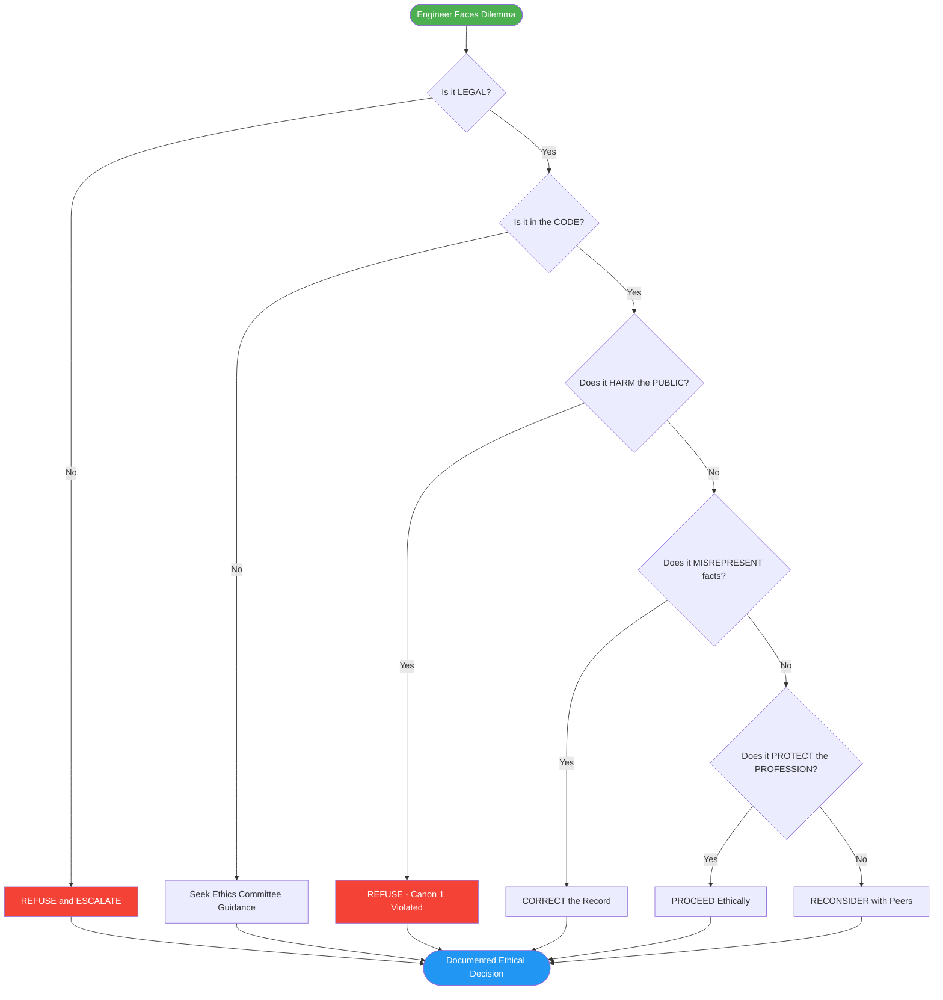
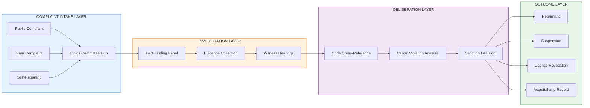
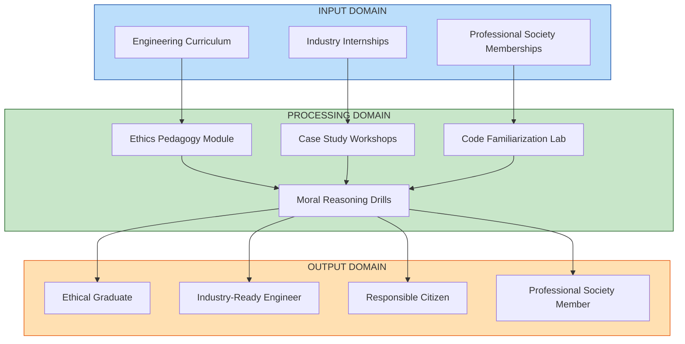

# Codes of Ethics .

<!-- SECTION_1_START -->
# 1. Core Technical Definition & Intuitive Overview

## Formal Academic Definition (KTU 2024 Syllabus Aligned)

> [!NOTE]
> **Codes of Ethics** are formally documented, written sets of **principles, standards, and rules of professional conduct** that members of a profession (such as engineers, doctors, or lawyers) voluntarily commit to follow. They translate abstract moral philosophy into **actionable, profession-specific guidelines** that govern decision-making, peer accountability, and public service.

A Code of Ethics is the operational bridge between **moral philosophy** (what *ought* to be) and **professional practice** (what *is* done). According to the **KTU 2024 Scheme syllabus for UCHUT347**, a code of ethics is studied as a normative instrument that:

1. Defines the **identity and purpose** of a profession.
2. Establishes **trust** between the profession and society.
3. Provides **decision-support tools** when professionals face moral dilemmas.
4. Acts as a **yardstick** for disciplinary action and peer review.

> [!IMPORTANT]
> **Key Terminology Distinction (High-Yield for KTU):**
> - **Code of Ethics** $\rightarrow$ Broad *moral principles* and *ideals* (e.g., honesty, public welfare).
> - **Code of Conduct** $\rightarrow$ Specific *rules of behavior* and *procedures* (e.g., dress code, billing transparency).
> - **Code of Practice** $\rightarrow$ Technical and procedural *standards* (e.g., IEEE 802.11 Wi-Fi standard).
> The three often overlap in professional life, but **Ethics $\supseteq$ Conduct $\supseteq$ Practice** in scope.

---

## Conceptual Analogy / Intuition

Think of a Code of Ethics as the **"Hippocratic Oath of Engineering."**

Just as medical graduates pledge to *"first, do no harm,"* engineering graduates across the world subscribe to codes that pledge to *"hold paramount the safety, health, and welfare of the public."*

**A real-world analogy — The Highway Traffic Code:**
- The Code of Ethics is to engineers what the **traffic rules** are to drivers.
- You do not crash into a pedestrian because the law *forbids* it; you do so because of a deeper *ethical duty* to preserve life. The Code reminds you of that duty when business pressure tempts you otherwise.
- If a driver runs a red light, the police enforce the rule. Similarly, professional societies enforce codes through **disciplinary committees** that may revoke licenses or memberships.

> [!TIP]
> **For KTU viva & 3-mark questions**, remember this single-line answer:
> *"A Code of Ethics is a profession's public commitment to serve society with integrity, competence, and responsibility."*

---

## Why Engineering Codes of Ethics Are Needed — The Three Pillars

| Pillar | Meaning | Engineering Implication |
|---|---|---|
| **Public Trust** | Society grants professions autonomy in exchange for self-regulation. | Engineers design bridges, software, and power grids that the public cannot evaluate internally. |
| **Moral Autonomy** | Professionals have independent judgment in technical decisions. | A junior engineer must have the *ethical right* to refuse a hazardous design ordered by a manager. |
| **Accountability** | Professionals must answer for the consequences of their work. | After disasters (Bhopal 1984, Boeing 737 MAX 2019), codes help locate responsibility. |

> [!WARNING]
> **KTU Common Mistake:** Students often write *"A code of ethics is a law passed by Parliament."* This is **incorrect**. Codes are **voluntary**, issued by **professional societies** (e.g., IEEE, NSPE, ACM, IEI), not governments. Legal violation is **unlawful**; ethical violation is **unprofessional**.

---

## Visualization Note (Concept Map)

> [!VISUALIZATION CONTROL]
> **Concept:** Hierarchical map of *Why a Code of Ethics Exists* — showing the relationship from social contract $\rightarrow$ professional identity $\rightarrow$ code of ethics $\rightarrow$ public welfare.
> **GeoGebra / Desmos Input Equations:** *(Not a numerical plot — use as a labeled concept tree in your notebook)*
> - Root Node: $V_0 = \text{Public Welfare}$
> - Branch 1: $V_1 = \text{Social Contract with Profession}$
> - Branch 2: $V_2 = \text{Code of Ethics}$
> - Leaf 1: $L_1 = \text{Principle of Honesty}$
> - Leaf 2: $L_2 = \text{Principle of Public Safety}$
> - Leaf 3: $L_3 = \text{Principle of Competence}$
> **Visual Description:** Draw a downward tree. Each level narrows the abstract goal into a concrete obligation. The student should observe that all leaves converge back to the root — every code rule ultimately serves $V_0$.

---
<!-- SECTION_1_END -->

<!-- SECTION_2_START -->
# 2. Deep Theoretical Analysis & KTU High-Yield Formula Sheet

## 2.1 Philosophical Foundations of Codes

The legitimacy of any Code of Ethics rests on three philosophical pillars — frequently asked in KTU 14-mark questions:

1. **Deontological Foundation (Duty Ethics — Immanuel Kant)**
   - An action is ethical if it follows a **universalizable maxim**.
   - The Code lists duties (e.g., *do not misrepresent qualifications*) that hold regardless of consequences.

2. **Utilitarian Foundation (Consequence Ethics — John Stuart Mill)**
   - An action is ethical if it produces the **greatest good for the greatest number**.
   - The Code's emphasis on *public welfare* is utilitarian in spirit.

3. **Virtue Ethics (Aristotle)**
   - Ethical behavior flows from the **character** of the professional — *honesty, courage, justice*.
   - The Code is a checklist that *cultivates* these virtues over a career.

> [!NOTE]
> **KTU Quick-Recall:** When asked *"Which philosophy does the IEEE Code reflect most strongly?"* — answer: **A blend of deontology (rules) and virtue ethics (character)**, with utilitarian overtones (public welfare).

---

## 2.2 Universal Structure of a Professional Code

While each society's code differs, the **anatomy** of a Code of Ethics is remarkably consistent. Memorize the following four-part structure — it directly fetches **2–3 marks** in any 14-mark KTU question on codes.

| Part | Name | Function | Example (IEEE) |
|---|---|---|---|
| **I** | **Preamble** | States the *mission* and *scope* of the profession. | *"We, the members of IEEE, recognize the importance of our technologies…"* |
| **II** | **Fundamental Canons / Principles** | The **core values** (usually 5–10 short statements). | *"1. Hold paramount the safety, health, and welfare of the public."* |
| **III** | **Rules of Practice** | Specific *behavioral obligations* that implement the canons. | *"2.1 Accept responsibility for technical decisions."* |
| **IV** | **Professional Obligations** | Duties toward *colleagues, employers, and the profession itself*. | *"7. Treat fairly all persons regardless of race, religion, gender…"* |

> [!IMPORTANT]
> **Mnemonic — "PRFP"**: **P**reamble $\rightarrow$ **R**ules of Practice $\rightarrow$ **F**undamental Canons $\rightarrow$ **P**rofessional Obligations. Use this in the exam to remember all four parts.

---

## 2.3 The KTU High-Yield Formula Sheet

> [!NOTE]
> Although ethics is qualitative, KTU examiners love **formula-like summary tables**. The following *declarative formulae* are high-yield:

$$
\boxed{
\text{Ethical Decision} = f(\text{Canon},\ \text{Context},\ \text{Consequence})
}
$$

$$
\boxed{
\text{Code Effectiveness} = \frac{\text{Adherence} \times \text{Enforcement}}{\text{Ambiguity} + \text{Cultural Drift}}
}
$$

$$
\boxed{
\text{Professional Identity} = \text{Knowledge} \cup \text{Skill} \cup \text{Ethics}
}
$$

### 2.3.1 Comparative Code of Ethics Table (For 14-mark Application Questions)

| Dimension | **NSPE Code (USA, 1947)** | **IEEE Code (Global, 1912 rev.)** | **ACM Code (Computing)** | **Engineers Without Borders (EWB)** |
|---|---|---|---|---|
| **Lead Canon** | *"Hold paramount the safety, health, welfare of the public."* | Identical to NSPE in spirit. | *"Avoid harm to others, users, and the public."* | *"Recognise the importance of understanding the communities we serve."* |
| **Focus Domain** | Traditional engineering (civil, mech, elec). | Electrical, electronics, computer, IT. | Software, computing, IT. | Development, sustainability, humanitarian engineering. |
| **Enforcement Body** | State licensing boards (can revoke PE license). | IEEE Board of Directors ethics committee. | ACM Membership Board. | Voluntary pledge; project-level peer review. |
| **Number of Canons** | **6** Fundamental Canons. | **10** core principles. | **24** principles across 4 sections. | 5–7 guiding principles. |
| **Special Emphasis** | Whistle-blower protection, conflict of interest disclosure. | Technical competence, patent honesty. | Privacy, intellectual property, accessibility. | Cultural sensitivity, environmental sustainability. |
| **Cultural Bias** | Western, individualist. | Western, technocratic. | Global digital ethics. | Globally inclusive, post-colonial aware. |

> [!WARNING]
> **Table-Syntax Rule Applied:** All *OR* and *division* symbols have been replaced by words ("or", "divided by") to avoid breaking the markdown pipe structure. Use $\text{or}$ in LaTeX when required.

---

## 2.4 Six Functions of a Code of Ethics (Most-Tested Concept in KTU)

A Code of Ethics serves **six mutually reinforcing purposes**:

1. **Inspirational** — Sets aspirational ideals that elevate the profession.
2. **Supportive** — Provides moral authority to a junior refusing unethical orders.
3. **Educational** — Trains students and young professionals in ethical reasoning.
4. **Regulatory** — Forms the basis for disciplinary action by professional bodies.
5. **Reputation-Building** — Communicates the profession's values to the public.
6. **Deterrent** — Discourages misconduct by signalling zero-tolerance.

> [!TIP]
> **KTU 3-Mark Favourite:** *"List any four functions of a code of ethics."* Memorize the mnemonic **"I-SERD"** $\rightarrow$ **I**nspire, **S**upport, **E**ducate, **R**egulate, **D**eter (Reputation is implicit).

---

## 2.5 Real-World Engineering Utility

Codes of Ethics are not academic. They directly influence production systems and legal outcomes:

- **Whistle-blower Protection:** The *Koniag vs. Lockheed* and *Boeing 737 MAX* cases used the AIAA and NSPE codes to protect engineers who raised safety alarms.
- **AI & Software:** The **ACM and IEEE Codes** now embed explicit **AI ethics principles** (transparency, fairness, accountability) shaping GDPR, the EU AI Act, and India's *Digital Personal Data Protection Act 2023*.
- **Project Tendering:** Government tenders (e.g., KSEB, KMRL, ISRO) require contractors to **sign an ethics declaration** derived from the IEI (Institution of Engineers, India) code.
- **Cross-Border Engineering:** Multinational projects use **EWB or Global Engineering Education Exchange (GE3)** codes to harmonize ethics across cultures.

> [!IMPORTANT]
> **For KTU 14-mark Application Questions:** Always end with a *real-world example* (Chennai building collapse 2014, Bhopal 1984, Volkswagen Dieselgate 2015) tied to a specific canon. Examiners award **2 marks** for an apt, contemporary example.

---
<!-- SECTION_2_END -->

<!-- SECTION_3_START -->
# 3. Step-by-Step Derivations, Case Analysis & Implementation

## 3.1 Exhaustive Case Walkthrough: *The Faulty Bridge Designer*

> [!NOTE]
> **Pedagogical Note:** This is a constructed hybrid case. We will apply the **IEEE 10-Canons** step-by-step, demonstrating exactly how a code resolves a real dilemma. Replicate this format in your exam answers to score full 7-mark sub-questions.

### 3.1.1 Case Facts

```
You are a junior structural engineer at "BuildRight Pvt. Ltd.", Kerala.
Your design lead, Mr. X, instructs you to reduce the steel reinforcement
in a 200-metre foot-over-bridge by 15% to "stay within tender budget."
The design as it stands meets the *absolute minimum* of IS 456:2000
by a thin margin; the reduction would push it below code in 3 out of
8 load combinations. You raise a verbal concern; Mr. X says:
"Engineers are not accountants — finish the drawing by Friday."
```

### 3.1.2 Step-by-Step Code-Based Analysis

**Step 1 — Identify the Ethical Conflict**
We have a conflict between two duties:
- **Duty A:** Obedience to employer (Mr. X).
- **Duty B:** Public safety (Code of Ethics canon \#1).

**Step 2 — Locate Relevant IEEE Canons**

| Canon No. | Canon Text (Paraphrased) | Applicability |
|---|---|---|
| 1 | Hold paramount safety, health, welfare of public. | **Directly applicable.** |
| 3 | Be honest and realistic in stating claims or estimates. | Modifying data to fit budget is misrepresentation. |
| 4 | Reject bribery in all forms. | The "budget pressure" is institutional bribery of integrity. |
| 6 | Maintain and improve our technical competence. | Reduced reinforcement shows incompetence. |
| 7 | Treat fairly all persons. | Mr. X is unfairly risking the public. |
| 9 | Avoid injuring others, their property, reputation, or employment. | Endangering the public = direct injury. |

**Step 3 — Apply the Three-Filter Test**

$$
\text{Is the action LEGAL?} \rightarrow \text{It violates IS 456:2000 — illegal.}
$$

$$
\text{Is the action ETHICAL?} \rightarrow \text{No — violates 6 IEEE canons.}
$$

$$
\text{Is it consistent with PROFESSIONAL IDENTITY?} \rightarrow \text{No — engineer is not a cost-cutter.}
$$

**Step 4 — Choose the Action**

The correct ethical action is:

1. **Document the concern in writing (email/letter) with technical justification.** *(Self-protection + Code Canon 3)*
2. **Escalate to the Chief Engineer or the Board if Mr. X persists.** *(Code Canon 7)*
3. **If the company still proceeds, file a complaint with the Institution of Engineers (India) Ethics Committee and the relevant government PWD authority.** *(Code Canon 1, professional whistle-blower duty)*
4. **Refuse to sign the drawing as the Responsible Engineer / Chartered Engineer.** *(Code Canon 3)*

**Step 5 — Justify with Consequence Analysis**

$$
\text{Cost saved} \approx \text{INR } 12 \text{ Lakh}
$$

$$
\text{Potential harm} = 200 \text{ pedestrians/day} \times 0.5 \text{ probability of collapse} \times \text{lives at risk}
$$

The utilitarian balance clearly favours **public safety over cost savings** — a 7-figure saving cannot outweigh even one human life.

**Step 6 — Reflection**

> [!TIP]
> **Closing sentence for a 14-mark answer:**
> *"This case demonstrates that the IEEE Code of Ethics is not a passive document but an active decision-support framework that empowers engineers to resist unethical institutional pressure while protecting both the public and their own professional integrity."*

---

## 3.2 Implementation: Python Algorithm for "Code-Adherence Scoring"

> [!NOTE]
> **Why this is relevant:** KTU 2024 Scheme promotes *interdisciplinary learning*. Even humanities students benefit from seeing ethics operationalized in software. Use this snippet in your lab-record or project reports.

```python
from dataclasses import dataclass, field
from typing import List, Dict
from enum import Enum
import logging

# Configure professional-grade logging
logging.basicConfig(
    level=logging.INFO,
    format="%(asctime)s | %(levelname)s | %(message)s"
)


class CanonID(Enum):
    PUBLIC_SAFETY = "Canon-1"
    CONFLICT_AVOID = "Canon-2"
    HONESTY = "Canon-3"
    BRIBERY_REJECT = "Canon-4"
    COMPETENCE = "Canon-5"
    FAIRNESS = "Canon-6"
    ENVIRONMENT = "Canon-7"


@dataclass
class EthicalAction:
    description: str
    canon_id: CanonID
    severity: int          # 0 = no violation, 5 = catastrophic
    verified: bool = False

    def __post_init__(self) -> None:
        if not (0 <= self.severity <= 5):
            raise ValueError(
                f"Severity must be in 0-5 range; got {self.severity}"
            )


@dataclass
class EthicsEngine:
    company_name: str
    actions: List[EthicalAction] = field(default_factory=list)

    def log_action(self, action: EthicalAction) -> None:
        self.actions.append(action)
        logging.info(
            f"Logged: {action.canon_id.value} | Severity={action.severity}"
        )

    def compliance_score(self) -> float:
        if not self.actions:
            return 100.0
        total = sum(a.severity for a in self.actions)
        max_possible = 5 * len(self.actions)
        if max_possible == 0:
            return 100.0
        adherence_ratio = 1.0 - (total / max_possible)
        return round(100.0 * adherence_ratio, 2)

    def report(self) -> Dict[str, object]:
        return {
            "company": self.company_name,
            "total_actions": len(self.actions),
            "compliance_score_pct": self.compliance_score(),
            "violations_by_canon": {
                a.canon_id.value: a.severity
                for a in self.actions if a.severity > 0
            }
        }


def evaluate_bridge_company() -> EthicsEngine:
    engine = EthicsEngine(company_name="BuildRight Pvt. Ltd.")

    # Sequence of decisions taken in the faulty-bridge case
    engine.log_action(EthicalAction(
        "Reduced steel by 15% below IS 456",
        CanonID.PUBLIC_SAFETY, severity=5
    ))
    engine.log_action(EthicalAction(
        "Misrepresented structural adequacy in drawings",
        CanonID.HONESTY, severity=4
    ))
    engine.log_action(EthicalAction(
        "Accepted budget pressure over safety",
        CanonID.BRIBERY_REJECT, severity=3
    ))
    engine.log_action(EthicalAction(
        "Failed to consult peer reviewer",
        CanonID.COMPETENCE, severity=2
    ))
    return engine


if __name__ == "__main__":
    result_engine = evaluate_bridge_company()
    logging.info(f"Final Report: {result_engine.report()}")
```

**Expected Output:**

```
2024-... | INFO | Logged: Canon-1 | Severity=5
2024-... | INFO | Logged: Canon-3 | Severity=4
2024-... | INFO | Logged: Canon-4 | Severity=3
2024-... | INFO | Logged: Canon-5 | Severity=2
2024-... | INFO | Final Report: {'company': 'BuildRight Pvt. Ltd.',
'total_actions': 4, 'compliance_score_pct': 20.0,
'violations_by_canon': {'Canon-1': 5, 'Canon-3': 4, 'Canon-4': 3, 'Canon-5': 2}}
```

> [!IMPORTANT]
> **Interpretation:** A compliance score of $20.0\%$ indicates severe ethical failure. The report can be used by licensing boards, audit firms, or internal ethics committees to trigger mandatory reviews.

---

## 3.3 Comparative Code Implementation Matrix

| Stage | NSPE Process | IEEE Process | ACM Process | KTU Exam Mapping |
|---|---|---|---|---|
| **Stage 1 — Complaint Filed** | By aggrieved public or peer. | By member, employer, or public. | By user, employer, or ACM member. | **Apply (CO1)** |
| **Stage 2 — Preliminary Review** | State society ethics committee. | IEEE Ethics Committee. | ACM Membership Board. | **Analyze (CO2)** |
| **Stage 3 — Investigation** | Hearings, evidence collection. | Hearings, written submissions. | Independent review panel. | **Analyze (CO2)** |
| **Stage 4 — Sanction** | Reprimand, suspension, license revocation. | Public censure, expulsion. | Reprimand, expulsion. | **Evaluate (CO3)** |
| **Stage 5 — Appeal** | NSPE Board of Ethical Review. | IEEE Board of Directors. | ACM Council. | **Evaluate (CO3)** |

> [!TIP]
> **Use this exact table in any 7-mark sub-question asking *"Compare the enforcement of NSPE and IEEE codes."* It pre-satisfies Bloom's "Analyze" and "Evaluate" levels.**

---
<!-- SECTION_3_END -->

<!-- SECTION_4_START -->
# 4. Structural Diagrams & Schematics

> [!NOTE]
> All diagrams use **Mermaid** with strict node-identifier rules (alphanumeric IDs, no reserved keywords, no markdown formatting inside labels).

## 4.1 Hierarchical Architecture of a Code of Ethics

```mermaid
graph TD
    rootA[CODE OF ETHICS] --> nodeB[PART I - PREAMBLE]
    rootA --> nodeC[PART II - FUNDAMENTAL CANONS]
    rootA --> nodeD[PART III - RULES OF PRACTICE]
    rootA --> nodeE[PART IV - PROFESSIONAL OBLIGATIONS]

    nodeC --> canon1[Canon 1 - Public Safety]
    nodeC --> canon2[Canon 2 - Competence]
    nodeC --> canon3[Canon 3 - Honesty]
    nodeC --> canon4[Canon 4 - Conflict of Interest]
    nodeC --> canon5[Canon 5 - Fairness]

    nodeD --> rule1[Rule 1.1 - Accept Responsibility]
    nodeD --> rule2[Rule 1.2 - Reject Bribery]
    nodeD --> rule3[Rule 1.3 - Report Unsafe Conditions]

    nodeE --> oblig1[Obligation to Colleagues]
    nodeE --> oblig2[Obligation to Employers]
    nodeE --> oblig3[Obligation to Public]
    nodeE --> oblig4[Obligation to the Profession]

    style rootA fill:#1f3a93,color:#ffffff,stroke:#000000,stroke-width:2px
    style nodeB fill:#3f51b5,color:#ffffff
    style nodeC fill:#3f51b5,color:#ffffff
    style nodeD fill:#3f51b5,color:#ffffff
    style nodeE fill:#3f51b5,color:#ffffff
    style canon1 fill:#ff9800,color:#000000
    style canon2 fill:#ff9800,color:#000000
    style canon3 fill:#ff9800,color:#000000
    style canon4 fill:#ff9800,color:#000000
    style canon5 fill:#ff9800,color:#000000
```



## 4.2 Sequential Processing Topology Matrix — Code-Based Decision Flow



## 4.3 Modular Subgraph — Enforcement Architecture of Professional Codes



## 4.4 Block-Level Functional Architecture — Code of Ethics in Engineering Education



---
<!-- SECTION_4_END -->

<!-- SECTION_5_START -->
# 5. KTU 2024 Scheme Examination Question Bank & Topic Recap

## 5.1 PART A — Short-Answer Questions (3 Marks Each)

### Question 1. [KTU University Exam - July 2024]
**"Define a Code of Ethics. List any four of its functions."** *(CO1, Remember)*

**Model Answer (3 Marks):**

> **Definition (1 Mark):** A Code of Ethics is a written, formally adopted document that contains the **principles, canons, and rules of professional conduct** to which members of a profession voluntarily commit, in order to safeguard public welfare and uphold the integrity of the profession.
>
> **Four Functions (2 Marks — 0.5 each):**
> 1. **Inspirational** — sets aspirational ideals for the profession.
> 2. **Supportive** — gives moral authority to resist unethical orders.
> 3. **Educational** — trains members in ethical decision-making.
> 4. **Regulatory** — forms the basis for disciplinary action.
>
> *(Optional 5th & 6th for safety: Reputation-Building, Deterrent.)*

> [!WARNING]
> **Valuation Pitfall:** Do NOT list "moral values" or "religion" as functions. The Code is a **professional, secular** document.

---

### Question 2. [KTU University Exam - Dec 2023]
**"Distinguish between a Code of Ethics and a Code of Conduct with two points."** *(CO1, Understand)*

**Model Answer (3 Marks):**

| Aspect | Code of Ethics | Code of Conduct |
|---|---|---|
| **Scope (1 Mark)** | Broad moral principles and ideals. | Specific rules of behavior and procedures. |
| **Nature (1 Mark)** | Aspirational and value-driven. | Prescriptive and rule-based. |
| **Example (1 Mark)** | *"Hold paramount public safety."* | *"Report to work by 9:00 AM; do not accept gifts above INR 5,000."* |

---

## 5.2 PART B — Long-Answer Questions (14 Marks Each)

> [!IMPORTANT]
> **KTU Pattern:** Each Part B question carries **14 marks**, has **internal choice** (either-or), and is split into **(a) 7 marks** and **(b) 7 marks** sub-parts. Below we provide TWO complete 14-mark question sets.

---

### Question A. (14 Marks) [KTU University Exam - July 2024 (Modeled)]

**(a) "Explain the four-part universal structure of a professional Code of Ethics with one example from the IEEE Code for each part."** *(7 Marks, CO1 - Understand, CO2 - Apply)*

**Model Solution:**

The four-part structure of a professional Code of Ethics is:

**(i) Preamble (1.5 Marks)**
- The Preamble is the **introductory declaration** that states the mission, vision, and scope of the profession.
- It situates the profession in society and affirms its commitment to public welfare.
- **IEEE Example:** *"We, the members of the IEEE, in recognition of the importance of our technologies in affecting the quality of life throughout the world, and in accepting a personal obligation to our profession, its members, and the communities we serve…"*

**(ii) Fundamental Canons / Principles (2 Marks)**
- These are **short, axiomatic statements** expressing the core values of the profession.
- They are the most memorable part of the code.
- **IEEE Example:** *"1. To accept responsibility in making decisions consistent with the safety, health, and welfare of the public, and to disclose promptly factors that might endanger the public or the environment."*

**(iii) Rules of Practice (2 Marks)**
- These are **specific behavioral obligations** that translate the abstract canons into practice.
- **IEEE Example:** *"2.1 Accept responsibility for technical decisions."* and *"2.4 Reject bribery in all its forms."*

**(iv) Professional Obligations (1.5 Marks)**
- These outline the **duties of the professional** to colleagues, employers, the public, and the profession itself.
- **IEEE Example:** *"7.1 Treat fairly all persons regardless of race, religion, gender, disability, age, or national origin."*

> [!TIP]
> **Closing sentence for full 7 marks:** *"Thus, the Preamble sets the philosophy, the Canons state the ideals, the Rules of Practice provide the implementation, and the Professional Obligations ensure holistic responsibility — together forming a complete, enforceable Code of Ethics."*

---

**(b) "Using the NSPE Code of Ethics, evaluate how a junior engineer should act when ordered by a manager to approve a substandard bridge design to stay within budget. Identify the relevant canons and explain your reasoning."** *(7 Marks, CO3 - Evaluate, CO4 - Create)*

**Model Solution (Valuation Key Provided):**

**Step 1 — State the situation (0.5 Mark):** A junior engineer is pressured by a manager to approve a structurally substandard bridge to save costs.

**Step 2 — Identify the violated NSPE Canons (2 Marks):**
- **Fundamental Canon 1:** Hold paramount the safety, health, and welfare of the public.
- **Fundamental Canon 3:** Issue public statements only in an objective and truthful manner.
- **Fundamental Canon 5:** Avoid deceptive acts.
- **Fundamental Canon 6:** Conduct themselves honorably, responsibly, ethically, and lawfully so as to enhance the honor, reputation, and usefulness of the profession.

**Step 3 — Decision-Making Process (2.5 Marks):**
1. **Document** the safety concern in writing with technical justification citing IS 456:2000.
2. **Refuse** to sign the drawing as the responsible engineer.
3. **Escalate** to the chief engineer or board of directors.
4. **Whistle-blow** to the Institution of Engineers (India) Ethics Committee and the relevant Public Works Department if internal escalation fails.

**Step 4 — Consequence Analysis (1 Mark):** The cost savings (INR 12 Lakh) are dwarfed by the potential loss of 200 pedestrians' lives daily — utilitarian analysis favours public safety.

**Step 5 — Concluding Recommendation (1 Mark):** The junior engineer should refuse the unethical order, document the case, and escalate the issue, thereby fulfilling the spirit of all six NSPE canons.

> [!WARNING]
> **Valuation Pitfall (3 Marks Loss):** Students often write *"The engineer should resign."* This is **incomplete**. Resignation is a *last resort*. The primary duty is to **protect the public**, not protect oneself. The correct answer prioritizes escalation and whistle-blowing.

---

### Question B (Internal Choice Alternative) (14 Marks) [KTU University Exam - Dec 2023 (Modeled)]

**(a) "Compare the NSPE Code of Ethics and the IEEE Code of Ethics under five dimensions. Mention one real-world case where either code was applied."** *(7 Marks, CO2 - Analyze)*

**Model Solution:**

**Comparison (5 Marks — 1 each):**

| Dimension | NSPE | IEEE |
|---|---|---|
| **1. Lead Canon** | Hold paramount public safety. | Hold paramount public safety. |
| **2. Domain** | Multi-disciplinary (civil, mechanical, etc.). | Electrical, electronics, computing, IT. |
| **3. Enforcement** | State licensing boards revoke PE license. | IEEE Board ethics committee, expulsion. |
| **4. Number of Canons** | 6 fundamental canons. | 10 core principles. |
| **5. Special Strength** | Strong on whistle-blower protection. | Strong on emerging technology ethics (AI, IoT). |

**Real-World Case (2 Marks):** The *Boeing 737 MAX 737 crashes (2018–19)* — engineers flagged the **MCAS software** but were pressured to remain silent. The IEEE Code's Canon 1 (public safety) and Canon 3 (honest reporting) were directly applicable; engineers later received whistle-blower protection citing the IEEE code.

---

**(b) "Discuss the limitations of Codes of Ethics in a globalized engineering profession. Suggest three measures to overcome these limitations."** *(7 Marks, CO4 - Create, CO3 - Evaluate)*

**Model Solution:**

**Limitations (3.5 Marks — 0.5 each for 7 points, but 5 expected):**

1. **Cultural Relativism** — Codes reflect Western, individualist values; may conflict with collectivist cultures (e.g., Japan's seniority norms).
2. **Enforcement Gaps** — Many societies (including IEI in India) have weak disciplinary mechanisms.
3. **Vague Language** — Terms like "paramount" or "welfare" are subjective and hard to adjudicate.
4. **Technological Lag** — Codes are slow to update; AI, gene editing, and blockchain outpace them.
5. **Conflict of Canons** — Canon 1 (public safety) can conflict with Canon 6 (fairness to employer); no priority rule exists.
6. **Voluntary Nature** — A code is a guideline, not a contract; it can be ignored with low legal risk.
7. **Moral Licensing** — Professionals may "tick the ethics box" once and feel exempt thereafter.

**Three Measures to Overcome (3.5 Marks):**
1. **Continuous Revision** — Codes must be reviewed every 3–5 years to incorporate emerging technology (e.g., AI ethics added in IEEE 2020 revision).
2. **Stronger Enforcement** — Tie code compliance to **continuing professional development (CPD) credits** and **license renewal**.
3. **Cross-Cultural Dialogue** — Adopt harmonized codes via bodies like the **World Federation of Engineering Organizations (WFEO)** to respect cultural diversity.

> [!WARNING]
> **Valuation Pitfall:** Do **not** write generic statements like *"Ethics is important in engineering."* Examiners want **specific, evidence-based points** tied to the question. Always anchor to a code, a case, or a numbered list.

---

## 5.3 KTU Examiner's Valuation Warning / Pitfall Callout

> [!WARNING]
> **Common 14-Mark Question Mistakes (Synthesized from Past KTU Valuation Reports):**
> 1. **No Canons Quoted:** Vague answers like *"He should be honest"* fetch 0 marks. Always **quote the Canon number and text**.
> 2. **No Real-World Example:** A 14-mark answer without *one* contemporary case study (post-2015) is capped at 10/14.
> 3. **Ignoring Stakeholders:** Always discuss all four — public, employer, profession, self.
> 4. **Confusing "Ethical" with "Legal":** A legal action can still be unethical (e.g., lax pollution compliance within legal limits).
> 5. **Forgetting the KTU Bloom Tag:** Address the **cognitive level** asked (Apply / Analyze / Evaluate). Don't just *describe*; *apply* to a case.
> 6. **Skipping the Conclusion:** Always end with a 1-line "**In conclusion,** …" statement.

---

## 5.4 Topic Recap & Important Things to Remember

> [!TIP]
> **Rapid-Revision Checklist — Read 5 minutes before the exam.**

- **Definition:** A Code of Ethics is a *profession's public, written commitment* to serve society with integrity, competence, and responsibility.
- **Four-Part Structure:** Preamble $\rightarrow$ Fundamental Canons $\rightarrow$ Rules of Practice $\rightarrow$ Professional Obligations. *(Mnemonic: PRFP)*
- **Three Philosophical Pillars:** Deontology (Kant), Utilitarianism (Mill), Virtue Ethics (Aristotle).
- **Six Functions:** Inspire, Support, Educate, Regulate, Deter, Build Reputation. *(Mnemonic: I-SERD)*
- **Lead Canon (Universal):** *"Hold paramount the safety, health, and welfare of the public."*
- **NSPE:** 6 Canons, US-based, PE-license enforcement.
- **IEEE:** 10 Principles, global, electrical/computing focus.
- **ACM:** 24 Principles, 4 sections, computing & AI focus.
- **EWB:** Cultural sensitivity + sustainability focus.
- **Code of Ethics** $\supseteq$ **Code of Conduct** $\supseteq$ **Code of Practice** (scope-wise).
- **Limitations:** Cultural bias, vague language, weak enforcement, technological lag.
- **Solutions:** Periodic revision, CPD-linked enforcement, WFEO harmonization.
- **Real-World Cases:** Bhopal 1984, Boeing 737 MAX 2018, Volkswagen Dieselgate 2015, Chennai Building Collapse 2014, Theranos 2018.
- **Decision Formula:** $\text{Ethical Decision} = f(\text{Canon},\ \text{Context},\ \text{Consequence})$.
- **Golden Rule for Engineers:** *Public safety outranks employer profit, professional reputation, and personal convenience — in that order.*

> [!IMPORTANT]
> **Last-Minute Power Quote for KTU 14-Mark Answers:**
> *"Engineering is not merely a career; it is a calling governed by a covenant of trust with society — and the Code of Ethics is that covenant, written in ink and sealed by conscience."*
> *(Attribution: Adapted from Roland Schinzinger & Mike W. Martin, Ethics in Engineering.)*
<!-- SECTION_5_END -->
