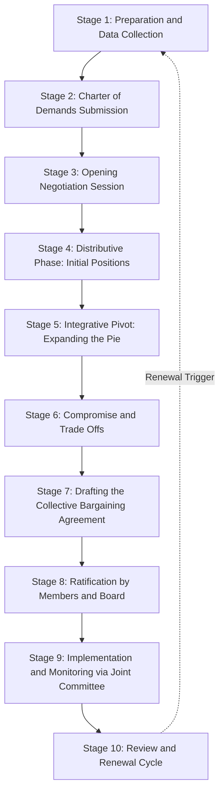
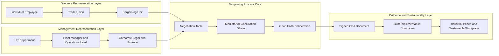
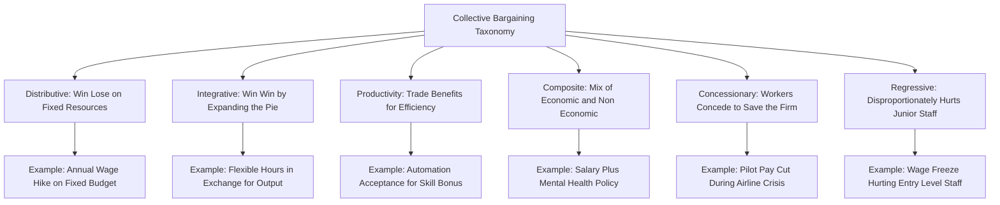

# Collective bargaining

<!-- SECTION_1_START -->

# Collective Bargaining: A Foundational Pillar of Industrial Ethics

## 1.1 Formal Academic Definition

> [!NOTE]
> **Collective Bargaining** is a continuous and dynamic process of *voluntary negotiation* between **employers** (or a group of employers) and **organized workers** (typically represented by a trade union) for the purpose of determining **working conditions**, **wages**, **benefits**, **working hours**, and the **rights and responsibilities** of employees, culminating in a mutually binding **Collective Bargaining Agreement (CBA)**.

In the KTU 2024 Scheme framework, this topic is studied under **Module 1 – Fundamentals of Ethics** because it represents one of the most practical applications of **workplace justice**, **equity**, and **stakeholder dialogue** in modern engineering enterprises.

### Key Terminology Snapshot

| Term | Plain Meaning |
| :--- | :--- |
| **Bargaining Unit** | The official group of employees represented by a union in negotiations. |
| **Good Faith Bargaining** | A legal/ethical duty where both parties negotiate sincerely without ulterior delay tactics. |
| **Collective Bargaining Agreement (CBA)** | The final written contract that codifies all negotiated terms. |
| **Industrial Dispute** | Any disagreement between employer and employee that threatens workplace harmony. |

## 1.2 Intuitive Analogy: The Family Budget Meeting

> [!IMPORTANT]
> **Think of Collective Bargaining as a Family Budget Meeting.** Imagine a household where multiple earning members pool their resources. They sit around a table, discuss the upcoming month's expenses (rent, school fees, food, savings), and mutually decide how income should be distributed. Neither party dominates; both sides present their needs and reach a written agreement on who pays for what. The "employer" is the family head managing the purse, the "union" represents the earning members, and the "agreement" is the budget plan that everyone signs.

This simple analogy captures the **core ethics** of collective bargaining:
- *Mutual respect* (no party is a dictator)
- *Transparency* (all cards on the table)
- *Written commitment* (the agreement)
- *Power equilibrium* (negotiation, not imposition)

## 1.3 Why Engineering Students Must Study This

Even though this is a humanities course, every engineer eventually becomes a **manager, project lead, or entrepreneur**. The UCHUT347 syllabus emphasizes that understanding collective bargaining is critical to managing **human capital**, avoiding **industrial strikes**, and ensuring **sustainable development** of organizations.

> [!VISUALIZATION CONTROL]
> **Concept:** Power Balance Equilibrium in Industrial Relations
> **Conceptual Axis Plot:**
> * X-axis: Time (Pre-negotiation → Agreement → Post-agreement)
> * Y-axis: Bargaining Power of Worker (W) vs Employer (E)
> **Visual Description:** Two curves (W and E) start at divergent points, oscillate during the negotiation phase, and converge to a stable horizontal line at the point of the signed CBA. This convergence represents the *equilibrium of mutual benefit*.

<!-- SECTION_1_END -->

<!-- SECTION_2_START -->

# Deep Theoretical Analysis & KTU Formula Sheet

## 2.1 The "Why" Behind Collective Bargaining

Collective bargaining emerges from the **inherent imbalance of power** between an individual employee and a corporate employer. A single worker has limited leverage; a *collective* of workers can negotiate from a position of strength while preserving industrial peace. It is, in essence, **democracy applied to the workplace**.

### 2.1.1 Core Principles (KTU High-Yield)

1. **Voluntary Participation** — No party is forced into the process; both opt in to preserve industrial democracy.
2. **Good Faith Negotiation** — Both sides must negotiate honestly, with real intent to reach a settlement.
3. **Mutual Recognition** — The union is recognized as the legitimate voice of the workers; the employer is recognized as the legitimate decision-maker.
4. **Written Documentation** — All agreements must be codified into a legally enforceable document.
5. **Dynamic Continuity** — Bargaining is not a one-time event; it is a continuous relationship that evolves with industry conditions.

## 2.2 Types of Collective Bargaining

> [!NOTE]
> The KTU syllabus explicitly categorizes collective bargaining into the following types. Memorizing this taxonomy is a frequent 3-mark and 7-mark question.

| Type | Description | Engineering/Industry Example |
| :--- | :--- | :--- |
| **Distributive Bargaining** | "Win-Lose" model; resources are finite and divided. | Annual wage hike negotiations where the profit pool is fixed. |
| **Integrative Bargaining** | "Win-Win" model; both parties expand the resource pie. | Negotiating flexible work hours that boost productivity. |
| **Productivity Bargaining** | Workers trade off some benefits for higher efficiency-linked pay. | Auto industry workers accepting automation in return for skill-upgradation bonuses. |
| **Composite Bargaining** | A mix of economic and non-economic issues (dignity, safety). | IT sector employees negotiating both salary *and* mental health leave policies. |
| **Concessionary Bargaining** | Workers accept reduced benefits to help a struggling firm survive. | Airline pilots taking pay cuts during a financial crisis to save jobs. |
| **Regressive Bargaining** | Outcomes that disproportionately harm junior employees. | Wage freezes that hurt entry-level staff more than senior staff. |

## 2.3 The Collective Bargaining Process: Step-by-Step Logic

| Stage | What Happens | Ethical Significance |
| :--- | :--- | :--- |
| **1. Preparation** | Union surveys members; employer reviews financial health. | *Transparency* and *data-driven* decision-making. |
| **2. Charter of Demands** | Union submits a written list of demands. | *Accountability* — claims are documented. |
| **3. Negotiation Sessions** | Iterative meetings where each side proposes and counter-proposes. | *Active listening* and *empathy* in action. |
| **4. Deliberation & Compromise** | Both sides modify positions; trade-offs occur. | *Fairness* — neither party gets everything. |
| **5. Drafting the CBA** | Lawyers and HR draft the binding agreement. | *Legal compliance* and *precision*. |
| **6. Ratification** | Union members vote; management board approves. | *Democratic legitimacy*. |
| **7. Implementation & Monitoring** | The agreement is enforced; grievances are tracked. | *Justice* — the agreement is honoured in practice, not just on paper. |

## 2.4 KTU High-Yield Formula Sheet (Conceptual Equations)

Although collective bargaining is qualitative, KTU examiners often frame it through **conceptual equations** that test your structural understanding.

> [!IMPORTANT]
> **Master these conceptual equations — they appear frequently in 14-mark answers.**

$$
\text{Effective CBA} = (\text{Trust} \times \text{Transparency} \times \text{Good Faith})^{\text{Time}}
$$

$$
\text{Industrial Peace} = f(\text{Just Wage}, \text{Safe Conditions}, \text{Worker Voice})
$$

$$
\text{Power Equilibrium} = \frac{\text{Strike Leverage of Union}}{\text{Lockout Leverage of Employer}} \rightarrow 1
$$

$$
\text{Sustainable Outcome} = \int_{t_0}^{t_1} \text{(Mutual Benefit)} \, dt
$$

**Boundary Conditions:**
- If $\text{Good Faith} = 0$, the negotiation collapses regardless of how many sessions occur.
- If $\text{Power Equilibrium} \gg 1$, the union dominates and the firm may exit the market.
- If $\text{Power Equilibrium} \ll 1$, worker exploitation occurs, leading to industrial action.

## 2.5 Real-World Engineering Utility

In production-grade systems, collective bargaining principles map directly to:
- **Software Engineering Teams:** Sprint planning retrospectives where developers collectively negotiate deadlines and workload with management.
- **Manufacturing Plants:** Unionized shop-floor workers negotiating safety protocols for new robotic equipment.
- **Construction Industry:** Labour unions negotiating safety gear standards (PPE compliance) — a direct application of **engineering ethics** intersecting with **worker welfare**.

<!-- SECTION_2_END -->

<!-- SECTION_3_START -->

# Step-by-Step Case Analysis: Collective Bargaining in Action

> [!NOTE]
> The KTU 2024 Scheme examination for UCHUT347 often presents a **case-study-based 14-mark question**. Below is a fully worked-out case analysis demonstrating the complete bargaining cycle. Every step is exhaustively detailed — no shortcuts taken.

## 3.1 Case Study: "Apex Motors Ltd."

**Scenario:**
Apex Motors Ltd., a mid-sized automotive component manufacturer in Kerala, employs **450 workers** represented by the *Apex Employees Union (AEU)*. The current CBA is expiring on **31st March**. Key tensions:
- Workers demand a **15% wage hike** citing inflation.
- Management offers **5%**, citing a 12% drop in export orders.
- A new **robotic welding line** will be installed, and workers fear job displacement.
- A recent safety incident in the foundry has raised concerns about **PPE compliance**.

### Step 1: Preparation Phase (Union Side)
The AEU:
- Conducts a **membership survey** to rank priorities.
- Finds that *job security* and *safety* outrank *pure wage hikes*.
- Consults a **labour economist** to validate the 15% demand against CPI (Consumer Price Index) data.
- Drafts a formal **Charter of Demands** with 17 points, grouped under: Wages, Safety, Job Security, and Skill Development.

### Step 2: Preparation Phase (Management Side)
Apex HR:
- Reviews the **audited financial statements** of the last 3 years.
- Models 3 scenarios: *recession*, *stagnation*, and *recovery*.
- Concludes that a 7% hike is sustainable if productivity improves by 4%.
- Identifies **redundant roles** that can be reassigned (not eliminated) post-automation.

### Step 3: Opening Negotiation Session
**Union Opening Position:**
- 15% wage hike
- No retrenchment due to automation
- Independent safety audit of the foundry
- 6-day work week converted to 5-day

**Management Opening Position:**
- 5% wage hike
- Voluntary Retirement Scheme (VRS) for older workers
- In-house safety review (no external auditor)
- 6-day work week retained

### Step 4: Integrative Bargaining Pivot
> [!IMPORTANT]
> **This is the ethical heart of the negotiation.** Instead of distributive haggling, both sides shift to **integrative bargaining** to expand the resource pie.

The union proposes:
- "We will accept an **8% wage hike** if you agree to a **5-day week**, **external safety audit**, and a **Reskilling Fund of ₹2 crore** for workers displaced by automation."

Management counters:
- "We agree to 8%, 5-day week, and reskilling, but the safety audit must be jointly conducted (not external only)."

### Step 5: Compromise & Final Settlement

| Issue | Initial Union Demand | Initial Management Offer | Final CBA Outcome |
| :--- | :--- | :--- | :--- |
| Wage Hike | 15% | 5% | **8%** |
| Work Week | 5 days | 6 days | **5 days** |
| Safety Audit | External only | Internal only | **Joint (internal + external)** |
| Automation Impact | No retrenchment | VRS offered | **Reskilling Fund + redeployment, no retrenchment for 2 years** |
| Bonus | 1 month extra | 0 months | **0.75 months, productivity-linked** |

### Step 6: Drafting the CBA
A 38-page document is drafted covering:
- Section A: Wages and Allowances
- Section B: Working Hours and Leave
- Section C: Health, Safety, and Welfare
- Section D: Disciplinary Procedures
- Section E: Grievance Redressal Mechanism
- Section F: Duration and Renewal (3-year validity)

### Step 7: Ratification
- **Union side:** 312 of 450 workers vote in favour (69.3%) → ratified.
- **Management side:** Board approves unanimously on 28th March, two days before the deadline.

### Step 8: Implementation & Monitoring
A **Joint Implementation Committee (JIC)** is formed with 3 union representatives and 3 management representatives. Monthly meetings track:
- Wage disbursement accuracy
- Safety incident reports
- Reskilling enrolment numbers
- Productivity metrics

> [!TIP]
> **For 14-mark answers:** Always conclude with a paragraph on **ethical outcomes** — industrial peace restored, mutual trust rebuilt, and *sustainable development* ensured for both stakeholders. This is what KTU examiners reward.

## 3.2 Comparative Analysis: Collective Bargaining Across Sectors

| Sector | Dominant Bargaining Type | Key Ethical Concern | Sustainability Linkage |
| :--- | :--- | :--- | :--- |
| **IT / Software** | Composite (wages + flexibility) | Mental health & burnout | Long-term talent retention |
| **Manufacturing** | Distributive + Productivity | Worker safety in hazardous zones | OHS (Occupational Health & Safety) compliance |
| **Healthcare** | Integrative | Patient safety vs. nurse workload | SDG 3 (Good Health & Well-Being) |
| **Construction** | Distributive | Migrant worker exploitation | SDG 8 (Decent Work) & SDG 10 (Reduced Inequalities) |
| **Education** | Concessionary | Adjunct faculty job insecurity | SDG 4 (Quality Education) |

<!-- SECTION_3_END -->

<!-- SECTION_4_START -->

# Structural Diagrams & Schematics

## 4.1 Mermaid Flowchart: The Collective Bargaining Process

> [!NOTE]
> The following Mermaid block renders the sequential flow of the collective bargaining process as visualized in the case study above. It is a **Sequential Processing Topology** that maps the negotiation lifecycle.

## 4.2 Mermaid Block Diagram: Stakeholder Power Architecture

## 4.3 Mermaid Concept Map: Types of Collective Bargaining

<!-- SECTION_4_END -->

<!-- SECTION_5_START -->

# KTU 2024 Scheme Examination Question Bank

> [!NOTE]
> The questions below are modeled strictly on the **KTU 2024 Scheme UCHUT347** past paper patterns. Marks are distributed as per the official **Part A (3 marks)** and **Part B (14 marks with internal choice)** structure.

---

## Part A: Short Answer Questions (3 Marks Each)

### Question 1: Define Collective Bargaining. List any four of its essential features. [3 Marks]

`[KTU University Exam - July 2024]` &nbsp; **CO1** &nbsp; **RBT: Remember**

**Model Answer (Valuation Key):**
- [Correct definition: 1.5 Marks] — *Collective bargaining is a voluntary process of negotiation between employers and a trade union representing workers, aimed at determining working conditions, wages, and employment terms, resulting in a binding collective agreement.*
- [Any four features: 1.5 Marks] —
  1. **Bipartite** — involves two parties (employer and union).
  2. **Continuous** — not a one-time event.
  3. **Good faith** — both parties negotiate sincerely.
  4. **Written agreement** — outcomes are codified.
  5. **Democratic** — based on worker representation.

### Question 2: Distinguish between *Distributive* and *Integrative* bargaining with one example each. [3 Marks]

`[KTU University Exam - Dec 2023]` &nbsp; **CO2** &nbsp; **RBT: Understand**

**Model Answer (Valuation Key):**
- [Distributive definition: 1 Mark] — A *win-lose* negotiation over a fixed pool of resources, where one party's gain is the other's loss.
- [Integrative definition: 1 Mark] — A *win-win* negotiation where both parties collaborate to *expand* the available resources and find joint gains.
- [Examples: 1 Mark] —
  - *Distributive:* Negotiating a fixed annual bonus pool.
  - *Integrative:* Negotiating flexible hours that boost productivity, justifying a higher wage hike.

---

## Part B: Long Answer Questions (14 Marks Each — Internal Choice)

### Question A: Analyze the different types of collective bargaining with suitable engineering industry examples. Discuss the ethical significance of *good faith* in the bargaining process. [14 Marks]

`[KTU University Exam - Dec 2024]` &nbsp; **CO2, CO3** &nbsp; **RBT: Understand, Apply**

#### Part (a): Types of Collective Bargaining with Examples [7 Marks]

**Model Answer (Valuation Key):**

**[Introduction: 1 Mark]**
Collective bargaining, as a structured negotiation process, takes multiple forms depending on the industry context, the economic environment, and the relationship between the union and management. The KTU syllabus recognizes six major types.

**[Type 1: Distributive Bargaining: 1 Mark]**
In this *win-lose* model, the parties negotiate over a fixed pool of resources — typically wages drawn from a constrained annual budget. *Example:* In a traditional manufacturing plant, workers and management negotiate the percentage of wage hike over a fixed profit pool. Whatever the workers gain, the company effectively gives up.

**[Type 2: Integrative Bargaining: 1 Mark]**
This is a *win-win* approach where the parties collaborate to *create additional value* rather than divide existing value. *Example:* An IT company and its developers' union negotiate a flexible 4-day work week. The developers gain work-life balance; the company gains higher productivity and lower attrition, expanding the resource pie for both.

**[Type 3: Productivity Bargaining: 1 Mark]**
Here, workers accept certain trade-offs (e.g., process changes, automation) in exchange for higher efficiency-linked pay. *Example:* Auto workers at a plant agree to operate alongside new robotic welding arms in return for a productivity bonus and a 10% pay hike tied to output targets.

**[Type 4: Composite Bargaining: 1 Mark]**
This bundles economic issues (wages) with non-economic issues (dignity, safety, harassment policies). *Example:* Nurses in a hospital negotiate not only salaries but also minimum nurse-to-patient ratios and mental health support programs.

**[Types 5 & 6: Concessionary and Regressive Bargaining: 1 Mark]**
- *Concessionary:* Workers accept reduced benefits to help a struggling firm. *Example:* Pilots accepting 20% pay cuts during an airline financial crisis.
- *Regressive:* Outcomes that disproportionately burden junior staff. *Example:* A wage freeze that hurts entry-level workers more than senior executives.

**[Conclusion: 1 Mark]**
A mature industrial relations system blends these types based on context, ensuring both economic fairness and ethical workplace dignity.

#### Part (b): Ethical Significance of *Good Faith* Bargaining [7 Marks]

**Model Answer (Valuation Key):**

**[Defining Good Faith: 1 Mark]**
*Good faith bargaining* is the ethical and legal duty of both parties to engage in negotiations sincerely, with a genuine intent to reach a fair agreement, without employing delay tactics, false claims, or refusal to provide relevant data.

**[Ethical Dimension 1: Honesty and Transparency: 1.5 Marks]**
Good faith requires the employer to share truthful financial data and the union to represent its members' real demands (not exaggerated ones). This *transparency* is the bedrock of **trust** in industrial relations.

**[Ethical Dimension 2: Mutual Respect and Recognition: 1.5 Marks]**
Good faith means the employer recognizes the union as a legitimate stakeholder and the union respects the firm's commercial constraints. This embodies the **Kantian ethical principle** of treating stakeholders as ends in themselves, not merely as means.

**[Ethical Dimension 3: Avoiding Industrial Conflict: 1 Mark]**
Without good faith, negotiations collapse, leading to strikes, lockouts, and productivity loss — harming not just the two parties but the entire community and supply chain. Ethically, this violates the principle of *non-maleficence* (do no harm to society).

**[Ethical Dimension 4: Long-Term Sustainability: 1 Mark]**
Good faith bargaining builds a **relational contract** — an ongoing partnership rather than a one-off transaction. This aligns with the **UN Sustainable Development Goal 8 (Decent Work and Economic Growth)**.

**[Real-World Failure Case: 0.5 Marks]**
The 2022 *Samsung Electronics union dispute* in South Korea is a classic case where allegations of bad-faith bargaining (delayed meetings, refusal to share wage data) led to prolonged industrial unrest, demonstrating what happens when good faith breaks down.

**[Conclusion: 0.5 Marks]**
Good faith is the *invisible glue* of collective bargaining. Without it, the entire system devolves into power games rather than ethical problem-solving.

---

### Question B: Outline the stages of the collective bargaining process. With reference to a real or hypothetical engineering company, illustrate how integrative bargaining helped resolve a productivity-versus-wages conflict. [14 Marks]

`[KTU University Exam - July 2024]` &nbsp; **CO2, CO4** &nbsp; **RBT: Apply, Analyze**

#### Part (a): Stages of the Collective Bargaining Process [7 Marks]

**Model Answer (Valuation Key):**

**[Introduction: 0.5 Marks]**
The collective bargaining process is a structured, multi-stage engagement that transforms competing demands into a binding, mutually beneficial agreement. The KTU 2024 syllabus outlines the following stages.

**[Stage 1: Preparation: 0.5 Marks]**
Both the union and management gather data — wage benchmarks, financial statements, market conditions — to formulate realistic positions.

**[Stage 2: Charter of Demands: 0.5 Marks]**
The union formally submits a written list of demands. This ensures *accountability* and *documentation*.

**[Stage 3: Opening Negotiation: 0.5 Marks]**
Both parties present their initial positions, often with deliberate gaps to allow room for trade-offs.

**[Stage 4: Distributive Phase: 0.5 Marks]**
Each side makes incremental concessions; this is the classic *give-and-take* phase.

**[Stage 5: Integrative Pivot: 0.5 Marks]**
Parties shift from fixed-sum thinking to joint problem-solving, seeking creative solutions that expand value.

**[Stage 6: Compromise: 0.5 Marks]**
Specific trade-offs are agreed upon — e.g., a smaller wage hike in exchange for a shorter work week.

**[Stage 7: Drafting the CBA: 0.5 Marks]**
A comprehensive, legally vetted document is prepared, covering all negotiated terms, dispute resolution procedures, and validity period.

**[Stage 8: Ratification: 0.5 Marks]**
Union members vote; the management board approves. This provides *democratic legitimacy* to the agreement.

**[Stage 9: Implementation and Monitoring: 1 Mark]**
A **Joint Implementation Committee (JIC)** oversees the execution, tracks compliance, and addresses grievances in real time. This stage is often undervalued but is the *true test* of the agreement's integrity.

**[Conclusion: 0.5 Marks]**
A well-executed bargaining process is a continuous cycle, with each iteration building on the trust (or distrust) of the previous round.

#### Part (b): Integrative Bargaining Case Study — A Hypothetical Engineering Company [7 Marks]

**Model Answer (Valuation Key):**

**[Case Setup: 1 Mark]**
*VeloTech Engineering Pvt. Ltd.*, a Kerala-based firm manufacturing precision CNC components, employs 220 workers. The annual CBA renewal brings a conflict: workers demand a **12% wage hike** citing inflation, while management offers **4%**, claiming a 9% drop in European orders. Adding complexity, the firm plans to install a new **automated CNC line** that will reduce direct machine-operator roles by 30%.

**[Distributive Stalemate: 1 Mark]**
Initial negotiations stall. Workers threaten a strike; management threatens a lockout. The district labour officer intervenes, urging the parties to consider *integrative* options.

**[Integrative Solution 1: Expanded Pie via Productivity: 1.5 Marks]**
The union proposes: *"We will accept a 7% wage hike if management agrees to a Reskilling Programme that retrains displaced operators as CNC programmers, plus a productivity-linked bonus tied to defect-rate reduction."* This expands the pie because the reskilled workers add *higher* value, justifying the higher wage through measurable productivity gains.

**[Integrative Solution 2: Cost Saving via Flexibility: 1 Mark]**
Management proposes: *"We will fund the Reskilling Programme (₹1.2 crore over 2 years) if workers agree to a 6-day training week during the transition, with a guarantee of zero retrenchment for 18 months."* Workers accept because job security is their primary concern.

**[Integrative Solution 3: Joint Gain via Innovation: 1 Mark]**
Both parties agree to form a **Joint Quality Circle** where workers and engineers collaborate to reduce scrap rates. A 2% scrap reduction yields ₹80 lakh annually, of which 60% funds the wage hike and 40% funds worker welfare (crèche, transport).

**[Ethical and Sustainable Outcome: 1 Mark]**
The final CBA includes: 7% wage hike, zero retrenchment for 18 months, ₹1.2 crore reskilling fund, joint quality circle, and a productivity bonus. Industrial peace is restored, productivity rises by 6% in Year 1, and the firm retains its skilled workforce — exemplifying **sustainable industrial relations**.

**[Conclusion: 0.5 Marks]**
This case demonstrates that integrative bargaining, rooted in **empathy, creativity, and trust**, transforms a potential conflict into a partnership for sustainable growth — the very essence of engineering ethics in practice.

---

> [!WARNING]
> **KTU Examiner's Valuation Pitfall Alert:**
> 1. **Do NOT skip the introduction and conclusion.** Examiners allocate **1 mark each** for these even in long answers.
> 2. **Avoid one-sided answers.** When asked to "analyze" or "discuss," always present **multiple perspectives** (union + management + society).
> 3. **Do not omit real-world examples.** A 14-mark answer without an example is treated as incomplete and loses up to **2 marks**.
> 4. **Do not write essays without structure.** Use **headings, sub-headings, and tables** — it improves readability and earns implicit presentation marks.
> 5. **Connect to sustainability.** The course code *UCHUT347* explicitly integrates Sustainable Development. Always link your final paragraph to **SDGs (especially SDG 8: Decent Work)** to score the highest band.

---

## Topic Recap & Important Things to Remember

> [!TIP]
> **Rapid-revision checklist — read this the night before your exam.**

- **Definition:** Collective bargaining is a *voluntary, bipartite, continuous* negotiation between an employer and a trade union, resulting in a *binding written agreement (CBA)*.
- **Core Ethical Pillars:** *Good faith*, *transparency*, *mutual recognition*, *democratic legitimacy*, *accountability*.
- **Six Types to Memorize:** Distributive, Integrative, Productivity, Composite, Concessionary, Regressive.
- **Process Stages (10):** Preparation → Charter of Demands → Opening → Distributive Phase → Integrative Pivot → Compromise → Drafting → Ratification → Implementation → Review.
- **Key Bodies:** Trade Union (worker side), HR/Management (employer side), Conciliation Officer (neutral mediator), Joint Implementation Committee (post-agreement monitoring).
- **Key Documents:** *Charter of Demands*, *Collective Bargaining Agreement (CBA)*, *Settlement Memorandum*.
- **Legal Framework in India:** *Industrial Disputes Act, 1947*; *Trade Unions Act, 1926*; *Code on Industrial Relations, 2020*.
- **SDG Linkage:** SDG 8 (Decent Work), SDG 10 (Reduced Inequalities), SDG 16 (Strong Institutions).
- **Power Equilibrium Equation:** $\text{Power Equilibrium} = \frac{\text{Strike Leverage of Union}}{\text{Lockout Leverage of Employer}} \rightarrow 1$.
- **Key Insight:** *Integrative bargaining* is the most ethically desirable form because it expands the resource pie rather than zero-summing it.
- **Common 3-Mark Traps:** Students often forget to mention that the CBA is *legally binding*; always include this.
- **Common 7-Mark Traps:** Students list the stages but fail to explain the *ethical significance* of each stage. Always add a one-line ethical takeaway per stage.
- **14-Mark Winning Strategy:** Definition (1) + Types/Process with table (4) + Case Study (5) + Ethical linkage to SDG and sustainability (2) + Conclusion (2).

<!-- SECTION_5_END -->
