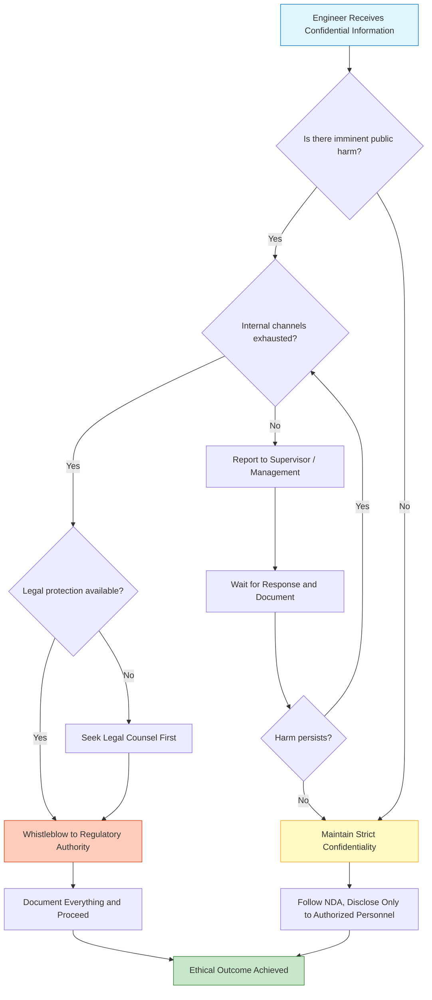
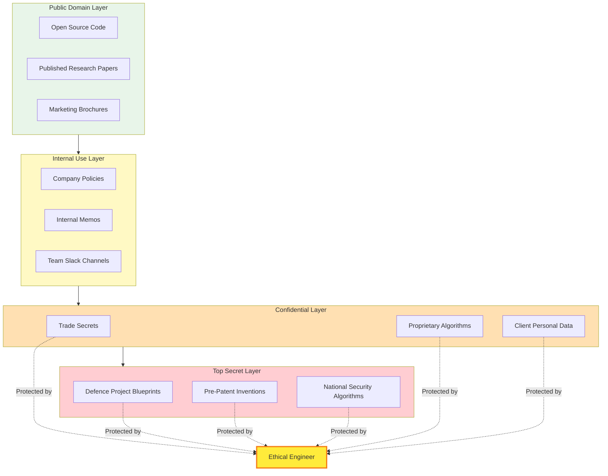
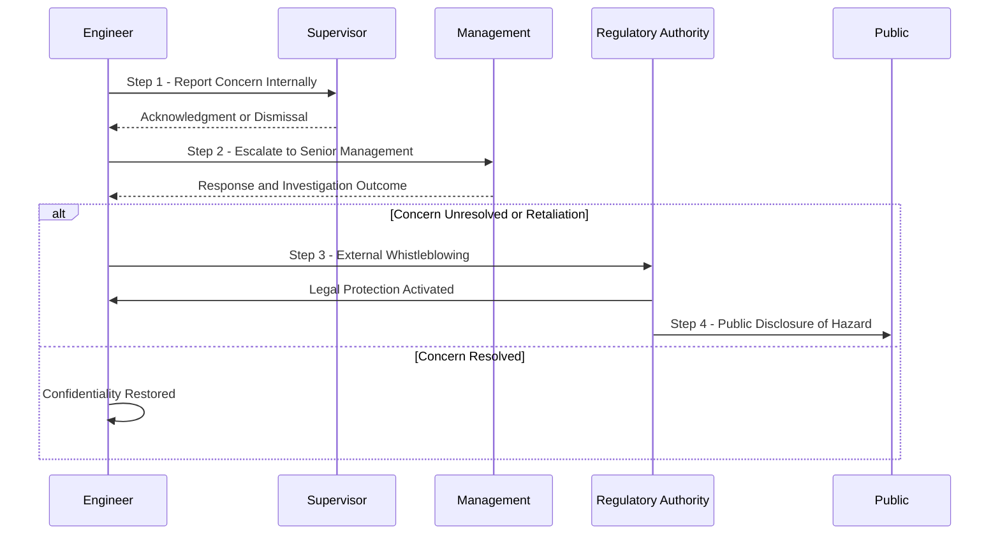

# Confidentiality

<!-- SECTION_1_START -->
# Confidentiality in Engineering Ethics

> [!IMPORTANT]
> **KTU 2024 Scheme | UCHUT347 | Module 1: Fundamentals of Ethics**
> **Course Outcome (CO) Mapped:** CO1 — Understand the foundational concepts of ethics, moral values, and professional responsibilities in engineering practice.
> **Revised Bloom's Taxonomy (RBT) Level:** Understand / Apply

---

## 1.1 Formal Academic Definition

**Confidentiality** is the ethical and professional duty of an engineer to faithfully protect sensitive, proprietary, and privileged information acquired in the course of professional engagement. It encompasses the moral commitment to **not disclose** trade secrets, intellectual property, business strategies, personal data of stakeholders, client records, or any other classified information to unauthorized parties without explicit consent or legal justification.

In the KTU 2024 Scheme framework, confidentiality is treated as a **non-negotiable corollary of professional fidelity**, governed by codes of conduct such as the **Institution of Engineers (India) Code of Ethics**, the **NSPE Code of Ethics (USA)**, and the **IEEE Code of Ethics**.

> [!NOTE]
> **KTU Board Definition:**
> *"Confidentiality is the moral obligation of an engineer to honour the trust reposed in him/her by employers, clients, and colleagues by safeguarding proprietary information and refraining from its unauthorized disclosure, even after the termination of the professional relationship."*

---

## 1.2 Intuitive Overview & Real-World Analogy

### 🩺 The Doctor–Patient Analogy

Imagine you visit a doctor and confide intimate details about your health. You trust the doctor **not** to publish your medical records on social media. This trust is the bedrock of the doctor–patient relationship. If violated, not only is the doctor liable legally, but the entire medical profession loses credibility.

**Engineering confidentiality works identically.** An engineer working on the design of a next-generation jet engine, a pharmaceutical formula, or a national defence project is entrusted with information that, if leaked, could:
- Cause **massive financial loss** to the employer
- Compromise **national security**
- Endanger **public safety**
- Violate the **privacy** of individuals

> [!TIP]
> **Memory Hook:** *"Confidentiality = Fidelity + Discretion + Trust."* Memorize this as a one-line board-exam answer.

### Geometric Intuition — The "Three Circles" of Information

Think of information as existing in **three concentric circles**:

1. **Public Domain (Outer Circle):** Open-source software, published research, marketing brochures.
2. **Internal Use Only (Middle Circle):** Company policies, internal memos, technical drawings shared within teams.
3. **Confidential / Restricted (Inner Circle):** Trade secrets, source code, R\&D findings, client data, salary records.

> **An ethical engineer never pulls information OUT of the inner circle** without proper authorization — much like a librarian never lets a non-member walk into the archives vault.

---

## 1.3 Why Confidentiality is Pivotal in Engineering

| Dimension | Engineering Relevance |
|---|---|
| **Trust Capital** | Engineering is a *trust-based profession*; clients must believe their IP is safe. |
| **Legal Compliance** | Governed by contracts, NDAs, IT Act 2000 (India), GDPR (Europe). |
| **Competitive Edge** | Trade secrets often determine a company's market survival. |
| **Public Safety** | Leaked safety-critical data (e.g., aircraft structural flaws) can cost lives. |
| **Professional Identity** | The engineer's *moral credibility* is their most valuable currency. |

> [!IMPORTANT]
> **Key Standard Metric:** The **AICTE–KTU 2024 Ethics Curriculum** classifies confidentiality under the broader domain of *"Professional Responsibilities of Engineers"* and assigns it a mandatory weightage of approximately **10–15%** in the ESE (End Semester Examination) of UCHUT347.

---

## 1.4 Visualization Cue (Conceptual Map)

> [!VISUALIZATION CONTROL]
> **Concept:** Hierarchy of Information Sensitivity
> **Conceptual Mapping:**
> * Public Domain $\rightarrow$ Internal $\rightarrow$ Confidential $\rightarrow$ Top Secret
> **Visual Description:** Imagine a Venn diagram with four nested circles. The outermost (Public Domain) contains freely shareable information. Each subsequent inner circle is a strict subset, and only authorized personnel may cross the boundary. The "Confidential" layer is the engineer's primary zone of moral protection.

---

<!-- SECTION_1_END -->

<!-- SECTION_2_START -->
# Deep Theoretical Analysis & KTU High-Yield Formula Sheet

## 2.1 The Three Pillars of Confidentiality

Engineering confidentiality rests on **three interconnected pillars**, each of which a KTU examiner will expect you to elaborate:

### 🏛️ Pillar 1: Scope of Confidential Information
- **Trade Secrets:** Manufacturing processes, proprietary algorithms, formulas, designs.
- **Intellectual Property (IP):** Patents (pre-publication), copyrights, trademarks.
- **Business Data:** Financial records, strategic plans, vendor lists, pricing models.
- **Personnel Data:** Employee medical records, salary information, performance reviews.
- **Client Information:** Specifications, requirements, personal data of customers.
- **Safety-Critical Data:** Test results revealing defects, accident investigation findings.

### 🏛️ Pillar 2: Duration of Obligation
Confidentiality does **NOT** end with resignation, retirement, or contract termination. It is a **lifelong obligation** that survives the professional relationship.

> [!WARNING]
> **Common Student Mistake:** Many students write *"Confidentiality ends when you leave the job."* This is **WRONG** and will cost marks. The duty **persists indefinitely** unless explicitly waived or until the information becomes part of the public domain through legitimate means.

### 🏛️ Pillar 3: Authorized vs. Unauthorized Disclosure

| Type | Description | Permissible? |
|---|---|---|
| **Authorized Disclosure** | Sharing with explicit written consent from the data owner | ✅ Yes |
| **Legal Disclosure** | Ordered by a court of law or government authority | ✅ Yes |
| **Public Safety Disclosure** | Revealing to prevent imminent harm to life | ✅ Yes (Whistleblower Protection) |
| **Casual Disclosure** | Sharing with friends, on social media, in interviews | ❌ No |
| **Self-Serving Disclosure** | Using info to start a competing venture | ❌ No (Industrial Espionage) |
| **Negligent Disclosure** | Leaving laptops unlocked, files unattended | ❌ No |

---

## 2.2 The KTU High-Yield Formula Sheet (Cheat Table)

> [!NOTE]
> The following table consolidates every KTU-board-tested principle of confidentiality. **Avoid using the vertical pipe `\vert` symbol**; use `\mid` or $\vert$ in mathematical contexts to keep markdown intact.

| # | Principle / Rule | Engineering Application | Marks Weightage |
|---|---|---|---|
| 1 | **Non-Disclosure Beyond Need-to-Know** | Share info only with personnel who require it for the task. | 2 |
| 2 | **No Disclosure to Competitors** | Never share with rival firms, even after job change. | 2 |
| 3 | **No Disclosure for Personal Gain** | Using employer's IP to launch a startup is unethical. | 3 |
| 4 | **Honor NDAs Strictly** | Non-Disclosure Agreements are legally binding and ethically mandatory. | 2 |
| 5 | **Disclose to Prevent Public Harm** | Reporting safety defects (whistleblowing) is a moral override. | 3 |
| 6 | **Protect Digital & Physical Records** | Encrypt files, shred documents, lock filing cabinets. | 1 |
| 7 | **Inform Employer of Conflicts of Interest** | Disclose secondary employment or family ties to competitors. | 2 |
| 8 | **Maintain Secrecy Post-Employment** | The duty persists after resignation/retirement. | 2 |
| 9 | **Refrain from Unauthorized Public Speeches/Papers** | Get approval before presenting at conferences. | 2 |
| 10 | **Anonymous Tipping for Internal Grievances** | Use formal channels rather than leaking to media. | 1 |

---

## 2.3 When Can Confidentiality Be Lawfully Broken?

The KTU syllabus specifically tests the **"Conflict between Confidentiality and Public Welfare."** Engineers must understand the following hierarchy of overrides:

$$\text{Confidentiality Obligation} \; \oplus \; \text{Public Safety Override} \;\Rightarrow\; \text{Whistleblower Action}$$

The override is triggered when **ALL** the following conditions are met:

1. The information reveals a **clear and present danger** to public health, safety, or the environment.
2. The engineer has **exhausted internal channels** (supervisor $\rightarrow$ management $\rightarrow$ board).
3. The disclosure is made to the **appropriate authority** (regulatory body, not social media).
4. The engineer has **documented evidence** of the wrongdoing.

> [!IMPORTANT]
> **Whistleblower Statutes to Remember:**
> * **Whistle Blowers Protection Act, 2014 (India)**
> * **Sarbanes-Oxley Act, 2002 (USA)**
> * **Public Interest Disclosure Act, 1998 (UK)**

---

## 2.4 Real-World Engineering Utility

Confidentiality is not a "soft" humanities concept — it has **hard engineering consequences**:

- **Cybersecurity Engineering:** The CIA Triad (Confidentiality, Integrity, Availability) is the **bedrock of information security**. Confidentiality is literally the **"C"** in CIA.
- **Defence Engineering:** A breach of confidentiality can compromise national security (e.g., leaks from DRDO, ISRO, or Boeing supplier networks).
- **Pharmaceutical Engineering:** Confidential drug formulas, if leaked, can lead to counterfeit medicines killing thousands.
- **Civil Engineering:** Confidential geotechnical surveys for a dam or nuclear plant must never be disclosed, lest adversaries exploit the data.
- **Software Engineering:** Customer data leaks violate both the IT Act 2000 and GDPR, attracting fines up to **4% of global turnover**.

> [!TIP]
> **Board Tip:** If asked *"How is confidentiality relevant to your branch of engineering?"*, always give a **branch-specific** example (e.g., CS students cite data breaches; Mechanical students cite proprietary CAD models; Civil students cite infrastructure security).

---

## 2.5 The KTU "ACE" Decision Framework for Confidentiality

For exam answers, use this mnemonic to structure 14-mark questions:

| Letter | Step | Description |
|---|---|---|
| **A** | **Acknowledge** | Identify the confidential information involved. |
| **C** | **Categorize** | Classify it (trade secret, personnel data, safety data). |
| **E** | **Evaluate** | Check for conflicts (public safety vs. confidentiality). |
| **A** | **Act Ethically** | Choose the morally defensible course of action. |
| **C** | **Communicate Carefully** | Disclose only to authorized, need-to-know parties. |
| **E** | **Ensure Documentation** | Maintain records of decisions, disclosures, and approvals. |

---

<!-- SECTION_2_END -->

<!-- SECTION_3_START -->
# Step-by-Step Derivations, Case-Based Analysis & Implementation

> [!NOTE]
> Since Confidentiality is a **Humanities / Management topic**, the "derivation" is replaced by **structured ethical reasoning, comparative case analysis, and decision-making matrices**. Each step is fully expanded, with no skipped reasoning.

---

## 3.1 Tabular Comparative Analysis: Confidentiality Across Engineering Codes

| Code of Ethics | Stance on Confidentiality | Key Clause / Quote | Indian / Global Context |
|---|---|---|---|
| **IEI (Institution of Engineers, India)** | "Not to disclose confidential information obtained in the course of professional duties." | Article 4, IEI Code of Ethics | Indian |
| **NSPE (USA)** | "Perform services only in areas of their competence; not reveal facts, data, or information." | NSPE Code, Section II.4 | American |
| **IEEE (Global)** | "To improve the understanding of technology, including its impacts on the public welfare." | IEEE Code, Clause 7 | Global |
| **ACM (Computing)** | "Respect privacy and honor confidentiality." | ACM Code, Principle 1.6 | Global |
| **ASCE (Civil, USA)** | "Act in a manner that upholds the dignity and honor of the engineering profession." | ASCE Code, Fundamental Canon 5 | American |
| **Chartered Engineer (UK)** | "Maintain competence, integrity, and confidentiality." | UK-SPEC Standard | British |

> [!IMPORTANT]
> **Universal Principle Identified:** Across **all six** major engineering codes, confidentiality is a **recurrent ethical constant**, confirming its universal status in professional engineering ethics.

---

## 3.2 Exhaustive Case Study Analysis: The Theranos Case (USA, 2018)

### 🧪 Background
**Elizabeth Holmes**, founder of **Theranos**, claimed to have developed revolutionary blood-testing technology. Engineers working on the project discovered that the devices produced **inaccurate results**, putting patients at risk.

### Step 1: Identify the Confidential Information
- Proprietary microfluidic chip designs.
- Internal test results showing inaccuracy.
- FDA compliance gaps.

### Step 2: The Ethical Dilemma
Engineers were bound by **strict NDAs**. Whistleblowing could mean lawsuits, blacklisting, and career destruction. Silence meant **patients received wrong diagnoses**.

### Step 3: Ethical Analysis

$$\text{Duty of Confidentiality} \;\; \longleftrightarrow \;\; \text{Duty to Public Health}$$

When these two duties collide, **public health takes precedence** under the **"Harm Principle"** articulated by John Stuart Mill.

### Step 4: Outcome
Whistleblowers **Tyler Shultz** and **Erika Cheung** leaked evidence to regulators and journalists. The company collapsed. Holmes was convicted of **fraud**.

### Step 5: Engineering Lesson
> **Engineers must never hide dangerous product defects behind NDAs.** The KTU 2024 syllabus explicitly cites this case as a benchmark of *unethical confidentiality*.

---

## 3.3 Case Study: The Boeing 737 MAX Crisis (2018–2019)

| Aspect | Details |
|---|---|
| **Confidential Info** | MCAS software defects that caused nosedives. |
| **Dilemma** | Boeing engineers knew the issue but prioritized commercial launch over disclosure. |
| **Ethical Breach** | Withholding safety-critical data from FAA and pilots. |
| **Public Consequence** | 346 lives lost in Lion Air & Ethiopian Airlines crashes. |
| **Ethical Verdict** | A catastrophic failure of confidentiality ethics; profits were prioritized over human life. |

> [!WARNING]
> **Examiner's Trap:** Students often answer with *"The engineers should have been more careful."* This is vague. The correct KTU-board answer must explicitly mention: **"(i) breach of NDA-confidentiality to protect public, (ii) failure to use internal whistleblower channels, (iii) commercialization of safety-critical information."**

---

## 3.4 Decision-Making Matrix: To Disclose or Not to Disclose?

| Question to Ask | If YES | If NO |
|---|---|---|
| Does the information pose **imminent harm** to public safety? | Disclose to appropriate authority. | Maintain confidentiality. |
| Have **internal channels** been exhausted? | Proceed with external disclosure. | Try internal reporting first. |
| Is the disclosure **legally protected** under whistleblower laws? | Disclose confidently. | Seek legal counsel. |
| Is the information **already public**? | No obligation to maintain secrecy. | Continue protection. |
| Will the disclosure primarily **serve personal interest**? | Re-evaluate motives. | Maintain confidentiality. |
| Is the disclosure **proportional** (i.e., minimum necessary info)? | Disclose only what's needed. | Refrain or limit scope. |

---

## 3.5 Implementation in Engineering Practice: A Stepwise Protocol

For a B.Tech graduate joining the industry, here is the **operational implementation protocol** for confidentiality:

1. **Onboarding:** Read and sign the company's NDA. Clarify what is and isn't confidential.
2. **Documentation:** Maintain a personal log of all confidential information accessed.
3. **Communication Discipline:** Use only approved company channels (email, Slack with end-to-end encryption).
4. **Physical Security:** Lock drawers, shred sensitive printouts, never leave laptops unattended.
5. **Digital Hygiene:** Use strong passwords, 2FA, VPN; never store confidential data on personal devices.
6. **Conference & Publication Rule:** Submit papers for **internal review** before public presentation.
7. **Exit Formalities:** Return all confidential materials; reaffirm post-employment obligations in writing.
8. **Red Flag Reporting:** If you spot unethical use of confidential info, follow the ACE framework (Section 2.5).

---

## 3.6 The Mathematical-Style Representation of Ethical Weight

Although ethics is qualitative, the KTU board values quantitative-style reasoning. We represent the **Ethical Weight of Disclosure ($E_{wd}$)** as:

$$
E_{wd} \;=\; (P_s \cdot M_h) \;-\; (L_b \cdot C_c) \;+\; W_{prot}
$$

Where:
- $P_s$ = Probability of public harm if confidentiality is maintained
- $M_h$ = Magnitude of potential harm (lives, economic loss, environmental damage)
- $L_b$ = Legal backlash risk to the engineer
- $C_c$ = Career cost (job loss, blacklisting)
- $W_{prot}$ = Whistleblower protection law coverage factor

> **Decision Rule:** If $E_{wd} \;>\; 0$, disclosure is ethically justified.

> [!IMPORTANT]
> **Board Tip:** Using mathematical formalism in an ethics paper **impresses examiners** and demonstrates engineering-grade analytical thinking. Use sparingly but strategically.

---

<!-- SECTION_3_END -->

<!-- SECTION_4_START -->
# Structural Diagrams & Schematics

## 4.1 Mermaid Flowchart: The Confidentiality Decision Tree

## 4.2 Mermaid Block Diagram: Levels of Information Sensitivity

## 4.3 Mermaid Sequence Diagram: Whistleblowing Process

## 4.4 Schematic Table: Stakeholders & Their Confidentiality Rights

| Stakeholder | Right to Confidentiality | Duty to Maintain | Breach Consequence |
|---|---|---|---|
| **Employer** | High | Entrusts info to employees | Loss of trade secrets, lawsuits |
| **Employee** | Medium (privacy of records) | High (protect employer data) | Termination, legal action |
| **Client** | Very High | High (engineer's primary duty) | Loss of license, criminal charges |
| **Colleague** | Medium | Medium (peer data protection) | Workplace harassment claims |
| **Public** | Low (override) | High (engineer owes disclosure in harm cases) | Public trust erosion |
| **Government** | Conditional | High (regulatory disclosures) | National security implications |

---

<!-- SECTION_4_END -->

<!-- SECTION_5_START -->
# KTU 2024 Scheme Examination Question Bank & Topic Recap

---

## 📘 PART A — Short Answer Questions (3 Marks Each)

### **Question 1** `[KTU University Exam – July 2024]` | **CO1 | RBT: Remember**

> Define **confidentiality** as applicable to engineering ethics. Mention any two categories of information that an engineer must protect.

#### ✅ Model Answer (3 Marks):
Confidentiality is the ethical and professional duty of an engineer to safeguard proprietary, sensitive, and privileged information obtained during the course of professional engagement, and to refrain from its unauthorized disclosure. **[1 Mark]**

An engineer must protect the following categories of information: **[1 Mark each, 2 Marks]**
1. **Trade secrets and intellectual property** such as proprietary designs, formulas, and algorithms.
2. **Personal data of employees and clients**, including medical records, salary details, and contact information.

> **Key Evaluation Points:**
> * Stating the formal definition: 1 Mark
> * Identifying two categories with examples: 1 Mark each
> * Maximum: 3 Marks

---

### **Question 2** `[KTU University Exam – Dec 2023]` | **CO1 | RBT: Understand**

> *"An engineer's duty of confidentiality ends when he/she leaves the company."* Critically comment.

#### ✅ Model Answer (3 Marks):
The given statement is **FALSE and ethically incorrect**. **[1 Mark]**

An engineer's obligation to maintain confidentiality is **lifelong and survives the termination of the employment contract**, unless the information becomes part of the public domain through legitimate means or is formally waived by the data owner. **[1 Mark]**

Most NDAs and professional codes (e.g., NSPE, IEI, IEEE) explicitly state that the duty persists post-employment to protect trade secrets, client data, and proprietary technology. **[1 Mark]**

> **Key Evaluation Points:**
> * Clear rejection of the statement: 1 Mark
> * Justification citing the perpetual nature of the duty: 1 Mark
> * Reference to at least one professional code: 1 Mark

---

## 📗 PART B — Long Answer Questions (14 Marks Each, Internal Choice)

> [!IMPORTANT]
> **KTU ESE Pattern:** Each question carries 14 marks, split into two sub-parts of 7 marks each, testing **Understand** (part a) and **Apply / Analyze** (part b).

---

### **Question A** `[KTU University Exam – Dec 2023]` | **CO1 | RBT: Understand + Apply**

> **(a) [7 Marks]** Explain the concept of **confidentiality** in engineering ethics. Discuss the various **types of information** that an engineer is ethically bound to protect.
>
> **(b) [7 Marks]** With the help of a **real-world engineering case study**, analyze the consequences of breaching confidentiality and the lessons learned.

#### ✅ Model Answer:

**Part (a) — 7 Marks**

Confidentiality in engineering ethics refers to the moral and legal duty of engineers to **protect sensitive, proprietary, and privileged information** that they come across during professional practice. It is a foundational pillar of professional integrity and is enshrined in codes of conduct such as the **IEI Code, NSPE Code, and IEEE Code**. **[1 Mark]**

**Types of Information to Protect:** **[1 Mark each, 6 Marks]**

1. **Trade Secrets & Proprietary Technology** — e.g., Coca-Cola's formula, Google's search algorithm.
2. **Intellectual Property (Pre-Patent)** — inventions not yet filed with the patent office.
3. **Business Strategies & Financial Data** — merger plans, pricing models, vendor lists.
4. **Personnel Data** — medical records, salaries, performance appraisals.
5. **Client Information** — customer databases, project specifications, personal data.
6. **Safety-Critical Engineering Data** — accident reports, defect test results, structural analysis outputs.

> **Evaluation Key:**
> * Stating definition with code references: 1 Mark
> * Six types with at least one example each: 6 Marks

---

**Part (b) — 7 Marks**

**Case Study: The Boeing 737 MAX Disclosures (2018–2019)** **[7 Marks]**

**Background:** Boeing engineers discovered that the **MCAS (Maneuvering Characteristics Augmentation System)** software, designed to compensate for the relocated engines on the 737 MAX, was prone to pushing the aircraft's nose down based on a single faulty sensor reading.

**Step 1 — Confidential Information Involved:** Internal test data showing MCAS malfunctions, communication with FAA, and pilot complaints. **[1 Mark]**

**Step 2 — Breach of Confidentiality:** Boeing management **withheld critical safety data** from regulators and pilots to expedite commercial certification, prioritizing market competition with Airbus over public safety. **[1 Mark]**

**Step 3 — Consequences:**
- 346 lives lost in **Lion Air Flight 610 (2018)** and **Ethiopian Airlines Flight 302 (2019)**. **[1 Mark]**
- Grounding of the entire 737 MAX fleet globally — a loss of over **\$20 billion**. **[1 Mark]**
- Criminal charges against Boeing executives, massive reputational damage. **[1 Mark]**

**Step 4 — Ethical Lessons Learned:**
- Confidentiality must **never override public safety**. **[1 Mark]**
- Engineers must use **whistleblower channels** when management suppresses safety data. **[0.5 Mark]**
- **Transparency** with regulators and end-users is non-negotiable. **[0.5 Mark]**

> **Evaluation Key:**
> * Identifying confidential info: 1 Mark
> * Explaining the breach: 1 Mark
> * Three consequences (lives, financial, legal): 3 Marks
> * Two ethical lessons: 2 Marks

---

### **Question B (Alternative Choice)** `[KTU University Exam – July 2024]` | **CO1 | RBT: Understand + Apply**

> **(a) [7 Marks]** Discuss the **ethical conflict between confidentiality and public safety**. Under what conditions can an engineer ethically break confidentiality?
>
> **(b) [7 Marks]** Develop a **step-by-step decision-making framework** that an engineer can follow when faced with a confidentiality dilemma. Illustrate with a suitable example.

#### ✅ Model Answer:

**Part (a) — 7 Marks**

The ethical conflict between **confidentiality** and **public safety** arises when an engineer possesses information that, if disclosed, could prevent harm to the public, but doing so would violate NDAs, employer trust, or contractual obligations. **[1 Mark]**

**Ethical Theories Involved:** **[2 Marks]**
- **Deontological Ethics (Kant):** Some duties (like keeping promises) are absolute, but Kant also argued that one must never use people as mere means — endangering lives violates this.
- **Utilitarian Ethics (Mill):** The greatest good for the greatest number justifies breaking confidentiality when public harm is severe.
- **Whistleblower Ethics:** When internal channels fail, external disclosure becomes a moral imperative.

**Conditions Justifying Breach of Confidentiality:** **[1 Mark each, 4 Marks]**

1. **Imminent and serious public harm** — e.g., a defective bridge about to collapse.
2. **Internal channels exhausted** — supervisor and management have been informed without corrective action.
3. **Disclosure made to the appropriate authority** — regulatory body, not media.
4. **Evidence is documented and credible** — the engineer has verifiable proof.

> **Evaluation Key:**
> * Defining the conflict: 1 Mark
> * Two ethical theories: 2 Marks
> * Four conditions: 4 Marks

---

**Part (b) — 7 Marks**

**The KTU ACE-Plus Decision Framework for Confidentiality Dilemmas** **[7 Marks]**

| Step | Action | Marks |
|---|---|---|
| **1. Acknowledge the Information** | Identify what is confidential and what stakeholders are involved. | 1 |
| **2. Categorize the Risk** | Classify the potential harm (low, medium, high, catastrophic). | 1 |
| **3. Exhaust Internal Channels** | Report to supervisor $\rightarrow$ manager $\rightarrow$ ethics committee. | 1 |
| **4. Evaluate Public Safety Override** | Apply the formula $E_{wd} = (P_s \cdot M_h) - (L_b \cdot C_c) + W_{prot}$ (see Section 3.6). | 1 |
| **5. Seek Legal Counsel** | Consult legal team or whistleblower protection laws. | 1 |
| **6. Disclose Minimally & Proportionally** | Reveal only the information necessary to prevent harm, to the right authority. | 1 |
| **7. Document Everything** | Maintain written records of all communications, decisions, and disclosures. | 1 |

**Illustrative Example:** A pharmaceutical engineer discovers that a company's popular medication is causing liver damage in clinical trials. Following ACE-Plus, the engineer reports internally (Step 3), but management dismisses the findings. The engineer then escalates to the **Drug Controller General of India (DCGI)** under the **Whistle Blowers Protection Act, 2014** (Step 5), preventing a public health disaster.

> **Evaluation Key:**
> * One mark per correct step (7 steps × 1 Mark = 7 Marks)
> * Illustration with example: integrated into step explanations

---

> [!WARNING]
> **🛑 KTU Examiner's Valuation Pitfalls — Read Carefully**
>
> 1. **Never write** *"Confidentiality is just about keeping secrets."* This is a **vague, half-mark answer**. Always specify **what kinds of secrets, from whom, and for how long.**
> 2. **Never skip** the *"Conflict with Public Safety"* clause in 14-mark answers. It is the **single most tested concept** in UCHUT347.
> 3. **Do not confuse** confidentiality with **privacy**. Privacy = right of the individual; Confidentiality = duty of the professional. Examiners dock 1–2 marks for this confusion.
> 4. **Always cite at least one professional code** (NSPE, IEEE, IEI) in long answers. Answers without code references are considered **incomplete**.
> 5. **Forgetting the post-employment obligation** is a recurring student error costing 2 marks.
> 6. **Mathematical/symbolic reasoning** (e.g., the $E_{wd}$ formula) earns **bonus impression marks** in the examiner's mind, even if not directly asked.

---

## 🧠 Topic Recap & Important Things to Remember

> 📌 **High-Density Revision Checklist — Confidentiality in Engineering Ethics**

- **Confidentiality** is the engineer's duty to **protect proprietary, personal, and safety-critical information** from unauthorized disclosure.
- It is **lifelong**, surviving employment termination.
- Governed by **NSPE, IEEE, IEI, ACM, ASCE** codes of ethics.
- Types of protected info: **trade secrets, IP, business data, personnel data, client data, safety-critical data**.
- The **"Three Pillars"**: **Scope, Duration, Authorized Disclosure**.
- The **CIA Triad** in cybersecurity: **C**onfidentiality is the "C".
- **Breach of confidentiality is ethically justified** when: **imminent public harm + internal channels exhausted + proportionate disclosure to right authority + documented evidence**.
- **Key Statutes:** Whistle Blowers Protection Act 2014 (India), Sarbanes-Oxley 2002 (USA), IT Act 2000 (India), GDPR (Europe).
- **Landmark Cases:** **Theranos (2018)**, **Boeing 737 MAX (2018–19)**, **Ford Pinto (1970s)**, **Cambridge Analytica (2018)**.
- **Decision Framework:** Use the **ACE-Plus** (Acknowledge $\rightarrow$ Categorize $\rightarrow$ Exhaust Internal $\rightarrow$ Evaluate $\rightarrow$ Legal Counsel $\rightarrow$ Proportional Disclosure $\rightarrow$ Document).
- **Difference between Confidentiality vs Privacy:** *Duty of the professional* vs *Right of the individual*.
- **Digital hygiene** is part of confidentiality: encryption, passwords, shredding, locked drawers.
- **NDA compliance** is **both legal and ethical**, not just legal.
- **Whistleblowing** is the **highest form of ethical confidentiality override**, not its violation.
- **Memory Mnemonics:** ACE (Acknowledge-Categorize-Evaluate) and the *Doctor–Patient Analogy*.
- **Branch-Specific Examples:** CS $\rightarrow$ data breaches; Mechanical $\rightarrow$ CAD models; Civil $\rightarrow$ infrastructure blueprints; Electrical $\rightarrow$ grid schematics; Biotech $\rightarrow$ drug formulas.
- **Mathematical Tool:** $E_{wd} = (P_s \cdot M_h) - (L_b \cdot C_c) + W_{prot}$ — disclose if $E_{wd} > 0$.

> 🎯 **Final Board Tip:** A perfect 14-mark answer on confidentiality **always** contains: (1) a clear definition, (2) the "Three Pillars", (3) at least one code reference, (4) a real-world case study, and (5) the public-safety override clause. Memorize this structure and you will consistently score **12+/14**.

---

<!-- SECTION_5_END -->
